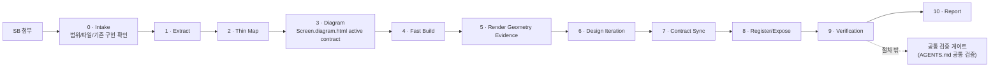

# Screen Generation Flow

SB가 첨부됐을 때 스크린을 생성하는 절차 계약이다. 이 문서는 **언제 / 무엇을 / 어떤 문서를 보고** 만드는지만 정의한다. 구조 원칙·패턴·layout/spacing contract·foundation·검증의 내용은 각 참고 문서가 단독 소유하며, 이 문서는 가리키기만 한다(재서술 금지).

SB 기반 신규 생성 절차에서는 Figma SOT를 필수 대조 대상으로 삼지 않는다. Figma SOT는 실제 페이지 재현 또는 시각 기준 확인이 명시된 작업에서만 참조한다.

절차의 기본 책임 단위는 빠른 반복 workflow다. SB 수신형 제작에서는 Intake → Extract → Thin Map → Diagram → Fast Build → Render Geometry Evidence → Design Iteration → Contract Sync → Register/Expose → Verification → Report 순서로 운영한다. 이 순서는 단계를 별도 묶음으로 다시 나누지 않고, 얇은 계약을 빠르게 렌더링한 뒤 실제 geometry evidence로 디자인을 반복하는 공식 workflow다.

각 step은 단일 책임, 고정 참고 문서, 고정 산출물, 완료조건(DoD)을 가진다. DoD는 검증이 아니라 "이 산출물이 내적으로 완성되어 다음 step으로 넘어갈 수 있는가"의 자체 판단 기준이다. 검증 명령은 DoD가 아니다.

> **검증 명령은 제작 step이 아니다.** 실행 명령과 그 책임은 `AGENTS.md` 의 `## 공통 검증` 섹션이 단독 소유하는 절차 밖 게이트다.

> **레이아웃 보존은 스크린 생성의 최우선 디자인 게이트다.** 정책 충실도는 무엇을 보여줄지 결정하고, 디자인 시스템은 어떻게 표현할지 제한하지만, Diagram/Fast Build 이후의 메인 에이전트 승인은 먼저 SB/wire reference/Diagram의 핵심 레이아웃이 보존됐는지 확인해야 한다. 레이아웃 보존을 해치는 정책 copy, component 선택, spacing 보정, 신규 OGN은 통과하지 않는다.

## 0-10 운영 순서

| Step | 책임 | 공개/산출물 | 다음 단계 진입 조건 |
|---:|---|---|---|
| **0 · Intake** | 입력 파일과 작업 범위의 존재성을 확인한다. | `Intake Summary` | target screen, screen spec, OGN spec, 기존 구현 여부가 확인됨 |
| **1 · Extract** | SB에 적힌 화면/OGN 사실만 추출한다. | `Extract Summary` | screenId, OGN list, state, CTA, transition/case branch가 목록화됨 |
| **2 · Thin Map** | policy-core coverage를 먼저 판정하고, 구현에 필요한 최소 정책/sourceRef/governance/copy 근거만 얇게 확정한다. | `Policy Coverage Matrix`, thin `Screen.map.md` | green 또는 승인된 yellow 요구만 policy/governance/copy와 연결됨. 결손은 missing/blocked로 종료됨 |
| **3 · Diagram** | `Screen.diagram.html`에 wire reference, section/slot/OGN boundary, layoutContract, componentCandidates의 최소 구현 계약을 먼저 고정한다. | thin `Screen.diagram.html`, Design Pattern Review Gate result | active contract인 `Screen.diagram.html`에 build 가능한 section contract와 distortion gate가 있고, 1차 draft 이후 `DESIGN_PATTERNS.md` 검수 결과가 기록됨 |
| **4 · Fast Build** | thin map/diagram을 바로 코드화해 렌더 가능한 화면을 만든다. | `Screen.tsx`, organisms, `Screen.config.ts`, route draft | 화면이 preview/mobile에서 렌더되고 diagram의 필수 OGN/slot이 존재함 |
| **5 · Render Geometry Evidence** | 실제 렌더에서 layout 보존을 숫자와 위치 관계로 확인한다. | bounding box/viewport/rail overlap evidence, optional screenshot | Header/Content/Bottom rail, CTA, 주요 section의 상대 위치와 overflow/overlap 여부가 기록됨 |
| **6 · Design Iteration** | geometry evidence로 확인된 distortion을 component choice, layout owner, contract 부족 중 어디서 고칠지 결정하고 반복 수정한다. | iteration notes, updated code | overlap, clipping, rail drift, 과도한 gap, text wrapping distortion이 해소되거나 deviation으로 기록됨 |
| **7 · Contract Sync** | 반복 결과를 `Screen.map.md`, `Screen.diagram.html`, `Screen.config.ts`에 되돌려 계약과 구현을 일치시킨다. | synced map/diagram/config | 구현된 OGN/policyRefs/governanceRefs/layout decisions가 active contracts와 불일치하지 않음 |
| **8 · Register/Expose** | route catalog와 preview/mobile 노출을 `Screen.config.ts`와 일치시킨다. | route/preview exposure result | route registry와 preview 노출이 같은 screen ID/route를 가리킴 |
| **9 · Verification** | AGENTS.md가 소유한 공통 검증 게이트와 필요한 route/preview 확인을 수행한다. | verification result summary | 실행한 검증과 결과가 요약되고 실패는 자동 재작업 또는 사용자 gate로 분류됨 |
| **10 · Report** | 사용한 source, 결정, reject, geometry evidence, 검증, 남은 위험을 보고한다. | `Final Report` | 변경 범위와 판단 근거를 추적할 수 있음 |

구현 전 반드시 공개해야 하는 체크포인트:

```txt
1. Extract 결과
2. Thin Map coverage/result
3. Diagram contract
4. Fast Build scope
```

이 체크포인트는 긴 회의록이 아니라 다음 위험을 구현 전에 잡기 위한 사용자 검토 지점이다: 정책 결손, 잘못된 reference 선택, OGN boundary 오류, 패턴과 맞지 않는 component 후보, raw CSS나 route-level layout patch, 예상 밖 파일 수정.

## 기본 실행 모드

화면 생성 요청의 기본 모드는 **autonomous continuous execution**이다. 사용자가 특정 step까지만 하라고 제한하지 않는 한, 메인 에이전트는 Step 0 Intake부터 Step 10 Report까지 멈추지 않고 진행한다. 각 step 사이에는 메인/서브 내부 승인 gate를 사용하며, 사용자에게 매번 "다음 step 진행" 승인을 요구하지 않는다.

사용자 승인 gate와 내부 승인 gate는 분리한다.

| Gate | 승인 주체 | 쓰임 |
|---|---|---|
| 사용자 승인 gate | 사용자 | 공개 체크포인트 승인, 작업 범위, 정책 결손 처리, legacy reference 사용, 신규 component/variant/slot 추가, 큰 구조 변경, 자동 수정 불가 검증 실패 |
| 내부 승인 gate | 메인 에이전트 | Extract/Map/Diagram/Build/Register 산출물의 DoD 통과와 다음 step 진입 |

메인 에이전트는 다음 경우에만 진행을 멈추고 사용자 확인을 요청한다.

- `policy-core`에 없는 정책을 보강해야 하거나, SB-only 근거로 실제 구현을 확정해야 하는 경우
- SB와 `policy-core`가 충돌해 화면 요구, copy, CTA, 분기, 상태 처리가 달라지는 경우
- reference 우선순위를 벗어나 legacy 화면을 기준 reference로 써야 할 가능성이 생긴 경우
- 기존 component vocabulary로 layoutContract를 만족할 수 없어 신규 component/variant/slot이 필요한 경우
- Diagram contract를 만족하는 구현 후보가 없고 CSS 보정 없이 해결할 수 없는 경우
- 사용자가 명시하지 않은 파일 삭제, route/group 재구성, 공용 package 변경이 필요한 경우
- 검증 실패가 해당 step의 자동 재작업 범위를 넘는 경우

위 항목에 해당하지 않는 일반 step 전환은 메인 에이전트가 내부 승인 gate로 처리한다. 단, 공개 체크포인트는 생략하지 않는다.

단, 구현 전 공개 체크포인트 중 **Thin Map**, **Diagram**, **Fast Build scope**는 사용자 지시를 받는 gate다. 메인 에이전트는 이 세 항목을 공개한 뒤 구현을 시작하지 말고 사용자의 승인/수정/중단 지시를 기다린다. `Extract 결과`는 진행 로그로 공개하되, 사용자가 초기 추출 검토를 요청했거나 결손이 다음 step을 막는 경우에만 사용자 승인 gate로 격상한다.

서브 에이전트에게 구현을 위임할 때도 이 네 지점은 생략하지 않는다. 긴 설명 대신 아래 짧은 형식으로 공개하면 충분하다.

```txt
Thin Map
- coverage:
- mapped policy/governance refs:
- blocked/missing:

Diagram
- active contract: Screen.diagram.html
- wire/reference:
- OGN boundary/component candidates:
- layout risk:

Fast Build Scope
- worker:
- write scope:
- no-touch:
- approval checks:
```

메인 에이전트는 하위 에이전트의 완료 보고를 그대로 승인하지 않는다. 승인 전에 반드시 `git diff --stat`, scoped diff, AGENTS.md 공통 검증 결과, 그리고 실제 렌더의 geometry evidence를 확인한다.

## 문서 라우팅

문서는 SOT이고, 스킬은 실행자다. 스킬이 문서 역할 분리의 유일한 출처가 되면 repo 밖에서 절차가 drift 되므로, step별로 읽어야 할 문서는 이 표가 소유한다.

| Step | 반드시 읽는 문서/입력 | 읽지 않는 것 |
|---|---|---|
| **0 · Intake** | SB input, `AGENTS.md`, 기존 target route/organism 파일, `git status` | 디자인 판단 |
| **1 · Extract** | SB `screen/*.md`, SB `organism/*.md` | policy-core, 디자인 문서 |
| **2 · Thin Map** | `packages/policy-core/policies/**/*.md`, `packages/policy-core/policies/**/*.policy.ts`, `packages/policy-core/governance/**/*.md` | `DESIGN_PATTERNS.md`, `DESIGN_FOUNDATION.md` |
| **3 · Diagram** | thin `Screen.map.md`, `DESIGN_PATTERNS.md`, `DESIGN_FOUNDATION.md`, `SCREEN_STRUCTURE_PRINCIPLES.md`, `apps/mobile/src/screen-diagrams/`, nearby `Screen.diagram.html`, `cx-example`; 기존 `Screen.diagram.md`는 migration source/reference로 보존하며 HTML 이관 시 Screen Wire와 표시 copy를 빠짐없이 대조 | 구현 코드 변경 |
| **4 · Fast Build** | `Screen.map.md`, `Screen.diagram.html`, `DESIGN_FOUNDATION.md`, existing route/organism files, `@pxds/cx-components`, `@pxds/cx-layout`, `@pxds/cx-icons`, `git status` | 새로운 정책 해석, 새 reference/pattern 판단 |
| **5 · Render Geometry Evidence** | 렌더된 preview/mobile, `Screen.diagram.html` Distortion Gates, viewport/bounding box/rail position data | screenshot-only 승인 |
| **6 · Design Iteration** | geometry evidence, `Screen.diagram.html`, `DESIGN_PATTERNS.md`, `DESIGN_FOUNDATION.md`, 구현 diff | 계약 없는 raw CSS 보정 |
| **7 · Contract Sync** | 구현 diff, `Screen.map.md`, `Screen.diagram.html`, `Screen.config.ts` | 구현과 다른 계약 방치 |
| **8 · Register/Expose** | `Screen.config.ts`, `Screen.tsx`, route catalog, preview/mobile exposure | 다른 screen ID/route로 노출 |
| **9 · Verification** | `AGENTS.md` 공통 검증, route/preview 노출 상태, geometry evidence summary | 검증 명령 재정의 |
| **10 · Report** | 작업 로그, 사용 source, 결정/reject 기록, geometry evidence, 검증 결과 | 숨겨진 내부 판단 |

`DESIGN_PATTERNS.md`는 Step 3 Diagram에서 화면 구조와 pattern/layout contract를 결정하고, `DESIGN_FOUNDATION.md`는 Step 3에서 제약을 확인한 뒤 Step 4-7에서 token·typography·spacing·radius 위반을 차단한다. Step 5 이후에는 스크린샷 자체가 아니라 렌더된 요소의 geometry evidence를 기준으로 distortion을 판단하고, Step 7 Contract Sync에서 실제 구현 결과를 `Screen.diagram.html` active contract로 되돌려 맞춘다. Step 2는 정책 의미가 디자인 표현에 의해 미리 걸러지지 않도록 디자인 문서를 읽지 않는다.

## Step 0-2 경량 라우팅 규칙

Step 0-2는 설계가 아니라 **분류와 라우팅**이다. 이 구간에서 구현 판단, reference 판단, layout 판단, component 후보 판단, legacy 비교를 시작하지 않는다.

| Step | 해야 하는 일 | 하지 않는 일 |
|---|---|---|
| **0 · Intake** | SB path, `screen/*.md`, `organism/*.md`, target route/group, 기존 구현 존재 여부, dirty worktree 범위 확인 | 정책 의미 해석, 디자인 문서 읽기, legacy 구현 분석 |
| **1 · Extract** | SB에 적힌 screen/OGN/transition/case/policy ref를 표로 추출 | OGN 경계 재설계, copy 개선, validation 추론, component/API 후보 선정 |
| **2A · Coverage Map** | SB policy ID와 `policy-core` 존재 여부 대조, screen/OGN별 `green`/`yellow`/`red` 판정 | 없는 정책 복원, SB-only 요구를 정책처럼 확정, governance/copy 매트릭스 작성 |
| **2B · Thin Map** | `green` 또는 사용자 승인된 `yellow` 요구만 얇은 `Screen.map.md` 수준으로 확장 | `red` 요구를 추정으로 채우기, 디자인 문서로 정책 결손 우회 |

Step 2는 Coverage Map을 먼저 통과해야 한다. Coverage 결과가 `red`인 screen/OGN은 `Screen.map.md`를 작성하지 않고 `missingPolicyIds`, `blockedReason`, `neededDecision`만 남긴다. `yellow`는 부분 정책 근거와 SB-only 범위를 분리해 표시하고, 실제 구현 근거로 사용할지는 사용자 승인 gate로 올린다. `green`만 Thin Map으로 들어간다.

Step 0-2 산출물은 표와 ID 목록 중심이어야 한다. 긴 narrative, 화면별 UX 해석, OGN별 설계 설명, pattern 비교는 Step 3 이후로 미룬다. 하위 에이전트가 이 구간에서 긴 리포트를 작성하면 메인 에이전트는 요약하지 말고 재작업시킨다.

## 레이아웃 책임

레이아웃은 Fast Build에서 즉흥적으로 맞추지 않는다. 얇은 계약을 먼저 렌더하고, 실제 geometry evidence로 반복한다.

```txt
Diagram
- 기준 레이아웃 / OGN boundary / componentCandidates 선택

Fast Build
- layout owner를 코드에 반영해 렌더 가능한 화면 제작

Render Geometry Evidence
- bounding box / viewport / rail / overlap 수치와 위치 관계 기록

Design Iteration
- distortion 원인을 component choice / layout owner / contract 부족으로 분류하고 수정

Contract Sync
- 구현 결과를 Screen.diagram.html active contract와 config/map에 반영

Verification
- AGENTS.md 공통 검증과 route/preview 확인
```

실제 렌더 확인은 텍스트 존재 여부만으로 끝내지 않는다. 상위 승인 gate는 최소한 다음 중 하나를 남긴다.

- Playwright/Browser bounding box 검사
- Header / Content / Bottom rail의 상대 위치 검사
- CTA가 viewport 밖으로 밀리거나 content와 겹치지 않는지 검사
- viewport별 overflow, clipping, text wrapping 검사

작고 단순한 문서-only 변경이 아니면, Completion/Form/Detail 같은 화면 패턴 변경은 bounding box, viewport coordinates, rail overlap 여부 같은 geometry evidence를 포함해야 한다. screenshot은 보조 evidence로 선택할 수 있지만 필수 계약은 아니다.

소유권:

| Owner | 책임 |
|---|---|
| `Screen.tsx` | `AppScreen` rails, SystemHeader/Header/Content/Bottom slot 조립 |
| OGN organism | 정책 의미가 있는 body composition과 section 내부 구조 |
| `@pxds/cx-layout` | PageStackContents, FieldStack, bottom fixed rail, content rail/padding |
| `@pxds/cx-components` | card 내부 padding, row alignment, button internal alignment, component state visuals |

구현 중 정렬이 안 맞으면 CSS 보정 문제가 아니라 후보 선택 실패, Diagram layoutContract 부족, pattern reference 선택 오류, component vocabulary gap 중 하나로 본다. 이 경우 필요한 단계로 되돌아간다.

## 책임 묶음 계약

0-10 단계는 아래 책임 묶음으로 관리한다. 이 표는 추적성을 위한 묶음이며, 실제 실행 순서는 위 0-10 운영 순서가 소유한다.

| 묶음 | 포함 단계 | 책임 | 산출물 | 완료조건 (DoD) |
|---|---|---|---|---|
| **Extract** | Step 1 | SB → 화면ID·도메인·과업·상태·CTA·정책태그·OGN ID·slot/part/hierarchy 추출 | 추출 요약 | 화면ID·도메인·OGN ID·정책태그 누락 0으로 목록화 |
| **Thin Map** | Step 2 | policy-core coverage 판정 후 `green` 또는 승인된 `yellow` 요구만 정책/sourceRef/governance/copy 근거로 확정 | `Policy Coverage Matrix`, thin `Screen.map.md` | 결손은 missing/blocked로 종료되고, 진행 요구만 policy/governance/copy와 연결됨 |
| **Diagram** | Step 3 | `Screen.diagram.html`에 Fast Build 가능한 최소 구조 계약 작성 후 `DESIGN_PATTERNS.md` 기준으로 1차 draft를 재검수 | thin `Screen.diagram.html`, pattern recheck result | `lifecycle: "thin"` 계약이 있고 section/OGN/layoutContract/componentCandidates/Distortion Gates가 build 가능한 수준으로 존재하며 `patternRecheck`가 기록됨 |
| **Fast Iteration Build** | Step 4-7 | 렌더 가능한 구현 작성 → geometry evidence 수집 → design iteration → contract sync | `Screen.tsx`, organisms, `Screen.config.ts`, render evidence, synced contracts | geometry evidence로 layout 보존이 확인되고 `Screen.diagram.html`이 `lifecycle: "synced"` 계약으로 최종 구현과 일치 |
| **Register/Verify** | Step 8-9 | route/preview 노출 확인과 공통 검증 게이트 실행 결과 정리 | route/preview 노출 결과, verification summary | route/config/preview가 같은 screen ID/route를 가리키고 검증 결과가 기록됨 |

검증 명령 실행과 책임은 절차 밖의 공통 검증 게이트인 `AGENTS.md`가 단독 소유한다.

## 운영 스킬

Codex 화면 생성 작업은 아래 `cx-*` 스킬을 사용해 step별 절차를 고정한다. 스킬은 작업 실행 가이드이고, 이 문서와 각 SOT 문서가 절차/판단의 최종 기준이다.

프로젝트 로컬 스킬은 `.codex/skills/` 아래에 둔다. Diagram 작업의 로컬 스킬 SOT는 `.codex/skills/cx-screen-diagram/SKILL.md`다. `Screen.diagram.html`가 active contract이며, 기존 `Screen.diagram.md`는 migration source/reference로 보존한다.

| Stage | Skill | 역할 |
|---|---|---|
| 전체 관리 | `cx-screen-create` | 전체 workflow를 오케스트레이션하고 gate를 승인한다. |
| Audit | `cx-screen-audit` | Map/Diagram/config/implementation/route 정합성을 read-only로 점검한다. |
| Extract | `cx-screen-extract` | SB/첨부에서 화면·OGN 사실을 추출한다. |
| Thin Map | `cx-screen-map` | policy-core/governance를 얇은 `Screen.map.md` 요구로 번역한다. |
| Diagram | `cx-screen-diagram`, `cx-screen-thin-diagram` | `Screen.diagram.html`의 최소 구조 계약을 작성/수정한다. |
| Fast Build | `cx-screen-build`, `cx-screen-fast-build` | 승인된 Map/Diagram만 코드화해 렌더 가능한 화면을 만든다. |
| Render Geometry Evidence | `cx-screen-render-evidence` | bounding box/viewport/scroll/overlap 기반 geometry evidence를 수집한다. |
| Design Iteration | `cx-screen-design-iterate` | evidence 기반 layout/component/spacing 문제를 계약 보존 방식으로 반복 수정한다. |
| Contract Sync | `cx-screen-contract-sync` | 구현 결과를 `Screen.map.md`, `Screen.diagram.html`, `Screen.config.ts`와 동기화한다. |
| Register/Verify | `cx-screen-register-verify` | route catalog/preview 노출 확인과 공통 검증 결과 보고를 수행한다. |

작업자가 스킬을 사용할 수 없는 환경이면 같은 이름의 step 규칙을 이 문서와 관련 SOT에서 직접 따른다. Step 3에서 `cx-screen-diagram`을 건너뛰지 않는다.

## Step Flow



## 멀티 화면 배치 실행

여러 화면이 한 번에 요청되면 기본 실행 단위는 page end-to-end가 아니라 **step batch**다. 메인 에이전트는 먼저 전체 화면 inventory를 만들고, 같은 step 안에서 화면별 산출물을 병렬 생성한 뒤, 전체 화면 세트의 step gate를 승인해야 다음 step으로 넘어간다.

- Step 1/2/3은 화면별 병렬 실행을 기본으로 한다. 각 step이 끝날 때 메인 에이전트가 화면 누락, 정책·governance 일관성, wire semantics, layoutContract, componentCandidates fit 근거를 통합 검수한다.
- Step 4 Build는 승인된 `Screen.map.md`와 `Screen.diagram.html`가 있고, Step 3의 Section Contracts에 OGN boundary/reuse/new/extend 결정이 기록된 화면만 병렬 실행한다. 공용 organism/component를 수정하는 작업은 파일 소유 범위를 나눠 충돌을 방지한다.
- Step 8/9 Register/Verify는 메인 에이전트가 통합 수행하거나 통합 승인한다. route catalog, preview 노출, 공통 검증은 화면별 완료 표시로 대체하지 않는다.
- 단일 화면 요청 또는 명확히 독립적인 단순 proof/detail 화면만 page end-to-end 위임할 수 있다. 멀티 화면 배치에서 page end-to-end 위임이 필요하면 예외 사유와 메인 gate 위치를 작업 로그에 남긴다.

## 에이전트 역할 모델

메인 에이전트는 전체 workflow의 방향과 최종 정합성을 소유하고, 서브 에이전트는 위임받은 step 산출물을 만든다. Diagram/Fast Build 이후에는 레이아웃 보존을 최우선 승인 기준으로 삼고, 그 다음 정책 의미와 디자인 시스템 준수를 확인한다. 메인 에이전트의 검수는 다음 step 진입을 승인하거나 반려하는 gate이며, 산출물 요약으로 대체하지 않는다.

상세 위임/점검 방식은 `docs/screen-generation-agent-model.md`를 참조한다.

## Step별 책임

### Step 1 · Extract

- 책임: SB에서 화면 ID, 도메인, 과업, 상태, CTA, 정책 태그, 도메인 모듈 ID, OGN ID, part/slot/hierarchy를 추출한다.
- 참고: SB(입력)
- 산출: 추출 요약(Step 2 입력)
- DoD: 화면ID·도메인·OGN ID·정책태그가 누락 0으로 목록화된다.

### Step 2 · Map

- 책임: 먼저 SB가 참조한 policy ID가 `policy-core`에 존재하는지 coverage를 판정한다. 그 다음 `green` 또는 사용자 승인된 `yellow` 요구만 정책 필수정보·선택지·제약·에러·sourceRef를 화면 요구 매트릭스로 정리하고, 사용자에게 보여줄 copy를 분리한 뒤 적용 가능한 governance refs를 선정한다.
- 참고: `packages/policy-core/policies/**/*.md`, `packages/policy-core/policies/**/*.policy.ts`, `packages/policy-core/governance/**/*.md`
- 산출: `Policy Coverage Matrix`, `Screen.map.md` — coverage는 진행 가능성을 판정하고, map은 정책-화면 요구사항 매트릭스를 영구 기록한다.
- DoD: Coverage Matrix에 screen/OGN별 present/missing policy ID와 `green`/`yellow`/`red` 판정이 있다. `green` 또는 사용자 승인된 `yellow` 요구만 화면 정보/CTA/에러로 매핑되고, 관련 `UXP`/`UXPT`/`VOT` refs가 선정된다. 정책 필수 정보 또는 필요한 governance refs가 누락된 `red` 요구는 Step 3로 진입하지 않는다.
- Coverage Map과 Thin Map을 섞지 않는다. policy ID 존재 여부가 확인되기 전에는 copy/governance/sourceRef 매트릭스를 작성하지 않는다.
- `policy-core`에 없는 정책은 SB 문장으로 복원하지 않는다. 빠르게 `missingPolicyIds`, `blockedReason`, `neededDecision`으로 기록한다. 정책 backfill이 필요하면 사용자 승인 gate로 올리고, 그 전에는 구현 요구로 확정하지 않는다.
- Governance 확인 시점은 Step 2다. 도메인 정책 매핑 직후 CTA, 상태, 에러/로딩/복구, navigation, writing tone에 영향을 주는 `UXP`/`UXPT`/`VOT` 항목을 `Screen.map.md`에 기록한다.
- 기록 항목: `governanceRefs`, `selectionReason`, `affectedRequirement`, `copy/state/CTA impact`, `notApplicableReason`(검토했지만 적용하지 않는 경우).
- 이 step은 디자인 문서를 참조하지 않는다. 정책 충실도와 UX governance 적용 대상(무엇을 지켜야 하는가)이 디자인 표현(어떻게)에 의해 미리 걸러지지 않도록 의도적으로 분리한다.

### Step 3 · Diagram

- 책임: Step 2 Thin Map 완료 후 `apps/mobile/src/screen-diagrams/` 와 기존 `Screen.diagram.html` 에서 유사 wire reference를 찾고, Fast Build를 시작할 수 있는 최소 구조 계약을 `Screen.diagram.html`에 기록한다. 최소 계약은 pattern family, wire/reference, AppScreen rails, section order, OGN/structural-only boundary, layoutContract, initial componentCandidates, known layout risks, Distortion Gates다.
- 참고: `apps/mobile/src/screen-diagrams/`, 기존 화면 `Screen.diagram.html`, `DESIGN_PATTERNS.md`, `SCREEN_STRUCTURE_PRINCIPLES.md`, Step 2에서 선정한 `UXP`/`UXPT`/`VOT` refs
- 산출: `Screen.diagram.html` — **모든 화면 의무다.** 신규/기존 구분 없이 모든 화면이 이 산출물을 가진다.
- DoD: `Screen.diagram.html`이 `lifecycle: "thin"` 상태로 build 가능한 계약을 담고, visible DOM과 hidden `#diagram-contract`가 같은 section ID/OGN ID/pattern role을 공유한다. 각 section은 최소 `ognBoundaryDecision`, `layoutContract`, `componentCandidates`, known risk를 가진다. 1차 Diagram draft 이후 `DESIGN_PATTERNS.md`를 다시 열어 Design Pattern Review Gate를 수행하고, `diagram-contract.screenContract.patternRecheck`에 `source`, `result`, `reason`, `changes`를 기록해야 Build로 넘어갈 수 있다.
- 메인 에이전트 디자인 검수는 레이아웃 보존을 최우선으로 한다. SB/wire reference의 핵심 레이아웃, section 경계, slot 위치, CTA/navigation/notice/form field의 위치 관계, scroll/fixed 영역의 역할이 보존되지 않으면 정책·copy·component 판단이 맞아도 승인하지 않는다.
- Pattern Analysis Gate는 Step 3의 필수 선행 판단이다. 각 section에서 `sectionBoundary`, `fieldGrouping`, `rowSeparators`, `actionPlacement`, `typography`, `patternEvidence`, `patternDecision`을 확인하고 `Screen.diagram.html`의 `Section Contracts`에 기록한다. 실제 reference에 있는 contents divider, section divider band, row separator, field action slot을 단순 spacing gap이나 외부 버튼으로 대체하지 않는다. 선택 리스트와 row pattern은 `rowTitle`, `rowCaption`, `emphasisRule`, `controlLabelScale`까지 확인해 텍스트 위계 distortion을 막는다.
- Design Pattern Review Gate는 1차 Diagram draft 작성 직후, Build 계획 전에 반드시 수행한다. `DESIGN_PATTERNS.md`의 해당 pattern family와 layout/spacing contract를 draft Screen Wire에 대조해 section boundary, divider, CTA placement, content density, field/list/card grouping, state 표현이 맞는지 확인한다. 불일치가 있으면 `Screen.diagram.html`을 먼저 수정하고, 코드로 보정하지 않는다.
- OGN boundary/reuse/new/extend 결정은 Step 3의 책임이다. Map 이후 reference pattern을 확인하고 Pattern Analysis Gate를 통과한 다음, Build에 들어가기 전에 각 Section Contract에 `ognBoundaryDecision`으로 `reuse`/`extend`/`new`/`structural-only` 중 하나와 근거를 기록한다. 이 결정은 어떤 정책 OGN을 기존 organism으로 재사용할지, 어느 organism을 확장할지, 새 OGN을 만들지, 구조 전용 section으로 둘지를 확정하는 계약이다.
- 정책 정보 추가로 레이아웃이 늘어질 위험이 있으면 `Screen.diagram.html`에 접기, 분리, 우선순위 조정, 별도 state 처리 같은 layout preservation decision을 남긴다.
- 컴포넌트 후보는 `componentCandidates`로 나열하되, 후보명 자체를 승인 기준으로 삼지 않는다. Fast Build는 이 후보를 capability 기준으로 평가해 layoutContract를 가장 적은 왜곡으로 만족하는 구현을 선택한다.
- 이 step은 governance를 새로 탐색하지 않는다. Step 2에서 선정된 governance refs를 CTA hierarchy, button label, state handling, error/empty/loading treatment, navigation, writing tone 검증 기준으로 적용한다.
- 기록 항목: `appliedGovernanceRefs`, `sectionId`, `layoutOrStateDecision`, `copyDecision`, `CTA hierarchy/label decision`, `distortionRisk mitigated by governance`.
- Wire reference는 시각 구조와 밀도(AppScreen rail, section boundary, card/list/form/CTA placement, divider 사용)만 참고한다. `reference-only`, `unknown-from-figma-only/TBD`, `unknown/unregistered-from-figma` 값은 policy ID, OGN ID, route 계약, copy 근거로 승격하지 않는다.
- Diagram 작성 규칙, OGN별 layoutStrategy 형식, Layout Distortion Gate, 금지 신호, 설계 체크리스트의 상세는 `SCREEN_STRUCTURE_PRINCIPLES.md` 가 단독 소유한다. 이 문서는 그 규칙을 재서술하지 않고 그 문서를 따른다.

### Step 4-7 · Fast Build / Evidence / Iteration / Contract Sync

- 책임: Diagram의 `ognBoundaryDecision`과 layoutContract를 코드화해 첫 렌더 가능한 화면을 만든다. 이후 실제 렌더의 geometry evidence를 수집하고, pattern/reference/spacing-density-hierarchy pass로 디자인을 반복 개선한 뒤, 최종 구현을 `Screen.map.md`, `Screen.diagram.html`, `Screen.config.ts`에 동기화한다.
- 참고: `DESIGN_FOUNDATION.md`, `@pxds/cx-components`, `@pxds/cx-icons`, `@pxds/cx-tokens`, `@pxds/cx-layout`. `@pxds/pxds-components` / `@pxds/pxds-icons` 는 deprecated 호환 경계로만 다룬다.
- 산출: `apps/mobile/src/organisms/<route-group-or-domain>/<ogn>/`, `Screen.tsx`, `Screen.config.ts`
- DoD: Diagram의 모든 OGN/슬롯이 코드에 존재하고, 각 OGN 구현이 Step 3의 `ognBoundaryDecision`과 layoutContract를 보존한다. Render Geometry Evidence에는 viewport, Header/Content/Bottom/CTA bounding box, scroll/client height, overlap/overflow 여부, 주요 policy-bearing text 존재가 기록된다. Contract Sync 후 `Screen.diagram.html`은 `lifecycle: "synced"`와 `renderEvidence`, `iterationPasses`, `contractSync`를 가진다.
- 메인 에이전트 구현 검수는 실제 렌더링에서 레이아웃 보존 여부를 먼저 본다. `Screen.diagram.html`의 section/slot/stack 배치, 하단 CTA/fixed 영역, scroll/content 영역, 모바일 viewport 줄바꿈, overflow, 겹침, 과도한 여백을 geometry evidence로 확인한다. Screenshot/capture artifact는 보조 증거이며 필수 계약이 아니다.
- Component Spacing Review는 `Screen.tsx` 제작 완료 이후 Render Geometry Evidence/Design Iteration으로 넘어가기 전에 한 번 수행한다. section과 section 사이, OGN과 OGN 사이, Content와 Bottom rail 사이, Header/Content 시작 간격, component 내부 padding과 외부 gap의 책임 경계가 `DESIGN_PATTERNS.md`, `DESIGN_FOUNDATION.md`, `Screen.diagram.html`의 layoutContract와 맞는지 확인하고 작업 로그 또는 `Screen.config.ts generation.buildSelections` 지원 필드에 결과를 남긴다.
- Build는 후보 컴포넌트의 이름 일치가 아니라 layoutContract와 Distortion Gates 충족을 기준으로 선택한다. 모든 후보가 distortion을 만들면 이름이 적힌 후보를 억지로 쓰지 않고 재사용 가능한 organism/component 후보를 만들거나 Diagram으로 되돌린다.
- Build는 OGN 경계, 재사용, 신규 제작, 확장 여부를 새로 발명하지 않는다. Step 3 Section Contracts의 `ognBoundaryDecision`을 구현하고, 구현 중 결정이 맞지 않음이 드러나면 Build에서 임의 변경하지 않고 Diagram으로 되돌려 계약을 갱신한다.
- route/screen/organism은 raw margin, padding, fontSize, color로 레이아웃을 억지 보정하지 않는다. layout primitive와 foundation token으로 보존할 수 없는 경우 임의 구현하지 않고 `deviationReason` 또는 component vocabulary 보강 후보로 기록한다.
- 기록 항목: `Screen.config.ts generation.governanceRefs`(지원 시), 또는 구현 PR/작업 로그에 `implementedGovernanceRefs`, `diagramSection`, `component/organism owner`, `deviationReason`(diagram과 다를 때)을 남긴다. Build 단계에서 새 governance 해석을 추가하지 않는다.

### Step 8-9 · Register / Verify

- 책임: `apps/mobile/src/scripts/screen-routes/routes.ts` 에 화면을 등록하고, preview/mobile에서 해당 route가 노출되는지 확인한다. 검증 명령 실행 책임은 `AGENTS.md` 공통 검증이 소유하며, 이 step은 실행 결과와 남은 위험을 Report로 넘긴다.
- 참고: `apps/mobile/src/scripts/screen-routes/`
- 산출: `routes.ts` 등록 항목
- DoD: route catalog가 화면 디렉터리를 참조하고, preview iframe에서 해당 route로 진입할 수 있다.

## 생성 산출물 계약

Step 2 coverage를 통과해 구현 대상으로 승인된 SB 기반 화면 폴더는 다음 산출물을 가진다. `Screen.map.md` 와 `Screen.diagram.html` 는 **구현 진행 화면의 의무 산출물**이다. Coverage가 `red`로 blocked 된 화면은 화면 폴더를 만들지 않고 Coverage Matrix에 `missingPolicyIds`, `blockedReason`, `neededDecision`을 남긴다.

```txt
apps/mobile/src/app/(<route-group>)/<screen-id>/
├── Screen.tsx
├── Screen.config.ts
├── Screen.map.md
├── Screen.diagram.html
├── page.tsx
└── index.ts
```

`Screen.config.ts` 는 route 등록 정보와 생성 근거(`generation`)를 함께 담는 단일 계약이다. `Screen.meta.json` 같은 별도 meta 파일을 만들지 않는다.

`Screen.map.md` 는 Step 2의 정책-화면 요구사항 매트릭스와 적용 governance refs를 담는다. 최소한 화면 ID, 정책 태그/정책 ID, sourceRef, 필수 정보, 선택지, 제약, 에러, 사용자 copy, 관련 `UXP`/`UXPT`/`VOT` refs, 연결될 OGN ID 또는 미결정 사유를 포함해야 한다. 이 파일은 디자인 판단을 담지 않고, Step 3의 `Screen.diagram.html` 가 참조하는 정책 충실도와 governance 적용 근거가 된다.

### Governance 기록 계약

Step 2 이후 산출물은 governance 확인 결과를 아래처럼 이어 받아야 한다.

- `Screen.map.md`: 선정/비선정 근거를 기록한다. `governanceRefs`, `selectionReason`, `affectedRequirement`, `copy/state/CTA impact`, `notApplicableReason`을 남긴다.
- `Screen.diagram.html`: 선정된 refs의 적용 결과를 기록한다. `appliedGovernanceRefs`, `sectionId`, `layoutOrStateDecision`, `copyDecision`, `CTA hierarchy/label decision`, `distortionRisk mitigated by governance`를 남긴다.
- `Screen.config.ts`: 기계 검증 필드가 준비된 경우 `generation.governanceRefs`에 최소 ID 색인을 둔다. 필드가 없으면 config에 임의 필드를 추가하지 않고 PR/작업 로그에 구현 refs를 남긴다.
- `Screen.tsx`/organisms: governance 문서를 직접 재해석하지 않는다. `Screen.diagram.html`에 기록된 section/decision을 코드화한다.

### 산출물 책임 분리

| File | 책임 | 핵심 질문 | 담지 않는 것 |
| --- | --- | --- | --- |
| `Screen.map.md` | 정책 요구와 governance refs를 화면 요구로 번역하는 Step 2 SOT | 무엇이 왜 화면에 있어야 하고, 어떤 UX/writing/state 규칙을 지켜야 하는가? | layoutStrategy, spacing, componentCandidates, AppScreen slot 구조, route 등록 정보 |
| `Screen.diagram.html` | 화면 구조와 layout/governance/wire reference 적용 판단, OGN boundary/reuse/new/extend 계약을 기록하는 Step 3 SOT | 그 요구를 어떤 시각 reference와 구조로 조립하고, 선정된 governance를 어떻게 반영하며, 각 OGN을 재사용/확장/신규/구조 전용 중 무엇으로 다룰 것인가? | 정책 원문/sourceRef 상세 매트릭스, route catalog metadata, `createdAt`/`owner`/`status` |
| `Screen.config.ts` | route 등록과 생성 메타데이터를 담는 기계 계약 | 이 화면을 시스템이 어떻게 식별·노출·검증하는가? | 정책 요구 설명, 사용자 copy 전체, layoutStrategy, Screen Wire, 미결정 질문 |

흐름은 `Policy/SB → Screen.map.md → Screen.diagram.html → Screen.tsx/organisms → Screen.config.ts` 순서다. `Screen.config.ts` 는 map과 diagram의 내용을 재서술하지 않고, `policyRefs` 와 `ognIds` 같은 검증 가능한 최소 ID 색인만 가진다.

정합성 규칙:

- `Screen.map.md`, `Screen.diagram.html`, `Screen.config.ts`, 구현이 policy-core 정책 원문/정의와 불일치하면 policy-core를 우선하고 다른 산출물을 수정한다.
- `Screen.config.ts` 의 `generation.policyRefs` 는 `Screen.map.md` 에 등장해야 한다.
- `Screen.config.ts` 의 `generation.ognIds` 는 `Screen.map.md` 와 `Screen.diagram.html` 에 모두 등장해야 한다.
- Step 2에서 선정한 governance refs는 `Screen.map.md` 에 등장해야 하고, 화면 구조·CTA·state·copy에 영향을 주는 항목은 `Screen.diagram.html` 에 적용 근거가 있어야 한다.
- `Screen.map.md` 의 `mapped` 요구사항은 최소 하나의 OGN ID를 가져야 한다.
- `Screen.diagram.html` 의 OGN이 `Screen.map.md` 에 없으면 `structural-only` 같은 사유를 남긴다.
- `Screen.diagram.html` 의 각 OGN/section contract는 `ognBoundaryDecision`을 가져야 하며, Build는 이 결정을 구현한다.

```ts
import type { ScreenRouteConfig } from "@pxds/cx-spec";
import { defineScreenConfig } from "@pxds/cx-spec";

export const screenConfig = defineScreenConfig({
	id: "NOVA-MBR-PG-001-0",
	name: "MBR 가입 1·약관 동의",
	label: "MBR 가입 1·약관 동의",
	route: "/NOVA-MBR-PG-001-0",
	group: "nova-mbr-legacy",
	owner: "@screen/mobile",
	status: "active",
	createdAt: "2026-05-11",
	domain: "mbr",
	node: { kind: "screen" },
	figma: { frameName: "NOVA-MBR-PG-001-0", width: 375, height: 812 },
	generation: {
		source: "SB",
		pattern: "form",
		policyRefs: ["POL-MBR-TERM-001-06"],
		ognIds: ["ogn-mbr-checkbox-terms"],
		designDocsChecked: [
			"DESIGN_PATTERNS.md",
			"DESIGN_FOUNDATION.md",
			"SCREEN_STRUCTURE_PRINCIPLES.md",
		],
	},
} as const satisfies ScreenRouteConfig);
```

`Screen.diagram.html` 는 최소한 `AppScreen`, 화면 ID, `Screen.map.md` 에서 확정한 모든 OGN ID, `Screen.config.ts` 의 `generation.policyRefs` 의 모든 정책 ID를 포함해야 한다. Diagram 구조 형식은 `SCREEN_STRUCTURE_PRINCIPLES.md` 를 따른다.

## 검증

검증은 이 절차 밖이다. 실행 명령과 책임은 `AGENTS.md` 의 `## 공통 검증` 섹션이 단독 소유한다. 이 문서는 어떤 검증을 실행해야 하는지 재정의하지 않고, fast iteration의 Report에 실행 결과와 남은 위험을 요약하도록 요구한다.

## 관련 문서

- `SCREEN_STRUCTURE_PRINCIPLES.md` — Step 3 구조/Diagram/layoutStrategy/Layout Distortion Gate 단독 소유
- `docs/screen-generation-agent-model.md` — 메인/서브 에이전트 운영 모델
- `DESIGN_PATTERNS.md` / `DESIGN_FOUNDATION.md` — Step 3/4 패턴·layout/spacing contract·시각 foundation 참고
- `packages/policy-core/policies` — Step 2 도메인 정책 원천
- `packages/policy-core/governance` — Step 2 governance refs 선정 원천, Step 3 적용 기준
- `AGENTS.md` `## 공통 검증` — 검증 게이트 (절차 밖)
