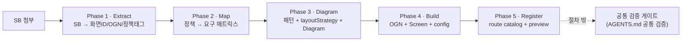

# Screen Generation Flow

SB가 첨부됐을 때 스크린을 생성하는 절차 계약이다. 이 문서는 **언제 / 무엇을 / 어떤 문서를 보고** 만드는지만 정의한다. 구조 원칙·패턴·spacing·foundation·검증의 내용은 각 참고 문서가 단독 소유하며, 이 문서는 가리키기만 한다(재서술 금지).

절차는 5개 책임 페이즈로 구성된다. 각 페이즈는 단일 책임, 고정 참고 문서, 단일 산출물, 완료조건(DoD)을 가진다. DoD는 검증이 아니라 "이 산출물이 내적으로 완성되어 다음 페이즈로 넘어갈 수 있는가"의 자체 판단 기준이다. `lint` / `build` / `check:*` 는 DoD가 아니다.

> **검증은 절차 페이즈가 아니다.** `lint` / `build` / `check:*` 실행과 그 책임은 `AGENTS.md` 의 `## 공통 검증` 섹션이 단독 소유하는 절차 밖 게이트다.

## 5 페이즈 계약

| Phase | 책임 (단일) | 참고 문서 (고정) | 산출물 | 완료조건 (DoD) |
|---|---|---|---|---|
| **1 · Extract** | SB → 화면ID·도메인·과업·상태·CTA·정책태그·도메인모듈ID/OGN ID·slot/part/hierarchy 추출 | SB (입력) | 추출 요약 | 화면ID·도메인·OGN ID·정책태그 누락 0으로 목록화 |
| **2 · Map** | 정책 필수정보/선택지/제약/에러/sourceRef → 화면 요구 매트릭스, 사용자 copy 분리 | `packages/policy-core/policies/**/*.md`, `*.policy.ts` | 정책-화면 요구사항 매트릭스 | 모든 정책태그가 화면 정보/CTA/에러로 매핑. 누락 시 다음 페이즈 진입 금지 |
| **3 · Diagram** | 화면 패턴 결정 + OGN별 layoutStrategy + reuse/new 분기 + SB 기반 Diagram, Layout Distortion Gate 자체 통과 | `DESIGN_PATTERNS.md`, `SCREEN_STRUCTURE_PRINCIPLES.md`, `SPACING_PATTERNS.md` | `Screen.diagram.md` (모든 화면 의무) | `Screen→Chrome→Section→Slot→Stack→Component` 로 설명, OGN별 layoutStrategy·정책연결·reuse/new 표기 |
| **4 · Build** | 정책서 OGN 제작/보강 + `Screen.tsx` 조립 + `Screen.config.ts`(생성근거 포함) | `DESIGN_FOUNDATION.md`, `@pxds/cx-components`, `@pxds/cx-icons`, `@pxds/cx-tokens`, `@pxds/pxds-layout` | `apps/mobile/src/organisms/<domain>/<ogn>/`, `Screen.tsx`, `Screen.config.ts` | Diagram의 모든 OGN/슬롯이 코드에 존재, `config.generation` 블록 채워짐 |
| **5 · Register** | route catalog 등록 + preview 노출 확인 | `apps/mobile/src/scripts/screen-routes/` | `routes.ts` 등록 항목 | route 등록 + preview iframe에서 해당 route 진입 가능 |

페이즈 이후 `lint` / `build` / `check:*` 는 절차 밖의 공통 검증 게이트(아래 `## 검증` 참조)가 실행한다.

## 페이즈 흐름



## 페이즈별 책임

### Phase 1 · Extract

- 책임: SB에서 화면 ID, 도메인, 과업, 상태, CTA, 정책 태그, 도메인 모듈 ID, OGN ID, part/slot/hierarchy를 추출한다.
- 참고: SB(입력)
- 산출: 추출 요약(Phase 2 입력)
- DoD: 화면ID·도메인·OGN ID·정책태그가 누락 0으로 목록화된다.

### Phase 2 · Map

- 책임: 정책 필수정보·선택지·제약·에러·sourceRef를 화면 요구 매트릭스로 정리하고, 사용자에게 보여줄 copy를 분리한다.
- 참고: `packages/policy-core/policies/**/*.md`, `packages/policy-core/policies/**/*.policy.ts`
- 산출: 정책-화면 요구사항 매트릭스
- DoD: 모든 정책 태그가 화면 정보/CTA/에러로 매핑된다. 정책 필수 정보가 누락되면 Phase 3로 진입하지 않는다.
- 이 페이즈는 디자인 문서를 참조하지 않는다. 정책 충실도(무엇을)가 디자인 표현(어떻게)에 의해 미리 걸러지지 않도록 의도적으로 분리한다.

### Phase 3 · Diagram

- 책임: 화면 패턴 결정 + OGN별 layoutStrategy 작성 + 컴포넌트 reuse/new 분기 + SB 기반 제작 Diagram 작성, Layout Distortion Gate 자체 통과.
- 참고: `DESIGN_PATTERNS.md`, `SCREEN_STRUCTURE_PRINCIPLES.md`, `SPACING_PATTERNS.md`
- 산출: `Screen.diagram.md` — **모든 화면 의무다.** 신규/기존 구분 없이 모든 화면이 이 산출물을 가진다.
- DoD: Diagram이 `Screen → Chrome → Section → Slot → Stack → Component` 구조로 설명되고, 각 OGN에 layoutStrategy·정책 연결·reuse/new 표기가 있다.
- Diagram 작성 규칙, OGN별 layoutStrategy 형식, Layout Distortion Gate, 금지 신호, 설계 체크리스트의 상세는 `SCREEN_STRUCTURE_PRINCIPLES.md` 가 단독 소유한다. 이 문서는 그 규칙을 재서술하지 않고 그 문서를 따른다.

### Phase 4 · Build

- 책임: 정책서 도메인 모듈 ID/OGN별로 `apps/mobile/src/organisms/<domain>/` 아래에 OGN을 제작하거나 기존 OGN을 보강하고, `Screen.tsx` 를 Diagram 그대로 조립하며, `Screen.config.ts` 에 생성 근거(`generation`)를 담는다.
- 참고: `DESIGN_FOUNDATION.md`, `@pxds/cx-components`, `@pxds/cx-icons`, `@pxds/cx-tokens`, `@pxds/pxds-layout`. `@pxds/pxds-components` / `@pxds/pxds-icons` 는 deprecated 호환 경계로만 다룬다.
- 산출: `apps/mobile/src/organisms/<domain>/<ogn>/`, `Screen.tsx`, `Screen.config.ts`
- DoD: Diagram의 모든 OGN/슬롯이 코드에 존재하고, `Screen.config.ts` 의 `generation` 블록이 채워진다.

### Phase 5 · Register

- 책임: `apps/mobile/src/scripts/screen-routes/routes.ts` 에 화면을 등록하고, preview에서 해당 route가 노출되는지 확인한다.
- 참고: `apps/mobile/src/scripts/screen-routes/`
- 산출: `routes.ts` 등록 항목
- DoD: route catalog가 화면 디렉터리를 참조하고, preview iframe에서 해당 route로 진입할 수 있다.

## 생성 산출물 계약

SB 기반 화면 폴더는 다음 산출물을 가진다. `Screen.diagram.md` 는 **모든 화면 의무**다.

```txt
apps/mobile/src/app/(<domain>)/<screen-id>/
├── Screen.tsx
├── Screen.config.ts
├── Screen.diagram.md
├── page.tsx
└── index.ts
```

`Screen.config.ts` 는 route 등록 정보와 생성 근거(`generation`)를 함께 담는 단일 계약이다. `Screen.meta.json` 같은 별도 meta 파일을 만들지 않는다.

```ts
import type { ScreenRouteConfig } from "@pxds/pxds-spec";
import { defineScreenConfig } from "@pxds/pxds-spec";

export const screenConfig = defineScreenConfig({
	id: "NOVA-MBR-PG-001-0",
	name: "MBR 가입 1·약관 동의",
	label: "MBR 가입 1·약관 동의",
	route: "/NOVA-MBR-PG-001-0",
	group: "mbr",
	owner: "@screen/mobile",
	status: "active",
	createdAt: "2026-05-11",
	domain: "mbr",
	node: { kind: "screen" },
	figma: { frameName: "NOVA-MBR-PG-001-0", width: 375, height: 812 },
	generation: {
		source: "SB",
		pattern: "form",
		policyRefs: ["POL-MBR-TERM-001-06"],
		ognIds: ["ogn-mbr-checkbox-terms"],
		designDocsChecked: [
			"DESIGN_PATTERNS.md",
			"DESIGN_FOUNDATION.md",
			"SPACING_PATTERNS.md",
			"SCREEN_STRUCTURE_PRINCIPLES.md",
		],
	},
} as const satisfies ScreenRouteConfig);
```

`Screen.diagram.md` 는 최소한 `AppScreen`, 화면 ID, `generation.ognIds` 의 모든 OGN ID, `generation.policyRefs` 의 모든 정책 ID를 포함해야 한다(`check:screen-generation` 계약). Diagram 구조 형식은 `SCREEN_STRUCTURE_PRINCIPLES.md` 를 따른다.

## 13단계 → 5페이즈 매핑 (추적성)

기존 13단계 절차가 어느 페이즈로 흡수되는지 명시한다.

- 기존 1 → Phase 1
- 기존 2 (SOT 6종 일괄 조회) → 해체. 페이즈별 고정 참고 문서로 분산(2단계 포괄 요구 제거)
- 기존 3 → Phase 2
- 기존 4·5·6·7·8 → Phase 3 (패턴 결정 + layoutStrategy + reuse/new + Diagram + Layout Distortion Gate)
- 기존 9·10·11 → Phase 4
- 기존 11(route)·12(preview) → Phase 5
- 기존 13(검증) + 검증 명령 나열 서술 → 절차 밖 공통 검증 게이트로 이동

## 검증

검증은 이 절차 밖이다. 실행 명령과 책임은 `AGENTS.md` 의 `## 공통 검증` 섹션이 단독 소유한다. 생성 정합성은 `@policy/core` 의 `check:screen-generation`(+`--strict`), `check:policy-source` 가 검사한다.

## 관련 문서

- `SCREEN_STRUCTURE_PRINCIPLES.md` — Phase 3 구조/Diagram/layoutStrategy/Layout Distortion Gate 단독 소유
- `DESIGN_PATTERNS.md` / `DESIGN_FOUNDATION.md` / `SPACING_PATTERNS.md` — Phase 3/4 패턴·시각·spacing 참고
- `packages/policy-core/policies` — Phase 2 정책 원천
- `AGENTS.md` `## 공통 검증` — 검증 게이트 (절차 밖)
