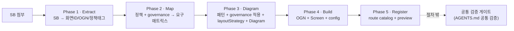

# Screen Generation Flow

SB가 첨부됐을 때 스크린을 생성하는 절차 계약이다. 이 문서는 **언제 / 무엇을 / 어떤 문서를 보고** 만드는지만 정의한다. 구조 원칙·패턴·spacing·foundation·검증의 내용은 각 참고 문서가 단독 소유하며, 이 문서는 가리키기만 한다(재서술 금지).

SB 기반 신규 생성 절차에서는 Figma SOT를 필수 대조 대상으로 삼지 않는다. Figma SOT는 실제 페이지 재현 또는 시각 기준 확인이 명시된 작업에서만 참조한다.

절차는 5개 책임 페이즈로 구성된다. 각 페이즈는 단일 책임, 고정 참고 문서, 고정 산출물, 완료조건(DoD)을 가진다. DoD는 검증이 아니라 "이 산출물이 내적으로 완성되어 다음 페이즈로 넘어갈 수 있는가"의 자체 판단 기준이다. `lint` / `build` / `check:*` 는 DoD가 아니다.

> **검증은 절차 페이즈가 아니다.** `lint` / `build` / `check:*` 실행과 그 책임은 `AGENTS.md` 의 `## 공통 검증` 섹션이 단독 소유하는 절차 밖 게이트다.

## 5 페이즈 계약

| Phase | 책임 (단일) | 참고 문서 (고정) | 산출물 | 완료조건 (DoD) |
|---|---|---|---|---|
| **1 · Extract** | SB → 화면ID·도메인·과업·상태·CTA·정책태그·도메인모듈ID/OGN ID·slot/part/hierarchy 추출 | SB (입력) | 추출 요약 | 화면ID·도메인·OGN ID·정책태그 누락 0으로 목록화 |
| **2 · Map** | 정책 필수정보/선택지/제약/에러/sourceRef → 화면 요구 매트릭스, 사용자 copy 분리 + 적용 governance refs 선정 | `packages/policy-core/policies/**/*.md`, `*.policy.ts`, `packages/policy-core/governance/**/*.md` | `Screen.map.md` | 모든 정책태그가 화면 정보/CTA/에러로 매핑되고, 관련 `UXP`/`UXPT`/`VOT` refs가 선정됨. 누락 시 다음 페이즈 진입 금지 |
| **3 · Diagram** | 화면 패턴 결정 + Phase 2 governance refs 적용 + OGN별 layoutStrategy + reuse/new 분기 + SB 기반 Diagram, Layout Distortion Gate 자체 통과 | `DESIGN_PATTERNS.md`, `SCREEN_STRUCTURE_PRINCIPLES.md`, `SPACING_PATTERNS.md`, Phase 2의 governance refs | `Screen.diagram.md` (모든 화면 의무) | `Screen→Chrome→Section→Slot→Stack→Component` 로 설명, OGN별 layoutStrategy·정책연결·governance 적용·reuse/new 표기 |
| **4 · Build** | 정책서 OGN 제작/보강 + `Screen.tsx` 조립 + `Screen.config.ts`(생성근거 포함) | `DESIGN_FOUNDATION.md`, `@pxds/cx-components`, `@pxds/cx-icons`, `@pxds/cx-tokens`, `@pxds/pxds-layout` | `apps/mobile/src/organisms/<domain>/<ogn>/`, `Screen.tsx`, `Screen.config.ts` | Diagram의 모든 OGN/슬롯이 코드에 존재, `config.generation` 블록 채워짐 |
| **5 · Register** | route catalog 등록 + preview 노출 확인 | `apps/mobile/src/scripts/screen-routes/` | `routes.ts` 등록 항목 | route 등록 + preview iframe에서 해당 route 진입 가능 |

페이즈 이후 `lint` / `build` / `check:*` 는 절차 밖의 공통 검증 게이트(아래 `## 검증` 참조)가 실행한다.

## 페이즈 흐름



## 에이전트 역할 모델

스크린 생성은 기본적으로 **메인 에이전트의 실제 생성**과 **서브 에이전트의 감독/교정**으로 나눈다. 이 역할 분리는 병렬 생성으로 산출물을 쪼개기 위한 규칙이 아니라, 정책 충실도와 디자인 시스템 일관성이 생성 중에 흔들리지 않도록 독립 검토 지점을 두기 위한 운영 모델이다.

메인 에이전트는 5페이즈 전체의 최종 산출물을 소유한다. SB 해석, `Screen.map.md`, `Screen.diagram.md`, `Screen.tsx`/organisms, `Screen.config.ts`, route 등록, 절차 밖 공통 검증 실행을 이어서 수행하고, 서브 에이전트의 지적을 반영할지 판단한 뒤 최종 코드와 문서를 정합하게 맞춘다.

서브 에이전트는 생성 산출물을 직접 소유하지 않는 독립 reviewer로 둔다. 정책 원문·`.policy.ts`·governance refs 누락, sourceRef 오류, copy 과잉 해석, pattern/spacing/component vocabulary 이탈, OGN reuse/new 판단 오류를 찾고 교정 의견을 낸다. 서브 에이전트가 별도 구현을 맡는 경우에도 메인 에이전트가 `Screen.map.md → Screen.diagram.md → 구현 → config` 정합성의 최종 책임을 가진다.

권장 개입 지점:

- Phase 2 직후: `Screen.map.md` 의 정책 필수정보, 선택지, 제약, 에러, sourceRef, governance refs 누락을 검토한다.
- Phase 3 직후: `Screen.diagram.md` 의 pattern contract, layoutStrategy, Layout Distortion Gate, spacing 원칙, reuse/new 판단을 검토한다.
- Phase 4/5 직후: 구현이 diagram과 config의 `policyRefs`/`ognIds`를 빠짐없이 반영하는지 검토한다.

서브 리뷰는 모든 화면에 같은 강도로 적용하지 않는다. 단순 detail/complete 화면은 메인 에이전트 단독 진행 후 체크리스트로 충분할 수 있다. form, eligibility, error-heavy 화면, 신규 organism 또는 신규 pattern 후보, 정책 해석이 애매한 화면은 서브 에이전트 리뷰를 필수 게이트로 둔다.

서브 에이전트 피드백은 원문을 별도 산출물로 늘리지 않는다. 반영된 결정은 해당 소유 파일에 기록한다. 정책·copy·governance 교정은 `Screen.map.md`, 구조·패턴·reuse/new 교정은 `Screen.diagram.md`, 구현 차이는 `Screen.config.ts` 또는 작업 로그의 `deviationReason`에 남긴다.

## 페이즈별 책임

### Phase 1 · Extract

- 책임: SB에서 화면 ID, 도메인, 과업, 상태, CTA, 정책 태그, 도메인 모듈 ID, OGN ID, part/slot/hierarchy를 추출한다.
- 참고: SB(입력)
- 산출: 추출 요약(Phase 2 입력)
- DoD: 화면ID·도메인·OGN ID·정책태그가 누락 0으로 목록화된다.

### Phase 2 · Map

- 책임: 정책 필수정보·선택지·제약·에러·sourceRef를 화면 요구 매트릭스로 정리하고, 사용자에게 보여줄 copy를 분리한 뒤 적용 가능한 governance refs를 선정한다.
- 참고: `packages/policy-core/policies/**/*.md`, `packages/policy-core/policies/**/*.policy.ts`, `packages/policy-core/governance/**/*.md`
- 산출: `Screen.map.md` — 정책-화면 요구사항 매트릭스를 영구 기록한다.
- DoD: 모든 정책 태그가 화면 정보/CTA/에러로 매핑되고, 관련 `UXP`/`UXPT`/`VOT` refs가 선정된다. 정책 필수 정보 또는 필요한 governance refs가 누락되면 Phase 3로 진입하지 않는다.
- Governance 확인 시점은 이 페이즈다. 도메인 정책 매핑 직후 CTA, 상태, 에러/로딩/복구, navigation, writing tone에 영향을 주는 `UXP`/`UXPT`/`VOT` 항목을 `Screen.map.md`에 기록한다.
- 기록 항목: `governanceRefs`, `selectionReason`, `affectedRequirement`, `copy/state/CTA impact`, `notApplicableReason`(검토했지만 적용하지 않는 경우).
- 이 페이즈는 디자인 문서를 참조하지 않는다. 정책 충실도와 UX governance 적용 대상(무엇을 지켜야 하는가)이 디자인 표현(어떻게)에 의해 미리 걸러지지 않도록 의도적으로 분리한다.

### Phase 3 · Diagram

- 책임: 화면 패턴 결정 + Phase 2 governance refs 적용 + OGN별 layoutStrategy 작성 + 컴포넌트 reuse/new 분기 + SB 기반 제작 Diagram 작성, Layout Distortion Gate 자체 통과.
- 참고: `DESIGN_PATTERNS.md`, `SCREEN_STRUCTURE_PRINCIPLES.md`, `SPACING_PATTERNS.md`, Phase 2에서 선정한 `UXP`/`UXPT`/`VOT` refs
- 산출: `Screen.diagram.md` — **모든 화면 의무다.** 신규/기존 구분 없이 모든 화면이 이 산출물을 가진다.
- DoD: Diagram이 `Screen → Chrome → Section → Slot → Stack → Component` 구조로 설명되고, 각 OGN에 layoutStrategy·정책 연결·governance 적용·reuse/new 표기가 있다.
- 이 페이즈는 governance를 새로 탐색하지 않는다. Phase 2에서 선정된 governance refs를 CTA hierarchy, button label, state handling, error/empty/loading treatment, navigation, writing tone 검증 기준으로 적용한다.
- 기록 항목: `appliedGovernanceRefs`, `sectionId`, `layoutOrStateDecision`, `copyDecision`, `CTA hierarchy/label decision`, `distortionRisk mitigated by governance`.
- Diagram 작성 규칙, OGN별 layoutStrategy 형식, Layout Distortion Gate, 금지 신호, 설계 체크리스트의 상세는 `SCREEN_STRUCTURE_PRINCIPLES.md` 가 단독 소유한다. 이 문서는 그 규칙을 재서술하지 않고 그 문서를 따른다.

### Phase 4 · Build

- 책임: 정책서 도메인 모듈 ID/OGN별로 `apps/mobile/src/organisms/<domain>/` 아래에 OGN을 제작하거나 기존 OGN을 보강하고, `Screen.tsx` 를 Diagram 그대로 조립하며, `Screen.config.ts` 에 생성 근거(`generation`)를 담는다.
- 참고: `DESIGN_FOUNDATION.md`, `@pxds/cx-components`, `@pxds/cx-icons`, `@pxds/cx-tokens`, `@pxds/pxds-layout`. `@pxds/pxds-components` / `@pxds/pxds-icons` 는 deprecated 호환 경계로만 다룬다.
- 산출: `apps/mobile/src/organisms/<domain>/<ogn>/`, `Screen.tsx`, `Screen.config.ts`
- DoD: Diagram의 모든 OGN/슬롯이 코드에 존재하고, `Screen.config.ts` 의 `generation` 블록이 채워진다.
- 기록 항목: `Screen.config.ts generation.governanceRefs`(지원 시), 또는 구현 PR/작업 로그에 `implementedGovernanceRefs`, `diagramSection`, `component/organism owner`, `deviationReason`(diagram과 다를 때)을 남긴다. Build 단계에서 새 governance 해석을 추가하지 않는다.

### Phase 5 · Register

- 책임: `apps/mobile/src/scripts/screen-routes/routes.ts` 에 화면을 등록하고, preview에서 해당 route가 노출되는지 확인한다.
- 참고: `apps/mobile/src/scripts/screen-routes/`
- 산출: `routes.ts` 등록 항목
- DoD: route catalog가 화면 디렉터리를 참조하고, preview iframe에서 해당 route로 진입할 수 있다.

## 생성 산출물 계약

SB 기반 화면 폴더는 다음 산출물을 가진다. `Screen.map.md` 와 `Screen.diagram.md` 는 **모든 화면 의무**다.

```txt
apps/mobile/src/app/(<domain>)/<screen-id>/
├── Screen.tsx
├── Screen.config.ts
├── Screen.map.md
├── Screen.diagram.md
├── page.tsx
└── index.ts
```

`Screen.config.ts` 는 route 등록 정보와 생성 근거(`generation`)를 함께 담는 단일 계약이다. `Screen.meta.json` 같은 별도 meta 파일을 만들지 않는다.

`Screen.map.md` 는 Phase 2의 정책-화면 요구사항 매트릭스와 적용 governance refs를 담는다. 최소한 화면 ID, 정책 태그/정책 ID, sourceRef, 필수 정보, 선택지, 제약, 에러, 사용자 copy, 관련 `UXP`/`UXPT`/`VOT` refs, 연결될 OGN ID 또는 미결정 사유를 포함해야 한다. 이 파일은 디자인 판단을 담지 않고, Phase 3의 `Screen.diagram.md` 가 참조하는 정책 충실도와 governance 적용 근거가 된다.

### Governance 기록 계약

Phase 2 이후 산출물은 governance 확인 결과를 아래처럼 이어 받아야 한다.

- `Screen.map.md`: 선정/비선정 근거를 기록한다. `governanceRefs`, `selectionReason`, `affectedRequirement`, `copy/state/CTA impact`, `notApplicableReason`을 남긴다.
- `Screen.diagram.md`: 선정된 refs의 적용 결과를 기록한다. `appliedGovernanceRefs`, `sectionId`, `layoutOrStateDecision`, `copyDecision`, `CTA hierarchy/label decision`, `distortionRisk mitigated by governance`를 남긴다.
- `Screen.config.ts`: 기계 검증 필드가 준비된 경우 `generation.governanceRefs`에 최소 ID 색인을 둔다. 필드가 없으면 config에 임의 필드를 추가하지 않고 PR/작업 로그에 구현 refs를 남긴다.
- `Screen.tsx`/organisms: governance 문서를 직접 재해석하지 않는다. `Screen.diagram.md`에 기록된 section/decision을 코드화한다.

### 산출물 책임 분리

| File | 책임 | 핵심 질문 | 담지 않는 것 |
| --- | --- | --- | --- |
| `Screen.map.md` | 정책 요구와 governance refs를 화면 요구로 번역하는 Phase 2 SOT | 무엇이 왜 화면에 있어야 하고, 어떤 UX/writing/state 규칙을 지켜야 하는가? | layoutStrategy, spacing, component reuse/new, AppScreen slot 구조, route 등록 정보 |
| `Screen.diagram.md` | 화면 구조와 layout/governance 적용 판단을 기록하는 Phase 3 SOT | 그 요구를 어떤 구조로 조립하고, 선정된 governance를 어떻게 반영하는가? | 정책 원문/sourceRef 상세 매트릭스, route catalog metadata, `createdAt`/`owner`/`status` |
| `Screen.config.ts` | route 등록과 생성 메타데이터를 담는 기계 계약 | 이 화면을 시스템이 어떻게 식별·노출·검증하는가? | 정책 요구 설명, 사용자 copy 전체, layoutStrategy, Screen Wire, 미결정 질문 |

흐름은 `Policy/SB → Screen.map.md → Screen.diagram.md → Screen.tsx/organisms → Screen.config.ts` 순서다. `Screen.config.ts` 는 map과 diagram의 내용을 재서술하지 않고, `policyRefs` 와 `ognIds` 같은 검증 가능한 최소 ID 색인만 가진다.

정합성 규칙:

- `Screen.map.md`, `Screen.diagram.md`, `Screen.config.ts`, 구현이 policy-core 정책 원문/정의와 불일치하면 policy-core를 우선하고 다른 산출물을 수정한다.
- `Screen.config.ts` 의 `generation.policyRefs` 는 `Screen.map.md` 에 등장해야 한다.
- `Screen.config.ts` 의 `generation.ognIds` 는 `Screen.map.md` 와 `Screen.diagram.md` 에 모두 등장해야 한다.
- Phase 2에서 선정한 governance refs는 `Screen.map.md` 에 등장해야 하고, 화면 구조·CTA·state·copy에 영향을 주는 항목은 `Screen.diagram.md` 에 적용 근거가 있어야 한다.
- `Screen.map.md` 의 `mapped` 요구사항은 최소 하나의 OGN ID를 가져야 한다.
- `Screen.diagram.md` 의 OGN이 `Screen.map.md` 에 없으면 `structural-only` 같은 사유를 남긴다.

```ts
import type { ScreenRouteConfig } from "@pxds/pxds-spec";
import { defineScreenConfig } from "@pxds/pxds-spec";

export const screenConfig = defineScreenConfig({
	id: "NOVA-MBR-PG-001-0",
	name: "MBR 가입 1·약관 동의",
	label: "MBR 가입 1·약관 동의",
	route: "/NOVA-MBR-PG-001-0",
	group: "mbr",
	owner: "@screen/mobile",
	status: "active",
	createdAt: "2026-05-11",
	domain: "mbr",
	node: { kind: "screen" },
	figma: { frameName: "NOVA-MBR-PG-001-0", width: 375, height: 812 },
	generation: {
		source: "SB",
		pattern: "form",
		policyRefs: ["POL-MBR-TERM-001-06"],
		ognIds: ["ogn-mbr-checkbox-terms"],
		designDocsChecked: [
			"DESIGN_PATTERNS.md",
			"DESIGN_FOUNDATION.md",
			"SPACING_PATTERNS.md",
			"SCREEN_STRUCTURE_PRINCIPLES.md",
		],
	},
} as const satisfies ScreenRouteConfig);
```

`Screen.diagram.md` 는 최소한 `AppScreen`, 화면 ID, `Screen.map.md` 에서 확정한 모든 OGN ID, `Screen.config.ts` 의 `generation.policyRefs` 의 모든 정책 ID를 포함해야 한다(`check:screen-generation` 계약). Diagram 구조 형식은 `SCREEN_STRUCTURE_PRINCIPLES.md` 를 따른다.

## 13단계 → 5페이즈 매핑 (추적성)

기존 13단계 절차가 어느 페이즈로 흡수되는지 명시한다.

- 기존 1 → Phase 1
- 기존 2 (SOT 6종 일괄 조회) → 해체. 페이즈별 고정 참고 문서로 분산(2단계 포괄 요구 제거)
- 기존 3 → Phase 2 (+ governance refs 선정)
- 기존 4·5·6·7·8 → Phase 3 (패턴 결정 + governance 적용 + layoutStrategy + reuse/new + Diagram + Layout Distortion Gate)
- 기존 9·10·11 → Phase 4
- 기존 11(route)·12(preview) → Phase 5
- 기존 13(검증) + 검증 명령 나열 서술 → 절차 밖 공통 검증 게이트로 이동

## 검증

검증은 이 절차 밖이다. 실행 명령과 책임은 `AGENTS.md` 의 `## 공통 검증` 섹션이 단독 소유한다. 생성 정합성은 `@policy/core` 의 `check:screen-generation`(+`--strict`), `check:policy-source` 가 검사한다.

## 관련 문서

- `SCREEN_STRUCTURE_PRINCIPLES.md` — Phase 3 구조/Diagram/layoutStrategy/Layout Distortion Gate 단독 소유
- `DESIGN_PATTERNS.md` / `DESIGN_FOUNDATION.md` / `SPACING_PATTERNS.md` — Phase 3/4 패턴·시각·spacing 참고
- `packages/policy-core/policies` — Phase 2 도메인 정책 원천
- `packages/policy-core/governance` — Phase 2 governance refs 선정 원천, Phase 3 적용 기준
- `AGENTS.md` `## 공통 검증` — 검증 게이트 (절차 밖)
