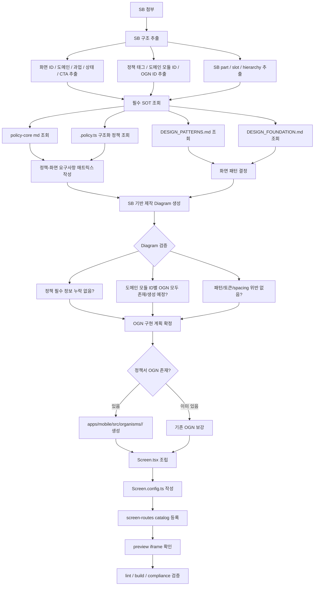

# Screen Generation Flow

SB가 첨부되었을 때 스크린을 생성하는 표준 흐름이다. 핵심은 구현 전에 **SB 기반 제작 Diagram**을 먼저 만들고, 그 Diagram을 정책 충실도, 디자인 패턴, OGN 구현 범위의 계약으로 사용하는 것이다.



## 제작 순서

1. SB 첨부/수신
   - 화면 ID, 도메인, 사용자 과업, 상태, CTA를 추출한다.
   - slot 구조, part 목록, 정책 태그, 도메인 모듈 ID, OGN ID를 추출한다.

2. 필수 SOT 조회
   - `packages/policy-core/policies/**/*.md`
   - `packages/policy-core/policies/**/*.policy.ts`
   - `DESIGN_PATTERNS.md`
   - `DESIGN_FOUNDATION.md`

3. 정책 요구사항 매트릭스 작성
   - 어떤 정책 문장이 어떤 화면 정보, 에러, 선택지, CTA로 표현되는지 정리한다.
   - 필수 정책 정보가 누락되면 구현으로 넘어가지 않는다.

4. 화면 패턴 결정
   - `DESIGN_PATTERNS.md` 기준으로 Main, list, detail, form, complete, bottom sheet, popup 중 하나로 매핑한다.
   - 맞는 패턴이 없으면 새 패턴을 만들기 전에 기존 패턴의 변형으로 표현 가능한지 검토한다.

5. SB 기반 제작 Diagram 생성
   - Diagram은 AppScreen slot, OGN 배치, 주요 컴포넌트, 정책 연결을 함께 보여준다.
   - 예:

```txt
┌──────────────────────── AppScreen ────────────────────────┐
│ StatusBar                                                  │
│ AppBar                                                     │
├────────────────────────────────────────────────────────────┤
│ OGN: ogn-mbr-section-header-page                           │
│   TitleSection / TitleMain                                 │
├────────────────────────────────────────────────────────────┤
│ OGN: ogn-mbr-text-field-member-info                        │
│   TextField × N                                            │
│   policy: POL-MBR-INFO-002-*                               │
├────────────────────────────────────────────────────────────┤
│ OGN: ogn-mbr-section-message-entry-branch                  │
│   Notice / Callout                                         │
└────────────────────────────────────────────────────────────┘
```

6. Diagram 검증
   - 정책서 필수 정보가 Diagram에 있는가?
   - 정책서에 적힌 도메인 모듈 ID/OGN이 모두 들어갔는가?
   - OGN별 책임이 겹치지 않는가?
   - `DESIGN_PATTERNS.md`의 화면 패턴과 맞는가?
   - `DESIGN_FOUNDATION.md`의 spacing, typography, color, radius 규칙을 벗어나지 않는가?
   - 신규 컴포넌트 기준은 `@pxds/cx-components`인가?
   - deprecated `@pxds/pxds-components`는 legacy 참고/호환 경계로만 사용되는가?

7. 정책서 OGN별 컴포넌트 제작
   - 정책서에 도메인 모듈 ID가 있으면 반드시 `apps/mobile/src/organisms/<domain>/` 아래에 OGN 단위로 만든다.
   - OGN config id는 현재 앱 규칙에 맞춰 `ogn-<domain>-...` 소문자를 사용한다. 예: `ogn-mbr-text-field-member-info`.

```txt
apps/mobile/src/organisms/mbr/<ogn-name>/
├── <OgnName>.tsx
├── <OgnName>.config.ts
└── index.ts
```

## 생성 산출물

SB 기반 신규 화면은 화면 폴더에 생성 근거 산출물을 함께 둔다.

```txt
apps/mobile/src/app/(mbr)/<screen-id>/
├── Screen.tsx
├── Screen.config.ts
├── generation.diagram.md
└── generation.meta.json
```

`generation.meta.json`은 검사 스크립트가 읽는 최소 계약이다.

```json
{
  "screenId": "NOVA-MBR-PG-001-0",
  "domain": "mbr",
  "source": "SB",
  "pattern": "form",
  "policyRefs": ["POL-MBR-TERM-001-06"],
  "ognIds": ["ogn-mbr-checkbox-terms"],
  "designDocsChecked": [
    "DESIGN_PATTERNS.md",
    "DESIGN_FOUNDATION.md"
  ]
}
```

8. Screen 조립
   - `Screen.tsx`는 Diagram을 그대로 코드화한다.
   - `AppScreen.SystemHeader`, `Header`, `Content`, `Bottom` slot에 OGN을 배치한다.

9. Screen config / route 등록
   - `Screen.config.ts`를 작성한다.
   - `apps/mobile/src/scripts/screen-routes/routes.ts`에 등록한다.

10. Preview 확인
    - `apps/preview` iframe에서 실제 mobile route를 확인한다.

11. 검증

```bash
npm run lint -w @screen/mobile
npm run build -w @screen/mobile
npm run check:compliance -w @policy/core
```

정책/생성 흐름 검증은 `@policy/core`의 아래 스크립트로 나뉜다.

```bash
npm run check:policy-source -w @policy/core
npm run check:screen-generation -w @policy/core
npm run check:screen-generation:strict -w @policy/core
```

- `check:policy-source`: 정책 원문 `.md`와 `.policy.ts`의 `sourceText` 정합성을 검사한다.
- `check:screen-generation`: `generation.meta.json`, `generation.diagram.md`, OGN config, `Screen.tsx`, route catalog 사이의 정합성을 검사한다. 기존 화면에 생성 산출물이 없으면 adoption warning으로 보고한다.
- `check:screen-generation:strict`: 생성 산출물 누락도 실패로 처리한다.
