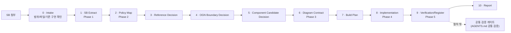

# Screen Generation Flow

SB가 첨부됐을 때 스크린을 생성하는 절차 계약이다. 이 문서는 **언제 / 무엇을 / 어떤 문서를 보고** 만드는지만 정의한다. 구조 원칙·패턴·layout/spacing contract·foundation·검증의 내용은 각 참고 문서가 단독 소유하며, 이 문서는 가리키기만 한다(재서술 금지).

SB 기반 신규 생성 절차에서는 Figma SOT를 필수 대조 대상으로 삼지 않는다. Figma SOT는 실제 페이지 재현 또는 시각 기준 확인이 명시된 작업에서만 참조한다.

절차의 기본 책임 단위는 5개 페이즈다. 실제 SB 수신형 제작에서는 이 5페이즈를 0-10 공개 체크포인트로 세분화해 운영한다. 0-10은 5페이즈를 대체하지 않고, 메인 에이전트가 어떤 판단을 언제 공개하고 승인해야 하는지 고정한다.

각 페이즈는 단일 책임, 고정 참고 문서, 고정 산출물, 완료조건(DoD)을 가진다. DoD는 검증이 아니라 "이 산출물이 내적으로 완성되어 다음 페이즈로 넘어갈 수 있는가"의 자체 판단 기준이다. `lint` / `build` / `check:*` 는 DoD가 아니다.

> **검증은 절차 페이즈가 아니다.** `lint` / `build` / `check:*` 실행과 그 책임은 `AGENTS.md` 의 `## 공통 검증` 섹션이 단독 소유하는 절차 밖 게이트다.

> **레이아웃 보존은 스크린 생성의 최우선 디자인 게이트다.** 정책 충실도는 무엇을 보여줄지 결정하고, 디자인 시스템은 어떻게 표현할지 제한하지만, Phase 3/4의 메인 에이전트 승인은 먼저 SB/wire reference/Diagram의 핵심 레이아웃이 보존됐는지 확인해야 한다. 레이아웃 보존을 해치는 정책 copy, component 선택, spacing 보정, 신규 OGN은 통과하지 않는다.

## 0-10 운영 순서

| Step | Phase | 책임 | 공개/산출물 | 다음 단계 진입 조건 |
|---:|---|---|---|---|
| **0 · Intake** | Pre-phase | 입력 파일과 작업 범위의 존재성을 확인한다. | `Intake Summary` | target screen, screen spec, OGN spec, 기존 구현 여부가 확인됨 |
| **1 · SB Extract** | Phase 1 | SB에 적힌 화면/OGN 사실을 추출한다. | `Extract Summary` | screenId, OGN list, state, CTA, transition/case branch가 목록화됨 |
| **2 · Policy Map** | Phase 2 | 정책 의미, sourceRef, governance, copy 근거를 확정한다. | `Screen.map.md` | 요구사항이 policy/governance/copy와 연결됨 |
| **3 · Reference Decision** | Phase 3 | 공식 패턴과 가까운 구현/wire reference를 선택한다. | `Reference Decision Log` | patternFamily, official pattern, rejected references가 명시됨 |
| **4 · OGN Boundary Decision** | Phase 3 | 정책 의미와 layout rhythm의 소유자를 결정한다. | `OGN Boundary Decision` | reuse/extend/new/structural-only와 owner가 정해짐 |
| **5 · Component Candidate Decision** | Phase 3 | 구현 어휘와 레이아웃 후보를 capability 기준으로 평가한다. | `Component Candidate Decision` | selected/rejected candidates와 reject 이유가 기록됨 |
| **6 · Diagram Contract** | Phase 3 | 화면 구조, layoutContract, Distortion Gate를 구현 전 계약으로 고정한다. | `Screen.diagram.md` | 모든 section에 patternEvidence, layoutStrategy, layoutContract, componentCandidates가 있음 |
| **7 · Build Plan** | Phase 4 | 파일 변경 범위와 raw CSS/layout patch 위험을 공개한다. | `Build Plan` | create/modify/remove/no-touch와 layout risk가 명시됨 |
| **8 · Implementation** | Phase 4 | 승인된 map/diagram/build plan을 코드화한다. | `Screen.tsx`, `Screen.config.ts`, organisms, registry/route | 구현이 diagram contract와 OGN boundary를 보존함 |
| **9 · Verification** | Phase 5 | 자동 검증과 브라우저/pattern/foundation 검사를 수행한다. | check/lint/build/browser 결과 | strict check, lint, build, pattern checklist가 통과함 |
| **10 · Report** | Post-phase | 사용한 source, 결정, reject, 검증, 남은 위험을 보고한다. | `Final Report` | 변경 범위와 판단 근거를 추적할 수 있음 |

5페이즈와의 매핑:

```txt
Phase 1 = Step 1
Phase 2 = Step 2
Phase 3 = Step 3-6
Phase 4 = Step 7-8
Phase 5 = Step 9
Pre/Post = Step 0, Step 10
```

구현 전 반드시 공개해야 하는 체크포인트:

```txt
1. SB Extract 결과
2. Reference Decision
3. Component Candidate Decision
4. Build Plan
```

이 체크포인트는 긴 회의록이 아니라 다음 위험을 구현 전에 잡기 위한 승인 가능한 작업 로그다: 잘못된 reference 선택, OGN boundary 오류, 패턴과 맞지 않는 component 후보, raw CSS나 route-level layout patch, 예상 밖 파일 수정.

서브 에이전트에게 구현을 위임할 때도 이 네 지점은 생략하지 않는다. 긴 설명 대신 아래 짧은 형식으로 공개하면 충분하다.

```txt
Reference Decision
- official pattern:
- wire/reference:
- rejected:

Component Candidate Decision
- selected:
- rejected:
- layout risk:

Build Plan
- worker:
- write scope:
- no-touch:
- approval checks:
```

메인 에이전트는 하위 에이전트의 완료 보고를 그대로 승인하지 않는다. 승인 전에 반드시 `git diff --stat`, scoped diff, checker/lint/build, 그리고 실제 렌더의 layout evidence를 확인한다.

## 문서 라우팅

문서는 SOT이고, 스킬은 실행자다. 스킬이 문서 역할 분리의 유일한 출처가 되면 repo 밖에서 절차가 drift 되므로, phase별로 읽어야 할 문서는 이 표가 소유한다.

| Step | 반드시 읽는 문서/입력 | 읽지 않는 것 |
|---|---|---|
| **0 · Intake** | SB input, `AGENTS.md`, 기존 target route/organism 파일, `git status` | 디자인 판단 |
| **1 · SB Extract** | SB `screen/*.md`, SB `organism/*.md` | policy-core, 디자인 문서 |
| **2 · Policy Map** | `packages/policy-core/policies/**/*.md`, `packages/policy-core/policies/**/*.policy.ts`, `packages/policy-core/governance/**/*.md` | `DESIGN_PATTERNS.md`, `DESIGN_FOUNDATION.md` |
| **3 · Reference Decision** | `DESIGN_PATTERNS.md`, `DESIGN_FOUNDATION.md`, `SCREEN_STRUCTURE_PRINCIPLES.md`, `apps/mobile/src/screen-diagrams/`, nearby `Screen.diagram.md`, `cx-example` | 구현 코드 변경 |
| **4 · OGN Boundary Decision** | `Screen.map.md`, `DESIGN_PATTERNS.md`, `SCREEN_STRUCTURE_PRINCIPLES.md`, existing organisms | 새 component API 확정 |
| **5 · Component Candidate Decision** | `Screen.diagram.md` draft, `DESIGN_PATTERNS.md`, `DESIGN_FOUNDATION.md`, `@pxds/cx-components`, `@pxds/cx-layout` | route-level CSS 보정 |
| **6 · Diagram Contract** | `SCREEN_STRUCTURE_PRINCIPLES.md`, `DESIGN_PATTERNS.md`, `Screen.map.md` | 구현 편의에 따른 구조 변경 |
| **7 · Build Plan** | `Screen.map.md`, `Screen.diagram.md`, `DESIGN_FOUNDATION.md`, existing route/organism files, `git status` | 새로운 정책 해석 |
| **8 · Implementation** | `Screen.map.md`, `Screen.diagram.md`, `DESIGN_FOUNDATION.md`, `@pxds/cx-components`, `@pxds/cx-layout`, `@pxds/cx-icons` | 새 reference/pattern 판단 |
| **9 · Verification** | `AGENTS.md` 공통 검증, `Screen.diagram.md` Distortion Gates, pattern-specific checklist, foundation-specific scan | checker 약화 |
| **10 · Report** | 작업 로그, 사용 source, 결정/reject 기록, 검증 결과 | 숨겨진 내부 판단 |

`DESIGN_PATTERNS.md`는 Step 3-6에서 화면 구조와 pattern/layout contract를 결정하고, `DESIGN_FOUNDATION.md`는 Step 3에서 제약을 확인한 뒤 Step 5/7/8/9에서 token·typography·spacing·radius 위반을 차단한다. Phase 2는 정책 의미가 디자인 표현에 의해 미리 걸러지지 않도록 디자인 문서를 읽지 않는다.

## 레이아웃 책임

레이아웃은 Implementation에서 즉흥적으로 맞추지 않는다.

```txt
Reference Decision
- 기준 레이아웃 선택

OGN Boundary Decision
- layout rhythm 소유자 결정

Component Candidate Decision
- 정렬 / width / wrapping 가능한 후보만 통과

Diagram Contract
- layoutStrategy / layoutContract / Distortion Gates 확정

Build Plan
- route-level patch와 raw CSS 위험 차단

Implementation
- layout owner를 코드에 반영

Verification
- 실제 렌더에서 정렬 / 겹침 / 패턴 이탈 확인
```

실제 렌더 확인은 텍스트 존재 여부만으로 끝내지 않는다. 상위 승인 gate는 최소한 다음 중 하나를 남긴다.

- screenshot 확인
- Playwright/Browser bounding box 검사
- Header / Content / Bottom rail의 상대 위치 검사
- CTA가 viewport 밖으로 밀리거나 content와 겹치지 않는지 검사

작고 단순한 문서-only 변경이 아니면, Completion/Form/Detail 같은 화면 패턴 변경은 bounding box 또는 screenshot 기반 layout evidence를 포함해야 한다.

소유권:

| Owner | 책임 |
|---|---|
| `Screen.tsx` | `AppScreen` rails, SystemHeader/Header/Content/Bottom slot 조립 |
| OGN organism | 정책 의미가 있는 body composition과 section 내부 구조 |
| `@pxds/cx-layout` | PageStackContents, FieldStack, bottom fixed rail, content rail/padding |
| `@pxds/cx-components` | card 내부 padding, row alignment, button internal alignment, component state visuals |

구현 중 정렬이 안 맞으면 CSS 보정 문제가 아니라 후보 선택 실패, Diagram layoutContract 부족, pattern reference 선택 오류, component vocabulary gap 중 하나로 본다. 이 경우 필요한 단계로 되돌아간다.

## 5 페이즈 계약

| Phase | 책임 (단일) | 참고 문서 (고정) | 산출물 | 완료조건 (DoD) |
|---|---|---|---|---|
| **1 · Extract** | SB → 화면ID·도메인·과업·상태·CTA·정책태그·도메인모듈ID/OGN ID·slot/part/hierarchy 추출 | SB (입력) | 추출 요약 | 화면ID·도메인·OGN ID·정책태그 누락 0으로 목록화 |
| **2 · Map** | 정책 필수정보/선택지/제약/에러/sourceRef → 화면 요구 매트릭스, 사용자 copy 분리 + 적용 governance refs 선정 | `packages/policy-core/policies/**/*.md`, `*.policy.ts`, `packages/policy-core/governance/**/*.md` | `Screen.map.md` | 모든 정책태그가 화면 정보/CTA/에러로 매핑되고, 관련 `UXP`/`UXPT`/`VOT` refs가 선정됨. 누락 시 다음 페이즈 진입 금지 |
| **3 · Diagram** | Map 이후 유사 wire reference 탐색 + Pattern Analysis Gate + reference pattern 분석 + 화면 패턴 결정 + OGN boundary/reuse/new/extend 결정 + Phase 2 governance refs 적용 + OGN별 layoutStrategy/layoutContract 작성 + componentCandidates 나열 + SB 기반 Diagram, Layout Distortion Gate 자체 통과 | `apps/mobile/src/screen-diagrams/`, 기존 화면 `Screen.diagram.md`, `DESIGN_PATTERNS.md`, `SCREEN_STRUCTURE_PRINCIPLES.md`, Phase 2의 governance refs | `Screen.diagram.md` (모든 화면 의무) | `Screen→Chrome→Section→Slot→Stack→Component` 로 설명, `wireReference`와 한계, section별 patternEvidence/patternDecision, OGN별 `ognBoundaryDecision`·layoutStrategy·layoutContract·componentCandidates·정책연결·governance 적용 표기 |
| **4 · Build** | Diagram에서 이미 결정된 OGN boundary/reuse/new/extend 계약을 코드화 + layoutContract를 만족하는 컴포넌트/조합 선택 + 정책서 OGN 제작/보강 + `Screen.tsx` 조립 + `Screen.config.ts`(생성근거 포함) | `DESIGN_FOUNDATION.md`, `@pxds/cx-components`, `@pxds/cx-icons`, `@pxds/cx-tokens`, `@pxds/cx-layout` | `apps/mobile/src/organisms/<route-group-or-domain>/<ogn>/`, `Screen.tsx`, `Screen.config.ts` | Diagram의 모든 OGN/슬롯이 코드에 존재하고 `ognBoundaryDecision`·layoutContract/Distortion Gates를 보존, `config.generation` 블록 채워짐 |
| **5 · Register** | route catalog 등록 + preview 노출 확인 | `apps/mobile/src/scripts/screen-routes/` | `routes.ts` 등록 항목 | route 등록 + preview iframe에서 해당 route 진입 가능 |

페이즈 이후 `lint` / `build` / `check:*` 는 절차 밖의 공통 검증 게이트(아래 `## 검증` 참조)가 실행한다.

## 운영 스킬

Codex 화면 생성 작업은 아래 `cx-*` 스킬을 사용해 페이즈별 절차를 고정한다. 스킬은 작업 실행 가이드이고, 이 문서와 각 SOT 문서가 절차/판단의 최종 기준이다.

프로젝트 로컬 스킬은 `.codex/skills/` 아래에 둔다. Phase 3 diagram 작업의 로컬 스킬 SOT는 `.codex/skills/cx-screen-diagram/SKILL.md`다.

| Phase | Skill | 역할 |
|---|---|---|
| 전체 관리 | `cx-screen-create` | 메인 에이전트가 5페이즈를 오케스트레이션하고 phase gate를 승인한다. |
| **1 · Extract** | `cx-screen-extract` | SB/첨부에서 화면ID·도메인·과업·상태·CTA·정책태그·OGN/slot/part/hierarchy를 추출한다. |
| **2 · Map** | `cx-screen-map` | 정책서·`.policy.ts`·governance를 `Screen.map.md`로 번역한다. |
| **3 · Diagram** | `cx-screen-diagram` | Map 이후 wire reference 탐색, Pattern Analysis Gate, reference pattern 분석, OGN boundary/reuse/new/extend 결정, 최신 Screen Wire rail, Section Contracts, layoutStrategy/layoutContract, componentCandidates를 `Screen.diagram.md`에 기록한다. |
| **4 · Build** | `cx-screen-build` | 승인된 Map/Diagram만 코드화하되, Diagram의 OGN 계약을 새로 발명하지 않고 componentCandidates 중 layoutContract를 만족하는 구현을 선택하거나 필요한 OGN/component를 만든다. |
| **5 · Register** | `cx-screen-register-verify` | route catalog 등록과 policy/lint/build/preview 검증을 수행한다. |

작업자가 스킬을 사용할 수 없는 환경이면 같은 이름의 phase 규칙을 이 문서와 관련 SOT에서 직접 따른다. Phase 3에서 `cx-screen-diagram`을 건너뛰지 않는다.

## 페이즈 흐름



## 멀티 화면 배치 실행

여러 화면이 한 번에 요청되면 기본 실행 단위는 page end-to-end가 아니라 **phase batch**다. 메인 에이전트는 먼저 전체 화면 inventory를 만들고, 같은 phase 안에서 화면별 산출물을 병렬 생성한 뒤, 전체 화면 세트의 phase gate를 승인해야 다음 phase로 넘어간다.

- Phase 1/2/3은 화면별 병렬 실행을 기본으로 한다. 각 phase가 끝날 때 메인 에이전트가 화면 누락, 정책·governance 일관성, wire semantics, layoutContract, componentCandidates fit 근거를 통합 검수한다.
- Phase 4 Build는 승인된 `Screen.map.md`와 `Screen.diagram.md`가 있고, Phase 3의 Section Contracts에 OGN boundary/reuse/new/extend 결정이 기록된 화면만 병렬 실행한다. 공용 organism/component를 수정하는 작업은 파일 소유 범위를 나눠 충돌을 방지한다.
- Phase 5 Register/Verify는 메인 에이전트가 통합 수행하거나 통합 승인한다. route catalog, preview 노출, 공통 검증은 화면별 완료 표시로 대체하지 않는다.
- 단일 화면 요청 또는 명확히 독립적인 단순 proof/detail 화면만 page end-to-end 위임할 수 있다. 멀티 화면 배치에서 page end-to-end 위임이 필요하면 예외 사유와 메인 gate 위치를 작업 로그에 남긴다.

## 에이전트 역할 모델

메인 에이전트는 5페이즈 전체의 방향과 최종 정합성을 소유하고, 서브 에이전트는 위임받은 페이즈 산출물을 만든다. Phase 3/4에서는 레이아웃 보존을 최우선 승인 기준으로 삼고, 그 다음 정책 의미와 디자인 시스템 준수를 확인한다. 메인 에이전트의 검수는 다음 페이즈 진입을 승인하거나 반려하는 gate이며, 산출물 요약으로 대체하지 않는다.

상세 위임/점검 방식은 `docs/screen-generation-agent-model.md`를 참조한다.

## 페이즈별 책임

### Phase 1 · Extract

- 책임: SB에서 화면 ID, 도메인, 과업, 상태, CTA, 정책 태그, 도메인 모듈 ID, OGN ID, part/slot/hierarchy를 추출한다.
- 참고: SB(입력)
- 산출: 추출 요약(Phase 2 입력)
- DoD: 화면ID·도메인·OGN ID·정책태그가 누락 0으로 목록화된다.

### Phase 2 · Map

- 책임: 정책 필수정보·선택지·제약·에러·sourceRef를 화면 요구 매트릭스로 정리하고, 사용자에게 보여줄 copy를 분리한 뒤 적용 가능한 governance refs를 선정한다.
- 참고: `packages/policy-core/policies/**/*.md`, `packages/policy-core/policies/**/*.policy.ts`, `packages/policy-core/governance/**/*.md`
- 산출: `Screen.map.md` — 정책-화면 요구사항 매트릭스를 영구 기록한다.
- DoD: 모든 정책 태그가 화면 정보/CTA/에러로 매핑되고, 관련 `UXP`/`UXPT`/`VOT` refs가 선정된다. 정책 필수 정보 또는 필요한 governance refs가 누락되면 Phase 3로 진입하지 않는다.
- Governance 확인 시점은 이 페이즈다. 도메인 정책 매핑 직후 CTA, 상태, 에러/로딩/복구, navigation, writing tone에 영향을 주는 `UXP`/`UXPT`/`VOT` 항목을 `Screen.map.md`에 기록한다.
- 기록 항목: `governanceRefs`, `selectionReason`, `affectedRequirement`, `copy/state/CTA impact`, `notApplicableReason`(검토했지만 적용하지 않는 경우).
- 이 페이즈는 디자인 문서를 참조하지 않는다. 정책 충실도와 UX governance 적용 대상(무엇을 지켜야 하는가)이 디자인 표현(어떻게)에 의해 미리 걸러지지 않도록 의도적으로 분리한다.

### Phase 3 · Diagram

- 책임: Phase 2 Map 완료 후 `apps/mobile/src/screen-diagrams/` 와 기존 화면 `Screen.diagram.md` 에서 유사 wire reference를 먼저 찾고, Screen Wire를 그린 뒤, Pattern Analysis Gate로 반복 UI 구조와 divider evidence를 확정하고, reference pattern 분석 결과를 기준으로 화면 패턴과 OGN boundary/reuse/new/extend 결정을 내린다. 이후 Phase 2 governance refs 적용 + OGN별 layoutStrategy/layoutContract 작성 + componentCandidates 나열 + SB 기반 제작 Diagram 작성, Layout Distortion Gate 자체 통과.
- 참고: `apps/mobile/src/screen-diagrams/`, 기존 화면 `Screen.diagram.md`, `DESIGN_PATTERNS.md`, `SCREEN_STRUCTURE_PRINCIPLES.md`, Phase 2에서 선정한 `UXP`/`UXPT`/`VOT` refs
- 산출: `Screen.diagram.md` — **모든 화면 의무다.** 신규/기존 구분 없이 모든 화면이 이 산출물을 가진다.
- DoD: Diagram이 `Screen → Chrome → Section → Slot → Stack → Component` 구조로 설명되고, `Screen Contract`에 `wireReference`와 reference 한계가 기록되며, 각 section에 patternEvidence/patternDecision이 있고, 각 OGN에 `ognBoundaryDecision`·layoutStrategy·layoutContract·componentCandidates·정책 연결·governance 적용 표기가 있다.
- 메인 에이전트 디자인 검수는 레이아웃 보존을 최우선으로 한다. SB/wire reference의 핵심 레이아웃, section 경계, slot 위치, CTA/navigation/notice/form field의 위치 관계, scroll/fixed 영역의 역할이 보존되지 않으면 정책·copy·component 판단이 맞아도 승인하지 않는다.
- Pattern Analysis Gate는 이 페이즈의 필수 선행 판단이다. 각 section에서 `sectionBoundary`, `fieldGrouping`, `rowSeparators`, `actionPlacement`, `typography`, `patternEvidence`, `patternDecision`을 확인하고 `Screen.diagram.md`의 `Section Contracts`에 기록한다. 실제 reference에 있는 contents divider, section divider band, row separator, field action slot을 단순 spacing gap이나 외부 버튼으로 대체하지 않는다. 선택 리스트와 row pattern은 `rowTitle`, `rowCaption`, `emphasisRule`, `controlLabelScale`까지 확인해 텍스트 위계 distortion을 막는다.
- OGN boundary/reuse/new/extend 결정은 Phase 3의 책임이다. Map 이후 reference pattern을 확인하고 Pattern Analysis Gate를 통과한 다음, Build에 들어가기 전에 각 Section Contract에 `ognBoundaryDecision`으로 `reuse`/`extend`/`new`/`structural-only` 중 하나와 근거를 기록한다. 이 결정은 어떤 정책 OGN을 기존 organism으로 재사용할지, 어느 organism을 확장할지, 새 OGN을 만들지, 구조 전용 section으로 둘지를 확정하는 계약이다.
- 정책 정보 추가로 레이아웃이 늘어질 위험이 있으면 `Screen.diagram.md`에 접기, 분리, 우선순위 조정, 별도 state 처리 같은 layout preservation decision을 남긴다.
- 컴포넌트 후보는 `componentCandidates`로 나열하되, 후보명 자체를 승인 기준으로 삼지 않는다. Phase 4는 이 후보를 capability 기준으로 평가해 layoutContract를 가장 적은 왜곡으로 만족하는 구현을 선택한다.
- 이 페이즈는 governance를 새로 탐색하지 않는다. Phase 2에서 선정된 governance refs를 CTA hierarchy, button label, state handling, error/empty/loading treatment, navigation, writing tone 검증 기준으로 적용한다.
- 기록 항목: `appliedGovernanceRefs`, `sectionId`, `layoutOrStateDecision`, `copyDecision`, `CTA hierarchy/label decision`, `distortionRisk mitigated by governance`.
- Wire reference는 시각 구조와 밀도(AppScreen rail, section boundary, card/list/form/CTA placement, divider 사용)만 참고한다. `reference-only`, `unknown-from-figma-only/TBD`, `unknown/unregistered-from-figma` 값은 policy ID, OGN ID, route 계약, copy 근거로 승격하지 않는다.
- Diagram 작성 규칙, OGN별 layoutStrategy 형식, Layout Distortion Gate, 금지 신호, 설계 체크리스트의 상세는 `SCREEN_STRUCTURE_PRINCIPLES.md` 가 단독 소유한다. 이 문서는 그 규칙을 재서술하지 않고 그 문서를 따른다.

### Phase 4 · Build

- 책임: Diagram의 `ognBoundaryDecision`과 layoutContract를 이미 결정된 OGN 계약으로 받아 코드화한다. componentCandidates를 capability 기준으로 평가해 layoutContract를 만족하는 컴포넌트/조합을 선택하고, 정책서 도메인 모듈 ID/OGN별로 `apps/mobile/src/organisms/<route-group-or-domain>/` 아래에 OGN을 제작하거나 기존 OGN을 보강하고, `Screen.tsx` 를 Diagram 그대로 조립하며, `Screen.config.ts` 에 생성 근거(`generation`)를 담는다.
- 참고: `DESIGN_FOUNDATION.md`, `@pxds/cx-components`, `@pxds/cx-icons`, `@pxds/cx-tokens`, `@pxds/cx-layout`. `@pxds/pxds-components` / `@pxds/pxds-icons` 는 deprecated 호환 경계로만 다룬다.
- 산출: `apps/mobile/src/organisms/<route-group-or-domain>/<ogn>/`, `Screen.tsx`, `Screen.config.ts`
- DoD: Diagram의 모든 OGN/슬롯이 코드에 존재하고, 각 OGN 구현이 Phase 3의 `ognBoundaryDecision`과 layoutContract를 보존하며, `Screen.config.ts` 의 `generation` 블록이 채워진다.
- 메인 에이전트 구현 검수는 실제 렌더링에서 레이아웃 보존 여부를 먼저 본다. `Screen.diagram.md`의 section/slot/stack 배치, 하단 CTA/fixed 영역, scroll/content 영역, 모바일 viewport 줄바꿈, overflow, 겹침, 과도한 여백을 preview에서 확인한다.
- Build는 후보 컴포넌트의 이름 일치가 아니라 layoutContract와 Distortion Gates 충족을 기준으로 선택한다. 모든 후보가 distortion을 만들면 이름이 적힌 후보를 억지로 쓰지 않고 재사용 가능한 organism/component 후보를 만들거나 Diagram으로 되돌린다.
- Build는 OGN 경계, 재사용, 신규 제작, 확장 여부를 새로 발명하지 않는다. Phase 3 Section Contracts의 `ognBoundaryDecision`을 구현하고, 구현 중 결정이 맞지 않음이 드러나면 Build에서 임의 변경하지 않고 Diagram으로 되돌려 계약을 갱신한다.
- route/screen/organism은 raw margin, padding, fontSize, color로 레이아웃을 억지 보정하지 않는다. layout primitive와 foundation token으로 보존할 수 없는 경우 임의 구현하지 않고 `deviationReason` 또는 component vocabulary 보강 후보로 기록한다.
- 기록 항목: `Screen.config.ts generation.governanceRefs`(지원 시), 또는 구현 PR/작업 로그에 `implementedGovernanceRefs`, `diagramSection`, `component/organism owner`, `deviationReason`(diagram과 다를 때)을 남긴다. Build 단계에서 새 governance 해석을 추가하지 않는다.

### Phase 5 · Register

- 책임: `apps/mobile/src/scripts/screen-routes/routes.ts` 에 화면을 등록하고, preview에서 해당 route가 노출되는지 확인한다.
- 참고: `apps/mobile/src/scripts/screen-routes/`
- 산출: `routes.ts` 등록 항목
- DoD: route catalog가 화면 디렉터리를 참조하고, preview iframe에서 해당 route로 진입할 수 있다.

## 생성 산출물 계약

SB 기반 화면 폴더는 다음 산출물을 가진다. `Screen.map.md` 와 `Screen.diagram.md` 는 **모든 화면 의무**다.

```txt
apps/mobile/src/app/(<route-group>)/<screen-id>/
├── Screen.tsx
├── Screen.config.ts
├── Screen.map.md
├── Screen.diagram.md
├── page.tsx
└── index.ts
```

`Screen.config.ts` 는 route 등록 정보와 생성 근거(`generation`)를 함께 담는 단일 계약이다. `Screen.meta.json` 같은 별도 meta 파일을 만들지 않는다.

`Screen.map.md` 는 Phase 2의 정책-화면 요구사항 매트릭스와 적용 governance refs를 담는다. 최소한 화면 ID, 정책 태그/정책 ID, sourceRef, 필수 정보, 선택지, 제약, 에러, 사용자 copy, 관련 `UXP`/`UXPT`/`VOT` refs, 연결될 OGN ID 또는 미결정 사유를 포함해야 한다. 이 파일은 디자인 판단을 담지 않고, Phase 3의 `Screen.diagram.md` 가 참조하는 정책 충실도와 governance 적용 근거가 된다.

### Governance 기록 계약

Phase 2 이후 산출물은 governance 확인 결과를 아래처럼 이어 받아야 한다.

- `Screen.map.md`: 선정/비선정 근거를 기록한다. `governanceRefs`, `selectionReason`, `affectedRequirement`, `copy/state/CTA impact`, `notApplicableReason`을 남긴다.
- `Screen.diagram.md`: 선정된 refs의 적용 결과를 기록한다. `appliedGovernanceRefs`, `sectionId`, `layoutOrStateDecision`, `copyDecision`, `CTA hierarchy/label decision`, `distortionRisk mitigated by governance`를 남긴다.
- `Screen.config.ts`: 기계 검증 필드가 준비된 경우 `generation.governanceRefs`에 최소 ID 색인을 둔다. 필드가 없으면 config에 임의 필드를 추가하지 않고 PR/작업 로그에 구현 refs를 남긴다.
- `Screen.tsx`/organisms: governance 문서를 직접 재해석하지 않는다. `Screen.diagram.md`에 기록된 section/decision을 코드화한다.

### 산출물 책임 분리

| File | 책임 | 핵심 질문 | 담지 않는 것 |
| --- | --- | --- | --- |
| `Screen.map.md` | 정책 요구와 governance refs를 화면 요구로 번역하는 Phase 2 SOT | 무엇이 왜 화면에 있어야 하고, 어떤 UX/writing/state 규칙을 지켜야 하는가? | layoutStrategy, spacing, componentCandidates, AppScreen slot 구조, route 등록 정보 |
| `Screen.diagram.md` | 화면 구조와 layout/governance/wire reference 적용 판단, OGN boundary/reuse/new/extend 계약을 기록하는 Phase 3 SOT | 그 요구를 어떤 시각 reference와 구조로 조립하고, 선정된 governance를 어떻게 반영하며, 각 OGN을 재사용/확장/신규/구조 전용 중 무엇으로 다룰 것인가? | 정책 원문/sourceRef 상세 매트릭스, route catalog metadata, `createdAt`/`owner`/`status` |
| `Screen.config.ts` | route 등록과 생성 메타데이터를 담는 기계 계약 | 이 화면을 시스템이 어떻게 식별·노출·검증하는가? | 정책 요구 설명, 사용자 copy 전체, layoutStrategy, Screen Wire, 미결정 질문 |

흐름은 `Policy/SB → Screen.map.md → Screen.diagram.md → Screen.tsx/organisms → Screen.config.ts` 순서다. `Screen.config.ts` 는 map과 diagram의 내용을 재서술하지 않고, `policyRefs` 와 `ognIds` 같은 검증 가능한 최소 ID 색인만 가진다.

정합성 규칙:

- `Screen.map.md`, `Screen.diagram.md`, `Screen.config.ts`, 구현이 policy-core 정책 원문/정의와 불일치하면 policy-core를 우선하고 다른 산출물을 수정한다.
- `Screen.config.ts` 의 `generation.policyRefs` 는 `Screen.map.md` 에 등장해야 한다.
- `Screen.config.ts` 의 `generation.ognIds` 는 `Screen.map.md` 와 `Screen.diagram.md` 에 모두 등장해야 한다.
- Phase 2에서 선정한 governance refs는 `Screen.map.md` 에 등장해야 하고, 화면 구조·CTA·state·copy에 영향을 주는 항목은 `Screen.diagram.md` 에 적용 근거가 있어야 한다.
- `Screen.map.md` 의 `mapped` 요구사항은 최소 하나의 OGN ID를 가져야 한다.
- `Screen.diagram.md` 의 OGN이 `Screen.map.md` 에 없으면 `structural-only` 같은 사유를 남긴다.
- `Screen.diagram.md` 의 각 OGN/section contract는 `ognBoundaryDecision`을 가져야 하며, Build는 이 결정을 구현한다.

```ts
import type { ScreenRouteConfig } from "@pxds/cx-spec";
import { defineScreenConfig } from "@pxds/cx-spec";

export const screenConfig = defineScreenConfig({
	id: "NOVA-MBR-PG-001-0",
	name: "MBR 가입 1·약관 동의",
	label: "MBR 가입 1·약관 동의",
	route: "/NOVA-MBR-PG-001-0",
	group: "nova-mbr-legacy",
	owner: "@screen/mobile",
	status: "active",
	createdAt: "2026-05-11",
	domain: "mbr",
	node: { kind: "screen" },
	figma: { frameName: "NOVA-MBR-PG-001-0", width: 375, height: 812 },
	generation: {
		source: "SB",
		pattern: "form",
		policyRefs: ["POL-MBR-TERM-001-06"],
		ognIds: ["ogn-mbr-checkbox-terms"],
		designDocsChecked: [
			"DESIGN_PATTERNS.md",
			"DESIGN_FOUNDATION.md",
			"SCREEN_STRUCTURE_PRINCIPLES.md",
		],
	},
} as const satisfies ScreenRouteConfig);
```

`Screen.diagram.md` 는 최소한 `AppScreen`, 화면 ID, `Screen.map.md` 에서 확정한 모든 OGN ID, `Screen.config.ts` 의 `generation.policyRefs` 의 모든 정책 ID를 포함해야 한다(`check:screen-generation` 계약). Diagram 구조 형식은 `SCREEN_STRUCTURE_PRINCIPLES.md` 를 따른다.

## 13단계 → 5페이즈 매핑 (추적성)

기존 13단계 절차가 어느 페이즈로 흡수되는지 명시한다.

- 기존 1 → Phase 1
- 기존 2 (SOT 6종 일괄 조회) → 해체. 페이즈별 고정 참고 문서로 분산(2단계 포괄 요구 제거)
- 기존 3 → Phase 2 (+ governance refs 선정)
- 기존 4·5·6·7·8 → Phase 3 (wire reference 탐색 + reference pattern 분석 + 패턴 결정 + OGN boundary/reuse/new/extend 결정 + governance 적용 + layoutStrategy/layoutContract + componentCandidates + Diagram + Layout Distortion Gate)
- 기존 9·10·11 → Phase 4
- 기존 11(route)·12(preview) → Phase 5
- 기존 13(검증) + 검증 명령 나열 서술 → 절차 밖 공통 검증 게이트로 이동

## 검증

검증은 이 절차 밖이다. 실행 명령과 책임은 `AGENTS.md` 의 `## 공통 검증` 섹션이 단독 소유한다. 생성 정합성은 `@policy/core` 의 `check:screen-generation`(+`--strict`), `check:policy-source` 가 검사한다.

## 관련 문서

- `SCREEN_STRUCTURE_PRINCIPLES.md` — Phase 3 구조/Diagram/layoutStrategy/Layout Distortion Gate 단독 소유
- `docs/screen-generation-agent-model.md` — 메인/서브 에이전트 운영 모델
- `DESIGN_PATTERNS.md` / `DESIGN_FOUNDATION.md` — Phase 3/4 패턴·layout/spacing contract·시각 foundation 참고
- `packages/policy-core/policies` — Phase 2 도메인 정책 원천
- `packages/policy-core/governance` — Phase 2 governance refs 선정 원천, Phase 3 적용 기준
- `AGENTS.md` `## 공통 검증` — 검증 게이트 (절차 밖)
