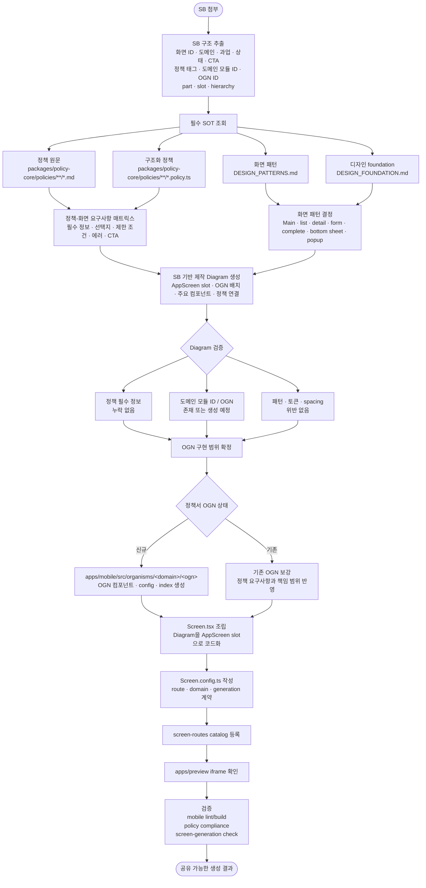
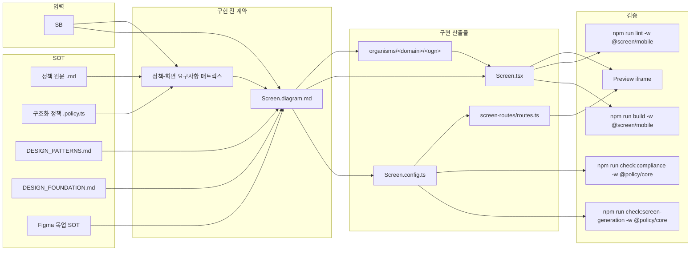
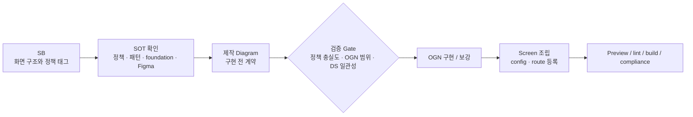

# Screen Generation Flow Diagram

공유용 요약 다이어그램이다. 핵심 메시지는 **SB를 바로 구현하지 않고, 먼저 제작 Diagram을 만들어 정책·디자인·OGN 구현 범위의 계약으로 검증한 뒤 Screen을 조립한다**는 것이다.

## End-to-End Flow

## Artifact Contract

## One-Slide Summary

