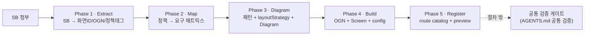

# Screen Generation Procedure Simplification Implementation Plan

> **For agentic workers:** REQUIRED SUB-SKILL: Use superpowers:subagent-driven-development (recommended) or superpowers:executing-plans to implement this plan task-by-task. Steps use checkbox (`- [ ]`) syntax for tracking.

**Goal:** 13단계 서술형 스크린 생성 절차를 5페이즈 책임 계약으로 간소화하고, 검증을 절차 밖 공통 검증 게이트로 분리하며, 절차 문서와 참고 문서의 책임을 분리한다.

**Architecture:** 절차 문서 3종(`SCREEN_GENERATION_FLOW.md` 전면 재작성, `SCREEN_STRUCTURE_PRINCIPLES.md` 헤더 1줄, `AGENTS.md` 절차 섹션 축소·검증 강화)만 수정한다. 화면 코드/스크립트 로직은 변경하지 않는다. 기존 4개 화면의 `Screen.diagram.md` 백필은 Part B로 분리된 후속 워크스트림이다.

**Tech Stack:** Markdown 문서, Node 검증 스크립트(`@policy/core` `check:*`), npm workspace(`@screen/mobile`).

**Spec:** `docs/superpowers/specs/2026-05-16-screen-generation-procedure-simplification-design.md`

---

## 사전 확정 사실 (실행 전 읽기)

- `CLAUDE.md` 는 `AGENTS.md` 의 **symlink**다 (`CLAUDE.md -> AGENTS.md`). 실제 파일은 `AGENTS.md`. **`AGENTS.md` 만 수정하면 `CLAUDE.md` 에 자동 반영된다.**
- 현재 on-disk `AGENTS.md` 의 `## SOT 우선순위` 목록(8항목)에는 `SCREEN_GENERATION_FLOW.md` 항목이 **없다**. spec 7.3의 "SOT 우선순위 설명 갱신"은 on-disk 현실에 맞춰 **문서 지도(`## 문서와 패키지 지도`)의 `SCREEN_GENERATION_FLOW.md` 줄 설명 갱신**으로 대체한다.
- 기존 4개 화면(`NOVA-MBR-PG-001-0/002-0/003-0/005-0`)은 `Screen.config.ts` 에 `generation` 블록이 없고 `Screen.diagram.md` 도 없다 → `check:screen-generation` 은 `adoptionWarning`(비-strict에서 warning, exit 0)이다. 현재 CI는 적색이 아니다.
- `check-compliance-between-policy-sb-diagram-and-screen.mjs` 규칙: 한 화면에 `generation` 과 `Screen.diagram.md` 중 **하나만** 있으면 `problem`(exit 1). 따라서 Part B 백필은 두 산출물을 **반드시 함께** 추가해야 한다.
- `ScreenRouteConfig`(`packages/cx-spec/src/screen.ts:24`)에 `generation?: { source; pattern; policyRefs; ognIds; designDocsChecked }` 가 이미 존재 → 백필 시 `satisfies ScreenRouteConfig` 타입 에러 없음.

---

## File Structure

| 파일 | 책임 | 변경 |
|---|---|---|
| `SCREEN_GENERATION_FLOW.md` | 5페이즈 절차 계약 (when/what/which-doc) + 13→5 매핑 + 산출물 계약 + 검증 포인터 | 전면 재작성 |
| `SCREEN_STRUCTURE_PRINCIPLES.md` | Phase 3 구조/Diagram/layoutStrategy/Distortion Gate 단독 소유 | 상단에 소유 선언 1줄 추가 |
| `AGENTS.md` (=`CLAUDE.md`) | SOT 우선순위·패키지 지도·검증 게이트 | 절차 12항목 → 5페이즈 요약+포인터, 문서지도 줄 갱신, 공통 검증 섹션 강화 |

---

# Part A — 절차 문서 재구성 (이 PR 범위)

## Task 1: `SCREEN_GENERATION_FLOW.md` 전면 재작성

**Files:**
- Modify (overwrite): `SCREEN_GENERATION_FLOW.md`

- [ ] **Step 1: 재작성 전 종료 상태 어서션 정의 (self-test 체크리스트)**

재작성된 파일은 아래를 모두 만족해야 한다. 이 체크리스트를 Step 3 이후 직접 확인한다.

- [A] 5페이즈(Extract/Map/Diagram/Build/Register) 계약 테이블이 있다.
- [B] "검증은 절차 밖 게이트"라는 포인터가 1곳 이상 있고 `AGENTS.md` 공통 검증을 가리킨다.
- [C] `Screen.diagram.md` 가 "모든 화면 의무"로 명시된다(신규 화면 한정 표현 없음).
- [D] 13단계 → 5페이즈 매핑 섹션이 있다.
- [E] STRUCTURE_PRINCIPLES의 Layout Distortion Gate / Diagram 작성 규칙 본문을 **재서술하지 않고** 참조로만 가리킨다.
- [F] 생성 산출물 폴더 구조 + `screenConfig` 예시(실제 `satisfies ScreenRouteConfig` 형태 + `generation` 블록)가 있다.
- [G] mermaid 다이어그램이 5페이즈 흐름이다(기존 13노드 flowchart 아님).
- [H] 기존 220~231줄의 검증 명령 나열 서술이 없다(포인터 1줄로 대체).

- [ ] **Step 2: 현재 파일 백업 확인 (git이 추적 중이므로 별도 백업 불필요)**

Run: `git status --short SCREEN_GENERATION_FLOW.md`
Expected: 변경 없음(clean) — 작업 시작 기준선.

- [ ] **Step 3: 파일 전체를 아래 내용으로 덮어쓴다**

`SCREEN_GENERATION_FLOW.md` 전체를 다음으로 교체한다:

````markdown
# Screen Generation Flow

SB가 첨부됐을 때 스크린을 생성하는 절차 계약이다. 이 문서는 **언제 / 무엇을 / 어떤 문서를 보고** 만드는지만 정의한다. 구조 원칙·패턴·spacing·foundation·검증의 내용은 각 참고 문서가 단독 소유하며, 이 문서는 가리키기만 한다(재서술 금지).

절차는 5개 책임 페이즈로 구성된다. 각 페이즈는 단일 책임, 고정 참고 문서, 단일 산출물, 완료조건(DoD)을 가진다. DoD는 검증이 아니라 "이 산출물이 내적으로 완성되어 다음 페이즈로 넘어갈 수 있는가"의 자체 판단 기준이다. `lint` / `build` / `check:*` 는 DoD가 아니다.

> **검증은 절차 페이즈가 아니다.** `lint` / `build` / `check:*` 실행과 그 책임은 `AGENTS.md` 의 `## 공통 검증` 섹션이 단독 소유하는 절차 밖 게이트다.

## 5 페이즈 계약

| Phase | 책임 (단일) | 참고 문서 (고정) | 산출물 | 완료조건 (DoD) |
|---|---|---|---|---|
| **1 · Extract** | SB → 화면ID·도메인·과업·상태·CTA·정책태그·도메인모듈ID/OGN ID·slot/part/hierarchy 추출 | SB (입력) | 추출 요약 | 화면ID·도메인·OGN ID·정책태그 누락 0으로 목록화 |
| **2 · Map** | 정책 필수정보/선택지/제약/에러/sourceRef → 화면 요구 매트릭스, 사용자 copy 분리 | `packages/policy-core/policies/**/*.md`, `*.policy.ts` | 정책-화면 요구사항 매트릭스 | 모든 정책태그가 화면 정보/CTA/에러로 매핑. 누락 시 다음 페이즈 진입 금지 |
| **3 · Diagram** | 화면 패턴 결정 + OGN별 layoutStrategy + reuse/new 분기 + SB 기반 Diagram, Layout Distortion Gate 자체 통과 | `DESIGN_PATTERNS.md`, `SCREEN_STRUCTURE_PRINCIPLES.md` | `Screen.diagram.md` (모든 화면 의무) | `Screen→Chrome→Section→Slot→Stack→Component` 로 설명, OGN별 layoutStrategy·정책연결·reuse/new 표기 |
| **4 · Build** | 정책서 OGN 제작/보강 + `Screen.tsx` 조립 + `Screen.config.ts`(생성근거 포함) | `DESIGN_FOUNDATION.md`, `@pxds/cx-components`, `@pxds/cx-icons`, `@pxds/cx-tokens`, `@pxds/cx-layout` | `apps/mobile/src/organisms/<route-group-or-domain>/<ogn>/`, `Screen.tsx`, `Screen.config.ts` | Diagram의 모든 OGN/슬롯이 코드에 존재, `config.generation` 블록 채워짐 |
| **5 · Register** | route catalog 등록 + preview 노출 확인 | `apps/mobile/src/scripts/screen-routes/` | `routes.ts` 등록 항목 | route 등록 + preview iframe에서 해당 route 진입 가능 |

페이즈 이후 `lint` / `build` / `check:*` 는 절차 밖의 공통 검증 게이트(아래 `## 검증` 참조)가 실행한다.

## 페이즈 흐름



## 페이즈별 책임

### Phase 1 · Extract

- 책임: SB에서 화면 ID, 도메인, 과업, 상태, CTA, 정책 태그, 도메인 모듈 ID, OGN ID, part/slot/hierarchy를 추출한다.
- 참고: SB(입력)
- 산출: 추출 요약(Phase 2 입력)
- DoD: 화면ID·도메인·OGN ID·정책태그가 누락 0으로 목록화된다.

### Phase 2 · Map

- 책임: 정책 필수정보·선택지·제약·에러·sourceRef를 화면 요구 매트릭스로 정리하고, 사용자에게 보여줄 copy를 분리한다.
- 참고: `packages/policy-core/policies/**/*.md`, `packages/policy-core/policies/**/*.policy.ts`
- 산출: 정책-화면 요구사항 매트릭스
- DoD: 모든 정책 태그가 화면 정보/CTA/에러로 매핑된다. 정책 필수 정보가 누락되면 Phase 3로 진입하지 않는다.
- 이 페이즈는 디자인 문서를 참조하지 않는다. 정책 충실도(무엇을)가 디자인 표현(어떻게)에 의해 미리 걸러지지 않도록 의도적으로 분리한다.

### Phase 3 · Diagram

- 책임: 화면 패턴 결정 + OGN별 layoutStrategy 작성 + 컴포넌트 reuse/new 분기 + SB 기반 제작 Diagram 작성, Layout Distortion Gate 자체 통과.
- 참고: `DESIGN_PATTERNS.md`, `SCREEN_STRUCTURE_PRINCIPLES.md`
- 산출: `Screen.diagram.md` — **모든 화면 의무다.** 신규/기존 구분 없이 모든 화면이 이 산출물을 가진다.
- DoD: Diagram이 `Screen → Chrome → Section → Slot → Stack → Component` 구조로 설명되고, 각 OGN에 layoutStrategy·정책 연결·reuse/new 표기가 있다.
- Diagram 작성 규칙, OGN별 layoutStrategy 형식, Layout Distortion Gate, 금지 신호, 설계 체크리스트의 상세는 `SCREEN_STRUCTURE_PRINCIPLES.md` 가 단독 소유한다. 이 문서는 그 규칙을 재서술하지 않고 그 문서를 따른다.

### Phase 4 · Build

- 책임: 정책서 도메인 모듈 ID/OGN별로 `apps/mobile/src/organisms/<route-group-or-domain>/` 아래에 OGN을 제작하거나 기존 OGN을 보강하고, `Screen.tsx` 를 Diagram 그대로 조립하며, `Screen.config.ts` 에 생성 근거(`generation`)를 담는다.
- 참고: `DESIGN_FOUNDATION.md`, `@pxds/cx-components`, `@pxds/cx-icons`, `@pxds/cx-tokens`, `@pxds/cx-layout`. `@pxds/pxds-components` / `@pxds/pxds-icons` 는 deprecated 호환 경계로만 다룬다.
- 산출: `apps/mobile/src/organisms/<route-group-or-domain>/<ogn>/`, `Screen.tsx`, `Screen.config.ts`
- DoD: Diagram의 모든 OGN/슬롯이 코드에 존재하고, `Screen.config.ts` 의 `generation` 블록이 채워진다.

### Phase 5 · Register

- 책임: `apps/mobile/src/scripts/screen-routes/routes.ts` 에 화면을 등록하고, preview에서 해당 route가 노출되는지 확인한다.
- 참고: `apps/mobile/src/scripts/screen-routes/`
- 산출: `routes.ts` 등록 항목
- DoD: route catalog가 화면 디렉터리를 참조하고, preview iframe에서 해당 route로 진입할 수 있다.

## 생성 산출물 계약

SB 기반 화면 폴더는 다음 산출물을 가진다. `Screen.diagram.md` 는 **모든 화면 의무**다.

```txt
apps/mobile/src/app/(<route-group>)/<screen-id>/
├── Screen.tsx
├── Screen.config.ts
├── Screen.diagram.md
├── page.tsx
└── index.ts
```

`Screen.config.ts` 는 route 등록 정보와 생성 근거(`generation`)를 함께 담는 단일 계약이다. `Screen.meta.json` 같은 별도 meta 파일을 만들지 않는다.

```ts
import type { ScreenRouteConfig } from "@pxds/cx-spec";
import { defineScreenConfig } from "@pxds/cx-spec";

export const screenConfig = defineScreenConfig({
	id: "NOVA-MBR-PG-001-0",
	name: "MBR 가입 1·약관 동의",
	label: "MBR 가입 1·약관 동의",
	route: "/NOVA-MBR-PG-001-0",
	group: "nova-mbr-legacy",
	owner: "@screen/mobile",
	status: "active",
	createdAt: "2026-05-11",
	domain: "mbr",
	node: { kind: "screen" },
	figma: { frameName: "NOVA-MBR-PG-001-0", width: 375, height: 812 },
	generation: {
		source: "SB",
		pattern: "form",
		policyRefs: ["POL-MBR-TERM-001-06"],
		ognIds: ["ogn-mbr-checkbox-terms"],
		designDocsChecked: [
			"DESIGN_PATTERNS.md",
			"DESIGN_FOUNDATION.md",
			"SCREEN_STRUCTURE_PRINCIPLES.md",
		],
	},
} as const satisfies ScreenRouteConfig);
```

`Screen.diagram.md` 는 최소한 `AppScreen`, 화면 ID, `generation.ognIds` 의 모든 OGN ID, `generation.policyRefs` 의 모든 정책 ID를 포함해야 한다(`check:screen-generation` 계약). Diagram 구조 형식은 `SCREEN_STRUCTURE_PRINCIPLES.md` 를 따른다.

## 13단계 → 5페이즈 매핑 (추적성)

기존 13단계 절차가 어느 페이즈로 흡수되는지 명시한다.

- 기존 1 → Phase 1
- 기존 2 (SOT 6종 일괄 조회) → 해체. 페이즈별 고정 참고 문서로 분산(2단계 포괄 요구 제거)
- 기존 3 → Phase 2
- 기존 4·5·6·7·8 → Phase 3 (패턴 결정 + layoutStrategy + reuse/new + Diagram + Layout Distortion Gate)
- 기존 9·10·11 → Phase 4
- 기존 11(route)·12(preview) → Phase 5
- 기존 13(검증) + 검증 명령 나열 서술 → 절차 밖 공통 검증 게이트로 이동

## 검증

검증은 이 절차 밖이다. 실행 명령과 책임은 `AGENTS.md` 의 `## 공통 검증` 섹션이 단독 소유한다. 생성 정합성은 `@policy/core` 의 `check:screen-generation`(+`--strict`), `check:policy-source` 가 검사한다.

## 관련 문서

- `SCREEN_STRUCTURE_PRINCIPLES.md` — Phase 3 구조/Diagram/layoutStrategy/Layout Distortion Gate 단독 소유
- `DESIGN_PATTERNS.md` / `DESIGN_FOUNDATION.md` /  — Phase 3/4 패턴·시각·spacing 참고
- `packages/policy-core/policies` — Phase 2 정책 원천
- `AGENTS.md` `## 공통 검증` — 검증 게이트 (절차 밖)
````

- [ ] **Step 4: Step 1의 [A]~[H] 어서션을 파일에서 직접 확인**

Run: `grep -c "Phase 1 · Extract" SCREEN_GENERATION_FLOW.md && grep -c "모든 화면 의무" SCREEN_GENERATION_FLOW.md && grep -c "검증은 절차 페이즈가 아니다" SCREEN_GENERATION_FLOW.md && grep -c "13단계 → 5페이즈 매핑" SCREEN_GENERATION_FLOW.md && grep -c "flowchart LR" SCREEN_GENERATION_FLOW.md`
Expected: 각 grep이 1 이상. (Layout Distortion Gate 본문이 재서술되지 않았는지: `grep -c "Layout Distortion Gate" SCREEN_GENERATION_FLOW.md` 결과는 1~2(참조 언급만), 본문 규칙 나열 없음 — 육안 확인)

- [ ] **Step 5: 기존 13단계 서술/검증 나열이 제거됐는지 확인**

Run: `grep -c "check:screen-generation:strict" SCREEN_GENERATION_FLOW.md`
Expected: `0` (검증 명령 나열 서술이 제거됨; `--strict` 는 `## 검증` 포인터 문장에만 등장하므로 `grep -c "check:screen-generation" SCREEN_GENERATION_FLOW.md` 는 1)

- [ ] **Step 6: Commit**

```bash
git add SCREEN_GENERATION_FLOW.md
git commit -m "docs: rewrite SCREEN_GENERATION_FLOW as 5-phase responsibility contract

13단계 서술형 절차를 5페이즈 계약(Extract/Map/Diagram/Build/Register)으로
간소화. 검증을 절차 밖 게이트로 분리(포인터 1줄). Screen.diagram.md를
모든 화면 의무로 명시. STRUCTURE_PRINCIPLES 중복 서술 제거.

Co-Authored-By: Claude Opus 4.7 (1M context) <noreply@anthropic.com>"
```

---

## Task 2: `SCREEN_STRUCTURE_PRINCIPLES.md` 단독 소유 선언 추가

**Files:**
- Modify: `SCREEN_STRUCTURE_PRINCIPLES.md:1-3`

- [ ] **Step 1: 현재 파일 상단 확인**

Run: `head -3 SCREEN_STRUCTURE_PRINCIPLES.md`
Expected:
```
# Screen Structure Principles

모바일 화면과 `Screen.diagram.md`를 만들 때 먼저 적용하는 구조 원칙이다. 정책서와 Figma SOT를 읽은 뒤 곧바로 구현으로 가지 않고, 제한된 layout vocabulary로 화면의 뼈대를 먼저 정리한다.
```

- [ ] **Step 2: 제목 바로 다음에 소유 선언 1줄 삽입**

`old_string`:
```
# Screen Structure Principles

모바일 화면과 `Screen.diagram.md`를 만들 때 먼저 적용하는 구조 원칙이다. 정책서와 Figma SOT를 읽은 뒤 곧바로 구현으로 가지 않고, 제한된 layout vocabulary로 화면의 뼈대를 먼저 정리한다.
```

`new_string`:
```
# Screen Structure Principles

> 이 문서는 `SCREEN_GENERATION_FLOW.md` Phase 3의 **구조 원칙·Diagram 작성 규칙·OGN별 layoutStrategy·Layout Distortion Gate** 책임을 단독 소유한다. 절차 문서는 이 규칙을 재서술하지 않고 이 문서를 가리킨다.

모바일 화면과 `Screen.diagram.md`를 만들 때 먼저 적용하는 구조 원칙이다. 정책서와 Figma SOT를 읽은 뒤 곧바로 구현으로 가지 않고, 제한된 layout vocabulary로 화면의 뼈대를 먼저 정리한다.
```

- [ ] **Step 3: 삽입 확인**

Run: `grep -c "Phase 3의 \*\*구조 원칙" SCREEN_STRUCTURE_PRINCIPLES.md`
Expected: `1`

- [ ] **Step 4: Commit**

```bash
git add SCREEN_STRUCTURE_PRINCIPLES.md
git commit -m "docs: declare STRUCTURE_PRINCIPLES as sole owner of Phase 3 structure rules

Co-Authored-By: Claude Opus 4.7 (1M context) <noreply@anthropic.com>"
```

---

## Task 3: `AGENTS.md` 절차 섹션 축소 + 검증 게이트 강화 + 문서지도 갱신

**Files:**
- Modify: `AGENTS.md` (`## 정책서 기반 화면 생성 흐름` 72-89줄, `## 문서와 패키지 지도` 67줄, `## 공통 검증` 154-161줄)

> 주의: `CLAUDE.md` 는 `AGENTS.md` 의 symlink이므로 `AGENTS.md` 만 편집한다.

- [ ] **Step 1: symlink 재확인**

Run: `ls -l CLAUDE.md`
Expected: `CLAUDE.md -> AGENTS.md` (symlink 확인. 만약 별도 파일이면 두 파일 동일 편집 필요 — 본 계획은 symlink 전제)

- [ ] **Step 2: `## 정책서 기반 화면 생성 흐름` 12항목을 5페이즈 요약+포인터로 교체**

`old_string` (AGENTS.md 72-89줄 전체):
```
## 정책서 기반 화면 생성 흐름

새 화면을 만들거나 기존 화면을 고칠 때는 아래 흐름을 기본으로 한다.

SB가 첨부된 신규 화면 생성은 `SCREEN_GENERATION_FLOW.md`를 따른다. 이 문서는 SB 구조 추출, 필수 SOT 조회, 제작 Diagram 생성, Diagram 검증, OGN 구현, Screen 조립, preview/검증까지의 표준 순서를 정의한다. Diagram과 화면 조립은 `SCREEN_STRUCTURE_PRINCIPLES.md`의 `Screen -> Chrome -> Section -> Slot -> Stack -> Component` 구조를 먼저 적용한다.

1. SB에서 화면 ID, 도메인, 과업, 상태, CTA, 정책 태그, 도메인 모듈 ID, OGN ID, part/slot/hierarchy를 추출한다.
2. `packages/policy-core/policies`에서 관련 정책 md와 `.policy.ts`를 확인한다.
3. `DESIGN_PATTERNS.md`, `DESIGN_FOUNDATION.md`, `SCREEN_STRUCTURE_PRINCIPLES.md`를 반드시 조회한다.
4. 정책의 필수 요구사항, 선택지, 제한 조건, evidence/sourceRef, 사용자에게 보여줄 copy를 분리한다.
5. 화면 유형을 `DESIGN_PATTERNS.md`의 패턴 중 하나로 매핑한다. 맞는 패턴이 없으면 새 패턴을 만들기 전에 기존 패턴의 변형으로 표현 가능한지 검토한다.
6. 구현 전에 SB 기반 제작 Diagram을 작성한다. Diagram은 좌표 보정표가 아니라 AppScreen slot, section boundary, slot 이름, OGN 배치, 주요 컴포넌트, 정책 연결을 함께 보여주어야 한다.
7. Diagram 단계에서 정책 필수 정보, 정책서의 도메인 모듈 ID/OGN 포함 여부, 패턴/토큰/spacing 위반 여부를 검증한다.
8. 정책서에 적힌 도메인 모듈 ID/OGN별로 반드시 `apps/mobile/src/organisms/<route-group-or-domain>/` 아래에 컴포넌트를 제작하거나 기존 OGN을 보강한다.
9. 시각 표현은 `DESIGN_FOUNDATION.md`의 semantic token, text style, spacing, radius, icon 규칙을 우선한다.
10. 구현은 `@pxds/cx-layout`, `@pxds/cx-components`, `@pxds/cx-icons`, `@pxds/cx-tokens`의 공개 surface를 우선 사용한다. `@pxds/pxds-components`와 `@pxds/pxds-icons`는 deprecated 호환 경계로만 다룬다.
11. 화면 route는 정책 의미와 화면 구조가 읽히는 지도여야 한다. 복잡한 의미 단위는 `apps/mobile/src/organisms`에 둔다.
12. preview에서 screen, component, policy registry를 통해 생성 결과를 탐색 가능하게 유지한다.
```

`new_string`:
```
## 정책서 기반 화면 생성 흐름

새 화면을 만들거나 기존 화면을 고칠 때는 `SCREEN_GENERATION_FLOW.md` 의 **5페이즈 절차 계약**을 따른다. 이 문서(AGENTS.md)는 절차를 재서술하지 않고 페이즈 요약과 포인터만 둔다.

1. **Extract** — SB에서 화면ID·도메인·과업·상태·CTA·정책태그·도메인모듈ID/OGN ID·slot/part/hierarchy 추출. 참고: SB.
2. **Map** — 정책 필수정보/선택지/제약/에러/sourceRef → 화면 요구 매트릭스, 사용자 copy 분리. 참고: `packages/policy-core/policies`.
3. **Diagram** — 패턴 결정 + OGN별 layoutStrategy + reuse/new 분기 + SB 기반 Diagram, Layout Distortion Gate 통과. 산출: `Screen.diagram.md`(모든 화면 의무). 참고: `DESIGN_PATTERNS.md`, `SCREEN_STRUCTURE_PRINCIPLES.md`.
4. **Build** — 정책서 OGN을 `apps/mobile/src/organisms/<route-group-or-domain>/` 에 제작/보강 + `Screen.tsx` 조립 + `Screen.config.ts`(`generation` 포함). 참고: `DESIGN_FOUNDATION.md`, `@pxds/cx-components`, `@pxds/cx-icons`, `@pxds/cx-tokens`, `@pxds/cx-layout`.
5. **Register** — `apps/mobile/src/scripts/screen-routes/routes.ts` 등록 + preview 노출 확인.

페이즈별 책임·산출물·완료조건의 단일 SOT는 `SCREEN_GENERATION_FLOW.md` 다. 검증은 절차 밖이며 아래 `## 공통 검증` 이 단독 소유한다.
```

- [ ] **Step 3: 문서 지도의 `SCREEN_GENERATION_FLOW.md` 줄 설명 갱신**

`old_string`:
```
├── SCREEN_GENERATION_FLOW.md  SB 첨부 기반 스크린 생성 workflow SOT
```

`new_string`:
```
├── SCREEN_GENERATION_FLOW.md  SB 첨부 기반 스크린 생성 5페이즈 절차 계약 SOT
```

- [ ] **Step 4: `## 공통 검증` 섹션을 "절차 밖 게이트"로 강화**

`old_string` (AGENTS.md 154-161줄):
```
## 공통 검증

작업 범위에 맞게 실행한다.

- mobile: `npm run lint -w @screen/mobile`, `npm run build -w @screen/mobile`
- preview: `npm run lint -w @screen/preview`, `npm run build -w @screen/preview`
- policy: `npm run check:compliance -w @policy/core`
- package-only 변경: 관련 package의 타입/consumer build로 검증한다. 이 모노레포는 앱 빌드가 가장 현실적인 통합 검증이다.
```

`new_string`:
```
## 공통 검증

검증은 스크린 생성 절차(`SCREEN_GENERATION_FLOW.md` 의 5페이즈)의 일부가 아니다. 절차 밖 게이트이며 이 섹션과 `@policy/core` 의 `check:*` 스크립트가 검증 명령·책임을 단독 소유한다. 작업 범위에 맞게 실행한다.

- mobile: `npm run lint -w @screen/mobile`, `npm run build -w @screen/mobile`
- preview: `npm run lint -w @screen/preview`, `npm run build -w @screen/preview`
- policy: `npm run check:compliance -w @policy/core` (= `check:policy-source` + `check:screen-generation`). 신규 화면 생성 정합성 강제는 `npm run check:screen-generation:strict -w @policy/core`.
- package-only 변경: 관련 package의 타입/consumer build로 검증한다. 이 모노레포는 앱 빌드가 가장 현실적인 통합 검증이다.
```

- [ ] **Step 5: 변경 확인**

Run: `grep -c "5페이즈 절차 계약" AGENTS.md && grep -c "검증은 스크린 생성 절차" AGENTS.md && grep -c "^1\. \*\*Extract\*\*" AGENTS.md`
Expected: 첫째 ≥ 2 (문서지도 + 흐름 섹션), 둘째 1, 셋째 1.

Run: `grep -n "정책서 기반 화면 생성 흐름" CLAUDE.md`
Expected: symlink을 통해 동일 변경 반영(같은 줄 출력) — symlink 무결성 확인.

- [ ] **Step 6: Commit**

```bash
git add AGENTS.md
git commit -m "docs: shrink AGENTS.md procedure to 5-phase pointer, harden verification gate

절차 12항목 서술을 5페이즈 요약+SCREEN_GENERATION_FLOW 포인터로 축소.
공통 검증 섹션을 '절차 밖 게이트 단독 소유'로 명시 강화. 문서지도
SCREEN_GENERATION_FLOW 설명을 5페이즈 절차 계약으로 갱신.

Co-Authored-By: Claude Opus 4.7 (1M context) <noreply@anthropic.com>"
```

---

## Task 4: 무회귀 통합 검증 + 스펙 커버리지 확인

**Files:** (변경 없음 — 검증만)

- [ ] **Step 1: 검증 스크립트 baseline이 유지되는지 확인 (문서 변경은 check 대상이 아님)**

Run: `npm run check:screen-generation -w @policy/core`
Expected: PASS (exit 0). summary에 `problems : 0`, 기존 4개 화면은 `adoption warnings` 로 집계(이번 변경으로 늘지 않음). 절차 문서 수정은 이 스크립트 입력(`Screen.config.ts`/`Screen.diagram.md`)이 아니므로 결과 불변.

- [ ] **Step 2: 정책 원문 정합성 무회귀 확인**

Run: `npm run check:policy-source -w @policy/core`
Expected: PASS (exit 0) — 정책 파일 미변경이므로 baseline과 동일.

- [ ] **Step 3: mobile lint/build 무회귀 확인 (문서는 빌드 입력 아님 — 안전망)**

Run: `npm run lint -w @screen/mobile && npm run build -w @screen/mobile`
Expected: PASS. 마크다운 SOT 문서는 `@screen/mobile` 빌드/lint 대상이 아니므로 baseline과 동일.

- [ ] **Step 4: 스펙 커버리지 자체 점검 (spec 섹션 ↔ Task 매핑)**

아래를 직접 확인한다:
- spec §4 5페이즈 계약 → Task 1 (FLOW 테이블 + 페이즈별 책임)
- spec §4.1 13→5 매핑 → Task 1 (`## 13단계 → 5페이즈 매핑`)
- spec §5 검증 분리 → Task 1(포인터) + Task 3(공통 검증 강화)
- spec §6 문서 책임 분리 맵 → Task 1(재서술 금지 문구) + Task 2(STRUCTURE 소유 선언) + Task 3(AGENTS 포인터화)
- spec §7.1 FLOW 전면 재작성 → Task 1
- spec §7.2 STRUCTURE 헤더 1줄 → Task 2
- spec §7.3 AGENTS 축소·검증·문서지도 → Task 3 (SOT 우선순위는 on-disk에 FLOW 항목 부재 → 문서지도 줄 갱신으로 대체, 사전 확정 사실 참조)
- spec §7.4 기존 4개/스크립트 무변경 → Part A 어느 Task도 화면/스크립트 미변경 (Task 4 Step 1으로 무회귀 입증)
- spec §2 "모든 화면 Screen.diagram.md 의무" → Task 1 (Phase 3 산출물 + 산출물 계약 "모든 화면 의무")

누락 발견 시 해당 Task에 step 추가 후 재실행.

- [ ] **Step 5: Part A 완료 커밋 로그 확인 (별도 커밋 불필요)**

Run: `git log --oneline -4`
Expected: Task 1·2·3 커밋 3개 + 스펙 커밋이 보임. Part A 작업 트리 clean(`git status --short` → empty).

---

# Part B — 기존 4개 화면 Diagram 백필 (별도 후속 워크스트림)

> **스코프 경계:** Part B는 Part A(절차 문서 확정)가 머지된 **뒤** 진행하는 분리된 워크스트림이다. 각 화면 백필은 그 화면의 코드/OGN/정책을 역공학하는 독립 작업이라, 정밀한 per-screen 내용은 Part A 확정본(FLOW/STRUCTURE)을 기준으로 실행 시점에 도출해야 한다. 아래는 **화면당 동일하게 적용되는 결정적 절차 템플릿**이다(placeholder 아님 — 실행 시 discover 명령으로 값이 확정됨).
>
> 권장: Part A 머지 후 Part B 전용 plan(`docs/superpowers/plans/<date>-mbr-screen-diagram-backfill.md`)을 별도 작성해 화면별 Task로 전개한다. 본 섹션은 그 plan의 작성 근거이자 화면당 실행 계약이다.

## Part B 공통 제약 (모든 화면 공통)

- `Screen.diagram.md` 와 `Screen.config.ts` 의 `generation` 블록은 **반드시 함께** 추가한다(둘 중 하나만 있으면 `check:screen-generation` 이 `problem`/exit 1).
- `generation.policyRefs` 의 각 ID는 `packages/policy-core/policies/**/*.policy.ts` 의 실제 `id` 여야 한다(미존재 시 `unknown policyRef` problem).
- `generation.ognIds` 의 각 ID는 `apps/mobile/src/organisms/<route-group-or-domain>/*/*.config.ts` 의 실제 `id` 여야 하고, 해당 OGN의 resolved domain 이 화면 `domain` 과 같아야 하며, 그 OGN의 React 컴포넌트 이름이 `Screen.tsx` 에 등장해야 한다. 예: `nova-mbr-legacy` route group은 검증에서 `mbr` domain으로 해석된다.
- `generation.designDocsChecked` 는 최소 `"DESIGN_PATTERNS.md"`, `"DESIGN_FOUNDATION.md"` 를 포함해야 한다.
- `Screen.diagram.md` 본문은 `AppScreen`, 화면 ID 문자열, 모든 `ognIds`, 모든 `policyRefs` 문자열을 포함해야 한다.
- Diagram 구조는 `SCREEN_STRUCTURE_PRINCIPLES.md` 형식(`AppScreen → SystemHeader/Header/Content/Bottom`, OGN별 `layoutStrategy`)을 따른다.

## 화면당 Task 템플릿 (4회 반복: 001-0, 002-0, 003-0, 005-0)

대상 화면 디렉터리: `apps/mobile/src/app/(nova-mbr-legacy)/<SCREEN_ID>/` (`<SCREEN_ID>` ∈ {`NOVA-MBR-PG-001-0`, `NOVA-MBR-PG-002-0`, `NOVA-MBR-PG-003-0`, `NOVA-MBR-PG-005-0`})

- [ ] **Step 1: 화면이 사용하는 OGN 식별 (discover)**

Run: `cat "apps/mobile/src/app/(nova-mbr-legacy)/<SCREEN_ID>/Screen.tsx"`
그리고: `ls apps/mobile/src/organisms/nova-mbr-legacy/` 및 각 후보 OGN의 `*.config.ts` 의 `id` 확인:
Run: `grep -rn "id:" apps/mobile/src/organisms/nova-mbr-legacy/*/*.config.ts`
→ `Screen.tsx` 가 실제 import/사용하는 organism 컴포넌트와 매칭해 `ognIds` 목록 확정.

- [ ] **Step 2: 화면이 표현하는 정책 ID 식별 (discover)**

Run: `grep -rn "id:" packages/policy-core/policies/**/*.policy.ts | grep -i mbr`
→ 화면 과업(가입 약관/개인정보/본인인증/완료)에 해당하는 정책 `id` 를 `policyRefs` 로 확정. 화면 의미와 정책 md를 대조해 선정.

- [ ] **Step 3: `Screen.diagram.md` 작성**

`apps/mobile/src/app/(nova-mbr-legacy)/<SCREEN_ID>/Screen.diagram.md` 생성. `SCREEN_STRUCTURE_PRINCIPLES.md` 의 "추천 Diagram 형태"를 따르고, 첫 줄에 화면 ID를 명시하며, 본문에 `AppScreen`, 모든 `ognIds`, 모든 `policyRefs` 를 포함한다. 각 OGN section에 `layoutStrategy`(widthTier/stack/alignment/typography/wrapping/overflow)와 `vocabularyDecision`(reuse/new)을 기록한다.

- [ ] **Step 4: `Screen.config.ts` 에 `generation` 블록 추가**

`apps/mobile/src/app/(nova-mbr-legacy)/<SCREEN_ID>/Screen.config.ts` 의 객체에 `domain` 다음 위치로 `generation` 블록 추가(`as const satisfies ScreenRouteConfig` 유지). Step 1·2에서 확정한 `ognIds`, `policyRefs` 사용, `designDocsChecked` 는 `["DESIGN_PATTERNS.md","DESIGN_FOUNDATION.md","SCREEN_STRUCTURE_PRINCIPLES.md"]`, `source: "SB"`, `pattern` 은 화면 유형(form/complete 등).

- [ ] **Step 5: 해당 화면 정합성 검증 (red→green)**

Run: `npm run check:screen-generation -w @policy/core`
Expected: 대상 화면이 `generation checked` 로 집계되고 그 화면 관련 `problems : 0`. (`Screen.diagram.md` must include AppScreen/screenId/ognIds/policyRefs 통과, organism domain/이름 일치 통과, route catalog 참조 통과.)
실패 시: 메시지(`unknown policyRef` / `unknown ognId` / `must include ...`)에 따라 Step 1~4 수정 후 재실행. 근본 원인 해결 없이는 다음 화면으로 넘어가지 않는다.

- [ ] **Step 6: 타입/빌드 무회귀**

Run: `npm run lint -w @screen/mobile && npm run build -w @screen/mobile`
Expected: PASS (`generation` 블록이 `ScreenRouteConfig.generation?` 와 형 일치).

- [ ] **Step 7: Commit (화면당 1커밋)**

```bash
git add "apps/mobile/src/app/(nova-mbr-legacy)/<SCREEN_ID>/Screen.diagram.md" "apps/mobile/src/app/(nova-mbr-legacy)/<SCREEN_ID>/Screen.config.ts"
git commit -m "docs(nova-mbr-legacy): backfill Screen.diagram.md + generation for <SCREEN_ID>

Co-Authored-By: Claude Opus 4.7 (1M context) <noreply@anthropic.com>"
```

## Part B 종료 검증

- [ ] 4개 화면 모두 Step 1~7 완료 후: `npm run check:screen-generation:strict -w @policy/core`
Expected: PASS (exit 0). `adoption warnings : 0`, `generation checked : 4` (이상), `problems : 0`. strict 게이트를 전체 화면에 켤 수 있는 상태가 됨(spec §8 후속 항목 충족).

---

## Self-Review (작성자 점검 완료 기록)

- **스펙 커버리지:** spec §2·§4·§4.1·§5·§6·§7.1~7.4·§8·§9 → Task 1~4(Part A) + Part B 템플릿으로 전부 매핑됨. spec §7.3의 "SOT 우선순위 갱신"은 on-disk AGENTS.md에 해당 항목이 없어 문서지도 줄 갱신으로 대체(사전 확정 사실에 명시).
- **Placeholder 스캔:** `<SCREEN_ID>` 는 placeholder가 아니라 4값으로 명시된 반복 파라미터이며 discover 명령으로 `ognIds`/`policyRefs` 가 결정됨. "TBD/적절히 처리" 류 없음. Part A 모든 코드 step은 완전한 교체 본문/exact old_string·new_string 포함.
- **타입 일관성:** `generation` 형태는 `ScreenRouteConfig.generation?`(`source/pattern/policyRefs/ognIds/designDocsChecked`)와 일치. FLOW 예시 `screenConfig` 는 실제 `ScreenRouteConfig` 필드(name/label/group/owner/status/createdAt/node/figma)와 일치. check 스크립트가 요구하는 diagram 포함 항목(AppScreen/screenId/ognIds/policyRefs)과 Part B Step 3·5 일치.
