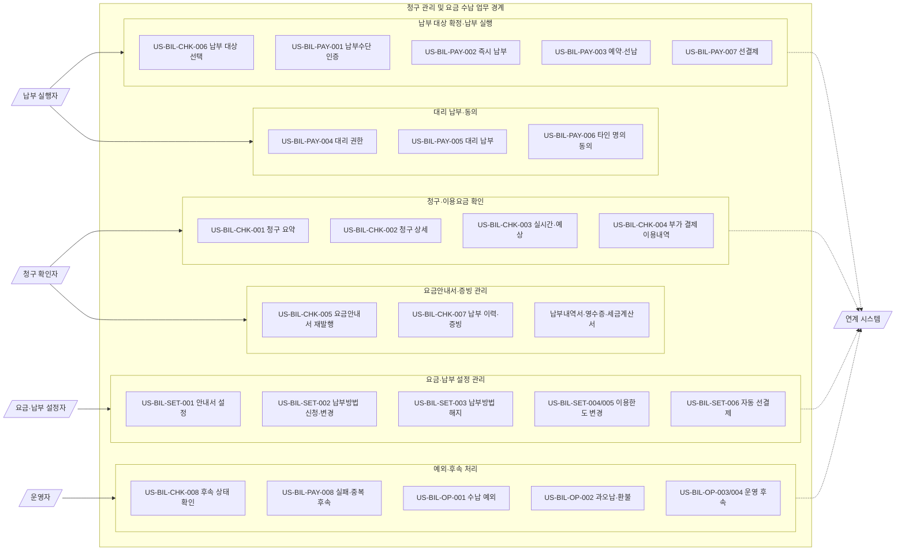
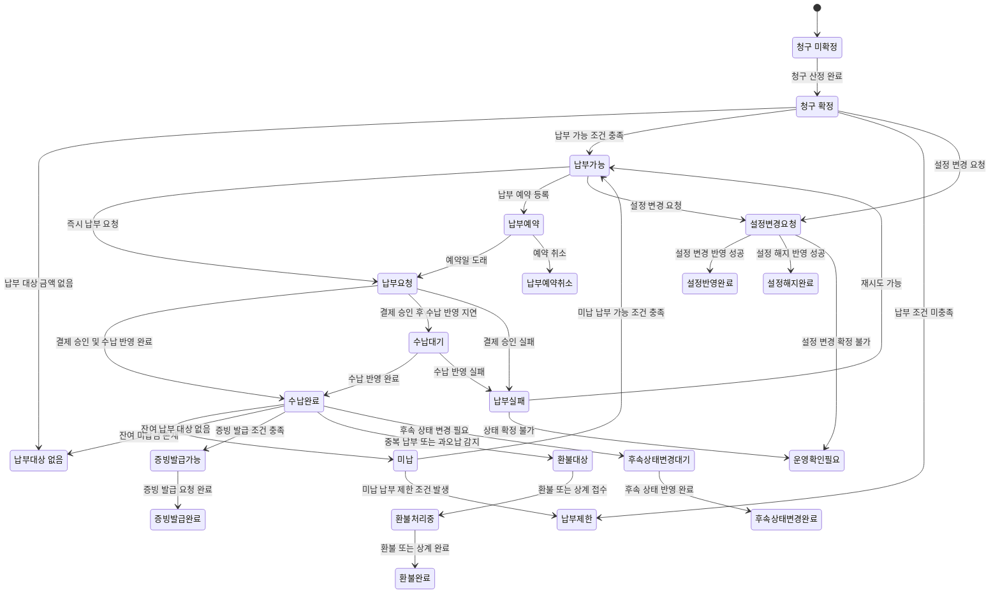

# 청구 관리 및 요금 수납 정책서

|           |                           |
|-----------|---------------------------|
| 정책서 ID | POL-BIL              |
| 문서 구분 | Full 버전                 |
| 문서 상태 | 작성중                    |
| 버전      | Full v0.18              |
| 작성자    | SK Telecom 플랫폼기획 2팀 / NC 통합채널 정책서 작성 담당 |
| 작성일    | 2026-05-04                  |

## 0. 문서 히스토리

| 버전 | 변경 내용 | 변경일자 | 변경자 |
|----|----|----|-----|
| Full v0.1 | 청구 관리 및 요금 수납 정책서의 표지와 메타 정보를 작성하였다. 문서 구분과 버전을 Full 기준으로 정리하였다. | 2026-05-04 | NC 통합채널 정책서 작성 담당 |
| Full v0.2 | 0. 문서 히스토리 장을 추가하였다. 정책서 본문에서 템플릿용 작성 가이드 블록을 제외하는 기준을 반영하였다. | 2026-05-04 | NC 통합채널 정책서 작성 담당 |
| Full v0.3 | 1. 개요 장을 추가하였다. 청구 관리 및 요금 수납 업무의 범위, 제외 범위, 설계 원칙을 정의하였다. 청구 이해, 납부 가능 여부 선판정, 수납 결과 반영, 예외 처리, 개인정보·금융정보 보호 기준을 상위 원칙으로 반영하였다. | 2026-05-04 | NC 통합채널 정책서 작성 담당 |
| Full v0.4 | 2. 주요 용어 장을 추가하였다. 청구, 납부, 수납, 미납, 과오납, 납부수단, 납부자, 수납 상태, 영수증, 정지 해제 연계 등 프로세스와 정책 판단에 필요한 기준 용어를 정의하였다. | 2026-05-04 | NC 통합채널 정책서 작성 담당 |
| Full v0.5 | 3. 유즈케이스 정의 중 가. 액터 장을 추가하였다. 청구·납부 업무의 독립 책임 주체를 청구 확인자, 납부 실행자, 운영자, 연계 시스템으로 정의하였다. 고객이라는 포괄 명칭은 액터명에서 제외하고, 청구 금액을 확인하는 주체와 실제 납부를 수행하는 주체를 책임 기준으로 분리하였다. BSS, 결제기관, 금융기관, 인증·동의, 알림, 상담 연계는 시스템 액터를 과도하게 분리하지 않고 연계 시스템으로 통합하였다. 로그인 여부·미납 여부·정지 여부·미성년 여부는 액터가 아니라 상태와 권한 조건으로 다루는 기준을 반영하였다. | 2026-05-04 | NC 통합채널 정책서 작성 담당 |
| Full v0.6 | 3. 유즈케이스 정의 중 나. 유즈케이스 장을 추가하였다. 청구 확인자, 납부 실행자, 운영자, 연계 시스템별 유즈케이스를 정의하였다. 사람 액터가 수행하는 유즈케이스는 프로세스 정의 대상 Y로, 시스템 액터가 수행하는 유즈케이스는 프로세스 정의 대상 N으로 구분하였다. 청구 확인, 납부 실행, 대리 납부, 타인 명의 납부수단 동의, 예외 운영, 청구·수납 상태 반영이 후속 프로세스와 기능·정책으로 연결될 수 있도록 완료 상태 중심으로 작성하였다. | 2026-05-04 | NC 통합채널 정책서 작성 담당 |
| Full v0.7 | 3. 유즈케이스 정의 중 다. 유즈케이스 다이어그램 장을 추가하였다. 청구 확인자, 납부 실행자, 운영자, 연계 시스템과 주요 유즈케이스 간 관계를 도식화하였다. 대리 납부는 납부 실행자 액터의 권한 조건과 유즈케이스로 유지하고, 별도 액터로 분리하지 않는 기준을 유지하였다. | 2026-05-04 | NC 통합채널 정책서 작성 담당 |
| Full v0.8 | As-is 기능표 기준으로 3. 유즈케이스 정의의 액터, 유즈케이스, 유즈케이스 다이어그램을 보정하였다. 요금·납부 설정자를 액터로 추가하고, 실시간·예상 이용요금, 요금안내서, 납부 예약·선납, 납부방법 신청·변경·해지, 휴대폰 결제·콘텐츠 이용료 이용내역·한도·선결제·자동 선결제, 증빙 재발행 유즈케이스를 반영하였다. As-is 기능을 그대로 붙이지 않고 청구·이용요금 확인, 납부 실행, 요금·납부 설정 관리, 증빙 관리, 수납 예외 처리 축으로 재구성하였다. | 2026-05-04 | NC 통합채널 정책서 작성 담당 |
| Full v0.9 | 3. 유즈케이스 정의 중 라. 상태 전이표 장을 추가하였다. 청구·이용요금 확인, 납부 실행, 수납 반영, 납부 예약, 설정 변경, 증빙 발급, 환불, 정지 해제 연계, 운영 확인 필요 상태를 정의하였다. 상태 전이 기준은 고객 노출, 기능 허용, 정책 판단, 후속 처리 기준이 되는 상태만 포함하도록 작성하였다. | 2026-05-04 | NC 통합채널 정책서 작성 담당 |
| Full v0.10 | 4. 프로세스 정의 중 가. 프로세스 목록 장을 추가하였다. 청구·이용요금 확인, 납부 대상 확정, 납부 실행, 요금·납부 설정 관리, 증빙 관리, 수납 예외 처리 유즈케이스를 고객 경험 순서에 맞춰 프로세스로 연결하였다. 각 프로세스에 관련 기능과 관련 정책을 함께 연결하여 후속 기능 정의와 정책 정의의 기준을 마련하였다. | 2026-05-04 | NC 통합채널 정책서 작성 담당 |
| Full v0.11 | 4. 프로세스 정의 중 나. 전체 업무 흐름도 장을 추가하였다. 전체 업무 흐름도 작성 위치를 프로세스 목록 다음으로 조정하고, 후속 프로세스 상세는 다. 항목으로 작성하는 구조로 정리하였다. 청구 확인, 납부 대상 확정, 납부 실행, 요금·납부 설정, 증빙 확인, 운영 예외 처리의 대표 흐름을 BPMN 2.0 표기 기준으로 도식화하였다. | 2026-05-04 | NC 통합채널 정책서 작성 담당 |
| Full v0.12 | 4. 프로세스 정의 중 다. 프로세스 상세 장을 추가하였다. 프로세스 목록에 정의된 26개 유즈케이스 하위 프로세스 전체에 대해 진입 조건, 종료 조건, 선행·후행 프로세스, 관련 기능, 관련 정책을 상세화하였다. 청구 확인, 납부 실행, 요금·납부 설정, 운영 예외 처리 흐름이 후속 기능 정의와 정책 정의로 연결될 수 있도록 정리하였다. | 2026-05-04 | NC 통합채널 정책서 작성 담당 |
| Full v0.13 | 5. 기능 정의 중 가. 기능 목록 장을 추가하였다. 4. 프로세스 정의의 78개 프로세스를 기준으로 기능 ID, 기능명, 설명, 세부 기능 구성을 작성하였다. 프로세스 상세의 관련 기능은 기능 목록의 기능명과 일치하도록 정리하고, 조회·검증·입력·산정·저장·알림·연동·이력 관리 등 구현 검토가 필요한 하위 처리를 세부 기능 구성으로 반영하였다. | 2026-05-04 | NC 통합채널 정책서 작성 담당 |
| Full v0.14 | 5. 기능 정의 > 가. 기능 목록을 프로세스별 기능 매핑 구조로 재작성하고, 공통 기능은 동일 기능 ID로 중복 매핑 | 2026-05-04 | SK Telecom 플랫폼기획 2팀 |
| Full v0.15 | 5. 기능 정의 > 나. 기능 상세를 추가하고 43개 기능의 입력 정보, 처리 로직, 세부 기능 구성, 출력 정보, 실패·예외 케이스, 관련 정책을 작성 | 2026-05-04 | SK Telecom 플랫폼기획 2팀 |
| Full v0.16 | 5. 기능 정의 > 나. 기능 상세의 적용 범위 표기를 정비하고, 내부 작성 기준성 문구를 삭제하였다. 공통 기능은 적용 범위 기준으로, 특정 업무 기능은 관련 유즈케이스명과 유즈케이스 ID 기준으로 수정하였다. | 2026-05-04 | SK Telecom 플랫폼기획 2팀 |
| Full v0.17 | 6. 정책 정의 > 가. 정책 목록을 추가하였다. 4. 프로세스 정의의 78개 프로세스별 관련 정책을 기준으로 정책 ID, 정책명, 설명, 정책 항목을 작성하고, 5. 기능 정의 > 나. 기능 상세의 관련 정책명을 정책 목록 기준으로 정합화하였다. | 2026-05-04 | SK Telecom 플랫폼기획 2팀 |
| Full v0.18 | 6. 정책 정의 > 나. 정책 상세를 추가하였다. 22개 정책 그룹의 정책 항목별 실제 적용 기준, 허용 조건, 제한 조건, 처리 결과, 이력 저장 기준을 작성하였다. | 2026-05-04 | SK Telecom 플랫폼기획 2팀 |

## 1. 개요

### 가. 범위

본 정책서는 NC 통합채널에서 고객이 청구 금액을 이해하고, 납부 대상을 확인하며, 요금을 납부하고, 수납 결과를 확인하는 업무의 정책 기준을 정의한다.

대상 채널은 앱·웹 FO를 기준으로 하며, 고객의 셀프 처리와 운영자의 예외 처리 지원에 필요한 채널·BSS·연계 시스템 간 역할을 포함한다.

본 문서는 청구 요약 조회, 청구 상세 조회, 미납·완납 상태 확인, 납부 가능 여부 판정, 납부수단 선택, 즉시 납부, 수납 결과 반영, 납부 이력·영수증 확인, 미납 해소 및 정지 해제 연계까지를 다룬다.

청구 금액은 당월 청구, 미납 금액, 납부 예정 금액, 일할 계산 금액, 할인·결합·부가서비스·단말 할부·소액결제·콘텐츠 이용료 등 고객이 청구서에서 확인하는 주요 항목을 포함한다.

납부 처리는 카드 납부, 계좌이체, 가상계좌, 자동납부 연계 상태 확인, 가족·타인 명의 납부 지원, 중복 납부 방지, 납부 실패 안내, 과오납·환불 연계 기준을 포함한다.

BSS 및 연계 시스템은 청구 금액 산정 결과 제공, 납부 가능 여부 판정, 결제 승인·실패 결과 수신, 수납 반영, 상태 변경, 이력 저장, 후속 업무 연계 결과 회신을 수행한다.

청구 산정 알고리즘 상세, 결제기관 API 필드 상세, 회계·정산 분개, 채권 추심 상세, DB 컬럼 설계, 화면 UI 디자인 상세는 본 문서의 범위에서 제외한다.

다만 제외 범위에 해당하더라도 고객 안내, 납부 가능 여부, 수납 반영, 업무 제한, 개인정보·금융정보 보호에 직접 영향을 주는 기준은 본 문서의 정책 또는 기능으로 반영한다.

### 나. 설계 원칙

• **청구 이해 우선**: 고객이 납부 전 청구 금액의 구성, 발생 사유, 적용 기간, 납부 기한, 변경 가능성을 한 화면 흐름 안에서 이해할 수 있어야 한다.

• **납부 가능 여부 선판정**: 채널은 고객 입력 전에 납부 가능 금액, 납부 가능 시간, 사용 가능한 납부수단, 제한 사유를 BSS 기준으로 먼저 확인해야 한다.

• **수납 결과 실시간 반영**: 납부 성공, 실패, 취소, 중복, 대기 상태는 고객 노출 상태, BSS 수납 상태, 납부 이력, 후속 업무 가능 여부에 일관되게 반영되어야 한다.

• **고객 업무 완결성**: 납부 완료 후 고객이 확인해야 하는 영수증, 납부 이력, 미납 해소 여부, 정지 해제 가능 여부, 다음 청구 영향까지 후속 안내가 이어져야 한다.

• **예외와 제한의 명시**: 야간·휴일 처리 제한, 결제 실패, 금융기관 점검, 가족·타인 명의 납부, 부분 납부, 분할 납부, 과오납·환불 등 예외 상황은 사유와 대안을 함께 안내해야 한다.

• **개인정보·금융정보 보호**: 카드·계좌·가상계좌·납부자 정보는 최소 표시, 마스킹, 본인확인, 동의, 이력 저장 기준을 적용하고, 상담 전환 시에도 불필요한 정보 노출을 제한해야 한다.

## 2. 주요 용어

| 용어 ID | 용어 | 설명 |
|----|----|----|
| TM-BIL-001 | 청구 | 고객에게 일정 기준일과 사용 기간에 따라 이용요금, 할인, 세금, 단말 할부금, 소액결제, 콘텐츠 이용료 등을 산정하여 납부 대상으로 확정하거나 안내하는 업무를 말한다. |
| TM-BIL-002 | 청구월 | 청구 금액이 고객에게 고지되는 기준 월을 말한다. 사용월과 청구월이 다를 수 있으므로 청구 상세에서는 이용 기간과 청구월을 함께 표시해야 한다. |
| TM-BIL-003 | 청구 대상 회선 | 청구 금액이 발생한 이동전화, 부가 회선, 결합 회선, 유선·인터넷 상품 등 납부 대상에 연결되는 식별 단위를 말한다. 가족·다회선 납부에서는 회선별 청구 상태를 구분해야 한다. |
| TM-BIL-004 | 청구 항목 | 기본료, 통화·데이터 이용료, 부가서비스, 구독, 단말 할부금, 소액결제, 콘텐츠 이용료, 할인, 부가세처럼 청구 금액을 구성하는 세부 단위를 말한다. |
| TM-BIL-005 | 청구 상세 | 청구 항목별 금액, 발생 기간, 적용 할인, 납부 기한, 납부 상태, 이전 청구 대비 변동 사유를 고객이 확인할 수 있도록 제공하는 상세 정보를 말한다. |
| TM-BIL-006 | 납부 대상 금액 | 고객이 현재 채널에서 납부할 수 있는 확정 금액을 말한다. 당월 청구액, 미납액, 연체료, 소액결제 선결제 금액, 할부금 완납 금액 등을 정책 기준에 따라 포함하거나 제외한다. |
| TM-BIL-007 | 미납 | 납부 기한이 지났거나 약정된 자동납부·즉시납부가 정상 처리되지 않아 수납 반영이 완료되지 않은 상태를 말한다. 미납 상태는 서비스 정지, 정지 해제, 납부 독촉, 이용 제한 판단의 기준이 된다. |
| TM-BIL-008 | 완납 | 고객에게 청구되었거나 납부 대상으로 확정된 금액이 수납 반영 기준까지 완료되어 더 이상 해당 금액에 대한 미납 처리가 필요 없는 상태를 말한다. |
| TM-BIL-009 | 부분 납부 | 납부 대상 금액 중 일부만 납부하는 처리를 말한다. 부분 납부 허용 여부, 최소 금액, 납부 후 잔여 미납 처리 기준은 정책 정의에서 별도로 판단한다. |
| TM-BIL-010 | 분할 납부 | 미납금 또는 특정 청구 금액을 여러 회차로 나누어 납부하는 처리를 말한다. 신청 가능 조건, 회차, 납부 기한, 연체 시 후속 처리는 정책 정의에서 별도로 판단한다. |
| TM-BIL-011 | 즉시 납부 | 고객이 채널에서 납부수단을 선택하고 결제 승인 또는 이체 요청을 수행하여 납부를 즉시 처리하는 업무를 말한다. 처리 결과는 수납 상태와 납부 이력에 반영되어야 한다. |
| TM-BIL-012 | 납부수단 | 고객이 요금을 납부하는 데 사용하는 수단을 말한다. 신용·체크카드, 계좌이체, 가상계좌, 자동납부, 간편결제 등은 정책상 허용 범위와 인증 기준을 구분한다. |
| TM-BIL-013 | 자동납부 | 고객이 등록한 카드 또는 계좌를 통해 정해진 출금일에 청구 금액을 자동으로 납부하는 방식을 말한다. 자동납부 등록, 변경, 해지, 실패, 재청구 여부는 수납 정책과 연계한다. |
| TM-BIL-014 | 가상계좌 | 고객 또는 청구 단위별로 부여되는 입금 전용 계좌를 말한다. 발급 가능 시간, 입금 가능 기한, 입금자명 불일치, 중복 입금 처리 기준은 정책 정의에서 별도로 판단한다. |
| TM-BIL-015 | 납부자 | 실제 납부수단을 제공하거나 납부 행위를 수행하는 주체를 말한다. 청구 명의자와 납부자가 다를 수 있으며, 타인 명의 카드·계좌 사용 시 동의와 인증 기준을 적용한다. |
| TM-BIL-016 | 수납 | 결제기관, 금융기관, 가상계좌, 자동납부 등으로부터 납부 결과를 수신하고 BSS에 납부 완료 또는 실패 상태를 반영하는 업무를 말한다. |
| TM-BIL-017 | 수납 상태 | 납부 요청 이후 BSS와 연계 시스템에서 관리하는 처리 상태를 말한다. 대기, 성공, 실패, 취소, 중복, 반영 지연, 환불 요청 등 고객 안내와 후속 업무 가능 여부의 기준이 된다. |
| TM-BIL-018 | 납부 결과 | 납부 요청에 대해 결제기관 또는 BSS가 회신하는 성공, 실패, 승인 대기, 취소, 중복 납부, 반영 지연 등의 처리 결과를 말한다. |
| TM-BIL-019 | 납부 이력 | 고객이 납부한 일시, 금액, 납부수단, 대상 회선, 처리 상태, 승인번호, 영수증 발급 여부 등을 확인할 수 있도록 저장하는 기록을 말한다. |
| TM-BIL-020 | 영수증 | 수납이 완료된 납부 건에 대해 고객이 증빙 목적으로 확인하거나 저장할 수 있는 문서를 말한다. 영수증에는 납부 금액, 납부일시, 납부수단 일부 정보, 대상 회선, 승인번호를 포함한다. |
| TM-BIL-021 | 과오납 | 고객이 납부해야 할 금액보다 많이 납부했거나, 납부 대상이 아닌 금액이 수납된 상태를 말한다. 과오납은 환불, 다음 청구 상계, 수동 검토 중 하나로 후속 처리한다. |
| TM-BIL-022 | 중복 납부 | 동일 청구 대상 또는 동일 미납 금액에 대해 둘 이상의 납부가 발생한 상태를 말한다. 중복 여부는 청구월, 회선, 납부 대상 금액, 수납 반영 상태를 기준으로 판단한다. |
| TM-BIL-023 | 환불 | 과오납, 결제 취소, 중복 납부, 청구 조정 등으로 고객에게 금액을 돌려주는 처리를 말한다. 환불 가능 여부, 환불 수단, 처리 기간, 고객 고지 기준은 정책 정의에서 별도로 판단한다. |
| TM-BIL-024 | 정지 해제 연계 | 미납 납부 또는 수납 반영 이후 고객 회선의 이용 제한이나 정지 상태를 해제할 수 있는지 BSS가 판단하고 후속 처리 결과를 채널에 회신하는 업무를 말한다. |
| TM-BIL-025 | 금융정보 마스킹 | 카드번호, 계좌번호, 승인번호, 납부자 식별 정보 등 금융정보를 고객 확인에 필요한 최소 범위로만 표시하는 보호 처리를 말한다. 예: 카드사명과 끝 4자리, 계좌 은행명과 끝 4자리만 표시한다. |
| TM-BIL-026 | 수납 반영 지연 | 결제 승인 또는 입금은 확인되었으나 BSS의 청구·미납·정지 상태에 즉시 반영되지 않은 상태를 말한다. 고객에게는 예상 반영 시점과 재시도·상담 전환 기준을 안내해야 한다. |

## 3. 유즈케이스 정의

### 가. 액터

| 액터 ID | 액터명 | 설명 |
|----|----|----|
| ACT-BIL-001 | 청구 확인자 | 청구 금액, 청구 항목, 이용요금, 납부 대상, 미납·완납 상태, 납부 이력, 요금안내서, 증빙 자료를 조회하고 확인하는 주체이다. 청구 명의자, 대표 회선 이용자, 가족 회선 관리 권한을 가진 사용자를 포함한다. 청구 확인자는 납부를 직접 수행할 수도 있으나, 액터 정의에서는 청구·이용요금 확인과 납부 대상 판단 책임을 중심으로 다룬다. 로그인 여부·미납 여부·정지 여부·미성년 여부는 액터가 아니라 상태와 권한 조건으로 다룬다. |
| ACT-BIL-002 | 납부 실행자 | 확정된 납부 대상에 대해 납부수단을 선택하고 실제 납부를 요청하는 주체이다. 청구 확인자 본인이 납부하는 경우와 가족, 법정대리인, 위임받은 제3자가 타인의 청구 요금 또는 미납 요금을 대신 납부하는 경우를 포함한다. 청구 확인자와 납부 실행자가 동일한 경우에는 본인 납부로 처리하고, 서로 다른 경우에는 대리 납부로 처리한다. 타인 명의 카드·계좌를 사용하는 경우에는 납부 실행과 별개로 납부수단 명의자 동의·인증 정책을 적용한다. |
| ACT-BIL-003 | 요금·납부 설정자 | 요금안내서 수신 방식, 납부방법, 납부일, 자동납부, 휴대폰 결제 한도, 콘텐츠 이용료 한도, 자동 선결제 조건을 신청·변경·해지하는 주체이다. 단순 조회나 일회성 납부가 아니라 고객의 청구·납부 관련 설정 상태를 변경하는 책임을 가진다. 요금·납부 설정자는 청구 확인자 또는 납부 실행자와 동일할 수 있으나, 설정 변경은 별도의 인증·권한·적용 시점 정책을 적용한다. |
| ACT-BIL-004 | 운영자 | 고객 셀프 처리로 완료되지 않는 예외 건을 확인하고 후속 조치를 지원하는 주체이다. 수납 반영 지연, 납부 실패 반복, 중복 납부, 과오납, 환불 연계, 정지 해제 미반영, 금융기관 장애, 설정 변경 실패, 고객 민원성 이의 제기 건을 확인한다. 운영자는 정책 기준에 따라 처리 가능 여부를 판단하고, 처리 이력과 고객 안내 결과를 남긴다. |
| ACT-BIL-005 | 연계 시스템 | 청구·납부·수납·설정 처리에 필요한 기준 데이터, 검증 결과, 승인 결과, 상태 변경 결과를 제공하는 시스템 주체이다. BSS, 결제기관, 금융기관, 가상계좌 기관, 인증·동의 시스템, 알림 발송 시스템, 상담 연계 시스템을 통합하여 지칭한다. 청구 금액 산정 결과 제공, 실시간·예상 이용요금 조회, 납부 가능 여부 판정, 결제 승인·실패·취소 결과 회신, 계좌 입금 결과 회신, 수납 반영, 납부방법·한도·자동 선결제 설정 반영, 미납·완납 상태 관리, 정지 해제 가능 여부 판단, 처리 이력 저장을 수행한다. |

### 나. 유즈케이스

| 유즈케이스 ID | 액터 | 유즈케이스명 | 설명 | 프로세스 정의 대상 | 액터 유형 |
|----|----|----|----|----|----|
| US-BIL-CHK-001 | 청구 확인자 | 청구 요약 확인 | 청구 확인자가 당월 청구 금액, 납부 기한, 미납·완납 상태, 자동납부 예정 여부를 확인하여 현재 납부가 필요한지 판단한다. 완료 상태는 납부 필요 여부와 주요 청구 상태가 확인된 상태이다. | Y | FO |
| US-BIL-CHK-002 | 청구 확인자 | 청구 상세 및 변동 사유 확인 | 청구 확인자가 청구 항목별 금액, 이용 기간, 할인·결합·부가서비스·단말 할부·휴대폰 결제·콘텐츠 이용료 반영 내역과 전월 대비 변동 사유를 확인한다. 완료 상태는 청구 금액의 구성과 증감 사유를 이해한 상태이다. | Y | FO |
| US-BIL-CHK-003 | 청구 확인자 | 실시간·예상 이용요금 확인 | 청구 확인자가 확정 청구 전의 실시간 이용요금, 잔여 이용요금, 예상 청구 금액, MIRI 기준 사전 안내 금액을 확인한다. 완료 상태는 확정 청구 전 예상 납부 부담과 변동 가능성이 확인된 상태이다. | Y | FO |
| US-BIL-CHK-004 | 청구 확인자 | 휴대폰 결제·콘텐츠 이용료 이용내역 확인 | 청구 확인자가 휴대폰 결제와 콘텐츠 이용료의 이용일시, 가맹점·제공사, 이용 금액, 청구 반영 여부, 선결제 가능 여부를 확인한다. 완료 상태는 청구에 포함될 부가 결제성 이용내역과 고객 조치 필요 여부가 확인된 상태이다. | Y | FO |
| US-BIL-CHK-005 | 청구 확인자 | 요금안내서 조회 및 재발행 | 청구 확인자가 요금안내서를 조회하고 필요한 경우 동일 청구월 또는 과거 청구월의 요금안내서를 재발행한다. 완료 상태는 요금안내서 조회 또는 재발행 요청 결과가 확인된 상태이다. | Y | FO |
| US-BIL-CHK-006 | 청구 확인자 | 납부 대상 선택 | 청구 확인자가 당월 청구액, 미납액, 일부 회선, 일부 금액, 선납 대상, 휴대폰 결제·콘텐츠 이용료 선결제 대상, 할부금 완납 대상 중 납부할 대상을 선택한다. 완료 상태는 납부 실행자가 처리할 납부 대상과 금액이 확정된 상태이다. | Y | FO |
| US-BIL-CHK-007 | 청구 확인자 | 납부 이력 및 증빙 확인 | 청구 확인자가 납부 완료 건의 납부 일시, 금액, 납부수단, 승인번호, 납부내역서, 납부영수증, 현금영수증, 세금계산서 발급 가능 여부를 확인한다. 완료 상태는 증빙이 필요한 납부 건을 조회하거나 재발행 가능한 증빙 유형을 확인한 상태이다. | Y | FO |
| US-BIL-CHK-008 | 청구 확인자 | 미납 해소 및 후속 상태 확인 | 청구 확인자가 미납 납부 이후 미납 해소 여부, 수납 반영 여부, 정지 해제 가능 여부와 후속 처리 결과를 확인한다. 완료 상태는 납부 후 업무 제한이 해소되었는지 또는 추가 조치가 필요한지 확인된 상태이다. | Y | FO |
| US-BIL-PAY-001 | 납부 실행자 | 납부수단 선택 및 인증 | 납부 실행자가 카드, 계좌이체, 가상계좌, 자동납부 연계 등 사용할 납부수단을 선택하고 필요한 인증·동의 절차를 수행한다. 완료 상태는 납부수단 사용 가능 여부와 인증·동의 결과가 확인된 상태이다. | Y | FO |
| US-BIL-PAY-002 | 납부 실행자 | 즉시 납부 실행 | 납부 실행자가 확정된 납부 대상 금액에 대해 결제 승인, 계좌이체, 가상계좌 입금 등 즉시 납부 처리를 요청한다. 완료 상태는 납부 요청 결과가 성공, 실패, 대기, 취소 중 하나로 확인된 상태이다. | Y | FO |
| US-BIL-PAY-003 | 납부 실행자 | 납부 예약 및 선납 실행 | 납부 실행자가 납부 예약, 선납, 예약 변경, 예약 취소를 요청한다. 완료 상태는 예약·선납 가능 여부와 적용 예정일, 처리 결과가 확인된 상태이다. | Y | FO |
| US-BIL-PAY-004 | 납부 실행자 | 대리 납부 권한 확인 | 납부 실행자가 청구 확인자 또는 청구 명의자와 다른 주체로서 가족 회선, 미성년자 회선, 위임 회선의 요금을 대신 납부할 수 있는지 확인한다. 완료 상태는 대리 납부 가능 여부, 필요한 인증·동의 범위, 납부 가능 금액이 확정된 상태이다. | Y | FO |
| US-BIL-PAY-005 | 납부 실행자 | 대리 납부 실행 | 납부 실행자가 권한이 확인된 가족 회선, 미성년자 회선, 위임 회선의 청구 금액 또는 미납 금액을 선택한 납부수단으로 대신 납부한다. 완료 상태는 납부 대상 회선, 납부 실행자, 납부수단, 납부 결과가 분리 기록되고 납부 요청 결과가 확인된 상태이다. | Y | FO |
| US-BIL-PAY-006 | 납부 실행자 | 타인 명의 납부수단 사용 동의 | 납부 실행자가 본인 명의가 아닌 카드·계좌로 납부하려는 경우 납부수단 명의자의 사용 동의와 인증을 확인한다. 완료 상태는 타인 명의 납부수단 사용 가능 여부와 납부수단 동의 결과가 확정된 상태이다. | Y | FO |
| US-BIL-PAY-007 | 납부 실행자 | 휴대폰 결제·콘텐츠 이용료 선결제 | 납부 실행자가 휴대폰 결제 또는 콘텐츠 이용료 중 선결제 가능한 이용 금액을 선택하여 청구 전 납부 처리한다. 완료 상태는 선결제 요청 결과와 향후 청구 차감 기준이 확인된 상태이다. | Y | FO |
| US-BIL-PAY-008 | 납부 실행자 | 납부 실패 및 중복 납부 후속 요청 | 납부 실행자가 결제 실패, 승인 대기, 수납 반영 지연, 중복 납부, 과오납 발생 시 재시도, 상담 전환, 환불 연계 요청을 수행한다. 완료 상태는 후속 조치 방향과 처리 접수 여부가 확인된 상태이다. | Y | FO |
| US-BIL-SET-001 | 요금·납부 설정자 | 요금안내서 수신 설정 변경 | 요금·납부 설정자가 요금안내서 수신 방식, 수신처, 알림 방식을 신청·변경한다. 완료 상태는 변경된 요금안내서 수신 설정과 적용 시점이 확인된 상태이다. | Y | FO |
| US-BIL-SET-002 | 요금·납부 설정자 | 납부방법 신청·변경 | 요금·납부 설정자가 자동납부 카드·계좌, 납부일, 납부방법을 신청하거나 변경한다. 완료 상태는 변경 요청 결과, 이번 청구월 적용 여부, 다음 출금 예정 정보가 확인된 상태이다. | Y | FO |
| US-BIL-SET-003 | 요금·납부 설정자 | 납부방법 해지 | 요금·납부 설정자가 자동납부 또는 등록된 납부방법을 해지하고 대체 납부 방법을 확인한다. 완료 상태는 해지 결과, 당월 납부 처리 방식, 미납 방지 안내가 확인된 상태이다. | Y | FO |
| US-BIL-SET-004 | 요금·납부 설정자 | 휴대폰 결제 이용한도 변경 | 요금·납부 설정자가 휴대폰 결제 이용한도를 조회하고 변경·차단·복구한다. 완료 상태는 변경 후 한도, 적용 시점, 제한 사유가 확인된 상태이다. | Y | FO |
| US-BIL-SET-005 | 요금·납부 설정자 | 콘텐츠 이용료 이용한도 변경 | 요금·납부 설정자가 콘텐츠 이용료 이용한도를 조회하고 변경·차단·복구한다. 완료 상태는 변경 후 한도, 적용 시점, 제한 사유가 확인된 상태이다. | Y | FO |
| US-BIL-SET-006 | 요금·납부 설정자 | 자동 선결제 설정 관리 | 요금·납부 설정자가 휴대폰 결제 또는 콘텐츠 이용료의 자동 선결제 조건을 신청·변경·해지한다. 완료 상태는 자동 선결제 적용 대상, 실행 조건, 해지 여부가 확인된 상태이다. | Y | FO |
| US-BIL-OP-001 | 운영자 | 수납 예외 확인 및 보정 지원 | 운영자가 고객 셀프 처리로 완료되지 않은 수납 반영 지연, 결제 성공 후 미반영, 납부 실패 반복 건을 확인하고 보정 또는 후속 처리를 지원한다. 완료 상태는 예외 원인, 처리 결과, 고객 안내 이력이 남은 상태이다. | Y | BO |
| US-BIL-OP-002 | 운영자 | 과오납·중복 납부·환불 검토 | 운영자가 과오납, 중복 납부, 결제 취소, 환불 요청 건의 대상 금액과 처리 가능 여부를 확인한다. 완료 상태는 환불, 상계, 반려, 추가 확인 중 하나의 처리 방향이 확정된 상태이다. | Y | BO |
| US-BIL-OP-003 | 운영자 | 정지 해제 미반영 및 민원 후속 처리 | 운영자가 미납 납부 이후 정지 해제 또는 업무 제한 해소가 지연된 건을 확인하고 연계 시스템 처리 결과를 추적한다. 완료 상태는 상태 해소, 재처리 요청, 고객 안내, 상담 이관 결과가 기록된 상태이다. | Y | BO |
| US-BIL-OP-004 | 운영자 | 설정 변경 예외 지원 | 운영자가 요금안내서, 납부방법, 휴대폰 결제·콘텐츠 이용료 한도, 자동 선결제 설정 변경이 실패하거나 제한된 건을 확인한다. 완료 상태는 제한 사유, 처리 가능 여부, 고객 안내 또는 보정 요청 결과가 기록된 상태이다. | Y | BO |
| US-BIL-SYS-001 | 연계 시스템 | 청구·이용요금 상태 조회 및 판정 | 연계 시스템이 청구 금액, 미납·완납 상태, 실시간 이용요금, 예상 청구 금액, 납부 가능 금액, 제한 사유를 조회·판정하여 채널에 회신한다. 완료 상태는 고객에게 노출할 청구·이용요금 기준값이 생성된 상태이다. | N | BO |
| US-BIL-SYS-002 | 연계 시스템 | 납부 가능 여부 및 납부수단 검증 | 연계 시스템이 납부 가능 시간, 납부 가능 금액, 사용 가능한 납부수단, 대리 납부 권한, 타인 명의 납부수단 동의 필요 여부를 판정한다. 완료 상태는 납부 실행 가능 여부와 제한 사유가 확정된 상태이다. | N | BO |
| US-BIL-SYS-003 | 연계 시스템 | 납부 승인 및 수납 반영 | 연계 시스템이 결제기관·금융기관의 승인, 실패, 입금, 취소 결과를 수신하고 수납 상태를 BSS 기준으로 반영한다. 완료 상태는 납부 결과와 수납 상태가 채널, 이력, 후속 업무 판단 기준에 반영된 상태이다. | N | BO |
| US-BIL-SYS-004 | 연계 시스템 | 요금·납부 설정 변경 반영 | 연계 시스템이 요금안내서 수신 설정, 납부방법, 납부일, 자동납부, 한도, 자동 선결제 설정 변경을 검증하고 반영한다. 완료 상태는 설정 변경 결과와 적용 시점이 저장되고 채널에 회신된 상태이다. | N | BO |
| US-BIL-SYS-005 | 연계 시스템 | 휴대폰 결제·콘텐츠 한도 및 선결제 반영 | 연계 시스템이 휴대폰 결제·콘텐츠 이용료의 한도 변경, 차단, 복구, 선결제, 자동 선결제 결과를 반영한다. 완료 상태는 변경된 한도·선결제 결과가 청구·납부 상태 판단 기준에 반영된 상태이다. | N | BO |
| US-BIL-SYS-006 | 연계 시스템 | 이력 저장 및 알림 발송 | 연계 시스템이 청구 조회, 요금안내서, 납부 요청, 인증·동의, 승인 결과, 수납 반영, 설정 변경, 실패·예외 처리 이력을 저장하고 필요한 알림을 발송한다. 완료 상태는 고객 확인과 운영 추적에 필요한 증적이 저장된 상태이다. | N | BO |
| US-BIL-SYS-007 | 연계 시스템 | 정지 해제 가능 여부 및 상태 변경 회신 | 연계 시스템이 미납 해소 이후 회선 정지, 이용 제한, 납부 제한, 상담 필요 여부를 판단하고 상태 변경 결과를 채널에 회신한다. 완료 상태는 정지 해제 또는 제한 유지 사유가 고객 안내 기준으로 확정된 상태이다. | N | BO |

### 다. 유즈케이스 다이어그램

### 라. 상태 전이표

본 장은 청구 관리 및 요금 수납 업무의 주요 상태와 상태 전이 기준을 정의한다.
상태는 고객 노출, 기능 허용, 정책 판단, 후속 처리의 기준이 되는 경우에만 정의한다.
화면 로딩, 버튼 활성화, 단순 안내 노출 등 UI 상태는 제외한다.

#### 1) 상태 코드

| 상태 코드 | 상태명 | 정의 | 대표 후속 처리 |
|----|----|----|-----|
| ST-BIL-001 | 청구 미확정 | 당월 이용 중이거나 청구 산정이 완료되지 않아 확정 청구금액으로 고지할 수 없는 상태다. 실시간 이용요금, 잔여 이용요금, 예상 청구금액은 참고 금액으로만 안내한다. | 실시간·예상 요금 확인, 확정 전 유의사항 안내, 청구 확정 후 재확인 안내 |
| ST-BIL-002 | 청구 확정 | 청구월 기준 청구금액, 납부기한, 청구 항목이 확정되어 고객에게 청구요금으로 안내할 수 있는 상태다. | 청구 상세 확인, 납부 대상 판정, 요금안내서 조회·재발행 |
| ST-BIL-003 | 미납 | 납부기한이 지난 납부 대상 금액이 남아 있거나, 수납 반영 후에도 잔여 미납금이 존재하는 상태다. | 미납 금액 확인, 즉시 납부 유도, 정지 해제 가능 여부 확인 |
| ST-BIL-004 | 납부대상 없음 | 현재 채널에서 납부해야 할 확정 금액이 없거나, 납부 완료 후 잔여 납부 대상 금액이 없는 상태다. | 납부 완료 안내, 납부 이력 확인, 다음 청구 예정 안내 |
| ST-BIL-005 | 납부가능 | 납부 대상 금액이 존재하고, 납부 실행자가 선택한 납부수단·시간·권한 기준을 충족하여 채널에서 납부 요청을 진행할 수 있는 상태다. | 즉시 납부, 납부 예약, 선납·선결제, 대리 납부 진행 |
| ST-BIL-006 | 납부제한 | 납부 대상은 있으나 납부 가능 시간, 납부수단, 권한, 인증, 금융기관 점검, 정책 제한 중 하나 이상으로 채널 납부를 진행할 수 없는 상태다. | 제한 사유 안내, 대체 납부수단 안내, 상담 또는 운영 확인 연결 |
| ST-BIL-007 | 납부요청 | 납부 실행자가 납부수단을 선택하고 인증·동의를 완료하여 결제 승인 또는 수납 처리를 요청한 상태다. | 결제 승인 요청, 수납 반영 대기, 성공·실패 결과 수신 |
| ST-BIL-008 | 납부예약 | 납부 실행자가 지정한 일자 또는 조건에 따라 후속 납부가 실행되도록 예약한 상태다. | 예약 내역 확인, 예약 변경·취소, 예약일 도래 시 납부요청 전이 |
| ST-BIL-009 | 납부예약취소 | 등록된 납부 예약이 납부 실행자 요청 또는 정책 제한으로 취소된 상태다. | 취소 결과 안내, 재예약 가능 여부 안내, 이력 저장 |
| ST-BIL-010 | 수납대기 | 결제 승인 또는 입금 확인은 되었으나 BSS 수납 반영, 청구 잔액 차감, 후속 상태 변경이 완료되지 않은 상태다. | 처리 중 안내, 중복 납부 방지, 수납 반영 결과 재조회 |
| ST-BIL-011 | 수납완료 | 납부 금액이 BSS 수납 기준으로 반영되고 청구 잔액, 납부 이력, 증빙 발급 가능 여부가 갱신된 상태다. | 납부 완료 안내, 영수증·증빙 발급, 미납 해소·정지 해제 연계 |
| ST-BIL-012 | 납부실패 | 결제 승인, 계좌이체, 가상계좌 입금, 수납 반영 중 하나 이상이 실패하여 납부가 완료되지 않은 상태다. | 실패 사유 안내, 재시도, 대체 납부수단 안내, 운영 확인 연결 |
| ST-BIL-013 | 설정변경요청 | 요금안내서 수신 방식, 납부방법, 납부일, 휴대폰 결제 한도, 콘텐츠 이용료 한도, 자동 선결제 등 설정 변경을 요청한 상태다. | 인증·동의 확인, 설정 가능 여부 판정, 연계 시스템 반영 요청 |
| ST-BIL-014 | 설정반영완료 | 요금·납부 관련 설정 변경이 연계 시스템에 정상 반영되어 이후 청구·납부·한도 정책에 적용 가능한 상태다. | 변경 결과 안내, 적용 시점 안내, 변경 이력 저장 |
| ST-BIL-015 | 설정해지완료 | 자동납부, 자동 선결제, 수신 설정 등 기존 설정의 해지가 정상 반영된 상태다. | 해지 결과 안내, 대체 납부수단 안내, 다음 청구 영향 안내 |
| ST-BIL-016 | 증빙발급가능 | 수납완료 상태의 납부 건에 대해 납부내역서, 납부영수증, 현금영수증, 세금계산서 등 증빙을 발급 또는 재발행할 수 있는 상태다. | 증빙 유형 선택, 수신처 인증, 재발행 요청 |
| ST-BIL-017 | 증빙발급완료 | 선택한 증빙이 채널 조회, 파일 생성, 이메일·문자 발송, 출력 중 하나의 방식으로 정상 발급된 상태다. | 발급 결과 안내, 발급 이력 저장, 재발행 가능 여부 안내 |
| ST-BIL-018 | 환불대상 | 중복 납부, 과오납, 납부 취소, 청구 조정 등으로 고객에게 환불 또는 다음 청구 상계 판단이 필요한 상태다. | 환불 가능 여부 판정, 상계 가능 여부 판정, 환불 신청 안내 |
| ST-BIL-019 | 환불처리중 | 환불 또는 상계 요청이 접수되어 운영자 또는 연계 시스템에서 처리 결과를 확정하기 전 상태다. | 처리 상태 안내, 증빙 확인, 결과 회신 대기 |
| ST-BIL-020 | 환불완료 | 환불 입금, 카드 승인 취소, 다음 청구 상계 중 하나로 과오납 후속 처리가 완료된 상태다. | 환불 결과 안내, 환불 이력 저장, 잔여 청구 영향 안내 |
| ST-BIL-021 | 후속상태변경대기 | 미납 해소 등 수납 결과에 따라 정지 해제, 이용 제한 해제, 한도 복구 등 후속 상태 변경이 필요하나 아직 완료되지 않은 상태다. | 후속 처리 대기 안내, 처리 예상 시간 안내, 상태 재조회 |
| ST-BIL-022 | 후속상태변경완료 | 수납 결과에 따른 정지 해제, 이용 제한 해제, 한도 복구 등 후속 상태 변경이 정상 반영된 상태다. | 복구 결과 안내, 서비스 이용 가능 안내, 완료 이력 저장 |
| ST-BIL-023 | 운영확인필요 | 채널 또는 연계 시스템만으로 상태 확정이 어렵고, 운영자의 확인·보정·예외 처리가 필요한 상태다. | 운영자 확인 요청, 상담 연결, 보정 결과 회신 |

#### 2) 상태 전이 기준

| 현재 상태 | 전이 이벤트 | 다음 상태 | 처리 기준 및 후속 처리 |
|----|----|----|-----|
| 청구 미확정 | 청구 산정 완료 | 청구 확정 | 청구월 기준 확정 금액, 납부기한, 청구 항목을 저장한다. 고객에게 확정 청구금액으로 노출하고 납부 대상 판정을 수행한다. |
| 청구 확정 | 납부 대상 금액 없음 | 납부대상 없음 | 확정 청구금액이 없거나 이미 수납 반영된 경우 납부 버튼을 제공하지 않는다. 납부 이력과 다음 청구 예정 정보를 안내한다. |
| 청구 확정 | 납부 가능 조건 충족 | 납부가능 | 납부 대상 금액, 납부 가능 시간, 납부수단, 권한, 인증 조건을 확인한다. 조건을 모두 충족하면 즉시 납부, 예약 납부, 선납 진입을 허용한다. |
| 청구 확정 | 납부 조건 미충족 | 납부제한 | 납부 가능 시간, 납부수단, 인증, 명의, 금융기관 점검, 정책 제한 중 불가 사유를 고객에게 표시한다. 대체 납부수단 또는 상담 연결 기준을 함께 안내한다. |
| 미납 | 미납 납부 가능 조건 충족 | 납부가능 | 미납 금액, 연체 여부, 정지 상태, 부분 납부 가능 여부를 확인한다. 납부 가능한 금액만 선택 가능하도록 제한한다. |
| 미납 | 미납 납부 제한 조건 발생 | 납부제한 | 채권 이관, 일부 납부 불가, 결제수단 제한, 업무 시간 제한 등 납부 제한 사유를 표시한다. 정지 해제와 연결되는 경우 해제 가능 조건을 함께 안내한다. |
| 납부가능 | 즉시 납부 요청 | 납부요청 | 납부 실행자의 납부수단, 납부 금액, 인증·동의 결과를 저장한다. 결제기관 또는 금융기관으로 승인 요청을 전송한다. |
| 납부가능 | 납부 예약 등록 | 납부예약 | 예약 가능일, 예약 가능 금액, 예약 납부수단을 판정한다. 예약 결과와 예약 실행 예정일을 고객에게 안내한다. |
| 납부예약 | 예약일 도래 | 납부요청 | 예약 시점의 납부 대상 금액과 납부수단 유효성을 재검증한다. 금액 또는 납부수단이 변경되면 납부요청을 중단하고 결과를 안내한다. |
| 납부예약 | 예약 취소 | 납부예약취소 | 예약 실행 전 고객 요청 또는 정책 제한으로 예약을 취소한다. 취소 이력을 저장하고 재예약 가능 여부를 안내한다. |
| 납부요청 | 결제 승인 및 수납 반영 완료 | 수납완료 | 결제 승인 결과와 BSS 수납 반영 결과가 모두 성공이면 수납완료로 전이한다. 청구 잔액, 납부 이력, 증빙 발급 가능 여부를 갱신한다. |
| 납부요청 | 결제 승인 후 수납 반영 지연 | 수납대기 | 결제기관 승인 또는 입금 확인은 되었으나 BSS 반영이 지연된 경우 처리 중 상태로 안내한다. 동일 금액 중복 납부를 방지하고 재조회 기준을 제공한다. |
| 수납대기 | 수납 반영 완료 | 수납완료 | BSS 수납 반영 결과를 확인하여 청구 잔액과 납부 이력을 갱신한다. 반영 지연 안내를 종료하고 완료 알림을 발송한다. |
| 납부요청 | 결제 승인 실패 | 납부실패 | 카드 승인 실패, 계좌 출금 실패, 인증 만료, 한도 초과, 금융기관 오류 등 실패 사유를 수신한다. 재시도 가능 여부와 대체 납부수단을 안내한다. |
| 수납대기 | 수납 반영 실패 | 납부실패 | 결제 승인과 BSS 반영 결과가 불일치하면 운영 확인 대상 여부를 판정한다. 고객에게 중복 납부 금지와 처리 예상 시간을 안내한다. |
| 납부실패 | 재시도 가능 | 납부가능 | 실패 사유가 일시 오류, 한도 변경 가능, 납부수단 변경 가능에 해당하면 재시도를 허용한다. 기존 실패 이력은 별도 저장한다. |
| 납부실패 | 상태 확정 불가 | 운영확인필요 | 승인·수납 결과 불일치, 고객 금전 손실 가능성, 환불 판단 필요성이 있으면 운영자 확인으로 전환한다. 고객에게 접수 상태와 예상 처리 기준을 안내한다. |
| 수납완료 | 잔여 미납금 존재 | 미납 | 부분 납부 또는 일부 금액 수납으로 잔여 미납금이 남으면 미납 상태를 유지한다. 잔여 금액, 추가 납부 필요 여부, 정지 해제 불가 사유를 안내한다. |
| 수납완료 | 잔여 납부 대상 없음 | 납부대상 없음 | 납부 대상 금액이 모두 해소되면 납부대상 없음으로 전이한다. 다음 청구 영향과 납부 이력 확인 경로를 안내한다. |
| 수납완료 | 증빙 발급 조건 충족 | 증빙발급가능 | 수납완료 건에 대해 발급 가능한 증빙 유형을 판정한다. 납부내역서, 납부영수증, 현금영수증, 세금계산서의 발급 가능 여부를 표시한다. |
| 증빙발급가능 | 증빙 발급 요청 완료 | 증빙발급완료 | 선택한 증빙 유형, 수신 방식, 수신처 인증 결과를 확인한다. 발급 결과와 재발행 이력을 저장한다. |
| 수납완료 | 중복 납부 또는 과오납 감지 | 환불대상 | 동일 청구월·동일 금액·동일 회선 중복 납부, 청구 조정, 취소 결과를 확인한다. 환불 또는 다음 청구 상계 대상 여부를 판정한다. |
| 환불대상 | 환불 또는 상계 접수 | 환불처리중 | 환불 계좌, 카드 취소 가능 여부, 상계 가능 청구월, 증빙 필요 여부를 확인한다. 처리 중 상태와 예상 처리 일정을 안내한다. |
| 환불처리중 | 환불 또는 상계 완료 | 환불완료 | 입금, 카드 취소, 다음 청구 상계 중 실제 처리 결과를 확정한다. 환불 이력과 잔여 청구 영향을 안내한다. |
| 수납완료 | 후속 상태 변경 필요 | 후속상태변경대기 | 미납 정지, 이용 제한, 휴대폰 결제 제한 등 수납 결과와 연결된 후속 상태 변경 필요 여부를 판정한다. 처리 예상 시간과 고객이 확인할 상태를 안내한다. |
| 후속상태변경대기 | 후속 상태 반영 완료 | 후속상태변경완료 | 정지 해제, 이용 제한 해제, 한도 복구 등 후속 상태 변경 결과를 수신한다. 서비스 이용 가능 여부와 완료 이력을 고객에게 안내한다. |
| 청구 확정 | 설정 변경 요청 | 설정변경요청 | 요금안내서 수신 방식, 납부방법, 납부일, 한도, 자동 선결제 설정 변경 요청을 접수한다. 명의, 권한, 인증, 동의 필요 여부를 먼저 확인한다. |
| 납부가능 | 설정 변경 요청 | 설정변경요청 | 납부 진행 중 설정 변경이 함께 필요한 경우 납부 처리와 설정 변경의 적용 순서를 구분한다. 당월 납부에 즉시 적용되는지, 다음 청구부터 적용되는지 안내한다. |
| 설정변경요청 | 설정 변경 반영 성공 | 설정반영완료 | 연계 시스템 반영 결과를 수신하고 변경 적용 시점을 확정한다. 변경 완료 알림과 변경 이력을 저장한다. |
| 설정변경요청 | 설정 해지 반영 성공 | 설정해지완료 | 자동납부, 자동 선결제, 수신 설정 등의 해지 결과를 확정한다. 해지 후 대체 납부수단과 다음 청구 영향도를 안내한다. |
| 설정변경요청 | 설정 변경 확정 불가 | 운영확인필요 | 타인 명의 동의 실패, 금융기관 오류, 법정대리인 확인 필요, 외부 기관 응답 지연 등 채널 확정이 어려운 경우 운영 확인으로 전환한다. 고객에게 보완 필요 정보와 후속 연락 기준을 안내한다. |

#### 3) 상태 전이 다이어그램

---

## 4. Usecase별 상세 정의

### Usecase: US-BIL-CHK-001 (청구 요약 확인)

#### Process: PR-BIL-CHK-001-01 (청구 상태 진입 및 대상 회선 확인)

| 항목 | 내용 |
| --- | --- |
| 소속 유즈케이스 | US-BIL-CHK-001 (청구 요약 확인) |
| 설명 | 청구 확인자가 청구 관리에 진입하면 대표 회선, 선택 회선, 가족·위임 회선의 청구 조회 가능 여부를 확인한다.
조회 권한이 없는 회선은 사유를 안내하고 조회 대상에서 제외한다. |
| 액터 | 청구 확인자, 연계 시스템 |
| 진입 조건 | 청구 확인자가 청구 관리 업무에 진입한 상태 |
| 종료 조건 | 청구 상태 진입 및 대상 회선 확인 결과가 확인되고 다음 처리 가능 여부가 반환된 상태 |
| 선행 프로세스 | - |
| 후행 프로세스 | 청구 요약 및 납부 필요 여부 확인 |

##### Function: FN-BIL-COM-001 (청구 대상·권한 조회)

- **설명**: 청구·납부 업무 대상 회선과 고객 권한을 조회하여 업무 진입 가능 대상을 식별한다.
- **세부 기능 구성**: 대표·선택 회선 조회, 가족·위임 회선 권한 조회, 조회·납부 권한 검증, 권한 제한 사유 반환
- **입력 정보**: 고객 식별정보, 로그인 세션, 대표·선택 회선 정보, 위임·가족 관계 정보, 요청 채널, 기준일시
- **출력 정보**: 조회 가능 회선 목록, 납부 가능 회선 목록, 권한 구분, 제한 사유, 다음 가능 업무
- **처리 흐름**: (상태) 청구·납부 업무 진입 → (액션) 고객 식별정보와 대상 회선을 조회 → (결과) 업무 대상 회선 목록을 반환한다. / (상태) 가족·위임 회선 포함 → (액션) 조회·납부 권한을 검증 → (결과) 허용 회선과 제한 회선을 분리한다. / (상태) 권한 불충족 또는 회선 조회 실패 → (액션) 제한 사유를 기록하고 대체 경로를 산출 → (결과) 업무 진행을 제한하거나 상담 연결을 안내한다.
- **실패/예외 케이스**: 대표 회선 없음: 선택 회선 조회 또는 회선 등록 안내 / 위임 권한 없음: 조회·납부 제한 사유 안내 / 회선 조회 오류: 재조회 안내 및 오류 이력 저장

###### Policy Group: PG-BIL-VIEW-001 (청구 조회 권한 정책)

> 청구 확인자가 조회할 수 있는 회선, 청구월, 가족·위임 회선, 대리 조회 범위를 정의하는 정책 그룹이다.

| Policy Item ID | 정책 항목명 | 정책값 |
| --- | --- | --- |
| POL-BIL-VIEW-001-01 | 조회 가능 회선 범위 | 본인 명의 회선, 대표 회선, 법정대리·가족·위임 관계가 확인된 회선만 조회 대상으로 포함한다 |
| POL-BIL-VIEW-001-02 | 대표 회선 기본 조회 기준 | 로그인 고객의 대표 회선을 기본 조회 대상으로 적용하고, 대표 회선이 없으면 회선 선택 단계로 전환한다 |
| POL-BIL-VIEW-001-03 | 가족·위임 회선 조회 허용 조건 | 가족·위임 회선은 관계 정보와 위임 유효기간이 모두 유효할 때 조회를 허용한다 |
| POL-BIL-VIEW-001-04 | 납부자와 청구 확인자 관계 확인 기준 | 청구 확인자는 요금 확인 권한을 기준으로 판정하고, 납부 실행자는 납부 가능 권한을 별도로 판정한다 |
| POL-BIL-VIEW-001-05 | 조회 제한 회선 처리 | 해지 완료, 명의 불일치, 권한 만료, 법정 제한 회선은 조회 대상에서 제외하고 제한 사유를 안내한다 |
| POL-BIL-VIEW-001-06 | 조회 가능 청구월 범위 | 기본 조회 가능 범위는 최근 12개월 청구월로 적용하고, 법정 증빙 발급은 보관 기간 내에서 별도 허용한다 |
| POL-BIL-VIEW-001-07 | 조회 권한 만료 처리 | 위임 만료, 가족관계 해소, 법정대리 권한 종료 시 해당 회선의 조회 권한을 즉시 만료 처리한다 |
| POL-BIL-VIEW-001-08 | 조회 권한 검증 실패 안내 | 권한 검증 실패 시 청구 금액·세부 항목을 노출하지 않고 본인인증, 권한 재확인, 상담 연결 중 하나로 분기한다 |
| POL-BIL-VIEW-001-09 | 권한 조회 이력 저장 항목 | 고객 식별값, 대상 회선, 권한 유형, 검증 결과, 제한 사유, 조회 시각, 요청 채널을 저장한다 |

###### Policy Group: PG-BIL-SEC-001 (개인정보·금융정보 보호 정책)

> 청구·납부 업무에서 노출되는 개인정보, 금융정보, 결제정보의 표시·마스킹·로그 보호 기준을 정의하는 정책 그룹이다.

| Policy Item ID | 정책 항목명 | 정책값 |
| --- | --- | --- |
| POL-BIL-SEC-001-01 | 마스킹 대상 개인정보 | 이름, 생년월일, 휴대폰번호, 주소, 이메일, 고객번호, 회선번호 뒤 일부를 마스킹 대상으로 적용한다 |
| POL-BIL-SEC-001-02 | 마스킹 대상 금융정보 | 카드번호, 계좌번호, 예금주명, 유효기간, 승인번호, 가상계좌번호, 간편결제 식별값을 마스킹 대상으로 적용한다 |
| POL-BIL-SEC-001-03 | 비마스킹 허용 조건 | 본인인증이 완료된 동일 세션에서 업무 수행에 필요한 최소 항목만 비마스킹 표시한다 |
| POL-BIL-SEC-001-04 | 민감정보 재확인 인증 기준 | 카드·계좌 상세, 증빙 원본, 환불 계좌 조회, 타인 명의 납부수단 동의는 추가 인증 후 표시한다 |
| POL-BIL-SEC-001-05 | 증빙 내 개인정보 표시 기준 | 증빙에는 법정 또는 회계 증빙에 필요한 항목만 표시하고, 카드·계좌 전체 번호와 인증정보는 표시하지 않는다 |
| POL-BIL-SEC-001-06 | 로그 저장 제외 정보 | 카드 전체번호, 계좌 전체번호, CVC, 비밀번호, 인증번호 원문, 토큰 원문은 로그 저장에서 제외한다 |
| POL-BIL-SEC-001-07 | 화면 캡처·복사 제한 대상 | 증빙 원본, 환불 계좌, 납부수단 상세, 운영자 민감정보 조회 화면은 복사·다운로드·캡처 제한 또는 워터마크를 적용한다 |
| POL-BIL-SEC-001-08 | 운영자 조회 권한 기준 | 운영자는 업무 권한과 처리 사유가 있는 경우에만 민감정보를 조회할 수 있으며, 원문 조회는 승인 이력 대상이다 |
| POL-BIL-SEC-001-09 | 개인정보 조회 이력 저장 기준 | 조회자, 조회 목적, 대상 정보, 마스킹 적용 여부, 조회 시각, 요청 채널, 운영자 ID를 이력으로 저장한다 |

##### Function: FN-BIL-COM-003 (업무 상태·진입 조건 판정)

- **설명**: 청구, 납부, 설정, 예외 처리 상태를 조회하여 다음 업무 가능 여부를 판정한다.
- **세부 기능 구성**: 업무 상태 조회, 상태 코드 판정, 진입 조건 검증, 다음 가능 업무 반환
- **입력 정보**: 고객 상태, 회선 상태, 청구 상태, 납부 상태, 설정 상태, 미납·정지 상태, 기준일시
- **출력 정보**: 업무 가능 여부, 현재 상태 코드, 제한 사유, 다음 가능 업무, 운영 확인 필요 여부
- **처리 흐름**: (상태) 업무 진입 요청 → (액션) 청구·납부·설정 상태 코드를 조회 → (결과) 진입 가능 여부를 판정한다. / (상태) 납부제한·수납대기·운영확인필요 → (액션) 다음 허용 업무와 제한 업무를 분리 → (결과) 후속 경로를 반환한다. / (상태) 상태 불일치 또는 조회 실패 → (액션) 기존 상태를 유지하고 오류 이력을 저장 → (결과) 재조회 또는 운영 확인을 안내한다.
- **실패/예외 케이스**: 상태 코드 불일치: 임의 전이 금지 및 재조회 / 납부 제한 상태: 납부 가능 조건 안내 / 연계 상태 미확정: 수납대기 또는 운영확인필요 안내

###### Policy Group: PG-BIL-PAY-002 (납부 가능 여부 판정 정책)

> 회선 상태, 청구 상태, 납부수단 상태, 업무 제한 여부를 기준으로 납부 가능 여부를 판정하는 정책 그룹이다.

| Policy Item ID | 정책 항목명 | 정책값 |
| --- | --- | --- |
| POL-BIL-PAY-002-01 | 납부 가능 상태 코드 | 청구확정, 미납, 납부가능, 선납가능, 선결제가능 상태를 납부 가능 상태로 적용한다 |
| POL-BIL-PAY-002-02 | 납부 제한 상태 코드 | 수납대기, 수납완료, 납부제한, 운영확인필요, 환불처리중, 정지해제처리중 상태는 납부 제한 상태로 적용한다 |
| POL-BIL-PAY-002-03 | 납부 가능 시간 | 납부는 24시간 허용을 원칙으로 하되, 금융기관·결제기관·BSS 점검 시간에는 제한한다 |
| POL-BIL-PAY-002-04 | 납부 제한 시간 | 결제기관 점검, 청구 마감, 수납 배치, BSS 정산 반영 시간은 납부 제한 시간으로 적용한다 |
| POL-BIL-PAY-002-05 | 중복 납부 진행 중 제한 기준 | 동일 회선·동일 청구월·동일 금액의 납부가 수납대기 중이면 추가 납부를 제한한다 |
| POL-BIL-PAY-002-06 | 수납대기 상태 납부 제한 기준 | 수납대기 상태에서는 기존 요청 결과를 먼저 확인하고, 실패 또는 만료 확인 후 재납부를 허용한다 |
| POL-BIL-PAY-002-07 | 납부수단별 가능 조건 | 카드, 계좌, 간편결제, 가상계좌, 자동납부, 선결제는 각 납부수단별 허용 업무와 검증 결과에 따라 사용 가능 여부를 판정한다 |
| POL-BIL-PAY-002-08 | 납부 불가 사유 노출 기준 | 납부 불가 사유는 상태 제한, 시간 제한, 권한 제한, 금액 변경, 수단 제한, 연계 오류 중 하나로 노출한다 |
| POL-BIL-PAY-002-09 | 상담 전환 기준 | 권한 불일치, 운영확인필요, 반복 실패, 환불·과오납 쟁점 건은 상담 또는 운영 확인 경로로 전환한다 |
| POL-BIL-PAY-002-10 | 판정 실패 시 처리 기준 | 판정 실패 시 납부 요청을 생성하지 않고 기존 상태 유지, 재조회 안내, 오류 이력 저장을 수행한다 |

###### Policy Group: PG-BIL-STAT-001 (수납 반영·상태 변경 정책)

> 납부 승인 결과 수신 후 수납 상태, 미납 상태, 정지 해제 연계 상태를 변경하는 기준을 정의하는 정책 그룹이다.

| Policy Item ID | 정책 항목명 | 정책값 |
| --- | --- | --- |
| POL-BIL-STAT-001-01 | 수납완료 판정 기준 | 결제 승인 성공과 BSS 수납 반영 성공이 모두 확인된 경우 수납완료로 판정한다 |
| POL-BIL-STAT-001-02 | 수납대기 판정 기준 | 결제 승인 성공 후 BSS 반영 결과가 미수신 또는 지연된 경우 수납대기로 판정한다 |
| POL-BIL-STAT-001-03 | 납부실패 판정 기준 | 결제 승인 실패, 고객 취소, 인증 실패, 한도 초과, 연계 오류가 확정된 경우 납부실패로 판정한다 |
| POL-BIL-STAT-001-04 | 미납 해소 판정 기준 | 미납 잔액이 0원이고 수납완료 상태가 반영된 경우 미납 해소로 판정한다 |
| POL-BIL-STAT-001-05 | 상태 변경 적용 시점 | 상태 변경은 BSS 수납 반영 완료 시점을 기준으로 적용한다 |
| POL-BIL-STAT-001-06 | 수납 반영 지연 처리 | 수납 반영 지연이 발생하면 수납대기로 표시하고 재조회 또는 운영 확인을 수행한다 |
| POL-BIL-STAT-001-07 | 결제기관 결과 코드 매핑 | 결제기관 결과 코드는 성공, 실패, 취소, 대기, 오류, 시간초과로 내부 코드 매핑한다 |
| POL-BIL-STAT-001-08 | BSS 반영 실패 처리 | BSS 반영 실패 시 결제 승인 원장을 유지하고 재처리 또는 운영 보정 대상으로 등록한다 |
| POL-BIL-STAT-001-09 | 상태 불일치 재조회 기준 | 채널 상태와 BSS 상태가 불일치하면 BSS 상태를 우선하고 채널 상태를 재조회한다 |
| POL-BIL-STAT-001-10 | 수납 결과 이력 저장 기준 | 납부 요청 ID, 승인번호, 수납상태, 반영시각, 상태 변경 전후 값, 연계 결과 코드를 저장한다 |

###### Policy Group: PG-BIL-OP-001 (운영 예외 처리 정책)

> 수납, 환불, 정지 해제, 설정 변경 등 예외 건의 운영 확인, 보정, 재처리, 고객 안내 기준을 정의하는 정책 그룹이다.

| Policy Item ID | 정책 항목명 | 정책값 |
| --- | --- | --- |
| POL-BIL-OP-001-01 | 운영 확인 필요 상태 | 수납대기 장기화, BSS 반영 실패, 중복 납부 의심, 환불·상계 보류, 정지 해제 실패, 설정 변경 실패를 운영 확인 필요 상태로 적용한다 |
| POL-BIL-OP-001-02 | 운영 처리 대상 예외 유형 | 결제 승인 불일치, 수납 원장 불일치, 고객 민원, 환불 계좌 오류, 명의 불일치, 설정 연계 오류를 운영 처리 대상으로 적용한다 |
| POL-BIL-OP-001-03 | 예외 원인 분류 기준 | 예외 원인은 고객 입력, 납부수단, 결제기관, 금융기관, BSS, 채널, 운영 보정, 외부 연계 오류로 분류한다 |
| POL-BIL-OP-001-04 | 운영자 보정 가능 조건 | 원장과 연계 결과가 확인되고 고객 피해가 없는 범위에서만 운영자 보정을 허용한다 |
| POL-BIL-OP-001-05 | 운영자 보정 제한 조건 | 결제 승인 원문 불일치, 환불 권한 불충족, 법적 분쟁 가능 건, 고객 동의 없는 명의 변경은 운영자 보정을 제한한다 |
| POL-BIL-OP-001-06 | 재처리 가능 횟수 | 자동 재처리는 동일 건 기준 최대 3회로 제한하고, 초과 시 운영자 확인 대상으로 전환한다 |
| POL-BIL-OP-001-07 | 재처리 승인 기준 | 금융 상태 변경, 환불·상계, 정지 해제 수동 처리, 민감정보 조회 보정은 승인권자 확인 후 처리한다 |
| POL-BIL-OP-001-08 | 운영 처리 결과 저장 항목 | 예외 유형, 원인 코드, 보정 전후 값, 처리자, 승인자, 처리 사유, 고객 안내 여부, 처리 결과를 저장한다 |
| POL-BIL-OP-001-09 | 운영 처리 고객 고지 기준 | 고객 영향이 있는 예외는 처리 접수, 처리 지연, 처리 완료 또는 불가 결과를 고객에게 고지한다 |
| POL-BIL-OP-001-10 | 운영자 권한 및 감사 로그 기준 | 운영자 권한은 업무별 최소 권한으로 부여하고, 모든 조회·수정·승인 행위는 감사 로그로 저장한다 |

##### Function: FN-BIL-CHK-001 (청구 요약 조회)

- **설명**: 선택 회선의 당월 청구 금액, 납부 기한, 자동납부 예정, 미납·완납 상태를 요약 조회한다.
- **세부 기능 구성**: 당월 청구 금액 조회, 납부 기한 조회, 자동납부 예정 조회, 미납·완납 상태 조회
- **입력 정보**: 고객 식별정보, 대상 회선, 조회 기준월, 청구·납부 상태, 요청 채널, 기준일시
- **출력 정보**: 조회 결과, 상태 코드, 금액·기간·대상 정보, 제한 사유, 후속 행동
- **처리 흐름**: (상태) 청구 요약 조회 요청 → (액션) 대상 회선과 조회 권한을 확인 → (결과) 조회 가능 대상을 확정한다. / (상태) 조회 조건 확정 → (액션) 청구 요약 조회에 필요한 청구·이용 데이터를 조회·산출 → (결과) 고객 표시용 결과를 생성한다. / (상태) 조회 불가 또는 미확정 데이터 존재 → (액션) 제한 사유와 변동 가능성을 안내 → (결과) 재조회 또는 후속 경로를 제공한다.
- **실패/예외 케이스**: 조회 권한 없음: 접근 제한 안내 / 연계 조회 실패: 재조회 안내 및 오류 이력 저장 / 미확정 금액 포함: 확정 금액과 구분하여 안내

###### Policy Group: PG-BIL-CHG-001 (청구·이용요금 노출 정책)

> 청구 확정 금액, 미납 금액, 실시간 이용요금, 항목별 상세 금액을 고객에게 표시하는 기준을 정의하는 정책 그룹이다.

| Policy Item ID | 정책 항목명 | 정책값 |
| --- | --- | --- |
| POL-BIL-CHG-001-01 | 당월 청구 금액 노출 기준 | 당월 청구 금액은 청구 확정 상태에서 BSS 확정 금액을 기준으로 노출한다 |
| POL-BIL-CHG-001-02 | 미납 금액 노출 기준 | 미납 금액은 납부기한 경과 후 미수 잔액과 연체성 금액을 포함하여 노출한다 |
| POL-BIL-CHG-001-03 | 완납 상태 표시 기준 | 납부 대상 잔액이 0원이고 수납 완료 상태가 확인된 경우 완납으로 표시한다 |
| POL-BIL-CHG-001-04 | 청구 항목 상세 노출 범위 | 기본료, 사용료, 부가서비스, 단말·약정, 할인·감면, 세금, 연체료, 휴대폰 결제·콘텐츠 이용료를 상세 항목으로 노출한다 |
| POL-BIL-CHG-001-05 | 할인·감면 금액 표시 기준 | 할인·감면 금액은 원 청구액, 할인명, 할인액, 적용 후 금액을 구분하여 표시한다 |
| POL-BIL-CHG-001-06 | 자동납부 예정 금액 표시 기준 | 자동납부 예정 금액은 예정일, 납부수단 일부 정보, 예정 금액, 실패 시 대체 납부 안내를 함께 표시한다 |
| POL-BIL-CHG-001-07 | 청구 확정 전 금액 표시 제한 | 청구 확정 전 금액은 예상 또는 실시간 금액으로 구분하고 확정 청구액처럼 표시하지 않는다 |
| POL-BIL-CHG-001-08 | 회선별·통합 금액 표시 기준 | 단일 회선은 회선별 금액을 기본 노출하고, 복수 회선은 통합 금액과 회선별 금액을 함께 제공한다 |
| POL-BIL-CHG-001-09 | 금액 단위·반올림 기준 | 금액 단위는 원 단위로 표시하고, 산정 결과의 반올림은 BSS 확정 금액을 기준으로 한다 |
| POL-BIL-CHG-001-10 | 청구 정보 조회 실패 시 안내 기준 | 청구 정보 조회 실패 시 금액을 임의 산출하지 않고 재조회, 예상요금 확인, 상담 연결을 안내한다 |

###### Policy Group: PG-BIL-PAY-001 (납부 대상·금액 확정 정책)

> 고객이 납부할 수 있는 대상 금액, 일부 납부, 전체 납부, 선납·선결제 가능 금액을 확정하는 기준을 정의하는 정책 그룹이다.

| Policy Item ID | 정책 항목명 | 정책값 |
| --- | --- | --- |
| POL-BIL-PAY-001-01 | 납부 대상 포함 항목 | 당월 확정 청구액, 미납액, 연체료, 선납 가능 금액, 선결제 가능 금액을 납부 대상에 포함한다 |
| POL-BIL-PAY-001-02 | 납부 대상 제외 항목 | 이미 수납완료된 금액, 환불 처리 중 금액, 수납대기 금액, 이의 처리 보류 금액, 납부 제한 상태 금액은 제외한다 |
| POL-BIL-PAY-001-03 | 당월 요금 납부 가능 조건 | 당월 요금은 청구 확정 상태이거나 BSS가 당월 납부 가능으로 반환한 경우에만 납부할 수 있다 |
| POL-BIL-PAY-001-04 | 미납 요금 납부 가능 조건 | 미납 요금은 미납 상태가 확인되고 수납대기 또는 운영확인필요 상태가 아닌 경우 납부할 수 있다 |
| POL-BIL-PAY-001-05 | 부분 납부 허용 기준 | 부분 납부는 BSS가 부분 납부 가능으로 반환한 청구 항목과 금액 범위 안에서만 허용한다 |
| POL-BIL-PAY-001-06 | 전체 납부 처리 기준 | 전체 납부는 선택 대상 회선의 납부 가능 금액 전체를 확정하고 단일 납부 요청으로 처리한다 |
| POL-BIL-PAY-001-07 | 선납 가능 금액 산정 기준 | 선납 가능 금액은 청구 확정 전 또는 다음 청구월 대상 중 BSS가 반환한 선납 허용 금액으로 산정한다 |
| POL-BIL-PAY-001-08 | 선결제 가능 금액 산정 기준 | 선결제 가능 금액은 휴대폰 결제·콘텐츠 이용료 중 청구 반영 전 선결제 허용 금액으로 산정한다 |
| POL-BIL-PAY-001-09 | 납부 금액 변경 시 재산정 기준 | 납부 요청 전 청구·수납 상태가 변경되면 금액을 재산정하고 고객 확인을 다시 받는다 |
| POL-BIL-PAY-001-10 | 납부 대상 확정 이력 저장 기준 | 납부 대상, 금액, 산정 기준, 선택 항목, 재산정 여부, 확정 시각을 이력으로 저장한다 |

##### Function: FN-BIL-COM-007 (개인정보·금융정보 마스킹)

- **설명**: 청구·납부 조회와 증빙 발급 과정에서 개인정보와 금융정보를 고객 표시 기준에 맞게 마스킹한다.
- **세부 기능 구성**: 마스킹 대상 식별, 카드·계좌 정보 마스킹, 개인정보 마스킹, 표시 권한별 노출 제어
- **입력 정보**: 조회 대상 데이터, 고객 권한, 증빙 유형, 납부수단 정보, 개인정보 항목, 표시 채널
- **출력 정보**: 마스킹 적용 데이터, 노출 제한 항목, 표시 권한 결과, 민감정보 보호 이력
- **처리 흐름**: (상태) 개인정보·금융정보 포함 데이터 표시 → (액션) 표시 권한과 마스킹 대상을 판정 → (결과) 고객 표시용 값을 생성한다. / (상태) 증빙 발급 또는 상세 조회 → (액션) 발급 목적에 필요한 최소 항목만 노출 → (결과) 원문 노출을 제한한다. / (상태) 권한 불충족 → (액션) 민감 항목을 비노출 또는 부분 마스킹 → (결과) 제한 표시 사유를 반환한다.
- **실패/예외 케이스**: 권한 미확인: 민감정보 비노출 / 원문 노출 요청: 정책상 허용 항목만 표시 / 증빙 발송 실패: 수신처 재확인 안내

###### Policy Group: PG-BIL-SEC-001 (개인정보·금융정보 보호 정책)

> 청구·납부 업무에서 노출되는 개인정보, 금융정보, 결제정보의 표시·마스킹·로그 보호 기준을 정의하는 정책 그룹이다.

| Policy Item ID | 정책 항목명 | 정책값 |
| --- | --- | --- |
| POL-BIL-SEC-001-01 | 마스킹 대상 개인정보 | 이름, 생년월일, 휴대폰번호, 주소, 이메일, 고객번호, 회선번호 뒤 일부를 마스킹 대상으로 적용한다 |
| POL-BIL-SEC-001-02 | 마스킹 대상 금융정보 | 카드번호, 계좌번호, 예금주명, 유효기간, 승인번호, 가상계좌번호, 간편결제 식별값을 마스킹 대상으로 적용한다 |
| POL-BIL-SEC-001-03 | 비마스킹 허용 조건 | 본인인증이 완료된 동일 세션에서 업무 수행에 필요한 최소 항목만 비마스킹 표시한다 |
| POL-BIL-SEC-001-04 | 민감정보 재확인 인증 기준 | 카드·계좌 상세, 증빙 원본, 환불 계좌 조회, 타인 명의 납부수단 동의는 추가 인증 후 표시한다 |
| POL-BIL-SEC-001-05 | 증빙 내 개인정보 표시 기준 | 증빙에는 법정 또는 회계 증빙에 필요한 항목만 표시하고, 카드·계좌 전체 번호와 인증정보는 표시하지 않는다 |
| POL-BIL-SEC-001-06 | 로그 저장 제외 정보 | 카드 전체번호, 계좌 전체번호, CVC, 비밀번호, 인증번호 원문, 토큰 원문은 로그 저장에서 제외한다 |
| POL-BIL-SEC-001-07 | 화면 캡처·복사 제한 대상 | 증빙 원본, 환불 계좌, 납부수단 상세, 운영자 민감정보 조회 화면은 복사·다운로드·캡처 제한 또는 워터마크를 적용한다 |
| POL-BIL-SEC-001-08 | 운영자 조회 권한 기준 | 운영자는 업무 권한과 처리 사유가 있는 경우에만 민감정보를 조회할 수 있으며, 원문 조회는 승인 이력 대상이다 |
| POL-BIL-SEC-001-09 | 개인정보 조회 이력 저장 기준 | 조회자, 조회 목적, 대상 정보, 마스킹 적용 여부, 조회 시각, 요청 채널, 운영자 ID를 이력으로 저장한다 |

#### Process: PR-BIL-CHK-001-02 (청구 요약 및 납부 필요 여부 확인)

| 항목 | 내용 |
| --- | --- |
| 소속 유즈케이스 | US-BIL-CHK-001 (청구 요약 확인) |
| 설명 | 선택된 회선의 당월 청구 금액, 납부 기한, 자동납부 예정 여부, 미납·완납 상태를 요약하여 납부 필요 여부를 판단한다. |
| 액터 | 청구 확인자, 연계 시스템 |
| 진입 조건 | 청구 상태 진입 및 대상 회선 확인 완료 |
| 종료 조건 | 청구 요약 및 납부 필요 여부 확인 결과가 확인되고 다음 처리 가능 여부가 반환된 상태 |
| 선행 프로세스 | 청구 상태 진입 및 대상 회선 확인 |
| 후행 프로세스 | 다음 행동 분기 |

##### Function: FN-BIL-CHK-001 (청구 요약 조회)

- **설명**: 선택 회선의 당월 청구 금액, 납부 기한, 자동납부 예정, 미납·완납 상태를 요약 조회한다.
- **세부 기능 구성**: 당월 청구 금액 조회, 납부 기한 조회, 자동납부 예정 조회, 미납·완납 상태 조회
- **입력 정보**: 고객 식별정보, 대상 회선, 조회 기준월, 청구·납부 상태, 요청 채널, 기준일시
- **출력 정보**: 조회 결과, 상태 코드, 금액·기간·대상 정보, 제한 사유, 후속 행동
- **처리 흐름**: (상태) 청구 요약 조회 요청 → (액션) 대상 회선과 조회 권한을 확인 → (결과) 조회 가능 대상을 확정한다. / (상태) 조회 조건 확정 → (액션) 청구 요약 조회에 필요한 청구·이용 데이터를 조회·산출 → (결과) 고객 표시용 결과를 생성한다. / (상태) 조회 불가 또는 미확정 데이터 존재 → (액션) 제한 사유와 변동 가능성을 안내 → (결과) 재조회 또는 후속 경로를 제공한다.
- **실패/예외 케이스**: 조회 권한 없음: 접근 제한 안내 / 연계 조회 실패: 재조회 안내 및 오류 이력 저장 / 미확정 금액 포함: 확정 금액과 구분하여 안내

###### Policy Group: PG-BIL-CHG-001 (청구·이용요금 노출 정책)

> 청구 확정 금액, 미납 금액, 실시간 이용요금, 항목별 상세 금액을 고객에게 표시하는 기준을 정의하는 정책 그룹이다.

| Policy Item ID | 정책 항목명 | 정책값 |
| --- | --- | --- |
| POL-BIL-CHG-001-01 | 당월 청구 금액 노출 기준 | 당월 청구 금액은 청구 확정 상태에서 BSS 확정 금액을 기준으로 노출한다 |
| POL-BIL-CHG-001-02 | 미납 금액 노출 기준 | 미납 금액은 납부기한 경과 후 미수 잔액과 연체성 금액을 포함하여 노출한다 |
| POL-BIL-CHG-001-03 | 완납 상태 표시 기준 | 납부 대상 잔액이 0원이고 수납 완료 상태가 확인된 경우 완납으로 표시한다 |
| POL-BIL-CHG-001-04 | 청구 항목 상세 노출 범위 | 기본료, 사용료, 부가서비스, 단말·약정, 할인·감면, 세금, 연체료, 휴대폰 결제·콘텐츠 이용료를 상세 항목으로 노출한다 |
| POL-BIL-CHG-001-05 | 할인·감면 금액 표시 기준 | 할인·감면 금액은 원 청구액, 할인명, 할인액, 적용 후 금액을 구분하여 표시한다 |
| POL-BIL-CHG-001-06 | 자동납부 예정 금액 표시 기준 | 자동납부 예정 금액은 예정일, 납부수단 일부 정보, 예정 금액, 실패 시 대체 납부 안내를 함께 표시한다 |
| POL-BIL-CHG-001-07 | 청구 확정 전 금액 표시 제한 | 청구 확정 전 금액은 예상 또는 실시간 금액으로 구분하고 확정 청구액처럼 표시하지 않는다 |
| POL-BIL-CHG-001-08 | 회선별·통합 금액 표시 기준 | 단일 회선은 회선별 금액을 기본 노출하고, 복수 회선은 통합 금액과 회선별 금액을 함께 제공한다 |
| POL-BIL-CHG-001-09 | 금액 단위·반올림 기준 | 금액 단위는 원 단위로 표시하고, 산정 결과의 반올림은 BSS 확정 금액을 기준으로 한다 |
| POL-BIL-CHG-001-10 | 청구 정보 조회 실패 시 안내 기준 | 청구 정보 조회 실패 시 금액을 임의 산출하지 않고 재조회, 예상요금 확인, 상담 연결을 안내한다 |

###### Policy Group: PG-BIL-PAY-001 (납부 대상·금액 확정 정책)

> 고객이 납부할 수 있는 대상 금액, 일부 납부, 전체 납부, 선납·선결제 가능 금액을 확정하는 기준을 정의하는 정책 그룹이다.

| Policy Item ID | 정책 항목명 | 정책값 |
| --- | --- | --- |
| POL-BIL-PAY-001-01 | 납부 대상 포함 항목 | 당월 확정 청구액, 미납액, 연체료, 선납 가능 금액, 선결제 가능 금액을 납부 대상에 포함한다 |
| POL-BIL-PAY-001-02 | 납부 대상 제외 항목 | 이미 수납완료된 금액, 환불 처리 중 금액, 수납대기 금액, 이의 처리 보류 금액, 납부 제한 상태 금액은 제외한다 |
| POL-BIL-PAY-001-03 | 당월 요금 납부 가능 조건 | 당월 요금은 청구 확정 상태이거나 BSS가 당월 납부 가능으로 반환한 경우에만 납부할 수 있다 |
| POL-BIL-PAY-001-04 | 미납 요금 납부 가능 조건 | 미납 요금은 미납 상태가 확인되고 수납대기 또는 운영확인필요 상태가 아닌 경우 납부할 수 있다 |
| POL-BIL-PAY-001-05 | 부분 납부 허용 기준 | 부분 납부는 BSS가 부분 납부 가능으로 반환한 청구 항목과 금액 범위 안에서만 허용한다 |
| POL-BIL-PAY-001-06 | 전체 납부 처리 기준 | 전체 납부는 선택 대상 회선의 납부 가능 금액 전체를 확정하고 단일 납부 요청으로 처리한다 |
| POL-BIL-PAY-001-07 | 선납 가능 금액 산정 기준 | 선납 가능 금액은 청구 확정 전 또는 다음 청구월 대상 중 BSS가 반환한 선납 허용 금액으로 산정한다 |
| POL-BIL-PAY-001-08 | 선결제 가능 금액 산정 기준 | 선결제 가능 금액은 휴대폰 결제·콘텐츠 이용료 중 청구 반영 전 선결제 허용 금액으로 산정한다 |
| POL-BIL-PAY-001-09 | 납부 금액 변경 시 재산정 기준 | 납부 요청 전 청구·수납 상태가 변경되면 금액을 재산정하고 고객 확인을 다시 받는다 |
| POL-BIL-PAY-001-10 | 납부 대상 확정 이력 저장 기준 | 납부 대상, 금액, 산정 기준, 선택 항목, 재산정 여부, 확정 시각을 이력으로 저장한다 |

##### Function: FN-BIL-CHK-007 (납부 이력·수납 상태 조회)

- **설명**: 납부 이력, 수납 상태, 수납 반영 시점, 미납 해소 여부를 조회한다.
- **세부 기능 구성**: 납부 이력 조회, 수납 상태 조회, 수납 반영 시점 조회, 미납 해소 여부 확인
- **입력 정보**: 고객 식별정보, 대상 회선, 조회 기준월, 청구·납부 상태, 요청 채널, 기준일시
- **출력 정보**: 조회 결과, 상태 코드, 금액·기간·대상 정보, 제한 사유, 후속 행동
- **처리 흐름**: (상태) 납부 이력·수납 상태 조회 요청 → (액션) 대상 회선과 조회 권한을 확인 → (결과) 조회 가능 대상을 확정한다. / (상태) 조회 조건 확정 → (액션) 납부 이력·수납 상태 조회에 필요한 청구·이용 데이터를 조회·산출 → (결과) 고객 표시용 결과를 생성한다. / (상태) 조회 불가 또는 미확정 데이터 존재 → (액션) 제한 사유와 변동 가능성을 안내 → (결과) 재조회 또는 후속 경로를 제공한다.
- **실패/예외 케이스**: 조회 권한 없음: 접근 제한 안내 / 연계 조회 실패: 재조회 안내 및 오류 이력 저장 / 미확정 금액 포함: 확정 금액과 구분하여 안내

###### Policy Group: PG-BIL-STAT-001 (수납 반영·상태 변경 정책)

> 납부 승인 결과 수신 후 수납 상태, 미납 상태, 정지 해제 연계 상태를 변경하는 기준을 정의하는 정책 그룹이다.

| Policy Item ID | 정책 항목명 | 정책값 |
| --- | --- | --- |
| POL-BIL-STAT-001-01 | 수납완료 판정 기준 | 결제 승인 성공과 BSS 수납 반영 성공이 모두 확인된 경우 수납완료로 판정한다 |
| POL-BIL-STAT-001-02 | 수납대기 판정 기준 | 결제 승인 성공 후 BSS 반영 결과가 미수신 또는 지연된 경우 수납대기로 판정한다 |
| POL-BIL-STAT-001-03 | 납부실패 판정 기준 | 결제 승인 실패, 고객 취소, 인증 실패, 한도 초과, 연계 오류가 확정된 경우 납부실패로 판정한다 |
| POL-BIL-STAT-001-04 | 미납 해소 판정 기준 | 미납 잔액이 0원이고 수납완료 상태가 반영된 경우 미납 해소로 판정한다 |
| POL-BIL-STAT-001-05 | 상태 변경 적용 시점 | 상태 변경은 BSS 수납 반영 완료 시점을 기준으로 적용한다 |
| POL-BIL-STAT-001-06 | 수납 반영 지연 처리 | 수납 반영 지연이 발생하면 수납대기로 표시하고 재조회 또는 운영 확인을 수행한다 |
| POL-BIL-STAT-001-07 | 결제기관 결과 코드 매핑 | 결제기관 결과 코드는 성공, 실패, 취소, 대기, 오류, 시간초과로 내부 코드 매핑한다 |
| POL-BIL-STAT-001-08 | BSS 반영 실패 처리 | BSS 반영 실패 시 결제 승인 원장을 유지하고 재처리 또는 운영 보정 대상으로 등록한다 |
| POL-BIL-STAT-001-09 | 상태 불일치 재조회 기준 | 채널 상태와 BSS 상태가 불일치하면 BSS 상태를 우선하고 채널 상태를 재조회한다 |
| POL-BIL-STAT-001-10 | 수납 결과 이력 저장 기준 | 납부 요청 ID, 승인번호, 수납상태, 반영시각, 상태 변경 전후 값, 연계 결과 코드를 저장한다 |

###### Policy Group: PG-BIL-LOG-001 (알림·이력 저장 정책)

> 청구·납부·설정·예외 처리 결과의 이력 저장, 고객 알림, 감사 로그 기준을 정의하는 정책 그룹이다.

| Policy Item ID | 정책 항목명 | 정책값 |
| --- | --- | --- |
| POL-BIL-LOG-001-01 | 처리 이력 저장 대상 업무 | 납부 요청, 수납 결과, 납부 실패, 설정 변경, 증빙 발급, 동의, 환불·상계, 운영 보정을 저장 대상 업무로 적용한다 |
| POL-BIL-LOG-001-02 | 이력 저장 필수 항목 | 업무 구분, 고객 식별값, 대상 회선, 요청값, 처리 결과, 상태 코드, 처리 시각, 요청 채널, 연계 결과 코드를 필수 저장한다 |
| POL-BIL-LOG-001-03 | 감사 로그 저장 항목 | 운영자 ID, 승인자 ID, 처리 사유, 변경 전후 값, 원인 코드, 재처리 횟수, 접속 IP, 세션 ID를 감사 로그로 저장한다 |
| POL-BIL-LOG-001-04 | 알림 발송 대상 이벤트 | 청구 확정, 납부 완료, 납부 실패, 수납대기, 설정 변경 완료·실패, 증빙 발급, 환불·상계 결과, 정지 해제 결과를 알림 이벤트로 적용한다 |
| POL-BIL-LOG-001-05 | 알림 발송 채널 | 앱 푸시, 알림함, 문자, 이메일을 기본 채널로 사용하고, 금융·증빙성 고지는 문자 또는 이메일을 우선 적용한다 |
| POL-BIL-LOG-001-06 | 알림 실패 재처리 기준 | 알림 실패 시 1회 재시도하고, 재시도 실패 시 실패 이력 저장 후 알림함 고지를 유지한다 |
| POL-BIL-LOG-001-07 | 이력 보관 기간 | 금융거래·수납·증빙 이력은 5년, 일반 안내·알림 이력은 1년, 운영 감사 로그는 내부 감사 기준 기간 동안 보관한다 |
| POL-BIL-LOG-001-08 | 고객 조회 가능 이력 범위 | 고객은 최근 12개월 이력과 증빙 발급 가능 기간 내 이력을 조회할 수 있다 |
| POL-BIL-LOG-001-09 | 운영자 조회 가능 이력 범위 | 운영자는 담당 업무 범위와 감사 권한 범위 내에서 전체 보관 이력을 조회할 수 있다 |
| POL-BIL-LOG-001-10 | 중복 알림 제한 기준 | 동일 업무·동일 대상·동일 상태의 알림은 24시간 내 중복 발송을 제한한다 |

##### Function: FN-BIL-PAY-001 (납부 대상·금액 확정)

- **설명**: 당월 요금, 미납 요금, 선납·선결제 가능 금액을 기준으로 납부 대상과 금액을 확정한다.
- **세부 기능 구성**: 납부 대상 조회, 납부 가능 금액 산정, 부분·전체 납부 구분, 금액 확정 결과 저장
- **입력 정보**: 고객 식별정보, 대상 회선, 납부 대상 금액, 납부수단, 인증·동의 결과, 결제 요청 정보, 기준일시
- **출력 정보**: 납부 요청 ID, 승인 결과, 수납 상태, 납부 후 잔액, 실패 사유, 후속 조치
- **처리 흐름**: (상태) 납부 대상·금액 확정 요청 → (액션) 납부 대상과 납부 가능 조건을 확인 → (결과) 처리 가능 여부를 판정한다. / (상태) 처리 가능 → (액션) 납부수단 검증, 승인 요청, 수납 반영을 수행 → (결과) 납부 결과 상태를 생성한다. / (상태) 승인 실패·수납대기·중복 요청 → (액션) 실패 원인과 기존 이력을 확인 → (결과) 재시도, 대체 납부, 운영 확인으로 분기한다.
- **실패/예외 케이스**: 결제 승인 실패: 실패 사유 안내 및 재시도 / 수납 반영 지연: 수납대기 상태 안내 / 중복 요청: 기존 납부 결과 반환 또는 추가 승인 차단

###### Policy Group: PG-BIL-PAY-001 (납부 대상·금액 확정 정책)

> 고객이 납부할 수 있는 대상 금액, 일부 납부, 전체 납부, 선납·선결제 가능 금액을 확정하는 기준을 정의하는 정책 그룹이다.

| Policy Item ID | 정책 항목명 | 정책값 |
| --- | --- | --- |
| POL-BIL-PAY-001-01 | 납부 대상 포함 항목 | 당월 확정 청구액, 미납액, 연체료, 선납 가능 금액, 선결제 가능 금액을 납부 대상에 포함한다 |
| POL-BIL-PAY-001-02 | 납부 대상 제외 항목 | 이미 수납완료된 금액, 환불 처리 중 금액, 수납대기 금액, 이의 처리 보류 금액, 납부 제한 상태 금액은 제외한다 |
| POL-BIL-PAY-001-03 | 당월 요금 납부 가능 조건 | 당월 요금은 청구 확정 상태이거나 BSS가 당월 납부 가능으로 반환한 경우에만 납부할 수 있다 |
| POL-BIL-PAY-001-04 | 미납 요금 납부 가능 조건 | 미납 요금은 미납 상태가 확인되고 수납대기 또는 운영확인필요 상태가 아닌 경우 납부할 수 있다 |
| POL-BIL-PAY-001-05 | 부분 납부 허용 기준 | 부분 납부는 BSS가 부분 납부 가능으로 반환한 청구 항목과 금액 범위 안에서만 허용한다 |
| POL-BIL-PAY-001-06 | 전체 납부 처리 기준 | 전체 납부는 선택 대상 회선의 납부 가능 금액 전체를 확정하고 단일 납부 요청으로 처리한다 |
| POL-BIL-PAY-001-07 | 선납 가능 금액 산정 기준 | 선납 가능 금액은 청구 확정 전 또는 다음 청구월 대상 중 BSS가 반환한 선납 허용 금액으로 산정한다 |
| POL-BIL-PAY-001-08 | 선결제 가능 금액 산정 기준 | 선결제 가능 금액은 휴대폰 결제·콘텐츠 이용료 중 청구 반영 전 선결제 허용 금액으로 산정한다 |
| POL-BIL-PAY-001-09 | 납부 금액 변경 시 재산정 기준 | 납부 요청 전 청구·수납 상태가 변경되면 금액을 재산정하고 고객 확인을 다시 받는다 |
| POL-BIL-PAY-001-10 | 납부 대상 확정 이력 저장 기준 | 납부 대상, 금액, 산정 기준, 선택 항목, 재산정 여부, 확정 시각을 이력으로 저장한다 |

###### Policy Group: PG-BIL-PAY-003 (예약·선납·선결제 정책)

> 납부 예약, 선납, 휴대폰 결제·콘텐츠 이용료 선결제의 신청, 변경, 취소, 수납 반영 기준을 정의하는 정책 그룹이다.

| Policy Item ID | 정책 항목명 | 정책값 |
| --- | --- | --- |
| POL-BIL-PAY-003-01 | 예약 납부 신청 가능 조건 | 예약 납부는 납부 가능 금액이 확정되어 있고 예약 실행일이 허용 기간 안에 있을 때 신청할 수 있다 |
| POL-BIL-PAY-003-02 | 예약 납부 실행일 기준 | 예약 실행일은 납부기한 이전 영업일 또는 BSS가 반환한 실행 가능일 중 고객이 선택한 날짜로 적용한다 |
| POL-BIL-PAY-003-03 | 예약 변경 허용 기준 | 예약 변경은 실행 예정일 전날까지 허용하고, 실행 당일에는 취소 후 재신청만 허용한다 |
| POL-BIL-PAY-003-04 | 예약 취소 허용 기준 | 예약 취소는 실행 전 상태에서만 허용하고, 실행 중 또는 수납대기 상태에서는 취소를 제한한다 |
| POL-BIL-PAY-003-05 | 선납 가능 대상 | 선납은 BSS가 선납 가능으로 반환한 회선과 금액에 한해 허용한다 |
| POL-BIL-PAY-003-06 | 선납 금액 산정 기준 | 선납 금액은 고객 입력 금액과 BSS 허용 금액 중 낮은 값을 기준으로 확정한다 |
| POL-BIL-PAY-003-07 | 선결제 가능 대상 | 선결제는 휴대폰 결제·콘텐츠 이용료 중 청구 전 선결제 가능 상태로 반환된 항목에만 허용한다 |
| POL-BIL-PAY-003-08 | 선결제 승인 기준 | 선결제 승인은 납부수단 검증, 금액 확정, 중복 여부 확인 후 요청한다 |
| POL-BIL-PAY-003-09 | 청구 차감 반영 기준 | 청구 차감은 선결제 수납완료 후 BSS가 반환한 차감 반영 결과를 기준으로 표시한다 |
| POL-BIL-PAY-003-10 | 예약·선납·선결제 실패 처리 | 예약·선납·선결제 실패 시 실패 사유, 재시도 가능 여부, 즉시 납부 전환 가능 여부를 안내한다 |

##### Function: FN-BIL-CHK-010 (다음 행동·후속 경로 추천)

- **설명**: 청구·납부 상태에 따라 납부, 선결제, 한도 변경, 증빙 발급, 상담·운영 확인 등 다음 행동을 제안한다.
- **세부 기능 구성**: 상태 기반 후속 경로 산출, 셀프 처리 가능 업무 추천, 상담·운영 확인 연결, 후속 안내 이력 저장
- **입력 정보**: 고객 식별정보, 대상 회선, 조회 기준월, 청구·납부 상태, 요청 채널, 기준일시
- **출력 정보**: 조회 결과, 상태 코드, 금액·기간·대상 정보, 제한 사유, 후속 행동
- **처리 흐름**: (상태) 다음 행동·후속 경로 추천 요청 → (액션) 대상 회선과 조회 권한을 확인 → (결과) 조회 가능 대상을 확정한다. / (상태) 조회 조건 확정 → (액션) 다음 행동·후속 경로 추천에 필요한 청구·이용 데이터를 조회·산출 → (결과) 고객 표시용 결과를 생성한다. / (상태) 조회 불가 또는 미확정 데이터 존재 → (액션) 제한 사유와 변동 가능성을 안내 → (결과) 재조회 또는 후속 경로를 제공한다.
- **실패/예외 케이스**: 조회 권한 없음: 접근 제한 안내 / 연계 조회 실패: 재조회 안내 및 오류 이력 저장 / 미확정 금액 포함: 확정 금액과 구분하여 안내

###### Policy Group: PG-BIL-CUS-001 (고객 안내 정책)

> 청구·납부·설정·예외 처리 과정에서 고객에게 노출할 안내, 다음 행동, 제한 사유, 후속 경로를 정의하는 정책 그룹이다.

| Policy Item ID | 정책 항목명 | 정책값 |
| --- | --- | --- |
| POL-BIL-CUS-001-01 | 청구 상태별 다음 행동 안내 | 청구확정은 납부·상세 확인을, 미납은 즉시 납부를, 수납대기는 결과 확인을, 납부제한은 제한 사유 확인을 다음 행동으로 안내한다 |
| POL-BIL-CUS-001-02 | 납부 필요 여부 안내 | 납부 필요 여부는 당월 납부 필요, 미납 납부 필요, 자동납부 예정, 완납, 납부 불필요로 구분하여 안내한다 |
| POL-BIL-CUS-001-03 | 납부 제한 사유 안내 | 납부 제한 사유는 수납대기, 이미 납부 완료, 점검 시간, 권한 없음, 금액 변경, 운영 확인 필요로 구분해 안내한다 |
| POL-BIL-CUS-001-04 | 납부 실패 안내 | 납부 실패 시 실패 사유, 재시도 가능 여부, 대체 납부수단, 상담 연결 조건을 함께 안내한다 |
| POL-BIL-CUS-001-05 | 수납대기 안내 | 수납대기 상태는 결제 승인 후 반영 중임을 안내하고 중복 납부 주의 문구를 노출한다 |
| POL-BIL-CUS-001-06 | 설정 변경 결과 안내 | 설정 변경 결과는 변경 완료 여부, 적용 예정일, 당월 청구 영향, 실패 시 후속 조치를 함께 안내한다 |
| POL-BIL-CUS-001-07 | 증빙 발급 결과 안내 | 증빙 발급 결과는 발급 유형, 발급 대상 기간, 수신처, 재발행 가능 여부를 안내한다 |
| POL-BIL-CUS-001-08 | 환불·상계 안내 | 환불·상계는 대상 금액, 처리 방향, 예상 반영 시점, 고객 확인 필요 여부를 안내한다 |
| POL-BIL-CUS-001-09 | 상담 전환 안내 | 셀프 처리 불가, 운영 확인 필요, 반복 실패, 권한 불일치 건은 상담 전환 기준을 안내한다 |
| POL-BIL-CUS-001-10 | 고객 안내 문구 관리 기준 | 고객 안내 문구는 상태 코드와 정책 사유 코드 기준으로 관리하고, 임의 문구 입력을 제한한다 |

###### Policy Group: PG-BIL-PAY-002 (납부 가능 여부 판정 정책)

> 회선 상태, 청구 상태, 납부수단 상태, 업무 제한 여부를 기준으로 납부 가능 여부를 판정하는 정책 그룹이다.

| Policy Item ID | 정책 항목명 | 정책값 |
| --- | --- | --- |
| POL-BIL-PAY-002-01 | 납부 가능 상태 코드 | 청구확정, 미납, 납부가능, 선납가능, 선결제가능 상태를 납부 가능 상태로 적용한다 |
| POL-BIL-PAY-002-02 | 납부 제한 상태 코드 | 수납대기, 수납완료, 납부제한, 운영확인필요, 환불처리중, 정지해제처리중 상태는 납부 제한 상태로 적용한다 |
| POL-BIL-PAY-002-03 | 납부 가능 시간 | 납부는 24시간 허용을 원칙으로 하되, 금융기관·결제기관·BSS 점검 시간에는 제한한다 |
| POL-BIL-PAY-002-04 | 납부 제한 시간 | 결제기관 점검, 청구 마감, 수납 배치, BSS 정산 반영 시간은 납부 제한 시간으로 적용한다 |
| POL-BIL-PAY-002-05 | 중복 납부 진행 중 제한 기준 | 동일 회선·동일 청구월·동일 금액의 납부가 수납대기 중이면 추가 납부를 제한한다 |
| POL-BIL-PAY-002-06 | 수납대기 상태 납부 제한 기준 | 수납대기 상태에서는 기존 요청 결과를 먼저 확인하고, 실패 또는 만료 확인 후 재납부를 허용한다 |
| POL-BIL-PAY-002-07 | 납부수단별 가능 조건 | 카드, 계좌, 간편결제, 가상계좌, 자동납부, 선결제는 각 납부수단별 허용 업무와 검증 결과에 따라 사용 가능 여부를 판정한다 |
| POL-BIL-PAY-002-08 | 납부 불가 사유 노출 기준 | 납부 불가 사유는 상태 제한, 시간 제한, 권한 제한, 금액 변경, 수단 제한, 연계 오류 중 하나로 노출한다 |
| POL-BIL-PAY-002-09 | 상담 전환 기준 | 권한 불일치, 운영확인필요, 반복 실패, 환불·과오납 쟁점 건은 상담 또는 운영 확인 경로로 전환한다 |
| POL-BIL-PAY-002-10 | 판정 실패 시 처리 기준 | 판정 실패 시 납부 요청을 생성하지 않고 기존 상태 유지, 재조회 안내, 오류 이력 저장을 수행한다 |

#### Process: PR-BIL-CHK-001-03 (다음 행동 분기)

| 항목 | 내용 |
| --- | --- |
| 소속 유즈케이스 | US-BIL-CHK-001 (청구 요약 확인) |
| 설명 | 청구 상태에 따라 청구 상세 확인, 납부 대상 선택, 납부 이력 확인, 미납 해소 확인 중 다음 행동을 안내한다. |
| 액터 | 청구 확인자, 연계 시스템 |
| 진입 조건 | 청구 요약 및 납부 필요 여부 확인 완료 |
| 종료 조건 | 다음 행동 분기 안내가 완료되고 후속 경로가 제시된 상태 |
| 선행 프로세스 | 청구 요약 및 납부 필요 여부 확인 |
| 후행 프로세스 | - |

##### Function: FN-BIL-COM-003 (업무 상태·진입 조건 판정)

- **설명**: 청구, 납부, 설정, 예외 처리 상태를 조회하여 다음 업무 가능 여부를 판정한다.
- **세부 기능 구성**: 업무 상태 조회, 상태 코드 판정, 진입 조건 검증, 다음 가능 업무 반환
- **입력 정보**: 고객 상태, 회선 상태, 청구 상태, 납부 상태, 설정 상태, 미납·정지 상태, 기준일시
- **출력 정보**: 업무 가능 여부, 현재 상태 코드, 제한 사유, 다음 가능 업무, 운영 확인 필요 여부
- **처리 흐름**: (상태) 업무 진입 요청 → (액션) 청구·납부·설정 상태 코드를 조회 → (결과) 진입 가능 여부를 판정한다. / (상태) 납부제한·수납대기·운영확인필요 → (액션) 다음 허용 업무와 제한 업무를 분리 → (결과) 후속 경로를 반환한다. / (상태) 상태 불일치 또는 조회 실패 → (액션) 기존 상태를 유지하고 오류 이력을 저장 → (결과) 재조회 또는 운영 확인을 안내한다.
- **실패/예외 케이스**: 상태 코드 불일치: 임의 전이 금지 및 재조회 / 납부 제한 상태: 납부 가능 조건 안내 / 연계 상태 미확정: 수납대기 또는 운영확인필요 안내

###### Policy Group: PG-BIL-PAY-002 (납부 가능 여부 판정 정책)

> 회선 상태, 청구 상태, 납부수단 상태, 업무 제한 여부를 기준으로 납부 가능 여부를 판정하는 정책 그룹이다.

| Policy Item ID | 정책 항목명 | 정책값 |
| --- | --- | --- |
| POL-BIL-PAY-002-01 | 납부 가능 상태 코드 | 청구확정, 미납, 납부가능, 선납가능, 선결제가능 상태를 납부 가능 상태로 적용한다 |
| POL-BIL-PAY-002-02 | 납부 제한 상태 코드 | 수납대기, 수납완료, 납부제한, 운영확인필요, 환불처리중, 정지해제처리중 상태는 납부 제한 상태로 적용한다 |
| POL-BIL-PAY-002-03 | 납부 가능 시간 | 납부는 24시간 허용을 원칙으로 하되, 금융기관·결제기관·BSS 점검 시간에는 제한한다 |
| POL-BIL-PAY-002-04 | 납부 제한 시간 | 결제기관 점검, 청구 마감, 수납 배치, BSS 정산 반영 시간은 납부 제한 시간으로 적용한다 |
| POL-BIL-PAY-002-05 | 중복 납부 진행 중 제한 기준 | 동일 회선·동일 청구월·동일 금액의 납부가 수납대기 중이면 추가 납부를 제한한다 |
| POL-BIL-PAY-002-06 | 수납대기 상태 납부 제한 기준 | 수납대기 상태에서는 기존 요청 결과를 먼저 확인하고, 실패 또는 만료 확인 후 재납부를 허용한다 |
| POL-BIL-PAY-002-07 | 납부수단별 가능 조건 | 카드, 계좌, 간편결제, 가상계좌, 자동납부, 선결제는 각 납부수단별 허용 업무와 검증 결과에 따라 사용 가능 여부를 판정한다 |
| POL-BIL-PAY-002-08 | 납부 불가 사유 노출 기준 | 납부 불가 사유는 상태 제한, 시간 제한, 권한 제한, 금액 변경, 수단 제한, 연계 오류 중 하나로 노출한다 |
| POL-BIL-PAY-002-09 | 상담 전환 기준 | 권한 불일치, 운영확인필요, 반복 실패, 환불·과오납 쟁점 건은 상담 또는 운영 확인 경로로 전환한다 |
| POL-BIL-PAY-002-10 | 판정 실패 시 처리 기준 | 판정 실패 시 납부 요청을 생성하지 않고 기존 상태 유지, 재조회 안내, 오류 이력 저장을 수행한다 |

###### Policy Group: PG-BIL-STAT-001 (수납 반영·상태 변경 정책)

> 납부 승인 결과 수신 후 수납 상태, 미납 상태, 정지 해제 연계 상태를 변경하는 기준을 정의하는 정책 그룹이다.

| Policy Item ID | 정책 항목명 | 정책값 |
| --- | --- | --- |
| POL-BIL-STAT-001-01 | 수납완료 판정 기준 | 결제 승인 성공과 BSS 수납 반영 성공이 모두 확인된 경우 수납완료로 판정한다 |
| POL-BIL-STAT-001-02 | 수납대기 판정 기준 | 결제 승인 성공 후 BSS 반영 결과가 미수신 또는 지연된 경우 수납대기로 판정한다 |
| POL-BIL-STAT-001-03 | 납부실패 판정 기준 | 결제 승인 실패, 고객 취소, 인증 실패, 한도 초과, 연계 오류가 확정된 경우 납부실패로 판정한다 |
| POL-BIL-STAT-001-04 | 미납 해소 판정 기준 | 미납 잔액이 0원이고 수납완료 상태가 반영된 경우 미납 해소로 판정한다 |
| POL-BIL-STAT-001-05 | 상태 변경 적용 시점 | 상태 변경은 BSS 수납 반영 완료 시점을 기준으로 적용한다 |
| POL-BIL-STAT-001-06 | 수납 반영 지연 처리 | 수납 반영 지연이 발생하면 수납대기로 표시하고 재조회 또는 운영 확인을 수행한다 |
| POL-BIL-STAT-001-07 | 결제기관 결과 코드 매핑 | 결제기관 결과 코드는 성공, 실패, 취소, 대기, 오류, 시간초과로 내부 코드 매핑한다 |
| POL-BIL-STAT-001-08 | BSS 반영 실패 처리 | BSS 반영 실패 시 결제 승인 원장을 유지하고 재처리 또는 운영 보정 대상으로 등록한다 |
| POL-BIL-STAT-001-09 | 상태 불일치 재조회 기준 | 채널 상태와 BSS 상태가 불일치하면 BSS 상태를 우선하고 채널 상태를 재조회한다 |
| POL-BIL-STAT-001-10 | 수납 결과 이력 저장 기준 | 납부 요청 ID, 승인번호, 수납상태, 반영시각, 상태 변경 전후 값, 연계 결과 코드를 저장한다 |

###### Policy Group: PG-BIL-OP-001 (운영 예외 처리 정책)

> 수납, 환불, 정지 해제, 설정 변경 등 예외 건의 운영 확인, 보정, 재처리, 고객 안내 기준을 정의하는 정책 그룹이다.

| Policy Item ID | 정책 항목명 | 정책값 |
| --- | --- | --- |
| POL-BIL-OP-001-01 | 운영 확인 필요 상태 | 수납대기 장기화, BSS 반영 실패, 중복 납부 의심, 환불·상계 보류, 정지 해제 실패, 설정 변경 실패를 운영 확인 필요 상태로 적용한다 |
| POL-BIL-OP-001-02 | 운영 처리 대상 예외 유형 | 결제 승인 불일치, 수납 원장 불일치, 고객 민원, 환불 계좌 오류, 명의 불일치, 설정 연계 오류를 운영 처리 대상으로 적용한다 |
| POL-BIL-OP-001-03 | 예외 원인 분류 기준 | 예외 원인은 고객 입력, 납부수단, 결제기관, 금융기관, BSS, 채널, 운영 보정, 외부 연계 오류로 분류한다 |
| POL-BIL-OP-001-04 | 운영자 보정 가능 조건 | 원장과 연계 결과가 확인되고 고객 피해가 없는 범위에서만 운영자 보정을 허용한다 |
| POL-BIL-OP-001-05 | 운영자 보정 제한 조건 | 결제 승인 원문 불일치, 환불 권한 불충족, 법적 분쟁 가능 건, 고객 동의 없는 명의 변경은 운영자 보정을 제한한다 |
| POL-BIL-OP-001-06 | 재처리 가능 횟수 | 자동 재처리는 동일 건 기준 최대 3회로 제한하고, 초과 시 운영자 확인 대상으로 전환한다 |
| POL-BIL-OP-001-07 | 재처리 승인 기준 | 금융 상태 변경, 환불·상계, 정지 해제 수동 처리, 민감정보 조회 보정은 승인권자 확인 후 처리한다 |
| POL-BIL-OP-001-08 | 운영 처리 결과 저장 항목 | 예외 유형, 원인 코드, 보정 전후 값, 처리자, 승인자, 처리 사유, 고객 안내 여부, 처리 결과를 저장한다 |
| POL-BIL-OP-001-09 | 운영 처리 고객 고지 기준 | 고객 영향이 있는 예외는 처리 접수, 처리 지연, 처리 완료 또는 불가 결과를 고객에게 고지한다 |
| POL-BIL-OP-001-10 | 운영자 권한 및 감사 로그 기준 | 운영자 권한은 업무별 최소 권한으로 부여하고, 모든 조회·수정·승인 행위는 감사 로그로 저장한다 |

##### Function: FN-BIL-CHK-010 (다음 행동·후속 경로 추천)

- **설명**: 청구·납부 상태에 따라 납부, 선결제, 한도 변경, 증빙 발급, 상담·운영 확인 등 다음 행동을 제안한다.
- **세부 기능 구성**: 상태 기반 후속 경로 산출, 셀프 처리 가능 업무 추천, 상담·운영 확인 연결, 후속 안내 이력 저장
- **입력 정보**: 고객 식별정보, 대상 회선, 조회 기준월, 청구·납부 상태, 요청 채널, 기준일시
- **출력 정보**: 조회 결과, 상태 코드, 금액·기간·대상 정보, 제한 사유, 후속 행동
- **처리 흐름**: (상태) 다음 행동·후속 경로 추천 요청 → (액션) 대상 회선과 조회 권한을 확인 → (결과) 조회 가능 대상을 확정한다. / (상태) 조회 조건 확정 → (액션) 다음 행동·후속 경로 추천에 필요한 청구·이용 데이터를 조회·산출 → (결과) 고객 표시용 결과를 생성한다. / (상태) 조회 불가 또는 미확정 데이터 존재 → (액션) 제한 사유와 변동 가능성을 안내 → (결과) 재조회 또는 후속 경로를 제공한다.
- **실패/예외 케이스**: 조회 권한 없음: 접근 제한 안내 / 연계 조회 실패: 재조회 안내 및 오류 이력 저장 / 미확정 금액 포함: 확정 금액과 구분하여 안내

###### Policy Group: PG-BIL-CUS-001 (고객 안내 정책)

> 청구·납부·설정·예외 처리 과정에서 고객에게 노출할 안내, 다음 행동, 제한 사유, 후속 경로를 정의하는 정책 그룹이다.

| Policy Item ID | 정책 항목명 | 정책값 |
| --- | --- | --- |
| POL-BIL-CUS-001-01 | 청구 상태별 다음 행동 안내 | 청구확정은 납부·상세 확인을, 미납은 즉시 납부를, 수납대기는 결과 확인을, 납부제한은 제한 사유 확인을 다음 행동으로 안내한다 |
| POL-BIL-CUS-001-02 | 납부 필요 여부 안내 | 납부 필요 여부는 당월 납부 필요, 미납 납부 필요, 자동납부 예정, 완납, 납부 불필요로 구분하여 안내한다 |
| POL-BIL-CUS-001-03 | 납부 제한 사유 안내 | 납부 제한 사유는 수납대기, 이미 납부 완료, 점검 시간, 권한 없음, 금액 변경, 운영 확인 필요로 구분해 안내한다 |
| POL-BIL-CUS-001-04 | 납부 실패 안내 | 납부 실패 시 실패 사유, 재시도 가능 여부, 대체 납부수단, 상담 연결 조건을 함께 안내한다 |
| POL-BIL-CUS-001-05 | 수납대기 안내 | 수납대기 상태는 결제 승인 후 반영 중임을 안내하고 중복 납부 주의 문구를 노출한다 |
| POL-BIL-CUS-001-06 | 설정 변경 결과 안내 | 설정 변경 결과는 변경 완료 여부, 적용 예정일, 당월 청구 영향, 실패 시 후속 조치를 함께 안내한다 |
| POL-BIL-CUS-001-07 | 증빙 발급 결과 안내 | 증빙 발급 결과는 발급 유형, 발급 대상 기간, 수신처, 재발행 가능 여부를 안내한다 |
| POL-BIL-CUS-001-08 | 환불·상계 안내 | 환불·상계는 대상 금액, 처리 방향, 예상 반영 시점, 고객 확인 필요 여부를 안내한다 |
| POL-BIL-CUS-001-09 | 상담 전환 안내 | 셀프 처리 불가, 운영 확인 필요, 반복 실패, 권한 불일치 건은 상담 전환 기준을 안내한다 |
| POL-BIL-CUS-001-10 | 고객 안내 문구 관리 기준 | 고객 안내 문구는 상태 코드와 정책 사유 코드 기준으로 관리하고, 임의 문구 입력을 제한한다 |

###### Policy Group: PG-BIL-PAY-002 (납부 가능 여부 판정 정책)

> 회선 상태, 청구 상태, 납부수단 상태, 업무 제한 여부를 기준으로 납부 가능 여부를 판정하는 정책 그룹이다.

| Policy Item ID | 정책 항목명 | 정책값 |
| --- | --- | --- |
| POL-BIL-PAY-002-01 | 납부 가능 상태 코드 | 청구확정, 미납, 납부가능, 선납가능, 선결제가능 상태를 납부 가능 상태로 적용한다 |
| POL-BIL-PAY-002-02 | 납부 제한 상태 코드 | 수납대기, 수납완료, 납부제한, 운영확인필요, 환불처리중, 정지해제처리중 상태는 납부 제한 상태로 적용한다 |
| POL-BIL-PAY-002-03 | 납부 가능 시간 | 납부는 24시간 허용을 원칙으로 하되, 금융기관·결제기관·BSS 점검 시간에는 제한한다 |
| POL-BIL-PAY-002-04 | 납부 제한 시간 | 결제기관 점검, 청구 마감, 수납 배치, BSS 정산 반영 시간은 납부 제한 시간으로 적용한다 |
| POL-BIL-PAY-002-05 | 중복 납부 진행 중 제한 기준 | 동일 회선·동일 청구월·동일 금액의 납부가 수납대기 중이면 추가 납부를 제한한다 |
| POL-BIL-PAY-002-06 | 수납대기 상태 납부 제한 기준 | 수납대기 상태에서는 기존 요청 결과를 먼저 확인하고, 실패 또는 만료 확인 후 재납부를 허용한다 |
| POL-BIL-PAY-002-07 | 납부수단별 가능 조건 | 카드, 계좌, 간편결제, 가상계좌, 자동납부, 선결제는 각 납부수단별 허용 업무와 검증 결과에 따라 사용 가능 여부를 판정한다 |
| POL-BIL-PAY-002-08 | 납부 불가 사유 노출 기준 | 납부 불가 사유는 상태 제한, 시간 제한, 권한 제한, 금액 변경, 수단 제한, 연계 오류 중 하나로 노출한다 |
| POL-BIL-PAY-002-09 | 상담 전환 기준 | 권한 불일치, 운영확인필요, 반복 실패, 환불·과오납 쟁점 건은 상담 또는 운영 확인 경로로 전환한다 |
| POL-BIL-PAY-002-10 | 판정 실패 시 처리 기준 | 판정 실패 시 납부 요청을 생성하지 않고 기존 상태 유지, 재조회 안내, 오류 이력 저장을 수행한다 |

##### Function: FN-BIL-COM-006 (고객 안내·알림 발송)

- **설명**: 업무 상태, 처리 결과, 제한 사유, 후속 조치를 고객에게 안내하고 필요한 알림을 발송한다.
- **세부 기능 구성**: 안내 문구 생성, 알림 대상 확인, 알림 발송, 발송 결과 저장
- **입력 정보**: 업무 구분, 고객 연락처, 안내 대상 상태, 제한 사유, 처리 결과, 알림 수단, 발송 기준일시
- **출력 정보**: 안내 문구, 알림 발송 결과, 발송 채널, 실패 사유, 후속 행동
- **처리 흐름**: (상태) 고객 안내 필요 → (액션) 업무 상태와 결과에 맞는 안내 문구를 생성 → (결과) 화면 안내와 알림 대상을 확정한다. / (상태) 알림 발송 대상 → (액션) 앱푸시, 문자, 이메일 등 허용 채널로 발송 → (결과) 발송 결과를 저장한다. / (상태) 알림 실패 또는 수신 불가 → (액션) 대체 안내 방식을 확인 → (결과) 화면 안내 유지 또는 재발송 대상으로 등록한다.
- **실패/예외 케이스**: 연락처 없음: 화면 안내만 제공 / 알림 발송 실패: 재시도 또는 실패 이력 저장 / 중복 발송 위험: 동일 업무 중복 알림 제한

###### Policy Group: PG-BIL-CUS-001 (고객 안내 정책)

> 청구·납부·설정·예외 처리 과정에서 고객에게 노출할 안내, 다음 행동, 제한 사유, 후속 경로를 정의하는 정책 그룹이다.

| Policy Item ID | 정책 항목명 | 정책값 |
| --- | --- | --- |
| POL-BIL-CUS-001-01 | 청구 상태별 다음 행동 안내 | 청구확정은 납부·상세 확인을, 미납은 즉시 납부를, 수납대기는 결과 확인을, 납부제한은 제한 사유 확인을 다음 행동으로 안내한다 |
| POL-BIL-CUS-001-02 | 납부 필요 여부 안내 | 납부 필요 여부는 당월 납부 필요, 미납 납부 필요, 자동납부 예정, 완납, 납부 불필요로 구분하여 안내한다 |
| POL-BIL-CUS-001-03 | 납부 제한 사유 안내 | 납부 제한 사유는 수납대기, 이미 납부 완료, 점검 시간, 권한 없음, 금액 변경, 운영 확인 필요로 구분해 안내한다 |
| POL-BIL-CUS-001-04 | 납부 실패 안내 | 납부 실패 시 실패 사유, 재시도 가능 여부, 대체 납부수단, 상담 연결 조건을 함께 안내한다 |
| POL-BIL-CUS-001-05 | 수납대기 안내 | 수납대기 상태는 결제 승인 후 반영 중임을 안내하고 중복 납부 주의 문구를 노출한다 |
| POL-BIL-CUS-001-06 | 설정 변경 결과 안내 | 설정 변경 결과는 변경 완료 여부, 적용 예정일, 당월 청구 영향, 실패 시 후속 조치를 함께 안내한다 |
| POL-BIL-CUS-001-07 | 증빙 발급 결과 안내 | 증빙 발급 결과는 발급 유형, 발급 대상 기간, 수신처, 재발행 가능 여부를 안내한다 |
| POL-BIL-CUS-001-08 | 환불·상계 안내 | 환불·상계는 대상 금액, 처리 방향, 예상 반영 시점, 고객 확인 필요 여부를 안내한다 |
| POL-BIL-CUS-001-09 | 상담 전환 안내 | 셀프 처리 불가, 운영 확인 필요, 반복 실패, 권한 불일치 건은 상담 전환 기준을 안내한다 |
| POL-BIL-CUS-001-10 | 고객 안내 문구 관리 기준 | 고객 안내 문구는 상태 코드와 정책 사유 코드 기준으로 관리하고, 임의 문구 입력을 제한한다 |

###### Policy Group: PG-BIL-LOG-001 (알림·이력 저장 정책)

> 청구·납부·설정·예외 처리 결과의 이력 저장, 고객 알림, 감사 로그 기준을 정의하는 정책 그룹이다.

| Policy Item ID | 정책 항목명 | 정책값 |
| --- | --- | --- |
| POL-BIL-LOG-001-01 | 처리 이력 저장 대상 업무 | 납부 요청, 수납 결과, 납부 실패, 설정 변경, 증빙 발급, 동의, 환불·상계, 운영 보정을 저장 대상 업무로 적용한다 |
| POL-BIL-LOG-001-02 | 이력 저장 필수 항목 | 업무 구분, 고객 식별값, 대상 회선, 요청값, 처리 결과, 상태 코드, 처리 시각, 요청 채널, 연계 결과 코드를 필수 저장한다 |
| POL-BIL-LOG-001-03 | 감사 로그 저장 항목 | 운영자 ID, 승인자 ID, 처리 사유, 변경 전후 값, 원인 코드, 재처리 횟수, 접속 IP, 세션 ID를 감사 로그로 저장한다 |
| POL-BIL-LOG-001-04 | 알림 발송 대상 이벤트 | 청구 확정, 납부 완료, 납부 실패, 수납대기, 설정 변경 완료·실패, 증빙 발급, 환불·상계 결과, 정지 해제 결과를 알림 이벤트로 적용한다 |
| POL-BIL-LOG-001-05 | 알림 발송 채널 | 앱 푸시, 알림함, 문자, 이메일을 기본 채널로 사용하고, 금융·증빙성 고지는 문자 또는 이메일을 우선 적용한다 |
| POL-BIL-LOG-001-06 | 알림 실패 재처리 기준 | 알림 실패 시 1회 재시도하고, 재시도 실패 시 실패 이력 저장 후 알림함 고지를 유지한다 |
| POL-BIL-LOG-001-07 | 이력 보관 기간 | 금융거래·수납·증빙 이력은 5년, 일반 안내·알림 이력은 1년, 운영 감사 로그는 내부 감사 기준 기간 동안 보관한다 |
| POL-BIL-LOG-001-08 | 고객 조회 가능 이력 범위 | 고객은 최근 12개월 이력과 증빙 발급 가능 기간 내 이력을 조회할 수 있다 |
| POL-BIL-LOG-001-09 | 운영자 조회 가능 이력 범위 | 운영자는 담당 업무 범위와 감사 권한 범위 내에서 전체 보관 이력을 조회할 수 있다 |
| POL-BIL-LOG-001-10 | 중복 알림 제한 기준 | 동일 업무·동일 대상·동일 상태의 알림은 24시간 내 중복 발송을 제한한다 |

##### Function: FN-BIL-COM-005 (처리 이력·감사 로그 저장)

- **설명**: 청구·납부·설정·예외 처리 과정의 주요 요청과 결과를 추적 가능하도록 저장한다.
- **세부 기능 구성**: 요청 이력 저장, 처리 결과 저장, 인증·동의 증적 저장, 감사 로그 저장
- **입력 정보**: 업무 구분, 요청자 정보, 처리 전후 상태, 인증·동의 결과, 연계 결과, 알림 결과, 기준일시
- **출력 정보**: 처리 이력 ID, 감사 로그 ID, 요청 상태, 처리 결과, 보관 만료일
- **처리 흐름**: (상태) 주요 업무 요청 발생 → (액션) 요청 정보와 처리 전 상태를 저장 → (결과) 추적 가능한 요청 이력을 생성한다. / (상태) 처리 결과 확정 → (액션) 결과 코드, 전이 상태, 연계 결과를 저장 → (결과) 감사 로그와 업무 이력을 생성한다. / (상태) 저장 실패 또는 중복 저장 → (액션) 중복 키와 저장 상태를 확인 → (결과) 기존 이력 반환 또는 재저장 대상을 등록한다.
- **실패/예외 케이스**: 이력 저장 실패: 재처리 큐 등록 / 중복 요청: 기존 이력 반환 / 민감정보 포함: 마스킹 또는 저장 제외 처리

###### Policy Group: PG-BIL-LOG-001 (알림·이력 저장 정책)

> 청구·납부·설정·예외 처리 결과의 이력 저장, 고객 알림, 감사 로그 기준을 정의하는 정책 그룹이다.

| Policy Item ID | 정책 항목명 | 정책값 |
| --- | --- | --- |
| POL-BIL-LOG-001-01 | 처리 이력 저장 대상 업무 | 납부 요청, 수납 결과, 납부 실패, 설정 변경, 증빙 발급, 동의, 환불·상계, 운영 보정을 저장 대상 업무로 적용한다 |
| POL-BIL-LOG-001-02 | 이력 저장 필수 항목 | 업무 구분, 고객 식별값, 대상 회선, 요청값, 처리 결과, 상태 코드, 처리 시각, 요청 채널, 연계 결과 코드를 필수 저장한다 |
| POL-BIL-LOG-001-03 | 감사 로그 저장 항목 | 운영자 ID, 승인자 ID, 처리 사유, 변경 전후 값, 원인 코드, 재처리 횟수, 접속 IP, 세션 ID를 감사 로그로 저장한다 |
| POL-BIL-LOG-001-04 | 알림 발송 대상 이벤트 | 청구 확정, 납부 완료, 납부 실패, 수납대기, 설정 변경 완료·실패, 증빙 발급, 환불·상계 결과, 정지 해제 결과를 알림 이벤트로 적용한다 |
| POL-BIL-LOG-001-05 | 알림 발송 채널 | 앱 푸시, 알림함, 문자, 이메일을 기본 채널로 사용하고, 금융·증빙성 고지는 문자 또는 이메일을 우선 적용한다 |
| POL-BIL-LOG-001-06 | 알림 실패 재처리 기준 | 알림 실패 시 1회 재시도하고, 재시도 실패 시 실패 이력 저장 후 알림함 고지를 유지한다 |
| POL-BIL-LOG-001-07 | 이력 보관 기간 | 금융거래·수납·증빙 이력은 5년, 일반 안내·알림 이력은 1년, 운영 감사 로그는 내부 감사 기준 기간 동안 보관한다 |
| POL-BIL-LOG-001-08 | 고객 조회 가능 이력 범위 | 고객은 최근 12개월 이력과 증빙 발급 가능 기간 내 이력을 조회할 수 있다 |
| POL-BIL-LOG-001-09 | 운영자 조회 가능 이력 범위 | 운영자는 담당 업무 범위와 감사 권한 범위 내에서 전체 보관 이력을 조회할 수 있다 |
| POL-BIL-LOG-001-10 | 중복 알림 제한 기준 | 동일 업무·동일 대상·동일 상태의 알림은 24시간 내 중복 발송을 제한한다 |

###### Policy Group: PG-BIL-SEC-001 (개인정보·금융정보 보호 정책)

> 청구·납부 업무에서 노출되는 개인정보, 금융정보, 결제정보의 표시·마스킹·로그 보호 기준을 정의하는 정책 그룹이다.

| Policy Item ID | 정책 항목명 | 정책값 |
| --- | --- | --- |
| POL-BIL-SEC-001-01 | 마스킹 대상 개인정보 | 이름, 생년월일, 휴대폰번호, 주소, 이메일, 고객번호, 회선번호 뒤 일부를 마스킹 대상으로 적용한다 |
| POL-BIL-SEC-001-02 | 마스킹 대상 금융정보 | 카드번호, 계좌번호, 예금주명, 유효기간, 승인번호, 가상계좌번호, 간편결제 식별값을 마스킹 대상으로 적용한다 |
| POL-BIL-SEC-001-03 | 비마스킹 허용 조건 | 본인인증이 완료된 동일 세션에서 업무 수행에 필요한 최소 항목만 비마스킹 표시한다 |
| POL-BIL-SEC-001-04 | 민감정보 재확인 인증 기준 | 카드·계좌 상세, 증빙 원본, 환불 계좌 조회, 타인 명의 납부수단 동의는 추가 인증 후 표시한다 |
| POL-BIL-SEC-001-05 | 증빙 내 개인정보 표시 기준 | 증빙에는 법정 또는 회계 증빙에 필요한 항목만 표시하고, 카드·계좌 전체 번호와 인증정보는 표시하지 않는다 |
| POL-BIL-SEC-001-06 | 로그 저장 제외 정보 | 카드 전체번호, 계좌 전체번호, CVC, 비밀번호, 인증번호 원문, 토큰 원문은 로그 저장에서 제외한다 |
| POL-BIL-SEC-001-07 | 화면 캡처·복사 제한 대상 | 증빙 원본, 환불 계좌, 납부수단 상세, 운영자 민감정보 조회 화면은 복사·다운로드·캡처 제한 또는 워터마크를 적용한다 |
| POL-BIL-SEC-001-08 | 운영자 조회 권한 기준 | 운영자는 업무 권한과 처리 사유가 있는 경우에만 민감정보를 조회할 수 있으며, 원문 조회는 승인 이력 대상이다 |
| POL-BIL-SEC-001-09 | 개인정보 조회 이력 저장 기준 | 조회자, 조회 목적, 대상 정보, 마스킹 적용 여부, 조회 시각, 요청 채널, 운영자 ID를 이력으로 저장한다 |

---

### Usecase: US-BIL-CHK-002 (청구 상세 및 변동 사유 확인)

#### Process: PR-BIL-CHK-002-01 (청구 항목 상세 조회)

| 항목 | 내용 |
| --- | --- |
| 소속 유즈케이스 | US-BIL-CHK-002 (청구 상세 및 변동 사유 확인) |
| 설명 | 청구 확인자가 청구월과 회선을 선택하면 기본료, 부가서비스, 단말 할부, 할인, 결합, 휴대폰 결제, 콘텐츠 이용료 등 항목별 금액을 조회한다. |
| 액터 | 청구 확인자, 연계 시스템 |
| 진입 조건 | 청구 확인자가 특정 회선과 청구월의 상세 확인을 요청한 상태 |
| 종료 조건 | 청구 항목 상세 조회 결과가 확인되고 다음 처리 가능 여부가 반환된 상태 |
| 선행 프로세스 | - |
| 후행 프로세스 | 청구 변동 사유 확인 |

##### Function: FN-BIL-COM-001 (청구 대상·권한 조회)

- **설명**: 청구·납부 업무 대상 회선과 고객 권한을 조회하여 업무 진입 가능 대상을 식별한다.
- **세부 기능 구성**: 대표·선택 회선 조회, 가족·위임 회선 권한 조회, 조회·납부 권한 검증, 권한 제한 사유 반환
- **입력 정보**: 고객 식별정보, 로그인 세션, 대표·선택 회선 정보, 위임·가족 관계 정보, 요청 채널, 기준일시
- **출력 정보**: 조회 가능 회선 목록, 납부 가능 회선 목록, 권한 구분, 제한 사유, 다음 가능 업무
- **처리 흐름**: (상태) 청구·납부 업무 진입 → (액션) 고객 식별정보와 대상 회선을 조회 → (결과) 업무 대상 회선 목록을 반환한다. / (상태) 가족·위임 회선 포함 → (액션) 조회·납부 권한을 검증 → (결과) 허용 회선과 제한 회선을 분리한다. / (상태) 권한 불충족 또는 회선 조회 실패 → (액션) 제한 사유를 기록하고 대체 경로를 산출 → (결과) 업무 진행을 제한하거나 상담 연결을 안내한다.
- **실패/예외 케이스**: 대표 회선 없음: 선택 회선 조회 또는 회선 등록 안내 / 위임 권한 없음: 조회·납부 제한 사유 안내 / 회선 조회 오류: 재조회 안내 및 오류 이력 저장

###### Policy Group: PG-BIL-VIEW-001 (청구 조회 권한 정책)

> 청구 확인자가 조회할 수 있는 회선, 청구월, 가족·위임 회선, 대리 조회 범위를 정의하는 정책 그룹이다.

| Policy Item ID | 정책 항목명 | 정책값 |
| --- | --- | --- |
| POL-BIL-VIEW-001-01 | 조회 가능 회선 범위 | 본인 명의 회선, 대표 회선, 법정대리·가족·위임 관계가 확인된 회선만 조회 대상으로 포함한다 |
| POL-BIL-VIEW-001-02 | 대표 회선 기본 조회 기준 | 로그인 고객의 대표 회선을 기본 조회 대상으로 적용하고, 대표 회선이 없으면 회선 선택 단계로 전환한다 |
| POL-BIL-VIEW-001-03 | 가족·위임 회선 조회 허용 조건 | 가족·위임 회선은 관계 정보와 위임 유효기간이 모두 유효할 때 조회를 허용한다 |
| POL-BIL-VIEW-001-04 | 납부자와 청구 확인자 관계 확인 기준 | 청구 확인자는 요금 확인 권한을 기준으로 판정하고, 납부 실행자는 납부 가능 권한을 별도로 판정한다 |
| POL-BIL-VIEW-001-05 | 조회 제한 회선 처리 | 해지 완료, 명의 불일치, 권한 만료, 법정 제한 회선은 조회 대상에서 제외하고 제한 사유를 안내한다 |
| POL-BIL-VIEW-001-06 | 조회 가능 청구월 범위 | 기본 조회 가능 범위는 최근 12개월 청구월로 적용하고, 법정 증빙 발급은 보관 기간 내에서 별도 허용한다 |
| POL-BIL-VIEW-001-07 | 조회 권한 만료 처리 | 위임 만료, 가족관계 해소, 법정대리 권한 종료 시 해당 회선의 조회 권한을 즉시 만료 처리한다 |
| POL-BIL-VIEW-001-08 | 조회 권한 검증 실패 안내 | 권한 검증 실패 시 청구 금액·세부 항목을 노출하지 않고 본인인증, 권한 재확인, 상담 연결 중 하나로 분기한다 |
| POL-BIL-VIEW-001-09 | 권한 조회 이력 저장 항목 | 고객 식별값, 대상 회선, 권한 유형, 검증 결과, 제한 사유, 조회 시각, 요청 채널을 저장한다 |

###### Policy Group: PG-BIL-SEC-001 (개인정보·금융정보 보호 정책)

> 청구·납부 업무에서 노출되는 개인정보, 금융정보, 결제정보의 표시·마스킹·로그 보호 기준을 정의하는 정책 그룹이다.

| Policy Item ID | 정책 항목명 | 정책값 |
| --- | --- | --- |
| POL-BIL-SEC-001-01 | 마스킹 대상 개인정보 | 이름, 생년월일, 휴대폰번호, 주소, 이메일, 고객번호, 회선번호 뒤 일부를 마스킹 대상으로 적용한다 |
| POL-BIL-SEC-001-02 | 마스킹 대상 금융정보 | 카드번호, 계좌번호, 예금주명, 유효기간, 승인번호, 가상계좌번호, 간편결제 식별값을 마스킹 대상으로 적용한다 |
| POL-BIL-SEC-001-03 | 비마스킹 허용 조건 | 본인인증이 완료된 동일 세션에서 업무 수행에 필요한 최소 항목만 비마스킹 표시한다 |
| POL-BIL-SEC-001-04 | 민감정보 재확인 인증 기준 | 카드·계좌 상세, 증빙 원본, 환불 계좌 조회, 타인 명의 납부수단 동의는 추가 인증 후 표시한다 |
| POL-BIL-SEC-001-05 | 증빙 내 개인정보 표시 기준 | 증빙에는 법정 또는 회계 증빙에 필요한 항목만 표시하고, 카드·계좌 전체 번호와 인증정보는 표시하지 않는다 |
| POL-BIL-SEC-001-06 | 로그 저장 제외 정보 | 카드 전체번호, 계좌 전체번호, CVC, 비밀번호, 인증번호 원문, 토큰 원문은 로그 저장에서 제외한다 |
| POL-BIL-SEC-001-07 | 화면 캡처·복사 제한 대상 | 증빙 원본, 환불 계좌, 납부수단 상세, 운영자 민감정보 조회 화면은 복사·다운로드·캡처 제한 또는 워터마크를 적용한다 |
| POL-BIL-SEC-001-08 | 운영자 조회 권한 기준 | 운영자는 업무 권한과 처리 사유가 있는 경우에만 민감정보를 조회할 수 있으며, 원문 조회는 승인 이력 대상이다 |
| POL-BIL-SEC-001-09 | 개인정보 조회 이력 저장 기준 | 조회자, 조회 목적, 대상 정보, 마스킹 적용 여부, 조회 시각, 요청 채널, 운영자 ID를 이력으로 저장한다 |

##### Function: FN-BIL-CHK-002 (청구 항목 상세 조회)

- **설명**: 청구월과 회선을 기준으로 기본료, 부가서비스, 단말 할부, 할인, 결합, 휴대폰 결제, 콘텐츠 이용료를 항목별로 조회한다.
- **세부 기능 구성**: 청구월 선택, 청구 항목별 금액 조회, 할인·결합 금액 조회, 청구 상세 표시
- **입력 정보**: 고객 식별정보, 대상 회선, 조회 기준월, 청구·납부 상태, 요청 채널, 기준일시
- **출력 정보**: 조회 결과, 상태 코드, 금액·기간·대상 정보, 제한 사유, 후속 행동
- **처리 흐름**: (상태) 청구 항목 상세 조회 요청 → (액션) 대상 회선과 조회 권한을 확인 → (결과) 조회 가능 대상을 확정한다. / (상태) 조회 조건 확정 → (액션) 청구 항목 상세 조회에 필요한 청구·이용 데이터를 조회·산출 → (결과) 고객 표시용 결과를 생성한다. / (상태) 조회 불가 또는 미확정 데이터 존재 → (액션) 제한 사유와 변동 가능성을 안내 → (결과) 재조회 또는 후속 경로를 제공한다.
- **실패/예외 케이스**: 조회 권한 없음: 접근 제한 안내 / 연계 조회 실패: 재조회 안내 및 오류 이력 저장 / 미확정 금액 포함: 확정 금액과 구분하여 안내

###### Policy Group: PG-BIL-CHG-001 (청구·이용요금 노출 정책)

> 청구 확정 금액, 미납 금액, 실시간 이용요금, 항목별 상세 금액을 고객에게 표시하는 기준을 정의하는 정책 그룹이다.

| Policy Item ID | 정책 항목명 | 정책값 |
| --- | --- | --- |
| POL-BIL-CHG-001-01 | 당월 청구 금액 노출 기준 | 당월 청구 금액은 청구 확정 상태에서 BSS 확정 금액을 기준으로 노출한다 |
| POL-BIL-CHG-001-02 | 미납 금액 노출 기준 | 미납 금액은 납부기한 경과 후 미수 잔액과 연체성 금액을 포함하여 노출한다 |
| POL-BIL-CHG-001-03 | 완납 상태 표시 기준 | 납부 대상 잔액이 0원이고 수납 완료 상태가 확인된 경우 완납으로 표시한다 |
| POL-BIL-CHG-001-04 | 청구 항목 상세 노출 범위 | 기본료, 사용료, 부가서비스, 단말·약정, 할인·감면, 세금, 연체료, 휴대폰 결제·콘텐츠 이용료를 상세 항목으로 노출한다 |
| POL-BIL-CHG-001-05 | 할인·감면 금액 표시 기준 | 할인·감면 금액은 원 청구액, 할인명, 할인액, 적용 후 금액을 구분하여 표시한다 |
| POL-BIL-CHG-001-06 | 자동납부 예정 금액 표시 기준 | 자동납부 예정 금액은 예정일, 납부수단 일부 정보, 예정 금액, 실패 시 대체 납부 안내를 함께 표시한다 |
| POL-BIL-CHG-001-07 | 청구 확정 전 금액 표시 제한 | 청구 확정 전 금액은 예상 또는 실시간 금액으로 구분하고 확정 청구액처럼 표시하지 않는다 |
| POL-BIL-CHG-001-08 | 회선별·통합 금액 표시 기준 | 단일 회선은 회선별 금액을 기본 노출하고, 복수 회선은 통합 금액과 회선별 금액을 함께 제공한다 |
| POL-BIL-CHG-001-09 | 금액 단위·반올림 기준 | 금액 단위는 원 단위로 표시하고, 산정 결과의 반올림은 BSS 확정 금액을 기준으로 한다 |
| POL-BIL-CHG-001-10 | 청구 정보 조회 실패 시 안내 기준 | 청구 정보 조회 실패 시 금액을 임의 산출하지 않고 재조회, 예상요금 확인, 상담 연결을 안내한다 |

###### Policy Group: PG-BIL-SEC-001 (개인정보·금융정보 보호 정책)

> 청구·납부 업무에서 노출되는 개인정보, 금융정보, 결제정보의 표시·마스킹·로그 보호 기준을 정의하는 정책 그룹이다.

| Policy Item ID | 정책 항목명 | 정책값 |
| --- | --- | --- |
| POL-BIL-SEC-001-01 | 마스킹 대상 개인정보 | 이름, 생년월일, 휴대폰번호, 주소, 이메일, 고객번호, 회선번호 뒤 일부를 마스킹 대상으로 적용한다 |
| POL-BIL-SEC-001-02 | 마스킹 대상 금융정보 | 카드번호, 계좌번호, 예금주명, 유효기간, 승인번호, 가상계좌번호, 간편결제 식별값을 마스킹 대상으로 적용한다 |
| POL-BIL-SEC-001-03 | 비마스킹 허용 조건 | 본인인증이 완료된 동일 세션에서 업무 수행에 필요한 최소 항목만 비마스킹 표시한다 |
| POL-BIL-SEC-001-04 | 민감정보 재확인 인증 기준 | 카드·계좌 상세, 증빙 원본, 환불 계좌 조회, 타인 명의 납부수단 동의는 추가 인증 후 표시한다 |
| POL-BIL-SEC-001-05 | 증빙 내 개인정보 표시 기준 | 증빙에는 법정 또는 회계 증빙에 필요한 항목만 표시하고, 카드·계좌 전체 번호와 인증정보는 표시하지 않는다 |
| POL-BIL-SEC-001-06 | 로그 저장 제외 정보 | 카드 전체번호, 계좌 전체번호, CVC, 비밀번호, 인증번호 원문, 토큰 원문은 로그 저장에서 제외한다 |
| POL-BIL-SEC-001-07 | 화면 캡처·복사 제한 대상 | 증빙 원본, 환불 계좌, 납부수단 상세, 운영자 민감정보 조회 화면은 복사·다운로드·캡처 제한 또는 워터마크를 적용한다 |
| POL-BIL-SEC-001-08 | 운영자 조회 권한 기준 | 운영자는 업무 권한과 처리 사유가 있는 경우에만 민감정보를 조회할 수 있으며, 원문 조회는 승인 이력 대상이다 |
| POL-BIL-SEC-001-09 | 개인정보 조회 이력 저장 기준 | 조회자, 조회 목적, 대상 정보, 마스킹 적용 여부, 조회 시각, 요청 채널, 운영자 ID를 이력으로 저장한다 |

##### Function: FN-BIL-COM-007 (개인정보·금융정보 마스킹)

- **설명**: 청구·납부 조회와 증빙 발급 과정에서 개인정보와 금융정보를 고객 표시 기준에 맞게 마스킹한다.
- **세부 기능 구성**: 마스킹 대상 식별, 카드·계좌 정보 마스킹, 개인정보 마스킹, 표시 권한별 노출 제어
- **입력 정보**: 조회 대상 데이터, 고객 권한, 증빙 유형, 납부수단 정보, 개인정보 항목, 표시 채널
- **출력 정보**: 마스킹 적용 데이터, 노출 제한 항목, 표시 권한 결과, 민감정보 보호 이력
- **처리 흐름**: (상태) 개인정보·금융정보 포함 데이터 표시 → (액션) 표시 권한과 마스킹 대상을 판정 → (결과) 고객 표시용 값을 생성한다. / (상태) 증빙 발급 또는 상세 조회 → (액션) 발급 목적에 필요한 최소 항목만 노출 → (결과) 원문 노출을 제한한다. / (상태) 권한 불충족 → (액션) 민감 항목을 비노출 또는 부분 마스킹 → (결과) 제한 표시 사유를 반환한다.
- **실패/예외 케이스**: 권한 미확인: 민감정보 비노출 / 원문 노출 요청: 정책상 허용 항목만 표시 / 증빙 발송 실패: 수신처 재확인 안내

###### Policy Group: PG-BIL-SEC-001 (개인정보·금융정보 보호 정책)

> 청구·납부 업무에서 노출되는 개인정보, 금융정보, 결제정보의 표시·마스킹·로그 보호 기준을 정의하는 정책 그룹이다.

| Policy Item ID | 정책 항목명 | 정책값 |
| --- | --- | --- |
| POL-BIL-SEC-001-01 | 마스킹 대상 개인정보 | 이름, 생년월일, 휴대폰번호, 주소, 이메일, 고객번호, 회선번호 뒤 일부를 마스킹 대상으로 적용한다 |
| POL-BIL-SEC-001-02 | 마스킹 대상 금융정보 | 카드번호, 계좌번호, 예금주명, 유효기간, 승인번호, 가상계좌번호, 간편결제 식별값을 마스킹 대상으로 적용한다 |
| POL-BIL-SEC-001-03 | 비마스킹 허용 조건 | 본인인증이 완료된 동일 세션에서 업무 수행에 필요한 최소 항목만 비마스킹 표시한다 |
| POL-BIL-SEC-001-04 | 민감정보 재확인 인증 기준 | 카드·계좌 상세, 증빙 원본, 환불 계좌 조회, 타인 명의 납부수단 동의는 추가 인증 후 표시한다 |
| POL-BIL-SEC-001-05 | 증빙 내 개인정보 표시 기준 | 증빙에는 법정 또는 회계 증빙에 필요한 항목만 표시하고, 카드·계좌 전체 번호와 인증정보는 표시하지 않는다 |
| POL-BIL-SEC-001-06 | 로그 저장 제외 정보 | 카드 전체번호, 계좌 전체번호, CVC, 비밀번호, 인증번호 원문, 토큰 원문은 로그 저장에서 제외한다 |
| POL-BIL-SEC-001-07 | 화면 캡처·복사 제한 대상 | 증빙 원본, 환불 계좌, 납부수단 상세, 운영자 민감정보 조회 화면은 복사·다운로드·캡처 제한 또는 워터마크를 적용한다 |
| POL-BIL-SEC-001-08 | 운영자 조회 권한 기준 | 운영자는 업무 권한과 처리 사유가 있는 경우에만 민감정보를 조회할 수 있으며, 원문 조회는 승인 이력 대상이다 |
| POL-BIL-SEC-001-09 | 개인정보 조회 이력 저장 기준 | 조회자, 조회 목적, 대상 정보, 마스킹 적용 여부, 조회 시각, 요청 채널, 운영자 ID를 이력으로 저장한다 |

#### Process: PR-BIL-CHK-002-02 (청구 변동 사유 확인)

| 항목 | 내용 |
| --- | --- |
| 소속 유즈케이스 | US-BIL-CHK-002 (청구 상세 및 변동 사유 확인) |
| 설명 | 전월 대비 증감 항목, 신규·해지 서비스, 일할 계산, 할인 종료, 결합 변경, 선결제 반영 여부를 비교하여 변동 사유를 안내한다. |
| 액터 | 청구 확인자, 연계 시스템 |
| 진입 조건 | 청구 항목 상세 조회 완료 |
| 종료 조건 | 청구 변동 사유 확인 결과가 확인되고 다음 처리 가능 여부가 반환된 상태 |
| 선행 프로세스 | 청구 항목 상세 조회 |
| 후행 프로세스 | 이의·문의 후속 연결 |

##### Function: FN-BIL-CHK-002 (청구 항목 상세 조회)

- **설명**: 청구월과 회선을 기준으로 기본료, 부가서비스, 단말 할부, 할인, 결합, 휴대폰 결제, 콘텐츠 이용료를 항목별로 조회한다.
- **세부 기능 구성**: 청구월 선택, 청구 항목별 금액 조회, 할인·결합 금액 조회, 청구 상세 표시
- **입력 정보**: 고객 식별정보, 대상 회선, 조회 기준월, 청구·납부 상태, 요청 채널, 기준일시
- **출력 정보**: 조회 결과, 상태 코드, 금액·기간·대상 정보, 제한 사유, 후속 행동
- **처리 흐름**: (상태) 청구 항목 상세 조회 요청 → (액션) 대상 회선과 조회 권한을 확인 → (결과) 조회 가능 대상을 확정한다. / (상태) 조회 조건 확정 → (액션) 청구 항목 상세 조회에 필요한 청구·이용 데이터를 조회·산출 → (결과) 고객 표시용 결과를 생성한다. / (상태) 조회 불가 또는 미확정 데이터 존재 → (액션) 제한 사유와 변동 가능성을 안내 → (결과) 재조회 또는 후속 경로를 제공한다.
- **실패/예외 케이스**: 조회 권한 없음: 접근 제한 안내 / 연계 조회 실패: 재조회 안내 및 오류 이력 저장 / 미확정 금액 포함: 확정 금액과 구분하여 안내

###### Policy Group: PG-BIL-CHG-001 (청구·이용요금 노출 정책)

> 청구 확정 금액, 미납 금액, 실시간 이용요금, 항목별 상세 금액을 고객에게 표시하는 기준을 정의하는 정책 그룹이다.

| Policy Item ID | 정책 항목명 | 정책값 |
| --- | --- | --- |
| POL-BIL-CHG-001-01 | 당월 청구 금액 노출 기준 | 당월 청구 금액은 청구 확정 상태에서 BSS 확정 금액을 기준으로 노출한다 |
| POL-BIL-CHG-001-02 | 미납 금액 노출 기준 | 미납 금액은 납부기한 경과 후 미수 잔액과 연체성 금액을 포함하여 노출한다 |
| POL-BIL-CHG-001-03 | 완납 상태 표시 기준 | 납부 대상 잔액이 0원이고 수납 완료 상태가 확인된 경우 완납으로 표시한다 |
| POL-BIL-CHG-001-04 | 청구 항목 상세 노출 범위 | 기본료, 사용료, 부가서비스, 단말·약정, 할인·감면, 세금, 연체료, 휴대폰 결제·콘텐츠 이용료를 상세 항목으로 노출한다 |
| POL-BIL-CHG-001-05 | 할인·감면 금액 표시 기준 | 할인·감면 금액은 원 청구액, 할인명, 할인액, 적용 후 금액을 구분하여 표시한다 |
| POL-BIL-CHG-001-06 | 자동납부 예정 금액 표시 기준 | 자동납부 예정 금액은 예정일, 납부수단 일부 정보, 예정 금액, 실패 시 대체 납부 안내를 함께 표시한다 |
| POL-BIL-CHG-001-07 | 청구 확정 전 금액 표시 제한 | 청구 확정 전 금액은 예상 또는 실시간 금액으로 구분하고 확정 청구액처럼 표시하지 않는다 |
| POL-BIL-CHG-001-08 | 회선별·통합 금액 표시 기준 | 단일 회선은 회선별 금액을 기본 노출하고, 복수 회선은 통합 금액과 회선별 금액을 함께 제공한다 |
| POL-BIL-CHG-001-09 | 금액 단위·반올림 기준 | 금액 단위는 원 단위로 표시하고, 산정 결과의 반올림은 BSS 확정 금액을 기준으로 한다 |
| POL-BIL-CHG-001-10 | 청구 정보 조회 실패 시 안내 기준 | 청구 정보 조회 실패 시 금액을 임의 산출하지 않고 재조회, 예상요금 확인, 상담 연결을 안내한다 |

###### Policy Group: PG-BIL-SEC-001 (개인정보·금융정보 보호 정책)

> 청구·납부 업무에서 노출되는 개인정보, 금융정보, 결제정보의 표시·마스킹·로그 보호 기준을 정의하는 정책 그룹이다.

| Policy Item ID | 정책 항목명 | 정책값 |
| --- | --- | --- |
| POL-BIL-SEC-001-01 | 마스킹 대상 개인정보 | 이름, 생년월일, 휴대폰번호, 주소, 이메일, 고객번호, 회선번호 뒤 일부를 마스킹 대상으로 적용한다 |
| POL-BIL-SEC-001-02 | 마스킹 대상 금융정보 | 카드번호, 계좌번호, 예금주명, 유효기간, 승인번호, 가상계좌번호, 간편결제 식별값을 마스킹 대상으로 적용한다 |
| POL-BIL-SEC-001-03 | 비마스킹 허용 조건 | 본인인증이 완료된 동일 세션에서 업무 수행에 필요한 최소 항목만 비마스킹 표시한다 |
| POL-BIL-SEC-001-04 | 민감정보 재확인 인증 기준 | 카드·계좌 상세, 증빙 원본, 환불 계좌 조회, 타인 명의 납부수단 동의는 추가 인증 후 표시한다 |
| POL-BIL-SEC-001-05 | 증빙 내 개인정보 표시 기준 | 증빙에는 법정 또는 회계 증빙에 필요한 항목만 표시하고, 카드·계좌 전체 번호와 인증정보는 표시하지 않는다 |
| POL-BIL-SEC-001-06 | 로그 저장 제외 정보 | 카드 전체번호, 계좌 전체번호, CVC, 비밀번호, 인증번호 원문, 토큰 원문은 로그 저장에서 제외한다 |
| POL-BIL-SEC-001-07 | 화면 캡처·복사 제한 대상 | 증빙 원본, 환불 계좌, 납부수단 상세, 운영자 민감정보 조회 화면은 복사·다운로드·캡처 제한 또는 워터마크를 적용한다 |
| POL-BIL-SEC-001-08 | 운영자 조회 권한 기준 | 운영자는 업무 권한과 처리 사유가 있는 경우에만 민감정보를 조회할 수 있으며, 원문 조회는 승인 이력 대상이다 |
| POL-BIL-SEC-001-09 | 개인정보 조회 이력 저장 기준 | 조회자, 조회 목적, 대상 정보, 마스킹 적용 여부, 조회 시각, 요청 채널, 운영자 ID를 이력으로 저장한다 |

##### Function: FN-BIL-CHK-003 (청구 변동 사유 산출)

- **설명**: 전월 대비 청구 증감, 신규·해지 서비스, 일할 계산, 할인 종료, 선결제 반영 등 변동 사유를 산출한다.
- **세부 기능 구성**: 전월 대비 비교, 증감 항목 산출, 일할 계산 내역 조회, 변동 사유 안내
- **입력 정보**: 고객 식별정보, 대상 회선, 조회 기준월, 청구·납부 상태, 요청 채널, 기준일시
- **출력 정보**: 조회 결과, 상태 코드, 금액·기간·대상 정보, 제한 사유, 후속 행동
- **처리 흐름**: (상태) 청구 변동 사유 산출 요청 → (액션) 대상 회선과 조회 권한을 확인 → (결과) 조회 가능 대상을 확정한다. / (상태) 조회 조건 확정 → (액션) 청구 변동 사유 산출에 필요한 청구·이용 데이터를 조회·산출 → (결과) 고객 표시용 결과를 생성한다. / (상태) 조회 불가 또는 미확정 데이터 존재 → (액션) 제한 사유와 변동 가능성을 안내 → (결과) 재조회 또는 후속 경로를 제공한다.
- **실패/예외 케이스**: 조회 권한 없음: 접근 제한 안내 / 연계 조회 실패: 재조회 안내 및 오류 이력 저장 / 미확정 금액 포함: 확정 금액과 구분하여 안내

###### Policy Group: PG-BIL-CHG-002 (청구 변동 사유 안내 정책)

> 전월 대비 청구 금액 변동, 일할 계산, 가입·변경·해지 영향으로 발생한 요금 변동 사유를 안내하는 기준을 정의하는 정책 그룹이다.

| Policy Item ID | 정책 항목명 | 정책값 |
| --- | --- | --- |
| POL-BIL-CHG-002-01 | 전월 대비 증감 산정 기준 | 전월 확정 청구액과 당월 확정 청구액의 차액을 기준으로 증감 금액과 증감률을 산정한다 |
| POL-BIL-CHG-002-02 | 변동 사유 표시 대상 | 금액 변동이 발생한 기본료, 사용량, 부가서비스, 단말·약정, 할인·결합, 세금, 연체료를 표시 대상으로 적용한다 |
| POL-BIL-CHG-002-03 | 일할 계산 표시 기준 | 가입·해지·정지·요금제 변경 등 사용 기간이 월 중간에 변경된 경우 일할 계산 사유를 표시한다 |
| POL-BIL-CHG-002-04 | 신규 가입 영향 표시 기준 | 신규 가입월에는 개통일, 사용일수, 일할 적용 여부, 최초 청구 항목을 변동 사유로 표시한다 |
| POL-BIL-CHG-002-05 | 요금제 변경 영향 표시 기준 | 요금제 변경 시 변경 전후 요금제, 적용일, 일할 계산 여부, 다음 청구월 영향 여부를 표시한다 |
| POL-BIL-CHG-002-06 | 부가서비스 변경 영향 표시 기준 | 부가서비스 가입·해지·변경 시 서비스명, 적용일, 일할 계산 여부, 할인 영향 여부를 표시한다 |
| POL-BIL-CHG-002-07 | 단말·약정 영향 표시 기준 | 단말할부, 약정 할인, 선택약정, 위약금, 잔여 할부금이 변경된 경우 해당 사유를 표시한다 |
| POL-BIL-CHG-002-08 | 청구 변동 비교 기준월 | 비교 기준월은 직전 확정 청구월로 적용하고, 직전 청구가 없으면 비교 사유 없음으로 표시한다 |
| POL-BIL-CHG-002-09 | 복수 사유 표시 우선순위 | 복수 사유는 금액 영향이 큰 순서로 표시하고, 동일 금액이면 기본료·사용량·할인·부가서비스·기타 순서로 표시한다 |
| POL-BIL-CHG-002-10 | 변동 사유 미산출 시 안내 기준 | 변동 사유를 산출할 수 없으면 세부 사유 미확인으로 표시하고 상세 청구 항목 확인 경로를 제공한다 |

###### Policy Group: PG-BIL-CHG-003 (할인·결합 영향 안내 정책)

> 할인, 결합, 약정, 혜택 적용 또는 해제로 발생하는 청구 영향과 유의사항을 안내하는 기준을 정의하는 정책 그룹이다.

| Policy Item ID | 정책 항목명 | 정책값 |
| --- | --- | --- |
| POL-BIL-CHG-003-01 | 할인 적용 금액 표시 기준 | 할인 적용 금액은 할인 전 금액, 할인명, 할인액, 할인 후 금액으로 구분한다 |
| POL-BIL-CHG-003-02 | 결합 할인 표시 기준 | 결합 할인은 결합명, 대표 회선 여부, 적용 회선, 할인 금액, 적용 기간을 표시한다 |
| POL-BIL-CHG-003-03 | 약정 할인 표시 기준 | 약정 할인은 약정 유형, 적용 시작일, 종료 예정일, 월 할인 금액, 중도 해지 영향 여부를 표시한다 |
| POL-BIL-CHG-003-04 | 할인 종료 예정 안내 | 할인 종료 30일 전부터 종료 예정 안내를 노출하고, 종료 후 첫 청구월에는 종료 사유를 표시한다 |
| POL-BIL-CHG-003-05 | 할인 미적용 사유 안내 | 할인 미적용 시 자격 미충족, 결합 해지, 약정 종료, 요금제 변경, 시스템 반영 지연 중 하나로 사유를 표시한다 |
| POL-BIL-CHG-003-06 | 중복 할인 표시 기준 | 중복 할인은 항목별로 분리 표시하고, 합산 할인액과 적용 후 금액을 함께 표시한다 |
| POL-BIL-CHG-003-07 | 할인 변경 영향 안내 | 할인 변경 시 변경 전후 할인명, 변경일, 당월 영향, 다음 청구월 영향을 안내한다 |
| POL-BIL-CHG-003-08 | 결합 해지 영향 안내 | 결합 해지 또는 구성 변경 시 할인 종료일, 할인 감소 금액, 다음 청구월 예상 영향을 안내한다 |
| POL-BIL-CHG-003-09 | 혜택 소멸 영향 안내 | 멤버십·포인트·쿠폰·프로모션성 혜택 소멸이 청구에 영향을 주는 경우 영향 항목을 구분하여 안내한다 |
| POL-BIL-CHG-003-10 | 할인·결합 정보 조회 실패 처리 | 할인·결합 정보 조회 실패 시 청구 확정 금액만 표시하고 할인 상세는 재조회 안내로 처리한다 |

##### Function: FN-BIL-CHK-004 (실시간·예상 요금 산출)

- **설명**: 확정 청구 전 실시간 이용요금, 잔여 이용요금, 예상 청구 금액과 변동 가능성을 산출한다.
- **세부 기능 구성**: 실시간 이용요금 조회, 잔여 이용요금 조회, 예상 청구액 산출, 미확정 금액 안내
- **입력 정보**: 고객 식별정보, 대상 회선, 조회 기준월, 청구·납부 상태, 요청 채널, 기준일시
- **출력 정보**: 조회 결과, 상태 코드, 금액·기간·대상 정보, 제한 사유, 후속 행동
- **처리 흐름**: (상태) 실시간·예상 요금 산출 요청 → (액션) 대상 회선과 조회 권한을 확인 → (결과) 조회 가능 대상을 확정한다. / (상태) 조회 조건 확정 → (액션) 실시간·예상 요금 산출에 필요한 청구·이용 데이터를 조회·산출 → (결과) 고객 표시용 결과를 생성한다. / (상태) 조회 불가 또는 미확정 데이터 존재 → (액션) 제한 사유와 변동 가능성을 안내 → (결과) 재조회 또는 후속 경로를 제공한다.
- **실패/예외 케이스**: 조회 권한 없음: 접근 제한 안내 / 연계 조회 실패: 재조회 안내 및 오류 이력 저장 / 미확정 금액 포함: 확정 금액과 구분하여 안내

###### Policy Group: PG-BIL-RT-001 (실시간·예상요금 안내 정책)

> 청구 확정 전 실시간 이용요금, 예상 요금, 잔여 이용요금을 산정하고 고객에게 안내하는 기준을 정의하는 정책 그룹이다.

| Policy Item ID | 정책 항목명 | 정책값 |
| --- | --- | --- |
| POL-BIL-RT-001-01 | 실시간 이용요금 산정 기준 | 실시간 이용요금은 확정 전 사용량과 요율 정보를 기준으로 산정하되 확정 청구액과 구분 표시한다 |
| POL-BIL-RT-001-02 | 예상 청구 금액 산정 기준 | 예상 청구 금액은 현재 사용량, 요금제, 할인, 부가서비스, 세금 예상치를 반영하되 변동 가능성을 표시한다 |
| POL-BIL-RT-001-03 | 잔여 이용요금 산정 기준 | 잔여 이용요금은 기준 시점 이후 청구 예상 구간에 대한 미확정 금액으로 표시한다 |
| POL-BIL-RT-001-04 | 미확정 금액 표시 문구 | 미확정 금액에는 예상, 실시간, 변동 가능, 청구 확정 전이라는 문구를 함께 노출한다 |
| POL-BIL-RT-001-05 | 실시간 요금 갱신 주기 | 실시간 요금은 BSS 또는 과금 연계 시스템의 갱신 주기를 기준으로 표시하고 기준 시각을 함께 노출한다 |
| POL-BIL-RT-001-06 | 요금 변동 가능성 안내 | 요금제 변경, 부가서비스 변경, 로밍, 휴대폰 결제, 할인 변경은 예상 금액 변동 가능성 안내 대상이다 |
| POL-BIL-RT-001-07 | 선결제 반영 여부 | 선결제 완료 금액은 실시간·예상 요금에서 차감 가능 여부를 BSS 반환 기준으로 반영한다 |
| POL-BIL-RT-001-08 | 사용량 지연 반영 안내 | 사용량 지연 반영 가능성이 있는 항목은 지연 반영 안내를 노출한다 |
| POL-BIL-RT-001-09 | 예상 요금 조회 실패 안내 | 실시간·예상 요금 조회 실패 시 확정 청구 조회 또는 재조회 안내를 제공하고 임의 금액을 산출하지 않는다 |
| POL-BIL-RT-001-10 | 청구 확정 후 표시 전환 기준 | 청구 확정 이후에는 예상요금 표시를 중단하고 확정 청구 금액 표시로 전환한다 |

###### Policy Group: PG-BIL-CHG-001 (청구·이용요금 노출 정책)

> 청구 확정 금액, 미납 금액, 실시간 이용요금, 항목별 상세 금액을 고객에게 표시하는 기준을 정의하는 정책 그룹이다.

| Policy Item ID | 정책 항목명 | 정책값 |
| --- | --- | --- |
| POL-BIL-CHG-001-01 | 당월 청구 금액 노출 기준 | 당월 청구 금액은 청구 확정 상태에서 BSS 확정 금액을 기준으로 노출한다 |
| POL-BIL-CHG-001-02 | 미납 금액 노출 기준 | 미납 금액은 납부기한 경과 후 미수 잔액과 연체성 금액을 포함하여 노출한다 |
| POL-BIL-CHG-001-03 | 완납 상태 표시 기준 | 납부 대상 잔액이 0원이고 수납 완료 상태가 확인된 경우 완납으로 표시한다 |
| POL-BIL-CHG-001-04 | 청구 항목 상세 노출 범위 | 기본료, 사용료, 부가서비스, 단말·약정, 할인·감면, 세금, 연체료, 휴대폰 결제·콘텐츠 이용료를 상세 항목으로 노출한다 |
| POL-BIL-CHG-001-05 | 할인·감면 금액 표시 기준 | 할인·감면 금액은 원 청구액, 할인명, 할인액, 적용 후 금액을 구분하여 표시한다 |
| POL-BIL-CHG-001-06 | 자동납부 예정 금액 표시 기준 | 자동납부 예정 금액은 예정일, 납부수단 일부 정보, 예정 금액, 실패 시 대체 납부 안내를 함께 표시한다 |
| POL-BIL-CHG-001-07 | 청구 확정 전 금액 표시 제한 | 청구 확정 전 금액은 예상 또는 실시간 금액으로 구분하고 확정 청구액처럼 표시하지 않는다 |
| POL-BIL-CHG-001-08 | 회선별·통합 금액 표시 기준 | 단일 회선은 회선별 금액을 기본 노출하고, 복수 회선은 통합 금액과 회선별 금액을 함께 제공한다 |
| POL-BIL-CHG-001-09 | 금액 단위·반올림 기준 | 금액 단위는 원 단위로 표시하고, 산정 결과의 반올림은 BSS 확정 금액을 기준으로 한다 |
| POL-BIL-CHG-001-10 | 청구 정보 조회 실패 시 안내 기준 | 청구 정보 조회 실패 시 금액을 임의 산출하지 않고 재조회, 예상요금 확인, 상담 연결을 안내한다 |

##### Function: FN-BIL-COM-006 (고객 안내·알림 발송)

- **설명**: 업무 상태, 처리 결과, 제한 사유, 후속 조치를 고객에게 안내하고 필요한 알림을 발송한다.
- **세부 기능 구성**: 안내 문구 생성, 알림 대상 확인, 알림 발송, 발송 결과 저장
- **입력 정보**: 업무 구분, 고객 연락처, 안내 대상 상태, 제한 사유, 처리 결과, 알림 수단, 발송 기준일시
- **출력 정보**: 안내 문구, 알림 발송 결과, 발송 채널, 실패 사유, 후속 행동
- **처리 흐름**: (상태) 고객 안내 필요 → (액션) 업무 상태와 결과에 맞는 안내 문구를 생성 → (결과) 화면 안내와 알림 대상을 확정한다. / (상태) 알림 발송 대상 → (액션) 앱푸시, 문자, 이메일 등 허용 채널로 발송 → (결과) 발송 결과를 저장한다. / (상태) 알림 실패 또는 수신 불가 → (액션) 대체 안내 방식을 확인 → (결과) 화면 안내 유지 또는 재발송 대상으로 등록한다.
- **실패/예외 케이스**: 연락처 없음: 화면 안내만 제공 / 알림 발송 실패: 재시도 또는 실패 이력 저장 / 중복 발송 위험: 동일 업무 중복 알림 제한

###### Policy Group: PG-BIL-CUS-001 (고객 안내 정책)

> 청구·납부·설정·예외 처리 과정에서 고객에게 노출할 안내, 다음 행동, 제한 사유, 후속 경로를 정의하는 정책 그룹이다.

| Policy Item ID | 정책 항목명 | 정책값 |
| --- | --- | --- |
| POL-BIL-CUS-001-01 | 청구 상태별 다음 행동 안내 | 청구확정은 납부·상세 확인을, 미납은 즉시 납부를, 수납대기는 결과 확인을, 납부제한은 제한 사유 확인을 다음 행동으로 안내한다 |
| POL-BIL-CUS-001-02 | 납부 필요 여부 안내 | 납부 필요 여부는 당월 납부 필요, 미납 납부 필요, 자동납부 예정, 완납, 납부 불필요로 구분하여 안내한다 |
| POL-BIL-CUS-001-03 | 납부 제한 사유 안내 | 납부 제한 사유는 수납대기, 이미 납부 완료, 점검 시간, 권한 없음, 금액 변경, 운영 확인 필요로 구분해 안내한다 |
| POL-BIL-CUS-001-04 | 납부 실패 안내 | 납부 실패 시 실패 사유, 재시도 가능 여부, 대체 납부수단, 상담 연결 조건을 함께 안내한다 |
| POL-BIL-CUS-001-05 | 수납대기 안내 | 수납대기 상태는 결제 승인 후 반영 중임을 안내하고 중복 납부 주의 문구를 노출한다 |
| POL-BIL-CUS-001-06 | 설정 변경 결과 안내 | 설정 변경 결과는 변경 완료 여부, 적용 예정일, 당월 청구 영향, 실패 시 후속 조치를 함께 안내한다 |
| POL-BIL-CUS-001-07 | 증빙 발급 결과 안내 | 증빙 발급 결과는 발급 유형, 발급 대상 기간, 수신처, 재발행 가능 여부를 안내한다 |
| POL-BIL-CUS-001-08 | 환불·상계 안내 | 환불·상계는 대상 금액, 처리 방향, 예상 반영 시점, 고객 확인 필요 여부를 안내한다 |
| POL-BIL-CUS-001-09 | 상담 전환 안내 | 셀프 처리 불가, 운영 확인 필요, 반복 실패, 권한 불일치 건은 상담 전환 기준을 안내한다 |
| POL-BIL-CUS-001-10 | 고객 안내 문구 관리 기준 | 고객 안내 문구는 상태 코드와 정책 사유 코드 기준으로 관리하고, 임의 문구 입력을 제한한다 |

###### Policy Group: PG-BIL-LOG-001 (알림·이력 저장 정책)

> 청구·납부·설정·예외 처리 결과의 이력 저장, 고객 알림, 감사 로그 기준을 정의하는 정책 그룹이다.

| Policy Item ID | 정책 항목명 | 정책값 |
| --- | --- | --- |
| POL-BIL-LOG-001-01 | 처리 이력 저장 대상 업무 | 납부 요청, 수납 결과, 납부 실패, 설정 변경, 증빙 발급, 동의, 환불·상계, 운영 보정을 저장 대상 업무로 적용한다 |
| POL-BIL-LOG-001-02 | 이력 저장 필수 항목 | 업무 구분, 고객 식별값, 대상 회선, 요청값, 처리 결과, 상태 코드, 처리 시각, 요청 채널, 연계 결과 코드를 필수 저장한다 |
| POL-BIL-LOG-001-03 | 감사 로그 저장 항목 | 운영자 ID, 승인자 ID, 처리 사유, 변경 전후 값, 원인 코드, 재처리 횟수, 접속 IP, 세션 ID를 감사 로그로 저장한다 |
| POL-BIL-LOG-001-04 | 알림 발송 대상 이벤트 | 청구 확정, 납부 완료, 납부 실패, 수납대기, 설정 변경 완료·실패, 증빙 발급, 환불·상계 결과, 정지 해제 결과를 알림 이벤트로 적용한다 |
| POL-BIL-LOG-001-05 | 알림 발송 채널 | 앱 푸시, 알림함, 문자, 이메일을 기본 채널로 사용하고, 금융·증빙성 고지는 문자 또는 이메일을 우선 적용한다 |
| POL-BIL-LOG-001-06 | 알림 실패 재처리 기준 | 알림 실패 시 1회 재시도하고, 재시도 실패 시 실패 이력 저장 후 알림함 고지를 유지한다 |
| POL-BIL-LOG-001-07 | 이력 보관 기간 | 금융거래·수납·증빙 이력은 5년, 일반 안내·알림 이력은 1년, 운영 감사 로그는 내부 감사 기준 기간 동안 보관한다 |
| POL-BIL-LOG-001-08 | 고객 조회 가능 이력 범위 | 고객은 최근 12개월 이력과 증빙 발급 가능 기간 내 이력을 조회할 수 있다 |
| POL-BIL-LOG-001-09 | 운영자 조회 가능 이력 범위 | 운영자는 담당 업무 범위와 감사 권한 범위 내에서 전체 보관 이력을 조회할 수 있다 |
| POL-BIL-LOG-001-10 | 중복 알림 제한 기준 | 동일 업무·동일 대상·동일 상태의 알림은 24시간 내 중복 발송을 제한한다 |

#### Process: PR-BIL-CHK-002-03 (이의·문의 후속 연결)

| 항목 | 내용 |
| --- | --- |
| 소속 유즈케이스 | US-BIL-CHK-002 (청구 상세 및 변동 사유 확인) |
| 설명 | 청구 금액을 이해하지 못했거나 오류가 의심되는 경우 고객이 관련 항목을 기준으로 문의 또는 운영 확인 요청을 시작할 수 있게 연결한다. |
| 액터 | 청구 확인자, 연계 시스템 |
| 진입 조건 | 청구 변동 사유 확인 완료 |
| 종료 조건 | 이의·문의 후속 연결 안내가 완료되고 후속 경로가 제시된 상태 |
| 선행 프로세스 | 청구 변동 사유 확인 |
| 후행 프로세스 | - |

##### Function: FN-BIL-CHK-002 (청구 항목 상세 조회)

- **설명**: 청구월과 회선을 기준으로 기본료, 부가서비스, 단말 할부, 할인, 결합, 휴대폰 결제, 콘텐츠 이용료를 항목별로 조회한다.
- **세부 기능 구성**: 청구월 선택, 청구 항목별 금액 조회, 할인·결합 금액 조회, 청구 상세 표시
- **입력 정보**: 고객 식별정보, 대상 회선, 조회 기준월, 청구·납부 상태, 요청 채널, 기준일시
- **출력 정보**: 조회 결과, 상태 코드, 금액·기간·대상 정보, 제한 사유, 후속 행동
- **처리 흐름**: (상태) 청구 항목 상세 조회 요청 → (액션) 대상 회선과 조회 권한을 확인 → (결과) 조회 가능 대상을 확정한다. / (상태) 조회 조건 확정 → (액션) 청구 항목 상세 조회에 필요한 청구·이용 데이터를 조회·산출 → (결과) 고객 표시용 결과를 생성한다. / (상태) 조회 불가 또는 미확정 데이터 존재 → (액션) 제한 사유와 변동 가능성을 안내 → (결과) 재조회 또는 후속 경로를 제공한다.
- **실패/예외 케이스**: 조회 권한 없음: 접근 제한 안내 / 연계 조회 실패: 재조회 안내 및 오류 이력 저장 / 미확정 금액 포함: 확정 금액과 구분하여 안내

###### Policy Group: PG-BIL-CHG-001 (청구·이용요금 노출 정책)

> 청구 확정 금액, 미납 금액, 실시간 이용요금, 항목별 상세 금액을 고객에게 표시하는 기준을 정의하는 정책 그룹이다.

| Policy Item ID | 정책 항목명 | 정책값 |
| --- | --- | --- |
| POL-BIL-CHG-001-01 | 당월 청구 금액 노출 기준 | 당월 청구 금액은 청구 확정 상태에서 BSS 확정 금액을 기준으로 노출한다 |
| POL-BIL-CHG-001-02 | 미납 금액 노출 기준 | 미납 금액은 납부기한 경과 후 미수 잔액과 연체성 금액을 포함하여 노출한다 |
| POL-BIL-CHG-001-03 | 완납 상태 표시 기준 | 납부 대상 잔액이 0원이고 수납 완료 상태가 확인된 경우 완납으로 표시한다 |
| POL-BIL-CHG-001-04 | 청구 항목 상세 노출 범위 | 기본료, 사용료, 부가서비스, 단말·약정, 할인·감면, 세금, 연체료, 휴대폰 결제·콘텐츠 이용료를 상세 항목으로 노출한다 |
| POL-BIL-CHG-001-05 | 할인·감면 금액 표시 기준 | 할인·감면 금액은 원 청구액, 할인명, 할인액, 적용 후 금액을 구분하여 표시한다 |
| POL-BIL-CHG-001-06 | 자동납부 예정 금액 표시 기준 | 자동납부 예정 금액은 예정일, 납부수단 일부 정보, 예정 금액, 실패 시 대체 납부 안내를 함께 표시한다 |
| POL-BIL-CHG-001-07 | 청구 확정 전 금액 표시 제한 | 청구 확정 전 금액은 예상 또는 실시간 금액으로 구분하고 확정 청구액처럼 표시하지 않는다 |
| POL-BIL-CHG-001-08 | 회선별·통합 금액 표시 기준 | 단일 회선은 회선별 금액을 기본 노출하고, 복수 회선은 통합 금액과 회선별 금액을 함께 제공한다 |
| POL-BIL-CHG-001-09 | 금액 단위·반올림 기준 | 금액 단위는 원 단위로 표시하고, 산정 결과의 반올림은 BSS 확정 금액을 기준으로 한다 |
| POL-BIL-CHG-001-10 | 청구 정보 조회 실패 시 안내 기준 | 청구 정보 조회 실패 시 금액을 임의 산출하지 않고 재조회, 예상요금 확인, 상담 연결을 안내한다 |

###### Policy Group: PG-BIL-SEC-001 (개인정보·금융정보 보호 정책)

> 청구·납부 업무에서 노출되는 개인정보, 금융정보, 결제정보의 표시·마스킹·로그 보호 기준을 정의하는 정책 그룹이다.

| Policy Item ID | 정책 항목명 | 정책값 |
| --- | --- | --- |
| POL-BIL-SEC-001-01 | 마스킹 대상 개인정보 | 이름, 생년월일, 휴대폰번호, 주소, 이메일, 고객번호, 회선번호 뒤 일부를 마스킹 대상으로 적용한다 |
| POL-BIL-SEC-001-02 | 마스킹 대상 금융정보 | 카드번호, 계좌번호, 예금주명, 유효기간, 승인번호, 가상계좌번호, 간편결제 식별값을 마스킹 대상으로 적용한다 |
| POL-BIL-SEC-001-03 | 비마스킹 허용 조건 | 본인인증이 완료된 동일 세션에서 업무 수행에 필요한 최소 항목만 비마스킹 표시한다 |
| POL-BIL-SEC-001-04 | 민감정보 재확인 인증 기준 | 카드·계좌 상세, 증빙 원본, 환불 계좌 조회, 타인 명의 납부수단 동의는 추가 인증 후 표시한다 |
| POL-BIL-SEC-001-05 | 증빙 내 개인정보 표시 기준 | 증빙에는 법정 또는 회계 증빙에 필요한 항목만 표시하고, 카드·계좌 전체 번호와 인증정보는 표시하지 않는다 |
| POL-BIL-SEC-001-06 | 로그 저장 제외 정보 | 카드 전체번호, 계좌 전체번호, CVC, 비밀번호, 인증번호 원문, 토큰 원문은 로그 저장에서 제외한다 |
| POL-BIL-SEC-001-07 | 화면 캡처·복사 제한 대상 | 증빙 원본, 환불 계좌, 납부수단 상세, 운영자 민감정보 조회 화면은 복사·다운로드·캡처 제한 또는 워터마크를 적용한다 |
| POL-BIL-SEC-001-08 | 운영자 조회 권한 기준 | 운영자는 업무 권한과 처리 사유가 있는 경우에만 민감정보를 조회할 수 있으며, 원문 조회는 승인 이력 대상이다 |
| POL-BIL-SEC-001-09 | 개인정보 조회 이력 저장 기준 | 조회자, 조회 목적, 대상 정보, 마스킹 적용 여부, 조회 시각, 요청 채널, 운영자 ID를 이력으로 저장한다 |

##### Function: FN-BIL-CHK-010 (다음 행동·후속 경로 추천)

- **설명**: 청구·납부 상태에 따라 납부, 선결제, 한도 변경, 증빙 발급, 상담·운영 확인 등 다음 행동을 제안한다.
- **세부 기능 구성**: 상태 기반 후속 경로 산출, 셀프 처리 가능 업무 추천, 상담·운영 확인 연결, 후속 안내 이력 저장
- **입력 정보**: 고객 식별정보, 대상 회선, 조회 기준월, 청구·납부 상태, 요청 채널, 기준일시
- **출력 정보**: 조회 결과, 상태 코드, 금액·기간·대상 정보, 제한 사유, 후속 행동
- **처리 흐름**: (상태) 다음 행동·후속 경로 추천 요청 → (액션) 대상 회선과 조회 권한을 확인 → (결과) 조회 가능 대상을 확정한다. / (상태) 조회 조건 확정 → (액션) 다음 행동·후속 경로 추천에 필요한 청구·이용 데이터를 조회·산출 → (결과) 고객 표시용 결과를 생성한다. / (상태) 조회 불가 또는 미확정 데이터 존재 → (액션) 제한 사유와 변동 가능성을 안내 → (결과) 재조회 또는 후속 경로를 제공한다.
- **실패/예외 케이스**: 조회 권한 없음: 접근 제한 안내 / 연계 조회 실패: 재조회 안내 및 오류 이력 저장 / 미확정 금액 포함: 확정 금액과 구분하여 안내

###### Policy Group: PG-BIL-CUS-001 (고객 안내 정책)

> 청구·납부·설정·예외 처리 과정에서 고객에게 노출할 안내, 다음 행동, 제한 사유, 후속 경로를 정의하는 정책 그룹이다.

| Policy Item ID | 정책 항목명 | 정책값 |
| --- | --- | --- |
| POL-BIL-CUS-001-01 | 청구 상태별 다음 행동 안내 | 청구확정은 납부·상세 확인을, 미납은 즉시 납부를, 수납대기는 결과 확인을, 납부제한은 제한 사유 확인을 다음 행동으로 안내한다 |
| POL-BIL-CUS-001-02 | 납부 필요 여부 안내 | 납부 필요 여부는 당월 납부 필요, 미납 납부 필요, 자동납부 예정, 완납, 납부 불필요로 구분하여 안내한다 |
| POL-BIL-CUS-001-03 | 납부 제한 사유 안내 | 납부 제한 사유는 수납대기, 이미 납부 완료, 점검 시간, 권한 없음, 금액 변경, 운영 확인 필요로 구분해 안내한다 |
| POL-BIL-CUS-001-04 | 납부 실패 안내 | 납부 실패 시 실패 사유, 재시도 가능 여부, 대체 납부수단, 상담 연결 조건을 함께 안내한다 |
| POL-BIL-CUS-001-05 | 수납대기 안내 | 수납대기 상태는 결제 승인 후 반영 중임을 안내하고 중복 납부 주의 문구를 노출한다 |
| POL-BIL-CUS-001-06 | 설정 변경 결과 안내 | 설정 변경 결과는 변경 완료 여부, 적용 예정일, 당월 청구 영향, 실패 시 후속 조치를 함께 안내한다 |
| POL-BIL-CUS-001-07 | 증빙 발급 결과 안내 | 증빙 발급 결과는 발급 유형, 발급 대상 기간, 수신처, 재발행 가능 여부를 안내한다 |
| POL-BIL-CUS-001-08 | 환불·상계 안내 | 환불·상계는 대상 금액, 처리 방향, 예상 반영 시점, 고객 확인 필요 여부를 안내한다 |
| POL-BIL-CUS-001-09 | 상담 전환 안내 | 셀프 처리 불가, 운영 확인 필요, 반복 실패, 권한 불일치 건은 상담 전환 기준을 안내한다 |
| POL-BIL-CUS-001-10 | 고객 안내 문구 관리 기준 | 고객 안내 문구는 상태 코드와 정책 사유 코드 기준으로 관리하고, 임의 문구 입력을 제한한다 |

###### Policy Group: PG-BIL-PAY-002 (납부 가능 여부 판정 정책)

> 회선 상태, 청구 상태, 납부수단 상태, 업무 제한 여부를 기준으로 납부 가능 여부를 판정하는 정책 그룹이다.

| Policy Item ID | 정책 항목명 | 정책값 |
| --- | --- | --- |
| POL-BIL-PAY-002-01 | 납부 가능 상태 코드 | 청구확정, 미납, 납부가능, 선납가능, 선결제가능 상태를 납부 가능 상태로 적용한다 |
| POL-BIL-PAY-002-02 | 납부 제한 상태 코드 | 수납대기, 수납완료, 납부제한, 운영확인필요, 환불처리중, 정지해제처리중 상태는 납부 제한 상태로 적용한다 |
| POL-BIL-PAY-002-03 | 납부 가능 시간 | 납부는 24시간 허용을 원칙으로 하되, 금융기관·결제기관·BSS 점검 시간에는 제한한다 |
| POL-BIL-PAY-002-04 | 납부 제한 시간 | 결제기관 점검, 청구 마감, 수납 배치, BSS 정산 반영 시간은 납부 제한 시간으로 적용한다 |
| POL-BIL-PAY-002-05 | 중복 납부 진행 중 제한 기준 | 동일 회선·동일 청구월·동일 금액의 납부가 수납대기 중이면 추가 납부를 제한한다 |
| POL-BIL-PAY-002-06 | 수납대기 상태 납부 제한 기준 | 수납대기 상태에서는 기존 요청 결과를 먼저 확인하고, 실패 또는 만료 확인 후 재납부를 허용한다 |
| POL-BIL-PAY-002-07 | 납부수단별 가능 조건 | 카드, 계좌, 간편결제, 가상계좌, 자동납부, 선결제는 각 납부수단별 허용 업무와 검증 결과에 따라 사용 가능 여부를 판정한다 |
| POL-BIL-PAY-002-08 | 납부 불가 사유 노출 기준 | 납부 불가 사유는 상태 제한, 시간 제한, 권한 제한, 금액 변경, 수단 제한, 연계 오류 중 하나로 노출한다 |
| POL-BIL-PAY-002-09 | 상담 전환 기준 | 권한 불일치, 운영확인필요, 반복 실패, 환불·과오납 쟁점 건은 상담 또는 운영 확인 경로로 전환한다 |
| POL-BIL-PAY-002-10 | 판정 실패 시 처리 기준 | 판정 실패 시 납부 요청을 생성하지 않고 기존 상태 유지, 재조회 안내, 오류 이력 저장을 수행한다 |

##### Function: FN-BIL-OP-001 (수납 예외 건 조회·분류)

- **설명**: 수납 지연, 실패, 중복, 상태 불일치 등 운영 확인이 필요한 예외 건을 조회하고 유형별로 분류한다.
- **세부 기능 구성**: 예외 건 조회, 예외 유형 분류, 처리 우선순위 산정, 운영 처리 대상 지정
- **입력 정보**: 예외 건 ID, 고객·회선 식별정보, 처리 유형, 기존 처리 이력, 연계 결과, 운영자 정보, 기준일시
- **출력 정보**: 예외 유형, 처리 방향, 보정 요청 ID, 처리 결과, 고객 안내 내용, 운영 이력 ID
- **처리 흐름**: (상태) 수납 예외 건 조회·분류 대상 조회 → (액션) 예외 유형과 원인을 확인 → (결과) 처리 방향을 분류한다. / (상태) 보정 또는 재처리 가능 → (액션) 연계 시스템에 재처리 요청 또는 운영 보정을 수행 → (결과) 처리 결과를 반영한다. / (상태) 처리 불가 또는 추가 확인 필요 → (액션) 사유를 저장하고 고객 안내를 생성 → (결과) 민원·상담 후속 경로를 제공한다.
- **실패/예외 케이스**: 보정 불가: 제한 사유 안내 / 재처리 실패: 추가 운영 확인 등록 / 처리 결과 불일치: 기존 상태 유지 후 재검증

###### Policy Group: PG-BIL-OP-001 (운영 예외 처리 정책)

> 수납, 환불, 정지 해제, 설정 변경 등 예외 건의 운영 확인, 보정, 재처리, 고객 안내 기준을 정의하는 정책 그룹이다.

| Policy Item ID | 정책 항목명 | 정책값 |
| --- | --- | --- |
| POL-BIL-OP-001-01 | 운영 확인 필요 상태 | 수납대기 장기화, BSS 반영 실패, 중복 납부 의심, 환불·상계 보류, 정지 해제 실패, 설정 변경 실패를 운영 확인 필요 상태로 적용한다 |
| POL-BIL-OP-001-02 | 운영 처리 대상 예외 유형 | 결제 승인 불일치, 수납 원장 불일치, 고객 민원, 환불 계좌 오류, 명의 불일치, 설정 연계 오류를 운영 처리 대상으로 적용한다 |
| POL-BIL-OP-001-03 | 예외 원인 분류 기준 | 예외 원인은 고객 입력, 납부수단, 결제기관, 금융기관, BSS, 채널, 운영 보정, 외부 연계 오류로 분류한다 |
| POL-BIL-OP-001-04 | 운영자 보정 가능 조건 | 원장과 연계 결과가 확인되고 고객 피해가 없는 범위에서만 운영자 보정을 허용한다 |
| POL-BIL-OP-001-05 | 운영자 보정 제한 조건 | 결제 승인 원문 불일치, 환불 권한 불충족, 법적 분쟁 가능 건, 고객 동의 없는 명의 변경은 운영자 보정을 제한한다 |
| POL-BIL-OP-001-06 | 재처리 가능 횟수 | 자동 재처리는 동일 건 기준 최대 3회로 제한하고, 초과 시 운영자 확인 대상으로 전환한다 |
| POL-BIL-OP-001-07 | 재처리 승인 기준 | 금융 상태 변경, 환불·상계, 정지 해제 수동 처리, 민감정보 조회 보정은 승인권자 확인 후 처리한다 |
| POL-BIL-OP-001-08 | 운영 처리 결과 저장 항목 | 예외 유형, 원인 코드, 보정 전후 값, 처리자, 승인자, 처리 사유, 고객 안내 여부, 처리 결과를 저장한다 |
| POL-BIL-OP-001-09 | 운영 처리 고객 고지 기준 | 고객 영향이 있는 예외는 처리 접수, 처리 지연, 처리 완료 또는 불가 결과를 고객에게 고지한다 |
| POL-BIL-OP-001-10 | 운영자 권한 및 감사 로그 기준 | 운영자 권한은 업무별 최소 권한으로 부여하고, 모든 조회·수정·승인 행위는 감사 로그로 저장한다 |

###### Policy Group: PG-BIL-EXC-001 (납부 실패·중복·과오납·환불 정책)

> 납부 실패, 중복 납부, 과오납, 취소, 환불, 상계 대상의 판정과 후속 처리 기준을 정의하는 정책 그룹이다.

| Policy Item ID | 정책 항목명 | 정책값 |
| --- | --- | --- |
| POL-BIL-EXC-001-01 | 납부 실패 사유 분류 | 납부 실패 사유는 인증 실패, 한도 초과, 잔액 부족, 카드 승인 거절, 계좌 오류, 결제기관 오류, 고객 취소, 시간초과로 분류한다 |
| POL-BIL-EXC-001-02 | 납부 실패 재시도 기준 | 재시도는 실패 사유가 일시 오류 또는 고객 입력 오류인 경우 허용하고, 승인 거절·제한 상태는 대체 수단 안내로 처리한다 |
| POL-BIL-EXC-001-03 | 대체 납부수단 안내 기준 | 대체 납부수단은 현재 허용 가능한 카드, 계좌, 간편결제, 가상계좌 순으로 안내한다 |
| POL-BIL-EXC-001-04 | 과오납 판정 기준 | 과오납은 수납완료 금액이 확정 납부 대상 금액을 초과한 경우 판정한다 |
| POL-BIL-EXC-001-05 | 중복 납부 판정 기준 | 중복 납부는 동일 대상 금액에 2건 이상 수납완료가 발생한 경우 판정한다 |
| POL-BIL-EXC-001-06 | 환불 대상 판정 기준 | 환불 대상은 과오납, 중복 납부, 승인 취소 불가 건 중 고객 환급이 필요한 금액으로 판정한다 |
| POL-BIL-EXC-001-07 | 상계 대상 판정 기준 | 상계 대상은 다음 청구월 또는 미납 금액에 충당 가능한 과오납 금액으로 판정한다 |
| POL-BIL-EXC-001-08 | 환불 불가 처리 기준 | 환불 계좌 불일치, 명의 불일치, 법적 보류, 분쟁 중 금액은 환불 불가 또는 운영 확인으로 처리한다 |
| POL-BIL-EXC-001-09 | 운영 처리 연결 기준 | 환불·상계 판단이 필요한 건은 운영 처리 대상으로 연결한다 |
| POL-BIL-EXC-001-10 | 환불·상계 결과 고지 기준 | 환불·상계 결과는 처리 금액, 처리 방향, 예상 반영 시점, 실패 사유를 고객에게 고지한다 |

##### Function: FN-BIL-COM-005 (처리 이력·감사 로그 저장)

- **설명**: 청구·납부·설정·예외 처리 과정의 주요 요청과 결과를 추적 가능하도록 저장한다.
- **세부 기능 구성**: 요청 이력 저장, 처리 결과 저장, 인증·동의 증적 저장, 감사 로그 저장
- **입력 정보**: 업무 구분, 요청자 정보, 처리 전후 상태, 인증·동의 결과, 연계 결과, 알림 결과, 기준일시
- **출력 정보**: 처리 이력 ID, 감사 로그 ID, 요청 상태, 처리 결과, 보관 만료일
- **처리 흐름**: (상태) 주요 업무 요청 발생 → (액션) 요청 정보와 처리 전 상태를 저장 → (결과) 추적 가능한 요청 이력을 생성한다. / (상태) 처리 결과 확정 → (액션) 결과 코드, 전이 상태, 연계 결과를 저장 → (결과) 감사 로그와 업무 이력을 생성한다. / (상태) 저장 실패 또는 중복 저장 → (액션) 중복 키와 저장 상태를 확인 → (결과) 기존 이력 반환 또는 재저장 대상을 등록한다.
- **실패/예외 케이스**: 이력 저장 실패: 재처리 큐 등록 / 중복 요청: 기존 이력 반환 / 민감정보 포함: 마스킹 또는 저장 제외 처리

###### Policy Group: PG-BIL-LOG-001 (알림·이력 저장 정책)

> 청구·납부·설정·예외 처리 결과의 이력 저장, 고객 알림, 감사 로그 기준을 정의하는 정책 그룹이다.

| Policy Item ID | 정책 항목명 | 정책값 |
| --- | --- | --- |
| POL-BIL-LOG-001-01 | 처리 이력 저장 대상 업무 | 납부 요청, 수납 결과, 납부 실패, 설정 변경, 증빙 발급, 동의, 환불·상계, 운영 보정을 저장 대상 업무로 적용한다 |
| POL-BIL-LOG-001-02 | 이력 저장 필수 항목 | 업무 구분, 고객 식별값, 대상 회선, 요청값, 처리 결과, 상태 코드, 처리 시각, 요청 채널, 연계 결과 코드를 필수 저장한다 |
| POL-BIL-LOG-001-03 | 감사 로그 저장 항목 | 운영자 ID, 승인자 ID, 처리 사유, 변경 전후 값, 원인 코드, 재처리 횟수, 접속 IP, 세션 ID를 감사 로그로 저장한다 |
| POL-BIL-LOG-001-04 | 알림 발송 대상 이벤트 | 청구 확정, 납부 완료, 납부 실패, 수납대기, 설정 변경 완료·실패, 증빙 발급, 환불·상계 결과, 정지 해제 결과를 알림 이벤트로 적용한다 |
| POL-BIL-LOG-001-05 | 알림 발송 채널 | 앱 푸시, 알림함, 문자, 이메일을 기본 채널로 사용하고, 금융·증빙성 고지는 문자 또는 이메일을 우선 적용한다 |
| POL-BIL-LOG-001-06 | 알림 실패 재처리 기준 | 알림 실패 시 1회 재시도하고, 재시도 실패 시 실패 이력 저장 후 알림함 고지를 유지한다 |
| POL-BIL-LOG-001-07 | 이력 보관 기간 | 금융거래·수납·증빙 이력은 5년, 일반 안내·알림 이력은 1년, 운영 감사 로그는 내부 감사 기준 기간 동안 보관한다 |
| POL-BIL-LOG-001-08 | 고객 조회 가능 이력 범위 | 고객은 최근 12개월 이력과 증빙 발급 가능 기간 내 이력을 조회할 수 있다 |
| POL-BIL-LOG-001-09 | 운영자 조회 가능 이력 범위 | 운영자는 담당 업무 범위와 감사 권한 범위 내에서 전체 보관 이력을 조회할 수 있다 |
| POL-BIL-LOG-001-10 | 중복 알림 제한 기준 | 동일 업무·동일 대상·동일 상태의 알림은 24시간 내 중복 발송을 제한한다 |

###### Policy Group: PG-BIL-SEC-001 (개인정보·금융정보 보호 정책)

> 청구·납부 업무에서 노출되는 개인정보, 금융정보, 결제정보의 표시·마스킹·로그 보호 기준을 정의하는 정책 그룹이다.

| Policy Item ID | 정책 항목명 | 정책값 |
| --- | --- | --- |
| POL-BIL-SEC-001-01 | 마스킹 대상 개인정보 | 이름, 생년월일, 휴대폰번호, 주소, 이메일, 고객번호, 회선번호 뒤 일부를 마스킹 대상으로 적용한다 |
| POL-BIL-SEC-001-02 | 마스킹 대상 금융정보 | 카드번호, 계좌번호, 예금주명, 유효기간, 승인번호, 가상계좌번호, 간편결제 식별값을 마스킹 대상으로 적용한다 |
| POL-BIL-SEC-001-03 | 비마스킹 허용 조건 | 본인인증이 완료된 동일 세션에서 업무 수행에 필요한 최소 항목만 비마스킹 표시한다 |
| POL-BIL-SEC-001-04 | 민감정보 재확인 인증 기준 | 카드·계좌 상세, 증빙 원본, 환불 계좌 조회, 타인 명의 납부수단 동의는 추가 인증 후 표시한다 |
| POL-BIL-SEC-001-05 | 증빙 내 개인정보 표시 기준 | 증빙에는 법정 또는 회계 증빙에 필요한 항목만 표시하고, 카드·계좌 전체 번호와 인증정보는 표시하지 않는다 |
| POL-BIL-SEC-001-06 | 로그 저장 제외 정보 | 카드 전체번호, 계좌 전체번호, CVC, 비밀번호, 인증번호 원문, 토큰 원문은 로그 저장에서 제외한다 |
| POL-BIL-SEC-001-07 | 화면 캡처·복사 제한 대상 | 증빙 원본, 환불 계좌, 납부수단 상세, 운영자 민감정보 조회 화면은 복사·다운로드·캡처 제한 또는 워터마크를 적용한다 |
| POL-BIL-SEC-001-08 | 운영자 조회 권한 기준 | 운영자는 업무 권한과 처리 사유가 있는 경우에만 민감정보를 조회할 수 있으며, 원문 조회는 승인 이력 대상이다 |
| POL-BIL-SEC-001-09 | 개인정보 조회 이력 저장 기준 | 조회자, 조회 목적, 대상 정보, 마스킹 적용 여부, 조회 시각, 요청 채널, 운영자 ID를 이력으로 저장한다 |

---

### Usecase: US-BIL-CHK-003 (실시간·예상 이용요금 확인)

#### Process: PR-BIL-CHK-003-01 (실시간 이용요금 조회)

| 항목 | 내용 |
| --- | --- |
| 소속 유즈케이스 | US-BIL-CHK-003 (실시간·예상 이용요금 확인) |
| 설명 | 청구 확인자가 확정 청구 전 현재까지의 이용요금, 잔여 이용요금, 과금성 이용내역을 조회한다. |
| 액터 | 청구 확인자, 연계 시스템 |
| 진입 조건 | 청구 확인자가 청구 확정 전 이용요금 확인을 요청한 상태 |
| 종료 조건 | 실시간 이용요금 조회 결과가 확인되고 다음 처리 가능 여부가 반환된 상태 |
| 선행 프로세스 | - |
| 후행 프로세스 | 예상 청구 금액 확인 |

##### Function: FN-BIL-COM-001 (청구 대상·권한 조회)

- **설명**: 청구·납부 업무 대상 회선과 고객 권한을 조회하여 업무 진입 가능 대상을 식별한다.
- **세부 기능 구성**: 대표·선택 회선 조회, 가족·위임 회선 권한 조회, 조회·납부 권한 검증, 권한 제한 사유 반환
- **입력 정보**: 고객 식별정보, 로그인 세션, 대표·선택 회선 정보, 위임·가족 관계 정보, 요청 채널, 기준일시
- **출력 정보**: 조회 가능 회선 목록, 납부 가능 회선 목록, 권한 구분, 제한 사유, 다음 가능 업무
- **처리 흐름**: (상태) 청구·납부 업무 진입 → (액션) 고객 식별정보와 대상 회선을 조회 → (결과) 업무 대상 회선 목록을 반환한다. / (상태) 가족·위임 회선 포함 → (액션) 조회·납부 권한을 검증 → (결과) 허용 회선과 제한 회선을 분리한다. / (상태) 권한 불충족 또는 회선 조회 실패 → (액션) 제한 사유를 기록하고 대체 경로를 산출 → (결과) 업무 진행을 제한하거나 상담 연결을 안내한다.
- **실패/예외 케이스**: 대표 회선 없음: 선택 회선 조회 또는 회선 등록 안내 / 위임 권한 없음: 조회·납부 제한 사유 안내 / 회선 조회 오류: 재조회 안내 및 오류 이력 저장

###### Policy Group: PG-BIL-VIEW-001 (청구 조회 권한 정책)

> 청구 확인자가 조회할 수 있는 회선, 청구월, 가족·위임 회선, 대리 조회 범위를 정의하는 정책 그룹이다.

| Policy Item ID | 정책 항목명 | 정책값 |
| --- | --- | --- |
| POL-BIL-VIEW-001-01 | 조회 가능 회선 범위 | 본인 명의 회선, 대표 회선, 법정대리·가족·위임 관계가 확인된 회선만 조회 대상으로 포함한다 |
| POL-BIL-VIEW-001-02 | 대표 회선 기본 조회 기준 | 로그인 고객의 대표 회선을 기본 조회 대상으로 적용하고, 대표 회선이 없으면 회선 선택 단계로 전환한다 |
| POL-BIL-VIEW-001-03 | 가족·위임 회선 조회 허용 조건 | 가족·위임 회선은 관계 정보와 위임 유효기간이 모두 유효할 때 조회를 허용한다 |
| POL-BIL-VIEW-001-04 | 납부자와 청구 확인자 관계 확인 기준 | 청구 확인자는 요금 확인 권한을 기준으로 판정하고, 납부 실행자는 납부 가능 권한을 별도로 판정한다 |
| POL-BIL-VIEW-001-05 | 조회 제한 회선 처리 | 해지 완료, 명의 불일치, 권한 만료, 법정 제한 회선은 조회 대상에서 제외하고 제한 사유를 안내한다 |
| POL-BIL-VIEW-001-06 | 조회 가능 청구월 범위 | 기본 조회 가능 범위는 최근 12개월 청구월로 적용하고, 법정 증빙 발급은 보관 기간 내에서 별도 허용한다 |
| POL-BIL-VIEW-001-07 | 조회 권한 만료 처리 | 위임 만료, 가족관계 해소, 법정대리 권한 종료 시 해당 회선의 조회 권한을 즉시 만료 처리한다 |
| POL-BIL-VIEW-001-08 | 조회 권한 검증 실패 안내 | 권한 검증 실패 시 청구 금액·세부 항목을 노출하지 않고 본인인증, 권한 재확인, 상담 연결 중 하나로 분기한다 |
| POL-BIL-VIEW-001-09 | 권한 조회 이력 저장 항목 | 고객 식별값, 대상 회선, 권한 유형, 검증 결과, 제한 사유, 조회 시각, 요청 채널을 저장한다 |

###### Policy Group: PG-BIL-SEC-001 (개인정보·금융정보 보호 정책)

> 청구·납부 업무에서 노출되는 개인정보, 금융정보, 결제정보의 표시·마스킹·로그 보호 기준을 정의하는 정책 그룹이다.

| Policy Item ID | 정책 항목명 | 정책값 |
| --- | --- | --- |
| POL-BIL-SEC-001-01 | 마스킹 대상 개인정보 | 이름, 생년월일, 휴대폰번호, 주소, 이메일, 고객번호, 회선번호 뒤 일부를 마스킹 대상으로 적용한다 |
| POL-BIL-SEC-001-02 | 마스킹 대상 금융정보 | 카드번호, 계좌번호, 예금주명, 유효기간, 승인번호, 가상계좌번호, 간편결제 식별값을 마스킹 대상으로 적용한다 |
| POL-BIL-SEC-001-03 | 비마스킹 허용 조건 | 본인인증이 완료된 동일 세션에서 업무 수행에 필요한 최소 항목만 비마스킹 표시한다 |
| POL-BIL-SEC-001-04 | 민감정보 재확인 인증 기준 | 카드·계좌 상세, 증빙 원본, 환불 계좌 조회, 타인 명의 납부수단 동의는 추가 인증 후 표시한다 |
| POL-BIL-SEC-001-05 | 증빙 내 개인정보 표시 기준 | 증빙에는 법정 또는 회계 증빙에 필요한 항목만 표시하고, 카드·계좌 전체 번호와 인증정보는 표시하지 않는다 |
| POL-BIL-SEC-001-06 | 로그 저장 제외 정보 | 카드 전체번호, 계좌 전체번호, CVC, 비밀번호, 인증번호 원문, 토큰 원문은 로그 저장에서 제외한다 |
| POL-BIL-SEC-001-07 | 화면 캡처·복사 제한 대상 | 증빙 원본, 환불 계좌, 납부수단 상세, 운영자 민감정보 조회 화면은 복사·다운로드·캡처 제한 또는 워터마크를 적용한다 |
| POL-BIL-SEC-001-08 | 운영자 조회 권한 기준 | 운영자는 업무 권한과 처리 사유가 있는 경우에만 민감정보를 조회할 수 있으며, 원문 조회는 승인 이력 대상이다 |
| POL-BIL-SEC-001-09 | 개인정보 조회 이력 저장 기준 | 조회자, 조회 목적, 대상 정보, 마스킹 적용 여부, 조회 시각, 요청 채널, 운영자 ID를 이력으로 저장한다 |

##### Function: FN-BIL-CHK-004 (실시간·예상 요금 산출)

- **설명**: 확정 청구 전 실시간 이용요금, 잔여 이용요금, 예상 청구 금액과 변동 가능성을 산출한다.
- **세부 기능 구성**: 실시간 이용요금 조회, 잔여 이용요금 조회, 예상 청구액 산출, 미확정 금액 안내
- **입력 정보**: 고객 식별정보, 대상 회선, 조회 기준월, 청구·납부 상태, 요청 채널, 기준일시
- **출력 정보**: 조회 결과, 상태 코드, 금액·기간·대상 정보, 제한 사유, 후속 행동
- **처리 흐름**: (상태) 실시간·예상 요금 산출 요청 → (액션) 대상 회선과 조회 권한을 확인 → (결과) 조회 가능 대상을 확정한다. / (상태) 조회 조건 확정 → (액션) 실시간·예상 요금 산출에 필요한 청구·이용 데이터를 조회·산출 → (결과) 고객 표시용 결과를 생성한다. / (상태) 조회 불가 또는 미확정 데이터 존재 → (액션) 제한 사유와 변동 가능성을 안내 → (결과) 재조회 또는 후속 경로를 제공한다.
- **실패/예외 케이스**: 조회 권한 없음: 접근 제한 안내 / 연계 조회 실패: 재조회 안내 및 오류 이력 저장 / 미확정 금액 포함: 확정 금액과 구분하여 안내

###### Policy Group: PG-BIL-RT-001 (실시간·예상요금 안내 정책)

> 청구 확정 전 실시간 이용요금, 예상 요금, 잔여 이용요금을 산정하고 고객에게 안내하는 기준을 정의하는 정책 그룹이다.

| Policy Item ID | 정책 항목명 | 정책값 |
| --- | --- | --- |
| POL-BIL-RT-001-01 | 실시간 이용요금 산정 기준 | 실시간 이용요금은 확정 전 사용량과 요율 정보를 기준으로 산정하되 확정 청구액과 구분 표시한다 |
| POL-BIL-RT-001-02 | 예상 청구 금액 산정 기준 | 예상 청구 금액은 현재 사용량, 요금제, 할인, 부가서비스, 세금 예상치를 반영하되 변동 가능성을 표시한다 |
| POL-BIL-RT-001-03 | 잔여 이용요금 산정 기준 | 잔여 이용요금은 기준 시점 이후 청구 예상 구간에 대한 미확정 금액으로 표시한다 |
| POL-BIL-RT-001-04 | 미확정 금액 표시 문구 | 미확정 금액에는 예상, 실시간, 변동 가능, 청구 확정 전이라는 문구를 함께 노출한다 |
| POL-BIL-RT-001-05 | 실시간 요금 갱신 주기 | 실시간 요금은 BSS 또는 과금 연계 시스템의 갱신 주기를 기준으로 표시하고 기준 시각을 함께 노출한다 |
| POL-BIL-RT-001-06 | 요금 변동 가능성 안내 | 요금제 변경, 부가서비스 변경, 로밍, 휴대폰 결제, 할인 변경은 예상 금액 변동 가능성 안내 대상이다 |
| POL-BIL-RT-001-07 | 선결제 반영 여부 | 선결제 완료 금액은 실시간·예상 요금에서 차감 가능 여부를 BSS 반환 기준으로 반영한다 |
| POL-BIL-RT-001-08 | 사용량 지연 반영 안내 | 사용량 지연 반영 가능성이 있는 항목은 지연 반영 안내를 노출한다 |
| POL-BIL-RT-001-09 | 예상 요금 조회 실패 안내 | 실시간·예상 요금 조회 실패 시 확정 청구 조회 또는 재조회 안내를 제공하고 임의 금액을 산출하지 않는다 |
| POL-BIL-RT-001-10 | 청구 확정 후 표시 전환 기준 | 청구 확정 이후에는 예상요금 표시를 중단하고 확정 청구 금액 표시로 전환한다 |

###### Policy Group: PG-BIL-CHG-001 (청구·이용요금 노출 정책)

> 청구 확정 금액, 미납 금액, 실시간 이용요금, 항목별 상세 금액을 고객에게 표시하는 기준을 정의하는 정책 그룹이다.

| Policy Item ID | 정책 항목명 | 정책값 |
| --- | --- | --- |
| POL-BIL-CHG-001-01 | 당월 청구 금액 노출 기준 | 당월 청구 금액은 청구 확정 상태에서 BSS 확정 금액을 기준으로 노출한다 |
| POL-BIL-CHG-001-02 | 미납 금액 노출 기준 | 미납 금액은 납부기한 경과 후 미수 잔액과 연체성 금액을 포함하여 노출한다 |
| POL-BIL-CHG-001-03 | 완납 상태 표시 기준 | 납부 대상 잔액이 0원이고 수납 완료 상태가 확인된 경우 완납으로 표시한다 |
| POL-BIL-CHG-001-04 | 청구 항목 상세 노출 범위 | 기본료, 사용료, 부가서비스, 단말·약정, 할인·감면, 세금, 연체료, 휴대폰 결제·콘텐츠 이용료를 상세 항목으로 노출한다 |
| POL-BIL-CHG-001-05 | 할인·감면 금액 표시 기준 | 할인·감면 금액은 원 청구액, 할인명, 할인액, 적용 후 금액을 구분하여 표시한다 |
| POL-BIL-CHG-001-06 | 자동납부 예정 금액 표시 기준 | 자동납부 예정 금액은 예정일, 납부수단 일부 정보, 예정 금액, 실패 시 대체 납부 안내를 함께 표시한다 |
| POL-BIL-CHG-001-07 | 청구 확정 전 금액 표시 제한 | 청구 확정 전 금액은 예상 또는 실시간 금액으로 구분하고 확정 청구액처럼 표시하지 않는다 |
| POL-BIL-CHG-001-08 | 회선별·통합 금액 표시 기준 | 단일 회선은 회선별 금액을 기본 노출하고, 복수 회선은 통합 금액과 회선별 금액을 함께 제공한다 |
| POL-BIL-CHG-001-09 | 금액 단위·반올림 기준 | 금액 단위는 원 단위로 표시하고, 산정 결과의 반올림은 BSS 확정 금액을 기준으로 한다 |
| POL-BIL-CHG-001-10 | 청구 정보 조회 실패 시 안내 기준 | 청구 정보 조회 실패 시 금액을 임의 산출하지 않고 재조회, 예상요금 확인, 상담 연결을 안내한다 |

##### Function: FN-BIL-COM-007 (개인정보·금융정보 마스킹)

- **설명**: 청구·납부 조회와 증빙 발급 과정에서 개인정보와 금융정보를 고객 표시 기준에 맞게 마스킹한다.
- **세부 기능 구성**: 마스킹 대상 식별, 카드·계좌 정보 마스킹, 개인정보 마스킹, 표시 권한별 노출 제어
- **입력 정보**: 조회 대상 데이터, 고객 권한, 증빙 유형, 납부수단 정보, 개인정보 항목, 표시 채널
- **출력 정보**: 마스킹 적용 데이터, 노출 제한 항목, 표시 권한 결과, 민감정보 보호 이력
- **처리 흐름**: (상태) 개인정보·금융정보 포함 데이터 표시 → (액션) 표시 권한과 마스킹 대상을 판정 → (결과) 고객 표시용 값을 생성한다. / (상태) 증빙 발급 또는 상세 조회 → (액션) 발급 목적에 필요한 최소 항목만 노출 → (결과) 원문 노출을 제한한다. / (상태) 권한 불충족 → (액션) 민감 항목을 비노출 또는 부분 마스킹 → (결과) 제한 표시 사유를 반환한다.
- **실패/예외 케이스**: 권한 미확인: 민감정보 비노출 / 원문 노출 요청: 정책상 허용 항목만 표시 / 증빙 발송 실패: 수신처 재확인 안내

###### Policy Group: PG-BIL-SEC-001 (개인정보·금융정보 보호 정책)

> 청구·납부 업무에서 노출되는 개인정보, 금융정보, 결제정보의 표시·마스킹·로그 보호 기준을 정의하는 정책 그룹이다.

| Policy Item ID | 정책 항목명 | 정책값 |
| --- | --- | --- |
| POL-BIL-SEC-001-01 | 마스킹 대상 개인정보 | 이름, 생년월일, 휴대폰번호, 주소, 이메일, 고객번호, 회선번호 뒤 일부를 마스킹 대상으로 적용한다 |
| POL-BIL-SEC-001-02 | 마스킹 대상 금융정보 | 카드번호, 계좌번호, 예금주명, 유효기간, 승인번호, 가상계좌번호, 간편결제 식별값을 마스킹 대상으로 적용한다 |
| POL-BIL-SEC-001-03 | 비마스킹 허용 조건 | 본인인증이 완료된 동일 세션에서 업무 수행에 필요한 최소 항목만 비마스킹 표시한다 |
| POL-BIL-SEC-001-04 | 민감정보 재확인 인증 기준 | 카드·계좌 상세, 증빙 원본, 환불 계좌 조회, 타인 명의 납부수단 동의는 추가 인증 후 표시한다 |
| POL-BIL-SEC-001-05 | 증빙 내 개인정보 표시 기준 | 증빙에는 법정 또는 회계 증빙에 필요한 항목만 표시하고, 카드·계좌 전체 번호와 인증정보는 표시하지 않는다 |
| POL-BIL-SEC-001-06 | 로그 저장 제외 정보 | 카드 전체번호, 계좌 전체번호, CVC, 비밀번호, 인증번호 원문, 토큰 원문은 로그 저장에서 제외한다 |
| POL-BIL-SEC-001-07 | 화면 캡처·복사 제한 대상 | 증빙 원본, 환불 계좌, 납부수단 상세, 운영자 민감정보 조회 화면은 복사·다운로드·캡처 제한 또는 워터마크를 적용한다 |
| POL-BIL-SEC-001-08 | 운영자 조회 권한 기준 | 운영자는 업무 권한과 처리 사유가 있는 경우에만 민감정보를 조회할 수 있으며, 원문 조회는 승인 이력 대상이다 |
| POL-BIL-SEC-001-09 | 개인정보 조회 이력 저장 기준 | 조회자, 조회 목적, 대상 정보, 마스킹 적용 여부, 조회 시각, 요청 채널, 운영자 ID를 이력으로 저장한다 |

#### Process: PR-BIL-CHK-003-02 (예상 청구 금액 확인)

| 항목 | 내용 |
| --- | --- |
| 소속 유즈케이스 | US-BIL-CHK-003 (실시간·예상 이용요금 확인) |
| 설명 | 요금제, 부가서비스, 로밍, 휴대폰 결제, 콘텐츠 이용료, 할인 종료 예정 정보를 반영하여 예상 청구 금액과 변동 가능성을 안내한다. |
| 액터 | 청구 확인자, 연계 시스템 |
| 진입 조건 | 실시간 이용요금 조회 완료 |
| 종료 조건 | 예상 청구 금액 확인 결과가 확인되고 다음 처리 가능 여부가 반환된 상태 |
| 선행 프로세스 | 실시간 이용요금 조회 |
| 후행 프로세스 | 선제 조치 연결 |

##### Function: FN-BIL-CHK-004 (실시간·예상 요금 산출)

- **설명**: 확정 청구 전 실시간 이용요금, 잔여 이용요금, 예상 청구 금액과 변동 가능성을 산출한다.
- **세부 기능 구성**: 실시간 이용요금 조회, 잔여 이용요금 조회, 예상 청구액 산출, 미확정 금액 안내
- **입력 정보**: 고객 식별정보, 대상 회선, 조회 기준월, 청구·납부 상태, 요청 채널, 기준일시
- **출력 정보**: 조회 결과, 상태 코드, 금액·기간·대상 정보, 제한 사유, 후속 행동
- **처리 흐름**: (상태) 실시간·예상 요금 산출 요청 → (액션) 대상 회선과 조회 권한을 확인 → (결과) 조회 가능 대상을 확정한다. / (상태) 조회 조건 확정 → (액션) 실시간·예상 요금 산출에 필요한 청구·이용 데이터를 조회·산출 → (결과) 고객 표시용 결과를 생성한다. / (상태) 조회 불가 또는 미확정 데이터 존재 → (액션) 제한 사유와 변동 가능성을 안내 → (결과) 재조회 또는 후속 경로를 제공한다.
- **실패/예외 케이스**: 조회 권한 없음: 접근 제한 안내 / 연계 조회 실패: 재조회 안내 및 오류 이력 저장 / 미확정 금액 포함: 확정 금액과 구분하여 안내

###### Policy Group: PG-BIL-RT-001 (실시간·예상요금 안내 정책)

> 청구 확정 전 실시간 이용요금, 예상 요금, 잔여 이용요금을 산정하고 고객에게 안내하는 기준을 정의하는 정책 그룹이다.

| Policy Item ID | 정책 항목명 | 정책값 |
| --- | --- | --- |
| POL-BIL-RT-001-01 | 실시간 이용요금 산정 기준 | 실시간 이용요금은 확정 전 사용량과 요율 정보를 기준으로 산정하되 확정 청구액과 구분 표시한다 |
| POL-BIL-RT-001-02 | 예상 청구 금액 산정 기준 | 예상 청구 금액은 현재 사용량, 요금제, 할인, 부가서비스, 세금 예상치를 반영하되 변동 가능성을 표시한다 |
| POL-BIL-RT-001-03 | 잔여 이용요금 산정 기준 | 잔여 이용요금은 기준 시점 이후 청구 예상 구간에 대한 미확정 금액으로 표시한다 |
| POL-BIL-RT-001-04 | 미확정 금액 표시 문구 | 미확정 금액에는 예상, 실시간, 변동 가능, 청구 확정 전이라는 문구를 함께 노출한다 |
| POL-BIL-RT-001-05 | 실시간 요금 갱신 주기 | 실시간 요금은 BSS 또는 과금 연계 시스템의 갱신 주기를 기준으로 표시하고 기준 시각을 함께 노출한다 |
| POL-BIL-RT-001-06 | 요금 변동 가능성 안내 | 요금제 변경, 부가서비스 변경, 로밍, 휴대폰 결제, 할인 변경은 예상 금액 변동 가능성 안내 대상이다 |
| POL-BIL-RT-001-07 | 선결제 반영 여부 | 선결제 완료 금액은 실시간·예상 요금에서 차감 가능 여부를 BSS 반환 기준으로 반영한다 |
| POL-BIL-RT-001-08 | 사용량 지연 반영 안내 | 사용량 지연 반영 가능성이 있는 항목은 지연 반영 안내를 노출한다 |
| POL-BIL-RT-001-09 | 예상 요금 조회 실패 안내 | 실시간·예상 요금 조회 실패 시 확정 청구 조회 또는 재조회 안내를 제공하고 임의 금액을 산출하지 않는다 |
| POL-BIL-RT-001-10 | 청구 확정 후 표시 전환 기준 | 청구 확정 이후에는 예상요금 표시를 중단하고 확정 청구 금액 표시로 전환한다 |

###### Policy Group: PG-BIL-CHG-001 (청구·이용요금 노출 정책)

> 청구 확정 금액, 미납 금액, 실시간 이용요금, 항목별 상세 금액을 고객에게 표시하는 기준을 정의하는 정책 그룹이다.

| Policy Item ID | 정책 항목명 | 정책값 |
| --- | --- | --- |
| POL-BIL-CHG-001-01 | 당월 청구 금액 노출 기준 | 당월 청구 금액은 청구 확정 상태에서 BSS 확정 금액을 기준으로 노출한다 |
| POL-BIL-CHG-001-02 | 미납 금액 노출 기준 | 미납 금액은 납부기한 경과 후 미수 잔액과 연체성 금액을 포함하여 노출한다 |
| POL-BIL-CHG-001-03 | 완납 상태 표시 기준 | 납부 대상 잔액이 0원이고 수납 완료 상태가 확인된 경우 완납으로 표시한다 |
| POL-BIL-CHG-001-04 | 청구 항목 상세 노출 범위 | 기본료, 사용료, 부가서비스, 단말·약정, 할인·감면, 세금, 연체료, 휴대폰 결제·콘텐츠 이용료를 상세 항목으로 노출한다 |
| POL-BIL-CHG-001-05 | 할인·감면 금액 표시 기준 | 할인·감면 금액은 원 청구액, 할인명, 할인액, 적용 후 금액을 구분하여 표시한다 |
| POL-BIL-CHG-001-06 | 자동납부 예정 금액 표시 기준 | 자동납부 예정 금액은 예정일, 납부수단 일부 정보, 예정 금액, 실패 시 대체 납부 안내를 함께 표시한다 |
| POL-BIL-CHG-001-07 | 청구 확정 전 금액 표시 제한 | 청구 확정 전 금액은 예상 또는 실시간 금액으로 구분하고 확정 청구액처럼 표시하지 않는다 |
| POL-BIL-CHG-001-08 | 회선별·통합 금액 표시 기준 | 단일 회선은 회선별 금액을 기본 노출하고, 복수 회선은 통합 금액과 회선별 금액을 함께 제공한다 |
| POL-BIL-CHG-001-09 | 금액 단위·반올림 기준 | 금액 단위는 원 단위로 표시하고, 산정 결과의 반올림은 BSS 확정 금액을 기준으로 한다 |
| POL-BIL-CHG-001-10 | 청구 정보 조회 실패 시 안내 기준 | 청구 정보 조회 실패 시 금액을 임의 산출하지 않고 재조회, 예상요금 확인, 상담 연결을 안내한다 |

##### Function: FN-BIL-CHK-003 (청구 변동 사유 산출)

- **설명**: 전월 대비 청구 증감, 신규·해지 서비스, 일할 계산, 할인 종료, 선결제 반영 등 변동 사유를 산출한다.
- **세부 기능 구성**: 전월 대비 비교, 증감 항목 산출, 일할 계산 내역 조회, 변동 사유 안내
- **입력 정보**: 고객 식별정보, 대상 회선, 조회 기준월, 청구·납부 상태, 요청 채널, 기준일시
- **출력 정보**: 조회 결과, 상태 코드, 금액·기간·대상 정보, 제한 사유, 후속 행동
- **처리 흐름**: (상태) 청구 변동 사유 산출 요청 → (액션) 대상 회선과 조회 권한을 확인 → (결과) 조회 가능 대상을 확정한다. / (상태) 조회 조건 확정 → (액션) 청구 변동 사유 산출에 필요한 청구·이용 데이터를 조회·산출 → (결과) 고객 표시용 결과를 생성한다. / (상태) 조회 불가 또는 미확정 데이터 존재 → (액션) 제한 사유와 변동 가능성을 안내 → (결과) 재조회 또는 후속 경로를 제공한다.
- **실패/예외 케이스**: 조회 권한 없음: 접근 제한 안내 / 연계 조회 실패: 재조회 안내 및 오류 이력 저장 / 미확정 금액 포함: 확정 금액과 구분하여 안내

###### Policy Group: PG-BIL-CHG-002 (청구 변동 사유 안내 정책)

> 전월 대비 청구 금액 변동, 일할 계산, 가입·변경·해지 영향으로 발생한 요금 변동 사유를 안내하는 기준을 정의하는 정책 그룹이다.

| Policy Item ID | 정책 항목명 | 정책값 |
| --- | --- | --- |
| POL-BIL-CHG-002-01 | 전월 대비 증감 산정 기준 | 전월 확정 청구액과 당월 확정 청구액의 차액을 기준으로 증감 금액과 증감률을 산정한다 |
| POL-BIL-CHG-002-02 | 변동 사유 표시 대상 | 금액 변동이 발생한 기본료, 사용량, 부가서비스, 단말·약정, 할인·결합, 세금, 연체료를 표시 대상으로 적용한다 |
| POL-BIL-CHG-002-03 | 일할 계산 표시 기준 | 가입·해지·정지·요금제 변경 등 사용 기간이 월 중간에 변경된 경우 일할 계산 사유를 표시한다 |
| POL-BIL-CHG-002-04 | 신규 가입 영향 표시 기준 | 신규 가입월에는 개통일, 사용일수, 일할 적용 여부, 최초 청구 항목을 변동 사유로 표시한다 |
| POL-BIL-CHG-002-05 | 요금제 변경 영향 표시 기준 | 요금제 변경 시 변경 전후 요금제, 적용일, 일할 계산 여부, 다음 청구월 영향 여부를 표시한다 |
| POL-BIL-CHG-002-06 | 부가서비스 변경 영향 표시 기준 | 부가서비스 가입·해지·변경 시 서비스명, 적용일, 일할 계산 여부, 할인 영향 여부를 표시한다 |
| POL-BIL-CHG-002-07 | 단말·약정 영향 표시 기준 | 단말할부, 약정 할인, 선택약정, 위약금, 잔여 할부금이 변경된 경우 해당 사유를 표시한다 |
| POL-BIL-CHG-002-08 | 청구 변동 비교 기준월 | 비교 기준월은 직전 확정 청구월로 적용하고, 직전 청구가 없으면 비교 사유 없음으로 표시한다 |
| POL-BIL-CHG-002-09 | 복수 사유 표시 우선순위 | 복수 사유는 금액 영향이 큰 순서로 표시하고, 동일 금액이면 기본료·사용량·할인·부가서비스·기타 순서로 표시한다 |
| POL-BIL-CHG-002-10 | 변동 사유 미산출 시 안내 기준 | 변동 사유를 산출할 수 없으면 세부 사유 미확인으로 표시하고 상세 청구 항목 확인 경로를 제공한다 |

###### Policy Group: PG-BIL-CHG-003 (할인·결합 영향 안내 정책)

> 할인, 결합, 약정, 혜택 적용 또는 해제로 발생하는 청구 영향과 유의사항을 안내하는 기준을 정의하는 정책 그룹이다.

| Policy Item ID | 정책 항목명 | 정책값 |
| --- | --- | --- |
| POL-BIL-CHG-003-01 | 할인 적용 금액 표시 기준 | 할인 적용 금액은 할인 전 금액, 할인명, 할인액, 할인 후 금액으로 구분한다 |
| POL-BIL-CHG-003-02 | 결합 할인 표시 기준 | 결합 할인은 결합명, 대표 회선 여부, 적용 회선, 할인 금액, 적용 기간을 표시한다 |
| POL-BIL-CHG-003-03 | 약정 할인 표시 기준 | 약정 할인은 약정 유형, 적용 시작일, 종료 예정일, 월 할인 금액, 중도 해지 영향 여부를 표시한다 |
| POL-BIL-CHG-003-04 | 할인 종료 예정 안내 | 할인 종료 30일 전부터 종료 예정 안내를 노출하고, 종료 후 첫 청구월에는 종료 사유를 표시한다 |
| POL-BIL-CHG-003-05 | 할인 미적용 사유 안내 | 할인 미적용 시 자격 미충족, 결합 해지, 약정 종료, 요금제 변경, 시스템 반영 지연 중 하나로 사유를 표시한다 |
| POL-BIL-CHG-003-06 | 중복 할인 표시 기준 | 중복 할인은 항목별로 분리 표시하고, 합산 할인액과 적용 후 금액을 함께 표시한다 |
| POL-BIL-CHG-003-07 | 할인 변경 영향 안내 | 할인 변경 시 변경 전후 할인명, 변경일, 당월 영향, 다음 청구월 영향을 안내한다 |
| POL-BIL-CHG-003-08 | 결합 해지 영향 안내 | 결합 해지 또는 구성 변경 시 할인 종료일, 할인 감소 금액, 다음 청구월 예상 영향을 안내한다 |
| POL-BIL-CHG-003-09 | 혜택 소멸 영향 안내 | 멤버십·포인트·쿠폰·프로모션성 혜택 소멸이 청구에 영향을 주는 경우 영향 항목을 구분하여 안내한다 |
| POL-BIL-CHG-003-10 | 할인·결합 정보 조회 실패 처리 | 할인·결합 정보 조회 실패 시 청구 확정 금액만 표시하고 할인 상세는 재조회 안내로 처리한다 |

##### Function: FN-BIL-COM-006 (고객 안내·알림 발송)

- **설명**: 업무 상태, 처리 결과, 제한 사유, 후속 조치를 고객에게 안내하고 필요한 알림을 발송한다.
- **세부 기능 구성**: 안내 문구 생성, 알림 대상 확인, 알림 발송, 발송 결과 저장
- **입력 정보**: 업무 구분, 고객 연락처, 안내 대상 상태, 제한 사유, 처리 결과, 알림 수단, 발송 기준일시
- **출력 정보**: 안내 문구, 알림 발송 결과, 발송 채널, 실패 사유, 후속 행동
- **처리 흐름**: (상태) 고객 안내 필요 → (액션) 업무 상태와 결과에 맞는 안내 문구를 생성 → (결과) 화면 안내와 알림 대상을 확정한다. / (상태) 알림 발송 대상 → (액션) 앱푸시, 문자, 이메일 등 허용 채널로 발송 → (결과) 발송 결과를 저장한다. / (상태) 알림 실패 또는 수신 불가 → (액션) 대체 안내 방식을 확인 → (결과) 화면 안내 유지 또는 재발송 대상으로 등록한다.
- **실패/예외 케이스**: 연락처 없음: 화면 안내만 제공 / 알림 발송 실패: 재시도 또는 실패 이력 저장 / 중복 발송 위험: 동일 업무 중복 알림 제한

###### Policy Group: PG-BIL-CUS-001 (고객 안내 정책)

> 청구·납부·설정·예외 처리 과정에서 고객에게 노출할 안내, 다음 행동, 제한 사유, 후속 경로를 정의하는 정책 그룹이다.

| Policy Item ID | 정책 항목명 | 정책값 |
| --- | --- | --- |
| POL-BIL-CUS-001-01 | 청구 상태별 다음 행동 안내 | 청구확정은 납부·상세 확인을, 미납은 즉시 납부를, 수납대기는 결과 확인을, 납부제한은 제한 사유 확인을 다음 행동으로 안내한다 |
| POL-BIL-CUS-001-02 | 납부 필요 여부 안내 | 납부 필요 여부는 당월 납부 필요, 미납 납부 필요, 자동납부 예정, 완납, 납부 불필요로 구분하여 안내한다 |
| POL-BIL-CUS-001-03 | 납부 제한 사유 안내 | 납부 제한 사유는 수납대기, 이미 납부 완료, 점검 시간, 권한 없음, 금액 변경, 운영 확인 필요로 구분해 안내한다 |
| POL-BIL-CUS-001-04 | 납부 실패 안내 | 납부 실패 시 실패 사유, 재시도 가능 여부, 대체 납부수단, 상담 연결 조건을 함께 안내한다 |
| POL-BIL-CUS-001-05 | 수납대기 안내 | 수납대기 상태는 결제 승인 후 반영 중임을 안내하고 중복 납부 주의 문구를 노출한다 |
| POL-BIL-CUS-001-06 | 설정 변경 결과 안내 | 설정 변경 결과는 변경 완료 여부, 적용 예정일, 당월 청구 영향, 실패 시 후속 조치를 함께 안내한다 |
| POL-BIL-CUS-001-07 | 증빙 발급 결과 안내 | 증빙 발급 결과는 발급 유형, 발급 대상 기간, 수신처, 재발행 가능 여부를 안내한다 |
| POL-BIL-CUS-001-08 | 환불·상계 안내 | 환불·상계는 대상 금액, 처리 방향, 예상 반영 시점, 고객 확인 필요 여부를 안내한다 |
| POL-BIL-CUS-001-09 | 상담 전환 안내 | 셀프 처리 불가, 운영 확인 필요, 반복 실패, 권한 불일치 건은 상담 전환 기준을 안내한다 |
| POL-BIL-CUS-001-10 | 고객 안내 문구 관리 기준 | 고객 안내 문구는 상태 코드와 정책 사유 코드 기준으로 관리하고, 임의 문구 입력을 제한한다 |

###### Policy Group: PG-BIL-LOG-001 (알림·이력 저장 정책)

> 청구·납부·설정·예외 처리 결과의 이력 저장, 고객 알림, 감사 로그 기준을 정의하는 정책 그룹이다.

| Policy Item ID | 정책 항목명 | 정책값 |
| --- | --- | --- |
| POL-BIL-LOG-001-01 | 처리 이력 저장 대상 업무 | 납부 요청, 수납 결과, 납부 실패, 설정 변경, 증빙 발급, 동의, 환불·상계, 운영 보정을 저장 대상 업무로 적용한다 |
| POL-BIL-LOG-001-02 | 이력 저장 필수 항목 | 업무 구분, 고객 식별값, 대상 회선, 요청값, 처리 결과, 상태 코드, 처리 시각, 요청 채널, 연계 결과 코드를 필수 저장한다 |
| POL-BIL-LOG-001-03 | 감사 로그 저장 항목 | 운영자 ID, 승인자 ID, 처리 사유, 변경 전후 값, 원인 코드, 재처리 횟수, 접속 IP, 세션 ID를 감사 로그로 저장한다 |
| POL-BIL-LOG-001-04 | 알림 발송 대상 이벤트 | 청구 확정, 납부 완료, 납부 실패, 수납대기, 설정 변경 완료·실패, 증빙 발급, 환불·상계 결과, 정지 해제 결과를 알림 이벤트로 적용한다 |
| POL-BIL-LOG-001-05 | 알림 발송 채널 | 앱 푸시, 알림함, 문자, 이메일을 기본 채널로 사용하고, 금융·증빙성 고지는 문자 또는 이메일을 우선 적용한다 |
| POL-BIL-LOG-001-06 | 알림 실패 재처리 기준 | 알림 실패 시 1회 재시도하고, 재시도 실패 시 실패 이력 저장 후 알림함 고지를 유지한다 |
| POL-BIL-LOG-001-07 | 이력 보관 기간 | 금융거래·수납·증빙 이력은 5년, 일반 안내·알림 이력은 1년, 운영 감사 로그는 내부 감사 기준 기간 동안 보관한다 |
| POL-BIL-LOG-001-08 | 고객 조회 가능 이력 범위 | 고객은 최근 12개월 이력과 증빙 발급 가능 기간 내 이력을 조회할 수 있다 |
| POL-BIL-LOG-001-09 | 운영자 조회 가능 이력 범위 | 운영자는 담당 업무 범위와 감사 권한 범위 내에서 전체 보관 이력을 조회할 수 있다 |
| POL-BIL-LOG-001-10 | 중복 알림 제한 기준 | 동일 업무·동일 대상·동일 상태의 알림은 24시간 내 중복 발송을 제한한다 |

#### Process: PR-BIL-CHK-003-03 (선제 조치 연결)

| 항목 | 내용 |
| --- | --- |
| 소속 유즈케이스 | US-BIL-CHK-003 (실시간·예상 이용요금 확인) |
| 설명 | 예상 요금이 높거나 미납·한도 초과 위험이 있는 경우 납부, 선결제, 한도 변경, 상담 연결 등 가능한 조치를 안내한다. |
| 액터 | 청구 확인자, 연계 시스템 |
| 진입 조건 | 예상 청구 금액 확인 완료 |
| 종료 조건 | 선제 조치 연결 안내가 완료되고 후속 경로가 제시된 상태 |
| 선행 프로세스 | 예상 청구 금액 확인 |
| 후행 프로세스 | - |

##### Function: FN-BIL-CHK-004 (실시간·예상 요금 산출)

- **설명**: 확정 청구 전 실시간 이용요금, 잔여 이용요금, 예상 청구 금액과 변동 가능성을 산출한다.
- **세부 기능 구성**: 실시간 이용요금 조회, 잔여 이용요금 조회, 예상 청구액 산출, 미확정 금액 안내
- **입력 정보**: 고객 식별정보, 대상 회선, 조회 기준월, 청구·납부 상태, 요청 채널, 기준일시
- **출력 정보**: 조회 결과, 상태 코드, 금액·기간·대상 정보, 제한 사유, 후속 행동
- **처리 흐름**: (상태) 실시간·예상 요금 산출 요청 → (액션) 대상 회선과 조회 권한을 확인 → (결과) 조회 가능 대상을 확정한다. / (상태) 조회 조건 확정 → (액션) 실시간·예상 요금 산출에 필요한 청구·이용 데이터를 조회·산출 → (결과) 고객 표시용 결과를 생성한다. / (상태) 조회 불가 또는 미확정 데이터 존재 → (액션) 제한 사유와 변동 가능성을 안내 → (결과) 재조회 또는 후속 경로를 제공한다.
- **실패/예외 케이스**: 조회 권한 없음: 접근 제한 안내 / 연계 조회 실패: 재조회 안내 및 오류 이력 저장 / 미확정 금액 포함: 확정 금액과 구분하여 안내

###### Policy Group: PG-BIL-RT-001 (실시간·예상요금 안내 정책)

> 청구 확정 전 실시간 이용요금, 예상 요금, 잔여 이용요금을 산정하고 고객에게 안내하는 기준을 정의하는 정책 그룹이다.

| Policy Item ID | 정책 항목명 | 정책값 |
| --- | --- | --- |
| POL-BIL-RT-001-01 | 실시간 이용요금 산정 기준 | 실시간 이용요금은 확정 전 사용량과 요율 정보를 기준으로 산정하되 확정 청구액과 구분 표시한다 |
| POL-BIL-RT-001-02 | 예상 청구 금액 산정 기준 | 예상 청구 금액은 현재 사용량, 요금제, 할인, 부가서비스, 세금 예상치를 반영하되 변동 가능성을 표시한다 |
| POL-BIL-RT-001-03 | 잔여 이용요금 산정 기준 | 잔여 이용요금은 기준 시점 이후 청구 예상 구간에 대한 미확정 금액으로 표시한다 |
| POL-BIL-RT-001-04 | 미확정 금액 표시 문구 | 미확정 금액에는 예상, 실시간, 변동 가능, 청구 확정 전이라는 문구를 함께 노출한다 |
| POL-BIL-RT-001-05 | 실시간 요금 갱신 주기 | 실시간 요금은 BSS 또는 과금 연계 시스템의 갱신 주기를 기준으로 표시하고 기준 시각을 함께 노출한다 |
| POL-BIL-RT-001-06 | 요금 변동 가능성 안내 | 요금제 변경, 부가서비스 변경, 로밍, 휴대폰 결제, 할인 변경은 예상 금액 변동 가능성 안내 대상이다 |
| POL-BIL-RT-001-07 | 선결제 반영 여부 | 선결제 완료 금액은 실시간·예상 요금에서 차감 가능 여부를 BSS 반환 기준으로 반영한다 |
| POL-BIL-RT-001-08 | 사용량 지연 반영 안내 | 사용량 지연 반영 가능성이 있는 항목은 지연 반영 안내를 노출한다 |
| POL-BIL-RT-001-09 | 예상 요금 조회 실패 안내 | 실시간·예상 요금 조회 실패 시 확정 청구 조회 또는 재조회 안내를 제공하고 임의 금액을 산출하지 않는다 |
| POL-BIL-RT-001-10 | 청구 확정 후 표시 전환 기준 | 청구 확정 이후에는 예상요금 표시를 중단하고 확정 청구 금액 표시로 전환한다 |

###### Policy Group: PG-BIL-CHG-001 (청구·이용요금 노출 정책)

> 청구 확정 금액, 미납 금액, 실시간 이용요금, 항목별 상세 금액을 고객에게 표시하는 기준을 정의하는 정책 그룹이다.

| Policy Item ID | 정책 항목명 | 정책값 |
| --- | --- | --- |
| POL-BIL-CHG-001-01 | 당월 청구 금액 노출 기준 | 당월 청구 금액은 청구 확정 상태에서 BSS 확정 금액을 기준으로 노출한다 |
| POL-BIL-CHG-001-02 | 미납 금액 노출 기준 | 미납 금액은 납부기한 경과 후 미수 잔액과 연체성 금액을 포함하여 노출한다 |
| POL-BIL-CHG-001-03 | 완납 상태 표시 기준 | 납부 대상 잔액이 0원이고 수납 완료 상태가 확인된 경우 완납으로 표시한다 |
| POL-BIL-CHG-001-04 | 청구 항목 상세 노출 범위 | 기본료, 사용료, 부가서비스, 단말·약정, 할인·감면, 세금, 연체료, 휴대폰 결제·콘텐츠 이용료를 상세 항목으로 노출한다 |
| POL-BIL-CHG-001-05 | 할인·감면 금액 표시 기준 | 할인·감면 금액은 원 청구액, 할인명, 할인액, 적용 후 금액을 구분하여 표시한다 |
| POL-BIL-CHG-001-06 | 자동납부 예정 금액 표시 기준 | 자동납부 예정 금액은 예정일, 납부수단 일부 정보, 예정 금액, 실패 시 대체 납부 안내를 함께 표시한다 |
| POL-BIL-CHG-001-07 | 청구 확정 전 금액 표시 제한 | 청구 확정 전 금액은 예상 또는 실시간 금액으로 구분하고 확정 청구액처럼 표시하지 않는다 |
| POL-BIL-CHG-001-08 | 회선별·통합 금액 표시 기준 | 단일 회선은 회선별 금액을 기본 노출하고, 복수 회선은 통합 금액과 회선별 금액을 함께 제공한다 |
| POL-BIL-CHG-001-09 | 금액 단위·반올림 기준 | 금액 단위는 원 단위로 표시하고, 산정 결과의 반올림은 BSS 확정 금액을 기준으로 한다 |
| POL-BIL-CHG-001-10 | 청구 정보 조회 실패 시 안내 기준 | 청구 정보 조회 실패 시 금액을 임의 산출하지 않고 재조회, 예상요금 확인, 상담 연결을 안내한다 |

##### Function: FN-BIL-PAY-007 (선결제 대상·승인 처리)

- **설명**: 휴대폰 결제와 콘텐츠 이용료 중 선결제 가능한 대상과 금액을 판정하고 승인 요청을 처리한다.
- **세부 기능 구성**: 선결제 대상 조회, 선결제 가능 여부 판정, 선결제 승인 요청, 청구 차감 예정 반영
- **입력 정보**: 고객 식별정보, 대상 회선, 납부 대상 금액, 납부수단, 인증·동의 결과, 결제 요청 정보, 기준일시
- **출력 정보**: 납부 요청 ID, 승인 결과, 수납 상태, 납부 후 잔액, 실패 사유, 후속 조치
- **처리 흐름**: (상태) 선결제 대상·승인 처리 요청 → (액션) 납부 대상과 납부 가능 조건을 확인 → (결과) 처리 가능 여부를 판정한다. / (상태) 처리 가능 → (액션) 납부수단 검증, 승인 요청, 수납 반영을 수행 → (결과) 납부 결과 상태를 생성한다. / (상태) 승인 실패·수납대기·중복 요청 → (액션) 실패 원인과 기존 이력을 확인 → (결과) 재시도, 대체 납부, 운영 확인으로 분기한다.
- **실패/예외 케이스**: 결제 승인 실패: 실패 사유 안내 및 재시도 / 수납 반영 지연: 수납대기 상태 안내 / 중복 요청: 기존 납부 결과 반환 또는 추가 승인 차단

###### Policy Group: PG-BIL-PAY-003 (예약·선납·선결제 정책)

> 납부 예약, 선납, 휴대폰 결제·콘텐츠 이용료 선결제의 신청, 변경, 취소, 수납 반영 기준을 정의하는 정책 그룹이다.

| Policy Item ID | 정책 항목명 | 정책값 |
| --- | --- | --- |
| POL-BIL-PAY-003-01 | 예약 납부 신청 가능 조건 | 예약 납부는 납부 가능 금액이 확정되어 있고 예약 실행일이 허용 기간 안에 있을 때 신청할 수 있다 |
| POL-BIL-PAY-003-02 | 예약 납부 실행일 기준 | 예약 실행일은 납부기한 이전 영업일 또는 BSS가 반환한 실행 가능일 중 고객이 선택한 날짜로 적용한다 |
| POL-BIL-PAY-003-03 | 예약 변경 허용 기준 | 예약 변경은 실행 예정일 전날까지 허용하고, 실행 당일에는 취소 후 재신청만 허용한다 |
| POL-BIL-PAY-003-04 | 예약 취소 허용 기준 | 예약 취소는 실행 전 상태에서만 허용하고, 실행 중 또는 수납대기 상태에서는 취소를 제한한다 |
| POL-BIL-PAY-003-05 | 선납 가능 대상 | 선납은 BSS가 선납 가능으로 반환한 회선과 금액에 한해 허용한다 |
| POL-BIL-PAY-003-06 | 선납 금액 산정 기준 | 선납 금액은 고객 입력 금액과 BSS 허용 금액 중 낮은 값을 기준으로 확정한다 |
| POL-BIL-PAY-003-07 | 선결제 가능 대상 | 선결제는 휴대폰 결제·콘텐츠 이용료 중 청구 전 선결제 가능 상태로 반환된 항목에만 허용한다 |
| POL-BIL-PAY-003-08 | 선결제 승인 기준 | 선결제 승인은 납부수단 검증, 금액 확정, 중복 여부 확인 후 요청한다 |
| POL-BIL-PAY-003-09 | 청구 차감 반영 기준 | 청구 차감은 선결제 수납완료 후 BSS가 반환한 차감 반영 결과를 기준으로 표시한다 |
| POL-BIL-PAY-003-10 | 예약·선납·선결제 실패 처리 | 예약·선납·선결제 실패 시 실패 사유, 재시도 가능 여부, 즉시 납부 전환 가능 여부를 안내한다 |

###### Policy Group: PG-BIL-AUTH-001 (납부수단·인증 정책)

> 카드, 계좌, 간편결제, 가상계좌 등 납부수단의 허용 범위, 인증, 명의 검증, 유효성 확인 기준을 정의하는 정책 그룹이다.

| Policy Item ID | 정책 항목명 | 정책값 |
| --- | --- | --- |
| POL-BIL-AUTH-001-01 | 허용 납부수단 목록 | 허용 납부수단은 신용카드, 체크카드, 계좌이체, 자동납부 계좌, 간편결제, 가상계좌로 적용한다 |
| POL-BIL-AUTH-001-02 | 납부수단별 사용 가능 업무 | 즉시 납부는 카드·계좌·간편결제·가상계좌를, 예약·자동납부는 카드·계좌를, 선결제는 카드·계좌·간편결제를 기본 허용한다 |
| POL-BIL-AUTH-001-03 | 카드 유효성 검증 기준 | 카드는 카드번호 토큰, 유효기간, 승인 가능 상태, 사용 제한 여부를 검증한다 |
| POL-BIL-AUTH-001-04 | 계좌 유효성 검증 기준 | 계좌는 예금주, 계좌 상태, 출금 가능 여부, 금융기관 검증 결과를 확인한다 |
| POL-BIL-AUTH-001-05 | 간편결제 연계 기준 | 간편결제는 연계 사업자 인증, 결제 토큰 유효성, 결제 가능 상태를 확인한다 |
| POL-BIL-AUTH-001-06 | 가상계좌 발급 기준 | 가상계좌는 납부 대상과 금액이 확정된 경우 1회성 계좌로 발급한다 |
| POL-BIL-AUTH-001-07 | 납부수단 명의 확인 기준 | 납부수단 명의는 본인 명의 원칙으로 적용하고, 타인 명의 사용 시 명의자 동의를 필수 적용한다 |
| POL-BIL-AUTH-001-08 | 고위험 업무 추가 인증 기준 | 대리 납부, 타인 명의 수단, 환불 계좌 등록, 자동납부 변경은 고위험 업무 추가 인증을 적용한다 |
| POL-BIL-AUTH-001-09 | 인증 실패 재시도 기준 | 인증 실패는 5회까지 재시도 허용하고, 초과 시 해당 세션의 납부수단 인증을 제한한다 |
| POL-BIL-AUTH-001-10 | 납부수단 정보 저장·마스킹 기준 | 납부수단 원문은 저장하지 않고 토큰·마스킹 정보·검증 결과만 저장한다 |

##### Function: FN-BIL-SET-005 (휴대폰 결제 한도 설정)

- **설명**: 휴대폰 결제 이용한도, 차단, 복구 요청을 조회·변경하고 결과를 반영한다.
- **세부 기능 구성**: 현재 한도 조회, 한도 변경 입력, 차단·복구 요청, 한도 반영 결과 조회
- **입력 정보**: 고객 식별정보, 대상 회선, 현재 설정값, 변경 요청값, 인증·동의 결과, 적용 기준일시
- **출력 정보**: 현재 설정값, 변경 결과, 적용 예정일, 제한 사유, 변경 이력 ID
- **처리 흐름**: (상태) 휴대폰 결제 한도 설정 요청 → (액션) 현재 설정과 변경 가능 조건을 조회 → (결과) 변경 가능 여부를 판정한다. / (상태) 변경 가능 → (액션) 변경값 검증과 연계 요청을 수행 → (결과) 변경 결과와 적용 시점을 저장한다. / (상태) 변경 제한·연계 실패 → (액션) 제한 사유와 재처리 가능 여부를 확인 → (결과) 변경 중단 또는 운영 확인으로 분기한다.
- **실패/예외 케이스**: 변경 권한 없음: 설정 변경 제한 안내 / 적용 가능 기간 아님: 적용 가능일 안내 / 연계 실패: 설정대기 또는 운영확인필요 처리

###### Policy Group: PG-BIL-MOB-001 (휴대폰 결제·콘텐츠 한도 정책)

> 휴대폰 결제와 콘텐츠 이용료의 이용내역 조회, 한도 변경, 차단·복구, 선결제 가능 조건을 정의하는 정책 그룹이다.

| Policy Item ID | 정책 항목명 | 정책값 |
| --- | --- | --- |
| POL-BIL-MOB-001-01 | 휴대폰 결제 이용내역 조회 범위 | 휴대폰 결제 이용내역은 최근 6개월을 기본 조회 범위로 제공하고, 보관 기간 내 상세 조회는 별도 경로로 연결한다 |
| POL-BIL-MOB-001-02 | 콘텐츠 이용료 조회 범위 | 콘텐츠 이용료는 청구 반영 전 이용내역과 청구 반영 완료 내역을 구분하여 조회한다 |
| POL-BIL-MOB-001-03 | 이용한도 변경 가능 조건 | 한도 변경은 본인 명의 정상 회선, 이용 제한 미적용, 인증 완료 상태에서 허용한다 |
| POL-BIL-MOB-001-04 | 최소·최대 한도 기준 | 최소 한도는 0원으로 적용하고, 최대 한도는 BSS가 반환한 고객별 허용 최대값을 초과할 수 없다 |
| POL-BIL-MOB-001-05 | 한도 하향 즉시 적용 기준 | 한도 하향과 차단은 즉시 적용을 원칙으로 하고, 진행 중 결제 건에는 소급 적용하지 않는다 |
| POL-BIL-MOB-001-06 | 한도 상향 적용 기준 | 한도 상향은 추가 인증과 BSS 심사 결과가 승인된 경우 적용한다 |
| POL-BIL-MOB-001-07 | 차단 신청 처리 기준 | 차단 신청은 즉시 접수하고 적용 결과를 고객에게 안내한다 |
| POL-BIL-MOB-001-08 | 차단 해제 처리 기준 | 차단 해제는 본인인증과 제한 사유 해소가 확인된 경우 허용한다 |
| POL-BIL-MOB-001-09 | 한도 변경 인증 기준 | 한도 변경·차단 해제·상향 요청은 본인인증 또는 고위험 업무 인증을 적용한다 |
| POL-BIL-MOB-001-10 | 한도 변경 이력 저장 기준 | 변경 전후 한도, 신청 유형, 인증 결과, 적용 시각, 실패 사유를 이력으로 저장한다 |

##### Function: FN-BIL-SET-006 (콘텐츠 이용료 한도 설정)

- **설명**: 콘텐츠 이용료 이용한도, 차단, 복구 요청을 조회·변경하고 결과를 반영한다.
- **세부 기능 구성**: 현재 한도 조회, 한도 변경 입력, 차단·복구 요청, 한도 반영 결과 조회
- **입력 정보**: 고객 식별정보, 대상 회선, 현재 설정값, 변경 요청값, 인증·동의 결과, 적용 기준일시
- **출력 정보**: 현재 설정값, 변경 결과, 적용 예정일, 제한 사유, 변경 이력 ID
- **처리 흐름**: (상태) 콘텐츠 이용료 한도 설정 요청 → (액션) 현재 설정과 변경 가능 조건을 조회 → (결과) 변경 가능 여부를 판정한다. / (상태) 변경 가능 → (액션) 변경값 검증과 연계 요청을 수행 → (결과) 변경 결과와 적용 시점을 저장한다. / (상태) 변경 제한·연계 실패 → (액션) 제한 사유와 재처리 가능 여부를 확인 → (결과) 변경 중단 또는 운영 확인으로 분기한다.
- **실패/예외 케이스**: 변경 권한 없음: 설정 변경 제한 안내 / 적용 가능 기간 아님: 적용 가능일 안내 / 연계 실패: 설정대기 또는 운영확인필요 처리

###### Policy Group: PG-BIL-MOB-001 (휴대폰 결제·콘텐츠 한도 정책)

> 휴대폰 결제와 콘텐츠 이용료의 이용내역 조회, 한도 변경, 차단·복구, 선결제 가능 조건을 정의하는 정책 그룹이다.

| Policy Item ID | 정책 항목명 | 정책값 |
| --- | --- | --- |
| POL-BIL-MOB-001-01 | 휴대폰 결제 이용내역 조회 범위 | 휴대폰 결제 이용내역은 최근 6개월을 기본 조회 범위로 제공하고, 보관 기간 내 상세 조회는 별도 경로로 연결한다 |
| POL-BIL-MOB-001-02 | 콘텐츠 이용료 조회 범위 | 콘텐츠 이용료는 청구 반영 전 이용내역과 청구 반영 완료 내역을 구분하여 조회한다 |
| POL-BIL-MOB-001-03 | 이용한도 변경 가능 조건 | 한도 변경은 본인 명의 정상 회선, 이용 제한 미적용, 인증 완료 상태에서 허용한다 |
| POL-BIL-MOB-001-04 | 최소·최대 한도 기준 | 최소 한도는 0원으로 적용하고, 최대 한도는 BSS가 반환한 고객별 허용 최대값을 초과할 수 없다 |
| POL-BIL-MOB-001-05 | 한도 하향 즉시 적용 기준 | 한도 하향과 차단은 즉시 적용을 원칙으로 하고, 진행 중 결제 건에는 소급 적용하지 않는다 |
| POL-BIL-MOB-001-06 | 한도 상향 적용 기준 | 한도 상향은 추가 인증과 BSS 심사 결과가 승인된 경우 적용한다 |
| POL-BIL-MOB-001-07 | 차단 신청 처리 기준 | 차단 신청은 즉시 접수하고 적용 결과를 고객에게 안내한다 |
| POL-BIL-MOB-001-08 | 차단 해제 처리 기준 | 차단 해제는 본인인증과 제한 사유 해소가 확인된 경우 허용한다 |
| POL-BIL-MOB-001-09 | 한도 변경 인증 기준 | 한도 변경·차단 해제·상향 요청은 본인인증 또는 고위험 업무 인증을 적용한다 |
| POL-BIL-MOB-001-10 | 한도 변경 이력 저장 기준 | 변경 전후 한도, 신청 유형, 인증 결과, 적용 시각, 실패 사유를 이력으로 저장한다 |

##### Function: FN-BIL-CHK-010 (다음 행동·후속 경로 추천)

- **설명**: 청구·납부 상태에 따라 납부, 선결제, 한도 변경, 증빙 발급, 상담·운영 확인 등 다음 행동을 제안한다.
- **세부 기능 구성**: 상태 기반 후속 경로 산출, 셀프 처리 가능 업무 추천, 상담·운영 확인 연결, 후속 안내 이력 저장
- **입력 정보**: 고객 식별정보, 대상 회선, 조회 기준월, 청구·납부 상태, 요청 채널, 기준일시
- **출력 정보**: 조회 결과, 상태 코드, 금액·기간·대상 정보, 제한 사유, 후속 행동
- **처리 흐름**: (상태) 다음 행동·후속 경로 추천 요청 → (액션) 대상 회선과 조회 권한을 확인 → (결과) 조회 가능 대상을 확정한다. / (상태) 조회 조건 확정 → (액션) 다음 행동·후속 경로 추천에 필요한 청구·이용 데이터를 조회·산출 → (결과) 고객 표시용 결과를 생성한다. / (상태) 조회 불가 또는 미확정 데이터 존재 → (액션) 제한 사유와 변동 가능성을 안내 → (결과) 재조회 또는 후속 경로를 제공한다.
- **실패/예외 케이스**: 조회 권한 없음: 접근 제한 안내 / 연계 조회 실패: 재조회 안내 및 오류 이력 저장 / 미확정 금액 포함: 확정 금액과 구분하여 안내

###### Policy Group: PG-BIL-CUS-001 (고객 안내 정책)

> 청구·납부·설정·예외 처리 과정에서 고객에게 노출할 안내, 다음 행동, 제한 사유, 후속 경로를 정의하는 정책 그룹이다.

| Policy Item ID | 정책 항목명 | 정책값 |
| --- | --- | --- |
| POL-BIL-CUS-001-01 | 청구 상태별 다음 행동 안내 | 청구확정은 납부·상세 확인을, 미납은 즉시 납부를, 수납대기는 결과 확인을, 납부제한은 제한 사유 확인을 다음 행동으로 안내한다 |
| POL-BIL-CUS-001-02 | 납부 필요 여부 안내 | 납부 필요 여부는 당월 납부 필요, 미납 납부 필요, 자동납부 예정, 완납, 납부 불필요로 구분하여 안내한다 |
| POL-BIL-CUS-001-03 | 납부 제한 사유 안내 | 납부 제한 사유는 수납대기, 이미 납부 완료, 점검 시간, 권한 없음, 금액 변경, 운영 확인 필요로 구분해 안내한다 |
| POL-BIL-CUS-001-04 | 납부 실패 안내 | 납부 실패 시 실패 사유, 재시도 가능 여부, 대체 납부수단, 상담 연결 조건을 함께 안내한다 |
| POL-BIL-CUS-001-05 | 수납대기 안내 | 수납대기 상태는 결제 승인 후 반영 중임을 안내하고 중복 납부 주의 문구를 노출한다 |
| POL-BIL-CUS-001-06 | 설정 변경 결과 안내 | 설정 변경 결과는 변경 완료 여부, 적용 예정일, 당월 청구 영향, 실패 시 후속 조치를 함께 안내한다 |
| POL-BIL-CUS-001-07 | 증빙 발급 결과 안내 | 증빙 발급 결과는 발급 유형, 발급 대상 기간, 수신처, 재발행 가능 여부를 안내한다 |
| POL-BIL-CUS-001-08 | 환불·상계 안내 | 환불·상계는 대상 금액, 처리 방향, 예상 반영 시점, 고객 확인 필요 여부를 안내한다 |
| POL-BIL-CUS-001-09 | 상담 전환 안내 | 셀프 처리 불가, 운영 확인 필요, 반복 실패, 권한 불일치 건은 상담 전환 기준을 안내한다 |
| POL-BIL-CUS-001-10 | 고객 안내 문구 관리 기준 | 고객 안내 문구는 상태 코드와 정책 사유 코드 기준으로 관리하고, 임의 문구 입력을 제한한다 |

###### Policy Group: PG-BIL-PAY-002 (납부 가능 여부 판정 정책)

> 회선 상태, 청구 상태, 납부수단 상태, 업무 제한 여부를 기준으로 납부 가능 여부를 판정하는 정책 그룹이다.

| Policy Item ID | 정책 항목명 | 정책값 |
| --- | --- | --- |
| POL-BIL-PAY-002-01 | 납부 가능 상태 코드 | 청구확정, 미납, 납부가능, 선납가능, 선결제가능 상태를 납부 가능 상태로 적용한다 |
| POL-BIL-PAY-002-02 | 납부 제한 상태 코드 | 수납대기, 수납완료, 납부제한, 운영확인필요, 환불처리중, 정지해제처리중 상태는 납부 제한 상태로 적용한다 |
| POL-BIL-PAY-002-03 | 납부 가능 시간 | 납부는 24시간 허용을 원칙으로 하되, 금융기관·결제기관·BSS 점검 시간에는 제한한다 |
| POL-BIL-PAY-002-04 | 납부 제한 시간 | 결제기관 점검, 청구 마감, 수납 배치, BSS 정산 반영 시간은 납부 제한 시간으로 적용한다 |
| POL-BIL-PAY-002-05 | 중복 납부 진행 중 제한 기준 | 동일 회선·동일 청구월·동일 금액의 납부가 수납대기 중이면 추가 납부를 제한한다 |
| POL-BIL-PAY-002-06 | 수납대기 상태 납부 제한 기준 | 수납대기 상태에서는 기존 요청 결과를 먼저 확인하고, 실패 또는 만료 확인 후 재납부를 허용한다 |
| POL-BIL-PAY-002-07 | 납부수단별 가능 조건 | 카드, 계좌, 간편결제, 가상계좌, 자동납부, 선결제는 각 납부수단별 허용 업무와 검증 결과에 따라 사용 가능 여부를 판정한다 |
| POL-BIL-PAY-002-08 | 납부 불가 사유 노출 기준 | 납부 불가 사유는 상태 제한, 시간 제한, 권한 제한, 금액 변경, 수단 제한, 연계 오류 중 하나로 노출한다 |
| POL-BIL-PAY-002-09 | 상담 전환 기준 | 권한 불일치, 운영확인필요, 반복 실패, 환불·과오납 쟁점 건은 상담 또는 운영 확인 경로로 전환한다 |
| POL-BIL-PAY-002-10 | 판정 실패 시 처리 기준 | 판정 실패 시 납부 요청을 생성하지 않고 기존 상태 유지, 재조회 안내, 오류 이력 저장을 수행한다 |

---

### Usecase: US-BIL-CHK-004 (휴대폰 결제·콘텐츠 이용료 이용내역 확인)

#### Process: PR-BIL-CHK-004-01 (이용내역 조회)

| 항목 | 내용 |
| --- | --- |
| 소속 유즈케이스 | US-BIL-CHK-004 (휴대폰 결제·콘텐츠 이용료 이용내역 확인) |
| 설명 | 청구 확인자가 휴대폰 결제와 콘텐츠 이용료의 이용일시, 가맹점·제공사, 이용 금액, 청구 반영 상태를 조회한다. |
| 액터 | 청구 확인자, 연계 시스템 |
| 진입 조건 | 청구 확인자가 휴대폰 결제 또는 콘텐츠 이용료 내역 확인을 요청한 상태 |
| 종료 조건 | 이용내역 조회 결과가 확인되고 다음 처리 가능 여부가 반환된 상태 |
| 선행 프로세스 | - |
| 후행 프로세스 | 선결제 가능 여부 확인 |

##### Function: FN-BIL-COM-001 (청구 대상·권한 조회)

- **설명**: 청구·납부 업무 대상 회선과 고객 권한을 조회하여 업무 진입 가능 대상을 식별한다.
- **세부 기능 구성**: 대표·선택 회선 조회, 가족·위임 회선 권한 조회, 조회·납부 권한 검증, 권한 제한 사유 반환
- **입력 정보**: 고객 식별정보, 로그인 세션, 대표·선택 회선 정보, 위임·가족 관계 정보, 요청 채널, 기준일시
- **출력 정보**: 조회 가능 회선 목록, 납부 가능 회선 목록, 권한 구분, 제한 사유, 다음 가능 업무
- **처리 흐름**: (상태) 청구·납부 업무 진입 → (액션) 고객 식별정보와 대상 회선을 조회 → (결과) 업무 대상 회선 목록을 반환한다. / (상태) 가족·위임 회선 포함 → (액션) 조회·납부 권한을 검증 → (결과) 허용 회선과 제한 회선을 분리한다. / (상태) 권한 불충족 또는 회선 조회 실패 → (액션) 제한 사유를 기록하고 대체 경로를 산출 → (결과) 업무 진행을 제한하거나 상담 연결을 안내한다.
- **실패/예외 케이스**: 대표 회선 없음: 선택 회선 조회 또는 회선 등록 안내 / 위임 권한 없음: 조회·납부 제한 사유 안내 / 회선 조회 오류: 재조회 안내 및 오류 이력 저장

###### Policy Group: PG-BIL-VIEW-001 (청구 조회 권한 정책)

> 청구 확인자가 조회할 수 있는 회선, 청구월, 가족·위임 회선, 대리 조회 범위를 정의하는 정책 그룹이다.

| Policy Item ID | 정책 항목명 | 정책값 |
| --- | --- | --- |
| POL-BIL-VIEW-001-01 | 조회 가능 회선 범위 | 본인 명의 회선, 대표 회선, 법정대리·가족·위임 관계가 확인된 회선만 조회 대상으로 포함한다 |
| POL-BIL-VIEW-001-02 | 대표 회선 기본 조회 기준 | 로그인 고객의 대표 회선을 기본 조회 대상으로 적용하고, 대표 회선이 없으면 회선 선택 단계로 전환한다 |
| POL-BIL-VIEW-001-03 | 가족·위임 회선 조회 허용 조건 | 가족·위임 회선은 관계 정보와 위임 유효기간이 모두 유효할 때 조회를 허용한다 |
| POL-BIL-VIEW-001-04 | 납부자와 청구 확인자 관계 확인 기준 | 청구 확인자는 요금 확인 권한을 기준으로 판정하고, 납부 실행자는 납부 가능 권한을 별도로 판정한다 |
| POL-BIL-VIEW-001-05 | 조회 제한 회선 처리 | 해지 완료, 명의 불일치, 권한 만료, 법정 제한 회선은 조회 대상에서 제외하고 제한 사유를 안내한다 |
| POL-BIL-VIEW-001-06 | 조회 가능 청구월 범위 | 기본 조회 가능 범위는 최근 12개월 청구월로 적용하고, 법정 증빙 발급은 보관 기간 내에서 별도 허용한다 |
| POL-BIL-VIEW-001-07 | 조회 권한 만료 처리 | 위임 만료, 가족관계 해소, 법정대리 권한 종료 시 해당 회선의 조회 권한을 즉시 만료 처리한다 |
| POL-BIL-VIEW-001-08 | 조회 권한 검증 실패 안내 | 권한 검증 실패 시 청구 금액·세부 항목을 노출하지 않고 본인인증, 권한 재확인, 상담 연결 중 하나로 분기한다 |
| POL-BIL-VIEW-001-09 | 권한 조회 이력 저장 항목 | 고객 식별값, 대상 회선, 권한 유형, 검증 결과, 제한 사유, 조회 시각, 요청 채널을 저장한다 |

###### Policy Group: PG-BIL-SEC-001 (개인정보·금융정보 보호 정책)

> 청구·납부 업무에서 노출되는 개인정보, 금융정보, 결제정보의 표시·마스킹·로그 보호 기준을 정의하는 정책 그룹이다.

| Policy Item ID | 정책 항목명 | 정책값 |
| --- | --- | --- |
| POL-BIL-SEC-001-01 | 마스킹 대상 개인정보 | 이름, 생년월일, 휴대폰번호, 주소, 이메일, 고객번호, 회선번호 뒤 일부를 마스킹 대상으로 적용한다 |
| POL-BIL-SEC-001-02 | 마스킹 대상 금융정보 | 카드번호, 계좌번호, 예금주명, 유효기간, 승인번호, 가상계좌번호, 간편결제 식별값을 마스킹 대상으로 적용한다 |
| POL-BIL-SEC-001-03 | 비마스킹 허용 조건 | 본인인증이 완료된 동일 세션에서 업무 수행에 필요한 최소 항목만 비마스킹 표시한다 |
| POL-BIL-SEC-001-04 | 민감정보 재확인 인증 기준 | 카드·계좌 상세, 증빙 원본, 환불 계좌 조회, 타인 명의 납부수단 동의는 추가 인증 후 표시한다 |
| POL-BIL-SEC-001-05 | 증빙 내 개인정보 표시 기준 | 증빙에는 법정 또는 회계 증빙에 필요한 항목만 표시하고, 카드·계좌 전체 번호와 인증정보는 표시하지 않는다 |
| POL-BIL-SEC-001-06 | 로그 저장 제외 정보 | 카드 전체번호, 계좌 전체번호, CVC, 비밀번호, 인증번호 원문, 토큰 원문은 로그 저장에서 제외한다 |
| POL-BIL-SEC-001-07 | 화면 캡처·복사 제한 대상 | 증빙 원본, 환불 계좌, 납부수단 상세, 운영자 민감정보 조회 화면은 복사·다운로드·캡처 제한 또는 워터마크를 적용한다 |
| POL-BIL-SEC-001-08 | 운영자 조회 권한 기준 | 운영자는 업무 권한과 처리 사유가 있는 경우에만 민감정보를 조회할 수 있으며, 원문 조회는 승인 이력 대상이다 |
| POL-BIL-SEC-001-09 | 개인정보 조회 이력 저장 기준 | 조회자, 조회 목적, 대상 정보, 마스킹 적용 여부, 조회 시각, 요청 채널, 운영자 ID를 이력으로 저장한다 |

##### Function: FN-BIL-CHK-005 (휴대폰 결제·콘텐츠 이용내역 조회)

- **설명**: 휴대폰 결제와 콘텐츠 이용료의 이용일시, 제공사, 이용 금액, 청구 반영 상태를 조회한다.
- **세부 기능 구성**: 휴대폰 결제 이용내역 조회, 콘텐츠 이용료 이용내역 조회, 청구 반영 상태 조회, 가맹점·제공사 정보 표시
- **입력 정보**: 고객 식별정보, 대상 회선, 조회 기준월, 청구·납부 상태, 요청 채널, 기준일시
- **출력 정보**: 조회 결과, 상태 코드, 금액·기간·대상 정보, 제한 사유, 후속 행동
- **처리 흐름**: (상태) 휴대폰 결제·콘텐츠 이용내역 조회 요청 → (액션) 대상 회선과 조회 권한을 확인 → (결과) 조회 가능 대상을 확정한다. / (상태) 조회 조건 확정 → (액션) 휴대폰 결제·콘텐츠 이용내역 조회에 필요한 청구·이용 데이터를 조회·산출 → (결과) 고객 표시용 결과를 생성한다. / (상태) 조회 불가 또는 미확정 데이터 존재 → (액션) 제한 사유와 변동 가능성을 안내 → (결과) 재조회 또는 후속 경로를 제공한다.
- **실패/예외 케이스**: 조회 권한 없음: 접근 제한 안내 / 연계 조회 실패: 재조회 안내 및 오류 이력 저장 / 미확정 금액 포함: 확정 금액과 구분하여 안내

###### Policy Group: PG-BIL-MOB-001 (휴대폰 결제·콘텐츠 한도 정책)

> 휴대폰 결제와 콘텐츠 이용료의 이용내역 조회, 한도 변경, 차단·복구, 선결제 가능 조건을 정의하는 정책 그룹이다.

| Policy Item ID | 정책 항목명 | 정책값 |
| --- | --- | --- |
| POL-BIL-MOB-001-01 | 휴대폰 결제 이용내역 조회 범위 | 휴대폰 결제 이용내역은 최근 6개월을 기본 조회 범위로 제공하고, 보관 기간 내 상세 조회는 별도 경로로 연결한다 |
| POL-BIL-MOB-001-02 | 콘텐츠 이용료 조회 범위 | 콘텐츠 이용료는 청구 반영 전 이용내역과 청구 반영 완료 내역을 구분하여 조회한다 |
| POL-BIL-MOB-001-03 | 이용한도 변경 가능 조건 | 한도 변경은 본인 명의 정상 회선, 이용 제한 미적용, 인증 완료 상태에서 허용한다 |
| POL-BIL-MOB-001-04 | 최소·최대 한도 기준 | 최소 한도는 0원으로 적용하고, 최대 한도는 BSS가 반환한 고객별 허용 최대값을 초과할 수 없다 |
| POL-BIL-MOB-001-05 | 한도 하향 즉시 적용 기준 | 한도 하향과 차단은 즉시 적용을 원칙으로 하고, 진행 중 결제 건에는 소급 적용하지 않는다 |
| POL-BIL-MOB-001-06 | 한도 상향 적용 기준 | 한도 상향은 추가 인증과 BSS 심사 결과가 승인된 경우 적용한다 |
| POL-BIL-MOB-001-07 | 차단 신청 처리 기준 | 차단 신청은 즉시 접수하고 적용 결과를 고객에게 안내한다 |
| POL-BIL-MOB-001-08 | 차단 해제 처리 기준 | 차단 해제는 본인인증과 제한 사유 해소가 확인된 경우 허용한다 |
| POL-BIL-MOB-001-09 | 한도 변경 인증 기준 | 한도 변경·차단 해제·상향 요청은 본인인증 또는 고위험 업무 인증을 적용한다 |
| POL-BIL-MOB-001-10 | 한도 변경 이력 저장 기준 | 변경 전후 한도, 신청 유형, 인증 결과, 적용 시각, 실패 사유를 이력으로 저장한다 |

###### Policy Group: PG-BIL-CHG-001 (청구·이용요금 노출 정책)

> 청구 확정 금액, 미납 금액, 실시간 이용요금, 항목별 상세 금액을 고객에게 표시하는 기준을 정의하는 정책 그룹이다.

| Policy Item ID | 정책 항목명 | 정책값 |
| --- | --- | --- |
| POL-BIL-CHG-001-01 | 당월 청구 금액 노출 기준 | 당월 청구 금액은 청구 확정 상태에서 BSS 확정 금액을 기준으로 노출한다 |
| POL-BIL-CHG-001-02 | 미납 금액 노출 기준 | 미납 금액은 납부기한 경과 후 미수 잔액과 연체성 금액을 포함하여 노출한다 |
| POL-BIL-CHG-001-03 | 완납 상태 표시 기준 | 납부 대상 잔액이 0원이고 수납 완료 상태가 확인된 경우 완납으로 표시한다 |
| POL-BIL-CHG-001-04 | 청구 항목 상세 노출 범위 | 기본료, 사용료, 부가서비스, 단말·약정, 할인·감면, 세금, 연체료, 휴대폰 결제·콘텐츠 이용료를 상세 항목으로 노출한다 |
| POL-BIL-CHG-001-05 | 할인·감면 금액 표시 기준 | 할인·감면 금액은 원 청구액, 할인명, 할인액, 적용 후 금액을 구분하여 표시한다 |
| POL-BIL-CHG-001-06 | 자동납부 예정 금액 표시 기준 | 자동납부 예정 금액은 예정일, 납부수단 일부 정보, 예정 금액, 실패 시 대체 납부 안내를 함께 표시한다 |
| POL-BIL-CHG-001-07 | 청구 확정 전 금액 표시 제한 | 청구 확정 전 금액은 예상 또는 실시간 금액으로 구분하고 확정 청구액처럼 표시하지 않는다 |
| POL-BIL-CHG-001-08 | 회선별·통합 금액 표시 기준 | 단일 회선은 회선별 금액을 기본 노출하고, 복수 회선은 통합 금액과 회선별 금액을 함께 제공한다 |
| POL-BIL-CHG-001-09 | 금액 단위·반올림 기준 | 금액 단위는 원 단위로 표시하고, 산정 결과의 반올림은 BSS 확정 금액을 기준으로 한다 |
| POL-BIL-CHG-001-10 | 청구 정보 조회 실패 시 안내 기준 | 청구 정보 조회 실패 시 금액을 임의 산출하지 않고 재조회, 예상요금 확인, 상담 연결을 안내한다 |

##### Function: FN-BIL-COM-007 (개인정보·금융정보 마스킹)

- **설명**: 청구·납부 조회와 증빙 발급 과정에서 개인정보와 금융정보를 고객 표시 기준에 맞게 마스킹한다.
- **세부 기능 구성**: 마스킹 대상 식별, 카드·계좌 정보 마스킹, 개인정보 마스킹, 표시 권한별 노출 제어
- **입력 정보**: 조회 대상 데이터, 고객 권한, 증빙 유형, 납부수단 정보, 개인정보 항목, 표시 채널
- **출력 정보**: 마스킹 적용 데이터, 노출 제한 항목, 표시 권한 결과, 민감정보 보호 이력
- **처리 흐름**: (상태) 개인정보·금융정보 포함 데이터 표시 → (액션) 표시 권한과 마스킹 대상을 판정 → (결과) 고객 표시용 값을 생성한다. / (상태) 증빙 발급 또는 상세 조회 → (액션) 발급 목적에 필요한 최소 항목만 노출 → (결과) 원문 노출을 제한한다. / (상태) 권한 불충족 → (액션) 민감 항목을 비노출 또는 부분 마스킹 → (결과) 제한 표시 사유를 반환한다.
- **실패/예외 케이스**: 권한 미확인: 민감정보 비노출 / 원문 노출 요청: 정책상 허용 항목만 표시 / 증빙 발송 실패: 수신처 재확인 안내

###### Policy Group: PG-BIL-SEC-001 (개인정보·금융정보 보호 정책)

> 청구·납부 업무에서 노출되는 개인정보, 금융정보, 결제정보의 표시·마스킹·로그 보호 기준을 정의하는 정책 그룹이다.

| Policy Item ID | 정책 항목명 | 정책값 |
| --- | --- | --- |
| POL-BIL-SEC-001-01 | 마스킹 대상 개인정보 | 이름, 생년월일, 휴대폰번호, 주소, 이메일, 고객번호, 회선번호 뒤 일부를 마스킹 대상으로 적용한다 |
| POL-BIL-SEC-001-02 | 마스킹 대상 금융정보 | 카드번호, 계좌번호, 예금주명, 유효기간, 승인번호, 가상계좌번호, 간편결제 식별값을 마스킹 대상으로 적용한다 |
| POL-BIL-SEC-001-03 | 비마스킹 허용 조건 | 본인인증이 완료된 동일 세션에서 업무 수행에 필요한 최소 항목만 비마스킹 표시한다 |
| POL-BIL-SEC-001-04 | 민감정보 재확인 인증 기준 | 카드·계좌 상세, 증빙 원본, 환불 계좌 조회, 타인 명의 납부수단 동의는 추가 인증 후 표시한다 |
| POL-BIL-SEC-001-05 | 증빙 내 개인정보 표시 기준 | 증빙에는 법정 또는 회계 증빙에 필요한 항목만 표시하고, 카드·계좌 전체 번호와 인증정보는 표시하지 않는다 |
| POL-BIL-SEC-001-06 | 로그 저장 제외 정보 | 카드 전체번호, 계좌 전체번호, CVC, 비밀번호, 인증번호 원문, 토큰 원문은 로그 저장에서 제외한다 |
| POL-BIL-SEC-001-07 | 화면 캡처·복사 제한 대상 | 증빙 원본, 환불 계좌, 납부수단 상세, 운영자 민감정보 조회 화면은 복사·다운로드·캡처 제한 또는 워터마크를 적용한다 |
| POL-BIL-SEC-001-08 | 운영자 조회 권한 기준 | 운영자는 업무 권한과 처리 사유가 있는 경우에만 민감정보를 조회할 수 있으며, 원문 조회는 승인 이력 대상이다 |
| POL-BIL-SEC-001-09 | 개인정보 조회 이력 저장 기준 | 조회자, 조회 목적, 대상 정보, 마스킹 적용 여부, 조회 시각, 요청 채널, 운영자 ID를 이력으로 저장한다 |

#### Process: PR-BIL-CHK-004-02 (선결제 가능 여부 확인)

| 항목 | 내용 |
| --- | --- |
| 소속 유즈케이스 | US-BIL-CHK-004 (휴대폰 결제·콘텐츠 이용료 이용내역 확인) |
| 설명 | 이용내역 중 선결제 가능한 항목과 선결제 제한 항목을 구분하고 청구 차감 예정 기준을 안내한다. |
| 액터 | 청구 확인자, 연계 시스템 |
| 진입 조건 | 이용내역 조회 완료 |
| 종료 조건 | 선결제 가능 여부 확인 결과가 확인되고 다음 처리 가능 여부가 반환된 상태 |
| 선행 프로세스 | 이용내역 조회 |
| 후행 프로세스 | 차단·한도 변경 연결 |

##### Function: FN-BIL-CHK-005 (휴대폰 결제·콘텐츠 이용내역 조회)

- **설명**: 휴대폰 결제와 콘텐츠 이용료의 이용일시, 제공사, 이용 금액, 청구 반영 상태를 조회한다.
- **세부 기능 구성**: 휴대폰 결제 이용내역 조회, 콘텐츠 이용료 이용내역 조회, 청구 반영 상태 조회, 가맹점·제공사 정보 표시
- **입력 정보**: 고객 식별정보, 대상 회선, 조회 기준월, 청구·납부 상태, 요청 채널, 기준일시
- **출력 정보**: 조회 결과, 상태 코드, 금액·기간·대상 정보, 제한 사유, 후속 행동
- **처리 흐름**: (상태) 휴대폰 결제·콘텐츠 이용내역 조회 요청 → (액션) 대상 회선과 조회 권한을 확인 → (결과) 조회 가능 대상을 확정한다. / (상태) 조회 조건 확정 → (액션) 휴대폰 결제·콘텐츠 이용내역 조회에 필요한 청구·이용 데이터를 조회·산출 → (결과) 고객 표시용 결과를 생성한다. / (상태) 조회 불가 또는 미확정 데이터 존재 → (액션) 제한 사유와 변동 가능성을 안내 → (결과) 재조회 또는 후속 경로를 제공한다.
- **실패/예외 케이스**: 조회 권한 없음: 접근 제한 안내 / 연계 조회 실패: 재조회 안내 및 오류 이력 저장 / 미확정 금액 포함: 확정 금액과 구분하여 안내

###### Policy Group: PG-BIL-MOB-001 (휴대폰 결제·콘텐츠 한도 정책)

> 휴대폰 결제와 콘텐츠 이용료의 이용내역 조회, 한도 변경, 차단·복구, 선결제 가능 조건을 정의하는 정책 그룹이다.

| Policy Item ID | 정책 항목명 | 정책값 |
| --- | --- | --- |
| POL-BIL-MOB-001-01 | 휴대폰 결제 이용내역 조회 범위 | 휴대폰 결제 이용내역은 최근 6개월을 기본 조회 범위로 제공하고, 보관 기간 내 상세 조회는 별도 경로로 연결한다 |
| POL-BIL-MOB-001-02 | 콘텐츠 이용료 조회 범위 | 콘텐츠 이용료는 청구 반영 전 이용내역과 청구 반영 완료 내역을 구분하여 조회한다 |
| POL-BIL-MOB-001-03 | 이용한도 변경 가능 조건 | 한도 변경은 본인 명의 정상 회선, 이용 제한 미적용, 인증 완료 상태에서 허용한다 |
| POL-BIL-MOB-001-04 | 최소·최대 한도 기준 | 최소 한도는 0원으로 적용하고, 최대 한도는 BSS가 반환한 고객별 허용 최대값을 초과할 수 없다 |
| POL-BIL-MOB-001-05 | 한도 하향 즉시 적용 기준 | 한도 하향과 차단은 즉시 적용을 원칙으로 하고, 진행 중 결제 건에는 소급 적용하지 않는다 |
| POL-BIL-MOB-001-06 | 한도 상향 적용 기준 | 한도 상향은 추가 인증과 BSS 심사 결과가 승인된 경우 적용한다 |
| POL-BIL-MOB-001-07 | 차단 신청 처리 기준 | 차단 신청은 즉시 접수하고 적용 결과를 고객에게 안내한다 |
| POL-BIL-MOB-001-08 | 차단 해제 처리 기준 | 차단 해제는 본인인증과 제한 사유 해소가 확인된 경우 허용한다 |
| POL-BIL-MOB-001-09 | 한도 변경 인증 기준 | 한도 변경·차단 해제·상향 요청은 본인인증 또는 고위험 업무 인증을 적용한다 |
| POL-BIL-MOB-001-10 | 한도 변경 이력 저장 기준 | 변경 전후 한도, 신청 유형, 인증 결과, 적용 시각, 실패 사유를 이력으로 저장한다 |

###### Policy Group: PG-BIL-CHG-001 (청구·이용요금 노출 정책)

> 청구 확정 금액, 미납 금액, 실시간 이용요금, 항목별 상세 금액을 고객에게 표시하는 기준을 정의하는 정책 그룹이다.

| Policy Item ID | 정책 항목명 | 정책값 |
| --- | --- | --- |
| POL-BIL-CHG-001-01 | 당월 청구 금액 노출 기준 | 당월 청구 금액은 청구 확정 상태에서 BSS 확정 금액을 기준으로 노출한다 |
| POL-BIL-CHG-001-02 | 미납 금액 노출 기준 | 미납 금액은 납부기한 경과 후 미수 잔액과 연체성 금액을 포함하여 노출한다 |
| POL-BIL-CHG-001-03 | 완납 상태 표시 기준 | 납부 대상 잔액이 0원이고 수납 완료 상태가 확인된 경우 완납으로 표시한다 |
| POL-BIL-CHG-001-04 | 청구 항목 상세 노출 범위 | 기본료, 사용료, 부가서비스, 단말·약정, 할인·감면, 세금, 연체료, 휴대폰 결제·콘텐츠 이용료를 상세 항목으로 노출한다 |
| POL-BIL-CHG-001-05 | 할인·감면 금액 표시 기준 | 할인·감면 금액은 원 청구액, 할인명, 할인액, 적용 후 금액을 구분하여 표시한다 |
| POL-BIL-CHG-001-06 | 자동납부 예정 금액 표시 기준 | 자동납부 예정 금액은 예정일, 납부수단 일부 정보, 예정 금액, 실패 시 대체 납부 안내를 함께 표시한다 |
| POL-BIL-CHG-001-07 | 청구 확정 전 금액 표시 제한 | 청구 확정 전 금액은 예상 또는 실시간 금액으로 구분하고 확정 청구액처럼 표시하지 않는다 |
| POL-BIL-CHG-001-08 | 회선별·통합 금액 표시 기준 | 단일 회선은 회선별 금액을 기본 노출하고, 복수 회선은 통합 금액과 회선별 금액을 함께 제공한다 |
| POL-BIL-CHG-001-09 | 금액 단위·반올림 기준 | 금액 단위는 원 단위로 표시하고, 산정 결과의 반올림은 BSS 확정 금액을 기준으로 한다 |
| POL-BIL-CHG-001-10 | 청구 정보 조회 실패 시 안내 기준 | 청구 정보 조회 실패 시 금액을 임의 산출하지 않고 재조회, 예상요금 확인, 상담 연결을 안내한다 |

##### Function: FN-BIL-PAY-007 (선결제 대상·승인 처리)

- **설명**: 휴대폰 결제와 콘텐츠 이용료 중 선결제 가능한 대상과 금액을 판정하고 승인 요청을 처리한다.
- **세부 기능 구성**: 선결제 대상 조회, 선결제 가능 여부 판정, 선결제 승인 요청, 청구 차감 예정 반영
- **입력 정보**: 고객 식별정보, 대상 회선, 납부 대상 금액, 납부수단, 인증·동의 결과, 결제 요청 정보, 기준일시
- **출력 정보**: 납부 요청 ID, 승인 결과, 수납 상태, 납부 후 잔액, 실패 사유, 후속 조치
- **처리 흐름**: (상태) 선결제 대상·승인 처리 요청 → (액션) 납부 대상과 납부 가능 조건을 확인 → (결과) 처리 가능 여부를 판정한다. / (상태) 처리 가능 → (액션) 납부수단 검증, 승인 요청, 수납 반영을 수행 → (결과) 납부 결과 상태를 생성한다. / (상태) 승인 실패·수납대기·중복 요청 → (액션) 실패 원인과 기존 이력을 확인 → (결과) 재시도, 대체 납부, 운영 확인으로 분기한다.
- **실패/예외 케이스**: 결제 승인 실패: 실패 사유 안내 및 재시도 / 수납 반영 지연: 수납대기 상태 안내 / 중복 요청: 기존 납부 결과 반환 또는 추가 승인 차단

###### Policy Group: PG-BIL-PAY-003 (예약·선납·선결제 정책)

> 납부 예약, 선납, 휴대폰 결제·콘텐츠 이용료 선결제의 신청, 변경, 취소, 수납 반영 기준을 정의하는 정책 그룹이다.

| Policy Item ID | 정책 항목명 | 정책값 |
| --- | --- | --- |
| POL-BIL-PAY-003-01 | 예약 납부 신청 가능 조건 | 예약 납부는 납부 가능 금액이 확정되어 있고 예약 실행일이 허용 기간 안에 있을 때 신청할 수 있다 |
| POL-BIL-PAY-003-02 | 예약 납부 실행일 기준 | 예약 실행일은 납부기한 이전 영업일 또는 BSS가 반환한 실행 가능일 중 고객이 선택한 날짜로 적용한다 |
| POL-BIL-PAY-003-03 | 예약 변경 허용 기준 | 예약 변경은 실행 예정일 전날까지 허용하고, 실행 당일에는 취소 후 재신청만 허용한다 |
| POL-BIL-PAY-003-04 | 예약 취소 허용 기준 | 예약 취소는 실행 전 상태에서만 허용하고, 실행 중 또는 수납대기 상태에서는 취소를 제한한다 |
| POL-BIL-PAY-003-05 | 선납 가능 대상 | 선납은 BSS가 선납 가능으로 반환한 회선과 금액에 한해 허용한다 |
| POL-BIL-PAY-003-06 | 선납 금액 산정 기준 | 선납 금액은 고객 입력 금액과 BSS 허용 금액 중 낮은 값을 기준으로 확정한다 |
| POL-BIL-PAY-003-07 | 선결제 가능 대상 | 선결제는 휴대폰 결제·콘텐츠 이용료 중 청구 전 선결제 가능 상태로 반환된 항목에만 허용한다 |
| POL-BIL-PAY-003-08 | 선결제 승인 기준 | 선결제 승인은 납부수단 검증, 금액 확정, 중복 여부 확인 후 요청한다 |
| POL-BIL-PAY-003-09 | 청구 차감 반영 기준 | 청구 차감은 선결제 수납완료 후 BSS가 반환한 차감 반영 결과를 기준으로 표시한다 |
| POL-BIL-PAY-003-10 | 예약·선납·선결제 실패 처리 | 예약·선납·선결제 실패 시 실패 사유, 재시도 가능 여부, 즉시 납부 전환 가능 여부를 안내한다 |

###### Policy Group: PG-BIL-AUTH-001 (납부수단·인증 정책)

> 카드, 계좌, 간편결제, 가상계좌 등 납부수단의 허용 범위, 인증, 명의 검증, 유효성 확인 기준을 정의하는 정책 그룹이다.

| Policy Item ID | 정책 항목명 | 정책값 |
| --- | --- | --- |
| POL-BIL-AUTH-001-01 | 허용 납부수단 목록 | 허용 납부수단은 신용카드, 체크카드, 계좌이체, 자동납부 계좌, 간편결제, 가상계좌로 적용한다 |
| POL-BIL-AUTH-001-02 | 납부수단별 사용 가능 업무 | 즉시 납부는 카드·계좌·간편결제·가상계좌를, 예약·자동납부는 카드·계좌를, 선결제는 카드·계좌·간편결제를 기본 허용한다 |
| POL-BIL-AUTH-001-03 | 카드 유효성 검증 기준 | 카드는 카드번호 토큰, 유효기간, 승인 가능 상태, 사용 제한 여부를 검증한다 |
| POL-BIL-AUTH-001-04 | 계좌 유효성 검증 기준 | 계좌는 예금주, 계좌 상태, 출금 가능 여부, 금융기관 검증 결과를 확인한다 |
| POL-BIL-AUTH-001-05 | 간편결제 연계 기준 | 간편결제는 연계 사업자 인증, 결제 토큰 유효성, 결제 가능 상태를 확인한다 |
| POL-BIL-AUTH-001-06 | 가상계좌 발급 기준 | 가상계좌는 납부 대상과 금액이 확정된 경우 1회성 계좌로 발급한다 |
| POL-BIL-AUTH-001-07 | 납부수단 명의 확인 기준 | 납부수단 명의는 본인 명의 원칙으로 적용하고, 타인 명의 사용 시 명의자 동의를 필수 적용한다 |
| POL-BIL-AUTH-001-08 | 고위험 업무 추가 인증 기준 | 대리 납부, 타인 명의 수단, 환불 계좌 등록, 자동납부 변경은 고위험 업무 추가 인증을 적용한다 |
| POL-BIL-AUTH-001-09 | 인증 실패 재시도 기준 | 인증 실패는 5회까지 재시도 허용하고, 초과 시 해당 세션의 납부수단 인증을 제한한다 |
| POL-BIL-AUTH-001-10 | 납부수단 정보 저장·마스킹 기준 | 납부수단 원문은 저장하지 않고 토큰·마스킹 정보·검증 결과만 저장한다 |

##### Function: FN-BIL-PAY-001 (납부 대상·금액 확정)

- **설명**: 당월 요금, 미납 요금, 선납·선결제 가능 금액을 기준으로 납부 대상과 금액을 확정한다.
- **세부 기능 구성**: 납부 대상 조회, 납부 가능 금액 산정, 부분·전체 납부 구분, 금액 확정 결과 저장
- **입력 정보**: 고객 식별정보, 대상 회선, 납부 대상 금액, 납부수단, 인증·동의 결과, 결제 요청 정보, 기준일시
- **출력 정보**: 납부 요청 ID, 승인 결과, 수납 상태, 납부 후 잔액, 실패 사유, 후속 조치
- **처리 흐름**: (상태) 납부 대상·금액 확정 요청 → (액션) 납부 대상과 납부 가능 조건을 확인 → (결과) 처리 가능 여부를 판정한다. / (상태) 처리 가능 → (액션) 납부수단 검증, 승인 요청, 수납 반영을 수행 → (결과) 납부 결과 상태를 생성한다. / (상태) 승인 실패·수납대기·중복 요청 → (액션) 실패 원인과 기존 이력을 확인 → (결과) 재시도, 대체 납부, 운영 확인으로 분기한다.
- **실패/예외 케이스**: 결제 승인 실패: 실패 사유 안내 및 재시도 / 수납 반영 지연: 수납대기 상태 안내 / 중복 요청: 기존 납부 결과 반환 또는 추가 승인 차단

###### Policy Group: PG-BIL-PAY-001 (납부 대상·금액 확정 정책)

> 고객이 납부할 수 있는 대상 금액, 일부 납부, 전체 납부, 선납·선결제 가능 금액을 확정하는 기준을 정의하는 정책 그룹이다.

| Policy Item ID | 정책 항목명 | 정책값 |
| --- | --- | --- |
| POL-BIL-PAY-001-01 | 납부 대상 포함 항목 | 당월 확정 청구액, 미납액, 연체료, 선납 가능 금액, 선결제 가능 금액을 납부 대상에 포함한다 |
| POL-BIL-PAY-001-02 | 납부 대상 제외 항목 | 이미 수납완료된 금액, 환불 처리 중 금액, 수납대기 금액, 이의 처리 보류 금액, 납부 제한 상태 금액은 제외한다 |
| POL-BIL-PAY-001-03 | 당월 요금 납부 가능 조건 | 당월 요금은 청구 확정 상태이거나 BSS가 당월 납부 가능으로 반환한 경우에만 납부할 수 있다 |
| POL-BIL-PAY-001-04 | 미납 요금 납부 가능 조건 | 미납 요금은 미납 상태가 확인되고 수납대기 또는 운영확인필요 상태가 아닌 경우 납부할 수 있다 |
| POL-BIL-PAY-001-05 | 부분 납부 허용 기준 | 부분 납부는 BSS가 부분 납부 가능으로 반환한 청구 항목과 금액 범위 안에서만 허용한다 |
| POL-BIL-PAY-001-06 | 전체 납부 처리 기준 | 전체 납부는 선택 대상 회선의 납부 가능 금액 전체를 확정하고 단일 납부 요청으로 처리한다 |
| POL-BIL-PAY-001-07 | 선납 가능 금액 산정 기준 | 선납 가능 금액은 청구 확정 전 또는 다음 청구월 대상 중 BSS가 반환한 선납 허용 금액으로 산정한다 |
| POL-BIL-PAY-001-08 | 선결제 가능 금액 산정 기준 | 선결제 가능 금액은 휴대폰 결제·콘텐츠 이용료 중 청구 반영 전 선결제 허용 금액으로 산정한다 |
| POL-BIL-PAY-001-09 | 납부 금액 변경 시 재산정 기준 | 납부 요청 전 청구·수납 상태가 변경되면 금액을 재산정하고 고객 확인을 다시 받는다 |
| POL-BIL-PAY-001-10 | 납부 대상 확정 이력 저장 기준 | 납부 대상, 금액, 산정 기준, 선택 항목, 재산정 여부, 확정 시각을 이력으로 저장한다 |

###### Policy Group: PG-BIL-PAY-003 (예약·선납·선결제 정책)

> 납부 예약, 선납, 휴대폰 결제·콘텐츠 이용료 선결제의 신청, 변경, 취소, 수납 반영 기준을 정의하는 정책 그룹이다.

| Policy Item ID | 정책 항목명 | 정책값 |
| --- | --- | --- |
| POL-BIL-PAY-003-01 | 예약 납부 신청 가능 조건 | 예약 납부는 납부 가능 금액이 확정되어 있고 예약 실행일이 허용 기간 안에 있을 때 신청할 수 있다 |
| POL-BIL-PAY-003-02 | 예약 납부 실행일 기준 | 예약 실행일은 납부기한 이전 영업일 또는 BSS가 반환한 실행 가능일 중 고객이 선택한 날짜로 적용한다 |
| POL-BIL-PAY-003-03 | 예약 변경 허용 기준 | 예약 변경은 실행 예정일 전날까지 허용하고, 실행 당일에는 취소 후 재신청만 허용한다 |
| POL-BIL-PAY-003-04 | 예약 취소 허용 기준 | 예약 취소는 실행 전 상태에서만 허용하고, 실행 중 또는 수납대기 상태에서는 취소를 제한한다 |
| POL-BIL-PAY-003-05 | 선납 가능 대상 | 선납은 BSS가 선납 가능으로 반환한 회선과 금액에 한해 허용한다 |
| POL-BIL-PAY-003-06 | 선납 금액 산정 기준 | 선납 금액은 고객 입력 금액과 BSS 허용 금액 중 낮은 값을 기준으로 확정한다 |
| POL-BIL-PAY-003-07 | 선결제 가능 대상 | 선결제는 휴대폰 결제·콘텐츠 이용료 중 청구 전 선결제 가능 상태로 반환된 항목에만 허용한다 |
| POL-BIL-PAY-003-08 | 선결제 승인 기준 | 선결제 승인은 납부수단 검증, 금액 확정, 중복 여부 확인 후 요청한다 |
| POL-BIL-PAY-003-09 | 청구 차감 반영 기준 | 청구 차감은 선결제 수납완료 후 BSS가 반환한 차감 반영 결과를 기준으로 표시한다 |
| POL-BIL-PAY-003-10 | 예약·선납·선결제 실패 처리 | 예약·선납·선결제 실패 시 실패 사유, 재시도 가능 여부, 즉시 납부 전환 가능 여부를 안내한다 |

##### Function: FN-BIL-CHK-010 (다음 행동·후속 경로 추천)

- **설명**: 청구·납부 상태에 따라 납부, 선결제, 한도 변경, 증빙 발급, 상담·운영 확인 등 다음 행동을 제안한다.
- **세부 기능 구성**: 상태 기반 후속 경로 산출, 셀프 처리 가능 업무 추천, 상담·운영 확인 연결, 후속 안내 이력 저장
- **입력 정보**: 고객 식별정보, 대상 회선, 조회 기준월, 청구·납부 상태, 요청 채널, 기준일시
- **출력 정보**: 조회 결과, 상태 코드, 금액·기간·대상 정보, 제한 사유, 후속 행동
- **처리 흐름**: (상태) 다음 행동·후속 경로 추천 요청 → (액션) 대상 회선과 조회 권한을 확인 → (결과) 조회 가능 대상을 확정한다. / (상태) 조회 조건 확정 → (액션) 다음 행동·후속 경로 추천에 필요한 청구·이용 데이터를 조회·산출 → (결과) 고객 표시용 결과를 생성한다. / (상태) 조회 불가 또는 미확정 데이터 존재 → (액션) 제한 사유와 변동 가능성을 안내 → (결과) 재조회 또는 후속 경로를 제공한다.
- **실패/예외 케이스**: 조회 권한 없음: 접근 제한 안내 / 연계 조회 실패: 재조회 안내 및 오류 이력 저장 / 미확정 금액 포함: 확정 금액과 구분하여 안내

###### Policy Group: PG-BIL-CUS-001 (고객 안내 정책)

> 청구·납부·설정·예외 처리 과정에서 고객에게 노출할 안내, 다음 행동, 제한 사유, 후속 경로를 정의하는 정책 그룹이다.

| Policy Item ID | 정책 항목명 | 정책값 |
| --- | --- | --- |
| POL-BIL-CUS-001-01 | 청구 상태별 다음 행동 안내 | 청구확정은 납부·상세 확인을, 미납은 즉시 납부를, 수납대기는 결과 확인을, 납부제한은 제한 사유 확인을 다음 행동으로 안내한다 |
| POL-BIL-CUS-001-02 | 납부 필요 여부 안내 | 납부 필요 여부는 당월 납부 필요, 미납 납부 필요, 자동납부 예정, 완납, 납부 불필요로 구분하여 안내한다 |
| POL-BIL-CUS-001-03 | 납부 제한 사유 안내 | 납부 제한 사유는 수납대기, 이미 납부 완료, 점검 시간, 권한 없음, 금액 변경, 운영 확인 필요로 구분해 안내한다 |
| POL-BIL-CUS-001-04 | 납부 실패 안내 | 납부 실패 시 실패 사유, 재시도 가능 여부, 대체 납부수단, 상담 연결 조건을 함께 안내한다 |
| POL-BIL-CUS-001-05 | 수납대기 안내 | 수납대기 상태는 결제 승인 후 반영 중임을 안내하고 중복 납부 주의 문구를 노출한다 |
| POL-BIL-CUS-001-06 | 설정 변경 결과 안내 | 설정 변경 결과는 변경 완료 여부, 적용 예정일, 당월 청구 영향, 실패 시 후속 조치를 함께 안내한다 |
| POL-BIL-CUS-001-07 | 증빙 발급 결과 안내 | 증빙 발급 결과는 발급 유형, 발급 대상 기간, 수신처, 재발행 가능 여부를 안내한다 |
| POL-BIL-CUS-001-08 | 환불·상계 안내 | 환불·상계는 대상 금액, 처리 방향, 예상 반영 시점, 고객 확인 필요 여부를 안내한다 |
| POL-BIL-CUS-001-09 | 상담 전환 안내 | 셀프 처리 불가, 운영 확인 필요, 반복 실패, 권한 불일치 건은 상담 전환 기준을 안내한다 |
| POL-BIL-CUS-001-10 | 고객 안내 문구 관리 기준 | 고객 안내 문구는 상태 코드와 정책 사유 코드 기준으로 관리하고, 임의 문구 입력을 제한한다 |

###### Policy Group: PG-BIL-PAY-002 (납부 가능 여부 판정 정책)

> 회선 상태, 청구 상태, 납부수단 상태, 업무 제한 여부를 기준으로 납부 가능 여부를 판정하는 정책 그룹이다.

| Policy Item ID | 정책 항목명 | 정책값 |
| --- | --- | --- |
| POL-BIL-PAY-002-01 | 납부 가능 상태 코드 | 청구확정, 미납, 납부가능, 선납가능, 선결제가능 상태를 납부 가능 상태로 적용한다 |
| POL-BIL-PAY-002-02 | 납부 제한 상태 코드 | 수납대기, 수납완료, 납부제한, 운영확인필요, 환불처리중, 정지해제처리중 상태는 납부 제한 상태로 적용한다 |
| POL-BIL-PAY-002-03 | 납부 가능 시간 | 납부는 24시간 허용을 원칙으로 하되, 금융기관·결제기관·BSS 점검 시간에는 제한한다 |
| POL-BIL-PAY-002-04 | 납부 제한 시간 | 결제기관 점검, 청구 마감, 수납 배치, BSS 정산 반영 시간은 납부 제한 시간으로 적용한다 |
| POL-BIL-PAY-002-05 | 중복 납부 진행 중 제한 기준 | 동일 회선·동일 청구월·동일 금액의 납부가 수납대기 중이면 추가 납부를 제한한다 |
| POL-BIL-PAY-002-06 | 수납대기 상태 납부 제한 기준 | 수납대기 상태에서는 기존 요청 결과를 먼저 확인하고, 실패 또는 만료 확인 후 재납부를 허용한다 |
| POL-BIL-PAY-002-07 | 납부수단별 가능 조건 | 카드, 계좌, 간편결제, 가상계좌, 자동납부, 선결제는 각 납부수단별 허용 업무와 검증 결과에 따라 사용 가능 여부를 판정한다 |
| POL-BIL-PAY-002-08 | 납부 불가 사유 노출 기준 | 납부 불가 사유는 상태 제한, 시간 제한, 권한 제한, 금액 변경, 수단 제한, 연계 오류 중 하나로 노출한다 |
| POL-BIL-PAY-002-09 | 상담 전환 기준 | 권한 불일치, 운영확인필요, 반복 실패, 환불·과오납 쟁점 건은 상담 또는 운영 확인 경로로 전환한다 |
| POL-BIL-PAY-002-10 | 판정 실패 시 처리 기준 | 판정 실패 시 납부 요청을 생성하지 않고 기존 상태 유지, 재조회 안내, 오류 이력 저장을 수행한다 |

#### Process: PR-BIL-CHK-004-03 (차단·한도 변경 연결)

| 항목 | 내용 |
| --- | --- |
| 소속 유즈케이스 | US-BIL-CHK-004 (휴대폰 결제·콘텐츠 이용료 이용내역 확인) |
| 설명 | 고객이 과금 위험을 줄일 수 있도록 한도 변경, 차단, 자동 선결제 설정으로 연결한다. |
| 액터 | 청구 확인자, 연계 시스템 |
| 진입 조건 | 선결제 가능 여부 확인 완료 |
| 종료 조건 | 차단·한도 변경 연결 요청이 접수·저장되고 처리 결과 또는 대기 상태가 반환된 상태 |
| 선행 프로세스 | 선결제 가능 여부 확인 |
| 후행 프로세스 | - |

##### Function: FN-BIL-SET-005 (휴대폰 결제 한도 설정)

- **설명**: 휴대폰 결제 이용한도, 차단, 복구 요청을 조회·변경하고 결과를 반영한다.
- **세부 기능 구성**: 현재 한도 조회, 한도 변경 입력, 차단·복구 요청, 한도 반영 결과 조회
- **입력 정보**: 고객 식별정보, 대상 회선, 현재 설정값, 변경 요청값, 인증·동의 결과, 적용 기준일시
- **출력 정보**: 현재 설정값, 변경 결과, 적용 예정일, 제한 사유, 변경 이력 ID
- **처리 흐름**: (상태) 휴대폰 결제 한도 설정 요청 → (액션) 현재 설정과 변경 가능 조건을 조회 → (결과) 변경 가능 여부를 판정한다. / (상태) 변경 가능 → (액션) 변경값 검증과 연계 요청을 수행 → (결과) 변경 결과와 적용 시점을 저장한다. / (상태) 변경 제한·연계 실패 → (액션) 제한 사유와 재처리 가능 여부를 확인 → (결과) 변경 중단 또는 운영 확인으로 분기한다.
- **실패/예외 케이스**: 변경 권한 없음: 설정 변경 제한 안내 / 적용 가능 기간 아님: 적용 가능일 안내 / 연계 실패: 설정대기 또는 운영확인필요 처리

###### Policy Group: PG-BIL-MOB-001 (휴대폰 결제·콘텐츠 한도 정책)

> 휴대폰 결제와 콘텐츠 이용료의 이용내역 조회, 한도 변경, 차단·복구, 선결제 가능 조건을 정의하는 정책 그룹이다.

| Policy Item ID | 정책 항목명 | 정책값 |
| --- | --- | --- |
| POL-BIL-MOB-001-01 | 휴대폰 결제 이용내역 조회 범위 | 휴대폰 결제 이용내역은 최근 6개월을 기본 조회 범위로 제공하고, 보관 기간 내 상세 조회는 별도 경로로 연결한다 |
| POL-BIL-MOB-001-02 | 콘텐츠 이용료 조회 범위 | 콘텐츠 이용료는 청구 반영 전 이용내역과 청구 반영 완료 내역을 구분하여 조회한다 |
| POL-BIL-MOB-001-03 | 이용한도 변경 가능 조건 | 한도 변경은 본인 명의 정상 회선, 이용 제한 미적용, 인증 완료 상태에서 허용한다 |
| POL-BIL-MOB-001-04 | 최소·최대 한도 기준 | 최소 한도는 0원으로 적용하고, 최대 한도는 BSS가 반환한 고객별 허용 최대값을 초과할 수 없다 |
| POL-BIL-MOB-001-05 | 한도 하향 즉시 적용 기준 | 한도 하향과 차단은 즉시 적용을 원칙으로 하고, 진행 중 결제 건에는 소급 적용하지 않는다 |
| POL-BIL-MOB-001-06 | 한도 상향 적용 기준 | 한도 상향은 추가 인증과 BSS 심사 결과가 승인된 경우 적용한다 |
| POL-BIL-MOB-001-07 | 차단 신청 처리 기준 | 차단 신청은 즉시 접수하고 적용 결과를 고객에게 안내한다 |
| POL-BIL-MOB-001-08 | 차단 해제 처리 기준 | 차단 해제는 본인인증과 제한 사유 해소가 확인된 경우 허용한다 |
| POL-BIL-MOB-001-09 | 한도 변경 인증 기준 | 한도 변경·차단 해제·상향 요청은 본인인증 또는 고위험 업무 인증을 적용한다 |
| POL-BIL-MOB-001-10 | 한도 변경 이력 저장 기준 | 변경 전후 한도, 신청 유형, 인증 결과, 적용 시각, 실패 사유를 이력으로 저장한다 |

##### Function: FN-BIL-SET-006 (콘텐츠 이용료 한도 설정)

- **설명**: 콘텐츠 이용료 이용한도, 차단, 복구 요청을 조회·변경하고 결과를 반영한다.
- **세부 기능 구성**: 현재 한도 조회, 한도 변경 입력, 차단·복구 요청, 한도 반영 결과 조회
- **입력 정보**: 고객 식별정보, 대상 회선, 현재 설정값, 변경 요청값, 인증·동의 결과, 적용 기준일시
- **출력 정보**: 현재 설정값, 변경 결과, 적용 예정일, 제한 사유, 변경 이력 ID
- **처리 흐름**: (상태) 콘텐츠 이용료 한도 설정 요청 → (액션) 현재 설정과 변경 가능 조건을 조회 → (결과) 변경 가능 여부를 판정한다. / (상태) 변경 가능 → (액션) 변경값 검증과 연계 요청을 수행 → (결과) 변경 결과와 적용 시점을 저장한다. / (상태) 변경 제한·연계 실패 → (액션) 제한 사유와 재처리 가능 여부를 확인 → (결과) 변경 중단 또는 운영 확인으로 분기한다.
- **실패/예외 케이스**: 변경 권한 없음: 설정 변경 제한 안내 / 적용 가능 기간 아님: 적용 가능일 안내 / 연계 실패: 설정대기 또는 운영확인필요 처리

###### Policy Group: PG-BIL-MOB-001 (휴대폰 결제·콘텐츠 한도 정책)

> 휴대폰 결제와 콘텐츠 이용료의 이용내역 조회, 한도 변경, 차단·복구, 선결제 가능 조건을 정의하는 정책 그룹이다.

| Policy Item ID | 정책 항목명 | 정책값 |
| --- | --- | --- |
| POL-BIL-MOB-001-01 | 휴대폰 결제 이용내역 조회 범위 | 휴대폰 결제 이용내역은 최근 6개월을 기본 조회 범위로 제공하고, 보관 기간 내 상세 조회는 별도 경로로 연결한다 |
| POL-BIL-MOB-001-02 | 콘텐츠 이용료 조회 범위 | 콘텐츠 이용료는 청구 반영 전 이용내역과 청구 반영 완료 내역을 구분하여 조회한다 |
| POL-BIL-MOB-001-03 | 이용한도 변경 가능 조건 | 한도 변경은 본인 명의 정상 회선, 이용 제한 미적용, 인증 완료 상태에서 허용한다 |
| POL-BIL-MOB-001-04 | 최소·최대 한도 기준 | 최소 한도는 0원으로 적용하고, 최대 한도는 BSS가 반환한 고객별 허용 최대값을 초과할 수 없다 |
| POL-BIL-MOB-001-05 | 한도 하향 즉시 적용 기준 | 한도 하향과 차단은 즉시 적용을 원칙으로 하고, 진행 중 결제 건에는 소급 적용하지 않는다 |
| POL-BIL-MOB-001-06 | 한도 상향 적용 기준 | 한도 상향은 추가 인증과 BSS 심사 결과가 승인된 경우 적용한다 |
| POL-BIL-MOB-001-07 | 차단 신청 처리 기준 | 차단 신청은 즉시 접수하고 적용 결과를 고객에게 안내한다 |
| POL-BIL-MOB-001-08 | 차단 해제 처리 기준 | 차단 해제는 본인인증과 제한 사유 해소가 확인된 경우 허용한다 |
| POL-BIL-MOB-001-09 | 한도 변경 인증 기준 | 한도 변경·차단 해제·상향 요청은 본인인증 또는 고위험 업무 인증을 적용한다 |
| POL-BIL-MOB-001-10 | 한도 변경 이력 저장 기준 | 변경 전후 한도, 신청 유형, 인증 결과, 적용 시각, 실패 사유를 이력으로 저장한다 |

##### Function: FN-BIL-CHK-010 (다음 행동·후속 경로 추천)

- **설명**: 청구·납부 상태에 따라 납부, 선결제, 한도 변경, 증빙 발급, 상담·운영 확인 등 다음 행동을 제안한다.
- **세부 기능 구성**: 상태 기반 후속 경로 산출, 셀프 처리 가능 업무 추천, 상담·운영 확인 연결, 후속 안내 이력 저장
- **입력 정보**: 고객 식별정보, 대상 회선, 조회 기준월, 청구·납부 상태, 요청 채널, 기준일시
- **출력 정보**: 조회 결과, 상태 코드, 금액·기간·대상 정보, 제한 사유, 후속 행동
- **처리 흐름**: (상태) 다음 행동·후속 경로 추천 요청 → (액션) 대상 회선과 조회 권한을 확인 → (결과) 조회 가능 대상을 확정한다. / (상태) 조회 조건 확정 → (액션) 다음 행동·후속 경로 추천에 필요한 청구·이용 데이터를 조회·산출 → (결과) 고객 표시용 결과를 생성한다. / (상태) 조회 불가 또는 미확정 데이터 존재 → (액션) 제한 사유와 변동 가능성을 안내 → (결과) 재조회 또는 후속 경로를 제공한다.
- **실패/예외 케이스**: 조회 권한 없음: 접근 제한 안내 / 연계 조회 실패: 재조회 안내 및 오류 이력 저장 / 미확정 금액 포함: 확정 금액과 구분하여 안내

###### Policy Group: PG-BIL-CUS-001 (고객 안내 정책)

> 청구·납부·설정·예외 처리 과정에서 고객에게 노출할 안내, 다음 행동, 제한 사유, 후속 경로를 정의하는 정책 그룹이다.

| Policy Item ID | 정책 항목명 | 정책값 |
| --- | --- | --- |
| POL-BIL-CUS-001-01 | 청구 상태별 다음 행동 안내 | 청구확정은 납부·상세 확인을, 미납은 즉시 납부를, 수납대기는 결과 확인을, 납부제한은 제한 사유 확인을 다음 행동으로 안내한다 |
| POL-BIL-CUS-001-02 | 납부 필요 여부 안내 | 납부 필요 여부는 당월 납부 필요, 미납 납부 필요, 자동납부 예정, 완납, 납부 불필요로 구분하여 안내한다 |
| POL-BIL-CUS-001-03 | 납부 제한 사유 안내 | 납부 제한 사유는 수납대기, 이미 납부 완료, 점검 시간, 권한 없음, 금액 변경, 운영 확인 필요로 구분해 안내한다 |
| POL-BIL-CUS-001-04 | 납부 실패 안내 | 납부 실패 시 실패 사유, 재시도 가능 여부, 대체 납부수단, 상담 연결 조건을 함께 안내한다 |
| POL-BIL-CUS-001-05 | 수납대기 안내 | 수납대기 상태는 결제 승인 후 반영 중임을 안내하고 중복 납부 주의 문구를 노출한다 |
| POL-BIL-CUS-001-06 | 설정 변경 결과 안내 | 설정 변경 결과는 변경 완료 여부, 적용 예정일, 당월 청구 영향, 실패 시 후속 조치를 함께 안내한다 |
| POL-BIL-CUS-001-07 | 증빙 발급 결과 안내 | 증빙 발급 결과는 발급 유형, 발급 대상 기간, 수신처, 재발행 가능 여부를 안내한다 |
| POL-BIL-CUS-001-08 | 환불·상계 안내 | 환불·상계는 대상 금액, 처리 방향, 예상 반영 시점, 고객 확인 필요 여부를 안내한다 |
| POL-BIL-CUS-001-09 | 상담 전환 안내 | 셀프 처리 불가, 운영 확인 필요, 반복 실패, 권한 불일치 건은 상담 전환 기준을 안내한다 |
| POL-BIL-CUS-001-10 | 고객 안내 문구 관리 기준 | 고객 안내 문구는 상태 코드와 정책 사유 코드 기준으로 관리하고, 임의 문구 입력을 제한한다 |

###### Policy Group: PG-BIL-PAY-002 (납부 가능 여부 판정 정책)

> 회선 상태, 청구 상태, 납부수단 상태, 업무 제한 여부를 기준으로 납부 가능 여부를 판정하는 정책 그룹이다.

| Policy Item ID | 정책 항목명 | 정책값 |
| --- | --- | --- |
| POL-BIL-PAY-002-01 | 납부 가능 상태 코드 | 청구확정, 미납, 납부가능, 선납가능, 선결제가능 상태를 납부 가능 상태로 적용한다 |
| POL-BIL-PAY-002-02 | 납부 제한 상태 코드 | 수납대기, 수납완료, 납부제한, 운영확인필요, 환불처리중, 정지해제처리중 상태는 납부 제한 상태로 적용한다 |
| POL-BIL-PAY-002-03 | 납부 가능 시간 | 납부는 24시간 허용을 원칙으로 하되, 금융기관·결제기관·BSS 점검 시간에는 제한한다 |
| POL-BIL-PAY-002-04 | 납부 제한 시간 | 결제기관 점검, 청구 마감, 수납 배치, BSS 정산 반영 시간은 납부 제한 시간으로 적용한다 |
| POL-BIL-PAY-002-05 | 중복 납부 진행 중 제한 기준 | 동일 회선·동일 청구월·동일 금액의 납부가 수납대기 중이면 추가 납부를 제한한다 |
| POL-BIL-PAY-002-06 | 수납대기 상태 납부 제한 기준 | 수납대기 상태에서는 기존 요청 결과를 먼저 확인하고, 실패 또는 만료 확인 후 재납부를 허용한다 |
| POL-BIL-PAY-002-07 | 납부수단별 가능 조건 | 카드, 계좌, 간편결제, 가상계좌, 자동납부, 선결제는 각 납부수단별 허용 업무와 검증 결과에 따라 사용 가능 여부를 판정한다 |
| POL-BIL-PAY-002-08 | 납부 불가 사유 노출 기준 | 납부 불가 사유는 상태 제한, 시간 제한, 권한 제한, 금액 변경, 수단 제한, 연계 오류 중 하나로 노출한다 |
| POL-BIL-PAY-002-09 | 상담 전환 기준 | 권한 불일치, 운영확인필요, 반복 실패, 환불·과오납 쟁점 건은 상담 또는 운영 확인 경로로 전환한다 |
| POL-BIL-PAY-002-10 | 판정 실패 시 처리 기준 | 판정 실패 시 납부 요청을 생성하지 않고 기존 상태 유지, 재조회 안내, 오류 이력 저장을 수행한다 |

---

### Usecase: US-BIL-CHK-005 (요금안내서 조회 및 재발행)

#### Process: PR-BIL-CHK-005-01 (요금안내서 조회)

| 항목 | 내용 |
| --- | --- |
| 소속 유즈케이스 | US-BIL-CHK-005 (요금안내서 조회 및 재발행) |
| 설명 | 청구 확인자가 청구월별 요금안내서를 조회하고 수신 여부, 발송일, 수신 방식, 열람 가능 상태를 확인한다. |
| 액터 | 청구 확인자, 연계 시스템 |
| 진입 조건 | 청구 확인자가 요금안내서 목록 또는 과거 안내서 확인을 요청한 상태 |
| 종료 조건 | 요금안내서 조회 결과가 확인되고 다음 처리 가능 여부가 반환된 상태 |
| 선행 프로세스 | - |
| 후행 프로세스 | 요금안내서 재발행 요청 |

##### Function: FN-BIL-COM-001 (청구 대상·권한 조회)

- **설명**: 청구·납부 업무 대상 회선과 고객 권한을 조회하여 업무 진입 가능 대상을 식별한다.
- **세부 기능 구성**: 대표·선택 회선 조회, 가족·위임 회선 권한 조회, 조회·납부 권한 검증, 권한 제한 사유 반환
- **입력 정보**: 고객 식별정보, 로그인 세션, 대표·선택 회선 정보, 위임·가족 관계 정보, 요청 채널, 기준일시
- **출력 정보**: 조회 가능 회선 목록, 납부 가능 회선 목록, 권한 구분, 제한 사유, 다음 가능 업무
- **처리 흐름**: (상태) 청구·납부 업무 진입 → (액션) 고객 식별정보와 대상 회선을 조회 → (결과) 업무 대상 회선 목록을 반환한다. / (상태) 가족·위임 회선 포함 → (액션) 조회·납부 권한을 검증 → (결과) 허용 회선과 제한 회선을 분리한다. / (상태) 권한 불충족 또는 회선 조회 실패 → (액션) 제한 사유를 기록하고 대체 경로를 산출 → (결과) 업무 진행을 제한하거나 상담 연결을 안내한다.
- **실패/예외 케이스**: 대표 회선 없음: 선택 회선 조회 또는 회선 등록 안내 / 위임 권한 없음: 조회·납부 제한 사유 안내 / 회선 조회 오류: 재조회 안내 및 오류 이력 저장

###### Policy Group: PG-BIL-VIEW-001 (청구 조회 권한 정책)

> 청구 확인자가 조회할 수 있는 회선, 청구월, 가족·위임 회선, 대리 조회 범위를 정의하는 정책 그룹이다.

| Policy Item ID | 정책 항목명 | 정책값 |
| --- | --- | --- |
| POL-BIL-VIEW-001-01 | 조회 가능 회선 범위 | 본인 명의 회선, 대표 회선, 법정대리·가족·위임 관계가 확인된 회선만 조회 대상으로 포함한다 |
| POL-BIL-VIEW-001-02 | 대표 회선 기본 조회 기준 | 로그인 고객의 대표 회선을 기본 조회 대상으로 적용하고, 대표 회선이 없으면 회선 선택 단계로 전환한다 |
| POL-BIL-VIEW-001-03 | 가족·위임 회선 조회 허용 조건 | 가족·위임 회선은 관계 정보와 위임 유효기간이 모두 유효할 때 조회를 허용한다 |
| POL-BIL-VIEW-001-04 | 납부자와 청구 확인자 관계 확인 기준 | 청구 확인자는 요금 확인 권한을 기준으로 판정하고, 납부 실행자는 납부 가능 권한을 별도로 판정한다 |
| POL-BIL-VIEW-001-05 | 조회 제한 회선 처리 | 해지 완료, 명의 불일치, 권한 만료, 법정 제한 회선은 조회 대상에서 제외하고 제한 사유를 안내한다 |
| POL-BIL-VIEW-001-06 | 조회 가능 청구월 범위 | 기본 조회 가능 범위는 최근 12개월 청구월로 적용하고, 법정 증빙 발급은 보관 기간 내에서 별도 허용한다 |
| POL-BIL-VIEW-001-07 | 조회 권한 만료 처리 | 위임 만료, 가족관계 해소, 법정대리 권한 종료 시 해당 회선의 조회 권한을 즉시 만료 처리한다 |
| POL-BIL-VIEW-001-08 | 조회 권한 검증 실패 안내 | 권한 검증 실패 시 청구 금액·세부 항목을 노출하지 않고 본인인증, 권한 재확인, 상담 연결 중 하나로 분기한다 |
| POL-BIL-VIEW-001-09 | 권한 조회 이력 저장 항목 | 고객 식별값, 대상 회선, 권한 유형, 검증 결과, 제한 사유, 조회 시각, 요청 채널을 저장한다 |

###### Policy Group: PG-BIL-SEC-001 (개인정보·금융정보 보호 정책)

> 청구·납부 업무에서 노출되는 개인정보, 금융정보, 결제정보의 표시·마스킹·로그 보호 기준을 정의하는 정책 그룹이다.

| Policy Item ID | 정책 항목명 | 정책값 |
| --- | --- | --- |
| POL-BIL-SEC-001-01 | 마스킹 대상 개인정보 | 이름, 생년월일, 휴대폰번호, 주소, 이메일, 고객번호, 회선번호 뒤 일부를 마스킹 대상으로 적용한다 |
| POL-BIL-SEC-001-02 | 마스킹 대상 금융정보 | 카드번호, 계좌번호, 예금주명, 유효기간, 승인번호, 가상계좌번호, 간편결제 식별값을 마스킹 대상으로 적용한다 |
| POL-BIL-SEC-001-03 | 비마스킹 허용 조건 | 본인인증이 완료된 동일 세션에서 업무 수행에 필요한 최소 항목만 비마스킹 표시한다 |
| POL-BIL-SEC-001-04 | 민감정보 재확인 인증 기준 | 카드·계좌 상세, 증빙 원본, 환불 계좌 조회, 타인 명의 납부수단 동의는 추가 인증 후 표시한다 |
| POL-BIL-SEC-001-05 | 증빙 내 개인정보 표시 기준 | 증빙에는 법정 또는 회계 증빙에 필요한 항목만 표시하고, 카드·계좌 전체 번호와 인증정보는 표시하지 않는다 |
| POL-BIL-SEC-001-06 | 로그 저장 제외 정보 | 카드 전체번호, 계좌 전체번호, CVC, 비밀번호, 인증번호 원문, 토큰 원문은 로그 저장에서 제외한다 |
| POL-BIL-SEC-001-07 | 화면 캡처·복사 제한 대상 | 증빙 원본, 환불 계좌, 납부수단 상세, 운영자 민감정보 조회 화면은 복사·다운로드·캡처 제한 또는 워터마크를 적용한다 |
| POL-BIL-SEC-001-08 | 운영자 조회 권한 기준 | 운영자는 업무 권한과 처리 사유가 있는 경우에만 민감정보를 조회할 수 있으며, 원문 조회는 승인 이력 대상이다 |
| POL-BIL-SEC-001-09 | 개인정보 조회 이력 저장 기준 | 조회자, 조회 목적, 대상 정보, 마스킹 적용 여부, 조회 시각, 요청 채널, 운영자 ID를 이력으로 저장한다 |

##### Function: FN-BIL-CHK-006 (요금안내서 조회·재발행)

- **설명**: 요금안내서를 조회하고 발행 가능 조건에 따라 재발행 요청과 발송 결과를 처리한다.
- **세부 기능 구성**: 요금안내서 조회, 재발행 가능 여부 확인, 재발행 요청, 발송 결과 조회
- **입력 정보**: 고객 식별정보, 대상 회선, 조회 기준월, 청구·납부 상태, 요청 채널, 기준일시
- **출력 정보**: 조회 결과, 상태 코드, 금액·기간·대상 정보, 제한 사유, 후속 행동
- **처리 흐름**: (상태) 요금안내서 조회·재발행 요청 → (액션) 대상 회선과 조회 권한을 확인 → (결과) 조회 가능 대상을 확정한다. / (상태) 조회 조건 확정 → (액션) 요금안내서 조회·재발행에 필요한 청구·이용 데이터를 조회·산출 → (결과) 고객 표시용 결과를 생성한다. / (상태) 조회 불가 또는 미확정 데이터 존재 → (액션) 제한 사유와 변동 가능성을 안내 → (결과) 재조회 또는 후속 경로를 제공한다.
- **실패/예외 케이스**: 조회 권한 없음: 접근 제한 안내 / 연계 조회 실패: 재조회 안내 및 오류 이력 저장 / 미확정 금액 포함: 확정 금액과 구분하여 안내

###### Policy Group: PG-BIL-DOC-001 (요금안내서·증빙 발급 정책)

> 요금안내서 조회·재발행, 납부내역서, 납부영수증, 현금영수증, 세금계산서 발급 기준을 정의하는 정책 그룹이다.

| Policy Item ID | 정책 항목명 | 정책값 |
| --- | --- | --- |
| POL-BIL-DOC-001-01 | 요금안내서 조회 가능 기간 | 요금안내서는 최근 12개월을 기본 조회 기간으로 제공한다 |
| POL-BIL-DOC-001-02 | 요금안내서 재발행 가능 조건 | 요금안내서 재발행은 본인인증 또는 수신처 인증이 완료된 고객에게 허용한다 |
| POL-BIL-DOC-001-03 | 재발행 수신처 인증 기준 | 재발행 수신처가 기존 등록 수신처와 다르면 휴대폰 본인인증 또는 이메일 인증을 적용한다 |
| POL-BIL-DOC-001-04 | 납부내역서 발급 기준 | 납부내역서는 수납완료된 납부 건을 대상으로 발급한다 |
| POL-BIL-DOC-001-05 | 납부영수증 발급 기준 | 납부영수증은 승인번호와 수납완료 상태가 확인된 납부 건을 대상으로 발급한다 |
| POL-BIL-DOC-001-06 | 현금영수증 발급 기준 | 현금영수증은 현금성 납부수단과 발행 대상 식별정보가 확인된 건에 한해 발급한다 |
| POL-BIL-DOC-001-07 | 세금계산서 발급 기준 | 세금계산서는 법인·사업자 고객 또는 세금계산서 발행 대상 서비스에 한해 발급한다 |
| POL-BIL-DOC-001-08 | 증빙 재발행 횟수 제한 | 동일 증빙 재발행은 1일 5회로 제한하고, 초과 시 다음 날 재시도 또는 상담 연결을 안내한다 |
| POL-BIL-DOC-001-09 | 증빙 발급 개인정보 표시 기준 | 증빙에는 이름, 연락처, 회선번호, 카드·계좌 정보 일부만 표시하고 민감정보 원문은 표시하지 않는다 |
| POL-BIL-DOC-001-10 | 증빙 발급 이력 저장 기준 | 증빙 유형, 대상 기간, 발급자, 수신처, 발급 시각, 재발행 여부를 이력으로 저장한다 |

###### Policy Group: PG-BIL-SEC-001 (개인정보·금융정보 보호 정책)

> 청구·납부 업무에서 노출되는 개인정보, 금융정보, 결제정보의 표시·마스킹·로그 보호 기준을 정의하는 정책 그룹이다.

| Policy Item ID | 정책 항목명 | 정책값 |
| --- | --- | --- |
| POL-BIL-SEC-001-01 | 마스킹 대상 개인정보 | 이름, 생년월일, 휴대폰번호, 주소, 이메일, 고객번호, 회선번호 뒤 일부를 마스킹 대상으로 적용한다 |
| POL-BIL-SEC-001-02 | 마스킹 대상 금융정보 | 카드번호, 계좌번호, 예금주명, 유효기간, 승인번호, 가상계좌번호, 간편결제 식별값을 마스킹 대상으로 적용한다 |
| POL-BIL-SEC-001-03 | 비마스킹 허용 조건 | 본인인증이 완료된 동일 세션에서 업무 수행에 필요한 최소 항목만 비마스킹 표시한다 |
| POL-BIL-SEC-001-04 | 민감정보 재확인 인증 기준 | 카드·계좌 상세, 증빙 원본, 환불 계좌 조회, 타인 명의 납부수단 동의는 추가 인증 후 표시한다 |
| POL-BIL-SEC-001-05 | 증빙 내 개인정보 표시 기준 | 증빙에는 법정 또는 회계 증빙에 필요한 항목만 표시하고, 카드·계좌 전체 번호와 인증정보는 표시하지 않는다 |
| POL-BIL-SEC-001-06 | 로그 저장 제외 정보 | 카드 전체번호, 계좌 전체번호, CVC, 비밀번호, 인증번호 원문, 토큰 원문은 로그 저장에서 제외한다 |
| POL-BIL-SEC-001-07 | 화면 캡처·복사 제한 대상 | 증빙 원본, 환불 계좌, 납부수단 상세, 운영자 민감정보 조회 화면은 복사·다운로드·캡처 제한 또는 워터마크를 적용한다 |
| POL-BIL-SEC-001-08 | 운영자 조회 권한 기준 | 운영자는 업무 권한과 처리 사유가 있는 경우에만 민감정보를 조회할 수 있으며, 원문 조회는 승인 이력 대상이다 |
| POL-BIL-SEC-001-09 | 개인정보 조회 이력 저장 기준 | 조회자, 조회 목적, 대상 정보, 마스킹 적용 여부, 조회 시각, 요청 채널, 운영자 ID를 이력으로 저장한다 |

##### Function: FN-BIL-COM-007 (개인정보·금융정보 마스킹)

- **설명**: 청구·납부 조회와 증빙 발급 과정에서 개인정보와 금융정보를 고객 표시 기준에 맞게 마스킹한다.
- **세부 기능 구성**: 마스킹 대상 식별, 카드·계좌 정보 마스킹, 개인정보 마스킹, 표시 권한별 노출 제어
- **입력 정보**: 조회 대상 데이터, 고객 권한, 증빙 유형, 납부수단 정보, 개인정보 항목, 표시 채널
- **출력 정보**: 마스킹 적용 데이터, 노출 제한 항목, 표시 권한 결과, 민감정보 보호 이력
- **처리 흐름**: (상태) 개인정보·금융정보 포함 데이터 표시 → (액션) 표시 권한과 마스킹 대상을 판정 → (결과) 고객 표시용 값을 생성한다. / (상태) 증빙 발급 또는 상세 조회 → (액션) 발급 목적에 필요한 최소 항목만 노출 → (결과) 원문 노출을 제한한다. / (상태) 권한 불충족 → (액션) 민감 항목을 비노출 또는 부분 마스킹 → (결과) 제한 표시 사유를 반환한다.
- **실패/예외 케이스**: 권한 미확인: 민감정보 비노출 / 원문 노출 요청: 정책상 허용 항목만 표시 / 증빙 발송 실패: 수신처 재확인 안내

###### Policy Group: PG-BIL-SEC-001 (개인정보·금융정보 보호 정책)

> 청구·납부 업무에서 노출되는 개인정보, 금융정보, 결제정보의 표시·마스킹·로그 보호 기준을 정의하는 정책 그룹이다.

| Policy Item ID | 정책 항목명 | 정책값 |
| --- | --- | --- |
| POL-BIL-SEC-001-01 | 마스킹 대상 개인정보 | 이름, 생년월일, 휴대폰번호, 주소, 이메일, 고객번호, 회선번호 뒤 일부를 마스킹 대상으로 적용한다 |
| POL-BIL-SEC-001-02 | 마스킹 대상 금융정보 | 카드번호, 계좌번호, 예금주명, 유효기간, 승인번호, 가상계좌번호, 간편결제 식별값을 마스킹 대상으로 적용한다 |
| POL-BIL-SEC-001-03 | 비마스킹 허용 조건 | 본인인증이 완료된 동일 세션에서 업무 수행에 필요한 최소 항목만 비마스킹 표시한다 |
| POL-BIL-SEC-001-04 | 민감정보 재확인 인증 기준 | 카드·계좌 상세, 증빙 원본, 환불 계좌 조회, 타인 명의 납부수단 동의는 추가 인증 후 표시한다 |
| POL-BIL-SEC-001-05 | 증빙 내 개인정보 표시 기준 | 증빙에는 법정 또는 회계 증빙에 필요한 항목만 표시하고, 카드·계좌 전체 번호와 인증정보는 표시하지 않는다 |
| POL-BIL-SEC-001-06 | 로그 저장 제외 정보 | 카드 전체번호, 계좌 전체번호, CVC, 비밀번호, 인증번호 원문, 토큰 원문은 로그 저장에서 제외한다 |
| POL-BIL-SEC-001-07 | 화면 캡처·복사 제한 대상 | 증빙 원본, 환불 계좌, 납부수단 상세, 운영자 민감정보 조회 화면은 복사·다운로드·캡처 제한 또는 워터마크를 적용한다 |
| POL-BIL-SEC-001-08 | 운영자 조회 권한 기준 | 운영자는 업무 권한과 처리 사유가 있는 경우에만 민감정보를 조회할 수 있으며, 원문 조회는 승인 이력 대상이다 |
| POL-BIL-SEC-001-09 | 개인정보 조회 이력 저장 기준 | 조회자, 조회 목적, 대상 정보, 마스킹 적용 여부, 조회 시각, 요청 채널, 운영자 ID를 이력으로 저장한다 |

#### Process: PR-BIL-CHK-005-02 (요금안내서 재발행 요청)

| 항목 | 내용 |
| --- | --- |
| 소속 유즈케이스 | US-BIL-CHK-005 (요금안내서 조회 및 재발행) |
| 설명 | 청구 확인자가 동일 청구월 또는 과거 청구월의 요금안내서 재발행을 요청하고 발급 가능 여부를 확인한다. |
| 액터 | 청구 확인자, 연계 시스템 |
| 진입 조건 | 요금안내서 조회 완료 |
| 종료 조건 | 요금안내서 재발행 요청 요청이 접수·저장되고 처리 결과 또는 대기 상태가 반환된 상태 |
| 선행 프로세스 | 요금안내서 조회 |
| 후행 프로세스 | 재발행 결과 확인 |

##### Function: FN-BIL-CHK-006 (요금안내서 조회·재발행)

- **설명**: 요금안내서를 조회하고 발행 가능 조건에 따라 재발행 요청과 발송 결과를 처리한다.
- **세부 기능 구성**: 요금안내서 조회, 재발행 가능 여부 확인, 재발행 요청, 발송 결과 조회
- **입력 정보**: 고객 식별정보, 대상 회선, 조회 기준월, 청구·납부 상태, 요청 채널, 기준일시
- **출력 정보**: 조회 결과, 상태 코드, 금액·기간·대상 정보, 제한 사유, 후속 행동
- **처리 흐름**: (상태) 요금안내서 조회·재발행 요청 → (액션) 대상 회선과 조회 권한을 확인 → (결과) 조회 가능 대상을 확정한다. / (상태) 조회 조건 확정 → (액션) 요금안내서 조회·재발행에 필요한 청구·이용 데이터를 조회·산출 → (결과) 고객 표시용 결과를 생성한다. / (상태) 조회 불가 또는 미확정 데이터 존재 → (액션) 제한 사유와 변동 가능성을 안내 → (결과) 재조회 또는 후속 경로를 제공한다.
- **실패/예외 케이스**: 조회 권한 없음: 접근 제한 안내 / 연계 조회 실패: 재조회 안내 및 오류 이력 저장 / 미확정 금액 포함: 확정 금액과 구분하여 안내

###### Policy Group: PG-BIL-DOC-001 (요금안내서·증빙 발급 정책)

> 요금안내서 조회·재발행, 납부내역서, 납부영수증, 현금영수증, 세금계산서 발급 기준을 정의하는 정책 그룹이다.

| Policy Item ID | 정책 항목명 | 정책값 |
| --- | --- | --- |
| POL-BIL-DOC-001-01 | 요금안내서 조회 가능 기간 | 요금안내서는 최근 12개월을 기본 조회 기간으로 제공한다 |
| POL-BIL-DOC-001-02 | 요금안내서 재발행 가능 조건 | 요금안내서 재발행은 본인인증 또는 수신처 인증이 완료된 고객에게 허용한다 |
| POL-BIL-DOC-001-03 | 재발행 수신처 인증 기준 | 재발행 수신처가 기존 등록 수신처와 다르면 휴대폰 본인인증 또는 이메일 인증을 적용한다 |
| POL-BIL-DOC-001-04 | 납부내역서 발급 기준 | 납부내역서는 수납완료된 납부 건을 대상으로 발급한다 |
| POL-BIL-DOC-001-05 | 납부영수증 발급 기준 | 납부영수증은 승인번호와 수납완료 상태가 확인된 납부 건을 대상으로 발급한다 |
| POL-BIL-DOC-001-06 | 현금영수증 발급 기준 | 현금영수증은 현금성 납부수단과 발행 대상 식별정보가 확인된 건에 한해 발급한다 |
| POL-BIL-DOC-001-07 | 세금계산서 발급 기준 | 세금계산서는 법인·사업자 고객 또는 세금계산서 발행 대상 서비스에 한해 발급한다 |
| POL-BIL-DOC-001-08 | 증빙 재발행 횟수 제한 | 동일 증빙 재발행은 1일 5회로 제한하고, 초과 시 다음 날 재시도 또는 상담 연결을 안내한다 |
| POL-BIL-DOC-001-09 | 증빙 발급 개인정보 표시 기준 | 증빙에는 이름, 연락처, 회선번호, 카드·계좌 정보 일부만 표시하고 민감정보 원문은 표시하지 않는다 |
| POL-BIL-DOC-001-10 | 증빙 발급 이력 저장 기준 | 증빙 유형, 대상 기간, 발급자, 수신처, 발급 시각, 재발행 여부를 이력으로 저장한다 |

###### Policy Group: PG-BIL-SEC-001 (개인정보·금융정보 보호 정책)

> 청구·납부 업무에서 노출되는 개인정보, 금융정보, 결제정보의 표시·마스킹·로그 보호 기준을 정의하는 정책 그룹이다.

| Policy Item ID | 정책 항목명 | 정책값 |
| --- | --- | --- |
| POL-BIL-SEC-001-01 | 마스킹 대상 개인정보 | 이름, 생년월일, 휴대폰번호, 주소, 이메일, 고객번호, 회선번호 뒤 일부를 마스킹 대상으로 적용한다 |
| POL-BIL-SEC-001-02 | 마스킹 대상 금융정보 | 카드번호, 계좌번호, 예금주명, 유효기간, 승인번호, 가상계좌번호, 간편결제 식별값을 마스킹 대상으로 적용한다 |
| POL-BIL-SEC-001-03 | 비마스킹 허용 조건 | 본인인증이 완료된 동일 세션에서 업무 수행에 필요한 최소 항목만 비마스킹 표시한다 |
| POL-BIL-SEC-001-04 | 민감정보 재확인 인증 기준 | 카드·계좌 상세, 증빙 원본, 환불 계좌 조회, 타인 명의 납부수단 동의는 추가 인증 후 표시한다 |
| POL-BIL-SEC-001-05 | 증빙 내 개인정보 표시 기준 | 증빙에는 법정 또는 회계 증빙에 필요한 항목만 표시하고, 카드·계좌 전체 번호와 인증정보는 표시하지 않는다 |
| POL-BIL-SEC-001-06 | 로그 저장 제외 정보 | 카드 전체번호, 계좌 전체번호, CVC, 비밀번호, 인증번호 원문, 토큰 원문은 로그 저장에서 제외한다 |
| POL-BIL-SEC-001-07 | 화면 캡처·복사 제한 대상 | 증빙 원본, 환불 계좌, 납부수단 상세, 운영자 민감정보 조회 화면은 복사·다운로드·캡처 제한 또는 워터마크를 적용한다 |
| POL-BIL-SEC-001-08 | 운영자 조회 권한 기준 | 운영자는 업무 권한과 처리 사유가 있는 경우에만 민감정보를 조회할 수 있으며, 원문 조회는 승인 이력 대상이다 |
| POL-BIL-SEC-001-09 | 개인정보 조회 이력 저장 기준 | 조회자, 조회 목적, 대상 정보, 마스킹 적용 여부, 조회 시각, 요청 채널, 운영자 ID를 이력으로 저장한다 |

##### Function: FN-BIL-COM-002 (인증·동의 처리)

- **설명**: 본인, 대리 납부, 납부수단 명의자 확인이 필요한 업무의 인증과 동의를 처리한다.
- **세부 기능 구성**: 본인인증 요청, 대리 권한 인증, 납부수단 명의자 동의 요청, 인증·동의 결과 저장
- **입력 정보**: 업무 구분, 인증 대상자 정보, 인증수단, 대리 권한 정보, 납부수단 명의자 정보, 동의 요청 ID, 세션 ID
- **출력 정보**: 인증 결과, 동의 결과, 인증 세션 ID, 동의 증적 ID, 실패 횟수, 다음 처리 가능 여부
- **처리 흐름**: (상태) 인증 필요 업무 진입 → (액션) 업무별 인증 필요 여부와 허용 수단을 확인 → (결과) 인증 요청을 생성한다. / (상태) 대리 납부 또는 타인 명의 납부수단 사용 → (액션) 대리 권한 또는 명의자 동의 결과를 확인 → (결과) 후속 납부·설정 처리를 허용한다. / (상태) 인증 실패·동의 미완료 → (액션) 실패 횟수와 만료 시간을 관리 → (결과) 재시도 또는 업무 중단을 안내한다.
- **실패/예외 케이스**: 인증 실패 한도 초과: 재시도 제한 및 대체 수단 안내 / 동의 요청 만료: 동의 재요청 / 명의자 불일치: 해당 납부수단 사용 제한

###### Policy Group: PG-BIL-AUTH-001 (납부수단·인증 정책)

> 카드, 계좌, 간편결제, 가상계좌 등 납부수단의 허용 범위, 인증, 명의 검증, 유효성 확인 기준을 정의하는 정책 그룹이다.

| Policy Item ID | 정책 항목명 | 정책값 |
| --- | --- | --- |
| POL-BIL-AUTH-001-01 | 허용 납부수단 목록 | 허용 납부수단은 신용카드, 체크카드, 계좌이체, 자동납부 계좌, 간편결제, 가상계좌로 적용한다 |
| POL-BIL-AUTH-001-02 | 납부수단별 사용 가능 업무 | 즉시 납부는 카드·계좌·간편결제·가상계좌를, 예약·자동납부는 카드·계좌를, 선결제는 카드·계좌·간편결제를 기본 허용한다 |
| POL-BIL-AUTH-001-03 | 카드 유효성 검증 기준 | 카드는 카드번호 토큰, 유효기간, 승인 가능 상태, 사용 제한 여부를 검증한다 |
| POL-BIL-AUTH-001-04 | 계좌 유효성 검증 기준 | 계좌는 예금주, 계좌 상태, 출금 가능 여부, 금융기관 검증 결과를 확인한다 |
| POL-BIL-AUTH-001-05 | 간편결제 연계 기준 | 간편결제는 연계 사업자 인증, 결제 토큰 유효성, 결제 가능 상태를 확인한다 |
| POL-BIL-AUTH-001-06 | 가상계좌 발급 기준 | 가상계좌는 납부 대상과 금액이 확정된 경우 1회성 계좌로 발급한다 |
| POL-BIL-AUTH-001-07 | 납부수단 명의 확인 기준 | 납부수단 명의는 본인 명의 원칙으로 적용하고, 타인 명의 사용 시 명의자 동의를 필수 적용한다 |
| POL-BIL-AUTH-001-08 | 고위험 업무 추가 인증 기준 | 대리 납부, 타인 명의 수단, 환불 계좌 등록, 자동납부 변경은 고위험 업무 추가 인증을 적용한다 |
| POL-BIL-AUTH-001-09 | 인증 실패 재시도 기준 | 인증 실패는 5회까지 재시도 허용하고, 초과 시 해당 세션의 납부수단 인증을 제한한다 |
| POL-BIL-AUTH-001-10 | 납부수단 정보 저장·마스킹 기준 | 납부수단 원문은 저장하지 않고 토큰·마스킹 정보·검증 결과만 저장한다 |

###### Policy Group: PG-BIL-AGT-001 (대리 납부·타인 명의 동의 정책)

> 대리 납부, 타인 회선 납부, 타인 명의 카드·계좌 사용 시 권한 확인, 동의, 증적 저장 기준을 정의하는 정책 그룹이다.

| Policy Item ID | 정책 항목명 | 정책값 |
| --- | --- | --- |
| POL-BIL-AGT-001-01 | 대리 납부 가능 관계 | 대리 납부는 가족, 법정대리인, 위임받은 납부자, 고객이 지정한 납부 실행자에게 허용한다 |
| POL-BIL-AGT-001-02 | 대리 납부 대상 회선 확인 기준 | 대리 납부 대상 회선은 고객 식별정보, 대상 회선, 납부 요청 관계, 위임 또는 동의 상태를 기준으로 확인한다 |
| POL-BIL-AGT-001-03 | 대리 납부 권한 인증 기준 | 대리 납부 권한은 본인인증, 관계 확인, 위임 동의 또는 납부 요청 링크 유효성을 기준으로 인증한다 |
| POL-BIL-AGT-001-04 | 타인 명의 납부수단 사용 조건 | 타인 명의 납부수단은 명의자 인증과 사용 동의가 완료된 경우에만 사용할 수 있다 |
| POL-BIL-AGT-001-05 | 명의자 동의 방식 | 명의자 동의는 휴대폰 본인인증 또는 카드·계좌 인증 후 전자 동의 방식으로 처리한다 |
| POL-BIL-AGT-001-06 | 동의 유효시간 | 명의자 동의 유효시간은 요청 생성 후 24시간으로 적용한다 |
| POL-BIL-AGT-001-07 | 동의 증적 저장 항목 | 동의 증적은 명의자 식별값 해시, 동의 대상, 납부수단 식별 토큰, 동의 시각, 동의 채널, 요청 ID로 저장한다 |
| POL-BIL-AGT-001-08 | 동의 철회 가능 여부 | 동의 철회는 납부 승인 요청 전까지 허용하고, 승인 요청 이후에는 철회를 제한한다 |
| POL-BIL-AGT-001-09 | 대리 납부 결과 분리 저장 기준 | 대리 납부 결과는 청구 확인자, 납부 실행자, 납부수단 명의자를 구분하여 저장한다 |
| POL-BIL-AGT-001-10 | 대리 납부 제한 사유 안내 | 권한 불충족, 동의 만료, 명의자 인증 실패, 대상 회선 불일치, 중복 납부 위험은 제한 사유로 안내한다 |

###### Policy Group: PG-BIL-LOG-001 (알림·이력 저장 정책)

> 청구·납부·설정·예외 처리 결과의 이력 저장, 고객 알림, 감사 로그 기준을 정의하는 정책 그룹이다.

| Policy Item ID | 정책 항목명 | 정책값 |
| --- | --- | --- |
| POL-BIL-LOG-001-01 | 처리 이력 저장 대상 업무 | 납부 요청, 수납 결과, 납부 실패, 설정 변경, 증빙 발급, 동의, 환불·상계, 운영 보정을 저장 대상 업무로 적용한다 |
| POL-BIL-LOG-001-02 | 이력 저장 필수 항목 | 업무 구분, 고객 식별값, 대상 회선, 요청값, 처리 결과, 상태 코드, 처리 시각, 요청 채널, 연계 결과 코드를 필수 저장한다 |
| POL-BIL-LOG-001-03 | 감사 로그 저장 항목 | 운영자 ID, 승인자 ID, 처리 사유, 변경 전후 값, 원인 코드, 재처리 횟수, 접속 IP, 세션 ID를 감사 로그로 저장한다 |
| POL-BIL-LOG-001-04 | 알림 발송 대상 이벤트 | 청구 확정, 납부 완료, 납부 실패, 수납대기, 설정 변경 완료·실패, 증빙 발급, 환불·상계 결과, 정지 해제 결과를 알림 이벤트로 적용한다 |
| POL-BIL-LOG-001-05 | 알림 발송 채널 | 앱 푸시, 알림함, 문자, 이메일을 기본 채널로 사용하고, 금융·증빙성 고지는 문자 또는 이메일을 우선 적용한다 |
| POL-BIL-LOG-001-06 | 알림 실패 재처리 기준 | 알림 실패 시 1회 재시도하고, 재시도 실패 시 실패 이력 저장 후 알림함 고지를 유지한다 |
| POL-BIL-LOG-001-07 | 이력 보관 기간 | 금융거래·수납·증빙 이력은 5년, 일반 안내·알림 이력은 1년, 운영 감사 로그는 내부 감사 기준 기간 동안 보관한다 |
| POL-BIL-LOG-001-08 | 고객 조회 가능 이력 범위 | 고객은 최근 12개월 이력과 증빙 발급 가능 기간 내 이력을 조회할 수 있다 |
| POL-BIL-LOG-001-09 | 운영자 조회 가능 이력 범위 | 운영자는 담당 업무 범위와 감사 권한 범위 내에서 전체 보관 이력을 조회할 수 있다 |
| POL-BIL-LOG-001-10 | 중복 알림 제한 기준 | 동일 업무·동일 대상·동일 상태의 알림은 24시간 내 중복 발송을 제한한다 |

##### Function: FN-BIL-COM-004 (연계 요청·결과 수신)

- **설명**: BSS, 결제기관, 금융기관, 알림 시스템 등 연계 시스템에 요청을 전송하고 결과를 수신한다.
- **세부 기능 구성**: 연계 요청 생성, 연계 결과 수신, 연계 오류 코드 매핑, 재조회·재처리 요청
- **입력 정보**: 연계 대상 시스템, 요청 업무 구분, 요청 전문, 고객·회선 식별정보, 멱등성 키, 기준일시
- **출력 정보**: 연계 요청 ID, 연계 결과 코드, 내부 상태 코드, 재처리 가능 여부, 오류 사유
- **처리 흐름**: (상태) 연계 요청 필요 → (액션) 업무별 요청 전문과 멱등성 키를 생성 → (결과) 연계 시스템에 요청을 전송한다. / (상태) 연계 결과 수신 → (액션) 외부 결과 코드를 내부 상태 코드로 매핑 → (결과) 후속 처리 가능 여부를 반환한다. / (상태) 연계 오류·무응답 → (액션) 재조회·재처리 가능 여부를 판정 → (결과) 수납대기 또는 운영확인필요로 분기한다.
- **실패/예외 케이스**: 응답 지연: 수납대기 또는 설정대기 상태 유지 / 중복 요청: 멱등성 키 기준 기존 결과 반환 / 연계 오류: 오류 유형 저장 및 재처리 경로 안내

###### Policy Group: PG-BIL-STAT-001 (수납 반영·상태 변경 정책)

> 납부 승인 결과 수신 후 수납 상태, 미납 상태, 정지 해제 연계 상태를 변경하는 기준을 정의하는 정책 그룹이다.

| Policy Item ID | 정책 항목명 | 정책값 |
| --- | --- | --- |
| POL-BIL-STAT-001-01 | 수납완료 판정 기준 | 결제 승인 성공과 BSS 수납 반영 성공이 모두 확인된 경우 수납완료로 판정한다 |
| POL-BIL-STAT-001-02 | 수납대기 판정 기준 | 결제 승인 성공 후 BSS 반영 결과가 미수신 또는 지연된 경우 수납대기로 판정한다 |
| POL-BIL-STAT-001-03 | 납부실패 판정 기준 | 결제 승인 실패, 고객 취소, 인증 실패, 한도 초과, 연계 오류가 확정된 경우 납부실패로 판정한다 |
| POL-BIL-STAT-001-04 | 미납 해소 판정 기준 | 미납 잔액이 0원이고 수납완료 상태가 반영된 경우 미납 해소로 판정한다 |
| POL-BIL-STAT-001-05 | 상태 변경 적용 시점 | 상태 변경은 BSS 수납 반영 완료 시점을 기준으로 적용한다 |
| POL-BIL-STAT-001-06 | 수납 반영 지연 처리 | 수납 반영 지연이 발생하면 수납대기로 표시하고 재조회 또는 운영 확인을 수행한다 |
| POL-BIL-STAT-001-07 | 결제기관 결과 코드 매핑 | 결제기관 결과 코드는 성공, 실패, 취소, 대기, 오류, 시간초과로 내부 코드 매핑한다 |
| POL-BIL-STAT-001-08 | BSS 반영 실패 처리 | BSS 반영 실패 시 결제 승인 원장을 유지하고 재처리 또는 운영 보정 대상으로 등록한다 |
| POL-BIL-STAT-001-09 | 상태 불일치 재조회 기준 | 채널 상태와 BSS 상태가 불일치하면 BSS 상태를 우선하고 채널 상태를 재조회한다 |
| POL-BIL-STAT-001-10 | 수납 결과 이력 저장 기준 | 납부 요청 ID, 승인번호, 수납상태, 반영시각, 상태 변경 전후 값, 연계 결과 코드를 저장한다 |

###### Policy Group: PG-BIL-OP-001 (운영 예외 처리 정책)

> 수납, 환불, 정지 해제, 설정 변경 등 예외 건의 운영 확인, 보정, 재처리, 고객 안내 기준을 정의하는 정책 그룹이다.

| Policy Item ID | 정책 항목명 | 정책값 |
| --- | --- | --- |
| POL-BIL-OP-001-01 | 운영 확인 필요 상태 | 수납대기 장기화, BSS 반영 실패, 중복 납부 의심, 환불·상계 보류, 정지 해제 실패, 설정 변경 실패를 운영 확인 필요 상태로 적용한다 |
| POL-BIL-OP-001-02 | 운영 처리 대상 예외 유형 | 결제 승인 불일치, 수납 원장 불일치, 고객 민원, 환불 계좌 오류, 명의 불일치, 설정 연계 오류를 운영 처리 대상으로 적용한다 |
| POL-BIL-OP-001-03 | 예외 원인 분류 기준 | 예외 원인은 고객 입력, 납부수단, 결제기관, 금융기관, BSS, 채널, 운영 보정, 외부 연계 오류로 분류한다 |
| POL-BIL-OP-001-04 | 운영자 보정 가능 조건 | 원장과 연계 결과가 확인되고 고객 피해가 없는 범위에서만 운영자 보정을 허용한다 |
| POL-BIL-OP-001-05 | 운영자 보정 제한 조건 | 결제 승인 원문 불일치, 환불 권한 불충족, 법적 분쟁 가능 건, 고객 동의 없는 명의 변경은 운영자 보정을 제한한다 |
| POL-BIL-OP-001-06 | 재처리 가능 횟수 | 자동 재처리는 동일 건 기준 최대 3회로 제한하고, 초과 시 운영자 확인 대상으로 전환한다 |
| POL-BIL-OP-001-07 | 재처리 승인 기준 | 금융 상태 변경, 환불·상계, 정지 해제 수동 처리, 민감정보 조회 보정은 승인권자 확인 후 처리한다 |
| POL-BIL-OP-001-08 | 운영 처리 결과 저장 항목 | 예외 유형, 원인 코드, 보정 전후 값, 처리자, 승인자, 처리 사유, 고객 안내 여부, 처리 결과를 저장한다 |
| POL-BIL-OP-001-09 | 운영 처리 고객 고지 기준 | 고객 영향이 있는 예외는 처리 접수, 처리 지연, 처리 완료 또는 불가 결과를 고객에게 고지한다 |
| POL-BIL-OP-001-10 | 운영자 권한 및 감사 로그 기준 | 운영자 권한은 업무별 최소 권한으로 부여하고, 모든 조회·수정·승인 행위는 감사 로그로 저장한다 |

##### Function: FN-BIL-COM-005 (처리 이력·감사 로그 저장)

- **설명**: 청구·납부·설정·예외 처리 과정의 주요 요청과 결과를 추적 가능하도록 저장한다.
- **세부 기능 구성**: 요청 이력 저장, 처리 결과 저장, 인증·동의 증적 저장, 감사 로그 저장
- **입력 정보**: 업무 구분, 요청자 정보, 처리 전후 상태, 인증·동의 결과, 연계 결과, 알림 결과, 기준일시
- **출력 정보**: 처리 이력 ID, 감사 로그 ID, 요청 상태, 처리 결과, 보관 만료일
- **처리 흐름**: (상태) 주요 업무 요청 발생 → (액션) 요청 정보와 처리 전 상태를 저장 → (결과) 추적 가능한 요청 이력을 생성한다. / (상태) 처리 결과 확정 → (액션) 결과 코드, 전이 상태, 연계 결과를 저장 → (결과) 감사 로그와 업무 이력을 생성한다. / (상태) 저장 실패 또는 중복 저장 → (액션) 중복 키와 저장 상태를 확인 → (결과) 기존 이력 반환 또는 재저장 대상을 등록한다.
- **실패/예외 케이스**: 이력 저장 실패: 재처리 큐 등록 / 중복 요청: 기존 이력 반환 / 민감정보 포함: 마스킹 또는 저장 제외 처리

###### Policy Group: PG-BIL-LOG-001 (알림·이력 저장 정책)

> 청구·납부·설정·예외 처리 결과의 이력 저장, 고객 알림, 감사 로그 기준을 정의하는 정책 그룹이다.

| Policy Item ID | 정책 항목명 | 정책값 |
| --- | --- | --- |
| POL-BIL-LOG-001-01 | 처리 이력 저장 대상 업무 | 납부 요청, 수납 결과, 납부 실패, 설정 변경, 증빙 발급, 동의, 환불·상계, 운영 보정을 저장 대상 업무로 적용한다 |
| POL-BIL-LOG-001-02 | 이력 저장 필수 항목 | 업무 구분, 고객 식별값, 대상 회선, 요청값, 처리 결과, 상태 코드, 처리 시각, 요청 채널, 연계 결과 코드를 필수 저장한다 |
| POL-BIL-LOG-001-03 | 감사 로그 저장 항목 | 운영자 ID, 승인자 ID, 처리 사유, 변경 전후 값, 원인 코드, 재처리 횟수, 접속 IP, 세션 ID를 감사 로그로 저장한다 |
| POL-BIL-LOG-001-04 | 알림 발송 대상 이벤트 | 청구 확정, 납부 완료, 납부 실패, 수납대기, 설정 변경 완료·실패, 증빙 발급, 환불·상계 결과, 정지 해제 결과를 알림 이벤트로 적용한다 |
| POL-BIL-LOG-001-05 | 알림 발송 채널 | 앱 푸시, 알림함, 문자, 이메일을 기본 채널로 사용하고, 금융·증빙성 고지는 문자 또는 이메일을 우선 적용한다 |
| POL-BIL-LOG-001-06 | 알림 실패 재처리 기준 | 알림 실패 시 1회 재시도하고, 재시도 실패 시 실패 이력 저장 후 알림함 고지를 유지한다 |
| POL-BIL-LOG-001-07 | 이력 보관 기간 | 금융거래·수납·증빙 이력은 5년, 일반 안내·알림 이력은 1년, 운영 감사 로그는 내부 감사 기준 기간 동안 보관한다 |
| POL-BIL-LOG-001-08 | 고객 조회 가능 이력 범위 | 고객은 최근 12개월 이력과 증빙 발급 가능 기간 내 이력을 조회할 수 있다 |
| POL-BIL-LOG-001-09 | 운영자 조회 가능 이력 범위 | 운영자는 담당 업무 범위와 감사 권한 범위 내에서 전체 보관 이력을 조회할 수 있다 |
| POL-BIL-LOG-001-10 | 중복 알림 제한 기준 | 동일 업무·동일 대상·동일 상태의 알림은 24시간 내 중복 발송을 제한한다 |

###### Policy Group: PG-BIL-SEC-001 (개인정보·금융정보 보호 정책)

> 청구·납부 업무에서 노출되는 개인정보, 금융정보, 결제정보의 표시·마스킹·로그 보호 기준을 정의하는 정책 그룹이다.

| Policy Item ID | 정책 항목명 | 정책값 |
| --- | --- | --- |
| POL-BIL-SEC-001-01 | 마스킹 대상 개인정보 | 이름, 생년월일, 휴대폰번호, 주소, 이메일, 고객번호, 회선번호 뒤 일부를 마스킹 대상으로 적용한다 |
| POL-BIL-SEC-001-02 | 마스킹 대상 금융정보 | 카드번호, 계좌번호, 예금주명, 유효기간, 승인번호, 가상계좌번호, 간편결제 식별값을 마스킹 대상으로 적용한다 |
| POL-BIL-SEC-001-03 | 비마스킹 허용 조건 | 본인인증이 완료된 동일 세션에서 업무 수행에 필요한 최소 항목만 비마스킹 표시한다 |
| POL-BIL-SEC-001-04 | 민감정보 재확인 인증 기준 | 카드·계좌 상세, 증빙 원본, 환불 계좌 조회, 타인 명의 납부수단 동의는 추가 인증 후 표시한다 |
| POL-BIL-SEC-001-05 | 증빙 내 개인정보 표시 기준 | 증빙에는 법정 또는 회계 증빙에 필요한 항목만 표시하고, 카드·계좌 전체 번호와 인증정보는 표시하지 않는다 |
| POL-BIL-SEC-001-06 | 로그 저장 제외 정보 | 카드 전체번호, 계좌 전체번호, CVC, 비밀번호, 인증번호 원문, 토큰 원문은 로그 저장에서 제외한다 |
| POL-BIL-SEC-001-07 | 화면 캡처·복사 제한 대상 | 증빙 원본, 환불 계좌, 납부수단 상세, 운영자 민감정보 조회 화면은 복사·다운로드·캡처 제한 또는 워터마크를 적용한다 |
| POL-BIL-SEC-001-08 | 운영자 조회 권한 기준 | 운영자는 업무 권한과 처리 사유가 있는 경우에만 민감정보를 조회할 수 있으며, 원문 조회는 승인 이력 대상이다 |
| POL-BIL-SEC-001-09 | 개인정보 조회 이력 저장 기준 | 조회자, 조회 목적, 대상 정보, 마스킹 적용 여부, 조회 시각, 요청 채널, 운영자 ID를 이력으로 저장한다 |

#### Process: PR-BIL-CHK-005-03 (재발행 결과 확인)

| 항목 | 내용 |
| --- | --- |
| 소속 유즈케이스 | US-BIL-CHK-005 (요금안내서 조회 및 재발행) |
| 설명 | 재발행 완료, 실패, 대기 상태를 안내하고 필요한 경우 수신 설정 변경 또는 운영 확인 요청으로 연결한다. |
| 액터 | 청구 확인자, 연계 시스템 |
| 진입 조건 | 요금안내서 재발행 요청 완료 |
| 종료 조건 | 재발행 결과 확인 결과가 확인되고 다음 처리 가능 여부가 반환된 상태 |
| 선행 프로세스 | 요금안내서 재발행 요청 |
| 후행 프로세스 | - |

##### Function: FN-BIL-CHK-006 (요금안내서 조회·재발행)

- **설명**: 요금안내서를 조회하고 발행 가능 조건에 따라 재발행 요청과 발송 결과를 처리한다.
- **세부 기능 구성**: 요금안내서 조회, 재발행 가능 여부 확인, 재발행 요청, 발송 결과 조회
- **입력 정보**: 고객 식별정보, 대상 회선, 조회 기준월, 청구·납부 상태, 요청 채널, 기준일시
- **출력 정보**: 조회 결과, 상태 코드, 금액·기간·대상 정보, 제한 사유, 후속 행동
- **처리 흐름**: (상태) 요금안내서 조회·재발행 요청 → (액션) 대상 회선과 조회 권한을 확인 → (결과) 조회 가능 대상을 확정한다. / (상태) 조회 조건 확정 → (액션) 요금안내서 조회·재발행에 필요한 청구·이용 데이터를 조회·산출 → (결과) 고객 표시용 결과를 생성한다. / (상태) 조회 불가 또는 미확정 데이터 존재 → (액션) 제한 사유와 변동 가능성을 안내 → (결과) 재조회 또는 후속 경로를 제공한다.
- **실패/예외 케이스**: 조회 권한 없음: 접근 제한 안내 / 연계 조회 실패: 재조회 안내 및 오류 이력 저장 / 미확정 금액 포함: 확정 금액과 구분하여 안내

###### Policy Group: PG-BIL-DOC-001 (요금안내서·증빙 발급 정책)

> 요금안내서 조회·재발행, 납부내역서, 납부영수증, 현금영수증, 세금계산서 발급 기준을 정의하는 정책 그룹이다.

| Policy Item ID | 정책 항목명 | 정책값 |
| --- | --- | --- |
| POL-BIL-DOC-001-01 | 요금안내서 조회 가능 기간 | 요금안내서는 최근 12개월을 기본 조회 기간으로 제공한다 |
| POL-BIL-DOC-001-02 | 요금안내서 재발행 가능 조건 | 요금안내서 재발행은 본인인증 또는 수신처 인증이 완료된 고객에게 허용한다 |
| POL-BIL-DOC-001-03 | 재발행 수신처 인증 기준 | 재발행 수신처가 기존 등록 수신처와 다르면 휴대폰 본인인증 또는 이메일 인증을 적용한다 |
| POL-BIL-DOC-001-04 | 납부내역서 발급 기준 | 납부내역서는 수납완료된 납부 건을 대상으로 발급한다 |
| POL-BIL-DOC-001-05 | 납부영수증 발급 기준 | 납부영수증은 승인번호와 수납완료 상태가 확인된 납부 건을 대상으로 발급한다 |
| POL-BIL-DOC-001-06 | 현금영수증 발급 기준 | 현금영수증은 현금성 납부수단과 발행 대상 식별정보가 확인된 건에 한해 발급한다 |
| POL-BIL-DOC-001-07 | 세금계산서 발급 기준 | 세금계산서는 법인·사업자 고객 또는 세금계산서 발행 대상 서비스에 한해 발급한다 |
| POL-BIL-DOC-001-08 | 증빙 재발행 횟수 제한 | 동일 증빙 재발행은 1일 5회로 제한하고, 초과 시 다음 날 재시도 또는 상담 연결을 안내한다 |
| POL-BIL-DOC-001-09 | 증빙 발급 개인정보 표시 기준 | 증빙에는 이름, 연락처, 회선번호, 카드·계좌 정보 일부만 표시하고 민감정보 원문은 표시하지 않는다 |
| POL-BIL-DOC-001-10 | 증빙 발급 이력 저장 기준 | 증빙 유형, 대상 기간, 발급자, 수신처, 발급 시각, 재발행 여부를 이력으로 저장한다 |

###### Policy Group: PG-BIL-SEC-001 (개인정보·금융정보 보호 정책)

> 청구·납부 업무에서 노출되는 개인정보, 금융정보, 결제정보의 표시·마스킹·로그 보호 기준을 정의하는 정책 그룹이다.

| Policy Item ID | 정책 항목명 | 정책값 |
| --- | --- | --- |
| POL-BIL-SEC-001-01 | 마스킹 대상 개인정보 | 이름, 생년월일, 휴대폰번호, 주소, 이메일, 고객번호, 회선번호 뒤 일부를 마스킹 대상으로 적용한다 |
| POL-BIL-SEC-001-02 | 마스킹 대상 금융정보 | 카드번호, 계좌번호, 예금주명, 유효기간, 승인번호, 가상계좌번호, 간편결제 식별값을 마스킹 대상으로 적용한다 |
| POL-BIL-SEC-001-03 | 비마스킹 허용 조건 | 본인인증이 완료된 동일 세션에서 업무 수행에 필요한 최소 항목만 비마스킹 표시한다 |
| POL-BIL-SEC-001-04 | 민감정보 재확인 인증 기준 | 카드·계좌 상세, 증빙 원본, 환불 계좌 조회, 타인 명의 납부수단 동의는 추가 인증 후 표시한다 |
| POL-BIL-SEC-001-05 | 증빙 내 개인정보 표시 기준 | 증빙에는 법정 또는 회계 증빙에 필요한 항목만 표시하고, 카드·계좌 전체 번호와 인증정보는 표시하지 않는다 |
| POL-BIL-SEC-001-06 | 로그 저장 제외 정보 | 카드 전체번호, 계좌 전체번호, CVC, 비밀번호, 인증번호 원문, 토큰 원문은 로그 저장에서 제외한다 |
| POL-BIL-SEC-001-07 | 화면 캡처·복사 제한 대상 | 증빙 원본, 환불 계좌, 납부수단 상세, 운영자 민감정보 조회 화면은 복사·다운로드·캡처 제한 또는 워터마크를 적용한다 |
| POL-BIL-SEC-001-08 | 운영자 조회 권한 기준 | 운영자는 업무 권한과 처리 사유가 있는 경우에만 민감정보를 조회할 수 있으며, 원문 조회는 승인 이력 대상이다 |
| POL-BIL-SEC-001-09 | 개인정보 조회 이력 저장 기준 | 조회자, 조회 목적, 대상 정보, 마스킹 적용 여부, 조회 시각, 요청 채널, 운영자 ID를 이력으로 저장한다 |

##### Function: FN-BIL-COM-006 (고객 안내·알림 발송)

- **설명**: 업무 상태, 처리 결과, 제한 사유, 후속 조치를 고객에게 안내하고 필요한 알림을 발송한다.
- **세부 기능 구성**: 안내 문구 생성, 알림 대상 확인, 알림 발송, 발송 결과 저장
- **입력 정보**: 업무 구분, 고객 연락처, 안내 대상 상태, 제한 사유, 처리 결과, 알림 수단, 발송 기준일시
- **출력 정보**: 안내 문구, 알림 발송 결과, 발송 채널, 실패 사유, 후속 행동
- **처리 흐름**: (상태) 고객 안내 필요 → (액션) 업무 상태와 결과에 맞는 안내 문구를 생성 → (결과) 화면 안내와 알림 대상을 확정한다. / (상태) 알림 발송 대상 → (액션) 앱푸시, 문자, 이메일 등 허용 채널로 발송 → (결과) 발송 결과를 저장한다. / (상태) 알림 실패 또는 수신 불가 → (액션) 대체 안내 방식을 확인 → (결과) 화면 안내 유지 또는 재발송 대상으로 등록한다.
- **실패/예외 케이스**: 연락처 없음: 화면 안내만 제공 / 알림 발송 실패: 재시도 또는 실패 이력 저장 / 중복 발송 위험: 동일 업무 중복 알림 제한

###### Policy Group: PG-BIL-CUS-001 (고객 안내 정책)

> 청구·납부·설정·예외 처리 과정에서 고객에게 노출할 안내, 다음 행동, 제한 사유, 후속 경로를 정의하는 정책 그룹이다.

| Policy Item ID | 정책 항목명 | 정책값 |
| --- | --- | --- |
| POL-BIL-CUS-001-01 | 청구 상태별 다음 행동 안내 | 청구확정은 납부·상세 확인을, 미납은 즉시 납부를, 수납대기는 결과 확인을, 납부제한은 제한 사유 확인을 다음 행동으로 안내한다 |
| POL-BIL-CUS-001-02 | 납부 필요 여부 안내 | 납부 필요 여부는 당월 납부 필요, 미납 납부 필요, 자동납부 예정, 완납, 납부 불필요로 구분하여 안내한다 |
| POL-BIL-CUS-001-03 | 납부 제한 사유 안내 | 납부 제한 사유는 수납대기, 이미 납부 완료, 점검 시간, 권한 없음, 금액 변경, 운영 확인 필요로 구분해 안내한다 |
| POL-BIL-CUS-001-04 | 납부 실패 안내 | 납부 실패 시 실패 사유, 재시도 가능 여부, 대체 납부수단, 상담 연결 조건을 함께 안내한다 |
| POL-BIL-CUS-001-05 | 수납대기 안내 | 수납대기 상태는 결제 승인 후 반영 중임을 안내하고 중복 납부 주의 문구를 노출한다 |
| POL-BIL-CUS-001-06 | 설정 변경 결과 안내 | 설정 변경 결과는 변경 완료 여부, 적용 예정일, 당월 청구 영향, 실패 시 후속 조치를 함께 안내한다 |
| POL-BIL-CUS-001-07 | 증빙 발급 결과 안내 | 증빙 발급 결과는 발급 유형, 발급 대상 기간, 수신처, 재발행 가능 여부를 안내한다 |
| POL-BIL-CUS-001-08 | 환불·상계 안내 | 환불·상계는 대상 금액, 처리 방향, 예상 반영 시점, 고객 확인 필요 여부를 안내한다 |
| POL-BIL-CUS-001-09 | 상담 전환 안내 | 셀프 처리 불가, 운영 확인 필요, 반복 실패, 권한 불일치 건은 상담 전환 기준을 안내한다 |
| POL-BIL-CUS-001-10 | 고객 안내 문구 관리 기준 | 고객 안내 문구는 상태 코드와 정책 사유 코드 기준으로 관리하고, 임의 문구 입력을 제한한다 |

###### Policy Group: PG-BIL-LOG-001 (알림·이력 저장 정책)

> 청구·납부·설정·예외 처리 결과의 이력 저장, 고객 알림, 감사 로그 기준을 정의하는 정책 그룹이다.

| Policy Item ID | 정책 항목명 | 정책값 |
| --- | --- | --- |
| POL-BIL-LOG-001-01 | 처리 이력 저장 대상 업무 | 납부 요청, 수납 결과, 납부 실패, 설정 변경, 증빙 발급, 동의, 환불·상계, 운영 보정을 저장 대상 업무로 적용한다 |
| POL-BIL-LOG-001-02 | 이력 저장 필수 항목 | 업무 구분, 고객 식별값, 대상 회선, 요청값, 처리 결과, 상태 코드, 처리 시각, 요청 채널, 연계 결과 코드를 필수 저장한다 |
| POL-BIL-LOG-001-03 | 감사 로그 저장 항목 | 운영자 ID, 승인자 ID, 처리 사유, 변경 전후 값, 원인 코드, 재처리 횟수, 접속 IP, 세션 ID를 감사 로그로 저장한다 |
| POL-BIL-LOG-001-04 | 알림 발송 대상 이벤트 | 청구 확정, 납부 완료, 납부 실패, 수납대기, 설정 변경 완료·실패, 증빙 발급, 환불·상계 결과, 정지 해제 결과를 알림 이벤트로 적용한다 |
| POL-BIL-LOG-001-05 | 알림 발송 채널 | 앱 푸시, 알림함, 문자, 이메일을 기본 채널로 사용하고, 금융·증빙성 고지는 문자 또는 이메일을 우선 적용한다 |
| POL-BIL-LOG-001-06 | 알림 실패 재처리 기준 | 알림 실패 시 1회 재시도하고, 재시도 실패 시 실패 이력 저장 후 알림함 고지를 유지한다 |
| POL-BIL-LOG-001-07 | 이력 보관 기간 | 금융거래·수납·증빙 이력은 5년, 일반 안내·알림 이력은 1년, 운영 감사 로그는 내부 감사 기준 기간 동안 보관한다 |
| POL-BIL-LOG-001-08 | 고객 조회 가능 이력 범위 | 고객은 최근 12개월 이력과 증빙 발급 가능 기간 내 이력을 조회할 수 있다 |
| POL-BIL-LOG-001-09 | 운영자 조회 가능 이력 범위 | 운영자는 담당 업무 범위와 감사 권한 범위 내에서 전체 보관 이력을 조회할 수 있다 |
| POL-BIL-LOG-001-10 | 중복 알림 제한 기준 | 동일 업무·동일 대상·동일 상태의 알림은 24시간 내 중복 발송을 제한한다 |

##### Function: FN-BIL-COM-005 (처리 이력·감사 로그 저장)

- **설명**: 청구·납부·설정·예외 처리 과정의 주요 요청과 결과를 추적 가능하도록 저장한다.
- **세부 기능 구성**: 요청 이력 저장, 처리 결과 저장, 인증·동의 증적 저장, 감사 로그 저장
- **입력 정보**: 업무 구분, 요청자 정보, 처리 전후 상태, 인증·동의 결과, 연계 결과, 알림 결과, 기준일시
- **출력 정보**: 처리 이력 ID, 감사 로그 ID, 요청 상태, 처리 결과, 보관 만료일
- **처리 흐름**: (상태) 주요 업무 요청 발생 → (액션) 요청 정보와 처리 전 상태를 저장 → (결과) 추적 가능한 요청 이력을 생성한다. / (상태) 처리 결과 확정 → (액션) 결과 코드, 전이 상태, 연계 결과를 저장 → (결과) 감사 로그와 업무 이력을 생성한다. / (상태) 저장 실패 또는 중복 저장 → (액션) 중복 키와 저장 상태를 확인 → (결과) 기존 이력 반환 또는 재저장 대상을 등록한다.
- **실패/예외 케이스**: 이력 저장 실패: 재처리 큐 등록 / 중복 요청: 기존 이력 반환 / 민감정보 포함: 마스킹 또는 저장 제외 처리

###### Policy Group: PG-BIL-LOG-001 (알림·이력 저장 정책)

> 청구·납부·설정·예외 처리 결과의 이력 저장, 고객 알림, 감사 로그 기준을 정의하는 정책 그룹이다.

| Policy Item ID | 정책 항목명 | 정책값 |
| --- | --- | --- |
| POL-BIL-LOG-001-01 | 처리 이력 저장 대상 업무 | 납부 요청, 수납 결과, 납부 실패, 설정 변경, 증빙 발급, 동의, 환불·상계, 운영 보정을 저장 대상 업무로 적용한다 |
| POL-BIL-LOG-001-02 | 이력 저장 필수 항목 | 업무 구분, 고객 식별값, 대상 회선, 요청값, 처리 결과, 상태 코드, 처리 시각, 요청 채널, 연계 결과 코드를 필수 저장한다 |
| POL-BIL-LOG-001-03 | 감사 로그 저장 항목 | 운영자 ID, 승인자 ID, 처리 사유, 변경 전후 값, 원인 코드, 재처리 횟수, 접속 IP, 세션 ID를 감사 로그로 저장한다 |
| POL-BIL-LOG-001-04 | 알림 발송 대상 이벤트 | 청구 확정, 납부 완료, 납부 실패, 수납대기, 설정 변경 완료·실패, 증빙 발급, 환불·상계 결과, 정지 해제 결과를 알림 이벤트로 적용한다 |
| POL-BIL-LOG-001-05 | 알림 발송 채널 | 앱 푸시, 알림함, 문자, 이메일을 기본 채널로 사용하고, 금융·증빙성 고지는 문자 또는 이메일을 우선 적용한다 |
| POL-BIL-LOG-001-06 | 알림 실패 재처리 기준 | 알림 실패 시 1회 재시도하고, 재시도 실패 시 실패 이력 저장 후 알림함 고지를 유지한다 |
| POL-BIL-LOG-001-07 | 이력 보관 기간 | 금융거래·수납·증빙 이력은 5년, 일반 안내·알림 이력은 1년, 운영 감사 로그는 내부 감사 기준 기간 동안 보관한다 |
| POL-BIL-LOG-001-08 | 고객 조회 가능 이력 범위 | 고객은 최근 12개월 이력과 증빙 발급 가능 기간 내 이력을 조회할 수 있다 |
| POL-BIL-LOG-001-09 | 운영자 조회 가능 이력 범위 | 운영자는 담당 업무 범위와 감사 권한 범위 내에서 전체 보관 이력을 조회할 수 있다 |
| POL-BIL-LOG-001-10 | 중복 알림 제한 기준 | 동일 업무·동일 대상·동일 상태의 알림은 24시간 내 중복 발송을 제한한다 |

###### Policy Group: PG-BIL-SEC-001 (개인정보·금융정보 보호 정책)

> 청구·납부 업무에서 노출되는 개인정보, 금융정보, 결제정보의 표시·마스킹·로그 보호 기준을 정의하는 정책 그룹이다.

| Policy Item ID | 정책 항목명 | 정책값 |
| --- | --- | --- |
| POL-BIL-SEC-001-01 | 마스킹 대상 개인정보 | 이름, 생년월일, 휴대폰번호, 주소, 이메일, 고객번호, 회선번호 뒤 일부를 마스킹 대상으로 적용한다 |
| POL-BIL-SEC-001-02 | 마스킹 대상 금융정보 | 카드번호, 계좌번호, 예금주명, 유효기간, 승인번호, 가상계좌번호, 간편결제 식별값을 마스킹 대상으로 적용한다 |
| POL-BIL-SEC-001-03 | 비마스킹 허용 조건 | 본인인증이 완료된 동일 세션에서 업무 수행에 필요한 최소 항목만 비마스킹 표시한다 |
| POL-BIL-SEC-001-04 | 민감정보 재확인 인증 기준 | 카드·계좌 상세, 증빙 원본, 환불 계좌 조회, 타인 명의 납부수단 동의는 추가 인증 후 표시한다 |
| POL-BIL-SEC-001-05 | 증빙 내 개인정보 표시 기준 | 증빙에는 법정 또는 회계 증빙에 필요한 항목만 표시하고, 카드·계좌 전체 번호와 인증정보는 표시하지 않는다 |
| POL-BIL-SEC-001-06 | 로그 저장 제외 정보 | 카드 전체번호, 계좌 전체번호, CVC, 비밀번호, 인증번호 원문, 토큰 원문은 로그 저장에서 제외한다 |
| POL-BIL-SEC-001-07 | 화면 캡처·복사 제한 대상 | 증빙 원본, 환불 계좌, 납부수단 상세, 운영자 민감정보 조회 화면은 복사·다운로드·캡처 제한 또는 워터마크를 적용한다 |
| POL-BIL-SEC-001-08 | 운영자 조회 권한 기준 | 운영자는 업무 권한과 처리 사유가 있는 경우에만 민감정보를 조회할 수 있으며, 원문 조회는 승인 이력 대상이다 |
| POL-BIL-SEC-001-09 | 개인정보 조회 이력 저장 기준 | 조회자, 조회 목적, 대상 정보, 마스킹 적용 여부, 조회 시각, 요청 채널, 운영자 ID를 이력으로 저장한다 |

---

### Usecase: US-BIL-CHK-006 (납부 대상 선택)

#### Process: PR-BIL-CHK-006-01 (납부 가능 대상 조회)

| 항목 | 내용 |
| --- | --- |
| 소속 유즈케이스 | US-BIL-CHK-006 (납부 대상 선택) |
| 설명 | 청구 확인자가 당월 청구액, 미납액, 회선별 금액, 일부 금액, 선납 대상, 선결제 대상, 할부금 완납 대상을 조회한다. |
| 액터 | 청구 확인자, 연계 시스템 |
| 진입 조건 | 청구 확인자가 납부할 회선, 청구월, 항목 또는 금액 선택을 시작한 상태 |
| 종료 조건 | 납부 가능 대상 조회 결과가 확인되고 다음 처리 가능 여부가 반환된 상태 |
| 선행 프로세스 | - |
| 후행 프로세스 | 납부 대상 및 금액 확정 |

##### Function: FN-BIL-COM-001 (청구 대상·권한 조회)

- **설명**: 청구·납부 업무 대상 회선과 고객 권한을 조회하여 업무 진입 가능 대상을 식별한다.
- **세부 기능 구성**: 대표·선택 회선 조회, 가족·위임 회선 권한 조회, 조회·납부 권한 검증, 권한 제한 사유 반환
- **입력 정보**: 고객 식별정보, 로그인 세션, 대표·선택 회선 정보, 위임·가족 관계 정보, 요청 채널, 기준일시
- **출력 정보**: 조회 가능 회선 목록, 납부 가능 회선 목록, 권한 구분, 제한 사유, 다음 가능 업무
- **처리 흐름**: (상태) 청구·납부 업무 진입 → (액션) 고객 식별정보와 대상 회선을 조회 → (결과) 업무 대상 회선 목록을 반환한다. / (상태) 가족·위임 회선 포함 → (액션) 조회·납부 권한을 검증 → (결과) 허용 회선과 제한 회선을 분리한다. / (상태) 권한 불충족 또는 회선 조회 실패 → (액션) 제한 사유를 기록하고 대체 경로를 산출 → (결과) 업무 진행을 제한하거나 상담 연결을 안내한다.
- **실패/예외 케이스**: 대표 회선 없음: 선택 회선 조회 또는 회선 등록 안내 / 위임 권한 없음: 조회·납부 제한 사유 안내 / 회선 조회 오류: 재조회 안내 및 오류 이력 저장

###### Policy Group: PG-BIL-VIEW-001 (청구 조회 권한 정책)

> 청구 확인자가 조회할 수 있는 회선, 청구월, 가족·위임 회선, 대리 조회 범위를 정의하는 정책 그룹이다.

| Policy Item ID | 정책 항목명 | 정책값 |
| --- | --- | --- |
| POL-BIL-VIEW-001-01 | 조회 가능 회선 범위 | 본인 명의 회선, 대표 회선, 법정대리·가족·위임 관계가 확인된 회선만 조회 대상으로 포함한다 |
| POL-BIL-VIEW-001-02 | 대표 회선 기본 조회 기준 | 로그인 고객의 대표 회선을 기본 조회 대상으로 적용하고, 대표 회선이 없으면 회선 선택 단계로 전환한다 |
| POL-BIL-VIEW-001-03 | 가족·위임 회선 조회 허용 조건 | 가족·위임 회선은 관계 정보와 위임 유효기간이 모두 유효할 때 조회를 허용한다 |
| POL-BIL-VIEW-001-04 | 납부자와 청구 확인자 관계 확인 기준 | 청구 확인자는 요금 확인 권한을 기준으로 판정하고, 납부 실행자는 납부 가능 권한을 별도로 판정한다 |
| POL-BIL-VIEW-001-05 | 조회 제한 회선 처리 | 해지 완료, 명의 불일치, 권한 만료, 법정 제한 회선은 조회 대상에서 제외하고 제한 사유를 안내한다 |
| POL-BIL-VIEW-001-06 | 조회 가능 청구월 범위 | 기본 조회 가능 범위는 최근 12개월 청구월로 적용하고, 법정 증빙 발급은 보관 기간 내에서 별도 허용한다 |
| POL-BIL-VIEW-001-07 | 조회 권한 만료 처리 | 위임 만료, 가족관계 해소, 법정대리 권한 종료 시 해당 회선의 조회 권한을 즉시 만료 처리한다 |
| POL-BIL-VIEW-001-08 | 조회 권한 검증 실패 안내 | 권한 검증 실패 시 청구 금액·세부 항목을 노출하지 않고 본인인증, 권한 재확인, 상담 연결 중 하나로 분기한다 |
| POL-BIL-VIEW-001-09 | 권한 조회 이력 저장 항목 | 고객 식별값, 대상 회선, 권한 유형, 검증 결과, 제한 사유, 조회 시각, 요청 채널을 저장한다 |

###### Policy Group: PG-BIL-SEC-001 (개인정보·금융정보 보호 정책)

> 청구·납부 업무에서 노출되는 개인정보, 금융정보, 결제정보의 표시·마스킹·로그 보호 기준을 정의하는 정책 그룹이다.

| Policy Item ID | 정책 항목명 | 정책값 |
| --- | --- | --- |
| POL-BIL-SEC-001-01 | 마스킹 대상 개인정보 | 이름, 생년월일, 휴대폰번호, 주소, 이메일, 고객번호, 회선번호 뒤 일부를 마스킹 대상으로 적용한다 |
| POL-BIL-SEC-001-02 | 마스킹 대상 금융정보 | 카드번호, 계좌번호, 예금주명, 유효기간, 승인번호, 가상계좌번호, 간편결제 식별값을 마스킹 대상으로 적용한다 |
| POL-BIL-SEC-001-03 | 비마스킹 허용 조건 | 본인인증이 완료된 동일 세션에서 업무 수행에 필요한 최소 항목만 비마스킹 표시한다 |
| POL-BIL-SEC-001-04 | 민감정보 재확인 인증 기준 | 카드·계좌 상세, 증빙 원본, 환불 계좌 조회, 타인 명의 납부수단 동의는 추가 인증 후 표시한다 |
| POL-BIL-SEC-001-05 | 증빙 내 개인정보 표시 기준 | 증빙에는 법정 또는 회계 증빙에 필요한 항목만 표시하고, 카드·계좌 전체 번호와 인증정보는 표시하지 않는다 |
| POL-BIL-SEC-001-06 | 로그 저장 제외 정보 | 카드 전체번호, 계좌 전체번호, CVC, 비밀번호, 인증번호 원문, 토큰 원문은 로그 저장에서 제외한다 |
| POL-BIL-SEC-001-07 | 화면 캡처·복사 제한 대상 | 증빙 원본, 환불 계좌, 납부수단 상세, 운영자 민감정보 조회 화면은 복사·다운로드·캡처 제한 또는 워터마크를 적용한다 |
| POL-BIL-SEC-001-08 | 운영자 조회 권한 기준 | 운영자는 업무 권한과 처리 사유가 있는 경우에만 민감정보를 조회할 수 있으며, 원문 조회는 승인 이력 대상이다 |
| POL-BIL-SEC-001-09 | 개인정보 조회 이력 저장 기준 | 조회자, 조회 목적, 대상 정보, 마스킹 적용 여부, 조회 시각, 요청 채널, 운영자 ID를 이력으로 저장한다 |

##### Function: FN-BIL-CHK-001 (청구 요약 조회)

- **설명**: 선택 회선의 당월 청구 금액, 납부 기한, 자동납부 예정, 미납·완납 상태를 요약 조회한다.
- **세부 기능 구성**: 당월 청구 금액 조회, 납부 기한 조회, 자동납부 예정 조회, 미납·완납 상태 조회
- **입력 정보**: 고객 식별정보, 대상 회선, 조회 기준월, 청구·납부 상태, 요청 채널, 기준일시
- **출력 정보**: 조회 결과, 상태 코드, 금액·기간·대상 정보, 제한 사유, 후속 행동
- **처리 흐름**: (상태) 청구 요약 조회 요청 → (액션) 대상 회선과 조회 권한을 확인 → (결과) 조회 가능 대상을 확정한다. / (상태) 조회 조건 확정 → (액션) 청구 요약 조회에 필요한 청구·이용 데이터를 조회·산출 → (결과) 고객 표시용 결과를 생성한다. / (상태) 조회 불가 또는 미확정 데이터 존재 → (액션) 제한 사유와 변동 가능성을 안내 → (결과) 재조회 또는 후속 경로를 제공한다.
- **실패/예외 케이스**: 조회 권한 없음: 접근 제한 안내 / 연계 조회 실패: 재조회 안내 및 오류 이력 저장 / 미확정 금액 포함: 확정 금액과 구분하여 안내

###### Policy Group: PG-BIL-CHG-001 (청구·이용요금 노출 정책)

> 청구 확정 금액, 미납 금액, 실시간 이용요금, 항목별 상세 금액을 고객에게 표시하는 기준을 정의하는 정책 그룹이다.

| Policy Item ID | 정책 항목명 | 정책값 |
| --- | --- | --- |
| POL-BIL-CHG-001-01 | 당월 청구 금액 노출 기준 | 당월 청구 금액은 청구 확정 상태에서 BSS 확정 금액을 기준으로 노출한다 |
| POL-BIL-CHG-001-02 | 미납 금액 노출 기준 | 미납 금액은 납부기한 경과 후 미수 잔액과 연체성 금액을 포함하여 노출한다 |
| POL-BIL-CHG-001-03 | 완납 상태 표시 기준 | 납부 대상 잔액이 0원이고 수납 완료 상태가 확인된 경우 완납으로 표시한다 |
| POL-BIL-CHG-001-04 | 청구 항목 상세 노출 범위 | 기본료, 사용료, 부가서비스, 단말·약정, 할인·감면, 세금, 연체료, 휴대폰 결제·콘텐츠 이용료를 상세 항목으로 노출한다 |
| POL-BIL-CHG-001-05 | 할인·감면 금액 표시 기준 | 할인·감면 금액은 원 청구액, 할인명, 할인액, 적용 후 금액을 구분하여 표시한다 |
| POL-BIL-CHG-001-06 | 자동납부 예정 금액 표시 기준 | 자동납부 예정 금액은 예정일, 납부수단 일부 정보, 예정 금액, 실패 시 대체 납부 안내를 함께 표시한다 |
| POL-BIL-CHG-001-07 | 청구 확정 전 금액 표시 제한 | 청구 확정 전 금액은 예상 또는 실시간 금액으로 구분하고 확정 청구액처럼 표시하지 않는다 |
| POL-BIL-CHG-001-08 | 회선별·통합 금액 표시 기준 | 단일 회선은 회선별 금액을 기본 노출하고, 복수 회선은 통합 금액과 회선별 금액을 함께 제공한다 |
| POL-BIL-CHG-001-09 | 금액 단위·반올림 기준 | 금액 단위는 원 단위로 표시하고, 산정 결과의 반올림은 BSS 확정 금액을 기준으로 한다 |
| POL-BIL-CHG-001-10 | 청구 정보 조회 실패 시 안내 기준 | 청구 정보 조회 실패 시 금액을 임의 산출하지 않고 재조회, 예상요금 확인, 상담 연결을 안내한다 |

###### Policy Group: PG-BIL-PAY-001 (납부 대상·금액 확정 정책)

> 고객이 납부할 수 있는 대상 금액, 일부 납부, 전체 납부, 선납·선결제 가능 금액을 확정하는 기준을 정의하는 정책 그룹이다.

| Policy Item ID | 정책 항목명 | 정책값 |
| --- | --- | --- |
| POL-BIL-PAY-001-01 | 납부 대상 포함 항목 | 당월 확정 청구액, 미납액, 연체료, 선납 가능 금액, 선결제 가능 금액을 납부 대상에 포함한다 |
| POL-BIL-PAY-001-02 | 납부 대상 제외 항목 | 이미 수납완료된 금액, 환불 처리 중 금액, 수납대기 금액, 이의 처리 보류 금액, 납부 제한 상태 금액은 제외한다 |
| POL-BIL-PAY-001-03 | 당월 요금 납부 가능 조건 | 당월 요금은 청구 확정 상태이거나 BSS가 당월 납부 가능으로 반환한 경우에만 납부할 수 있다 |
| POL-BIL-PAY-001-04 | 미납 요금 납부 가능 조건 | 미납 요금은 미납 상태가 확인되고 수납대기 또는 운영확인필요 상태가 아닌 경우 납부할 수 있다 |
| POL-BIL-PAY-001-05 | 부분 납부 허용 기준 | 부분 납부는 BSS가 부분 납부 가능으로 반환한 청구 항목과 금액 범위 안에서만 허용한다 |
| POL-BIL-PAY-001-06 | 전체 납부 처리 기준 | 전체 납부는 선택 대상 회선의 납부 가능 금액 전체를 확정하고 단일 납부 요청으로 처리한다 |
| POL-BIL-PAY-001-07 | 선납 가능 금액 산정 기준 | 선납 가능 금액은 청구 확정 전 또는 다음 청구월 대상 중 BSS가 반환한 선납 허용 금액으로 산정한다 |
| POL-BIL-PAY-001-08 | 선결제 가능 금액 산정 기준 | 선결제 가능 금액은 휴대폰 결제·콘텐츠 이용료 중 청구 반영 전 선결제 허용 금액으로 산정한다 |
| POL-BIL-PAY-001-09 | 납부 금액 변경 시 재산정 기준 | 납부 요청 전 청구·수납 상태가 변경되면 금액을 재산정하고 고객 확인을 다시 받는다 |
| POL-BIL-PAY-001-10 | 납부 대상 확정 이력 저장 기준 | 납부 대상, 금액, 산정 기준, 선택 항목, 재산정 여부, 확정 시각을 이력으로 저장한다 |

##### Function: FN-BIL-CHK-007 (납부 이력·수납 상태 조회)

- **설명**: 납부 이력, 수납 상태, 수납 반영 시점, 미납 해소 여부를 조회한다.
- **세부 기능 구성**: 납부 이력 조회, 수납 상태 조회, 수납 반영 시점 조회, 미납 해소 여부 확인
- **입력 정보**: 고객 식별정보, 대상 회선, 조회 기준월, 청구·납부 상태, 요청 채널, 기준일시
- **출력 정보**: 조회 결과, 상태 코드, 금액·기간·대상 정보, 제한 사유, 후속 행동
- **처리 흐름**: (상태) 납부 이력·수납 상태 조회 요청 → (액션) 대상 회선과 조회 권한을 확인 → (결과) 조회 가능 대상을 확정한다. / (상태) 조회 조건 확정 → (액션) 납부 이력·수납 상태 조회에 필요한 청구·이용 데이터를 조회·산출 → (결과) 고객 표시용 결과를 생성한다. / (상태) 조회 불가 또는 미확정 데이터 존재 → (액션) 제한 사유와 변동 가능성을 안내 → (결과) 재조회 또는 후속 경로를 제공한다.
- **실패/예외 케이스**: 조회 권한 없음: 접근 제한 안내 / 연계 조회 실패: 재조회 안내 및 오류 이력 저장 / 미확정 금액 포함: 확정 금액과 구분하여 안내

###### Policy Group: PG-BIL-STAT-001 (수납 반영·상태 변경 정책)

> 납부 승인 결과 수신 후 수납 상태, 미납 상태, 정지 해제 연계 상태를 변경하는 기준을 정의하는 정책 그룹이다.

| Policy Item ID | 정책 항목명 | 정책값 |
| --- | --- | --- |
| POL-BIL-STAT-001-01 | 수납완료 판정 기준 | 결제 승인 성공과 BSS 수납 반영 성공이 모두 확인된 경우 수납완료로 판정한다 |
| POL-BIL-STAT-001-02 | 수납대기 판정 기준 | 결제 승인 성공 후 BSS 반영 결과가 미수신 또는 지연된 경우 수납대기로 판정한다 |
| POL-BIL-STAT-001-03 | 납부실패 판정 기준 | 결제 승인 실패, 고객 취소, 인증 실패, 한도 초과, 연계 오류가 확정된 경우 납부실패로 판정한다 |
| POL-BIL-STAT-001-04 | 미납 해소 판정 기준 | 미납 잔액이 0원이고 수납완료 상태가 반영된 경우 미납 해소로 판정한다 |
| POL-BIL-STAT-001-05 | 상태 변경 적용 시점 | 상태 변경은 BSS 수납 반영 완료 시점을 기준으로 적용한다 |
| POL-BIL-STAT-001-06 | 수납 반영 지연 처리 | 수납 반영 지연이 발생하면 수납대기로 표시하고 재조회 또는 운영 확인을 수행한다 |
| POL-BIL-STAT-001-07 | 결제기관 결과 코드 매핑 | 결제기관 결과 코드는 성공, 실패, 취소, 대기, 오류, 시간초과로 내부 코드 매핑한다 |
| POL-BIL-STAT-001-08 | BSS 반영 실패 처리 | BSS 반영 실패 시 결제 승인 원장을 유지하고 재처리 또는 운영 보정 대상으로 등록한다 |
| POL-BIL-STAT-001-09 | 상태 불일치 재조회 기준 | 채널 상태와 BSS 상태가 불일치하면 BSS 상태를 우선하고 채널 상태를 재조회한다 |
| POL-BIL-STAT-001-10 | 수납 결과 이력 저장 기준 | 납부 요청 ID, 승인번호, 수납상태, 반영시각, 상태 변경 전후 값, 연계 결과 코드를 저장한다 |

###### Policy Group: PG-BIL-LOG-001 (알림·이력 저장 정책)

> 청구·납부·설정·예외 처리 결과의 이력 저장, 고객 알림, 감사 로그 기준을 정의하는 정책 그룹이다.

| Policy Item ID | 정책 항목명 | 정책값 |
| --- | --- | --- |
| POL-BIL-LOG-001-01 | 처리 이력 저장 대상 업무 | 납부 요청, 수납 결과, 납부 실패, 설정 변경, 증빙 발급, 동의, 환불·상계, 운영 보정을 저장 대상 업무로 적용한다 |
| POL-BIL-LOG-001-02 | 이력 저장 필수 항목 | 업무 구분, 고객 식별값, 대상 회선, 요청값, 처리 결과, 상태 코드, 처리 시각, 요청 채널, 연계 결과 코드를 필수 저장한다 |
| POL-BIL-LOG-001-03 | 감사 로그 저장 항목 | 운영자 ID, 승인자 ID, 처리 사유, 변경 전후 값, 원인 코드, 재처리 횟수, 접속 IP, 세션 ID를 감사 로그로 저장한다 |
| POL-BIL-LOG-001-04 | 알림 발송 대상 이벤트 | 청구 확정, 납부 완료, 납부 실패, 수납대기, 설정 변경 완료·실패, 증빙 발급, 환불·상계 결과, 정지 해제 결과를 알림 이벤트로 적용한다 |
| POL-BIL-LOG-001-05 | 알림 발송 채널 | 앱 푸시, 알림함, 문자, 이메일을 기본 채널로 사용하고, 금융·증빙성 고지는 문자 또는 이메일을 우선 적용한다 |
| POL-BIL-LOG-001-06 | 알림 실패 재처리 기준 | 알림 실패 시 1회 재시도하고, 재시도 실패 시 실패 이력 저장 후 알림함 고지를 유지한다 |
| POL-BIL-LOG-001-07 | 이력 보관 기간 | 금융거래·수납·증빙 이력은 5년, 일반 안내·알림 이력은 1년, 운영 감사 로그는 내부 감사 기준 기간 동안 보관한다 |
| POL-BIL-LOG-001-08 | 고객 조회 가능 이력 범위 | 고객은 최근 12개월 이력과 증빙 발급 가능 기간 내 이력을 조회할 수 있다 |
| POL-BIL-LOG-001-09 | 운영자 조회 가능 이력 범위 | 운영자는 담당 업무 범위와 감사 권한 범위 내에서 전체 보관 이력을 조회할 수 있다 |
| POL-BIL-LOG-001-10 | 중복 알림 제한 기준 | 동일 업무·동일 대상·동일 상태의 알림은 24시간 내 중복 발송을 제한한다 |

##### Function: FN-BIL-PAY-001 (납부 대상·금액 확정)

- **설명**: 당월 요금, 미납 요금, 선납·선결제 가능 금액을 기준으로 납부 대상과 금액을 확정한다.
- **세부 기능 구성**: 납부 대상 조회, 납부 가능 금액 산정, 부분·전체 납부 구분, 금액 확정 결과 저장
- **입력 정보**: 고객 식별정보, 대상 회선, 납부 대상 금액, 납부수단, 인증·동의 결과, 결제 요청 정보, 기준일시
- **출력 정보**: 납부 요청 ID, 승인 결과, 수납 상태, 납부 후 잔액, 실패 사유, 후속 조치
- **처리 흐름**: (상태) 납부 대상·금액 확정 요청 → (액션) 납부 대상과 납부 가능 조건을 확인 → (결과) 처리 가능 여부를 판정한다. / (상태) 처리 가능 → (액션) 납부수단 검증, 승인 요청, 수납 반영을 수행 → (결과) 납부 결과 상태를 생성한다. / (상태) 승인 실패·수납대기·중복 요청 → (액션) 실패 원인과 기존 이력을 확인 → (결과) 재시도, 대체 납부, 운영 확인으로 분기한다.
- **실패/예외 케이스**: 결제 승인 실패: 실패 사유 안내 및 재시도 / 수납 반영 지연: 수납대기 상태 안내 / 중복 요청: 기존 납부 결과 반환 또는 추가 승인 차단

###### Policy Group: PG-BIL-PAY-001 (납부 대상·금액 확정 정책)

> 고객이 납부할 수 있는 대상 금액, 일부 납부, 전체 납부, 선납·선결제 가능 금액을 확정하는 기준을 정의하는 정책 그룹이다.

| Policy Item ID | 정책 항목명 | 정책값 |
| --- | --- | --- |
| POL-BIL-PAY-001-01 | 납부 대상 포함 항목 | 당월 확정 청구액, 미납액, 연체료, 선납 가능 금액, 선결제 가능 금액을 납부 대상에 포함한다 |
| POL-BIL-PAY-001-02 | 납부 대상 제외 항목 | 이미 수납완료된 금액, 환불 처리 중 금액, 수납대기 금액, 이의 처리 보류 금액, 납부 제한 상태 금액은 제외한다 |
| POL-BIL-PAY-001-03 | 당월 요금 납부 가능 조건 | 당월 요금은 청구 확정 상태이거나 BSS가 당월 납부 가능으로 반환한 경우에만 납부할 수 있다 |
| POL-BIL-PAY-001-04 | 미납 요금 납부 가능 조건 | 미납 요금은 미납 상태가 확인되고 수납대기 또는 운영확인필요 상태가 아닌 경우 납부할 수 있다 |
| POL-BIL-PAY-001-05 | 부분 납부 허용 기준 | 부분 납부는 BSS가 부분 납부 가능으로 반환한 청구 항목과 금액 범위 안에서만 허용한다 |
| POL-BIL-PAY-001-06 | 전체 납부 처리 기준 | 전체 납부는 선택 대상 회선의 납부 가능 금액 전체를 확정하고 단일 납부 요청으로 처리한다 |
| POL-BIL-PAY-001-07 | 선납 가능 금액 산정 기준 | 선납 가능 금액은 청구 확정 전 또는 다음 청구월 대상 중 BSS가 반환한 선납 허용 금액으로 산정한다 |
| POL-BIL-PAY-001-08 | 선결제 가능 금액 산정 기준 | 선결제 가능 금액은 휴대폰 결제·콘텐츠 이용료 중 청구 반영 전 선결제 허용 금액으로 산정한다 |
| POL-BIL-PAY-001-09 | 납부 금액 변경 시 재산정 기준 | 납부 요청 전 청구·수납 상태가 변경되면 금액을 재산정하고 고객 확인을 다시 받는다 |
| POL-BIL-PAY-001-10 | 납부 대상 확정 이력 저장 기준 | 납부 대상, 금액, 산정 기준, 선택 항목, 재산정 여부, 확정 시각을 이력으로 저장한다 |

###### Policy Group: PG-BIL-PAY-003 (예약·선납·선결제 정책)

> 납부 예약, 선납, 휴대폰 결제·콘텐츠 이용료 선결제의 신청, 변경, 취소, 수납 반영 기준을 정의하는 정책 그룹이다.

| Policy Item ID | 정책 항목명 | 정책값 |
| --- | --- | --- |
| POL-BIL-PAY-003-01 | 예약 납부 신청 가능 조건 | 예약 납부는 납부 가능 금액이 확정되어 있고 예약 실행일이 허용 기간 안에 있을 때 신청할 수 있다 |
| POL-BIL-PAY-003-02 | 예약 납부 실행일 기준 | 예약 실행일은 납부기한 이전 영업일 또는 BSS가 반환한 실행 가능일 중 고객이 선택한 날짜로 적용한다 |
| POL-BIL-PAY-003-03 | 예약 변경 허용 기준 | 예약 변경은 실행 예정일 전날까지 허용하고, 실행 당일에는 취소 후 재신청만 허용한다 |
| POL-BIL-PAY-003-04 | 예약 취소 허용 기준 | 예약 취소는 실행 전 상태에서만 허용하고, 실행 중 또는 수납대기 상태에서는 취소를 제한한다 |
| POL-BIL-PAY-003-05 | 선납 가능 대상 | 선납은 BSS가 선납 가능으로 반환한 회선과 금액에 한해 허용한다 |
| POL-BIL-PAY-003-06 | 선납 금액 산정 기준 | 선납 금액은 고객 입력 금액과 BSS 허용 금액 중 낮은 값을 기준으로 확정한다 |
| POL-BIL-PAY-003-07 | 선결제 가능 대상 | 선결제는 휴대폰 결제·콘텐츠 이용료 중 청구 전 선결제 가능 상태로 반환된 항목에만 허용한다 |
| POL-BIL-PAY-003-08 | 선결제 승인 기준 | 선결제 승인은 납부수단 검증, 금액 확정, 중복 여부 확인 후 요청한다 |
| POL-BIL-PAY-003-09 | 청구 차감 반영 기준 | 청구 차감은 선결제 수납완료 후 BSS가 반환한 차감 반영 결과를 기준으로 표시한다 |
| POL-BIL-PAY-003-10 | 예약·선납·선결제 실패 처리 | 예약·선납·선결제 실패 시 실패 사유, 재시도 가능 여부, 즉시 납부 전환 가능 여부를 안내한다 |

#### Process: PR-BIL-CHK-006-02 (납부 대상 및 금액 확정)

| 항목 | 내용 |
| --- | --- |
| 소속 유즈케이스 | US-BIL-CHK-006 (납부 대상 선택) |
| 설명 | 선택한 납부 대상에 대해 중복 납부, 자동납부 예정, 납부 제한, 최소·최대 납부 가능 금액을 검증한다. |
| 액터 | 청구 확인자, 연계 시스템 |
| 진입 조건 | 납부 가능 대상 조회 완료 |
| 종료 조건 | 납부 대상 및 금액 확정 완료 상태 |
| 선행 프로세스 | 납부 가능 대상 조회 |
| 후행 프로세스 | 납부 실행 연결 |

##### Function: FN-BIL-PAY-001 (납부 대상·금액 확정)

- **설명**: 당월 요금, 미납 요금, 선납·선결제 가능 금액을 기준으로 납부 대상과 금액을 확정한다.
- **세부 기능 구성**: 납부 대상 조회, 납부 가능 금액 산정, 부분·전체 납부 구분, 금액 확정 결과 저장
- **입력 정보**: 고객 식별정보, 대상 회선, 납부 대상 금액, 납부수단, 인증·동의 결과, 결제 요청 정보, 기준일시
- **출력 정보**: 납부 요청 ID, 승인 결과, 수납 상태, 납부 후 잔액, 실패 사유, 후속 조치
- **처리 흐름**: (상태) 납부 대상·금액 확정 요청 → (액션) 납부 대상과 납부 가능 조건을 확인 → (결과) 처리 가능 여부를 판정한다. / (상태) 처리 가능 → (액션) 납부수단 검증, 승인 요청, 수납 반영을 수행 → (결과) 납부 결과 상태를 생성한다. / (상태) 승인 실패·수납대기·중복 요청 → (액션) 실패 원인과 기존 이력을 확인 → (결과) 재시도, 대체 납부, 운영 확인으로 분기한다.
- **실패/예외 케이스**: 결제 승인 실패: 실패 사유 안내 및 재시도 / 수납 반영 지연: 수납대기 상태 안내 / 중복 요청: 기존 납부 결과 반환 또는 추가 승인 차단

###### Policy Group: PG-BIL-PAY-001 (납부 대상·금액 확정 정책)

> 고객이 납부할 수 있는 대상 금액, 일부 납부, 전체 납부, 선납·선결제 가능 금액을 확정하는 기준을 정의하는 정책 그룹이다.

| Policy Item ID | 정책 항목명 | 정책값 |
| --- | --- | --- |
| POL-BIL-PAY-001-01 | 납부 대상 포함 항목 | 당월 확정 청구액, 미납액, 연체료, 선납 가능 금액, 선결제 가능 금액을 납부 대상에 포함한다 |
| POL-BIL-PAY-001-02 | 납부 대상 제외 항목 | 이미 수납완료된 금액, 환불 처리 중 금액, 수납대기 금액, 이의 처리 보류 금액, 납부 제한 상태 금액은 제외한다 |
| POL-BIL-PAY-001-03 | 당월 요금 납부 가능 조건 | 당월 요금은 청구 확정 상태이거나 BSS가 당월 납부 가능으로 반환한 경우에만 납부할 수 있다 |
| POL-BIL-PAY-001-04 | 미납 요금 납부 가능 조건 | 미납 요금은 미납 상태가 확인되고 수납대기 또는 운영확인필요 상태가 아닌 경우 납부할 수 있다 |
| POL-BIL-PAY-001-05 | 부분 납부 허용 기준 | 부분 납부는 BSS가 부분 납부 가능으로 반환한 청구 항목과 금액 범위 안에서만 허용한다 |
| POL-BIL-PAY-001-06 | 전체 납부 처리 기준 | 전체 납부는 선택 대상 회선의 납부 가능 금액 전체를 확정하고 단일 납부 요청으로 처리한다 |
| POL-BIL-PAY-001-07 | 선납 가능 금액 산정 기준 | 선납 가능 금액은 청구 확정 전 또는 다음 청구월 대상 중 BSS가 반환한 선납 허용 금액으로 산정한다 |
| POL-BIL-PAY-001-08 | 선결제 가능 금액 산정 기준 | 선결제 가능 금액은 휴대폰 결제·콘텐츠 이용료 중 청구 반영 전 선결제 허용 금액으로 산정한다 |
| POL-BIL-PAY-001-09 | 납부 금액 변경 시 재산정 기준 | 납부 요청 전 청구·수납 상태가 변경되면 금액을 재산정하고 고객 확인을 다시 받는다 |
| POL-BIL-PAY-001-10 | 납부 대상 확정 이력 저장 기준 | 납부 대상, 금액, 산정 기준, 선택 항목, 재산정 여부, 확정 시각을 이력으로 저장한다 |

###### Policy Group: PG-BIL-PAY-003 (예약·선납·선결제 정책)

> 납부 예약, 선납, 휴대폰 결제·콘텐츠 이용료 선결제의 신청, 변경, 취소, 수납 반영 기준을 정의하는 정책 그룹이다.

| Policy Item ID | 정책 항목명 | 정책값 |
| --- | --- | --- |
| POL-BIL-PAY-003-01 | 예약 납부 신청 가능 조건 | 예약 납부는 납부 가능 금액이 확정되어 있고 예약 실행일이 허용 기간 안에 있을 때 신청할 수 있다 |
| POL-BIL-PAY-003-02 | 예약 납부 실행일 기준 | 예약 실행일은 납부기한 이전 영업일 또는 BSS가 반환한 실행 가능일 중 고객이 선택한 날짜로 적용한다 |
| POL-BIL-PAY-003-03 | 예약 변경 허용 기준 | 예약 변경은 실행 예정일 전날까지 허용하고, 실행 당일에는 취소 후 재신청만 허용한다 |
| POL-BIL-PAY-003-04 | 예약 취소 허용 기준 | 예약 취소는 실행 전 상태에서만 허용하고, 실행 중 또는 수납대기 상태에서는 취소를 제한한다 |
| POL-BIL-PAY-003-05 | 선납 가능 대상 | 선납은 BSS가 선납 가능으로 반환한 회선과 금액에 한해 허용한다 |
| POL-BIL-PAY-003-06 | 선납 금액 산정 기준 | 선납 금액은 고객 입력 금액과 BSS 허용 금액 중 낮은 값을 기준으로 확정한다 |
| POL-BIL-PAY-003-07 | 선결제 가능 대상 | 선결제는 휴대폰 결제·콘텐츠 이용료 중 청구 전 선결제 가능 상태로 반환된 항목에만 허용한다 |
| POL-BIL-PAY-003-08 | 선결제 승인 기준 | 선결제 승인은 납부수단 검증, 금액 확정, 중복 여부 확인 후 요청한다 |
| POL-BIL-PAY-003-09 | 청구 차감 반영 기준 | 청구 차감은 선결제 수납완료 후 BSS가 반환한 차감 반영 결과를 기준으로 표시한다 |
| POL-BIL-PAY-003-10 | 예약·선납·선결제 실패 처리 | 예약·선납·선결제 실패 시 실패 사유, 재시도 가능 여부, 즉시 납부 전환 가능 여부를 안내한다 |

##### Function: FN-BIL-COM-003 (업무 상태·진입 조건 판정)

- **설명**: 청구, 납부, 설정, 예외 처리 상태를 조회하여 다음 업무 가능 여부를 판정한다.
- **세부 기능 구성**: 업무 상태 조회, 상태 코드 판정, 진입 조건 검증, 다음 가능 업무 반환
- **입력 정보**: 고객 상태, 회선 상태, 청구 상태, 납부 상태, 설정 상태, 미납·정지 상태, 기준일시
- **출력 정보**: 업무 가능 여부, 현재 상태 코드, 제한 사유, 다음 가능 업무, 운영 확인 필요 여부
- **처리 흐름**: (상태) 업무 진입 요청 → (액션) 청구·납부·설정 상태 코드를 조회 → (결과) 진입 가능 여부를 판정한다. / (상태) 납부제한·수납대기·운영확인필요 → (액션) 다음 허용 업무와 제한 업무를 분리 → (결과) 후속 경로를 반환한다. / (상태) 상태 불일치 또는 조회 실패 → (액션) 기존 상태를 유지하고 오류 이력을 저장 → (결과) 재조회 또는 운영 확인을 안내한다.
- **실패/예외 케이스**: 상태 코드 불일치: 임의 전이 금지 및 재조회 / 납부 제한 상태: 납부 가능 조건 안내 / 연계 상태 미확정: 수납대기 또는 운영확인필요 안내

###### Policy Group: PG-BIL-PAY-002 (납부 가능 여부 판정 정책)

> 회선 상태, 청구 상태, 납부수단 상태, 업무 제한 여부를 기준으로 납부 가능 여부를 판정하는 정책 그룹이다.

| Policy Item ID | 정책 항목명 | 정책값 |
| --- | --- | --- |
| POL-BIL-PAY-002-01 | 납부 가능 상태 코드 | 청구확정, 미납, 납부가능, 선납가능, 선결제가능 상태를 납부 가능 상태로 적용한다 |
| POL-BIL-PAY-002-02 | 납부 제한 상태 코드 | 수납대기, 수납완료, 납부제한, 운영확인필요, 환불처리중, 정지해제처리중 상태는 납부 제한 상태로 적용한다 |
| POL-BIL-PAY-002-03 | 납부 가능 시간 | 납부는 24시간 허용을 원칙으로 하되, 금융기관·결제기관·BSS 점검 시간에는 제한한다 |
| POL-BIL-PAY-002-04 | 납부 제한 시간 | 결제기관 점검, 청구 마감, 수납 배치, BSS 정산 반영 시간은 납부 제한 시간으로 적용한다 |
| POL-BIL-PAY-002-05 | 중복 납부 진행 중 제한 기준 | 동일 회선·동일 청구월·동일 금액의 납부가 수납대기 중이면 추가 납부를 제한한다 |
| POL-BIL-PAY-002-06 | 수납대기 상태 납부 제한 기준 | 수납대기 상태에서는 기존 요청 결과를 먼저 확인하고, 실패 또는 만료 확인 후 재납부를 허용한다 |
| POL-BIL-PAY-002-07 | 납부수단별 가능 조건 | 카드, 계좌, 간편결제, 가상계좌, 자동납부, 선결제는 각 납부수단별 허용 업무와 검증 결과에 따라 사용 가능 여부를 판정한다 |
| POL-BIL-PAY-002-08 | 납부 불가 사유 노출 기준 | 납부 불가 사유는 상태 제한, 시간 제한, 권한 제한, 금액 변경, 수단 제한, 연계 오류 중 하나로 노출한다 |
| POL-BIL-PAY-002-09 | 상담 전환 기준 | 권한 불일치, 운영확인필요, 반복 실패, 환불·과오납 쟁점 건은 상담 또는 운영 확인 경로로 전환한다 |
| POL-BIL-PAY-002-10 | 판정 실패 시 처리 기준 | 판정 실패 시 납부 요청을 생성하지 않고 기존 상태 유지, 재조회 안내, 오류 이력 저장을 수행한다 |

###### Policy Group: PG-BIL-STAT-001 (수납 반영·상태 변경 정책)

> 납부 승인 결과 수신 후 수납 상태, 미납 상태, 정지 해제 연계 상태를 변경하는 기준을 정의하는 정책 그룹이다.

| Policy Item ID | 정책 항목명 | 정책값 |
| --- | --- | --- |
| POL-BIL-STAT-001-01 | 수납완료 판정 기준 | 결제 승인 성공과 BSS 수납 반영 성공이 모두 확인된 경우 수납완료로 판정한다 |
| POL-BIL-STAT-001-02 | 수납대기 판정 기준 | 결제 승인 성공 후 BSS 반영 결과가 미수신 또는 지연된 경우 수납대기로 판정한다 |
| POL-BIL-STAT-001-03 | 납부실패 판정 기준 | 결제 승인 실패, 고객 취소, 인증 실패, 한도 초과, 연계 오류가 확정된 경우 납부실패로 판정한다 |
| POL-BIL-STAT-001-04 | 미납 해소 판정 기준 | 미납 잔액이 0원이고 수납완료 상태가 반영된 경우 미납 해소로 판정한다 |
| POL-BIL-STAT-001-05 | 상태 변경 적용 시점 | 상태 변경은 BSS 수납 반영 완료 시점을 기준으로 적용한다 |
| POL-BIL-STAT-001-06 | 수납 반영 지연 처리 | 수납 반영 지연이 발생하면 수납대기로 표시하고 재조회 또는 운영 확인을 수행한다 |
| POL-BIL-STAT-001-07 | 결제기관 결과 코드 매핑 | 결제기관 결과 코드는 성공, 실패, 취소, 대기, 오류, 시간초과로 내부 코드 매핑한다 |
| POL-BIL-STAT-001-08 | BSS 반영 실패 처리 | BSS 반영 실패 시 결제 승인 원장을 유지하고 재처리 또는 운영 보정 대상으로 등록한다 |
| POL-BIL-STAT-001-09 | 상태 불일치 재조회 기준 | 채널 상태와 BSS 상태가 불일치하면 BSS 상태를 우선하고 채널 상태를 재조회한다 |
| POL-BIL-STAT-001-10 | 수납 결과 이력 저장 기준 | 납부 요청 ID, 승인번호, 수납상태, 반영시각, 상태 변경 전후 값, 연계 결과 코드를 저장한다 |

###### Policy Group: PG-BIL-OP-001 (운영 예외 처리 정책)

> 수납, 환불, 정지 해제, 설정 변경 등 예외 건의 운영 확인, 보정, 재처리, 고객 안내 기준을 정의하는 정책 그룹이다.

| Policy Item ID | 정책 항목명 | 정책값 |
| --- | --- | --- |
| POL-BIL-OP-001-01 | 운영 확인 필요 상태 | 수납대기 장기화, BSS 반영 실패, 중복 납부 의심, 환불·상계 보류, 정지 해제 실패, 설정 변경 실패를 운영 확인 필요 상태로 적용한다 |
| POL-BIL-OP-001-02 | 운영 처리 대상 예외 유형 | 결제 승인 불일치, 수납 원장 불일치, 고객 민원, 환불 계좌 오류, 명의 불일치, 설정 연계 오류를 운영 처리 대상으로 적용한다 |
| POL-BIL-OP-001-03 | 예외 원인 분류 기준 | 예외 원인은 고객 입력, 납부수단, 결제기관, 금융기관, BSS, 채널, 운영 보정, 외부 연계 오류로 분류한다 |
| POL-BIL-OP-001-04 | 운영자 보정 가능 조건 | 원장과 연계 결과가 확인되고 고객 피해가 없는 범위에서만 운영자 보정을 허용한다 |
| POL-BIL-OP-001-05 | 운영자 보정 제한 조건 | 결제 승인 원문 불일치, 환불 권한 불충족, 법적 분쟁 가능 건, 고객 동의 없는 명의 변경은 운영자 보정을 제한한다 |
| POL-BIL-OP-001-06 | 재처리 가능 횟수 | 자동 재처리는 동일 건 기준 최대 3회로 제한하고, 초과 시 운영자 확인 대상으로 전환한다 |
| POL-BIL-OP-001-07 | 재처리 승인 기준 | 금융 상태 변경, 환불·상계, 정지 해제 수동 처리, 민감정보 조회 보정은 승인권자 확인 후 처리한다 |
| POL-BIL-OP-001-08 | 운영 처리 결과 저장 항목 | 예외 유형, 원인 코드, 보정 전후 값, 처리자, 승인자, 처리 사유, 고객 안내 여부, 처리 결과를 저장한다 |
| POL-BIL-OP-001-09 | 운영 처리 고객 고지 기준 | 고객 영향이 있는 예외는 처리 접수, 처리 지연, 처리 완료 또는 불가 결과를 고객에게 고지한다 |
| POL-BIL-OP-001-10 | 운영자 권한 및 감사 로그 기준 | 운영자 권한은 업무별 최소 권한으로 부여하고, 모든 조회·수정·승인 행위는 감사 로그로 저장한다 |

##### Function: FN-BIL-COM-006 (고객 안내·알림 발송)

- **설명**: 업무 상태, 처리 결과, 제한 사유, 후속 조치를 고객에게 안내하고 필요한 알림을 발송한다.
- **세부 기능 구성**: 안내 문구 생성, 알림 대상 확인, 알림 발송, 발송 결과 저장
- **입력 정보**: 업무 구분, 고객 연락처, 안내 대상 상태, 제한 사유, 처리 결과, 알림 수단, 발송 기준일시
- **출력 정보**: 안내 문구, 알림 발송 결과, 발송 채널, 실패 사유, 후속 행동
- **처리 흐름**: (상태) 고객 안내 필요 → (액션) 업무 상태와 결과에 맞는 안내 문구를 생성 → (결과) 화면 안내와 알림 대상을 확정한다. / (상태) 알림 발송 대상 → (액션) 앱푸시, 문자, 이메일 등 허용 채널로 발송 → (결과) 발송 결과를 저장한다. / (상태) 알림 실패 또는 수신 불가 → (액션) 대체 안내 방식을 확인 → (결과) 화면 안내 유지 또는 재발송 대상으로 등록한다.
- **실패/예외 케이스**: 연락처 없음: 화면 안내만 제공 / 알림 발송 실패: 재시도 또는 실패 이력 저장 / 중복 발송 위험: 동일 업무 중복 알림 제한

###### Policy Group: PG-BIL-CUS-001 (고객 안내 정책)

> 청구·납부·설정·예외 처리 과정에서 고객에게 노출할 안내, 다음 행동, 제한 사유, 후속 경로를 정의하는 정책 그룹이다.

| Policy Item ID | 정책 항목명 | 정책값 |
| --- | --- | --- |
| POL-BIL-CUS-001-01 | 청구 상태별 다음 행동 안내 | 청구확정은 납부·상세 확인을, 미납은 즉시 납부를, 수납대기는 결과 확인을, 납부제한은 제한 사유 확인을 다음 행동으로 안내한다 |
| POL-BIL-CUS-001-02 | 납부 필요 여부 안내 | 납부 필요 여부는 당월 납부 필요, 미납 납부 필요, 자동납부 예정, 완납, 납부 불필요로 구분하여 안내한다 |
| POL-BIL-CUS-001-03 | 납부 제한 사유 안내 | 납부 제한 사유는 수납대기, 이미 납부 완료, 점검 시간, 권한 없음, 금액 변경, 운영 확인 필요로 구분해 안내한다 |
| POL-BIL-CUS-001-04 | 납부 실패 안내 | 납부 실패 시 실패 사유, 재시도 가능 여부, 대체 납부수단, 상담 연결 조건을 함께 안내한다 |
| POL-BIL-CUS-001-05 | 수납대기 안내 | 수납대기 상태는 결제 승인 후 반영 중임을 안내하고 중복 납부 주의 문구를 노출한다 |
| POL-BIL-CUS-001-06 | 설정 변경 결과 안내 | 설정 변경 결과는 변경 완료 여부, 적용 예정일, 당월 청구 영향, 실패 시 후속 조치를 함께 안내한다 |
| POL-BIL-CUS-001-07 | 증빙 발급 결과 안내 | 증빙 발급 결과는 발급 유형, 발급 대상 기간, 수신처, 재발행 가능 여부를 안내한다 |
| POL-BIL-CUS-001-08 | 환불·상계 안내 | 환불·상계는 대상 금액, 처리 방향, 예상 반영 시점, 고객 확인 필요 여부를 안내한다 |
| POL-BIL-CUS-001-09 | 상담 전환 안내 | 셀프 처리 불가, 운영 확인 필요, 반복 실패, 권한 불일치 건은 상담 전환 기준을 안내한다 |
| POL-BIL-CUS-001-10 | 고객 안내 문구 관리 기준 | 고객 안내 문구는 상태 코드와 정책 사유 코드 기준으로 관리하고, 임의 문구 입력을 제한한다 |

###### Policy Group: PG-BIL-LOG-001 (알림·이력 저장 정책)

> 청구·납부·설정·예외 처리 결과의 이력 저장, 고객 알림, 감사 로그 기준을 정의하는 정책 그룹이다.

| Policy Item ID | 정책 항목명 | 정책값 |
| --- | --- | --- |
| POL-BIL-LOG-001-01 | 처리 이력 저장 대상 업무 | 납부 요청, 수납 결과, 납부 실패, 설정 변경, 증빙 발급, 동의, 환불·상계, 운영 보정을 저장 대상 업무로 적용한다 |
| POL-BIL-LOG-001-02 | 이력 저장 필수 항목 | 업무 구분, 고객 식별값, 대상 회선, 요청값, 처리 결과, 상태 코드, 처리 시각, 요청 채널, 연계 결과 코드를 필수 저장한다 |
| POL-BIL-LOG-001-03 | 감사 로그 저장 항목 | 운영자 ID, 승인자 ID, 처리 사유, 변경 전후 값, 원인 코드, 재처리 횟수, 접속 IP, 세션 ID를 감사 로그로 저장한다 |
| POL-BIL-LOG-001-04 | 알림 발송 대상 이벤트 | 청구 확정, 납부 완료, 납부 실패, 수납대기, 설정 변경 완료·실패, 증빙 발급, 환불·상계 결과, 정지 해제 결과를 알림 이벤트로 적용한다 |
| POL-BIL-LOG-001-05 | 알림 발송 채널 | 앱 푸시, 알림함, 문자, 이메일을 기본 채널로 사용하고, 금융·증빙성 고지는 문자 또는 이메일을 우선 적용한다 |
| POL-BIL-LOG-001-06 | 알림 실패 재처리 기준 | 알림 실패 시 1회 재시도하고, 재시도 실패 시 실패 이력 저장 후 알림함 고지를 유지한다 |
| POL-BIL-LOG-001-07 | 이력 보관 기간 | 금융거래·수납·증빙 이력은 5년, 일반 안내·알림 이력은 1년, 운영 감사 로그는 내부 감사 기준 기간 동안 보관한다 |
| POL-BIL-LOG-001-08 | 고객 조회 가능 이력 범위 | 고객은 최근 12개월 이력과 증빙 발급 가능 기간 내 이력을 조회할 수 있다 |
| POL-BIL-LOG-001-09 | 운영자 조회 가능 이력 범위 | 운영자는 담당 업무 범위와 감사 권한 범위 내에서 전체 보관 이력을 조회할 수 있다 |
| POL-BIL-LOG-001-10 | 중복 알림 제한 기준 | 동일 업무·동일 대상·동일 상태의 알림은 24시간 내 중복 발송을 제한한다 |

#### Process: PR-BIL-CHK-006-03 (납부 실행 연결)

| 항목 | 내용 |
| --- | --- |
| 소속 유즈케이스 | US-BIL-CHK-006 (납부 대상 선택) |
| 설명 | 확정된 납부 대상과 금액을 납부 실행자에게 전달하고 납부수단 선택 단계로 연결한다. |
| 액터 | 청구 확인자, 연계 시스템 |
| 진입 조건 | 납부 대상 및 금액 확정 완료 |
| 종료 조건 | 납부 실행 연결 결과가 연계 시스템에 반영되고 이력이 저장된 상태 |
| 선행 프로세스 | 납부 대상 및 금액 확정 |
| 후행 프로세스 | - |

##### Function: FN-BIL-PAY-001 (납부 대상·금액 확정)

- **설명**: 당월 요금, 미납 요금, 선납·선결제 가능 금액을 기준으로 납부 대상과 금액을 확정한다.
- **세부 기능 구성**: 납부 대상 조회, 납부 가능 금액 산정, 부분·전체 납부 구분, 금액 확정 결과 저장
- **입력 정보**: 고객 식별정보, 대상 회선, 납부 대상 금액, 납부수단, 인증·동의 결과, 결제 요청 정보, 기준일시
- **출력 정보**: 납부 요청 ID, 승인 결과, 수납 상태, 납부 후 잔액, 실패 사유, 후속 조치
- **처리 흐름**: (상태) 납부 대상·금액 확정 요청 → (액션) 납부 대상과 납부 가능 조건을 확인 → (결과) 처리 가능 여부를 판정한다. / (상태) 처리 가능 → (액션) 납부수단 검증, 승인 요청, 수납 반영을 수행 → (결과) 납부 결과 상태를 생성한다. / (상태) 승인 실패·수납대기·중복 요청 → (액션) 실패 원인과 기존 이력을 확인 → (결과) 재시도, 대체 납부, 운영 확인으로 분기한다.
- **실패/예외 케이스**: 결제 승인 실패: 실패 사유 안내 및 재시도 / 수납 반영 지연: 수납대기 상태 안내 / 중복 요청: 기존 납부 결과 반환 또는 추가 승인 차단

###### Policy Group: PG-BIL-PAY-001 (납부 대상·금액 확정 정책)

> 고객이 납부할 수 있는 대상 금액, 일부 납부, 전체 납부, 선납·선결제 가능 금액을 확정하는 기준을 정의하는 정책 그룹이다.

| Policy Item ID | 정책 항목명 | 정책값 |
| --- | --- | --- |
| POL-BIL-PAY-001-01 | 납부 대상 포함 항목 | 당월 확정 청구액, 미납액, 연체료, 선납 가능 금액, 선결제 가능 금액을 납부 대상에 포함한다 |
| POL-BIL-PAY-001-02 | 납부 대상 제외 항목 | 이미 수납완료된 금액, 환불 처리 중 금액, 수납대기 금액, 이의 처리 보류 금액, 납부 제한 상태 금액은 제외한다 |
| POL-BIL-PAY-001-03 | 당월 요금 납부 가능 조건 | 당월 요금은 청구 확정 상태이거나 BSS가 당월 납부 가능으로 반환한 경우에만 납부할 수 있다 |
| POL-BIL-PAY-001-04 | 미납 요금 납부 가능 조건 | 미납 요금은 미납 상태가 확인되고 수납대기 또는 운영확인필요 상태가 아닌 경우 납부할 수 있다 |
| POL-BIL-PAY-001-05 | 부분 납부 허용 기준 | 부분 납부는 BSS가 부분 납부 가능으로 반환한 청구 항목과 금액 범위 안에서만 허용한다 |
| POL-BIL-PAY-001-06 | 전체 납부 처리 기준 | 전체 납부는 선택 대상 회선의 납부 가능 금액 전체를 확정하고 단일 납부 요청으로 처리한다 |
| POL-BIL-PAY-001-07 | 선납 가능 금액 산정 기준 | 선납 가능 금액은 청구 확정 전 또는 다음 청구월 대상 중 BSS가 반환한 선납 허용 금액으로 산정한다 |
| POL-BIL-PAY-001-08 | 선결제 가능 금액 산정 기준 | 선결제 가능 금액은 휴대폰 결제·콘텐츠 이용료 중 청구 반영 전 선결제 허용 금액으로 산정한다 |
| POL-BIL-PAY-001-09 | 납부 금액 변경 시 재산정 기준 | 납부 요청 전 청구·수납 상태가 변경되면 금액을 재산정하고 고객 확인을 다시 받는다 |
| POL-BIL-PAY-001-10 | 납부 대상 확정 이력 저장 기준 | 납부 대상, 금액, 산정 기준, 선택 항목, 재산정 여부, 확정 시각을 이력으로 저장한다 |

###### Policy Group: PG-BIL-PAY-003 (예약·선납·선결제 정책)

> 납부 예약, 선납, 휴대폰 결제·콘텐츠 이용료 선결제의 신청, 변경, 취소, 수납 반영 기준을 정의하는 정책 그룹이다.

| Policy Item ID | 정책 항목명 | 정책값 |
| --- | --- | --- |
| POL-BIL-PAY-003-01 | 예약 납부 신청 가능 조건 | 예약 납부는 납부 가능 금액이 확정되어 있고 예약 실행일이 허용 기간 안에 있을 때 신청할 수 있다 |
| POL-BIL-PAY-003-02 | 예약 납부 실행일 기준 | 예약 실행일은 납부기한 이전 영업일 또는 BSS가 반환한 실행 가능일 중 고객이 선택한 날짜로 적용한다 |
| POL-BIL-PAY-003-03 | 예약 변경 허용 기준 | 예약 변경은 실행 예정일 전날까지 허용하고, 실행 당일에는 취소 후 재신청만 허용한다 |
| POL-BIL-PAY-003-04 | 예약 취소 허용 기준 | 예약 취소는 실행 전 상태에서만 허용하고, 실행 중 또는 수납대기 상태에서는 취소를 제한한다 |
| POL-BIL-PAY-003-05 | 선납 가능 대상 | 선납은 BSS가 선납 가능으로 반환한 회선과 금액에 한해 허용한다 |
| POL-BIL-PAY-003-06 | 선납 금액 산정 기준 | 선납 금액은 고객 입력 금액과 BSS 허용 금액 중 낮은 값을 기준으로 확정한다 |
| POL-BIL-PAY-003-07 | 선결제 가능 대상 | 선결제는 휴대폰 결제·콘텐츠 이용료 중 청구 전 선결제 가능 상태로 반환된 항목에만 허용한다 |
| POL-BIL-PAY-003-08 | 선결제 승인 기준 | 선결제 승인은 납부수단 검증, 금액 확정, 중복 여부 확인 후 요청한다 |
| POL-BIL-PAY-003-09 | 청구 차감 반영 기준 | 청구 차감은 선결제 수납완료 후 BSS가 반환한 차감 반영 결과를 기준으로 표시한다 |
| POL-BIL-PAY-003-10 | 예약·선납·선결제 실패 처리 | 예약·선납·선결제 실패 시 실패 사유, 재시도 가능 여부, 즉시 납부 전환 가능 여부를 안내한다 |

##### Function: FN-BIL-PAY-002 (납부수단 선택·유효성 검증)

- **설명**: 카드, 계좌, 가상계좌 등 납부수단을 선택하고 사용 가능 여부를 검증한다.
- **세부 기능 구성**: 납부수단 목록 제공, 납부수단 유효성 검증, 한도·사용 가능 시간 확인, 제한 사유 안내
- **입력 정보**: 고객 식별정보, 대상 회선, 납부 대상 금액, 납부수단, 인증·동의 결과, 결제 요청 정보, 기준일시
- **출력 정보**: 납부 요청 ID, 승인 결과, 수납 상태, 납부 후 잔액, 실패 사유, 후속 조치
- **처리 흐름**: (상태) 납부수단 선택·유효성 검증 요청 → (액션) 납부 대상과 납부 가능 조건을 확인 → (결과) 처리 가능 여부를 판정한다. / (상태) 처리 가능 → (액션) 납부수단 검증, 승인 요청, 수납 반영을 수행 → (결과) 납부 결과 상태를 생성한다. / (상태) 승인 실패·수납대기·중복 요청 → (액션) 실패 원인과 기존 이력을 확인 → (결과) 재시도, 대체 납부, 운영 확인으로 분기한다.
- **실패/예외 케이스**: 결제 승인 실패: 실패 사유 안내 및 재시도 / 수납 반영 지연: 수납대기 상태 안내 / 중복 요청: 기존 납부 결과 반환 또는 추가 승인 차단

###### Policy Group: PG-BIL-AUTH-001 (납부수단·인증 정책)

> 카드, 계좌, 간편결제, 가상계좌 등 납부수단의 허용 범위, 인증, 명의 검증, 유효성 확인 기준을 정의하는 정책 그룹이다.

| Policy Item ID | 정책 항목명 | 정책값 |
| --- | --- | --- |
| POL-BIL-AUTH-001-01 | 허용 납부수단 목록 | 허용 납부수단은 신용카드, 체크카드, 계좌이체, 자동납부 계좌, 간편결제, 가상계좌로 적용한다 |
| POL-BIL-AUTH-001-02 | 납부수단별 사용 가능 업무 | 즉시 납부는 카드·계좌·간편결제·가상계좌를, 예약·자동납부는 카드·계좌를, 선결제는 카드·계좌·간편결제를 기본 허용한다 |
| POL-BIL-AUTH-001-03 | 카드 유효성 검증 기준 | 카드는 카드번호 토큰, 유효기간, 승인 가능 상태, 사용 제한 여부를 검증한다 |
| POL-BIL-AUTH-001-04 | 계좌 유효성 검증 기준 | 계좌는 예금주, 계좌 상태, 출금 가능 여부, 금융기관 검증 결과를 확인한다 |
| POL-BIL-AUTH-001-05 | 간편결제 연계 기준 | 간편결제는 연계 사업자 인증, 결제 토큰 유효성, 결제 가능 상태를 확인한다 |
| POL-BIL-AUTH-001-06 | 가상계좌 발급 기준 | 가상계좌는 납부 대상과 금액이 확정된 경우 1회성 계좌로 발급한다 |
| POL-BIL-AUTH-001-07 | 납부수단 명의 확인 기준 | 납부수단 명의는 본인 명의 원칙으로 적용하고, 타인 명의 사용 시 명의자 동의를 필수 적용한다 |
| POL-BIL-AUTH-001-08 | 고위험 업무 추가 인증 기준 | 대리 납부, 타인 명의 수단, 환불 계좌 등록, 자동납부 변경은 고위험 업무 추가 인증을 적용한다 |
| POL-BIL-AUTH-001-09 | 인증 실패 재시도 기준 | 인증 실패는 5회까지 재시도 허용하고, 초과 시 해당 세션의 납부수단 인증을 제한한다 |
| POL-BIL-AUTH-001-10 | 납부수단 정보 저장·마스킹 기준 | 납부수단 원문은 저장하지 않고 토큰·마스킹 정보·검증 결과만 저장한다 |

###### Policy Group: PG-BIL-PAY-002 (납부 가능 여부 판정 정책)

> 회선 상태, 청구 상태, 납부수단 상태, 업무 제한 여부를 기준으로 납부 가능 여부를 판정하는 정책 그룹이다.

| Policy Item ID | 정책 항목명 | 정책값 |
| --- | --- | --- |
| POL-BIL-PAY-002-01 | 납부 가능 상태 코드 | 청구확정, 미납, 납부가능, 선납가능, 선결제가능 상태를 납부 가능 상태로 적용한다 |
| POL-BIL-PAY-002-02 | 납부 제한 상태 코드 | 수납대기, 수납완료, 납부제한, 운영확인필요, 환불처리중, 정지해제처리중 상태는 납부 제한 상태로 적용한다 |
| POL-BIL-PAY-002-03 | 납부 가능 시간 | 납부는 24시간 허용을 원칙으로 하되, 금융기관·결제기관·BSS 점검 시간에는 제한한다 |
| POL-BIL-PAY-002-04 | 납부 제한 시간 | 결제기관 점검, 청구 마감, 수납 배치, BSS 정산 반영 시간은 납부 제한 시간으로 적용한다 |
| POL-BIL-PAY-002-05 | 중복 납부 진행 중 제한 기준 | 동일 회선·동일 청구월·동일 금액의 납부가 수납대기 중이면 추가 납부를 제한한다 |
| POL-BIL-PAY-002-06 | 수납대기 상태 납부 제한 기준 | 수납대기 상태에서는 기존 요청 결과를 먼저 확인하고, 실패 또는 만료 확인 후 재납부를 허용한다 |
| POL-BIL-PAY-002-07 | 납부수단별 가능 조건 | 카드, 계좌, 간편결제, 가상계좌, 자동납부, 선결제는 각 납부수단별 허용 업무와 검증 결과에 따라 사용 가능 여부를 판정한다 |
| POL-BIL-PAY-002-08 | 납부 불가 사유 노출 기준 | 납부 불가 사유는 상태 제한, 시간 제한, 권한 제한, 금액 변경, 수단 제한, 연계 오류 중 하나로 노출한다 |
| POL-BIL-PAY-002-09 | 상담 전환 기준 | 권한 불일치, 운영확인필요, 반복 실패, 환불·과오납 쟁점 건은 상담 또는 운영 확인 경로로 전환한다 |
| POL-BIL-PAY-002-10 | 판정 실패 시 처리 기준 | 판정 실패 시 납부 요청을 생성하지 않고 기존 상태 유지, 재조회 안내, 오류 이력 저장을 수행한다 |

##### Function: FN-BIL-CHK-010 (다음 행동·후속 경로 추천)

- **설명**: 청구·납부 상태에 따라 납부, 선결제, 한도 변경, 증빙 발급, 상담·운영 확인 등 다음 행동을 제안한다.
- **세부 기능 구성**: 상태 기반 후속 경로 산출, 셀프 처리 가능 업무 추천, 상담·운영 확인 연결, 후속 안내 이력 저장
- **입력 정보**: 고객 식별정보, 대상 회선, 조회 기준월, 청구·납부 상태, 요청 채널, 기준일시
- **출력 정보**: 조회 결과, 상태 코드, 금액·기간·대상 정보, 제한 사유, 후속 행동
- **처리 흐름**: (상태) 다음 행동·후속 경로 추천 요청 → (액션) 대상 회선과 조회 권한을 확인 → (결과) 조회 가능 대상을 확정한다. / (상태) 조회 조건 확정 → (액션) 다음 행동·후속 경로 추천에 필요한 청구·이용 데이터를 조회·산출 → (결과) 고객 표시용 결과를 생성한다. / (상태) 조회 불가 또는 미확정 데이터 존재 → (액션) 제한 사유와 변동 가능성을 안내 → (결과) 재조회 또는 후속 경로를 제공한다.
- **실패/예외 케이스**: 조회 권한 없음: 접근 제한 안내 / 연계 조회 실패: 재조회 안내 및 오류 이력 저장 / 미확정 금액 포함: 확정 금액과 구분하여 안내

###### Policy Group: PG-BIL-CUS-001 (고객 안내 정책)

> 청구·납부·설정·예외 처리 과정에서 고객에게 노출할 안내, 다음 행동, 제한 사유, 후속 경로를 정의하는 정책 그룹이다.

| Policy Item ID | 정책 항목명 | 정책값 |
| --- | --- | --- |
| POL-BIL-CUS-001-01 | 청구 상태별 다음 행동 안내 | 청구확정은 납부·상세 확인을, 미납은 즉시 납부를, 수납대기는 결과 확인을, 납부제한은 제한 사유 확인을 다음 행동으로 안내한다 |
| POL-BIL-CUS-001-02 | 납부 필요 여부 안내 | 납부 필요 여부는 당월 납부 필요, 미납 납부 필요, 자동납부 예정, 완납, 납부 불필요로 구분하여 안내한다 |
| POL-BIL-CUS-001-03 | 납부 제한 사유 안내 | 납부 제한 사유는 수납대기, 이미 납부 완료, 점검 시간, 권한 없음, 금액 변경, 운영 확인 필요로 구분해 안내한다 |
| POL-BIL-CUS-001-04 | 납부 실패 안내 | 납부 실패 시 실패 사유, 재시도 가능 여부, 대체 납부수단, 상담 연결 조건을 함께 안내한다 |
| POL-BIL-CUS-001-05 | 수납대기 안내 | 수납대기 상태는 결제 승인 후 반영 중임을 안내하고 중복 납부 주의 문구를 노출한다 |
| POL-BIL-CUS-001-06 | 설정 변경 결과 안내 | 설정 변경 결과는 변경 완료 여부, 적용 예정일, 당월 청구 영향, 실패 시 후속 조치를 함께 안내한다 |
| POL-BIL-CUS-001-07 | 증빙 발급 결과 안내 | 증빙 발급 결과는 발급 유형, 발급 대상 기간, 수신처, 재발행 가능 여부를 안내한다 |
| POL-BIL-CUS-001-08 | 환불·상계 안내 | 환불·상계는 대상 금액, 처리 방향, 예상 반영 시점, 고객 확인 필요 여부를 안내한다 |
| POL-BIL-CUS-001-09 | 상담 전환 안내 | 셀프 처리 불가, 운영 확인 필요, 반복 실패, 권한 불일치 건은 상담 전환 기준을 안내한다 |
| POL-BIL-CUS-001-10 | 고객 안내 문구 관리 기준 | 고객 안내 문구는 상태 코드와 정책 사유 코드 기준으로 관리하고, 임의 문구 입력을 제한한다 |

###### Policy Group: PG-BIL-PAY-002 (납부 가능 여부 판정 정책)

> 회선 상태, 청구 상태, 납부수단 상태, 업무 제한 여부를 기준으로 납부 가능 여부를 판정하는 정책 그룹이다.

| Policy Item ID | 정책 항목명 | 정책값 |
| --- | --- | --- |
| POL-BIL-PAY-002-01 | 납부 가능 상태 코드 | 청구확정, 미납, 납부가능, 선납가능, 선결제가능 상태를 납부 가능 상태로 적용한다 |
| POL-BIL-PAY-002-02 | 납부 제한 상태 코드 | 수납대기, 수납완료, 납부제한, 운영확인필요, 환불처리중, 정지해제처리중 상태는 납부 제한 상태로 적용한다 |
| POL-BIL-PAY-002-03 | 납부 가능 시간 | 납부는 24시간 허용을 원칙으로 하되, 금융기관·결제기관·BSS 점검 시간에는 제한한다 |
| POL-BIL-PAY-002-04 | 납부 제한 시간 | 결제기관 점검, 청구 마감, 수납 배치, BSS 정산 반영 시간은 납부 제한 시간으로 적용한다 |
| POL-BIL-PAY-002-05 | 중복 납부 진행 중 제한 기준 | 동일 회선·동일 청구월·동일 금액의 납부가 수납대기 중이면 추가 납부를 제한한다 |
| POL-BIL-PAY-002-06 | 수납대기 상태 납부 제한 기준 | 수납대기 상태에서는 기존 요청 결과를 먼저 확인하고, 실패 또는 만료 확인 후 재납부를 허용한다 |
| POL-BIL-PAY-002-07 | 납부수단별 가능 조건 | 카드, 계좌, 간편결제, 가상계좌, 자동납부, 선결제는 각 납부수단별 허용 업무와 검증 결과에 따라 사용 가능 여부를 판정한다 |
| POL-BIL-PAY-002-08 | 납부 불가 사유 노출 기준 | 납부 불가 사유는 상태 제한, 시간 제한, 권한 제한, 금액 변경, 수단 제한, 연계 오류 중 하나로 노출한다 |
| POL-BIL-PAY-002-09 | 상담 전환 기준 | 권한 불일치, 운영확인필요, 반복 실패, 환불·과오납 쟁점 건은 상담 또는 운영 확인 경로로 전환한다 |
| POL-BIL-PAY-002-10 | 판정 실패 시 처리 기준 | 판정 실패 시 납부 요청을 생성하지 않고 기존 상태 유지, 재조회 안내, 오류 이력 저장을 수행한다 |

---

### Usecase: US-BIL-CHK-007 (납부 이력 및 증빙 확인)

#### Process: PR-BIL-CHK-007-01 (납부 이력 조회)

| 항목 | 내용 |
| --- | --- |
| 소속 유즈케이스 | US-BIL-CHK-007 (납부 이력 및 증빙 확인) |
| 설명 | 청구 확인자가 납부 완료 건의 납부 일시, 납부 금액, 납부수단, 승인번호, 수납 반영 상태를 조회한다. |
| 액터 | 청구 확인자, 연계 시스템 |
| 진입 조건 | 청구 확인자가 납부 결과 또는 증빙 확인을 요청한 상태 |
| 종료 조건 | 납부 이력 조회 결과가 확인되고 다음 처리 가능 여부가 반환된 상태 |
| 선행 프로세스 | - |
| 후행 프로세스 | 증빙 발급 가능 여부 확인 |

##### Function: FN-BIL-COM-001 (청구 대상·권한 조회)

- **설명**: 청구·납부 업무 대상 회선과 고객 권한을 조회하여 업무 진입 가능 대상을 식별한다.
- **세부 기능 구성**: 대표·선택 회선 조회, 가족·위임 회선 권한 조회, 조회·납부 권한 검증, 권한 제한 사유 반환
- **입력 정보**: 고객 식별정보, 로그인 세션, 대표·선택 회선 정보, 위임·가족 관계 정보, 요청 채널, 기준일시
- **출력 정보**: 조회 가능 회선 목록, 납부 가능 회선 목록, 권한 구분, 제한 사유, 다음 가능 업무
- **처리 흐름**: (상태) 청구·납부 업무 진입 → (액션) 고객 식별정보와 대상 회선을 조회 → (결과) 업무 대상 회선 목록을 반환한다. / (상태) 가족·위임 회선 포함 → (액션) 조회·납부 권한을 검증 → (결과) 허용 회선과 제한 회선을 분리한다. / (상태) 권한 불충족 또는 회선 조회 실패 → (액션) 제한 사유를 기록하고 대체 경로를 산출 → (결과) 업무 진행을 제한하거나 상담 연결을 안내한다.
- **실패/예외 케이스**: 대표 회선 없음: 선택 회선 조회 또는 회선 등록 안내 / 위임 권한 없음: 조회·납부 제한 사유 안내 / 회선 조회 오류: 재조회 안내 및 오류 이력 저장

###### Policy Group: PG-BIL-VIEW-001 (청구 조회 권한 정책)

> 청구 확인자가 조회할 수 있는 회선, 청구월, 가족·위임 회선, 대리 조회 범위를 정의하는 정책 그룹이다.

| Policy Item ID | 정책 항목명 | 정책값 |
| --- | --- | --- |
| POL-BIL-VIEW-001-01 | 조회 가능 회선 범위 | 본인 명의 회선, 대표 회선, 법정대리·가족·위임 관계가 확인된 회선만 조회 대상으로 포함한다 |
| POL-BIL-VIEW-001-02 | 대표 회선 기본 조회 기준 | 로그인 고객의 대표 회선을 기본 조회 대상으로 적용하고, 대표 회선이 없으면 회선 선택 단계로 전환한다 |
| POL-BIL-VIEW-001-03 | 가족·위임 회선 조회 허용 조건 | 가족·위임 회선은 관계 정보와 위임 유효기간이 모두 유효할 때 조회를 허용한다 |
| POL-BIL-VIEW-001-04 | 납부자와 청구 확인자 관계 확인 기준 | 청구 확인자는 요금 확인 권한을 기준으로 판정하고, 납부 실행자는 납부 가능 권한을 별도로 판정한다 |
| POL-BIL-VIEW-001-05 | 조회 제한 회선 처리 | 해지 완료, 명의 불일치, 권한 만료, 법정 제한 회선은 조회 대상에서 제외하고 제한 사유를 안내한다 |
| POL-BIL-VIEW-001-06 | 조회 가능 청구월 범위 | 기본 조회 가능 범위는 최근 12개월 청구월로 적용하고, 법정 증빙 발급은 보관 기간 내에서 별도 허용한다 |
| POL-BIL-VIEW-001-07 | 조회 권한 만료 처리 | 위임 만료, 가족관계 해소, 법정대리 권한 종료 시 해당 회선의 조회 권한을 즉시 만료 처리한다 |
| POL-BIL-VIEW-001-08 | 조회 권한 검증 실패 안내 | 권한 검증 실패 시 청구 금액·세부 항목을 노출하지 않고 본인인증, 권한 재확인, 상담 연결 중 하나로 분기한다 |
| POL-BIL-VIEW-001-09 | 권한 조회 이력 저장 항목 | 고객 식별값, 대상 회선, 권한 유형, 검증 결과, 제한 사유, 조회 시각, 요청 채널을 저장한다 |

###### Policy Group: PG-BIL-SEC-001 (개인정보·금융정보 보호 정책)

> 청구·납부 업무에서 노출되는 개인정보, 금융정보, 결제정보의 표시·마스킹·로그 보호 기준을 정의하는 정책 그룹이다.

| Policy Item ID | 정책 항목명 | 정책값 |
| --- | --- | --- |
| POL-BIL-SEC-001-01 | 마스킹 대상 개인정보 | 이름, 생년월일, 휴대폰번호, 주소, 이메일, 고객번호, 회선번호 뒤 일부를 마스킹 대상으로 적용한다 |
| POL-BIL-SEC-001-02 | 마스킹 대상 금융정보 | 카드번호, 계좌번호, 예금주명, 유효기간, 승인번호, 가상계좌번호, 간편결제 식별값을 마스킹 대상으로 적용한다 |
| POL-BIL-SEC-001-03 | 비마스킹 허용 조건 | 본인인증이 완료된 동일 세션에서 업무 수행에 필요한 최소 항목만 비마스킹 표시한다 |
| POL-BIL-SEC-001-04 | 민감정보 재확인 인증 기준 | 카드·계좌 상세, 증빙 원본, 환불 계좌 조회, 타인 명의 납부수단 동의는 추가 인증 후 표시한다 |
| POL-BIL-SEC-001-05 | 증빙 내 개인정보 표시 기준 | 증빙에는 법정 또는 회계 증빙에 필요한 항목만 표시하고, 카드·계좌 전체 번호와 인증정보는 표시하지 않는다 |
| POL-BIL-SEC-001-06 | 로그 저장 제외 정보 | 카드 전체번호, 계좌 전체번호, CVC, 비밀번호, 인증번호 원문, 토큰 원문은 로그 저장에서 제외한다 |
| POL-BIL-SEC-001-07 | 화면 캡처·복사 제한 대상 | 증빙 원본, 환불 계좌, 납부수단 상세, 운영자 민감정보 조회 화면은 복사·다운로드·캡처 제한 또는 워터마크를 적용한다 |
| POL-BIL-SEC-001-08 | 운영자 조회 권한 기준 | 운영자는 업무 권한과 처리 사유가 있는 경우에만 민감정보를 조회할 수 있으며, 원문 조회는 승인 이력 대상이다 |
| POL-BIL-SEC-001-09 | 개인정보 조회 이력 저장 기준 | 조회자, 조회 목적, 대상 정보, 마스킹 적용 여부, 조회 시각, 요청 채널, 운영자 ID를 이력으로 저장한다 |

##### Function: FN-BIL-CHK-007 (납부 이력·수납 상태 조회)

- **설명**: 납부 이력, 수납 상태, 수납 반영 시점, 미납 해소 여부를 조회한다.
- **세부 기능 구성**: 납부 이력 조회, 수납 상태 조회, 수납 반영 시점 조회, 미납 해소 여부 확인
- **입력 정보**: 고객 식별정보, 대상 회선, 조회 기준월, 청구·납부 상태, 요청 채널, 기준일시
- **출력 정보**: 조회 결과, 상태 코드, 금액·기간·대상 정보, 제한 사유, 후속 행동
- **처리 흐름**: (상태) 납부 이력·수납 상태 조회 요청 → (액션) 대상 회선과 조회 권한을 확인 → (결과) 조회 가능 대상을 확정한다. / (상태) 조회 조건 확정 → (액션) 납부 이력·수납 상태 조회에 필요한 청구·이용 데이터를 조회·산출 → (결과) 고객 표시용 결과를 생성한다. / (상태) 조회 불가 또는 미확정 데이터 존재 → (액션) 제한 사유와 변동 가능성을 안내 → (결과) 재조회 또는 후속 경로를 제공한다.
- **실패/예외 케이스**: 조회 권한 없음: 접근 제한 안내 / 연계 조회 실패: 재조회 안내 및 오류 이력 저장 / 미확정 금액 포함: 확정 금액과 구분하여 안내

###### Policy Group: PG-BIL-STAT-001 (수납 반영·상태 변경 정책)

> 납부 승인 결과 수신 후 수납 상태, 미납 상태, 정지 해제 연계 상태를 변경하는 기준을 정의하는 정책 그룹이다.

| Policy Item ID | 정책 항목명 | 정책값 |
| --- | --- | --- |
| POL-BIL-STAT-001-01 | 수납완료 판정 기준 | 결제 승인 성공과 BSS 수납 반영 성공이 모두 확인된 경우 수납완료로 판정한다 |
| POL-BIL-STAT-001-02 | 수납대기 판정 기준 | 결제 승인 성공 후 BSS 반영 결과가 미수신 또는 지연된 경우 수납대기로 판정한다 |
| POL-BIL-STAT-001-03 | 납부실패 판정 기준 | 결제 승인 실패, 고객 취소, 인증 실패, 한도 초과, 연계 오류가 확정된 경우 납부실패로 판정한다 |
| POL-BIL-STAT-001-04 | 미납 해소 판정 기준 | 미납 잔액이 0원이고 수납완료 상태가 반영된 경우 미납 해소로 판정한다 |
| POL-BIL-STAT-001-05 | 상태 변경 적용 시점 | 상태 변경은 BSS 수납 반영 완료 시점을 기준으로 적용한다 |
| POL-BIL-STAT-001-06 | 수납 반영 지연 처리 | 수납 반영 지연이 발생하면 수납대기로 표시하고 재조회 또는 운영 확인을 수행한다 |
| POL-BIL-STAT-001-07 | 결제기관 결과 코드 매핑 | 결제기관 결과 코드는 성공, 실패, 취소, 대기, 오류, 시간초과로 내부 코드 매핑한다 |
| POL-BIL-STAT-001-08 | BSS 반영 실패 처리 | BSS 반영 실패 시 결제 승인 원장을 유지하고 재처리 또는 운영 보정 대상으로 등록한다 |
| POL-BIL-STAT-001-09 | 상태 불일치 재조회 기준 | 채널 상태와 BSS 상태가 불일치하면 BSS 상태를 우선하고 채널 상태를 재조회한다 |
| POL-BIL-STAT-001-10 | 수납 결과 이력 저장 기준 | 납부 요청 ID, 승인번호, 수납상태, 반영시각, 상태 변경 전후 값, 연계 결과 코드를 저장한다 |

###### Policy Group: PG-BIL-LOG-001 (알림·이력 저장 정책)

> 청구·납부·설정·예외 처리 결과의 이력 저장, 고객 알림, 감사 로그 기준을 정의하는 정책 그룹이다.

| Policy Item ID | 정책 항목명 | 정책값 |
| --- | --- | --- |
| POL-BIL-LOG-001-01 | 처리 이력 저장 대상 업무 | 납부 요청, 수납 결과, 납부 실패, 설정 변경, 증빙 발급, 동의, 환불·상계, 운영 보정을 저장 대상 업무로 적용한다 |
| POL-BIL-LOG-001-02 | 이력 저장 필수 항목 | 업무 구분, 고객 식별값, 대상 회선, 요청값, 처리 결과, 상태 코드, 처리 시각, 요청 채널, 연계 결과 코드를 필수 저장한다 |
| POL-BIL-LOG-001-03 | 감사 로그 저장 항목 | 운영자 ID, 승인자 ID, 처리 사유, 변경 전후 값, 원인 코드, 재처리 횟수, 접속 IP, 세션 ID를 감사 로그로 저장한다 |
| POL-BIL-LOG-001-04 | 알림 발송 대상 이벤트 | 청구 확정, 납부 완료, 납부 실패, 수납대기, 설정 변경 완료·실패, 증빙 발급, 환불·상계 결과, 정지 해제 결과를 알림 이벤트로 적용한다 |
| POL-BIL-LOG-001-05 | 알림 발송 채널 | 앱 푸시, 알림함, 문자, 이메일을 기본 채널로 사용하고, 금융·증빙성 고지는 문자 또는 이메일을 우선 적용한다 |
| POL-BIL-LOG-001-06 | 알림 실패 재처리 기준 | 알림 실패 시 1회 재시도하고, 재시도 실패 시 실패 이력 저장 후 알림함 고지를 유지한다 |
| POL-BIL-LOG-001-07 | 이력 보관 기간 | 금융거래·수납·증빙 이력은 5년, 일반 안내·알림 이력은 1년, 운영 감사 로그는 내부 감사 기준 기간 동안 보관한다 |
| POL-BIL-LOG-001-08 | 고객 조회 가능 이력 범위 | 고객은 최근 12개월 이력과 증빙 발급 가능 기간 내 이력을 조회할 수 있다 |
| POL-BIL-LOG-001-09 | 운영자 조회 가능 이력 범위 | 운영자는 담당 업무 범위와 감사 권한 범위 내에서 전체 보관 이력을 조회할 수 있다 |
| POL-BIL-LOG-001-10 | 중복 알림 제한 기준 | 동일 업무·동일 대상·동일 상태의 알림은 24시간 내 중복 발송을 제한한다 |

##### Function: FN-BIL-COM-007 (개인정보·금융정보 마스킹)

- **설명**: 청구·납부 조회와 증빙 발급 과정에서 개인정보와 금융정보를 고객 표시 기준에 맞게 마스킹한다.
- **세부 기능 구성**: 마스킹 대상 식별, 카드·계좌 정보 마스킹, 개인정보 마스킹, 표시 권한별 노출 제어
- **입력 정보**: 조회 대상 데이터, 고객 권한, 증빙 유형, 납부수단 정보, 개인정보 항목, 표시 채널
- **출력 정보**: 마스킹 적용 데이터, 노출 제한 항목, 표시 권한 결과, 민감정보 보호 이력
- **처리 흐름**: (상태) 개인정보·금융정보 포함 데이터 표시 → (액션) 표시 권한과 마스킹 대상을 판정 → (결과) 고객 표시용 값을 생성한다. / (상태) 증빙 발급 또는 상세 조회 → (액션) 발급 목적에 필요한 최소 항목만 노출 → (결과) 원문 노출을 제한한다. / (상태) 권한 불충족 → (액션) 민감 항목을 비노출 또는 부분 마스킹 → (결과) 제한 표시 사유를 반환한다.
- **실패/예외 케이스**: 권한 미확인: 민감정보 비노출 / 원문 노출 요청: 정책상 허용 항목만 표시 / 증빙 발송 실패: 수신처 재확인 안내

###### Policy Group: PG-BIL-SEC-001 (개인정보·금융정보 보호 정책)

> 청구·납부 업무에서 노출되는 개인정보, 금융정보, 결제정보의 표시·마스킹·로그 보호 기준을 정의하는 정책 그룹이다.

| Policy Item ID | 정책 항목명 | 정책값 |
| --- | --- | --- |
| POL-BIL-SEC-001-01 | 마스킹 대상 개인정보 | 이름, 생년월일, 휴대폰번호, 주소, 이메일, 고객번호, 회선번호 뒤 일부를 마스킹 대상으로 적용한다 |
| POL-BIL-SEC-001-02 | 마스킹 대상 금융정보 | 카드번호, 계좌번호, 예금주명, 유효기간, 승인번호, 가상계좌번호, 간편결제 식별값을 마스킹 대상으로 적용한다 |
| POL-BIL-SEC-001-03 | 비마스킹 허용 조건 | 본인인증이 완료된 동일 세션에서 업무 수행에 필요한 최소 항목만 비마스킹 표시한다 |
| POL-BIL-SEC-001-04 | 민감정보 재확인 인증 기준 | 카드·계좌 상세, 증빙 원본, 환불 계좌 조회, 타인 명의 납부수단 동의는 추가 인증 후 표시한다 |
| POL-BIL-SEC-001-05 | 증빙 내 개인정보 표시 기준 | 증빙에는 법정 또는 회계 증빙에 필요한 항목만 표시하고, 카드·계좌 전체 번호와 인증정보는 표시하지 않는다 |
| POL-BIL-SEC-001-06 | 로그 저장 제외 정보 | 카드 전체번호, 계좌 전체번호, CVC, 비밀번호, 인증번호 원문, 토큰 원문은 로그 저장에서 제외한다 |
| POL-BIL-SEC-001-07 | 화면 캡처·복사 제한 대상 | 증빙 원본, 환불 계좌, 납부수단 상세, 운영자 민감정보 조회 화면은 복사·다운로드·캡처 제한 또는 워터마크를 적용한다 |
| POL-BIL-SEC-001-08 | 운영자 조회 권한 기준 | 운영자는 업무 권한과 처리 사유가 있는 경우에만 민감정보를 조회할 수 있으며, 원문 조회는 승인 이력 대상이다 |
| POL-BIL-SEC-001-09 | 개인정보 조회 이력 저장 기준 | 조회자, 조회 목적, 대상 정보, 마스킹 적용 여부, 조회 시각, 요청 채널, 운영자 ID를 이력으로 저장한다 |

#### Process: PR-BIL-CHK-007-02 (증빙 발급 가능 여부 확인)

| 항목 | 내용 |
| --- | --- |
| 소속 유즈케이스 | US-BIL-CHK-007 (납부 이력 및 증빙 확인) |
| 설명 | 납부내역서, 납부영수증, 현금영수증, 세금계산서의 발급 가능 기간, 발급 대상, 재발행 가능 여부를 확인한다. |
| 액터 | 청구 확인자, 연계 시스템 |
| 진입 조건 | 납부 이력 조회 완료 |
| 종료 조건 | 증빙 발급 가능 여부 확인 결과가 확인되고 다음 처리 가능 여부가 반환된 상태 |
| 선행 프로세스 | 납부 이력 조회 |
| 후행 프로세스 | 증빙 재발행 요청 |

##### Function: FN-BIL-CHK-007 (납부 이력·수납 상태 조회)

- **설명**: 납부 이력, 수납 상태, 수납 반영 시점, 미납 해소 여부를 조회한다.
- **세부 기능 구성**: 납부 이력 조회, 수납 상태 조회, 수납 반영 시점 조회, 미납 해소 여부 확인
- **입력 정보**: 고객 식별정보, 대상 회선, 조회 기준월, 청구·납부 상태, 요청 채널, 기준일시
- **출력 정보**: 조회 결과, 상태 코드, 금액·기간·대상 정보, 제한 사유, 후속 행동
- **처리 흐름**: (상태) 납부 이력·수납 상태 조회 요청 → (액션) 대상 회선과 조회 권한을 확인 → (결과) 조회 가능 대상을 확정한다. / (상태) 조회 조건 확정 → (액션) 납부 이력·수납 상태 조회에 필요한 청구·이용 데이터를 조회·산출 → (결과) 고객 표시용 결과를 생성한다. / (상태) 조회 불가 또는 미확정 데이터 존재 → (액션) 제한 사유와 변동 가능성을 안내 → (결과) 재조회 또는 후속 경로를 제공한다.
- **실패/예외 케이스**: 조회 권한 없음: 접근 제한 안내 / 연계 조회 실패: 재조회 안내 및 오류 이력 저장 / 미확정 금액 포함: 확정 금액과 구분하여 안내

###### Policy Group: PG-BIL-STAT-001 (수납 반영·상태 변경 정책)

> 납부 승인 결과 수신 후 수납 상태, 미납 상태, 정지 해제 연계 상태를 변경하는 기준을 정의하는 정책 그룹이다.

| Policy Item ID | 정책 항목명 | 정책값 |
| --- | --- | --- |
| POL-BIL-STAT-001-01 | 수납완료 판정 기준 | 결제 승인 성공과 BSS 수납 반영 성공이 모두 확인된 경우 수납완료로 판정한다 |
| POL-BIL-STAT-001-02 | 수납대기 판정 기준 | 결제 승인 성공 후 BSS 반영 결과가 미수신 또는 지연된 경우 수납대기로 판정한다 |
| POL-BIL-STAT-001-03 | 납부실패 판정 기준 | 결제 승인 실패, 고객 취소, 인증 실패, 한도 초과, 연계 오류가 확정된 경우 납부실패로 판정한다 |
| POL-BIL-STAT-001-04 | 미납 해소 판정 기준 | 미납 잔액이 0원이고 수납완료 상태가 반영된 경우 미납 해소로 판정한다 |
| POL-BIL-STAT-001-05 | 상태 변경 적용 시점 | 상태 변경은 BSS 수납 반영 완료 시점을 기준으로 적용한다 |
| POL-BIL-STAT-001-06 | 수납 반영 지연 처리 | 수납 반영 지연이 발생하면 수납대기로 표시하고 재조회 또는 운영 확인을 수행한다 |
| POL-BIL-STAT-001-07 | 결제기관 결과 코드 매핑 | 결제기관 결과 코드는 성공, 실패, 취소, 대기, 오류, 시간초과로 내부 코드 매핑한다 |
| POL-BIL-STAT-001-08 | BSS 반영 실패 처리 | BSS 반영 실패 시 결제 승인 원장을 유지하고 재처리 또는 운영 보정 대상으로 등록한다 |
| POL-BIL-STAT-001-09 | 상태 불일치 재조회 기준 | 채널 상태와 BSS 상태가 불일치하면 BSS 상태를 우선하고 채널 상태를 재조회한다 |
| POL-BIL-STAT-001-10 | 수납 결과 이력 저장 기준 | 납부 요청 ID, 승인번호, 수납상태, 반영시각, 상태 변경 전후 값, 연계 결과 코드를 저장한다 |

###### Policy Group: PG-BIL-LOG-001 (알림·이력 저장 정책)

> 청구·납부·설정·예외 처리 결과의 이력 저장, 고객 알림, 감사 로그 기준을 정의하는 정책 그룹이다.

| Policy Item ID | 정책 항목명 | 정책값 |
| --- | --- | --- |
| POL-BIL-LOG-001-01 | 처리 이력 저장 대상 업무 | 납부 요청, 수납 결과, 납부 실패, 설정 변경, 증빙 발급, 동의, 환불·상계, 운영 보정을 저장 대상 업무로 적용한다 |
| POL-BIL-LOG-001-02 | 이력 저장 필수 항목 | 업무 구분, 고객 식별값, 대상 회선, 요청값, 처리 결과, 상태 코드, 처리 시각, 요청 채널, 연계 결과 코드를 필수 저장한다 |
| POL-BIL-LOG-001-03 | 감사 로그 저장 항목 | 운영자 ID, 승인자 ID, 처리 사유, 변경 전후 값, 원인 코드, 재처리 횟수, 접속 IP, 세션 ID를 감사 로그로 저장한다 |
| POL-BIL-LOG-001-04 | 알림 발송 대상 이벤트 | 청구 확정, 납부 완료, 납부 실패, 수납대기, 설정 변경 완료·실패, 증빙 발급, 환불·상계 결과, 정지 해제 결과를 알림 이벤트로 적용한다 |
| POL-BIL-LOG-001-05 | 알림 발송 채널 | 앱 푸시, 알림함, 문자, 이메일을 기본 채널로 사용하고, 금융·증빙성 고지는 문자 또는 이메일을 우선 적용한다 |
| POL-BIL-LOG-001-06 | 알림 실패 재처리 기준 | 알림 실패 시 1회 재시도하고, 재시도 실패 시 실패 이력 저장 후 알림함 고지를 유지한다 |
| POL-BIL-LOG-001-07 | 이력 보관 기간 | 금융거래·수납·증빙 이력은 5년, 일반 안내·알림 이력은 1년, 운영 감사 로그는 내부 감사 기준 기간 동안 보관한다 |
| POL-BIL-LOG-001-08 | 고객 조회 가능 이력 범위 | 고객은 최근 12개월 이력과 증빙 발급 가능 기간 내 이력을 조회할 수 있다 |
| POL-BIL-LOG-001-09 | 운영자 조회 가능 이력 범위 | 운영자는 담당 업무 범위와 감사 권한 범위 내에서 전체 보관 이력을 조회할 수 있다 |
| POL-BIL-LOG-001-10 | 중복 알림 제한 기준 | 동일 업무·동일 대상·동일 상태의 알림은 24시간 내 중복 발송을 제한한다 |

##### Function: FN-BIL-CHK-008 (증빙 발급·재발행)

- **설명**: 납부내역서, 납부영수증, 현금영수증, 세금계산서의 발급 가능 여부와 재발행을 처리한다.
- **세부 기능 구성**: 증빙 발급 가능 여부 확인, 증빙 유형 선택, 재발행 요청, 증빙 발송 결과 저장
- **입력 정보**: 고객 식별정보, 대상 회선, 조회 기준월, 청구·납부 상태, 요청 채널, 기준일시
- **출력 정보**: 조회 결과, 상태 코드, 금액·기간·대상 정보, 제한 사유, 후속 행동
- **처리 흐름**: (상태) 증빙 발급·재발행 요청 → (액션) 대상 회선과 조회 권한을 확인 → (결과) 조회 가능 대상을 확정한다. / (상태) 조회 조건 확정 → (액션) 증빙 발급·재발행에 필요한 청구·이용 데이터를 조회·산출 → (결과) 고객 표시용 결과를 생성한다. / (상태) 조회 불가 또는 미확정 데이터 존재 → (액션) 제한 사유와 변동 가능성을 안내 → (결과) 재조회 또는 후속 경로를 제공한다.
- **실패/예외 케이스**: 조회 권한 없음: 접근 제한 안내 / 연계 조회 실패: 재조회 안내 및 오류 이력 저장 / 미확정 금액 포함: 확정 금액과 구분하여 안내

###### Policy Group: PG-BIL-DOC-001 (요금안내서·증빙 발급 정책)

> 요금안내서 조회·재발행, 납부내역서, 납부영수증, 현금영수증, 세금계산서 발급 기준을 정의하는 정책 그룹이다.

| Policy Item ID | 정책 항목명 | 정책값 |
| --- | --- | --- |
| POL-BIL-DOC-001-01 | 요금안내서 조회 가능 기간 | 요금안내서는 최근 12개월을 기본 조회 기간으로 제공한다 |
| POL-BIL-DOC-001-02 | 요금안내서 재발행 가능 조건 | 요금안내서 재발행은 본인인증 또는 수신처 인증이 완료된 고객에게 허용한다 |
| POL-BIL-DOC-001-03 | 재발행 수신처 인증 기준 | 재발행 수신처가 기존 등록 수신처와 다르면 휴대폰 본인인증 또는 이메일 인증을 적용한다 |
| POL-BIL-DOC-001-04 | 납부내역서 발급 기준 | 납부내역서는 수납완료된 납부 건을 대상으로 발급한다 |
| POL-BIL-DOC-001-05 | 납부영수증 발급 기준 | 납부영수증은 승인번호와 수납완료 상태가 확인된 납부 건을 대상으로 발급한다 |
| POL-BIL-DOC-001-06 | 현금영수증 발급 기준 | 현금영수증은 현금성 납부수단과 발행 대상 식별정보가 확인된 건에 한해 발급한다 |
| POL-BIL-DOC-001-07 | 세금계산서 발급 기준 | 세금계산서는 법인·사업자 고객 또는 세금계산서 발행 대상 서비스에 한해 발급한다 |
| POL-BIL-DOC-001-08 | 증빙 재발행 횟수 제한 | 동일 증빙 재발행은 1일 5회로 제한하고, 초과 시 다음 날 재시도 또는 상담 연결을 안내한다 |
| POL-BIL-DOC-001-09 | 증빙 발급 개인정보 표시 기준 | 증빙에는 이름, 연락처, 회선번호, 카드·계좌 정보 일부만 표시하고 민감정보 원문은 표시하지 않는다 |
| POL-BIL-DOC-001-10 | 증빙 발급 이력 저장 기준 | 증빙 유형, 대상 기간, 발급자, 수신처, 발급 시각, 재발행 여부를 이력으로 저장한다 |

###### Policy Group: PG-BIL-SEC-001 (개인정보·금융정보 보호 정책)

> 청구·납부 업무에서 노출되는 개인정보, 금융정보, 결제정보의 표시·마스킹·로그 보호 기준을 정의하는 정책 그룹이다.

| Policy Item ID | 정책 항목명 | 정책값 |
| --- | --- | --- |
| POL-BIL-SEC-001-01 | 마스킹 대상 개인정보 | 이름, 생년월일, 휴대폰번호, 주소, 이메일, 고객번호, 회선번호 뒤 일부를 마스킹 대상으로 적용한다 |
| POL-BIL-SEC-001-02 | 마스킹 대상 금융정보 | 카드번호, 계좌번호, 예금주명, 유효기간, 승인번호, 가상계좌번호, 간편결제 식별값을 마스킹 대상으로 적용한다 |
| POL-BIL-SEC-001-03 | 비마스킹 허용 조건 | 본인인증이 완료된 동일 세션에서 업무 수행에 필요한 최소 항목만 비마스킹 표시한다 |
| POL-BIL-SEC-001-04 | 민감정보 재확인 인증 기준 | 카드·계좌 상세, 증빙 원본, 환불 계좌 조회, 타인 명의 납부수단 동의는 추가 인증 후 표시한다 |
| POL-BIL-SEC-001-05 | 증빙 내 개인정보 표시 기준 | 증빙에는 법정 또는 회계 증빙에 필요한 항목만 표시하고, 카드·계좌 전체 번호와 인증정보는 표시하지 않는다 |
| POL-BIL-SEC-001-06 | 로그 저장 제외 정보 | 카드 전체번호, 계좌 전체번호, CVC, 비밀번호, 인증번호 원문, 토큰 원문은 로그 저장에서 제외한다 |
| POL-BIL-SEC-001-07 | 화면 캡처·복사 제한 대상 | 증빙 원본, 환불 계좌, 납부수단 상세, 운영자 민감정보 조회 화면은 복사·다운로드·캡처 제한 또는 워터마크를 적용한다 |
| POL-BIL-SEC-001-08 | 운영자 조회 권한 기준 | 운영자는 업무 권한과 처리 사유가 있는 경우에만 민감정보를 조회할 수 있으며, 원문 조회는 승인 이력 대상이다 |
| POL-BIL-SEC-001-09 | 개인정보 조회 이력 저장 기준 | 조회자, 조회 목적, 대상 정보, 마스킹 적용 여부, 조회 시각, 요청 채널, 운영자 ID를 이력으로 저장한다 |

##### Function: FN-BIL-COM-003 (업무 상태·진입 조건 판정)

- **설명**: 청구, 납부, 설정, 예외 처리 상태를 조회하여 다음 업무 가능 여부를 판정한다.
- **세부 기능 구성**: 업무 상태 조회, 상태 코드 판정, 진입 조건 검증, 다음 가능 업무 반환
- **입력 정보**: 고객 상태, 회선 상태, 청구 상태, 납부 상태, 설정 상태, 미납·정지 상태, 기준일시
- **출력 정보**: 업무 가능 여부, 현재 상태 코드, 제한 사유, 다음 가능 업무, 운영 확인 필요 여부
- **처리 흐름**: (상태) 업무 진입 요청 → (액션) 청구·납부·설정 상태 코드를 조회 → (결과) 진입 가능 여부를 판정한다. / (상태) 납부제한·수납대기·운영확인필요 → (액션) 다음 허용 업무와 제한 업무를 분리 → (결과) 후속 경로를 반환한다. / (상태) 상태 불일치 또는 조회 실패 → (액션) 기존 상태를 유지하고 오류 이력을 저장 → (결과) 재조회 또는 운영 확인을 안내한다.
- **실패/예외 케이스**: 상태 코드 불일치: 임의 전이 금지 및 재조회 / 납부 제한 상태: 납부 가능 조건 안내 / 연계 상태 미확정: 수납대기 또는 운영확인필요 안내

###### Policy Group: PG-BIL-PAY-002 (납부 가능 여부 판정 정책)

> 회선 상태, 청구 상태, 납부수단 상태, 업무 제한 여부를 기준으로 납부 가능 여부를 판정하는 정책 그룹이다.

| Policy Item ID | 정책 항목명 | 정책값 |
| --- | --- | --- |
| POL-BIL-PAY-002-01 | 납부 가능 상태 코드 | 청구확정, 미납, 납부가능, 선납가능, 선결제가능 상태를 납부 가능 상태로 적용한다 |
| POL-BIL-PAY-002-02 | 납부 제한 상태 코드 | 수납대기, 수납완료, 납부제한, 운영확인필요, 환불처리중, 정지해제처리중 상태는 납부 제한 상태로 적용한다 |
| POL-BIL-PAY-002-03 | 납부 가능 시간 | 납부는 24시간 허용을 원칙으로 하되, 금융기관·결제기관·BSS 점검 시간에는 제한한다 |
| POL-BIL-PAY-002-04 | 납부 제한 시간 | 결제기관 점검, 청구 마감, 수납 배치, BSS 정산 반영 시간은 납부 제한 시간으로 적용한다 |
| POL-BIL-PAY-002-05 | 중복 납부 진행 중 제한 기준 | 동일 회선·동일 청구월·동일 금액의 납부가 수납대기 중이면 추가 납부를 제한한다 |
| POL-BIL-PAY-002-06 | 수납대기 상태 납부 제한 기준 | 수납대기 상태에서는 기존 요청 결과를 먼저 확인하고, 실패 또는 만료 확인 후 재납부를 허용한다 |
| POL-BIL-PAY-002-07 | 납부수단별 가능 조건 | 카드, 계좌, 간편결제, 가상계좌, 자동납부, 선결제는 각 납부수단별 허용 업무와 검증 결과에 따라 사용 가능 여부를 판정한다 |
| POL-BIL-PAY-002-08 | 납부 불가 사유 노출 기준 | 납부 불가 사유는 상태 제한, 시간 제한, 권한 제한, 금액 변경, 수단 제한, 연계 오류 중 하나로 노출한다 |
| POL-BIL-PAY-002-09 | 상담 전환 기준 | 권한 불일치, 운영확인필요, 반복 실패, 환불·과오납 쟁점 건은 상담 또는 운영 확인 경로로 전환한다 |
| POL-BIL-PAY-002-10 | 판정 실패 시 처리 기준 | 판정 실패 시 납부 요청을 생성하지 않고 기존 상태 유지, 재조회 안내, 오류 이력 저장을 수행한다 |

###### Policy Group: PG-BIL-STAT-001 (수납 반영·상태 변경 정책)

> 납부 승인 결과 수신 후 수납 상태, 미납 상태, 정지 해제 연계 상태를 변경하는 기준을 정의하는 정책 그룹이다.

| Policy Item ID | 정책 항목명 | 정책값 |
| --- | --- | --- |
| POL-BIL-STAT-001-01 | 수납완료 판정 기준 | 결제 승인 성공과 BSS 수납 반영 성공이 모두 확인된 경우 수납완료로 판정한다 |
| POL-BIL-STAT-001-02 | 수납대기 판정 기준 | 결제 승인 성공 후 BSS 반영 결과가 미수신 또는 지연된 경우 수납대기로 판정한다 |
| POL-BIL-STAT-001-03 | 납부실패 판정 기준 | 결제 승인 실패, 고객 취소, 인증 실패, 한도 초과, 연계 오류가 확정된 경우 납부실패로 판정한다 |
| POL-BIL-STAT-001-04 | 미납 해소 판정 기준 | 미납 잔액이 0원이고 수납완료 상태가 반영된 경우 미납 해소로 판정한다 |
| POL-BIL-STAT-001-05 | 상태 변경 적용 시점 | 상태 변경은 BSS 수납 반영 완료 시점을 기준으로 적용한다 |
| POL-BIL-STAT-001-06 | 수납 반영 지연 처리 | 수납 반영 지연이 발생하면 수납대기로 표시하고 재조회 또는 운영 확인을 수행한다 |
| POL-BIL-STAT-001-07 | 결제기관 결과 코드 매핑 | 결제기관 결과 코드는 성공, 실패, 취소, 대기, 오류, 시간초과로 내부 코드 매핑한다 |
| POL-BIL-STAT-001-08 | BSS 반영 실패 처리 | BSS 반영 실패 시 결제 승인 원장을 유지하고 재처리 또는 운영 보정 대상으로 등록한다 |
| POL-BIL-STAT-001-09 | 상태 불일치 재조회 기준 | 채널 상태와 BSS 상태가 불일치하면 BSS 상태를 우선하고 채널 상태를 재조회한다 |
| POL-BIL-STAT-001-10 | 수납 결과 이력 저장 기준 | 납부 요청 ID, 승인번호, 수납상태, 반영시각, 상태 변경 전후 값, 연계 결과 코드를 저장한다 |

###### Policy Group: PG-BIL-OP-001 (운영 예외 처리 정책)

> 수납, 환불, 정지 해제, 설정 변경 등 예외 건의 운영 확인, 보정, 재처리, 고객 안내 기준을 정의하는 정책 그룹이다.

| Policy Item ID | 정책 항목명 | 정책값 |
| --- | --- | --- |
| POL-BIL-OP-001-01 | 운영 확인 필요 상태 | 수납대기 장기화, BSS 반영 실패, 중복 납부 의심, 환불·상계 보류, 정지 해제 실패, 설정 변경 실패를 운영 확인 필요 상태로 적용한다 |
| POL-BIL-OP-001-02 | 운영 처리 대상 예외 유형 | 결제 승인 불일치, 수납 원장 불일치, 고객 민원, 환불 계좌 오류, 명의 불일치, 설정 연계 오류를 운영 처리 대상으로 적용한다 |
| POL-BIL-OP-001-03 | 예외 원인 분류 기준 | 예외 원인은 고객 입력, 납부수단, 결제기관, 금융기관, BSS, 채널, 운영 보정, 외부 연계 오류로 분류한다 |
| POL-BIL-OP-001-04 | 운영자 보정 가능 조건 | 원장과 연계 결과가 확인되고 고객 피해가 없는 범위에서만 운영자 보정을 허용한다 |
| POL-BIL-OP-001-05 | 운영자 보정 제한 조건 | 결제 승인 원문 불일치, 환불 권한 불충족, 법적 분쟁 가능 건, 고객 동의 없는 명의 변경은 운영자 보정을 제한한다 |
| POL-BIL-OP-001-06 | 재처리 가능 횟수 | 자동 재처리는 동일 건 기준 최대 3회로 제한하고, 초과 시 운영자 확인 대상으로 전환한다 |
| POL-BIL-OP-001-07 | 재처리 승인 기준 | 금융 상태 변경, 환불·상계, 정지 해제 수동 처리, 민감정보 조회 보정은 승인권자 확인 후 처리한다 |
| POL-BIL-OP-001-08 | 운영 처리 결과 저장 항목 | 예외 유형, 원인 코드, 보정 전후 값, 처리자, 승인자, 처리 사유, 고객 안내 여부, 처리 결과를 저장한다 |
| POL-BIL-OP-001-09 | 운영 처리 고객 고지 기준 | 고객 영향이 있는 예외는 처리 접수, 처리 지연, 처리 완료 또는 불가 결과를 고객에게 고지한다 |
| POL-BIL-OP-001-10 | 운영자 권한 및 감사 로그 기준 | 운영자 권한은 업무별 최소 권한으로 부여하고, 모든 조회·수정·승인 행위는 감사 로그로 저장한다 |

#### Process: PR-BIL-CHK-007-03 (증빙 재발행 요청)

| 항목 | 내용 |
| --- | --- |
| 소속 유즈케이스 | US-BIL-CHK-007 (납부 이력 및 증빙 확인) |
| 설명 | 청구 확인자가 필요한 증빙을 선택하여 재발행하고 발급 결과와 발급 이력을 확인한다. |
| 액터 | 청구 확인자, 연계 시스템 |
| 진입 조건 | 증빙 발급 가능 여부 확인 완료 |
| 종료 조건 | 증빙 재발행 요청 요청이 접수·저장되고 처리 결과 또는 대기 상태가 반환된 상태 |
| 선행 프로세스 | 증빙 발급 가능 여부 확인 |
| 후행 프로세스 | - |

##### Function: FN-BIL-CHK-008 (증빙 발급·재발행)

- **설명**: 납부내역서, 납부영수증, 현금영수증, 세금계산서의 발급 가능 여부와 재발행을 처리한다.
- **세부 기능 구성**: 증빙 발급 가능 여부 확인, 증빙 유형 선택, 재발행 요청, 증빙 발송 결과 저장
- **입력 정보**: 고객 식별정보, 대상 회선, 조회 기준월, 청구·납부 상태, 요청 채널, 기준일시
- **출력 정보**: 조회 결과, 상태 코드, 금액·기간·대상 정보, 제한 사유, 후속 행동
- **처리 흐름**: (상태) 증빙 발급·재발행 요청 → (액션) 대상 회선과 조회 권한을 확인 → (결과) 조회 가능 대상을 확정한다. / (상태) 조회 조건 확정 → (액션) 증빙 발급·재발행에 필요한 청구·이용 데이터를 조회·산출 → (결과) 고객 표시용 결과를 생성한다. / (상태) 조회 불가 또는 미확정 데이터 존재 → (액션) 제한 사유와 변동 가능성을 안내 → (결과) 재조회 또는 후속 경로를 제공한다.
- **실패/예외 케이스**: 조회 권한 없음: 접근 제한 안내 / 연계 조회 실패: 재조회 안내 및 오류 이력 저장 / 미확정 금액 포함: 확정 금액과 구분하여 안내

###### Policy Group: PG-BIL-DOC-001 (요금안내서·증빙 발급 정책)

> 요금안내서 조회·재발행, 납부내역서, 납부영수증, 현금영수증, 세금계산서 발급 기준을 정의하는 정책 그룹이다.

| Policy Item ID | 정책 항목명 | 정책값 |
| --- | --- | --- |
| POL-BIL-DOC-001-01 | 요금안내서 조회 가능 기간 | 요금안내서는 최근 12개월을 기본 조회 기간으로 제공한다 |
| POL-BIL-DOC-001-02 | 요금안내서 재발행 가능 조건 | 요금안내서 재발행은 본인인증 또는 수신처 인증이 완료된 고객에게 허용한다 |
| POL-BIL-DOC-001-03 | 재발행 수신처 인증 기준 | 재발행 수신처가 기존 등록 수신처와 다르면 휴대폰 본인인증 또는 이메일 인증을 적용한다 |
| POL-BIL-DOC-001-04 | 납부내역서 발급 기준 | 납부내역서는 수납완료된 납부 건을 대상으로 발급한다 |
| POL-BIL-DOC-001-05 | 납부영수증 발급 기준 | 납부영수증은 승인번호와 수납완료 상태가 확인된 납부 건을 대상으로 발급한다 |
| POL-BIL-DOC-001-06 | 현금영수증 발급 기준 | 현금영수증은 현금성 납부수단과 발행 대상 식별정보가 확인된 건에 한해 발급한다 |
| POL-BIL-DOC-001-07 | 세금계산서 발급 기준 | 세금계산서는 법인·사업자 고객 또는 세금계산서 발행 대상 서비스에 한해 발급한다 |
| POL-BIL-DOC-001-08 | 증빙 재발행 횟수 제한 | 동일 증빙 재발행은 1일 5회로 제한하고, 초과 시 다음 날 재시도 또는 상담 연결을 안내한다 |
| POL-BIL-DOC-001-09 | 증빙 발급 개인정보 표시 기준 | 증빙에는 이름, 연락처, 회선번호, 카드·계좌 정보 일부만 표시하고 민감정보 원문은 표시하지 않는다 |
| POL-BIL-DOC-001-10 | 증빙 발급 이력 저장 기준 | 증빙 유형, 대상 기간, 발급자, 수신처, 발급 시각, 재발행 여부를 이력으로 저장한다 |

###### Policy Group: PG-BIL-SEC-001 (개인정보·금융정보 보호 정책)

> 청구·납부 업무에서 노출되는 개인정보, 금융정보, 결제정보의 표시·마스킹·로그 보호 기준을 정의하는 정책 그룹이다.

| Policy Item ID | 정책 항목명 | 정책값 |
| --- | --- | --- |
| POL-BIL-SEC-001-01 | 마스킹 대상 개인정보 | 이름, 생년월일, 휴대폰번호, 주소, 이메일, 고객번호, 회선번호 뒤 일부를 마스킹 대상으로 적용한다 |
| POL-BIL-SEC-001-02 | 마스킹 대상 금융정보 | 카드번호, 계좌번호, 예금주명, 유효기간, 승인번호, 가상계좌번호, 간편결제 식별값을 마스킹 대상으로 적용한다 |
| POL-BIL-SEC-001-03 | 비마스킹 허용 조건 | 본인인증이 완료된 동일 세션에서 업무 수행에 필요한 최소 항목만 비마스킹 표시한다 |
| POL-BIL-SEC-001-04 | 민감정보 재확인 인증 기준 | 카드·계좌 상세, 증빙 원본, 환불 계좌 조회, 타인 명의 납부수단 동의는 추가 인증 후 표시한다 |
| POL-BIL-SEC-001-05 | 증빙 내 개인정보 표시 기준 | 증빙에는 법정 또는 회계 증빙에 필요한 항목만 표시하고, 카드·계좌 전체 번호와 인증정보는 표시하지 않는다 |
| POL-BIL-SEC-001-06 | 로그 저장 제외 정보 | 카드 전체번호, 계좌 전체번호, CVC, 비밀번호, 인증번호 원문, 토큰 원문은 로그 저장에서 제외한다 |
| POL-BIL-SEC-001-07 | 화면 캡처·복사 제한 대상 | 증빙 원본, 환불 계좌, 납부수단 상세, 운영자 민감정보 조회 화면은 복사·다운로드·캡처 제한 또는 워터마크를 적용한다 |
| POL-BIL-SEC-001-08 | 운영자 조회 권한 기준 | 운영자는 업무 권한과 처리 사유가 있는 경우에만 민감정보를 조회할 수 있으며, 원문 조회는 승인 이력 대상이다 |
| POL-BIL-SEC-001-09 | 개인정보 조회 이력 저장 기준 | 조회자, 조회 목적, 대상 정보, 마스킹 적용 여부, 조회 시각, 요청 채널, 운영자 ID를 이력으로 저장한다 |

##### Function: FN-BIL-COM-002 (인증·동의 처리)

- **설명**: 본인, 대리 납부, 납부수단 명의자 확인이 필요한 업무의 인증과 동의를 처리한다.
- **세부 기능 구성**: 본인인증 요청, 대리 권한 인증, 납부수단 명의자 동의 요청, 인증·동의 결과 저장
- **입력 정보**: 업무 구분, 인증 대상자 정보, 인증수단, 대리 권한 정보, 납부수단 명의자 정보, 동의 요청 ID, 세션 ID
- **출력 정보**: 인증 결과, 동의 결과, 인증 세션 ID, 동의 증적 ID, 실패 횟수, 다음 처리 가능 여부
- **처리 흐름**: (상태) 인증 필요 업무 진입 → (액션) 업무별 인증 필요 여부와 허용 수단을 확인 → (결과) 인증 요청을 생성한다. / (상태) 대리 납부 또는 타인 명의 납부수단 사용 → (액션) 대리 권한 또는 명의자 동의 결과를 확인 → (결과) 후속 납부·설정 처리를 허용한다. / (상태) 인증 실패·동의 미완료 → (액션) 실패 횟수와 만료 시간을 관리 → (결과) 재시도 또는 업무 중단을 안내한다.
- **실패/예외 케이스**: 인증 실패 한도 초과: 재시도 제한 및 대체 수단 안내 / 동의 요청 만료: 동의 재요청 / 명의자 불일치: 해당 납부수단 사용 제한

###### Policy Group: PG-BIL-AUTH-001 (납부수단·인증 정책)

> 카드, 계좌, 간편결제, 가상계좌 등 납부수단의 허용 범위, 인증, 명의 검증, 유효성 확인 기준을 정의하는 정책 그룹이다.

| Policy Item ID | 정책 항목명 | 정책값 |
| --- | --- | --- |
| POL-BIL-AUTH-001-01 | 허용 납부수단 목록 | 허용 납부수단은 신용카드, 체크카드, 계좌이체, 자동납부 계좌, 간편결제, 가상계좌로 적용한다 |
| POL-BIL-AUTH-001-02 | 납부수단별 사용 가능 업무 | 즉시 납부는 카드·계좌·간편결제·가상계좌를, 예약·자동납부는 카드·계좌를, 선결제는 카드·계좌·간편결제를 기본 허용한다 |
| POL-BIL-AUTH-001-03 | 카드 유효성 검증 기준 | 카드는 카드번호 토큰, 유효기간, 승인 가능 상태, 사용 제한 여부를 검증한다 |
| POL-BIL-AUTH-001-04 | 계좌 유효성 검증 기준 | 계좌는 예금주, 계좌 상태, 출금 가능 여부, 금융기관 검증 결과를 확인한다 |
| POL-BIL-AUTH-001-05 | 간편결제 연계 기준 | 간편결제는 연계 사업자 인증, 결제 토큰 유효성, 결제 가능 상태를 확인한다 |
| POL-BIL-AUTH-001-06 | 가상계좌 발급 기준 | 가상계좌는 납부 대상과 금액이 확정된 경우 1회성 계좌로 발급한다 |
| POL-BIL-AUTH-001-07 | 납부수단 명의 확인 기준 | 납부수단 명의는 본인 명의 원칙으로 적용하고, 타인 명의 사용 시 명의자 동의를 필수 적용한다 |
| POL-BIL-AUTH-001-08 | 고위험 업무 추가 인증 기준 | 대리 납부, 타인 명의 수단, 환불 계좌 등록, 자동납부 변경은 고위험 업무 추가 인증을 적용한다 |
| POL-BIL-AUTH-001-09 | 인증 실패 재시도 기준 | 인증 실패는 5회까지 재시도 허용하고, 초과 시 해당 세션의 납부수단 인증을 제한한다 |
| POL-BIL-AUTH-001-10 | 납부수단 정보 저장·마스킹 기준 | 납부수단 원문은 저장하지 않고 토큰·마스킹 정보·검증 결과만 저장한다 |

###### Policy Group: PG-BIL-AGT-001 (대리 납부·타인 명의 동의 정책)

> 대리 납부, 타인 회선 납부, 타인 명의 카드·계좌 사용 시 권한 확인, 동의, 증적 저장 기준을 정의하는 정책 그룹이다.

| Policy Item ID | 정책 항목명 | 정책값 |
| --- | --- | --- |
| POL-BIL-AGT-001-01 | 대리 납부 가능 관계 | 대리 납부는 가족, 법정대리인, 위임받은 납부자, 고객이 지정한 납부 실행자에게 허용한다 |
| POL-BIL-AGT-001-02 | 대리 납부 대상 회선 확인 기준 | 대리 납부 대상 회선은 고객 식별정보, 대상 회선, 납부 요청 관계, 위임 또는 동의 상태를 기준으로 확인한다 |
| POL-BIL-AGT-001-03 | 대리 납부 권한 인증 기준 | 대리 납부 권한은 본인인증, 관계 확인, 위임 동의 또는 납부 요청 링크 유효성을 기준으로 인증한다 |
| POL-BIL-AGT-001-04 | 타인 명의 납부수단 사용 조건 | 타인 명의 납부수단은 명의자 인증과 사용 동의가 완료된 경우에만 사용할 수 있다 |
| POL-BIL-AGT-001-05 | 명의자 동의 방식 | 명의자 동의는 휴대폰 본인인증 또는 카드·계좌 인증 후 전자 동의 방식으로 처리한다 |
| POL-BIL-AGT-001-06 | 동의 유효시간 | 명의자 동의 유효시간은 요청 생성 후 24시간으로 적용한다 |
| POL-BIL-AGT-001-07 | 동의 증적 저장 항목 | 동의 증적은 명의자 식별값 해시, 동의 대상, 납부수단 식별 토큰, 동의 시각, 동의 채널, 요청 ID로 저장한다 |
| POL-BIL-AGT-001-08 | 동의 철회 가능 여부 | 동의 철회는 납부 승인 요청 전까지 허용하고, 승인 요청 이후에는 철회를 제한한다 |
| POL-BIL-AGT-001-09 | 대리 납부 결과 분리 저장 기준 | 대리 납부 결과는 청구 확인자, 납부 실행자, 납부수단 명의자를 구분하여 저장한다 |
| POL-BIL-AGT-001-10 | 대리 납부 제한 사유 안내 | 권한 불충족, 동의 만료, 명의자 인증 실패, 대상 회선 불일치, 중복 납부 위험은 제한 사유로 안내한다 |

###### Policy Group: PG-BIL-LOG-001 (알림·이력 저장 정책)

> 청구·납부·설정·예외 처리 결과의 이력 저장, 고객 알림, 감사 로그 기준을 정의하는 정책 그룹이다.

| Policy Item ID | 정책 항목명 | 정책값 |
| --- | --- | --- |
| POL-BIL-LOG-001-01 | 처리 이력 저장 대상 업무 | 납부 요청, 수납 결과, 납부 실패, 설정 변경, 증빙 발급, 동의, 환불·상계, 운영 보정을 저장 대상 업무로 적용한다 |
| POL-BIL-LOG-001-02 | 이력 저장 필수 항목 | 업무 구분, 고객 식별값, 대상 회선, 요청값, 처리 결과, 상태 코드, 처리 시각, 요청 채널, 연계 결과 코드를 필수 저장한다 |
| POL-BIL-LOG-001-03 | 감사 로그 저장 항목 | 운영자 ID, 승인자 ID, 처리 사유, 변경 전후 값, 원인 코드, 재처리 횟수, 접속 IP, 세션 ID를 감사 로그로 저장한다 |
| POL-BIL-LOG-001-04 | 알림 발송 대상 이벤트 | 청구 확정, 납부 완료, 납부 실패, 수납대기, 설정 변경 완료·실패, 증빙 발급, 환불·상계 결과, 정지 해제 결과를 알림 이벤트로 적용한다 |
| POL-BIL-LOG-001-05 | 알림 발송 채널 | 앱 푸시, 알림함, 문자, 이메일을 기본 채널로 사용하고, 금융·증빙성 고지는 문자 또는 이메일을 우선 적용한다 |
| POL-BIL-LOG-001-06 | 알림 실패 재처리 기준 | 알림 실패 시 1회 재시도하고, 재시도 실패 시 실패 이력 저장 후 알림함 고지를 유지한다 |
| POL-BIL-LOG-001-07 | 이력 보관 기간 | 금융거래·수납·증빙 이력은 5년, 일반 안내·알림 이력은 1년, 운영 감사 로그는 내부 감사 기준 기간 동안 보관한다 |
| POL-BIL-LOG-001-08 | 고객 조회 가능 이력 범위 | 고객은 최근 12개월 이력과 증빙 발급 가능 기간 내 이력을 조회할 수 있다 |
| POL-BIL-LOG-001-09 | 운영자 조회 가능 이력 범위 | 운영자는 담당 업무 범위와 감사 권한 범위 내에서 전체 보관 이력을 조회할 수 있다 |
| POL-BIL-LOG-001-10 | 중복 알림 제한 기준 | 동일 업무·동일 대상·동일 상태의 알림은 24시간 내 중복 발송을 제한한다 |

##### Function: FN-BIL-COM-004 (연계 요청·결과 수신)

- **설명**: BSS, 결제기관, 금융기관, 알림 시스템 등 연계 시스템에 요청을 전송하고 결과를 수신한다.
- **세부 기능 구성**: 연계 요청 생성, 연계 결과 수신, 연계 오류 코드 매핑, 재조회·재처리 요청
- **입력 정보**: 연계 대상 시스템, 요청 업무 구분, 요청 전문, 고객·회선 식별정보, 멱등성 키, 기준일시
- **출력 정보**: 연계 요청 ID, 연계 결과 코드, 내부 상태 코드, 재처리 가능 여부, 오류 사유
- **처리 흐름**: (상태) 연계 요청 필요 → (액션) 업무별 요청 전문과 멱등성 키를 생성 → (결과) 연계 시스템에 요청을 전송한다. / (상태) 연계 결과 수신 → (액션) 외부 결과 코드를 내부 상태 코드로 매핑 → (결과) 후속 처리 가능 여부를 반환한다. / (상태) 연계 오류·무응답 → (액션) 재조회·재처리 가능 여부를 판정 → (결과) 수납대기 또는 운영확인필요로 분기한다.
- **실패/예외 케이스**: 응답 지연: 수납대기 또는 설정대기 상태 유지 / 중복 요청: 멱등성 키 기준 기존 결과 반환 / 연계 오류: 오류 유형 저장 및 재처리 경로 안내

###### Policy Group: PG-BIL-STAT-001 (수납 반영·상태 변경 정책)

> 납부 승인 결과 수신 후 수납 상태, 미납 상태, 정지 해제 연계 상태를 변경하는 기준을 정의하는 정책 그룹이다.

| Policy Item ID | 정책 항목명 | 정책값 |
| --- | --- | --- |
| POL-BIL-STAT-001-01 | 수납완료 판정 기준 | 결제 승인 성공과 BSS 수납 반영 성공이 모두 확인된 경우 수납완료로 판정한다 |
| POL-BIL-STAT-001-02 | 수납대기 판정 기준 | 결제 승인 성공 후 BSS 반영 결과가 미수신 또는 지연된 경우 수납대기로 판정한다 |
| POL-BIL-STAT-001-03 | 납부실패 판정 기준 | 결제 승인 실패, 고객 취소, 인증 실패, 한도 초과, 연계 오류가 확정된 경우 납부실패로 판정한다 |
| POL-BIL-STAT-001-04 | 미납 해소 판정 기준 | 미납 잔액이 0원이고 수납완료 상태가 반영된 경우 미납 해소로 판정한다 |
| POL-BIL-STAT-001-05 | 상태 변경 적용 시점 | 상태 변경은 BSS 수납 반영 완료 시점을 기준으로 적용한다 |
| POL-BIL-STAT-001-06 | 수납 반영 지연 처리 | 수납 반영 지연이 발생하면 수납대기로 표시하고 재조회 또는 운영 확인을 수행한다 |
| POL-BIL-STAT-001-07 | 결제기관 결과 코드 매핑 | 결제기관 결과 코드는 성공, 실패, 취소, 대기, 오류, 시간초과로 내부 코드 매핑한다 |
| POL-BIL-STAT-001-08 | BSS 반영 실패 처리 | BSS 반영 실패 시 결제 승인 원장을 유지하고 재처리 또는 운영 보정 대상으로 등록한다 |
| POL-BIL-STAT-001-09 | 상태 불일치 재조회 기준 | 채널 상태와 BSS 상태가 불일치하면 BSS 상태를 우선하고 채널 상태를 재조회한다 |
| POL-BIL-STAT-001-10 | 수납 결과 이력 저장 기준 | 납부 요청 ID, 승인번호, 수납상태, 반영시각, 상태 변경 전후 값, 연계 결과 코드를 저장한다 |

###### Policy Group: PG-BIL-OP-001 (운영 예외 처리 정책)

> 수납, 환불, 정지 해제, 설정 변경 등 예외 건의 운영 확인, 보정, 재처리, 고객 안내 기준을 정의하는 정책 그룹이다.

| Policy Item ID | 정책 항목명 | 정책값 |
| --- | --- | --- |
| POL-BIL-OP-001-01 | 운영 확인 필요 상태 | 수납대기 장기화, BSS 반영 실패, 중복 납부 의심, 환불·상계 보류, 정지 해제 실패, 설정 변경 실패를 운영 확인 필요 상태로 적용한다 |
| POL-BIL-OP-001-02 | 운영 처리 대상 예외 유형 | 결제 승인 불일치, 수납 원장 불일치, 고객 민원, 환불 계좌 오류, 명의 불일치, 설정 연계 오류를 운영 처리 대상으로 적용한다 |
| POL-BIL-OP-001-03 | 예외 원인 분류 기준 | 예외 원인은 고객 입력, 납부수단, 결제기관, 금융기관, BSS, 채널, 운영 보정, 외부 연계 오류로 분류한다 |
| POL-BIL-OP-001-04 | 운영자 보정 가능 조건 | 원장과 연계 결과가 확인되고 고객 피해가 없는 범위에서만 운영자 보정을 허용한다 |
| POL-BIL-OP-001-05 | 운영자 보정 제한 조건 | 결제 승인 원문 불일치, 환불 권한 불충족, 법적 분쟁 가능 건, 고객 동의 없는 명의 변경은 운영자 보정을 제한한다 |
| POL-BIL-OP-001-06 | 재처리 가능 횟수 | 자동 재처리는 동일 건 기준 최대 3회로 제한하고, 초과 시 운영자 확인 대상으로 전환한다 |
| POL-BIL-OP-001-07 | 재처리 승인 기준 | 금융 상태 변경, 환불·상계, 정지 해제 수동 처리, 민감정보 조회 보정은 승인권자 확인 후 처리한다 |
| POL-BIL-OP-001-08 | 운영 처리 결과 저장 항목 | 예외 유형, 원인 코드, 보정 전후 값, 처리자, 승인자, 처리 사유, 고객 안내 여부, 처리 결과를 저장한다 |
| POL-BIL-OP-001-09 | 운영 처리 고객 고지 기준 | 고객 영향이 있는 예외는 처리 접수, 처리 지연, 처리 완료 또는 불가 결과를 고객에게 고지한다 |
| POL-BIL-OP-001-10 | 운영자 권한 및 감사 로그 기준 | 운영자 권한은 업무별 최소 권한으로 부여하고, 모든 조회·수정·승인 행위는 감사 로그로 저장한다 |

##### Function: FN-BIL-COM-006 (고객 안내·알림 발송)

- **설명**: 업무 상태, 처리 결과, 제한 사유, 후속 조치를 고객에게 안내하고 필요한 알림을 발송한다.
- **세부 기능 구성**: 안내 문구 생성, 알림 대상 확인, 알림 발송, 발송 결과 저장
- **입력 정보**: 업무 구분, 고객 연락처, 안내 대상 상태, 제한 사유, 처리 결과, 알림 수단, 발송 기준일시
- **출력 정보**: 안내 문구, 알림 발송 결과, 발송 채널, 실패 사유, 후속 행동
- **처리 흐름**: (상태) 고객 안내 필요 → (액션) 업무 상태와 결과에 맞는 안내 문구를 생성 → (결과) 화면 안내와 알림 대상을 확정한다. / (상태) 알림 발송 대상 → (액션) 앱푸시, 문자, 이메일 등 허용 채널로 발송 → (결과) 발송 결과를 저장한다. / (상태) 알림 실패 또는 수신 불가 → (액션) 대체 안내 방식을 확인 → (결과) 화면 안내 유지 또는 재발송 대상으로 등록한다.
- **실패/예외 케이스**: 연락처 없음: 화면 안내만 제공 / 알림 발송 실패: 재시도 또는 실패 이력 저장 / 중복 발송 위험: 동일 업무 중복 알림 제한

###### Policy Group: PG-BIL-CUS-001 (고객 안내 정책)

> 청구·납부·설정·예외 처리 과정에서 고객에게 노출할 안내, 다음 행동, 제한 사유, 후속 경로를 정의하는 정책 그룹이다.

| Policy Item ID | 정책 항목명 | 정책값 |
| --- | --- | --- |
| POL-BIL-CUS-001-01 | 청구 상태별 다음 행동 안내 | 청구확정은 납부·상세 확인을, 미납은 즉시 납부를, 수납대기는 결과 확인을, 납부제한은 제한 사유 확인을 다음 행동으로 안내한다 |
| POL-BIL-CUS-001-02 | 납부 필요 여부 안내 | 납부 필요 여부는 당월 납부 필요, 미납 납부 필요, 자동납부 예정, 완납, 납부 불필요로 구분하여 안내한다 |
| POL-BIL-CUS-001-03 | 납부 제한 사유 안내 | 납부 제한 사유는 수납대기, 이미 납부 완료, 점검 시간, 권한 없음, 금액 변경, 운영 확인 필요로 구분해 안내한다 |
| POL-BIL-CUS-001-04 | 납부 실패 안내 | 납부 실패 시 실패 사유, 재시도 가능 여부, 대체 납부수단, 상담 연결 조건을 함께 안내한다 |
| POL-BIL-CUS-001-05 | 수납대기 안내 | 수납대기 상태는 결제 승인 후 반영 중임을 안내하고 중복 납부 주의 문구를 노출한다 |
| POL-BIL-CUS-001-06 | 설정 변경 결과 안내 | 설정 변경 결과는 변경 완료 여부, 적용 예정일, 당월 청구 영향, 실패 시 후속 조치를 함께 안내한다 |
| POL-BIL-CUS-001-07 | 증빙 발급 결과 안내 | 증빙 발급 결과는 발급 유형, 발급 대상 기간, 수신처, 재발행 가능 여부를 안내한다 |
| POL-BIL-CUS-001-08 | 환불·상계 안내 | 환불·상계는 대상 금액, 처리 방향, 예상 반영 시점, 고객 확인 필요 여부를 안내한다 |
| POL-BIL-CUS-001-09 | 상담 전환 안내 | 셀프 처리 불가, 운영 확인 필요, 반복 실패, 권한 불일치 건은 상담 전환 기준을 안내한다 |
| POL-BIL-CUS-001-10 | 고객 안내 문구 관리 기준 | 고객 안내 문구는 상태 코드와 정책 사유 코드 기준으로 관리하고, 임의 문구 입력을 제한한다 |

###### Policy Group: PG-BIL-LOG-001 (알림·이력 저장 정책)

> 청구·납부·설정·예외 처리 결과의 이력 저장, 고객 알림, 감사 로그 기준을 정의하는 정책 그룹이다.

| Policy Item ID | 정책 항목명 | 정책값 |
| --- | --- | --- |
| POL-BIL-LOG-001-01 | 처리 이력 저장 대상 업무 | 납부 요청, 수납 결과, 납부 실패, 설정 변경, 증빙 발급, 동의, 환불·상계, 운영 보정을 저장 대상 업무로 적용한다 |
| POL-BIL-LOG-001-02 | 이력 저장 필수 항목 | 업무 구분, 고객 식별값, 대상 회선, 요청값, 처리 결과, 상태 코드, 처리 시각, 요청 채널, 연계 결과 코드를 필수 저장한다 |
| POL-BIL-LOG-001-03 | 감사 로그 저장 항목 | 운영자 ID, 승인자 ID, 처리 사유, 변경 전후 값, 원인 코드, 재처리 횟수, 접속 IP, 세션 ID를 감사 로그로 저장한다 |
| POL-BIL-LOG-001-04 | 알림 발송 대상 이벤트 | 청구 확정, 납부 완료, 납부 실패, 수납대기, 설정 변경 완료·실패, 증빙 발급, 환불·상계 결과, 정지 해제 결과를 알림 이벤트로 적용한다 |
| POL-BIL-LOG-001-05 | 알림 발송 채널 | 앱 푸시, 알림함, 문자, 이메일을 기본 채널로 사용하고, 금융·증빙성 고지는 문자 또는 이메일을 우선 적용한다 |
| POL-BIL-LOG-001-06 | 알림 실패 재처리 기준 | 알림 실패 시 1회 재시도하고, 재시도 실패 시 실패 이력 저장 후 알림함 고지를 유지한다 |
| POL-BIL-LOG-001-07 | 이력 보관 기간 | 금융거래·수납·증빙 이력은 5년, 일반 안내·알림 이력은 1년, 운영 감사 로그는 내부 감사 기준 기간 동안 보관한다 |
| POL-BIL-LOG-001-08 | 고객 조회 가능 이력 범위 | 고객은 최근 12개월 이력과 증빙 발급 가능 기간 내 이력을 조회할 수 있다 |
| POL-BIL-LOG-001-09 | 운영자 조회 가능 이력 범위 | 운영자는 담당 업무 범위와 감사 권한 범위 내에서 전체 보관 이력을 조회할 수 있다 |
| POL-BIL-LOG-001-10 | 중복 알림 제한 기준 | 동일 업무·동일 대상·동일 상태의 알림은 24시간 내 중복 발송을 제한한다 |

##### Function: FN-BIL-COM-005 (처리 이력·감사 로그 저장)

- **설명**: 청구·납부·설정·예외 처리 과정의 주요 요청과 결과를 추적 가능하도록 저장한다.
- **세부 기능 구성**: 요청 이력 저장, 처리 결과 저장, 인증·동의 증적 저장, 감사 로그 저장
- **입력 정보**: 업무 구분, 요청자 정보, 처리 전후 상태, 인증·동의 결과, 연계 결과, 알림 결과, 기준일시
- **출력 정보**: 처리 이력 ID, 감사 로그 ID, 요청 상태, 처리 결과, 보관 만료일
- **처리 흐름**: (상태) 주요 업무 요청 발생 → (액션) 요청 정보와 처리 전 상태를 저장 → (결과) 추적 가능한 요청 이력을 생성한다. / (상태) 처리 결과 확정 → (액션) 결과 코드, 전이 상태, 연계 결과를 저장 → (결과) 감사 로그와 업무 이력을 생성한다. / (상태) 저장 실패 또는 중복 저장 → (액션) 중복 키와 저장 상태를 확인 → (결과) 기존 이력 반환 또는 재저장 대상을 등록한다.
- **실패/예외 케이스**: 이력 저장 실패: 재처리 큐 등록 / 중복 요청: 기존 이력 반환 / 민감정보 포함: 마스킹 또는 저장 제외 처리

###### Policy Group: PG-BIL-LOG-001 (알림·이력 저장 정책)

> 청구·납부·설정·예외 처리 결과의 이력 저장, 고객 알림, 감사 로그 기준을 정의하는 정책 그룹이다.

| Policy Item ID | 정책 항목명 | 정책값 |
| --- | --- | --- |
| POL-BIL-LOG-001-01 | 처리 이력 저장 대상 업무 | 납부 요청, 수납 결과, 납부 실패, 설정 변경, 증빙 발급, 동의, 환불·상계, 운영 보정을 저장 대상 업무로 적용한다 |
| POL-BIL-LOG-001-02 | 이력 저장 필수 항목 | 업무 구분, 고객 식별값, 대상 회선, 요청값, 처리 결과, 상태 코드, 처리 시각, 요청 채널, 연계 결과 코드를 필수 저장한다 |
| POL-BIL-LOG-001-03 | 감사 로그 저장 항목 | 운영자 ID, 승인자 ID, 처리 사유, 변경 전후 값, 원인 코드, 재처리 횟수, 접속 IP, 세션 ID를 감사 로그로 저장한다 |
| POL-BIL-LOG-001-04 | 알림 발송 대상 이벤트 | 청구 확정, 납부 완료, 납부 실패, 수납대기, 설정 변경 완료·실패, 증빙 발급, 환불·상계 결과, 정지 해제 결과를 알림 이벤트로 적용한다 |
| POL-BIL-LOG-001-05 | 알림 발송 채널 | 앱 푸시, 알림함, 문자, 이메일을 기본 채널로 사용하고, 금융·증빙성 고지는 문자 또는 이메일을 우선 적용한다 |
| POL-BIL-LOG-001-06 | 알림 실패 재처리 기준 | 알림 실패 시 1회 재시도하고, 재시도 실패 시 실패 이력 저장 후 알림함 고지를 유지한다 |
| POL-BIL-LOG-001-07 | 이력 보관 기간 | 금융거래·수납·증빙 이력은 5년, 일반 안내·알림 이력은 1년, 운영 감사 로그는 내부 감사 기준 기간 동안 보관한다 |
| POL-BIL-LOG-001-08 | 고객 조회 가능 이력 범위 | 고객은 최근 12개월 이력과 증빙 발급 가능 기간 내 이력을 조회할 수 있다 |
| POL-BIL-LOG-001-09 | 운영자 조회 가능 이력 범위 | 운영자는 담당 업무 범위와 감사 권한 범위 내에서 전체 보관 이력을 조회할 수 있다 |
| POL-BIL-LOG-001-10 | 중복 알림 제한 기준 | 동일 업무·동일 대상·동일 상태의 알림은 24시간 내 중복 발송을 제한한다 |

###### Policy Group: PG-BIL-SEC-001 (개인정보·금융정보 보호 정책)

> 청구·납부 업무에서 노출되는 개인정보, 금융정보, 결제정보의 표시·마스킹·로그 보호 기준을 정의하는 정책 그룹이다.

| Policy Item ID | 정책 항목명 | 정책값 |
| --- | --- | --- |
| POL-BIL-SEC-001-01 | 마스킹 대상 개인정보 | 이름, 생년월일, 휴대폰번호, 주소, 이메일, 고객번호, 회선번호 뒤 일부를 마스킹 대상으로 적용한다 |
| POL-BIL-SEC-001-02 | 마스킹 대상 금융정보 | 카드번호, 계좌번호, 예금주명, 유효기간, 승인번호, 가상계좌번호, 간편결제 식별값을 마스킹 대상으로 적용한다 |
| POL-BIL-SEC-001-03 | 비마스킹 허용 조건 | 본인인증이 완료된 동일 세션에서 업무 수행에 필요한 최소 항목만 비마스킹 표시한다 |
| POL-BIL-SEC-001-04 | 민감정보 재확인 인증 기준 | 카드·계좌 상세, 증빙 원본, 환불 계좌 조회, 타인 명의 납부수단 동의는 추가 인증 후 표시한다 |
| POL-BIL-SEC-001-05 | 증빙 내 개인정보 표시 기준 | 증빙에는 법정 또는 회계 증빙에 필요한 항목만 표시하고, 카드·계좌 전체 번호와 인증정보는 표시하지 않는다 |
| POL-BIL-SEC-001-06 | 로그 저장 제외 정보 | 카드 전체번호, 계좌 전체번호, CVC, 비밀번호, 인증번호 원문, 토큰 원문은 로그 저장에서 제외한다 |
| POL-BIL-SEC-001-07 | 화면 캡처·복사 제한 대상 | 증빙 원본, 환불 계좌, 납부수단 상세, 운영자 민감정보 조회 화면은 복사·다운로드·캡처 제한 또는 워터마크를 적용한다 |
| POL-BIL-SEC-001-08 | 운영자 조회 권한 기준 | 운영자는 업무 권한과 처리 사유가 있는 경우에만 민감정보를 조회할 수 있으며, 원문 조회는 승인 이력 대상이다 |
| POL-BIL-SEC-001-09 | 개인정보 조회 이력 저장 기준 | 조회자, 조회 목적, 대상 정보, 마스킹 적용 여부, 조회 시각, 요청 채널, 운영자 ID를 이력으로 저장한다 |

---

### Usecase: US-BIL-CHK-008 (미납 해소 및 후속 상태 확인)

#### Process: PR-BIL-CHK-008-01 (미납 해소 상태 조회)

| 항목 | 내용 |
| --- | --- |
| 소속 유즈케이스 | US-BIL-CHK-008 (미납 해소 및 후속 상태 확인) |
| 설명 | 청구 확인자가 납부 후 미납 잔액, 수납 반영 여부, 미납 해소 시각을 확인한다. |
| 액터 | 청구 확인자, 연계 시스템 |
| 진입 조건 | 청구 확인자가 미납 납부 이후 후속 상태 확인을 요청한 상태 |
| 종료 조건 | 미납 해소 상태 조회 결과가 확인되고 다음 처리 가능 여부가 반환된 상태 |
| 선행 프로세스 | - |
| 후행 프로세스 | 정지 해제 연계 상태 확인 |

##### Function: FN-BIL-CHK-007 (납부 이력·수납 상태 조회)

- **설명**: 납부 이력, 수납 상태, 수납 반영 시점, 미납 해소 여부를 조회한다.
- **세부 기능 구성**: 납부 이력 조회, 수납 상태 조회, 수납 반영 시점 조회, 미납 해소 여부 확인
- **입력 정보**: 고객 식별정보, 대상 회선, 조회 기준월, 청구·납부 상태, 요청 채널, 기준일시
- **출력 정보**: 조회 결과, 상태 코드, 금액·기간·대상 정보, 제한 사유, 후속 행동
- **처리 흐름**: (상태) 납부 이력·수납 상태 조회 요청 → (액션) 대상 회선과 조회 권한을 확인 → (결과) 조회 가능 대상을 확정한다. / (상태) 조회 조건 확정 → (액션) 납부 이력·수납 상태 조회에 필요한 청구·이용 데이터를 조회·산출 → (결과) 고객 표시용 결과를 생성한다. / (상태) 조회 불가 또는 미확정 데이터 존재 → (액션) 제한 사유와 변동 가능성을 안내 → (결과) 재조회 또는 후속 경로를 제공한다.
- **실패/예외 케이스**: 조회 권한 없음: 접근 제한 안내 / 연계 조회 실패: 재조회 안내 및 오류 이력 저장 / 미확정 금액 포함: 확정 금액과 구분하여 안내

###### Policy Group: PG-BIL-STAT-001 (수납 반영·상태 변경 정책)

> 납부 승인 결과 수신 후 수납 상태, 미납 상태, 정지 해제 연계 상태를 변경하는 기준을 정의하는 정책 그룹이다.

| Policy Item ID | 정책 항목명 | 정책값 |
| --- | --- | --- |
| POL-BIL-STAT-001-01 | 수납완료 판정 기준 | 결제 승인 성공과 BSS 수납 반영 성공이 모두 확인된 경우 수납완료로 판정한다 |
| POL-BIL-STAT-001-02 | 수납대기 판정 기준 | 결제 승인 성공 후 BSS 반영 결과가 미수신 또는 지연된 경우 수납대기로 판정한다 |
| POL-BIL-STAT-001-03 | 납부실패 판정 기준 | 결제 승인 실패, 고객 취소, 인증 실패, 한도 초과, 연계 오류가 확정된 경우 납부실패로 판정한다 |
| POL-BIL-STAT-001-04 | 미납 해소 판정 기준 | 미납 잔액이 0원이고 수납완료 상태가 반영된 경우 미납 해소로 판정한다 |
| POL-BIL-STAT-001-05 | 상태 변경 적용 시점 | 상태 변경은 BSS 수납 반영 완료 시점을 기준으로 적용한다 |
| POL-BIL-STAT-001-06 | 수납 반영 지연 처리 | 수납 반영 지연이 발생하면 수납대기로 표시하고 재조회 또는 운영 확인을 수행한다 |
| POL-BIL-STAT-001-07 | 결제기관 결과 코드 매핑 | 결제기관 결과 코드는 성공, 실패, 취소, 대기, 오류, 시간초과로 내부 코드 매핑한다 |
| POL-BIL-STAT-001-08 | BSS 반영 실패 처리 | BSS 반영 실패 시 결제 승인 원장을 유지하고 재처리 또는 운영 보정 대상으로 등록한다 |
| POL-BIL-STAT-001-09 | 상태 불일치 재조회 기준 | 채널 상태와 BSS 상태가 불일치하면 BSS 상태를 우선하고 채널 상태를 재조회한다 |
| POL-BIL-STAT-001-10 | 수납 결과 이력 저장 기준 | 납부 요청 ID, 승인번호, 수납상태, 반영시각, 상태 변경 전후 값, 연계 결과 코드를 저장한다 |

###### Policy Group: PG-BIL-LOG-001 (알림·이력 저장 정책)

> 청구·납부·설정·예외 처리 결과의 이력 저장, 고객 알림, 감사 로그 기준을 정의하는 정책 그룹이다.

| Policy Item ID | 정책 항목명 | 정책값 |
| --- | --- | --- |
| POL-BIL-LOG-001-01 | 처리 이력 저장 대상 업무 | 납부 요청, 수납 결과, 납부 실패, 설정 변경, 증빙 발급, 동의, 환불·상계, 운영 보정을 저장 대상 업무로 적용한다 |
| POL-BIL-LOG-001-02 | 이력 저장 필수 항목 | 업무 구분, 고객 식별값, 대상 회선, 요청값, 처리 결과, 상태 코드, 처리 시각, 요청 채널, 연계 결과 코드를 필수 저장한다 |
| POL-BIL-LOG-001-03 | 감사 로그 저장 항목 | 운영자 ID, 승인자 ID, 처리 사유, 변경 전후 값, 원인 코드, 재처리 횟수, 접속 IP, 세션 ID를 감사 로그로 저장한다 |
| POL-BIL-LOG-001-04 | 알림 발송 대상 이벤트 | 청구 확정, 납부 완료, 납부 실패, 수납대기, 설정 변경 완료·실패, 증빙 발급, 환불·상계 결과, 정지 해제 결과를 알림 이벤트로 적용한다 |
| POL-BIL-LOG-001-05 | 알림 발송 채널 | 앱 푸시, 알림함, 문자, 이메일을 기본 채널로 사용하고, 금융·증빙성 고지는 문자 또는 이메일을 우선 적용한다 |
| POL-BIL-LOG-001-06 | 알림 실패 재처리 기준 | 알림 실패 시 1회 재시도하고, 재시도 실패 시 실패 이력 저장 후 알림함 고지를 유지한다 |
| POL-BIL-LOG-001-07 | 이력 보관 기간 | 금융거래·수납·증빙 이력은 5년, 일반 안내·알림 이력은 1년, 운영 감사 로그는 내부 감사 기준 기간 동안 보관한다 |
| POL-BIL-LOG-001-08 | 고객 조회 가능 이력 범위 | 고객은 최근 12개월 이력과 증빙 발급 가능 기간 내 이력을 조회할 수 있다 |
| POL-BIL-LOG-001-09 | 운영자 조회 가능 이력 범위 | 운영자는 담당 업무 범위와 감사 권한 범위 내에서 전체 보관 이력을 조회할 수 있다 |
| POL-BIL-LOG-001-10 | 중복 알림 제한 기준 | 동일 업무·동일 대상·동일 상태의 알림은 24시간 내 중복 발송을 제한한다 |

##### Function: FN-BIL-CHK-009 (미납·정지 해제 상태 조회)

- **설명**: 미납 해소 상태와 정지 해제 연계 상태를 조회하고 추가 조치 필요 여부를 확인한다.
- **세부 기능 구성**: 미납 금액 조회, 미납 해소 여부 확인, 정지 해제 연계 상태 조회, 추가 조치 필요 여부 반환
- **입력 정보**: 고객 식별정보, 대상 회선, 조회 기준월, 청구·납부 상태, 요청 채널, 기준일시
- **출력 정보**: 조회 결과, 상태 코드, 금액·기간·대상 정보, 제한 사유, 후속 행동
- **처리 흐름**: (상태) 미납·정지 해제 상태 조회 요청 → (액션) 대상 회선과 조회 권한을 확인 → (결과) 조회 가능 대상을 확정한다. / (상태) 조회 조건 확정 → (액션) 미납·정지 해제 상태 조회에 필요한 청구·이용 데이터를 조회·산출 → (결과) 고객 표시용 결과를 생성한다. / (상태) 조회 불가 또는 미확정 데이터 존재 → (액션) 제한 사유와 변동 가능성을 안내 → (결과) 재조회 또는 후속 경로를 제공한다.
- **실패/예외 케이스**: 조회 권한 없음: 접근 제한 안내 / 연계 조회 실패: 재조회 안내 및 오류 이력 저장 / 미확정 금액 포함: 확정 금액과 구분하여 안내

###### Policy Group: PG-BIL-SUSP-001 (정지 해제 연계 정책)

> 미납 해소 후 이용정지 해제 대상 판정, 해제 연계 요청, 해제 실패 재처리 기준을 정의하는 정책 그룹이다.

| Policy Item ID | 정책 항목명 | 정책값 |
| --- | --- | --- |
| POL-BIL-SUSP-001-01 | 정지 해제 대상 판정 기준 | 정지 해제 대상은 미납으로 인한 이용정지 상태이며 미납 해소가 확인된 회선으로 판정한다 |
| POL-BIL-SUSP-001-02 | 미납 해소 확인 기준 | 미납 해소는 대상 미납 금액이 0원이고 수납완료 상태가 BSS에 반영된 경우로 확인한다 |
| POL-BIL-SUSP-001-03 | 정지 해제 연계 요청 시점 | 정지 해제 연계 요청은 미납 해소 판정 직후 자동으로 생성한다 |
| POL-BIL-SUSP-001-04 | 정지 해제 처리 결과 수신 기준 | 정지 해제 처리 결과는 성공, 실패, 대기, 보류, 오류로 수신하고 내부 상태 코드로 매핑한다 |
| POL-BIL-SUSP-001-05 | 정지 해제 실패 사유 분류 | 정지 해제 실패 사유는 미납 잔액 존재, 상태 불일치, BSS 오류, 회선 상태 제한, 운영 보류로 분류한다 |
| POL-BIL-SUSP-001-06 | 정지 해제 재처리 기준 | 실패 건은 동일 조건 확인 후 최대 3회 재처리하고, 초과 시 운영 확인으로 전환한다 |
| POL-BIL-SUSP-001-07 | 해제 지연 안내 기준 | 해제가 지연되면 처리 중 상태와 예상 반영 시점, 상담 연결 조건을 안내한다 |
| POL-BIL-SUSP-001-08 | 해제 완료 안내 기준 | 해제 완료 시 이용 가능 상태, 반영 시각, 재부팅 또는 단말 조치 필요 여부를 안내한다 |
| POL-BIL-SUSP-001-09 | 정지 해제 이력 저장 기준 | 해제 요청 ID, 대상 회선, 미납 해소 시각, 처리 결과, 실패 사유, 재처리 횟수를 저장한다 |
| POL-BIL-SUSP-001-10 | 상담 전환 기준 | 반복 실패, 상태 불일치, 고객 민원 발생 건은 상담 또는 운영 확인 경로로 전환한다 |

###### Policy Group: PG-BIL-STAT-001 (수납 반영·상태 변경 정책)

> 납부 승인 결과 수신 후 수납 상태, 미납 상태, 정지 해제 연계 상태를 변경하는 기준을 정의하는 정책 그룹이다.

| Policy Item ID | 정책 항목명 | 정책값 |
| --- | --- | --- |
| POL-BIL-STAT-001-01 | 수납완료 판정 기준 | 결제 승인 성공과 BSS 수납 반영 성공이 모두 확인된 경우 수납완료로 판정한다 |
| POL-BIL-STAT-001-02 | 수납대기 판정 기준 | 결제 승인 성공 후 BSS 반영 결과가 미수신 또는 지연된 경우 수납대기로 판정한다 |
| POL-BIL-STAT-001-03 | 납부실패 판정 기준 | 결제 승인 실패, 고객 취소, 인증 실패, 한도 초과, 연계 오류가 확정된 경우 납부실패로 판정한다 |
| POL-BIL-STAT-001-04 | 미납 해소 판정 기준 | 미납 잔액이 0원이고 수납완료 상태가 반영된 경우 미납 해소로 판정한다 |
| POL-BIL-STAT-001-05 | 상태 변경 적용 시점 | 상태 변경은 BSS 수납 반영 완료 시점을 기준으로 적용한다 |
| POL-BIL-STAT-001-06 | 수납 반영 지연 처리 | 수납 반영 지연이 발생하면 수납대기로 표시하고 재조회 또는 운영 확인을 수행한다 |
| POL-BIL-STAT-001-07 | 결제기관 결과 코드 매핑 | 결제기관 결과 코드는 성공, 실패, 취소, 대기, 오류, 시간초과로 내부 코드 매핑한다 |
| POL-BIL-STAT-001-08 | BSS 반영 실패 처리 | BSS 반영 실패 시 결제 승인 원장을 유지하고 재처리 또는 운영 보정 대상으로 등록한다 |
| POL-BIL-STAT-001-09 | 상태 불일치 재조회 기준 | 채널 상태와 BSS 상태가 불일치하면 BSS 상태를 우선하고 채널 상태를 재조회한다 |
| POL-BIL-STAT-001-10 | 수납 결과 이력 저장 기준 | 납부 요청 ID, 승인번호, 수납상태, 반영시각, 상태 변경 전후 값, 연계 결과 코드를 저장한다 |

##### Function: FN-BIL-COM-003 (업무 상태·진입 조건 판정)

- **설명**: 청구, 납부, 설정, 예외 처리 상태를 조회하여 다음 업무 가능 여부를 판정한다.
- **세부 기능 구성**: 업무 상태 조회, 상태 코드 판정, 진입 조건 검증, 다음 가능 업무 반환
- **입력 정보**: 고객 상태, 회선 상태, 청구 상태, 납부 상태, 설정 상태, 미납·정지 상태, 기준일시
- **출력 정보**: 업무 가능 여부, 현재 상태 코드, 제한 사유, 다음 가능 업무, 운영 확인 필요 여부
- **처리 흐름**: (상태) 업무 진입 요청 → (액션) 청구·납부·설정 상태 코드를 조회 → (결과) 진입 가능 여부를 판정한다. / (상태) 납부제한·수납대기·운영확인필요 → (액션) 다음 허용 업무와 제한 업무를 분리 → (결과) 후속 경로를 반환한다. / (상태) 상태 불일치 또는 조회 실패 → (액션) 기존 상태를 유지하고 오류 이력을 저장 → (결과) 재조회 또는 운영 확인을 안내한다.
- **실패/예외 케이스**: 상태 코드 불일치: 임의 전이 금지 및 재조회 / 납부 제한 상태: 납부 가능 조건 안내 / 연계 상태 미확정: 수납대기 또는 운영확인필요 안내

###### Policy Group: PG-BIL-PAY-002 (납부 가능 여부 판정 정책)

> 회선 상태, 청구 상태, 납부수단 상태, 업무 제한 여부를 기준으로 납부 가능 여부를 판정하는 정책 그룹이다.

| Policy Item ID | 정책 항목명 | 정책값 |
| --- | --- | --- |
| POL-BIL-PAY-002-01 | 납부 가능 상태 코드 | 청구확정, 미납, 납부가능, 선납가능, 선결제가능 상태를 납부 가능 상태로 적용한다 |
| POL-BIL-PAY-002-02 | 납부 제한 상태 코드 | 수납대기, 수납완료, 납부제한, 운영확인필요, 환불처리중, 정지해제처리중 상태는 납부 제한 상태로 적용한다 |
| POL-BIL-PAY-002-03 | 납부 가능 시간 | 납부는 24시간 허용을 원칙으로 하되, 금융기관·결제기관·BSS 점검 시간에는 제한한다 |
| POL-BIL-PAY-002-04 | 납부 제한 시간 | 결제기관 점검, 청구 마감, 수납 배치, BSS 정산 반영 시간은 납부 제한 시간으로 적용한다 |
| POL-BIL-PAY-002-05 | 중복 납부 진행 중 제한 기준 | 동일 회선·동일 청구월·동일 금액의 납부가 수납대기 중이면 추가 납부를 제한한다 |
| POL-BIL-PAY-002-06 | 수납대기 상태 납부 제한 기준 | 수납대기 상태에서는 기존 요청 결과를 먼저 확인하고, 실패 또는 만료 확인 후 재납부를 허용한다 |
| POL-BIL-PAY-002-07 | 납부수단별 가능 조건 | 카드, 계좌, 간편결제, 가상계좌, 자동납부, 선결제는 각 납부수단별 허용 업무와 검증 결과에 따라 사용 가능 여부를 판정한다 |
| POL-BIL-PAY-002-08 | 납부 불가 사유 노출 기준 | 납부 불가 사유는 상태 제한, 시간 제한, 권한 제한, 금액 변경, 수단 제한, 연계 오류 중 하나로 노출한다 |
| POL-BIL-PAY-002-09 | 상담 전환 기준 | 권한 불일치, 운영확인필요, 반복 실패, 환불·과오납 쟁점 건은 상담 또는 운영 확인 경로로 전환한다 |
| POL-BIL-PAY-002-10 | 판정 실패 시 처리 기준 | 판정 실패 시 납부 요청을 생성하지 않고 기존 상태 유지, 재조회 안내, 오류 이력 저장을 수행한다 |

###### Policy Group: PG-BIL-STAT-001 (수납 반영·상태 변경 정책)

> 납부 승인 결과 수신 후 수납 상태, 미납 상태, 정지 해제 연계 상태를 변경하는 기준을 정의하는 정책 그룹이다.

| Policy Item ID | 정책 항목명 | 정책값 |
| --- | --- | --- |
| POL-BIL-STAT-001-01 | 수납완료 판정 기준 | 결제 승인 성공과 BSS 수납 반영 성공이 모두 확인된 경우 수납완료로 판정한다 |
| POL-BIL-STAT-001-02 | 수납대기 판정 기준 | 결제 승인 성공 후 BSS 반영 결과가 미수신 또는 지연된 경우 수납대기로 판정한다 |
| POL-BIL-STAT-001-03 | 납부실패 판정 기준 | 결제 승인 실패, 고객 취소, 인증 실패, 한도 초과, 연계 오류가 확정된 경우 납부실패로 판정한다 |
| POL-BIL-STAT-001-04 | 미납 해소 판정 기준 | 미납 잔액이 0원이고 수납완료 상태가 반영된 경우 미납 해소로 판정한다 |
| POL-BIL-STAT-001-05 | 상태 변경 적용 시점 | 상태 변경은 BSS 수납 반영 완료 시점을 기준으로 적용한다 |
| POL-BIL-STAT-001-06 | 수납 반영 지연 처리 | 수납 반영 지연이 발생하면 수납대기로 표시하고 재조회 또는 운영 확인을 수행한다 |
| POL-BIL-STAT-001-07 | 결제기관 결과 코드 매핑 | 결제기관 결과 코드는 성공, 실패, 취소, 대기, 오류, 시간초과로 내부 코드 매핑한다 |
| POL-BIL-STAT-001-08 | BSS 반영 실패 처리 | BSS 반영 실패 시 결제 승인 원장을 유지하고 재처리 또는 운영 보정 대상으로 등록한다 |
| POL-BIL-STAT-001-09 | 상태 불일치 재조회 기준 | 채널 상태와 BSS 상태가 불일치하면 BSS 상태를 우선하고 채널 상태를 재조회한다 |
| POL-BIL-STAT-001-10 | 수납 결과 이력 저장 기준 | 납부 요청 ID, 승인번호, 수납상태, 반영시각, 상태 변경 전후 값, 연계 결과 코드를 저장한다 |

###### Policy Group: PG-BIL-OP-001 (운영 예외 처리 정책)

> 수납, 환불, 정지 해제, 설정 변경 등 예외 건의 운영 확인, 보정, 재처리, 고객 안내 기준을 정의하는 정책 그룹이다.

| Policy Item ID | 정책 항목명 | 정책값 |
| --- | --- | --- |
| POL-BIL-OP-001-01 | 운영 확인 필요 상태 | 수납대기 장기화, BSS 반영 실패, 중복 납부 의심, 환불·상계 보류, 정지 해제 실패, 설정 변경 실패를 운영 확인 필요 상태로 적용한다 |
| POL-BIL-OP-001-02 | 운영 처리 대상 예외 유형 | 결제 승인 불일치, 수납 원장 불일치, 고객 민원, 환불 계좌 오류, 명의 불일치, 설정 연계 오류를 운영 처리 대상으로 적용한다 |
| POL-BIL-OP-001-03 | 예외 원인 분류 기준 | 예외 원인은 고객 입력, 납부수단, 결제기관, 금융기관, BSS, 채널, 운영 보정, 외부 연계 오류로 분류한다 |
| POL-BIL-OP-001-04 | 운영자 보정 가능 조건 | 원장과 연계 결과가 확인되고 고객 피해가 없는 범위에서만 운영자 보정을 허용한다 |
| POL-BIL-OP-001-05 | 운영자 보정 제한 조건 | 결제 승인 원문 불일치, 환불 권한 불충족, 법적 분쟁 가능 건, 고객 동의 없는 명의 변경은 운영자 보정을 제한한다 |
| POL-BIL-OP-001-06 | 재처리 가능 횟수 | 자동 재처리는 동일 건 기준 최대 3회로 제한하고, 초과 시 운영자 확인 대상으로 전환한다 |
| POL-BIL-OP-001-07 | 재처리 승인 기준 | 금융 상태 변경, 환불·상계, 정지 해제 수동 처리, 민감정보 조회 보정은 승인권자 확인 후 처리한다 |
| POL-BIL-OP-001-08 | 운영 처리 결과 저장 항목 | 예외 유형, 원인 코드, 보정 전후 값, 처리자, 승인자, 처리 사유, 고객 안내 여부, 처리 결과를 저장한다 |
| POL-BIL-OP-001-09 | 운영 처리 고객 고지 기준 | 고객 영향이 있는 예외는 처리 접수, 처리 지연, 처리 완료 또는 불가 결과를 고객에게 고지한다 |
| POL-BIL-OP-001-10 | 운영자 권한 및 감사 로그 기준 | 운영자 권한은 업무별 최소 권한으로 부여하고, 모든 조회·수정·승인 행위는 감사 로그로 저장한다 |

#### Process: PR-BIL-CHK-008-02 (정지 해제 연계 상태 확인)

| 항목 | 내용 |
| --- | --- |
| 소속 유즈케이스 | US-BIL-CHK-008 (미납 해소 및 후속 상태 확인) |
| 설명 | 미납 해소 이후 회선 정지, 발신 제한, 데이터 제한, 콘텐츠 결제 제한의 해소 가능 여부와 처리 결과를 확인한다. |
| 액터 | 청구 확인자, 연계 시스템 |
| 진입 조건 | 미납 해소 상태 조회 완료 |
| 종료 조건 | 정지 해제 연계 상태 확인 결과가 확인되고 다음 처리 가능 여부가 반환된 상태 |
| 선행 프로세스 | 미납 해소 상태 조회 |
| 후행 프로세스 | 추가 조치 안내 |

##### Function: FN-BIL-CHK-009 (미납·정지 해제 상태 조회)

- **설명**: 미납 해소 상태와 정지 해제 연계 상태를 조회하고 추가 조치 필요 여부를 확인한다.
- **세부 기능 구성**: 미납 금액 조회, 미납 해소 여부 확인, 정지 해제 연계 상태 조회, 추가 조치 필요 여부 반환
- **입력 정보**: 고객 식별정보, 대상 회선, 조회 기준월, 청구·납부 상태, 요청 채널, 기준일시
- **출력 정보**: 조회 결과, 상태 코드, 금액·기간·대상 정보, 제한 사유, 후속 행동
- **처리 흐름**: (상태) 미납·정지 해제 상태 조회 요청 → (액션) 대상 회선과 조회 권한을 확인 → (결과) 조회 가능 대상을 확정한다. / (상태) 조회 조건 확정 → (액션) 미납·정지 해제 상태 조회에 필요한 청구·이용 데이터를 조회·산출 → (결과) 고객 표시용 결과를 생성한다. / (상태) 조회 불가 또는 미확정 데이터 존재 → (액션) 제한 사유와 변동 가능성을 안내 → (결과) 재조회 또는 후속 경로를 제공한다.
- **실패/예외 케이스**: 조회 권한 없음: 접근 제한 안내 / 연계 조회 실패: 재조회 안내 및 오류 이력 저장 / 미확정 금액 포함: 확정 금액과 구분하여 안내

###### Policy Group: PG-BIL-SUSP-001 (정지 해제 연계 정책)

> 미납 해소 후 이용정지 해제 대상 판정, 해제 연계 요청, 해제 실패 재처리 기준을 정의하는 정책 그룹이다.

| Policy Item ID | 정책 항목명 | 정책값 |
| --- | --- | --- |
| POL-BIL-SUSP-001-01 | 정지 해제 대상 판정 기준 | 정지 해제 대상은 미납으로 인한 이용정지 상태이며 미납 해소가 확인된 회선으로 판정한다 |
| POL-BIL-SUSP-001-02 | 미납 해소 확인 기준 | 미납 해소는 대상 미납 금액이 0원이고 수납완료 상태가 BSS에 반영된 경우로 확인한다 |
| POL-BIL-SUSP-001-03 | 정지 해제 연계 요청 시점 | 정지 해제 연계 요청은 미납 해소 판정 직후 자동으로 생성한다 |
| POL-BIL-SUSP-001-04 | 정지 해제 처리 결과 수신 기준 | 정지 해제 처리 결과는 성공, 실패, 대기, 보류, 오류로 수신하고 내부 상태 코드로 매핑한다 |
| POL-BIL-SUSP-001-05 | 정지 해제 실패 사유 분류 | 정지 해제 실패 사유는 미납 잔액 존재, 상태 불일치, BSS 오류, 회선 상태 제한, 운영 보류로 분류한다 |
| POL-BIL-SUSP-001-06 | 정지 해제 재처리 기준 | 실패 건은 동일 조건 확인 후 최대 3회 재처리하고, 초과 시 운영 확인으로 전환한다 |
| POL-BIL-SUSP-001-07 | 해제 지연 안내 기준 | 해제가 지연되면 처리 중 상태와 예상 반영 시점, 상담 연결 조건을 안내한다 |
| POL-BIL-SUSP-001-08 | 해제 완료 안내 기준 | 해제 완료 시 이용 가능 상태, 반영 시각, 재부팅 또는 단말 조치 필요 여부를 안내한다 |
| POL-BIL-SUSP-001-09 | 정지 해제 이력 저장 기준 | 해제 요청 ID, 대상 회선, 미납 해소 시각, 처리 결과, 실패 사유, 재처리 횟수를 저장한다 |
| POL-BIL-SUSP-001-10 | 상담 전환 기준 | 반복 실패, 상태 불일치, 고객 민원 발생 건은 상담 또는 운영 확인 경로로 전환한다 |

###### Policy Group: PG-BIL-STAT-001 (수납 반영·상태 변경 정책)

> 납부 승인 결과 수신 후 수납 상태, 미납 상태, 정지 해제 연계 상태를 변경하는 기준을 정의하는 정책 그룹이다.

| Policy Item ID | 정책 항목명 | 정책값 |
| --- | --- | --- |
| POL-BIL-STAT-001-01 | 수납완료 판정 기준 | 결제 승인 성공과 BSS 수납 반영 성공이 모두 확인된 경우 수납완료로 판정한다 |
| POL-BIL-STAT-001-02 | 수납대기 판정 기준 | 결제 승인 성공 후 BSS 반영 결과가 미수신 또는 지연된 경우 수납대기로 판정한다 |
| POL-BIL-STAT-001-03 | 납부실패 판정 기준 | 결제 승인 실패, 고객 취소, 인증 실패, 한도 초과, 연계 오류가 확정된 경우 납부실패로 판정한다 |
| POL-BIL-STAT-001-04 | 미납 해소 판정 기준 | 미납 잔액이 0원이고 수납완료 상태가 반영된 경우 미납 해소로 판정한다 |
| POL-BIL-STAT-001-05 | 상태 변경 적용 시점 | 상태 변경은 BSS 수납 반영 완료 시점을 기준으로 적용한다 |
| POL-BIL-STAT-001-06 | 수납 반영 지연 처리 | 수납 반영 지연이 발생하면 수납대기로 표시하고 재조회 또는 운영 확인을 수행한다 |
| POL-BIL-STAT-001-07 | 결제기관 결과 코드 매핑 | 결제기관 결과 코드는 성공, 실패, 취소, 대기, 오류, 시간초과로 내부 코드 매핑한다 |
| POL-BIL-STAT-001-08 | BSS 반영 실패 처리 | BSS 반영 실패 시 결제 승인 원장을 유지하고 재처리 또는 운영 보정 대상으로 등록한다 |
| POL-BIL-STAT-001-09 | 상태 불일치 재조회 기준 | 채널 상태와 BSS 상태가 불일치하면 BSS 상태를 우선하고 채널 상태를 재조회한다 |
| POL-BIL-STAT-001-10 | 수납 결과 이력 저장 기준 | 납부 요청 ID, 승인번호, 수납상태, 반영시각, 상태 변경 전후 값, 연계 결과 코드를 저장한다 |

##### Function: FN-BIL-COM-004 (연계 요청·결과 수신)

- **설명**: BSS, 결제기관, 금융기관, 알림 시스템 등 연계 시스템에 요청을 전송하고 결과를 수신한다.
- **세부 기능 구성**: 연계 요청 생성, 연계 결과 수신, 연계 오류 코드 매핑, 재조회·재처리 요청
- **입력 정보**: 연계 대상 시스템, 요청 업무 구분, 요청 전문, 고객·회선 식별정보, 멱등성 키, 기준일시
- **출력 정보**: 연계 요청 ID, 연계 결과 코드, 내부 상태 코드, 재처리 가능 여부, 오류 사유
- **처리 흐름**: (상태) 연계 요청 필요 → (액션) 업무별 요청 전문과 멱등성 키를 생성 → (결과) 연계 시스템에 요청을 전송한다. / (상태) 연계 결과 수신 → (액션) 외부 결과 코드를 내부 상태 코드로 매핑 → (결과) 후속 처리 가능 여부를 반환한다. / (상태) 연계 오류·무응답 → (액션) 재조회·재처리 가능 여부를 판정 → (결과) 수납대기 또는 운영확인필요로 분기한다.
- **실패/예외 케이스**: 응답 지연: 수납대기 또는 설정대기 상태 유지 / 중복 요청: 멱등성 키 기준 기존 결과 반환 / 연계 오류: 오류 유형 저장 및 재처리 경로 안내

###### Policy Group: PG-BIL-STAT-001 (수납 반영·상태 변경 정책)

> 납부 승인 결과 수신 후 수납 상태, 미납 상태, 정지 해제 연계 상태를 변경하는 기준을 정의하는 정책 그룹이다.

| Policy Item ID | 정책 항목명 | 정책값 |
| --- | --- | --- |
| POL-BIL-STAT-001-01 | 수납완료 판정 기준 | 결제 승인 성공과 BSS 수납 반영 성공이 모두 확인된 경우 수납완료로 판정한다 |
| POL-BIL-STAT-001-02 | 수납대기 판정 기준 | 결제 승인 성공 후 BSS 반영 결과가 미수신 또는 지연된 경우 수납대기로 판정한다 |
| POL-BIL-STAT-001-03 | 납부실패 판정 기준 | 결제 승인 실패, 고객 취소, 인증 실패, 한도 초과, 연계 오류가 확정된 경우 납부실패로 판정한다 |
| POL-BIL-STAT-001-04 | 미납 해소 판정 기준 | 미납 잔액이 0원이고 수납완료 상태가 반영된 경우 미납 해소로 판정한다 |
| POL-BIL-STAT-001-05 | 상태 변경 적용 시점 | 상태 변경은 BSS 수납 반영 완료 시점을 기준으로 적용한다 |
| POL-BIL-STAT-001-06 | 수납 반영 지연 처리 | 수납 반영 지연이 발생하면 수납대기로 표시하고 재조회 또는 운영 확인을 수행한다 |
| POL-BIL-STAT-001-07 | 결제기관 결과 코드 매핑 | 결제기관 결과 코드는 성공, 실패, 취소, 대기, 오류, 시간초과로 내부 코드 매핑한다 |
| POL-BIL-STAT-001-08 | BSS 반영 실패 처리 | BSS 반영 실패 시 결제 승인 원장을 유지하고 재처리 또는 운영 보정 대상으로 등록한다 |
| POL-BIL-STAT-001-09 | 상태 불일치 재조회 기준 | 채널 상태와 BSS 상태가 불일치하면 BSS 상태를 우선하고 채널 상태를 재조회한다 |
| POL-BIL-STAT-001-10 | 수납 결과 이력 저장 기준 | 납부 요청 ID, 승인번호, 수납상태, 반영시각, 상태 변경 전후 값, 연계 결과 코드를 저장한다 |

###### Policy Group: PG-BIL-OP-001 (운영 예외 처리 정책)

> 수납, 환불, 정지 해제, 설정 변경 등 예외 건의 운영 확인, 보정, 재처리, 고객 안내 기준을 정의하는 정책 그룹이다.

| Policy Item ID | 정책 항목명 | 정책값 |
| --- | --- | --- |
| POL-BIL-OP-001-01 | 운영 확인 필요 상태 | 수납대기 장기화, BSS 반영 실패, 중복 납부 의심, 환불·상계 보류, 정지 해제 실패, 설정 변경 실패를 운영 확인 필요 상태로 적용한다 |
| POL-BIL-OP-001-02 | 운영 처리 대상 예외 유형 | 결제 승인 불일치, 수납 원장 불일치, 고객 민원, 환불 계좌 오류, 명의 불일치, 설정 연계 오류를 운영 처리 대상으로 적용한다 |
| POL-BIL-OP-001-03 | 예외 원인 분류 기준 | 예외 원인은 고객 입력, 납부수단, 결제기관, 금융기관, BSS, 채널, 운영 보정, 외부 연계 오류로 분류한다 |
| POL-BIL-OP-001-04 | 운영자 보정 가능 조건 | 원장과 연계 결과가 확인되고 고객 피해가 없는 범위에서만 운영자 보정을 허용한다 |
| POL-BIL-OP-001-05 | 운영자 보정 제한 조건 | 결제 승인 원문 불일치, 환불 권한 불충족, 법적 분쟁 가능 건, 고객 동의 없는 명의 변경은 운영자 보정을 제한한다 |
| POL-BIL-OP-001-06 | 재처리 가능 횟수 | 자동 재처리는 동일 건 기준 최대 3회로 제한하고, 초과 시 운영자 확인 대상으로 전환한다 |
| POL-BIL-OP-001-07 | 재처리 승인 기준 | 금융 상태 변경, 환불·상계, 정지 해제 수동 처리, 민감정보 조회 보정은 승인권자 확인 후 처리한다 |
| POL-BIL-OP-001-08 | 운영 처리 결과 저장 항목 | 예외 유형, 원인 코드, 보정 전후 값, 처리자, 승인자, 처리 사유, 고객 안내 여부, 처리 결과를 저장한다 |
| POL-BIL-OP-001-09 | 운영 처리 고객 고지 기준 | 고객 영향이 있는 예외는 처리 접수, 처리 지연, 처리 완료 또는 불가 결과를 고객에게 고지한다 |
| POL-BIL-OP-001-10 | 운영자 권한 및 감사 로그 기준 | 운영자 권한은 업무별 최소 권한으로 부여하고, 모든 조회·수정·승인 행위는 감사 로그로 저장한다 |

##### Function: FN-BIL-COM-006 (고객 안내·알림 발송)

- **설명**: 업무 상태, 처리 결과, 제한 사유, 후속 조치를 고객에게 안내하고 필요한 알림을 발송한다.
- **세부 기능 구성**: 안내 문구 생성, 알림 대상 확인, 알림 발송, 발송 결과 저장
- **입력 정보**: 업무 구분, 고객 연락처, 안내 대상 상태, 제한 사유, 처리 결과, 알림 수단, 발송 기준일시
- **출력 정보**: 안내 문구, 알림 발송 결과, 발송 채널, 실패 사유, 후속 행동
- **처리 흐름**: (상태) 고객 안내 필요 → (액션) 업무 상태와 결과에 맞는 안내 문구를 생성 → (결과) 화면 안내와 알림 대상을 확정한다. / (상태) 알림 발송 대상 → (액션) 앱푸시, 문자, 이메일 등 허용 채널로 발송 → (결과) 발송 결과를 저장한다. / (상태) 알림 실패 또는 수신 불가 → (액션) 대체 안내 방식을 확인 → (결과) 화면 안내 유지 또는 재발송 대상으로 등록한다.
- **실패/예외 케이스**: 연락처 없음: 화면 안내만 제공 / 알림 발송 실패: 재시도 또는 실패 이력 저장 / 중복 발송 위험: 동일 업무 중복 알림 제한

###### Policy Group: PG-BIL-CUS-001 (고객 안내 정책)

> 청구·납부·설정·예외 처리 과정에서 고객에게 노출할 안내, 다음 행동, 제한 사유, 후속 경로를 정의하는 정책 그룹이다.

| Policy Item ID | 정책 항목명 | 정책값 |
| --- | --- | --- |
| POL-BIL-CUS-001-01 | 청구 상태별 다음 행동 안내 | 청구확정은 납부·상세 확인을, 미납은 즉시 납부를, 수납대기는 결과 확인을, 납부제한은 제한 사유 확인을 다음 행동으로 안내한다 |
| POL-BIL-CUS-001-02 | 납부 필요 여부 안내 | 납부 필요 여부는 당월 납부 필요, 미납 납부 필요, 자동납부 예정, 완납, 납부 불필요로 구분하여 안내한다 |
| POL-BIL-CUS-001-03 | 납부 제한 사유 안내 | 납부 제한 사유는 수납대기, 이미 납부 완료, 점검 시간, 권한 없음, 금액 변경, 운영 확인 필요로 구분해 안내한다 |
| POL-BIL-CUS-001-04 | 납부 실패 안내 | 납부 실패 시 실패 사유, 재시도 가능 여부, 대체 납부수단, 상담 연결 조건을 함께 안내한다 |
| POL-BIL-CUS-001-05 | 수납대기 안내 | 수납대기 상태는 결제 승인 후 반영 중임을 안내하고 중복 납부 주의 문구를 노출한다 |
| POL-BIL-CUS-001-06 | 설정 변경 결과 안내 | 설정 변경 결과는 변경 완료 여부, 적용 예정일, 당월 청구 영향, 실패 시 후속 조치를 함께 안내한다 |
| POL-BIL-CUS-001-07 | 증빙 발급 결과 안내 | 증빙 발급 결과는 발급 유형, 발급 대상 기간, 수신처, 재발행 가능 여부를 안내한다 |
| POL-BIL-CUS-001-08 | 환불·상계 안내 | 환불·상계는 대상 금액, 처리 방향, 예상 반영 시점, 고객 확인 필요 여부를 안내한다 |
| POL-BIL-CUS-001-09 | 상담 전환 안내 | 셀프 처리 불가, 운영 확인 필요, 반복 실패, 권한 불일치 건은 상담 전환 기준을 안내한다 |
| POL-BIL-CUS-001-10 | 고객 안내 문구 관리 기준 | 고객 안내 문구는 상태 코드와 정책 사유 코드 기준으로 관리하고, 임의 문구 입력을 제한한다 |

###### Policy Group: PG-BIL-LOG-001 (알림·이력 저장 정책)

> 청구·납부·설정·예외 처리 결과의 이력 저장, 고객 알림, 감사 로그 기준을 정의하는 정책 그룹이다.

| Policy Item ID | 정책 항목명 | 정책값 |
| --- | --- | --- |
| POL-BIL-LOG-001-01 | 처리 이력 저장 대상 업무 | 납부 요청, 수납 결과, 납부 실패, 설정 변경, 증빙 발급, 동의, 환불·상계, 운영 보정을 저장 대상 업무로 적용한다 |
| POL-BIL-LOG-001-02 | 이력 저장 필수 항목 | 업무 구분, 고객 식별값, 대상 회선, 요청값, 처리 결과, 상태 코드, 처리 시각, 요청 채널, 연계 결과 코드를 필수 저장한다 |
| POL-BIL-LOG-001-03 | 감사 로그 저장 항목 | 운영자 ID, 승인자 ID, 처리 사유, 변경 전후 값, 원인 코드, 재처리 횟수, 접속 IP, 세션 ID를 감사 로그로 저장한다 |
| POL-BIL-LOG-001-04 | 알림 발송 대상 이벤트 | 청구 확정, 납부 완료, 납부 실패, 수납대기, 설정 변경 완료·실패, 증빙 발급, 환불·상계 결과, 정지 해제 결과를 알림 이벤트로 적용한다 |
| POL-BIL-LOG-001-05 | 알림 발송 채널 | 앱 푸시, 알림함, 문자, 이메일을 기본 채널로 사용하고, 금융·증빙성 고지는 문자 또는 이메일을 우선 적용한다 |
| POL-BIL-LOG-001-06 | 알림 실패 재처리 기준 | 알림 실패 시 1회 재시도하고, 재시도 실패 시 실패 이력 저장 후 알림함 고지를 유지한다 |
| POL-BIL-LOG-001-07 | 이력 보관 기간 | 금융거래·수납·증빙 이력은 5년, 일반 안내·알림 이력은 1년, 운영 감사 로그는 내부 감사 기준 기간 동안 보관한다 |
| POL-BIL-LOG-001-08 | 고객 조회 가능 이력 범위 | 고객은 최근 12개월 이력과 증빙 발급 가능 기간 내 이력을 조회할 수 있다 |
| POL-BIL-LOG-001-09 | 운영자 조회 가능 이력 범위 | 운영자는 담당 업무 범위와 감사 권한 범위 내에서 전체 보관 이력을 조회할 수 있다 |
| POL-BIL-LOG-001-10 | 중복 알림 제한 기준 | 동일 업무·동일 대상·동일 상태의 알림은 24시간 내 중복 발송을 제한한다 |

#### Process: PR-BIL-CHK-008-03 (추가 조치 안내)

| 항목 | 내용 |
| --- | --- |
| 소속 유즈케이스 | US-BIL-CHK-008 (미납 해소 및 후속 상태 확인) |
| 설명 | 상태가 즉시 해소되지 않으면 반영 예상 시간, 재처리 가능 여부, 상담 전환 기준을 안내한다. |
| 액터 | 청구 확인자, 연계 시스템 |
| 진입 조건 | 정지 해제 연계 상태 확인 완료 |
| 종료 조건 | 추가 조치 안내 안내가 완료되고 후속 경로가 제시된 상태 |
| 선행 프로세스 | 정지 해제 연계 상태 확인 |
| 후행 프로세스 | - |

##### Function: FN-BIL-CHK-010 (다음 행동·후속 경로 추천)

- **설명**: 청구·납부 상태에 따라 납부, 선결제, 한도 변경, 증빙 발급, 상담·운영 확인 등 다음 행동을 제안한다.
- **세부 기능 구성**: 상태 기반 후속 경로 산출, 셀프 처리 가능 업무 추천, 상담·운영 확인 연결, 후속 안내 이력 저장
- **입력 정보**: 고객 식별정보, 대상 회선, 조회 기준월, 청구·납부 상태, 요청 채널, 기준일시
- **출력 정보**: 조회 결과, 상태 코드, 금액·기간·대상 정보, 제한 사유, 후속 행동
- **처리 흐름**: (상태) 다음 행동·후속 경로 추천 요청 → (액션) 대상 회선과 조회 권한을 확인 → (결과) 조회 가능 대상을 확정한다. / (상태) 조회 조건 확정 → (액션) 다음 행동·후속 경로 추천에 필요한 청구·이용 데이터를 조회·산출 → (결과) 고객 표시용 결과를 생성한다. / (상태) 조회 불가 또는 미확정 데이터 존재 → (액션) 제한 사유와 변동 가능성을 안내 → (결과) 재조회 또는 후속 경로를 제공한다.
- **실패/예외 케이스**: 조회 권한 없음: 접근 제한 안내 / 연계 조회 실패: 재조회 안내 및 오류 이력 저장 / 미확정 금액 포함: 확정 금액과 구분하여 안내

###### Policy Group: PG-BIL-CUS-001 (고객 안내 정책)

> 청구·납부·설정·예외 처리 과정에서 고객에게 노출할 안내, 다음 행동, 제한 사유, 후속 경로를 정의하는 정책 그룹이다.

| Policy Item ID | 정책 항목명 | 정책값 |
| --- | --- | --- |
| POL-BIL-CUS-001-01 | 청구 상태별 다음 행동 안내 | 청구확정은 납부·상세 확인을, 미납은 즉시 납부를, 수납대기는 결과 확인을, 납부제한은 제한 사유 확인을 다음 행동으로 안내한다 |
| POL-BIL-CUS-001-02 | 납부 필요 여부 안내 | 납부 필요 여부는 당월 납부 필요, 미납 납부 필요, 자동납부 예정, 완납, 납부 불필요로 구분하여 안내한다 |
| POL-BIL-CUS-001-03 | 납부 제한 사유 안내 | 납부 제한 사유는 수납대기, 이미 납부 완료, 점검 시간, 권한 없음, 금액 변경, 운영 확인 필요로 구분해 안내한다 |
| POL-BIL-CUS-001-04 | 납부 실패 안내 | 납부 실패 시 실패 사유, 재시도 가능 여부, 대체 납부수단, 상담 연결 조건을 함께 안내한다 |
| POL-BIL-CUS-001-05 | 수납대기 안내 | 수납대기 상태는 결제 승인 후 반영 중임을 안내하고 중복 납부 주의 문구를 노출한다 |
| POL-BIL-CUS-001-06 | 설정 변경 결과 안내 | 설정 변경 결과는 변경 완료 여부, 적용 예정일, 당월 청구 영향, 실패 시 후속 조치를 함께 안내한다 |
| POL-BIL-CUS-001-07 | 증빙 발급 결과 안내 | 증빙 발급 결과는 발급 유형, 발급 대상 기간, 수신처, 재발행 가능 여부를 안내한다 |
| POL-BIL-CUS-001-08 | 환불·상계 안내 | 환불·상계는 대상 금액, 처리 방향, 예상 반영 시점, 고객 확인 필요 여부를 안내한다 |
| POL-BIL-CUS-001-09 | 상담 전환 안내 | 셀프 처리 불가, 운영 확인 필요, 반복 실패, 권한 불일치 건은 상담 전환 기준을 안내한다 |
| POL-BIL-CUS-001-10 | 고객 안내 문구 관리 기준 | 고객 안내 문구는 상태 코드와 정책 사유 코드 기준으로 관리하고, 임의 문구 입력을 제한한다 |

###### Policy Group: PG-BIL-PAY-002 (납부 가능 여부 판정 정책)

> 회선 상태, 청구 상태, 납부수단 상태, 업무 제한 여부를 기준으로 납부 가능 여부를 판정하는 정책 그룹이다.

| Policy Item ID | 정책 항목명 | 정책값 |
| --- | --- | --- |
| POL-BIL-PAY-002-01 | 납부 가능 상태 코드 | 청구확정, 미납, 납부가능, 선납가능, 선결제가능 상태를 납부 가능 상태로 적용한다 |
| POL-BIL-PAY-002-02 | 납부 제한 상태 코드 | 수납대기, 수납완료, 납부제한, 운영확인필요, 환불처리중, 정지해제처리중 상태는 납부 제한 상태로 적용한다 |
| POL-BIL-PAY-002-03 | 납부 가능 시간 | 납부는 24시간 허용을 원칙으로 하되, 금융기관·결제기관·BSS 점검 시간에는 제한한다 |
| POL-BIL-PAY-002-04 | 납부 제한 시간 | 결제기관 점검, 청구 마감, 수납 배치, BSS 정산 반영 시간은 납부 제한 시간으로 적용한다 |
| POL-BIL-PAY-002-05 | 중복 납부 진행 중 제한 기준 | 동일 회선·동일 청구월·동일 금액의 납부가 수납대기 중이면 추가 납부를 제한한다 |
| POL-BIL-PAY-002-06 | 수납대기 상태 납부 제한 기준 | 수납대기 상태에서는 기존 요청 결과를 먼저 확인하고, 실패 또는 만료 확인 후 재납부를 허용한다 |
| POL-BIL-PAY-002-07 | 납부수단별 가능 조건 | 카드, 계좌, 간편결제, 가상계좌, 자동납부, 선결제는 각 납부수단별 허용 업무와 검증 결과에 따라 사용 가능 여부를 판정한다 |
| POL-BIL-PAY-002-08 | 납부 불가 사유 노출 기준 | 납부 불가 사유는 상태 제한, 시간 제한, 권한 제한, 금액 변경, 수단 제한, 연계 오류 중 하나로 노출한다 |
| POL-BIL-PAY-002-09 | 상담 전환 기준 | 권한 불일치, 운영확인필요, 반복 실패, 환불·과오납 쟁점 건은 상담 또는 운영 확인 경로로 전환한다 |
| POL-BIL-PAY-002-10 | 판정 실패 시 처리 기준 | 판정 실패 시 납부 요청을 생성하지 않고 기존 상태 유지, 재조회 안내, 오류 이력 저장을 수행한다 |

##### Function: FN-BIL-COM-006 (고객 안내·알림 발송)

- **설명**: 업무 상태, 처리 결과, 제한 사유, 후속 조치를 고객에게 안내하고 필요한 알림을 발송한다.
- **세부 기능 구성**: 안내 문구 생성, 알림 대상 확인, 알림 발송, 발송 결과 저장
- **입력 정보**: 업무 구분, 고객 연락처, 안내 대상 상태, 제한 사유, 처리 결과, 알림 수단, 발송 기준일시
- **출력 정보**: 안내 문구, 알림 발송 결과, 발송 채널, 실패 사유, 후속 행동
- **처리 흐름**: (상태) 고객 안내 필요 → (액션) 업무 상태와 결과에 맞는 안내 문구를 생성 → (결과) 화면 안내와 알림 대상을 확정한다. / (상태) 알림 발송 대상 → (액션) 앱푸시, 문자, 이메일 등 허용 채널로 발송 → (결과) 발송 결과를 저장한다. / (상태) 알림 실패 또는 수신 불가 → (액션) 대체 안내 방식을 확인 → (결과) 화면 안내 유지 또는 재발송 대상으로 등록한다.
- **실패/예외 케이스**: 연락처 없음: 화면 안내만 제공 / 알림 발송 실패: 재시도 또는 실패 이력 저장 / 중복 발송 위험: 동일 업무 중복 알림 제한

###### Policy Group: PG-BIL-CUS-001 (고객 안내 정책)

> 청구·납부·설정·예외 처리 과정에서 고객에게 노출할 안내, 다음 행동, 제한 사유, 후속 경로를 정의하는 정책 그룹이다.

| Policy Item ID | 정책 항목명 | 정책값 |
| --- | --- | --- |
| POL-BIL-CUS-001-01 | 청구 상태별 다음 행동 안내 | 청구확정은 납부·상세 확인을, 미납은 즉시 납부를, 수납대기는 결과 확인을, 납부제한은 제한 사유 확인을 다음 행동으로 안내한다 |
| POL-BIL-CUS-001-02 | 납부 필요 여부 안내 | 납부 필요 여부는 당월 납부 필요, 미납 납부 필요, 자동납부 예정, 완납, 납부 불필요로 구분하여 안내한다 |
| POL-BIL-CUS-001-03 | 납부 제한 사유 안내 | 납부 제한 사유는 수납대기, 이미 납부 완료, 점검 시간, 권한 없음, 금액 변경, 운영 확인 필요로 구분해 안내한다 |
| POL-BIL-CUS-001-04 | 납부 실패 안내 | 납부 실패 시 실패 사유, 재시도 가능 여부, 대체 납부수단, 상담 연결 조건을 함께 안내한다 |
| POL-BIL-CUS-001-05 | 수납대기 안내 | 수납대기 상태는 결제 승인 후 반영 중임을 안내하고 중복 납부 주의 문구를 노출한다 |
| POL-BIL-CUS-001-06 | 설정 변경 결과 안내 | 설정 변경 결과는 변경 완료 여부, 적용 예정일, 당월 청구 영향, 실패 시 후속 조치를 함께 안내한다 |
| POL-BIL-CUS-001-07 | 증빙 발급 결과 안내 | 증빙 발급 결과는 발급 유형, 발급 대상 기간, 수신처, 재발행 가능 여부를 안내한다 |
| POL-BIL-CUS-001-08 | 환불·상계 안내 | 환불·상계는 대상 금액, 처리 방향, 예상 반영 시점, 고객 확인 필요 여부를 안내한다 |
| POL-BIL-CUS-001-09 | 상담 전환 안내 | 셀프 처리 불가, 운영 확인 필요, 반복 실패, 권한 불일치 건은 상담 전환 기준을 안내한다 |
| POL-BIL-CUS-001-10 | 고객 안내 문구 관리 기준 | 고객 안내 문구는 상태 코드와 정책 사유 코드 기준으로 관리하고, 임의 문구 입력을 제한한다 |

###### Policy Group: PG-BIL-LOG-001 (알림·이력 저장 정책)

> 청구·납부·설정·예외 처리 결과의 이력 저장, 고객 알림, 감사 로그 기준을 정의하는 정책 그룹이다.

| Policy Item ID | 정책 항목명 | 정책값 |
| --- | --- | --- |
| POL-BIL-LOG-001-01 | 처리 이력 저장 대상 업무 | 납부 요청, 수납 결과, 납부 실패, 설정 변경, 증빙 발급, 동의, 환불·상계, 운영 보정을 저장 대상 업무로 적용한다 |
| POL-BIL-LOG-001-02 | 이력 저장 필수 항목 | 업무 구분, 고객 식별값, 대상 회선, 요청값, 처리 결과, 상태 코드, 처리 시각, 요청 채널, 연계 결과 코드를 필수 저장한다 |
| POL-BIL-LOG-001-03 | 감사 로그 저장 항목 | 운영자 ID, 승인자 ID, 처리 사유, 변경 전후 값, 원인 코드, 재처리 횟수, 접속 IP, 세션 ID를 감사 로그로 저장한다 |
| POL-BIL-LOG-001-04 | 알림 발송 대상 이벤트 | 청구 확정, 납부 완료, 납부 실패, 수납대기, 설정 변경 완료·실패, 증빙 발급, 환불·상계 결과, 정지 해제 결과를 알림 이벤트로 적용한다 |
| POL-BIL-LOG-001-05 | 알림 발송 채널 | 앱 푸시, 알림함, 문자, 이메일을 기본 채널로 사용하고, 금융·증빙성 고지는 문자 또는 이메일을 우선 적용한다 |
| POL-BIL-LOG-001-06 | 알림 실패 재처리 기준 | 알림 실패 시 1회 재시도하고, 재시도 실패 시 실패 이력 저장 후 알림함 고지를 유지한다 |
| POL-BIL-LOG-001-07 | 이력 보관 기간 | 금융거래·수납·증빙 이력은 5년, 일반 안내·알림 이력은 1년, 운영 감사 로그는 내부 감사 기준 기간 동안 보관한다 |
| POL-BIL-LOG-001-08 | 고객 조회 가능 이력 범위 | 고객은 최근 12개월 이력과 증빙 발급 가능 기간 내 이력을 조회할 수 있다 |
| POL-BIL-LOG-001-09 | 운영자 조회 가능 이력 범위 | 운영자는 담당 업무 범위와 감사 권한 범위 내에서 전체 보관 이력을 조회할 수 있다 |
| POL-BIL-LOG-001-10 | 중복 알림 제한 기준 | 동일 업무·동일 대상·동일 상태의 알림은 24시간 내 중복 발송을 제한한다 |

##### Function: FN-BIL-OP-001 (수납 예외 건 조회·분류)

- **설명**: 수납 지연, 실패, 중복, 상태 불일치 등 운영 확인이 필요한 예외 건을 조회하고 유형별로 분류한다.
- **세부 기능 구성**: 예외 건 조회, 예외 유형 분류, 처리 우선순위 산정, 운영 처리 대상 지정
- **입력 정보**: 예외 건 ID, 고객·회선 식별정보, 처리 유형, 기존 처리 이력, 연계 결과, 운영자 정보, 기준일시
- **출력 정보**: 예외 유형, 처리 방향, 보정 요청 ID, 처리 결과, 고객 안내 내용, 운영 이력 ID
- **처리 흐름**: (상태) 수납 예외 건 조회·분류 대상 조회 → (액션) 예외 유형과 원인을 확인 → (결과) 처리 방향을 분류한다. / (상태) 보정 또는 재처리 가능 → (액션) 연계 시스템에 재처리 요청 또는 운영 보정을 수행 → (결과) 처리 결과를 반영한다. / (상태) 처리 불가 또는 추가 확인 필요 → (액션) 사유를 저장하고 고객 안내를 생성 → (결과) 민원·상담 후속 경로를 제공한다.
- **실패/예외 케이스**: 보정 불가: 제한 사유 안내 / 재처리 실패: 추가 운영 확인 등록 / 처리 결과 불일치: 기존 상태 유지 후 재검증

###### Policy Group: PG-BIL-OP-001 (운영 예외 처리 정책)

> 수납, 환불, 정지 해제, 설정 변경 등 예외 건의 운영 확인, 보정, 재처리, 고객 안내 기준을 정의하는 정책 그룹이다.

| Policy Item ID | 정책 항목명 | 정책값 |
| --- | --- | --- |
| POL-BIL-OP-001-01 | 운영 확인 필요 상태 | 수납대기 장기화, BSS 반영 실패, 중복 납부 의심, 환불·상계 보류, 정지 해제 실패, 설정 변경 실패를 운영 확인 필요 상태로 적용한다 |
| POL-BIL-OP-001-02 | 운영 처리 대상 예외 유형 | 결제 승인 불일치, 수납 원장 불일치, 고객 민원, 환불 계좌 오류, 명의 불일치, 설정 연계 오류를 운영 처리 대상으로 적용한다 |
| POL-BIL-OP-001-03 | 예외 원인 분류 기준 | 예외 원인은 고객 입력, 납부수단, 결제기관, 금융기관, BSS, 채널, 운영 보정, 외부 연계 오류로 분류한다 |
| POL-BIL-OP-001-04 | 운영자 보정 가능 조건 | 원장과 연계 결과가 확인되고 고객 피해가 없는 범위에서만 운영자 보정을 허용한다 |
| POL-BIL-OP-001-05 | 운영자 보정 제한 조건 | 결제 승인 원문 불일치, 환불 권한 불충족, 법적 분쟁 가능 건, 고객 동의 없는 명의 변경은 운영자 보정을 제한한다 |
| POL-BIL-OP-001-06 | 재처리 가능 횟수 | 자동 재처리는 동일 건 기준 최대 3회로 제한하고, 초과 시 운영자 확인 대상으로 전환한다 |
| POL-BIL-OP-001-07 | 재처리 승인 기준 | 금융 상태 변경, 환불·상계, 정지 해제 수동 처리, 민감정보 조회 보정은 승인권자 확인 후 처리한다 |
| POL-BIL-OP-001-08 | 운영 처리 결과 저장 항목 | 예외 유형, 원인 코드, 보정 전후 값, 처리자, 승인자, 처리 사유, 고객 안내 여부, 처리 결과를 저장한다 |
| POL-BIL-OP-001-09 | 운영 처리 고객 고지 기준 | 고객 영향이 있는 예외는 처리 접수, 처리 지연, 처리 완료 또는 불가 결과를 고객에게 고지한다 |
| POL-BIL-OP-001-10 | 운영자 권한 및 감사 로그 기준 | 운영자 권한은 업무별 최소 권한으로 부여하고, 모든 조회·수정·승인 행위는 감사 로그로 저장한다 |

###### Policy Group: PG-BIL-EXC-001 (납부 실패·중복·과오납·환불 정책)

> 납부 실패, 중복 납부, 과오납, 취소, 환불, 상계 대상의 판정과 후속 처리 기준을 정의하는 정책 그룹이다.

| Policy Item ID | 정책 항목명 | 정책값 |
| --- | --- | --- |
| POL-BIL-EXC-001-01 | 납부 실패 사유 분류 | 납부 실패 사유는 인증 실패, 한도 초과, 잔액 부족, 카드 승인 거절, 계좌 오류, 결제기관 오류, 고객 취소, 시간초과로 분류한다 |
| POL-BIL-EXC-001-02 | 납부 실패 재시도 기준 | 재시도는 실패 사유가 일시 오류 또는 고객 입력 오류인 경우 허용하고, 승인 거절·제한 상태는 대체 수단 안내로 처리한다 |
| POL-BIL-EXC-001-03 | 대체 납부수단 안내 기준 | 대체 납부수단은 현재 허용 가능한 카드, 계좌, 간편결제, 가상계좌 순으로 안내한다 |
| POL-BIL-EXC-001-04 | 과오납 판정 기준 | 과오납은 수납완료 금액이 확정 납부 대상 금액을 초과한 경우 판정한다 |
| POL-BIL-EXC-001-05 | 중복 납부 판정 기준 | 중복 납부는 동일 대상 금액에 2건 이상 수납완료가 발생한 경우 판정한다 |
| POL-BIL-EXC-001-06 | 환불 대상 판정 기준 | 환불 대상은 과오납, 중복 납부, 승인 취소 불가 건 중 고객 환급이 필요한 금액으로 판정한다 |
| POL-BIL-EXC-001-07 | 상계 대상 판정 기준 | 상계 대상은 다음 청구월 또는 미납 금액에 충당 가능한 과오납 금액으로 판정한다 |
| POL-BIL-EXC-001-08 | 환불 불가 처리 기준 | 환불 계좌 불일치, 명의 불일치, 법적 보류, 분쟁 중 금액은 환불 불가 또는 운영 확인으로 처리한다 |
| POL-BIL-EXC-001-09 | 운영 처리 연결 기준 | 환불·상계 판단이 필요한 건은 운영 처리 대상으로 연결한다 |
| POL-BIL-EXC-001-10 | 환불·상계 결과 고지 기준 | 환불·상계 결과는 처리 금액, 처리 방향, 예상 반영 시점, 실패 사유를 고객에게 고지한다 |

---

### Usecase: US-BIL-PAY-001 (납부수단 선택 및 인증)

#### Process: PR-BIL-PAY-001-01 (납부수단 선택)

| 항목 | 내용 |
| --- | --- |
| 소속 유즈케이스 | US-BIL-PAY-001 (납부수단 선택 및 인증) |
| 설명 | 납부 실행자가 카드, 계좌이체, 가상계좌, 자동납부 연계, 기타 허용된 납부수단 중 사용할 수단을 선택한다. |
| 액터 | 납부 실행자, 연계 시스템 |
| 진입 조건 | 납부 대상과 납부 금액이 확정되어 납부 실행 단계로 진입한 상태 |
| 종료 조건 | 납부수단 선택 값이 확정되어 다음 단계로 전달된 상태 |
| 선행 프로세스 | - |
| 후행 프로세스 | 납부수단 인증·동의 |

##### Function: FN-BIL-PAY-001 (납부 대상·금액 확정)

- **설명**: 당월 요금, 미납 요금, 선납·선결제 가능 금액을 기준으로 납부 대상과 금액을 확정한다.
- **세부 기능 구성**: 납부 대상 조회, 납부 가능 금액 산정, 부분·전체 납부 구분, 금액 확정 결과 저장
- **입력 정보**: 고객 식별정보, 대상 회선, 납부 대상 금액, 납부수단, 인증·동의 결과, 결제 요청 정보, 기준일시
- **출력 정보**: 납부 요청 ID, 승인 결과, 수납 상태, 납부 후 잔액, 실패 사유, 후속 조치
- **처리 흐름**: (상태) 납부 대상·금액 확정 요청 → (액션) 납부 대상과 납부 가능 조건을 확인 → (결과) 처리 가능 여부를 판정한다. / (상태) 처리 가능 → (액션) 납부수단 검증, 승인 요청, 수납 반영을 수행 → (결과) 납부 결과 상태를 생성한다. / (상태) 승인 실패·수납대기·중복 요청 → (액션) 실패 원인과 기존 이력을 확인 → (결과) 재시도, 대체 납부, 운영 확인으로 분기한다.
- **실패/예외 케이스**: 결제 승인 실패: 실패 사유 안내 및 재시도 / 수납 반영 지연: 수납대기 상태 안내 / 중복 요청: 기존 납부 결과 반환 또는 추가 승인 차단

###### Policy Group: PG-BIL-PAY-001 (납부 대상·금액 확정 정책)

> 고객이 납부할 수 있는 대상 금액, 일부 납부, 전체 납부, 선납·선결제 가능 금액을 확정하는 기준을 정의하는 정책 그룹이다.

| Policy Item ID | 정책 항목명 | 정책값 |
| --- | --- | --- |
| POL-BIL-PAY-001-01 | 납부 대상 포함 항목 | 당월 확정 청구액, 미납액, 연체료, 선납 가능 금액, 선결제 가능 금액을 납부 대상에 포함한다 |
| POL-BIL-PAY-001-02 | 납부 대상 제외 항목 | 이미 수납완료된 금액, 환불 처리 중 금액, 수납대기 금액, 이의 처리 보류 금액, 납부 제한 상태 금액은 제외한다 |
| POL-BIL-PAY-001-03 | 당월 요금 납부 가능 조건 | 당월 요금은 청구 확정 상태이거나 BSS가 당월 납부 가능으로 반환한 경우에만 납부할 수 있다 |
| POL-BIL-PAY-001-04 | 미납 요금 납부 가능 조건 | 미납 요금은 미납 상태가 확인되고 수납대기 또는 운영확인필요 상태가 아닌 경우 납부할 수 있다 |
| POL-BIL-PAY-001-05 | 부분 납부 허용 기준 | 부분 납부는 BSS가 부분 납부 가능으로 반환한 청구 항목과 금액 범위 안에서만 허용한다 |
| POL-BIL-PAY-001-06 | 전체 납부 처리 기준 | 전체 납부는 선택 대상 회선의 납부 가능 금액 전체를 확정하고 단일 납부 요청으로 처리한다 |
| POL-BIL-PAY-001-07 | 선납 가능 금액 산정 기준 | 선납 가능 금액은 청구 확정 전 또는 다음 청구월 대상 중 BSS가 반환한 선납 허용 금액으로 산정한다 |
| POL-BIL-PAY-001-08 | 선결제 가능 금액 산정 기준 | 선결제 가능 금액은 휴대폰 결제·콘텐츠 이용료 중 청구 반영 전 선결제 허용 금액으로 산정한다 |
| POL-BIL-PAY-001-09 | 납부 금액 변경 시 재산정 기준 | 납부 요청 전 청구·수납 상태가 변경되면 금액을 재산정하고 고객 확인을 다시 받는다 |
| POL-BIL-PAY-001-10 | 납부 대상 확정 이력 저장 기준 | 납부 대상, 금액, 산정 기준, 선택 항목, 재산정 여부, 확정 시각을 이력으로 저장한다 |

###### Policy Group: PG-BIL-PAY-003 (예약·선납·선결제 정책)

> 납부 예약, 선납, 휴대폰 결제·콘텐츠 이용료 선결제의 신청, 변경, 취소, 수납 반영 기준을 정의하는 정책 그룹이다.

| Policy Item ID | 정책 항목명 | 정책값 |
| --- | --- | --- |
| POL-BIL-PAY-003-01 | 예약 납부 신청 가능 조건 | 예약 납부는 납부 가능 금액이 확정되어 있고 예약 실행일이 허용 기간 안에 있을 때 신청할 수 있다 |
| POL-BIL-PAY-003-02 | 예약 납부 실행일 기준 | 예약 실행일은 납부기한 이전 영업일 또는 BSS가 반환한 실행 가능일 중 고객이 선택한 날짜로 적용한다 |
| POL-BIL-PAY-003-03 | 예약 변경 허용 기준 | 예약 변경은 실행 예정일 전날까지 허용하고, 실행 당일에는 취소 후 재신청만 허용한다 |
| POL-BIL-PAY-003-04 | 예약 취소 허용 기준 | 예약 취소는 실행 전 상태에서만 허용하고, 실행 중 또는 수납대기 상태에서는 취소를 제한한다 |
| POL-BIL-PAY-003-05 | 선납 가능 대상 | 선납은 BSS가 선납 가능으로 반환한 회선과 금액에 한해 허용한다 |
| POL-BIL-PAY-003-06 | 선납 금액 산정 기준 | 선납 금액은 고객 입력 금액과 BSS 허용 금액 중 낮은 값을 기준으로 확정한다 |
| POL-BIL-PAY-003-07 | 선결제 가능 대상 | 선결제는 휴대폰 결제·콘텐츠 이용료 중 청구 전 선결제 가능 상태로 반환된 항목에만 허용한다 |
| POL-BIL-PAY-003-08 | 선결제 승인 기준 | 선결제 승인은 납부수단 검증, 금액 확정, 중복 여부 확인 후 요청한다 |
| POL-BIL-PAY-003-09 | 청구 차감 반영 기준 | 청구 차감은 선결제 수납완료 후 BSS가 반환한 차감 반영 결과를 기준으로 표시한다 |
| POL-BIL-PAY-003-10 | 예약·선납·선결제 실패 처리 | 예약·선납·선결제 실패 시 실패 사유, 재시도 가능 여부, 즉시 납부 전환 가능 여부를 안내한다 |

##### Function: FN-BIL-PAY-002 (납부수단 선택·유효성 검증)

- **설명**: 카드, 계좌, 가상계좌 등 납부수단을 선택하고 사용 가능 여부를 검증한다.
- **세부 기능 구성**: 납부수단 목록 제공, 납부수단 유효성 검증, 한도·사용 가능 시간 확인, 제한 사유 안내
- **입력 정보**: 고객 식별정보, 대상 회선, 납부 대상 금액, 납부수단, 인증·동의 결과, 결제 요청 정보, 기준일시
- **출력 정보**: 납부 요청 ID, 승인 결과, 수납 상태, 납부 후 잔액, 실패 사유, 후속 조치
- **처리 흐름**: (상태) 납부수단 선택·유효성 검증 요청 → (액션) 납부 대상과 납부 가능 조건을 확인 → (결과) 처리 가능 여부를 판정한다. / (상태) 처리 가능 → (액션) 납부수단 검증, 승인 요청, 수납 반영을 수행 → (결과) 납부 결과 상태를 생성한다. / (상태) 승인 실패·수납대기·중복 요청 → (액션) 실패 원인과 기존 이력을 확인 → (결과) 재시도, 대체 납부, 운영 확인으로 분기한다.
- **실패/예외 케이스**: 결제 승인 실패: 실패 사유 안내 및 재시도 / 수납 반영 지연: 수납대기 상태 안내 / 중복 요청: 기존 납부 결과 반환 또는 추가 승인 차단

###### Policy Group: PG-BIL-AUTH-001 (납부수단·인증 정책)

> 카드, 계좌, 간편결제, 가상계좌 등 납부수단의 허용 범위, 인증, 명의 검증, 유효성 확인 기준을 정의하는 정책 그룹이다.

| Policy Item ID | 정책 항목명 | 정책값 |
| --- | --- | --- |
| POL-BIL-AUTH-001-01 | 허용 납부수단 목록 | 허용 납부수단은 신용카드, 체크카드, 계좌이체, 자동납부 계좌, 간편결제, 가상계좌로 적용한다 |
| POL-BIL-AUTH-001-02 | 납부수단별 사용 가능 업무 | 즉시 납부는 카드·계좌·간편결제·가상계좌를, 예약·자동납부는 카드·계좌를, 선결제는 카드·계좌·간편결제를 기본 허용한다 |
| POL-BIL-AUTH-001-03 | 카드 유효성 검증 기준 | 카드는 카드번호 토큰, 유효기간, 승인 가능 상태, 사용 제한 여부를 검증한다 |
| POL-BIL-AUTH-001-04 | 계좌 유효성 검증 기준 | 계좌는 예금주, 계좌 상태, 출금 가능 여부, 금융기관 검증 결과를 확인한다 |
| POL-BIL-AUTH-001-05 | 간편결제 연계 기준 | 간편결제는 연계 사업자 인증, 결제 토큰 유효성, 결제 가능 상태를 확인한다 |
| POL-BIL-AUTH-001-06 | 가상계좌 발급 기준 | 가상계좌는 납부 대상과 금액이 확정된 경우 1회성 계좌로 발급한다 |
| POL-BIL-AUTH-001-07 | 납부수단 명의 확인 기준 | 납부수단 명의는 본인 명의 원칙으로 적용하고, 타인 명의 사용 시 명의자 동의를 필수 적용한다 |
| POL-BIL-AUTH-001-08 | 고위험 업무 추가 인증 기준 | 대리 납부, 타인 명의 수단, 환불 계좌 등록, 자동납부 변경은 고위험 업무 추가 인증을 적용한다 |
| POL-BIL-AUTH-001-09 | 인증 실패 재시도 기준 | 인증 실패는 5회까지 재시도 허용하고, 초과 시 해당 세션의 납부수단 인증을 제한한다 |
| POL-BIL-AUTH-001-10 | 납부수단 정보 저장·마스킹 기준 | 납부수단 원문은 저장하지 않고 토큰·마스킹 정보·검증 결과만 저장한다 |

###### Policy Group: PG-BIL-PAY-002 (납부 가능 여부 판정 정책)

> 회선 상태, 청구 상태, 납부수단 상태, 업무 제한 여부를 기준으로 납부 가능 여부를 판정하는 정책 그룹이다.

| Policy Item ID | 정책 항목명 | 정책값 |
| --- | --- | --- |
| POL-BIL-PAY-002-01 | 납부 가능 상태 코드 | 청구확정, 미납, 납부가능, 선납가능, 선결제가능 상태를 납부 가능 상태로 적용한다 |
| POL-BIL-PAY-002-02 | 납부 제한 상태 코드 | 수납대기, 수납완료, 납부제한, 운영확인필요, 환불처리중, 정지해제처리중 상태는 납부 제한 상태로 적용한다 |
| POL-BIL-PAY-002-03 | 납부 가능 시간 | 납부는 24시간 허용을 원칙으로 하되, 금융기관·결제기관·BSS 점검 시간에는 제한한다 |
| POL-BIL-PAY-002-04 | 납부 제한 시간 | 결제기관 점검, 청구 마감, 수납 배치, BSS 정산 반영 시간은 납부 제한 시간으로 적용한다 |
| POL-BIL-PAY-002-05 | 중복 납부 진행 중 제한 기준 | 동일 회선·동일 청구월·동일 금액의 납부가 수납대기 중이면 추가 납부를 제한한다 |
| POL-BIL-PAY-002-06 | 수납대기 상태 납부 제한 기준 | 수납대기 상태에서는 기존 요청 결과를 먼저 확인하고, 실패 또는 만료 확인 후 재납부를 허용한다 |
| POL-BIL-PAY-002-07 | 납부수단별 가능 조건 | 카드, 계좌, 간편결제, 가상계좌, 자동납부, 선결제는 각 납부수단별 허용 업무와 검증 결과에 따라 사용 가능 여부를 판정한다 |
| POL-BIL-PAY-002-08 | 납부 불가 사유 노출 기준 | 납부 불가 사유는 상태 제한, 시간 제한, 권한 제한, 금액 변경, 수단 제한, 연계 오류 중 하나로 노출한다 |
| POL-BIL-PAY-002-09 | 상담 전환 기준 | 권한 불일치, 운영확인필요, 반복 실패, 환불·과오납 쟁점 건은 상담 또는 운영 확인 경로로 전환한다 |
| POL-BIL-PAY-002-10 | 판정 실패 시 처리 기준 | 판정 실패 시 납부 요청을 생성하지 않고 기존 상태 유지, 재조회 안내, 오류 이력 저장을 수행한다 |

##### Function: FN-BIL-COM-007 (개인정보·금융정보 마스킹)

- **설명**: 청구·납부 조회와 증빙 발급 과정에서 개인정보와 금융정보를 고객 표시 기준에 맞게 마스킹한다.
- **세부 기능 구성**: 마스킹 대상 식별, 카드·계좌 정보 마스킹, 개인정보 마스킹, 표시 권한별 노출 제어
- **입력 정보**: 조회 대상 데이터, 고객 권한, 증빙 유형, 납부수단 정보, 개인정보 항목, 표시 채널
- **출력 정보**: 마스킹 적용 데이터, 노출 제한 항목, 표시 권한 결과, 민감정보 보호 이력
- **처리 흐름**: (상태) 개인정보·금융정보 포함 데이터 표시 → (액션) 표시 권한과 마스킹 대상을 판정 → (결과) 고객 표시용 값을 생성한다. / (상태) 증빙 발급 또는 상세 조회 → (액션) 발급 목적에 필요한 최소 항목만 노출 → (결과) 원문 노출을 제한한다. / (상태) 권한 불충족 → (액션) 민감 항목을 비노출 또는 부분 마스킹 → (결과) 제한 표시 사유를 반환한다.
- **실패/예외 케이스**: 권한 미확인: 민감정보 비노출 / 원문 노출 요청: 정책상 허용 항목만 표시 / 증빙 발송 실패: 수신처 재확인 안내

###### Policy Group: PG-BIL-SEC-001 (개인정보·금융정보 보호 정책)

> 청구·납부 업무에서 노출되는 개인정보, 금융정보, 결제정보의 표시·마스킹·로그 보호 기준을 정의하는 정책 그룹이다.

| Policy Item ID | 정책 항목명 | 정책값 |
| --- | --- | --- |
| POL-BIL-SEC-001-01 | 마스킹 대상 개인정보 | 이름, 생년월일, 휴대폰번호, 주소, 이메일, 고객번호, 회선번호 뒤 일부를 마스킹 대상으로 적용한다 |
| POL-BIL-SEC-001-02 | 마스킹 대상 금융정보 | 카드번호, 계좌번호, 예금주명, 유효기간, 승인번호, 가상계좌번호, 간편결제 식별값을 마스킹 대상으로 적용한다 |
| POL-BIL-SEC-001-03 | 비마스킹 허용 조건 | 본인인증이 완료된 동일 세션에서 업무 수행에 필요한 최소 항목만 비마스킹 표시한다 |
| POL-BIL-SEC-001-04 | 민감정보 재확인 인증 기준 | 카드·계좌 상세, 증빙 원본, 환불 계좌 조회, 타인 명의 납부수단 동의는 추가 인증 후 표시한다 |
| POL-BIL-SEC-001-05 | 증빙 내 개인정보 표시 기준 | 증빙에는 법정 또는 회계 증빙에 필요한 항목만 표시하고, 카드·계좌 전체 번호와 인증정보는 표시하지 않는다 |
| POL-BIL-SEC-001-06 | 로그 저장 제외 정보 | 카드 전체번호, 계좌 전체번호, CVC, 비밀번호, 인증번호 원문, 토큰 원문은 로그 저장에서 제외한다 |
| POL-BIL-SEC-001-07 | 화면 캡처·복사 제한 대상 | 증빙 원본, 환불 계좌, 납부수단 상세, 운영자 민감정보 조회 화면은 복사·다운로드·캡처 제한 또는 워터마크를 적용한다 |
| POL-BIL-SEC-001-08 | 운영자 조회 권한 기준 | 운영자는 업무 권한과 처리 사유가 있는 경우에만 민감정보를 조회할 수 있으며, 원문 조회는 승인 이력 대상이다 |
| POL-BIL-SEC-001-09 | 개인정보 조회 이력 저장 기준 | 조회자, 조회 목적, 대상 정보, 마스킹 적용 여부, 조회 시각, 요청 채널, 운영자 ID를 이력으로 저장한다 |

#### Process: PR-BIL-PAY-001-02 (납부수단 인증·동의)

| 항목 | 내용 |
| --- | --- |
| 소속 유즈케이스 | US-BIL-PAY-001 (납부수단 선택 및 인증) |
| 설명 | 선택한 납부수단의 명의, 사용 권한, 본인확인, 타인 명의 동의 필요 여부를 검증한다. |
| 액터 | 납부 실행자, 연계 시스템 |
| 진입 조건 | 납부수단 선택 완료 |
| 종료 조건 | 납부수단 인증·동의 완료 상태 |
| 선행 프로세스 | 납부수단 선택 |
| 후행 프로세스 | 납부 가능 최종 확인 |

##### Function: FN-BIL-PAY-002 (납부수단 선택·유효성 검증)

- **설명**: 카드, 계좌, 가상계좌 등 납부수단을 선택하고 사용 가능 여부를 검증한다.
- **세부 기능 구성**: 납부수단 목록 제공, 납부수단 유효성 검증, 한도·사용 가능 시간 확인, 제한 사유 안내
- **입력 정보**: 고객 식별정보, 대상 회선, 납부 대상 금액, 납부수단, 인증·동의 결과, 결제 요청 정보, 기준일시
- **출력 정보**: 납부 요청 ID, 승인 결과, 수납 상태, 납부 후 잔액, 실패 사유, 후속 조치
- **처리 흐름**: (상태) 납부수단 선택·유효성 검증 요청 → (액션) 납부 대상과 납부 가능 조건을 확인 → (결과) 처리 가능 여부를 판정한다. / (상태) 처리 가능 → (액션) 납부수단 검증, 승인 요청, 수납 반영을 수행 → (결과) 납부 결과 상태를 생성한다. / (상태) 승인 실패·수납대기·중복 요청 → (액션) 실패 원인과 기존 이력을 확인 → (결과) 재시도, 대체 납부, 운영 확인으로 분기한다.
- **실패/예외 케이스**: 결제 승인 실패: 실패 사유 안내 및 재시도 / 수납 반영 지연: 수납대기 상태 안내 / 중복 요청: 기존 납부 결과 반환 또는 추가 승인 차단

###### Policy Group: PG-BIL-AUTH-001 (납부수단·인증 정책)

> 카드, 계좌, 간편결제, 가상계좌 등 납부수단의 허용 범위, 인증, 명의 검증, 유효성 확인 기준을 정의하는 정책 그룹이다.

| Policy Item ID | 정책 항목명 | 정책값 |
| --- | --- | --- |
| POL-BIL-AUTH-001-01 | 허용 납부수단 목록 | 허용 납부수단은 신용카드, 체크카드, 계좌이체, 자동납부 계좌, 간편결제, 가상계좌로 적용한다 |
| POL-BIL-AUTH-001-02 | 납부수단별 사용 가능 업무 | 즉시 납부는 카드·계좌·간편결제·가상계좌를, 예약·자동납부는 카드·계좌를, 선결제는 카드·계좌·간편결제를 기본 허용한다 |
| POL-BIL-AUTH-001-03 | 카드 유효성 검증 기준 | 카드는 카드번호 토큰, 유효기간, 승인 가능 상태, 사용 제한 여부를 검증한다 |
| POL-BIL-AUTH-001-04 | 계좌 유효성 검증 기준 | 계좌는 예금주, 계좌 상태, 출금 가능 여부, 금융기관 검증 결과를 확인한다 |
| POL-BIL-AUTH-001-05 | 간편결제 연계 기준 | 간편결제는 연계 사업자 인증, 결제 토큰 유효성, 결제 가능 상태를 확인한다 |
| POL-BIL-AUTH-001-06 | 가상계좌 발급 기준 | 가상계좌는 납부 대상과 금액이 확정된 경우 1회성 계좌로 발급한다 |
| POL-BIL-AUTH-001-07 | 납부수단 명의 확인 기준 | 납부수단 명의는 본인 명의 원칙으로 적용하고, 타인 명의 사용 시 명의자 동의를 필수 적용한다 |
| POL-BIL-AUTH-001-08 | 고위험 업무 추가 인증 기준 | 대리 납부, 타인 명의 수단, 환불 계좌 등록, 자동납부 변경은 고위험 업무 추가 인증을 적용한다 |
| POL-BIL-AUTH-001-09 | 인증 실패 재시도 기준 | 인증 실패는 5회까지 재시도 허용하고, 초과 시 해당 세션의 납부수단 인증을 제한한다 |
| POL-BIL-AUTH-001-10 | 납부수단 정보 저장·마스킹 기준 | 납부수단 원문은 저장하지 않고 토큰·마스킹 정보·검증 결과만 저장한다 |

###### Policy Group: PG-BIL-PAY-002 (납부 가능 여부 판정 정책)

> 회선 상태, 청구 상태, 납부수단 상태, 업무 제한 여부를 기준으로 납부 가능 여부를 판정하는 정책 그룹이다.

| Policy Item ID | 정책 항목명 | 정책값 |
| --- | --- | --- |
| POL-BIL-PAY-002-01 | 납부 가능 상태 코드 | 청구확정, 미납, 납부가능, 선납가능, 선결제가능 상태를 납부 가능 상태로 적용한다 |
| POL-BIL-PAY-002-02 | 납부 제한 상태 코드 | 수납대기, 수납완료, 납부제한, 운영확인필요, 환불처리중, 정지해제처리중 상태는 납부 제한 상태로 적용한다 |
| POL-BIL-PAY-002-03 | 납부 가능 시간 | 납부는 24시간 허용을 원칙으로 하되, 금융기관·결제기관·BSS 점검 시간에는 제한한다 |
| POL-BIL-PAY-002-04 | 납부 제한 시간 | 결제기관 점검, 청구 마감, 수납 배치, BSS 정산 반영 시간은 납부 제한 시간으로 적용한다 |
| POL-BIL-PAY-002-05 | 중복 납부 진행 중 제한 기준 | 동일 회선·동일 청구월·동일 금액의 납부가 수납대기 중이면 추가 납부를 제한한다 |
| POL-BIL-PAY-002-06 | 수납대기 상태 납부 제한 기준 | 수납대기 상태에서는 기존 요청 결과를 먼저 확인하고, 실패 또는 만료 확인 후 재납부를 허용한다 |
| POL-BIL-PAY-002-07 | 납부수단별 가능 조건 | 카드, 계좌, 간편결제, 가상계좌, 자동납부, 선결제는 각 납부수단별 허용 업무와 검증 결과에 따라 사용 가능 여부를 판정한다 |
| POL-BIL-PAY-002-08 | 납부 불가 사유 노출 기준 | 납부 불가 사유는 상태 제한, 시간 제한, 권한 제한, 금액 변경, 수단 제한, 연계 오류 중 하나로 노출한다 |
| POL-BIL-PAY-002-09 | 상담 전환 기준 | 권한 불일치, 운영확인필요, 반복 실패, 환불·과오납 쟁점 건은 상담 또는 운영 확인 경로로 전환한다 |
| POL-BIL-PAY-002-10 | 판정 실패 시 처리 기준 | 판정 실패 시 납부 요청을 생성하지 않고 기존 상태 유지, 재조회 안내, 오류 이력 저장을 수행한다 |

##### Function: FN-BIL-PAY-003 (납부수단 인증·명의자 동의)

- **설명**: 타인 명의 카드·계좌, 대리 납부, 자동납부 설정에 필요한 인증과 명의자 동의를 처리한다.
- **세부 기능 구성**: 명의 일치 여부 확인, 명의자 동의 요청, 동의 결과 수신, 동의 증적 저장
- **입력 정보**: 고객 식별정보, 대상 회선, 납부 대상 금액, 납부수단, 인증·동의 결과, 결제 요청 정보, 기준일시
- **출력 정보**: 납부 요청 ID, 승인 결과, 수납 상태, 납부 후 잔액, 실패 사유, 후속 조치
- **처리 흐름**: (상태) 납부수단 인증·명의자 동의 요청 → (액션) 납부 대상과 납부 가능 조건을 확인 → (결과) 처리 가능 여부를 판정한다. / (상태) 처리 가능 → (액션) 납부수단 검증, 승인 요청, 수납 반영을 수행 → (결과) 납부 결과 상태를 생성한다. / (상태) 승인 실패·수납대기·중복 요청 → (액션) 실패 원인과 기존 이력을 확인 → (결과) 재시도, 대체 납부, 운영 확인으로 분기한다.
- **실패/예외 케이스**: 결제 승인 실패: 실패 사유 안내 및 재시도 / 수납 반영 지연: 수납대기 상태 안내 / 중복 요청: 기존 납부 결과 반환 또는 추가 승인 차단

###### Policy Group: PG-BIL-AUTH-001 (납부수단·인증 정책)

> 카드, 계좌, 간편결제, 가상계좌 등 납부수단의 허용 범위, 인증, 명의 검증, 유효성 확인 기준을 정의하는 정책 그룹이다.

| Policy Item ID | 정책 항목명 | 정책값 |
| --- | --- | --- |
| POL-BIL-AUTH-001-01 | 허용 납부수단 목록 | 허용 납부수단은 신용카드, 체크카드, 계좌이체, 자동납부 계좌, 간편결제, 가상계좌로 적용한다 |
| POL-BIL-AUTH-001-02 | 납부수단별 사용 가능 업무 | 즉시 납부는 카드·계좌·간편결제·가상계좌를, 예약·자동납부는 카드·계좌를, 선결제는 카드·계좌·간편결제를 기본 허용한다 |
| POL-BIL-AUTH-001-03 | 카드 유효성 검증 기준 | 카드는 카드번호 토큰, 유효기간, 승인 가능 상태, 사용 제한 여부를 검증한다 |
| POL-BIL-AUTH-001-04 | 계좌 유효성 검증 기준 | 계좌는 예금주, 계좌 상태, 출금 가능 여부, 금융기관 검증 결과를 확인한다 |
| POL-BIL-AUTH-001-05 | 간편결제 연계 기준 | 간편결제는 연계 사업자 인증, 결제 토큰 유효성, 결제 가능 상태를 확인한다 |
| POL-BIL-AUTH-001-06 | 가상계좌 발급 기준 | 가상계좌는 납부 대상과 금액이 확정된 경우 1회성 계좌로 발급한다 |
| POL-BIL-AUTH-001-07 | 납부수단 명의 확인 기준 | 납부수단 명의는 본인 명의 원칙으로 적용하고, 타인 명의 사용 시 명의자 동의를 필수 적용한다 |
| POL-BIL-AUTH-001-08 | 고위험 업무 추가 인증 기준 | 대리 납부, 타인 명의 수단, 환불 계좌 등록, 자동납부 변경은 고위험 업무 추가 인증을 적용한다 |
| POL-BIL-AUTH-001-09 | 인증 실패 재시도 기준 | 인증 실패는 5회까지 재시도 허용하고, 초과 시 해당 세션의 납부수단 인증을 제한한다 |
| POL-BIL-AUTH-001-10 | 납부수단 정보 저장·마스킹 기준 | 납부수단 원문은 저장하지 않고 토큰·마스킹 정보·검증 결과만 저장한다 |

###### Policy Group: PG-BIL-AGT-001 (대리 납부·타인 명의 동의 정책)

> 대리 납부, 타인 회선 납부, 타인 명의 카드·계좌 사용 시 권한 확인, 동의, 증적 저장 기준을 정의하는 정책 그룹이다.

| Policy Item ID | 정책 항목명 | 정책값 |
| --- | --- | --- |
| POL-BIL-AGT-001-01 | 대리 납부 가능 관계 | 대리 납부는 가족, 법정대리인, 위임받은 납부자, 고객이 지정한 납부 실행자에게 허용한다 |
| POL-BIL-AGT-001-02 | 대리 납부 대상 회선 확인 기준 | 대리 납부 대상 회선은 고객 식별정보, 대상 회선, 납부 요청 관계, 위임 또는 동의 상태를 기준으로 확인한다 |
| POL-BIL-AGT-001-03 | 대리 납부 권한 인증 기준 | 대리 납부 권한은 본인인증, 관계 확인, 위임 동의 또는 납부 요청 링크 유효성을 기준으로 인증한다 |
| POL-BIL-AGT-001-04 | 타인 명의 납부수단 사용 조건 | 타인 명의 납부수단은 명의자 인증과 사용 동의가 완료된 경우에만 사용할 수 있다 |
| POL-BIL-AGT-001-05 | 명의자 동의 방식 | 명의자 동의는 휴대폰 본인인증 또는 카드·계좌 인증 후 전자 동의 방식으로 처리한다 |
| POL-BIL-AGT-001-06 | 동의 유효시간 | 명의자 동의 유효시간은 요청 생성 후 24시간으로 적용한다 |
| POL-BIL-AGT-001-07 | 동의 증적 저장 항목 | 동의 증적은 명의자 식별값 해시, 동의 대상, 납부수단 식별 토큰, 동의 시각, 동의 채널, 요청 ID로 저장한다 |
| POL-BIL-AGT-001-08 | 동의 철회 가능 여부 | 동의 철회는 납부 승인 요청 전까지 허용하고, 승인 요청 이후에는 철회를 제한한다 |
| POL-BIL-AGT-001-09 | 대리 납부 결과 분리 저장 기준 | 대리 납부 결과는 청구 확인자, 납부 실행자, 납부수단 명의자를 구분하여 저장한다 |
| POL-BIL-AGT-001-10 | 대리 납부 제한 사유 안내 | 권한 불충족, 동의 만료, 명의자 인증 실패, 대상 회선 불일치, 중복 납부 위험은 제한 사유로 안내한다 |

##### Function: FN-BIL-COM-002 (인증·동의 처리)

- **설명**: 본인, 대리 납부, 납부수단 명의자 확인이 필요한 업무의 인증과 동의를 처리한다.
- **세부 기능 구성**: 본인인증 요청, 대리 권한 인증, 납부수단 명의자 동의 요청, 인증·동의 결과 저장
- **입력 정보**: 업무 구분, 인증 대상자 정보, 인증수단, 대리 권한 정보, 납부수단 명의자 정보, 동의 요청 ID, 세션 ID
- **출력 정보**: 인증 결과, 동의 결과, 인증 세션 ID, 동의 증적 ID, 실패 횟수, 다음 처리 가능 여부
- **처리 흐름**: (상태) 인증 필요 업무 진입 → (액션) 업무별 인증 필요 여부와 허용 수단을 확인 → (결과) 인증 요청을 생성한다. / (상태) 대리 납부 또는 타인 명의 납부수단 사용 → (액션) 대리 권한 또는 명의자 동의 결과를 확인 → (결과) 후속 납부·설정 처리를 허용한다. / (상태) 인증 실패·동의 미완료 → (액션) 실패 횟수와 만료 시간을 관리 → (결과) 재시도 또는 업무 중단을 안내한다.
- **실패/예외 케이스**: 인증 실패 한도 초과: 재시도 제한 및 대체 수단 안내 / 동의 요청 만료: 동의 재요청 / 명의자 불일치: 해당 납부수단 사용 제한

###### Policy Group: PG-BIL-AUTH-001 (납부수단·인증 정책)

> 카드, 계좌, 간편결제, 가상계좌 등 납부수단의 허용 범위, 인증, 명의 검증, 유효성 확인 기준을 정의하는 정책 그룹이다.

| Policy Item ID | 정책 항목명 | 정책값 |
| --- | --- | --- |
| POL-BIL-AUTH-001-01 | 허용 납부수단 목록 | 허용 납부수단은 신용카드, 체크카드, 계좌이체, 자동납부 계좌, 간편결제, 가상계좌로 적용한다 |
| POL-BIL-AUTH-001-02 | 납부수단별 사용 가능 업무 | 즉시 납부는 카드·계좌·간편결제·가상계좌를, 예약·자동납부는 카드·계좌를, 선결제는 카드·계좌·간편결제를 기본 허용한다 |
| POL-BIL-AUTH-001-03 | 카드 유효성 검증 기준 | 카드는 카드번호 토큰, 유효기간, 승인 가능 상태, 사용 제한 여부를 검증한다 |
| POL-BIL-AUTH-001-04 | 계좌 유효성 검증 기준 | 계좌는 예금주, 계좌 상태, 출금 가능 여부, 금융기관 검증 결과를 확인한다 |
| POL-BIL-AUTH-001-05 | 간편결제 연계 기준 | 간편결제는 연계 사업자 인증, 결제 토큰 유효성, 결제 가능 상태를 확인한다 |
| POL-BIL-AUTH-001-06 | 가상계좌 발급 기준 | 가상계좌는 납부 대상과 금액이 확정된 경우 1회성 계좌로 발급한다 |
| POL-BIL-AUTH-001-07 | 납부수단 명의 확인 기준 | 납부수단 명의는 본인 명의 원칙으로 적용하고, 타인 명의 사용 시 명의자 동의를 필수 적용한다 |
| POL-BIL-AUTH-001-08 | 고위험 업무 추가 인증 기준 | 대리 납부, 타인 명의 수단, 환불 계좌 등록, 자동납부 변경은 고위험 업무 추가 인증을 적용한다 |
| POL-BIL-AUTH-001-09 | 인증 실패 재시도 기준 | 인증 실패는 5회까지 재시도 허용하고, 초과 시 해당 세션의 납부수단 인증을 제한한다 |
| POL-BIL-AUTH-001-10 | 납부수단 정보 저장·마스킹 기준 | 납부수단 원문은 저장하지 않고 토큰·마스킹 정보·검증 결과만 저장한다 |

###### Policy Group: PG-BIL-AGT-001 (대리 납부·타인 명의 동의 정책)

> 대리 납부, 타인 회선 납부, 타인 명의 카드·계좌 사용 시 권한 확인, 동의, 증적 저장 기준을 정의하는 정책 그룹이다.

| Policy Item ID | 정책 항목명 | 정책값 |
| --- | --- | --- |
| POL-BIL-AGT-001-01 | 대리 납부 가능 관계 | 대리 납부는 가족, 법정대리인, 위임받은 납부자, 고객이 지정한 납부 실행자에게 허용한다 |
| POL-BIL-AGT-001-02 | 대리 납부 대상 회선 확인 기준 | 대리 납부 대상 회선은 고객 식별정보, 대상 회선, 납부 요청 관계, 위임 또는 동의 상태를 기준으로 확인한다 |
| POL-BIL-AGT-001-03 | 대리 납부 권한 인증 기준 | 대리 납부 권한은 본인인증, 관계 확인, 위임 동의 또는 납부 요청 링크 유효성을 기준으로 인증한다 |
| POL-BIL-AGT-001-04 | 타인 명의 납부수단 사용 조건 | 타인 명의 납부수단은 명의자 인증과 사용 동의가 완료된 경우에만 사용할 수 있다 |
| POL-BIL-AGT-001-05 | 명의자 동의 방식 | 명의자 동의는 휴대폰 본인인증 또는 카드·계좌 인증 후 전자 동의 방식으로 처리한다 |
| POL-BIL-AGT-001-06 | 동의 유효시간 | 명의자 동의 유효시간은 요청 생성 후 24시간으로 적용한다 |
| POL-BIL-AGT-001-07 | 동의 증적 저장 항목 | 동의 증적은 명의자 식별값 해시, 동의 대상, 납부수단 식별 토큰, 동의 시각, 동의 채널, 요청 ID로 저장한다 |
| POL-BIL-AGT-001-08 | 동의 철회 가능 여부 | 동의 철회는 납부 승인 요청 전까지 허용하고, 승인 요청 이후에는 철회를 제한한다 |
| POL-BIL-AGT-001-09 | 대리 납부 결과 분리 저장 기준 | 대리 납부 결과는 청구 확인자, 납부 실행자, 납부수단 명의자를 구분하여 저장한다 |
| POL-BIL-AGT-001-10 | 대리 납부 제한 사유 안내 | 권한 불충족, 동의 만료, 명의자 인증 실패, 대상 회선 불일치, 중복 납부 위험은 제한 사유로 안내한다 |

###### Policy Group: PG-BIL-LOG-001 (알림·이력 저장 정책)

> 청구·납부·설정·예외 처리 결과의 이력 저장, 고객 알림, 감사 로그 기준을 정의하는 정책 그룹이다.

| Policy Item ID | 정책 항목명 | 정책값 |
| --- | --- | --- |
| POL-BIL-LOG-001-01 | 처리 이력 저장 대상 업무 | 납부 요청, 수납 결과, 납부 실패, 설정 변경, 증빙 발급, 동의, 환불·상계, 운영 보정을 저장 대상 업무로 적용한다 |
| POL-BIL-LOG-001-02 | 이력 저장 필수 항목 | 업무 구분, 고객 식별값, 대상 회선, 요청값, 처리 결과, 상태 코드, 처리 시각, 요청 채널, 연계 결과 코드를 필수 저장한다 |
| POL-BIL-LOG-001-03 | 감사 로그 저장 항목 | 운영자 ID, 승인자 ID, 처리 사유, 변경 전후 값, 원인 코드, 재처리 횟수, 접속 IP, 세션 ID를 감사 로그로 저장한다 |
| POL-BIL-LOG-001-04 | 알림 발송 대상 이벤트 | 청구 확정, 납부 완료, 납부 실패, 수납대기, 설정 변경 완료·실패, 증빙 발급, 환불·상계 결과, 정지 해제 결과를 알림 이벤트로 적용한다 |
| POL-BIL-LOG-001-05 | 알림 발송 채널 | 앱 푸시, 알림함, 문자, 이메일을 기본 채널로 사용하고, 금융·증빙성 고지는 문자 또는 이메일을 우선 적용한다 |
| POL-BIL-LOG-001-06 | 알림 실패 재처리 기준 | 알림 실패 시 1회 재시도하고, 재시도 실패 시 실패 이력 저장 후 알림함 고지를 유지한다 |
| POL-BIL-LOG-001-07 | 이력 보관 기간 | 금융거래·수납·증빙 이력은 5년, 일반 안내·알림 이력은 1년, 운영 감사 로그는 내부 감사 기준 기간 동안 보관한다 |
| POL-BIL-LOG-001-08 | 고객 조회 가능 이력 범위 | 고객은 최근 12개월 이력과 증빙 발급 가능 기간 내 이력을 조회할 수 있다 |
| POL-BIL-LOG-001-09 | 운영자 조회 가능 이력 범위 | 운영자는 담당 업무 범위와 감사 권한 범위 내에서 전체 보관 이력을 조회할 수 있다 |
| POL-BIL-LOG-001-10 | 중복 알림 제한 기준 | 동일 업무·동일 대상·동일 상태의 알림은 24시간 내 중복 발송을 제한한다 |

##### Function: FN-BIL-COM-005 (처리 이력·감사 로그 저장)

- **설명**: 청구·납부·설정·예외 처리 과정의 주요 요청과 결과를 추적 가능하도록 저장한다.
- **세부 기능 구성**: 요청 이력 저장, 처리 결과 저장, 인증·동의 증적 저장, 감사 로그 저장
- **입력 정보**: 업무 구분, 요청자 정보, 처리 전후 상태, 인증·동의 결과, 연계 결과, 알림 결과, 기준일시
- **출력 정보**: 처리 이력 ID, 감사 로그 ID, 요청 상태, 처리 결과, 보관 만료일
- **처리 흐름**: (상태) 주요 업무 요청 발생 → (액션) 요청 정보와 처리 전 상태를 저장 → (결과) 추적 가능한 요청 이력을 생성한다. / (상태) 처리 결과 확정 → (액션) 결과 코드, 전이 상태, 연계 결과를 저장 → (결과) 감사 로그와 업무 이력을 생성한다. / (상태) 저장 실패 또는 중복 저장 → (액션) 중복 키와 저장 상태를 확인 → (결과) 기존 이력 반환 또는 재저장 대상을 등록한다.
- **실패/예외 케이스**: 이력 저장 실패: 재처리 큐 등록 / 중복 요청: 기존 이력 반환 / 민감정보 포함: 마스킹 또는 저장 제외 처리

###### Policy Group: PG-BIL-LOG-001 (알림·이력 저장 정책)

> 청구·납부·설정·예외 처리 결과의 이력 저장, 고객 알림, 감사 로그 기준을 정의하는 정책 그룹이다.

| Policy Item ID | 정책 항목명 | 정책값 |
| --- | --- | --- |
| POL-BIL-LOG-001-01 | 처리 이력 저장 대상 업무 | 납부 요청, 수납 결과, 납부 실패, 설정 변경, 증빙 발급, 동의, 환불·상계, 운영 보정을 저장 대상 업무로 적용한다 |
| POL-BIL-LOG-001-02 | 이력 저장 필수 항목 | 업무 구분, 고객 식별값, 대상 회선, 요청값, 처리 결과, 상태 코드, 처리 시각, 요청 채널, 연계 결과 코드를 필수 저장한다 |
| POL-BIL-LOG-001-03 | 감사 로그 저장 항목 | 운영자 ID, 승인자 ID, 처리 사유, 변경 전후 값, 원인 코드, 재처리 횟수, 접속 IP, 세션 ID를 감사 로그로 저장한다 |
| POL-BIL-LOG-001-04 | 알림 발송 대상 이벤트 | 청구 확정, 납부 완료, 납부 실패, 수납대기, 설정 변경 완료·실패, 증빙 발급, 환불·상계 결과, 정지 해제 결과를 알림 이벤트로 적용한다 |
| POL-BIL-LOG-001-05 | 알림 발송 채널 | 앱 푸시, 알림함, 문자, 이메일을 기본 채널로 사용하고, 금융·증빙성 고지는 문자 또는 이메일을 우선 적용한다 |
| POL-BIL-LOG-001-06 | 알림 실패 재처리 기준 | 알림 실패 시 1회 재시도하고, 재시도 실패 시 실패 이력 저장 후 알림함 고지를 유지한다 |
| POL-BIL-LOG-001-07 | 이력 보관 기간 | 금융거래·수납·증빙 이력은 5년, 일반 안내·알림 이력은 1년, 운영 감사 로그는 내부 감사 기준 기간 동안 보관한다 |
| POL-BIL-LOG-001-08 | 고객 조회 가능 이력 범위 | 고객은 최근 12개월 이력과 증빙 발급 가능 기간 내 이력을 조회할 수 있다 |
| POL-BIL-LOG-001-09 | 운영자 조회 가능 이력 범위 | 운영자는 담당 업무 범위와 감사 권한 범위 내에서 전체 보관 이력을 조회할 수 있다 |
| POL-BIL-LOG-001-10 | 중복 알림 제한 기준 | 동일 업무·동일 대상·동일 상태의 알림은 24시간 내 중복 발송을 제한한다 |

###### Policy Group: PG-BIL-SEC-001 (개인정보·금융정보 보호 정책)

> 청구·납부 업무에서 노출되는 개인정보, 금융정보, 결제정보의 표시·마스킹·로그 보호 기준을 정의하는 정책 그룹이다.

| Policy Item ID | 정책 항목명 | 정책값 |
| --- | --- | --- |
| POL-BIL-SEC-001-01 | 마스킹 대상 개인정보 | 이름, 생년월일, 휴대폰번호, 주소, 이메일, 고객번호, 회선번호 뒤 일부를 마스킹 대상으로 적용한다 |
| POL-BIL-SEC-001-02 | 마스킹 대상 금융정보 | 카드번호, 계좌번호, 예금주명, 유효기간, 승인번호, 가상계좌번호, 간편결제 식별값을 마스킹 대상으로 적용한다 |
| POL-BIL-SEC-001-03 | 비마스킹 허용 조건 | 본인인증이 완료된 동일 세션에서 업무 수행에 필요한 최소 항목만 비마스킹 표시한다 |
| POL-BIL-SEC-001-04 | 민감정보 재확인 인증 기준 | 카드·계좌 상세, 증빙 원본, 환불 계좌 조회, 타인 명의 납부수단 동의는 추가 인증 후 표시한다 |
| POL-BIL-SEC-001-05 | 증빙 내 개인정보 표시 기준 | 증빙에는 법정 또는 회계 증빙에 필요한 항목만 표시하고, 카드·계좌 전체 번호와 인증정보는 표시하지 않는다 |
| POL-BIL-SEC-001-06 | 로그 저장 제외 정보 | 카드 전체번호, 계좌 전체번호, CVC, 비밀번호, 인증번호 원문, 토큰 원문은 로그 저장에서 제외한다 |
| POL-BIL-SEC-001-07 | 화면 캡처·복사 제한 대상 | 증빙 원본, 환불 계좌, 납부수단 상세, 운영자 민감정보 조회 화면은 복사·다운로드·캡처 제한 또는 워터마크를 적용한다 |
| POL-BIL-SEC-001-08 | 운영자 조회 권한 기준 | 운영자는 업무 권한과 처리 사유가 있는 경우에만 민감정보를 조회할 수 있으며, 원문 조회는 승인 이력 대상이다 |
| POL-BIL-SEC-001-09 | 개인정보 조회 이력 저장 기준 | 조회자, 조회 목적, 대상 정보, 마스킹 적용 여부, 조회 시각, 요청 채널, 운영자 ID를 이력으로 저장한다 |

#### Process: PR-BIL-PAY-001-03 (납부 가능 최종 확인)

| 항목 | 내용 |
| --- | --- |
| 소속 유즈케이스 | US-BIL-PAY-001 (납부수단 선택 및 인증) |
| 설명 | 납부 실행 전 납부 가능 시간, 납부 가능 금액, 중복 요청 여부, 금융기관 점검 여부를 최종 확인한다. |
| 액터 | 납부 실행자, 연계 시스템 |
| 진입 조건 | 납부수단 인증·동의 완료 |
| 종료 조건 | 납부 가능 최종 확인 결과가 확인되고 다음 처리 가능 여부가 반환된 상태 |
| 선행 프로세스 | 납부수단 인증·동의 |
| 후행 프로세스 | - |

##### Function: FN-BIL-PAY-001 (납부 대상·금액 확정)

- **설명**: 당월 요금, 미납 요금, 선납·선결제 가능 금액을 기준으로 납부 대상과 금액을 확정한다.
- **세부 기능 구성**: 납부 대상 조회, 납부 가능 금액 산정, 부분·전체 납부 구분, 금액 확정 결과 저장
- **입력 정보**: 고객 식별정보, 대상 회선, 납부 대상 금액, 납부수단, 인증·동의 결과, 결제 요청 정보, 기준일시
- **출력 정보**: 납부 요청 ID, 승인 결과, 수납 상태, 납부 후 잔액, 실패 사유, 후속 조치
- **처리 흐름**: (상태) 납부 대상·금액 확정 요청 → (액션) 납부 대상과 납부 가능 조건을 확인 → (결과) 처리 가능 여부를 판정한다. / (상태) 처리 가능 → (액션) 납부수단 검증, 승인 요청, 수납 반영을 수행 → (결과) 납부 결과 상태를 생성한다. / (상태) 승인 실패·수납대기·중복 요청 → (액션) 실패 원인과 기존 이력을 확인 → (결과) 재시도, 대체 납부, 운영 확인으로 분기한다.
- **실패/예외 케이스**: 결제 승인 실패: 실패 사유 안내 및 재시도 / 수납 반영 지연: 수납대기 상태 안내 / 중복 요청: 기존 납부 결과 반환 또는 추가 승인 차단

###### Policy Group: PG-BIL-PAY-001 (납부 대상·금액 확정 정책)

> 고객이 납부할 수 있는 대상 금액, 일부 납부, 전체 납부, 선납·선결제 가능 금액을 확정하는 기준을 정의하는 정책 그룹이다.

| Policy Item ID | 정책 항목명 | 정책값 |
| --- | --- | --- |
| POL-BIL-PAY-001-01 | 납부 대상 포함 항목 | 당월 확정 청구액, 미납액, 연체료, 선납 가능 금액, 선결제 가능 금액을 납부 대상에 포함한다 |
| POL-BIL-PAY-001-02 | 납부 대상 제외 항목 | 이미 수납완료된 금액, 환불 처리 중 금액, 수납대기 금액, 이의 처리 보류 금액, 납부 제한 상태 금액은 제외한다 |
| POL-BIL-PAY-001-03 | 당월 요금 납부 가능 조건 | 당월 요금은 청구 확정 상태이거나 BSS가 당월 납부 가능으로 반환한 경우에만 납부할 수 있다 |
| POL-BIL-PAY-001-04 | 미납 요금 납부 가능 조건 | 미납 요금은 미납 상태가 확인되고 수납대기 또는 운영확인필요 상태가 아닌 경우 납부할 수 있다 |
| POL-BIL-PAY-001-05 | 부분 납부 허용 기준 | 부분 납부는 BSS가 부분 납부 가능으로 반환한 청구 항목과 금액 범위 안에서만 허용한다 |
| POL-BIL-PAY-001-06 | 전체 납부 처리 기준 | 전체 납부는 선택 대상 회선의 납부 가능 금액 전체를 확정하고 단일 납부 요청으로 처리한다 |
| POL-BIL-PAY-001-07 | 선납 가능 금액 산정 기준 | 선납 가능 금액은 청구 확정 전 또는 다음 청구월 대상 중 BSS가 반환한 선납 허용 금액으로 산정한다 |
| POL-BIL-PAY-001-08 | 선결제 가능 금액 산정 기준 | 선결제 가능 금액은 휴대폰 결제·콘텐츠 이용료 중 청구 반영 전 선결제 허용 금액으로 산정한다 |
| POL-BIL-PAY-001-09 | 납부 금액 변경 시 재산정 기준 | 납부 요청 전 청구·수납 상태가 변경되면 금액을 재산정하고 고객 확인을 다시 받는다 |
| POL-BIL-PAY-001-10 | 납부 대상 확정 이력 저장 기준 | 납부 대상, 금액, 산정 기준, 선택 항목, 재산정 여부, 확정 시각을 이력으로 저장한다 |

###### Policy Group: PG-BIL-PAY-003 (예약·선납·선결제 정책)

> 납부 예약, 선납, 휴대폰 결제·콘텐츠 이용료 선결제의 신청, 변경, 취소, 수납 반영 기준을 정의하는 정책 그룹이다.

| Policy Item ID | 정책 항목명 | 정책값 |
| --- | --- | --- |
| POL-BIL-PAY-003-01 | 예약 납부 신청 가능 조건 | 예약 납부는 납부 가능 금액이 확정되어 있고 예약 실행일이 허용 기간 안에 있을 때 신청할 수 있다 |
| POL-BIL-PAY-003-02 | 예약 납부 실행일 기준 | 예약 실행일은 납부기한 이전 영업일 또는 BSS가 반환한 실행 가능일 중 고객이 선택한 날짜로 적용한다 |
| POL-BIL-PAY-003-03 | 예약 변경 허용 기준 | 예약 변경은 실행 예정일 전날까지 허용하고, 실행 당일에는 취소 후 재신청만 허용한다 |
| POL-BIL-PAY-003-04 | 예약 취소 허용 기준 | 예약 취소는 실행 전 상태에서만 허용하고, 실행 중 또는 수납대기 상태에서는 취소를 제한한다 |
| POL-BIL-PAY-003-05 | 선납 가능 대상 | 선납은 BSS가 선납 가능으로 반환한 회선과 금액에 한해 허용한다 |
| POL-BIL-PAY-003-06 | 선납 금액 산정 기준 | 선납 금액은 고객 입력 금액과 BSS 허용 금액 중 낮은 값을 기준으로 확정한다 |
| POL-BIL-PAY-003-07 | 선결제 가능 대상 | 선결제는 휴대폰 결제·콘텐츠 이용료 중 청구 전 선결제 가능 상태로 반환된 항목에만 허용한다 |
| POL-BIL-PAY-003-08 | 선결제 승인 기준 | 선결제 승인은 납부수단 검증, 금액 확정, 중복 여부 확인 후 요청한다 |
| POL-BIL-PAY-003-09 | 청구 차감 반영 기준 | 청구 차감은 선결제 수납완료 후 BSS가 반환한 차감 반영 결과를 기준으로 표시한다 |
| POL-BIL-PAY-003-10 | 예약·선납·선결제 실패 처리 | 예약·선납·선결제 실패 시 실패 사유, 재시도 가능 여부, 즉시 납부 전환 가능 여부를 안내한다 |

##### Function: FN-BIL-PAY-002 (납부수단 선택·유효성 검증)

- **설명**: 카드, 계좌, 가상계좌 등 납부수단을 선택하고 사용 가능 여부를 검증한다.
- **세부 기능 구성**: 납부수단 목록 제공, 납부수단 유효성 검증, 한도·사용 가능 시간 확인, 제한 사유 안내
- **입력 정보**: 고객 식별정보, 대상 회선, 납부 대상 금액, 납부수단, 인증·동의 결과, 결제 요청 정보, 기준일시
- **출력 정보**: 납부 요청 ID, 승인 결과, 수납 상태, 납부 후 잔액, 실패 사유, 후속 조치
- **처리 흐름**: (상태) 납부수단 선택·유효성 검증 요청 → (액션) 납부 대상과 납부 가능 조건을 확인 → (결과) 처리 가능 여부를 판정한다. / (상태) 처리 가능 → (액션) 납부수단 검증, 승인 요청, 수납 반영을 수행 → (결과) 납부 결과 상태를 생성한다. / (상태) 승인 실패·수납대기·중복 요청 → (액션) 실패 원인과 기존 이력을 확인 → (결과) 재시도, 대체 납부, 운영 확인으로 분기한다.
- **실패/예외 케이스**: 결제 승인 실패: 실패 사유 안내 및 재시도 / 수납 반영 지연: 수납대기 상태 안내 / 중복 요청: 기존 납부 결과 반환 또는 추가 승인 차단

###### Policy Group: PG-BIL-AUTH-001 (납부수단·인증 정책)

> 카드, 계좌, 간편결제, 가상계좌 등 납부수단의 허용 범위, 인증, 명의 검증, 유효성 확인 기준을 정의하는 정책 그룹이다.

| Policy Item ID | 정책 항목명 | 정책값 |
| --- | --- | --- |
| POL-BIL-AUTH-001-01 | 허용 납부수단 목록 | 허용 납부수단은 신용카드, 체크카드, 계좌이체, 자동납부 계좌, 간편결제, 가상계좌로 적용한다 |
| POL-BIL-AUTH-001-02 | 납부수단별 사용 가능 업무 | 즉시 납부는 카드·계좌·간편결제·가상계좌를, 예약·자동납부는 카드·계좌를, 선결제는 카드·계좌·간편결제를 기본 허용한다 |
| POL-BIL-AUTH-001-03 | 카드 유효성 검증 기준 | 카드는 카드번호 토큰, 유효기간, 승인 가능 상태, 사용 제한 여부를 검증한다 |
| POL-BIL-AUTH-001-04 | 계좌 유효성 검증 기준 | 계좌는 예금주, 계좌 상태, 출금 가능 여부, 금융기관 검증 결과를 확인한다 |
| POL-BIL-AUTH-001-05 | 간편결제 연계 기준 | 간편결제는 연계 사업자 인증, 결제 토큰 유효성, 결제 가능 상태를 확인한다 |
| POL-BIL-AUTH-001-06 | 가상계좌 발급 기준 | 가상계좌는 납부 대상과 금액이 확정된 경우 1회성 계좌로 발급한다 |
| POL-BIL-AUTH-001-07 | 납부수단 명의 확인 기준 | 납부수단 명의는 본인 명의 원칙으로 적용하고, 타인 명의 사용 시 명의자 동의를 필수 적용한다 |
| POL-BIL-AUTH-001-08 | 고위험 업무 추가 인증 기준 | 대리 납부, 타인 명의 수단, 환불 계좌 등록, 자동납부 변경은 고위험 업무 추가 인증을 적용한다 |
| POL-BIL-AUTH-001-09 | 인증 실패 재시도 기준 | 인증 실패는 5회까지 재시도 허용하고, 초과 시 해당 세션의 납부수단 인증을 제한한다 |
| POL-BIL-AUTH-001-10 | 납부수단 정보 저장·마스킹 기준 | 납부수단 원문은 저장하지 않고 토큰·마스킹 정보·검증 결과만 저장한다 |

###### Policy Group: PG-BIL-PAY-002 (납부 가능 여부 판정 정책)

> 회선 상태, 청구 상태, 납부수단 상태, 업무 제한 여부를 기준으로 납부 가능 여부를 판정하는 정책 그룹이다.

| Policy Item ID | 정책 항목명 | 정책값 |
| --- | --- | --- |
| POL-BIL-PAY-002-01 | 납부 가능 상태 코드 | 청구확정, 미납, 납부가능, 선납가능, 선결제가능 상태를 납부 가능 상태로 적용한다 |
| POL-BIL-PAY-002-02 | 납부 제한 상태 코드 | 수납대기, 수납완료, 납부제한, 운영확인필요, 환불처리중, 정지해제처리중 상태는 납부 제한 상태로 적용한다 |
| POL-BIL-PAY-002-03 | 납부 가능 시간 | 납부는 24시간 허용을 원칙으로 하되, 금융기관·결제기관·BSS 점검 시간에는 제한한다 |
| POL-BIL-PAY-002-04 | 납부 제한 시간 | 결제기관 점검, 청구 마감, 수납 배치, BSS 정산 반영 시간은 납부 제한 시간으로 적용한다 |
| POL-BIL-PAY-002-05 | 중복 납부 진행 중 제한 기준 | 동일 회선·동일 청구월·동일 금액의 납부가 수납대기 중이면 추가 납부를 제한한다 |
| POL-BIL-PAY-002-06 | 수납대기 상태 납부 제한 기준 | 수납대기 상태에서는 기존 요청 결과를 먼저 확인하고, 실패 또는 만료 확인 후 재납부를 허용한다 |
| POL-BIL-PAY-002-07 | 납부수단별 가능 조건 | 카드, 계좌, 간편결제, 가상계좌, 자동납부, 선결제는 각 납부수단별 허용 업무와 검증 결과에 따라 사용 가능 여부를 판정한다 |
| POL-BIL-PAY-002-08 | 납부 불가 사유 노출 기준 | 납부 불가 사유는 상태 제한, 시간 제한, 권한 제한, 금액 변경, 수단 제한, 연계 오류 중 하나로 노출한다 |
| POL-BIL-PAY-002-09 | 상담 전환 기준 | 권한 불일치, 운영확인필요, 반복 실패, 환불·과오납 쟁점 건은 상담 또는 운영 확인 경로로 전환한다 |
| POL-BIL-PAY-002-10 | 판정 실패 시 처리 기준 | 판정 실패 시 납부 요청을 생성하지 않고 기존 상태 유지, 재조회 안내, 오류 이력 저장을 수행한다 |

##### Function: FN-BIL-COM-003 (업무 상태·진입 조건 판정)

- **설명**: 청구, 납부, 설정, 예외 처리 상태를 조회하여 다음 업무 가능 여부를 판정한다.
- **세부 기능 구성**: 업무 상태 조회, 상태 코드 판정, 진입 조건 검증, 다음 가능 업무 반환
- **입력 정보**: 고객 상태, 회선 상태, 청구 상태, 납부 상태, 설정 상태, 미납·정지 상태, 기준일시
- **출력 정보**: 업무 가능 여부, 현재 상태 코드, 제한 사유, 다음 가능 업무, 운영 확인 필요 여부
- **처리 흐름**: (상태) 업무 진입 요청 → (액션) 청구·납부·설정 상태 코드를 조회 → (결과) 진입 가능 여부를 판정한다. / (상태) 납부제한·수납대기·운영확인필요 → (액션) 다음 허용 업무와 제한 업무를 분리 → (결과) 후속 경로를 반환한다. / (상태) 상태 불일치 또는 조회 실패 → (액션) 기존 상태를 유지하고 오류 이력을 저장 → (결과) 재조회 또는 운영 확인을 안내한다.
- **실패/예외 케이스**: 상태 코드 불일치: 임의 전이 금지 및 재조회 / 납부 제한 상태: 납부 가능 조건 안내 / 연계 상태 미확정: 수납대기 또는 운영확인필요 안내

###### Policy Group: PG-BIL-PAY-002 (납부 가능 여부 판정 정책)

> 회선 상태, 청구 상태, 납부수단 상태, 업무 제한 여부를 기준으로 납부 가능 여부를 판정하는 정책 그룹이다.

| Policy Item ID | 정책 항목명 | 정책값 |
| --- | --- | --- |
| POL-BIL-PAY-002-01 | 납부 가능 상태 코드 | 청구확정, 미납, 납부가능, 선납가능, 선결제가능 상태를 납부 가능 상태로 적용한다 |
| POL-BIL-PAY-002-02 | 납부 제한 상태 코드 | 수납대기, 수납완료, 납부제한, 운영확인필요, 환불처리중, 정지해제처리중 상태는 납부 제한 상태로 적용한다 |
| POL-BIL-PAY-002-03 | 납부 가능 시간 | 납부는 24시간 허용을 원칙으로 하되, 금융기관·결제기관·BSS 점검 시간에는 제한한다 |
| POL-BIL-PAY-002-04 | 납부 제한 시간 | 결제기관 점검, 청구 마감, 수납 배치, BSS 정산 반영 시간은 납부 제한 시간으로 적용한다 |
| POL-BIL-PAY-002-05 | 중복 납부 진행 중 제한 기준 | 동일 회선·동일 청구월·동일 금액의 납부가 수납대기 중이면 추가 납부를 제한한다 |
| POL-BIL-PAY-002-06 | 수납대기 상태 납부 제한 기준 | 수납대기 상태에서는 기존 요청 결과를 먼저 확인하고, 실패 또는 만료 확인 후 재납부를 허용한다 |
| POL-BIL-PAY-002-07 | 납부수단별 가능 조건 | 카드, 계좌, 간편결제, 가상계좌, 자동납부, 선결제는 각 납부수단별 허용 업무와 검증 결과에 따라 사용 가능 여부를 판정한다 |
| POL-BIL-PAY-002-08 | 납부 불가 사유 노출 기준 | 납부 불가 사유는 상태 제한, 시간 제한, 권한 제한, 금액 변경, 수단 제한, 연계 오류 중 하나로 노출한다 |
| POL-BIL-PAY-002-09 | 상담 전환 기준 | 권한 불일치, 운영확인필요, 반복 실패, 환불·과오납 쟁점 건은 상담 또는 운영 확인 경로로 전환한다 |
| POL-BIL-PAY-002-10 | 판정 실패 시 처리 기준 | 판정 실패 시 납부 요청을 생성하지 않고 기존 상태 유지, 재조회 안내, 오류 이력 저장을 수행한다 |

###### Policy Group: PG-BIL-STAT-001 (수납 반영·상태 변경 정책)

> 납부 승인 결과 수신 후 수납 상태, 미납 상태, 정지 해제 연계 상태를 변경하는 기준을 정의하는 정책 그룹이다.

| Policy Item ID | 정책 항목명 | 정책값 |
| --- | --- | --- |
| POL-BIL-STAT-001-01 | 수납완료 판정 기준 | 결제 승인 성공과 BSS 수납 반영 성공이 모두 확인된 경우 수납완료로 판정한다 |
| POL-BIL-STAT-001-02 | 수납대기 판정 기준 | 결제 승인 성공 후 BSS 반영 결과가 미수신 또는 지연된 경우 수납대기로 판정한다 |
| POL-BIL-STAT-001-03 | 납부실패 판정 기준 | 결제 승인 실패, 고객 취소, 인증 실패, 한도 초과, 연계 오류가 확정된 경우 납부실패로 판정한다 |
| POL-BIL-STAT-001-04 | 미납 해소 판정 기준 | 미납 잔액이 0원이고 수납완료 상태가 반영된 경우 미납 해소로 판정한다 |
| POL-BIL-STAT-001-05 | 상태 변경 적용 시점 | 상태 변경은 BSS 수납 반영 완료 시점을 기준으로 적용한다 |
| POL-BIL-STAT-001-06 | 수납 반영 지연 처리 | 수납 반영 지연이 발생하면 수납대기로 표시하고 재조회 또는 운영 확인을 수행한다 |
| POL-BIL-STAT-001-07 | 결제기관 결과 코드 매핑 | 결제기관 결과 코드는 성공, 실패, 취소, 대기, 오류, 시간초과로 내부 코드 매핑한다 |
| POL-BIL-STAT-001-08 | BSS 반영 실패 처리 | BSS 반영 실패 시 결제 승인 원장을 유지하고 재처리 또는 운영 보정 대상으로 등록한다 |
| POL-BIL-STAT-001-09 | 상태 불일치 재조회 기준 | 채널 상태와 BSS 상태가 불일치하면 BSS 상태를 우선하고 채널 상태를 재조회한다 |
| POL-BIL-STAT-001-10 | 수납 결과 이력 저장 기준 | 납부 요청 ID, 승인번호, 수납상태, 반영시각, 상태 변경 전후 값, 연계 결과 코드를 저장한다 |

###### Policy Group: PG-BIL-OP-001 (운영 예외 처리 정책)

> 수납, 환불, 정지 해제, 설정 변경 등 예외 건의 운영 확인, 보정, 재처리, 고객 안내 기준을 정의하는 정책 그룹이다.

| Policy Item ID | 정책 항목명 | 정책값 |
| --- | --- | --- |
| POL-BIL-OP-001-01 | 운영 확인 필요 상태 | 수납대기 장기화, BSS 반영 실패, 중복 납부 의심, 환불·상계 보류, 정지 해제 실패, 설정 변경 실패를 운영 확인 필요 상태로 적용한다 |
| POL-BIL-OP-001-02 | 운영 처리 대상 예외 유형 | 결제 승인 불일치, 수납 원장 불일치, 고객 민원, 환불 계좌 오류, 명의 불일치, 설정 연계 오류를 운영 처리 대상으로 적용한다 |
| POL-BIL-OP-001-03 | 예외 원인 분류 기준 | 예외 원인은 고객 입력, 납부수단, 결제기관, 금융기관, BSS, 채널, 운영 보정, 외부 연계 오류로 분류한다 |
| POL-BIL-OP-001-04 | 운영자 보정 가능 조건 | 원장과 연계 결과가 확인되고 고객 피해가 없는 범위에서만 운영자 보정을 허용한다 |
| POL-BIL-OP-001-05 | 운영자 보정 제한 조건 | 결제 승인 원문 불일치, 환불 권한 불충족, 법적 분쟁 가능 건, 고객 동의 없는 명의 변경은 운영자 보정을 제한한다 |
| POL-BIL-OP-001-06 | 재처리 가능 횟수 | 자동 재처리는 동일 건 기준 최대 3회로 제한하고, 초과 시 운영자 확인 대상으로 전환한다 |
| POL-BIL-OP-001-07 | 재처리 승인 기준 | 금융 상태 변경, 환불·상계, 정지 해제 수동 처리, 민감정보 조회 보정은 승인권자 확인 후 처리한다 |
| POL-BIL-OP-001-08 | 운영 처리 결과 저장 항목 | 예외 유형, 원인 코드, 보정 전후 값, 처리자, 승인자, 처리 사유, 고객 안내 여부, 처리 결과를 저장한다 |
| POL-BIL-OP-001-09 | 운영 처리 고객 고지 기준 | 고객 영향이 있는 예외는 처리 접수, 처리 지연, 처리 완료 또는 불가 결과를 고객에게 고지한다 |
| POL-BIL-OP-001-10 | 운영자 권한 및 감사 로그 기준 | 운영자 권한은 업무별 최소 권한으로 부여하고, 모든 조회·수정·승인 행위는 감사 로그로 저장한다 |

##### Function: FN-BIL-COM-006 (고객 안내·알림 발송)

- **설명**: 업무 상태, 처리 결과, 제한 사유, 후속 조치를 고객에게 안내하고 필요한 알림을 발송한다.
- **세부 기능 구성**: 안내 문구 생성, 알림 대상 확인, 알림 발송, 발송 결과 저장
- **입력 정보**: 업무 구분, 고객 연락처, 안내 대상 상태, 제한 사유, 처리 결과, 알림 수단, 발송 기준일시
- **출력 정보**: 안내 문구, 알림 발송 결과, 발송 채널, 실패 사유, 후속 행동
- **처리 흐름**: (상태) 고객 안내 필요 → (액션) 업무 상태와 결과에 맞는 안내 문구를 생성 → (결과) 화면 안내와 알림 대상을 확정한다. / (상태) 알림 발송 대상 → (액션) 앱푸시, 문자, 이메일 등 허용 채널로 발송 → (결과) 발송 결과를 저장한다. / (상태) 알림 실패 또는 수신 불가 → (액션) 대체 안내 방식을 확인 → (결과) 화면 안내 유지 또는 재발송 대상으로 등록한다.
- **실패/예외 케이스**: 연락처 없음: 화면 안내만 제공 / 알림 발송 실패: 재시도 또는 실패 이력 저장 / 중복 발송 위험: 동일 업무 중복 알림 제한

###### Policy Group: PG-BIL-CUS-001 (고객 안내 정책)

> 청구·납부·설정·예외 처리 과정에서 고객에게 노출할 안내, 다음 행동, 제한 사유, 후속 경로를 정의하는 정책 그룹이다.

| Policy Item ID | 정책 항목명 | 정책값 |
| --- | --- | --- |
| POL-BIL-CUS-001-01 | 청구 상태별 다음 행동 안내 | 청구확정은 납부·상세 확인을, 미납은 즉시 납부를, 수납대기는 결과 확인을, 납부제한은 제한 사유 확인을 다음 행동으로 안내한다 |
| POL-BIL-CUS-001-02 | 납부 필요 여부 안내 | 납부 필요 여부는 당월 납부 필요, 미납 납부 필요, 자동납부 예정, 완납, 납부 불필요로 구분하여 안내한다 |
| POL-BIL-CUS-001-03 | 납부 제한 사유 안내 | 납부 제한 사유는 수납대기, 이미 납부 완료, 점검 시간, 권한 없음, 금액 변경, 운영 확인 필요로 구분해 안내한다 |
| POL-BIL-CUS-001-04 | 납부 실패 안내 | 납부 실패 시 실패 사유, 재시도 가능 여부, 대체 납부수단, 상담 연결 조건을 함께 안내한다 |
| POL-BIL-CUS-001-05 | 수납대기 안내 | 수납대기 상태는 결제 승인 후 반영 중임을 안내하고 중복 납부 주의 문구를 노출한다 |
| POL-BIL-CUS-001-06 | 설정 변경 결과 안내 | 설정 변경 결과는 변경 완료 여부, 적용 예정일, 당월 청구 영향, 실패 시 후속 조치를 함께 안내한다 |
| POL-BIL-CUS-001-07 | 증빙 발급 결과 안내 | 증빙 발급 결과는 발급 유형, 발급 대상 기간, 수신처, 재발행 가능 여부를 안내한다 |
| POL-BIL-CUS-001-08 | 환불·상계 안내 | 환불·상계는 대상 금액, 처리 방향, 예상 반영 시점, 고객 확인 필요 여부를 안내한다 |
| POL-BIL-CUS-001-09 | 상담 전환 안내 | 셀프 처리 불가, 운영 확인 필요, 반복 실패, 권한 불일치 건은 상담 전환 기준을 안내한다 |
| POL-BIL-CUS-001-10 | 고객 안내 문구 관리 기준 | 고객 안내 문구는 상태 코드와 정책 사유 코드 기준으로 관리하고, 임의 문구 입력을 제한한다 |

###### Policy Group: PG-BIL-LOG-001 (알림·이력 저장 정책)

> 청구·납부·설정·예외 처리 결과의 이력 저장, 고객 알림, 감사 로그 기준을 정의하는 정책 그룹이다.

| Policy Item ID | 정책 항목명 | 정책값 |
| --- | --- | --- |
| POL-BIL-LOG-001-01 | 처리 이력 저장 대상 업무 | 납부 요청, 수납 결과, 납부 실패, 설정 변경, 증빙 발급, 동의, 환불·상계, 운영 보정을 저장 대상 업무로 적용한다 |
| POL-BIL-LOG-001-02 | 이력 저장 필수 항목 | 업무 구분, 고객 식별값, 대상 회선, 요청값, 처리 결과, 상태 코드, 처리 시각, 요청 채널, 연계 결과 코드를 필수 저장한다 |
| POL-BIL-LOG-001-03 | 감사 로그 저장 항목 | 운영자 ID, 승인자 ID, 처리 사유, 변경 전후 값, 원인 코드, 재처리 횟수, 접속 IP, 세션 ID를 감사 로그로 저장한다 |
| POL-BIL-LOG-001-04 | 알림 발송 대상 이벤트 | 청구 확정, 납부 완료, 납부 실패, 수납대기, 설정 변경 완료·실패, 증빙 발급, 환불·상계 결과, 정지 해제 결과를 알림 이벤트로 적용한다 |
| POL-BIL-LOG-001-05 | 알림 발송 채널 | 앱 푸시, 알림함, 문자, 이메일을 기본 채널로 사용하고, 금융·증빙성 고지는 문자 또는 이메일을 우선 적용한다 |
| POL-BIL-LOG-001-06 | 알림 실패 재처리 기준 | 알림 실패 시 1회 재시도하고, 재시도 실패 시 실패 이력 저장 후 알림함 고지를 유지한다 |
| POL-BIL-LOG-001-07 | 이력 보관 기간 | 금융거래·수납·증빙 이력은 5년, 일반 안내·알림 이력은 1년, 운영 감사 로그는 내부 감사 기준 기간 동안 보관한다 |
| POL-BIL-LOG-001-08 | 고객 조회 가능 이력 범위 | 고객은 최근 12개월 이력과 증빙 발급 가능 기간 내 이력을 조회할 수 있다 |
| POL-BIL-LOG-001-09 | 운영자 조회 가능 이력 범위 | 운영자는 담당 업무 범위와 감사 권한 범위 내에서 전체 보관 이력을 조회할 수 있다 |
| POL-BIL-LOG-001-10 | 중복 알림 제한 기준 | 동일 업무·동일 대상·동일 상태의 알림은 24시간 내 중복 발송을 제한한다 |

---

### Usecase: US-BIL-PAY-002 (즉시 납부 실행)

#### Process: PR-BIL-PAY-002-01 (즉시 납부 요청)

| 항목 | 내용 |
| --- | --- |
| 소속 유즈케이스 | US-BIL-PAY-002 (즉시 납부 실행) |
| 설명 | 납부 실행자가 확정된 납부 대상과 납부수단으로 결제 승인, 계좌이체, 가상계좌 입금 등 즉시 납부를 요청한다. |
| 액터 | 납부 실행자, 연계 시스템 |
| 진입 조건 | 납부 실행자가 확정된 납부 대상에 대해 즉시 납부를 시작한 상태 |
| 종료 조건 | 즉시 납부 요청 요청이 접수·저장되고 처리 결과 또는 대기 상태가 반환된 상태 |
| 선행 프로세스 | - |
| 후행 프로세스 | 납부 결과 수신 |

##### Function: FN-BIL-PAY-004 (즉시 납부 요청·승인 처리)

- **설명**: 확정된 납부 대상과 납부수단으로 결제기관에 즉시 납부 승인을 요청한다.
- **세부 기능 구성**: 납부 요청 생성, 결제 승인 요청, 승인 결과 수신, 승인 실패 사유 반환
- **입력 정보**: 고객 식별정보, 대상 회선, 납부 대상 금액, 납부수단, 인증·동의 결과, 결제 요청 정보, 기준일시
- **출력 정보**: 납부 요청 ID, 승인 결과, 수납 상태, 납부 후 잔액, 실패 사유, 후속 조치
- **처리 흐름**: (상태) 즉시 납부 요청·승인 처리 요청 → (액션) 납부 대상과 납부 가능 조건을 확인 → (결과) 처리 가능 여부를 판정한다. / (상태) 처리 가능 → (액션) 납부수단 검증, 승인 요청, 수납 반영을 수행 → (결과) 납부 결과 상태를 생성한다. / (상태) 승인 실패·수납대기·중복 요청 → (액션) 실패 원인과 기존 이력을 확인 → (결과) 재시도, 대체 납부, 운영 확인으로 분기한다.
- **실패/예외 케이스**: 결제 승인 실패: 실패 사유 안내 및 재시도 / 수납 반영 지연: 수납대기 상태 안내 / 중복 요청: 기존 납부 결과 반환 또는 추가 승인 차단

###### Policy Group: PG-BIL-AUTH-001 (납부수단·인증 정책)

> 카드, 계좌, 간편결제, 가상계좌 등 납부수단의 허용 범위, 인증, 명의 검증, 유효성 확인 기준을 정의하는 정책 그룹이다.

| Policy Item ID | 정책 항목명 | 정책값 |
| --- | --- | --- |
| POL-BIL-AUTH-001-01 | 허용 납부수단 목록 | 허용 납부수단은 신용카드, 체크카드, 계좌이체, 자동납부 계좌, 간편결제, 가상계좌로 적용한다 |
| POL-BIL-AUTH-001-02 | 납부수단별 사용 가능 업무 | 즉시 납부는 카드·계좌·간편결제·가상계좌를, 예약·자동납부는 카드·계좌를, 선결제는 카드·계좌·간편결제를 기본 허용한다 |
| POL-BIL-AUTH-001-03 | 카드 유효성 검증 기준 | 카드는 카드번호 토큰, 유효기간, 승인 가능 상태, 사용 제한 여부를 검증한다 |
| POL-BIL-AUTH-001-04 | 계좌 유효성 검증 기준 | 계좌는 예금주, 계좌 상태, 출금 가능 여부, 금융기관 검증 결과를 확인한다 |
| POL-BIL-AUTH-001-05 | 간편결제 연계 기준 | 간편결제는 연계 사업자 인증, 결제 토큰 유효성, 결제 가능 상태를 확인한다 |
| POL-BIL-AUTH-001-06 | 가상계좌 발급 기준 | 가상계좌는 납부 대상과 금액이 확정된 경우 1회성 계좌로 발급한다 |
| POL-BIL-AUTH-001-07 | 납부수단 명의 확인 기준 | 납부수단 명의는 본인 명의 원칙으로 적용하고, 타인 명의 사용 시 명의자 동의를 필수 적용한다 |
| POL-BIL-AUTH-001-08 | 고위험 업무 추가 인증 기준 | 대리 납부, 타인 명의 수단, 환불 계좌 등록, 자동납부 변경은 고위험 업무 추가 인증을 적용한다 |
| POL-BIL-AUTH-001-09 | 인증 실패 재시도 기준 | 인증 실패는 5회까지 재시도 허용하고, 초과 시 해당 세션의 납부수단 인증을 제한한다 |
| POL-BIL-AUTH-001-10 | 납부수단 정보 저장·마스킹 기준 | 납부수단 원문은 저장하지 않고 토큰·마스킹 정보·검증 결과만 저장한다 |

###### Policy Group: PG-BIL-STAT-001 (수납 반영·상태 변경 정책)

> 납부 승인 결과 수신 후 수납 상태, 미납 상태, 정지 해제 연계 상태를 변경하는 기준을 정의하는 정책 그룹이다.

| Policy Item ID | 정책 항목명 | 정책값 |
| --- | --- | --- |
| POL-BIL-STAT-001-01 | 수납완료 판정 기준 | 결제 승인 성공과 BSS 수납 반영 성공이 모두 확인된 경우 수납완료로 판정한다 |
| POL-BIL-STAT-001-02 | 수납대기 판정 기준 | 결제 승인 성공 후 BSS 반영 결과가 미수신 또는 지연된 경우 수납대기로 판정한다 |
| POL-BIL-STAT-001-03 | 납부실패 판정 기준 | 결제 승인 실패, 고객 취소, 인증 실패, 한도 초과, 연계 오류가 확정된 경우 납부실패로 판정한다 |
| POL-BIL-STAT-001-04 | 미납 해소 판정 기준 | 미납 잔액이 0원이고 수납완료 상태가 반영된 경우 미납 해소로 판정한다 |
| POL-BIL-STAT-001-05 | 상태 변경 적용 시점 | 상태 변경은 BSS 수납 반영 완료 시점을 기준으로 적용한다 |
| POL-BIL-STAT-001-06 | 수납 반영 지연 처리 | 수납 반영 지연이 발생하면 수납대기로 표시하고 재조회 또는 운영 확인을 수행한다 |
| POL-BIL-STAT-001-07 | 결제기관 결과 코드 매핑 | 결제기관 결과 코드는 성공, 실패, 취소, 대기, 오류, 시간초과로 내부 코드 매핑한다 |
| POL-BIL-STAT-001-08 | BSS 반영 실패 처리 | BSS 반영 실패 시 결제 승인 원장을 유지하고 재처리 또는 운영 보정 대상으로 등록한다 |
| POL-BIL-STAT-001-09 | 상태 불일치 재조회 기준 | 채널 상태와 BSS 상태가 불일치하면 BSS 상태를 우선하고 채널 상태를 재조회한다 |
| POL-BIL-STAT-001-10 | 수납 결과 이력 저장 기준 | 납부 요청 ID, 승인번호, 수납상태, 반영시각, 상태 변경 전후 값, 연계 결과 코드를 저장한다 |

###### Policy Group: PG-BIL-PAY-004 (중복 납부 방지 정책)

> 동일 청구 대상에 대한 중복 납부, 중복 승인, 중복 예약, 중복 선결제를 방지하는 기준을 정의하는 정책 그룹이다.

| Policy Item ID | 정책 항목명 | 정책값 |
| --- | --- | --- |
| POL-BIL-PAY-004-01 | 중복 납부 판단 키 | 중복 납부 판단 키는 고객 식별값, 대상 회선, 청구월, 납부 항목, 금액, 요청 ID, 승인번호 조합으로 적용한다 |
| POL-BIL-PAY-004-02 | 수납대기 중 추가 납부 제한 | 수납대기 상태인 동일 금액 건이 있으면 추가 납부 요청을 제한한다 |
| POL-BIL-PAY-004-03 | 동일 금액 중복 승인 제한 | 동일 납부수단에서 동일 회선·동일 청구월·동일 금액 승인 요청은 중복 승인으로 제한한다 |
| POL-BIL-PAY-004-04 | 다른 수단 중복 납부 제한 | 다른 납부수단이라도 동일 대상 금액이 수납대기 또는 수납완료이면 추가 납부를 제한한다 |
| POL-BIL-PAY-004-05 | 예약 납부 중복 신청 제한 | 예약 납부는 동일 회선·동일 청구월·동일 금액 기준 1건만 신청할 수 있다 |
| POL-BIL-PAY-004-06 | 선결제 중복 신청 제한 | 선결제는 동일 이용내역 또는 동일 선결제 대상 금액 기준 1건만 신청할 수 있다 |
| POL-BIL-PAY-004-07 | 중복 요청 멱등성 처리 | 동일 멱등성 키로 재요청되면 신규 승인 요청을 만들지 않고 기존 처리 결과를 반환한다 |
| POL-BIL-PAY-004-08 | 중복 납부 발생 시 안내 | 중복 납부 가능성이 있으면 현재 처리 상태, 기존 요청 시각, 재조회 경로를 안내한다 |
| POL-BIL-PAY-004-09 | 중복 납부 운영 확인 기준 | 중복 납부가 의심되거나 이미 발생한 경우 운영 확인 대상으로 등록한다 |
| POL-BIL-PAY-004-10 | 중복 방지 이력 저장 기준 | 중복 판단 키, 제한 결과, 기존 요청 ID, 고객 안내 여부, 운영 확인 등록 여부를 저장한다 |

##### Function: FN-BIL-PAY-002 (납부수단 선택·유효성 검증)

- **설명**: 카드, 계좌, 가상계좌 등 납부수단을 선택하고 사용 가능 여부를 검증한다.
- **세부 기능 구성**: 납부수단 목록 제공, 납부수단 유효성 검증, 한도·사용 가능 시간 확인, 제한 사유 안내
- **입력 정보**: 고객 식별정보, 대상 회선, 납부 대상 금액, 납부수단, 인증·동의 결과, 결제 요청 정보, 기준일시
- **출력 정보**: 납부 요청 ID, 승인 결과, 수납 상태, 납부 후 잔액, 실패 사유, 후속 조치
- **처리 흐름**: (상태) 납부수단 선택·유효성 검증 요청 → (액션) 납부 대상과 납부 가능 조건을 확인 → (결과) 처리 가능 여부를 판정한다. / (상태) 처리 가능 → (액션) 납부수단 검증, 승인 요청, 수납 반영을 수행 → (결과) 납부 결과 상태를 생성한다. / (상태) 승인 실패·수납대기·중복 요청 → (액션) 실패 원인과 기존 이력을 확인 → (결과) 재시도, 대체 납부, 운영 확인으로 분기한다.
- **실패/예외 케이스**: 결제 승인 실패: 실패 사유 안내 및 재시도 / 수납 반영 지연: 수납대기 상태 안내 / 중복 요청: 기존 납부 결과 반환 또는 추가 승인 차단

###### Policy Group: PG-BIL-AUTH-001 (납부수단·인증 정책)

> 카드, 계좌, 간편결제, 가상계좌 등 납부수단의 허용 범위, 인증, 명의 검증, 유효성 확인 기준을 정의하는 정책 그룹이다.

| Policy Item ID | 정책 항목명 | 정책값 |
| --- | --- | --- |
| POL-BIL-AUTH-001-01 | 허용 납부수단 목록 | 허용 납부수단은 신용카드, 체크카드, 계좌이체, 자동납부 계좌, 간편결제, 가상계좌로 적용한다 |
| POL-BIL-AUTH-001-02 | 납부수단별 사용 가능 업무 | 즉시 납부는 카드·계좌·간편결제·가상계좌를, 예약·자동납부는 카드·계좌를, 선결제는 카드·계좌·간편결제를 기본 허용한다 |
| POL-BIL-AUTH-001-03 | 카드 유효성 검증 기준 | 카드는 카드번호 토큰, 유효기간, 승인 가능 상태, 사용 제한 여부를 검증한다 |
| POL-BIL-AUTH-001-04 | 계좌 유효성 검증 기준 | 계좌는 예금주, 계좌 상태, 출금 가능 여부, 금융기관 검증 결과를 확인한다 |
| POL-BIL-AUTH-001-05 | 간편결제 연계 기준 | 간편결제는 연계 사업자 인증, 결제 토큰 유효성, 결제 가능 상태를 확인한다 |
| POL-BIL-AUTH-001-06 | 가상계좌 발급 기준 | 가상계좌는 납부 대상과 금액이 확정된 경우 1회성 계좌로 발급한다 |
| POL-BIL-AUTH-001-07 | 납부수단 명의 확인 기준 | 납부수단 명의는 본인 명의 원칙으로 적용하고, 타인 명의 사용 시 명의자 동의를 필수 적용한다 |
| POL-BIL-AUTH-001-08 | 고위험 업무 추가 인증 기준 | 대리 납부, 타인 명의 수단, 환불 계좌 등록, 자동납부 변경은 고위험 업무 추가 인증을 적용한다 |
| POL-BIL-AUTH-001-09 | 인증 실패 재시도 기준 | 인증 실패는 5회까지 재시도 허용하고, 초과 시 해당 세션의 납부수단 인증을 제한한다 |
| POL-BIL-AUTH-001-10 | 납부수단 정보 저장·마스킹 기준 | 납부수단 원문은 저장하지 않고 토큰·마스킹 정보·검증 결과만 저장한다 |

###### Policy Group: PG-BIL-PAY-002 (납부 가능 여부 판정 정책)

> 회선 상태, 청구 상태, 납부수단 상태, 업무 제한 여부를 기준으로 납부 가능 여부를 판정하는 정책 그룹이다.

| Policy Item ID | 정책 항목명 | 정책값 |
| --- | --- | --- |
| POL-BIL-PAY-002-01 | 납부 가능 상태 코드 | 청구확정, 미납, 납부가능, 선납가능, 선결제가능 상태를 납부 가능 상태로 적용한다 |
| POL-BIL-PAY-002-02 | 납부 제한 상태 코드 | 수납대기, 수납완료, 납부제한, 운영확인필요, 환불처리중, 정지해제처리중 상태는 납부 제한 상태로 적용한다 |
| POL-BIL-PAY-002-03 | 납부 가능 시간 | 납부는 24시간 허용을 원칙으로 하되, 금융기관·결제기관·BSS 점검 시간에는 제한한다 |
| POL-BIL-PAY-002-04 | 납부 제한 시간 | 결제기관 점검, 청구 마감, 수납 배치, BSS 정산 반영 시간은 납부 제한 시간으로 적용한다 |
| POL-BIL-PAY-002-05 | 중복 납부 진행 중 제한 기준 | 동일 회선·동일 청구월·동일 금액의 납부가 수납대기 중이면 추가 납부를 제한한다 |
| POL-BIL-PAY-002-06 | 수납대기 상태 납부 제한 기준 | 수납대기 상태에서는 기존 요청 결과를 먼저 확인하고, 실패 또는 만료 확인 후 재납부를 허용한다 |
| POL-BIL-PAY-002-07 | 납부수단별 가능 조건 | 카드, 계좌, 간편결제, 가상계좌, 자동납부, 선결제는 각 납부수단별 허용 업무와 검증 결과에 따라 사용 가능 여부를 판정한다 |
| POL-BIL-PAY-002-08 | 납부 불가 사유 노출 기준 | 납부 불가 사유는 상태 제한, 시간 제한, 권한 제한, 금액 변경, 수단 제한, 연계 오류 중 하나로 노출한다 |
| POL-BIL-PAY-002-09 | 상담 전환 기준 | 권한 불일치, 운영확인필요, 반복 실패, 환불·과오납 쟁점 건은 상담 또는 운영 확인 경로로 전환한다 |
| POL-BIL-PAY-002-10 | 판정 실패 시 처리 기준 | 판정 실패 시 납부 요청을 생성하지 않고 기존 상태 유지, 재조회 안내, 오류 이력 저장을 수행한다 |

##### Function: FN-BIL-COM-004 (연계 요청·결과 수신)

- **설명**: BSS, 결제기관, 금융기관, 알림 시스템 등 연계 시스템에 요청을 전송하고 결과를 수신한다.
- **세부 기능 구성**: 연계 요청 생성, 연계 결과 수신, 연계 오류 코드 매핑, 재조회·재처리 요청
- **입력 정보**: 연계 대상 시스템, 요청 업무 구분, 요청 전문, 고객·회선 식별정보, 멱등성 키, 기준일시
- **출력 정보**: 연계 요청 ID, 연계 결과 코드, 내부 상태 코드, 재처리 가능 여부, 오류 사유
- **처리 흐름**: (상태) 연계 요청 필요 → (액션) 업무별 요청 전문과 멱등성 키를 생성 → (결과) 연계 시스템에 요청을 전송한다. / (상태) 연계 결과 수신 → (액션) 외부 결과 코드를 내부 상태 코드로 매핑 → (결과) 후속 처리 가능 여부를 반환한다. / (상태) 연계 오류·무응답 → (액션) 재조회·재처리 가능 여부를 판정 → (결과) 수납대기 또는 운영확인필요로 분기한다.
- **실패/예외 케이스**: 응답 지연: 수납대기 또는 설정대기 상태 유지 / 중복 요청: 멱등성 키 기준 기존 결과 반환 / 연계 오류: 오류 유형 저장 및 재처리 경로 안내

###### Policy Group: PG-BIL-STAT-001 (수납 반영·상태 변경 정책)

> 납부 승인 결과 수신 후 수납 상태, 미납 상태, 정지 해제 연계 상태를 변경하는 기준을 정의하는 정책 그룹이다.

| Policy Item ID | 정책 항목명 | 정책값 |
| --- | --- | --- |
| POL-BIL-STAT-001-01 | 수납완료 판정 기준 | 결제 승인 성공과 BSS 수납 반영 성공이 모두 확인된 경우 수납완료로 판정한다 |
| POL-BIL-STAT-001-02 | 수납대기 판정 기준 | 결제 승인 성공 후 BSS 반영 결과가 미수신 또는 지연된 경우 수납대기로 판정한다 |
| POL-BIL-STAT-001-03 | 납부실패 판정 기준 | 결제 승인 실패, 고객 취소, 인증 실패, 한도 초과, 연계 오류가 확정된 경우 납부실패로 판정한다 |
| POL-BIL-STAT-001-04 | 미납 해소 판정 기준 | 미납 잔액이 0원이고 수납완료 상태가 반영된 경우 미납 해소로 판정한다 |
| POL-BIL-STAT-001-05 | 상태 변경 적용 시점 | 상태 변경은 BSS 수납 반영 완료 시점을 기준으로 적용한다 |
| POL-BIL-STAT-001-06 | 수납 반영 지연 처리 | 수납 반영 지연이 발생하면 수납대기로 표시하고 재조회 또는 운영 확인을 수행한다 |
| POL-BIL-STAT-001-07 | 결제기관 결과 코드 매핑 | 결제기관 결과 코드는 성공, 실패, 취소, 대기, 오류, 시간초과로 내부 코드 매핑한다 |
| POL-BIL-STAT-001-08 | BSS 반영 실패 처리 | BSS 반영 실패 시 결제 승인 원장을 유지하고 재처리 또는 운영 보정 대상으로 등록한다 |
| POL-BIL-STAT-001-09 | 상태 불일치 재조회 기준 | 채널 상태와 BSS 상태가 불일치하면 BSS 상태를 우선하고 채널 상태를 재조회한다 |
| POL-BIL-STAT-001-10 | 수납 결과 이력 저장 기준 | 납부 요청 ID, 승인번호, 수납상태, 반영시각, 상태 변경 전후 값, 연계 결과 코드를 저장한다 |

###### Policy Group: PG-BIL-OP-001 (운영 예외 처리 정책)

> 수납, 환불, 정지 해제, 설정 변경 등 예외 건의 운영 확인, 보정, 재처리, 고객 안내 기준을 정의하는 정책 그룹이다.

| Policy Item ID | 정책 항목명 | 정책값 |
| --- | --- | --- |
| POL-BIL-OP-001-01 | 운영 확인 필요 상태 | 수납대기 장기화, BSS 반영 실패, 중복 납부 의심, 환불·상계 보류, 정지 해제 실패, 설정 변경 실패를 운영 확인 필요 상태로 적용한다 |
| POL-BIL-OP-001-02 | 운영 처리 대상 예외 유형 | 결제 승인 불일치, 수납 원장 불일치, 고객 민원, 환불 계좌 오류, 명의 불일치, 설정 연계 오류를 운영 처리 대상으로 적용한다 |
| POL-BIL-OP-001-03 | 예외 원인 분류 기준 | 예외 원인은 고객 입력, 납부수단, 결제기관, 금융기관, BSS, 채널, 운영 보정, 외부 연계 오류로 분류한다 |
| POL-BIL-OP-001-04 | 운영자 보정 가능 조건 | 원장과 연계 결과가 확인되고 고객 피해가 없는 범위에서만 운영자 보정을 허용한다 |
| POL-BIL-OP-001-05 | 운영자 보정 제한 조건 | 결제 승인 원문 불일치, 환불 권한 불충족, 법적 분쟁 가능 건, 고객 동의 없는 명의 변경은 운영자 보정을 제한한다 |
| POL-BIL-OP-001-06 | 재처리 가능 횟수 | 자동 재처리는 동일 건 기준 최대 3회로 제한하고, 초과 시 운영자 확인 대상으로 전환한다 |
| POL-BIL-OP-001-07 | 재처리 승인 기준 | 금융 상태 변경, 환불·상계, 정지 해제 수동 처리, 민감정보 조회 보정은 승인권자 확인 후 처리한다 |
| POL-BIL-OP-001-08 | 운영 처리 결과 저장 항목 | 예외 유형, 원인 코드, 보정 전후 값, 처리자, 승인자, 처리 사유, 고객 안내 여부, 처리 결과를 저장한다 |
| POL-BIL-OP-001-09 | 운영 처리 고객 고지 기준 | 고객 영향이 있는 예외는 처리 접수, 처리 지연, 처리 완료 또는 불가 결과를 고객에게 고지한다 |
| POL-BIL-OP-001-10 | 운영자 권한 및 감사 로그 기준 | 운영자 권한은 업무별 최소 권한으로 부여하고, 모든 조회·수정·승인 행위는 감사 로그로 저장한다 |

##### Function: FN-BIL-COM-005 (처리 이력·감사 로그 저장)

- **설명**: 청구·납부·설정·예외 처리 과정의 주요 요청과 결과를 추적 가능하도록 저장한다.
- **세부 기능 구성**: 요청 이력 저장, 처리 결과 저장, 인증·동의 증적 저장, 감사 로그 저장
- **입력 정보**: 업무 구분, 요청자 정보, 처리 전후 상태, 인증·동의 결과, 연계 결과, 알림 결과, 기준일시
- **출력 정보**: 처리 이력 ID, 감사 로그 ID, 요청 상태, 처리 결과, 보관 만료일
- **처리 흐름**: (상태) 주요 업무 요청 발생 → (액션) 요청 정보와 처리 전 상태를 저장 → (결과) 추적 가능한 요청 이력을 생성한다. / (상태) 처리 결과 확정 → (액션) 결과 코드, 전이 상태, 연계 결과를 저장 → (결과) 감사 로그와 업무 이력을 생성한다. / (상태) 저장 실패 또는 중복 저장 → (액션) 중복 키와 저장 상태를 확인 → (결과) 기존 이력 반환 또는 재저장 대상을 등록한다.
- **실패/예외 케이스**: 이력 저장 실패: 재처리 큐 등록 / 중복 요청: 기존 이력 반환 / 민감정보 포함: 마스킹 또는 저장 제외 처리

###### Policy Group: PG-BIL-LOG-001 (알림·이력 저장 정책)

> 청구·납부·설정·예외 처리 결과의 이력 저장, 고객 알림, 감사 로그 기준을 정의하는 정책 그룹이다.

| Policy Item ID | 정책 항목명 | 정책값 |
| --- | --- | --- |
| POL-BIL-LOG-001-01 | 처리 이력 저장 대상 업무 | 납부 요청, 수납 결과, 납부 실패, 설정 변경, 증빙 발급, 동의, 환불·상계, 운영 보정을 저장 대상 업무로 적용한다 |
| POL-BIL-LOG-001-02 | 이력 저장 필수 항목 | 업무 구분, 고객 식별값, 대상 회선, 요청값, 처리 결과, 상태 코드, 처리 시각, 요청 채널, 연계 결과 코드를 필수 저장한다 |
| POL-BIL-LOG-001-03 | 감사 로그 저장 항목 | 운영자 ID, 승인자 ID, 처리 사유, 변경 전후 값, 원인 코드, 재처리 횟수, 접속 IP, 세션 ID를 감사 로그로 저장한다 |
| POL-BIL-LOG-001-04 | 알림 발송 대상 이벤트 | 청구 확정, 납부 완료, 납부 실패, 수납대기, 설정 변경 완료·실패, 증빙 발급, 환불·상계 결과, 정지 해제 결과를 알림 이벤트로 적용한다 |
| POL-BIL-LOG-001-05 | 알림 발송 채널 | 앱 푸시, 알림함, 문자, 이메일을 기본 채널로 사용하고, 금융·증빙성 고지는 문자 또는 이메일을 우선 적용한다 |
| POL-BIL-LOG-001-06 | 알림 실패 재처리 기준 | 알림 실패 시 1회 재시도하고, 재시도 실패 시 실패 이력 저장 후 알림함 고지를 유지한다 |
| POL-BIL-LOG-001-07 | 이력 보관 기간 | 금융거래·수납·증빙 이력은 5년, 일반 안내·알림 이력은 1년, 운영 감사 로그는 내부 감사 기준 기간 동안 보관한다 |
| POL-BIL-LOG-001-08 | 고객 조회 가능 이력 범위 | 고객은 최근 12개월 이력과 증빙 발급 가능 기간 내 이력을 조회할 수 있다 |
| POL-BIL-LOG-001-09 | 운영자 조회 가능 이력 범위 | 운영자는 담당 업무 범위와 감사 권한 범위 내에서 전체 보관 이력을 조회할 수 있다 |
| POL-BIL-LOG-001-10 | 중복 알림 제한 기준 | 동일 업무·동일 대상·동일 상태의 알림은 24시간 내 중복 발송을 제한한다 |

###### Policy Group: PG-BIL-SEC-001 (개인정보·금융정보 보호 정책)

> 청구·납부 업무에서 노출되는 개인정보, 금융정보, 결제정보의 표시·마스킹·로그 보호 기준을 정의하는 정책 그룹이다.

| Policy Item ID | 정책 항목명 | 정책값 |
| --- | --- | --- |
| POL-BIL-SEC-001-01 | 마스킹 대상 개인정보 | 이름, 생년월일, 휴대폰번호, 주소, 이메일, 고객번호, 회선번호 뒤 일부를 마스킹 대상으로 적용한다 |
| POL-BIL-SEC-001-02 | 마스킹 대상 금융정보 | 카드번호, 계좌번호, 예금주명, 유효기간, 승인번호, 가상계좌번호, 간편결제 식별값을 마스킹 대상으로 적용한다 |
| POL-BIL-SEC-001-03 | 비마스킹 허용 조건 | 본인인증이 완료된 동일 세션에서 업무 수행에 필요한 최소 항목만 비마스킹 표시한다 |
| POL-BIL-SEC-001-04 | 민감정보 재확인 인증 기준 | 카드·계좌 상세, 증빙 원본, 환불 계좌 조회, 타인 명의 납부수단 동의는 추가 인증 후 표시한다 |
| POL-BIL-SEC-001-05 | 증빙 내 개인정보 표시 기준 | 증빙에는 법정 또는 회계 증빙에 필요한 항목만 표시하고, 카드·계좌 전체 번호와 인증정보는 표시하지 않는다 |
| POL-BIL-SEC-001-06 | 로그 저장 제외 정보 | 카드 전체번호, 계좌 전체번호, CVC, 비밀번호, 인증번호 원문, 토큰 원문은 로그 저장에서 제외한다 |
| POL-BIL-SEC-001-07 | 화면 캡처·복사 제한 대상 | 증빙 원본, 환불 계좌, 납부수단 상세, 운영자 민감정보 조회 화면은 복사·다운로드·캡처 제한 또는 워터마크를 적용한다 |
| POL-BIL-SEC-001-08 | 운영자 조회 권한 기준 | 운영자는 업무 권한과 처리 사유가 있는 경우에만 민감정보를 조회할 수 있으며, 원문 조회는 승인 이력 대상이다 |
| POL-BIL-SEC-001-09 | 개인정보 조회 이력 저장 기준 | 조회자, 조회 목적, 대상 정보, 마스킹 적용 여부, 조회 시각, 요청 채널, 운영자 ID를 이력으로 저장한다 |

#### Process: PR-BIL-PAY-002-02 (납부 결과 수신)

| 항목 | 내용 |
| --- | --- |
| 소속 유즈케이스 | US-BIL-PAY-002 (즉시 납부 실행) |
| 설명 | 연계 시스템으로부터 납부 성공, 실패, 취소, 수납대기 결과를 수신하고 고객에게 즉시 안내한다. |
| 액터 | 납부 실행자, 연계 시스템 |
| 진입 조건 | 즉시 납부 요청 완료 |
| 종료 조건 | 납부 결과 수신 완료 상태 |
| 선행 프로세스 | 즉시 납부 요청 |
| 후행 프로세스 | 수납 반영 및 완료 확인 |

##### Function: FN-BIL-PAY-004 (즉시 납부 요청·승인 처리)

- **설명**: 확정된 납부 대상과 납부수단으로 결제기관에 즉시 납부 승인을 요청한다.
- **세부 기능 구성**: 납부 요청 생성, 결제 승인 요청, 승인 결과 수신, 승인 실패 사유 반환
- **입력 정보**: 고객 식별정보, 대상 회선, 납부 대상 금액, 납부수단, 인증·동의 결과, 결제 요청 정보, 기준일시
- **출력 정보**: 납부 요청 ID, 승인 결과, 수납 상태, 납부 후 잔액, 실패 사유, 후속 조치
- **처리 흐름**: (상태) 즉시 납부 요청·승인 처리 요청 → (액션) 납부 대상과 납부 가능 조건을 확인 → (결과) 처리 가능 여부를 판정한다. / (상태) 처리 가능 → (액션) 납부수단 검증, 승인 요청, 수납 반영을 수행 → (결과) 납부 결과 상태를 생성한다. / (상태) 승인 실패·수납대기·중복 요청 → (액션) 실패 원인과 기존 이력을 확인 → (결과) 재시도, 대체 납부, 운영 확인으로 분기한다.
- **실패/예외 케이스**: 결제 승인 실패: 실패 사유 안내 및 재시도 / 수납 반영 지연: 수납대기 상태 안내 / 중복 요청: 기존 납부 결과 반환 또는 추가 승인 차단

###### Policy Group: PG-BIL-AUTH-001 (납부수단·인증 정책)

> 카드, 계좌, 간편결제, 가상계좌 등 납부수단의 허용 범위, 인증, 명의 검증, 유효성 확인 기준을 정의하는 정책 그룹이다.

| Policy Item ID | 정책 항목명 | 정책값 |
| --- | --- | --- |
| POL-BIL-AUTH-001-01 | 허용 납부수단 목록 | 허용 납부수단은 신용카드, 체크카드, 계좌이체, 자동납부 계좌, 간편결제, 가상계좌로 적용한다 |
| POL-BIL-AUTH-001-02 | 납부수단별 사용 가능 업무 | 즉시 납부는 카드·계좌·간편결제·가상계좌를, 예약·자동납부는 카드·계좌를, 선결제는 카드·계좌·간편결제를 기본 허용한다 |
| POL-BIL-AUTH-001-03 | 카드 유효성 검증 기준 | 카드는 카드번호 토큰, 유효기간, 승인 가능 상태, 사용 제한 여부를 검증한다 |
| POL-BIL-AUTH-001-04 | 계좌 유효성 검증 기준 | 계좌는 예금주, 계좌 상태, 출금 가능 여부, 금융기관 검증 결과를 확인한다 |
| POL-BIL-AUTH-001-05 | 간편결제 연계 기준 | 간편결제는 연계 사업자 인증, 결제 토큰 유효성, 결제 가능 상태를 확인한다 |
| POL-BIL-AUTH-001-06 | 가상계좌 발급 기준 | 가상계좌는 납부 대상과 금액이 확정된 경우 1회성 계좌로 발급한다 |
| POL-BIL-AUTH-001-07 | 납부수단 명의 확인 기준 | 납부수단 명의는 본인 명의 원칙으로 적용하고, 타인 명의 사용 시 명의자 동의를 필수 적용한다 |
| POL-BIL-AUTH-001-08 | 고위험 업무 추가 인증 기준 | 대리 납부, 타인 명의 수단, 환불 계좌 등록, 자동납부 변경은 고위험 업무 추가 인증을 적용한다 |
| POL-BIL-AUTH-001-09 | 인증 실패 재시도 기준 | 인증 실패는 5회까지 재시도 허용하고, 초과 시 해당 세션의 납부수단 인증을 제한한다 |
| POL-BIL-AUTH-001-10 | 납부수단 정보 저장·마스킹 기준 | 납부수단 원문은 저장하지 않고 토큰·마스킹 정보·검증 결과만 저장한다 |

###### Policy Group: PG-BIL-STAT-001 (수납 반영·상태 변경 정책)

> 납부 승인 결과 수신 후 수납 상태, 미납 상태, 정지 해제 연계 상태를 변경하는 기준을 정의하는 정책 그룹이다.

| Policy Item ID | 정책 항목명 | 정책값 |
| --- | --- | --- |
| POL-BIL-STAT-001-01 | 수납완료 판정 기준 | 결제 승인 성공과 BSS 수납 반영 성공이 모두 확인된 경우 수납완료로 판정한다 |
| POL-BIL-STAT-001-02 | 수납대기 판정 기준 | 결제 승인 성공 후 BSS 반영 결과가 미수신 또는 지연된 경우 수납대기로 판정한다 |
| POL-BIL-STAT-001-03 | 납부실패 판정 기준 | 결제 승인 실패, 고객 취소, 인증 실패, 한도 초과, 연계 오류가 확정된 경우 납부실패로 판정한다 |
| POL-BIL-STAT-001-04 | 미납 해소 판정 기준 | 미납 잔액이 0원이고 수납완료 상태가 반영된 경우 미납 해소로 판정한다 |
| POL-BIL-STAT-001-05 | 상태 변경 적용 시점 | 상태 변경은 BSS 수납 반영 완료 시점을 기준으로 적용한다 |
| POL-BIL-STAT-001-06 | 수납 반영 지연 처리 | 수납 반영 지연이 발생하면 수납대기로 표시하고 재조회 또는 운영 확인을 수행한다 |
| POL-BIL-STAT-001-07 | 결제기관 결과 코드 매핑 | 결제기관 결과 코드는 성공, 실패, 취소, 대기, 오류, 시간초과로 내부 코드 매핑한다 |
| POL-BIL-STAT-001-08 | BSS 반영 실패 처리 | BSS 반영 실패 시 결제 승인 원장을 유지하고 재처리 또는 운영 보정 대상으로 등록한다 |
| POL-BIL-STAT-001-09 | 상태 불일치 재조회 기준 | 채널 상태와 BSS 상태가 불일치하면 BSS 상태를 우선하고 채널 상태를 재조회한다 |
| POL-BIL-STAT-001-10 | 수납 결과 이력 저장 기준 | 납부 요청 ID, 승인번호, 수납상태, 반영시각, 상태 변경 전후 값, 연계 결과 코드를 저장한다 |

###### Policy Group: PG-BIL-PAY-004 (중복 납부 방지 정책)

> 동일 청구 대상에 대한 중복 납부, 중복 승인, 중복 예약, 중복 선결제를 방지하는 기준을 정의하는 정책 그룹이다.

| Policy Item ID | 정책 항목명 | 정책값 |
| --- | --- | --- |
| POL-BIL-PAY-004-01 | 중복 납부 판단 키 | 중복 납부 판단 키는 고객 식별값, 대상 회선, 청구월, 납부 항목, 금액, 요청 ID, 승인번호 조합으로 적용한다 |
| POL-BIL-PAY-004-02 | 수납대기 중 추가 납부 제한 | 수납대기 상태인 동일 금액 건이 있으면 추가 납부 요청을 제한한다 |
| POL-BIL-PAY-004-03 | 동일 금액 중복 승인 제한 | 동일 납부수단에서 동일 회선·동일 청구월·동일 금액 승인 요청은 중복 승인으로 제한한다 |
| POL-BIL-PAY-004-04 | 다른 수단 중복 납부 제한 | 다른 납부수단이라도 동일 대상 금액이 수납대기 또는 수납완료이면 추가 납부를 제한한다 |
| POL-BIL-PAY-004-05 | 예약 납부 중복 신청 제한 | 예약 납부는 동일 회선·동일 청구월·동일 금액 기준 1건만 신청할 수 있다 |
| POL-BIL-PAY-004-06 | 선결제 중복 신청 제한 | 선결제는 동일 이용내역 또는 동일 선결제 대상 금액 기준 1건만 신청할 수 있다 |
| POL-BIL-PAY-004-07 | 중복 요청 멱등성 처리 | 동일 멱등성 키로 재요청되면 신규 승인 요청을 만들지 않고 기존 처리 결과를 반환한다 |
| POL-BIL-PAY-004-08 | 중복 납부 발생 시 안내 | 중복 납부 가능성이 있으면 현재 처리 상태, 기존 요청 시각, 재조회 경로를 안내한다 |
| POL-BIL-PAY-004-09 | 중복 납부 운영 확인 기준 | 중복 납부가 의심되거나 이미 발생한 경우 운영 확인 대상으로 등록한다 |
| POL-BIL-PAY-004-10 | 중복 방지 이력 저장 기준 | 중복 판단 키, 제한 결과, 기존 요청 ID, 고객 안내 여부, 운영 확인 등록 여부를 저장한다 |

##### Function: FN-BIL-PAY-008 (납부 결과 수신·수납 반영)

- **설명**: 결제기관 납부 결과를 수신하고 BSS 수납 상태와 청구·미납 상태에 반영한다.
- **세부 기능 구성**: 납부 결과 수신, 수납 상태 반영, 청구 잔액 갱신, 미납 해소 반영
- **입력 정보**: 고객 식별정보, 대상 회선, 납부 대상 금액, 납부수단, 인증·동의 결과, 결제 요청 정보, 기준일시
- **출력 정보**: 납부 요청 ID, 승인 결과, 수납 상태, 납부 후 잔액, 실패 사유, 후속 조치
- **처리 흐름**: (상태) 납부 결과 수신·수납 반영 요청 → (액션) 납부 대상과 납부 가능 조건을 확인 → (결과) 처리 가능 여부를 판정한다. / (상태) 처리 가능 → (액션) 납부수단 검증, 승인 요청, 수납 반영을 수행 → (결과) 납부 결과 상태를 생성한다. / (상태) 승인 실패·수납대기·중복 요청 → (액션) 실패 원인과 기존 이력을 확인 → (결과) 재시도, 대체 납부, 운영 확인으로 분기한다.
- **실패/예외 케이스**: 결제 승인 실패: 실패 사유 안내 및 재시도 / 수납 반영 지연: 수납대기 상태 안내 / 중복 요청: 기존 납부 결과 반환 또는 추가 승인 차단

###### Policy Group: PG-BIL-STAT-001 (수납 반영·상태 변경 정책)

> 납부 승인 결과 수신 후 수납 상태, 미납 상태, 정지 해제 연계 상태를 변경하는 기준을 정의하는 정책 그룹이다.

| Policy Item ID | 정책 항목명 | 정책값 |
| --- | --- | --- |
| POL-BIL-STAT-001-01 | 수납완료 판정 기준 | 결제 승인 성공과 BSS 수납 반영 성공이 모두 확인된 경우 수납완료로 판정한다 |
| POL-BIL-STAT-001-02 | 수납대기 판정 기준 | 결제 승인 성공 후 BSS 반영 결과가 미수신 또는 지연된 경우 수납대기로 판정한다 |
| POL-BIL-STAT-001-03 | 납부실패 판정 기준 | 결제 승인 실패, 고객 취소, 인증 실패, 한도 초과, 연계 오류가 확정된 경우 납부실패로 판정한다 |
| POL-BIL-STAT-001-04 | 미납 해소 판정 기준 | 미납 잔액이 0원이고 수납완료 상태가 반영된 경우 미납 해소로 판정한다 |
| POL-BIL-STAT-001-05 | 상태 변경 적용 시점 | 상태 변경은 BSS 수납 반영 완료 시점을 기준으로 적용한다 |
| POL-BIL-STAT-001-06 | 수납 반영 지연 처리 | 수납 반영 지연이 발생하면 수납대기로 표시하고 재조회 또는 운영 확인을 수행한다 |
| POL-BIL-STAT-001-07 | 결제기관 결과 코드 매핑 | 결제기관 결과 코드는 성공, 실패, 취소, 대기, 오류, 시간초과로 내부 코드 매핑한다 |
| POL-BIL-STAT-001-08 | BSS 반영 실패 처리 | BSS 반영 실패 시 결제 승인 원장을 유지하고 재처리 또는 운영 보정 대상으로 등록한다 |
| POL-BIL-STAT-001-09 | 상태 불일치 재조회 기준 | 채널 상태와 BSS 상태가 불일치하면 BSS 상태를 우선하고 채널 상태를 재조회한다 |
| POL-BIL-STAT-001-10 | 수납 결과 이력 저장 기준 | 납부 요청 ID, 승인번호, 수납상태, 반영시각, 상태 변경 전후 값, 연계 결과 코드를 저장한다 |

###### Policy Group: PG-BIL-SUSP-001 (정지 해제 연계 정책)

> 미납 해소 후 이용정지 해제 대상 판정, 해제 연계 요청, 해제 실패 재처리 기준을 정의하는 정책 그룹이다.

| Policy Item ID | 정책 항목명 | 정책값 |
| --- | --- | --- |
| POL-BIL-SUSP-001-01 | 정지 해제 대상 판정 기준 | 정지 해제 대상은 미납으로 인한 이용정지 상태이며 미납 해소가 확인된 회선으로 판정한다 |
| POL-BIL-SUSP-001-02 | 미납 해소 확인 기준 | 미납 해소는 대상 미납 금액이 0원이고 수납완료 상태가 BSS에 반영된 경우로 확인한다 |
| POL-BIL-SUSP-001-03 | 정지 해제 연계 요청 시점 | 정지 해제 연계 요청은 미납 해소 판정 직후 자동으로 생성한다 |
| POL-BIL-SUSP-001-04 | 정지 해제 처리 결과 수신 기준 | 정지 해제 처리 결과는 성공, 실패, 대기, 보류, 오류로 수신하고 내부 상태 코드로 매핑한다 |
| POL-BIL-SUSP-001-05 | 정지 해제 실패 사유 분류 | 정지 해제 실패 사유는 미납 잔액 존재, 상태 불일치, BSS 오류, 회선 상태 제한, 운영 보류로 분류한다 |
| POL-BIL-SUSP-001-06 | 정지 해제 재처리 기준 | 실패 건은 동일 조건 확인 후 최대 3회 재처리하고, 초과 시 운영 확인으로 전환한다 |
| POL-BIL-SUSP-001-07 | 해제 지연 안내 기준 | 해제가 지연되면 처리 중 상태와 예상 반영 시점, 상담 연결 조건을 안내한다 |
| POL-BIL-SUSP-001-08 | 해제 완료 안내 기준 | 해제 완료 시 이용 가능 상태, 반영 시각, 재부팅 또는 단말 조치 필요 여부를 안내한다 |
| POL-BIL-SUSP-001-09 | 정지 해제 이력 저장 기준 | 해제 요청 ID, 대상 회선, 미납 해소 시각, 처리 결과, 실패 사유, 재처리 횟수를 저장한다 |
| POL-BIL-SUSP-001-10 | 상담 전환 기준 | 반복 실패, 상태 불일치, 고객 민원 발생 건은 상담 또는 운영 확인 경로로 전환한다 |

##### Function: FN-BIL-COM-004 (연계 요청·결과 수신)

- **설명**: BSS, 결제기관, 금융기관, 알림 시스템 등 연계 시스템에 요청을 전송하고 결과를 수신한다.
- **세부 기능 구성**: 연계 요청 생성, 연계 결과 수신, 연계 오류 코드 매핑, 재조회·재처리 요청
- **입력 정보**: 연계 대상 시스템, 요청 업무 구분, 요청 전문, 고객·회선 식별정보, 멱등성 키, 기준일시
- **출력 정보**: 연계 요청 ID, 연계 결과 코드, 내부 상태 코드, 재처리 가능 여부, 오류 사유
- **처리 흐름**: (상태) 연계 요청 필요 → (액션) 업무별 요청 전문과 멱등성 키를 생성 → (결과) 연계 시스템에 요청을 전송한다. / (상태) 연계 결과 수신 → (액션) 외부 결과 코드를 내부 상태 코드로 매핑 → (결과) 후속 처리 가능 여부를 반환한다. / (상태) 연계 오류·무응답 → (액션) 재조회·재처리 가능 여부를 판정 → (결과) 수납대기 또는 운영확인필요로 분기한다.
- **실패/예외 케이스**: 응답 지연: 수납대기 또는 설정대기 상태 유지 / 중복 요청: 멱등성 키 기준 기존 결과 반환 / 연계 오류: 오류 유형 저장 및 재처리 경로 안내

###### Policy Group: PG-BIL-STAT-001 (수납 반영·상태 변경 정책)

> 납부 승인 결과 수신 후 수납 상태, 미납 상태, 정지 해제 연계 상태를 변경하는 기준을 정의하는 정책 그룹이다.

| Policy Item ID | 정책 항목명 | 정책값 |
| --- | --- | --- |
| POL-BIL-STAT-001-01 | 수납완료 판정 기준 | 결제 승인 성공과 BSS 수납 반영 성공이 모두 확인된 경우 수납완료로 판정한다 |
| POL-BIL-STAT-001-02 | 수납대기 판정 기준 | 결제 승인 성공 후 BSS 반영 결과가 미수신 또는 지연된 경우 수납대기로 판정한다 |
| POL-BIL-STAT-001-03 | 납부실패 판정 기준 | 결제 승인 실패, 고객 취소, 인증 실패, 한도 초과, 연계 오류가 확정된 경우 납부실패로 판정한다 |
| POL-BIL-STAT-001-04 | 미납 해소 판정 기준 | 미납 잔액이 0원이고 수납완료 상태가 반영된 경우 미납 해소로 판정한다 |
| POL-BIL-STAT-001-05 | 상태 변경 적용 시점 | 상태 변경은 BSS 수납 반영 완료 시점을 기준으로 적용한다 |
| POL-BIL-STAT-001-06 | 수납 반영 지연 처리 | 수납 반영 지연이 발생하면 수납대기로 표시하고 재조회 또는 운영 확인을 수행한다 |
| POL-BIL-STAT-001-07 | 결제기관 결과 코드 매핑 | 결제기관 결과 코드는 성공, 실패, 취소, 대기, 오류, 시간초과로 내부 코드 매핑한다 |
| POL-BIL-STAT-001-08 | BSS 반영 실패 처리 | BSS 반영 실패 시 결제 승인 원장을 유지하고 재처리 또는 운영 보정 대상으로 등록한다 |
| POL-BIL-STAT-001-09 | 상태 불일치 재조회 기준 | 채널 상태와 BSS 상태가 불일치하면 BSS 상태를 우선하고 채널 상태를 재조회한다 |
| POL-BIL-STAT-001-10 | 수납 결과 이력 저장 기준 | 납부 요청 ID, 승인번호, 수납상태, 반영시각, 상태 변경 전후 값, 연계 결과 코드를 저장한다 |

###### Policy Group: PG-BIL-OP-001 (운영 예외 처리 정책)

> 수납, 환불, 정지 해제, 설정 변경 등 예외 건의 운영 확인, 보정, 재처리, 고객 안내 기준을 정의하는 정책 그룹이다.

| Policy Item ID | 정책 항목명 | 정책값 |
| --- | --- | --- |
| POL-BIL-OP-001-01 | 운영 확인 필요 상태 | 수납대기 장기화, BSS 반영 실패, 중복 납부 의심, 환불·상계 보류, 정지 해제 실패, 설정 변경 실패를 운영 확인 필요 상태로 적용한다 |
| POL-BIL-OP-001-02 | 운영 처리 대상 예외 유형 | 결제 승인 불일치, 수납 원장 불일치, 고객 민원, 환불 계좌 오류, 명의 불일치, 설정 연계 오류를 운영 처리 대상으로 적용한다 |
| POL-BIL-OP-001-03 | 예외 원인 분류 기준 | 예외 원인은 고객 입력, 납부수단, 결제기관, 금융기관, BSS, 채널, 운영 보정, 외부 연계 오류로 분류한다 |
| POL-BIL-OP-001-04 | 운영자 보정 가능 조건 | 원장과 연계 결과가 확인되고 고객 피해가 없는 범위에서만 운영자 보정을 허용한다 |
| POL-BIL-OP-001-05 | 운영자 보정 제한 조건 | 결제 승인 원문 불일치, 환불 권한 불충족, 법적 분쟁 가능 건, 고객 동의 없는 명의 변경은 운영자 보정을 제한한다 |
| POL-BIL-OP-001-06 | 재처리 가능 횟수 | 자동 재처리는 동일 건 기준 최대 3회로 제한하고, 초과 시 운영자 확인 대상으로 전환한다 |
| POL-BIL-OP-001-07 | 재처리 승인 기준 | 금융 상태 변경, 환불·상계, 정지 해제 수동 처리, 민감정보 조회 보정은 승인권자 확인 후 처리한다 |
| POL-BIL-OP-001-08 | 운영 처리 결과 저장 항목 | 예외 유형, 원인 코드, 보정 전후 값, 처리자, 승인자, 처리 사유, 고객 안내 여부, 처리 결과를 저장한다 |
| POL-BIL-OP-001-09 | 운영 처리 고객 고지 기준 | 고객 영향이 있는 예외는 처리 접수, 처리 지연, 처리 완료 또는 불가 결과를 고객에게 고지한다 |
| POL-BIL-OP-001-10 | 운영자 권한 및 감사 로그 기준 | 운영자 권한은 업무별 최소 권한으로 부여하고, 모든 조회·수정·승인 행위는 감사 로그로 저장한다 |

##### Function: FN-BIL-COM-008 (오류·예외 분기 처리)

- **설명**: 조회 실패, 납부 실패, 수납 대기, 중복 요청, 연계 오류에 대한 예외 분기를 처리한다.
- **세부 기능 구성**: 오류 유형 분류, 재시도 가능 여부 판정, 대체 경로 안내, 운영 확인 요청 연결
- **입력 정보**: 오류 코드, 실패 업무 구분, 고객 상태, 연계 결과, 재시도 횟수, 중복 요청 키
- **출력 정보**: 오류 유형, 재시도 가능 여부, 대체 경로, 운영 확인 필요 여부, 고객 안내 메시지
- **처리 흐름**: (상태) 조회·납부·설정 오류 발생 → (액션) 오류 유형과 고객 영향도를 분류 → (결과) 재시도, 대체 경로, 운영 확인 중 하나로 분기한다. / (상태) 납부 실패·수납대기 → (액션) 결제기관과 수납 상태를 재조회 → (결과) 실패 확정 또는 대기 상태를 반환한다. / (상태) 중복 요청 감지 → (액션) 기존 처리 이력을 조회 → (결과) 중복 처리 차단 또는 기존 결과를 안내한다.
- **실패/예외 케이스**: 재시도 한도 초과: 상담·운영 확인 연결 / 상태 미확정: 수납대기 유지 / 중복 처리 위험: 기존 결과 반환 후 추가 승인 차단

###### Policy Group: PG-BIL-OP-001 (운영 예외 처리 정책)

> 수납, 환불, 정지 해제, 설정 변경 등 예외 건의 운영 확인, 보정, 재처리, 고객 안내 기준을 정의하는 정책 그룹이다.

| Policy Item ID | 정책 항목명 | 정책값 |
| --- | --- | --- |
| POL-BIL-OP-001-01 | 운영 확인 필요 상태 | 수납대기 장기화, BSS 반영 실패, 중복 납부 의심, 환불·상계 보류, 정지 해제 실패, 설정 변경 실패를 운영 확인 필요 상태로 적용한다 |
| POL-BIL-OP-001-02 | 운영 처리 대상 예외 유형 | 결제 승인 불일치, 수납 원장 불일치, 고객 민원, 환불 계좌 오류, 명의 불일치, 설정 연계 오류를 운영 처리 대상으로 적용한다 |
| POL-BIL-OP-001-03 | 예외 원인 분류 기준 | 예외 원인은 고객 입력, 납부수단, 결제기관, 금융기관, BSS, 채널, 운영 보정, 외부 연계 오류로 분류한다 |
| POL-BIL-OP-001-04 | 운영자 보정 가능 조건 | 원장과 연계 결과가 확인되고 고객 피해가 없는 범위에서만 운영자 보정을 허용한다 |
| POL-BIL-OP-001-05 | 운영자 보정 제한 조건 | 결제 승인 원문 불일치, 환불 권한 불충족, 법적 분쟁 가능 건, 고객 동의 없는 명의 변경은 운영자 보정을 제한한다 |
| POL-BIL-OP-001-06 | 재처리 가능 횟수 | 자동 재처리는 동일 건 기준 최대 3회로 제한하고, 초과 시 운영자 확인 대상으로 전환한다 |
| POL-BIL-OP-001-07 | 재처리 승인 기준 | 금융 상태 변경, 환불·상계, 정지 해제 수동 처리, 민감정보 조회 보정은 승인권자 확인 후 처리한다 |
| POL-BIL-OP-001-08 | 운영 처리 결과 저장 항목 | 예외 유형, 원인 코드, 보정 전후 값, 처리자, 승인자, 처리 사유, 고객 안내 여부, 처리 결과를 저장한다 |
| POL-BIL-OP-001-09 | 운영 처리 고객 고지 기준 | 고객 영향이 있는 예외는 처리 접수, 처리 지연, 처리 완료 또는 불가 결과를 고객에게 고지한다 |
| POL-BIL-OP-001-10 | 운영자 권한 및 감사 로그 기준 | 운영자 권한은 업무별 최소 권한으로 부여하고, 모든 조회·수정·승인 행위는 감사 로그로 저장한다 |

###### Policy Group: PG-BIL-CUS-001 (고객 안내 정책)

> 청구·납부·설정·예외 처리 과정에서 고객에게 노출할 안내, 다음 행동, 제한 사유, 후속 경로를 정의하는 정책 그룹이다.

| Policy Item ID | 정책 항목명 | 정책값 |
| --- | --- | --- |
| POL-BIL-CUS-001-01 | 청구 상태별 다음 행동 안내 | 청구확정은 납부·상세 확인을, 미납은 즉시 납부를, 수납대기는 결과 확인을, 납부제한은 제한 사유 확인을 다음 행동으로 안내한다 |
| POL-BIL-CUS-001-02 | 납부 필요 여부 안내 | 납부 필요 여부는 당월 납부 필요, 미납 납부 필요, 자동납부 예정, 완납, 납부 불필요로 구분하여 안내한다 |
| POL-BIL-CUS-001-03 | 납부 제한 사유 안내 | 납부 제한 사유는 수납대기, 이미 납부 완료, 점검 시간, 권한 없음, 금액 변경, 운영 확인 필요로 구분해 안내한다 |
| POL-BIL-CUS-001-04 | 납부 실패 안내 | 납부 실패 시 실패 사유, 재시도 가능 여부, 대체 납부수단, 상담 연결 조건을 함께 안내한다 |
| POL-BIL-CUS-001-05 | 수납대기 안내 | 수납대기 상태는 결제 승인 후 반영 중임을 안내하고 중복 납부 주의 문구를 노출한다 |
| POL-BIL-CUS-001-06 | 설정 변경 결과 안내 | 설정 변경 결과는 변경 완료 여부, 적용 예정일, 당월 청구 영향, 실패 시 후속 조치를 함께 안내한다 |
| POL-BIL-CUS-001-07 | 증빙 발급 결과 안내 | 증빙 발급 결과는 발급 유형, 발급 대상 기간, 수신처, 재발행 가능 여부를 안내한다 |
| POL-BIL-CUS-001-08 | 환불·상계 안내 | 환불·상계는 대상 금액, 처리 방향, 예상 반영 시점, 고객 확인 필요 여부를 안내한다 |
| POL-BIL-CUS-001-09 | 상담 전환 안내 | 셀프 처리 불가, 운영 확인 필요, 반복 실패, 권한 불일치 건은 상담 전환 기준을 안내한다 |
| POL-BIL-CUS-001-10 | 고객 안내 문구 관리 기준 | 고객 안내 문구는 상태 코드와 정책 사유 코드 기준으로 관리하고, 임의 문구 입력을 제한한다 |

#### Process: PR-BIL-PAY-002-03 (수납 반영 및 완료 확인)

| 항목 | 내용 |
| --- | --- |
| 소속 유즈케이스 | US-BIL-PAY-002 (즉시 납부 실행) |
| 설명 | 납부 성공 건은 수납 상태, 미납 잔액, 납부 이력, 후속 상태 변경 가능 여부에 반영한다. |
| 액터 | 납부 실행자, 연계 시스템 |
| 진입 조건 | 납부 결과 수신 완료 |
| 종료 조건 | 수납 반영 및 완료 확인 결과가 확인되고 다음 처리 가능 여부가 반환된 상태 |
| 선행 프로세스 | 납부 결과 수신 |
| 후행 프로세스 | - |

##### Function: FN-BIL-PAY-008 (납부 결과 수신·수납 반영)

- **설명**: 결제기관 납부 결과를 수신하고 BSS 수납 상태와 청구·미납 상태에 반영한다.
- **세부 기능 구성**: 납부 결과 수신, 수납 상태 반영, 청구 잔액 갱신, 미납 해소 반영
- **입력 정보**: 고객 식별정보, 대상 회선, 납부 대상 금액, 납부수단, 인증·동의 결과, 결제 요청 정보, 기준일시
- **출력 정보**: 납부 요청 ID, 승인 결과, 수납 상태, 납부 후 잔액, 실패 사유, 후속 조치
- **처리 흐름**: (상태) 납부 결과 수신·수납 반영 요청 → (액션) 납부 대상과 납부 가능 조건을 확인 → (결과) 처리 가능 여부를 판정한다. / (상태) 처리 가능 → (액션) 납부수단 검증, 승인 요청, 수납 반영을 수행 → (결과) 납부 결과 상태를 생성한다. / (상태) 승인 실패·수납대기·중복 요청 → (액션) 실패 원인과 기존 이력을 확인 → (결과) 재시도, 대체 납부, 운영 확인으로 분기한다.
- **실패/예외 케이스**: 결제 승인 실패: 실패 사유 안내 및 재시도 / 수납 반영 지연: 수납대기 상태 안내 / 중복 요청: 기존 납부 결과 반환 또는 추가 승인 차단

###### Policy Group: PG-BIL-STAT-001 (수납 반영·상태 변경 정책)

> 납부 승인 결과 수신 후 수납 상태, 미납 상태, 정지 해제 연계 상태를 변경하는 기준을 정의하는 정책 그룹이다.

| Policy Item ID | 정책 항목명 | 정책값 |
| --- | --- | --- |
| POL-BIL-STAT-001-01 | 수납완료 판정 기준 | 결제 승인 성공과 BSS 수납 반영 성공이 모두 확인된 경우 수납완료로 판정한다 |
| POL-BIL-STAT-001-02 | 수납대기 판정 기준 | 결제 승인 성공 후 BSS 반영 결과가 미수신 또는 지연된 경우 수납대기로 판정한다 |
| POL-BIL-STAT-001-03 | 납부실패 판정 기준 | 결제 승인 실패, 고객 취소, 인증 실패, 한도 초과, 연계 오류가 확정된 경우 납부실패로 판정한다 |
| POL-BIL-STAT-001-04 | 미납 해소 판정 기준 | 미납 잔액이 0원이고 수납완료 상태가 반영된 경우 미납 해소로 판정한다 |
| POL-BIL-STAT-001-05 | 상태 변경 적용 시점 | 상태 변경은 BSS 수납 반영 완료 시점을 기준으로 적용한다 |
| POL-BIL-STAT-001-06 | 수납 반영 지연 처리 | 수납 반영 지연이 발생하면 수납대기로 표시하고 재조회 또는 운영 확인을 수행한다 |
| POL-BIL-STAT-001-07 | 결제기관 결과 코드 매핑 | 결제기관 결과 코드는 성공, 실패, 취소, 대기, 오류, 시간초과로 내부 코드 매핑한다 |
| POL-BIL-STAT-001-08 | BSS 반영 실패 처리 | BSS 반영 실패 시 결제 승인 원장을 유지하고 재처리 또는 운영 보정 대상으로 등록한다 |
| POL-BIL-STAT-001-09 | 상태 불일치 재조회 기준 | 채널 상태와 BSS 상태가 불일치하면 BSS 상태를 우선하고 채널 상태를 재조회한다 |
| POL-BIL-STAT-001-10 | 수납 결과 이력 저장 기준 | 납부 요청 ID, 승인번호, 수납상태, 반영시각, 상태 변경 전후 값, 연계 결과 코드를 저장한다 |

###### Policy Group: PG-BIL-SUSP-001 (정지 해제 연계 정책)

> 미납 해소 후 이용정지 해제 대상 판정, 해제 연계 요청, 해제 실패 재처리 기준을 정의하는 정책 그룹이다.

| Policy Item ID | 정책 항목명 | 정책값 |
| --- | --- | --- |
| POL-BIL-SUSP-001-01 | 정지 해제 대상 판정 기준 | 정지 해제 대상은 미납으로 인한 이용정지 상태이며 미납 해소가 확인된 회선으로 판정한다 |
| POL-BIL-SUSP-001-02 | 미납 해소 확인 기준 | 미납 해소는 대상 미납 금액이 0원이고 수납완료 상태가 BSS에 반영된 경우로 확인한다 |
| POL-BIL-SUSP-001-03 | 정지 해제 연계 요청 시점 | 정지 해제 연계 요청은 미납 해소 판정 직후 자동으로 생성한다 |
| POL-BIL-SUSP-001-04 | 정지 해제 처리 결과 수신 기준 | 정지 해제 처리 결과는 성공, 실패, 대기, 보류, 오류로 수신하고 내부 상태 코드로 매핑한다 |
| POL-BIL-SUSP-001-05 | 정지 해제 실패 사유 분류 | 정지 해제 실패 사유는 미납 잔액 존재, 상태 불일치, BSS 오류, 회선 상태 제한, 운영 보류로 분류한다 |
| POL-BIL-SUSP-001-06 | 정지 해제 재처리 기준 | 실패 건은 동일 조건 확인 후 최대 3회 재처리하고, 초과 시 운영 확인으로 전환한다 |
| POL-BIL-SUSP-001-07 | 해제 지연 안내 기준 | 해제가 지연되면 처리 중 상태와 예상 반영 시점, 상담 연결 조건을 안내한다 |
| POL-BIL-SUSP-001-08 | 해제 완료 안내 기준 | 해제 완료 시 이용 가능 상태, 반영 시각, 재부팅 또는 단말 조치 필요 여부를 안내한다 |
| POL-BIL-SUSP-001-09 | 정지 해제 이력 저장 기준 | 해제 요청 ID, 대상 회선, 미납 해소 시각, 처리 결과, 실패 사유, 재처리 횟수를 저장한다 |
| POL-BIL-SUSP-001-10 | 상담 전환 기준 | 반복 실패, 상태 불일치, 고객 민원 발생 건은 상담 또는 운영 확인 경로로 전환한다 |

##### Function: FN-BIL-CHK-007 (납부 이력·수납 상태 조회)

- **설명**: 납부 이력, 수납 상태, 수납 반영 시점, 미납 해소 여부를 조회한다.
- **세부 기능 구성**: 납부 이력 조회, 수납 상태 조회, 수납 반영 시점 조회, 미납 해소 여부 확인
- **입력 정보**: 고객 식별정보, 대상 회선, 조회 기준월, 청구·납부 상태, 요청 채널, 기준일시
- **출력 정보**: 조회 결과, 상태 코드, 금액·기간·대상 정보, 제한 사유, 후속 행동
- **처리 흐름**: (상태) 납부 이력·수납 상태 조회 요청 → (액션) 대상 회선과 조회 권한을 확인 → (결과) 조회 가능 대상을 확정한다. / (상태) 조회 조건 확정 → (액션) 납부 이력·수납 상태 조회에 필요한 청구·이용 데이터를 조회·산출 → (결과) 고객 표시용 결과를 생성한다. / (상태) 조회 불가 또는 미확정 데이터 존재 → (액션) 제한 사유와 변동 가능성을 안내 → (결과) 재조회 또는 후속 경로를 제공한다.
- **실패/예외 케이스**: 조회 권한 없음: 접근 제한 안내 / 연계 조회 실패: 재조회 안내 및 오류 이력 저장 / 미확정 금액 포함: 확정 금액과 구분하여 안내

###### Policy Group: PG-BIL-STAT-001 (수납 반영·상태 변경 정책)

> 납부 승인 결과 수신 후 수납 상태, 미납 상태, 정지 해제 연계 상태를 변경하는 기준을 정의하는 정책 그룹이다.

| Policy Item ID | 정책 항목명 | 정책값 |
| --- | --- | --- |
| POL-BIL-STAT-001-01 | 수납완료 판정 기준 | 결제 승인 성공과 BSS 수납 반영 성공이 모두 확인된 경우 수납완료로 판정한다 |
| POL-BIL-STAT-001-02 | 수납대기 판정 기준 | 결제 승인 성공 후 BSS 반영 결과가 미수신 또는 지연된 경우 수납대기로 판정한다 |
| POL-BIL-STAT-001-03 | 납부실패 판정 기준 | 결제 승인 실패, 고객 취소, 인증 실패, 한도 초과, 연계 오류가 확정된 경우 납부실패로 판정한다 |
| POL-BIL-STAT-001-04 | 미납 해소 판정 기준 | 미납 잔액이 0원이고 수납완료 상태가 반영된 경우 미납 해소로 판정한다 |
| POL-BIL-STAT-001-05 | 상태 변경 적용 시점 | 상태 변경은 BSS 수납 반영 완료 시점을 기준으로 적용한다 |
| POL-BIL-STAT-001-06 | 수납 반영 지연 처리 | 수납 반영 지연이 발생하면 수납대기로 표시하고 재조회 또는 운영 확인을 수행한다 |
| POL-BIL-STAT-001-07 | 결제기관 결과 코드 매핑 | 결제기관 결과 코드는 성공, 실패, 취소, 대기, 오류, 시간초과로 내부 코드 매핑한다 |
| POL-BIL-STAT-001-08 | BSS 반영 실패 처리 | BSS 반영 실패 시 결제 승인 원장을 유지하고 재처리 또는 운영 보정 대상으로 등록한다 |
| POL-BIL-STAT-001-09 | 상태 불일치 재조회 기준 | 채널 상태와 BSS 상태가 불일치하면 BSS 상태를 우선하고 채널 상태를 재조회한다 |
| POL-BIL-STAT-001-10 | 수납 결과 이력 저장 기준 | 납부 요청 ID, 승인번호, 수납상태, 반영시각, 상태 변경 전후 값, 연계 결과 코드를 저장한다 |

###### Policy Group: PG-BIL-LOG-001 (알림·이력 저장 정책)

> 청구·납부·설정·예외 처리 결과의 이력 저장, 고객 알림, 감사 로그 기준을 정의하는 정책 그룹이다.

| Policy Item ID | 정책 항목명 | 정책값 |
| --- | --- | --- |
| POL-BIL-LOG-001-01 | 처리 이력 저장 대상 업무 | 납부 요청, 수납 결과, 납부 실패, 설정 변경, 증빙 발급, 동의, 환불·상계, 운영 보정을 저장 대상 업무로 적용한다 |
| POL-BIL-LOG-001-02 | 이력 저장 필수 항목 | 업무 구분, 고객 식별값, 대상 회선, 요청값, 처리 결과, 상태 코드, 처리 시각, 요청 채널, 연계 결과 코드를 필수 저장한다 |
| POL-BIL-LOG-001-03 | 감사 로그 저장 항목 | 운영자 ID, 승인자 ID, 처리 사유, 변경 전후 값, 원인 코드, 재처리 횟수, 접속 IP, 세션 ID를 감사 로그로 저장한다 |
| POL-BIL-LOG-001-04 | 알림 발송 대상 이벤트 | 청구 확정, 납부 완료, 납부 실패, 수납대기, 설정 변경 완료·실패, 증빙 발급, 환불·상계 결과, 정지 해제 결과를 알림 이벤트로 적용한다 |
| POL-BIL-LOG-001-05 | 알림 발송 채널 | 앱 푸시, 알림함, 문자, 이메일을 기본 채널로 사용하고, 금융·증빙성 고지는 문자 또는 이메일을 우선 적용한다 |
| POL-BIL-LOG-001-06 | 알림 실패 재처리 기준 | 알림 실패 시 1회 재시도하고, 재시도 실패 시 실패 이력 저장 후 알림함 고지를 유지한다 |
| POL-BIL-LOG-001-07 | 이력 보관 기간 | 금융거래·수납·증빙 이력은 5년, 일반 안내·알림 이력은 1년, 운영 감사 로그는 내부 감사 기준 기간 동안 보관한다 |
| POL-BIL-LOG-001-08 | 고객 조회 가능 이력 범위 | 고객은 최근 12개월 이력과 증빙 발급 가능 기간 내 이력을 조회할 수 있다 |
| POL-BIL-LOG-001-09 | 운영자 조회 가능 이력 범위 | 운영자는 담당 업무 범위와 감사 권한 범위 내에서 전체 보관 이력을 조회할 수 있다 |
| POL-BIL-LOG-001-10 | 중복 알림 제한 기준 | 동일 업무·동일 대상·동일 상태의 알림은 24시간 내 중복 발송을 제한한다 |

##### Function: FN-BIL-PAY-011 (납부 결과 고객 확인)

- **설명**: 납부 완료, 수납 대기, 납부 실패, 선결제 차감 결과를 고객이 확인할 수 있게 제공한다.
- **세부 기능 구성**: 결과 화면 구성, 완료·대기·실패 상태 표시, 후속 조치 안내, 결과 알림 발송
- **입력 정보**: 고객 식별정보, 대상 회선, 납부 대상 금액, 납부수단, 인증·동의 결과, 결제 요청 정보, 기준일시
- **출력 정보**: 납부 요청 ID, 승인 결과, 수납 상태, 납부 후 잔액, 실패 사유, 후속 조치
- **처리 흐름**: (상태) 납부 결과 고객 확인 요청 → (액션) 납부 대상과 납부 가능 조건을 확인 → (결과) 처리 가능 여부를 판정한다. / (상태) 처리 가능 → (액션) 납부수단 검증, 승인 요청, 수납 반영을 수행 → (결과) 납부 결과 상태를 생성한다. / (상태) 승인 실패·수납대기·중복 요청 → (액션) 실패 원인과 기존 이력을 확인 → (결과) 재시도, 대체 납부, 운영 확인으로 분기한다.
- **실패/예외 케이스**: 결제 승인 실패: 실패 사유 안내 및 재시도 / 수납 반영 지연: 수납대기 상태 안내 / 중복 요청: 기존 납부 결과 반환 또는 추가 승인 차단

###### Policy Group: PG-BIL-CUS-001 (고객 안내 정책)

> 청구·납부·설정·예외 처리 과정에서 고객에게 노출할 안내, 다음 행동, 제한 사유, 후속 경로를 정의하는 정책 그룹이다.

| Policy Item ID | 정책 항목명 | 정책값 |
| --- | --- | --- |
| POL-BIL-CUS-001-01 | 청구 상태별 다음 행동 안내 | 청구확정은 납부·상세 확인을, 미납은 즉시 납부를, 수납대기는 결과 확인을, 납부제한은 제한 사유 확인을 다음 행동으로 안내한다 |
| POL-BIL-CUS-001-02 | 납부 필요 여부 안내 | 납부 필요 여부는 당월 납부 필요, 미납 납부 필요, 자동납부 예정, 완납, 납부 불필요로 구분하여 안내한다 |
| POL-BIL-CUS-001-03 | 납부 제한 사유 안내 | 납부 제한 사유는 수납대기, 이미 납부 완료, 점검 시간, 권한 없음, 금액 변경, 운영 확인 필요로 구분해 안내한다 |
| POL-BIL-CUS-001-04 | 납부 실패 안내 | 납부 실패 시 실패 사유, 재시도 가능 여부, 대체 납부수단, 상담 연결 조건을 함께 안내한다 |
| POL-BIL-CUS-001-05 | 수납대기 안내 | 수납대기 상태는 결제 승인 후 반영 중임을 안내하고 중복 납부 주의 문구를 노출한다 |
| POL-BIL-CUS-001-06 | 설정 변경 결과 안내 | 설정 변경 결과는 변경 완료 여부, 적용 예정일, 당월 청구 영향, 실패 시 후속 조치를 함께 안내한다 |
| POL-BIL-CUS-001-07 | 증빙 발급 결과 안내 | 증빙 발급 결과는 발급 유형, 발급 대상 기간, 수신처, 재발행 가능 여부를 안내한다 |
| POL-BIL-CUS-001-08 | 환불·상계 안내 | 환불·상계는 대상 금액, 처리 방향, 예상 반영 시점, 고객 확인 필요 여부를 안내한다 |
| POL-BIL-CUS-001-09 | 상담 전환 안내 | 셀프 처리 불가, 운영 확인 필요, 반복 실패, 권한 불일치 건은 상담 전환 기준을 안내한다 |
| POL-BIL-CUS-001-10 | 고객 안내 문구 관리 기준 | 고객 안내 문구는 상태 코드와 정책 사유 코드 기준으로 관리하고, 임의 문구 입력을 제한한다 |

###### Policy Group: PG-BIL-STAT-001 (수납 반영·상태 변경 정책)

> 납부 승인 결과 수신 후 수납 상태, 미납 상태, 정지 해제 연계 상태를 변경하는 기준을 정의하는 정책 그룹이다.

| Policy Item ID | 정책 항목명 | 정책값 |
| --- | --- | --- |
| POL-BIL-STAT-001-01 | 수납완료 판정 기준 | 결제 승인 성공과 BSS 수납 반영 성공이 모두 확인된 경우 수납완료로 판정한다 |
| POL-BIL-STAT-001-02 | 수납대기 판정 기준 | 결제 승인 성공 후 BSS 반영 결과가 미수신 또는 지연된 경우 수납대기로 판정한다 |
| POL-BIL-STAT-001-03 | 납부실패 판정 기준 | 결제 승인 실패, 고객 취소, 인증 실패, 한도 초과, 연계 오류가 확정된 경우 납부실패로 판정한다 |
| POL-BIL-STAT-001-04 | 미납 해소 판정 기준 | 미납 잔액이 0원이고 수납완료 상태가 반영된 경우 미납 해소로 판정한다 |
| POL-BIL-STAT-001-05 | 상태 변경 적용 시점 | 상태 변경은 BSS 수납 반영 완료 시점을 기준으로 적용한다 |
| POL-BIL-STAT-001-06 | 수납 반영 지연 처리 | 수납 반영 지연이 발생하면 수납대기로 표시하고 재조회 또는 운영 확인을 수행한다 |
| POL-BIL-STAT-001-07 | 결제기관 결과 코드 매핑 | 결제기관 결과 코드는 성공, 실패, 취소, 대기, 오류, 시간초과로 내부 코드 매핑한다 |
| POL-BIL-STAT-001-08 | BSS 반영 실패 처리 | BSS 반영 실패 시 결제 승인 원장을 유지하고 재처리 또는 운영 보정 대상으로 등록한다 |
| POL-BIL-STAT-001-09 | 상태 불일치 재조회 기준 | 채널 상태와 BSS 상태가 불일치하면 BSS 상태를 우선하고 채널 상태를 재조회한다 |
| POL-BIL-STAT-001-10 | 수납 결과 이력 저장 기준 | 납부 요청 ID, 승인번호, 수납상태, 반영시각, 상태 변경 전후 값, 연계 결과 코드를 저장한다 |

###### Policy Group: PG-BIL-LOG-001 (알림·이력 저장 정책)

> 청구·납부·설정·예외 처리 결과의 이력 저장, 고객 알림, 감사 로그 기준을 정의하는 정책 그룹이다.

| Policy Item ID | 정책 항목명 | 정책값 |
| --- | --- | --- |
| POL-BIL-LOG-001-01 | 처리 이력 저장 대상 업무 | 납부 요청, 수납 결과, 납부 실패, 설정 변경, 증빙 발급, 동의, 환불·상계, 운영 보정을 저장 대상 업무로 적용한다 |
| POL-BIL-LOG-001-02 | 이력 저장 필수 항목 | 업무 구분, 고객 식별값, 대상 회선, 요청값, 처리 결과, 상태 코드, 처리 시각, 요청 채널, 연계 결과 코드를 필수 저장한다 |
| POL-BIL-LOG-001-03 | 감사 로그 저장 항목 | 운영자 ID, 승인자 ID, 처리 사유, 변경 전후 값, 원인 코드, 재처리 횟수, 접속 IP, 세션 ID를 감사 로그로 저장한다 |
| POL-BIL-LOG-001-04 | 알림 발송 대상 이벤트 | 청구 확정, 납부 완료, 납부 실패, 수납대기, 설정 변경 완료·실패, 증빙 발급, 환불·상계 결과, 정지 해제 결과를 알림 이벤트로 적용한다 |
| POL-BIL-LOG-001-05 | 알림 발송 채널 | 앱 푸시, 알림함, 문자, 이메일을 기본 채널로 사용하고, 금융·증빙성 고지는 문자 또는 이메일을 우선 적용한다 |
| POL-BIL-LOG-001-06 | 알림 실패 재처리 기준 | 알림 실패 시 1회 재시도하고, 재시도 실패 시 실패 이력 저장 후 알림함 고지를 유지한다 |
| POL-BIL-LOG-001-07 | 이력 보관 기간 | 금융거래·수납·증빙 이력은 5년, 일반 안내·알림 이력은 1년, 운영 감사 로그는 내부 감사 기준 기간 동안 보관한다 |
| POL-BIL-LOG-001-08 | 고객 조회 가능 이력 범위 | 고객은 최근 12개월 이력과 증빙 발급 가능 기간 내 이력을 조회할 수 있다 |
| POL-BIL-LOG-001-09 | 운영자 조회 가능 이력 범위 | 운영자는 담당 업무 범위와 감사 권한 범위 내에서 전체 보관 이력을 조회할 수 있다 |
| POL-BIL-LOG-001-10 | 중복 알림 제한 기준 | 동일 업무·동일 대상·동일 상태의 알림은 24시간 내 중복 발송을 제한한다 |

##### Function: FN-BIL-COM-006 (고객 안내·알림 발송)

- **설명**: 업무 상태, 처리 결과, 제한 사유, 후속 조치를 고객에게 안내하고 필요한 알림을 발송한다.
- **세부 기능 구성**: 안내 문구 생성, 알림 대상 확인, 알림 발송, 발송 결과 저장
- **입력 정보**: 업무 구분, 고객 연락처, 안내 대상 상태, 제한 사유, 처리 결과, 알림 수단, 발송 기준일시
- **출력 정보**: 안내 문구, 알림 발송 결과, 발송 채널, 실패 사유, 후속 행동
- **처리 흐름**: (상태) 고객 안내 필요 → (액션) 업무 상태와 결과에 맞는 안내 문구를 생성 → (결과) 화면 안내와 알림 대상을 확정한다. / (상태) 알림 발송 대상 → (액션) 앱푸시, 문자, 이메일 등 허용 채널로 발송 → (결과) 발송 결과를 저장한다. / (상태) 알림 실패 또는 수신 불가 → (액션) 대체 안내 방식을 확인 → (결과) 화면 안내 유지 또는 재발송 대상으로 등록한다.
- **실패/예외 케이스**: 연락처 없음: 화면 안내만 제공 / 알림 발송 실패: 재시도 또는 실패 이력 저장 / 중복 발송 위험: 동일 업무 중복 알림 제한

###### Policy Group: PG-BIL-CUS-001 (고객 안내 정책)

> 청구·납부·설정·예외 처리 과정에서 고객에게 노출할 안내, 다음 행동, 제한 사유, 후속 경로를 정의하는 정책 그룹이다.

| Policy Item ID | 정책 항목명 | 정책값 |
| --- | --- | --- |
| POL-BIL-CUS-001-01 | 청구 상태별 다음 행동 안내 | 청구확정은 납부·상세 확인을, 미납은 즉시 납부를, 수납대기는 결과 확인을, 납부제한은 제한 사유 확인을 다음 행동으로 안내한다 |
| POL-BIL-CUS-001-02 | 납부 필요 여부 안내 | 납부 필요 여부는 당월 납부 필요, 미납 납부 필요, 자동납부 예정, 완납, 납부 불필요로 구분하여 안내한다 |
| POL-BIL-CUS-001-03 | 납부 제한 사유 안내 | 납부 제한 사유는 수납대기, 이미 납부 완료, 점검 시간, 권한 없음, 금액 변경, 운영 확인 필요로 구분해 안내한다 |
| POL-BIL-CUS-001-04 | 납부 실패 안내 | 납부 실패 시 실패 사유, 재시도 가능 여부, 대체 납부수단, 상담 연결 조건을 함께 안내한다 |
| POL-BIL-CUS-001-05 | 수납대기 안내 | 수납대기 상태는 결제 승인 후 반영 중임을 안내하고 중복 납부 주의 문구를 노출한다 |
| POL-BIL-CUS-001-06 | 설정 변경 결과 안내 | 설정 변경 결과는 변경 완료 여부, 적용 예정일, 당월 청구 영향, 실패 시 후속 조치를 함께 안내한다 |
| POL-BIL-CUS-001-07 | 증빙 발급 결과 안내 | 증빙 발급 결과는 발급 유형, 발급 대상 기간, 수신처, 재발행 가능 여부를 안내한다 |
| POL-BIL-CUS-001-08 | 환불·상계 안내 | 환불·상계는 대상 금액, 처리 방향, 예상 반영 시점, 고객 확인 필요 여부를 안내한다 |
| POL-BIL-CUS-001-09 | 상담 전환 안내 | 셀프 처리 불가, 운영 확인 필요, 반복 실패, 권한 불일치 건은 상담 전환 기준을 안내한다 |
| POL-BIL-CUS-001-10 | 고객 안내 문구 관리 기준 | 고객 안내 문구는 상태 코드와 정책 사유 코드 기준으로 관리하고, 임의 문구 입력을 제한한다 |

###### Policy Group: PG-BIL-LOG-001 (알림·이력 저장 정책)

> 청구·납부·설정·예외 처리 결과의 이력 저장, 고객 알림, 감사 로그 기준을 정의하는 정책 그룹이다.

| Policy Item ID | 정책 항목명 | 정책값 |
| --- | --- | --- |
| POL-BIL-LOG-001-01 | 처리 이력 저장 대상 업무 | 납부 요청, 수납 결과, 납부 실패, 설정 변경, 증빙 발급, 동의, 환불·상계, 운영 보정을 저장 대상 업무로 적용한다 |
| POL-BIL-LOG-001-02 | 이력 저장 필수 항목 | 업무 구분, 고객 식별값, 대상 회선, 요청값, 처리 결과, 상태 코드, 처리 시각, 요청 채널, 연계 결과 코드를 필수 저장한다 |
| POL-BIL-LOG-001-03 | 감사 로그 저장 항목 | 운영자 ID, 승인자 ID, 처리 사유, 변경 전후 값, 원인 코드, 재처리 횟수, 접속 IP, 세션 ID를 감사 로그로 저장한다 |
| POL-BIL-LOG-001-04 | 알림 발송 대상 이벤트 | 청구 확정, 납부 완료, 납부 실패, 수납대기, 설정 변경 완료·실패, 증빙 발급, 환불·상계 결과, 정지 해제 결과를 알림 이벤트로 적용한다 |
| POL-BIL-LOG-001-05 | 알림 발송 채널 | 앱 푸시, 알림함, 문자, 이메일을 기본 채널로 사용하고, 금융·증빙성 고지는 문자 또는 이메일을 우선 적용한다 |
| POL-BIL-LOG-001-06 | 알림 실패 재처리 기준 | 알림 실패 시 1회 재시도하고, 재시도 실패 시 실패 이력 저장 후 알림함 고지를 유지한다 |
| POL-BIL-LOG-001-07 | 이력 보관 기간 | 금융거래·수납·증빙 이력은 5년, 일반 안내·알림 이력은 1년, 운영 감사 로그는 내부 감사 기준 기간 동안 보관한다 |
| POL-BIL-LOG-001-08 | 고객 조회 가능 이력 범위 | 고객은 최근 12개월 이력과 증빙 발급 가능 기간 내 이력을 조회할 수 있다 |
| POL-BIL-LOG-001-09 | 운영자 조회 가능 이력 범위 | 운영자는 담당 업무 범위와 감사 권한 범위 내에서 전체 보관 이력을 조회할 수 있다 |
| POL-BIL-LOG-001-10 | 중복 알림 제한 기준 | 동일 업무·동일 대상·동일 상태의 알림은 24시간 내 중복 발송을 제한한다 |

##### Function: FN-BIL-COM-005 (처리 이력·감사 로그 저장)

- **설명**: 청구·납부·설정·예외 처리 과정의 주요 요청과 결과를 추적 가능하도록 저장한다.
- **세부 기능 구성**: 요청 이력 저장, 처리 결과 저장, 인증·동의 증적 저장, 감사 로그 저장
- **입력 정보**: 업무 구분, 요청자 정보, 처리 전후 상태, 인증·동의 결과, 연계 결과, 알림 결과, 기준일시
- **출력 정보**: 처리 이력 ID, 감사 로그 ID, 요청 상태, 처리 결과, 보관 만료일
- **처리 흐름**: (상태) 주요 업무 요청 발생 → (액션) 요청 정보와 처리 전 상태를 저장 → (결과) 추적 가능한 요청 이력을 생성한다. / (상태) 처리 결과 확정 → (액션) 결과 코드, 전이 상태, 연계 결과를 저장 → (결과) 감사 로그와 업무 이력을 생성한다. / (상태) 저장 실패 또는 중복 저장 → (액션) 중복 키와 저장 상태를 확인 → (결과) 기존 이력 반환 또는 재저장 대상을 등록한다.
- **실패/예외 케이스**: 이력 저장 실패: 재처리 큐 등록 / 중복 요청: 기존 이력 반환 / 민감정보 포함: 마스킹 또는 저장 제외 처리

###### Policy Group: PG-BIL-LOG-001 (알림·이력 저장 정책)

> 청구·납부·설정·예외 처리 결과의 이력 저장, 고객 알림, 감사 로그 기준을 정의하는 정책 그룹이다.

| Policy Item ID | 정책 항목명 | 정책값 |
| --- | --- | --- |
| POL-BIL-LOG-001-01 | 처리 이력 저장 대상 업무 | 납부 요청, 수납 결과, 납부 실패, 설정 변경, 증빙 발급, 동의, 환불·상계, 운영 보정을 저장 대상 업무로 적용한다 |
| POL-BIL-LOG-001-02 | 이력 저장 필수 항목 | 업무 구분, 고객 식별값, 대상 회선, 요청값, 처리 결과, 상태 코드, 처리 시각, 요청 채널, 연계 결과 코드를 필수 저장한다 |
| POL-BIL-LOG-001-03 | 감사 로그 저장 항목 | 운영자 ID, 승인자 ID, 처리 사유, 변경 전후 값, 원인 코드, 재처리 횟수, 접속 IP, 세션 ID를 감사 로그로 저장한다 |
| POL-BIL-LOG-001-04 | 알림 발송 대상 이벤트 | 청구 확정, 납부 완료, 납부 실패, 수납대기, 설정 변경 완료·실패, 증빙 발급, 환불·상계 결과, 정지 해제 결과를 알림 이벤트로 적용한다 |
| POL-BIL-LOG-001-05 | 알림 발송 채널 | 앱 푸시, 알림함, 문자, 이메일을 기본 채널로 사용하고, 금융·증빙성 고지는 문자 또는 이메일을 우선 적용한다 |
| POL-BIL-LOG-001-06 | 알림 실패 재처리 기준 | 알림 실패 시 1회 재시도하고, 재시도 실패 시 실패 이력 저장 후 알림함 고지를 유지한다 |
| POL-BIL-LOG-001-07 | 이력 보관 기간 | 금융거래·수납·증빙 이력은 5년, 일반 안내·알림 이력은 1년, 운영 감사 로그는 내부 감사 기준 기간 동안 보관한다 |
| POL-BIL-LOG-001-08 | 고객 조회 가능 이력 범위 | 고객은 최근 12개월 이력과 증빙 발급 가능 기간 내 이력을 조회할 수 있다 |
| POL-BIL-LOG-001-09 | 운영자 조회 가능 이력 범위 | 운영자는 담당 업무 범위와 감사 권한 범위 내에서 전체 보관 이력을 조회할 수 있다 |
| POL-BIL-LOG-001-10 | 중복 알림 제한 기준 | 동일 업무·동일 대상·동일 상태의 알림은 24시간 내 중복 발송을 제한한다 |

###### Policy Group: PG-BIL-SEC-001 (개인정보·금융정보 보호 정책)

> 청구·납부 업무에서 노출되는 개인정보, 금융정보, 결제정보의 표시·마스킹·로그 보호 기준을 정의하는 정책 그룹이다.

| Policy Item ID | 정책 항목명 | 정책값 |
| --- | --- | --- |
| POL-BIL-SEC-001-01 | 마스킹 대상 개인정보 | 이름, 생년월일, 휴대폰번호, 주소, 이메일, 고객번호, 회선번호 뒤 일부를 마스킹 대상으로 적용한다 |
| POL-BIL-SEC-001-02 | 마스킹 대상 금융정보 | 카드번호, 계좌번호, 예금주명, 유효기간, 승인번호, 가상계좌번호, 간편결제 식별값을 마스킹 대상으로 적용한다 |
| POL-BIL-SEC-001-03 | 비마스킹 허용 조건 | 본인인증이 완료된 동일 세션에서 업무 수행에 필요한 최소 항목만 비마스킹 표시한다 |
| POL-BIL-SEC-001-04 | 민감정보 재확인 인증 기준 | 카드·계좌 상세, 증빙 원본, 환불 계좌 조회, 타인 명의 납부수단 동의는 추가 인증 후 표시한다 |
| POL-BIL-SEC-001-05 | 증빙 내 개인정보 표시 기준 | 증빙에는 법정 또는 회계 증빙에 필요한 항목만 표시하고, 카드·계좌 전체 번호와 인증정보는 표시하지 않는다 |
| POL-BIL-SEC-001-06 | 로그 저장 제외 정보 | 카드 전체번호, 계좌 전체번호, CVC, 비밀번호, 인증번호 원문, 토큰 원문은 로그 저장에서 제외한다 |
| POL-BIL-SEC-001-07 | 화면 캡처·복사 제한 대상 | 증빙 원본, 환불 계좌, 납부수단 상세, 운영자 민감정보 조회 화면은 복사·다운로드·캡처 제한 또는 워터마크를 적용한다 |
| POL-BIL-SEC-001-08 | 운영자 조회 권한 기준 | 운영자는 업무 권한과 처리 사유가 있는 경우에만 민감정보를 조회할 수 있으며, 원문 조회는 승인 이력 대상이다 |
| POL-BIL-SEC-001-09 | 개인정보 조회 이력 저장 기준 | 조회자, 조회 목적, 대상 정보, 마스킹 적용 여부, 조회 시각, 요청 채널, 운영자 ID를 이력으로 저장한다 |

---

### Usecase: US-BIL-PAY-003 (납부 예약 및 선납 실행)

#### Process: PR-BIL-PAY-003-01 (예약·선납 가능 여부 확인)

| 항목 | 내용 |
| --- | --- |
| 소속 유즈케이스 | US-BIL-PAY-003 (납부 예약 및 선납 실행) |
| 설명 | 납부 실행자가 납부 예약, 선납, 예약 변경, 예약 취소 가능 여부와 적용 가능 금액을 확인한다. |
| 액터 | 납부 실행자, 연계 시스템 |
| 진입 조건 | 납부 실행자가 예약 납부 또는 선납을 신청하려는 상태 |
| 종료 조건 | 예약·선납 가능 여부 확인 결과가 확인되고 다음 처리 가능 여부가 반환된 상태 |
| 선행 프로세스 | - |
| 후행 프로세스 | 예약·선납 요청 접수 |

##### Function: FN-BIL-PAY-005 (예약·선납 요청 관리)

- **설명**: 납부 예약과 선납 신청, 변경, 취소, 예약 실행 결과를 관리한다.
- **세부 기능 구성**: 예약·선납 가능 여부 확인, 예약·선납 요청 저장, 예약 변경·취소 처리, 예약 실행 결과 조회
- **입력 정보**: 고객 식별정보, 대상 회선, 납부 대상 금액, 납부수단, 인증·동의 결과, 결제 요청 정보, 기준일시
- **출력 정보**: 납부 요청 ID, 승인 결과, 수납 상태, 납부 후 잔액, 실패 사유, 후속 조치
- **처리 흐름**: (상태) 예약·선납 요청 관리 요청 → (액션) 납부 대상과 납부 가능 조건을 확인 → (결과) 처리 가능 여부를 판정한다. / (상태) 처리 가능 → (액션) 납부수단 검증, 승인 요청, 수납 반영을 수행 → (결과) 납부 결과 상태를 생성한다. / (상태) 승인 실패·수납대기·중복 요청 → (액션) 실패 원인과 기존 이력을 확인 → (결과) 재시도, 대체 납부, 운영 확인으로 분기한다.
- **실패/예외 케이스**: 결제 승인 실패: 실패 사유 안내 및 재시도 / 수납 반영 지연: 수납대기 상태 안내 / 중복 요청: 기존 납부 결과 반환 또는 추가 승인 차단

###### Policy Group: PG-BIL-PAY-003 (예약·선납·선결제 정책)

> 납부 예약, 선납, 휴대폰 결제·콘텐츠 이용료 선결제의 신청, 변경, 취소, 수납 반영 기준을 정의하는 정책 그룹이다.

| Policy Item ID | 정책 항목명 | 정책값 |
| --- | --- | --- |
| POL-BIL-PAY-003-01 | 예약 납부 신청 가능 조건 | 예약 납부는 납부 가능 금액이 확정되어 있고 예약 실행일이 허용 기간 안에 있을 때 신청할 수 있다 |
| POL-BIL-PAY-003-02 | 예약 납부 실행일 기준 | 예약 실행일은 납부기한 이전 영업일 또는 BSS가 반환한 실행 가능일 중 고객이 선택한 날짜로 적용한다 |
| POL-BIL-PAY-003-03 | 예약 변경 허용 기준 | 예약 변경은 실행 예정일 전날까지 허용하고, 실행 당일에는 취소 후 재신청만 허용한다 |
| POL-BIL-PAY-003-04 | 예약 취소 허용 기준 | 예약 취소는 실행 전 상태에서만 허용하고, 실행 중 또는 수납대기 상태에서는 취소를 제한한다 |
| POL-BIL-PAY-003-05 | 선납 가능 대상 | 선납은 BSS가 선납 가능으로 반환한 회선과 금액에 한해 허용한다 |
| POL-BIL-PAY-003-06 | 선납 금액 산정 기준 | 선납 금액은 고객 입력 금액과 BSS 허용 금액 중 낮은 값을 기준으로 확정한다 |
| POL-BIL-PAY-003-07 | 선결제 가능 대상 | 선결제는 휴대폰 결제·콘텐츠 이용료 중 청구 전 선결제 가능 상태로 반환된 항목에만 허용한다 |
| POL-BIL-PAY-003-08 | 선결제 승인 기준 | 선결제 승인은 납부수단 검증, 금액 확정, 중복 여부 확인 후 요청한다 |
| POL-BIL-PAY-003-09 | 청구 차감 반영 기준 | 청구 차감은 선결제 수납완료 후 BSS가 반환한 차감 반영 결과를 기준으로 표시한다 |
| POL-BIL-PAY-003-10 | 예약·선납·선결제 실패 처리 | 예약·선납·선결제 실패 시 실패 사유, 재시도 가능 여부, 즉시 납부 전환 가능 여부를 안내한다 |

###### Policy Group: PG-BIL-AUTH-001 (납부수단·인증 정책)

> 카드, 계좌, 간편결제, 가상계좌 등 납부수단의 허용 범위, 인증, 명의 검증, 유효성 확인 기준을 정의하는 정책 그룹이다.

| Policy Item ID | 정책 항목명 | 정책값 |
| --- | --- | --- |
| POL-BIL-AUTH-001-01 | 허용 납부수단 목록 | 허용 납부수단은 신용카드, 체크카드, 계좌이체, 자동납부 계좌, 간편결제, 가상계좌로 적용한다 |
| POL-BIL-AUTH-001-02 | 납부수단별 사용 가능 업무 | 즉시 납부는 카드·계좌·간편결제·가상계좌를, 예약·자동납부는 카드·계좌를, 선결제는 카드·계좌·간편결제를 기본 허용한다 |
| POL-BIL-AUTH-001-03 | 카드 유효성 검증 기준 | 카드는 카드번호 토큰, 유효기간, 승인 가능 상태, 사용 제한 여부를 검증한다 |
| POL-BIL-AUTH-001-04 | 계좌 유효성 검증 기준 | 계좌는 예금주, 계좌 상태, 출금 가능 여부, 금융기관 검증 결과를 확인한다 |
| POL-BIL-AUTH-001-05 | 간편결제 연계 기준 | 간편결제는 연계 사업자 인증, 결제 토큰 유효성, 결제 가능 상태를 확인한다 |
| POL-BIL-AUTH-001-06 | 가상계좌 발급 기준 | 가상계좌는 납부 대상과 금액이 확정된 경우 1회성 계좌로 발급한다 |
| POL-BIL-AUTH-001-07 | 납부수단 명의 확인 기준 | 납부수단 명의는 본인 명의 원칙으로 적용하고, 타인 명의 사용 시 명의자 동의를 필수 적용한다 |
| POL-BIL-AUTH-001-08 | 고위험 업무 추가 인증 기준 | 대리 납부, 타인 명의 수단, 환불 계좌 등록, 자동납부 변경은 고위험 업무 추가 인증을 적용한다 |
| POL-BIL-AUTH-001-09 | 인증 실패 재시도 기준 | 인증 실패는 5회까지 재시도 허용하고, 초과 시 해당 세션의 납부수단 인증을 제한한다 |
| POL-BIL-AUTH-001-10 | 납부수단 정보 저장·마스킹 기준 | 납부수단 원문은 저장하지 않고 토큰·마스킹 정보·검증 결과만 저장한다 |

##### Function: FN-BIL-PAY-001 (납부 대상·금액 확정)

- **설명**: 당월 요금, 미납 요금, 선납·선결제 가능 금액을 기준으로 납부 대상과 금액을 확정한다.
- **세부 기능 구성**: 납부 대상 조회, 납부 가능 금액 산정, 부분·전체 납부 구분, 금액 확정 결과 저장
- **입력 정보**: 고객 식별정보, 대상 회선, 납부 대상 금액, 납부수단, 인증·동의 결과, 결제 요청 정보, 기준일시
- **출력 정보**: 납부 요청 ID, 승인 결과, 수납 상태, 납부 후 잔액, 실패 사유, 후속 조치
- **처리 흐름**: (상태) 납부 대상·금액 확정 요청 → (액션) 납부 대상과 납부 가능 조건을 확인 → (결과) 처리 가능 여부를 판정한다. / (상태) 처리 가능 → (액션) 납부수단 검증, 승인 요청, 수납 반영을 수행 → (결과) 납부 결과 상태를 생성한다. / (상태) 승인 실패·수납대기·중복 요청 → (액션) 실패 원인과 기존 이력을 확인 → (결과) 재시도, 대체 납부, 운영 확인으로 분기한다.
- **실패/예외 케이스**: 결제 승인 실패: 실패 사유 안내 및 재시도 / 수납 반영 지연: 수납대기 상태 안내 / 중복 요청: 기존 납부 결과 반환 또는 추가 승인 차단

###### Policy Group: PG-BIL-PAY-001 (납부 대상·금액 확정 정책)

> 고객이 납부할 수 있는 대상 금액, 일부 납부, 전체 납부, 선납·선결제 가능 금액을 확정하는 기준을 정의하는 정책 그룹이다.

| Policy Item ID | 정책 항목명 | 정책값 |
| --- | --- | --- |
| POL-BIL-PAY-001-01 | 납부 대상 포함 항목 | 당월 확정 청구액, 미납액, 연체료, 선납 가능 금액, 선결제 가능 금액을 납부 대상에 포함한다 |
| POL-BIL-PAY-001-02 | 납부 대상 제외 항목 | 이미 수납완료된 금액, 환불 처리 중 금액, 수납대기 금액, 이의 처리 보류 금액, 납부 제한 상태 금액은 제외한다 |
| POL-BIL-PAY-001-03 | 당월 요금 납부 가능 조건 | 당월 요금은 청구 확정 상태이거나 BSS가 당월 납부 가능으로 반환한 경우에만 납부할 수 있다 |
| POL-BIL-PAY-001-04 | 미납 요금 납부 가능 조건 | 미납 요금은 미납 상태가 확인되고 수납대기 또는 운영확인필요 상태가 아닌 경우 납부할 수 있다 |
| POL-BIL-PAY-001-05 | 부분 납부 허용 기준 | 부분 납부는 BSS가 부분 납부 가능으로 반환한 청구 항목과 금액 범위 안에서만 허용한다 |
| POL-BIL-PAY-001-06 | 전체 납부 처리 기준 | 전체 납부는 선택 대상 회선의 납부 가능 금액 전체를 확정하고 단일 납부 요청으로 처리한다 |
| POL-BIL-PAY-001-07 | 선납 가능 금액 산정 기준 | 선납 가능 금액은 청구 확정 전 또는 다음 청구월 대상 중 BSS가 반환한 선납 허용 금액으로 산정한다 |
| POL-BIL-PAY-001-08 | 선결제 가능 금액 산정 기준 | 선결제 가능 금액은 휴대폰 결제·콘텐츠 이용료 중 청구 반영 전 선결제 허용 금액으로 산정한다 |
| POL-BIL-PAY-001-09 | 납부 금액 변경 시 재산정 기준 | 납부 요청 전 청구·수납 상태가 변경되면 금액을 재산정하고 고객 확인을 다시 받는다 |
| POL-BIL-PAY-001-10 | 납부 대상 확정 이력 저장 기준 | 납부 대상, 금액, 산정 기준, 선택 항목, 재산정 여부, 확정 시각을 이력으로 저장한다 |

###### Policy Group: PG-BIL-PAY-003 (예약·선납·선결제 정책)

> 납부 예약, 선납, 휴대폰 결제·콘텐츠 이용료 선결제의 신청, 변경, 취소, 수납 반영 기준을 정의하는 정책 그룹이다.

| Policy Item ID | 정책 항목명 | 정책값 |
| --- | --- | --- |
| POL-BIL-PAY-003-01 | 예약 납부 신청 가능 조건 | 예약 납부는 납부 가능 금액이 확정되어 있고 예약 실행일이 허용 기간 안에 있을 때 신청할 수 있다 |
| POL-BIL-PAY-003-02 | 예약 납부 실행일 기준 | 예약 실행일은 납부기한 이전 영업일 또는 BSS가 반환한 실행 가능일 중 고객이 선택한 날짜로 적용한다 |
| POL-BIL-PAY-003-03 | 예약 변경 허용 기준 | 예약 변경은 실행 예정일 전날까지 허용하고, 실행 당일에는 취소 후 재신청만 허용한다 |
| POL-BIL-PAY-003-04 | 예약 취소 허용 기준 | 예약 취소는 실행 전 상태에서만 허용하고, 실행 중 또는 수납대기 상태에서는 취소를 제한한다 |
| POL-BIL-PAY-003-05 | 선납 가능 대상 | 선납은 BSS가 선납 가능으로 반환한 회선과 금액에 한해 허용한다 |
| POL-BIL-PAY-003-06 | 선납 금액 산정 기준 | 선납 금액은 고객 입력 금액과 BSS 허용 금액 중 낮은 값을 기준으로 확정한다 |
| POL-BIL-PAY-003-07 | 선결제 가능 대상 | 선결제는 휴대폰 결제·콘텐츠 이용료 중 청구 전 선결제 가능 상태로 반환된 항목에만 허용한다 |
| POL-BIL-PAY-003-08 | 선결제 승인 기준 | 선결제 승인은 납부수단 검증, 금액 확정, 중복 여부 확인 후 요청한다 |
| POL-BIL-PAY-003-09 | 청구 차감 반영 기준 | 청구 차감은 선결제 수납완료 후 BSS가 반환한 차감 반영 결과를 기준으로 표시한다 |
| POL-BIL-PAY-003-10 | 예약·선납·선결제 실패 처리 | 예약·선납·선결제 실패 시 실패 사유, 재시도 가능 여부, 즉시 납부 전환 가능 여부를 안내한다 |

##### Function: FN-BIL-COM-003 (업무 상태·진입 조건 판정)

- **설명**: 청구, 납부, 설정, 예외 처리 상태를 조회하여 다음 업무 가능 여부를 판정한다.
- **세부 기능 구성**: 업무 상태 조회, 상태 코드 판정, 진입 조건 검증, 다음 가능 업무 반환
- **입력 정보**: 고객 상태, 회선 상태, 청구 상태, 납부 상태, 설정 상태, 미납·정지 상태, 기준일시
- **출력 정보**: 업무 가능 여부, 현재 상태 코드, 제한 사유, 다음 가능 업무, 운영 확인 필요 여부
- **처리 흐름**: (상태) 업무 진입 요청 → (액션) 청구·납부·설정 상태 코드를 조회 → (결과) 진입 가능 여부를 판정한다. / (상태) 납부제한·수납대기·운영확인필요 → (액션) 다음 허용 업무와 제한 업무를 분리 → (결과) 후속 경로를 반환한다. / (상태) 상태 불일치 또는 조회 실패 → (액션) 기존 상태를 유지하고 오류 이력을 저장 → (결과) 재조회 또는 운영 확인을 안내한다.
- **실패/예외 케이스**: 상태 코드 불일치: 임의 전이 금지 및 재조회 / 납부 제한 상태: 납부 가능 조건 안내 / 연계 상태 미확정: 수납대기 또는 운영확인필요 안내

###### Policy Group: PG-BIL-PAY-002 (납부 가능 여부 판정 정책)

> 회선 상태, 청구 상태, 납부수단 상태, 업무 제한 여부를 기준으로 납부 가능 여부를 판정하는 정책 그룹이다.

| Policy Item ID | 정책 항목명 | 정책값 |
| --- | --- | --- |
| POL-BIL-PAY-002-01 | 납부 가능 상태 코드 | 청구확정, 미납, 납부가능, 선납가능, 선결제가능 상태를 납부 가능 상태로 적용한다 |
| POL-BIL-PAY-002-02 | 납부 제한 상태 코드 | 수납대기, 수납완료, 납부제한, 운영확인필요, 환불처리중, 정지해제처리중 상태는 납부 제한 상태로 적용한다 |
| POL-BIL-PAY-002-03 | 납부 가능 시간 | 납부는 24시간 허용을 원칙으로 하되, 금융기관·결제기관·BSS 점검 시간에는 제한한다 |
| POL-BIL-PAY-002-04 | 납부 제한 시간 | 결제기관 점검, 청구 마감, 수납 배치, BSS 정산 반영 시간은 납부 제한 시간으로 적용한다 |
| POL-BIL-PAY-002-05 | 중복 납부 진행 중 제한 기준 | 동일 회선·동일 청구월·동일 금액의 납부가 수납대기 중이면 추가 납부를 제한한다 |
| POL-BIL-PAY-002-06 | 수납대기 상태 납부 제한 기준 | 수납대기 상태에서는 기존 요청 결과를 먼저 확인하고, 실패 또는 만료 확인 후 재납부를 허용한다 |
| POL-BIL-PAY-002-07 | 납부수단별 가능 조건 | 카드, 계좌, 간편결제, 가상계좌, 자동납부, 선결제는 각 납부수단별 허용 업무와 검증 결과에 따라 사용 가능 여부를 판정한다 |
| POL-BIL-PAY-002-08 | 납부 불가 사유 노출 기준 | 납부 불가 사유는 상태 제한, 시간 제한, 권한 제한, 금액 변경, 수단 제한, 연계 오류 중 하나로 노출한다 |
| POL-BIL-PAY-002-09 | 상담 전환 기준 | 권한 불일치, 운영확인필요, 반복 실패, 환불·과오납 쟁점 건은 상담 또는 운영 확인 경로로 전환한다 |
| POL-BIL-PAY-002-10 | 판정 실패 시 처리 기준 | 판정 실패 시 납부 요청을 생성하지 않고 기존 상태 유지, 재조회 안내, 오류 이력 저장을 수행한다 |

###### Policy Group: PG-BIL-STAT-001 (수납 반영·상태 변경 정책)

> 납부 승인 결과 수신 후 수납 상태, 미납 상태, 정지 해제 연계 상태를 변경하는 기준을 정의하는 정책 그룹이다.

| Policy Item ID | 정책 항목명 | 정책값 |
| --- | --- | --- |
| POL-BIL-STAT-001-01 | 수납완료 판정 기준 | 결제 승인 성공과 BSS 수납 반영 성공이 모두 확인된 경우 수납완료로 판정한다 |
| POL-BIL-STAT-001-02 | 수납대기 판정 기준 | 결제 승인 성공 후 BSS 반영 결과가 미수신 또는 지연된 경우 수납대기로 판정한다 |
| POL-BIL-STAT-001-03 | 납부실패 판정 기준 | 결제 승인 실패, 고객 취소, 인증 실패, 한도 초과, 연계 오류가 확정된 경우 납부실패로 판정한다 |
| POL-BIL-STAT-001-04 | 미납 해소 판정 기준 | 미납 잔액이 0원이고 수납완료 상태가 반영된 경우 미납 해소로 판정한다 |
| POL-BIL-STAT-001-05 | 상태 변경 적용 시점 | 상태 변경은 BSS 수납 반영 완료 시점을 기준으로 적용한다 |
| POL-BIL-STAT-001-06 | 수납 반영 지연 처리 | 수납 반영 지연이 발생하면 수납대기로 표시하고 재조회 또는 운영 확인을 수행한다 |
| POL-BIL-STAT-001-07 | 결제기관 결과 코드 매핑 | 결제기관 결과 코드는 성공, 실패, 취소, 대기, 오류, 시간초과로 내부 코드 매핑한다 |
| POL-BIL-STAT-001-08 | BSS 반영 실패 처리 | BSS 반영 실패 시 결제 승인 원장을 유지하고 재처리 또는 운영 보정 대상으로 등록한다 |
| POL-BIL-STAT-001-09 | 상태 불일치 재조회 기준 | 채널 상태와 BSS 상태가 불일치하면 BSS 상태를 우선하고 채널 상태를 재조회한다 |
| POL-BIL-STAT-001-10 | 수납 결과 이력 저장 기준 | 납부 요청 ID, 승인번호, 수납상태, 반영시각, 상태 변경 전후 값, 연계 결과 코드를 저장한다 |

###### Policy Group: PG-BIL-OP-001 (운영 예외 처리 정책)

> 수납, 환불, 정지 해제, 설정 변경 등 예외 건의 운영 확인, 보정, 재처리, 고객 안내 기준을 정의하는 정책 그룹이다.

| Policy Item ID | 정책 항목명 | 정책값 |
| --- | --- | --- |
| POL-BIL-OP-001-01 | 운영 확인 필요 상태 | 수납대기 장기화, BSS 반영 실패, 중복 납부 의심, 환불·상계 보류, 정지 해제 실패, 설정 변경 실패를 운영 확인 필요 상태로 적용한다 |
| POL-BIL-OP-001-02 | 운영 처리 대상 예외 유형 | 결제 승인 불일치, 수납 원장 불일치, 고객 민원, 환불 계좌 오류, 명의 불일치, 설정 연계 오류를 운영 처리 대상으로 적용한다 |
| POL-BIL-OP-001-03 | 예외 원인 분류 기준 | 예외 원인은 고객 입력, 납부수단, 결제기관, 금융기관, BSS, 채널, 운영 보정, 외부 연계 오류로 분류한다 |
| POL-BIL-OP-001-04 | 운영자 보정 가능 조건 | 원장과 연계 결과가 확인되고 고객 피해가 없는 범위에서만 운영자 보정을 허용한다 |
| POL-BIL-OP-001-05 | 운영자 보정 제한 조건 | 결제 승인 원문 불일치, 환불 권한 불충족, 법적 분쟁 가능 건, 고객 동의 없는 명의 변경은 운영자 보정을 제한한다 |
| POL-BIL-OP-001-06 | 재처리 가능 횟수 | 자동 재처리는 동일 건 기준 최대 3회로 제한하고, 초과 시 운영자 확인 대상으로 전환한다 |
| POL-BIL-OP-001-07 | 재처리 승인 기준 | 금융 상태 변경, 환불·상계, 정지 해제 수동 처리, 민감정보 조회 보정은 승인권자 확인 후 처리한다 |
| POL-BIL-OP-001-08 | 운영 처리 결과 저장 항목 | 예외 유형, 원인 코드, 보정 전후 값, 처리자, 승인자, 처리 사유, 고객 안내 여부, 처리 결과를 저장한다 |
| POL-BIL-OP-001-09 | 운영 처리 고객 고지 기준 | 고객 영향이 있는 예외는 처리 접수, 처리 지연, 처리 완료 또는 불가 결과를 고객에게 고지한다 |
| POL-BIL-OP-001-10 | 운영자 권한 및 감사 로그 기준 | 운영자 권한은 업무별 최소 권한으로 부여하고, 모든 조회·수정·승인 행위는 감사 로그로 저장한다 |

#### Process: PR-BIL-PAY-003-02 (예약·선납 요청 접수)

| 항목 | 내용 |
| --- | --- |
| 소속 유즈케이스 | US-BIL-PAY-003 (납부 예약 및 선납 실행) |
| 설명 | 납부 실행자가 납부 예정일, 납부수단, 납부 대상 금액을 확정하여 예약 또는 선납 요청을 접수한다. |
| 액터 | 납부 실행자, 연계 시스템 |
| 진입 조건 | 예약·선납 가능 여부 확인 완료 |
| 종료 조건 | 예약·선납 요청 접수 요청이 접수·저장되고 처리 결과 또는 대기 상태가 반환된 상태 |
| 선행 프로세스 | 예약·선납 가능 여부 확인 |
| 후행 프로세스 | 예약 실행 결과 확인 |

##### Function: FN-BIL-PAY-005 (예약·선납 요청 관리)

- **설명**: 납부 예약과 선납 신청, 변경, 취소, 예약 실행 결과를 관리한다.
- **세부 기능 구성**: 예약·선납 가능 여부 확인, 예약·선납 요청 저장, 예약 변경·취소 처리, 예약 실행 결과 조회
- **입력 정보**: 고객 식별정보, 대상 회선, 납부 대상 금액, 납부수단, 인증·동의 결과, 결제 요청 정보, 기준일시
- **출력 정보**: 납부 요청 ID, 승인 결과, 수납 상태, 납부 후 잔액, 실패 사유, 후속 조치
- **처리 흐름**: (상태) 예약·선납 요청 관리 요청 → (액션) 납부 대상과 납부 가능 조건을 확인 → (결과) 처리 가능 여부를 판정한다. / (상태) 처리 가능 → (액션) 납부수단 검증, 승인 요청, 수납 반영을 수행 → (결과) 납부 결과 상태를 생성한다. / (상태) 승인 실패·수납대기·중복 요청 → (액션) 실패 원인과 기존 이력을 확인 → (결과) 재시도, 대체 납부, 운영 확인으로 분기한다.
- **실패/예외 케이스**: 결제 승인 실패: 실패 사유 안내 및 재시도 / 수납 반영 지연: 수납대기 상태 안내 / 중복 요청: 기존 납부 결과 반환 또는 추가 승인 차단

###### Policy Group: PG-BIL-PAY-003 (예약·선납·선결제 정책)

> 납부 예약, 선납, 휴대폰 결제·콘텐츠 이용료 선결제의 신청, 변경, 취소, 수납 반영 기준을 정의하는 정책 그룹이다.

| Policy Item ID | 정책 항목명 | 정책값 |
| --- | --- | --- |
| POL-BIL-PAY-003-01 | 예약 납부 신청 가능 조건 | 예약 납부는 납부 가능 금액이 확정되어 있고 예약 실행일이 허용 기간 안에 있을 때 신청할 수 있다 |
| POL-BIL-PAY-003-02 | 예약 납부 실행일 기준 | 예약 실행일은 납부기한 이전 영업일 또는 BSS가 반환한 실행 가능일 중 고객이 선택한 날짜로 적용한다 |
| POL-BIL-PAY-003-03 | 예약 변경 허용 기준 | 예약 변경은 실행 예정일 전날까지 허용하고, 실행 당일에는 취소 후 재신청만 허용한다 |
| POL-BIL-PAY-003-04 | 예약 취소 허용 기준 | 예약 취소는 실행 전 상태에서만 허용하고, 실행 중 또는 수납대기 상태에서는 취소를 제한한다 |
| POL-BIL-PAY-003-05 | 선납 가능 대상 | 선납은 BSS가 선납 가능으로 반환한 회선과 금액에 한해 허용한다 |
| POL-BIL-PAY-003-06 | 선납 금액 산정 기준 | 선납 금액은 고객 입력 금액과 BSS 허용 금액 중 낮은 값을 기준으로 확정한다 |
| POL-BIL-PAY-003-07 | 선결제 가능 대상 | 선결제는 휴대폰 결제·콘텐츠 이용료 중 청구 전 선결제 가능 상태로 반환된 항목에만 허용한다 |
| POL-BIL-PAY-003-08 | 선결제 승인 기준 | 선결제 승인은 납부수단 검증, 금액 확정, 중복 여부 확인 후 요청한다 |
| POL-BIL-PAY-003-09 | 청구 차감 반영 기준 | 청구 차감은 선결제 수납완료 후 BSS가 반환한 차감 반영 결과를 기준으로 표시한다 |
| POL-BIL-PAY-003-10 | 예약·선납·선결제 실패 처리 | 예약·선납·선결제 실패 시 실패 사유, 재시도 가능 여부, 즉시 납부 전환 가능 여부를 안내한다 |

###### Policy Group: PG-BIL-AUTH-001 (납부수단·인증 정책)

> 카드, 계좌, 간편결제, 가상계좌 등 납부수단의 허용 범위, 인증, 명의 검증, 유효성 확인 기준을 정의하는 정책 그룹이다.

| Policy Item ID | 정책 항목명 | 정책값 |
| --- | --- | --- |
| POL-BIL-AUTH-001-01 | 허용 납부수단 목록 | 허용 납부수단은 신용카드, 체크카드, 계좌이체, 자동납부 계좌, 간편결제, 가상계좌로 적용한다 |
| POL-BIL-AUTH-001-02 | 납부수단별 사용 가능 업무 | 즉시 납부는 카드·계좌·간편결제·가상계좌를, 예약·자동납부는 카드·계좌를, 선결제는 카드·계좌·간편결제를 기본 허용한다 |
| POL-BIL-AUTH-001-03 | 카드 유효성 검증 기준 | 카드는 카드번호 토큰, 유효기간, 승인 가능 상태, 사용 제한 여부를 검증한다 |
| POL-BIL-AUTH-001-04 | 계좌 유효성 검증 기준 | 계좌는 예금주, 계좌 상태, 출금 가능 여부, 금융기관 검증 결과를 확인한다 |
| POL-BIL-AUTH-001-05 | 간편결제 연계 기준 | 간편결제는 연계 사업자 인증, 결제 토큰 유효성, 결제 가능 상태를 확인한다 |
| POL-BIL-AUTH-001-06 | 가상계좌 발급 기준 | 가상계좌는 납부 대상과 금액이 확정된 경우 1회성 계좌로 발급한다 |
| POL-BIL-AUTH-001-07 | 납부수단 명의 확인 기준 | 납부수단 명의는 본인 명의 원칙으로 적용하고, 타인 명의 사용 시 명의자 동의를 필수 적용한다 |
| POL-BIL-AUTH-001-08 | 고위험 업무 추가 인증 기준 | 대리 납부, 타인 명의 수단, 환불 계좌 등록, 자동납부 변경은 고위험 업무 추가 인증을 적용한다 |
| POL-BIL-AUTH-001-09 | 인증 실패 재시도 기준 | 인증 실패는 5회까지 재시도 허용하고, 초과 시 해당 세션의 납부수단 인증을 제한한다 |
| POL-BIL-AUTH-001-10 | 납부수단 정보 저장·마스킹 기준 | 납부수단 원문은 저장하지 않고 토큰·마스킹 정보·검증 결과만 저장한다 |

##### Function: FN-BIL-PAY-002 (납부수단 선택·유효성 검증)

- **설명**: 카드, 계좌, 가상계좌 등 납부수단을 선택하고 사용 가능 여부를 검증한다.
- **세부 기능 구성**: 납부수단 목록 제공, 납부수단 유효성 검증, 한도·사용 가능 시간 확인, 제한 사유 안내
- **입력 정보**: 고객 식별정보, 대상 회선, 납부 대상 금액, 납부수단, 인증·동의 결과, 결제 요청 정보, 기준일시
- **출력 정보**: 납부 요청 ID, 승인 결과, 수납 상태, 납부 후 잔액, 실패 사유, 후속 조치
- **처리 흐름**: (상태) 납부수단 선택·유효성 검증 요청 → (액션) 납부 대상과 납부 가능 조건을 확인 → (결과) 처리 가능 여부를 판정한다. / (상태) 처리 가능 → (액션) 납부수단 검증, 승인 요청, 수납 반영을 수행 → (결과) 납부 결과 상태를 생성한다. / (상태) 승인 실패·수납대기·중복 요청 → (액션) 실패 원인과 기존 이력을 확인 → (결과) 재시도, 대체 납부, 운영 확인으로 분기한다.
- **실패/예외 케이스**: 결제 승인 실패: 실패 사유 안내 및 재시도 / 수납 반영 지연: 수납대기 상태 안내 / 중복 요청: 기존 납부 결과 반환 또는 추가 승인 차단

###### Policy Group: PG-BIL-AUTH-001 (납부수단·인증 정책)

> 카드, 계좌, 간편결제, 가상계좌 등 납부수단의 허용 범위, 인증, 명의 검증, 유효성 확인 기준을 정의하는 정책 그룹이다.

| Policy Item ID | 정책 항목명 | 정책값 |
| --- | --- | --- |
| POL-BIL-AUTH-001-01 | 허용 납부수단 목록 | 허용 납부수단은 신용카드, 체크카드, 계좌이체, 자동납부 계좌, 간편결제, 가상계좌로 적용한다 |
| POL-BIL-AUTH-001-02 | 납부수단별 사용 가능 업무 | 즉시 납부는 카드·계좌·간편결제·가상계좌를, 예약·자동납부는 카드·계좌를, 선결제는 카드·계좌·간편결제를 기본 허용한다 |
| POL-BIL-AUTH-001-03 | 카드 유효성 검증 기준 | 카드는 카드번호 토큰, 유효기간, 승인 가능 상태, 사용 제한 여부를 검증한다 |
| POL-BIL-AUTH-001-04 | 계좌 유효성 검증 기준 | 계좌는 예금주, 계좌 상태, 출금 가능 여부, 금융기관 검증 결과를 확인한다 |
| POL-BIL-AUTH-001-05 | 간편결제 연계 기준 | 간편결제는 연계 사업자 인증, 결제 토큰 유효성, 결제 가능 상태를 확인한다 |
| POL-BIL-AUTH-001-06 | 가상계좌 발급 기준 | 가상계좌는 납부 대상과 금액이 확정된 경우 1회성 계좌로 발급한다 |
| POL-BIL-AUTH-001-07 | 납부수단 명의 확인 기준 | 납부수단 명의는 본인 명의 원칙으로 적용하고, 타인 명의 사용 시 명의자 동의를 필수 적용한다 |
| POL-BIL-AUTH-001-08 | 고위험 업무 추가 인증 기준 | 대리 납부, 타인 명의 수단, 환불 계좌 등록, 자동납부 변경은 고위험 업무 추가 인증을 적용한다 |
| POL-BIL-AUTH-001-09 | 인증 실패 재시도 기준 | 인증 실패는 5회까지 재시도 허용하고, 초과 시 해당 세션의 납부수단 인증을 제한한다 |
| POL-BIL-AUTH-001-10 | 납부수단 정보 저장·마스킹 기준 | 납부수단 원문은 저장하지 않고 토큰·마스킹 정보·검증 결과만 저장한다 |

###### Policy Group: PG-BIL-PAY-002 (납부 가능 여부 판정 정책)

> 회선 상태, 청구 상태, 납부수단 상태, 업무 제한 여부를 기준으로 납부 가능 여부를 판정하는 정책 그룹이다.

| Policy Item ID | 정책 항목명 | 정책값 |
| --- | --- | --- |
| POL-BIL-PAY-002-01 | 납부 가능 상태 코드 | 청구확정, 미납, 납부가능, 선납가능, 선결제가능 상태를 납부 가능 상태로 적용한다 |
| POL-BIL-PAY-002-02 | 납부 제한 상태 코드 | 수납대기, 수납완료, 납부제한, 운영확인필요, 환불처리중, 정지해제처리중 상태는 납부 제한 상태로 적용한다 |
| POL-BIL-PAY-002-03 | 납부 가능 시간 | 납부는 24시간 허용을 원칙으로 하되, 금융기관·결제기관·BSS 점검 시간에는 제한한다 |
| POL-BIL-PAY-002-04 | 납부 제한 시간 | 결제기관 점검, 청구 마감, 수납 배치, BSS 정산 반영 시간은 납부 제한 시간으로 적용한다 |
| POL-BIL-PAY-002-05 | 중복 납부 진행 중 제한 기준 | 동일 회선·동일 청구월·동일 금액의 납부가 수납대기 중이면 추가 납부를 제한한다 |
| POL-BIL-PAY-002-06 | 수납대기 상태 납부 제한 기준 | 수납대기 상태에서는 기존 요청 결과를 먼저 확인하고, 실패 또는 만료 확인 후 재납부를 허용한다 |
| POL-BIL-PAY-002-07 | 납부수단별 가능 조건 | 카드, 계좌, 간편결제, 가상계좌, 자동납부, 선결제는 각 납부수단별 허용 업무와 검증 결과에 따라 사용 가능 여부를 판정한다 |
| POL-BIL-PAY-002-08 | 납부 불가 사유 노출 기준 | 납부 불가 사유는 상태 제한, 시간 제한, 권한 제한, 금액 변경, 수단 제한, 연계 오류 중 하나로 노출한다 |
| POL-BIL-PAY-002-09 | 상담 전환 기준 | 권한 불일치, 운영확인필요, 반복 실패, 환불·과오납 쟁점 건은 상담 또는 운영 확인 경로로 전환한다 |
| POL-BIL-PAY-002-10 | 판정 실패 시 처리 기준 | 판정 실패 시 납부 요청을 생성하지 않고 기존 상태 유지, 재조회 안내, 오류 이력 저장을 수행한다 |

##### Function: FN-BIL-COM-004 (연계 요청·결과 수신)

- **설명**: BSS, 결제기관, 금융기관, 알림 시스템 등 연계 시스템에 요청을 전송하고 결과를 수신한다.
- **세부 기능 구성**: 연계 요청 생성, 연계 결과 수신, 연계 오류 코드 매핑, 재조회·재처리 요청
- **입력 정보**: 연계 대상 시스템, 요청 업무 구분, 요청 전문, 고객·회선 식별정보, 멱등성 키, 기준일시
- **출력 정보**: 연계 요청 ID, 연계 결과 코드, 내부 상태 코드, 재처리 가능 여부, 오류 사유
- **처리 흐름**: (상태) 연계 요청 필요 → (액션) 업무별 요청 전문과 멱등성 키를 생성 → (결과) 연계 시스템에 요청을 전송한다. / (상태) 연계 결과 수신 → (액션) 외부 결과 코드를 내부 상태 코드로 매핑 → (결과) 후속 처리 가능 여부를 반환한다. / (상태) 연계 오류·무응답 → (액션) 재조회·재처리 가능 여부를 판정 → (결과) 수납대기 또는 운영확인필요로 분기한다.
- **실패/예외 케이스**: 응답 지연: 수납대기 또는 설정대기 상태 유지 / 중복 요청: 멱등성 키 기준 기존 결과 반환 / 연계 오류: 오류 유형 저장 및 재처리 경로 안내

###### Policy Group: PG-BIL-STAT-001 (수납 반영·상태 변경 정책)

> 납부 승인 결과 수신 후 수납 상태, 미납 상태, 정지 해제 연계 상태를 변경하는 기준을 정의하는 정책 그룹이다.

| Policy Item ID | 정책 항목명 | 정책값 |
| --- | --- | --- |
| POL-BIL-STAT-001-01 | 수납완료 판정 기준 | 결제 승인 성공과 BSS 수납 반영 성공이 모두 확인된 경우 수납완료로 판정한다 |
| POL-BIL-STAT-001-02 | 수납대기 판정 기준 | 결제 승인 성공 후 BSS 반영 결과가 미수신 또는 지연된 경우 수납대기로 판정한다 |
| POL-BIL-STAT-001-03 | 납부실패 판정 기준 | 결제 승인 실패, 고객 취소, 인증 실패, 한도 초과, 연계 오류가 확정된 경우 납부실패로 판정한다 |
| POL-BIL-STAT-001-04 | 미납 해소 판정 기준 | 미납 잔액이 0원이고 수납완료 상태가 반영된 경우 미납 해소로 판정한다 |
| POL-BIL-STAT-001-05 | 상태 변경 적용 시점 | 상태 변경은 BSS 수납 반영 완료 시점을 기준으로 적용한다 |
| POL-BIL-STAT-001-06 | 수납 반영 지연 처리 | 수납 반영 지연이 발생하면 수납대기로 표시하고 재조회 또는 운영 확인을 수행한다 |
| POL-BIL-STAT-001-07 | 결제기관 결과 코드 매핑 | 결제기관 결과 코드는 성공, 실패, 취소, 대기, 오류, 시간초과로 내부 코드 매핑한다 |
| POL-BIL-STAT-001-08 | BSS 반영 실패 처리 | BSS 반영 실패 시 결제 승인 원장을 유지하고 재처리 또는 운영 보정 대상으로 등록한다 |
| POL-BIL-STAT-001-09 | 상태 불일치 재조회 기준 | 채널 상태와 BSS 상태가 불일치하면 BSS 상태를 우선하고 채널 상태를 재조회한다 |
| POL-BIL-STAT-001-10 | 수납 결과 이력 저장 기준 | 납부 요청 ID, 승인번호, 수납상태, 반영시각, 상태 변경 전후 값, 연계 결과 코드를 저장한다 |

###### Policy Group: PG-BIL-OP-001 (운영 예외 처리 정책)

> 수납, 환불, 정지 해제, 설정 변경 등 예외 건의 운영 확인, 보정, 재처리, 고객 안내 기준을 정의하는 정책 그룹이다.

| Policy Item ID | 정책 항목명 | 정책값 |
| --- | --- | --- |
| POL-BIL-OP-001-01 | 운영 확인 필요 상태 | 수납대기 장기화, BSS 반영 실패, 중복 납부 의심, 환불·상계 보류, 정지 해제 실패, 설정 변경 실패를 운영 확인 필요 상태로 적용한다 |
| POL-BIL-OP-001-02 | 운영 처리 대상 예외 유형 | 결제 승인 불일치, 수납 원장 불일치, 고객 민원, 환불 계좌 오류, 명의 불일치, 설정 연계 오류를 운영 처리 대상으로 적용한다 |
| POL-BIL-OP-001-03 | 예외 원인 분류 기준 | 예외 원인은 고객 입력, 납부수단, 결제기관, 금융기관, BSS, 채널, 운영 보정, 외부 연계 오류로 분류한다 |
| POL-BIL-OP-001-04 | 운영자 보정 가능 조건 | 원장과 연계 결과가 확인되고 고객 피해가 없는 범위에서만 운영자 보정을 허용한다 |
| POL-BIL-OP-001-05 | 운영자 보정 제한 조건 | 결제 승인 원문 불일치, 환불 권한 불충족, 법적 분쟁 가능 건, 고객 동의 없는 명의 변경은 운영자 보정을 제한한다 |
| POL-BIL-OP-001-06 | 재처리 가능 횟수 | 자동 재처리는 동일 건 기준 최대 3회로 제한하고, 초과 시 운영자 확인 대상으로 전환한다 |
| POL-BIL-OP-001-07 | 재처리 승인 기준 | 금융 상태 변경, 환불·상계, 정지 해제 수동 처리, 민감정보 조회 보정은 승인권자 확인 후 처리한다 |
| POL-BIL-OP-001-08 | 운영 처리 결과 저장 항목 | 예외 유형, 원인 코드, 보정 전후 값, 처리자, 승인자, 처리 사유, 고객 안내 여부, 처리 결과를 저장한다 |
| POL-BIL-OP-001-09 | 운영 처리 고객 고지 기준 | 고객 영향이 있는 예외는 처리 접수, 처리 지연, 처리 완료 또는 불가 결과를 고객에게 고지한다 |
| POL-BIL-OP-001-10 | 운영자 권한 및 감사 로그 기준 | 운영자 권한은 업무별 최소 권한으로 부여하고, 모든 조회·수정·승인 행위는 감사 로그로 저장한다 |

##### Function: FN-BIL-COM-005 (처리 이력·감사 로그 저장)

- **설명**: 청구·납부·설정·예외 처리 과정의 주요 요청과 결과를 추적 가능하도록 저장한다.
- **세부 기능 구성**: 요청 이력 저장, 처리 결과 저장, 인증·동의 증적 저장, 감사 로그 저장
- **입력 정보**: 업무 구분, 요청자 정보, 처리 전후 상태, 인증·동의 결과, 연계 결과, 알림 결과, 기준일시
- **출력 정보**: 처리 이력 ID, 감사 로그 ID, 요청 상태, 처리 결과, 보관 만료일
- **처리 흐름**: (상태) 주요 업무 요청 발생 → (액션) 요청 정보와 처리 전 상태를 저장 → (결과) 추적 가능한 요청 이력을 생성한다. / (상태) 처리 결과 확정 → (액션) 결과 코드, 전이 상태, 연계 결과를 저장 → (결과) 감사 로그와 업무 이력을 생성한다. / (상태) 저장 실패 또는 중복 저장 → (액션) 중복 키와 저장 상태를 확인 → (결과) 기존 이력 반환 또는 재저장 대상을 등록한다.
- **실패/예외 케이스**: 이력 저장 실패: 재처리 큐 등록 / 중복 요청: 기존 이력 반환 / 민감정보 포함: 마스킹 또는 저장 제외 처리

###### Policy Group: PG-BIL-LOG-001 (알림·이력 저장 정책)

> 청구·납부·설정·예외 처리 결과의 이력 저장, 고객 알림, 감사 로그 기준을 정의하는 정책 그룹이다.

| Policy Item ID | 정책 항목명 | 정책값 |
| --- | --- | --- |
| POL-BIL-LOG-001-01 | 처리 이력 저장 대상 업무 | 납부 요청, 수납 결과, 납부 실패, 설정 변경, 증빙 발급, 동의, 환불·상계, 운영 보정을 저장 대상 업무로 적용한다 |
| POL-BIL-LOG-001-02 | 이력 저장 필수 항목 | 업무 구분, 고객 식별값, 대상 회선, 요청값, 처리 결과, 상태 코드, 처리 시각, 요청 채널, 연계 결과 코드를 필수 저장한다 |
| POL-BIL-LOG-001-03 | 감사 로그 저장 항목 | 운영자 ID, 승인자 ID, 처리 사유, 변경 전후 값, 원인 코드, 재처리 횟수, 접속 IP, 세션 ID를 감사 로그로 저장한다 |
| POL-BIL-LOG-001-04 | 알림 발송 대상 이벤트 | 청구 확정, 납부 완료, 납부 실패, 수납대기, 설정 변경 완료·실패, 증빙 발급, 환불·상계 결과, 정지 해제 결과를 알림 이벤트로 적용한다 |
| POL-BIL-LOG-001-05 | 알림 발송 채널 | 앱 푸시, 알림함, 문자, 이메일을 기본 채널로 사용하고, 금융·증빙성 고지는 문자 또는 이메일을 우선 적용한다 |
| POL-BIL-LOG-001-06 | 알림 실패 재처리 기준 | 알림 실패 시 1회 재시도하고, 재시도 실패 시 실패 이력 저장 후 알림함 고지를 유지한다 |
| POL-BIL-LOG-001-07 | 이력 보관 기간 | 금융거래·수납·증빙 이력은 5년, 일반 안내·알림 이력은 1년, 운영 감사 로그는 내부 감사 기준 기간 동안 보관한다 |
| POL-BIL-LOG-001-08 | 고객 조회 가능 이력 범위 | 고객은 최근 12개월 이력과 증빙 발급 가능 기간 내 이력을 조회할 수 있다 |
| POL-BIL-LOG-001-09 | 운영자 조회 가능 이력 범위 | 운영자는 담당 업무 범위와 감사 권한 범위 내에서 전체 보관 이력을 조회할 수 있다 |
| POL-BIL-LOG-001-10 | 중복 알림 제한 기준 | 동일 업무·동일 대상·동일 상태의 알림은 24시간 내 중복 발송을 제한한다 |

###### Policy Group: PG-BIL-SEC-001 (개인정보·금융정보 보호 정책)

> 청구·납부 업무에서 노출되는 개인정보, 금융정보, 결제정보의 표시·마스킹·로그 보호 기준을 정의하는 정책 그룹이다.

| Policy Item ID | 정책 항목명 | 정책값 |
| --- | --- | --- |
| POL-BIL-SEC-001-01 | 마스킹 대상 개인정보 | 이름, 생년월일, 휴대폰번호, 주소, 이메일, 고객번호, 회선번호 뒤 일부를 마스킹 대상으로 적용한다 |
| POL-BIL-SEC-001-02 | 마스킹 대상 금융정보 | 카드번호, 계좌번호, 예금주명, 유효기간, 승인번호, 가상계좌번호, 간편결제 식별값을 마스킹 대상으로 적용한다 |
| POL-BIL-SEC-001-03 | 비마스킹 허용 조건 | 본인인증이 완료된 동일 세션에서 업무 수행에 필요한 최소 항목만 비마스킹 표시한다 |
| POL-BIL-SEC-001-04 | 민감정보 재확인 인증 기준 | 카드·계좌 상세, 증빙 원본, 환불 계좌 조회, 타인 명의 납부수단 동의는 추가 인증 후 표시한다 |
| POL-BIL-SEC-001-05 | 증빙 내 개인정보 표시 기준 | 증빙에는 법정 또는 회계 증빙에 필요한 항목만 표시하고, 카드·계좌 전체 번호와 인증정보는 표시하지 않는다 |
| POL-BIL-SEC-001-06 | 로그 저장 제외 정보 | 카드 전체번호, 계좌 전체번호, CVC, 비밀번호, 인증번호 원문, 토큰 원문은 로그 저장에서 제외한다 |
| POL-BIL-SEC-001-07 | 화면 캡처·복사 제한 대상 | 증빙 원본, 환불 계좌, 납부수단 상세, 운영자 민감정보 조회 화면은 복사·다운로드·캡처 제한 또는 워터마크를 적용한다 |
| POL-BIL-SEC-001-08 | 운영자 조회 권한 기준 | 운영자는 업무 권한과 처리 사유가 있는 경우에만 민감정보를 조회할 수 있으며, 원문 조회는 승인 이력 대상이다 |
| POL-BIL-SEC-001-09 | 개인정보 조회 이력 저장 기준 | 조회자, 조회 목적, 대상 정보, 마스킹 적용 여부, 조회 시각, 요청 채널, 운영자 ID를 이력으로 저장한다 |

#### Process: PR-BIL-PAY-003-03 (예약 실행 결과 확인)

| 항목 | 내용 |
| --- | --- |
| 소속 유즈케이스 | US-BIL-PAY-003 (납부 예약 및 선납 실행) |
| 설명 | 예약 실행일에 처리 결과를 수신하고 성공, 실패, 취소, 재시도 가능 여부를 안내한다. |
| 액터 | 납부 실행자, 연계 시스템 |
| 진입 조건 | 예약·선납 요청 접수 완료 |
| 종료 조건 | 예약 실행 결과 확인 결과가 확인되고 다음 처리 가능 여부가 반환된 상태 |
| 선행 프로세스 | 예약·선납 요청 접수 |
| 후행 프로세스 | - |

##### Function: FN-BIL-PAY-005 (예약·선납 요청 관리)

- **설명**: 납부 예약과 선납 신청, 변경, 취소, 예약 실행 결과를 관리한다.
- **세부 기능 구성**: 예약·선납 가능 여부 확인, 예약·선납 요청 저장, 예약 변경·취소 처리, 예약 실행 결과 조회
- **입력 정보**: 고객 식별정보, 대상 회선, 납부 대상 금액, 납부수단, 인증·동의 결과, 결제 요청 정보, 기준일시
- **출력 정보**: 납부 요청 ID, 승인 결과, 수납 상태, 납부 후 잔액, 실패 사유, 후속 조치
- **처리 흐름**: (상태) 예약·선납 요청 관리 요청 → (액션) 납부 대상과 납부 가능 조건을 확인 → (결과) 처리 가능 여부를 판정한다. / (상태) 처리 가능 → (액션) 납부수단 검증, 승인 요청, 수납 반영을 수행 → (결과) 납부 결과 상태를 생성한다. / (상태) 승인 실패·수납대기·중복 요청 → (액션) 실패 원인과 기존 이력을 확인 → (결과) 재시도, 대체 납부, 운영 확인으로 분기한다.
- **실패/예외 케이스**: 결제 승인 실패: 실패 사유 안내 및 재시도 / 수납 반영 지연: 수납대기 상태 안내 / 중복 요청: 기존 납부 결과 반환 또는 추가 승인 차단

###### Policy Group: PG-BIL-PAY-003 (예약·선납·선결제 정책)

> 납부 예약, 선납, 휴대폰 결제·콘텐츠 이용료 선결제의 신청, 변경, 취소, 수납 반영 기준을 정의하는 정책 그룹이다.

| Policy Item ID | 정책 항목명 | 정책값 |
| --- | --- | --- |
| POL-BIL-PAY-003-01 | 예약 납부 신청 가능 조건 | 예약 납부는 납부 가능 금액이 확정되어 있고 예약 실행일이 허용 기간 안에 있을 때 신청할 수 있다 |
| POL-BIL-PAY-003-02 | 예약 납부 실행일 기준 | 예약 실행일은 납부기한 이전 영업일 또는 BSS가 반환한 실행 가능일 중 고객이 선택한 날짜로 적용한다 |
| POL-BIL-PAY-003-03 | 예약 변경 허용 기준 | 예약 변경은 실행 예정일 전날까지 허용하고, 실행 당일에는 취소 후 재신청만 허용한다 |
| POL-BIL-PAY-003-04 | 예약 취소 허용 기준 | 예약 취소는 실행 전 상태에서만 허용하고, 실행 중 또는 수납대기 상태에서는 취소를 제한한다 |
| POL-BIL-PAY-003-05 | 선납 가능 대상 | 선납은 BSS가 선납 가능으로 반환한 회선과 금액에 한해 허용한다 |
| POL-BIL-PAY-003-06 | 선납 금액 산정 기준 | 선납 금액은 고객 입력 금액과 BSS 허용 금액 중 낮은 값을 기준으로 확정한다 |
| POL-BIL-PAY-003-07 | 선결제 가능 대상 | 선결제는 휴대폰 결제·콘텐츠 이용료 중 청구 전 선결제 가능 상태로 반환된 항목에만 허용한다 |
| POL-BIL-PAY-003-08 | 선결제 승인 기준 | 선결제 승인은 납부수단 검증, 금액 확정, 중복 여부 확인 후 요청한다 |
| POL-BIL-PAY-003-09 | 청구 차감 반영 기준 | 청구 차감은 선결제 수납완료 후 BSS가 반환한 차감 반영 결과를 기준으로 표시한다 |
| POL-BIL-PAY-003-10 | 예약·선납·선결제 실패 처리 | 예약·선납·선결제 실패 시 실패 사유, 재시도 가능 여부, 즉시 납부 전환 가능 여부를 안내한다 |

###### Policy Group: PG-BIL-AUTH-001 (납부수단·인증 정책)

> 카드, 계좌, 간편결제, 가상계좌 등 납부수단의 허용 범위, 인증, 명의 검증, 유효성 확인 기준을 정의하는 정책 그룹이다.

| Policy Item ID | 정책 항목명 | 정책값 |
| --- | --- | --- |
| POL-BIL-AUTH-001-01 | 허용 납부수단 목록 | 허용 납부수단은 신용카드, 체크카드, 계좌이체, 자동납부 계좌, 간편결제, 가상계좌로 적용한다 |
| POL-BIL-AUTH-001-02 | 납부수단별 사용 가능 업무 | 즉시 납부는 카드·계좌·간편결제·가상계좌를, 예약·자동납부는 카드·계좌를, 선결제는 카드·계좌·간편결제를 기본 허용한다 |
| POL-BIL-AUTH-001-03 | 카드 유효성 검증 기준 | 카드는 카드번호 토큰, 유효기간, 승인 가능 상태, 사용 제한 여부를 검증한다 |
| POL-BIL-AUTH-001-04 | 계좌 유효성 검증 기준 | 계좌는 예금주, 계좌 상태, 출금 가능 여부, 금융기관 검증 결과를 확인한다 |
| POL-BIL-AUTH-001-05 | 간편결제 연계 기준 | 간편결제는 연계 사업자 인증, 결제 토큰 유효성, 결제 가능 상태를 확인한다 |
| POL-BIL-AUTH-001-06 | 가상계좌 발급 기준 | 가상계좌는 납부 대상과 금액이 확정된 경우 1회성 계좌로 발급한다 |
| POL-BIL-AUTH-001-07 | 납부수단 명의 확인 기준 | 납부수단 명의는 본인 명의 원칙으로 적용하고, 타인 명의 사용 시 명의자 동의를 필수 적용한다 |
| POL-BIL-AUTH-001-08 | 고위험 업무 추가 인증 기준 | 대리 납부, 타인 명의 수단, 환불 계좌 등록, 자동납부 변경은 고위험 업무 추가 인증을 적용한다 |
| POL-BIL-AUTH-001-09 | 인증 실패 재시도 기준 | 인증 실패는 5회까지 재시도 허용하고, 초과 시 해당 세션의 납부수단 인증을 제한한다 |
| POL-BIL-AUTH-001-10 | 납부수단 정보 저장·마스킹 기준 | 납부수단 원문은 저장하지 않고 토큰·마스킹 정보·검증 결과만 저장한다 |

##### Function: FN-BIL-PAY-008 (납부 결과 수신·수납 반영)

- **설명**: 결제기관 납부 결과를 수신하고 BSS 수납 상태와 청구·미납 상태에 반영한다.
- **세부 기능 구성**: 납부 결과 수신, 수납 상태 반영, 청구 잔액 갱신, 미납 해소 반영
- **입력 정보**: 고객 식별정보, 대상 회선, 납부 대상 금액, 납부수단, 인증·동의 결과, 결제 요청 정보, 기준일시
- **출력 정보**: 납부 요청 ID, 승인 결과, 수납 상태, 납부 후 잔액, 실패 사유, 후속 조치
- **처리 흐름**: (상태) 납부 결과 수신·수납 반영 요청 → (액션) 납부 대상과 납부 가능 조건을 확인 → (결과) 처리 가능 여부를 판정한다. / (상태) 처리 가능 → (액션) 납부수단 검증, 승인 요청, 수납 반영을 수행 → (결과) 납부 결과 상태를 생성한다. / (상태) 승인 실패·수납대기·중복 요청 → (액션) 실패 원인과 기존 이력을 확인 → (결과) 재시도, 대체 납부, 운영 확인으로 분기한다.
- **실패/예외 케이스**: 결제 승인 실패: 실패 사유 안내 및 재시도 / 수납 반영 지연: 수납대기 상태 안내 / 중복 요청: 기존 납부 결과 반환 또는 추가 승인 차단

###### Policy Group: PG-BIL-STAT-001 (수납 반영·상태 변경 정책)

> 납부 승인 결과 수신 후 수납 상태, 미납 상태, 정지 해제 연계 상태를 변경하는 기준을 정의하는 정책 그룹이다.

| Policy Item ID | 정책 항목명 | 정책값 |
| --- | --- | --- |
| POL-BIL-STAT-001-01 | 수납완료 판정 기준 | 결제 승인 성공과 BSS 수납 반영 성공이 모두 확인된 경우 수납완료로 판정한다 |
| POL-BIL-STAT-001-02 | 수납대기 판정 기준 | 결제 승인 성공 후 BSS 반영 결과가 미수신 또는 지연된 경우 수납대기로 판정한다 |
| POL-BIL-STAT-001-03 | 납부실패 판정 기준 | 결제 승인 실패, 고객 취소, 인증 실패, 한도 초과, 연계 오류가 확정된 경우 납부실패로 판정한다 |
| POL-BIL-STAT-001-04 | 미납 해소 판정 기준 | 미납 잔액이 0원이고 수납완료 상태가 반영된 경우 미납 해소로 판정한다 |
| POL-BIL-STAT-001-05 | 상태 변경 적용 시점 | 상태 변경은 BSS 수납 반영 완료 시점을 기준으로 적용한다 |
| POL-BIL-STAT-001-06 | 수납 반영 지연 처리 | 수납 반영 지연이 발생하면 수납대기로 표시하고 재조회 또는 운영 확인을 수행한다 |
| POL-BIL-STAT-001-07 | 결제기관 결과 코드 매핑 | 결제기관 결과 코드는 성공, 실패, 취소, 대기, 오류, 시간초과로 내부 코드 매핑한다 |
| POL-BIL-STAT-001-08 | BSS 반영 실패 처리 | BSS 반영 실패 시 결제 승인 원장을 유지하고 재처리 또는 운영 보정 대상으로 등록한다 |
| POL-BIL-STAT-001-09 | 상태 불일치 재조회 기준 | 채널 상태와 BSS 상태가 불일치하면 BSS 상태를 우선하고 채널 상태를 재조회한다 |
| POL-BIL-STAT-001-10 | 수납 결과 이력 저장 기준 | 납부 요청 ID, 승인번호, 수납상태, 반영시각, 상태 변경 전후 값, 연계 결과 코드를 저장한다 |

###### Policy Group: PG-BIL-SUSP-001 (정지 해제 연계 정책)

> 미납 해소 후 이용정지 해제 대상 판정, 해제 연계 요청, 해제 실패 재처리 기준을 정의하는 정책 그룹이다.

| Policy Item ID | 정책 항목명 | 정책값 |
| --- | --- | --- |
| POL-BIL-SUSP-001-01 | 정지 해제 대상 판정 기준 | 정지 해제 대상은 미납으로 인한 이용정지 상태이며 미납 해소가 확인된 회선으로 판정한다 |
| POL-BIL-SUSP-001-02 | 미납 해소 확인 기준 | 미납 해소는 대상 미납 금액이 0원이고 수납완료 상태가 BSS에 반영된 경우로 확인한다 |
| POL-BIL-SUSP-001-03 | 정지 해제 연계 요청 시점 | 정지 해제 연계 요청은 미납 해소 판정 직후 자동으로 생성한다 |
| POL-BIL-SUSP-001-04 | 정지 해제 처리 결과 수신 기준 | 정지 해제 처리 결과는 성공, 실패, 대기, 보류, 오류로 수신하고 내부 상태 코드로 매핑한다 |
| POL-BIL-SUSP-001-05 | 정지 해제 실패 사유 분류 | 정지 해제 실패 사유는 미납 잔액 존재, 상태 불일치, BSS 오류, 회선 상태 제한, 운영 보류로 분류한다 |
| POL-BIL-SUSP-001-06 | 정지 해제 재처리 기준 | 실패 건은 동일 조건 확인 후 최대 3회 재처리하고, 초과 시 운영 확인으로 전환한다 |
| POL-BIL-SUSP-001-07 | 해제 지연 안내 기준 | 해제가 지연되면 처리 중 상태와 예상 반영 시점, 상담 연결 조건을 안내한다 |
| POL-BIL-SUSP-001-08 | 해제 완료 안내 기준 | 해제 완료 시 이용 가능 상태, 반영 시각, 재부팅 또는 단말 조치 필요 여부를 안내한다 |
| POL-BIL-SUSP-001-09 | 정지 해제 이력 저장 기준 | 해제 요청 ID, 대상 회선, 미납 해소 시각, 처리 결과, 실패 사유, 재처리 횟수를 저장한다 |
| POL-BIL-SUSP-001-10 | 상담 전환 기준 | 반복 실패, 상태 불일치, 고객 민원 발생 건은 상담 또는 운영 확인 경로로 전환한다 |

##### Function: FN-BIL-PAY-011 (납부 결과 고객 확인)

- **설명**: 납부 완료, 수납 대기, 납부 실패, 선결제 차감 결과를 고객이 확인할 수 있게 제공한다.
- **세부 기능 구성**: 결과 화면 구성, 완료·대기·실패 상태 표시, 후속 조치 안내, 결과 알림 발송
- **입력 정보**: 고객 식별정보, 대상 회선, 납부 대상 금액, 납부수단, 인증·동의 결과, 결제 요청 정보, 기준일시
- **출력 정보**: 납부 요청 ID, 승인 결과, 수납 상태, 납부 후 잔액, 실패 사유, 후속 조치
- **처리 흐름**: (상태) 납부 결과 고객 확인 요청 → (액션) 납부 대상과 납부 가능 조건을 확인 → (결과) 처리 가능 여부를 판정한다. / (상태) 처리 가능 → (액션) 납부수단 검증, 승인 요청, 수납 반영을 수행 → (결과) 납부 결과 상태를 생성한다. / (상태) 승인 실패·수납대기·중복 요청 → (액션) 실패 원인과 기존 이력을 확인 → (결과) 재시도, 대체 납부, 운영 확인으로 분기한다.
- **실패/예외 케이스**: 결제 승인 실패: 실패 사유 안내 및 재시도 / 수납 반영 지연: 수납대기 상태 안내 / 중복 요청: 기존 납부 결과 반환 또는 추가 승인 차단

###### Policy Group: PG-BIL-CUS-001 (고객 안내 정책)

> 청구·납부·설정·예외 처리 과정에서 고객에게 노출할 안내, 다음 행동, 제한 사유, 후속 경로를 정의하는 정책 그룹이다.

| Policy Item ID | 정책 항목명 | 정책값 |
| --- | --- | --- |
| POL-BIL-CUS-001-01 | 청구 상태별 다음 행동 안내 | 청구확정은 납부·상세 확인을, 미납은 즉시 납부를, 수납대기는 결과 확인을, 납부제한은 제한 사유 확인을 다음 행동으로 안내한다 |
| POL-BIL-CUS-001-02 | 납부 필요 여부 안내 | 납부 필요 여부는 당월 납부 필요, 미납 납부 필요, 자동납부 예정, 완납, 납부 불필요로 구분하여 안내한다 |
| POL-BIL-CUS-001-03 | 납부 제한 사유 안내 | 납부 제한 사유는 수납대기, 이미 납부 완료, 점검 시간, 권한 없음, 금액 변경, 운영 확인 필요로 구분해 안내한다 |
| POL-BIL-CUS-001-04 | 납부 실패 안내 | 납부 실패 시 실패 사유, 재시도 가능 여부, 대체 납부수단, 상담 연결 조건을 함께 안내한다 |
| POL-BIL-CUS-001-05 | 수납대기 안내 | 수납대기 상태는 결제 승인 후 반영 중임을 안내하고 중복 납부 주의 문구를 노출한다 |
| POL-BIL-CUS-001-06 | 설정 변경 결과 안내 | 설정 변경 결과는 변경 완료 여부, 적용 예정일, 당월 청구 영향, 실패 시 후속 조치를 함께 안내한다 |
| POL-BIL-CUS-001-07 | 증빙 발급 결과 안내 | 증빙 발급 결과는 발급 유형, 발급 대상 기간, 수신처, 재발행 가능 여부를 안내한다 |
| POL-BIL-CUS-001-08 | 환불·상계 안내 | 환불·상계는 대상 금액, 처리 방향, 예상 반영 시점, 고객 확인 필요 여부를 안내한다 |
| POL-BIL-CUS-001-09 | 상담 전환 안내 | 셀프 처리 불가, 운영 확인 필요, 반복 실패, 권한 불일치 건은 상담 전환 기준을 안내한다 |
| POL-BIL-CUS-001-10 | 고객 안내 문구 관리 기준 | 고객 안내 문구는 상태 코드와 정책 사유 코드 기준으로 관리하고, 임의 문구 입력을 제한한다 |

###### Policy Group: PG-BIL-STAT-001 (수납 반영·상태 변경 정책)

> 납부 승인 결과 수신 후 수납 상태, 미납 상태, 정지 해제 연계 상태를 변경하는 기준을 정의하는 정책 그룹이다.

| Policy Item ID | 정책 항목명 | 정책값 |
| --- | --- | --- |
| POL-BIL-STAT-001-01 | 수납완료 판정 기준 | 결제 승인 성공과 BSS 수납 반영 성공이 모두 확인된 경우 수납완료로 판정한다 |
| POL-BIL-STAT-001-02 | 수납대기 판정 기준 | 결제 승인 성공 후 BSS 반영 결과가 미수신 또는 지연된 경우 수납대기로 판정한다 |
| POL-BIL-STAT-001-03 | 납부실패 판정 기준 | 결제 승인 실패, 고객 취소, 인증 실패, 한도 초과, 연계 오류가 확정된 경우 납부실패로 판정한다 |
| POL-BIL-STAT-001-04 | 미납 해소 판정 기준 | 미납 잔액이 0원이고 수납완료 상태가 반영된 경우 미납 해소로 판정한다 |
| POL-BIL-STAT-001-05 | 상태 변경 적용 시점 | 상태 변경은 BSS 수납 반영 완료 시점을 기준으로 적용한다 |
| POL-BIL-STAT-001-06 | 수납 반영 지연 처리 | 수납 반영 지연이 발생하면 수납대기로 표시하고 재조회 또는 운영 확인을 수행한다 |
| POL-BIL-STAT-001-07 | 결제기관 결과 코드 매핑 | 결제기관 결과 코드는 성공, 실패, 취소, 대기, 오류, 시간초과로 내부 코드 매핑한다 |
| POL-BIL-STAT-001-08 | BSS 반영 실패 처리 | BSS 반영 실패 시 결제 승인 원장을 유지하고 재처리 또는 운영 보정 대상으로 등록한다 |
| POL-BIL-STAT-001-09 | 상태 불일치 재조회 기준 | 채널 상태와 BSS 상태가 불일치하면 BSS 상태를 우선하고 채널 상태를 재조회한다 |
| POL-BIL-STAT-001-10 | 수납 결과 이력 저장 기준 | 납부 요청 ID, 승인번호, 수납상태, 반영시각, 상태 변경 전후 값, 연계 결과 코드를 저장한다 |

###### Policy Group: PG-BIL-LOG-001 (알림·이력 저장 정책)

> 청구·납부·설정·예외 처리 결과의 이력 저장, 고객 알림, 감사 로그 기준을 정의하는 정책 그룹이다.

| Policy Item ID | 정책 항목명 | 정책값 |
| --- | --- | --- |
| POL-BIL-LOG-001-01 | 처리 이력 저장 대상 업무 | 납부 요청, 수납 결과, 납부 실패, 설정 변경, 증빙 발급, 동의, 환불·상계, 운영 보정을 저장 대상 업무로 적용한다 |
| POL-BIL-LOG-001-02 | 이력 저장 필수 항목 | 업무 구분, 고객 식별값, 대상 회선, 요청값, 처리 결과, 상태 코드, 처리 시각, 요청 채널, 연계 결과 코드를 필수 저장한다 |
| POL-BIL-LOG-001-03 | 감사 로그 저장 항목 | 운영자 ID, 승인자 ID, 처리 사유, 변경 전후 값, 원인 코드, 재처리 횟수, 접속 IP, 세션 ID를 감사 로그로 저장한다 |
| POL-BIL-LOG-001-04 | 알림 발송 대상 이벤트 | 청구 확정, 납부 완료, 납부 실패, 수납대기, 설정 변경 완료·실패, 증빙 발급, 환불·상계 결과, 정지 해제 결과를 알림 이벤트로 적용한다 |
| POL-BIL-LOG-001-05 | 알림 발송 채널 | 앱 푸시, 알림함, 문자, 이메일을 기본 채널로 사용하고, 금융·증빙성 고지는 문자 또는 이메일을 우선 적용한다 |
| POL-BIL-LOG-001-06 | 알림 실패 재처리 기준 | 알림 실패 시 1회 재시도하고, 재시도 실패 시 실패 이력 저장 후 알림함 고지를 유지한다 |
| POL-BIL-LOG-001-07 | 이력 보관 기간 | 금융거래·수납·증빙 이력은 5년, 일반 안내·알림 이력은 1년, 운영 감사 로그는 내부 감사 기준 기간 동안 보관한다 |
| POL-BIL-LOG-001-08 | 고객 조회 가능 이력 범위 | 고객은 최근 12개월 이력과 증빙 발급 가능 기간 내 이력을 조회할 수 있다 |
| POL-BIL-LOG-001-09 | 운영자 조회 가능 이력 범위 | 운영자는 담당 업무 범위와 감사 권한 범위 내에서 전체 보관 이력을 조회할 수 있다 |
| POL-BIL-LOG-001-10 | 중복 알림 제한 기준 | 동일 업무·동일 대상·동일 상태의 알림은 24시간 내 중복 발송을 제한한다 |

##### Function: FN-BIL-COM-006 (고객 안내·알림 발송)

- **설명**: 업무 상태, 처리 결과, 제한 사유, 후속 조치를 고객에게 안내하고 필요한 알림을 발송한다.
- **세부 기능 구성**: 안내 문구 생성, 알림 대상 확인, 알림 발송, 발송 결과 저장
- **입력 정보**: 업무 구분, 고객 연락처, 안내 대상 상태, 제한 사유, 처리 결과, 알림 수단, 발송 기준일시
- **출력 정보**: 안내 문구, 알림 발송 결과, 발송 채널, 실패 사유, 후속 행동
- **처리 흐름**: (상태) 고객 안내 필요 → (액션) 업무 상태와 결과에 맞는 안내 문구를 생성 → (결과) 화면 안내와 알림 대상을 확정한다. / (상태) 알림 발송 대상 → (액션) 앱푸시, 문자, 이메일 등 허용 채널로 발송 → (결과) 발송 결과를 저장한다. / (상태) 알림 실패 또는 수신 불가 → (액션) 대체 안내 방식을 확인 → (결과) 화면 안내 유지 또는 재발송 대상으로 등록한다.
- **실패/예외 케이스**: 연락처 없음: 화면 안내만 제공 / 알림 발송 실패: 재시도 또는 실패 이력 저장 / 중복 발송 위험: 동일 업무 중복 알림 제한

###### Policy Group: PG-BIL-CUS-001 (고객 안내 정책)

> 청구·납부·설정·예외 처리 과정에서 고객에게 노출할 안내, 다음 행동, 제한 사유, 후속 경로를 정의하는 정책 그룹이다.

| Policy Item ID | 정책 항목명 | 정책값 |
| --- | --- | --- |
| POL-BIL-CUS-001-01 | 청구 상태별 다음 행동 안내 | 청구확정은 납부·상세 확인을, 미납은 즉시 납부를, 수납대기는 결과 확인을, 납부제한은 제한 사유 확인을 다음 행동으로 안내한다 |
| POL-BIL-CUS-001-02 | 납부 필요 여부 안내 | 납부 필요 여부는 당월 납부 필요, 미납 납부 필요, 자동납부 예정, 완납, 납부 불필요로 구분하여 안내한다 |
| POL-BIL-CUS-001-03 | 납부 제한 사유 안내 | 납부 제한 사유는 수납대기, 이미 납부 완료, 점검 시간, 권한 없음, 금액 변경, 운영 확인 필요로 구분해 안내한다 |
| POL-BIL-CUS-001-04 | 납부 실패 안내 | 납부 실패 시 실패 사유, 재시도 가능 여부, 대체 납부수단, 상담 연결 조건을 함께 안내한다 |
| POL-BIL-CUS-001-05 | 수납대기 안내 | 수납대기 상태는 결제 승인 후 반영 중임을 안내하고 중복 납부 주의 문구를 노출한다 |
| POL-BIL-CUS-001-06 | 설정 변경 결과 안내 | 설정 변경 결과는 변경 완료 여부, 적용 예정일, 당월 청구 영향, 실패 시 후속 조치를 함께 안내한다 |
| POL-BIL-CUS-001-07 | 증빙 발급 결과 안내 | 증빙 발급 결과는 발급 유형, 발급 대상 기간, 수신처, 재발행 가능 여부를 안내한다 |
| POL-BIL-CUS-001-08 | 환불·상계 안내 | 환불·상계는 대상 금액, 처리 방향, 예상 반영 시점, 고객 확인 필요 여부를 안내한다 |
| POL-BIL-CUS-001-09 | 상담 전환 안내 | 셀프 처리 불가, 운영 확인 필요, 반복 실패, 권한 불일치 건은 상담 전환 기준을 안내한다 |
| POL-BIL-CUS-001-10 | 고객 안내 문구 관리 기준 | 고객 안내 문구는 상태 코드와 정책 사유 코드 기준으로 관리하고, 임의 문구 입력을 제한한다 |

###### Policy Group: PG-BIL-LOG-001 (알림·이력 저장 정책)

> 청구·납부·설정·예외 처리 결과의 이력 저장, 고객 알림, 감사 로그 기준을 정의하는 정책 그룹이다.

| Policy Item ID | 정책 항목명 | 정책값 |
| --- | --- | --- |
| POL-BIL-LOG-001-01 | 처리 이력 저장 대상 업무 | 납부 요청, 수납 결과, 납부 실패, 설정 변경, 증빙 발급, 동의, 환불·상계, 운영 보정을 저장 대상 업무로 적용한다 |
| POL-BIL-LOG-001-02 | 이력 저장 필수 항목 | 업무 구분, 고객 식별값, 대상 회선, 요청값, 처리 결과, 상태 코드, 처리 시각, 요청 채널, 연계 결과 코드를 필수 저장한다 |
| POL-BIL-LOG-001-03 | 감사 로그 저장 항목 | 운영자 ID, 승인자 ID, 처리 사유, 변경 전후 값, 원인 코드, 재처리 횟수, 접속 IP, 세션 ID를 감사 로그로 저장한다 |
| POL-BIL-LOG-001-04 | 알림 발송 대상 이벤트 | 청구 확정, 납부 완료, 납부 실패, 수납대기, 설정 변경 완료·실패, 증빙 발급, 환불·상계 결과, 정지 해제 결과를 알림 이벤트로 적용한다 |
| POL-BIL-LOG-001-05 | 알림 발송 채널 | 앱 푸시, 알림함, 문자, 이메일을 기본 채널로 사용하고, 금융·증빙성 고지는 문자 또는 이메일을 우선 적용한다 |
| POL-BIL-LOG-001-06 | 알림 실패 재처리 기준 | 알림 실패 시 1회 재시도하고, 재시도 실패 시 실패 이력 저장 후 알림함 고지를 유지한다 |
| POL-BIL-LOG-001-07 | 이력 보관 기간 | 금융거래·수납·증빙 이력은 5년, 일반 안내·알림 이력은 1년, 운영 감사 로그는 내부 감사 기준 기간 동안 보관한다 |
| POL-BIL-LOG-001-08 | 고객 조회 가능 이력 범위 | 고객은 최근 12개월 이력과 증빙 발급 가능 기간 내 이력을 조회할 수 있다 |
| POL-BIL-LOG-001-09 | 운영자 조회 가능 이력 범위 | 운영자는 담당 업무 범위와 감사 권한 범위 내에서 전체 보관 이력을 조회할 수 있다 |
| POL-BIL-LOG-001-10 | 중복 알림 제한 기준 | 동일 업무·동일 대상·동일 상태의 알림은 24시간 내 중복 발송을 제한한다 |

---

### Usecase: US-BIL-PAY-004 (대리 납부 권한 확인)

#### Process: PR-BIL-PAY-004-01 (대리 납부 대상 확인)

| 항목 | 내용 |
| --- | --- |
| 소속 유즈케이스 | US-BIL-PAY-004 (대리 납부 권한 확인) |
| 설명 | 납부 실행자가 가족 회선, 미성년자 회선, 위임 회선 등 대신 납부하려는 대상을 선택한다. |
| 액터 | 납부 실행자, 연계 시스템 |
| 진입 조건 | 납부 실행자가 본인 외 회선에 대한 납부를 시작한 상태 |
| 종료 조건 | 대리 납부 대상 확인 결과가 확인되고 다음 처리 가능 여부가 반환된 상태 |
| 선행 프로세스 | - |
| 후행 프로세스 | 권한 및 인증 범위 판정 |

##### Function: FN-BIL-PAY-006 (대리 납부 권한·대상 관리)

- **설명**: 대리 납부 대상 회선, 권한, 납부 가능 금액, 결과 분리 기록 기준을 관리한다.
- **세부 기능 구성**: 대리 납부 대상 조회, 대리 권한 판정, 대리 납부 금액 확정, 대리 납부 결과 분리 저장
- **입력 정보**: 고객 식별정보, 대상 회선, 납부 대상 금액, 납부수단, 인증·동의 결과, 결제 요청 정보, 기준일시
- **출력 정보**: 납부 요청 ID, 승인 결과, 수납 상태, 납부 후 잔액, 실패 사유, 후속 조치
- **처리 흐름**: (상태) 대리 납부 권한·대상 관리 요청 → (액션) 납부 대상과 납부 가능 조건을 확인 → (결과) 처리 가능 여부를 판정한다. / (상태) 처리 가능 → (액션) 납부수단 검증, 승인 요청, 수납 반영을 수행 → (결과) 납부 결과 상태를 생성한다. / (상태) 승인 실패·수납대기·중복 요청 → (액션) 실패 원인과 기존 이력을 확인 → (결과) 재시도, 대체 납부, 운영 확인으로 분기한다.
- **실패/예외 케이스**: 결제 승인 실패: 실패 사유 안내 및 재시도 / 수납 반영 지연: 수납대기 상태 안내 / 중복 요청: 기존 납부 결과 반환 또는 추가 승인 차단

###### Policy Group: PG-BIL-AGT-001 (대리 납부·타인 명의 동의 정책)

> 대리 납부, 타인 회선 납부, 타인 명의 카드·계좌 사용 시 권한 확인, 동의, 증적 저장 기준을 정의하는 정책 그룹이다.

| Policy Item ID | 정책 항목명 | 정책값 |
| --- | --- | --- |
| POL-BIL-AGT-001-01 | 대리 납부 가능 관계 | 대리 납부는 가족, 법정대리인, 위임받은 납부자, 고객이 지정한 납부 실행자에게 허용한다 |
| POL-BIL-AGT-001-02 | 대리 납부 대상 회선 확인 기준 | 대리 납부 대상 회선은 고객 식별정보, 대상 회선, 납부 요청 관계, 위임 또는 동의 상태를 기준으로 확인한다 |
| POL-BIL-AGT-001-03 | 대리 납부 권한 인증 기준 | 대리 납부 권한은 본인인증, 관계 확인, 위임 동의 또는 납부 요청 링크 유효성을 기준으로 인증한다 |
| POL-BIL-AGT-001-04 | 타인 명의 납부수단 사용 조건 | 타인 명의 납부수단은 명의자 인증과 사용 동의가 완료된 경우에만 사용할 수 있다 |
| POL-BIL-AGT-001-05 | 명의자 동의 방식 | 명의자 동의는 휴대폰 본인인증 또는 카드·계좌 인증 후 전자 동의 방식으로 처리한다 |
| POL-BIL-AGT-001-06 | 동의 유효시간 | 명의자 동의 유효시간은 요청 생성 후 24시간으로 적용한다 |
| POL-BIL-AGT-001-07 | 동의 증적 저장 항목 | 동의 증적은 명의자 식별값 해시, 동의 대상, 납부수단 식별 토큰, 동의 시각, 동의 채널, 요청 ID로 저장한다 |
| POL-BIL-AGT-001-08 | 동의 철회 가능 여부 | 동의 철회는 납부 승인 요청 전까지 허용하고, 승인 요청 이후에는 철회를 제한한다 |
| POL-BIL-AGT-001-09 | 대리 납부 결과 분리 저장 기준 | 대리 납부 결과는 청구 확인자, 납부 실행자, 납부수단 명의자를 구분하여 저장한다 |
| POL-BIL-AGT-001-10 | 대리 납부 제한 사유 안내 | 권한 불충족, 동의 만료, 명의자 인증 실패, 대상 회선 불일치, 중복 납부 위험은 제한 사유로 안내한다 |

###### Policy Group: PG-BIL-SEC-001 (개인정보·금융정보 보호 정책)

> 청구·납부 업무에서 노출되는 개인정보, 금융정보, 결제정보의 표시·마스킹·로그 보호 기준을 정의하는 정책 그룹이다.

| Policy Item ID | 정책 항목명 | 정책값 |
| --- | --- | --- |
| POL-BIL-SEC-001-01 | 마스킹 대상 개인정보 | 이름, 생년월일, 휴대폰번호, 주소, 이메일, 고객번호, 회선번호 뒤 일부를 마스킹 대상으로 적용한다 |
| POL-BIL-SEC-001-02 | 마스킹 대상 금융정보 | 카드번호, 계좌번호, 예금주명, 유효기간, 승인번호, 가상계좌번호, 간편결제 식별값을 마스킹 대상으로 적용한다 |
| POL-BIL-SEC-001-03 | 비마스킹 허용 조건 | 본인인증이 완료된 동일 세션에서 업무 수행에 필요한 최소 항목만 비마스킹 표시한다 |
| POL-BIL-SEC-001-04 | 민감정보 재확인 인증 기준 | 카드·계좌 상세, 증빙 원본, 환불 계좌 조회, 타인 명의 납부수단 동의는 추가 인증 후 표시한다 |
| POL-BIL-SEC-001-05 | 증빙 내 개인정보 표시 기준 | 증빙에는 법정 또는 회계 증빙에 필요한 항목만 표시하고, 카드·계좌 전체 번호와 인증정보는 표시하지 않는다 |
| POL-BIL-SEC-001-06 | 로그 저장 제외 정보 | 카드 전체번호, 계좌 전체번호, CVC, 비밀번호, 인증번호 원문, 토큰 원문은 로그 저장에서 제외한다 |
| POL-BIL-SEC-001-07 | 화면 캡처·복사 제한 대상 | 증빙 원본, 환불 계좌, 납부수단 상세, 운영자 민감정보 조회 화면은 복사·다운로드·캡처 제한 또는 워터마크를 적용한다 |
| POL-BIL-SEC-001-08 | 운영자 조회 권한 기준 | 운영자는 업무 권한과 처리 사유가 있는 경우에만 민감정보를 조회할 수 있으며, 원문 조회는 승인 이력 대상이다 |
| POL-BIL-SEC-001-09 | 개인정보 조회 이력 저장 기준 | 조회자, 조회 목적, 대상 정보, 마스킹 적용 여부, 조회 시각, 요청 채널, 운영자 ID를 이력으로 저장한다 |

##### Function: FN-BIL-COM-001 (청구 대상·권한 조회)

- **설명**: 청구·납부 업무 대상 회선과 고객 권한을 조회하여 업무 진입 가능 대상을 식별한다.
- **세부 기능 구성**: 대표·선택 회선 조회, 가족·위임 회선 권한 조회, 조회·납부 권한 검증, 권한 제한 사유 반환
- **입력 정보**: 고객 식별정보, 로그인 세션, 대표·선택 회선 정보, 위임·가족 관계 정보, 요청 채널, 기준일시
- **출력 정보**: 조회 가능 회선 목록, 납부 가능 회선 목록, 권한 구분, 제한 사유, 다음 가능 업무
- **처리 흐름**: (상태) 청구·납부 업무 진입 → (액션) 고객 식별정보와 대상 회선을 조회 → (결과) 업무 대상 회선 목록을 반환한다. / (상태) 가족·위임 회선 포함 → (액션) 조회·납부 권한을 검증 → (결과) 허용 회선과 제한 회선을 분리한다. / (상태) 권한 불충족 또는 회선 조회 실패 → (액션) 제한 사유를 기록하고 대체 경로를 산출 → (결과) 업무 진행을 제한하거나 상담 연결을 안내한다.
- **실패/예외 케이스**: 대표 회선 없음: 선택 회선 조회 또는 회선 등록 안내 / 위임 권한 없음: 조회·납부 제한 사유 안내 / 회선 조회 오류: 재조회 안내 및 오류 이력 저장

###### Policy Group: PG-BIL-VIEW-001 (청구 조회 권한 정책)

> 청구 확인자가 조회할 수 있는 회선, 청구월, 가족·위임 회선, 대리 조회 범위를 정의하는 정책 그룹이다.

| Policy Item ID | 정책 항목명 | 정책값 |
| --- | --- | --- |
| POL-BIL-VIEW-001-01 | 조회 가능 회선 범위 | 본인 명의 회선, 대표 회선, 법정대리·가족·위임 관계가 확인된 회선만 조회 대상으로 포함한다 |
| POL-BIL-VIEW-001-02 | 대표 회선 기본 조회 기준 | 로그인 고객의 대표 회선을 기본 조회 대상으로 적용하고, 대표 회선이 없으면 회선 선택 단계로 전환한다 |
| POL-BIL-VIEW-001-03 | 가족·위임 회선 조회 허용 조건 | 가족·위임 회선은 관계 정보와 위임 유효기간이 모두 유효할 때 조회를 허용한다 |
| POL-BIL-VIEW-001-04 | 납부자와 청구 확인자 관계 확인 기준 | 청구 확인자는 요금 확인 권한을 기준으로 판정하고, 납부 실행자는 납부 가능 권한을 별도로 판정한다 |
| POL-BIL-VIEW-001-05 | 조회 제한 회선 처리 | 해지 완료, 명의 불일치, 권한 만료, 법정 제한 회선은 조회 대상에서 제외하고 제한 사유를 안내한다 |
| POL-BIL-VIEW-001-06 | 조회 가능 청구월 범위 | 기본 조회 가능 범위는 최근 12개월 청구월로 적용하고, 법정 증빙 발급은 보관 기간 내에서 별도 허용한다 |
| POL-BIL-VIEW-001-07 | 조회 권한 만료 처리 | 위임 만료, 가족관계 해소, 법정대리 권한 종료 시 해당 회선의 조회 권한을 즉시 만료 처리한다 |
| POL-BIL-VIEW-001-08 | 조회 권한 검증 실패 안내 | 권한 검증 실패 시 청구 금액·세부 항목을 노출하지 않고 본인인증, 권한 재확인, 상담 연결 중 하나로 분기한다 |
| POL-BIL-VIEW-001-09 | 권한 조회 이력 저장 항목 | 고객 식별값, 대상 회선, 권한 유형, 검증 결과, 제한 사유, 조회 시각, 요청 채널을 저장한다 |

###### Policy Group: PG-BIL-SEC-001 (개인정보·금융정보 보호 정책)

> 청구·납부 업무에서 노출되는 개인정보, 금융정보, 결제정보의 표시·마스킹·로그 보호 기준을 정의하는 정책 그룹이다.

| Policy Item ID | 정책 항목명 | 정책값 |
| --- | --- | --- |
| POL-BIL-SEC-001-01 | 마스킹 대상 개인정보 | 이름, 생년월일, 휴대폰번호, 주소, 이메일, 고객번호, 회선번호 뒤 일부를 마스킹 대상으로 적용한다 |
| POL-BIL-SEC-001-02 | 마스킹 대상 금융정보 | 카드번호, 계좌번호, 예금주명, 유효기간, 승인번호, 가상계좌번호, 간편결제 식별값을 마스킹 대상으로 적용한다 |
| POL-BIL-SEC-001-03 | 비마스킹 허용 조건 | 본인인증이 완료된 동일 세션에서 업무 수행에 필요한 최소 항목만 비마스킹 표시한다 |
| POL-BIL-SEC-001-04 | 민감정보 재확인 인증 기준 | 카드·계좌 상세, 증빙 원본, 환불 계좌 조회, 타인 명의 납부수단 동의는 추가 인증 후 표시한다 |
| POL-BIL-SEC-001-05 | 증빙 내 개인정보 표시 기준 | 증빙에는 법정 또는 회계 증빙에 필요한 항목만 표시하고, 카드·계좌 전체 번호와 인증정보는 표시하지 않는다 |
| POL-BIL-SEC-001-06 | 로그 저장 제외 정보 | 카드 전체번호, 계좌 전체번호, CVC, 비밀번호, 인증번호 원문, 토큰 원문은 로그 저장에서 제외한다 |
| POL-BIL-SEC-001-07 | 화면 캡처·복사 제한 대상 | 증빙 원본, 환불 계좌, 납부수단 상세, 운영자 민감정보 조회 화면은 복사·다운로드·캡처 제한 또는 워터마크를 적용한다 |
| POL-BIL-SEC-001-08 | 운영자 조회 권한 기준 | 운영자는 업무 권한과 처리 사유가 있는 경우에만 민감정보를 조회할 수 있으며, 원문 조회는 승인 이력 대상이다 |
| POL-BIL-SEC-001-09 | 개인정보 조회 이력 저장 기준 | 조회자, 조회 목적, 대상 정보, 마스킹 적용 여부, 조회 시각, 요청 채널, 운영자 ID를 이력으로 저장한다 |

##### Function: FN-BIL-COM-003 (업무 상태·진입 조건 판정)

- **설명**: 청구, 납부, 설정, 예외 처리 상태를 조회하여 다음 업무 가능 여부를 판정한다.
- **세부 기능 구성**: 업무 상태 조회, 상태 코드 판정, 진입 조건 검증, 다음 가능 업무 반환
- **입력 정보**: 고객 상태, 회선 상태, 청구 상태, 납부 상태, 설정 상태, 미납·정지 상태, 기준일시
- **출력 정보**: 업무 가능 여부, 현재 상태 코드, 제한 사유, 다음 가능 업무, 운영 확인 필요 여부
- **처리 흐름**: (상태) 업무 진입 요청 → (액션) 청구·납부·설정 상태 코드를 조회 → (결과) 진입 가능 여부를 판정한다. / (상태) 납부제한·수납대기·운영확인필요 → (액션) 다음 허용 업무와 제한 업무를 분리 → (결과) 후속 경로를 반환한다. / (상태) 상태 불일치 또는 조회 실패 → (액션) 기존 상태를 유지하고 오류 이력을 저장 → (결과) 재조회 또는 운영 확인을 안내한다.
- **실패/예외 케이스**: 상태 코드 불일치: 임의 전이 금지 및 재조회 / 납부 제한 상태: 납부 가능 조건 안내 / 연계 상태 미확정: 수납대기 또는 운영확인필요 안내

###### Policy Group: PG-BIL-PAY-002 (납부 가능 여부 판정 정책)

> 회선 상태, 청구 상태, 납부수단 상태, 업무 제한 여부를 기준으로 납부 가능 여부를 판정하는 정책 그룹이다.

| Policy Item ID | 정책 항목명 | 정책값 |
| --- | --- | --- |
| POL-BIL-PAY-002-01 | 납부 가능 상태 코드 | 청구확정, 미납, 납부가능, 선납가능, 선결제가능 상태를 납부 가능 상태로 적용한다 |
| POL-BIL-PAY-002-02 | 납부 제한 상태 코드 | 수납대기, 수납완료, 납부제한, 운영확인필요, 환불처리중, 정지해제처리중 상태는 납부 제한 상태로 적용한다 |
| POL-BIL-PAY-002-03 | 납부 가능 시간 | 납부는 24시간 허용을 원칙으로 하되, 금융기관·결제기관·BSS 점검 시간에는 제한한다 |
| POL-BIL-PAY-002-04 | 납부 제한 시간 | 결제기관 점검, 청구 마감, 수납 배치, BSS 정산 반영 시간은 납부 제한 시간으로 적용한다 |
| POL-BIL-PAY-002-05 | 중복 납부 진행 중 제한 기준 | 동일 회선·동일 청구월·동일 금액의 납부가 수납대기 중이면 추가 납부를 제한한다 |
| POL-BIL-PAY-002-06 | 수납대기 상태 납부 제한 기준 | 수납대기 상태에서는 기존 요청 결과를 먼저 확인하고, 실패 또는 만료 확인 후 재납부를 허용한다 |
| POL-BIL-PAY-002-07 | 납부수단별 가능 조건 | 카드, 계좌, 간편결제, 가상계좌, 자동납부, 선결제는 각 납부수단별 허용 업무와 검증 결과에 따라 사용 가능 여부를 판정한다 |
| POL-BIL-PAY-002-08 | 납부 불가 사유 노출 기준 | 납부 불가 사유는 상태 제한, 시간 제한, 권한 제한, 금액 변경, 수단 제한, 연계 오류 중 하나로 노출한다 |
| POL-BIL-PAY-002-09 | 상담 전환 기준 | 권한 불일치, 운영확인필요, 반복 실패, 환불·과오납 쟁점 건은 상담 또는 운영 확인 경로로 전환한다 |
| POL-BIL-PAY-002-10 | 판정 실패 시 처리 기준 | 판정 실패 시 납부 요청을 생성하지 않고 기존 상태 유지, 재조회 안내, 오류 이력 저장을 수행한다 |

###### Policy Group: PG-BIL-STAT-001 (수납 반영·상태 변경 정책)

> 납부 승인 결과 수신 후 수납 상태, 미납 상태, 정지 해제 연계 상태를 변경하는 기준을 정의하는 정책 그룹이다.

| Policy Item ID | 정책 항목명 | 정책값 |
| --- | --- | --- |
| POL-BIL-STAT-001-01 | 수납완료 판정 기준 | 결제 승인 성공과 BSS 수납 반영 성공이 모두 확인된 경우 수납완료로 판정한다 |
| POL-BIL-STAT-001-02 | 수납대기 판정 기준 | 결제 승인 성공 후 BSS 반영 결과가 미수신 또는 지연된 경우 수납대기로 판정한다 |
| POL-BIL-STAT-001-03 | 납부실패 판정 기준 | 결제 승인 실패, 고객 취소, 인증 실패, 한도 초과, 연계 오류가 확정된 경우 납부실패로 판정한다 |
| POL-BIL-STAT-001-04 | 미납 해소 판정 기준 | 미납 잔액이 0원이고 수납완료 상태가 반영된 경우 미납 해소로 판정한다 |
| POL-BIL-STAT-001-05 | 상태 변경 적용 시점 | 상태 변경은 BSS 수납 반영 완료 시점을 기준으로 적용한다 |
| POL-BIL-STAT-001-06 | 수납 반영 지연 처리 | 수납 반영 지연이 발생하면 수납대기로 표시하고 재조회 또는 운영 확인을 수행한다 |
| POL-BIL-STAT-001-07 | 결제기관 결과 코드 매핑 | 결제기관 결과 코드는 성공, 실패, 취소, 대기, 오류, 시간초과로 내부 코드 매핑한다 |
| POL-BIL-STAT-001-08 | BSS 반영 실패 처리 | BSS 반영 실패 시 결제 승인 원장을 유지하고 재처리 또는 운영 보정 대상으로 등록한다 |
| POL-BIL-STAT-001-09 | 상태 불일치 재조회 기준 | 채널 상태와 BSS 상태가 불일치하면 BSS 상태를 우선하고 채널 상태를 재조회한다 |
| POL-BIL-STAT-001-10 | 수납 결과 이력 저장 기준 | 납부 요청 ID, 승인번호, 수납상태, 반영시각, 상태 변경 전후 값, 연계 결과 코드를 저장한다 |

###### Policy Group: PG-BIL-OP-001 (운영 예외 처리 정책)

> 수납, 환불, 정지 해제, 설정 변경 등 예외 건의 운영 확인, 보정, 재처리, 고객 안내 기준을 정의하는 정책 그룹이다.

| Policy Item ID | 정책 항목명 | 정책값 |
| --- | --- | --- |
| POL-BIL-OP-001-01 | 운영 확인 필요 상태 | 수납대기 장기화, BSS 반영 실패, 중복 납부 의심, 환불·상계 보류, 정지 해제 실패, 설정 변경 실패를 운영 확인 필요 상태로 적용한다 |
| POL-BIL-OP-001-02 | 운영 처리 대상 예외 유형 | 결제 승인 불일치, 수납 원장 불일치, 고객 민원, 환불 계좌 오류, 명의 불일치, 설정 연계 오류를 운영 처리 대상으로 적용한다 |
| POL-BIL-OP-001-03 | 예외 원인 분류 기준 | 예외 원인은 고객 입력, 납부수단, 결제기관, 금융기관, BSS, 채널, 운영 보정, 외부 연계 오류로 분류한다 |
| POL-BIL-OP-001-04 | 운영자 보정 가능 조건 | 원장과 연계 결과가 확인되고 고객 피해가 없는 범위에서만 운영자 보정을 허용한다 |
| POL-BIL-OP-001-05 | 운영자 보정 제한 조건 | 결제 승인 원문 불일치, 환불 권한 불충족, 법적 분쟁 가능 건, 고객 동의 없는 명의 변경은 운영자 보정을 제한한다 |
| POL-BIL-OP-001-06 | 재처리 가능 횟수 | 자동 재처리는 동일 건 기준 최대 3회로 제한하고, 초과 시 운영자 확인 대상으로 전환한다 |
| POL-BIL-OP-001-07 | 재처리 승인 기준 | 금융 상태 변경, 환불·상계, 정지 해제 수동 처리, 민감정보 조회 보정은 승인권자 확인 후 처리한다 |
| POL-BIL-OP-001-08 | 운영 처리 결과 저장 항목 | 예외 유형, 원인 코드, 보정 전후 값, 처리자, 승인자, 처리 사유, 고객 안내 여부, 처리 결과를 저장한다 |
| POL-BIL-OP-001-09 | 운영 처리 고객 고지 기준 | 고객 영향이 있는 예외는 처리 접수, 처리 지연, 처리 완료 또는 불가 결과를 고객에게 고지한다 |
| POL-BIL-OP-001-10 | 운영자 권한 및 감사 로그 기준 | 운영자 권한은 업무별 최소 권한으로 부여하고, 모든 조회·수정·승인 행위는 감사 로그로 저장한다 |

#### Process: PR-BIL-PAY-004-02 (권한 및 인증 범위 판정)

| 항목 | 내용 |
| --- | --- |
| 소속 유즈케이스 | US-BIL-PAY-004 (대리 납부 권한 확인) |
| 설명 | 대상 회선과 납부 실행자의 관계, 법정대리인 여부, 위임 여부, 인증 필요 수준을 판정한다. |
| 액터 | 납부 실행자, 연계 시스템 |
| 진입 조건 | 대리 납부 대상 확인 완료 |
| 종료 조건 | 권한 및 인증 범위 판정 결과가 확정되어 허용·제한·추가 확인 경로가 반환된 상태 |
| 선행 프로세스 | 대리 납부 대상 확인 |
| 후행 프로세스 | 대리 납부 가능 결과 안내 |

##### Function: FN-BIL-PAY-006 (대리 납부 권한·대상 관리)

- **설명**: 대리 납부 대상 회선, 권한, 납부 가능 금액, 결과 분리 기록 기준을 관리한다.
- **세부 기능 구성**: 대리 납부 대상 조회, 대리 권한 판정, 대리 납부 금액 확정, 대리 납부 결과 분리 저장
- **입력 정보**: 고객 식별정보, 대상 회선, 납부 대상 금액, 납부수단, 인증·동의 결과, 결제 요청 정보, 기준일시
- **출력 정보**: 납부 요청 ID, 승인 결과, 수납 상태, 납부 후 잔액, 실패 사유, 후속 조치
- **처리 흐름**: (상태) 대리 납부 권한·대상 관리 요청 → (액션) 납부 대상과 납부 가능 조건을 확인 → (결과) 처리 가능 여부를 판정한다. / (상태) 처리 가능 → (액션) 납부수단 검증, 승인 요청, 수납 반영을 수행 → (결과) 납부 결과 상태를 생성한다. / (상태) 승인 실패·수납대기·중복 요청 → (액션) 실패 원인과 기존 이력을 확인 → (결과) 재시도, 대체 납부, 운영 확인으로 분기한다.
- **실패/예외 케이스**: 결제 승인 실패: 실패 사유 안내 및 재시도 / 수납 반영 지연: 수납대기 상태 안내 / 중복 요청: 기존 납부 결과 반환 또는 추가 승인 차단

###### Policy Group: PG-BIL-AGT-001 (대리 납부·타인 명의 동의 정책)

> 대리 납부, 타인 회선 납부, 타인 명의 카드·계좌 사용 시 권한 확인, 동의, 증적 저장 기준을 정의하는 정책 그룹이다.

| Policy Item ID | 정책 항목명 | 정책값 |
| --- | --- | --- |
| POL-BIL-AGT-001-01 | 대리 납부 가능 관계 | 대리 납부는 가족, 법정대리인, 위임받은 납부자, 고객이 지정한 납부 실행자에게 허용한다 |
| POL-BIL-AGT-001-02 | 대리 납부 대상 회선 확인 기준 | 대리 납부 대상 회선은 고객 식별정보, 대상 회선, 납부 요청 관계, 위임 또는 동의 상태를 기준으로 확인한다 |
| POL-BIL-AGT-001-03 | 대리 납부 권한 인증 기준 | 대리 납부 권한은 본인인증, 관계 확인, 위임 동의 또는 납부 요청 링크 유효성을 기준으로 인증한다 |
| POL-BIL-AGT-001-04 | 타인 명의 납부수단 사용 조건 | 타인 명의 납부수단은 명의자 인증과 사용 동의가 완료된 경우에만 사용할 수 있다 |
| POL-BIL-AGT-001-05 | 명의자 동의 방식 | 명의자 동의는 휴대폰 본인인증 또는 카드·계좌 인증 후 전자 동의 방식으로 처리한다 |
| POL-BIL-AGT-001-06 | 동의 유효시간 | 명의자 동의 유효시간은 요청 생성 후 24시간으로 적용한다 |
| POL-BIL-AGT-001-07 | 동의 증적 저장 항목 | 동의 증적은 명의자 식별값 해시, 동의 대상, 납부수단 식별 토큰, 동의 시각, 동의 채널, 요청 ID로 저장한다 |
| POL-BIL-AGT-001-08 | 동의 철회 가능 여부 | 동의 철회는 납부 승인 요청 전까지 허용하고, 승인 요청 이후에는 철회를 제한한다 |
| POL-BIL-AGT-001-09 | 대리 납부 결과 분리 저장 기준 | 대리 납부 결과는 청구 확인자, 납부 실행자, 납부수단 명의자를 구분하여 저장한다 |
| POL-BIL-AGT-001-10 | 대리 납부 제한 사유 안내 | 권한 불충족, 동의 만료, 명의자 인증 실패, 대상 회선 불일치, 중복 납부 위험은 제한 사유로 안내한다 |

###### Policy Group: PG-BIL-SEC-001 (개인정보·금융정보 보호 정책)

> 청구·납부 업무에서 노출되는 개인정보, 금융정보, 결제정보의 표시·마스킹·로그 보호 기준을 정의하는 정책 그룹이다.

| Policy Item ID | 정책 항목명 | 정책값 |
| --- | --- | --- |
| POL-BIL-SEC-001-01 | 마스킹 대상 개인정보 | 이름, 생년월일, 휴대폰번호, 주소, 이메일, 고객번호, 회선번호 뒤 일부를 마스킹 대상으로 적용한다 |
| POL-BIL-SEC-001-02 | 마스킹 대상 금융정보 | 카드번호, 계좌번호, 예금주명, 유효기간, 승인번호, 가상계좌번호, 간편결제 식별값을 마스킹 대상으로 적용한다 |
| POL-BIL-SEC-001-03 | 비마스킹 허용 조건 | 본인인증이 완료된 동일 세션에서 업무 수행에 필요한 최소 항목만 비마스킹 표시한다 |
| POL-BIL-SEC-001-04 | 민감정보 재확인 인증 기준 | 카드·계좌 상세, 증빙 원본, 환불 계좌 조회, 타인 명의 납부수단 동의는 추가 인증 후 표시한다 |
| POL-BIL-SEC-001-05 | 증빙 내 개인정보 표시 기준 | 증빙에는 법정 또는 회계 증빙에 필요한 항목만 표시하고, 카드·계좌 전체 번호와 인증정보는 표시하지 않는다 |
| POL-BIL-SEC-001-06 | 로그 저장 제외 정보 | 카드 전체번호, 계좌 전체번호, CVC, 비밀번호, 인증번호 원문, 토큰 원문은 로그 저장에서 제외한다 |
| POL-BIL-SEC-001-07 | 화면 캡처·복사 제한 대상 | 증빙 원본, 환불 계좌, 납부수단 상세, 운영자 민감정보 조회 화면은 복사·다운로드·캡처 제한 또는 워터마크를 적용한다 |
| POL-BIL-SEC-001-08 | 운영자 조회 권한 기준 | 운영자는 업무 권한과 처리 사유가 있는 경우에만 민감정보를 조회할 수 있으며, 원문 조회는 승인 이력 대상이다 |
| POL-BIL-SEC-001-09 | 개인정보 조회 이력 저장 기준 | 조회자, 조회 목적, 대상 정보, 마스킹 적용 여부, 조회 시각, 요청 채널, 운영자 ID를 이력으로 저장한다 |

##### Function: FN-BIL-COM-002 (인증·동의 처리)

- **설명**: 본인, 대리 납부, 납부수단 명의자 확인이 필요한 업무의 인증과 동의를 처리한다.
- **세부 기능 구성**: 본인인증 요청, 대리 권한 인증, 납부수단 명의자 동의 요청, 인증·동의 결과 저장
- **입력 정보**: 업무 구분, 인증 대상자 정보, 인증수단, 대리 권한 정보, 납부수단 명의자 정보, 동의 요청 ID, 세션 ID
- **출력 정보**: 인증 결과, 동의 결과, 인증 세션 ID, 동의 증적 ID, 실패 횟수, 다음 처리 가능 여부
- **처리 흐름**: (상태) 인증 필요 업무 진입 → (액션) 업무별 인증 필요 여부와 허용 수단을 확인 → (결과) 인증 요청을 생성한다. / (상태) 대리 납부 또는 타인 명의 납부수단 사용 → (액션) 대리 권한 또는 명의자 동의 결과를 확인 → (결과) 후속 납부·설정 처리를 허용한다. / (상태) 인증 실패·동의 미완료 → (액션) 실패 횟수와 만료 시간을 관리 → (결과) 재시도 또는 업무 중단을 안내한다.
- **실패/예외 케이스**: 인증 실패 한도 초과: 재시도 제한 및 대체 수단 안내 / 동의 요청 만료: 동의 재요청 / 명의자 불일치: 해당 납부수단 사용 제한

###### Policy Group: PG-BIL-AUTH-001 (납부수단·인증 정책)

> 카드, 계좌, 간편결제, 가상계좌 등 납부수단의 허용 범위, 인증, 명의 검증, 유효성 확인 기준을 정의하는 정책 그룹이다.

| Policy Item ID | 정책 항목명 | 정책값 |
| --- | --- | --- |
| POL-BIL-AUTH-001-01 | 허용 납부수단 목록 | 허용 납부수단은 신용카드, 체크카드, 계좌이체, 자동납부 계좌, 간편결제, 가상계좌로 적용한다 |
| POL-BIL-AUTH-001-02 | 납부수단별 사용 가능 업무 | 즉시 납부는 카드·계좌·간편결제·가상계좌를, 예약·자동납부는 카드·계좌를, 선결제는 카드·계좌·간편결제를 기본 허용한다 |
| POL-BIL-AUTH-001-03 | 카드 유효성 검증 기준 | 카드는 카드번호 토큰, 유효기간, 승인 가능 상태, 사용 제한 여부를 검증한다 |
| POL-BIL-AUTH-001-04 | 계좌 유효성 검증 기준 | 계좌는 예금주, 계좌 상태, 출금 가능 여부, 금융기관 검증 결과를 확인한다 |
| POL-BIL-AUTH-001-05 | 간편결제 연계 기준 | 간편결제는 연계 사업자 인증, 결제 토큰 유효성, 결제 가능 상태를 확인한다 |
| POL-BIL-AUTH-001-06 | 가상계좌 발급 기준 | 가상계좌는 납부 대상과 금액이 확정된 경우 1회성 계좌로 발급한다 |
| POL-BIL-AUTH-001-07 | 납부수단 명의 확인 기준 | 납부수단 명의는 본인 명의 원칙으로 적용하고, 타인 명의 사용 시 명의자 동의를 필수 적용한다 |
| POL-BIL-AUTH-001-08 | 고위험 업무 추가 인증 기준 | 대리 납부, 타인 명의 수단, 환불 계좌 등록, 자동납부 변경은 고위험 업무 추가 인증을 적용한다 |
| POL-BIL-AUTH-001-09 | 인증 실패 재시도 기준 | 인증 실패는 5회까지 재시도 허용하고, 초과 시 해당 세션의 납부수단 인증을 제한한다 |
| POL-BIL-AUTH-001-10 | 납부수단 정보 저장·마스킹 기준 | 납부수단 원문은 저장하지 않고 토큰·마스킹 정보·검증 결과만 저장한다 |

###### Policy Group: PG-BIL-AGT-001 (대리 납부·타인 명의 동의 정책)

> 대리 납부, 타인 회선 납부, 타인 명의 카드·계좌 사용 시 권한 확인, 동의, 증적 저장 기준을 정의하는 정책 그룹이다.

| Policy Item ID | 정책 항목명 | 정책값 |
| --- | --- | --- |
| POL-BIL-AGT-001-01 | 대리 납부 가능 관계 | 대리 납부는 가족, 법정대리인, 위임받은 납부자, 고객이 지정한 납부 실행자에게 허용한다 |
| POL-BIL-AGT-001-02 | 대리 납부 대상 회선 확인 기준 | 대리 납부 대상 회선은 고객 식별정보, 대상 회선, 납부 요청 관계, 위임 또는 동의 상태를 기준으로 확인한다 |
| POL-BIL-AGT-001-03 | 대리 납부 권한 인증 기준 | 대리 납부 권한은 본인인증, 관계 확인, 위임 동의 또는 납부 요청 링크 유효성을 기준으로 인증한다 |
| POL-BIL-AGT-001-04 | 타인 명의 납부수단 사용 조건 | 타인 명의 납부수단은 명의자 인증과 사용 동의가 완료된 경우에만 사용할 수 있다 |
| POL-BIL-AGT-001-05 | 명의자 동의 방식 | 명의자 동의는 휴대폰 본인인증 또는 카드·계좌 인증 후 전자 동의 방식으로 처리한다 |
| POL-BIL-AGT-001-06 | 동의 유효시간 | 명의자 동의 유효시간은 요청 생성 후 24시간으로 적용한다 |
| POL-BIL-AGT-001-07 | 동의 증적 저장 항목 | 동의 증적은 명의자 식별값 해시, 동의 대상, 납부수단 식별 토큰, 동의 시각, 동의 채널, 요청 ID로 저장한다 |
| POL-BIL-AGT-001-08 | 동의 철회 가능 여부 | 동의 철회는 납부 승인 요청 전까지 허용하고, 승인 요청 이후에는 철회를 제한한다 |
| POL-BIL-AGT-001-09 | 대리 납부 결과 분리 저장 기준 | 대리 납부 결과는 청구 확인자, 납부 실행자, 납부수단 명의자를 구분하여 저장한다 |
| POL-BIL-AGT-001-10 | 대리 납부 제한 사유 안내 | 권한 불충족, 동의 만료, 명의자 인증 실패, 대상 회선 불일치, 중복 납부 위험은 제한 사유로 안내한다 |

###### Policy Group: PG-BIL-LOG-001 (알림·이력 저장 정책)

> 청구·납부·설정·예외 처리 결과의 이력 저장, 고객 알림, 감사 로그 기준을 정의하는 정책 그룹이다.

| Policy Item ID | 정책 항목명 | 정책값 |
| --- | --- | --- |
| POL-BIL-LOG-001-01 | 처리 이력 저장 대상 업무 | 납부 요청, 수납 결과, 납부 실패, 설정 변경, 증빙 발급, 동의, 환불·상계, 운영 보정을 저장 대상 업무로 적용한다 |
| POL-BIL-LOG-001-02 | 이력 저장 필수 항목 | 업무 구분, 고객 식별값, 대상 회선, 요청값, 처리 결과, 상태 코드, 처리 시각, 요청 채널, 연계 결과 코드를 필수 저장한다 |
| POL-BIL-LOG-001-03 | 감사 로그 저장 항목 | 운영자 ID, 승인자 ID, 처리 사유, 변경 전후 값, 원인 코드, 재처리 횟수, 접속 IP, 세션 ID를 감사 로그로 저장한다 |
| POL-BIL-LOG-001-04 | 알림 발송 대상 이벤트 | 청구 확정, 납부 완료, 납부 실패, 수납대기, 설정 변경 완료·실패, 증빙 발급, 환불·상계 결과, 정지 해제 결과를 알림 이벤트로 적용한다 |
| POL-BIL-LOG-001-05 | 알림 발송 채널 | 앱 푸시, 알림함, 문자, 이메일을 기본 채널로 사용하고, 금융·증빙성 고지는 문자 또는 이메일을 우선 적용한다 |
| POL-BIL-LOG-001-06 | 알림 실패 재처리 기준 | 알림 실패 시 1회 재시도하고, 재시도 실패 시 실패 이력 저장 후 알림함 고지를 유지한다 |
| POL-BIL-LOG-001-07 | 이력 보관 기간 | 금융거래·수납·증빙 이력은 5년, 일반 안내·알림 이력은 1년, 운영 감사 로그는 내부 감사 기준 기간 동안 보관한다 |
| POL-BIL-LOG-001-08 | 고객 조회 가능 이력 범위 | 고객은 최근 12개월 이력과 증빙 발급 가능 기간 내 이력을 조회할 수 있다 |
| POL-BIL-LOG-001-09 | 운영자 조회 가능 이력 범위 | 운영자는 담당 업무 범위와 감사 권한 범위 내에서 전체 보관 이력을 조회할 수 있다 |
| POL-BIL-LOG-001-10 | 중복 알림 제한 기준 | 동일 업무·동일 대상·동일 상태의 알림은 24시간 내 중복 발송을 제한한다 |

##### Function: FN-BIL-PAY-003 (납부수단 인증·명의자 동의)

- **설명**: 타인 명의 카드·계좌, 대리 납부, 자동납부 설정에 필요한 인증과 명의자 동의를 처리한다.
- **세부 기능 구성**: 명의 일치 여부 확인, 명의자 동의 요청, 동의 결과 수신, 동의 증적 저장
- **입력 정보**: 고객 식별정보, 대상 회선, 납부 대상 금액, 납부수단, 인증·동의 결과, 결제 요청 정보, 기준일시
- **출력 정보**: 납부 요청 ID, 승인 결과, 수납 상태, 납부 후 잔액, 실패 사유, 후속 조치
- **처리 흐름**: (상태) 납부수단 인증·명의자 동의 요청 → (액션) 납부 대상과 납부 가능 조건을 확인 → (결과) 처리 가능 여부를 판정한다. / (상태) 처리 가능 → (액션) 납부수단 검증, 승인 요청, 수납 반영을 수행 → (결과) 납부 결과 상태를 생성한다. / (상태) 승인 실패·수납대기·중복 요청 → (액션) 실패 원인과 기존 이력을 확인 → (결과) 재시도, 대체 납부, 운영 확인으로 분기한다.
- **실패/예외 케이스**: 결제 승인 실패: 실패 사유 안내 및 재시도 / 수납 반영 지연: 수납대기 상태 안내 / 중복 요청: 기존 납부 결과 반환 또는 추가 승인 차단

###### Policy Group: PG-BIL-AUTH-001 (납부수단·인증 정책)

> 카드, 계좌, 간편결제, 가상계좌 등 납부수단의 허용 범위, 인증, 명의 검증, 유효성 확인 기준을 정의하는 정책 그룹이다.

| Policy Item ID | 정책 항목명 | 정책값 |
| --- | --- | --- |
| POL-BIL-AUTH-001-01 | 허용 납부수단 목록 | 허용 납부수단은 신용카드, 체크카드, 계좌이체, 자동납부 계좌, 간편결제, 가상계좌로 적용한다 |
| POL-BIL-AUTH-001-02 | 납부수단별 사용 가능 업무 | 즉시 납부는 카드·계좌·간편결제·가상계좌를, 예약·자동납부는 카드·계좌를, 선결제는 카드·계좌·간편결제를 기본 허용한다 |
| POL-BIL-AUTH-001-03 | 카드 유효성 검증 기준 | 카드는 카드번호 토큰, 유효기간, 승인 가능 상태, 사용 제한 여부를 검증한다 |
| POL-BIL-AUTH-001-04 | 계좌 유효성 검증 기준 | 계좌는 예금주, 계좌 상태, 출금 가능 여부, 금융기관 검증 결과를 확인한다 |
| POL-BIL-AUTH-001-05 | 간편결제 연계 기준 | 간편결제는 연계 사업자 인증, 결제 토큰 유효성, 결제 가능 상태를 확인한다 |
| POL-BIL-AUTH-001-06 | 가상계좌 발급 기준 | 가상계좌는 납부 대상과 금액이 확정된 경우 1회성 계좌로 발급한다 |
| POL-BIL-AUTH-001-07 | 납부수단 명의 확인 기준 | 납부수단 명의는 본인 명의 원칙으로 적용하고, 타인 명의 사용 시 명의자 동의를 필수 적용한다 |
| POL-BIL-AUTH-001-08 | 고위험 업무 추가 인증 기준 | 대리 납부, 타인 명의 수단, 환불 계좌 등록, 자동납부 변경은 고위험 업무 추가 인증을 적용한다 |
| POL-BIL-AUTH-001-09 | 인증 실패 재시도 기준 | 인증 실패는 5회까지 재시도 허용하고, 초과 시 해당 세션의 납부수단 인증을 제한한다 |
| POL-BIL-AUTH-001-10 | 납부수단 정보 저장·마스킹 기준 | 납부수단 원문은 저장하지 않고 토큰·마스킹 정보·검증 결과만 저장한다 |

###### Policy Group: PG-BIL-AGT-001 (대리 납부·타인 명의 동의 정책)

> 대리 납부, 타인 회선 납부, 타인 명의 카드·계좌 사용 시 권한 확인, 동의, 증적 저장 기준을 정의하는 정책 그룹이다.

| Policy Item ID | 정책 항목명 | 정책값 |
| --- | --- | --- |
| POL-BIL-AGT-001-01 | 대리 납부 가능 관계 | 대리 납부는 가족, 법정대리인, 위임받은 납부자, 고객이 지정한 납부 실행자에게 허용한다 |
| POL-BIL-AGT-001-02 | 대리 납부 대상 회선 확인 기준 | 대리 납부 대상 회선은 고객 식별정보, 대상 회선, 납부 요청 관계, 위임 또는 동의 상태를 기준으로 확인한다 |
| POL-BIL-AGT-001-03 | 대리 납부 권한 인증 기준 | 대리 납부 권한은 본인인증, 관계 확인, 위임 동의 또는 납부 요청 링크 유효성을 기준으로 인증한다 |
| POL-BIL-AGT-001-04 | 타인 명의 납부수단 사용 조건 | 타인 명의 납부수단은 명의자 인증과 사용 동의가 완료된 경우에만 사용할 수 있다 |
| POL-BIL-AGT-001-05 | 명의자 동의 방식 | 명의자 동의는 휴대폰 본인인증 또는 카드·계좌 인증 후 전자 동의 방식으로 처리한다 |
| POL-BIL-AGT-001-06 | 동의 유효시간 | 명의자 동의 유효시간은 요청 생성 후 24시간으로 적용한다 |
| POL-BIL-AGT-001-07 | 동의 증적 저장 항목 | 동의 증적은 명의자 식별값 해시, 동의 대상, 납부수단 식별 토큰, 동의 시각, 동의 채널, 요청 ID로 저장한다 |
| POL-BIL-AGT-001-08 | 동의 철회 가능 여부 | 동의 철회는 납부 승인 요청 전까지 허용하고, 승인 요청 이후에는 철회를 제한한다 |
| POL-BIL-AGT-001-09 | 대리 납부 결과 분리 저장 기준 | 대리 납부 결과는 청구 확인자, 납부 실행자, 납부수단 명의자를 구분하여 저장한다 |
| POL-BIL-AGT-001-10 | 대리 납부 제한 사유 안내 | 권한 불충족, 동의 만료, 명의자 인증 실패, 대상 회선 불일치, 중복 납부 위험은 제한 사유로 안내한다 |

##### Function: FN-BIL-COM-005 (처리 이력·감사 로그 저장)

- **설명**: 청구·납부·설정·예외 처리 과정의 주요 요청과 결과를 추적 가능하도록 저장한다.
- **세부 기능 구성**: 요청 이력 저장, 처리 결과 저장, 인증·동의 증적 저장, 감사 로그 저장
- **입력 정보**: 업무 구분, 요청자 정보, 처리 전후 상태, 인증·동의 결과, 연계 결과, 알림 결과, 기준일시
- **출력 정보**: 처리 이력 ID, 감사 로그 ID, 요청 상태, 처리 결과, 보관 만료일
- **처리 흐름**: (상태) 주요 업무 요청 발생 → (액션) 요청 정보와 처리 전 상태를 저장 → (결과) 추적 가능한 요청 이력을 생성한다. / (상태) 처리 결과 확정 → (액션) 결과 코드, 전이 상태, 연계 결과를 저장 → (결과) 감사 로그와 업무 이력을 생성한다. / (상태) 저장 실패 또는 중복 저장 → (액션) 중복 키와 저장 상태를 확인 → (결과) 기존 이력 반환 또는 재저장 대상을 등록한다.
- **실패/예외 케이스**: 이력 저장 실패: 재처리 큐 등록 / 중복 요청: 기존 이력 반환 / 민감정보 포함: 마스킹 또는 저장 제외 처리

###### Policy Group: PG-BIL-LOG-001 (알림·이력 저장 정책)

> 청구·납부·설정·예외 처리 결과의 이력 저장, 고객 알림, 감사 로그 기준을 정의하는 정책 그룹이다.

| Policy Item ID | 정책 항목명 | 정책값 |
| --- | --- | --- |
| POL-BIL-LOG-001-01 | 처리 이력 저장 대상 업무 | 납부 요청, 수납 결과, 납부 실패, 설정 변경, 증빙 발급, 동의, 환불·상계, 운영 보정을 저장 대상 업무로 적용한다 |
| POL-BIL-LOG-001-02 | 이력 저장 필수 항목 | 업무 구분, 고객 식별값, 대상 회선, 요청값, 처리 결과, 상태 코드, 처리 시각, 요청 채널, 연계 결과 코드를 필수 저장한다 |
| POL-BIL-LOG-001-03 | 감사 로그 저장 항목 | 운영자 ID, 승인자 ID, 처리 사유, 변경 전후 값, 원인 코드, 재처리 횟수, 접속 IP, 세션 ID를 감사 로그로 저장한다 |
| POL-BIL-LOG-001-04 | 알림 발송 대상 이벤트 | 청구 확정, 납부 완료, 납부 실패, 수납대기, 설정 변경 완료·실패, 증빙 발급, 환불·상계 결과, 정지 해제 결과를 알림 이벤트로 적용한다 |
| POL-BIL-LOG-001-05 | 알림 발송 채널 | 앱 푸시, 알림함, 문자, 이메일을 기본 채널로 사용하고, 금융·증빙성 고지는 문자 또는 이메일을 우선 적용한다 |
| POL-BIL-LOG-001-06 | 알림 실패 재처리 기준 | 알림 실패 시 1회 재시도하고, 재시도 실패 시 실패 이력 저장 후 알림함 고지를 유지한다 |
| POL-BIL-LOG-001-07 | 이력 보관 기간 | 금융거래·수납·증빙 이력은 5년, 일반 안내·알림 이력은 1년, 운영 감사 로그는 내부 감사 기준 기간 동안 보관한다 |
| POL-BIL-LOG-001-08 | 고객 조회 가능 이력 범위 | 고객은 최근 12개월 이력과 증빙 발급 가능 기간 내 이력을 조회할 수 있다 |
| POL-BIL-LOG-001-09 | 운영자 조회 가능 이력 범위 | 운영자는 담당 업무 범위와 감사 권한 범위 내에서 전체 보관 이력을 조회할 수 있다 |
| POL-BIL-LOG-001-10 | 중복 알림 제한 기준 | 동일 업무·동일 대상·동일 상태의 알림은 24시간 내 중복 발송을 제한한다 |

###### Policy Group: PG-BIL-SEC-001 (개인정보·금융정보 보호 정책)

> 청구·납부 업무에서 노출되는 개인정보, 금융정보, 결제정보의 표시·마스킹·로그 보호 기준을 정의하는 정책 그룹이다.

| Policy Item ID | 정책 항목명 | 정책값 |
| --- | --- | --- |
| POL-BIL-SEC-001-01 | 마스킹 대상 개인정보 | 이름, 생년월일, 휴대폰번호, 주소, 이메일, 고객번호, 회선번호 뒤 일부를 마스킹 대상으로 적용한다 |
| POL-BIL-SEC-001-02 | 마스킹 대상 금융정보 | 카드번호, 계좌번호, 예금주명, 유효기간, 승인번호, 가상계좌번호, 간편결제 식별값을 마스킹 대상으로 적용한다 |
| POL-BIL-SEC-001-03 | 비마스킹 허용 조건 | 본인인증이 완료된 동일 세션에서 업무 수행에 필요한 최소 항목만 비마스킹 표시한다 |
| POL-BIL-SEC-001-04 | 민감정보 재확인 인증 기준 | 카드·계좌 상세, 증빙 원본, 환불 계좌 조회, 타인 명의 납부수단 동의는 추가 인증 후 표시한다 |
| POL-BIL-SEC-001-05 | 증빙 내 개인정보 표시 기준 | 증빙에는 법정 또는 회계 증빙에 필요한 항목만 표시하고, 카드·계좌 전체 번호와 인증정보는 표시하지 않는다 |
| POL-BIL-SEC-001-06 | 로그 저장 제외 정보 | 카드 전체번호, 계좌 전체번호, CVC, 비밀번호, 인증번호 원문, 토큰 원문은 로그 저장에서 제외한다 |
| POL-BIL-SEC-001-07 | 화면 캡처·복사 제한 대상 | 증빙 원본, 환불 계좌, 납부수단 상세, 운영자 민감정보 조회 화면은 복사·다운로드·캡처 제한 또는 워터마크를 적용한다 |
| POL-BIL-SEC-001-08 | 운영자 조회 권한 기준 | 운영자는 업무 권한과 처리 사유가 있는 경우에만 민감정보를 조회할 수 있으며, 원문 조회는 승인 이력 대상이다 |
| POL-BIL-SEC-001-09 | 개인정보 조회 이력 저장 기준 | 조회자, 조회 목적, 대상 정보, 마스킹 적용 여부, 조회 시각, 요청 채널, 운영자 ID를 이력으로 저장한다 |

#### Process: PR-BIL-PAY-004-03 (대리 납부 가능 결과 안내)

| 항목 | 내용 |
| --- | --- |
| 소속 유즈케이스 | US-BIL-PAY-004 (대리 납부 권한 확인) |
| 설명 | 대리 납부 가능 여부, 제한 사유, 추가 동의 필요 여부를 안내하고 납부 실행 단계로 연결한다. |
| 액터 | 납부 실행자, 연계 시스템 |
| 진입 조건 | 권한 및 인증 범위 판정 완료 |
| 종료 조건 | 대리 납부 가능 결과 안내 안내가 완료되고 후속 경로가 제시된 상태 |
| 선행 프로세스 | 권한 및 인증 범위 판정 |
| 후행 프로세스 | - |

##### Function: FN-BIL-PAY-006 (대리 납부 권한·대상 관리)

- **설명**: 대리 납부 대상 회선, 권한, 납부 가능 금액, 결과 분리 기록 기준을 관리한다.
- **세부 기능 구성**: 대리 납부 대상 조회, 대리 권한 판정, 대리 납부 금액 확정, 대리 납부 결과 분리 저장
- **입력 정보**: 고객 식별정보, 대상 회선, 납부 대상 금액, 납부수단, 인증·동의 결과, 결제 요청 정보, 기준일시
- **출력 정보**: 납부 요청 ID, 승인 결과, 수납 상태, 납부 후 잔액, 실패 사유, 후속 조치
- **처리 흐름**: (상태) 대리 납부 권한·대상 관리 요청 → (액션) 납부 대상과 납부 가능 조건을 확인 → (결과) 처리 가능 여부를 판정한다. / (상태) 처리 가능 → (액션) 납부수단 검증, 승인 요청, 수납 반영을 수행 → (결과) 납부 결과 상태를 생성한다. / (상태) 승인 실패·수납대기·중복 요청 → (액션) 실패 원인과 기존 이력을 확인 → (결과) 재시도, 대체 납부, 운영 확인으로 분기한다.
- **실패/예외 케이스**: 결제 승인 실패: 실패 사유 안내 및 재시도 / 수납 반영 지연: 수납대기 상태 안내 / 중복 요청: 기존 납부 결과 반환 또는 추가 승인 차단

###### Policy Group: PG-BIL-AGT-001 (대리 납부·타인 명의 동의 정책)

> 대리 납부, 타인 회선 납부, 타인 명의 카드·계좌 사용 시 권한 확인, 동의, 증적 저장 기준을 정의하는 정책 그룹이다.

| Policy Item ID | 정책 항목명 | 정책값 |
| --- | --- | --- |
| POL-BIL-AGT-001-01 | 대리 납부 가능 관계 | 대리 납부는 가족, 법정대리인, 위임받은 납부자, 고객이 지정한 납부 실행자에게 허용한다 |
| POL-BIL-AGT-001-02 | 대리 납부 대상 회선 확인 기준 | 대리 납부 대상 회선은 고객 식별정보, 대상 회선, 납부 요청 관계, 위임 또는 동의 상태를 기준으로 확인한다 |
| POL-BIL-AGT-001-03 | 대리 납부 권한 인증 기준 | 대리 납부 권한은 본인인증, 관계 확인, 위임 동의 또는 납부 요청 링크 유효성을 기준으로 인증한다 |
| POL-BIL-AGT-001-04 | 타인 명의 납부수단 사용 조건 | 타인 명의 납부수단은 명의자 인증과 사용 동의가 완료된 경우에만 사용할 수 있다 |
| POL-BIL-AGT-001-05 | 명의자 동의 방식 | 명의자 동의는 휴대폰 본인인증 또는 카드·계좌 인증 후 전자 동의 방식으로 처리한다 |
| POL-BIL-AGT-001-06 | 동의 유효시간 | 명의자 동의 유효시간은 요청 생성 후 24시간으로 적용한다 |
| POL-BIL-AGT-001-07 | 동의 증적 저장 항목 | 동의 증적은 명의자 식별값 해시, 동의 대상, 납부수단 식별 토큰, 동의 시각, 동의 채널, 요청 ID로 저장한다 |
| POL-BIL-AGT-001-08 | 동의 철회 가능 여부 | 동의 철회는 납부 승인 요청 전까지 허용하고, 승인 요청 이후에는 철회를 제한한다 |
| POL-BIL-AGT-001-09 | 대리 납부 결과 분리 저장 기준 | 대리 납부 결과는 청구 확인자, 납부 실행자, 납부수단 명의자를 구분하여 저장한다 |
| POL-BIL-AGT-001-10 | 대리 납부 제한 사유 안내 | 권한 불충족, 동의 만료, 명의자 인증 실패, 대상 회선 불일치, 중복 납부 위험은 제한 사유로 안내한다 |

###### Policy Group: PG-BIL-SEC-001 (개인정보·금융정보 보호 정책)

> 청구·납부 업무에서 노출되는 개인정보, 금융정보, 결제정보의 표시·마스킹·로그 보호 기준을 정의하는 정책 그룹이다.

| Policy Item ID | 정책 항목명 | 정책값 |
| --- | --- | --- |
| POL-BIL-SEC-001-01 | 마스킹 대상 개인정보 | 이름, 생년월일, 휴대폰번호, 주소, 이메일, 고객번호, 회선번호 뒤 일부를 마스킹 대상으로 적용한다 |
| POL-BIL-SEC-001-02 | 마스킹 대상 금융정보 | 카드번호, 계좌번호, 예금주명, 유효기간, 승인번호, 가상계좌번호, 간편결제 식별값을 마스킹 대상으로 적용한다 |
| POL-BIL-SEC-001-03 | 비마스킹 허용 조건 | 본인인증이 완료된 동일 세션에서 업무 수행에 필요한 최소 항목만 비마스킹 표시한다 |
| POL-BIL-SEC-001-04 | 민감정보 재확인 인증 기준 | 카드·계좌 상세, 증빙 원본, 환불 계좌 조회, 타인 명의 납부수단 동의는 추가 인증 후 표시한다 |
| POL-BIL-SEC-001-05 | 증빙 내 개인정보 표시 기준 | 증빙에는 법정 또는 회계 증빙에 필요한 항목만 표시하고, 카드·계좌 전체 번호와 인증정보는 표시하지 않는다 |
| POL-BIL-SEC-001-06 | 로그 저장 제외 정보 | 카드 전체번호, 계좌 전체번호, CVC, 비밀번호, 인증번호 원문, 토큰 원문은 로그 저장에서 제외한다 |
| POL-BIL-SEC-001-07 | 화면 캡처·복사 제한 대상 | 증빙 원본, 환불 계좌, 납부수단 상세, 운영자 민감정보 조회 화면은 복사·다운로드·캡처 제한 또는 워터마크를 적용한다 |
| POL-BIL-SEC-001-08 | 운영자 조회 권한 기준 | 운영자는 업무 권한과 처리 사유가 있는 경우에만 민감정보를 조회할 수 있으며, 원문 조회는 승인 이력 대상이다 |
| POL-BIL-SEC-001-09 | 개인정보 조회 이력 저장 기준 | 조회자, 조회 목적, 대상 정보, 마스킹 적용 여부, 조회 시각, 요청 채널, 운영자 ID를 이력으로 저장한다 |

##### Function: FN-BIL-COM-006 (고객 안내·알림 발송)

- **설명**: 업무 상태, 처리 결과, 제한 사유, 후속 조치를 고객에게 안내하고 필요한 알림을 발송한다.
- **세부 기능 구성**: 안내 문구 생성, 알림 대상 확인, 알림 발송, 발송 결과 저장
- **입력 정보**: 업무 구분, 고객 연락처, 안내 대상 상태, 제한 사유, 처리 결과, 알림 수단, 발송 기준일시
- **출력 정보**: 안내 문구, 알림 발송 결과, 발송 채널, 실패 사유, 후속 행동
- **처리 흐름**: (상태) 고객 안내 필요 → (액션) 업무 상태와 결과에 맞는 안내 문구를 생성 → (결과) 화면 안내와 알림 대상을 확정한다. / (상태) 알림 발송 대상 → (액션) 앱푸시, 문자, 이메일 등 허용 채널로 발송 → (결과) 발송 결과를 저장한다. / (상태) 알림 실패 또는 수신 불가 → (액션) 대체 안내 방식을 확인 → (결과) 화면 안내 유지 또는 재발송 대상으로 등록한다.
- **실패/예외 케이스**: 연락처 없음: 화면 안내만 제공 / 알림 발송 실패: 재시도 또는 실패 이력 저장 / 중복 발송 위험: 동일 업무 중복 알림 제한

###### Policy Group: PG-BIL-CUS-001 (고객 안내 정책)

> 청구·납부·설정·예외 처리 과정에서 고객에게 노출할 안내, 다음 행동, 제한 사유, 후속 경로를 정의하는 정책 그룹이다.

| Policy Item ID | 정책 항목명 | 정책값 |
| --- | --- | --- |
| POL-BIL-CUS-001-01 | 청구 상태별 다음 행동 안내 | 청구확정은 납부·상세 확인을, 미납은 즉시 납부를, 수납대기는 결과 확인을, 납부제한은 제한 사유 확인을 다음 행동으로 안내한다 |
| POL-BIL-CUS-001-02 | 납부 필요 여부 안내 | 납부 필요 여부는 당월 납부 필요, 미납 납부 필요, 자동납부 예정, 완납, 납부 불필요로 구분하여 안내한다 |
| POL-BIL-CUS-001-03 | 납부 제한 사유 안내 | 납부 제한 사유는 수납대기, 이미 납부 완료, 점검 시간, 권한 없음, 금액 변경, 운영 확인 필요로 구분해 안내한다 |
| POL-BIL-CUS-001-04 | 납부 실패 안내 | 납부 실패 시 실패 사유, 재시도 가능 여부, 대체 납부수단, 상담 연결 조건을 함께 안내한다 |
| POL-BIL-CUS-001-05 | 수납대기 안내 | 수납대기 상태는 결제 승인 후 반영 중임을 안내하고 중복 납부 주의 문구를 노출한다 |
| POL-BIL-CUS-001-06 | 설정 변경 결과 안내 | 설정 변경 결과는 변경 완료 여부, 적용 예정일, 당월 청구 영향, 실패 시 후속 조치를 함께 안내한다 |
| POL-BIL-CUS-001-07 | 증빙 발급 결과 안내 | 증빙 발급 결과는 발급 유형, 발급 대상 기간, 수신처, 재발행 가능 여부를 안내한다 |
| POL-BIL-CUS-001-08 | 환불·상계 안내 | 환불·상계는 대상 금액, 처리 방향, 예상 반영 시점, 고객 확인 필요 여부를 안내한다 |
| POL-BIL-CUS-001-09 | 상담 전환 안내 | 셀프 처리 불가, 운영 확인 필요, 반복 실패, 권한 불일치 건은 상담 전환 기준을 안내한다 |
| POL-BIL-CUS-001-10 | 고객 안내 문구 관리 기준 | 고객 안내 문구는 상태 코드와 정책 사유 코드 기준으로 관리하고, 임의 문구 입력을 제한한다 |

###### Policy Group: PG-BIL-LOG-001 (알림·이력 저장 정책)

> 청구·납부·설정·예외 처리 결과의 이력 저장, 고객 알림, 감사 로그 기준을 정의하는 정책 그룹이다.

| Policy Item ID | 정책 항목명 | 정책값 |
| --- | --- | --- |
| POL-BIL-LOG-001-01 | 처리 이력 저장 대상 업무 | 납부 요청, 수납 결과, 납부 실패, 설정 변경, 증빙 발급, 동의, 환불·상계, 운영 보정을 저장 대상 업무로 적용한다 |
| POL-BIL-LOG-001-02 | 이력 저장 필수 항목 | 업무 구분, 고객 식별값, 대상 회선, 요청값, 처리 결과, 상태 코드, 처리 시각, 요청 채널, 연계 결과 코드를 필수 저장한다 |
| POL-BIL-LOG-001-03 | 감사 로그 저장 항목 | 운영자 ID, 승인자 ID, 처리 사유, 변경 전후 값, 원인 코드, 재처리 횟수, 접속 IP, 세션 ID를 감사 로그로 저장한다 |
| POL-BIL-LOG-001-04 | 알림 발송 대상 이벤트 | 청구 확정, 납부 완료, 납부 실패, 수납대기, 설정 변경 완료·실패, 증빙 발급, 환불·상계 결과, 정지 해제 결과를 알림 이벤트로 적용한다 |
| POL-BIL-LOG-001-05 | 알림 발송 채널 | 앱 푸시, 알림함, 문자, 이메일을 기본 채널로 사용하고, 금융·증빙성 고지는 문자 또는 이메일을 우선 적용한다 |
| POL-BIL-LOG-001-06 | 알림 실패 재처리 기준 | 알림 실패 시 1회 재시도하고, 재시도 실패 시 실패 이력 저장 후 알림함 고지를 유지한다 |
| POL-BIL-LOG-001-07 | 이력 보관 기간 | 금융거래·수납·증빙 이력은 5년, 일반 안내·알림 이력은 1년, 운영 감사 로그는 내부 감사 기준 기간 동안 보관한다 |
| POL-BIL-LOG-001-08 | 고객 조회 가능 이력 범위 | 고객은 최근 12개월 이력과 증빙 발급 가능 기간 내 이력을 조회할 수 있다 |
| POL-BIL-LOG-001-09 | 운영자 조회 가능 이력 범위 | 운영자는 담당 업무 범위와 감사 권한 범위 내에서 전체 보관 이력을 조회할 수 있다 |
| POL-BIL-LOG-001-10 | 중복 알림 제한 기준 | 동일 업무·동일 대상·동일 상태의 알림은 24시간 내 중복 발송을 제한한다 |

##### Function: FN-BIL-CHK-010 (다음 행동·후속 경로 추천)

- **설명**: 청구·납부 상태에 따라 납부, 선결제, 한도 변경, 증빙 발급, 상담·운영 확인 등 다음 행동을 제안한다.
- **세부 기능 구성**: 상태 기반 후속 경로 산출, 셀프 처리 가능 업무 추천, 상담·운영 확인 연결, 후속 안내 이력 저장
- **입력 정보**: 고객 식별정보, 대상 회선, 조회 기준월, 청구·납부 상태, 요청 채널, 기준일시
- **출력 정보**: 조회 결과, 상태 코드, 금액·기간·대상 정보, 제한 사유, 후속 행동
- **처리 흐름**: (상태) 다음 행동·후속 경로 추천 요청 → (액션) 대상 회선과 조회 권한을 확인 → (결과) 조회 가능 대상을 확정한다. / (상태) 조회 조건 확정 → (액션) 다음 행동·후속 경로 추천에 필요한 청구·이용 데이터를 조회·산출 → (결과) 고객 표시용 결과를 생성한다. / (상태) 조회 불가 또는 미확정 데이터 존재 → (액션) 제한 사유와 변동 가능성을 안내 → (결과) 재조회 또는 후속 경로를 제공한다.
- **실패/예외 케이스**: 조회 권한 없음: 접근 제한 안내 / 연계 조회 실패: 재조회 안내 및 오류 이력 저장 / 미확정 금액 포함: 확정 금액과 구분하여 안내

###### Policy Group: PG-BIL-CUS-001 (고객 안내 정책)

> 청구·납부·설정·예외 처리 과정에서 고객에게 노출할 안내, 다음 행동, 제한 사유, 후속 경로를 정의하는 정책 그룹이다.

| Policy Item ID | 정책 항목명 | 정책값 |
| --- | --- | --- |
| POL-BIL-CUS-001-01 | 청구 상태별 다음 행동 안내 | 청구확정은 납부·상세 확인을, 미납은 즉시 납부를, 수납대기는 결과 확인을, 납부제한은 제한 사유 확인을 다음 행동으로 안내한다 |
| POL-BIL-CUS-001-02 | 납부 필요 여부 안내 | 납부 필요 여부는 당월 납부 필요, 미납 납부 필요, 자동납부 예정, 완납, 납부 불필요로 구분하여 안내한다 |
| POL-BIL-CUS-001-03 | 납부 제한 사유 안내 | 납부 제한 사유는 수납대기, 이미 납부 완료, 점검 시간, 권한 없음, 금액 변경, 운영 확인 필요로 구분해 안내한다 |
| POL-BIL-CUS-001-04 | 납부 실패 안내 | 납부 실패 시 실패 사유, 재시도 가능 여부, 대체 납부수단, 상담 연결 조건을 함께 안내한다 |
| POL-BIL-CUS-001-05 | 수납대기 안내 | 수납대기 상태는 결제 승인 후 반영 중임을 안내하고 중복 납부 주의 문구를 노출한다 |
| POL-BIL-CUS-001-06 | 설정 변경 결과 안내 | 설정 변경 결과는 변경 완료 여부, 적용 예정일, 당월 청구 영향, 실패 시 후속 조치를 함께 안내한다 |
| POL-BIL-CUS-001-07 | 증빙 발급 결과 안내 | 증빙 발급 결과는 발급 유형, 발급 대상 기간, 수신처, 재발행 가능 여부를 안내한다 |
| POL-BIL-CUS-001-08 | 환불·상계 안내 | 환불·상계는 대상 금액, 처리 방향, 예상 반영 시점, 고객 확인 필요 여부를 안내한다 |
| POL-BIL-CUS-001-09 | 상담 전환 안내 | 셀프 처리 불가, 운영 확인 필요, 반복 실패, 권한 불일치 건은 상담 전환 기준을 안내한다 |
| POL-BIL-CUS-001-10 | 고객 안내 문구 관리 기준 | 고객 안내 문구는 상태 코드와 정책 사유 코드 기준으로 관리하고, 임의 문구 입력을 제한한다 |

###### Policy Group: PG-BIL-PAY-002 (납부 가능 여부 판정 정책)

> 회선 상태, 청구 상태, 납부수단 상태, 업무 제한 여부를 기준으로 납부 가능 여부를 판정하는 정책 그룹이다.

| Policy Item ID | 정책 항목명 | 정책값 |
| --- | --- | --- |
| POL-BIL-PAY-002-01 | 납부 가능 상태 코드 | 청구확정, 미납, 납부가능, 선납가능, 선결제가능 상태를 납부 가능 상태로 적용한다 |
| POL-BIL-PAY-002-02 | 납부 제한 상태 코드 | 수납대기, 수납완료, 납부제한, 운영확인필요, 환불처리중, 정지해제처리중 상태는 납부 제한 상태로 적용한다 |
| POL-BIL-PAY-002-03 | 납부 가능 시간 | 납부는 24시간 허용을 원칙으로 하되, 금융기관·결제기관·BSS 점검 시간에는 제한한다 |
| POL-BIL-PAY-002-04 | 납부 제한 시간 | 결제기관 점검, 청구 마감, 수납 배치, BSS 정산 반영 시간은 납부 제한 시간으로 적용한다 |
| POL-BIL-PAY-002-05 | 중복 납부 진행 중 제한 기준 | 동일 회선·동일 청구월·동일 금액의 납부가 수납대기 중이면 추가 납부를 제한한다 |
| POL-BIL-PAY-002-06 | 수납대기 상태 납부 제한 기준 | 수납대기 상태에서는 기존 요청 결과를 먼저 확인하고, 실패 또는 만료 확인 후 재납부를 허용한다 |
| POL-BIL-PAY-002-07 | 납부수단별 가능 조건 | 카드, 계좌, 간편결제, 가상계좌, 자동납부, 선결제는 각 납부수단별 허용 업무와 검증 결과에 따라 사용 가능 여부를 판정한다 |
| POL-BIL-PAY-002-08 | 납부 불가 사유 노출 기준 | 납부 불가 사유는 상태 제한, 시간 제한, 권한 제한, 금액 변경, 수단 제한, 연계 오류 중 하나로 노출한다 |
| POL-BIL-PAY-002-09 | 상담 전환 기준 | 권한 불일치, 운영확인필요, 반복 실패, 환불·과오납 쟁점 건은 상담 또는 운영 확인 경로로 전환한다 |
| POL-BIL-PAY-002-10 | 판정 실패 시 처리 기준 | 판정 실패 시 납부 요청을 생성하지 않고 기존 상태 유지, 재조회 안내, 오류 이력 저장을 수행한다 |

---

### Usecase: US-BIL-PAY-005 (대리 납부 실행)

#### Process: PR-BIL-PAY-005-01 (대리 납부 대상 금액 확정)

| 항목 | 내용 |
| --- | --- |
| 소속 유즈케이스 | US-BIL-PAY-005 (대리 납부 실행) |
| 설명 | 권한이 확인된 대상 회선의 납부 가능 금액과 납부 가능 항목을 확정한다. |
| 액터 | 납부 실행자, 연계 시스템 |
| 진입 조건 | 대리 납부 권한 확인이 완료된 상태 |
| 종료 조건 | 대리 납부 대상 금액 확정 완료 상태 |
| 선행 프로세스 | - |
| 후행 프로세스 | 대리 납부 요청 |

##### Function: FN-BIL-PAY-006 (대리 납부 권한·대상 관리)

- **설명**: 대리 납부 대상 회선, 권한, 납부 가능 금액, 결과 분리 기록 기준을 관리한다.
- **세부 기능 구성**: 대리 납부 대상 조회, 대리 권한 판정, 대리 납부 금액 확정, 대리 납부 결과 분리 저장
- **입력 정보**: 고객 식별정보, 대상 회선, 납부 대상 금액, 납부수단, 인증·동의 결과, 결제 요청 정보, 기준일시
- **출력 정보**: 납부 요청 ID, 승인 결과, 수납 상태, 납부 후 잔액, 실패 사유, 후속 조치
- **처리 흐름**: (상태) 대리 납부 권한·대상 관리 요청 → (액션) 납부 대상과 납부 가능 조건을 확인 → (결과) 처리 가능 여부를 판정한다. / (상태) 처리 가능 → (액션) 납부수단 검증, 승인 요청, 수납 반영을 수행 → (결과) 납부 결과 상태를 생성한다. / (상태) 승인 실패·수납대기·중복 요청 → (액션) 실패 원인과 기존 이력을 확인 → (결과) 재시도, 대체 납부, 운영 확인으로 분기한다.
- **실패/예외 케이스**: 결제 승인 실패: 실패 사유 안내 및 재시도 / 수납 반영 지연: 수납대기 상태 안내 / 중복 요청: 기존 납부 결과 반환 또는 추가 승인 차단

###### Policy Group: PG-BIL-AGT-001 (대리 납부·타인 명의 동의 정책)

> 대리 납부, 타인 회선 납부, 타인 명의 카드·계좌 사용 시 권한 확인, 동의, 증적 저장 기준을 정의하는 정책 그룹이다.

| Policy Item ID | 정책 항목명 | 정책값 |
| --- | --- | --- |
| POL-BIL-AGT-001-01 | 대리 납부 가능 관계 | 대리 납부는 가족, 법정대리인, 위임받은 납부자, 고객이 지정한 납부 실행자에게 허용한다 |
| POL-BIL-AGT-001-02 | 대리 납부 대상 회선 확인 기준 | 대리 납부 대상 회선은 고객 식별정보, 대상 회선, 납부 요청 관계, 위임 또는 동의 상태를 기준으로 확인한다 |
| POL-BIL-AGT-001-03 | 대리 납부 권한 인증 기준 | 대리 납부 권한은 본인인증, 관계 확인, 위임 동의 또는 납부 요청 링크 유효성을 기준으로 인증한다 |
| POL-BIL-AGT-001-04 | 타인 명의 납부수단 사용 조건 | 타인 명의 납부수단은 명의자 인증과 사용 동의가 완료된 경우에만 사용할 수 있다 |
| POL-BIL-AGT-001-05 | 명의자 동의 방식 | 명의자 동의는 휴대폰 본인인증 또는 카드·계좌 인증 후 전자 동의 방식으로 처리한다 |
| POL-BIL-AGT-001-06 | 동의 유효시간 | 명의자 동의 유효시간은 요청 생성 후 24시간으로 적용한다 |
| POL-BIL-AGT-001-07 | 동의 증적 저장 항목 | 동의 증적은 명의자 식별값 해시, 동의 대상, 납부수단 식별 토큰, 동의 시각, 동의 채널, 요청 ID로 저장한다 |
| POL-BIL-AGT-001-08 | 동의 철회 가능 여부 | 동의 철회는 납부 승인 요청 전까지 허용하고, 승인 요청 이후에는 철회를 제한한다 |
| POL-BIL-AGT-001-09 | 대리 납부 결과 분리 저장 기준 | 대리 납부 결과는 청구 확인자, 납부 실행자, 납부수단 명의자를 구분하여 저장한다 |
| POL-BIL-AGT-001-10 | 대리 납부 제한 사유 안내 | 권한 불충족, 동의 만료, 명의자 인증 실패, 대상 회선 불일치, 중복 납부 위험은 제한 사유로 안내한다 |

###### Policy Group: PG-BIL-SEC-001 (개인정보·금융정보 보호 정책)

> 청구·납부 업무에서 노출되는 개인정보, 금융정보, 결제정보의 표시·마스킹·로그 보호 기준을 정의하는 정책 그룹이다.

| Policy Item ID | 정책 항목명 | 정책값 |
| --- | --- | --- |
| POL-BIL-SEC-001-01 | 마스킹 대상 개인정보 | 이름, 생년월일, 휴대폰번호, 주소, 이메일, 고객번호, 회선번호 뒤 일부를 마스킹 대상으로 적용한다 |
| POL-BIL-SEC-001-02 | 마스킹 대상 금융정보 | 카드번호, 계좌번호, 예금주명, 유효기간, 승인번호, 가상계좌번호, 간편결제 식별값을 마스킹 대상으로 적용한다 |
| POL-BIL-SEC-001-03 | 비마스킹 허용 조건 | 본인인증이 완료된 동일 세션에서 업무 수행에 필요한 최소 항목만 비마스킹 표시한다 |
| POL-BIL-SEC-001-04 | 민감정보 재확인 인증 기준 | 카드·계좌 상세, 증빙 원본, 환불 계좌 조회, 타인 명의 납부수단 동의는 추가 인증 후 표시한다 |
| POL-BIL-SEC-001-05 | 증빙 내 개인정보 표시 기준 | 증빙에는 법정 또는 회계 증빙에 필요한 항목만 표시하고, 카드·계좌 전체 번호와 인증정보는 표시하지 않는다 |
| POL-BIL-SEC-001-06 | 로그 저장 제외 정보 | 카드 전체번호, 계좌 전체번호, CVC, 비밀번호, 인증번호 원문, 토큰 원문은 로그 저장에서 제외한다 |
| POL-BIL-SEC-001-07 | 화면 캡처·복사 제한 대상 | 증빙 원본, 환불 계좌, 납부수단 상세, 운영자 민감정보 조회 화면은 복사·다운로드·캡처 제한 또는 워터마크를 적용한다 |
| POL-BIL-SEC-001-08 | 운영자 조회 권한 기준 | 운영자는 업무 권한과 처리 사유가 있는 경우에만 민감정보를 조회할 수 있으며, 원문 조회는 승인 이력 대상이다 |
| POL-BIL-SEC-001-09 | 개인정보 조회 이력 저장 기준 | 조회자, 조회 목적, 대상 정보, 마스킹 적용 여부, 조회 시각, 요청 채널, 운영자 ID를 이력으로 저장한다 |

##### Function: FN-BIL-PAY-001 (납부 대상·금액 확정)

- **설명**: 당월 요금, 미납 요금, 선납·선결제 가능 금액을 기준으로 납부 대상과 금액을 확정한다.
- **세부 기능 구성**: 납부 대상 조회, 납부 가능 금액 산정, 부분·전체 납부 구분, 금액 확정 결과 저장
- **입력 정보**: 고객 식별정보, 대상 회선, 납부 대상 금액, 납부수단, 인증·동의 결과, 결제 요청 정보, 기준일시
- **출력 정보**: 납부 요청 ID, 승인 결과, 수납 상태, 납부 후 잔액, 실패 사유, 후속 조치
- **처리 흐름**: (상태) 납부 대상·금액 확정 요청 → (액션) 납부 대상과 납부 가능 조건을 확인 → (결과) 처리 가능 여부를 판정한다. / (상태) 처리 가능 → (액션) 납부수단 검증, 승인 요청, 수납 반영을 수행 → (결과) 납부 결과 상태를 생성한다. / (상태) 승인 실패·수납대기·중복 요청 → (액션) 실패 원인과 기존 이력을 확인 → (결과) 재시도, 대체 납부, 운영 확인으로 분기한다.
- **실패/예외 케이스**: 결제 승인 실패: 실패 사유 안내 및 재시도 / 수납 반영 지연: 수납대기 상태 안내 / 중복 요청: 기존 납부 결과 반환 또는 추가 승인 차단

###### Policy Group: PG-BIL-PAY-001 (납부 대상·금액 확정 정책)

> 고객이 납부할 수 있는 대상 금액, 일부 납부, 전체 납부, 선납·선결제 가능 금액을 확정하는 기준을 정의하는 정책 그룹이다.

| Policy Item ID | 정책 항목명 | 정책값 |
| --- | --- | --- |
| POL-BIL-PAY-001-01 | 납부 대상 포함 항목 | 당월 확정 청구액, 미납액, 연체료, 선납 가능 금액, 선결제 가능 금액을 납부 대상에 포함한다 |
| POL-BIL-PAY-001-02 | 납부 대상 제외 항목 | 이미 수납완료된 금액, 환불 처리 중 금액, 수납대기 금액, 이의 처리 보류 금액, 납부 제한 상태 금액은 제외한다 |
| POL-BIL-PAY-001-03 | 당월 요금 납부 가능 조건 | 당월 요금은 청구 확정 상태이거나 BSS가 당월 납부 가능으로 반환한 경우에만 납부할 수 있다 |
| POL-BIL-PAY-001-04 | 미납 요금 납부 가능 조건 | 미납 요금은 미납 상태가 확인되고 수납대기 또는 운영확인필요 상태가 아닌 경우 납부할 수 있다 |
| POL-BIL-PAY-001-05 | 부분 납부 허용 기준 | 부분 납부는 BSS가 부분 납부 가능으로 반환한 청구 항목과 금액 범위 안에서만 허용한다 |
| POL-BIL-PAY-001-06 | 전체 납부 처리 기준 | 전체 납부는 선택 대상 회선의 납부 가능 금액 전체를 확정하고 단일 납부 요청으로 처리한다 |
| POL-BIL-PAY-001-07 | 선납 가능 금액 산정 기준 | 선납 가능 금액은 청구 확정 전 또는 다음 청구월 대상 중 BSS가 반환한 선납 허용 금액으로 산정한다 |
| POL-BIL-PAY-001-08 | 선결제 가능 금액 산정 기준 | 선결제 가능 금액은 휴대폰 결제·콘텐츠 이용료 중 청구 반영 전 선결제 허용 금액으로 산정한다 |
| POL-BIL-PAY-001-09 | 납부 금액 변경 시 재산정 기준 | 납부 요청 전 청구·수납 상태가 변경되면 금액을 재산정하고 고객 확인을 다시 받는다 |
| POL-BIL-PAY-001-10 | 납부 대상 확정 이력 저장 기준 | 납부 대상, 금액, 산정 기준, 선택 항목, 재산정 여부, 확정 시각을 이력으로 저장한다 |

###### Policy Group: PG-BIL-PAY-003 (예약·선납·선결제 정책)

> 납부 예약, 선납, 휴대폰 결제·콘텐츠 이용료 선결제의 신청, 변경, 취소, 수납 반영 기준을 정의하는 정책 그룹이다.

| Policy Item ID | 정책 항목명 | 정책값 |
| --- | --- | --- |
| POL-BIL-PAY-003-01 | 예약 납부 신청 가능 조건 | 예약 납부는 납부 가능 금액이 확정되어 있고 예약 실행일이 허용 기간 안에 있을 때 신청할 수 있다 |
| POL-BIL-PAY-003-02 | 예약 납부 실행일 기준 | 예약 실행일은 납부기한 이전 영업일 또는 BSS가 반환한 실행 가능일 중 고객이 선택한 날짜로 적용한다 |
| POL-BIL-PAY-003-03 | 예약 변경 허용 기준 | 예약 변경은 실행 예정일 전날까지 허용하고, 실행 당일에는 취소 후 재신청만 허용한다 |
| POL-BIL-PAY-003-04 | 예약 취소 허용 기준 | 예약 취소는 실행 전 상태에서만 허용하고, 실행 중 또는 수납대기 상태에서는 취소를 제한한다 |
| POL-BIL-PAY-003-05 | 선납 가능 대상 | 선납은 BSS가 선납 가능으로 반환한 회선과 금액에 한해 허용한다 |
| POL-BIL-PAY-003-06 | 선납 금액 산정 기준 | 선납 금액은 고객 입력 금액과 BSS 허용 금액 중 낮은 값을 기준으로 확정한다 |
| POL-BIL-PAY-003-07 | 선결제 가능 대상 | 선결제는 휴대폰 결제·콘텐츠 이용료 중 청구 전 선결제 가능 상태로 반환된 항목에만 허용한다 |
| POL-BIL-PAY-003-08 | 선결제 승인 기준 | 선결제 승인은 납부수단 검증, 금액 확정, 중복 여부 확인 후 요청한다 |
| POL-BIL-PAY-003-09 | 청구 차감 반영 기준 | 청구 차감은 선결제 수납완료 후 BSS가 반환한 차감 반영 결과를 기준으로 표시한다 |
| POL-BIL-PAY-003-10 | 예약·선납·선결제 실패 처리 | 예약·선납·선결제 실패 시 실패 사유, 재시도 가능 여부, 즉시 납부 전환 가능 여부를 안내한다 |

##### Function: FN-BIL-COM-003 (업무 상태·진입 조건 판정)

- **설명**: 청구, 납부, 설정, 예외 처리 상태를 조회하여 다음 업무 가능 여부를 판정한다.
- **세부 기능 구성**: 업무 상태 조회, 상태 코드 판정, 진입 조건 검증, 다음 가능 업무 반환
- **입력 정보**: 고객 상태, 회선 상태, 청구 상태, 납부 상태, 설정 상태, 미납·정지 상태, 기준일시
- **출력 정보**: 업무 가능 여부, 현재 상태 코드, 제한 사유, 다음 가능 업무, 운영 확인 필요 여부
- **처리 흐름**: (상태) 업무 진입 요청 → (액션) 청구·납부·설정 상태 코드를 조회 → (결과) 진입 가능 여부를 판정한다. / (상태) 납부제한·수납대기·운영확인필요 → (액션) 다음 허용 업무와 제한 업무를 분리 → (결과) 후속 경로를 반환한다. / (상태) 상태 불일치 또는 조회 실패 → (액션) 기존 상태를 유지하고 오류 이력을 저장 → (결과) 재조회 또는 운영 확인을 안내한다.
- **실패/예외 케이스**: 상태 코드 불일치: 임의 전이 금지 및 재조회 / 납부 제한 상태: 납부 가능 조건 안내 / 연계 상태 미확정: 수납대기 또는 운영확인필요 안내

###### Policy Group: PG-BIL-PAY-002 (납부 가능 여부 판정 정책)

> 회선 상태, 청구 상태, 납부수단 상태, 업무 제한 여부를 기준으로 납부 가능 여부를 판정하는 정책 그룹이다.

| Policy Item ID | 정책 항목명 | 정책값 |
| --- | --- | --- |
| POL-BIL-PAY-002-01 | 납부 가능 상태 코드 | 청구확정, 미납, 납부가능, 선납가능, 선결제가능 상태를 납부 가능 상태로 적용한다 |
| POL-BIL-PAY-002-02 | 납부 제한 상태 코드 | 수납대기, 수납완료, 납부제한, 운영확인필요, 환불처리중, 정지해제처리중 상태는 납부 제한 상태로 적용한다 |
| POL-BIL-PAY-002-03 | 납부 가능 시간 | 납부는 24시간 허용을 원칙으로 하되, 금융기관·결제기관·BSS 점검 시간에는 제한한다 |
| POL-BIL-PAY-002-04 | 납부 제한 시간 | 결제기관 점검, 청구 마감, 수납 배치, BSS 정산 반영 시간은 납부 제한 시간으로 적용한다 |
| POL-BIL-PAY-002-05 | 중복 납부 진행 중 제한 기준 | 동일 회선·동일 청구월·동일 금액의 납부가 수납대기 중이면 추가 납부를 제한한다 |
| POL-BIL-PAY-002-06 | 수납대기 상태 납부 제한 기준 | 수납대기 상태에서는 기존 요청 결과를 먼저 확인하고, 실패 또는 만료 확인 후 재납부를 허용한다 |
| POL-BIL-PAY-002-07 | 납부수단별 가능 조건 | 카드, 계좌, 간편결제, 가상계좌, 자동납부, 선결제는 각 납부수단별 허용 업무와 검증 결과에 따라 사용 가능 여부를 판정한다 |
| POL-BIL-PAY-002-08 | 납부 불가 사유 노출 기준 | 납부 불가 사유는 상태 제한, 시간 제한, 권한 제한, 금액 변경, 수단 제한, 연계 오류 중 하나로 노출한다 |
| POL-BIL-PAY-002-09 | 상담 전환 기준 | 권한 불일치, 운영확인필요, 반복 실패, 환불·과오납 쟁점 건은 상담 또는 운영 확인 경로로 전환한다 |
| POL-BIL-PAY-002-10 | 판정 실패 시 처리 기준 | 판정 실패 시 납부 요청을 생성하지 않고 기존 상태 유지, 재조회 안내, 오류 이력 저장을 수행한다 |

###### Policy Group: PG-BIL-STAT-001 (수납 반영·상태 변경 정책)

> 납부 승인 결과 수신 후 수납 상태, 미납 상태, 정지 해제 연계 상태를 변경하는 기준을 정의하는 정책 그룹이다.

| Policy Item ID | 정책 항목명 | 정책값 |
| --- | --- | --- |
| POL-BIL-STAT-001-01 | 수납완료 판정 기준 | 결제 승인 성공과 BSS 수납 반영 성공이 모두 확인된 경우 수납완료로 판정한다 |
| POL-BIL-STAT-001-02 | 수납대기 판정 기준 | 결제 승인 성공 후 BSS 반영 결과가 미수신 또는 지연된 경우 수납대기로 판정한다 |
| POL-BIL-STAT-001-03 | 납부실패 판정 기준 | 결제 승인 실패, 고객 취소, 인증 실패, 한도 초과, 연계 오류가 확정된 경우 납부실패로 판정한다 |
| POL-BIL-STAT-001-04 | 미납 해소 판정 기준 | 미납 잔액이 0원이고 수납완료 상태가 반영된 경우 미납 해소로 판정한다 |
| POL-BIL-STAT-001-05 | 상태 변경 적용 시점 | 상태 변경은 BSS 수납 반영 완료 시점을 기준으로 적용한다 |
| POL-BIL-STAT-001-06 | 수납 반영 지연 처리 | 수납 반영 지연이 발생하면 수납대기로 표시하고 재조회 또는 운영 확인을 수행한다 |
| POL-BIL-STAT-001-07 | 결제기관 결과 코드 매핑 | 결제기관 결과 코드는 성공, 실패, 취소, 대기, 오류, 시간초과로 내부 코드 매핑한다 |
| POL-BIL-STAT-001-08 | BSS 반영 실패 처리 | BSS 반영 실패 시 결제 승인 원장을 유지하고 재처리 또는 운영 보정 대상으로 등록한다 |
| POL-BIL-STAT-001-09 | 상태 불일치 재조회 기준 | 채널 상태와 BSS 상태가 불일치하면 BSS 상태를 우선하고 채널 상태를 재조회한다 |
| POL-BIL-STAT-001-10 | 수납 결과 이력 저장 기준 | 납부 요청 ID, 승인번호, 수납상태, 반영시각, 상태 변경 전후 값, 연계 결과 코드를 저장한다 |

###### Policy Group: PG-BIL-OP-001 (운영 예외 처리 정책)

> 수납, 환불, 정지 해제, 설정 변경 등 예외 건의 운영 확인, 보정, 재처리, 고객 안내 기준을 정의하는 정책 그룹이다.

| Policy Item ID | 정책 항목명 | 정책값 |
| --- | --- | --- |
| POL-BIL-OP-001-01 | 운영 확인 필요 상태 | 수납대기 장기화, BSS 반영 실패, 중복 납부 의심, 환불·상계 보류, 정지 해제 실패, 설정 변경 실패를 운영 확인 필요 상태로 적용한다 |
| POL-BIL-OP-001-02 | 운영 처리 대상 예외 유형 | 결제 승인 불일치, 수납 원장 불일치, 고객 민원, 환불 계좌 오류, 명의 불일치, 설정 연계 오류를 운영 처리 대상으로 적용한다 |
| POL-BIL-OP-001-03 | 예외 원인 분류 기준 | 예외 원인은 고객 입력, 납부수단, 결제기관, 금융기관, BSS, 채널, 운영 보정, 외부 연계 오류로 분류한다 |
| POL-BIL-OP-001-04 | 운영자 보정 가능 조건 | 원장과 연계 결과가 확인되고 고객 피해가 없는 범위에서만 운영자 보정을 허용한다 |
| POL-BIL-OP-001-05 | 운영자 보정 제한 조건 | 결제 승인 원문 불일치, 환불 권한 불충족, 법적 분쟁 가능 건, 고객 동의 없는 명의 변경은 운영자 보정을 제한한다 |
| POL-BIL-OP-001-06 | 재처리 가능 횟수 | 자동 재처리는 동일 건 기준 최대 3회로 제한하고, 초과 시 운영자 확인 대상으로 전환한다 |
| POL-BIL-OP-001-07 | 재처리 승인 기준 | 금융 상태 변경, 환불·상계, 정지 해제 수동 처리, 민감정보 조회 보정은 승인권자 확인 후 처리한다 |
| POL-BIL-OP-001-08 | 운영 처리 결과 저장 항목 | 예외 유형, 원인 코드, 보정 전후 값, 처리자, 승인자, 처리 사유, 고객 안내 여부, 처리 결과를 저장한다 |
| POL-BIL-OP-001-09 | 운영 처리 고객 고지 기준 | 고객 영향이 있는 예외는 처리 접수, 처리 지연, 처리 완료 또는 불가 결과를 고객에게 고지한다 |
| POL-BIL-OP-001-10 | 운영자 권한 및 감사 로그 기준 | 운영자 권한은 업무별 최소 권한으로 부여하고, 모든 조회·수정·승인 행위는 감사 로그로 저장한다 |

#### Process: PR-BIL-PAY-005-02 (대리 납부 요청)

| 항목 | 내용 |
| --- | --- |
| 소속 유즈케이스 | US-BIL-PAY-005 (대리 납부 실행) |
| 설명 | 납부 실행자가 본인 또는 허용된 납부수단으로 대상 회선의 요금을 납부 요청한다. |
| 액터 | 납부 실행자, 연계 시스템 |
| 진입 조건 | 대리 납부 대상 금액 확정 완료 |
| 종료 조건 | 대리 납부 요청 요청이 접수·저장되고 처리 결과 또는 대기 상태가 반환된 상태 |
| 선행 프로세스 | 대리 납부 대상 금액 확정 |
| 후행 프로세스 | 대리 납부 결과 분리 기록 |

##### Function: FN-BIL-PAY-006 (대리 납부 권한·대상 관리)

- **설명**: 대리 납부 대상 회선, 권한, 납부 가능 금액, 결과 분리 기록 기준을 관리한다.
- **세부 기능 구성**: 대리 납부 대상 조회, 대리 권한 판정, 대리 납부 금액 확정, 대리 납부 결과 분리 저장
- **입력 정보**: 고객 식별정보, 대상 회선, 납부 대상 금액, 납부수단, 인증·동의 결과, 결제 요청 정보, 기준일시
- **출력 정보**: 납부 요청 ID, 승인 결과, 수납 상태, 납부 후 잔액, 실패 사유, 후속 조치
- **처리 흐름**: (상태) 대리 납부 권한·대상 관리 요청 → (액션) 납부 대상과 납부 가능 조건을 확인 → (결과) 처리 가능 여부를 판정한다. / (상태) 처리 가능 → (액션) 납부수단 검증, 승인 요청, 수납 반영을 수행 → (결과) 납부 결과 상태를 생성한다. / (상태) 승인 실패·수납대기·중복 요청 → (액션) 실패 원인과 기존 이력을 확인 → (결과) 재시도, 대체 납부, 운영 확인으로 분기한다.
- **실패/예외 케이스**: 결제 승인 실패: 실패 사유 안내 및 재시도 / 수납 반영 지연: 수납대기 상태 안내 / 중복 요청: 기존 납부 결과 반환 또는 추가 승인 차단

###### Policy Group: PG-BIL-AGT-001 (대리 납부·타인 명의 동의 정책)

> 대리 납부, 타인 회선 납부, 타인 명의 카드·계좌 사용 시 권한 확인, 동의, 증적 저장 기준을 정의하는 정책 그룹이다.

| Policy Item ID | 정책 항목명 | 정책값 |
| --- | --- | --- |
| POL-BIL-AGT-001-01 | 대리 납부 가능 관계 | 대리 납부는 가족, 법정대리인, 위임받은 납부자, 고객이 지정한 납부 실행자에게 허용한다 |
| POL-BIL-AGT-001-02 | 대리 납부 대상 회선 확인 기준 | 대리 납부 대상 회선은 고객 식별정보, 대상 회선, 납부 요청 관계, 위임 또는 동의 상태를 기준으로 확인한다 |
| POL-BIL-AGT-001-03 | 대리 납부 권한 인증 기준 | 대리 납부 권한은 본인인증, 관계 확인, 위임 동의 또는 납부 요청 링크 유효성을 기준으로 인증한다 |
| POL-BIL-AGT-001-04 | 타인 명의 납부수단 사용 조건 | 타인 명의 납부수단은 명의자 인증과 사용 동의가 완료된 경우에만 사용할 수 있다 |
| POL-BIL-AGT-001-05 | 명의자 동의 방식 | 명의자 동의는 휴대폰 본인인증 또는 카드·계좌 인증 후 전자 동의 방식으로 처리한다 |
| POL-BIL-AGT-001-06 | 동의 유효시간 | 명의자 동의 유효시간은 요청 생성 후 24시간으로 적용한다 |
| POL-BIL-AGT-001-07 | 동의 증적 저장 항목 | 동의 증적은 명의자 식별값 해시, 동의 대상, 납부수단 식별 토큰, 동의 시각, 동의 채널, 요청 ID로 저장한다 |
| POL-BIL-AGT-001-08 | 동의 철회 가능 여부 | 동의 철회는 납부 승인 요청 전까지 허용하고, 승인 요청 이후에는 철회를 제한한다 |
| POL-BIL-AGT-001-09 | 대리 납부 결과 분리 저장 기준 | 대리 납부 결과는 청구 확인자, 납부 실행자, 납부수단 명의자를 구분하여 저장한다 |
| POL-BIL-AGT-001-10 | 대리 납부 제한 사유 안내 | 권한 불충족, 동의 만료, 명의자 인증 실패, 대상 회선 불일치, 중복 납부 위험은 제한 사유로 안내한다 |

###### Policy Group: PG-BIL-SEC-001 (개인정보·금융정보 보호 정책)

> 청구·납부 업무에서 노출되는 개인정보, 금융정보, 결제정보의 표시·마스킹·로그 보호 기준을 정의하는 정책 그룹이다.

| Policy Item ID | 정책 항목명 | 정책값 |
| --- | --- | --- |
| POL-BIL-SEC-001-01 | 마스킹 대상 개인정보 | 이름, 생년월일, 휴대폰번호, 주소, 이메일, 고객번호, 회선번호 뒤 일부를 마스킹 대상으로 적용한다 |
| POL-BIL-SEC-001-02 | 마스킹 대상 금융정보 | 카드번호, 계좌번호, 예금주명, 유효기간, 승인번호, 가상계좌번호, 간편결제 식별값을 마스킹 대상으로 적용한다 |
| POL-BIL-SEC-001-03 | 비마스킹 허용 조건 | 본인인증이 완료된 동일 세션에서 업무 수행에 필요한 최소 항목만 비마스킹 표시한다 |
| POL-BIL-SEC-001-04 | 민감정보 재확인 인증 기준 | 카드·계좌 상세, 증빙 원본, 환불 계좌 조회, 타인 명의 납부수단 동의는 추가 인증 후 표시한다 |
| POL-BIL-SEC-001-05 | 증빙 내 개인정보 표시 기준 | 증빙에는 법정 또는 회계 증빙에 필요한 항목만 표시하고, 카드·계좌 전체 번호와 인증정보는 표시하지 않는다 |
| POL-BIL-SEC-001-06 | 로그 저장 제외 정보 | 카드 전체번호, 계좌 전체번호, CVC, 비밀번호, 인증번호 원문, 토큰 원문은 로그 저장에서 제외한다 |
| POL-BIL-SEC-001-07 | 화면 캡처·복사 제한 대상 | 증빙 원본, 환불 계좌, 납부수단 상세, 운영자 민감정보 조회 화면은 복사·다운로드·캡처 제한 또는 워터마크를 적용한다 |
| POL-BIL-SEC-001-08 | 운영자 조회 권한 기준 | 운영자는 업무 권한과 처리 사유가 있는 경우에만 민감정보를 조회할 수 있으며, 원문 조회는 승인 이력 대상이다 |
| POL-BIL-SEC-001-09 | 개인정보 조회 이력 저장 기준 | 조회자, 조회 목적, 대상 정보, 마스킹 적용 여부, 조회 시각, 요청 채널, 운영자 ID를 이력으로 저장한다 |

##### Function: FN-BIL-PAY-004 (즉시 납부 요청·승인 처리)

- **설명**: 확정된 납부 대상과 납부수단으로 결제기관에 즉시 납부 승인을 요청한다.
- **세부 기능 구성**: 납부 요청 생성, 결제 승인 요청, 승인 결과 수신, 승인 실패 사유 반환
- **입력 정보**: 고객 식별정보, 대상 회선, 납부 대상 금액, 납부수단, 인증·동의 결과, 결제 요청 정보, 기준일시
- **출력 정보**: 납부 요청 ID, 승인 결과, 수납 상태, 납부 후 잔액, 실패 사유, 후속 조치
- **처리 흐름**: (상태) 즉시 납부 요청·승인 처리 요청 → (액션) 납부 대상과 납부 가능 조건을 확인 → (결과) 처리 가능 여부를 판정한다. / (상태) 처리 가능 → (액션) 납부수단 검증, 승인 요청, 수납 반영을 수행 → (결과) 납부 결과 상태를 생성한다. / (상태) 승인 실패·수납대기·중복 요청 → (액션) 실패 원인과 기존 이력을 확인 → (결과) 재시도, 대체 납부, 운영 확인으로 분기한다.
- **실패/예외 케이스**: 결제 승인 실패: 실패 사유 안내 및 재시도 / 수납 반영 지연: 수납대기 상태 안내 / 중복 요청: 기존 납부 결과 반환 또는 추가 승인 차단

###### Policy Group: PG-BIL-AUTH-001 (납부수단·인증 정책)

> 카드, 계좌, 간편결제, 가상계좌 등 납부수단의 허용 범위, 인증, 명의 검증, 유효성 확인 기준을 정의하는 정책 그룹이다.

| Policy Item ID | 정책 항목명 | 정책값 |
| --- | --- | --- |
| POL-BIL-AUTH-001-01 | 허용 납부수단 목록 | 허용 납부수단은 신용카드, 체크카드, 계좌이체, 자동납부 계좌, 간편결제, 가상계좌로 적용한다 |
| POL-BIL-AUTH-001-02 | 납부수단별 사용 가능 업무 | 즉시 납부는 카드·계좌·간편결제·가상계좌를, 예약·자동납부는 카드·계좌를, 선결제는 카드·계좌·간편결제를 기본 허용한다 |
| POL-BIL-AUTH-001-03 | 카드 유효성 검증 기준 | 카드는 카드번호 토큰, 유효기간, 승인 가능 상태, 사용 제한 여부를 검증한다 |
| POL-BIL-AUTH-001-04 | 계좌 유효성 검증 기준 | 계좌는 예금주, 계좌 상태, 출금 가능 여부, 금융기관 검증 결과를 확인한다 |
| POL-BIL-AUTH-001-05 | 간편결제 연계 기준 | 간편결제는 연계 사업자 인증, 결제 토큰 유효성, 결제 가능 상태를 확인한다 |
| POL-BIL-AUTH-001-06 | 가상계좌 발급 기준 | 가상계좌는 납부 대상과 금액이 확정된 경우 1회성 계좌로 발급한다 |
| POL-BIL-AUTH-001-07 | 납부수단 명의 확인 기준 | 납부수단 명의는 본인 명의 원칙으로 적용하고, 타인 명의 사용 시 명의자 동의를 필수 적용한다 |
| POL-BIL-AUTH-001-08 | 고위험 업무 추가 인증 기준 | 대리 납부, 타인 명의 수단, 환불 계좌 등록, 자동납부 변경은 고위험 업무 추가 인증을 적용한다 |
| POL-BIL-AUTH-001-09 | 인증 실패 재시도 기준 | 인증 실패는 5회까지 재시도 허용하고, 초과 시 해당 세션의 납부수단 인증을 제한한다 |
| POL-BIL-AUTH-001-10 | 납부수단 정보 저장·마스킹 기준 | 납부수단 원문은 저장하지 않고 토큰·마스킹 정보·검증 결과만 저장한다 |

###### Policy Group: PG-BIL-STAT-001 (수납 반영·상태 변경 정책)

> 납부 승인 결과 수신 후 수납 상태, 미납 상태, 정지 해제 연계 상태를 변경하는 기준을 정의하는 정책 그룹이다.

| Policy Item ID | 정책 항목명 | 정책값 |
| --- | --- | --- |
| POL-BIL-STAT-001-01 | 수납완료 판정 기준 | 결제 승인 성공과 BSS 수납 반영 성공이 모두 확인된 경우 수납완료로 판정한다 |
| POL-BIL-STAT-001-02 | 수납대기 판정 기준 | 결제 승인 성공 후 BSS 반영 결과가 미수신 또는 지연된 경우 수납대기로 판정한다 |
| POL-BIL-STAT-001-03 | 납부실패 판정 기준 | 결제 승인 실패, 고객 취소, 인증 실패, 한도 초과, 연계 오류가 확정된 경우 납부실패로 판정한다 |
| POL-BIL-STAT-001-04 | 미납 해소 판정 기준 | 미납 잔액이 0원이고 수납완료 상태가 반영된 경우 미납 해소로 판정한다 |
| POL-BIL-STAT-001-05 | 상태 변경 적용 시점 | 상태 변경은 BSS 수납 반영 완료 시점을 기준으로 적용한다 |
| POL-BIL-STAT-001-06 | 수납 반영 지연 처리 | 수납 반영 지연이 발생하면 수납대기로 표시하고 재조회 또는 운영 확인을 수행한다 |
| POL-BIL-STAT-001-07 | 결제기관 결과 코드 매핑 | 결제기관 결과 코드는 성공, 실패, 취소, 대기, 오류, 시간초과로 내부 코드 매핑한다 |
| POL-BIL-STAT-001-08 | BSS 반영 실패 처리 | BSS 반영 실패 시 결제 승인 원장을 유지하고 재처리 또는 운영 보정 대상으로 등록한다 |
| POL-BIL-STAT-001-09 | 상태 불일치 재조회 기준 | 채널 상태와 BSS 상태가 불일치하면 BSS 상태를 우선하고 채널 상태를 재조회한다 |
| POL-BIL-STAT-001-10 | 수납 결과 이력 저장 기준 | 납부 요청 ID, 승인번호, 수납상태, 반영시각, 상태 변경 전후 값, 연계 결과 코드를 저장한다 |

###### Policy Group: PG-BIL-PAY-004 (중복 납부 방지 정책)

> 동일 청구 대상에 대한 중복 납부, 중복 승인, 중복 예약, 중복 선결제를 방지하는 기준을 정의하는 정책 그룹이다.

| Policy Item ID | 정책 항목명 | 정책값 |
| --- | --- | --- |
| POL-BIL-PAY-004-01 | 중복 납부 판단 키 | 중복 납부 판단 키는 고객 식별값, 대상 회선, 청구월, 납부 항목, 금액, 요청 ID, 승인번호 조합으로 적용한다 |
| POL-BIL-PAY-004-02 | 수납대기 중 추가 납부 제한 | 수납대기 상태인 동일 금액 건이 있으면 추가 납부 요청을 제한한다 |
| POL-BIL-PAY-004-03 | 동일 금액 중복 승인 제한 | 동일 납부수단에서 동일 회선·동일 청구월·동일 금액 승인 요청은 중복 승인으로 제한한다 |
| POL-BIL-PAY-004-04 | 다른 수단 중복 납부 제한 | 다른 납부수단이라도 동일 대상 금액이 수납대기 또는 수납완료이면 추가 납부를 제한한다 |
| POL-BIL-PAY-004-05 | 예약 납부 중복 신청 제한 | 예약 납부는 동일 회선·동일 청구월·동일 금액 기준 1건만 신청할 수 있다 |
| POL-BIL-PAY-004-06 | 선결제 중복 신청 제한 | 선결제는 동일 이용내역 또는 동일 선결제 대상 금액 기준 1건만 신청할 수 있다 |
| POL-BIL-PAY-004-07 | 중복 요청 멱등성 처리 | 동일 멱등성 키로 재요청되면 신규 승인 요청을 만들지 않고 기존 처리 결과를 반환한다 |
| POL-BIL-PAY-004-08 | 중복 납부 발생 시 안내 | 중복 납부 가능성이 있으면 현재 처리 상태, 기존 요청 시각, 재조회 경로를 안내한다 |
| POL-BIL-PAY-004-09 | 중복 납부 운영 확인 기준 | 중복 납부가 의심되거나 이미 발생한 경우 운영 확인 대상으로 등록한다 |
| POL-BIL-PAY-004-10 | 중복 방지 이력 저장 기준 | 중복 판단 키, 제한 결과, 기존 요청 ID, 고객 안내 여부, 운영 확인 등록 여부를 저장한다 |

##### Function: FN-BIL-PAY-002 (납부수단 선택·유효성 검증)

- **설명**: 카드, 계좌, 가상계좌 등 납부수단을 선택하고 사용 가능 여부를 검증한다.
- **세부 기능 구성**: 납부수단 목록 제공, 납부수단 유효성 검증, 한도·사용 가능 시간 확인, 제한 사유 안내
- **입력 정보**: 고객 식별정보, 대상 회선, 납부 대상 금액, 납부수단, 인증·동의 결과, 결제 요청 정보, 기준일시
- **출력 정보**: 납부 요청 ID, 승인 결과, 수납 상태, 납부 후 잔액, 실패 사유, 후속 조치
- **처리 흐름**: (상태) 납부수단 선택·유효성 검증 요청 → (액션) 납부 대상과 납부 가능 조건을 확인 → (결과) 처리 가능 여부를 판정한다. / (상태) 처리 가능 → (액션) 납부수단 검증, 승인 요청, 수납 반영을 수행 → (결과) 납부 결과 상태를 생성한다. / (상태) 승인 실패·수납대기·중복 요청 → (액션) 실패 원인과 기존 이력을 확인 → (결과) 재시도, 대체 납부, 운영 확인으로 분기한다.
- **실패/예외 케이스**: 결제 승인 실패: 실패 사유 안내 및 재시도 / 수납 반영 지연: 수납대기 상태 안내 / 중복 요청: 기존 납부 결과 반환 또는 추가 승인 차단

###### Policy Group: PG-BIL-AUTH-001 (납부수단·인증 정책)

> 카드, 계좌, 간편결제, 가상계좌 등 납부수단의 허용 범위, 인증, 명의 검증, 유효성 확인 기준을 정의하는 정책 그룹이다.

| Policy Item ID | 정책 항목명 | 정책값 |
| --- | --- | --- |
| POL-BIL-AUTH-001-01 | 허용 납부수단 목록 | 허용 납부수단은 신용카드, 체크카드, 계좌이체, 자동납부 계좌, 간편결제, 가상계좌로 적용한다 |
| POL-BIL-AUTH-001-02 | 납부수단별 사용 가능 업무 | 즉시 납부는 카드·계좌·간편결제·가상계좌를, 예약·자동납부는 카드·계좌를, 선결제는 카드·계좌·간편결제를 기본 허용한다 |
| POL-BIL-AUTH-001-03 | 카드 유효성 검증 기준 | 카드는 카드번호 토큰, 유효기간, 승인 가능 상태, 사용 제한 여부를 검증한다 |
| POL-BIL-AUTH-001-04 | 계좌 유효성 검증 기준 | 계좌는 예금주, 계좌 상태, 출금 가능 여부, 금융기관 검증 결과를 확인한다 |
| POL-BIL-AUTH-001-05 | 간편결제 연계 기준 | 간편결제는 연계 사업자 인증, 결제 토큰 유효성, 결제 가능 상태를 확인한다 |
| POL-BIL-AUTH-001-06 | 가상계좌 발급 기준 | 가상계좌는 납부 대상과 금액이 확정된 경우 1회성 계좌로 발급한다 |
| POL-BIL-AUTH-001-07 | 납부수단 명의 확인 기준 | 납부수단 명의는 본인 명의 원칙으로 적용하고, 타인 명의 사용 시 명의자 동의를 필수 적용한다 |
| POL-BIL-AUTH-001-08 | 고위험 업무 추가 인증 기준 | 대리 납부, 타인 명의 수단, 환불 계좌 등록, 자동납부 변경은 고위험 업무 추가 인증을 적용한다 |
| POL-BIL-AUTH-001-09 | 인증 실패 재시도 기준 | 인증 실패는 5회까지 재시도 허용하고, 초과 시 해당 세션의 납부수단 인증을 제한한다 |
| POL-BIL-AUTH-001-10 | 납부수단 정보 저장·마스킹 기준 | 납부수단 원문은 저장하지 않고 토큰·마스킹 정보·검증 결과만 저장한다 |

###### Policy Group: PG-BIL-PAY-002 (납부 가능 여부 판정 정책)

> 회선 상태, 청구 상태, 납부수단 상태, 업무 제한 여부를 기준으로 납부 가능 여부를 판정하는 정책 그룹이다.

| Policy Item ID | 정책 항목명 | 정책값 |
| --- | --- | --- |
| POL-BIL-PAY-002-01 | 납부 가능 상태 코드 | 청구확정, 미납, 납부가능, 선납가능, 선결제가능 상태를 납부 가능 상태로 적용한다 |
| POL-BIL-PAY-002-02 | 납부 제한 상태 코드 | 수납대기, 수납완료, 납부제한, 운영확인필요, 환불처리중, 정지해제처리중 상태는 납부 제한 상태로 적용한다 |
| POL-BIL-PAY-002-03 | 납부 가능 시간 | 납부는 24시간 허용을 원칙으로 하되, 금융기관·결제기관·BSS 점검 시간에는 제한한다 |
| POL-BIL-PAY-002-04 | 납부 제한 시간 | 결제기관 점검, 청구 마감, 수납 배치, BSS 정산 반영 시간은 납부 제한 시간으로 적용한다 |
| POL-BIL-PAY-002-05 | 중복 납부 진행 중 제한 기준 | 동일 회선·동일 청구월·동일 금액의 납부가 수납대기 중이면 추가 납부를 제한한다 |
| POL-BIL-PAY-002-06 | 수납대기 상태 납부 제한 기준 | 수납대기 상태에서는 기존 요청 결과를 먼저 확인하고, 실패 또는 만료 확인 후 재납부를 허용한다 |
| POL-BIL-PAY-002-07 | 납부수단별 가능 조건 | 카드, 계좌, 간편결제, 가상계좌, 자동납부, 선결제는 각 납부수단별 허용 업무와 검증 결과에 따라 사용 가능 여부를 판정한다 |
| POL-BIL-PAY-002-08 | 납부 불가 사유 노출 기준 | 납부 불가 사유는 상태 제한, 시간 제한, 권한 제한, 금액 변경, 수단 제한, 연계 오류 중 하나로 노출한다 |
| POL-BIL-PAY-002-09 | 상담 전환 기준 | 권한 불일치, 운영확인필요, 반복 실패, 환불·과오납 쟁점 건은 상담 또는 운영 확인 경로로 전환한다 |
| POL-BIL-PAY-002-10 | 판정 실패 시 처리 기준 | 판정 실패 시 납부 요청을 생성하지 않고 기존 상태 유지, 재조회 안내, 오류 이력 저장을 수행한다 |

##### Function: FN-BIL-COM-004 (연계 요청·결과 수신)

- **설명**: BSS, 결제기관, 금융기관, 알림 시스템 등 연계 시스템에 요청을 전송하고 결과를 수신한다.
- **세부 기능 구성**: 연계 요청 생성, 연계 결과 수신, 연계 오류 코드 매핑, 재조회·재처리 요청
- **입력 정보**: 연계 대상 시스템, 요청 업무 구분, 요청 전문, 고객·회선 식별정보, 멱등성 키, 기준일시
- **출력 정보**: 연계 요청 ID, 연계 결과 코드, 내부 상태 코드, 재처리 가능 여부, 오류 사유
- **처리 흐름**: (상태) 연계 요청 필요 → (액션) 업무별 요청 전문과 멱등성 키를 생성 → (결과) 연계 시스템에 요청을 전송한다. / (상태) 연계 결과 수신 → (액션) 외부 결과 코드를 내부 상태 코드로 매핑 → (결과) 후속 처리 가능 여부를 반환한다. / (상태) 연계 오류·무응답 → (액션) 재조회·재처리 가능 여부를 판정 → (결과) 수납대기 또는 운영확인필요로 분기한다.
- **실패/예외 케이스**: 응답 지연: 수납대기 또는 설정대기 상태 유지 / 중복 요청: 멱등성 키 기준 기존 결과 반환 / 연계 오류: 오류 유형 저장 및 재처리 경로 안내

###### Policy Group: PG-BIL-STAT-001 (수납 반영·상태 변경 정책)

> 납부 승인 결과 수신 후 수납 상태, 미납 상태, 정지 해제 연계 상태를 변경하는 기준을 정의하는 정책 그룹이다.

| Policy Item ID | 정책 항목명 | 정책값 |
| --- | --- | --- |
| POL-BIL-STAT-001-01 | 수납완료 판정 기준 | 결제 승인 성공과 BSS 수납 반영 성공이 모두 확인된 경우 수납완료로 판정한다 |
| POL-BIL-STAT-001-02 | 수납대기 판정 기준 | 결제 승인 성공 후 BSS 반영 결과가 미수신 또는 지연된 경우 수납대기로 판정한다 |
| POL-BIL-STAT-001-03 | 납부실패 판정 기준 | 결제 승인 실패, 고객 취소, 인증 실패, 한도 초과, 연계 오류가 확정된 경우 납부실패로 판정한다 |
| POL-BIL-STAT-001-04 | 미납 해소 판정 기준 | 미납 잔액이 0원이고 수납완료 상태가 반영된 경우 미납 해소로 판정한다 |
| POL-BIL-STAT-001-05 | 상태 변경 적용 시점 | 상태 변경은 BSS 수납 반영 완료 시점을 기준으로 적용한다 |
| POL-BIL-STAT-001-06 | 수납 반영 지연 처리 | 수납 반영 지연이 발생하면 수납대기로 표시하고 재조회 또는 운영 확인을 수행한다 |
| POL-BIL-STAT-001-07 | 결제기관 결과 코드 매핑 | 결제기관 결과 코드는 성공, 실패, 취소, 대기, 오류, 시간초과로 내부 코드 매핑한다 |
| POL-BIL-STAT-001-08 | BSS 반영 실패 처리 | BSS 반영 실패 시 결제 승인 원장을 유지하고 재처리 또는 운영 보정 대상으로 등록한다 |
| POL-BIL-STAT-001-09 | 상태 불일치 재조회 기준 | 채널 상태와 BSS 상태가 불일치하면 BSS 상태를 우선하고 채널 상태를 재조회한다 |
| POL-BIL-STAT-001-10 | 수납 결과 이력 저장 기준 | 납부 요청 ID, 승인번호, 수납상태, 반영시각, 상태 변경 전후 값, 연계 결과 코드를 저장한다 |

###### Policy Group: PG-BIL-OP-001 (운영 예외 처리 정책)

> 수납, 환불, 정지 해제, 설정 변경 등 예외 건의 운영 확인, 보정, 재처리, 고객 안내 기준을 정의하는 정책 그룹이다.

| Policy Item ID | 정책 항목명 | 정책값 |
| --- | --- | --- |
| POL-BIL-OP-001-01 | 운영 확인 필요 상태 | 수납대기 장기화, BSS 반영 실패, 중복 납부 의심, 환불·상계 보류, 정지 해제 실패, 설정 변경 실패를 운영 확인 필요 상태로 적용한다 |
| POL-BIL-OP-001-02 | 운영 처리 대상 예외 유형 | 결제 승인 불일치, 수납 원장 불일치, 고객 민원, 환불 계좌 오류, 명의 불일치, 설정 연계 오류를 운영 처리 대상으로 적용한다 |
| POL-BIL-OP-001-03 | 예외 원인 분류 기준 | 예외 원인은 고객 입력, 납부수단, 결제기관, 금융기관, BSS, 채널, 운영 보정, 외부 연계 오류로 분류한다 |
| POL-BIL-OP-001-04 | 운영자 보정 가능 조건 | 원장과 연계 결과가 확인되고 고객 피해가 없는 범위에서만 운영자 보정을 허용한다 |
| POL-BIL-OP-001-05 | 운영자 보정 제한 조건 | 결제 승인 원문 불일치, 환불 권한 불충족, 법적 분쟁 가능 건, 고객 동의 없는 명의 변경은 운영자 보정을 제한한다 |
| POL-BIL-OP-001-06 | 재처리 가능 횟수 | 자동 재처리는 동일 건 기준 최대 3회로 제한하고, 초과 시 운영자 확인 대상으로 전환한다 |
| POL-BIL-OP-001-07 | 재처리 승인 기준 | 금융 상태 변경, 환불·상계, 정지 해제 수동 처리, 민감정보 조회 보정은 승인권자 확인 후 처리한다 |
| POL-BIL-OP-001-08 | 운영 처리 결과 저장 항목 | 예외 유형, 원인 코드, 보정 전후 값, 처리자, 승인자, 처리 사유, 고객 안내 여부, 처리 결과를 저장한다 |
| POL-BIL-OP-001-09 | 운영 처리 고객 고지 기준 | 고객 영향이 있는 예외는 처리 접수, 처리 지연, 처리 완료 또는 불가 결과를 고객에게 고지한다 |
| POL-BIL-OP-001-10 | 운영자 권한 및 감사 로그 기준 | 운영자 권한은 업무별 최소 권한으로 부여하고, 모든 조회·수정·승인 행위는 감사 로그로 저장한다 |

##### Function: FN-BIL-COM-005 (처리 이력·감사 로그 저장)

- **설명**: 청구·납부·설정·예외 처리 과정의 주요 요청과 결과를 추적 가능하도록 저장한다.
- **세부 기능 구성**: 요청 이력 저장, 처리 결과 저장, 인증·동의 증적 저장, 감사 로그 저장
- **입력 정보**: 업무 구분, 요청자 정보, 처리 전후 상태, 인증·동의 결과, 연계 결과, 알림 결과, 기준일시
- **출력 정보**: 처리 이력 ID, 감사 로그 ID, 요청 상태, 처리 결과, 보관 만료일
- **처리 흐름**: (상태) 주요 업무 요청 발생 → (액션) 요청 정보와 처리 전 상태를 저장 → (결과) 추적 가능한 요청 이력을 생성한다. / (상태) 처리 결과 확정 → (액션) 결과 코드, 전이 상태, 연계 결과를 저장 → (결과) 감사 로그와 업무 이력을 생성한다. / (상태) 저장 실패 또는 중복 저장 → (액션) 중복 키와 저장 상태를 확인 → (결과) 기존 이력 반환 또는 재저장 대상을 등록한다.
- **실패/예외 케이스**: 이력 저장 실패: 재처리 큐 등록 / 중복 요청: 기존 이력 반환 / 민감정보 포함: 마스킹 또는 저장 제외 처리

###### Policy Group: PG-BIL-LOG-001 (알림·이력 저장 정책)

> 청구·납부·설정·예외 처리 결과의 이력 저장, 고객 알림, 감사 로그 기준을 정의하는 정책 그룹이다.

| Policy Item ID | 정책 항목명 | 정책값 |
| --- | --- | --- |
| POL-BIL-LOG-001-01 | 처리 이력 저장 대상 업무 | 납부 요청, 수납 결과, 납부 실패, 설정 변경, 증빙 발급, 동의, 환불·상계, 운영 보정을 저장 대상 업무로 적용한다 |
| POL-BIL-LOG-001-02 | 이력 저장 필수 항목 | 업무 구분, 고객 식별값, 대상 회선, 요청값, 처리 결과, 상태 코드, 처리 시각, 요청 채널, 연계 결과 코드를 필수 저장한다 |
| POL-BIL-LOG-001-03 | 감사 로그 저장 항목 | 운영자 ID, 승인자 ID, 처리 사유, 변경 전후 값, 원인 코드, 재처리 횟수, 접속 IP, 세션 ID를 감사 로그로 저장한다 |
| POL-BIL-LOG-001-04 | 알림 발송 대상 이벤트 | 청구 확정, 납부 완료, 납부 실패, 수납대기, 설정 변경 완료·실패, 증빙 발급, 환불·상계 결과, 정지 해제 결과를 알림 이벤트로 적용한다 |
| POL-BIL-LOG-001-05 | 알림 발송 채널 | 앱 푸시, 알림함, 문자, 이메일을 기본 채널로 사용하고, 금융·증빙성 고지는 문자 또는 이메일을 우선 적용한다 |
| POL-BIL-LOG-001-06 | 알림 실패 재처리 기준 | 알림 실패 시 1회 재시도하고, 재시도 실패 시 실패 이력 저장 후 알림함 고지를 유지한다 |
| POL-BIL-LOG-001-07 | 이력 보관 기간 | 금융거래·수납·증빙 이력은 5년, 일반 안내·알림 이력은 1년, 운영 감사 로그는 내부 감사 기준 기간 동안 보관한다 |
| POL-BIL-LOG-001-08 | 고객 조회 가능 이력 범위 | 고객은 최근 12개월 이력과 증빙 발급 가능 기간 내 이력을 조회할 수 있다 |
| POL-BIL-LOG-001-09 | 운영자 조회 가능 이력 범위 | 운영자는 담당 업무 범위와 감사 권한 범위 내에서 전체 보관 이력을 조회할 수 있다 |
| POL-BIL-LOG-001-10 | 중복 알림 제한 기준 | 동일 업무·동일 대상·동일 상태의 알림은 24시간 내 중복 발송을 제한한다 |

###### Policy Group: PG-BIL-SEC-001 (개인정보·금융정보 보호 정책)

> 청구·납부 업무에서 노출되는 개인정보, 금융정보, 결제정보의 표시·마스킹·로그 보호 기준을 정의하는 정책 그룹이다.

| Policy Item ID | 정책 항목명 | 정책값 |
| --- | --- | --- |
| POL-BIL-SEC-001-01 | 마스킹 대상 개인정보 | 이름, 생년월일, 휴대폰번호, 주소, 이메일, 고객번호, 회선번호 뒤 일부를 마스킹 대상으로 적용한다 |
| POL-BIL-SEC-001-02 | 마스킹 대상 금융정보 | 카드번호, 계좌번호, 예금주명, 유효기간, 승인번호, 가상계좌번호, 간편결제 식별값을 마스킹 대상으로 적용한다 |
| POL-BIL-SEC-001-03 | 비마스킹 허용 조건 | 본인인증이 완료된 동일 세션에서 업무 수행에 필요한 최소 항목만 비마스킹 표시한다 |
| POL-BIL-SEC-001-04 | 민감정보 재확인 인증 기준 | 카드·계좌 상세, 증빙 원본, 환불 계좌 조회, 타인 명의 납부수단 동의는 추가 인증 후 표시한다 |
| POL-BIL-SEC-001-05 | 증빙 내 개인정보 표시 기준 | 증빙에는 법정 또는 회계 증빙에 필요한 항목만 표시하고, 카드·계좌 전체 번호와 인증정보는 표시하지 않는다 |
| POL-BIL-SEC-001-06 | 로그 저장 제외 정보 | 카드 전체번호, 계좌 전체번호, CVC, 비밀번호, 인증번호 원문, 토큰 원문은 로그 저장에서 제외한다 |
| POL-BIL-SEC-001-07 | 화면 캡처·복사 제한 대상 | 증빙 원본, 환불 계좌, 납부수단 상세, 운영자 민감정보 조회 화면은 복사·다운로드·캡처 제한 또는 워터마크를 적용한다 |
| POL-BIL-SEC-001-08 | 운영자 조회 권한 기준 | 운영자는 업무 권한과 처리 사유가 있는 경우에만 민감정보를 조회할 수 있으며, 원문 조회는 승인 이력 대상이다 |
| POL-BIL-SEC-001-09 | 개인정보 조회 이력 저장 기준 | 조회자, 조회 목적, 대상 정보, 마스킹 적용 여부, 조회 시각, 요청 채널, 운영자 ID를 이력으로 저장한다 |

#### Process: PR-BIL-PAY-005-03 (대리 납부 결과 분리 기록)

| 항목 | 내용 |
| --- | --- |
| 소속 유즈케이스 | US-BIL-PAY-005 (대리 납부 실행) |
| 설명 | 납부 대상 회선, 청구 명의자, 납부 실행자, 납부수단 명의자, 납부 결과를 분리하여 기록한다. |
| 액터 | 납부 실행자, 연계 시스템 |
| 진입 조건 | 대리 납부 요청 완료 |
| 종료 조건 | 대리 납부 결과 분리 기록 완료 상태 |
| 선행 프로세스 | 대리 납부 요청 |
| 후행 프로세스 | - |

##### Function: FN-BIL-PAY-008 (납부 결과 수신·수납 반영)

- **설명**: 결제기관 납부 결과를 수신하고 BSS 수납 상태와 청구·미납 상태에 반영한다.
- **세부 기능 구성**: 납부 결과 수신, 수납 상태 반영, 청구 잔액 갱신, 미납 해소 반영
- **입력 정보**: 고객 식별정보, 대상 회선, 납부 대상 금액, 납부수단, 인증·동의 결과, 결제 요청 정보, 기준일시
- **출력 정보**: 납부 요청 ID, 승인 결과, 수납 상태, 납부 후 잔액, 실패 사유, 후속 조치
- **처리 흐름**: (상태) 납부 결과 수신·수납 반영 요청 → (액션) 납부 대상과 납부 가능 조건을 확인 → (결과) 처리 가능 여부를 판정한다. / (상태) 처리 가능 → (액션) 납부수단 검증, 승인 요청, 수납 반영을 수행 → (결과) 납부 결과 상태를 생성한다. / (상태) 승인 실패·수납대기·중복 요청 → (액션) 실패 원인과 기존 이력을 확인 → (결과) 재시도, 대체 납부, 운영 확인으로 분기한다.
- **실패/예외 케이스**: 결제 승인 실패: 실패 사유 안내 및 재시도 / 수납 반영 지연: 수납대기 상태 안내 / 중복 요청: 기존 납부 결과 반환 또는 추가 승인 차단

###### Policy Group: PG-BIL-STAT-001 (수납 반영·상태 변경 정책)

> 납부 승인 결과 수신 후 수납 상태, 미납 상태, 정지 해제 연계 상태를 변경하는 기준을 정의하는 정책 그룹이다.

| Policy Item ID | 정책 항목명 | 정책값 |
| --- | --- | --- |
| POL-BIL-STAT-001-01 | 수납완료 판정 기준 | 결제 승인 성공과 BSS 수납 반영 성공이 모두 확인된 경우 수납완료로 판정한다 |
| POL-BIL-STAT-001-02 | 수납대기 판정 기준 | 결제 승인 성공 후 BSS 반영 결과가 미수신 또는 지연된 경우 수납대기로 판정한다 |
| POL-BIL-STAT-001-03 | 납부실패 판정 기준 | 결제 승인 실패, 고객 취소, 인증 실패, 한도 초과, 연계 오류가 확정된 경우 납부실패로 판정한다 |
| POL-BIL-STAT-001-04 | 미납 해소 판정 기준 | 미납 잔액이 0원이고 수납완료 상태가 반영된 경우 미납 해소로 판정한다 |
| POL-BIL-STAT-001-05 | 상태 변경 적용 시점 | 상태 변경은 BSS 수납 반영 완료 시점을 기준으로 적용한다 |
| POL-BIL-STAT-001-06 | 수납 반영 지연 처리 | 수납 반영 지연이 발생하면 수납대기로 표시하고 재조회 또는 운영 확인을 수행한다 |
| POL-BIL-STAT-001-07 | 결제기관 결과 코드 매핑 | 결제기관 결과 코드는 성공, 실패, 취소, 대기, 오류, 시간초과로 내부 코드 매핑한다 |
| POL-BIL-STAT-001-08 | BSS 반영 실패 처리 | BSS 반영 실패 시 결제 승인 원장을 유지하고 재처리 또는 운영 보정 대상으로 등록한다 |
| POL-BIL-STAT-001-09 | 상태 불일치 재조회 기준 | 채널 상태와 BSS 상태가 불일치하면 BSS 상태를 우선하고 채널 상태를 재조회한다 |
| POL-BIL-STAT-001-10 | 수납 결과 이력 저장 기준 | 납부 요청 ID, 승인번호, 수납상태, 반영시각, 상태 변경 전후 값, 연계 결과 코드를 저장한다 |

###### Policy Group: PG-BIL-SUSP-001 (정지 해제 연계 정책)

> 미납 해소 후 이용정지 해제 대상 판정, 해제 연계 요청, 해제 실패 재처리 기준을 정의하는 정책 그룹이다.

| Policy Item ID | 정책 항목명 | 정책값 |
| --- | --- | --- |
| POL-BIL-SUSP-001-01 | 정지 해제 대상 판정 기준 | 정지 해제 대상은 미납으로 인한 이용정지 상태이며 미납 해소가 확인된 회선으로 판정한다 |
| POL-BIL-SUSP-001-02 | 미납 해소 확인 기준 | 미납 해소는 대상 미납 금액이 0원이고 수납완료 상태가 BSS에 반영된 경우로 확인한다 |
| POL-BIL-SUSP-001-03 | 정지 해제 연계 요청 시점 | 정지 해제 연계 요청은 미납 해소 판정 직후 자동으로 생성한다 |
| POL-BIL-SUSP-001-04 | 정지 해제 처리 결과 수신 기준 | 정지 해제 처리 결과는 성공, 실패, 대기, 보류, 오류로 수신하고 내부 상태 코드로 매핑한다 |
| POL-BIL-SUSP-001-05 | 정지 해제 실패 사유 분류 | 정지 해제 실패 사유는 미납 잔액 존재, 상태 불일치, BSS 오류, 회선 상태 제한, 운영 보류로 분류한다 |
| POL-BIL-SUSP-001-06 | 정지 해제 재처리 기준 | 실패 건은 동일 조건 확인 후 최대 3회 재처리하고, 초과 시 운영 확인으로 전환한다 |
| POL-BIL-SUSP-001-07 | 해제 지연 안내 기준 | 해제가 지연되면 처리 중 상태와 예상 반영 시점, 상담 연결 조건을 안내한다 |
| POL-BIL-SUSP-001-08 | 해제 완료 안내 기준 | 해제 완료 시 이용 가능 상태, 반영 시각, 재부팅 또는 단말 조치 필요 여부를 안내한다 |
| POL-BIL-SUSP-001-09 | 정지 해제 이력 저장 기준 | 해제 요청 ID, 대상 회선, 미납 해소 시각, 처리 결과, 실패 사유, 재처리 횟수를 저장한다 |
| POL-BIL-SUSP-001-10 | 상담 전환 기준 | 반복 실패, 상태 불일치, 고객 민원 발생 건은 상담 또는 운영 확인 경로로 전환한다 |

##### Function: FN-BIL-PAY-006 (대리 납부 권한·대상 관리)

- **설명**: 대리 납부 대상 회선, 권한, 납부 가능 금액, 결과 분리 기록 기준을 관리한다.
- **세부 기능 구성**: 대리 납부 대상 조회, 대리 권한 판정, 대리 납부 금액 확정, 대리 납부 결과 분리 저장
- **입력 정보**: 고객 식별정보, 대상 회선, 납부 대상 금액, 납부수단, 인증·동의 결과, 결제 요청 정보, 기준일시
- **출력 정보**: 납부 요청 ID, 승인 결과, 수납 상태, 납부 후 잔액, 실패 사유, 후속 조치
- **처리 흐름**: (상태) 대리 납부 권한·대상 관리 요청 → (액션) 납부 대상과 납부 가능 조건을 확인 → (결과) 처리 가능 여부를 판정한다. / (상태) 처리 가능 → (액션) 납부수단 검증, 승인 요청, 수납 반영을 수행 → (결과) 납부 결과 상태를 생성한다. / (상태) 승인 실패·수납대기·중복 요청 → (액션) 실패 원인과 기존 이력을 확인 → (결과) 재시도, 대체 납부, 운영 확인으로 분기한다.
- **실패/예외 케이스**: 결제 승인 실패: 실패 사유 안내 및 재시도 / 수납 반영 지연: 수납대기 상태 안내 / 중복 요청: 기존 납부 결과 반환 또는 추가 승인 차단

###### Policy Group: PG-BIL-AGT-001 (대리 납부·타인 명의 동의 정책)

> 대리 납부, 타인 회선 납부, 타인 명의 카드·계좌 사용 시 권한 확인, 동의, 증적 저장 기준을 정의하는 정책 그룹이다.

| Policy Item ID | 정책 항목명 | 정책값 |
| --- | --- | --- |
| POL-BIL-AGT-001-01 | 대리 납부 가능 관계 | 대리 납부는 가족, 법정대리인, 위임받은 납부자, 고객이 지정한 납부 실행자에게 허용한다 |
| POL-BIL-AGT-001-02 | 대리 납부 대상 회선 확인 기준 | 대리 납부 대상 회선은 고객 식별정보, 대상 회선, 납부 요청 관계, 위임 또는 동의 상태를 기준으로 확인한다 |
| POL-BIL-AGT-001-03 | 대리 납부 권한 인증 기준 | 대리 납부 권한은 본인인증, 관계 확인, 위임 동의 또는 납부 요청 링크 유효성을 기준으로 인증한다 |
| POL-BIL-AGT-001-04 | 타인 명의 납부수단 사용 조건 | 타인 명의 납부수단은 명의자 인증과 사용 동의가 완료된 경우에만 사용할 수 있다 |
| POL-BIL-AGT-001-05 | 명의자 동의 방식 | 명의자 동의는 휴대폰 본인인증 또는 카드·계좌 인증 후 전자 동의 방식으로 처리한다 |
| POL-BIL-AGT-001-06 | 동의 유효시간 | 명의자 동의 유효시간은 요청 생성 후 24시간으로 적용한다 |
| POL-BIL-AGT-001-07 | 동의 증적 저장 항목 | 동의 증적은 명의자 식별값 해시, 동의 대상, 납부수단 식별 토큰, 동의 시각, 동의 채널, 요청 ID로 저장한다 |
| POL-BIL-AGT-001-08 | 동의 철회 가능 여부 | 동의 철회는 납부 승인 요청 전까지 허용하고, 승인 요청 이후에는 철회를 제한한다 |
| POL-BIL-AGT-001-09 | 대리 납부 결과 분리 저장 기준 | 대리 납부 결과는 청구 확인자, 납부 실행자, 납부수단 명의자를 구분하여 저장한다 |
| POL-BIL-AGT-001-10 | 대리 납부 제한 사유 안내 | 권한 불충족, 동의 만료, 명의자 인증 실패, 대상 회선 불일치, 중복 납부 위험은 제한 사유로 안내한다 |

###### Policy Group: PG-BIL-SEC-001 (개인정보·금융정보 보호 정책)

> 청구·납부 업무에서 노출되는 개인정보, 금융정보, 결제정보의 표시·마스킹·로그 보호 기준을 정의하는 정책 그룹이다.

| Policy Item ID | 정책 항목명 | 정책값 |
| --- | --- | --- |
| POL-BIL-SEC-001-01 | 마스킹 대상 개인정보 | 이름, 생년월일, 휴대폰번호, 주소, 이메일, 고객번호, 회선번호 뒤 일부를 마스킹 대상으로 적용한다 |
| POL-BIL-SEC-001-02 | 마스킹 대상 금융정보 | 카드번호, 계좌번호, 예금주명, 유효기간, 승인번호, 가상계좌번호, 간편결제 식별값을 마스킹 대상으로 적용한다 |
| POL-BIL-SEC-001-03 | 비마스킹 허용 조건 | 본인인증이 완료된 동일 세션에서 업무 수행에 필요한 최소 항목만 비마스킹 표시한다 |
| POL-BIL-SEC-001-04 | 민감정보 재확인 인증 기준 | 카드·계좌 상세, 증빙 원본, 환불 계좌 조회, 타인 명의 납부수단 동의는 추가 인증 후 표시한다 |
| POL-BIL-SEC-001-05 | 증빙 내 개인정보 표시 기준 | 증빙에는 법정 또는 회계 증빙에 필요한 항목만 표시하고, 카드·계좌 전체 번호와 인증정보는 표시하지 않는다 |
| POL-BIL-SEC-001-06 | 로그 저장 제외 정보 | 카드 전체번호, 계좌 전체번호, CVC, 비밀번호, 인증번호 원문, 토큰 원문은 로그 저장에서 제외한다 |
| POL-BIL-SEC-001-07 | 화면 캡처·복사 제한 대상 | 증빙 원본, 환불 계좌, 납부수단 상세, 운영자 민감정보 조회 화면은 복사·다운로드·캡처 제한 또는 워터마크를 적용한다 |
| POL-BIL-SEC-001-08 | 운영자 조회 권한 기준 | 운영자는 업무 권한과 처리 사유가 있는 경우에만 민감정보를 조회할 수 있으며, 원문 조회는 승인 이력 대상이다 |
| POL-BIL-SEC-001-09 | 개인정보 조회 이력 저장 기준 | 조회자, 조회 목적, 대상 정보, 마스킹 적용 여부, 조회 시각, 요청 채널, 운영자 ID를 이력으로 저장한다 |

##### Function: FN-BIL-PAY-011 (납부 결과 고객 확인)

- **설명**: 납부 완료, 수납 대기, 납부 실패, 선결제 차감 결과를 고객이 확인할 수 있게 제공한다.
- **세부 기능 구성**: 결과 화면 구성, 완료·대기·실패 상태 표시, 후속 조치 안내, 결과 알림 발송
- **입력 정보**: 고객 식별정보, 대상 회선, 납부 대상 금액, 납부수단, 인증·동의 결과, 결제 요청 정보, 기준일시
- **출력 정보**: 납부 요청 ID, 승인 결과, 수납 상태, 납부 후 잔액, 실패 사유, 후속 조치
- **처리 흐름**: (상태) 납부 결과 고객 확인 요청 → (액션) 납부 대상과 납부 가능 조건을 확인 → (결과) 처리 가능 여부를 판정한다. / (상태) 처리 가능 → (액션) 납부수단 검증, 승인 요청, 수납 반영을 수행 → (결과) 납부 결과 상태를 생성한다. / (상태) 승인 실패·수납대기·중복 요청 → (액션) 실패 원인과 기존 이력을 확인 → (결과) 재시도, 대체 납부, 운영 확인으로 분기한다.
- **실패/예외 케이스**: 결제 승인 실패: 실패 사유 안내 및 재시도 / 수납 반영 지연: 수납대기 상태 안내 / 중복 요청: 기존 납부 결과 반환 또는 추가 승인 차단

###### Policy Group: PG-BIL-CUS-001 (고객 안내 정책)

> 청구·납부·설정·예외 처리 과정에서 고객에게 노출할 안내, 다음 행동, 제한 사유, 후속 경로를 정의하는 정책 그룹이다.

| Policy Item ID | 정책 항목명 | 정책값 |
| --- | --- | --- |
| POL-BIL-CUS-001-01 | 청구 상태별 다음 행동 안내 | 청구확정은 납부·상세 확인을, 미납은 즉시 납부를, 수납대기는 결과 확인을, 납부제한은 제한 사유 확인을 다음 행동으로 안내한다 |
| POL-BIL-CUS-001-02 | 납부 필요 여부 안내 | 납부 필요 여부는 당월 납부 필요, 미납 납부 필요, 자동납부 예정, 완납, 납부 불필요로 구분하여 안내한다 |
| POL-BIL-CUS-001-03 | 납부 제한 사유 안내 | 납부 제한 사유는 수납대기, 이미 납부 완료, 점검 시간, 권한 없음, 금액 변경, 운영 확인 필요로 구분해 안내한다 |
| POL-BIL-CUS-001-04 | 납부 실패 안내 | 납부 실패 시 실패 사유, 재시도 가능 여부, 대체 납부수단, 상담 연결 조건을 함께 안내한다 |
| POL-BIL-CUS-001-05 | 수납대기 안내 | 수납대기 상태는 결제 승인 후 반영 중임을 안내하고 중복 납부 주의 문구를 노출한다 |
| POL-BIL-CUS-001-06 | 설정 변경 결과 안내 | 설정 변경 결과는 변경 완료 여부, 적용 예정일, 당월 청구 영향, 실패 시 후속 조치를 함께 안내한다 |
| POL-BIL-CUS-001-07 | 증빙 발급 결과 안내 | 증빙 발급 결과는 발급 유형, 발급 대상 기간, 수신처, 재발행 가능 여부를 안내한다 |
| POL-BIL-CUS-001-08 | 환불·상계 안내 | 환불·상계는 대상 금액, 처리 방향, 예상 반영 시점, 고객 확인 필요 여부를 안내한다 |
| POL-BIL-CUS-001-09 | 상담 전환 안내 | 셀프 처리 불가, 운영 확인 필요, 반복 실패, 권한 불일치 건은 상담 전환 기준을 안내한다 |
| POL-BIL-CUS-001-10 | 고객 안내 문구 관리 기준 | 고객 안내 문구는 상태 코드와 정책 사유 코드 기준으로 관리하고, 임의 문구 입력을 제한한다 |

###### Policy Group: PG-BIL-STAT-001 (수납 반영·상태 변경 정책)

> 납부 승인 결과 수신 후 수납 상태, 미납 상태, 정지 해제 연계 상태를 변경하는 기준을 정의하는 정책 그룹이다.

| Policy Item ID | 정책 항목명 | 정책값 |
| --- | --- | --- |
| POL-BIL-STAT-001-01 | 수납완료 판정 기준 | 결제 승인 성공과 BSS 수납 반영 성공이 모두 확인된 경우 수납완료로 판정한다 |
| POL-BIL-STAT-001-02 | 수납대기 판정 기준 | 결제 승인 성공 후 BSS 반영 결과가 미수신 또는 지연된 경우 수납대기로 판정한다 |
| POL-BIL-STAT-001-03 | 납부실패 판정 기준 | 결제 승인 실패, 고객 취소, 인증 실패, 한도 초과, 연계 오류가 확정된 경우 납부실패로 판정한다 |
| POL-BIL-STAT-001-04 | 미납 해소 판정 기준 | 미납 잔액이 0원이고 수납완료 상태가 반영된 경우 미납 해소로 판정한다 |
| POL-BIL-STAT-001-05 | 상태 변경 적용 시점 | 상태 변경은 BSS 수납 반영 완료 시점을 기준으로 적용한다 |
| POL-BIL-STAT-001-06 | 수납 반영 지연 처리 | 수납 반영 지연이 발생하면 수납대기로 표시하고 재조회 또는 운영 확인을 수행한다 |
| POL-BIL-STAT-001-07 | 결제기관 결과 코드 매핑 | 결제기관 결과 코드는 성공, 실패, 취소, 대기, 오류, 시간초과로 내부 코드 매핑한다 |
| POL-BIL-STAT-001-08 | BSS 반영 실패 처리 | BSS 반영 실패 시 결제 승인 원장을 유지하고 재처리 또는 운영 보정 대상으로 등록한다 |
| POL-BIL-STAT-001-09 | 상태 불일치 재조회 기준 | 채널 상태와 BSS 상태가 불일치하면 BSS 상태를 우선하고 채널 상태를 재조회한다 |
| POL-BIL-STAT-001-10 | 수납 결과 이력 저장 기준 | 납부 요청 ID, 승인번호, 수납상태, 반영시각, 상태 변경 전후 값, 연계 결과 코드를 저장한다 |

###### Policy Group: PG-BIL-LOG-001 (알림·이력 저장 정책)

> 청구·납부·설정·예외 처리 결과의 이력 저장, 고객 알림, 감사 로그 기준을 정의하는 정책 그룹이다.

| Policy Item ID | 정책 항목명 | 정책값 |
| --- | --- | --- |
| POL-BIL-LOG-001-01 | 처리 이력 저장 대상 업무 | 납부 요청, 수납 결과, 납부 실패, 설정 변경, 증빙 발급, 동의, 환불·상계, 운영 보정을 저장 대상 업무로 적용한다 |
| POL-BIL-LOG-001-02 | 이력 저장 필수 항목 | 업무 구분, 고객 식별값, 대상 회선, 요청값, 처리 결과, 상태 코드, 처리 시각, 요청 채널, 연계 결과 코드를 필수 저장한다 |
| POL-BIL-LOG-001-03 | 감사 로그 저장 항목 | 운영자 ID, 승인자 ID, 처리 사유, 변경 전후 값, 원인 코드, 재처리 횟수, 접속 IP, 세션 ID를 감사 로그로 저장한다 |
| POL-BIL-LOG-001-04 | 알림 발송 대상 이벤트 | 청구 확정, 납부 완료, 납부 실패, 수납대기, 설정 변경 완료·실패, 증빙 발급, 환불·상계 결과, 정지 해제 결과를 알림 이벤트로 적용한다 |
| POL-BIL-LOG-001-05 | 알림 발송 채널 | 앱 푸시, 알림함, 문자, 이메일을 기본 채널로 사용하고, 금융·증빙성 고지는 문자 또는 이메일을 우선 적용한다 |
| POL-BIL-LOG-001-06 | 알림 실패 재처리 기준 | 알림 실패 시 1회 재시도하고, 재시도 실패 시 실패 이력 저장 후 알림함 고지를 유지한다 |
| POL-BIL-LOG-001-07 | 이력 보관 기간 | 금융거래·수납·증빙 이력은 5년, 일반 안내·알림 이력은 1년, 운영 감사 로그는 내부 감사 기준 기간 동안 보관한다 |
| POL-BIL-LOG-001-08 | 고객 조회 가능 이력 범위 | 고객은 최근 12개월 이력과 증빙 발급 가능 기간 내 이력을 조회할 수 있다 |
| POL-BIL-LOG-001-09 | 운영자 조회 가능 이력 범위 | 운영자는 담당 업무 범위와 감사 권한 범위 내에서 전체 보관 이력을 조회할 수 있다 |
| POL-BIL-LOG-001-10 | 중복 알림 제한 기준 | 동일 업무·동일 대상·동일 상태의 알림은 24시간 내 중복 발송을 제한한다 |

##### Function: FN-BIL-COM-005 (처리 이력·감사 로그 저장)

- **설명**: 청구·납부·설정·예외 처리 과정의 주요 요청과 결과를 추적 가능하도록 저장한다.
- **세부 기능 구성**: 요청 이력 저장, 처리 결과 저장, 인증·동의 증적 저장, 감사 로그 저장
- **입력 정보**: 업무 구분, 요청자 정보, 처리 전후 상태, 인증·동의 결과, 연계 결과, 알림 결과, 기준일시
- **출력 정보**: 처리 이력 ID, 감사 로그 ID, 요청 상태, 처리 결과, 보관 만료일
- **처리 흐름**: (상태) 주요 업무 요청 발생 → (액션) 요청 정보와 처리 전 상태를 저장 → (결과) 추적 가능한 요청 이력을 생성한다. / (상태) 처리 결과 확정 → (액션) 결과 코드, 전이 상태, 연계 결과를 저장 → (결과) 감사 로그와 업무 이력을 생성한다. / (상태) 저장 실패 또는 중복 저장 → (액션) 중복 키와 저장 상태를 확인 → (결과) 기존 이력 반환 또는 재저장 대상을 등록한다.
- **실패/예외 케이스**: 이력 저장 실패: 재처리 큐 등록 / 중복 요청: 기존 이력 반환 / 민감정보 포함: 마스킹 또는 저장 제외 처리

###### Policy Group: PG-BIL-LOG-001 (알림·이력 저장 정책)

> 청구·납부·설정·예외 처리 결과의 이력 저장, 고객 알림, 감사 로그 기준을 정의하는 정책 그룹이다.

| Policy Item ID | 정책 항목명 | 정책값 |
| --- | --- | --- |
| POL-BIL-LOG-001-01 | 처리 이력 저장 대상 업무 | 납부 요청, 수납 결과, 납부 실패, 설정 변경, 증빙 발급, 동의, 환불·상계, 운영 보정을 저장 대상 업무로 적용한다 |
| POL-BIL-LOG-001-02 | 이력 저장 필수 항목 | 업무 구분, 고객 식별값, 대상 회선, 요청값, 처리 결과, 상태 코드, 처리 시각, 요청 채널, 연계 결과 코드를 필수 저장한다 |
| POL-BIL-LOG-001-03 | 감사 로그 저장 항목 | 운영자 ID, 승인자 ID, 처리 사유, 변경 전후 값, 원인 코드, 재처리 횟수, 접속 IP, 세션 ID를 감사 로그로 저장한다 |
| POL-BIL-LOG-001-04 | 알림 발송 대상 이벤트 | 청구 확정, 납부 완료, 납부 실패, 수납대기, 설정 변경 완료·실패, 증빙 발급, 환불·상계 결과, 정지 해제 결과를 알림 이벤트로 적용한다 |
| POL-BIL-LOG-001-05 | 알림 발송 채널 | 앱 푸시, 알림함, 문자, 이메일을 기본 채널로 사용하고, 금융·증빙성 고지는 문자 또는 이메일을 우선 적용한다 |
| POL-BIL-LOG-001-06 | 알림 실패 재처리 기준 | 알림 실패 시 1회 재시도하고, 재시도 실패 시 실패 이력 저장 후 알림함 고지를 유지한다 |
| POL-BIL-LOG-001-07 | 이력 보관 기간 | 금융거래·수납·증빙 이력은 5년, 일반 안내·알림 이력은 1년, 운영 감사 로그는 내부 감사 기준 기간 동안 보관한다 |
| POL-BIL-LOG-001-08 | 고객 조회 가능 이력 범위 | 고객은 최근 12개월 이력과 증빙 발급 가능 기간 내 이력을 조회할 수 있다 |
| POL-BIL-LOG-001-09 | 운영자 조회 가능 이력 범위 | 운영자는 담당 업무 범위와 감사 권한 범위 내에서 전체 보관 이력을 조회할 수 있다 |
| POL-BIL-LOG-001-10 | 중복 알림 제한 기준 | 동일 업무·동일 대상·동일 상태의 알림은 24시간 내 중복 발송을 제한한다 |

###### Policy Group: PG-BIL-SEC-001 (개인정보·금융정보 보호 정책)

> 청구·납부 업무에서 노출되는 개인정보, 금융정보, 결제정보의 표시·마스킹·로그 보호 기준을 정의하는 정책 그룹이다.

| Policy Item ID | 정책 항목명 | 정책값 |
| --- | --- | --- |
| POL-BIL-SEC-001-01 | 마스킹 대상 개인정보 | 이름, 생년월일, 휴대폰번호, 주소, 이메일, 고객번호, 회선번호 뒤 일부를 마스킹 대상으로 적용한다 |
| POL-BIL-SEC-001-02 | 마스킹 대상 금융정보 | 카드번호, 계좌번호, 예금주명, 유효기간, 승인번호, 가상계좌번호, 간편결제 식별값을 마스킹 대상으로 적용한다 |
| POL-BIL-SEC-001-03 | 비마스킹 허용 조건 | 본인인증이 완료된 동일 세션에서 업무 수행에 필요한 최소 항목만 비마스킹 표시한다 |
| POL-BIL-SEC-001-04 | 민감정보 재확인 인증 기준 | 카드·계좌 상세, 증빙 원본, 환불 계좌 조회, 타인 명의 납부수단 동의는 추가 인증 후 표시한다 |
| POL-BIL-SEC-001-05 | 증빙 내 개인정보 표시 기준 | 증빙에는 법정 또는 회계 증빙에 필요한 항목만 표시하고, 카드·계좌 전체 번호와 인증정보는 표시하지 않는다 |
| POL-BIL-SEC-001-06 | 로그 저장 제외 정보 | 카드 전체번호, 계좌 전체번호, CVC, 비밀번호, 인증번호 원문, 토큰 원문은 로그 저장에서 제외한다 |
| POL-BIL-SEC-001-07 | 화면 캡처·복사 제한 대상 | 증빙 원본, 환불 계좌, 납부수단 상세, 운영자 민감정보 조회 화면은 복사·다운로드·캡처 제한 또는 워터마크를 적용한다 |
| POL-BIL-SEC-001-08 | 운영자 조회 권한 기준 | 운영자는 업무 권한과 처리 사유가 있는 경우에만 민감정보를 조회할 수 있으며, 원문 조회는 승인 이력 대상이다 |
| POL-BIL-SEC-001-09 | 개인정보 조회 이력 저장 기준 | 조회자, 조회 목적, 대상 정보, 마스킹 적용 여부, 조회 시각, 요청 채널, 운영자 ID를 이력으로 저장한다 |

---

### Usecase: US-BIL-PAY-006 (타인 명의 납부수단 사용 동의)

#### Process: PR-BIL-PAY-006-01 (타인 명의 여부 확인)

| 항목 | 내용 |
| --- | --- |
| 소속 유즈케이스 | US-BIL-PAY-006 (타인 명의 납부수단 사용 동의) |
| 설명 | 납부 실행자가 선택한 카드·계좌의 명의와 납부 실행자 또는 청구 명의자의 관계를 확인한다. |
| 액터 | 납부 실행자, 연계 시스템 |
| 진입 조건 | 납부 실행자가 타인 명의 카드 또는 계좌 사용을 선택한 상태 |
| 종료 조건 | 타인 명의 여부 확인 결과가 확인되고 다음 처리 가능 여부가 반환된 상태 |
| 선행 프로세스 | - |
| 후행 프로세스 | 납부수단 명의자 동의 요청 |

##### Function: FN-BIL-PAY-002 (납부수단 선택·유효성 검증)

- **설명**: 카드, 계좌, 가상계좌 등 납부수단을 선택하고 사용 가능 여부를 검증한다.
- **세부 기능 구성**: 납부수단 목록 제공, 납부수단 유효성 검증, 한도·사용 가능 시간 확인, 제한 사유 안내
- **입력 정보**: 고객 식별정보, 대상 회선, 납부 대상 금액, 납부수단, 인증·동의 결과, 결제 요청 정보, 기준일시
- **출력 정보**: 납부 요청 ID, 승인 결과, 수납 상태, 납부 후 잔액, 실패 사유, 후속 조치
- **처리 흐름**: (상태) 납부수단 선택·유효성 검증 요청 → (액션) 납부 대상과 납부 가능 조건을 확인 → (결과) 처리 가능 여부를 판정한다. / (상태) 처리 가능 → (액션) 납부수단 검증, 승인 요청, 수납 반영을 수행 → (결과) 납부 결과 상태를 생성한다. / (상태) 승인 실패·수납대기·중복 요청 → (액션) 실패 원인과 기존 이력을 확인 → (결과) 재시도, 대체 납부, 운영 확인으로 분기한다.
- **실패/예외 케이스**: 결제 승인 실패: 실패 사유 안내 및 재시도 / 수납 반영 지연: 수납대기 상태 안내 / 중복 요청: 기존 납부 결과 반환 또는 추가 승인 차단

###### Policy Group: PG-BIL-AUTH-001 (납부수단·인증 정책)

> 카드, 계좌, 간편결제, 가상계좌 등 납부수단의 허용 범위, 인증, 명의 검증, 유효성 확인 기준을 정의하는 정책 그룹이다.

| Policy Item ID | 정책 항목명 | 정책값 |
| --- | --- | --- |
| POL-BIL-AUTH-001-01 | 허용 납부수단 목록 | 허용 납부수단은 신용카드, 체크카드, 계좌이체, 자동납부 계좌, 간편결제, 가상계좌로 적용한다 |
| POL-BIL-AUTH-001-02 | 납부수단별 사용 가능 업무 | 즉시 납부는 카드·계좌·간편결제·가상계좌를, 예약·자동납부는 카드·계좌를, 선결제는 카드·계좌·간편결제를 기본 허용한다 |
| POL-BIL-AUTH-001-03 | 카드 유효성 검증 기준 | 카드는 카드번호 토큰, 유효기간, 승인 가능 상태, 사용 제한 여부를 검증한다 |
| POL-BIL-AUTH-001-04 | 계좌 유효성 검증 기준 | 계좌는 예금주, 계좌 상태, 출금 가능 여부, 금융기관 검증 결과를 확인한다 |
| POL-BIL-AUTH-001-05 | 간편결제 연계 기준 | 간편결제는 연계 사업자 인증, 결제 토큰 유효성, 결제 가능 상태를 확인한다 |
| POL-BIL-AUTH-001-06 | 가상계좌 발급 기준 | 가상계좌는 납부 대상과 금액이 확정된 경우 1회성 계좌로 발급한다 |
| POL-BIL-AUTH-001-07 | 납부수단 명의 확인 기준 | 납부수단 명의는 본인 명의 원칙으로 적용하고, 타인 명의 사용 시 명의자 동의를 필수 적용한다 |
| POL-BIL-AUTH-001-08 | 고위험 업무 추가 인증 기준 | 대리 납부, 타인 명의 수단, 환불 계좌 등록, 자동납부 변경은 고위험 업무 추가 인증을 적용한다 |
| POL-BIL-AUTH-001-09 | 인증 실패 재시도 기준 | 인증 실패는 5회까지 재시도 허용하고, 초과 시 해당 세션의 납부수단 인증을 제한한다 |
| POL-BIL-AUTH-001-10 | 납부수단 정보 저장·마스킹 기준 | 납부수단 원문은 저장하지 않고 토큰·마스킹 정보·검증 결과만 저장한다 |

###### Policy Group: PG-BIL-PAY-002 (납부 가능 여부 판정 정책)

> 회선 상태, 청구 상태, 납부수단 상태, 업무 제한 여부를 기준으로 납부 가능 여부를 판정하는 정책 그룹이다.

| Policy Item ID | 정책 항목명 | 정책값 |
| --- | --- | --- |
| POL-BIL-PAY-002-01 | 납부 가능 상태 코드 | 청구확정, 미납, 납부가능, 선납가능, 선결제가능 상태를 납부 가능 상태로 적용한다 |
| POL-BIL-PAY-002-02 | 납부 제한 상태 코드 | 수납대기, 수납완료, 납부제한, 운영확인필요, 환불처리중, 정지해제처리중 상태는 납부 제한 상태로 적용한다 |
| POL-BIL-PAY-002-03 | 납부 가능 시간 | 납부는 24시간 허용을 원칙으로 하되, 금융기관·결제기관·BSS 점검 시간에는 제한한다 |
| POL-BIL-PAY-002-04 | 납부 제한 시간 | 결제기관 점검, 청구 마감, 수납 배치, BSS 정산 반영 시간은 납부 제한 시간으로 적용한다 |
| POL-BIL-PAY-002-05 | 중복 납부 진행 중 제한 기준 | 동일 회선·동일 청구월·동일 금액의 납부가 수납대기 중이면 추가 납부를 제한한다 |
| POL-BIL-PAY-002-06 | 수납대기 상태 납부 제한 기준 | 수납대기 상태에서는 기존 요청 결과를 먼저 확인하고, 실패 또는 만료 확인 후 재납부를 허용한다 |
| POL-BIL-PAY-002-07 | 납부수단별 가능 조건 | 카드, 계좌, 간편결제, 가상계좌, 자동납부, 선결제는 각 납부수단별 허용 업무와 검증 결과에 따라 사용 가능 여부를 판정한다 |
| POL-BIL-PAY-002-08 | 납부 불가 사유 노출 기준 | 납부 불가 사유는 상태 제한, 시간 제한, 권한 제한, 금액 변경, 수단 제한, 연계 오류 중 하나로 노출한다 |
| POL-BIL-PAY-002-09 | 상담 전환 기준 | 권한 불일치, 운영확인필요, 반복 실패, 환불·과오납 쟁점 건은 상담 또는 운영 확인 경로로 전환한다 |
| POL-BIL-PAY-002-10 | 판정 실패 시 처리 기준 | 판정 실패 시 납부 요청을 생성하지 않고 기존 상태 유지, 재조회 안내, 오류 이력 저장을 수행한다 |

##### Function: FN-BIL-PAY-003 (납부수단 인증·명의자 동의)

- **설명**: 타인 명의 카드·계좌, 대리 납부, 자동납부 설정에 필요한 인증과 명의자 동의를 처리한다.
- **세부 기능 구성**: 명의 일치 여부 확인, 명의자 동의 요청, 동의 결과 수신, 동의 증적 저장
- **입력 정보**: 고객 식별정보, 대상 회선, 납부 대상 금액, 납부수단, 인증·동의 결과, 결제 요청 정보, 기준일시
- **출력 정보**: 납부 요청 ID, 승인 결과, 수납 상태, 납부 후 잔액, 실패 사유, 후속 조치
- **처리 흐름**: (상태) 납부수단 인증·명의자 동의 요청 → (액션) 납부 대상과 납부 가능 조건을 확인 → (결과) 처리 가능 여부를 판정한다. / (상태) 처리 가능 → (액션) 납부수단 검증, 승인 요청, 수납 반영을 수행 → (결과) 납부 결과 상태를 생성한다. / (상태) 승인 실패·수납대기·중복 요청 → (액션) 실패 원인과 기존 이력을 확인 → (결과) 재시도, 대체 납부, 운영 확인으로 분기한다.
- **실패/예외 케이스**: 결제 승인 실패: 실패 사유 안내 및 재시도 / 수납 반영 지연: 수납대기 상태 안내 / 중복 요청: 기존 납부 결과 반환 또는 추가 승인 차단

###### Policy Group: PG-BIL-AUTH-001 (납부수단·인증 정책)

> 카드, 계좌, 간편결제, 가상계좌 등 납부수단의 허용 범위, 인증, 명의 검증, 유효성 확인 기준을 정의하는 정책 그룹이다.

| Policy Item ID | 정책 항목명 | 정책값 |
| --- | --- | --- |
| POL-BIL-AUTH-001-01 | 허용 납부수단 목록 | 허용 납부수단은 신용카드, 체크카드, 계좌이체, 자동납부 계좌, 간편결제, 가상계좌로 적용한다 |
| POL-BIL-AUTH-001-02 | 납부수단별 사용 가능 업무 | 즉시 납부는 카드·계좌·간편결제·가상계좌를, 예약·자동납부는 카드·계좌를, 선결제는 카드·계좌·간편결제를 기본 허용한다 |
| POL-BIL-AUTH-001-03 | 카드 유효성 검증 기준 | 카드는 카드번호 토큰, 유효기간, 승인 가능 상태, 사용 제한 여부를 검증한다 |
| POL-BIL-AUTH-001-04 | 계좌 유효성 검증 기준 | 계좌는 예금주, 계좌 상태, 출금 가능 여부, 금융기관 검증 결과를 확인한다 |
| POL-BIL-AUTH-001-05 | 간편결제 연계 기준 | 간편결제는 연계 사업자 인증, 결제 토큰 유효성, 결제 가능 상태를 확인한다 |
| POL-BIL-AUTH-001-06 | 가상계좌 발급 기준 | 가상계좌는 납부 대상과 금액이 확정된 경우 1회성 계좌로 발급한다 |
| POL-BIL-AUTH-001-07 | 납부수단 명의 확인 기준 | 납부수단 명의는 본인 명의 원칙으로 적용하고, 타인 명의 사용 시 명의자 동의를 필수 적용한다 |
| POL-BIL-AUTH-001-08 | 고위험 업무 추가 인증 기준 | 대리 납부, 타인 명의 수단, 환불 계좌 등록, 자동납부 변경은 고위험 업무 추가 인증을 적용한다 |
| POL-BIL-AUTH-001-09 | 인증 실패 재시도 기준 | 인증 실패는 5회까지 재시도 허용하고, 초과 시 해당 세션의 납부수단 인증을 제한한다 |
| POL-BIL-AUTH-001-10 | 납부수단 정보 저장·마스킹 기준 | 납부수단 원문은 저장하지 않고 토큰·마스킹 정보·검증 결과만 저장한다 |

###### Policy Group: PG-BIL-AGT-001 (대리 납부·타인 명의 동의 정책)

> 대리 납부, 타인 회선 납부, 타인 명의 카드·계좌 사용 시 권한 확인, 동의, 증적 저장 기준을 정의하는 정책 그룹이다.

| Policy Item ID | 정책 항목명 | 정책값 |
| --- | --- | --- |
| POL-BIL-AGT-001-01 | 대리 납부 가능 관계 | 대리 납부는 가족, 법정대리인, 위임받은 납부자, 고객이 지정한 납부 실행자에게 허용한다 |
| POL-BIL-AGT-001-02 | 대리 납부 대상 회선 확인 기준 | 대리 납부 대상 회선은 고객 식별정보, 대상 회선, 납부 요청 관계, 위임 또는 동의 상태를 기준으로 확인한다 |
| POL-BIL-AGT-001-03 | 대리 납부 권한 인증 기준 | 대리 납부 권한은 본인인증, 관계 확인, 위임 동의 또는 납부 요청 링크 유효성을 기준으로 인증한다 |
| POL-BIL-AGT-001-04 | 타인 명의 납부수단 사용 조건 | 타인 명의 납부수단은 명의자 인증과 사용 동의가 완료된 경우에만 사용할 수 있다 |
| POL-BIL-AGT-001-05 | 명의자 동의 방식 | 명의자 동의는 휴대폰 본인인증 또는 카드·계좌 인증 후 전자 동의 방식으로 처리한다 |
| POL-BIL-AGT-001-06 | 동의 유효시간 | 명의자 동의 유효시간은 요청 생성 후 24시간으로 적용한다 |
| POL-BIL-AGT-001-07 | 동의 증적 저장 항목 | 동의 증적은 명의자 식별값 해시, 동의 대상, 납부수단 식별 토큰, 동의 시각, 동의 채널, 요청 ID로 저장한다 |
| POL-BIL-AGT-001-08 | 동의 철회 가능 여부 | 동의 철회는 납부 승인 요청 전까지 허용하고, 승인 요청 이후에는 철회를 제한한다 |
| POL-BIL-AGT-001-09 | 대리 납부 결과 분리 저장 기준 | 대리 납부 결과는 청구 확인자, 납부 실행자, 납부수단 명의자를 구분하여 저장한다 |
| POL-BIL-AGT-001-10 | 대리 납부 제한 사유 안내 | 권한 불충족, 동의 만료, 명의자 인증 실패, 대상 회선 불일치, 중복 납부 위험은 제한 사유로 안내한다 |

##### Function: FN-BIL-COM-007 (개인정보·금융정보 마스킹)

- **설명**: 청구·납부 조회와 증빙 발급 과정에서 개인정보와 금융정보를 고객 표시 기준에 맞게 마스킹한다.
- **세부 기능 구성**: 마스킹 대상 식별, 카드·계좌 정보 마스킹, 개인정보 마스킹, 표시 권한별 노출 제어
- **입력 정보**: 조회 대상 데이터, 고객 권한, 증빙 유형, 납부수단 정보, 개인정보 항목, 표시 채널
- **출력 정보**: 마스킹 적용 데이터, 노출 제한 항목, 표시 권한 결과, 민감정보 보호 이력
- **처리 흐름**: (상태) 개인정보·금융정보 포함 데이터 표시 → (액션) 표시 권한과 마스킹 대상을 판정 → (결과) 고객 표시용 값을 생성한다. / (상태) 증빙 발급 또는 상세 조회 → (액션) 발급 목적에 필요한 최소 항목만 노출 → (결과) 원문 노출을 제한한다. / (상태) 권한 불충족 → (액션) 민감 항목을 비노출 또는 부분 마스킹 → (결과) 제한 표시 사유를 반환한다.
- **실패/예외 케이스**: 권한 미확인: 민감정보 비노출 / 원문 노출 요청: 정책상 허용 항목만 표시 / 증빙 발송 실패: 수신처 재확인 안내

###### Policy Group: PG-BIL-SEC-001 (개인정보·금융정보 보호 정책)

> 청구·납부 업무에서 노출되는 개인정보, 금융정보, 결제정보의 표시·마스킹·로그 보호 기준을 정의하는 정책 그룹이다.

| Policy Item ID | 정책 항목명 | 정책값 |
| --- | --- | --- |
| POL-BIL-SEC-001-01 | 마스킹 대상 개인정보 | 이름, 생년월일, 휴대폰번호, 주소, 이메일, 고객번호, 회선번호 뒤 일부를 마스킹 대상으로 적용한다 |
| POL-BIL-SEC-001-02 | 마스킹 대상 금융정보 | 카드번호, 계좌번호, 예금주명, 유효기간, 승인번호, 가상계좌번호, 간편결제 식별값을 마스킹 대상으로 적용한다 |
| POL-BIL-SEC-001-03 | 비마스킹 허용 조건 | 본인인증이 완료된 동일 세션에서 업무 수행에 필요한 최소 항목만 비마스킹 표시한다 |
| POL-BIL-SEC-001-04 | 민감정보 재확인 인증 기준 | 카드·계좌 상세, 증빙 원본, 환불 계좌 조회, 타인 명의 납부수단 동의는 추가 인증 후 표시한다 |
| POL-BIL-SEC-001-05 | 증빙 내 개인정보 표시 기준 | 증빙에는 법정 또는 회계 증빙에 필요한 항목만 표시하고, 카드·계좌 전체 번호와 인증정보는 표시하지 않는다 |
| POL-BIL-SEC-001-06 | 로그 저장 제외 정보 | 카드 전체번호, 계좌 전체번호, CVC, 비밀번호, 인증번호 원문, 토큰 원문은 로그 저장에서 제외한다 |
| POL-BIL-SEC-001-07 | 화면 캡처·복사 제한 대상 | 증빙 원본, 환불 계좌, 납부수단 상세, 운영자 민감정보 조회 화면은 복사·다운로드·캡처 제한 또는 워터마크를 적용한다 |
| POL-BIL-SEC-001-08 | 운영자 조회 권한 기준 | 운영자는 업무 권한과 처리 사유가 있는 경우에만 민감정보를 조회할 수 있으며, 원문 조회는 승인 이력 대상이다 |
| POL-BIL-SEC-001-09 | 개인정보 조회 이력 저장 기준 | 조회자, 조회 목적, 대상 정보, 마스킹 적용 여부, 조회 시각, 요청 채널, 운영자 ID를 이력으로 저장한다 |

#### Process: PR-BIL-PAY-006-02 (납부수단 명의자 동의 요청)

| 항목 | 내용 |
| --- | --- |
| 소속 유즈케이스 | US-BIL-PAY-006 (타인 명의 납부수단 사용 동의) |
| 설명 | 타인 명의 납부수단 사용이 필요한 경우 납부수단 명의자에게 동의와 인증을 요청한다. |
| 액터 | 납부 실행자, 연계 시스템 |
| 진입 조건 | 타인 명의 여부 확인 완료 |
| 종료 조건 | 납부수단 명의자 동의 요청 요청이 접수·저장되고 처리 결과 또는 대기 상태가 반환된 상태 |
| 선행 프로세스 | 타인 명의 여부 확인 |
| 후행 프로세스 | 동의 결과 반영 |

##### Function: FN-BIL-PAY-003 (납부수단 인증·명의자 동의)

- **설명**: 타인 명의 카드·계좌, 대리 납부, 자동납부 설정에 필요한 인증과 명의자 동의를 처리한다.
- **세부 기능 구성**: 명의 일치 여부 확인, 명의자 동의 요청, 동의 결과 수신, 동의 증적 저장
- **입력 정보**: 고객 식별정보, 대상 회선, 납부 대상 금액, 납부수단, 인증·동의 결과, 결제 요청 정보, 기준일시
- **출력 정보**: 납부 요청 ID, 승인 결과, 수납 상태, 납부 후 잔액, 실패 사유, 후속 조치
- **처리 흐름**: (상태) 납부수단 인증·명의자 동의 요청 → (액션) 납부 대상과 납부 가능 조건을 확인 → (결과) 처리 가능 여부를 판정한다. / (상태) 처리 가능 → (액션) 납부수단 검증, 승인 요청, 수납 반영을 수행 → (결과) 납부 결과 상태를 생성한다. / (상태) 승인 실패·수납대기·중복 요청 → (액션) 실패 원인과 기존 이력을 확인 → (결과) 재시도, 대체 납부, 운영 확인으로 분기한다.
- **실패/예외 케이스**: 결제 승인 실패: 실패 사유 안내 및 재시도 / 수납 반영 지연: 수납대기 상태 안내 / 중복 요청: 기존 납부 결과 반환 또는 추가 승인 차단

###### Policy Group: PG-BIL-AUTH-001 (납부수단·인증 정책)

> 카드, 계좌, 간편결제, 가상계좌 등 납부수단의 허용 범위, 인증, 명의 검증, 유효성 확인 기준을 정의하는 정책 그룹이다.

| Policy Item ID | 정책 항목명 | 정책값 |
| --- | --- | --- |
| POL-BIL-AUTH-001-01 | 허용 납부수단 목록 | 허용 납부수단은 신용카드, 체크카드, 계좌이체, 자동납부 계좌, 간편결제, 가상계좌로 적용한다 |
| POL-BIL-AUTH-001-02 | 납부수단별 사용 가능 업무 | 즉시 납부는 카드·계좌·간편결제·가상계좌를, 예약·자동납부는 카드·계좌를, 선결제는 카드·계좌·간편결제를 기본 허용한다 |
| POL-BIL-AUTH-001-03 | 카드 유효성 검증 기준 | 카드는 카드번호 토큰, 유효기간, 승인 가능 상태, 사용 제한 여부를 검증한다 |
| POL-BIL-AUTH-001-04 | 계좌 유효성 검증 기준 | 계좌는 예금주, 계좌 상태, 출금 가능 여부, 금융기관 검증 결과를 확인한다 |
| POL-BIL-AUTH-001-05 | 간편결제 연계 기준 | 간편결제는 연계 사업자 인증, 결제 토큰 유효성, 결제 가능 상태를 확인한다 |
| POL-BIL-AUTH-001-06 | 가상계좌 발급 기준 | 가상계좌는 납부 대상과 금액이 확정된 경우 1회성 계좌로 발급한다 |
| POL-BIL-AUTH-001-07 | 납부수단 명의 확인 기준 | 납부수단 명의는 본인 명의 원칙으로 적용하고, 타인 명의 사용 시 명의자 동의를 필수 적용한다 |
| POL-BIL-AUTH-001-08 | 고위험 업무 추가 인증 기준 | 대리 납부, 타인 명의 수단, 환불 계좌 등록, 자동납부 변경은 고위험 업무 추가 인증을 적용한다 |
| POL-BIL-AUTH-001-09 | 인증 실패 재시도 기준 | 인증 실패는 5회까지 재시도 허용하고, 초과 시 해당 세션의 납부수단 인증을 제한한다 |
| POL-BIL-AUTH-001-10 | 납부수단 정보 저장·마스킹 기준 | 납부수단 원문은 저장하지 않고 토큰·마스킹 정보·검증 결과만 저장한다 |

###### Policy Group: PG-BIL-AGT-001 (대리 납부·타인 명의 동의 정책)

> 대리 납부, 타인 회선 납부, 타인 명의 카드·계좌 사용 시 권한 확인, 동의, 증적 저장 기준을 정의하는 정책 그룹이다.

| Policy Item ID | 정책 항목명 | 정책값 |
| --- | --- | --- |
| POL-BIL-AGT-001-01 | 대리 납부 가능 관계 | 대리 납부는 가족, 법정대리인, 위임받은 납부자, 고객이 지정한 납부 실행자에게 허용한다 |
| POL-BIL-AGT-001-02 | 대리 납부 대상 회선 확인 기준 | 대리 납부 대상 회선은 고객 식별정보, 대상 회선, 납부 요청 관계, 위임 또는 동의 상태를 기준으로 확인한다 |
| POL-BIL-AGT-001-03 | 대리 납부 권한 인증 기준 | 대리 납부 권한은 본인인증, 관계 확인, 위임 동의 또는 납부 요청 링크 유효성을 기준으로 인증한다 |
| POL-BIL-AGT-001-04 | 타인 명의 납부수단 사용 조건 | 타인 명의 납부수단은 명의자 인증과 사용 동의가 완료된 경우에만 사용할 수 있다 |
| POL-BIL-AGT-001-05 | 명의자 동의 방식 | 명의자 동의는 휴대폰 본인인증 또는 카드·계좌 인증 후 전자 동의 방식으로 처리한다 |
| POL-BIL-AGT-001-06 | 동의 유효시간 | 명의자 동의 유효시간은 요청 생성 후 24시간으로 적용한다 |
| POL-BIL-AGT-001-07 | 동의 증적 저장 항목 | 동의 증적은 명의자 식별값 해시, 동의 대상, 납부수단 식별 토큰, 동의 시각, 동의 채널, 요청 ID로 저장한다 |
| POL-BIL-AGT-001-08 | 동의 철회 가능 여부 | 동의 철회는 납부 승인 요청 전까지 허용하고, 승인 요청 이후에는 철회를 제한한다 |
| POL-BIL-AGT-001-09 | 대리 납부 결과 분리 저장 기준 | 대리 납부 결과는 청구 확인자, 납부 실행자, 납부수단 명의자를 구분하여 저장한다 |
| POL-BIL-AGT-001-10 | 대리 납부 제한 사유 안내 | 권한 불충족, 동의 만료, 명의자 인증 실패, 대상 회선 불일치, 중복 납부 위험은 제한 사유로 안내한다 |

##### Function: FN-BIL-COM-002 (인증·동의 처리)

- **설명**: 본인, 대리 납부, 납부수단 명의자 확인이 필요한 업무의 인증과 동의를 처리한다.
- **세부 기능 구성**: 본인인증 요청, 대리 권한 인증, 납부수단 명의자 동의 요청, 인증·동의 결과 저장
- **입력 정보**: 업무 구분, 인증 대상자 정보, 인증수단, 대리 권한 정보, 납부수단 명의자 정보, 동의 요청 ID, 세션 ID
- **출력 정보**: 인증 결과, 동의 결과, 인증 세션 ID, 동의 증적 ID, 실패 횟수, 다음 처리 가능 여부
- **처리 흐름**: (상태) 인증 필요 업무 진입 → (액션) 업무별 인증 필요 여부와 허용 수단을 확인 → (결과) 인증 요청을 생성한다. / (상태) 대리 납부 또는 타인 명의 납부수단 사용 → (액션) 대리 권한 또는 명의자 동의 결과를 확인 → (결과) 후속 납부·설정 처리를 허용한다. / (상태) 인증 실패·동의 미완료 → (액션) 실패 횟수와 만료 시간을 관리 → (결과) 재시도 또는 업무 중단을 안내한다.
- **실패/예외 케이스**: 인증 실패 한도 초과: 재시도 제한 및 대체 수단 안내 / 동의 요청 만료: 동의 재요청 / 명의자 불일치: 해당 납부수단 사용 제한

###### Policy Group: PG-BIL-AUTH-001 (납부수단·인증 정책)

> 카드, 계좌, 간편결제, 가상계좌 등 납부수단의 허용 범위, 인증, 명의 검증, 유효성 확인 기준을 정의하는 정책 그룹이다.

| Policy Item ID | 정책 항목명 | 정책값 |
| --- | --- | --- |
| POL-BIL-AUTH-001-01 | 허용 납부수단 목록 | 허용 납부수단은 신용카드, 체크카드, 계좌이체, 자동납부 계좌, 간편결제, 가상계좌로 적용한다 |
| POL-BIL-AUTH-001-02 | 납부수단별 사용 가능 업무 | 즉시 납부는 카드·계좌·간편결제·가상계좌를, 예약·자동납부는 카드·계좌를, 선결제는 카드·계좌·간편결제를 기본 허용한다 |
| POL-BIL-AUTH-001-03 | 카드 유효성 검증 기준 | 카드는 카드번호 토큰, 유효기간, 승인 가능 상태, 사용 제한 여부를 검증한다 |
| POL-BIL-AUTH-001-04 | 계좌 유효성 검증 기준 | 계좌는 예금주, 계좌 상태, 출금 가능 여부, 금융기관 검증 결과를 확인한다 |
| POL-BIL-AUTH-001-05 | 간편결제 연계 기준 | 간편결제는 연계 사업자 인증, 결제 토큰 유효성, 결제 가능 상태를 확인한다 |
| POL-BIL-AUTH-001-06 | 가상계좌 발급 기준 | 가상계좌는 납부 대상과 금액이 확정된 경우 1회성 계좌로 발급한다 |
| POL-BIL-AUTH-001-07 | 납부수단 명의 확인 기준 | 납부수단 명의는 본인 명의 원칙으로 적용하고, 타인 명의 사용 시 명의자 동의를 필수 적용한다 |
| POL-BIL-AUTH-001-08 | 고위험 업무 추가 인증 기준 | 대리 납부, 타인 명의 수단, 환불 계좌 등록, 자동납부 변경은 고위험 업무 추가 인증을 적용한다 |
| POL-BIL-AUTH-001-09 | 인증 실패 재시도 기준 | 인증 실패는 5회까지 재시도 허용하고, 초과 시 해당 세션의 납부수단 인증을 제한한다 |
| POL-BIL-AUTH-001-10 | 납부수단 정보 저장·마스킹 기준 | 납부수단 원문은 저장하지 않고 토큰·마스킹 정보·검증 결과만 저장한다 |

###### Policy Group: PG-BIL-AGT-001 (대리 납부·타인 명의 동의 정책)

> 대리 납부, 타인 회선 납부, 타인 명의 카드·계좌 사용 시 권한 확인, 동의, 증적 저장 기준을 정의하는 정책 그룹이다.

| Policy Item ID | 정책 항목명 | 정책값 |
| --- | --- | --- |
| POL-BIL-AGT-001-01 | 대리 납부 가능 관계 | 대리 납부는 가족, 법정대리인, 위임받은 납부자, 고객이 지정한 납부 실행자에게 허용한다 |
| POL-BIL-AGT-001-02 | 대리 납부 대상 회선 확인 기준 | 대리 납부 대상 회선은 고객 식별정보, 대상 회선, 납부 요청 관계, 위임 또는 동의 상태를 기준으로 확인한다 |
| POL-BIL-AGT-001-03 | 대리 납부 권한 인증 기준 | 대리 납부 권한은 본인인증, 관계 확인, 위임 동의 또는 납부 요청 링크 유효성을 기준으로 인증한다 |
| POL-BIL-AGT-001-04 | 타인 명의 납부수단 사용 조건 | 타인 명의 납부수단은 명의자 인증과 사용 동의가 완료된 경우에만 사용할 수 있다 |
| POL-BIL-AGT-001-05 | 명의자 동의 방식 | 명의자 동의는 휴대폰 본인인증 또는 카드·계좌 인증 후 전자 동의 방식으로 처리한다 |
| POL-BIL-AGT-001-06 | 동의 유효시간 | 명의자 동의 유효시간은 요청 생성 후 24시간으로 적용한다 |
| POL-BIL-AGT-001-07 | 동의 증적 저장 항목 | 동의 증적은 명의자 식별값 해시, 동의 대상, 납부수단 식별 토큰, 동의 시각, 동의 채널, 요청 ID로 저장한다 |
| POL-BIL-AGT-001-08 | 동의 철회 가능 여부 | 동의 철회는 납부 승인 요청 전까지 허용하고, 승인 요청 이후에는 철회를 제한한다 |
| POL-BIL-AGT-001-09 | 대리 납부 결과 분리 저장 기준 | 대리 납부 결과는 청구 확인자, 납부 실행자, 납부수단 명의자를 구분하여 저장한다 |
| POL-BIL-AGT-001-10 | 대리 납부 제한 사유 안내 | 권한 불충족, 동의 만료, 명의자 인증 실패, 대상 회선 불일치, 중복 납부 위험은 제한 사유로 안내한다 |

###### Policy Group: PG-BIL-LOG-001 (알림·이력 저장 정책)

> 청구·납부·설정·예외 처리 결과의 이력 저장, 고객 알림, 감사 로그 기준을 정의하는 정책 그룹이다.

| Policy Item ID | 정책 항목명 | 정책값 |
| --- | --- | --- |
| POL-BIL-LOG-001-01 | 처리 이력 저장 대상 업무 | 납부 요청, 수납 결과, 납부 실패, 설정 변경, 증빙 발급, 동의, 환불·상계, 운영 보정을 저장 대상 업무로 적용한다 |
| POL-BIL-LOG-001-02 | 이력 저장 필수 항목 | 업무 구분, 고객 식별값, 대상 회선, 요청값, 처리 결과, 상태 코드, 처리 시각, 요청 채널, 연계 결과 코드를 필수 저장한다 |
| POL-BIL-LOG-001-03 | 감사 로그 저장 항목 | 운영자 ID, 승인자 ID, 처리 사유, 변경 전후 값, 원인 코드, 재처리 횟수, 접속 IP, 세션 ID를 감사 로그로 저장한다 |
| POL-BIL-LOG-001-04 | 알림 발송 대상 이벤트 | 청구 확정, 납부 완료, 납부 실패, 수납대기, 설정 변경 완료·실패, 증빙 발급, 환불·상계 결과, 정지 해제 결과를 알림 이벤트로 적용한다 |
| POL-BIL-LOG-001-05 | 알림 발송 채널 | 앱 푸시, 알림함, 문자, 이메일을 기본 채널로 사용하고, 금융·증빙성 고지는 문자 또는 이메일을 우선 적용한다 |
| POL-BIL-LOG-001-06 | 알림 실패 재처리 기준 | 알림 실패 시 1회 재시도하고, 재시도 실패 시 실패 이력 저장 후 알림함 고지를 유지한다 |
| POL-BIL-LOG-001-07 | 이력 보관 기간 | 금융거래·수납·증빙 이력은 5년, 일반 안내·알림 이력은 1년, 운영 감사 로그는 내부 감사 기준 기간 동안 보관한다 |
| POL-BIL-LOG-001-08 | 고객 조회 가능 이력 범위 | 고객은 최근 12개월 이력과 증빙 발급 가능 기간 내 이력을 조회할 수 있다 |
| POL-BIL-LOG-001-09 | 운영자 조회 가능 이력 범위 | 운영자는 담당 업무 범위와 감사 권한 범위 내에서 전체 보관 이력을 조회할 수 있다 |
| POL-BIL-LOG-001-10 | 중복 알림 제한 기준 | 동일 업무·동일 대상·동일 상태의 알림은 24시간 내 중복 발송을 제한한다 |

##### Function: FN-BIL-COM-006 (고객 안내·알림 발송)

- **설명**: 업무 상태, 처리 결과, 제한 사유, 후속 조치를 고객에게 안내하고 필요한 알림을 발송한다.
- **세부 기능 구성**: 안내 문구 생성, 알림 대상 확인, 알림 발송, 발송 결과 저장
- **입력 정보**: 업무 구분, 고객 연락처, 안내 대상 상태, 제한 사유, 처리 결과, 알림 수단, 발송 기준일시
- **출력 정보**: 안내 문구, 알림 발송 결과, 발송 채널, 실패 사유, 후속 행동
- **처리 흐름**: (상태) 고객 안내 필요 → (액션) 업무 상태와 결과에 맞는 안내 문구를 생성 → (결과) 화면 안내와 알림 대상을 확정한다. / (상태) 알림 발송 대상 → (액션) 앱푸시, 문자, 이메일 등 허용 채널로 발송 → (결과) 발송 결과를 저장한다. / (상태) 알림 실패 또는 수신 불가 → (액션) 대체 안내 방식을 확인 → (결과) 화면 안내 유지 또는 재발송 대상으로 등록한다.
- **실패/예외 케이스**: 연락처 없음: 화면 안내만 제공 / 알림 발송 실패: 재시도 또는 실패 이력 저장 / 중복 발송 위험: 동일 업무 중복 알림 제한

###### Policy Group: PG-BIL-CUS-001 (고객 안내 정책)

> 청구·납부·설정·예외 처리 과정에서 고객에게 노출할 안내, 다음 행동, 제한 사유, 후속 경로를 정의하는 정책 그룹이다.

| Policy Item ID | 정책 항목명 | 정책값 |
| --- | --- | --- |
| POL-BIL-CUS-001-01 | 청구 상태별 다음 행동 안내 | 청구확정은 납부·상세 확인을, 미납은 즉시 납부를, 수납대기는 결과 확인을, 납부제한은 제한 사유 확인을 다음 행동으로 안내한다 |
| POL-BIL-CUS-001-02 | 납부 필요 여부 안내 | 납부 필요 여부는 당월 납부 필요, 미납 납부 필요, 자동납부 예정, 완납, 납부 불필요로 구분하여 안내한다 |
| POL-BIL-CUS-001-03 | 납부 제한 사유 안내 | 납부 제한 사유는 수납대기, 이미 납부 완료, 점검 시간, 권한 없음, 금액 변경, 운영 확인 필요로 구분해 안내한다 |
| POL-BIL-CUS-001-04 | 납부 실패 안내 | 납부 실패 시 실패 사유, 재시도 가능 여부, 대체 납부수단, 상담 연결 조건을 함께 안내한다 |
| POL-BIL-CUS-001-05 | 수납대기 안내 | 수납대기 상태는 결제 승인 후 반영 중임을 안내하고 중복 납부 주의 문구를 노출한다 |
| POL-BIL-CUS-001-06 | 설정 변경 결과 안내 | 설정 변경 결과는 변경 완료 여부, 적용 예정일, 당월 청구 영향, 실패 시 후속 조치를 함께 안내한다 |
| POL-BIL-CUS-001-07 | 증빙 발급 결과 안내 | 증빙 발급 결과는 발급 유형, 발급 대상 기간, 수신처, 재발행 가능 여부를 안내한다 |
| POL-BIL-CUS-001-08 | 환불·상계 안내 | 환불·상계는 대상 금액, 처리 방향, 예상 반영 시점, 고객 확인 필요 여부를 안내한다 |
| POL-BIL-CUS-001-09 | 상담 전환 안내 | 셀프 처리 불가, 운영 확인 필요, 반복 실패, 권한 불일치 건은 상담 전환 기준을 안내한다 |
| POL-BIL-CUS-001-10 | 고객 안내 문구 관리 기준 | 고객 안내 문구는 상태 코드와 정책 사유 코드 기준으로 관리하고, 임의 문구 입력을 제한한다 |

###### Policy Group: PG-BIL-LOG-001 (알림·이력 저장 정책)

> 청구·납부·설정·예외 처리 결과의 이력 저장, 고객 알림, 감사 로그 기준을 정의하는 정책 그룹이다.

| Policy Item ID | 정책 항목명 | 정책값 |
| --- | --- | --- |
| POL-BIL-LOG-001-01 | 처리 이력 저장 대상 업무 | 납부 요청, 수납 결과, 납부 실패, 설정 변경, 증빙 발급, 동의, 환불·상계, 운영 보정을 저장 대상 업무로 적용한다 |
| POL-BIL-LOG-001-02 | 이력 저장 필수 항목 | 업무 구분, 고객 식별값, 대상 회선, 요청값, 처리 결과, 상태 코드, 처리 시각, 요청 채널, 연계 결과 코드를 필수 저장한다 |
| POL-BIL-LOG-001-03 | 감사 로그 저장 항목 | 운영자 ID, 승인자 ID, 처리 사유, 변경 전후 값, 원인 코드, 재처리 횟수, 접속 IP, 세션 ID를 감사 로그로 저장한다 |
| POL-BIL-LOG-001-04 | 알림 발송 대상 이벤트 | 청구 확정, 납부 완료, 납부 실패, 수납대기, 설정 변경 완료·실패, 증빙 발급, 환불·상계 결과, 정지 해제 결과를 알림 이벤트로 적용한다 |
| POL-BIL-LOG-001-05 | 알림 발송 채널 | 앱 푸시, 알림함, 문자, 이메일을 기본 채널로 사용하고, 금융·증빙성 고지는 문자 또는 이메일을 우선 적용한다 |
| POL-BIL-LOG-001-06 | 알림 실패 재처리 기준 | 알림 실패 시 1회 재시도하고, 재시도 실패 시 실패 이력 저장 후 알림함 고지를 유지한다 |
| POL-BIL-LOG-001-07 | 이력 보관 기간 | 금융거래·수납·증빙 이력은 5년, 일반 안내·알림 이력은 1년, 운영 감사 로그는 내부 감사 기준 기간 동안 보관한다 |
| POL-BIL-LOG-001-08 | 고객 조회 가능 이력 범위 | 고객은 최근 12개월 이력과 증빙 발급 가능 기간 내 이력을 조회할 수 있다 |
| POL-BIL-LOG-001-09 | 운영자 조회 가능 이력 범위 | 운영자는 담당 업무 범위와 감사 권한 범위 내에서 전체 보관 이력을 조회할 수 있다 |
| POL-BIL-LOG-001-10 | 중복 알림 제한 기준 | 동일 업무·동일 대상·동일 상태의 알림은 24시간 내 중복 발송을 제한한다 |

##### Function: FN-BIL-COM-005 (처리 이력·감사 로그 저장)

- **설명**: 청구·납부·설정·예외 처리 과정의 주요 요청과 결과를 추적 가능하도록 저장한다.
- **세부 기능 구성**: 요청 이력 저장, 처리 결과 저장, 인증·동의 증적 저장, 감사 로그 저장
- **입력 정보**: 업무 구분, 요청자 정보, 처리 전후 상태, 인증·동의 결과, 연계 결과, 알림 결과, 기준일시
- **출력 정보**: 처리 이력 ID, 감사 로그 ID, 요청 상태, 처리 결과, 보관 만료일
- **처리 흐름**: (상태) 주요 업무 요청 발생 → (액션) 요청 정보와 처리 전 상태를 저장 → (결과) 추적 가능한 요청 이력을 생성한다. / (상태) 처리 결과 확정 → (액션) 결과 코드, 전이 상태, 연계 결과를 저장 → (결과) 감사 로그와 업무 이력을 생성한다. / (상태) 저장 실패 또는 중복 저장 → (액션) 중복 키와 저장 상태를 확인 → (결과) 기존 이력 반환 또는 재저장 대상을 등록한다.
- **실패/예외 케이스**: 이력 저장 실패: 재처리 큐 등록 / 중복 요청: 기존 이력 반환 / 민감정보 포함: 마스킹 또는 저장 제외 처리

###### Policy Group: PG-BIL-LOG-001 (알림·이력 저장 정책)

> 청구·납부·설정·예외 처리 결과의 이력 저장, 고객 알림, 감사 로그 기준을 정의하는 정책 그룹이다.

| Policy Item ID | 정책 항목명 | 정책값 |
| --- | --- | --- |
| POL-BIL-LOG-001-01 | 처리 이력 저장 대상 업무 | 납부 요청, 수납 결과, 납부 실패, 설정 변경, 증빙 발급, 동의, 환불·상계, 운영 보정을 저장 대상 업무로 적용한다 |
| POL-BIL-LOG-001-02 | 이력 저장 필수 항목 | 업무 구분, 고객 식별값, 대상 회선, 요청값, 처리 결과, 상태 코드, 처리 시각, 요청 채널, 연계 결과 코드를 필수 저장한다 |
| POL-BIL-LOG-001-03 | 감사 로그 저장 항목 | 운영자 ID, 승인자 ID, 처리 사유, 변경 전후 값, 원인 코드, 재처리 횟수, 접속 IP, 세션 ID를 감사 로그로 저장한다 |
| POL-BIL-LOG-001-04 | 알림 발송 대상 이벤트 | 청구 확정, 납부 완료, 납부 실패, 수납대기, 설정 변경 완료·실패, 증빙 발급, 환불·상계 결과, 정지 해제 결과를 알림 이벤트로 적용한다 |
| POL-BIL-LOG-001-05 | 알림 발송 채널 | 앱 푸시, 알림함, 문자, 이메일을 기본 채널로 사용하고, 금융·증빙성 고지는 문자 또는 이메일을 우선 적용한다 |
| POL-BIL-LOG-001-06 | 알림 실패 재처리 기준 | 알림 실패 시 1회 재시도하고, 재시도 실패 시 실패 이력 저장 후 알림함 고지를 유지한다 |
| POL-BIL-LOG-001-07 | 이력 보관 기간 | 금융거래·수납·증빙 이력은 5년, 일반 안내·알림 이력은 1년, 운영 감사 로그는 내부 감사 기준 기간 동안 보관한다 |
| POL-BIL-LOG-001-08 | 고객 조회 가능 이력 범위 | 고객은 최근 12개월 이력과 증빙 발급 가능 기간 내 이력을 조회할 수 있다 |
| POL-BIL-LOG-001-09 | 운영자 조회 가능 이력 범위 | 운영자는 담당 업무 범위와 감사 권한 범위 내에서 전체 보관 이력을 조회할 수 있다 |
| POL-BIL-LOG-001-10 | 중복 알림 제한 기준 | 동일 업무·동일 대상·동일 상태의 알림은 24시간 내 중복 발송을 제한한다 |

###### Policy Group: PG-BIL-SEC-001 (개인정보·금융정보 보호 정책)

> 청구·납부 업무에서 노출되는 개인정보, 금융정보, 결제정보의 표시·마스킹·로그 보호 기준을 정의하는 정책 그룹이다.

| Policy Item ID | 정책 항목명 | 정책값 |
| --- | --- | --- |
| POL-BIL-SEC-001-01 | 마스킹 대상 개인정보 | 이름, 생년월일, 휴대폰번호, 주소, 이메일, 고객번호, 회선번호 뒤 일부를 마스킹 대상으로 적용한다 |
| POL-BIL-SEC-001-02 | 마스킹 대상 금융정보 | 카드번호, 계좌번호, 예금주명, 유효기간, 승인번호, 가상계좌번호, 간편결제 식별값을 마스킹 대상으로 적용한다 |
| POL-BIL-SEC-001-03 | 비마스킹 허용 조건 | 본인인증이 완료된 동일 세션에서 업무 수행에 필요한 최소 항목만 비마스킹 표시한다 |
| POL-BIL-SEC-001-04 | 민감정보 재확인 인증 기준 | 카드·계좌 상세, 증빙 원본, 환불 계좌 조회, 타인 명의 납부수단 동의는 추가 인증 후 표시한다 |
| POL-BIL-SEC-001-05 | 증빙 내 개인정보 표시 기준 | 증빙에는 법정 또는 회계 증빙에 필요한 항목만 표시하고, 카드·계좌 전체 번호와 인증정보는 표시하지 않는다 |
| POL-BIL-SEC-001-06 | 로그 저장 제외 정보 | 카드 전체번호, 계좌 전체번호, CVC, 비밀번호, 인증번호 원문, 토큰 원문은 로그 저장에서 제외한다 |
| POL-BIL-SEC-001-07 | 화면 캡처·복사 제한 대상 | 증빙 원본, 환불 계좌, 납부수단 상세, 운영자 민감정보 조회 화면은 복사·다운로드·캡처 제한 또는 워터마크를 적용한다 |
| POL-BIL-SEC-001-08 | 운영자 조회 권한 기준 | 운영자는 업무 권한과 처리 사유가 있는 경우에만 민감정보를 조회할 수 있으며, 원문 조회는 승인 이력 대상이다 |
| POL-BIL-SEC-001-09 | 개인정보 조회 이력 저장 기준 | 조회자, 조회 목적, 대상 정보, 마스킹 적용 여부, 조회 시각, 요청 채널, 운영자 ID를 이력으로 저장한다 |

#### Process: PR-BIL-PAY-006-03 (동의 결과 반영)

| 항목 | 내용 |
| --- | --- |
| 소속 유즈케이스 | US-BIL-PAY-006 (타인 명의 납부수단 사용 동의) |
| 설명 | 동의 완료 시 납부수단 사용을 허용하고, 미동의·실패·만료 시 납부 진행을 제한한다. |
| 액터 | 납부 실행자, 연계 시스템 |
| 진입 조건 | 납부수단 명의자 동의 요청 완료 |
| 종료 조건 | 동의 결과 반영 결과가 연계 시스템에 반영되고 이력이 저장된 상태 |
| 선행 프로세스 | 납부수단 명의자 동의 요청 |
| 후행 프로세스 | - |

##### Function: FN-BIL-PAY-003 (납부수단 인증·명의자 동의)

- **설명**: 타인 명의 카드·계좌, 대리 납부, 자동납부 설정에 필요한 인증과 명의자 동의를 처리한다.
- **세부 기능 구성**: 명의 일치 여부 확인, 명의자 동의 요청, 동의 결과 수신, 동의 증적 저장
- **입력 정보**: 고객 식별정보, 대상 회선, 납부 대상 금액, 납부수단, 인증·동의 결과, 결제 요청 정보, 기준일시
- **출력 정보**: 납부 요청 ID, 승인 결과, 수납 상태, 납부 후 잔액, 실패 사유, 후속 조치
- **처리 흐름**: (상태) 납부수단 인증·명의자 동의 요청 → (액션) 납부 대상과 납부 가능 조건을 확인 → (결과) 처리 가능 여부를 판정한다. / (상태) 처리 가능 → (액션) 납부수단 검증, 승인 요청, 수납 반영을 수행 → (결과) 납부 결과 상태를 생성한다. / (상태) 승인 실패·수납대기·중복 요청 → (액션) 실패 원인과 기존 이력을 확인 → (결과) 재시도, 대체 납부, 운영 확인으로 분기한다.
- **실패/예외 케이스**: 결제 승인 실패: 실패 사유 안내 및 재시도 / 수납 반영 지연: 수납대기 상태 안내 / 중복 요청: 기존 납부 결과 반환 또는 추가 승인 차단

###### Policy Group: PG-BIL-AUTH-001 (납부수단·인증 정책)

> 카드, 계좌, 간편결제, 가상계좌 등 납부수단의 허용 범위, 인증, 명의 검증, 유효성 확인 기준을 정의하는 정책 그룹이다.

| Policy Item ID | 정책 항목명 | 정책값 |
| --- | --- | --- |
| POL-BIL-AUTH-001-01 | 허용 납부수단 목록 | 허용 납부수단은 신용카드, 체크카드, 계좌이체, 자동납부 계좌, 간편결제, 가상계좌로 적용한다 |
| POL-BIL-AUTH-001-02 | 납부수단별 사용 가능 업무 | 즉시 납부는 카드·계좌·간편결제·가상계좌를, 예약·자동납부는 카드·계좌를, 선결제는 카드·계좌·간편결제를 기본 허용한다 |
| POL-BIL-AUTH-001-03 | 카드 유효성 검증 기준 | 카드는 카드번호 토큰, 유효기간, 승인 가능 상태, 사용 제한 여부를 검증한다 |
| POL-BIL-AUTH-001-04 | 계좌 유효성 검증 기준 | 계좌는 예금주, 계좌 상태, 출금 가능 여부, 금융기관 검증 결과를 확인한다 |
| POL-BIL-AUTH-001-05 | 간편결제 연계 기준 | 간편결제는 연계 사업자 인증, 결제 토큰 유효성, 결제 가능 상태를 확인한다 |
| POL-BIL-AUTH-001-06 | 가상계좌 발급 기준 | 가상계좌는 납부 대상과 금액이 확정된 경우 1회성 계좌로 발급한다 |
| POL-BIL-AUTH-001-07 | 납부수단 명의 확인 기준 | 납부수단 명의는 본인 명의 원칙으로 적용하고, 타인 명의 사용 시 명의자 동의를 필수 적용한다 |
| POL-BIL-AUTH-001-08 | 고위험 업무 추가 인증 기준 | 대리 납부, 타인 명의 수단, 환불 계좌 등록, 자동납부 변경은 고위험 업무 추가 인증을 적용한다 |
| POL-BIL-AUTH-001-09 | 인증 실패 재시도 기준 | 인증 실패는 5회까지 재시도 허용하고, 초과 시 해당 세션의 납부수단 인증을 제한한다 |
| POL-BIL-AUTH-001-10 | 납부수단 정보 저장·마스킹 기준 | 납부수단 원문은 저장하지 않고 토큰·마스킹 정보·검증 결과만 저장한다 |

###### Policy Group: PG-BIL-AGT-001 (대리 납부·타인 명의 동의 정책)

> 대리 납부, 타인 회선 납부, 타인 명의 카드·계좌 사용 시 권한 확인, 동의, 증적 저장 기준을 정의하는 정책 그룹이다.

| Policy Item ID | 정책 항목명 | 정책값 |
| --- | --- | --- |
| POL-BIL-AGT-001-01 | 대리 납부 가능 관계 | 대리 납부는 가족, 법정대리인, 위임받은 납부자, 고객이 지정한 납부 실행자에게 허용한다 |
| POL-BIL-AGT-001-02 | 대리 납부 대상 회선 확인 기준 | 대리 납부 대상 회선은 고객 식별정보, 대상 회선, 납부 요청 관계, 위임 또는 동의 상태를 기준으로 확인한다 |
| POL-BIL-AGT-001-03 | 대리 납부 권한 인증 기준 | 대리 납부 권한은 본인인증, 관계 확인, 위임 동의 또는 납부 요청 링크 유효성을 기준으로 인증한다 |
| POL-BIL-AGT-001-04 | 타인 명의 납부수단 사용 조건 | 타인 명의 납부수단은 명의자 인증과 사용 동의가 완료된 경우에만 사용할 수 있다 |
| POL-BIL-AGT-001-05 | 명의자 동의 방식 | 명의자 동의는 휴대폰 본인인증 또는 카드·계좌 인증 후 전자 동의 방식으로 처리한다 |
| POL-BIL-AGT-001-06 | 동의 유효시간 | 명의자 동의 유효시간은 요청 생성 후 24시간으로 적용한다 |
| POL-BIL-AGT-001-07 | 동의 증적 저장 항목 | 동의 증적은 명의자 식별값 해시, 동의 대상, 납부수단 식별 토큰, 동의 시각, 동의 채널, 요청 ID로 저장한다 |
| POL-BIL-AGT-001-08 | 동의 철회 가능 여부 | 동의 철회는 납부 승인 요청 전까지 허용하고, 승인 요청 이후에는 철회를 제한한다 |
| POL-BIL-AGT-001-09 | 대리 납부 결과 분리 저장 기준 | 대리 납부 결과는 청구 확인자, 납부 실행자, 납부수단 명의자를 구분하여 저장한다 |
| POL-BIL-AGT-001-10 | 대리 납부 제한 사유 안내 | 권한 불충족, 동의 만료, 명의자 인증 실패, 대상 회선 불일치, 중복 납부 위험은 제한 사유로 안내한다 |

##### Function: FN-BIL-COM-003 (업무 상태·진입 조건 판정)

- **설명**: 청구, 납부, 설정, 예외 처리 상태를 조회하여 다음 업무 가능 여부를 판정한다.
- **세부 기능 구성**: 업무 상태 조회, 상태 코드 판정, 진입 조건 검증, 다음 가능 업무 반환
- **입력 정보**: 고객 상태, 회선 상태, 청구 상태, 납부 상태, 설정 상태, 미납·정지 상태, 기준일시
- **출력 정보**: 업무 가능 여부, 현재 상태 코드, 제한 사유, 다음 가능 업무, 운영 확인 필요 여부
- **처리 흐름**: (상태) 업무 진입 요청 → (액션) 청구·납부·설정 상태 코드를 조회 → (결과) 진입 가능 여부를 판정한다. / (상태) 납부제한·수납대기·운영확인필요 → (액션) 다음 허용 업무와 제한 업무를 분리 → (결과) 후속 경로를 반환한다. / (상태) 상태 불일치 또는 조회 실패 → (액션) 기존 상태를 유지하고 오류 이력을 저장 → (결과) 재조회 또는 운영 확인을 안내한다.
- **실패/예외 케이스**: 상태 코드 불일치: 임의 전이 금지 및 재조회 / 납부 제한 상태: 납부 가능 조건 안내 / 연계 상태 미확정: 수납대기 또는 운영확인필요 안내

###### Policy Group: PG-BIL-PAY-002 (납부 가능 여부 판정 정책)

> 회선 상태, 청구 상태, 납부수단 상태, 업무 제한 여부를 기준으로 납부 가능 여부를 판정하는 정책 그룹이다.

| Policy Item ID | 정책 항목명 | 정책값 |
| --- | --- | --- |
| POL-BIL-PAY-002-01 | 납부 가능 상태 코드 | 청구확정, 미납, 납부가능, 선납가능, 선결제가능 상태를 납부 가능 상태로 적용한다 |
| POL-BIL-PAY-002-02 | 납부 제한 상태 코드 | 수납대기, 수납완료, 납부제한, 운영확인필요, 환불처리중, 정지해제처리중 상태는 납부 제한 상태로 적용한다 |
| POL-BIL-PAY-002-03 | 납부 가능 시간 | 납부는 24시간 허용을 원칙으로 하되, 금융기관·결제기관·BSS 점검 시간에는 제한한다 |
| POL-BIL-PAY-002-04 | 납부 제한 시간 | 결제기관 점검, 청구 마감, 수납 배치, BSS 정산 반영 시간은 납부 제한 시간으로 적용한다 |
| POL-BIL-PAY-002-05 | 중복 납부 진행 중 제한 기준 | 동일 회선·동일 청구월·동일 금액의 납부가 수납대기 중이면 추가 납부를 제한한다 |
| POL-BIL-PAY-002-06 | 수납대기 상태 납부 제한 기준 | 수납대기 상태에서는 기존 요청 결과를 먼저 확인하고, 실패 또는 만료 확인 후 재납부를 허용한다 |
| POL-BIL-PAY-002-07 | 납부수단별 가능 조건 | 카드, 계좌, 간편결제, 가상계좌, 자동납부, 선결제는 각 납부수단별 허용 업무와 검증 결과에 따라 사용 가능 여부를 판정한다 |
| POL-BIL-PAY-002-08 | 납부 불가 사유 노출 기준 | 납부 불가 사유는 상태 제한, 시간 제한, 권한 제한, 금액 변경, 수단 제한, 연계 오류 중 하나로 노출한다 |
| POL-BIL-PAY-002-09 | 상담 전환 기준 | 권한 불일치, 운영확인필요, 반복 실패, 환불·과오납 쟁점 건은 상담 또는 운영 확인 경로로 전환한다 |
| POL-BIL-PAY-002-10 | 판정 실패 시 처리 기준 | 판정 실패 시 납부 요청을 생성하지 않고 기존 상태 유지, 재조회 안내, 오류 이력 저장을 수행한다 |

###### Policy Group: PG-BIL-STAT-001 (수납 반영·상태 변경 정책)

> 납부 승인 결과 수신 후 수납 상태, 미납 상태, 정지 해제 연계 상태를 변경하는 기준을 정의하는 정책 그룹이다.

| Policy Item ID | 정책 항목명 | 정책값 |
| --- | --- | --- |
| POL-BIL-STAT-001-01 | 수납완료 판정 기준 | 결제 승인 성공과 BSS 수납 반영 성공이 모두 확인된 경우 수납완료로 판정한다 |
| POL-BIL-STAT-001-02 | 수납대기 판정 기준 | 결제 승인 성공 후 BSS 반영 결과가 미수신 또는 지연된 경우 수납대기로 판정한다 |
| POL-BIL-STAT-001-03 | 납부실패 판정 기준 | 결제 승인 실패, 고객 취소, 인증 실패, 한도 초과, 연계 오류가 확정된 경우 납부실패로 판정한다 |
| POL-BIL-STAT-001-04 | 미납 해소 판정 기준 | 미납 잔액이 0원이고 수납완료 상태가 반영된 경우 미납 해소로 판정한다 |
| POL-BIL-STAT-001-05 | 상태 변경 적용 시점 | 상태 변경은 BSS 수납 반영 완료 시점을 기준으로 적용한다 |
| POL-BIL-STAT-001-06 | 수납 반영 지연 처리 | 수납 반영 지연이 발생하면 수납대기로 표시하고 재조회 또는 운영 확인을 수행한다 |
| POL-BIL-STAT-001-07 | 결제기관 결과 코드 매핑 | 결제기관 결과 코드는 성공, 실패, 취소, 대기, 오류, 시간초과로 내부 코드 매핑한다 |
| POL-BIL-STAT-001-08 | BSS 반영 실패 처리 | BSS 반영 실패 시 결제 승인 원장을 유지하고 재처리 또는 운영 보정 대상으로 등록한다 |
| POL-BIL-STAT-001-09 | 상태 불일치 재조회 기준 | 채널 상태와 BSS 상태가 불일치하면 BSS 상태를 우선하고 채널 상태를 재조회한다 |
| POL-BIL-STAT-001-10 | 수납 결과 이력 저장 기준 | 납부 요청 ID, 승인번호, 수납상태, 반영시각, 상태 변경 전후 값, 연계 결과 코드를 저장한다 |

###### Policy Group: PG-BIL-OP-001 (운영 예외 처리 정책)

> 수납, 환불, 정지 해제, 설정 변경 등 예외 건의 운영 확인, 보정, 재처리, 고객 안내 기준을 정의하는 정책 그룹이다.

| Policy Item ID | 정책 항목명 | 정책값 |
| --- | --- | --- |
| POL-BIL-OP-001-01 | 운영 확인 필요 상태 | 수납대기 장기화, BSS 반영 실패, 중복 납부 의심, 환불·상계 보류, 정지 해제 실패, 설정 변경 실패를 운영 확인 필요 상태로 적용한다 |
| POL-BIL-OP-001-02 | 운영 처리 대상 예외 유형 | 결제 승인 불일치, 수납 원장 불일치, 고객 민원, 환불 계좌 오류, 명의 불일치, 설정 연계 오류를 운영 처리 대상으로 적용한다 |
| POL-BIL-OP-001-03 | 예외 원인 분류 기준 | 예외 원인은 고객 입력, 납부수단, 결제기관, 금융기관, BSS, 채널, 운영 보정, 외부 연계 오류로 분류한다 |
| POL-BIL-OP-001-04 | 운영자 보정 가능 조건 | 원장과 연계 결과가 확인되고 고객 피해가 없는 범위에서만 운영자 보정을 허용한다 |
| POL-BIL-OP-001-05 | 운영자 보정 제한 조건 | 결제 승인 원문 불일치, 환불 권한 불충족, 법적 분쟁 가능 건, 고객 동의 없는 명의 변경은 운영자 보정을 제한한다 |
| POL-BIL-OP-001-06 | 재처리 가능 횟수 | 자동 재처리는 동일 건 기준 최대 3회로 제한하고, 초과 시 운영자 확인 대상으로 전환한다 |
| POL-BIL-OP-001-07 | 재처리 승인 기준 | 금융 상태 변경, 환불·상계, 정지 해제 수동 처리, 민감정보 조회 보정은 승인권자 확인 후 처리한다 |
| POL-BIL-OP-001-08 | 운영 처리 결과 저장 항목 | 예외 유형, 원인 코드, 보정 전후 값, 처리자, 승인자, 처리 사유, 고객 안내 여부, 처리 결과를 저장한다 |
| POL-BIL-OP-001-09 | 운영 처리 고객 고지 기준 | 고객 영향이 있는 예외는 처리 접수, 처리 지연, 처리 완료 또는 불가 결과를 고객에게 고지한다 |
| POL-BIL-OP-001-10 | 운영자 권한 및 감사 로그 기준 | 운영자 권한은 업무별 최소 권한으로 부여하고, 모든 조회·수정·승인 행위는 감사 로그로 저장한다 |

##### Function: FN-BIL-COM-005 (처리 이력·감사 로그 저장)

- **설명**: 청구·납부·설정·예외 처리 과정의 주요 요청과 결과를 추적 가능하도록 저장한다.
- **세부 기능 구성**: 요청 이력 저장, 처리 결과 저장, 인증·동의 증적 저장, 감사 로그 저장
- **입력 정보**: 업무 구분, 요청자 정보, 처리 전후 상태, 인증·동의 결과, 연계 결과, 알림 결과, 기준일시
- **출력 정보**: 처리 이력 ID, 감사 로그 ID, 요청 상태, 처리 결과, 보관 만료일
- **처리 흐름**: (상태) 주요 업무 요청 발생 → (액션) 요청 정보와 처리 전 상태를 저장 → (결과) 추적 가능한 요청 이력을 생성한다. / (상태) 처리 결과 확정 → (액션) 결과 코드, 전이 상태, 연계 결과를 저장 → (결과) 감사 로그와 업무 이력을 생성한다. / (상태) 저장 실패 또는 중복 저장 → (액션) 중복 키와 저장 상태를 확인 → (결과) 기존 이력 반환 또는 재저장 대상을 등록한다.
- **실패/예외 케이스**: 이력 저장 실패: 재처리 큐 등록 / 중복 요청: 기존 이력 반환 / 민감정보 포함: 마스킹 또는 저장 제외 처리

###### Policy Group: PG-BIL-LOG-001 (알림·이력 저장 정책)

> 청구·납부·설정·예외 처리 결과의 이력 저장, 고객 알림, 감사 로그 기준을 정의하는 정책 그룹이다.

| Policy Item ID | 정책 항목명 | 정책값 |
| --- | --- | --- |
| POL-BIL-LOG-001-01 | 처리 이력 저장 대상 업무 | 납부 요청, 수납 결과, 납부 실패, 설정 변경, 증빙 발급, 동의, 환불·상계, 운영 보정을 저장 대상 업무로 적용한다 |
| POL-BIL-LOG-001-02 | 이력 저장 필수 항목 | 업무 구분, 고객 식별값, 대상 회선, 요청값, 처리 결과, 상태 코드, 처리 시각, 요청 채널, 연계 결과 코드를 필수 저장한다 |
| POL-BIL-LOG-001-03 | 감사 로그 저장 항목 | 운영자 ID, 승인자 ID, 처리 사유, 변경 전후 값, 원인 코드, 재처리 횟수, 접속 IP, 세션 ID를 감사 로그로 저장한다 |
| POL-BIL-LOG-001-04 | 알림 발송 대상 이벤트 | 청구 확정, 납부 완료, 납부 실패, 수납대기, 설정 변경 완료·실패, 증빙 발급, 환불·상계 결과, 정지 해제 결과를 알림 이벤트로 적용한다 |
| POL-BIL-LOG-001-05 | 알림 발송 채널 | 앱 푸시, 알림함, 문자, 이메일을 기본 채널로 사용하고, 금융·증빙성 고지는 문자 또는 이메일을 우선 적용한다 |
| POL-BIL-LOG-001-06 | 알림 실패 재처리 기준 | 알림 실패 시 1회 재시도하고, 재시도 실패 시 실패 이력 저장 후 알림함 고지를 유지한다 |
| POL-BIL-LOG-001-07 | 이력 보관 기간 | 금융거래·수납·증빙 이력은 5년, 일반 안내·알림 이력은 1년, 운영 감사 로그는 내부 감사 기준 기간 동안 보관한다 |
| POL-BIL-LOG-001-08 | 고객 조회 가능 이력 범위 | 고객은 최근 12개월 이력과 증빙 발급 가능 기간 내 이력을 조회할 수 있다 |
| POL-BIL-LOG-001-09 | 운영자 조회 가능 이력 범위 | 운영자는 담당 업무 범위와 감사 권한 범위 내에서 전체 보관 이력을 조회할 수 있다 |
| POL-BIL-LOG-001-10 | 중복 알림 제한 기준 | 동일 업무·동일 대상·동일 상태의 알림은 24시간 내 중복 발송을 제한한다 |

###### Policy Group: PG-BIL-SEC-001 (개인정보·금융정보 보호 정책)

> 청구·납부 업무에서 노출되는 개인정보, 금융정보, 결제정보의 표시·마스킹·로그 보호 기준을 정의하는 정책 그룹이다.

| Policy Item ID | 정책 항목명 | 정책값 |
| --- | --- | --- |
| POL-BIL-SEC-001-01 | 마스킹 대상 개인정보 | 이름, 생년월일, 휴대폰번호, 주소, 이메일, 고객번호, 회선번호 뒤 일부를 마스킹 대상으로 적용한다 |
| POL-BIL-SEC-001-02 | 마스킹 대상 금융정보 | 카드번호, 계좌번호, 예금주명, 유효기간, 승인번호, 가상계좌번호, 간편결제 식별값을 마스킹 대상으로 적용한다 |
| POL-BIL-SEC-001-03 | 비마스킹 허용 조건 | 본인인증이 완료된 동일 세션에서 업무 수행에 필요한 최소 항목만 비마스킹 표시한다 |
| POL-BIL-SEC-001-04 | 민감정보 재확인 인증 기준 | 카드·계좌 상세, 증빙 원본, 환불 계좌 조회, 타인 명의 납부수단 동의는 추가 인증 후 표시한다 |
| POL-BIL-SEC-001-05 | 증빙 내 개인정보 표시 기준 | 증빙에는 법정 또는 회계 증빙에 필요한 항목만 표시하고, 카드·계좌 전체 번호와 인증정보는 표시하지 않는다 |
| POL-BIL-SEC-001-06 | 로그 저장 제외 정보 | 카드 전체번호, 계좌 전체번호, CVC, 비밀번호, 인증번호 원문, 토큰 원문은 로그 저장에서 제외한다 |
| POL-BIL-SEC-001-07 | 화면 캡처·복사 제한 대상 | 증빙 원본, 환불 계좌, 납부수단 상세, 운영자 민감정보 조회 화면은 복사·다운로드·캡처 제한 또는 워터마크를 적용한다 |
| POL-BIL-SEC-001-08 | 운영자 조회 권한 기준 | 운영자는 업무 권한과 처리 사유가 있는 경우에만 민감정보를 조회할 수 있으며, 원문 조회는 승인 이력 대상이다 |
| POL-BIL-SEC-001-09 | 개인정보 조회 이력 저장 기준 | 조회자, 조회 목적, 대상 정보, 마스킹 적용 여부, 조회 시각, 요청 채널, 운영자 ID를 이력으로 저장한다 |

---

### Usecase: US-BIL-PAY-007 (휴대폰 결제·콘텐츠 이용료 선결제)

#### Process: PR-BIL-PAY-007-01 (선결제 대상 조회)

| 항목 | 내용 |
| --- | --- |
| 소속 유즈케이스 | US-BIL-PAY-007 (휴대폰 결제·콘텐츠 이용료 선결제) |
| 설명 | 납부 실행자가 휴대폰 결제 또는 콘텐츠 이용료 중 선결제 가능한 금액과 제한 항목을 조회한다. |
| 액터 | 납부 실행자, 연계 시스템 |
| 진입 조건 | 납부 실행자가 휴대폰 결제 또는 콘텐츠 이용료의 선결제를 요청한 상태 |
| 종료 조건 | 선결제 대상 조회 결과가 확인되고 다음 처리 가능 여부가 반환된 상태 |
| 선행 프로세스 | - |
| 후행 프로세스 | 선결제 요청 및 승인 |

##### Function: FN-BIL-CHK-005 (휴대폰 결제·콘텐츠 이용내역 조회)

- **설명**: 휴대폰 결제와 콘텐츠 이용료의 이용일시, 제공사, 이용 금액, 청구 반영 상태를 조회한다.
- **세부 기능 구성**: 휴대폰 결제 이용내역 조회, 콘텐츠 이용료 이용내역 조회, 청구 반영 상태 조회, 가맹점·제공사 정보 표시
- **입력 정보**: 고객 식별정보, 대상 회선, 조회 기준월, 청구·납부 상태, 요청 채널, 기준일시
- **출력 정보**: 조회 결과, 상태 코드, 금액·기간·대상 정보, 제한 사유, 후속 행동
- **처리 흐름**: (상태) 휴대폰 결제·콘텐츠 이용내역 조회 요청 → (액션) 대상 회선과 조회 권한을 확인 → (결과) 조회 가능 대상을 확정한다. / (상태) 조회 조건 확정 → (액션) 휴대폰 결제·콘텐츠 이용내역 조회에 필요한 청구·이용 데이터를 조회·산출 → (결과) 고객 표시용 결과를 생성한다. / (상태) 조회 불가 또는 미확정 데이터 존재 → (액션) 제한 사유와 변동 가능성을 안내 → (결과) 재조회 또는 후속 경로를 제공한다.
- **실패/예외 케이스**: 조회 권한 없음: 접근 제한 안내 / 연계 조회 실패: 재조회 안내 및 오류 이력 저장 / 미확정 금액 포함: 확정 금액과 구분하여 안내

###### Policy Group: PG-BIL-MOB-001 (휴대폰 결제·콘텐츠 한도 정책)

> 휴대폰 결제와 콘텐츠 이용료의 이용내역 조회, 한도 변경, 차단·복구, 선결제 가능 조건을 정의하는 정책 그룹이다.

| Policy Item ID | 정책 항목명 | 정책값 |
| --- | --- | --- |
| POL-BIL-MOB-001-01 | 휴대폰 결제 이용내역 조회 범위 | 휴대폰 결제 이용내역은 최근 6개월을 기본 조회 범위로 제공하고, 보관 기간 내 상세 조회는 별도 경로로 연결한다 |
| POL-BIL-MOB-001-02 | 콘텐츠 이용료 조회 범위 | 콘텐츠 이용료는 청구 반영 전 이용내역과 청구 반영 완료 내역을 구분하여 조회한다 |
| POL-BIL-MOB-001-03 | 이용한도 변경 가능 조건 | 한도 변경은 본인 명의 정상 회선, 이용 제한 미적용, 인증 완료 상태에서 허용한다 |
| POL-BIL-MOB-001-04 | 최소·최대 한도 기준 | 최소 한도는 0원으로 적용하고, 최대 한도는 BSS가 반환한 고객별 허용 최대값을 초과할 수 없다 |
| POL-BIL-MOB-001-05 | 한도 하향 즉시 적용 기준 | 한도 하향과 차단은 즉시 적용을 원칙으로 하고, 진행 중 결제 건에는 소급 적용하지 않는다 |
| POL-BIL-MOB-001-06 | 한도 상향 적용 기준 | 한도 상향은 추가 인증과 BSS 심사 결과가 승인된 경우 적용한다 |
| POL-BIL-MOB-001-07 | 차단 신청 처리 기준 | 차단 신청은 즉시 접수하고 적용 결과를 고객에게 안내한다 |
| POL-BIL-MOB-001-08 | 차단 해제 처리 기준 | 차단 해제는 본인인증과 제한 사유 해소가 확인된 경우 허용한다 |
| POL-BIL-MOB-001-09 | 한도 변경 인증 기준 | 한도 변경·차단 해제·상향 요청은 본인인증 또는 고위험 업무 인증을 적용한다 |
| POL-BIL-MOB-001-10 | 한도 변경 이력 저장 기준 | 변경 전후 한도, 신청 유형, 인증 결과, 적용 시각, 실패 사유를 이력으로 저장한다 |

###### Policy Group: PG-BIL-CHG-001 (청구·이용요금 노출 정책)

> 청구 확정 금액, 미납 금액, 실시간 이용요금, 항목별 상세 금액을 고객에게 표시하는 기준을 정의하는 정책 그룹이다.

| Policy Item ID | 정책 항목명 | 정책값 |
| --- | --- | --- |
| POL-BIL-CHG-001-01 | 당월 청구 금액 노출 기준 | 당월 청구 금액은 청구 확정 상태에서 BSS 확정 금액을 기준으로 노출한다 |
| POL-BIL-CHG-001-02 | 미납 금액 노출 기준 | 미납 금액은 납부기한 경과 후 미수 잔액과 연체성 금액을 포함하여 노출한다 |
| POL-BIL-CHG-001-03 | 완납 상태 표시 기준 | 납부 대상 잔액이 0원이고 수납 완료 상태가 확인된 경우 완납으로 표시한다 |
| POL-BIL-CHG-001-04 | 청구 항목 상세 노출 범위 | 기본료, 사용료, 부가서비스, 단말·약정, 할인·감면, 세금, 연체료, 휴대폰 결제·콘텐츠 이용료를 상세 항목으로 노출한다 |
| POL-BIL-CHG-001-05 | 할인·감면 금액 표시 기준 | 할인·감면 금액은 원 청구액, 할인명, 할인액, 적용 후 금액을 구분하여 표시한다 |
| POL-BIL-CHG-001-06 | 자동납부 예정 금액 표시 기준 | 자동납부 예정 금액은 예정일, 납부수단 일부 정보, 예정 금액, 실패 시 대체 납부 안내를 함께 표시한다 |
| POL-BIL-CHG-001-07 | 청구 확정 전 금액 표시 제한 | 청구 확정 전 금액은 예상 또는 실시간 금액으로 구분하고 확정 청구액처럼 표시하지 않는다 |
| POL-BIL-CHG-001-08 | 회선별·통합 금액 표시 기준 | 단일 회선은 회선별 금액을 기본 노출하고, 복수 회선은 통합 금액과 회선별 금액을 함께 제공한다 |
| POL-BIL-CHG-001-09 | 금액 단위·반올림 기준 | 금액 단위는 원 단위로 표시하고, 산정 결과의 반올림은 BSS 확정 금액을 기준으로 한다 |
| POL-BIL-CHG-001-10 | 청구 정보 조회 실패 시 안내 기준 | 청구 정보 조회 실패 시 금액을 임의 산출하지 않고 재조회, 예상요금 확인, 상담 연결을 안내한다 |

##### Function: FN-BIL-PAY-007 (선결제 대상·승인 처리)

- **설명**: 휴대폰 결제와 콘텐츠 이용료 중 선결제 가능한 대상과 금액을 판정하고 승인 요청을 처리한다.
- **세부 기능 구성**: 선결제 대상 조회, 선결제 가능 여부 판정, 선결제 승인 요청, 청구 차감 예정 반영
- **입력 정보**: 고객 식별정보, 대상 회선, 납부 대상 금액, 납부수단, 인증·동의 결과, 결제 요청 정보, 기준일시
- **출력 정보**: 납부 요청 ID, 승인 결과, 수납 상태, 납부 후 잔액, 실패 사유, 후속 조치
- **처리 흐름**: (상태) 선결제 대상·승인 처리 요청 → (액션) 납부 대상과 납부 가능 조건을 확인 → (결과) 처리 가능 여부를 판정한다. / (상태) 처리 가능 → (액션) 납부수단 검증, 승인 요청, 수납 반영을 수행 → (결과) 납부 결과 상태를 생성한다. / (상태) 승인 실패·수납대기·중복 요청 → (액션) 실패 원인과 기존 이력을 확인 → (결과) 재시도, 대체 납부, 운영 확인으로 분기한다.
- **실패/예외 케이스**: 결제 승인 실패: 실패 사유 안내 및 재시도 / 수납 반영 지연: 수납대기 상태 안내 / 중복 요청: 기존 납부 결과 반환 또는 추가 승인 차단

###### Policy Group: PG-BIL-PAY-003 (예약·선납·선결제 정책)

> 납부 예약, 선납, 휴대폰 결제·콘텐츠 이용료 선결제의 신청, 변경, 취소, 수납 반영 기준을 정의하는 정책 그룹이다.

| Policy Item ID | 정책 항목명 | 정책값 |
| --- | --- | --- |
| POL-BIL-PAY-003-01 | 예약 납부 신청 가능 조건 | 예약 납부는 납부 가능 금액이 확정되어 있고 예약 실행일이 허용 기간 안에 있을 때 신청할 수 있다 |
| POL-BIL-PAY-003-02 | 예약 납부 실행일 기준 | 예약 실행일은 납부기한 이전 영업일 또는 BSS가 반환한 실행 가능일 중 고객이 선택한 날짜로 적용한다 |
| POL-BIL-PAY-003-03 | 예약 변경 허용 기준 | 예약 변경은 실행 예정일 전날까지 허용하고, 실행 당일에는 취소 후 재신청만 허용한다 |
| POL-BIL-PAY-003-04 | 예약 취소 허용 기준 | 예약 취소는 실행 전 상태에서만 허용하고, 실행 중 또는 수납대기 상태에서는 취소를 제한한다 |
| POL-BIL-PAY-003-05 | 선납 가능 대상 | 선납은 BSS가 선납 가능으로 반환한 회선과 금액에 한해 허용한다 |
| POL-BIL-PAY-003-06 | 선납 금액 산정 기준 | 선납 금액은 고객 입력 금액과 BSS 허용 금액 중 낮은 값을 기준으로 확정한다 |
| POL-BIL-PAY-003-07 | 선결제 가능 대상 | 선결제는 휴대폰 결제·콘텐츠 이용료 중 청구 전 선결제 가능 상태로 반환된 항목에만 허용한다 |
| POL-BIL-PAY-003-08 | 선결제 승인 기준 | 선결제 승인은 납부수단 검증, 금액 확정, 중복 여부 확인 후 요청한다 |
| POL-BIL-PAY-003-09 | 청구 차감 반영 기준 | 청구 차감은 선결제 수납완료 후 BSS가 반환한 차감 반영 결과를 기준으로 표시한다 |
| POL-BIL-PAY-003-10 | 예약·선납·선결제 실패 처리 | 예약·선납·선결제 실패 시 실패 사유, 재시도 가능 여부, 즉시 납부 전환 가능 여부를 안내한다 |

###### Policy Group: PG-BIL-AUTH-001 (납부수단·인증 정책)

> 카드, 계좌, 간편결제, 가상계좌 등 납부수단의 허용 범위, 인증, 명의 검증, 유효성 확인 기준을 정의하는 정책 그룹이다.

| Policy Item ID | 정책 항목명 | 정책값 |
| --- | --- | --- |
| POL-BIL-AUTH-001-01 | 허용 납부수단 목록 | 허용 납부수단은 신용카드, 체크카드, 계좌이체, 자동납부 계좌, 간편결제, 가상계좌로 적용한다 |
| POL-BIL-AUTH-001-02 | 납부수단별 사용 가능 업무 | 즉시 납부는 카드·계좌·간편결제·가상계좌를, 예약·자동납부는 카드·계좌를, 선결제는 카드·계좌·간편결제를 기본 허용한다 |
| POL-BIL-AUTH-001-03 | 카드 유효성 검증 기준 | 카드는 카드번호 토큰, 유효기간, 승인 가능 상태, 사용 제한 여부를 검증한다 |
| POL-BIL-AUTH-001-04 | 계좌 유효성 검증 기준 | 계좌는 예금주, 계좌 상태, 출금 가능 여부, 금융기관 검증 결과를 확인한다 |
| POL-BIL-AUTH-001-05 | 간편결제 연계 기준 | 간편결제는 연계 사업자 인증, 결제 토큰 유효성, 결제 가능 상태를 확인한다 |
| POL-BIL-AUTH-001-06 | 가상계좌 발급 기준 | 가상계좌는 납부 대상과 금액이 확정된 경우 1회성 계좌로 발급한다 |
| POL-BIL-AUTH-001-07 | 납부수단 명의 확인 기준 | 납부수단 명의는 본인 명의 원칙으로 적용하고, 타인 명의 사용 시 명의자 동의를 필수 적용한다 |
| POL-BIL-AUTH-001-08 | 고위험 업무 추가 인증 기준 | 대리 납부, 타인 명의 수단, 환불 계좌 등록, 자동납부 변경은 고위험 업무 추가 인증을 적용한다 |
| POL-BIL-AUTH-001-09 | 인증 실패 재시도 기준 | 인증 실패는 5회까지 재시도 허용하고, 초과 시 해당 세션의 납부수단 인증을 제한한다 |
| POL-BIL-AUTH-001-10 | 납부수단 정보 저장·마스킹 기준 | 납부수단 원문은 저장하지 않고 토큰·마스킹 정보·검증 결과만 저장한다 |

##### Function: FN-BIL-PAY-001 (납부 대상·금액 확정)

- **설명**: 당월 요금, 미납 요금, 선납·선결제 가능 금액을 기준으로 납부 대상과 금액을 확정한다.
- **세부 기능 구성**: 납부 대상 조회, 납부 가능 금액 산정, 부분·전체 납부 구분, 금액 확정 결과 저장
- **입력 정보**: 고객 식별정보, 대상 회선, 납부 대상 금액, 납부수단, 인증·동의 결과, 결제 요청 정보, 기준일시
- **출력 정보**: 납부 요청 ID, 승인 결과, 수납 상태, 납부 후 잔액, 실패 사유, 후속 조치
- **처리 흐름**: (상태) 납부 대상·금액 확정 요청 → (액션) 납부 대상과 납부 가능 조건을 확인 → (결과) 처리 가능 여부를 판정한다. / (상태) 처리 가능 → (액션) 납부수단 검증, 승인 요청, 수납 반영을 수행 → (결과) 납부 결과 상태를 생성한다. / (상태) 승인 실패·수납대기·중복 요청 → (액션) 실패 원인과 기존 이력을 확인 → (결과) 재시도, 대체 납부, 운영 확인으로 분기한다.
- **실패/예외 케이스**: 결제 승인 실패: 실패 사유 안내 및 재시도 / 수납 반영 지연: 수납대기 상태 안내 / 중복 요청: 기존 납부 결과 반환 또는 추가 승인 차단

###### Policy Group: PG-BIL-PAY-001 (납부 대상·금액 확정 정책)

> 고객이 납부할 수 있는 대상 금액, 일부 납부, 전체 납부, 선납·선결제 가능 금액을 확정하는 기준을 정의하는 정책 그룹이다.

| Policy Item ID | 정책 항목명 | 정책값 |
| --- | --- | --- |
| POL-BIL-PAY-001-01 | 납부 대상 포함 항목 | 당월 확정 청구액, 미납액, 연체료, 선납 가능 금액, 선결제 가능 금액을 납부 대상에 포함한다 |
| POL-BIL-PAY-001-02 | 납부 대상 제외 항목 | 이미 수납완료된 금액, 환불 처리 중 금액, 수납대기 금액, 이의 처리 보류 금액, 납부 제한 상태 금액은 제외한다 |
| POL-BIL-PAY-001-03 | 당월 요금 납부 가능 조건 | 당월 요금은 청구 확정 상태이거나 BSS가 당월 납부 가능으로 반환한 경우에만 납부할 수 있다 |
| POL-BIL-PAY-001-04 | 미납 요금 납부 가능 조건 | 미납 요금은 미납 상태가 확인되고 수납대기 또는 운영확인필요 상태가 아닌 경우 납부할 수 있다 |
| POL-BIL-PAY-001-05 | 부분 납부 허용 기준 | 부분 납부는 BSS가 부분 납부 가능으로 반환한 청구 항목과 금액 범위 안에서만 허용한다 |
| POL-BIL-PAY-001-06 | 전체 납부 처리 기준 | 전체 납부는 선택 대상 회선의 납부 가능 금액 전체를 확정하고 단일 납부 요청으로 처리한다 |
| POL-BIL-PAY-001-07 | 선납 가능 금액 산정 기준 | 선납 가능 금액은 청구 확정 전 또는 다음 청구월 대상 중 BSS가 반환한 선납 허용 금액으로 산정한다 |
| POL-BIL-PAY-001-08 | 선결제 가능 금액 산정 기준 | 선결제 가능 금액은 휴대폰 결제·콘텐츠 이용료 중 청구 반영 전 선결제 허용 금액으로 산정한다 |
| POL-BIL-PAY-001-09 | 납부 금액 변경 시 재산정 기준 | 납부 요청 전 청구·수납 상태가 변경되면 금액을 재산정하고 고객 확인을 다시 받는다 |
| POL-BIL-PAY-001-10 | 납부 대상 확정 이력 저장 기준 | 납부 대상, 금액, 산정 기준, 선택 항목, 재산정 여부, 확정 시각을 이력으로 저장한다 |

###### Policy Group: PG-BIL-PAY-003 (예약·선납·선결제 정책)

> 납부 예약, 선납, 휴대폰 결제·콘텐츠 이용료 선결제의 신청, 변경, 취소, 수납 반영 기준을 정의하는 정책 그룹이다.

| Policy Item ID | 정책 항목명 | 정책값 |
| --- | --- | --- |
| POL-BIL-PAY-003-01 | 예약 납부 신청 가능 조건 | 예약 납부는 납부 가능 금액이 확정되어 있고 예약 실행일이 허용 기간 안에 있을 때 신청할 수 있다 |
| POL-BIL-PAY-003-02 | 예약 납부 실행일 기준 | 예약 실행일은 납부기한 이전 영업일 또는 BSS가 반환한 실행 가능일 중 고객이 선택한 날짜로 적용한다 |
| POL-BIL-PAY-003-03 | 예약 변경 허용 기준 | 예약 변경은 실행 예정일 전날까지 허용하고, 실행 당일에는 취소 후 재신청만 허용한다 |
| POL-BIL-PAY-003-04 | 예약 취소 허용 기준 | 예약 취소는 실행 전 상태에서만 허용하고, 실행 중 또는 수납대기 상태에서는 취소를 제한한다 |
| POL-BIL-PAY-003-05 | 선납 가능 대상 | 선납은 BSS가 선납 가능으로 반환한 회선과 금액에 한해 허용한다 |
| POL-BIL-PAY-003-06 | 선납 금액 산정 기준 | 선납 금액은 고객 입력 금액과 BSS 허용 금액 중 낮은 값을 기준으로 확정한다 |
| POL-BIL-PAY-003-07 | 선결제 가능 대상 | 선결제는 휴대폰 결제·콘텐츠 이용료 중 청구 전 선결제 가능 상태로 반환된 항목에만 허용한다 |
| POL-BIL-PAY-003-08 | 선결제 승인 기준 | 선결제 승인은 납부수단 검증, 금액 확정, 중복 여부 확인 후 요청한다 |
| POL-BIL-PAY-003-09 | 청구 차감 반영 기준 | 청구 차감은 선결제 수납완료 후 BSS가 반환한 차감 반영 결과를 기준으로 표시한다 |
| POL-BIL-PAY-003-10 | 예약·선납·선결제 실패 처리 | 예약·선납·선결제 실패 시 실패 사유, 재시도 가능 여부, 즉시 납부 전환 가능 여부를 안내한다 |

#### Process: PR-BIL-PAY-007-02 (선결제 요청 및 승인)

| 항목 | 내용 |
| --- | --- |
| 소속 유즈케이스 | US-BIL-PAY-007 (휴대폰 결제·콘텐츠 이용료 선결제) |
| 설명 | 납부 실행자가 선결제 대상 금액을 선택하고 납부수단 인증 후 선결제를 요청한다. |
| 액터 | 납부 실행자, 연계 시스템 |
| 진입 조건 | 선결제 대상 조회 완료 |
| 종료 조건 | 선결제 요청 및 승인 요청이 접수·저장되고 처리 결과 또는 대기 상태가 반환된 상태 |
| 선행 프로세스 | 선결제 대상 조회 |
| 후행 프로세스 | 선결제 결과 및 청구 차감 확인 |

##### Function: FN-BIL-PAY-007 (선결제 대상·승인 처리)

- **설명**: 휴대폰 결제와 콘텐츠 이용료 중 선결제 가능한 대상과 금액을 판정하고 승인 요청을 처리한다.
- **세부 기능 구성**: 선결제 대상 조회, 선결제 가능 여부 판정, 선결제 승인 요청, 청구 차감 예정 반영
- **입력 정보**: 고객 식별정보, 대상 회선, 납부 대상 금액, 납부수단, 인증·동의 결과, 결제 요청 정보, 기준일시
- **출력 정보**: 납부 요청 ID, 승인 결과, 수납 상태, 납부 후 잔액, 실패 사유, 후속 조치
- **처리 흐름**: (상태) 선결제 대상·승인 처리 요청 → (액션) 납부 대상과 납부 가능 조건을 확인 → (결과) 처리 가능 여부를 판정한다. / (상태) 처리 가능 → (액션) 납부수단 검증, 승인 요청, 수납 반영을 수행 → (결과) 납부 결과 상태를 생성한다. / (상태) 승인 실패·수납대기·중복 요청 → (액션) 실패 원인과 기존 이력을 확인 → (결과) 재시도, 대체 납부, 운영 확인으로 분기한다.
- **실패/예외 케이스**: 결제 승인 실패: 실패 사유 안내 및 재시도 / 수납 반영 지연: 수납대기 상태 안내 / 중복 요청: 기존 납부 결과 반환 또는 추가 승인 차단

###### Policy Group: PG-BIL-PAY-003 (예약·선납·선결제 정책)

> 납부 예약, 선납, 휴대폰 결제·콘텐츠 이용료 선결제의 신청, 변경, 취소, 수납 반영 기준을 정의하는 정책 그룹이다.

| Policy Item ID | 정책 항목명 | 정책값 |
| --- | --- | --- |
| POL-BIL-PAY-003-01 | 예약 납부 신청 가능 조건 | 예약 납부는 납부 가능 금액이 확정되어 있고 예약 실행일이 허용 기간 안에 있을 때 신청할 수 있다 |
| POL-BIL-PAY-003-02 | 예약 납부 실행일 기준 | 예약 실행일은 납부기한 이전 영업일 또는 BSS가 반환한 실행 가능일 중 고객이 선택한 날짜로 적용한다 |
| POL-BIL-PAY-003-03 | 예약 변경 허용 기준 | 예약 변경은 실행 예정일 전날까지 허용하고, 실행 당일에는 취소 후 재신청만 허용한다 |
| POL-BIL-PAY-003-04 | 예약 취소 허용 기준 | 예약 취소는 실행 전 상태에서만 허용하고, 실행 중 또는 수납대기 상태에서는 취소를 제한한다 |
| POL-BIL-PAY-003-05 | 선납 가능 대상 | 선납은 BSS가 선납 가능으로 반환한 회선과 금액에 한해 허용한다 |
| POL-BIL-PAY-003-06 | 선납 금액 산정 기준 | 선납 금액은 고객 입력 금액과 BSS 허용 금액 중 낮은 값을 기준으로 확정한다 |
| POL-BIL-PAY-003-07 | 선결제 가능 대상 | 선결제는 휴대폰 결제·콘텐츠 이용료 중 청구 전 선결제 가능 상태로 반환된 항목에만 허용한다 |
| POL-BIL-PAY-003-08 | 선결제 승인 기준 | 선결제 승인은 납부수단 검증, 금액 확정, 중복 여부 확인 후 요청한다 |
| POL-BIL-PAY-003-09 | 청구 차감 반영 기준 | 청구 차감은 선결제 수납완료 후 BSS가 반환한 차감 반영 결과를 기준으로 표시한다 |
| POL-BIL-PAY-003-10 | 예약·선납·선결제 실패 처리 | 예약·선납·선결제 실패 시 실패 사유, 재시도 가능 여부, 즉시 납부 전환 가능 여부를 안내한다 |

###### Policy Group: PG-BIL-AUTH-001 (납부수단·인증 정책)

> 카드, 계좌, 간편결제, 가상계좌 등 납부수단의 허용 범위, 인증, 명의 검증, 유효성 확인 기준을 정의하는 정책 그룹이다.

| Policy Item ID | 정책 항목명 | 정책값 |
| --- | --- | --- |
| POL-BIL-AUTH-001-01 | 허용 납부수단 목록 | 허용 납부수단은 신용카드, 체크카드, 계좌이체, 자동납부 계좌, 간편결제, 가상계좌로 적용한다 |
| POL-BIL-AUTH-001-02 | 납부수단별 사용 가능 업무 | 즉시 납부는 카드·계좌·간편결제·가상계좌를, 예약·자동납부는 카드·계좌를, 선결제는 카드·계좌·간편결제를 기본 허용한다 |
| POL-BIL-AUTH-001-03 | 카드 유효성 검증 기준 | 카드는 카드번호 토큰, 유효기간, 승인 가능 상태, 사용 제한 여부를 검증한다 |
| POL-BIL-AUTH-001-04 | 계좌 유효성 검증 기준 | 계좌는 예금주, 계좌 상태, 출금 가능 여부, 금융기관 검증 결과를 확인한다 |
| POL-BIL-AUTH-001-05 | 간편결제 연계 기준 | 간편결제는 연계 사업자 인증, 결제 토큰 유효성, 결제 가능 상태를 확인한다 |
| POL-BIL-AUTH-001-06 | 가상계좌 발급 기준 | 가상계좌는 납부 대상과 금액이 확정된 경우 1회성 계좌로 발급한다 |
| POL-BIL-AUTH-001-07 | 납부수단 명의 확인 기준 | 납부수단 명의는 본인 명의 원칙으로 적용하고, 타인 명의 사용 시 명의자 동의를 필수 적용한다 |
| POL-BIL-AUTH-001-08 | 고위험 업무 추가 인증 기준 | 대리 납부, 타인 명의 수단, 환불 계좌 등록, 자동납부 변경은 고위험 업무 추가 인증을 적용한다 |
| POL-BIL-AUTH-001-09 | 인증 실패 재시도 기준 | 인증 실패는 5회까지 재시도 허용하고, 초과 시 해당 세션의 납부수단 인증을 제한한다 |
| POL-BIL-AUTH-001-10 | 납부수단 정보 저장·마스킹 기준 | 납부수단 원문은 저장하지 않고 토큰·마스킹 정보·검증 결과만 저장한다 |

##### Function: FN-BIL-PAY-002 (납부수단 선택·유효성 검증)

- **설명**: 카드, 계좌, 가상계좌 등 납부수단을 선택하고 사용 가능 여부를 검증한다.
- **세부 기능 구성**: 납부수단 목록 제공, 납부수단 유효성 검증, 한도·사용 가능 시간 확인, 제한 사유 안내
- **입력 정보**: 고객 식별정보, 대상 회선, 납부 대상 금액, 납부수단, 인증·동의 결과, 결제 요청 정보, 기준일시
- **출력 정보**: 납부 요청 ID, 승인 결과, 수납 상태, 납부 후 잔액, 실패 사유, 후속 조치
- **처리 흐름**: (상태) 납부수단 선택·유효성 검증 요청 → (액션) 납부 대상과 납부 가능 조건을 확인 → (결과) 처리 가능 여부를 판정한다. / (상태) 처리 가능 → (액션) 납부수단 검증, 승인 요청, 수납 반영을 수행 → (결과) 납부 결과 상태를 생성한다. / (상태) 승인 실패·수납대기·중복 요청 → (액션) 실패 원인과 기존 이력을 확인 → (결과) 재시도, 대체 납부, 운영 확인으로 분기한다.
- **실패/예외 케이스**: 결제 승인 실패: 실패 사유 안내 및 재시도 / 수납 반영 지연: 수납대기 상태 안내 / 중복 요청: 기존 납부 결과 반환 또는 추가 승인 차단

###### Policy Group: PG-BIL-AUTH-001 (납부수단·인증 정책)

> 카드, 계좌, 간편결제, 가상계좌 등 납부수단의 허용 범위, 인증, 명의 검증, 유효성 확인 기준을 정의하는 정책 그룹이다.

| Policy Item ID | 정책 항목명 | 정책값 |
| --- | --- | --- |
| POL-BIL-AUTH-001-01 | 허용 납부수단 목록 | 허용 납부수단은 신용카드, 체크카드, 계좌이체, 자동납부 계좌, 간편결제, 가상계좌로 적용한다 |
| POL-BIL-AUTH-001-02 | 납부수단별 사용 가능 업무 | 즉시 납부는 카드·계좌·간편결제·가상계좌를, 예약·자동납부는 카드·계좌를, 선결제는 카드·계좌·간편결제를 기본 허용한다 |
| POL-BIL-AUTH-001-03 | 카드 유효성 검증 기준 | 카드는 카드번호 토큰, 유효기간, 승인 가능 상태, 사용 제한 여부를 검증한다 |
| POL-BIL-AUTH-001-04 | 계좌 유효성 검증 기준 | 계좌는 예금주, 계좌 상태, 출금 가능 여부, 금융기관 검증 결과를 확인한다 |
| POL-BIL-AUTH-001-05 | 간편결제 연계 기준 | 간편결제는 연계 사업자 인증, 결제 토큰 유효성, 결제 가능 상태를 확인한다 |
| POL-BIL-AUTH-001-06 | 가상계좌 발급 기준 | 가상계좌는 납부 대상과 금액이 확정된 경우 1회성 계좌로 발급한다 |
| POL-BIL-AUTH-001-07 | 납부수단 명의 확인 기준 | 납부수단 명의는 본인 명의 원칙으로 적용하고, 타인 명의 사용 시 명의자 동의를 필수 적용한다 |
| POL-BIL-AUTH-001-08 | 고위험 업무 추가 인증 기준 | 대리 납부, 타인 명의 수단, 환불 계좌 등록, 자동납부 변경은 고위험 업무 추가 인증을 적용한다 |
| POL-BIL-AUTH-001-09 | 인증 실패 재시도 기준 | 인증 실패는 5회까지 재시도 허용하고, 초과 시 해당 세션의 납부수단 인증을 제한한다 |
| POL-BIL-AUTH-001-10 | 납부수단 정보 저장·마스킹 기준 | 납부수단 원문은 저장하지 않고 토큰·마스킹 정보·검증 결과만 저장한다 |

###### Policy Group: PG-BIL-PAY-002 (납부 가능 여부 판정 정책)

> 회선 상태, 청구 상태, 납부수단 상태, 업무 제한 여부를 기준으로 납부 가능 여부를 판정하는 정책 그룹이다.

| Policy Item ID | 정책 항목명 | 정책값 |
| --- | --- | --- |
| POL-BIL-PAY-002-01 | 납부 가능 상태 코드 | 청구확정, 미납, 납부가능, 선납가능, 선결제가능 상태를 납부 가능 상태로 적용한다 |
| POL-BIL-PAY-002-02 | 납부 제한 상태 코드 | 수납대기, 수납완료, 납부제한, 운영확인필요, 환불처리중, 정지해제처리중 상태는 납부 제한 상태로 적용한다 |
| POL-BIL-PAY-002-03 | 납부 가능 시간 | 납부는 24시간 허용을 원칙으로 하되, 금융기관·결제기관·BSS 점검 시간에는 제한한다 |
| POL-BIL-PAY-002-04 | 납부 제한 시간 | 결제기관 점검, 청구 마감, 수납 배치, BSS 정산 반영 시간은 납부 제한 시간으로 적용한다 |
| POL-BIL-PAY-002-05 | 중복 납부 진행 중 제한 기준 | 동일 회선·동일 청구월·동일 금액의 납부가 수납대기 중이면 추가 납부를 제한한다 |
| POL-BIL-PAY-002-06 | 수납대기 상태 납부 제한 기준 | 수납대기 상태에서는 기존 요청 결과를 먼저 확인하고, 실패 또는 만료 확인 후 재납부를 허용한다 |
| POL-BIL-PAY-002-07 | 납부수단별 가능 조건 | 카드, 계좌, 간편결제, 가상계좌, 자동납부, 선결제는 각 납부수단별 허용 업무와 검증 결과에 따라 사용 가능 여부를 판정한다 |
| POL-BIL-PAY-002-08 | 납부 불가 사유 노출 기준 | 납부 불가 사유는 상태 제한, 시간 제한, 권한 제한, 금액 변경, 수단 제한, 연계 오류 중 하나로 노출한다 |
| POL-BIL-PAY-002-09 | 상담 전환 기준 | 권한 불일치, 운영확인필요, 반복 실패, 환불·과오납 쟁점 건은 상담 또는 운영 확인 경로로 전환한다 |
| POL-BIL-PAY-002-10 | 판정 실패 시 처리 기준 | 판정 실패 시 납부 요청을 생성하지 않고 기존 상태 유지, 재조회 안내, 오류 이력 저장을 수행한다 |

##### Function: FN-BIL-PAY-004 (즉시 납부 요청·승인 처리)

- **설명**: 확정된 납부 대상과 납부수단으로 결제기관에 즉시 납부 승인을 요청한다.
- **세부 기능 구성**: 납부 요청 생성, 결제 승인 요청, 승인 결과 수신, 승인 실패 사유 반환
- **입력 정보**: 고객 식별정보, 대상 회선, 납부 대상 금액, 납부수단, 인증·동의 결과, 결제 요청 정보, 기준일시
- **출력 정보**: 납부 요청 ID, 승인 결과, 수납 상태, 납부 후 잔액, 실패 사유, 후속 조치
- **처리 흐름**: (상태) 즉시 납부 요청·승인 처리 요청 → (액션) 납부 대상과 납부 가능 조건을 확인 → (결과) 처리 가능 여부를 판정한다. / (상태) 처리 가능 → (액션) 납부수단 검증, 승인 요청, 수납 반영을 수행 → (결과) 납부 결과 상태를 생성한다. / (상태) 승인 실패·수납대기·중복 요청 → (액션) 실패 원인과 기존 이력을 확인 → (결과) 재시도, 대체 납부, 운영 확인으로 분기한다.
- **실패/예외 케이스**: 결제 승인 실패: 실패 사유 안내 및 재시도 / 수납 반영 지연: 수납대기 상태 안내 / 중복 요청: 기존 납부 결과 반환 또는 추가 승인 차단

###### Policy Group: PG-BIL-AUTH-001 (납부수단·인증 정책)

> 카드, 계좌, 간편결제, 가상계좌 등 납부수단의 허용 범위, 인증, 명의 검증, 유효성 확인 기준을 정의하는 정책 그룹이다.

| Policy Item ID | 정책 항목명 | 정책값 |
| --- | --- | --- |
| POL-BIL-AUTH-001-01 | 허용 납부수단 목록 | 허용 납부수단은 신용카드, 체크카드, 계좌이체, 자동납부 계좌, 간편결제, 가상계좌로 적용한다 |
| POL-BIL-AUTH-001-02 | 납부수단별 사용 가능 업무 | 즉시 납부는 카드·계좌·간편결제·가상계좌를, 예약·자동납부는 카드·계좌를, 선결제는 카드·계좌·간편결제를 기본 허용한다 |
| POL-BIL-AUTH-001-03 | 카드 유효성 검증 기준 | 카드는 카드번호 토큰, 유효기간, 승인 가능 상태, 사용 제한 여부를 검증한다 |
| POL-BIL-AUTH-001-04 | 계좌 유효성 검증 기준 | 계좌는 예금주, 계좌 상태, 출금 가능 여부, 금융기관 검증 결과를 확인한다 |
| POL-BIL-AUTH-001-05 | 간편결제 연계 기준 | 간편결제는 연계 사업자 인증, 결제 토큰 유효성, 결제 가능 상태를 확인한다 |
| POL-BIL-AUTH-001-06 | 가상계좌 발급 기준 | 가상계좌는 납부 대상과 금액이 확정된 경우 1회성 계좌로 발급한다 |
| POL-BIL-AUTH-001-07 | 납부수단 명의 확인 기준 | 납부수단 명의는 본인 명의 원칙으로 적용하고, 타인 명의 사용 시 명의자 동의를 필수 적용한다 |
| POL-BIL-AUTH-001-08 | 고위험 업무 추가 인증 기준 | 대리 납부, 타인 명의 수단, 환불 계좌 등록, 자동납부 변경은 고위험 업무 추가 인증을 적용한다 |
| POL-BIL-AUTH-001-09 | 인증 실패 재시도 기준 | 인증 실패는 5회까지 재시도 허용하고, 초과 시 해당 세션의 납부수단 인증을 제한한다 |
| POL-BIL-AUTH-001-10 | 납부수단 정보 저장·마스킹 기준 | 납부수단 원문은 저장하지 않고 토큰·마스킹 정보·검증 결과만 저장한다 |

###### Policy Group: PG-BIL-STAT-001 (수납 반영·상태 변경 정책)

> 납부 승인 결과 수신 후 수납 상태, 미납 상태, 정지 해제 연계 상태를 변경하는 기준을 정의하는 정책 그룹이다.

| Policy Item ID | 정책 항목명 | 정책값 |
| --- | --- | --- |
| POL-BIL-STAT-001-01 | 수납완료 판정 기준 | 결제 승인 성공과 BSS 수납 반영 성공이 모두 확인된 경우 수납완료로 판정한다 |
| POL-BIL-STAT-001-02 | 수납대기 판정 기준 | 결제 승인 성공 후 BSS 반영 결과가 미수신 또는 지연된 경우 수납대기로 판정한다 |
| POL-BIL-STAT-001-03 | 납부실패 판정 기준 | 결제 승인 실패, 고객 취소, 인증 실패, 한도 초과, 연계 오류가 확정된 경우 납부실패로 판정한다 |
| POL-BIL-STAT-001-04 | 미납 해소 판정 기준 | 미납 잔액이 0원이고 수납완료 상태가 반영된 경우 미납 해소로 판정한다 |
| POL-BIL-STAT-001-05 | 상태 변경 적용 시점 | 상태 변경은 BSS 수납 반영 완료 시점을 기준으로 적용한다 |
| POL-BIL-STAT-001-06 | 수납 반영 지연 처리 | 수납 반영 지연이 발생하면 수납대기로 표시하고 재조회 또는 운영 확인을 수행한다 |
| POL-BIL-STAT-001-07 | 결제기관 결과 코드 매핑 | 결제기관 결과 코드는 성공, 실패, 취소, 대기, 오류, 시간초과로 내부 코드 매핑한다 |
| POL-BIL-STAT-001-08 | BSS 반영 실패 처리 | BSS 반영 실패 시 결제 승인 원장을 유지하고 재처리 또는 운영 보정 대상으로 등록한다 |
| POL-BIL-STAT-001-09 | 상태 불일치 재조회 기준 | 채널 상태와 BSS 상태가 불일치하면 BSS 상태를 우선하고 채널 상태를 재조회한다 |
| POL-BIL-STAT-001-10 | 수납 결과 이력 저장 기준 | 납부 요청 ID, 승인번호, 수납상태, 반영시각, 상태 변경 전후 값, 연계 결과 코드를 저장한다 |

###### Policy Group: PG-BIL-PAY-004 (중복 납부 방지 정책)

> 동일 청구 대상에 대한 중복 납부, 중복 승인, 중복 예약, 중복 선결제를 방지하는 기준을 정의하는 정책 그룹이다.

| Policy Item ID | 정책 항목명 | 정책값 |
| --- | --- | --- |
| POL-BIL-PAY-004-01 | 중복 납부 판단 키 | 중복 납부 판단 키는 고객 식별값, 대상 회선, 청구월, 납부 항목, 금액, 요청 ID, 승인번호 조합으로 적용한다 |
| POL-BIL-PAY-004-02 | 수납대기 중 추가 납부 제한 | 수납대기 상태인 동일 금액 건이 있으면 추가 납부 요청을 제한한다 |
| POL-BIL-PAY-004-03 | 동일 금액 중복 승인 제한 | 동일 납부수단에서 동일 회선·동일 청구월·동일 금액 승인 요청은 중복 승인으로 제한한다 |
| POL-BIL-PAY-004-04 | 다른 수단 중복 납부 제한 | 다른 납부수단이라도 동일 대상 금액이 수납대기 또는 수납완료이면 추가 납부를 제한한다 |
| POL-BIL-PAY-004-05 | 예약 납부 중복 신청 제한 | 예약 납부는 동일 회선·동일 청구월·동일 금액 기준 1건만 신청할 수 있다 |
| POL-BIL-PAY-004-06 | 선결제 중복 신청 제한 | 선결제는 동일 이용내역 또는 동일 선결제 대상 금액 기준 1건만 신청할 수 있다 |
| POL-BIL-PAY-004-07 | 중복 요청 멱등성 처리 | 동일 멱등성 키로 재요청되면 신규 승인 요청을 만들지 않고 기존 처리 결과를 반환한다 |
| POL-BIL-PAY-004-08 | 중복 납부 발생 시 안내 | 중복 납부 가능성이 있으면 현재 처리 상태, 기존 요청 시각, 재조회 경로를 안내한다 |
| POL-BIL-PAY-004-09 | 중복 납부 운영 확인 기준 | 중복 납부가 의심되거나 이미 발생한 경우 운영 확인 대상으로 등록한다 |
| POL-BIL-PAY-004-10 | 중복 방지 이력 저장 기준 | 중복 판단 키, 제한 결과, 기존 요청 ID, 고객 안내 여부, 운영 확인 등록 여부를 저장한다 |

##### Function: FN-BIL-COM-004 (연계 요청·결과 수신)

- **설명**: BSS, 결제기관, 금융기관, 알림 시스템 등 연계 시스템에 요청을 전송하고 결과를 수신한다.
- **세부 기능 구성**: 연계 요청 생성, 연계 결과 수신, 연계 오류 코드 매핑, 재조회·재처리 요청
- **입력 정보**: 연계 대상 시스템, 요청 업무 구분, 요청 전문, 고객·회선 식별정보, 멱등성 키, 기준일시
- **출력 정보**: 연계 요청 ID, 연계 결과 코드, 내부 상태 코드, 재처리 가능 여부, 오류 사유
- **처리 흐름**: (상태) 연계 요청 필요 → (액션) 업무별 요청 전문과 멱등성 키를 생성 → (결과) 연계 시스템에 요청을 전송한다. / (상태) 연계 결과 수신 → (액션) 외부 결과 코드를 내부 상태 코드로 매핑 → (결과) 후속 처리 가능 여부를 반환한다. / (상태) 연계 오류·무응답 → (액션) 재조회·재처리 가능 여부를 판정 → (결과) 수납대기 또는 운영확인필요로 분기한다.
- **실패/예외 케이스**: 응답 지연: 수납대기 또는 설정대기 상태 유지 / 중복 요청: 멱등성 키 기준 기존 결과 반환 / 연계 오류: 오류 유형 저장 및 재처리 경로 안내

###### Policy Group: PG-BIL-STAT-001 (수납 반영·상태 변경 정책)

> 납부 승인 결과 수신 후 수납 상태, 미납 상태, 정지 해제 연계 상태를 변경하는 기준을 정의하는 정책 그룹이다.

| Policy Item ID | 정책 항목명 | 정책값 |
| --- | --- | --- |
| POL-BIL-STAT-001-01 | 수납완료 판정 기준 | 결제 승인 성공과 BSS 수납 반영 성공이 모두 확인된 경우 수납완료로 판정한다 |
| POL-BIL-STAT-001-02 | 수납대기 판정 기준 | 결제 승인 성공 후 BSS 반영 결과가 미수신 또는 지연된 경우 수납대기로 판정한다 |
| POL-BIL-STAT-001-03 | 납부실패 판정 기준 | 결제 승인 실패, 고객 취소, 인증 실패, 한도 초과, 연계 오류가 확정된 경우 납부실패로 판정한다 |
| POL-BIL-STAT-001-04 | 미납 해소 판정 기준 | 미납 잔액이 0원이고 수납완료 상태가 반영된 경우 미납 해소로 판정한다 |
| POL-BIL-STAT-001-05 | 상태 변경 적용 시점 | 상태 변경은 BSS 수납 반영 완료 시점을 기준으로 적용한다 |
| POL-BIL-STAT-001-06 | 수납 반영 지연 처리 | 수납 반영 지연이 발생하면 수납대기로 표시하고 재조회 또는 운영 확인을 수행한다 |
| POL-BIL-STAT-001-07 | 결제기관 결과 코드 매핑 | 결제기관 결과 코드는 성공, 실패, 취소, 대기, 오류, 시간초과로 내부 코드 매핑한다 |
| POL-BIL-STAT-001-08 | BSS 반영 실패 처리 | BSS 반영 실패 시 결제 승인 원장을 유지하고 재처리 또는 운영 보정 대상으로 등록한다 |
| POL-BIL-STAT-001-09 | 상태 불일치 재조회 기준 | 채널 상태와 BSS 상태가 불일치하면 BSS 상태를 우선하고 채널 상태를 재조회한다 |
| POL-BIL-STAT-001-10 | 수납 결과 이력 저장 기준 | 납부 요청 ID, 승인번호, 수납상태, 반영시각, 상태 변경 전후 값, 연계 결과 코드를 저장한다 |

###### Policy Group: PG-BIL-OP-001 (운영 예외 처리 정책)

> 수납, 환불, 정지 해제, 설정 변경 등 예외 건의 운영 확인, 보정, 재처리, 고객 안내 기준을 정의하는 정책 그룹이다.

| Policy Item ID | 정책 항목명 | 정책값 |
| --- | --- | --- |
| POL-BIL-OP-001-01 | 운영 확인 필요 상태 | 수납대기 장기화, BSS 반영 실패, 중복 납부 의심, 환불·상계 보류, 정지 해제 실패, 설정 변경 실패를 운영 확인 필요 상태로 적용한다 |
| POL-BIL-OP-001-02 | 운영 처리 대상 예외 유형 | 결제 승인 불일치, 수납 원장 불일치, 고객 민원, 환불 계좌 오류, 명의 불일치, 설정 연계 오류를 운영 처리 대상으로 적용한다 |
| POL-BIL-OP-001-03 | 예외 원인 분류 기준 | 예외 원인은 고객 입력, 납부수단, 결제기관, 금융기관, BSS, 채널, 운영 보정, 외부 연계 오류로 분류한다 |
| POL-BIL-OP-001-04 | 운영자 보정 가능 조건 | 원장과 연계 결과가 확인되고 고객 피해가 없는 범위에서만 운영자 보정을 허용한다 |
| POL-BIL-OP-001-05 | 운영자 보정 제한 조건 | 결제 승인 원문 불일치, 환불 권한 불충족, 법적 분쟁 가능 건, 고객 동의 없는 명의 변경은 운영자 보정을 제한한다 |
| POL-BIL-OP-001-06 | 재처리 가능 횟수 | 자동 재처리는 동일 건 기준 최대 3회로 제한하고, 초과 시 운영자 확인 대상으로 전환한다 |
| POL-BIL-OP-001-07 | 재처리 승인 기준 | 금융 상태 변경, 환불·상계, 정지 해제 수동 처리, 민감정보 조회 보정은 승인권자 확인 후 처리한다 |
| POL-BIL-OP-001-08 | 운영 처리 결과 저장 항목 | 예외 유형, 원인 코드, 보정 전후 값, 처리자, 승인자, 처리 사유, 고객 안내 여부, 처리 결과를 저장한다 |
| POL-BIL-OP-001-09 | 운영 처리 고객 고지 기준 | 고객 영향이 있는 예외는 처리 접수, 처리 지연, 처리 완료 또는 불가 결과를 고객에게 고지한다 |
| POL-BIL-OP-001-10 | 운영자 권한 및 감사 로그 기준 | 운영자 권한은 업무별 최소 권한으로 부여하고, 모든 조회·수정·승인 행위는 감사 로그로 저장한다 |

#### Process: PR-BIL-PAY-007-03 (선결제 결과 및 청구 차감 확인)

| 항목 | 내용 |
| --- | --- |
| 소속 유즈케이스 | US-BIL-PAY-007 (휴대폰 결제·콘텐츠 이용료 선결제) |
| 설명 | 선결제 성공 건은 청구 예정 금액에서 차감 반영하고 납부 이력과 이용내역에 표시한다. |
| 액터 | 납부 실행자, 연계 시스템 |
| 진입 조건 | 선결제 요청 및 승인 완료 |
| 종료 조건 | 선결제 결과 및 청구 차감 확인 결과가 확인되고 다음 처리 가능 여부가 반환된 상태 |
| 선행 프로세스 | 선결제 요청 및 승인 |
| 후행 프로세스 | - |

##### Function: FN-BIL-PAY-007 (선결제 대상·승인 처리)

- **설명**: 휴대폰 결제와 콘텐츠 이용료 중 선결제 가능한 대상과 금액을 판정하고 승인 요청을 처리한다.
- **세부 기능 구성**: 선결제 대상 조회, 선결제 가능 여부 판정, 선결제 승인 요청, 청구 차감 예정 반영
- **입력 정보**: 고객 식별정보, 대상 회선, 납부 대상 금액, 납부수단, 인증·동의 결과, 결제 요청 정보, 기준일시
- **출력 정보**: 납부 요청 ID, 승인 결과, 수납 상태, 납부 후 잔액, 실패 사유, 후속 조치
- **처리 흐름**: (상태) 선결제 대상·승인 처리 요청 → (액션) 납부 대상과 납부 가능 조건을 확인 → (결과) 처리 가능 여부를 판정한다. / (상태) 처리 가능 → (액션) 납부수단 검증, 승인 요청, 수납 반영을 수행 → (결과) 납부 결과 상태를 생성한다. / (상태) 승인 실패·수납대기·중복 요청 → (액션) 실패 원인과 기존 이력을 확인 → (결과) 재시도, 대체 납부, 운영 확인으로 분기한다.
- **실패/예외 케이스**: 결제 승인 실패: 실패 사유 안내 및 재시도 / 수납 반영 지연: 수납대기 상태 안내 / 중복 요청: 기존 납부 결과 반환 또는 추가 승인 차단

###### Policy Group: PG-BIL-PAY-003 (예약·선납·선결제 정책)

> 납부 예약, 선납, 휴대폰 결제·콘텐츠 이용료 선결제의 신청, 변경, 취소, 수납 반영 기준을 정의하는 정책 그룹이다.

| Policy Item ID | 정책 항목명 | 정책값 |
| --- | --- | --- |
| POL-BIL-PAY-003-01 | 예약 납부 신청 가능 조건 | 예약 납부는 납부 가능 금액이 확정되어 있고 예약 실행일이 허용 기간 안에 있을 때 신청할 수 있다 |
| POL-BIL-PAY-003-02 | 예약 납부 실행일 기준 | 예약 실행일은 납부기한 이전 영업일 또는 BSS가 반환한 실행 가능일 중 고객이 선택한 날짜로 적용한다 |
| POL-BIL-PAY-003-03 | 예약 변경 허용 기준 | 예약 변경은 실행 예정일 전날까지 허용하고, 실행 당일에는 취소 후 재신청만 허용한다 |
| POL-BIL-PAY-003-04 | 예약 취소 허용 기준 | 예약 취소는 실행 전 상태에서만 허용하고, 실행 중 또는 수납대기 상태에서는 취소를 제한한다 |
| POL-BIL-PAY-003-05 | 선납 가능 대상 | 선납은 BSS가 선납 가능으로 반환한 회선과 금액에 한해 허용한다 |
| POL-BIL-PAY-003-06 | 선납 금액 산정 기준 | 선납 금액은 고객 입력 금액과 BSS 허용 금액 중 낮은 값을 기준으로 확정한다 |
| POL-BIL-PAY-003-07 | 선결제 가능 대상 | 선결제는 휴대폰 결제·콘텐츠 이용료 중 청구 전 선결제 가능 상태로 반환된 항목에만 허용한다 |
| POL-BIL-PAY-003-08 | 선결제 승인 기준 | 선결제 승인은 납부수단 검증, 금액 확정, 중복 여부 확인 후 요청한다 |
| POL-BIL-PAY-003-09 | 청구 차감 반영 기준 | 청구 차감은 선결제 수납완료 후 BSS가 반환한 차감 반영 결과를 기준으로 표시한다 |
| POL-BIL-PAY-003-10 | 예약·선납·선결제 실패 처리 | 예약·선납·선결제 실패 시 실패 사유, 재시도 가능 여부, 즉시 납부 전환 가능 여부를 안내한다 |

###### Policy Group: PG-BIL-AUTH-001 (납부수단·인증 정책)

> 카드, 계좌, 간편결제, 가상계좌 등 납부수단의 허용 범위, 인증, 명의 검증, 유효성 확인 기준을 정의하는 정책 그룹이다.

| Policy Item ID | 정책 항목명 | 정책값 |
| --- | --- | --- |
| POL-BIL-AUTH-001-01 | 허용 납부수단 목록 | 허용 납부수단은 신용카드, 체크카드, 계좌이체, 자동납부 계좌, 간편결제, 가상계좌로 적용한다 |
| POL-BIL-AUTH-001-02 | 납부수단별 사용 가능 업무 | 즉시 납부는 카드·계좌·간편결제·가상계좌를, 예약·자동납부는 카드·계좌를, 선결제는 카드·계좌·간편결제를 기본 허용한다 |
| POL-BIL-AUTH-001-03 | 카드 유효성 검증 기준 | 카드는 카드번호 토큰, 유효기간, 승인 가능 상태, 사용 제한 여부를 검증한다 |
| POL-BIL-AUTH-001-04 | 계좌 유효성 검증 기준 | 계좌는 예금주, 계좌 상태, 출금 가능 여부, 금융기관 검증 결과를 확인한다 |
| POL-BIL-AUTH-001-05 | 간편결제 연계 기준 | 간편결제는 연계 사업자 인증, 결제 토큰 유효성, 결제 가능 상태를 확인한다 |
| POL-BIL-AUTH-001-06 | 가상계좌 발급 기준 | 가상계좌는 납부 대상과 금액이 확정된 경우 1회성 계좌로 발급한다 |
| POL-BIL-AUTH-001-07 | 납부수단 명의 확인 기준 | 납부수단 명의는 본인 명의 원칙으로 적용하고, 타인 명의 사용 시 명의자 동의를 필수 적용한다 |
| POL-BIL-AUTH-001-08 | 고위험 업무 추가 인증 기준 | 대리 납부, 타인 명의 수단, 환불 계좌 등록, 자동납부 변경은 고위험 업무 추가 인증을 적용한다 |
| POL-BIL-AUTH-001-09 | 인증 실패 재시도 기준 | 인증 실패는 5회까지 재시도 허용하고, 초과 시 해당 세션의 납부수단 인증을 제한한다 |
| POL-BIL-AUTH-001-10 | 납부수단 정보 저장·마스킹 기준 | 납부수단 원문은 저장하지 않고 토큰·마스킹 정보·검증 결과만 저장한다 |

##### Function: FN-BIL-PAY-008 (납부 결과 수신·수납 반영)

- **설명**: 결제기관 납부 결과를 수신하고 BSS 수납 상태와 청구·미납 상태에 반영한다.
- **세부 기능 구성**: 납부 결과 수신, 수납 상태 반영, 청구 잔액 갱신, 미납 해소 반영
- **입력 정보**: 고객 식별정보, 대상 회선, 납부 대상 금액, 납부수단, 인증·동의 결과, 결제 요청 정보, 기준일시
- **출력 정보**: 납부 요청 ID, 승인 결과, 수납 상태, 납부 후 잔액, 실패 사유, 후속 조치
- **처리 흐름**: (상태) 납부 결과 수신·수납 반영 요청 → (액션) 납부 대상과 납부 가능 조건을 확인 → (결과) 처리 가능 여부를 판정한다. / (상태) 처리 가능 → (액션) 납부수단 검증, 승인 요청, 수납 반영을 수행 → (결과) 납부 결과 상태를 생성한다. / (상태) 승인 실패·수납대기·중복 요청 → (액션) 실패 원인과 기존 이력을 확인 → (결과) 재시도, 대체 납부, 운영 확인으로 분기한다.
- **실패/예외 케이스**: 결제 승인 실패: 실패 사유 안내 및 재시도 / 수납 반영 지연: 수납대기 상태 안내 / 중복 요청: 기존 납부 결과 반환 또는 추가 승인 차단

###### Policy Group: PG-BIL-STAT-001 (수납 반영·상태 변경 정책)

> 납부 승인 결과 수신 후 수납 상태, 미납 상태, 정지 해제 연계 상태를 변경하는 기준을 정의하는 정책 그룹이다.

| Policy Item ID | 정책 항목명 | 정책값 |
| --- | --- | --- |
| POL-BIL-STAT-001-01 | 수납완료 판정 기준 | 결제 승인 성공과 BSS 수납 반영 성공이 모두 확인된 경우 수납완료로 판정한다 |
| POL-BIL-STAT-001-02 | 수납대기 판정 기준 | 결제 승인 성공 후 BSS 반영 결과가 미수신 또는 지연된 경우 수납대기로 판정한다 |
| POL-BIL-STAT-001-03 | 납부실패 판정 기준 | 결제 승인 실패, 고객 취소, 인증 실패, 한도 초과, 연계 오류가 확정된 경우 납부실패로 판정한다 |
| POL-BIL-STAT-001-04 | 미납 해소 판정 기준 | 미납 잔액이 0원이고 수납완료 상태가 반영된 경우 미납 해소로 판정한다 |
| POL-BIL-STAT-001-05 | 상태 변경 적용 시점 | 상태 변경은 BSS 수납 반영 완료 시점을 기준으로 적용한다 |
| POL-BIL-STAT-001-06 | 수납 반영 지연 처리 | 수납 반영 지연이 발생하면 수납대기로 표시하고 재조회 또는 운영 확인을 수행한다 |
| POL-BIL-STAT-001-07 | 결제기관 결과 코드 매핑 | 결제기관 결과 코드는 성공, 실패, 취소, 대기, 오류, 시간초과로 내부 코드 매핑한다 |
| POL-BIL-STAT-001-08 | BSS 반영 실패 처리 | BSS 반영 실패 시 결제 승인 원장을 유지하고 재처리 또는 운영 보정 대상으로 등록한다 |
| POL-BIL-STAT-001-09 | 상태 불일치 재조회 기준 | 채널 상태와 BSS 상태가 불일치하면 BSS 상태를 우선하고 채널 상태를 재조회한다 |
| POL-BIL-STAT-001-10 | 수납 결과 이력 저장 기준 | 납부 요청 ID, 승인번호, 수납상태, 반영시각, 상태 변경 전후 값, 연계 결과 코드를 저장한다 |

###### Policy Group: PG-BIL-SUSP-001 (정지 해제 연계 정책)

> 미납 해소 후 이용정지 해제 대상 판정, 해제 연계 요청, 해제 실패 재처리 기준을 정의하는 정책 그룹이다.

| Policy Item ID | 정책 항목명 | 정책값 |
| --- | --- | --- |
| POL-BIL-SUSP-001-01 | 정지 해제 대상 판정 기준 | 정지 해제 대상은 미납으로 인한 이용정지 상태이며 미납 해소가 확인된 회선으로 판정한다 |
| POL-BIL-SUSP-001-02 | 미납 해소 확인 기준 | 미납 해소는 대상 미납 금액이 0원이고 수납완료 상태가 BSS에 반영된 경우로 확인한다 |
| POL-BIL-SUSP-001-03 | 정지 해제 연계 요청 시점 | 정지 해제 연계 요청은 미납 해소 판정 직후 자동으로 생성한다 |
| POL-BIL-SUSP-001-04 | 정지 해제 처리 결과 수신 기준 | 정지 해제 처리 결과는 성공, 실패, 대기, 보류, 오류로 수신하고 내부 상태 코드로 매핑한다 |
| POL-BIL-SUSP-001-05 | 정지 해제 실패 사유 분류 | 정지 해제 실패 사유는 미납 잔액 존재, 상태 불일치, BSS 오류, 회선 상태 제한, 운영 보류로 분류한다 |
| POL-BIL-SUSP-001-06 | 정지 해제 재처리 기준 | 실패 건은 동일 조건 확인 후 최대 3회 재처리하고, 초과 시 운영 확인으로 전환한다 |
| POL-BIL-SUSP-001-07 | 해제 지연 안내 기준 | 해제가 지연되면 처리 중 상태와 예상 반영 시점, 상담 연결 조건을 안내한다 |
| POL-BIL-SUSP-001-08 | 해제 완료 안내 기준 | 해제 완료 시 이용 가능 상태, 반영 시각, 재부팅 또는 단말 조치 필요 여부를 안내한다 |
| POL-BIL-SUSP-001-09 | 정지 해제 이력 저장 기준 | 해제 요청 ID, 대상 회선, 미납 해소 시각, 처리 결과, 실패 사유, 재처리 횟수를 저장한다 |
| POL-BIL-SUSP-001-10 | 상담 전환 기준 | 반복 실패, 상태 불일치, 고객 민원 발생 건은 상담 또는 운영 확인 경로로 전환한다 |

##### Function: FN-BIL-PAY-011 (납부 결과 고객 확인)

- **설명**: 납부 완료, 수납 대기, 납부 실패, 선결제 차감 결과를 고객이 확인할 수 있게 제공한다.
- **세부 기능 구성**: 결과 화면 구성, 완료·대기·실패 상태 표시, 후속 조치 안내, 결과 알림 발송
- **입력 정보**: 고객 식별정보, 대상 회선, 납부 대상 금액, 납부수단, 인증·동의 결과, 결제 요청 정보, 기준일시
- **출력 정보**: 납부 요청 ID, 승인 결과, 수납 상태, 납부 후 잔액, 실패 사유, 후속 조치
- **처리 흐름**: (상태) 납부 결과 고객 확인 요청 → (액션) 납부 대상과 납부 가능 조건을 확인 → (결과) 처리 가능 여부를 판정한다. / (상태) 처리 가능 → (액션) 납부수단 검증, 승인 요청, 수납 반영을 수행 → (결과) 납부 결과 상태를 생성한다. / (상태) 승인 실패·수납대기·중복 요청 → (액션) 실패 원인과 기존 이력을 확인 → (결과) 재시도, 대체 납부, 운영 확인으로 분기한다.
- **실패/예외 케이스**: 결제 승인 실패: 실패 사유 안내 및 재시도 / 수납 반영 지연: 수납대기 상태 안내 / 중복 요청: 기존 납부 결과 반환 또는 추가 승인 차단

###### Policy Group: PG-BIL-CUS-001 (고객 안내 정책)

> 청구·납부·설정·예외 처리 과정에서 고객에게 노출할 안내, 다음 행동, 제한 사유, 후속 경로를 정의하는 정책 그룹이다.

| Policy Item ID | 정책 항목명 | 정책값 |
| --- | --- | --- |
| POL-BIL-CUS-001-01 | 청구 상태별 다음 행동 안내 | 청구확정은 납부·상세 확인을, 미납은 즉시 납부를, 수납대기는 결과 확인을, 납부제한은 제한 사유 확인을 다음 행동으로 안내한다 |
| POL-BIL-CUS-001-02 | 납부 필요 여부 안내 | 납부 필요 여부는 당월 납부 필요, 미납 납부 필요, 자동납부 예정, 완납, 납부 불필요로 구분하여 안내한다 |
| POL-BIL-CUS-001-03 | 납부 제한 사유 안내 | 납부 제한 사유는 수납대기, 이미 납부 완료, 점검 시간, 권한 없음, 금액 변경, 운영 확인 필요로 구분해 안내한다 |
| POL-BIL-CUS-001-04 | 납부 실패 안내 | 납부 실패 시 실패 사유, 재시도 가능 여부, 대체 납부수단, 상담 연결 조건을 함께 안내한다 |
| POL-BIL-CUS-001-05 | 수납대기 안내 | 수납대기 상태는 결제 승인 후 반영 중임을 안내하고 중복 납부 주의 문구를 노출한다 |
| POL-BIL-CUS-001-06 | 설정 변경 결과 안내 | 설정 변경 결과는 변경 완료 여부, 적용 예정일, 당월 청구 영향, 실패 시 후속 조치를 함께 안내한다 |
| POL-BIL-CUS-001-07 | 증빙 발급 결과 안내 | 증빙 발급 결과는 발급 유형, 발급 대상 기간, 수신처, 재발행 가능 여부를 안내한다 |
| POL-BIL-CUS-001-08 | 환불·상계 안내 | 환불·상계는 대상 금액, 처리 방향, 예상 반영 시점, 고객 확인 필요 여부를 안내한다 |
| POL-BIL-CUS-001-09 | 상담 전환 안내 | 셀프 처리 불가, 운영 확인 필요, 반복 실패, 권한 불일치 건은 상담 전환 기준을 안내한다 |
| POL-BIL-CUS-001-10 | 고객 안내 문구 관리 기준 | 고객 안내 문구는 상태 코드와 정책 사유 코드 기준으로 관리하고, 임의 문구 입력을 제한한다 |

###### Policy Group: PG-BIL-STAT-001 (수납 반영·상태 변경 정책)

> 납부 승인 결과 수신 후 수납 상태, 미납 상태, 정지 해제 연계 상태를 변경하는 기준을 정의하는 정책 그룹이다.

| Policy Item ID | 정책 항목명 | 정책값 |
| --- | --- | --- |
| POL-BIL-STAT-001-01 | 수납완료 판정 기준 | 결제 승인 성공과 BSS 수납 반영 성공이 모두 확인된 경우 수납완료로 판정한다 |
| POL-BIL-STAT-001-02 | 수납대기 판정 기준 | 결제 승인 성공 후 BSS 반영 결과가 미수신 또는 지연된 경우 수납대기로 판정한다 |
| POL-BIL-STAT-001-03 | 납부실패 판정 기준 | 결제 승인 실패, 고객 취소, 인증 실패, 한도 초과, 연계 오류가 확정된 경우 납부실패로 판정한다 |
| POL-BIL-STAT-001-04 | 미납 해소 판정 기준 | 미납 잔액이 0원이고 수납완료 상태가 반영된 경우 미납 해소로 판정한다 |
| POL-BIL-STAT-001-05 | 상태 변경 적용 시점 | 상태 변경은 BSS 수납 반영 완료 시점을 기준으로 적용한다 |
| POL-BIL-STAT-001-06 | 수납 반영 지연 처리 | 수납 반영 지연이 발생하면 수납대기로 표시하고 재조회 또는 운영 확인을 수행한다 |
| POL-BIL-STAT-001-07 | 결제기관 결과 코드 매핑 | 결제기관 결과 코드는 성공, 실패, 취소, 대기, 오류, 시간초과로 내부 코드 매핑한다 |
| POL-BIL-STAT-001-08 | BSS 반영 실패 처리 | BSS 반영 실패 시 결제 승인 원장을 유지하고 재처리 또는 운영 보정 대상으로 등록한다 |
| POL-BIL-STAT-001-09 | 상태 불일치 재조회 기준 | 채널 상태와 BSS 상태가 불일치하면 BSS 상태를 우선하고 채널 상태를 재조회한다 |
| POL-BIL-STAT-001-10 | 수납 결과 이력 저장 기준 | 납부 요청 ID, 승인번호, 수납상태, 반영시각, 상태 변경 전후 값, 연계 결과 코드를 저장한다 |

###### Policy Group: PG-BIL-LOG-001 (알림·이력 저장 정책)

> 청구·납부·설정·예외 처리 결과의 이력 저장, 고객 알림, 감사 로그 기준을 정의하는 정책 그룹이다.

| Policy Item ID | 정책 항목명 | 정책값 |
| --- | --- | --- |
| POL-BIL-LOG-001-01 | 처리 이력 저장 대상 업무 | 납부 요청, 수납 결과, 납부 실패, 설정 변경, 증빙 발급, 동의, 환불·상계, 운영 보정을 저장 대상 업무로 적용한다 |
| POL-BIL-LOG-001-02 | 이력 저장 필수 항목 | 업무 구분, 고객 식별값, 대상 회선, 요청값, 처리 결과, 상태 코드, 처리 시각, 요청 채널, 연계 결과 코드를 필수 저장한다 |
| POL-BIL-LOG-001-03 | 감사 로그 저장 항목 | 운영자 ID, 승인자 ID, 처리 사유, 변경 전후 값, 원인 코드, 재처리 횟수, 접속 IP, 세션 ID를 감사 로그로 저장한다 |
| POL-BIL-LOG-001-04 | 알림 발송 대상 이벤트 | 청구 확정, 납부 완료, 납부 실패, 수납대기, 설정 변경 완료·실패, 증빙 발급, 환불·상계 결과, 정지 해제 결과를 알림 이벤트로 적용한다 |
| POL-BIL-LOG-001-05 | 알림 발송 채널 | 앱 푸시, 알림함, 문자, 이메일을 기본 채널로 사용하고, 금융·증빙성 고지는 문자 또는 이메일을 우선 적용한다 |
| POL-BIL-LOG-001-06 | 알림 실패 재처리 기준 | 알림 실패 시 1회 재시도하고, 재시도 실패 시 실패 이력 저장 후 알림함 고지를 유지한다 |
| POL-BIL-LOG-001-07 | 이력 보관 기간 | 금융거래·수납·증빙 이력은 5년, 일반 안내·알림 이력은 1년, 운영 감사 로그는 내부 감사 기준 기간 동안 보관한다 |
| POL-BIL-LOG-001-08 | 고객 조회 가능 이력 범위 | 고객은 최근 12개월 이력과 증빙 발급 가능 기간 내 이력을 조회할 수 있다 |
| POL-BIL-LOG-001-09 | 운영자 조회 가능 이력 범위 | 운영자는 담당 업무 범위와 감사 권한 범위 내에서 전체 보관 이력을 조회할 수 있다 |
| POL-BIL-LOG-001-10 | 중복 알림 제한 기준 | 동일 업무·동일 대상·동일 상태의 알림은 24시간 내 중복 발송을 제한한다 |

##### Function: FN-BIL-CHK-002 (청구 항목 상세 조회)

- **설명**: 청구월과 회선을 기준으로 기본료, 부가서비스, 단말 할부, 할인, 결합, 휴대폰 결제, 콘텐츠 이용료를 항목별로 조회한다.
- **세부 기능 구성**: 청구월 선택, 청구 항목별 금액 조회, 할인·결합 금액 조회, 청구 상세 표시
- **입력 정보**: 고객 식별정보, 대상 회선, 조회 기준월, 청구·납부 상태, 요청 채널, 기준일시
- **출력 정보**: 조회 결과, 상태 코드, 금액·기간·대상 정보, 제한 사유, 후속 행동
- **처리 흐름**: (상태) 청구 항목 상세 조회 요청 → (액션) 대상 회선과 조회 권한을 확인 → (결과) 조회 가능 대상을 확정한다. / (상태) 조회 조건 확정 → (액션) 청구 항목 상세 조회에 필요한 청구·이용 데이터를 조회·산출 → (결과) 고객 표시용 결과를 생성한다. / (상태) 조회 불가 또는 미확정 데이터 존재 → (액션) 제한 사유와 변동 가능성을 안내 → (결과) 재조회 또는 후속 경로를 제공한다.
- **실패/예외 케이스**: 조회 권한 없음: 접근 제한 안내 / 연계 조회 실패: 재조회 안내 및 오류 이력 저장 / 미확정 금액 포함: 확정 금액과 구분하여 안내

###### Policy Group: PG-BIL-CHG-001 (청구·이용요금 노출 정책)

> 청구 확정 금액, 미납 금액, 실시간 이용요금, 항목별 상세 금액을 고객에게 표시하는 기준을 정의하는 정책 그룹이다.

| Policy Item ID | 정책 항목명 | 정책값 |
| --- | --- | --- |
| POL-BIL-CHG-001-01 | 당월 청구 금액 노출 기준 | 당월 청구 금액은 청구 확정 상태에서 BSS 확정 금액을 기준으로 노출한다 |
| POL-BIL-CHG-001-02 | 미납 금액 노출 기준 | 미납 금액은 납부기한 경과 후 미수 잔액과 연체성 금액을 포함하여 노출한다 |
| POL-BIL-CHG-001-03 | 완납 상태 표시 기준 | 납부 대상 잔액이 0원이고 수납 완료 상태가 확인된 경우 완납으로 표시한다 |
| POL-BIL-CHG-001-04 | 청구 항목 상세 노출 범위 | 기본료, 사용료, 부가서비스, 단말·약정, 할인·감면, 세금, 연체료, 휴대폰 결제·콘텐츠 이용료를 상세 항목으로 노출한다 |
| POL-BIL-CHG-001-05 | 할인·감면 금액 표시 기준 | 할인·감면 금액은 원 청구액, 할인명, 할인액, 적용 후 금액을 구분하여 표시한다 |
| POL-BIL-CHG-001-06 | 자동납부 예정 금액 표시 기준 | 자동납부 예정 금액은 예정일, 납부수단 일부 정보, 예정 금액, 실패 시 대체 납부 안내를 함께 표시한다 |
| POL-BIL-CHG-001-07 | 청구 확정 전 금액 표시 제한 | 청구 확정 전 금액은 예상 또는 실시간 금액으로 구분하고 확정 청구액처럼 표시하지 않는다 |
| POL-BIL-CHG-001-08 | 회선별·통합 금액 표시 기준 | 단일 회선은 회선별 금액을 기본 노출하고, 복수 회선은 통합 금액과 회선별 금액을 함께 제공한다 |
| POL-BIL-CHG-001-09 | 금액 단위·반올림 기준 | 금액 단위는 원 단위로 표시하고, 산정 결과의 반올림은 BSS 확정 금액을 기준으로 한다 |
| POL-BIL-CHG-001-10 | 청구 정보 조회 실패 시 안내 기준 | 청구 정보 조회 실패 시 금액을 임의 산출하지 않고 재조회, 예상요금 확인, 상담 연결을 안내한다 |

###### Policy Group: PG-BIL-SEC-001 (개인정보·금융정보 보호 정책)

> 청구·납부 업무에서 노출되는 개인정보, 금융정보, 결제정보의 표시·마스킹·로그 보호 기준을 정의하는 정책 그룹이다.

| Policy Item ID | 정책 항목명 | 정책값 |
| --- | --- | --- |
| POL-BIL-SEC-001-01 | 마스킹 대상 개인정보 | 이름, 생년월일, 휴대폰번호, 주소, 이메일, 고객번호, 회선번호 뒤 일부를 마스킹 대상으로 적용한다 |
| POL-BIL-SEC-001-02 | 마스킹 대상 금융정보 | 카드번호, 계좌번호, 예금주명, 유효기간, 승인번호, 가상계좌번호, 간편결제 식별값을 마스킹 대상으로 적용한다 |
| POL-BIL-SEC-001-03 | 비마스킹 허용 조건 | 본인인증이 완료된 동일 세션에서 업무 수행에 필요한 최소 항목만 비마스킹 표시한다 |
| POL-BIL-SEC-001-04 | 민감정보 재확인 인증 기준 | 카드·계좌 상세, 증빙 원본, 환불 계좌 조회, 타인 명의 납부수단 동의는 추가 인증 후 표시한다 |
| POL-BIL-SEC-001-05 | 증빙 내 개인정보 표시 기준 | 증빙에는 법정 또는 회계 증빙에 필요한 항목만 표시하고, 카드·계좌 전체 번호와 인증정보는 표시하지 않는다 |
| POL-BIL-SEC-001-06 | 로그 저장 제외 정보 | 카드 전체번호, 계좌 전체번호, CVC, 비밀번호, 인증번호 원문, 토큰 원문은 로그 저장에서 제외한다 |
| POL-BIL-SEC-001-07 | 화면 캡처·복사 제한 대상 | 증빙 원본, 환불 계좌, 납부수단 상세, 운영자 민감정보 조회 화면은 복사·다운로드·캡처 제한 또는 워터마크를 적용한다 |
| POL-BIL-SEC-001-08 | 운영자 조회 권한 기준 | 운영자는 업무 권한과 처리 사유가 있는 경우에만 민감정보를 조회할 수 있으며, 원문 조회는 승인 이력 대상이다 |
| POL-BIL-SEC-001-09 | 개인정보 조회 이력 저장 기준 | 조회자, 조회 목적, 대상 정보, 마스킹 적용 여부, 조회 시각, 요청 채널, 운영자 ID를 이력으로 저장한다 |

---

### Usecase: US-BIL-PAY-008 (납부 실패 및 중복 납부 후속 요청)

#### Process: PR-BIL-PAY-008-01 (실패·대기·중복 상태 확인)

| 항목 | 내용 |
| --- | --- |
| 소속 유즈케이스 | US-BIL-PAY-008 (납부 실패 및 중복 납부 후속 요청) |
| 설명 | 납부 실행자가 실패, 승인 대기, 수납대기, 중복 납부, 과오납 여부와 사유를 확인한다. |
| 액터 | 납부 실행자, 연계 시스템 |
| 진입 조건 | 납부 실행자가 납부 실패, 수납대기, 중복 납부, 과오납 상태를 확인하려는 상태 |
| 종료 조건 | 실패·대기·중복 상태 확인 결과가 확인되고 다음 처리 가능 여부가 반환된 상태 |
| 선행 프로세스 | - |
| 후행 프로세스 | 재시도·대체 납부 연결 |

##### Function: FN-BIL-PAY-008 (납부 결과 수신·수납 반영)

- **설명**: 결제기관 납부 결과를 수신하고 BSS 수납 상태와 청구·미납 상태에 반영한다.
- **세부 기능 구성**: 납부 결과 수신, 수납 상태 반영, 청구 잔액 갱신, 미납 해소 반영
- **입력 정보**: 고객 식별정보, 대상 회선, 납부 대상 금액, 납부수단, 인증·동의 결과, 결제 요청 정보, 기준일시
- **출력 정보**: 납부 요청 ID, 승인 결과, 수납 상태, 납부 후 잔액, 실패 사유, 후속 조치
- **처리 흐름**: (상태) 납부 결과 수신·수납 반영 요청 → (액션) 납부 대상과 납부 가능 조건을 확인 → (결과) 처리 가능 여부를 판정한다. / (상태) 처리 가능 → (액션) 납부수단 검증, 승인 요청, 수납 반영을 수행 → (결과) 납부 결과 상태를 생성한다. / (상태) 승인 실패·수납대기·중복 요청 → (액션) 실패 원인과 기존 이력을 확인 → (결과) 재시도, 대체 납부, 운영 확인으로 분기한다.
- **실패/예외 케이스**: 결제 승인 실패: 실패 사유 안내 및 재시도 / 수납 반영 지연: 수납대기 상태 안내 / 중복 요청: 기존 납부 결과 반환 또는 추가 승인 차단

###### Policy Group: PG-BIL-STAT-001 (수납 반영·상태 변경 정책)

> 납부 승인 결과 수신 후 수납 상태, 미납 상태, 정지 해제 연계 상태를 변경하는 기준을 정의하는 정책 그룹이다.

| Policy Item ID | 정책 항목명 | 정책값 |
| --- | --- | --- |
| POL-BIL-STAT-001-01 | 수납완료 판정 기준 | 결제 승인 성공과 BSS 수납 반영 성공이 모두 확인된 경우 수납완료로 판정한다 |
| POL-BIL-STAT-001-02 | 수납대기 판정 기준 | 결제 승인 성공 후 BSS 반영 결과가 미수신 또는 지연된 경우 수납대기로 판정한다 |
| POL-BIL-STAT-001-03 | 납부실패 판정 기준 | 결제 승인 실패, 고객 취소, 인증 실패, 한도 초과, 연계 오류가 확정된 경우 납부실패로 판정한다 |
| POL-BIL-STAT-001-04 | 미납 해소 판정 기준 | 미납 잔액이 0원이고 수납완료 상태가 반영된 경우 미납 해소로 판정한다 |
| POL-BIL-STAT-001-05 | 상태 변경 적용 시점 | 상태 변경은 BSS 수납 반영 완료 시점을 기준으로 적용한다 |
| POL-BIL-STAT-001-06 | 수납 반영 지연 처리 | 수납 반영 지연이 발생하면 수납대기로 표시하고 재조회 또는 운영 확인을 수행한다 |
| POL-BIL-STAT-001-07 | 결제기관 결과 코드 매핑 | 결제기관 결과 코드는 성공, 실패, 취소, 대기, 오류, 시간초과로 내부 코드 매핑한다 |
| POL-BIL-STAT-001-08 | BSS 반영 실패 처리 | BSS 반영 실패 시 결제 승인 원장을 유지하고 재처리 또는 운영 보정 대상으로 등록한다 |
| POL-BIL-STAT-001-09 | 상태 불일치 재조회 기준 | 채널 상태와 BSS 상태가 불일치하면 BSS 상태를 우선하고 채널 상태를 재조회한다 |
| POL-BIL-STAT-001-10 | 수납 결과 이력 저장 기준 | 납부 요청 ID, 승인번호, 수납상태, 반영시각, 상태 변경 전후 값, 연계 결과 코드를 저장한다 |

###### Policy Group: PG-BIL-SUSP-001 (정지 해제 연계 정책)

> 미납 해소 후 이용정지 해제 대상 판정, 해제 연계 요청, 해제 실패 재처리 기준을 정의하는 정책 그룹이다.

| Policy Item ID | 정책 항목명 | 정책값 |
| --- | --- | --- |
| POL-BIL-SUSP-001-01 | 정지 해제 대상 판정 기준 | 정지 해제 대상은 미납으로 인한 이용정지 상태이며 미납 해소가 확인된 회선으로 판정한다 |
| POL-BIL-SUSP-001-02 | 미납 해소 확인 기준 | 미납 해소는 대상 미납 금액이 0원이고 수납완료 상태가 BSS에 반영된 경우로 확인한다 |
| POL-BIL-SUSP-001-03 | 정지 해제 연계 요청 시점 | 정지 해제 연계 요청은 미납 해소 판정 직후 자동으로 생성한다 |
| POL-BIL-SUSP-001-04 | 정지 해제 처리 결과 수신 기준 | 정지 해제 처리 결과는 성공, 실패, 대기, 보류, 오류로 수신하고 내부 상태 코드로 매핑한다 |
| POL-BIL-SUSP-001-05 | 정지 해제 실패 사유 분류 | 정지 해제 실패 사유는 미납 잔액 존재, 상태 불일치, BSS 오류, 회선 상태 제한, 운영 보류로 분류한다 |
| POL-BIL-SUSP-001-06 | 정지 해제 재처리 기준 | 실패 건은 동일 조건 확인 후 최대 3회 재처리하고, 초과 시 운영 확인으로 전환한다 |
| POL-BIL-SUSP-001-07 | 해제 지연 안내 기준 | 해제가 지연되면 처리 중 상태와 예상 반영 시점, 상담 연결 조건을 안내한다 |
| POL-BIL-SUSP-001-08 | 해제 완료 안내 기준 | 해제 완료 시 이용 가능 상태, 반영 시각, 재부팅 또는 단말 조치 필요 여부를 안내한다 |
| POL-BIL-SUSP-001-09 | 정지 해제 이력 저장 기준 | 해제 요청 ID, 대상 회선, 미납 해소 시각, 처리 결과, 실패 사유, 재처리 횟수를 저장한다 |
| POL-BIL-SUSP-001-10 | 상담 전환 기준 | 반복 실패, 상태 불일치, 고객 민원 발생 건은 상담 또는 운영 확인 경로로 전환한다 |

##### Function: FN-BIL-PAY-009 (납부 실패·재시도 처리)

- **설명**: 납부 실패, 수납 대기, 중복 요청, 한도 초과 등 실패 상태를 분류하고 재시도 또는 대체 납부를 연결한다.
- **세부 기능 구성**: 실패 사유 분류, 재시도 가능 여부 판정, 대체 납부수단 연결, 중복 요청 차단
- **입력 정보**: 고객 식별정보, 대상 회선, 납부 대상 금액, 납부수단, 인증·동의 결과, 결제 요청 정보, 기준일시
- **출력 정보**: 납부 요청 ID, 승인 결과, 수납 상태, 납부 후 잔액, 실패 사유, 후속 조치
- **처리 흐름**: (상태) 납부 실패·재시도 처리 요청 → (액션) 납부 대상과 납부 가능 조건을 확인 → (결과) 처리 가능 여부를 판정한다. / (상태) 처리 가능 → (액션) 납부수단 검증, 승인 요청, 수납 반영을 수행 → (결과) 납부 결과 상태를 생성한다. / (상태) 승인 실패·수납대기·중복 요청 → (액션) 실패 원인과 기존 이력을 확인 → (결과) 재시도, 대체 납부, 운영 확인으로 분기한다.
- **실패/예외 케이스**: 결제 승인 실패: 실패 사유 안내 및 재시도 / 수납 반영 지연: 수납대기 상태 안내 / 중복 요청: 기존 납부 결과 반환 또는 추가 승인 차단

###### Policy Group: PG-BIL-EXC-001 (납부 실패·중복·과오납·환불 정책)

> 납부 실패, 중복 납부, 과오납, 취소, 환불, 상계 대상의 판정과 후속 처리 기준을 정의하는 정책 그룹이다.

| Policy Item ID | 정책 항목명 | 정책값 |
| --- | --- | --- |
| POL-BIL-EXC-001-01 | 납부 실패 사유 분류 | 납부 실패 사유는 인증 실패, 한도 초과, 잔액 부족, 카드 승인 거절, 계좌 오류, 결제기관 오류, 고객 취소, 시간초과로 분류한다 |
| POL-BIL-EXC-001-02 | 납부 실패 재시도 기준 | 재시도는 실패 사유가 일시 오류 또는 고객 입력 오류인 경우 허용하고, 승인 거절·제한 상태는 대체 수단 안내로 처리한다 |
| POL-BIL-EXC-001-03 | 대체 납부수단 안내 기준 | 대체 납부수단은 현재 허용 가능한 카드, 계좌, 간편결제, 가상계좌 순으로 안내한다 |
| POL-BIL-EXC-001-04 | 과오납 판정 기준 | 과오납은 수납완료 금액이 확정 납부 대상 금액을 초과한 경우 판정한다 |
| POL-BIL-EXC-001-05 | 중복 납부 판정 기준 | 중복 납부는 동일 대상 금액에 2건 이상 수납완료가 발생한 경우 판정한다 |
| POL-BIL-EXC-001-06 | 환불 대상 판정 기준 | 환불 대상은 과오납, 중복 납부, 승인 취소 불가 건 중 고객 환급이 필요한 금액으로 판정한다 |
| POL-BIL-EXC-001-07 | 상계 대상 판정 기준 | 상계 대상은 다음 청구월 또는 미납 금액에 충당 가능한 과오납 금액으로 판정한다 |
| POL-BIL-EXC-001-08 | 환불 불가 처리 기준 | 환불 계좌 불일치, 명의 불일치, 법적 보류, 분쟁 중 금액은 환불 불가 또는 운영 확인으로 처리한다 |
| POL-BIL-EXC-001-09 | 운영 처리 연결 기준 | 환불·상계 판단이 필요한 건은 운영 처리 대상으로 연결한다 |
| POL-BIL-EXC-001-10 | 환불·상계 결과 고지 기준 | 환불·상계 결과는 처리 금액, 처리 방향, 예상 반영 시점, 실패 사유를 고객에게 고지한다 |

###### Policy Group: PG-BIL-PAY-004 (중복 납부 방지 정책)

> 동일 청구 대상에 대한 중복 납부, 중복 승인, 중복 예약, 중복 선결제를 방지하는 기준을 정의하는 정책 그룹이다.

| Policy Item ID | 정책 항목명 | 정책값 |
| --- | --- | --- |
| POL-BIL-PAY-004-01 | 중복 납부 판단 키 | 중복 납부 판단 키는 고객 식별값, 대상 회선, 청구월, 납부 항목, 금액, 요청 ID, 승인번호 조합으로 적용한다 |
| POL-BIL-PAY-004-02 | 수납대기 중 추가 납부 제한 | 수납대기 상태인 동일 금액 건이 있으면 추가 납부 요청을 제한한다 |
| POL-BIL-PAY-004-03 | 동일 금액 중복 승인 제한 | 동일 납부수단에서 동일 회선·동일 청구월·동일 금액 승인 요청은 중복 승인으로 제한한다 |
| POL-BIL-PAY-004-04 | 다른 수단 중복 납부 제한 | 다른 납부수단이라도 동일 대상 금액이 수납대기 또는 수납완료이면 추가 납부를 제한한다 |
| POL-BIL-PAY-004-05 | 예약 납부 중복 신청 제한 | 예약 납부는 동일 회선·동일 청구월·동일 금액 기준 1건만 신청할 수 있다 |
| POL-BIL-PAY-004-06 | 선결제 중복 신청 제한 | 선결제는 동일 이용내역 또는 동일 선결제 대상 금액 기준 1건만 신청할 수 있다 |
| POL-BIL-PAY-004-07 | 중복 요청 멱등성 처리 | 동일 멱등성 키로 재요청되면 신규 승인 요청을 만들지 않고 기존 처리 결과를 반환한다 |
| POL-BIL-PAY-004-08 | 중복 납부 발생 시 안내 | 중복 납부 가능성이 있으면 현재 처리 상태, 기존 요청 시각, 재조회 경로를 안내한다 |
| POL-BIL-PAY-004-09 | 중복 납부 운영 확인 기준 | 중복 납부가 의심되거나 이미 발생한 경우 운영 확인 대상으로 등록한다 |
| POL-BIL-PAY-004-10 | 중복 방지 이력 저장 기준 | 중복 판단 키, 제한 결과, 기존 요청 ID, 고객 안내 여부, 운영 확인 등록 여부를 저장한다 |

###### Policy Group: PG-BIL-AUTH-001 (납부수단·인증 정책)

> 카드, 계좌, 간편결제, 가상계좌 등 납부수단의 허용 범위, 인증, 명의 검증, 유효성 확인 기준을 정의하는 정책 그룹이다.

| Policy Item ID | 정책 항목명 | 정책값 |
| --- | --- | --- |
| POL-BIL-AUTH-001-01 | 허용 납부수단 목록 | 허용 납부수단은 신용카드, 체크카드, 계좌이체, 자동납부 계좌, 간편결제, 가상계좌로 적용한다 |
| POL-BIL-AUTH-001-02 | 납부수단별 사용 가능 업무 | 즉시 납부는 카드·계좌·간편결제·가상계좌를, 예약·자동납부는 카드·계좌를, 선결제는 카드·계좌·간편결제를 기본 허용한다 |
| POL-BIL-AUTH-001-03 | 카드 유효성 검증 기준 | 카드는 카드번호 토큰, 유효기간, 승인 가능 상태, 사용 제한 여부를 검증한다 |
| POL-BIL-AUTH-001-04 | 계좌 유효성 검증 기준 | 계좌는 예금주, 계좌 상태, 출금 가능 여부, 금융기관 검증 결과를 확인한다 |
| POL-BIL-AUTH-001-05 | 간편결제 연계 기준 | 간편결제는 연계 사업자 인증, 결제 토큰 유효성, 결제 가능 상태를 확인한다 |
| POL-BIL-AUTH-001-06 | 가상계좌 발급 기준 | 가상계좌는 납부 대상과 금액이 확정된 경우 1회성 계좌로 발급한다 |
| POL-BIL-AUTH-001-07 | 납부수단 명의 확인 기준 | 납부수단 명의는 본인 명의 원칙으로 적용하고, 타인 명의 사용 시 명의자 동의를 필수 적용한다 |
| POL-BIL-AUTH-001-08 | 고위험 업무 추가 인증 기준 | 대리 납부, 타인 명의 수단, 환불 계좌 등록, 자동납부 변경은 고위험 업무 추가 인증을 적용한다 |
| POL-BIL-AUTH-001-09 | 인증 실패 재시도 기준 | 인증 실패는 5회까지 재시도 허용하고, 초과 시 해당 세션의 납부수단 인증을 제한한다 |
| POL-BIL-AUTH-001-10 | 납부수단 정보 저장·마스킹 기준 | 납부수단 원문은 저장하지 않고 토큰·마스킹 정보·검증 결과만 저장한다 |

##### Function: FN-BIL-COM-008 (오류·예외 분기 처리)

- **설명**: 조회 실패, 납부 실패, 수납 대기, 중복 요청, 연계 오류에 대한 예외 분기를 처리한다.
- **세부 기능 구성**: 오류 유형 분류, 재시도 가능 여부 판정, 대체 경로 안내, 운영 확인 요청 연결
- **입력 정보**: 오류 코드, 실패 업무 구분, 고객 상태, 연계 결과, 재시도 횟수, 중복 요청 키
- **출력 정보**: 오류 유형, 재시도 가능 여부, 대체 경로, 운영 확인 필요 여부, 고객 안내 메시지
- **처리 흐름**: (상태) 조회·납부·설정 오류 발생 → (액션) 오류 유형과 고객 영향도를 분류 → (결과) 재시도, 대체 경로, 운영 확인 중 하나로 분기한다. / (상태) 납부 실패·수납대기 → (액션) 결제기관과 수납 상태를 재조회 → (결과) 실패 확정 또는 대기 상태를 반환한다. / (상태) 중복 요청 감지 → (액션) 기존 처리 이력을 조회 → (결과) 중복 처리 차단 또는 기존 결과를 안내한다.
- **실패/예외 케이스**: 재시도 한도 초과: 상담·운영 확인 연결 / 상태 미확정: 수납대기 유지 / 중복 처리 위험: 기존 결과 반환 후 추가 승인 차단

###### Policy Group: PG-BIL-OP-001 (운영 예외 처리 정책)

> 수납, 환불, 정지 해제, 설정 변경 등 예외 건의 운영 확인, 보정, 재처리, 고객 안내 기준을 정의하는 정책 그룹이다.

| Policy Item ID | 정책 항목명 | 정책값 |
| --- | --- | --- |
| POL-BIL-OP-001-01 | 운영 확인 필요 상태 | 수납대기 장기화, BSS 반영 실패, 중복 납부 의심, 환불·상계 보류, 정지 해제 실패, 설정 변경 실패를 운영 확인 필요 상태로 적용한다 |
| POL-BIL-OP-001-02 | 운영 처리 대상 예외 유형 | 결제 승인 불일치, 수납 원장 불일치, 고객 민원, 환불 계좌 오류, 명의 불일치, 설정 연계 오류를 운영 처리 대상으로 적용한다 |
| POL-BIL-OP-001-03 | 예외 원인 분류 기준 | 예외 원인은 고객 입력, 납부수단, 결제기관, 금융기관, BSS, 채널, 운영 보정, 외부 연계 오류로 분류한다 |
| POL-BIL-OP-001-04 | 운영자 보정 가능 조건 | 원장과 연계 결과가 확인되고 고객 피해가 없는 범위에서만 운영자 보정을 허용한다 |
| POL-BIL-OP-001-05 | 운영자 보정 제한 조건 | 결제 승인 원문 불일치, 환불 권한 불충족, 법적 분쟁 가능 건, 고객 동의 없는 명의 변경은 운영자 보정을 제한한다 |
| POL-BIL-OP-001-06 | 재처리 가능 횟수 | 자동 재처리는 동일 건 기준 최대 3회로 제한하고, 초과 시 운영자 확인 대상으로 전환한다 |
| POL-BIL-OP-001-07 | 재처리 승인 기준 | 금융 상태 변경, 환불·상계, 정지 해제 수동 처리, 민감정보 조회 보정은 승인권자 확인 후 처리한다 |
| POL-BIL-OP-001-08 | 운영 처리 결과 저장 항목 | 예외 유형, 원인 코드, 보정 전후 값, 처리자, 승인자, 처리 사유, 고객 안내 여부, 처리 결과를 저장한다 |
| POL-BIL-OP-001-09 | 운영 처리 고객 고지 기준 | 고객 영향이 있는 예외는 처리 접수, 처리 지연, 처리 완료 또는 불가 결과를 고객에게 고지한다 |
| POL-BIL-OP-001-10 | 운영자 권한 및 감사 로그 기준 | 운영자 권한은 업무별 최소 권한으로 부여하고, 모든 조회·수정·승인 행위는 감사 로그로 저장한다 |

###### Policy Group: PG-BIL-CUS-001 (고객 안내 정책)

> 청구·납부·설정·예외 처리 과정에서 고객에게 노출할 안내, 다음 행동, 제한 사유, 후속 경로를 정의하는 정책 그룹이다.

| Policy Item ID | 정책 항목명 | 정책값 |
| --- | --- | --- |
| POL-BIL-CUS-001-01 | 청구 상태별 다음 행동 안내 | 청구확정은 납부·상세 확인을, 미납은 즉시 납부를, 수납대기는 결과 확인을, 납부제한은 제한 사유 확인을 다음 행동으로 안내한다 |
| POL-BIL-CUS-001-02 | 납부 필요 여부 안내 | 납부 필요 여부는 당월 납부 필요, 미납 납부 필요, 자동납부 예정, 완납, 납부 불필요로 구분하여 안내한다 |
| POL-BIL-CUS-001-03 | 납부 제한 사유 안내 | 납부 제한 사유는 수납대기, 이미 납부 완료, 점검 시간, 권한 없음, 금액 변경, 운영 확인 필요로 구분해 안내한다 |
| POL-BIL-CUS-001-04 | 납부 실패 안내 | 납부 실패 시 실패 사유, 재시도 가능 여부, 대체 납부수단, 상담 연결 조건을 함께 안내한다 |
| POL-BIL-CUS-001-05 | 수납대기 안내 | 수납대기 상태는 결제 승인 후 반영 중임을 안내하고 중복 납부 주의 문구를 노출한다 |
| POL-BIL-CUS-001-06 | 설정 변경 결과 안내 | 설정 변경 결과는 변경 완료 여부, 적용 예정일, 당월 청구 영향, 실패 시 후속 조치를 함께 안내한다 |
| POL-BIL-CUS-001-07 | 증빙 발급 결과 안내 | 증빙 발급 결과는 발급 유형, 발급 대상 기간, 수신처, 재발행 가능 여부를 안내한다 |
| POL-BIL-CUS-001-08 | 환불·상계 안내 | 환불·상계는 대상 금액, 처리 방향, 예상 반영 시점, 고객 확인 필요 여부를 안내한다 |
| POL-BIL-CUS-001-09 | 상담 전환 안내 | 셀프 처리 불가, 운영 확인 필요, 반복 실패, 권한 불일치 건은 상담 전환 기준을 안내한다 |
| POL-BIL-CUS-001-10 | 고객 안내 문구 관리 기준 | 고객 안내 문구는 상태 코드와 정책 사유 코드 기준으로 관리하고, 임의 문구 입력을 제한한다 |

#### Process: PR-BIL-PAY-008-02 (재시도·대체 납부 연결)

| 항목 | 내용 |
| --- | --- |
| 소속 유즈케이스 | US-BIL-PAY-008 (납부 실패 및 중복 납부 후속 요청) |
| 설명 | 재시도 가능한 실패 건은 재시도 또는 대체 납부수단 선택으로 연결하고, 재시도 불가 건은 상담 또는 운영 확인으로 연결한다. |
| 액터 | 납부 실행자, 연계 시스템 |
| 진입 조건 | 실패·대기·중복 상태 확인 완료 |
| 종료 조건 | 재시도·대체 납부 연결 안내가 완료되고 후속 경로가 제시된 상태 |
| 선행 프로세스 | 실패·대기·중복 상태 확인 |
| 후행 프로세스 | 환불·상계 후속 요청 |

##### Function: FN-BIL-PAY-009 (납부 실패·재시도 처리)

- **설명**: 납부 실패, 수납 대기, 중복 요청, 한도 초과 등 실패 상태를 분류하고 재시도 또는 대체 납부를 연결한다.
- **세부 기능 구성**: 실패 사유 분류, 재시도 가능 여부 판정, 대체 납부수단 연결, 중복 요청 차단
- **입력 정보**: 고객 식별정보, 대상 회선, 납부 대상 금액, 납부수단, 인증·동의 결과, 결제 요청 정보, 기준일시
- **출력 정보**: 납부 요청 ID, 승인 결과, 수납 상태, 납부 후 잔액, 실패 사유, 후속 조치
- **처리 흐름**: (상태) 납부 실패·재시도 처리 요청 → (액션) 납부 대상과 납부 가능 조건을 확인 → (결과) 처리 가능 여부를 판정한다. / (상태) 처리 가능 → (액션) 납부수단 검증, 승인 요청, 수납 반영을 수행 → (결과) 납부 결과 상태를 생성한다. / (상태) 승인 실패·수납대기·중복 요청 → (액션) 실패 원인과 기존 이력을 확인 → (결과) 재시도, 대체 납부, 운영 확인으로 분기한다.
- **실패/예외 케이스**: 결제 승인 실패: 실패 사유 안내 및 재시도 / 수납 반영 지연: 수납대기 상태 안내 / 중복 요청: 기존 납부 결과 반환 또는 추가 승인 차단

###### Policy Group: PG-BIL-EXC-001 (납부 실패·중복·과오납·환불 정책)

> 납부 실패, 중복 납부, 과오납, 취소, 환불, 상계 대상의 판정과 후속 처리 기준을 정의하는 정책 그룹이다.

| Policy Item ID | 정책 항목명 | 정책값 |
| --- | --- | --- |
| POL-BIL-EXC-001-01 | 납부 실패 사유 분류 | 납부 실패 사유는 인증 실패, 한도 초과, 잔액 부족, 카드 승인 거절, 계좌 오류, 결제기관 오류, 고객 취소, 시간초과로 분류한다 |
| POL-BIL-EXC-001-02 | 납부 실패 재시도 기준 | 재시도는 실패 사유가 일시 오류 또는 고객 입력 오류인 경우 허용하고, 승인 거절·제한 상태는 대체 수단 안내로 처리한다 |
| POL-BIL-EXC-001-03 | 대체 납부수단 안내 기준 | 대체 납부수단은 현재 허용 가능한 카드, 계좌, 간편결제, 가상계좌 순으로 안내한다 |
| POL-BIL-EXC-001-04 | 과오납 판정 기준 | 과오납은 수납완료 금액이 확정 납부 대상 금액을 초과한 경우 판정한다 |
| POL-BIL-EXC-001-05 | 중복 납부 판정 기준 | 중복 납부는 동일 대상 금액에 2건 이상 수납완료가 발생한 경우 판정한다 |
| POL-BIL-EXC-001-06 | 환불 대상 판정 기준 | 환불 대상은 과오납, 중복 납부, 승인 취소 불가 건 중 고객 환급이 필요한 금액으로 판정한다 |
| POL-BIL-EXC-001-07 | 상계 대상 판정 기준 | 상계 대상은 다음 청구월 또는 미납 금액에 충당 가능한 과오납 금액으로 판정한다 |
| POL-BIL-EXC-001-08 | 환불 불가 처리 기준 | 환불 계좌 불일치, 명의 불일치, 법적 보류, 분쟁 중 금액은 환불 불가 또는 운영 확인으로 처리한다 |
| POL-BIL-EXC-001-09 | 운영 처리 연결 기준 | 환불·상계 판단이 필요한 건은 운영 처리 대상으로 연결한다 |
| POL-BIL-EXC-001-10 | 환불·상계 결과 고지 기준 | 환불·상계 결과는 처리 금액, 처리 방향, 예상 반영 시점, 실패 사유를 고객에게 고지한다 |

###### Policy Group: PG-BIL-PAY-004 (중복 납부 방지 정책)

> 동일 청구 대상에 대한 중복 납부, 중복 승인, 중복 예약, 중복 선결제를 방지하는 기준을 정의하는 정책 그룹이다.

| Policy Item ID | 정책 항목명 | 정책값 |
| --- | --- | --- |
| POL-BIL-PAY-004-01 | 중복 납부 판단 키 | 중복 납부 판단 키는 고객 식별값, 대상 회선, 청구월, 납부 항목, 금액, 요청 ID, 승인번호 조합으로 적용한다 |
| POL-BIL-PAY-004-02 | 수납대기 중 추가 납부 제한 | 수납대기 상태인 동일 금액 건이 있으면 추가 납부 요청을 제한한다 |
| POL-BIL-PAY-004-03 | 동일 금액 중복 승인 제한 | 동일 납부수단에서 동일 회선·동일 청구월·동일 금액 승인 요청은 중복 승인으로 제한한다 |
| POL-BIL-PAY-004-04 | 다른 수단 중복 납부 제한 | 다른 납부수단이라도 동일 대상 금액이 수납대기 또는 수납완료이면 추가 납부를 제한한다 |
| POL-BIL-PAY-004-05 | 예약 납부 중복 신청 제한 | 예약 납부는 동일 회선·동일 청구월·동일 금액 기준 1건만 신청할 수 있다 |
| POL-BIL-PAY-004-06 | 선결제 중복 신청 제한 | 선결제는 동일 이용내역 또는 동일 선결제 대상 금액 기준 1건만 신청할 수 있다 |
| POL-BIL-PAY-004-07 | 중복 요청 멱등성 처리 | 동일 멱등성 키로 재요청되면 신규 승인 요청을 만들지 않고 기존 처리 결과를 반환한다 |
| POL-BIL-PAY-004-08 | 중복 납부 발생 시 안내 | 중복 납부 가능성이 있으면 현재 처리 상태, 기존 요청 시각, 재조회 경로를 안내한다 |
| POL-BIL-PAY-004-09 | 중복 납부 운영 확인 기준 | 중복 납부가 의심되거나 이미 발생한 경우 운영 확인 대상으로 등록한다 |
| POL-BIL-PAY-004-10 | 중복 방지 이력 저장 기준 | 중복 판단 키, 제한 결과, 기존 요청 ID, 고객 안내 여부, 운영 확인 등록 여부를 저장한다 |

###### Policy Group: PG-BIL-AUTH-001 (납부수단·인증 정책)

> 카드, 계좌, 간편결제, 가상계좌 등 납부수단의 허용 범위, 인증, 명의 검증, 유효성 확인 기준을 정의하는 정책 그룹이다.

| Policy Item ID | 정책 항목명 | 정책값 |
| --- | --- | --- |
| POL-BIL-AUTH-001-01 | 허용 납부수단 목록 | 허용 납부수단은 신용카드, 체크카드, 계좌이체, 자동납부 계좌, 간편결제, 가상계좌로 적용한다 |
| POL-BIL-AUTH-001-02 | 납부수단별 사용 가능 업무 | 즉시 납부는 카드·계좌·간편결제·가상계좌를, 예약·자동납부는 카드·계좌를, 선결제는 카드·계좌·간편결제를 기본 허용한다 |
| POL-BIL-AUTH-001-03 | 카드 유효성 검증 기준 | 카드는 카드번호 토큰, 유효기간, 승인 가능 상태, 사용 제한 여부를 검증한다 |
| POL-BIL-AUTH-001-04 | 계좌 유효성 검증 기준 | 계좌는 예금주, 계좌 상태, 출금 가능 여부, 금융기관 검증 결과를 확인한다 |
| POL-BIL-AUTH-001-05 | 간편결제 연계 기준 | 간편결제는 연계 사업자 인증, 결제 토큰 유효성, 결제 가능 상태를 확인한다 |
| POL-BIL-AUTH-001-06 | 가상계좌 발급 기준 | 가상계좌는 납부 대상과 금액이 확정된 경우 1회성 계좌로 발급한다 |
| POL-BIL-AUTH-001-07 | 납부수단 명의 확인 기준 | 납부수단 명의는 본인 명의 원칙으로 적용하고, 타인 명의 사용 시 명의자 동의를 필수 적용한다 |
| POL-BIL-AUTH-001-08 | 고위험 업무 추가 인증 기준 | 대리 납부, 타인 명의 수단, 환불 계좌 등록, 자동납부 변경은 고위험 업무 추가 인증을 적용한다 |
| POL-BIL-AUTH-001-09 | 인증 실패 재시도 기준 | 인증 실패는 5회까지 재시도 허용하고, 초과 시 해당 세션의 납부수단 인증을 제한한다 |
| POL-BIL-AUTH-001-10 | 납부수단 정보 저장·마스킹 기준 | 납부수단 원문은 저장하지 않고 토큰·마스킹 정보·검증 결과만 저장한다 |

##### Function: FN-BIL-PAY-002 (납부수단 선택·유효성 검증)

- **설명**: 카드, 계좌, 가상계좌 등 납부수단을 선택하고 사용 가능 여부를 검증한다.
- **세부 기능 구성**: 납부수단 목록 제공, 납부수단 유효성 검증, 한도·사용 가능 시간 확인, 제한 사유 안내
- **입력 정보**: 고객 식별정보, 대상 회선, 납부 대상 금액, 납부수단, 인증·동의 결과, 결제 요청 정보, 기준일시
- **출력 정보**: 납부 요청 ID, 승인 결과, 수납 상태, 납부 후 잔액, 실패 사유, 후속 조치
- **처리 흐름**: (상태) 납부수단 선택·유효성 검증 요청 → (액션) 납부 대상과 납부 가능 조건을 확인 → (결과) 처리 가능 여부를 판정한다. / (상태) 처리 가능 → (액션) 납부수단 검증, 승인 요청, 수납 반영을 수행 → (결과) 납부 결과 상태를 생성한다. / (상태) 승인 실패·수납대기·중복 요청 → (액션) 실패 원인과 기존 이력을 확인 → (결과) 재시도, 대체 납부, 운영 확인으로 분기한다.
- **실패/예외 케이스**: 결제 승인 실패: 실패 사유 안내 및 재시도 / 수납 반영 지연: 수납대기 상태 안내 / 중복 요청: 기존 납부 결과 반환 또는 추가 승인 차단

###### Policy Group: PG-BIL-AUTH-001 (납부수단·인증 정책)

> 카드, 계좌, 간편결제, 가상계좌 등 납부수단의 허용 범위, 인증, 명의 검증, 유효성 확인 기준을 정의하는 정책 그룹이다.

| Policy Item ID | 정책 항목명 | 정책값 |
| --- | --- | --- |
| POL-BIL-AUTH-001-01 | 허용 납부수단 목록 | 허용 납부수단은 신용카드, 체크카드, 계좌이체, 자동납부 계좌, 간편결제, 가상계좌로 적용한다 |
| POL-BIL-AUTH-001-02 | 납부수단별 사용 가능 업무 | 즉시 납부는 카드·계좌·간편결제·가상계좌를, 예약·자동납부는 카드·계좌를, 선결제는 카드·계좌·간편결제를 기본 허용한다 |
| POL-BIL-AUTH-001-03 | 카드 유효성 검증 기준 | 카드는 카드번호 토큰, 유효기간, 승인 가능 상태, 사용 제한 여부를 검증한다 |
| POL-BIL-AUTH-001-04 | 계좌 유효성 검증 기준 | 계좌는 예금주, 계좌 상태, 출금 가능 여부, 금융기관 검증 결과를 확인한다 |
| POL-BIL-AUTH-001-05 | 간편결제 연계 기준 | 간편결제는 연계 사업자 인증, 결제 토큰 유효성, 결제 가능 상태를 확인한다 |
| POL-BIL-AUTH-001-06 | 가상계좌 발급 기준 | 가상계좌는 납부 대상과 금액이 확정된 경우 1회성 계좌로 발급한다 |
| POL-BIL-AUTH-001-07 | 납부수단 명의 확인 기준 | 납부수단 명의는 본인 명의 원칙으로 적용하고, 타인 명의 사용 시 명의자 동의를 필수 적용한다 |
| POL-BIL-AUTH-001-08 | 고위험 업무 추가 인증 기준 | 대리 납부, 타인 명의 수단, 환불 계좌 등록, 자동납부 변경은 고위험 업무 추가 인증을 적용한다 |
| POL-BIL-AUTH-001-09 | 인증 실패 재시도 기준 | 인증 실패는 5회까지 재시도 허용하고, 초과 시 해당 세션의 납부수단 인증을 제한한다 |
| POL-BIL-AUTH-001-10 | 납부수단 정보 저장·마스킹 기준 | 납부수단 원문은 저장하지 않고 토큰·마스킹 정보·검증 결과만 저장한다 |

###### Policy Group: PG-BIL-PAY-002 (납부 가능 여부 판정 정책)

> 회선 상태, 청구 상태, 납부수단 상태, 업무 제한 여부를 기준으로 납부 가능 여부를 판정하는 정책 그룹이다.

| Policy Item ID | 정책 항목명 | 정책값 |
| --- | --- | --- |
| POL-BIL-PAY-002-01 | 납부 가능 상태 코드 | 청구확정, 미납, 납부가능, 선납가능, 선결제가능 상태를 납부 가능 상태로 적용한다 |
| POL-BIL-PAY-002-02 | 납부 제한 상태 코드 | 수납대기, 수납완료, 납부제한, 운영확인필요, 환불처리중, 정지해제처리중 상태는 납부 제한 상태로 적용한다 |
| POL-BIL-PAY-002-03 | 납부 가능 시간 | 납부는 24시간 허용을 원칙으로 하되, 금융기관·결제기관·BSS 점검 시간에는 제한한다 |
| POL-BIL-PAY-002-04 | 납부 제한 시간 | 결제기관 점검, 청구 마감, 수납 배치, BSS 정산 반영 시간은 납부 제한 시간으로 적용한다 |
| POL-BIL-PAY-002-05 | 중복 납부 진행 중 제한 기준 | 동일 회선·동일 청구월·동일 금액의 납부가 수납대기 중이면 추가 납부를 제한한다 |
| POL-BIL-PAY-002-06 | 수납대기 상태 납부 제한 기준 | 수납대기 상태에서는 기존 요청 결과를 먼저 확인하고, 실패 또는 만료 확인 후 재납부를 허용한다 |
| POL-BIL-PAY-002-07 | 납부수단별 가능 조건 | 카드, 계좌, 간편결제, 가상계좌, 자동납부, 선결제는 각 납부수단별 허용 업무와 검증 결과에 따라 사용 가능 여부를 판정한다 |
| POL-BIL-PAY-002-08 | 납부 불가 사유 노출 기준 | 납부 불가 사유는 상태 제한, 시간 제한, 권한 제한, 금액 변경, 수단 제한, 연계 오류 중 하나로 노출한다 |
| POL-BIL-PAY-002-09 | 상담 전환 기준 | 권한 불일치, 운영확인필요, 반복 실패, 환불·과오납 쟁점 건은 상담 또는 운영 확인 경로로 전환한다 |
| POL-BIL-PAY-002-10 | 판정 실패 시 처리 기준 | 판정 실패 시 납부 요청을 생성하지 않고 기존 상태 유지, 재조회 안내, 오류 이력 저장을 수행한다 |

##### Function: FN-BIL-CHK-010 (다음 행동·후속 경로 추천)

- **설명**: 청구·납부 상태에 따라 납부, 선결제, 한도 변경, 증빙 발급, 상담·운영 확인 등 다음 행동을 제안한다.
- **세부 기능 구성**: 상태 기반 후속 경로 산출, 셀프 처리 가능 업무 추천, 상담·운영 확인 연결, 후속 안내 이력 저장
- **입력 정보**: 고객 식별정보, 대상 회선, 조회 기준월, 청구·납부 상태, 요청 채널, 기준일시
- **출력 정보**: 조회 결과, 상태 코드, 금액·기간·대상 정보, 제한 사유, 후속 행동
- **처리 흐름**: (상태) 다음 행동·후속 경로 추천 요청 → (액션) 대상 회선과 조회 권한을 확인 → (결과) 조회 가능 대상을 확정한다. / (상태) 조회 조건 확정 → (액션) 다음 행동·후속 경로 추천에 필요한 청구·이용 데이터를 조회·산출 → (결과) 고객 표시용 결과를 생성한다. / (상태) 조회 불가 또는 미확정 데이터 존재 → (액션) 제한 사유와 변동 가능성을 안내 → (결과) 재조회 또는 후속 경로를 제공한다.
- **실패/예외 케이스**: 조회 권한 없음: 접근 제한 안내 / 연계 조회 실패: 재조회 안내 및 오류 이력 저장 / 미확정 금액 포함: 확정 금액과 구분하여 안내

###### Policy Group: PG-BIL-CUS-001 (고객 안내 정책)

> 청구·납부·설정·예외 처리 과정에서 고객에게 노출할 안내, 다음 행동, 제한 사유, 후속 경로를 정의하는 정책 그룹이다.

| Policy Item ID | 정책 항목명 | 정책값 |
| --- | --- | --- |
| POL-BIL-CUS-001-01 | 청구 상태별 다음 행동 안내 | 청구확정은 납부·상세 확인을, 미납은 즉시 납부를, 수납대기는 결과 확인을, 납부제한은 제한 사유 확인을 다음 행동으로 안내한다 |
| POL-BIL-CUS-001-02 | 납부 필요 여부 안내 | 납부 필요 여부는 당월 납부 필요, 미납 납부 필요, 자동납부 예정, 완납, 납부 불필요로 구분하여 안내한다 |
| POL-BIL-CUS-001-03 | 납부 제한 사유 안내 | 납부 제한 사유는 수납대기, 이미 납부 완료, 점검 시간, 권한 없음, 금액 변경, 운영 확인 필요로 구분해 안내한다 |
| POL-BIL-CUS-001-04 | 납부 실패 안내 | 납부 실패 시 실패 사유, 재시도 가능 여부, 대체 납부수단, 상담 연결 조건을 함께 안내한다 |
| POL-BIL-CUS-001-05 | 수납대기 안내 | 수납대기 상태는 결제 승인 후 반영 중임을 안내하고 중복 납부 주의 문구를 노출한다 |
| POL-BIL-CUS-001-06 | 설정 변경 결과 안내 | 설정 변경 결과는 변경 완료 여부, 적용 예정일, 당월 청구 영향, 실패 시 후속 조치를 함께 안내한다 |
| POL-BIL-CUS-001-07 | 증빙 발급 결과 안내 | 증빙 발급 결과는 발급 유형, 발급 대상 기간, 수신처, 재발행 가능 여부를 안내한다 |
| POL-BIL-CUS-001-08 | 환불·상계 안내 | 환불·상계는 대상 금액, 처리 방향, 예상 반영 시점, 고객 확인 필요 여부를 안내한다 |
| POL-BIL-CUS-001-09 | 상담 전환 안내 | 셀프 처리 불가, 운영 확인 필요, 반복 실패, 권한 불일치 건은 상담 전환 기준을 안내한다 |
| POL-BIL-CUS-001-10 | 고객 안내 문구 관리 기준 | 고객 안내 문구는 상태 코드와 정책 사유 코드 기준으로 관리하고, 임의 문구 입력을 제한한다 |

###### Policy Group: PG-BIL-PAY-002 (납부 가능 여부 판정 정책)

> 회선 상태, 청구 상태, 납부수단 상태, 업무 제한 여부를 기준으로 납부 가능 여부를 판정하는 정책 그룹이다.

| Policy Item ID | 정책 항목명 | 정책값 |
| --- | --- | --- |
| POL-BIL-PAY-002-01 | 납부 가능 상태 코드 | 청구확정, 미납, 납부가능, 선납가능, 선결제가능 상태를 납부 가능 상태로 적용한다 |
| POL-BIL-PAY-002-02 | 납부 제한 상태 코드 | 수납대기, 수납완료, 납부제한, 운영확인필요, 환불처리중, 정지해제처리중 상태는 납부 제한 상태로 적용한다 |
| POL-BIL-PAY-002-03 | 납부 가능 시간 | 납부는 24시간 허용을 원칙으로 하되, 금융기관·결제기관·BSS 점검 시간에는 제한한다 |
| POL-BIL-PAY-002-04 | 납부 제한 시간 | 결제기관 점검, 청구 마감, 수납 배치, BSS 정산 반영 시간은 납부 제한 시간으로 적용한다 |
| POL-BIL-PAY-002-05 | 중복 납부 진행 중 제한 기준 | 동일 회선·동일 청구월·동일 금액의 납부가 수납대기 중이면 추가 납부를 제한한다 |
| POL-BIL-PAY-002-06 | 수납대기 상태 납부 제한 기준 | 수납대기 상태에서는 기존 요청 결과를 먼저 확인하고, 실패 또는 만료 확인 후 재납부를 허용한다 |
| POL-BIL-PAY-002-07 | 납부수단별 가능 조건 | 카드, 계좌, 간편결제, 가상계좌, 자동납부, 선결제는 각 납부수단별 허용 업무와 검증 결과에 따라 사용 가능 여부를 판정한다 |
| POL-BIL-PAY-002-08 | 납부 불가 사유 노출 기준 | 납부 불가 사유는 상태 제한, 시간 제한, 권한 제한, 금액 변경, 수단 제한, 연계 오류 중 하나로 노출한다 |
| POL-BIL-PAY-002-09 | 상담 전환 기준 | 권한 불일치, 운영확인필요, 반복 실패, 환불·과오납 쟁점 건은 상담 또는 운영 확인 경로로 전환한다 |
| POL-BIL-PAY-002-10 | 판정 실패 시 처리 기준 | 판정 실패 시 납부 요청을 생성하지 않고 기존 상태 유지, 재조회 안내, 오류 이력 저장을 수행한다 |

##### Function: FN-BIL-COM-006 (고객 안내·알림 발송)

- **설명**: 업무 상태, 처리 결과, 제한 사유, 후속 조치를 고객에게 안내하고 필요한 알림을 발송한다.
- **세부 기능 구성**: 안내 문구 생성, 알림 대상 확인, 알림 발송, 발송 결과 저장
- **입력 정보**: 업무 구분, 고객 연락처, 안내 대상 상태, 제한 사유, 처리 결과, 알림 수단, 발송 기준일시
- **출력 정보**: 안내 문구, 알림 발송 결과, 발송 채널, 실패 사유, 후속 행동
- **처리 흐름**: (상태) 고객 안내 필요 → (액션) 업무 상태와 결과에 맞는 안내 문구를 생성 → (결과) 화면 안내와 알림 대상을 확정한다. / (상태) 알림 발송 대상 → (액션) 앱푸시, 문자, 이메일 등 허용 채널로 발송 → (결과) 발송 결과를 저장한다. / (상태) 알림 실패 또는 수신 불가 → (액션) 대체 안내 방식을 확인 → (결과) 화면 안내 유지 또는 재발송 대상으로 등록한다.
- **실패/예외 케이스**: 연락처 없음: 화면 안내만 제공 / 알림 발송 실패: 재시도 또는 실패 이력 저장 / 중복 발송 위험: 동일 업무 중복 알림 제한

###### Policy Group: PG-BIL-CUS-001 (고객 안내 정책)

> 청구·납부·설정·예외 처리 과정에서 고객에게 노출할 안내, 다음 행동, 제한 사유, 후속 경로를 정의하는 정책 그룹이다.

| Policy Item ID | 정책 항목명 | 정책값 |
| --- | --- | --- |
| POL-BIL-CUS-001-01 | 청구 상태별 다음 행동 안내 | 청구확정은 납부·상세 확인을, 미납은 즉시 납부를, 수납대기는 결과 확인을, 납부제한은 제한 사유 확인을 다음 행동으로 안내한다 |
| POL-BIL-CUS-001-02 | 납부 필요 여부 안내 | 납부 필요 여부는 당월 납부 필요, 미납 납부 필요, 자동납부 예정, 완납, 납부 불필요로 구분하여 안내한다 |
| POL-BIL-CUS-001-03 | 납부 제한 사유 안내 | 납부 제한 사유는 수납대기, 이미 납부 완료, 점검 시간, 권한 없음, 금액 변경, 운영 확인 필요로 구분해 안내한다 |
| POL-BIL-CUS-001-04 | 납부 실패 안내 | 납부 실패 시 실패 사유, 재시도 가능 여부, 대체 납부수단, 상담 연결 조건을 함께 안내한다 |
| POL-BIL-CUS-001-05 | 수납대기 안내 | 수납대기 상태는 결제 승인 후 반영 중임을 안내하고 중복 납부 주의 문구를 노출한다 |
| POL-BIL-CUS-001-06 | 설정 변경 결과 안내 | 설정 변경 결과는 변경 완료 여부, 적용 예정일, 당월 청구 영향, 실패 시 후속 조치를 함께 안내한다 |
| POL-BIL-CUS-001-07 | 증빙 발급 결과 안내 | 증빙 발급 결과는 발급 유형, 발급 대상 기간, 수신처, 재발행 가능 여부를 안내한다 |
| POL-BIL-CUS-001-08 | 환불·상계 안내 | 환불·상계는 대상 금액, 처리 방향, 예상 반영 시점, 고객 확인 필요 여부를 안내한다 |
| POL-BIL-CUS-001-09 | 상담 전환 안내 | 셀프 처리 불가, 운영 확인 필요, 반복 실패, 권한 불일치 건은 상담 전환 기준을 안내한다 |
| POL-BIL-CUS-001-10 | 고객 안내 문구 관리 기준 | 고객 안내 문구는 상태 코드와 정책 사유 코드 기준으로 관리하고, 임의 문구 입력을 제한한다 |

###### Policy Group: PG-BIL-LOG-001 (알림·이력 저장 정책)

> 청구·납부·설정·예외 처리 결과의 이력 저장, 고객 알림, 감사 로그 기준을 정의하는 정책 그룹이다.

| Policy Item ID | 정책 항목명 | 정책값 |
| --- | --- | --- |
| POL-BIL-LOG-001-01 | 처리 이력 저장 대상 업무 | 납부 요청, 수납 결과, 납부 실패, 설정 변경, 증빙 발급, 동의, 환불·상계, 운영 보정을 저장 대상 업무로 적용한다 |
| POL-BIL-LOG-001-02 | 이력 저장 필수 항목 | 업무 구분, 고객 식별값, 대상 회선, 요청값, 처리 결과, 상태 코드, 처리 시각, 요청 채널, 연계 결과 코드를 필수 저장한다 |
| POL-BIL-LOG-001-03 | 감사 로그 저장 항목 | 운영자 ID, 승인자 ID, 처리 사유, 변경 전후 값, 원인 코드, 재처리 횟수, 접속 IP, 세션 ID를 감사 로그로 저장한다 |
| POL-BIL-LOG-001-04 | 알림 발송 대상 이벤트 | 청구 확정, 납부 완료, 납부 실패, 수납대기, 설정 변경 완료·실패, 증빙 발급, 환불·상계 결과, 정지 해제 결과를 알림 이벤트로 적용한다 |
| POL-BIL-LOG-001-05 | 알림 발송 채널 | 앱 푸시, 알림함, 문자, 이메일을 기본 채널로 사용하고, 금융·증빙성 고지는 문자 또는 이메일을 우선 적용한다 |
| POL-BIL-LOG-001-06 | 알림 실패 재처리 기준 | 알림 실패 시 1회 재시도하고, 재시도 실패 시 실패 이력 저장 후 알림함 고지를 유지한다 |
| POL-BIL-LOG-001-07 | 이력 보관 기간 | 금융거래·수납·증빙 이력은 5년, 일반 안내·알림 이력은 1년, 운영 감사 로그는 내부 감사 기준 기간 동안 보관한다 |
| POL-BIL-LOG-001-08 | 고객 조회 가능 이력 범위 | 고객은 최근 12개월 이력과 증빙 발급 가능 기간 내 이력을 조회할 수 있다 |
| POL-BIL-LOG-001-09 | 운영자 조회 가능 이력 범위 | 운영자는 담당 업무 범위와 감사 권한 범위 내에서 전체 보관 이력을 조회할 수 있다 |
| POL-BIL-LOG-001-10 | 중복 알림 제한 기준 | 동일 업무·동일 대상·동일 상태의 알림은 24시간 내 중복 발송을 제한한다 |

#### Process: PR-BIL-PAY-008-03 (환불·상계 후속 요청)

| 항목 | 내용 |
| --- | --- |
| 소속 유즈케이스 | US-BIL-PAY-008 (납부 실패 및 중복 납부 후속 요청) |
| 설명 | 중복 납부 또는 과오납이 확인되면 환불, 상계, 반려 중 가능한 처리 방향을 안내하고 요청을 접수한다. |
| 액터 | 납부 실행자, 연계 시스템 |
| 진입 조건 | 재시도·대체 납부 연결 완료 |
| 종료 조건 | 환불·상계 후속 요청 요청이 접수·저장되고 처리 결과 또는 대기 상태가 반환된 상태 |
| 선행 프로세스 | 재시도·대체 납부 연결 |
| 후행 프로세스 | - |

##### Function: FN-BIL-PAY-010 (환불·상계 후속 요청)

- **설명**: 중복 납부, 과오납, 환불 가능 금액, 상계 가능 여부를 확인하고 후속 요청을 연결한다.
- **세부 기능 구성**: 환불·상계 대상 조회, 환불 가능 금액 산정, 상계 가능 여부 판정, 운영 처리 요청 연결
- **입력 정보**: 고객 식별정보, 대상 회선, 납부 대상 금액, 납부수단, 인증·동의 결과, 결제 요청 정보, 기준일시
- **출력 정보**: 납부 요청 ID, 승인 결과, 수납 상태, 납부 후 잔액, 실패 사유, 후속 조치
- **처리 흐름**: (상태) 환불·상계 후속 요청 요청 → (액션) 납부 대상과 납부 가능 조건을 확인 → (결과) 처리 가능 여부를 판정한다. / (상태) 처리 가능 → (액션) 납부수단 검증, 승인 요청, 수납 반영을 수행 → (결과) 납부 결과 상태를 생성한다. / (상태) 승인 실패·수납대기·중복 요청 → (액션) 실패 원인과 기존 이력을 확인 → (결과) 재시도, 대체 납부, 운영 확인으로 분기한다.
- **실패/예외 케이스**: 결제 승인 실패: 실패 사유 안내 및 재시도 / 수납 반영 지연: 수납대기 상태 안내 / 중복 요청: 기존 납부 결과 반환 또는 추가 승인 차단

###### Policy Group: PG-BIL-EXC-001 (납부 실패·중복·과오납·환불 정책)

> 납부 실패, 중복 납부, 과오납, 취소, 환불, 상계 대상의 판정과 후속 처리 기준을 정의하는 정책 그룹이다.

| Policy Item ID | 정책 항목명 | 정책값 |
| --- | --- | --- |
| POL-BIL-EXC-001-01 | 납부 실패 사유 분류 | 납부 실패 사유는 인증 실패, 한도 초과, 잔액 부족, 카드 승인 거절, 계좌 오류, 결제기관 오류, 고객 취소, 시간초과로 분류한다 |
| POL-BIL-EXC-001-02 | 납부 실패 재시도 기준 | 재시도는 실패 사유가 일시 오류 또는 고객 입력 오류인 경우 허용하고, 승인 거절·제한 상태는 대체 수단 안내로 처리한다 |
| POL-BIL-EXC-001-03 | 대체 납부수단 안내 기준 | 대체 납부수단은 현재 허용 가능한 카드, 계좌, 간편결제, 가상계좌 순으로 안내한다 |
| POL-BIL-EXC-001-04 | 과오납 판정 기준 | 과오납은 수납완료 금액이 확정 납부 대상 금액을 초과한 경우 판정한다 |
| POL-BIL-EXC-001-05 | 중복 납부 판정 기준 | 중복 납부는 동일 대상 금액에 2건 이상 수납완료가 발생한 경우 판정한다 |
| POL-BIL-EXC-001-06 | 환불 대상 판정 기준 | 환불 대상은 과오납, 중복 납부, 승인 취소 불가 건 중 고객 환급이 필요한 금액으로 판정한다 |
| POL-BIL-EXC-001-07 | 상계 대상 판정 기준 | 상계 대상은 다음 청구월 또는 미납 금액에 충당 가능한 과오납 금액으로 판정한다 |
| POL-BIL-EXC-001-08 | 환불 불가 처리 기준 | 환불 계좌 불일치, 명의 불일치, 법적 보류, 분쟁 중 금액은 환불 불가 또는 운영 확인으로 처리한다 |
| POL-BIL-EXC-001-09 | 운영 처리 연결 기준 | 환불·상계 판단이 필요한 건은 운영 처리 대상으로 연결한다 |
| POL-BIL-EXC-001-10 | 환불·상계 결과 고지 기준 | 환불·상계 결과는 처리 금액, 처리 방향, 예상 반영 시점, 실패 사유를 고객에게 고지한다 |

###### Policy Group: PG-BIL-CUS-001 (고객 안내 정책)

> 청구·납부·설정·예외 처리 과정에서 고객에게 노출할 안내, 다음 행동, 제한 사유, 후속 경로를 정의하는 정책 그룹이다.

| Policy Item ID | 정책 항목명 | 정책값 |
| --- | --- | --- |
| POL-BIL-CUS-001-01 | 청구 상태별 다음 행동 안내 | 청구확정은 납부·상세 확인을, 미납은 즉시 납부를, 수납대기는 결과 확인을, 납부제한은 제한 사유 확인을 다음 행동으로 안내한다 |
| POL-BIL-CUS-001-02 | 납부 필요 여부 안내 | 납부 필요 여부는 당월 납부 필요, 미납 납부 필요, 자동납부 예정, 완납, 납부 불필요로 구분하여 안내한다 |
| POL-BIL-CUS-001-03 | 납부 제한 사유 안내 | 납부 제한 사유는 수납대기, 이미 납부 완료, 점검 시간, 권한 없음, 금액 변경, 운영 확인 필요로 구분해 안내한다 |
| POL-BIL-CUS-001-04 | 납부 실패 안내 | 납부 실패 시 실패 사유, 재시도 가능 여부, 대체 납부수단, 상담 연결 조건을 함께 안내한다 |
| POL-BIL-CUS-001-05 | 수납대기 안내 | 수납대기 상태는 결제 승인 후 반영 중임을 안내하고 중복 납부 주의 문구를 노출한다 |
| POL-BIL-CUS-001-06 | 설정 변경 결과 안내 | 설정 변경 결과는 변경 완료 여부, 적용 예정일, 당월 청구 영향, 실패 시 후속 조치를 함께 안내한다 |
| POL-BIL-CUS-001-07 | 증빙 발급 결과 안내 | 증빙 발급 결과는 발급 유형, 발급 대상 기간, 수신처, 재발행 가능 여부를 안내한다 |
| POL-BIL-CUS-001-08 | 환불·상계 안내 | 환불·상계는 대상 금액, 처리 방향, 예상 반영 시점, 고객 확인 필요 여부를 안내한다 |
| POL-BIL-CUS-001-09 | 상담 전환 안내 | 셀프 처리 불가, 운영 확인 필요, 반복 실패, 권한 불일치 건은 상담 전환 기준을 안내한다 |
| POL-BIL-CUS-001-10 | 고객 안내 문구 관리 기준 | 고객 안내 문구는 상태 코드와 정책 사유 코드 기준으로 관리하고, 임의 문구 입력을 제한한다 |

##### Function: FN-BIL-OP-003 (환불·상계 운영 처리)

- **설명**: 환불·상계 대상의 처리 방향을 검토하고 운영 처리 결과를 반영한다.
- **세부 기능 구성**: 환불·상계 대상 조회, 처리 방향 검토, 환불·상계 처리 요청, 처리 결과 반영
- **입력 정보**: 예외 건 ID, 고객·회선 식별정보, 처리 유형, 기존 처리 이력, 연계 결과, 운영자 정보, 기준일시
- **출력 정보**: 예외 유형, 처리 방향, 보정 요청 ID, 처리 결과, 고객 안내 내용, 운영 이력 ID
- **처리 흐름**: (상태) 환불·상계 운영 처리 대상 조회 → (액션) 예외 유형과 원인을 확인 → (결과) 처리 방향을 분류한다. / (상태) 보정 또는 재처리 가능 → (액션) 연계 시스템에 재처리 요청 또는 운영 보정을 수행 → (결과) 처리 결과를 반영한다. / (상태) 처리 불가 또는 추가 확인 필요 → (액션) 사유를 저장하고 고객 안내를 생성 → (결과) 민원·상담 후속 경로를 제공한다.
- **실패/예외 케이스**: 보정 불가: 제한 사유 안내 / 재처리 실패: 추가 운영 확인 등록 / 처리 결과 불일치: 기존 상태 유지 후 재검증

###### Policy Group: PG-BIL-EXC-001 (납부 실패·중복·과오납·환불 정책)

> 납부 실패, 중복 납부, 과오납, 취소, 환불, 상계 대상의 판정과 후속 처리 기준을 정의하는 정책 그룹이다.

| Policy Item ID | 정책 항목명 | 정책값 |
| --- | --- | --- |
| POL-BIL-EXC-001-01 | 납부 실패 사유 분류 | 납부 실패 사유는 인증 실패, 한도 초과, 잔액 부족, 카드 승인 거절, 계좌 오류, 결제기관 오류, 고객 취소, 시간초과로 분류한다 |
| POL-BIL-EXC-001-02 | 납부 실패 재시도 기준 | 재시도는 실패 사유가 일시 오류 또는 고객 입력 오류인 경우 허용하고, 승인 거절·제한 상태는 대체 수단 안내로 처리한다 |
| POL-BIL-EXC-001-03 | 대체 납부수단 안내 기준 | 대체 납부수단은 현재 허용 가능한 카드, 계좌, 간편결제, 가상계좌 순으로 안내한다 |
| POL-BIL-EXC-001-04 | 과오납 판정 기준 | 과오납은 수납완료 금액이 확정 납부 대상 금액을 초과한 경우 판정한다 |
| POL-BIL-EXC-001-05 | 중복 납부 판정 기준 | 중복 납부는 동일 대상 금액에 2건 이상 수납완료가 발생한 경우 판정한다 |
| POL-BIL-EXC-001-06 | 환불 대상 판정 기준 | 환불 대상은 과오납, 중복 납부, 승인 취소 불가 건 중 고객 환급이 필요한 금액으로 판정한다 |
| POL-BIL-EXC-001-07 | 상계 대상 판정 기준 | 상계 대상은 다음 청구월 또는 미납 금액에 충당 가능한 과오납 금액으로 판정한다 |
| POL-BIL-EXC-001-08 | 환불 불가 처리 기준 | 환불 계좌 불일치, 명의 불일치, 법적 보류, 분쟁 중 금액은 환불 불가 또는 운영 확인으로 처리한다 |
| POL-BIL-EXC-001-09 | 운영 처리 연결 기준 | 환불·상계 판단이 필요한 건은 운영 처리 대상으로 연결한다 |
| POL-BIL-EXC-001-10 | 환불·상계 결과 고지 기준 | 환불·상계 결과는 처리 금액, 처리 방향, 예상 반영 시점, 실패 사유를 고객에게 고지한다 |

###### Policy Group: PG-BIL-OP-001 (운영 예외 처리 정책)

> 수납, 환불, 정지 해제, 설정 변경 등 예외 건의 운영 확인, 보정, 재처리, 고객 안내 기준을 정의하는 정책 그룹이다.

| Policy Item ID | 정책 항목명 | 정책값 |
| --- | --- | --- |
| POL-BIL-OP-001-01 | 운영 확인 필요 상태 | 수납대기 장기화, BSS 반영 실패, 중복 납부 의심, 환불·상계 보류, 정지 해제 실패, 설정 변경 실패를 운영 확인 필요 상태로 적용한다 |
| POL-BIL-OP-001-02 | 운영 처리 대상 예외 유형 | 결제 승인 불일치, 수납 원장 불일치, 고객 민원, 환불 계좌 오류, 명의 불일치, 설정 연계 오류를 운영 처리 대상으로 적용한다 |
| POL-BIL-OP-001-03 | 예외 원인 분류 기준 | 예외 원인은 고객 입력, 납부수단, 결제기관, 금융기관, BSS, 채널, 운영 보정, 외부 연계 오류로 분류한다 |
| POL-BIL-OP-001-04 | 운영자 보정 가능 조건 | 원장과 연계 결과가 확인되고 고객 피해가 없는 범위에서만 운영자 보정을 허용한다 |
| POL-BIL-OP-001-05 | 운영자 보정 제한 조건 | 결제 승인 원문 불일치, 환불 권한 불충족, 법적 분쟁 가능 건, 고객 동의 없는 명의 변경은 운영자 보정을 제한한다 |
| POL-BIL-OP-001-06 | 재처리 가능 횟수 | 자동 재처리는 동일 건 기준 최대 3회로 제한하고, 초과 시 운영자 확인 대상으로 전환한다 |
| POL-BIL-OP-001-07 | 재처리 승인 기준 | 금융 상태 변경, 환불·상계, 정지 해제 수동 처리, 민감정보 조회 보정은 승인권자 확인 후 처리한다 |
| POL-BIL-OP-001-08 | 운영 처리 결과 저장 항목 | 예외 유형, 원인 코드, 보정 전후 값, 처리자, 승인자, 처리 사유, 고객 안내 여부, 처리 결과를 저장한다 |
| POL-BIL-OP-001-09 | 운영 처리 고객 고지 기준 | 고객 영향이 있는 예외는 처리 접수, 처리 지연, 처리 완료 또는 불가 결과를 고객에게 고지한다 |
| POL-BIL-OP-001-10 | 운영자 권한 및 감사 로그 기준 | 운영자 권한은 업무별 최소 권한으로 부여하고, 모든 조회·수정·승인 행위는 감사 로그로 저장한다 |

##### Function: FN-BIL-COM-005 (처리 이력·감사 로그 저장)

- **설명**: 청구·납부·설정·예외 처리 과정의 주요 요청과 결과를 추적 가능하도록 저장한다.
- **세부 기능 구성**: 요청 이력 저장, 처리 결과 저장, 인증·동의 증적 저장, 감사 로그 저장
- **입력 정보**: 업무 구분, 요청자 정보, 처리 전후 상태, 인증·동의 결과, 연계 결과, 알림 결과, 기준일시
- **출력 정보**: 처리 이력 ID, 감사 로그 ID, 요청 상태, 처리 결과, 보관 만료일
- **처리 흐름**: (상태) 주요 업무 요청 발생 → (액션) 요청 정보와 처리 전 상태를 저장 → (결과) 추적 가능한 요청 이력을 생성한다. / (상태) 처리 결과 확정 → (액션) 결과 코드, 전이 상태, 연계 결과를 저장 → (결과) 감사 로그와 업무 이력을 생성한다. / (상태) 저장 실패 또는 중복 저장 → (액션) 중복 키와 저장 상태를 확인 → (결과) 기존 이력 반환 또는 재저장 대상을 등록한다.
- **실패/예외 케이스**: 이력 저장 실패: 재처리 큐 등록 / 중복 요청: 기존 이력 반환 / 민감정보 포함: 마스킹 또는 저장 제외 처리

###### Policy Group: PG-BIL-LOG-001 (알림·이력 저장 정책)

> 청구·납부·설정·예외 처리 결과의 이력 저장, 고객 알림, 감사 로그 기준을 정의하는 정책 그룹이다.

| Policy Item ID | 정책 항목명 | 정책값 |
| --- | --- | --- |
| POL-BIL-LOG-001-01 | 처리 이력 저장 대상 업무 | 납부 요청, 수납 결과, 납부 실패, 설정 변경, 증빙 발급, 동의, 환불·상계, 운영 보정을 저장 대상 업무로 적용한다 |
| POL-BIL-LOG-001-02 | 이력 저장 필수 항목 | 업무 구분, 고객 식별값, 대상 회선, 요청값, 처리 결과, 상태 코드, 처리 시각, 요청 채널, 연계 결과 코드를 필수 저장한다 |
| POL-BIL-LOG-001-03 | 감사 로그 저장 항목 | 운영자 ID, 승인자 ID, 처리 사유, 변경 전후 값, 원인 코드, 재처리 횟수, 접속 IP, 세션 ID를 감사 로그로 저장한다 |
| POL-BIL-LOG-001-04 | 알림 발송 대상 이벤트 | 청구 확정, 납부 완료, 납부 실패, 수납대기, 설정 변경 완료·실패, 증빙 발급, 환불·상계 결과, 정지 해제 결과를 알림 이벤트로 적용한다 |
| POL-BIL-LOG-001-05 | 알림 발송 채널 | 앱 푸시, 알림함, 문자, 이메일을 기본 채널로 사용하고, 금융·증빙성 고지는 문자 또는 이메일을 우선 적용한다 |
| POL-BIL-LOG-001-06 | 알림 실패 재처리 기준 | 알림 실패 시 1회 재시도하고, 재시도 실패 시 실패 이력 저장 후 알림함 고지를 유지한다 |
| POL-BIL-LOG-001-07 | 이력 보관 기간 | 금융거래·수납·증빙 이력은 5년, 일반 안내·알림 이력은 1년, 운영 감사 로그는 내부 감사 기준 기간 동안 보관한다 |
| POL-BIL-LOG-001-08 | 고객 조회 가능 이력 범위 | 고객은 최근 12개월 이력과 증빙 발급 가능 기간 내 이력을 조회할 수 있다 |
| POL-BIL-LOG-001-09 | 운영자 조회 가능 이력 범위 | 운영자는 담당 업무 범위와 감사 권한 범위 내에서 전체 보관 이력을 조회할 수 있다 |
| POL-BIL-LOG-001-10 | 중복 알림 제한 기준 | 동일 업무·동일 대상·동일 상태의 알림은 24시간 내 중복 발송을 제한한다 |

###### Policy Group: PG-BIL-SEC-001 (개인정보·금융정보 보호 정책)

> 청구·납부 업무에서 노출되는 개인정보, 금융정보, 결제정보의 표시·마스킹·로그 보호 기준을 정의하는 정책 그룹이다.

| Policy Item ID | 정책 항목명 | 정책값 |
| --- | --- | --- |
| POL-BIL-SEC-001-01 | 마스킹 대상 개인정보 | 이름, 생년월일, 휴대폰번호, 주소, 이메일, 고객번호, 회선번호 뒤 일부를 마스킹 대상으로 적용한다 |
| POL-BIL-SEC-001-02 | 마스킹 대상 금융정보 | 카드번호, 계좌번호, 예금주명, 유효기간, 승인번호, 가상계좌번호, 간편결제 식별값을 마스킹 대상으로 적용한다 |
| POL-BIL-SEC-001-03 | 비마스킹 허용 조건 | 본인인증이 완료된 동일 세션에서 업무 수행에 필요한 최소 항목만 비마스킹 표시한다 |
| POL-BIL-SEC-001-04 | 민감정보 재확인 인증 기준 | 카드·계좌 상세, 증빙 원본, 환불 계좌 조회, 타인 명의 납부수단 동의는 추가 인증 후 표시한다 |
| POL-BIL-SEC-001-05 | 증빙 내 개인정보 표시 기준 | 증빙에는 법정 또는 회계 증빙에 필요한 항목만 표시하고, 카드·계좌 전체 번호와 인증정보는 표시하지 않는다 |
| POL-BIL-SEC-001-06 | 로그 저장 제외 정보 | 카드 전체번호, 계좌 전체번호, CVC, 비밀번호, 인증번호 원문, 토큰 원문은 로그 저장에서 제외한다 |
| POL-BIL-SEC-001-07 | 화면 캡처·복사 제한 대상 | 증빙 원본, 환불 계좌, 납부수단 상세, 운영자 민감정보 조회 화면은 복사·다운로드·캡처 제한 또는 워터마크를 적용한다 |
| POL-BIL-SEC-001-08 | 운영자 조회 권한 기준 | 운영자는 업무 권한과 처리 사유가 있는 경우에만 민감정보를 조회할 수 있으며, 원문 조회는 승인 이력 대상이다 |
| POL-BIL-SEC-001-09 | 개인정보 조회 이력 저장 기준 | 조회자, 조회 목적, 대상 정보, 마스킹 적용 여부, 조회 시각, 요청 채널, 운영자 ID를 이력으로 저장한다 |

---

### Usecase: US-BIL-SET-001 (요금안내서 수신 설정 변경)

#### Process: PR-BIL-SET-001-01 (현재 수신 설정 조회)

| 항목 | 내용 |
| --- | --- |
| 소속 유즈케이스 | US-BIL-SET-001 (요금안내서 수신 설정 변경) |
| 설명 | 요금·납부 설정자가 현재 요금안내서 수신 방식, 수신처, 알림 방식을 조회한다. |
| 액터 | 요금·납부 설정자, 연계 시스템 |
| 진입 조건 | 요금·납부 설정자가 요금안내서 수신 방식 변경을 시작한 상태 |
| 종료 조건 | 현재 수신 설정 조회 결과가 확인되고 다음 처리 가능 여부가 반환된 상태 |
| 선행 프로세스 | - |
| 후행 프로세스 | 수신 설정 변경 요청 |

##### Function: FN-BIL-SET-001 (요금안내서 수신 설정 관리)

- **설명**: 요금안내서 수신 방식 조회, 변경, 적용 시점 안내를 처리한다.
- **세부 기능 구성**: 현재 수신 설정 조회, 수신 방식 변경 입력, 변경 가능 여부 검증, 적용 시점 안내
- **입력 정보**: 고객 식별정보, 대상 회선, 현재 설정값, 변경 요청값, 인증·동의 결과, 적용 기준일시
- **출력 정보**: 현재 설정값, 변경 결과, 적용 예정일, 제한 사유, 변경 이력 ID
- **처리 흐름**: (상태) 요금안내서 수신 설정 관리 요청 → (액션) 현재 설정과 변경 가능 조건을 조회 → (결과) 변경 가능 여부를 판정한다. / (상태) 변경 가능 → (액션) 변경값 검증과 연계 요청을 수행 → (결과) 변경 결과와 적용 시점을 저장한다. / (상태) 변경 제한·연계 실패 → (액션) 제한 사유와 재처리 가능 여부를 확인 → (결과) 변경 중단 또는 운영 확인으로 분기한다.
- **실패/예외 케이스**: 변경 권한 없음: 설정 변경 제한 안내 / 적용 가능 기간 아님: 적용 가능일 안내 / 연계 실패: 설정대기 또는 운영확인필요 처리

###### Policy Group: PG-BIL-SET-001 (요금·납부 설정 변경 정책)

> 요금안내서 수신 방식, 납부방법 신청·변경·해지, 설정 변경 적용 시점과 결과 반영 기준을 정의하는 정책 그룹이다.

| Policy Item ID | 정책 항목명 | 정책값 |
| --- | --- | --- |
| POL-BIL-SET-001-01 | 요금안내서 수신 방식 변경 기준 | 요금안내서 수신 방식은 앱 알림, 문자, 이메일, 우편 중 고객이 선택한 방식으로 변경할 수 있다 |
| POL-BIL-SET-001-02 | 수신처 변경 인증 기준 | 문자·이메일·우편 수신처 변경은 해당 수신처 인증 또는 본인인증 후 적용한다 |
| POL-BIL-SET-001-03 | 납부방법 조회 기준 | 납부방법은 고객 본인 또는 권한이 있는 납부 실행자가 등록된 카드·계좌·간편결제 정보를 기준으로 조회할 수 있다 |
| POL-BIL-SET-001-04 | 자동납부 신청 가능 조건 | 자동납부 신청은 정상 회선, 미해지 상태, 유효 납부수단 검증 완료 상태에서 허용한다 |
| POL-BIL-SET-001-05 | 자동납부 변경 가능 조건 | 자동납부 변경은 기존 납부방법 상태가 정상이고 신규 납부수단 검증이 완료된 경우 허용한다 |
| POL-BIL-SET-001-06 | 자동납부 해지 가능 조건 | 자동납부 해지는 미납·예약·수납대기 영향 안내 확인 후 허용한다 |
| POL-BIL-SET-001-07 | 카드·계좌 검증 기준 | 카드·계좌 검증은 유효성, 명의, 사용 가능 상태, 결제기관 승인 가능 여부를 기준으로 수행한다 |
| POL-BIL-SET-001-08 | 변경 적용 예정일 기준 | 청구 확정 전 변경은 당월부터 적용 가능하고, 청구 확정 후 변경은 익월 또는 BSS 적용 예정일부터 적용한다 |
| POL-BIL-SET-001-09 | 당월 청구 영향 안내 | 당월 청구, 자동납부 예정, 예약 납부, 미납 납부에 미치는 영향을 변경 완료 전 안내한다 |
| POL-BIL-SET-001-10 | 설정 변경 이력 저장 기준 | 설정 변경 전후 값, 신청자, 인증 결과, 적용 예정일, 실패 사유를 이력으로 저장한다 |

###### Policy Group: PG-BIL-DOC-001 (요금안내서·증빙 발급 정책)

> 요금안내서 조회·재발행, 납부내역서, 납부영수증, 현금영수증, 세금계산서 발급 기준을 정의하는 정책 그룹이다.

| Policy Item ID | 정책 항목명 | 정책값 |
| --- | --- | --- |
| POL-BIL-DOC-001-01 | 요금안내서 조회 가능 기간 | 요금안내서는 최근 12개월을 기본 조회 기간으로 제공한다 |
| POL-BIL-DOC-001-02 | 요금안내서 재발행 가능 조건 | 요금안내서 재발행은 본인인증 또는 수신처 인증이 완료된 고객에게 허용한다 |
| POL-BIL-DOC-001-03 | 재발행 수신처 인증 기준 | 재발행 수신처가 기존 등록 수신처와 다르면 휴대폰 본인인증 또는 이메일 인증을 적용한다 |
| POL-BIL-DOC-001-04 | 납부내역서 발급 기준 | 납부내역서는 수납완료된 납부 건을 대상으로 발급한다 |
| POL-BIL-DOC-001-05 | 납부영수증 발급 기준 | 납부영수증은 승인번호와 수납완료 상태가 확인된 납부 건을 대상으로 발급한다 |
| POL-BIL-DOC-001-06 | 현금영수증 발급 기준 | 현금영수증은 현금성 납부수단과 발행 대상 식별정보가 확인된 건에 한해 발급한다 |
| POL-BIL-DOC-001-07 | 세금계산서 발급 기준 | 세금계산서는 법인·사업자 고객 또는 세금계산서 발행 대상 서비스에 한해 발급한다 |
| POL-BIL-DOC-001-08 | 증빙 재발행 횟수 제한 | 동일 증빙 재발행은 1일 5회로 제한하고, 초과 시 다음 날 재시도 또는 상담 연결을 안내한다 |
| POL-BIL-DOC-001-09 | 증빙 발급 개인정보 표시 기준 | 증빙에는 이름, 연락처, 회선번호, 카드·계좌 정보 일부만 표시하고 민감정보 원문은 표시하지 않는다 |
| POL-BIL-DOC-001-10 | 증빙 발급 이력 저장 기준 | 증빙 유형, 대상 기간, 발급자, 수신처, 발급 시각, 재발행 여부를 이력으로 저장한다 |

##### Function: FN-BIL-COM-001 (청구 대상·권한 조회)

- **설명**: 청구·납부 업무 대상 회선과 고객 권한을 조회하여 업무 진입 가능 대상을 식별한다.
- **세부 기능 구성**: 대표·선택 회선 조회, 가족·위임 회선 권한 조회, 조회·납부 권한 검증, 권한 제한 사유 반환
- **입력 정보**: 고객 식별정보, 로그인 세션, 대표·선택 회선 정보, 위임·가족 관계 정보, 요청 채널, 기준일시
- **출력 정보**: 조회 가능 회선 목록, 납부 가능 회선 목록, 권한 구분, 제한 사유, 다음 가능 업무
- **처리 흐름**: (상태) 청구·납부 업무 진입 → (액션) 고객 식별정보와 대상 회선을 조회 → (결과) 업무 대상 회선 목록을 반환한다. / (상태) 가족·위임 회선 포함 → (액션) 조회·납부 권한을 검증 → (결과) 허용 회선과 제한 회선을 분리한다. / (상태) 권한 불충족 또는 회선 조회 실패 → (액션) 제한 사유를 기록하고 대체 경로를 산출 → (결과) 업무 진행을 제한하거나 상담 연결을 안내한다.
- **실패/예외 케이스**: 대표 회선 없음: 선택 회선 조회 또는 회선 등록 안내 / 위임 권한 없음: 조회·납부 제한 사유 안내 / 회선 조회 오류: 재조회 안내 및 오류 이력 저장

###### Policy Group: PG-BIL-VIEW-001 (청구 조회 권한 정책)

> 청구 확인자가 조회할 수 있는 회선, 청구월, 가족·위임 회선, 대리 조회 범위를 정의하는 정책 그룹이다.

| Policy Item ID | 정책 항목명 | 정책값 |
| --- | --- | --- |
| POL-BIL-VIEW-001-01 | 조회 가능 회선 범위 | 본인 명의 회선, 대표 회선, 법정대리·가족·위임 관계가 확인된 회선만 조회 대상으로 포함한다 |
| POL-BIL-VIEW-001-02 | 대표 회선 기본 조회 기준 | 로그인 고객의 대표 회선을 기본 조회 대상으로 적용하고, 대표 회선이 없으면 회선 선택 단계로 전환한다 |
| POL-BIL-VIEW-001-03 | 가족·위임 회선 조회 허용 조건 | 가족·위임 회선은 관계 정보와 위임 유효기간이 모두 유효할 때 조회를 허용한다 |
| POL-BIL-VIEW-001-04 | 납부자와 청구 확인자 관계 확인 기준 | 청구 확인자는 요금 확인 권한을 기준으로 판정하고, 납부 실행자는 납부 가능 권한을 별도로 판정한다 |
| POL-BIL-VIEW-001-05 | 조회 제한 회선 처리 | 해지 완료, 명의 불일치, 권한 만료, 법정 제한 회선은 조회 대상에서 제외하고 제한 사유를 안내한다 |
| POL-BIL-VIEW-001-06 | 조회 가능 청구월 범위 | 기본 조회 가능 범위는 최근 12개월 청구월로 적용하고, 법정 증빙 발급은 보관 기간 내에서 별도 허용한다 |
| POL-BIL-VIEW-001-07 | 조회 권한 만료 처리 | 위임 만료, 가족관계 해소, 법정대리 권한 종료 시 해당 회선의 조회 권한을 즉시 만료 처리한다 |
| POL-BIL-VIEW-001-08 | 조회 권한 검증 실패 안내 | 권한 검증 실패 시 청구 금액·세부 항목을 노출하지 않고 본인인증, 권한 재확인, 상담 연결 중 하나로 분기한다 |
| POL-BIL-VIEW-001-09 | 권한 조회 이력 저장 항목 | 고객 식별값, 대상 회선, 권한 유형, 검증 결과, 제한 사유, 조회 시각, 요청 채널을 저장한다 |

###### Policy Group: PG-BIL-SEC-001 (개인정보·금융정보 보호 정책)

> 청구·납부 업무에서 노출되는 개인정보, 금융정보, 결제정보의 표시·마스킹·로그 보호 기준을 정의하는 정책 그룹이다.

| Policy Item ID | 정책 항목명 | 정책값 |
| --- | --- | --- |
| POL-BIL-SEC-001-01 | 마스킹 대상 개인정보 | 이름, 생년월일, 휴대폰번호, 주소, 이메일, 고객번호, 회선번호 뒤 일부를 마스킹 대상으로 적용한다 |
| POL-BIL-SEC-001-02 | 마스킹 대상 금융정보 | 카드번호, 계좌번호, 예금주명, 유효기간, 승인번호, 가상계좌번호, 간편결제 식별값을 마스킹 대상으로 적용한다 |
| POL-BIL-SEC-001-03 | 비마스킹 허용 조건 | 본인인증이 완료된 동일 세션에서 업무 수행에 필요한 최소 항목만 비마스킹 표시한다 |
| POL-BIL-SEC-001-04 | 민감정보 재확인 인증 기준 | 카드·계좌 상세, 증빙 원본, 환불 계좌 조회, 타인 명의 납부수단 동의는 추가 인증 후 표시한다 |
| POL-BIL-SEC-001-05 | 증빙 내 개인정보 표시 기준 | 증빙에는 법정 또는 회계 증빙에 필요한 항목만 표시하고, 카드·계좌 전체 번호와 인증정보는 표시하지 않는다 |
| POL-BIL-SEC-001-06 | 로그 저장 제외 정보 | 카드 전체번호, 계좌 전체번호, CVC, 비밀번호, 인증번호 원문, 토큰 원문은 로그 저장에서 제외한다 |
| POL-BIL-SEC-001-07 | 화면 캡처·복사 제한 대상 | 증빙 원본, 환불 계좌, 납부수단 상세, 운영자 민감정보 조회 화면은 복사·다운로드·캡처 제한 또는 워터마크를 적용한다 |
| POL-BIL-SEC-001-08 | 운영자 조회 권한 기준 | 운영자는 업무 권한과 처리 사유가 있는 경우에만 민감정보를 조회할 수 있으며, 원문 조회는 승인 이력 대상이다 |
| POL-BIL-SEC-001-09 | 개인정보 조회 이력 저장 기준 | 조회자, 조회 목적, 대상 정보, 마스킹 적용 여부, 조회 시각, 요청 채널, 운영자 ID를 이력으로 저장한다 |

##### Function: FN-BIL-COM-007 (개인정보·금융정보 마스킹)

- **설명**: 청구·납부 조회와 증빙 발급 과정에서 개인정보와 금융정보를 고객 표시 기준에 맞게 마스킹한다.
- **세부 기능 구성**: 마스킹 대상 식별, 카드·계좌 정보 마스킹, 개인정보 마스킹, 표시 권한별 노출 제어
- **입력 정보**: 조회 대상 데이터, 고객 권한, 증빙 유형, 납부수단 정보, 개인정보 항목, 표시 채널
- **출력 정보**: 마스킹 적용 데이터, 노출 제한 항목, 표시 권한 결과, 민감정보 보호 이력
- **처리 흐름**: (상태) 개인정보·금융정보 포함 데이터 표시 → (액션) 표시 권한과 마스킹 대상을 판정 → (결과) 고객 표시용 값을 생성한다. / (상태) 증빙 발급 또는 상세 조회 → (액션) 발급 목적에 필요한 최소 항목만 노출 → (결과) 원문 노출을 제한한다. / (상태) 권한 불충족 → (액션) 민감 항목을 비노출 또는 부분 마스킹 → (결과) 제한 표시 사유를 반환한다.
- **실패/예외 케이스**: 권한 미확인: 민감정보 비노출 / 원문 노출 요청: 정책상 허용 항목만 표시 / 증빙 발송 실패: 수신처 재확인 안내

###### Policy Group: PG-BIL-SEC-001 (개인정보·금융정보 보호 정책)

> 청구·납부 업무에서 노출되는 개인정보, 금융정보, 결제정보의 표시·마스킹·로그 보호 기준을 정의하는 정책 그룹이다.

| Policy Item ID | 정책 항목명 | 정책값 |
| --- | --- | --- |
| POL-BIL-SEC-001-01 | 마스킹 대상 개인정보 | 이름, 생년월일, 휴대폰번호, 주소, 이메일, 고객번호, 회선번호 뒤 일부를 마스킹 대상으로 적용한다 |
| POL-BIL-SEC-001-02 | 마스킹 대상 금융정보 | 카드번호, 계좌번호, 예금주명, 유효기간, 승인번호, 가상계좌번호, 간편결제 식별값을 마스킹 대상으로 적용한다 |
| POL-BIL-SEC-001-03 | 비마스킹 허용 조건 | 본인인증이 완료된 동일 세션에서 업무 수행에 필요한 최소 항목만 비마스킹 표시한다 |
| POL-BIL-SEC-001-04 | 민감정보 재확인 인증 기준 | 카드·계좌 상세, 증빙 원본, 환불 계좌 조회, 타인 명의 납부수단 동의는 추가 인증 후 표시한다 |
| POL-BIL-SEC-001-05 | 증빙 내 개인정보 표시 기준 | 증빙에는 법정 또는 회계 증빙에 필요한 항목만 표시하고, 카드·계좌 전체 번호와 인증정보는 표시하지 않는다 |
| POL-BIL-SEC-001-06 | 로그 저장 제외 정보 | 카드 전체번호, 계좌 전체번호, CVC, 비밀번호, 인증번호 원문, 토큰 원문은 로그 저장에서 제외한다 |
| POL-BIL-SEC-001-07 | 화면 캡처·복사 제한 대상 | 증빙 원본, 환불 계좌, 납부수단 상세, 운영자 민감정보 조회 화면은 복사·다운로드·캡처 제한 또는 워터마크를 적용한다 |
| POL-BIL-SEC-001-08 | 운영자 조회 권한 기준 | 운영자는 업무 권한과 처리 사유가 있는 경우에만 민감정보를 조회할 수 있으며, 원문 조회는 승인 이력 대상이다 |
| POL-BIL-SEC-001-09 | 개인정보 조회 이력 저장 기준 | 조회자, 조회 목적, 대상 정보, 마스킹 적용 여부, 조회 시각, 요청 채널, 운영자 ID를 이력으로 저장한다 |

#### Process: PR-BIL-SET-001-02 (수신 설정 변경 요청)

| 항목 | 내용 |
| --- | --- |
| 소속 유즈케이스 | US-BIL-SET-001 (요금안내서 수신 설정 변경) |
| 설명 | 요금·납부 설정자가 이메일, 문자, 앱 알림, 우편 등 수신 방식과 수신처 변경을 요청한다. |
| 액터 | 요금·납부 설정자, 연계 시스템 |
| 진입 조건 | 현재 수신 설정 조회 완료 |
| 종료 조건 | 수신 설정 변경 요청 요청이 접수·저장되고 처리 결과 또는 대기 상태가 반환된 상태 |
| 선행 프로세스 | 현재 수신 설정 조회 |
| 후행 프로세스 | 변경 결과 및 적용 시점 안내 |

##### Function: FN-BIL-SET-001 (요금안내서 수신 설정 관리)

- **설명**: 요금안내서 수신 방식 조회, 변경, 적용 시점 안내를 처리한다.
- **세부 기능 구성**: 현재 수신 설정 조회, 수신 방식 변경 입력, 변경 가능 여부 검증, 적용 시점 안내
- **입력 정보**: 고객 식별정보, 대상 회선, 현재 설정값, 변경 요청값, 인증·동의 결과, 적용 기준일시
- **출력 정보**: 현재 설정값, 변경 결과, 적용 예정일, 제한 사유, 변경 이력 ID
- **처리 흐름**: (상태) 요금안내서 수신 설정 관리 요청 → (액션) 현재 설정과 변경 가능 조건을 조회 → (결과) 변경 가능 여부를 판정한다. / (상태) 변경 가능 → (액션) 변경값 검증과 연계 요청을 수행 → (결과) 변경 결과와 적용 시점을 저장한다. / (상태) 변경 제한·연계 실패 → (액션) 제한 사유와 재처리 가능 여부를 확인 → (결과) 변경 중단 또는 운영 확인으로 분기한다.
- **실패/예외 케이스**: 변경 권한 없음: 설정 변경 제한 안내 / 적용 가능 기간 아님: 적용 가능일 안내 / 연계 실패: 설정대기 또는 운영확인필요 처리

###### Policy Group: PG-BIL-SET-001 (요금·납부 설정 변경 정책)

> 요금안내서 수신 방식, 납부방법 신청·변경·해지, 설정 변경 적용 시점과 결과 반영 기준을 정의하는 정책 그룹이다.

| Policy Item ID | 정책 항목명 | 정책값 |
| --- | --- | --- |
| POL-BIL-SET-001-01 | 요금안내서 수신 방식 변경 기준 | 요금안내서 수신 방식은 앱 알림, 문자, 이메일, 우편 중 고객이 선택한 방식으로 변경할 수 있다 |
| POL-BIL-SET-001-02 | 수신처 변경 인증 기준 | 문자·이메일·우편 수신처 변경은 해당 수신처 인증 또는 본인인증 후 적용한다 |
| POL-BIL-SET-001-03 | 납부방법 조회 기준 | 납부방법은 고객 본인 또는 권한이 있는 납부 실행자가 등록된 카드·계좌·간편결제 정보를 기준으로 조회할 수 있다 |
| POL-BIL-SET-001-04 | 자동납부 신청 가능 조건 | 자동납부 신청은 정상 회선, 미해지 상태, 유효 납부수단 검증 완료 상태에서 허용한다 |
| POL-BIL-SET-001-05 | 자동납부 변경 가능 조건 | 자동납부 변경은 기존 납부방법 상태가 정상이고 신규 납부수단 검증이 완료된 경우 허용한다 |
| POL-BIL-SET-001-06 | 자동납부 해지 가능 조건 | 자동납부 해지는 미납·예약·수납대기 영향 안내 확인 후 허용한다 |
| POL-BIL-SET-001-07 | 카드·계좌 검증 기준 | 카드·계좌 검증은 유효성, 명의, 사용 가능 상태, 결제기관 승인 가능 여부를 기준으로 수행한다 |
| POL-BIL-SET-001-08 | 변경 적용 예정일 기준 | 청구 확정 전 변경은 당월부터 적용 가능하고, 청구 확정 후 변경은 익월 또는 BSS 적용 예정일부터 적용한다 |
| POL-BIL-SET-001-09 | 당월 청구 영향 안내 | 당월 청구, 자동납부 예정, 예약 납부, 미납 납부에 미치는 영향을 변경 완료 전 안내한다 |
| POL-BIL-SET-001-10 | 설정 변경 이력 저장 기준 | 설정 변경 전후 값, 신청자, 인증 결과, 적용 예정일, 실패 사유를 이력으로 저장한다 |

###### Policy Group: PG-BIL-DOC-001 (요금안내서·증빙 발급 정책)

> 요금안내서 조회·재발행, 납부내역서, 납부영수증, 현금영수증, 세금계산서 발급 기준을 정의하는 정책 그룹이다.

| Policy Item ID | 정책 항목명 | 정책값 |
| --- | --- | --- |
| POL-BIL-DOC-001-01 | 요금안내서 조회 가능 기간 | 요금안내서는 최근 12개월을 기본 조회 기간으로 제공한다 |
| POL-BIL-DOC-001-02 | 요금안내서 재발행 가능 조건 | 요금안내서 재발행은 본인인증 또는 수신처 인증이 완료된 고객에게 허용한다 |
| POL-BIL-DOC-001-03 | 재발행 수신처 인증 기준 | 재발행 수신처가 기존 등록 수신처와 다르면 휴대폰 본인인증 또는 이메일 인증을 적용한다 |
| POL-BIL-DOC-001-04 | 납부내역서 발급 기준 | 납부내역서는 수납완료된 납부 건을 대상으로 발급한다 |
| POL-BIL-DOC-001-05 | 납부영수증 발급 기준 | 납부영수증은 승인번호와 수납완료 상태가 확인된 납부 건을 대상으로 발급한다 |
| POL-BIL-DOC-001-06 | 현금영수증 발급 기준 | 현금영수증은 현금성 납부수단과 발행 대상 식별정보가 확인된 건에 한해 발급한다 |
| POL-BIL-DOC-001-07 | 세금계산서 발급 기준 | 세금계산서는 법인·사업자 고객 또는 세금계산서 발행 대상 서비스에 한해 발급한다 |
| POL-BIL-DOC-001-08 | 증빙 재발행 횟수 제한 | 동일 증빙 재발행은 1일 5회로 제한하고, 초과 시 다음 날 재시도 또는 상담 연결을 안내한다 |
| POL-BIL-DOC-001-09 | 증빙 발급 개인정보 표시 기준 | 증빙에는 이름, 연락처, 회선번호, 카드·계좌 정보 일부만 표시하고 민감정보 원문은 표시하지 않는다 |
| POL-BIL-DOC-001-10 | 증빙 발급 이력 저장 기준 | 증빙 유형, 대상 기간, 발급자, 수신처, 발급 시각, 재발행 여부를 이력으로 저장한다 |

##### Function: FN-BIL-COM-002 (인증·동의 처리)

- **설명**: 본인, 대리 납부, 납부수단 명의자 확인이 필요한 업무의 인증과 동의를 처리한다.
- **세부 기능 구성**: 본인인증 요청, 대리 권한 인증, 납부수단 명의자 동의 요청, 인증·동의 결과 저장
- **입력 정보**: 업무 구분, 인증 대상자 정보, 인증수단, 대리 권한 정보, 납부수단 명의자 정보, 동의 요청 ID, 세션 ID
- **출력 정보**: 인증 결과, 동의 결과, 인증 세션 ID, 동의 증적 ID, 실패 횟수, 다음 처리 가능 여부
- **처리 흐름**: (상태) 인증 필요 업무 진입 → (액션) 업무별 인증 필요 여부와 허용 수단을 확인 → (결과) 인증 요청을 생성한다. / (상태) 대리 납부 또는 타인 명의 납부수단 사용 → (액션) 대리 권한 또는 명의자 동의 결과를 확인 → (결과) 후속 납부·설정 처리를 허용한다. / (상태) 인증 실패·동의 미완료 → (액션) 실패 횟수와 만료 시간을 관리 → (결과) 재시도 또는 업무 중단을 안내한다.
- **실패/예외 케이스**: 인증 실패 한도 초과: 재시도 제한 및 대체 수단 안내 / 동의 요청 만료: 동의 재요청 / 명의자 불일치: 해당 납부수단 사용 제한

###### Policy Group: PG-BIL-AUTH-001 (납부수단·인증 정책)

> 카드, 계좌, 간편결제, 가상계좌 등 납부수단의 허용 범위, 인증, 명의 검증, 유효성 확인 기준을 정의하는 정책 그룹이다.

| Policy Item ID | 정책 항목명 | 정책값 |
| --- | --- | --- |
| POL-BIL-AUTH-001-01 | 허용 납부수단 목록 | 허용 납부수단은 신용카드, 체크카드, 계좌이체, 자동납부 계좌, 간편결제, 가상계좌로 적용한다 |
| POL-BIL-AUTH-001-02 | 납부수단별 사용 가능 업무 | 즉시 납부는 카드·계좌·간편결제·가상계좌를, 예약·자동납부는 카드·계좌를, 선결제는 카드·계좌·간편결제를 기본 허용한다 |
| POL-BIL-AUTH-001-03 | 카드 유효성 검증 기준 | 카드는 카드번호 토큰, 유효기간, 승인 가능 상태, 사용 제한 여부를 검증한다 |
| POL-BIL-AUTH-001-04 | 계좌 유효성 검증 기준 | 계좌는 예금주, 계좌 상태, 출금 가능 여부, 금융기관 검증 결과를 확인한다 |
| POL-BIL-AUTH-001-05 | 간편결제 연계 기준 | 간편결제는 연계 사업자 인증, 결제 토큰 유효성, 결제 가능 상태를 확인한다 |
| POL-BIL-AUTH-001-06 | 가상계좌 발급 기준 | 가상계좌는 납부 대상과 금액이 확정된 경우 1회성 계좌로 발급한다 |
| POL-BIL-AUTH-001-07 | 납부수단 명의 확인 기준 | 납부수단 명의는 본인 명의 원칙으로 적용하고, 타인 명의 사용 시 명의자 동의를 필수 적용한다 |
| POL-BIL-AUTH-001-08 | 고위험 업무 추가 인증 기준 | 대리 납부, 타인 명의 수단, 환불 계좌 등록, 자동납부 변경은 고위험 업무 추가 인증을 적용한다 |
| POL-BIL-AUTH-001-09 | 인증 실패 재시도 기준 | 인증 실패는 5회까지 재시도 허용하고, 초과 시 해당 세션의 납부수단 인증을 제한한다 |
| POL-BIL-AUTH-001-10 | 납부수단 정보 저장·마스킹 기준 | 납부수단 원문은 저장하지 않고 토큰·마스킹 정보·검증 결과만 저장한다 |

###### Policy Group: PG-BIL-AGT-001 (대리 납부·타인 명의 동의 정책)

> 대리 납부, 타인 회선 납부, 타인 명의 카드·계좌 사용 시 권한 확인, 동의, 증적 저장 기준을 정의하는 정책 그룹이다.

| Policy Item ID | 정책 항목명 | 정책값 |
| --- | --- | --- |
| POL-BIL-AGT-001-01 | 대리 납부 가능 관계 | 대리 납부는 가족, 법정대리인, 위임받은 납부자, 고객이 지정한 납부 실행자에게 허용한다 |
| POL-BIL-AGT-001-02 | 대리 납부 대상 회선 확인 기준 | 대리 납부 대상 회선은 고객 식별정보, 대상 회선, 납부 요청 관계, 위임 또는 동의 상태를 기준으로 확인한다 |
| POL-BIL-AGT-001-03 | 대리 납부 권한 인증 기준 | 대리 납부 권한은 본인인증, 관계 확인, 위임 동의 또는 납부 요청 링크 유효성을 기준으로 인증한다 |
| POL-BIL-AGT-001-04 | 타인 명의 납부수단 사용 조건 | 타인 명의 납부수단은 명의자 인증과 사용 동의가 완료된 경우에만 사용할 수 있다 |
| POL-BIL-AGT-001-05 | 명의자 동의 방식 | 명의자 동의는 휴대폰 본인인증 또는 카드·계좌 인증 후 전자 동의 방식으로 처리한다 |
| POL-BIL-AGT-001-06 | 동의 유효시간 | 명의자 동의 유효시간은 요청 생성 후 24시간으로 적용한다 |
| POL-BIL-AGT-001-07 | 동의 증적 저장 항목 | 동의 증적은 명의자 식별값 해시, 동의 대상, 납부수단 식별 토큰, 동의 시각, 동의 채널, 요청 ID로 저장한다 |
| POL-BIL-AGT-001-08 | 동의 철회 가능 여부 | 동의 철회는 납부 승인 요청 전까지 허용하고, 승인 요청 이후에는 철회를 제한한다 |
| POL-BIL-AGT-001-09 | 대리 납부 결과 분리 저장 기준 | 대리 납부 결과는 청구 확인자, 납부 실행자, 납부수단 명의자를 구분하여 저장한다 |
| POL-BIL-AGT-001-10 | 대리 납부 제한 사유 안내 | 권한 불충족, 동의 만료, 명의자 인증 실패, 대상 회선 불일치, 중복 납부 위험은 제한 사유로 안내한다 |

###### Policy Group: PG-BIL-LOG-001 (알림·이력 저장 정책)

> 청구·납부·설정·예외 처리 결과의 이력 저장, 고객 알림, 감사 로그 기준을 정의하는 정책 그룹이다.

| Policy Item ID | 정책 항목명 | 정책값 |
| --- | --- | --- |
| POL-BIL-LOG-001-01 | 처리 이력 저장 대상 업무 | 납부 요청, 수납 결과, 납부 실패, 설정 변경, 증빙 발급, 동의, 환불·상계, 운영 보정을 저장 대상 업무로 적용한다 |
| POL-BIL-LOG-001-02 | 이력 저장 필수 항목 | 업무 구분, 고객 식별값, 대상 회선, 요청값, 처리 결과, 상태 코드, 처리 시각, 요청 채널, 연계 결과 코드를 필수 저장한다 |
| POL-BIL-LOG-001-03 | 감사 로그 저장 항목 | 운영자 ID, 승인자 ID, 처리 사유, 변경 전후 값, 원인 코드, 재처리 횟수, 접속 IP, 세션 ID를 감사 로그로 저장한다 |
| POL-BIL-LOG-001-04 | 알림 발송 대상 이벤트 | 청구 확정, 납부 완료, 납부 실패, 수납대기, 설정 변경 완료·실패, 증빙 발급, 환불·상계 결과, 정지 해제 결과를 알림 이벤트로 적용한다 |
| POL-BIL-LOG-001-05 | 알림 발송 채널 | 앱 푸시, 알림함, 문자, 이메일을 기본 채널로 사용하고, 금융·증빙성 고지는 문자 또는 이메일을 우선 적용한다 |
| POL-BIL-LOG-001-06 | 알림 실패 재처리 기준 | 알림 실패 시 1회 재시도하고, 재시도 실패 시 실패 이력 저장 후 알림함 고지를 유지한다 |
| POL-BIL-LOG-001-07 | 이력 보관 기간 | 금융거래·수납·증빙 이력은 5년, 일반 안내·알림 이력은 1년, 운영 감사 로그는 내부 감사 기준 기간 동안 보관한다 |
| POL-BIL-LOG-001-08 | 고객 조회 가능 이력 범위 | 고객은 최근 12개월 이력과 증빙 발급 가능 기간 내 이력을 조회할 수 있다 |
| POL-BIL-LOG-001-09 | 운영자 조회 가능 이력 범위 | 운영자는 담당 업무 범위와 감사 권한 범위 내에서 전체 보관 이력을 조회할 수 있다 |
| POL-BIL-LOG-001-10 | 중복 알림 제한 기준 | 동일 업무·동일 대상·동일 상태의 알림은 24시간 내 중복 발송을 제한한다 |

##### Function: FN-BIL-SET-008 (설정 변경 결과 반영)

- **설명**: 요금안내서, 납부방법, 한도, 자동 선결제 설정 변경 결과와 적용 시점을 저장·안내한다.
- **세부 기능 구성**: 설정 변경 결과 저장, 적용 시점 산출, 당월 영향 안내, 변경 이력 저장
- **입력 정보**: 고객 식별정보, 대상 회선, 현재 설정값, 변경 요청값, 인증·동의 결과, 적용 기준일시
- **출력 정보**: 현재 설정값, 변경 결과, 적용 예정일, 제한 사유, 변경 이력 ID
- **처리 흐름**: (상태) 설정 변경 결과 반영 요청 → (액션) 현재 설정과 변경 가능 조건을 조회 → (결과) 변경 가능 여부를 판정한다. / (상태) 변경 가능 → (액션) 변경값 검증과 연계 요청을 수행 → (결과) 변경 결과와 적용 시점을 저장한다. / (상태) 변경 제한·연계 실패 → (액션) 제한 사유와 재처리 가능 여부를 확인 → (결과) 변경 중단 또는 운영 확인으로 분기한다.
- **실패/예외 케이스**: 변경 권한 없음: 설정 변경 제한 안내 / 적용 가능 기간 아님: 적용 가능일 안내 / 연계 실패: 설정대기 또는 운영확인필요 처리

###### Policy Group: PG-BIL-SET-001 (요금·납부 설정 변경 정책)

> 요금안내서 수신 방식, 납부방법 신청·변경·해지, 설정 변경 적용 시점과 결과 반영 기준을 정의하는 정책 그룹이다.

| Policy Item ID | 정책 항목명 | 정책값 |
| --- | --- | --- |
| POL-BIL-SET-001-01 | 요금안내서 수신 방식 변경 기준 | 요금안내서 수신 방식은 앱 알림, 문자, 이메일, 우편 중 고객이 선택한 방식으로 변경할 수 있다 |
| POL-BIL-SET-001-02 | 수신처 변경 인증 기준 | 문자·이메일·우편 수신처 변경은 해당 수신처 인증 또는 본인인증 후 적용한다 |
| POL-BIL-SET-001-03 | 납부방법 조회 기준 | 납부방법은 고객 본인 또는 권한이 있는 납부 실행자가 등록된 카드·계좌·간편결제 정보를 기준으로 조회할 수 있다 |
| POL-BIL-SET-001-04 | 자동납부 신청 가능 조건 | 자동납부 신청은 정상 회선, 미해지 상태, 유효 납부수단 검증 완료 상태에서 허용한다 |
| POL-BIL-SET-001-05 | 자동납부 변경 가능 조건 | 자동납부 변경은 기존 납부방법 상태가 정상이고 신규 납부수단 검증이 완료된 경우 허용한다 |
| POL-BIL-SET-001-06 | 자동납부 해지 가능 조건 | 자동납부 해지는 미납·예약·수납대기 영향 안내 확인 후 허용한다 |
| POL-BIL-SET-001-07 | 카드·계좌 검증 기준 | 카드·계좌 검증은 유효성, 명의, 사용 가능 상태, 결제기관 승인 가능 여부를 기준으로 수행한다 |
| POL-BIL-SET-001-08 | 변경 적용 예정일 기준 | 청구 확정 전 변경은 당월부터 적용 가능하고, 청구 확정 후 변경은 익월 또는 BSS 적용 예정일부터 적용한다 |
| POL-BIL-SET-001-09 | 당월 청구 영향 안내 | 당월 청구, 자동납부 예정, 예약 납부, 미납 납부에 미치는 영향을 변경 완료 전 안내한다 |
| POL-BIL-SET-001-10 | 설정 변경 이력 저장 기준 | 설정 변경 전후 값, 신청자, 인증 결과, 적용 예정일, 실패 사유를 이력으로 저장한다 |

###### Policy Group: PG-BIL-CUS-001 (고객 안내 정책)

> 청구·납부·설정·예외 처리 과정에서 고객에게 노출할 안내, 다음 행동, 제한 사유, 후속 경로를 정의하는 정책 그룹이다.

| Policy Item ID | 정책 항목명 | 정책값 |
| --- | --- | --- |
| POL-BIL-CUS-001-01 | 청구 상태별 다음 행동 안내 | 청구확정은 납부·상세 확인을, 미납은 즉시 납부를, 수납대기는 결과 확인을, 납부제한은 제한 사유 확인을 다음 행동으로 안내한다 |
| POL-BIL-CUS-001-02 | 납부 필요 여부 안내 | 납부 필요 여부는 당월 납부 필요, 미납 납부 필요, 자동납부 예정, 완납, 납부 불필요로 구분하여 안내한다 |
| POL-BIL-CUS-001-03 | 납부 제한 사유 안내 | 납부 제한 사유는 수납대기, 이미 납부 완료, 점검 시간, 권한 없음, 금액 변경, 운영 확인 필요로 구분해 안내한다 |
| POL-BIL-CUS-001-04 | 납부 실패 안내 | 납부 실패 시 실패 사유, 재시도 가능 여부, 대체 납부수단, 상담 연결 조건을 함께 안내한다 |
| POL-BIL-CUS-001-05 | 수납대기 안내 | 수납대기 상태는 결제 승인 후 반영 중임을 안내하고 중복 납부 주의 문구를 노출한다 |
| POL-BIL-CUS-001-06 | 설정 변경 결과 안내 | 설정 변경 결과는 변경 완료 여부, 적용 예정일, 당월 청구 영향, 실패 시 후속 조치를 함께 안내한다 |
| POL-BIL-CUS-001-07 | 증빙 발급 결과 안내 | 증빙 발급 결과는 발급 유형, 발급 대상 기간, 수신처, 재발행 가능 여부를 안내한다 |
| POL-BIL-CUS-001-08 | 환불·상계 안내 | 환불·상계는 대상 금액, 처리 방향, 예상 반영 시점, 고객 확인 필요 여부를 안내한다 |
| POL-BIL-CUS-001-09 | 상담 전환 안내 | 셀프 처리 불가, 운영 확인 필요, 반복 실패, 권한 불일치 건은 상담 전환 기준을 안내한다 |
| POL-BIL-CUS-001-10 | 고객 안내 문구 관리 기준 | 고객 안내 문구는 상태 코드와 정책 사유 코드 기준으로 관리하고, 임의 문구 입력을 제한한다 |

##### Function: FN-BIL-COM-005 (처리 이력·감사 로그 저장)

- **설명**: 청구·납부·설정·예외 처리 과정의 주요 요청과 결과를 추적 가능하도록 저장한다.
- **세부 기능 구성**: 요청 이력 저장, 처리 결과 저장, 인증·동의 증적 저장, 감사 로그 저장
- **입력 정보**: 업무 구분, 요청자 정보, 처리 전후 상태, 인증·동의 결과, 연계 결과, 알림 결과, 기준일시
- **출력 정보**: 처리 이력 ID, 감사 로그 ID, 요청 상태, 처리 결과, 보관 만료일
- **처리 흐름**: (상태) 주요 업무 요청 발생 → (액션) 요청 정보와 처리 전 상태를 저장 → (결과) 추적 가능한 요청 이력을 생성한다. / (상태) 처리 결과 확정 → (액션) 결과 코드, 전이 상태, 연계 결과를 저장 → (결과) 감사 로그와 업무 이력을 생성한다. / (상태) 저장 실패 또는 중복 저장 → (액션) 중복 키와 저장 상태를 확인 → (결과) 기존 이력 반환 또는 재저장 대상을 등록한다.
- **실패/예외 케이스**: 이력 저장 실패: 재처리 큐 등록 / 중복 요청: 기존 이력 반환 / 민감정보 포함: 마스킹 또는 저장 제외 처리

###### Policy Group: PG-BIL-LOG-001 (알림·이력 저장 정책)

> 청구·납부·설정·예외 처리 결과의 이력 저장, 고객 알림, 감사 로그 기준을 정의하는 정책 그룹이다.

| Policy Item ID | 정책 항목명 | 정책값 |
| --- | --- | --- |
| POL-BIL-LOG-001-01 | 처리 이력 저장 대상 업무 | 납부 요청, 수납 결과, 납부 실패, 설정 변경, 증빙 발급, 동의, 환불·상계, 운영 보정을 저장 대상 업무로 적용한다 |
| POL-BIL-LOG-001-02 | 이력 저장 필수 항목 | 업무 구분, 고객 식별값, 대상 회선, 요청값, 처리 결과, 상태 코드, 처리 시각, 요청 채널, 연계 결과 코드를 필수 저장한다 |
| POL-BIL-LOG-001-03 | 감사 로그 저장 항목 | 운영자 ID, 승인자 ID, 처리 사유, 변경 전후 값, 원인 코드, 재처리 횟수, 접속 IP, 세션 ID를 감사 로그로 저장한다 |
| POL-BIL-LOG-001-04 | 알림 발송 대상 이벤트 | 청구 확정, 납부 완료, 납부 실패, 수납대기, 설정 변경 완료·실패, 증빙 발급, 환불·상계 결과, 정지 해제 결과를 알림 이벤트로 적용한다 |
| POL-BIL-LOG-001-05 | 알림 발송 채널 | 앱 푸시, 알림함, 문자, 이메일을 기본 채널로 사용하고, 금융·증빙성 고지는 문자 또는 이메일을 우선 적용한다 |
| POL-BIL-LOG-001-06 | 알림 실패 재처리 기준 | 알림 실패 시 1회 재시도하고, 재시도 실패 시 실패 이력 저장 후 알림함 고지를 유지한다 |
| POL-BIL-LOG-001-07 | 이력 보관 기간 | 금융거래·수납·증빙 이력은 5년, 일반 안내·알림 이력은 1년, 운영 감사 로그는 내부 감사 기준 기간 동안 보관한다 |
| POL-BIL-LOG-001-08 | 고객 조회 가능 이력 범위 | 고객은 최근 12개월 이력과 증빙 발급 가능 기간 내 이력을 조회할 수 있다 |
| POL-BIL-LOG-001-09 | 운영자 조회 가능 이력 범위 | 운영자는 담당 업무 범위와 감사 권한 범위 내에서 전체 보관 이력을 조회할 수 있다 |
| POL-BIL-LOG-001-10 | 중복 알림 제한 기준 | 동일 업무·동일 대상·동일 상태의 알림은 24시간 내 중복 발송을 제한한다 |

###### Policy Group: PG-BIL-SEC-001 (개인정보·금융정보 보호 정책)

> 청구·납부 업무에서 노출되는 개인정보, 금융정보, 결제정보의 표시·마스킹·로그 보호 기준을 정의하는 정책 그룹이다.

| Policy Item ID | 정책 항목명 | 정책값 |
| --- | --- | --- |
| POL-BIL-SEC-001-01 | 마스킹 대상 개인정보 | 이름, 생년월일, 휴대폰번호, 주소, 이메일, 고객번호, 회선번호 뒤 일부를 마스킹 대상으로 적용한다 |
| POL-BIL-SEC-001-02 | 마스킹 대상 금융정보 | 카드번호, 계좌번호, 예금주명, 유효기간, 승인번호, 가상계좌번호, 간편결제 식별값을 마스킹 대상으로 적용한다 |
| POL-BIL-SEC-001-03 | 비마스킹 허용 조건 | 본인인증이 완료된 동일 세션에서 업무 수행에 필요한 최소 항목만 비마스킹 표시한다 |
| POL-BIL-SEC-001-04 | 민감정보 재확인 인증 기준 | 카드·계좌 상세, 증빙 원본, 환불 계좌 조회, 타인 명의 납부수단 동의는 추가 인증 후 표시한다 |
| POL-BIL-SEC-001-05 | 증빙 내 개인정보 표시 기준 | 증빙에는 법정 또는 회계 증빙에 필요한 항목만 표시하고, 카드·계좌 전체 번호와 인증정보는 표시하지 않는다 |
| POL-BIL-SEC-001-06 | 로그 저장 제외 정보 | 카드 전체번호, 계좌 전체번호, CVC, 비밀번호, 인증번호 원문, 토큰 원문은 로그 저장에서 제외한다 |
| POL-BIL-SEC-001-07 | 화면 캡처·복사 제한 대상 | 증빙 원본, 환불 계좌, 납부수단 상세, 운영자 민감정보 조회 화면은 복사·다운로드·캡처 제한 또는 워터마크를 적용한다 |
| POL-BIL-SEC-001-08 | 운영자 조회 권한 기준 | 운영자는 업무 권한과 처리 사유가 있는 경우에만 민감정보를 조회할 수 있으며, 원문 조회는 승인 이력 대상이다 |
| POL-BIL-SEC-001-09 | 개인정보 조회 이력 저장 기준 | 조회자, 조회 목적, 대상 정보, 마스킹 적용 여부, 조회 시각, 요청 채널, 운영자 ID를 이력으로 저장한다 |

#### Process: PR-BIL-SET-001-03 (변경 결과 및 적용 시점 안내)

| 항목 | 내용 |
| --- | --- |
| 소속 유즈케이스 | US-BIL-SET-001 (요금안내서 수신 설정 변경) |
| 설명 | 변경 성공, 실패, 적용 예정일, 다음 청구월 반영 여부를 안내한다. |
| 액터 | 요금·납부 설정자, 연계 시스템 |
| 진입 조건 | 수신 설정 변경 요청 완료 |
| 종료 조건 | 변경 결과 및 적용 시점 안내 요청이 접수·저장되고 처리 결과 또는 대기 상태가 반환된 상태 |
| 선행 프로세스 | 수신 설정 변경 요청 |
| 후행 프로세스 | - |

##### Function: FN-BIL-SET-008 (설정 변경 결과 반영)

- **설명**: 요금안내서, 납부방법, 한도, 자동 선결제 설정 변경 결과와 적용 시점을 저장·안내한다.
- **세부 기능 구성**: 설정 변경 결과 저장, 적용 시점 산출, 당월 영향 안내, 변경 이력 저장
- **입력 정보**: 고객 식별정보, 대상 회선, 현재 설정값, 변경 요청값, 인증·동의 결과, 적용 기준일시
- **출력 정보**: 현재 설정값, 변경 결과, 적용 예정일, 제한 사유, 변경 이력 ID
- **처리 흐름**: (상태) 설정 변경 결과 반영 요청 → (액션) 현재 설정과 변경 가능 조건을 조회 → (결과) 변경 가능 여부를 판정한다. / (상태) 변경 가능 → (액션) 변경값 검증과 연계 요청을 수행 → (결과) 변경 결과와 적용 시점을 저장한다. / (상태) 변경 제한·연계 실패 → (액션) 제한 사유와 재처리 가능 여부를 확인 → (결과) 변경 중단 또는 운영 확인으로 분기한다.
- **실패/예외 케이스**: 변경 권한 없음: 설정 변경 제한 안내 / 적용 가능 기간 아님: 적용 가능일 안내 / 연계 실패: 설정대기 또는 운영확인필요 처리

###### Policy Group: PG-BIL-SET-001 (요금·납부 설정 변경 정책)

> 요금안내서 수신 방식, 납부방법 신청·변경·해지, 설정 변경 적용 시점과 결과 반영 기준을 정의하는 정책 그룹이다.

| Policy Item ID | 정책 항목명 | 정책값 |
| --- | --- | --- |
| POL-BIL-SET-001-01 | 요금안내서 수신 방식 변경 기준 | 요금안내서 수신 방식은 앱 알림, 문자, 이메일, 우편 중 고객이 선택한 방식으로 변경할 수 있다 |
| POL-BIL-SET-001-02 | 수신처 변경 인증 기준 | 문자·이메일·우편 수신처 변경은 해당 수신처 인증 또는 본인인증 후 적용한다 |
| POL-BIL-SET-001-03 | 납부방법 조회 기준 | 납부방법은 고객 본인 또는 권한이 있는 납부 실행자가 등록된 카드·계좌·간편결제 정보를 기준으로 조회할 수 있다 |
| POL-BIL-SET-001-04 | 자동납부 신청 가능 조건 | 자동납부 신청은 정상 회선, 미해지 상태, 유효 납부수단 검증 완료 상태에서 허용한다 |
| POL-BIL-SET-001-05 | 자동납부 변경 가능 조건 | 자동납부 변경은 기존 납부방법 상태가 정상이고 신규 납부수단 검증이 완료된 경우 허용한다 |
| POL-BIL-SET-001-06 | 자동납부 해지 가능 조건 | 자동납부 해지는 미납·예약·수납대기 영향 안내 확인 후 허용한다 |
| POL-BIL-SET-001-07 | 카드·계좌 검증 기준 | 카드·계좌 검증은 유효성, 명의, 사용 가능 상태, 결제기관 승인 가능 여부를 기준으로 수행한다 |
| POL-BIL-SET-001-08 | 변경 적용 예정일 기준 | 청구 확정 전 변경은 당월부터 적용 가능하고, 청구 확정 후 변경은 익월 또는 BSS 적용 예정일부터 적용한다 |
| POL-BIL-SET-001-09 | 당월 청구 영향 안내 | 당월 청구, 자동납부 예정, 예약 납부, 미납 납부에 미치는 영향을 변경 완료 전 안내한다 |
| POL-BIL-SET-001-10 | 설정 변경 이력 저장 기준 | 설정 변경 전후 값, 신청자, 인증 결과, 적용 예정일, 실패 사유를 이력으로 저장한다 |

###### Policy Group: PG-BIL-CUS-001 (고객 안내 정책)

> 청구·납부·설정·예외 처리 과정에서 고객에게 노출할 안내, 다음 행동, 제한 사유, 후속 경로를 정의하는 정책 그룹이다.

| Policy Item ID | 정책 항목명 | 정책값 |
| --- | --- | --- |
| POL-BIL-CUS-001-01 | 청구 상태별 다음 행동 안내 | 청구확정은 납부·상세 확인을, 미납은 즉시 납부를, 수납대기는 결과 확인을, 납부제한은 제한 사유 확인을 다음 행동으로 안내한다 |
| POL-BIL-CUS-001-02 | 납부 필요 여부 안내 | 납부 필요 여부는 당월 납부 필요, 미납 납부 필요, 자동납부 예정, 완납, 납부 불필요로 구분하여 안내한다 |
| POL-BIL-CUS-001-03 | 납부 제한 사유 안내 | 납부 제한 사유는 수납대기, 이미 납부 완료, 점검 시간, 권한 없음, 금액 변경, 운영 확인 필요로 구분해 안내한다 |
| POL-BIL-CUS-001-04 | 납부 실패 안내 | 납부 실패 시 실패 사유, 재시도 가능 여부, 대체 납부수단, 상담 연결 조건을 함께 안내한다 |
| POL-BIL-CUS-001-05 | 수납대기 안내 | 수납대기 상태는 결제 승인 후 반영 중임을 안내하고 중복 납부 주의 문구를 노출한다 |
| POL-BIL-CUS-001-06 | 설정 변경 결과 안내 | 설정 변경 결과는 변경 완료 여부, 적용 예정일, 당월 청구 영향, 실패 시 후속 조치를 함께 안내한다 |
| POL-BIL-CUS-001-07 | 증빙 발급 결과 안내 | 증빙 발급 결과는 발급 유형, 발급 대상 기간, 수신처, 재발행 가능 여부를 안내한다 |
| POL-BIL-CUS-001-08 | 환불·상계 안내 | 환불·상계는 대상 금액, 처리 방향, 예상 반영 시점, 고객 확인 필요 여부를 안내한다 |
| POL-BIL-CUS-001-09 | 상담 전환 안내 | 셀프 처리 불가, 운영 확인 필요, 반복 실패, 권한 불일치 건은 상담 전환 기준을 안내한다 |
| POL-BIL-CUS-001-10 | 고객 안내 문구 관리 기준 | 고객 안내 문구는 상태 코드와 정책 사유 코드 기준으로 관리하고, 임의 문구 입력을 제한한다 |

##### Function: FN-BIL-COM-006 (고객 안내·알림 발송)

- **설명**: 업무 상태, 처리 결과, 제한 사유, 후속 조치를 고객에게 안내하고 필요한 알림을 발송한다.
- **세부 기능 구성**: 안내 문구 생성, 알림 대상 확인, 알림 발송, 발송 결과 저장
- **입력 정보**: 업무 구분, 고객 연락처, 안내 대상 상태, 제한 사유, 처리 결과, 알림 수단, 발송 기준일시
- **출력 정보**: 안내 문구, 알림 발송 결과, 발송 채널, 실패 사유, 후속 행동
- **처리 흐름**: (상태) 고객 안내 필요 → (액션) 업무 상태와 결과에 맞는 안내 문구를 생성 → (결과) 화면 안내와 알림 대상을 확정한다. / (상태) 알림 발송 대상 → (액션) 앱푸시, 문자, 이메일 등 허용 채널로 발송 → (결과) 발송 결과를 저장한다. / (상태) 알림 실패 또는 수신 불가 → (액션) 대체 안내 방식을 확인 → (결과) 화면 안내 유지 또는 재발송 대상으로 등록한다.
- **실패/예외 케이스**: 연락처 없음: 화면 안내만 제공 / 알림 발송 실패: 재시도 또는 실패 이력 저장 / 중복 발송 위험: 동일 업무 중복 알림 제한

###### Policy Group: PG-BIL-CUS-001 (고객 안내 정책)

> 청구·납부·설정·예외 처리 과정에서 고객에게 노출할 안내, 다음 행동, 제한 사유, 후속 경로를 정의하는 정책 그룹이다.

| Policy Item ID | 정책 항목명 | 정책값 |
| --- | --- | --- |
| POL-BIL-CUS-001-01 | 청구 상태별 다음 행동 안내 | 청구확정은 납부·상세 확인을, 미납은 즉시 납부를, 수납대기는 결과 확인을, 납부제한은 제한 사유 확인을 다음 행동으로 안내한다 |
| POL-BIL-CUS-001-02 | 납부 필요 여부 안내 | 납부 필요 여부는 당월 납부 필요, 미납 납부 필요, 자동납부 예정, 완납, 납부 불필요로 구분하여 안내한다 |
| POL-BIL-CUS-001-03 | 납부 제한 사유 안내 | 납부 제한 사유는 수납대기, 이미 납부 완료, 점검 시간, 권한 없음, 금액 변경, 운영 확인 필요로 구분해 안내한다 |
| POL-BIL-CUS-001-04 | 납부 실패 안내 | 납부 실패 시 실패 사유, 재시도 가능 여부, 대체 납부수단, 상담 연결 조건을 함께 안내한다 |
| POL-BIL-CUS-001-05 | 수납대기 안내 | 수납대기 상태는 결제 승인 후 반영 중임을 안내하고 중복 납부 주의 문구를 노출한다 |
| POL-BIL-CUS-001-06 | 설정 변경 결과 안내 | 설정 변경 결과는 변경 완료 여부, 적용 예정일, 당월 청구 영향, 실패 시 후속 조치를 함께 안내한다 |
| POL-BIL-CUS-001-07 | 증빙 발급 결과 안내 | 증빙 발급 결과는 발급 유형, 발급 대상 기간, 수신처, 재발행 가능 여부를 안내한다 |
| POL-BIL-CUS-001-08 | 환불·상계 안내 | 환불·상계는 대상 금액, 처리 방향, 예상 반영 시점, 고객 확인 필요 여부를 안내한다 |
| POL-BIL-CUS-001-09 | 상담 전환 안내 | 셀프 처리 불가, 운영 확인 필요, 반복 실패, 권한 불일치 건은 상담 전환 기준을 안내한다 |
| POL-BIL-CUS-001-10 | 고객 안내 문구 관리 기준 | 고객 안내 문구는 상태 코드와 정책 사유 코드 기준으로 관리하고, 임의 문구 입력을 제한한다 |

###### Policy Group: PG-BIL-LOG-001 (알림·이력 저장 정책)

> 청구·납부·설정·예외 처리 결과의 이력 저장, 고객 알림, 감사 로그 기준을 정의하는 정책 그룹이다.

| Policy Item ID | 정책 항목명 | 정책값 |
| --- | --- | --- |
| POL-BIL-LOG-001-01 | 처리 이력 저장 대상 업무 | 납부 요청, 수납 결과, 납부 실패, 설정 변경, 증빙 발급, 동의, 환불·상계, 운영 보정을 저장 대상 업무로 적용한다 |
| POL-BIL-LOG-001-02 | 이력 저장 필수 항목 | 업무 구분, 고객 식별값, 대상 회선, 요청값, 처리 결과, 상태 코드, 처리 시각, 요청 채널, 연계 결과 코드를 필수 저장한다 |
| POL-BIL-LOG-001-03 | 감사 로그 저장 항목 | 운영자 ID, 승인자 ID, 처리 사유, 변경 전후 값, 원인 코드, 재처리 횟수, 접속 IP, 세션 ID를 감사 로그로 저장한다 |
| POL-BIL-LOG-001-04 | 알림 발송 대상 이벤트 | 청구 확정, 납부 완료, 납부 실패, 수납대기, 설정 변경 완료·실패, 증빙 발급, 환불·상계 결과, 정지 해제 결과를 알림 이벤트로 적용한다 |
| POL-BIL-LOG-001-05 | 알림 발송 채널 | 앱 푸시, 알림함, 문자, 이메일을 기본 채널로 사용하고, 금융·증빙성 고지는 문자 또는 이메일을 우선 적용한다 |
| POL-BIL-LOG-001-06 | 알림 실패 재처리 기준 | 알림 실패 시 1회 재시도하고, 재시도 실패 시 실패 이력 저장 후 알림함 고지를 유지한다 |
| POL-BIL-LOG-001-07 | 이력 보관 기간 | 금융거래·수납·증빙 이력은 5년, 일반 안내·알림 이력은 1년, 운영 감사 로그는 내부 감사 기준 기간 동안 보관한다 |
| POL-BIL-LOG-001-08 | 고객 조회 가능 이력 범위 | 고객은 최근 12개월 이력과 증빙 발급 가능 기간 내 이력을 조회할 수 있다 |
| POL-BIL-LOG-001-09 | 운영자 조회 가능 이력 범위 | 운영자는 담당 업무 범위와 감사 권한 범위 내에서 전체 보관 이력을 조회할 수 있다 |
| POL-BIL-LOG-001-10 | 중복 알림 제한 기준 | 동일 업무·동일 대상·동일 상태의 알림은 24시간 내 중복 발송을 제한한다 |

##### Function: FN-BIL-COM-005 (처리 이력·감사 로그 저장)

- **설명**: 청구·납부·설정·예외 처리 과정의 주요 요청과 결과를 추적 가능하도록 저장한다.
- **세부 기능 구성**: 요청 이력 저장, 처리 결과 저장, 인증·동의 증적 저장, 감사 로그 저장
- **입력 정보**: 업무 구분, 요청자 정보, 처리 전후 상태, 인증·동의 결과, 연계 결과, 알림 결과, 기준일시
- **출력 정보**: 처리 이력 ID, 감사 로그 ID, 요청 상태, 처리 결과, 보관 만료일
- **처리 흐름**: (상태) 주요 업무 요청 발생 → (액션) 요청 정보와 처리 전 상태를 저장 → (결과) 추적 가능한 요청 이력을 생성한다. / (상태) 처리 결과 확정 → (액션) 결과 코드, 전이 상태, 연계 결과를 저장 → (결과) 감사 로그와 업무 이력을 생성한다. / (상태) 저장 실패 또는 중복 저장 → (액션) 중복 키와 저장 상태를 확인 → (결과) 기존 이력 반환 또는 재저장 대상을 등록한다.
- **실패/예외 케이스**: 이력 저장 실패: 재처리 큐 등록 / 중복 요청: 기존 이력 반환 / 민감정보 포함: 마스킹 또는 저장 제외 처리

###### Policy Group: PG-BIL-LOG-001 (알림·이력 저장 정책)

> 청구·납부·설정·예외 처리 결과의 이력 저장, 고객 알림, 감사 로그 기준을 정의하는 정책 그룹이다.

| Policy Item ID | 정책 항목명 | 정책값 |
| --- | --- | --- |
| POL-BIL-LOG-001-01 | 처리 이력 저장 대상 업무 | 납부 요청, 수납 결과, 납부 실패, 설정 변경, 증빙 발급, 동의, 환불·상계, 운영 보정을 저장 대상 업무로 적용한다 |
| POL-BIL-LOG-001-02 | 이력 저장 필수 항목 | 업무 구분, 고객 식별값, 대상 회선, 요청값, 처리 결과, 상태 코드, 처리 시각, 요청 채널, 연계 결과 코드를 필수 저장한다 |
| POL-BIL-LOG-001-03 | 감사 로그 저장 항목 | 운영자 ID, 승인자 ID, 처리 사유, 변경 전후 값, 원인 코드, 재처리 횟수, 접속 IP, 세션 ID를 감사 로그로 저장한다 |
| POL-BIL-LOG-001-04 | 알림 발송 대상 이벤트 | 청구 확정, 납부 완료, 납부 실패, 수납대기, 설정 변경 완료·실패, 증빙 발급, 환불·상계 결과, 정지 해제 결과를 알림 이벤트로 적용한다 |
| POL-BIL-LOG-001-05 | 알림 발송 채널 | 앱 푸시, 알림함, 문자, 이메일을 기본 채널로 사용하고, 금융·증빙성 고지는 문자 또는 이메일을 우선 적용한다 |
| POL-BIL-LOG-001-06 | 알림 실패 재처리 기준 | 알림 실패 시 1회 재시도하고, 재시도 실패 시 실패 이력 저장 후 알림함 고지를 유지한다 |
| POL-BIL-LOG-001-07 | 이력 보관 기간 | 금융거래·수납·증빙 이력은 5년, 일반 안내·알림 이력은 1년, 운영 감사 로그는 내부 감사 기준 기간 동안 보관한다 |
| POL-BIL-LOG-001-08 | 고객 조회 가능 이력 범위 | 고객은 최근 12개월 이력과 증빙 발급 가능 기간 내 이력을 조회할 수 있다 |
| POL-BIL-LOG-001-09 | 운영자 조회 가능 이력 범위 | 운영자는 담당 업무 범위와 감사 권한 범위 내에서 전체 보관 이력을 조회할 수 있다 |
| POL-BIL-LOG-001-10 | 중복 알림 제한 기준 | 동일 업무·동일 대상·동일 상태의 알림은 24시간 내 중복 발송을 제한한다 |

###### Policy Group: PG-BIL-SEC-001 (개인정보·금융정보 보호 정책)

> 청구·납부 업무에서 노출되는 개인정보, 금융정보, 결제정보의 표시·마스킹·로그 보호 기준을 정의하는 정책 그룹이다.

| Policy Item ID | 정책 항목명 | 정책값 |
| --- | --- | --- |
| POL-BIL-SEC-001-01 | 마스킹 대상 개인정보 | 이름, 생년월일, 휴대폰번호, 주소, 이메일, 고객번호, 회선번호 뒤 일부를 마스킹 대상으로 적용한다 |
| POL-BIL-SEC-001-02 | 마스킹 대상 금융정보 | 카드번호, 계좌번호, 예금주명, 유효기간, 승인번호, 가상계좌번호, 간편결제 식별값을 마스킹 대상으로 적용한다 |
| POL-BIL-SEC-001-03 | 비마스킹 허용 조건 | 본인인증이 완료된 동일 세션에서 업무 수행에 필요한 최소 항목만 비마스킹 표시한다 |
| POL-BIL-SEC-001-04 | 민감정보 재확인 인증 기준 | 카드·계좌 상세, 증빙 원본, 환불 계좌 조회, 타인 명의 납부수단 동의는 추가 인증 후 표시한다 |
| POL-BIL-SEC-001-05 | 증빙 내 개인정보 표시 기준 | 증빙에는 법정 또는 회계 증빙에 필요한 항목만 표시하고, 카드·계좌 전체 번호와 인증정보는 표시하지 않는다 |
| POL-BIL-SEC-001-06 | 로그 저장 제외 정보 | 카드 전체번호, 계좌 전체번호, CVC, 비밀번호, 인증번호 원문, 토큰 원문은 로그 저장에서 제외한다 |
| POL-BIL-SEC-001-07 | 화면 캡처·복사 제한 대상 | 증빙 원본, 환불 계좌, 납부수단 상세, 운영자 민감정보 조회 화면은 복사·다운로드·캡처 제한 또는 워터마크를 적용한다 |
| POL-BIL-SEC-001-08 | 운영자 조회 권한 기준 | 운영자는 업무 권한과 처리 사유가 있는 경우에만 민감정보를 조회할 수 있으며, 원문 조회는 승인 이력 대상이다 |
| POL-BIL-SEC-001-09 | 개인정보 조회 이력 저장 기준 | 조회자, 조회 목적, 대상 정보, 마스킹 적용 여부, 조회 시각, 요청 채널, 운영자 ID를 이력으로 저장한다 |

---

### Usecase: US-BIL-SET-002 (납부방법 신청·변경)

#### Process: PR-BIL-SET-002-01 (현재 납부방법 조회)

| 항목 | 내용 |
| --- | --- |
| 소속 유즈케이스 | US-BIL-SET-002 (납부방법 신청·변경) |
| 설명 | 요금·납부 설정자가 현재 자동납부 카드·계좌, 납부일, 납부방법, 다음 출금 예정 정보를 조회한다. |
| 액터 | 요금·납부 설정자, 연계 시스템 |
| 진입 조건 | 요금·납부 설정자가 자동납부 또는 납부방법 변경을 시작한 상태 |
| 종료 조건 | 현재 납부방법 조회 결과가 확인되고 다음 처리 가능 여부가 반환된 상태 |
| 선행 프로세스 | - |
| 후행 프로세스 | 납부방법 신청·변경 요청 |

##### Function: FN-BIL-SET-002 (납부방법 조회)

- **설명**: 현재 자동납부 카드·계좌, 납부일, 적용 회선, 변경 가능 상태를 조회한다.
- **세부 기능 구성**: 현재 납부방법 조회, 납부일 조회, 적용 회선 조회, 변경 가능 상태 반환
- **입력 정보**: 고객 식별정보, 대상 회선, 현재 설정값, 변경 요청값, 인증·동의 결과, 적용 기준일시
- **출력 정보**: 현재 설정값, 변경 결과, 적용 예정일, 제한 사유, 변경 이력 ID
- **처리 흐름**: (상태) 납부방법 조회 요청 → (액션) 현재 설정과 변경 가능 조건을 조회 → (결과) 변경 가능 여부를 판정한다. / (상태) 변경 가능 → (액션) 변경값 검증과 연계 요청을 수행 → (결과) 변경 결과와 적용 시점을 저장한다. / (상태) 변경 제한·연계 실패 → (액션) 제한 사유와 재처리 가능 여부를 확인 → (결과) 변경 중단 또는 운영 확인으로 분기한다.
- **실패/예외 케이스**: 변경 권한 없음: 설정 변경 제한 안내 / 적용 가능 기간 아님: 적용 가능일 안내 / 연계 실패: 설정대기 또는 운영확인필요 처리

###### Policy Group: PG-BIL-SET-001 (요금·납부 설정 변경 정책)

> 요금안내서 수신 방식, 납부방법 신청·변경·해지, 설정 변경 적용 시점과 결과 반영 기준을 정의하는 정책 그룹이다.

| Policy Item ID | 정책 항목명 | 정책값 |
| --- | --- | --- |
| POL-BIL-SET-001-01 | 요금안내서 수신 방식 변경 기준 | 요금안내서 수신 방식은 앱 알림, 문자, 이메일, 우편 중 고객이 선택한 방식으로 변경할 수 있다 |
| POL-BIL-SET-001-02 | 수신처 변경 인증 기준 | 문자·이메일·우편 수신처 변경은 해당 수신처 인증 또는 본인인증 후 적용한다 |
| POL-BIL-SET-001-03 | 납부방법 조회 기준 | 납부방법은 고객 본인 또는 권한이 있는 납부 실행자가 등록된 카드·계좌·간편결제 정보를 기준으로 조회할 수 있다 |
| POL-BIL-SET-001-04 | 자동납부 신청 가능 조건 | 자동납부 신청은 정상 회선, 미해지 상태, 유효 납부수단 검증 완료 상태에서 허용한다 |
| POL-BIL-SET-001-05 | 자동납부 변경 가능 조건 | 자동납부 변경은 기존 납부방법 상태가 정상이고 신규 납부수단 검증이 완료된 경우 허용한다 |
| POL-BIL-SET-001-06 | 자동납부 해지 가능 조건 | 자동납부 해지는 미납·예약·수납대기 영향 안내 확인 후 허용한다 |
| POL-BIL-SET-001-07 | 카드·계좌 검증 기준 | 카드·계좌 검증은 유효성, 명의, 사용 가능 상태, 결제기관 승인 가능 여부를 기준으로 수행한다 |
| POL-BIL-SET-001-08 | 변경 적용 예정일 기준 | 청구 확정 전 변경은 당월부터 적용 가능하고, 청구 확정 후 변경은 익월 또는 BSS 적용 예정일부터 적용한다 |
| POL-BIL-SET-001-09 | 당월 청구 영향 안내 | 당월 청구, 자동납부 예정, 예약 납부, 미납 납부에 미치는 영향을 변경 완료 전 안내한다 |
| POL-BIL-SET-001-10 | 설정 변경 이력 저장 기준 | 설정 변경 전후 값, 신청자, 인증 결과, 적용 예정일, 실패 사유를 이력으로 저장한다 |

###### Policy Group: PG-BIL-AUTH-001 (납부수단·인증 정책)

> 카드, 계좌, 간편결제, 가상계좌 등 납부수단의 허용 범위, 인증, 명의 검증, 유효성 확인 기준을 정의하는 정책 그룹이다.

| Policy Item ID | 정책 항목명 | 정책값 |
| --- | --- | --- |
| POL-BIL-AUTH-001-01 | 허용 납부수단 목록 | 허용 납부수단은 신용카드, 체크카드, 계좌이체, 자동납부 계좌, 간편결제, 가상계좌로 적용한다 |
| POL-BIL-AUTH-001-02 | 납부수단별 사용 가능 업무 | 즉시 납부는 카드·계좌·간편결제·가상계좌를, 예약·자동납부는 카드·계좌를, 선결제는 카드·계좌·간편결제를 기본 허용한다 |
| POL-BIL-AUTH-001-03 | 카드 유효성 검증 기준 | 카드는 카드번호 토큰, 유효기간, 승인 가능 상태, 사용 제한 여부를 검증한다 |
| POL-BIL-AUTH-001-04 | 계좌 유효성 검증 기준 | 계좌는 예금주, 계좌 상태, 출금 가능 여부, 금융기관 검증 결과를 확인한다 |
| POL-BIL-AUTH-001-05 | 간편결제 연계 기준 | 간편결제는 연계 사업자 인증, 결제 토큰 유효성, 결제 가능 상태를 확인한다 |
| POL-BIL-AUTH-001-06 | 가상계좌 발급 기준 | 가상계좌는 납부 대상과 금액이 확정된 경우 1회성 계좌로 발급한다 |
| POL-BIL-AUTH-001-07 | 납부수단 명의 확인 기준 | 납부수단 명의는 본인 명의 원칙으로 적용하고, 타인 명의 사용 시 명의자 동의를 필수 적용한다 |
| POL-BIL-AUTH-001-08 | 고위험 업무 추가 인증 기준 | 대리 납부, 타인 명의 수단, 환불 계좌 등록, 자동납부 변경은 고위험 업무 추가 인증을 적용한다 |
| POL-BIL-AUTH-001-09 | 인증 실패 재시도 기준 | 인증 실패는 5회까지 재시도 허용하고, 초과 시 해당 세션의 납부수단 인증을 제한한다 |
| POL-BIL-AUTH-001-10 | 납부수단 정보 저장·마스킹 기준 | 납부수단 원문은 저장하지 않고 토큰·마스킹 정보·검증 결과만 저장한다 |

##### Function: FN-BIL-COM-001 (청구 대상·권한 조회)

- **설명**: 청구·납부 업무 대상 회선과 고객 권한을 조회하여 업무 진입 가능 대상을 식별한다.
- **세부 기능 구성**: 대표·선택 회선 조회, 가족·위임 회선 권한 조회, 조회·납부 권한 검증, 권한 제한 사유 반환
- **입력 정보**: 고객 식별정보, 로그인 세션, 대표·선택 회선 정보, 위임·가족 관계 정보, 요청 채널, 기준일시
- **출력 정보**: 조회 가능 회선 목록, 납부 가능 회선 목록, 권한 구분, 제한 사유, 다음 가능 업무
- **처리 흐름**: (상태) 청구·납부 업무 진입 → (액션) 고객 식별정보와 대상 회선을 조회 → (결과) 업무 대상 회선 목록을 반환한다. / (상태) 가족·위임 회선 포함 → (액션) 조회·납부 권한을 검증 → (결과) 허용 회선과 제한 회선을 분리한다. / (상태) 권한 불충족 또는 회선 조회 실패 → (액션) 제한 사유를 기록하고 대체 경로를 산출 → (결과) 업무 진행을 제한하거나 상담 연결을 안내한다.
- **실패/예외 케이스**: 대표 회선 없음: 선택 회선 조회 또는 회선 등록 안내 / 위임 권한 없음: 조회·납부 제한 사유 안내 / 회선 조회 오류: 재조회 안내 및 오류 이력 저장

###### Policy Group: PG-BIL-VIEW-001 (청구 조회 권한 정책)

> 청구 확인자가 조회할 수 있는 회선, 청구월, 가족·위임 회선, 대리 조회 범위를 정의하는 정책 그룹이다.

| Policy Item ID | 정책 항목명 | 정책값 |
| --- | --- | --- |
| POL-BIL-VIEW-001-01 | 조회 가능 회선 범위 | 본인 명의 회선, 대표 회선, 법정대리·가족·위임 관계가 확인된 회선만 조회 대상으로 포함한다 |
| POL-BIL-VIEW-001-02 | 대표 회선 기본 조회 기준 | 로그인 고객의 대표 회선을 기본 조회 대상으로 적용하고, 대표 회선이 없으면 회선 선택 단계로 전환한다 |
| POL-BIL-VIEW-001-03 | 가족·위임 회선 조회 허용 조건 | 가족·위임 회선은 관계 정보와 위임 유효기간이 모두 유효할 때 조회를 허용한다 |
| POL-BIL-VIEW-001-04 | 납부자와 청구 확인자 관계 확인 기준 | 청구 확인자는 요금 확인 권한을 기준으로 판정하고, 납부 실행자는 납부 가능 권한을 별도로 판정한다 |
| POL-BIL-VIEW-001-05 | 조회 제한 회선 처리 | 해지 완료, 명의 불일치, 권한 만료, 법정 제한 회선은 조회 대상에서 제외하고 제한 사유를 안내한다 |
| POL-BIL-VIEW-001-06 | 조회 가능 청구월 범위 | 기본 조회 가능 범위는 최근 12개월 청구월로 적용하고, 법정 증빙 발급은 보관 기간 내에서 별도 허용한다 |
| POL-BIL-VIEW-001-07 | 조회 권한 만료 처리 | 위임 만료, 가족관계 해소, 법정대리 권한 종료 시 해당 회선의 조회 권한을 즉시 만료 처리한다 |
| POL-BIL-VIEW-001-08 | 조회 권한 검증 실패 안내 | 권한 검증 실패 시 청구 금액·세부 항목을 노출하지 않고 본인인증, 권한 재확인, 상담 연결 중 하나로 분기한다 |
| POL-BIL-VIEW-001-09 | 권한 조회 이력 저장 항목 | 고객 식별값, 대상 회선, 권한 유형, 검증 결과, 제한 사유, 조회 시각, 요청 채널을 저장한다 |

###### Policy Group: PG-BIL-SEC-001 (개인정보·금융정보 보호 정책)

> 청구·납부 업무에서 노출되는 개인정보, 금융정보, 결제정보의 표시·마스킹·로그 보호 기준을 정의하는 정책 그룹이다.

| Policy Item ID | 정책 항목명 | 정책값 |
| --- | --- | --- |
| POL-BIL-SEC-001-01 | 마스킹 대상 개인정보 | 이름, 생년월일, 휴대폰번호, 주소, 이메일, 고객번호, 회선번호 뒤 일부를 마스킹 대상으로 적용한다 |
| POL-BIL-SEC-001-02 | 마스킹 대상 금융정보 | 카드번호, 계좌번호, 예금주명, 유효기간, 승인번호, 가상계좌번호, 간편결제 식별값을 마스킹 대상으로 적용한다 |
| POL-BIL-SEC-001-03 | 비마스킹 허용 조건 | 본인인증이 완료된 동일 세션에서 업무 수행에 필요한 최소 항목만 비마스킹 표시한다 |
| POL-BIL-SEC-001-04 | 민감정보 재확인 인증 기준 | 카드·계좌 상세, 증빙 원본, 환불 계좌 조회, 타인 명의 납부수단 동의는 추가 인증 후 표시한다 |
| POL-BIL-SEC-001-05 | 증빙 내 개인정보 표시 기준 | 증빙에는 법정 또는 회계 증빙에 필요한 항목만 표시하고, 카드·계좌 전체 번호와 인증정보는 표시하지 않는다 |
| POL-BIL-SEC-001-06 | 로그 저장 제외 정보 | 카드 전체번호, 계좌 전체번호, CVC, 비밀번호, 인증번호 원문, 토큰 원문은 로그 저장에서 제외한다 |
| POL-BIL-SEC-001-07 | 화면 캡처·복사 제한 대상 | 증빙 원본, 환불 계좌, 납부수단 상세, 운영자 민감정보 조회 화면은 복사·다운로드·캡처 제한 또는 워터마크를 적용한다 |
| POL-BIL-SEC-001-08 | 운영자 조회 권한 기준 | 운영자는 업무 권한과 처리 사유가 있는 경우에만 민감정보를 조회할 수 있으며, 원문 조회는 승인 이력 대상이다 |
| POL-BIL-SEC-001-09 | 개인정보 조회 이력 저장 기준 | 조회자, 조회 목적, 대상 정보, 마스킹 적용 여부, 조회 시각, 요청 채널, 운영자 ID를 이력으로 저장한다 |

##### Function: FN-BIL-COM-007 (개인정보·금융정보 마스킹)

- **설명**: 청구·납부 조회와 증빙 발급 과정에서 개인정보와 금융정보를 고객 표시 기준에 맞게 마스킹한다.
- **세부 기능 구성**: 마스킹 대상 식별, 카드·계좌 정보 마스킹, 개인정보 마스킹, 표시 권한별 노출 제어
- **입력 정보**: 조회 대상 데이터, 고객 권한, 증빙 유형, 납부수단 정보, 개인정보 항목, 표시 채널
- **출력 정보**: 마스킹 적용 데이터, 노출 제한 항목, 표시 권한 결과, 민감정보 보호 이력
- **처리 흐름**: (상태) 개인정보·금융정보 포함 데이터 표시 → (액션) 표시 권한과 마스킹 대상을 판정 → (결과) 고객 표시용 값을 생성한다. / (상태) 증빙 발급 또는 상세 조회 → (액션) 발급 목적에 필요한 최소 항목만 노출 → (결과) 원문 노출을 제한한다. / (상태) 권한 불충족 → (액션) 민감 항목을 비노출 또는 부분 마스킹 → (결과) 제한 표시 사유를 반환한다.
- **실패/예외 케이스**: 권한 미확인: 민감정보 비노출 / 원문 노출 요청: 정책상 허용 항목만 표시 / 증빙 발송 실패: 수신처 재확인 안내

###### Policy Group: PG-BIL-SEC-001 (개인정보·금융정보 보호 정책)

> 청구·납부 업무에서 노출되는 개인정보, 금융정보, 결제정보의 표시·마스킹·로그 보호 기준을 정의하는 정책 그룹이다.

| Policy Item ID | 정책 항목명 | 정책값 |
| --- | --- | --- |
| POL-BIL-SEC-001-01 | 마스킹 대상 개인정보 | 이름, 생년월일, 휴대폰번호, 주소, 이메일, 고객번호, 회선번호 뒤 일부를 마스킹 대상으로 적용한다 |
| POL-BIL-SEC-001-02 | 마스킹 대상 금융정보 | 카드번호, 계좌번호, 예금주명, 유효기간, 승인번호, 가상계좌번호, 간편결제 식별값을 마스킹 대상으로 적용한다 |
| POL-BIL-SEC-001-03 | 비마스킹 허용 조건 | 본인인증이 완료된 동일 세션에서 업무 수행에 필요한 최소 항목만 비마스킹 표시한다 |
| POL-BIL-SEC-001-04 | 민감정보 재확인 인증 기준 | 카드·계좌 상세, 증빙 원본, 환불 계좌 조회, 타인 명의 납부수단 동의는 추가 인증 후 표시한다 |
| POL-BIL-SEC-001-05 | 증빙 내 개인정보 표시 기준 | 증빙에는 법정 또는 회계 증빙에 필요한 항목만 표시하고, 카드·계좌 전체 번호와 인증정보는 표시하지 않는다 |
| POL-BIL-SEC-001-06 | 로그 저장 제외 정보 | 카드 전체번호, 계좌 전체번호, CVC, 비밀번호, 인증번호 원문, 토큰 원문은 로그 저장에서 제외한다 |
| POL-BIL-SEC-001-07 | 화면 캡처·복사 제한 대상 | 증빙 원본, 환불 계좌, 납부수단 상세, 운영자 민감정보 조회 화면은 복사·다운로드·캡처 제한 또는 워터마크를 적용한다 |
| POL-BIL-SEC-001-08 | 운영자 조회 권한 기준 | 운영자는 업무 권한과 처리 사유가 있는 경우에만 민감정보를 조회할 수 있으며, 원문 조회는 승인 이력 대상이다 |
| POL-BIL-SEC-001-09 | 개인정보 조회 이력 저장 기준 | 조회자, 조회 목적, 대상 정보, 마스킹 적용 여부, 조회 시각, 요청 채널, 운영자 ID를 이력으로 저장한다 |

#### Process: PR-BIL-SET-002-02 (납부방법 신청·변경 요청)

| 항목 | 내용 |
| --- | --- |
| 소속 유즈케이스 | US-BIL-SET-002 (납부방법 신청·변경) |
| 설명 | 요금·납부 설정자가 카드·계좌 자동납부, 납부일, 납부방법 변경을 요청하고 필요한 인증·동의를 수행한다. |
| 액터 | 요금·납부 설정자, 연계 시스템 |
| 진입 조건 | 현재 납부방법 조회 완료 |
| 종료 조건 | 납부방법 신청·변경 요청 요청이 접수·저장되고 처리 결과 또는 대기 상태가 반환된 상태 |
| 선행 프로세스 | 현재 납부방법 조회 |
| 후행 프로세스 | 적용 시점 및 당월 납부 안내 |

##### Function: FN-BIL-SET-003 (납부방법 신청·변경)

- **설명**: 자동납부 카드·계좌의 신규 신청과 변경 요청을 접수하고 적용 기준에 따라 반영한다.
- **세부 기능 구성**: 납부방법 입력, 카드·계좌 검증, 신청·변경 요청, 적용 예정일 산출
- **입력 정보**: 고객 식별정보, 대상 회선, 현재 설정값, 변경 요청값, 인증·동의 결과, 적용 기준일시
- **출력 정보**: 현재 설정값, 변경 결과, 적용 예정일, 제한 사유, 변경 이력 ID
- **처리 흐름**: (상태) 납부방법 신청·변경 요청 → (액션) 현재 설정과 변경 가능 조건을 조회 → (결과) 변경 가능 여부를 판정한다. / (상태) 변경 가능 → (액션) 변경값 검증과 연계 요청을 수행 → (결과) 변경 결과와 적용 시점을 저장한다. / (상태) 변경 제한·연계 실패 → (액션) 제한 사유와 재처리 가능 여부를 확인 → (결과) 변경 중단 또는 운영 확인으로 분기한다.
- **실패/예외 케이스**: 변경 권한 없음: 설정 변경 제한 안내 / 적용 가능 기간 아님: 적용 가능일 안내 / 연계 실패: 설정대기 또는 운영확인필요 처리

###### Policy Group: PG-BIL-SET-001 (요금·납부 설정 변경 정책)

> 요금안내서 수신 방식, 납부방법 신청·변경·해지, 설정 변경 적용 시점과 결과 반영 기준을 정의하는 정책 그룹이다.

| Policy Item ID | 정책 항목명 | 정책값 |
| --- | --- | --- |
| POL-BIL-SET-001-01 | 요금안내서 수신 방식 변경 기준 | 요금안내서 수신 방식은 앱 알림, 문자, 이메일, 우편 중 고객이 선택한 방식으로 변경할 수 있다 |
| POL-BIL-SET-001-02 | 수신처 변경 인증 기준 | 문자·이메일·우편 수신처 변경은 해당 수신처 인증 또는 본인인증 후 적용한다 |
| POL-BIL-SET-001-03 | 납부방법 조회 기준 | 납부방법은 고객 본인 또는 권한이 있는 납부 실행자가 등록된 카드·계좌·간편결제 정보를 기준으로 조회할 수 있다 |
| POL-BIL-SET-001-04 | 자동납부 신청 가능 조건 | 자동납부 신청은 정상 회선, 미해지 상태, 유효 납부수단 검증 완료 상태에서 허용한다 |
| POL-BIL-SET-001-05 | 자동납부 변경 가능 조건 | 자동납부 변경은 기존 납부방법 상태가 정상이고 신규 납부수단 검증이 완료된 경우 허용한다 |
| POL-BIL-SET-001-06 | 자동납부 해지 가능 조건 | 자동납부 해지는 미납·예약·수납대기 영향 안내 확인 후 허용한다 |
| POL-BIL-SET-001-07 | 카드·계좌 검증 기준 | 카드·계좌 검증은 유효성, 명의, 사용 가능 상태, 결제기관 승인 가능 여부를 기준으로 수행한다 |
| POL-BIL-SET-001-08 | 변경 적용 예정일 기준 | 청구 확정 전 변경은 당월부터 적용 가능하고, 청구 확정 후 변경은 익월 또는 BSS 적용 예정일부터 적용한다 |
| POL-BIL-SET-001-09 | 당월 청구 영향 안내 | 당월 청구, 자동납부 예정, 예약 납부, 미납 납부에 미치는 영향을 변경 완료 전 안내한다 |
| POL-BIL-SET-001-10 | 설정 변경 이력 저장 기준 | 설정 변경 전후 값, 신청자, 인증 결과, 적용 예정일, 실패 사유를 이력으로 저장한다 |

###### Policy Group: PG-BIL-AUTH-001 (납부수단·인증 정책)

> 카드, 계좌, 간편결제, 가상계좌 등 납부수단의 허용 범위, 인증, 명의 검증, 유효성 확인 기준을 정의하는 정책 그룹이다.

| Policy Item ID | 정책 항목명 | 정책값 |
| --- | --- | --- |
| POL-BIL-AUTH-001-01 | 허용 납부수단 목록 | 허용 납부수단은 신용카드, 체크카드, 계좌이체, 자동납부 계좌, 간편결제, 가상계좌로 적용한다 |
| POL-BIL-AUTH-001-02 | 납부수단별 사용 가능 업무 | 즉시 납부는 카드·계좌·간편결제·가상계좌를, 예약·자동납부는 카드·계좌를, 선결제는 카드·계좌·간편결제를 기본 허용한다 |
| POL-BIL-AUTH-001-03 | 카드 유효성 검증 기준 | 카드는 카드번호 토큰, 유효기간, 승인 가능 상태, 사용 제한 여부를 검증한다 |
| POL-BIL-AUTH-001-04 | 계좌 유효성 검증 기준 | 계좌는 예금주, 계좌 상태, 출금 가능 여부, 금융기관 검증 결과를 확인한다 |
| POL-BIL-AUTH-001-05 | 간편결제 연계 기준 | 간편결제는 연계 사업자 인증, 결제 토큰 유효성, 결제 가능 상태를 확인한다 |
| POL-BIL-AUTH-001-06 | 가상계좌 발급 기준 | 가상계좌는 납부 대상과 금액이 확정된 경우 1회성 계좌로 발급한다 |
| POL-BIL-AUTH-001-07 | 납부수단 명의 확인 기준 | 납부수단 명의는 본인 명의 원칙으로 적용하고, 타인 명의 사용 시 명의자 동의를 필수 적용한다 |
| POL-BIL-AUTH-001-08 | 고위험 업무 추가 인증 기준 | 대리 납부, 타인 명의 수단, 환불 계좌 등록, 자동납부 변경은 고위험 업무 추가 인증을 적용한다 |
| POL-BIL-AUTH-001-09 | 인증 실패 재시도 기준 | 인증 실패는 5회까지 재시도 허용하고, 초과 시 해당 세션의 납부수단 인증을 제한한다 |
| POL-BIL-AUTH-001-10 | 납부수단 정보 저장·마스킹 기준 | 납부수단 원문은 저장하지 않고 토큰·마스킹 정보·검증 결과만 저장한다 |

##### Function: FN-BIL-PAY-003 (납부수단 인증·명의자 동의)

- **설명**: 타인 명의 카드·계좌, 대리 납부, 자동납부 설정에 필요한 인증과 명의자 동의를 처리한다.
- **세부 기능 구성**: 명의 일치 여부 확인, 명의자 동의 요청, 동의 결과 수신, 동의 증적 저장
- **입력 정보**: 고객 식별정보, 대상 회선, 납부 대상 금액, 납부수단, 인증·동의 결과, 결제 요청 정보, 기준일시
- **출력 정보**: 납부 요청 ID, 승인 결과, 수납 상태, 납부 후 잔액, 실패 사유, 후속 조치
- **처리 흐름**: (상태) 납부수단 인증·명의자 동의 요청 → (액션) 납부 대상과 납부 가능 조건을 확인 → (결과) 처리 가능 여부를 판정한다. / (상태) 처리 가능 → (액션) 납부수단 검증, 승인 요청, 수납 반영을 수행 → (결과) 납부 결과 상태를 생성한다. / (상태) 승인 실패·수납대기·중복 요청 → (액션) 실패 원인과 기존 이력을 확인 → (결과) 재시도, 대체 납부, 운영 확인으로 분기한다.
- **실패/예외 케이스**: 결제 승인 실패: 실패 사유 안내 및 재시도 / 수납 반영 지연: 수납대기 상태 안내 / 중복 요청: 기존 납부 결과 반환 또는 추가 승인 차단

###### Policy Group: PG-BIL-AUTH-001 (납부수단·인증 정책)

> 카드, 계좌, 간편결제, 가상계좌 등 납부수단의 허용 범위, 인증, 명의 검증, 유효성 확인 기준을 정의하는 정책 그룹이다.

| Policy Item ID | 정책 항목명 | 정책값 |
| --- | --- | --- |
| POL-BIL-AUTH-001-01 | 허용 납부수단 목록 | 허용 납부수단은 신용카드, 체크카드, 계좌이체, 자동납부 계좌, 간편결제, 가상계좌로 적용한다 |
| POL-BIL-AUTH-001-02 | 납부수단별 사용 가능 업무 | 즉시 납부는 카드·계좌·간편결제·가상계좌를, 예약·자동납부는 카드·계좌를, 선결제는 카드·계좌·간편결제를 기본 허용한다 |
| POL-BIL-AUTH-001-03 | 카드 유효성 검증 기준 | 카드는 카드번호 토큰, 유효기간, 승인 가능 상태, 사용 제한 여부를 검증한다 |
| POL-BIL-AUTH-001-04 | 계좌 유효성 검증 기준 | 계좌는 예금주, 계좌 상태, 출금 가능 여부, 금융기관 검증 결과를 확인한다 |
| POL-BIL-AUTH-001-05 | 간편결제 연계 기준 | 간편결제는 연계 사업자 인증, 결제 토큰 유효성, 결제 가능 상태를 확인한다 |
| POL-BIL-AUTH-001-06 | 가상계좌 발급 기준 | 가상계좌는 납부 대상과 금액이 확정된 경우 1회성 계좌로 발급한다 |
| POL-BIL-AUTH-001-07 | 납부수단 명의 확인 기준 | 납부수단 명의는 본인 명의 원칙으로 적용하고, 타인 명의 사용 시 명의자 동의를 필수 적용한다 |
| POL-BIL-AUTH-001-08 | 고위험 업무 추가 인증 기준 | 대리 납부, 타인 명의 수단, 환불 계좌 등록, 자동납부 변경은 고위험 업무 추가 인증을 적용한다 |
| POL-BIL-AUTH-001-09 | 인증 실패 재시도 기준 | 인증 실패는 5회까지 재시도 허용하고, 초과 시 해당 세션의 납부수단 인증을 제한한다 |
| POL-BIL-AUTH-001-10 | 납부수단 정보 저장·마스킹 기준 | 납부수단 원문은 저장하지 않고 토큰·마스킹 정보·검증 결과만 저장한다 |

###### Policy Group: PG-BIL-AGT-001 (대리 납부·타인 명의 동의 정책)

> 대리 납부, 타인 회선 납부, 타인 명의 카드·계좌 사용 시 권한 확인, 동의, 증적 저장 기준을 정의하는 정책 그룹이다.

| Policy Item ID | 정책 항목명 | 정책값 |
| --- | --- | --- |
| POL-BIL-AGT-001-01 | 대리 납부 가능 관계 | 대리 납부는 가족, 법정대리인, 위임받은 납부자, 고객이 지정한 납부 실행자에게 허용한다 |
| POL-BIL-AGT-001-02 | 대리 납부 대상 회선 확인 기준 | 대리 납부 대상 회선은 고객 식별정보, 대상 회선, 납부 요청 관계, 위임 또는 동의 상태를 기준으로 확인한다 |
| POL-BIL-AGT-001-03 | 대리 납부 권한 인증 기준 | 대리 납부 권한은 본인인증, 관계 확인, 위임 동의 또는 납부 요청 링크 유효성을 기준으로 인증한다 |
| POL-BIL-AGT-001-04 | 타인 명의 납부수단 사용 조건 | 타인 명의 납부수단은 명의자 인증과 사용 동의가 완료된 경우에만 사용할 수 있다 |
| POL-BIL-AGT-001-05 | 명의자 동의 방식 | 명의자 동의는 휴대폰 본인인증 또는 카드·계좌 인증 후 전자 동의 방식으로 처리한다 |
| POL-BIL-AGT-001-06 | 동의 유효시간 | 명의자 동의 유효시간은 요청 생성 후 24시간으로 적용한다 |
| POL-BIL-AGT-001-07 | 동의 증적 저장 항목 | 동의 증적은 명의자 식별값 해시, 동의 대상, 납부수단 식별 토큰, 동의 시각, 동의 채널, 요청 ID로 저장한다 |
| POL-BIL-AGT-001-08 | 동의 철회 가능 여부 | 동의 철회는 납부 승인 요청 전까지 허용하고, 승인 요청 이후에는 철회를 제한한다 |
| POL-BIL-AGT-001-09 | 대리 납부 결과 분리 저장 기준 | 대리 납부 결과는 청구 확인자, 납부 실행자, 납부수단 명의자를 구분하여 저장한다 |
| POL-BIL-AGT-001-10 | 대리 납부 제한 사유 안내 | 권한 불충족, 동의 만료, 명의자 인증 실패, 대상 회선 불일치, 중복 납부 위험은 제한 사유로 안내한다 |

##### Function: FN-BIL-COM-002 (인증·동의 처리)

- **설명**: 본인, 대리 납부, 납부수단 명의자 확인이 필요한 업무의 인증과 동의를 처리한다.
- **세부 기능 구성**: 본인인증 요청, 대리 권한 인증, 납부수단 명의자 동의 요청, 인증·동의 결과 저장
- **입력 정보**: 업무 구분, 인증 대상자 정보, 인증수단, 대리 권한 정보, 납부수단 명의자 정보, 동의 요청 ID, 세션 ID
- **출력 정보**: 인증 결과, 동의 결과, 인증 세션 ID, 동의 증적 ID, 실패 횟수, 다음 처리 가능 여부
- **처리 흐름**: (상태) 인증 필요 업무 진입 → (액션) 업무별 인증 필요 여부와 허용 수단을 확인 → (결과) 인증 요청을 생성한다. / (상태) 대리 납부 또는 타인 명의 납부수단 사용 → (액션) 대리 권한 또는 명의자 동의 결과를 확인 → (결과) 후속 납부·설정 처리를 허용한다. / (상태) 인증 실패·동의 미완료 → (액션) 실패 횟수와 만료 시간을 관리 → (결과) 재시도 또는 업무 중단을 안내한다.
- **실패/예외 케이스**: 인증 실패 한도 초과: 재시도 제한 및 대체 수단 안내 / 동의 요청 만료: 동의 재요청 / 명의자 불일치: 해당 납부수단 사용 제한

###### Policy Group: PG-BIL-AUTH-001 (납부수단·인증 정책)

> 카드, 계좌, 간편결제, 가상계좌 등 납부수단의 허용 범위, 인증, 명의 검증, 유효성 확인 기준을 정의하는 정책 그룹이다.

| Policy Item ID | 정책 항목명 | 정책값 |
| --- | --- | --- |
| POL-BIL-AUTH-001-01 | 허용 납부수단 목록 | 허용 납부수단은 신용카드, 체크카드, 계좌이체, 자동납부 계좌, 간편결제, 가상계좌로 적용한다 |
| POL-BIL-AUTH-001-02 | 납부수단별 사용 가능 업무 | 즉시 납부는 카드·계좌·간편결제·가상계좌를, 예약·자동납부는 카드·계좌를, 선결제는 카드·계좌·간편결제를 기본 허용한다 |
| POL-BIL-AUTH-001-03 | 카드 유효성 검증 기준 | 카드는 카드번호 토큰, 유효기간, 승인 가능 상태, 사용 제한 여부를 검증한다 |
| POL-BIL-AUTH-001-04 | 계좌 유효성 검증 기준 | 계좌는 예금주, 계좌 상태, 출금 가능 여부, 금융기관 검증 결과를 확인한다 |
| POL-BIL-AUTH-001-05 | 간편결제 연계 기준 | 간편결제는 연계 사업자 인증, 결제 토큰 유효성, 결제 가능 상태를 확인한다 |
| POL-BIL-AUTH-001-06 | 가상계좌 발급 기준 | 가상계좌는 납부 대상과 금액이 확정된 경우 1회성 계좌로 발급한다 |
| POL-BIL-AUTH-001-07 | 납부수단 명의 확인 기준 | 납부수단 명의는 본인 명의 원칙으로 적용하고, 타인 명의 사용 시 명의자 동의를 필수 적용한다 |
| POL-BIL-AUTH-001-08 | 고위험 업무 추가 인증 기준 | 대리 납부, 타인 명의 수단, 환불 계좌 등록, 자동납부 변경은 고위험 업무 추가 인증을 적용한다 |
| POL-BIL-AUTH-001-09 | 인증 실패 재시도 기준 | 인증 실패는 5회까지 재시도 허용하고, 초과 시 해당 세션의 납부수단 인증을 제한한다 |
| POL-BIL-AUTH-001-10 | 납부수단 정보 저장·마스킹 기준 | 납부수단 원문은 저장하지 않고 토큰·마스킹 정보·검증 결과만 저장한다 |

###### Policy Group: PG-BIL-AGT-001 (대리 납부·타인 명의 동의 정책)

> 대리 납부, 타인 회선 납부, 타인 명의 카드·계좌 사용 시 권한 확인, 동의, 증적 저장 기준을 정의하는 정책 그룹이다.

| Policy Item ID | 정책 항목명 | 정책값 |
| --- | --- | --- |
| POL-BIL-AGT-001-01 | 대리 납부 가능 관계 | 대리 납부는 가족, 법정대리인, 위임받은 납부자, 고객이 지정한 납부 실행자에게 허용한다 |
| POL-BIL-AGT-001-02 | 대리 납부 대상 회선 확인 기준 | 대리 납부 대상 회선은 고객 식별정보, 대상 회선, 납부 요청 관계, 위임 또는 동의 상태를 기준으로 확인한다 |
| POL-BIL-AGT-001-03 | 대리 납부 권한 인증 기준 | 대리 납부 권한은 본인인증, 관계 확인, 위임 동의 또는 납부 요청 링크 유효성을 기준으로 인증한다 |
| POL-BIL-AGT-001-04 | 타인 명의 납부수단 사용 조건 | 타인 명의 납부수단은 명의자 인증과 사용 동의가 완료된 경우에만 사용할 수 있다 |
| POL-BIL-AGT-001-05 | 명의자 동의 방식 | 명의자 동의는 휴대폰 본인인증 또는 카드·계좌 인증 후 전자 동의 방식으로 처리한다 |
| POL-BIL-AGT-001-06 | 동의 유효시간 | 명의자 동의 유효시간은 요청 생성 후 24시간으로 적용한다 |
| POL-BIL-AGT-001-07 | 동의 증적 저장 항목 | 동의 증적은 명의자 식별값 해시, 동의 대상, 납부수단 식별 토큰, 동의 시각, 동의 채널, 요청 ID로 저장한다 |
| POL-BIL-AGT-001-08 | 동의 철회 가능 여부 | 동의 철회는 납부 승인 요청 전까지 허용하고, 승인 요청 이후에는 철회를 제한한다 |
| POL-BIL-AGT-001-09 | 대리 납부 결과 분리 저장 기준 | 대리 납부 결과는 청구 확인자, 납부 실행자, 납부수단 명의자를 구분하여 저장한다 |
| POL-BIL-AGT-001-10 | 대리 납부 제한 사유 안내 | 권한 불충족, 동의 만료, 명의자 인증 실패, 대상 회선 불일치, 중복 납부 위험은 제한 사유로 안내한다 |

###### Policy Group: PG-BIL-LOG-001 (알림·이력 저장 정책)

> 청구·납부·설정·예외 처리 결과의 이력 저장, 고객 알림, 감사 로그 기준을 정의하는 정책 그룹이다.

| Policy Item ID | 정책 항목명 | 정책값 |
| --- | --- | --- |
| POL-BIL-LOG-001-01 | 처리 이력 저장 대상 업무 | 납부 요청, 수납 결과, 납부 실패, 설정 변경, 증빙 발급, 동의, 환불·상계, 운영 보정을 저장 대상 업무로 적용한다 |
| POL-BIL-LOG-001-02 | 이력 저장 필수 항목 | 업무 구분, 고객 식별값, 대상 회선, 요청값, 처리 결과, 상태 코드, 처리 시각, 요청 채널, 연계 결과 코드를 필수 저장한다 |
| POL-BIL-LOG-001-03 | 감사 로그 저장 항목 | 운영자 ID, 승인자 ID, 처리 사유, 변경 전후 값, 원인 코드, 재처리 횟수, 접속 IP, 세션 ID를 감사 로그로 저장한다 |
| POL-BIL-LOG-001-04 | 알림 발송 대상 이벤트 | 청구 확정, 납부 완료, 납부 실패, 수납대기, 설정 변경 완료·실패, 증빙 발급, 환불·상계 결과, 정지 해제 결과를 알림 이벤트로 적용한다 |
| POL-BIL-LOG-001-05 | 알림 발송 채널 | 앱 푸시, 알림함, 문자, 이메일을 기본 채널로 사용하고, 금융·증빙성 고지는 문자 또는 이메일을 우선 적용한다 |
| POL-BIL-LOG-001-06 | 알림 실패 재처리 기준 | 알림 실패 시 1회 재시도하고, 재시도 실패 시 실패 이력 저장 후 알림함 고지를 유지한다 |
| POL-BIL-LOG-001-07 | 이력 보관 기간 | 금융거래·수납·증빙 이력은 5년, 일반 안내·알림 이력은 1년, 운영 감사 로그는 내부 감사 기준 기간 동안 보관한다 |
| POL-BIL-LOG-001-08 | 고객 조회 가능 이력 범위 | 고객은 최근 12개월 이력과 증빙 발급 가능 기간 내 이력을 조회할 수 있다 |
| POL-BIL-LOG-001-09 | 운영자 조회 가능 이력 범위 | 운영자는 담당 업무 범위와 감사 권한 범위 내에서 전체 보관 이력을 조회할 수 있다 |
| POL-BIL-LOG-001-10 | 중복 알림 제한 기준 | 동일 업무·동일 대상·동일 상태의 알림은 24시간 내 중복 발송을 제한한다 |

##### Function: FN-BIL-COM-004 (연계 요청·결과 수신)

- **설명**: BSS, 결제기관, 금융기관, 알림 시스템 등 연계 시스템에 요청을 전송하고 결과를 수신한다.
- **세부 기능 구성**: 연계 요청 생성, 연계 결과 수신, 연계 오류 코드 매핑, 재조회·재처리 요청
- **입력 정보**: 연계 대상 시스템, 요청 업무 구분, 요청 전문, 고객·회선 식별정보, 멱등성 키, 기준일시
- **출력 정보**: 연계 요청 ID, 연계 결과 코드, 내부 상태 코드, 재처리 가능 여부, 오류 사유
- **처리 흐름**: (상태) 연계 요청 필요 → (액션) 업무별 요청 전문과 멱등성 키를 생성 → (결과) 연계 시스템에 요청을 전송한다. / (상태) 연계 결과 수신 → (액션) 외부 결과 코드를 내부 상태 코드로 매핑 → (결과) 후속 처리 가능 여부를 반환한다. / (상태) 연계 오류·무응답 → (액션) 재조회·재처리 가능 여부를 판정 → (결과) 수납대기 또는 운영확인필요로 분기한다.
- **실패/예외 케이스**: 응답 지연: 수납대기 또는 설정대기 상태 유지 / 중복 요청: 멱등성 키 기준 기존 결과 반환 / 연계 오류: 오류 유형 저장 및 재처리 경로 안내

###### Policy Group: PG-BIL-STAT-001 (수납 반영·상태 변경 정책)

> 납부 승인 결과 수신 후 수납 상태, 미납 상태, 정지 해제 연계 상태를 변경하는 기준을 정의하는 정책 그룹이다.

| Policy Item ID | 정책 항목명 | 정책값 |
| --- | --- | --- |
| POL-BIL-STAT-001-01 | 수납완료 판정 기준 | 결제 승인 성공과 BSS 수납 반영 성공이 모두 확인된 경우 수납완료로 판정한다 |
| POL-BIL-STAT-001-02 | 수납대기 판정 기준 | 결제 승인 성공 후 BSS 반영 결과가 미수신 또는 지연된 경우 수납대기로 판정한다 |
| POL-BIL-STAT-001-03 | 납부실패 판정 기준 | 결제 승인 실패, 고객 취소, 인증 실패, 한도 초과, 연계 오류가 확정된 경우 납부실패로 판정한다 |
| POL-BIL-STAT-001-04 | 미납 해소 판정 기준 | 미납 잔액이 0원이고 수납완료 상태가 반영된 경우 미납 해소로 판정한다 |
| POL-BIL-STAT-001-05 | 상태 변경 적용 시점 | 상태 변경은 BSS 수납 반영 완료 시점을 기준으로 적용한다 |
| POL-BIL-STAT-001-06 | 수납 반영 지연 처리 | 수납 반영 지연이 발생하면 수납대기로 표시하고 재조회 또는 운영 확인을 수행한다 |
| POL-BIL-STAT-001-07 | 결제기관 결과 코드 매핑 | 결제기관 결과 코드는 성공, 실패, 취소, 대기, 오류, 시간초과로 내부 코드 매핑한다 |
| POL-BIL-STAT-001-08 | BSS 반영 실패 처리 | BSS 반영 실패 시 결제 승인 원장을 유지하고 재처리 또는 운영 보정 대상으로 등록한다 |
| POL-BIL-STAT-001-09 | 상태 불일치 재조회 기준 | 채널 상태와 BSS 상태가 불일치하면 BSS 상태를 우선하고 채널 상태를 재조회한다 |
| POL-BIL-STAT-001-10 | 수납 결과 이력 저장 기준 | 납부 요청 ID, 승인번호, 수납상태, 반영시각, 상태 변경 전후 값, 연계 결과 코드를 저장한다 |

###### Policy Group: PG-BIL-OP-001 (운영 예외 처리 정책)

> 수납, 환불, 정지 해제, 설정 변경 등 예외 건의 운영 확인, 보정, 재처리, 고객 안내 기준을 정의하는 정책 그룹이다.

| Policy Item ID | 정책 항목명 | 정책값 |
| --- | --- | --- |
| POL-BIL-OP-001-01 | 운영 확인 필요 상태 | 수납대기 장기화, BSS 반영 실패, 중복 납부 의심, 환불·상계 보류, 정지 해제 실패, 설정 변경 실패를 운영 확인 필요 상태로 적용한다 |
| POL-BIL-OP-001-02 | 운영 처리 대상 예외 유형 | 결제 승인 불일치, 수납 원장 불일치, 고객 민원, 환불 계좌 오류, 명의 불일치, 설정 연계 오류를 운영 처리 대상으로 적용한다 |
| POL-BIL-OP-001-03 | 예외 원인 분류 기준 | 예외 원인은 고객 입력, 납부수단, 결제기관, 금융기관, BSS, 채널, 운영 보정, 외부 연계 오류로 분류한다 |
| POL-BIL-OP-001-04 | 운영자 보정 가능 조건 | 원장과 연계 결과가 확인되고 고객 피해가 없는 범위에서만 운영자 보정을 허용한다 |
| POL-BIL-OP-001-05 | 운영자 보정 제한 조건 | 결제 승인 원문 불일치, 환불 권한 불충족, 법적 분쟁 가능 건, 고객 동의 없는 명의 변경은 운영자 보정을 제한한다 |
| POL-BIL-OP-001-06 | 재처리 가능 횟수 | 자동 재처리는 동일 건 기준 최대 3회로 제한하고, 초과 시 운영자 확인 대상으로 전환한다 |
| POL-BIL-OP-001-07 | 재처리 승인 기준 | 금융 상태 변경, 환불·상계, 정지 해제 수동 처리, 민감정보 조회 보정은 승인권자 확인 후 처리한다 |
| POL-BIL-OP-001-08 | 운영 처리 결과 저장 항목 | 예외 유형, 원인 코드, 보정 전후 값, 처리자, 승인자, 처리 사유, 고객 안내 여부, 처리 결과를 저장한다 |
| POL-BIL-OP-001-09 | 운영 처리 고객 고지 기준 | 고객 영향이 있는 예외는 처리 접수, 처리 지연, 처리 완료 또는 불가 결과를 고객에게 고지한다 |
| POL-BIL-OP-001-10 | 운영자 권한 및 감사 로그 기준 | 운영자 권한은 업무별 최소 권한으로 부여하고, 모든 조회·수정·승인 행위는 감사 로그로 저장한다 |

##### Function: FN-BIL-COM-005 (처리 이력·감사 로그 저장)

- **설명**: 청구·납부·설정·예외 처리 과정의 주요 요청과 결과를 추적 가능하도록 저장한다.
- **세부 기능 구성**: 요청 이력 저장, 처리 결과 저장, 인증·동의 증적 저장, 감사 로그 저장
- **입력 정보**: 업무 구분, 요청자 정보, 처리 전후 상태, 인증·동의 결과, 연계 결과, 알림 결과, 기준일시
- **출력 정보**: 처리 이력 ID, 감사 로그 ID, 요청 상태, 처리 결과, 보관 만료일
- **처리 흐름**: (상태) 주요 업무 요청 발생 → (액션) 요청 정보와 처리 전 상태를 저장 → (결과) 추적 가능한 요청 이력을 생성한다. / (상태) 처리 결과 확정 → (액션) 결과 코드, 전이 상태, 연계 결과를 저장 → (결과) 감사 로그와 업무 이력을 생성한다. / (상태) 저장 실패 또는 중복 저장 → (액션) 중복 키와 저장 상태를 확인 → (결과) 기존 이력 반환 또는 재저장 대상을 등록한다.
- **실패/예외 케이스**: 이력 저장 실패: 재처리 큐 등록 / 중복 요청: 기존 이력 반환 / 민감정보 포함: 마스킹 또는 저장 제외 처리

###### Policy Group: PG-BIL-LOG-001 (알림·이력 저장 정책)

> 청구·납부·설정·예외 처리 결과의 이력 저장, 고객 알림, 감사 로그 기준을 정의하는 정책 그룹이다.

| Policy Item ID | 정책 항목명 | 정책값 |
| --- | --- | --- |
| POL-BIL-LOG-001-01 | 처리 이력 저장 대상 업무 | 납부 요청, 수납 결과, 납부 실패, 설정 변경, 증빙 발급, 동의, 환불·상계, 운영 보정을 저장 대상 업무로 적용한다 |
| POL-BIL-LOG-001-02 | 이력 저장 필수 항목 | 업무 구분, 고객 식별값, 대상 회선, 요청값, 처리 결과, 상태 코드, 처리 시각, 요청 채널, 연계 결과 코드를 필수 저장한다 |
| POL-BIL-LOG-001-03 | 감사 로그 저장 항목 | 운영자 ID, 승인자 ID, 처리 사유, 변경 전후 값, 원인 코드, 재처리 횟수, 접속 IP, 세션 ID를 감사 로그로 저장한다 |
| POL-BIL-LOG-001-04 | 알림 발송 대상 이벤트 | 청구 확정, 납부 완료, 납부 실패, 수납대기, 설정 변경 완료·실패, 증빙 발급, 환불·상계 결과, 정지 해제 결과를 알림 이벤트로 적용한다 |
| POL-BIL-LOG-001-05 | 알림 발송 채널 | 앱 푸시, 알림함, 문자, 이메일을 기본 채널로 사용하고, 금융·증빙성 고지는 문자 또는 이메일을 우선 적용한다 |
| POL-BIL-LOG-001-06 | 알림 실패 재처리 기준 | 알림 실패 시 1회 재시도하고, 재시도 실패 시 실패 이력 저장 후 알림함 고지를 유지한다 |
| POL-BIL-LOG-001-07 | 이력 보관 기간 | 금융거래·수납·증빙 이력은 5년, 일반 안내·알림 이력은 1년, 운영 감사 로그는 내부 감사 기준 기간 동안 보관한다 |
| POL-BIL-LOG-001-08 | 고객 조회 가능 이력 범위 | 고객은 최근 12개월 이력과 증빙 발급 가능 기간 내 이력을 조회할 수 있다 |
| POL-BIL-LOG-001-09 | 운영자 조회 가능 이력 범위 | 운영자는 담당 업무 범위와 감사 권한 범위 내에서 전체 보관 이력을 조회할 수 있다 |
| POL-BIL-LOG-001-10 | 중복 알림 제한 기준 | 동일 업무·동일 대상·동일 상태의 알림은 24시간 내 중복 발송을 제한한다 |

###### Policy Group: PG-BIL-SEC-001 (개인정보·금융정보 보호 정책)

> 청구·납부 업무에서 노출되는 개인정보, 금융정보, 결제정보의 표시·마스킹·로그 보호 기준을 정의하는 정책 그룹이다.

| Policy Item ID | 정책 항목명 | 정책값 |
| --- | --- | --- |
| POL-BIL-SEC-001-01 | 마스킹 대상 개인정보 | 이름, 생년월일, 휴대폰번호, 주소, 이메일, 고객번호, 회선번호 뒤 일부를 마스킹 대상으로 적용한다 |
| POL-BIL-SEC-001-02 | 마스킹 대상 금융정보 | 카드번호, 계좌번호, 예금주명, 유효기간, 승인번호, 가상계좌번호, 간편결제 식별값을 마스킹 대상으로 적용한다 |
| POL-BIL-SEC-001-03 | 비마스킹 허용 조건 | 본인인증이 완료된 동일 세션에서 업무 수행에 필요한 최소 항목만 비마스킹 표시한다 |
| POL-BIL-SEC-001-04 | 민감정보 재확인 인증 기준 | 카드·계좌 상세, 증빙 원본, 환불 계좌 조회, 타인 명의 납부수단 동의는 추가 인증 후 표시한다 |
| POL-BIL-SEC-001-05 | 증빙 내 개인정보 표시 기준 | 증빙에는 법정 또는 회계 증빙에 필요한 항목만 표시하고, 카드·계좌 전체 번호와 인증정보는 표시하지 않는다 |
| POL-BIL-SEC-001-06 | 로그 저장 제외 정보 | 카드 전체번호, 계좌 전체번호, CVC, 비밀번호, 인증번호 원문, 토큰 원문은 로그 저장에서 제외한다 |
| POL-BIL-SEC-001-07 | 화면 캡처·복사 제한 대상 | 증빙 원본, 환불 계좌, 납부수단 상세, 운영자 민감정보 조회 화면은 복사·다운로드·캡처 제한 또는 워터마크를 적용한다 |
| POL-BIL-SEC-001-08 | 운영자 조회 권한 기준 | 운영자는 업무 권한과 처리 사유가 있는 경우에만 민감정보를 조회할 수 있으며, 원문 조회는 승인 이력 대상이다 |
| POL-BIL-SEC-001-09 | 개인정보 조회 이력 저장 기준 | 조회자, 조회 목적, 대상 정보, 마스킹 적용 여부, 조회 시각, 요청 채널, 운영자 ID를 이력으로 저장한다 |

#### Process: PR-BIL-SET-002-03 (적용 시점 및 당월 납부 안내)

| 항목 | 내용 |
| --- | --- |
| 소속 유즈케이스 | US-BIL-SET-002 (납부방법 신청·변경) |
| 설명 | 변경 결과, 이번 청구월 적용 여부, 기존 납부수단 출금 여부, 당월 별도 납부 필요 여부를 안내한다. |
| 액터 | 요금·납부 설정자, 연계 시스템 |
| 진입 조건 | 납부방법 신청·변경 요청 완료 |
| 종료 조건 | 적용 시점 및 당월 납부 안내 안내가 완료되고 후속 경로가 제시된 상태 |
| 선행 프로세스 | 납부방법 신청·변경 요청 |
| 후행 프로세스 | - |

##### Function: FN-BIL-SET-008 (설정 변경 결과 반영)

- **설명**: 요금안내서, 납부방법, 한도, 자동 선결제 설정 변경 결과와 적용 시점을 저장·안내한다.
- **세부 기능 구성**: 설정 변경 결과 저장, 적용 시점 산출, 당월 영향 안내, 변경 이력 저장
- **입력 정보**: 고객 식별정보, 대상 회선, 현재 설정값, 변경 요청값, 인증·동의 결과, 적용 기준일시
- **출력 정보**: 현재 설정값, 변경 결과, 적용 예정일, 제한 사유, 변경 이력 ID
- **처리 흐름**: (상태) 설정 변경 결과 반영 요청 → (액션) 현재 설정과 변경 가능 조건을 조회 → (결과) 변경 가능 여부를 판정한다. / (상태) 변경 가능 → (액션) 변경값 검증과 연계 요청을 수행 → (결과) 변경 결과와 적용 시점을 저장한다. / (상태) 변경 제한·연계 실패 → (액션) 제한 사유와 재처리 가능 여부를 확인 → (결과) 변경 중단 또는 운영 확인으로 분기한다.
- **실패/예외 케이스**: 변경 권한 없음: 설정 변경 제한 안내 / 적용 가능 기간 아님: 적용 가능일 안내 / 연계 실패: 설정대기 또는 운영확인필요 처리

###### Policy Group: PG-BIL-SET-001 (요금·납부 설정 변경 정책)

> 요금안내서 수신 방식, 납부방법 신청·변경·해지, 설정 변경 적용 시점과 결과 반영 기준을 정의하는 정책 그룹이다.

| Policy Item ID | 정책 항목명 | 정책값 |
| --- | --- | --- |
| POL-BIL-SET-001-01 | 요금안내서 수신 방식 변경 기준 | 요금안내서 수신 방식은 앱 알림, 문자, 이메일, 우편 중 고객이 선택한 방식으로 변경할 수 있다 |
| POL-BIL-SET-001-02 | 수신처 변경 인증 기준 | 문자·이메일·우편 수신처 변경은 해당 수신처 인증 또는 본인인증 후 적용한다 |
| POL-BIL-SET-001-03 | 납부방법 조회 기준 | 납부방법은 고객 본인 또는 권한이 있는 납부 실행자가 등록된 카드·계좌·간편결제 정보를 기준으로 조회할 수 있다 |
| POL-BIL-SET-001-04 | 자동납부 신청 가능 조건 | 자동납부 신청은 정상 회선, 미해지 상태, 유효 납부수단 검증 완료 상태에서 허용한다 |
| POL-BIL-SET-001-05 | 자동납부 변경 가능 조건 | 자동납부 변경은 기존 납부방법 상태가 정상이고 신규 납부수단 검증이 완료된 경우 허용한다 |
| POL-BIL-SET-001-06 | 자동납부 해지 가능 조건 | 자동납부 해지는 미납·예약·수납대기 영향 안내 확인 후 허용한다 |
| POL-BIL-SET-001-07 | 카드·계좌 검증 기준 | 카드·계좌 검증은 유효성, 명의, 사용 가능 상태, 결제기관 승인 가능 여부를 기준으로 수행한다 |
| POL-BIL-SET-001-08 | 변경 적용 예정일 기준 | 청구 확정 전 변경은 당월부터 적용 가능하고, 청구 확정 후 변경은 익월 또는 BSS 적용 예정일부터 적용한다 |
| POL-BIL-SET-001-09 | 당월 청구 영향 안내 | 당월 청구, 자동납부 예정, 예약 납부, 미납 납부에 미치는 영향을 변경 완료 전 안내한다 |
| POL-BIL-SET-001-10 | 설정 변경 이력 저장 기준 | 설정 변경 전후 값, 신청자, 인증 결과, 적용 예정일, 실패 사유를 이력으로 저장한다 |

###### Policy Group: PG-BIL-CUS-001 (고객 안내 정책)

> 청구·납부·설정·예외 처리 과정에서 고객에게 노출할 안내, 다음 행동, 제한 사유, 후속 경로를 정의하는 정책 그룹이다.

| Policy Item ID | 정책 항목명 | 정책값 |
| --- | --- | --- |
| POL-BIL-CUS-001-01 | 청구 상태별 다음 행동 안내 | 청구확정은 납부·상세 확인을, 미납은 즉시 납부를, 수납대기는 결과 확인을, 납부제한은 제한 사유 확인을 다음 행동으로 안내한다 |
| POL-BIL-CUS-001-02 | 납부 필요 여부 안내 | 납부 필요 여부는 당월 납부 필요, 미납 납부 필요, 자동납부 예정, 완납, 납부 불필요로 구분하여 안내한다 |
| POL-BIL-CUS-001-03 | 납부 제한 사유 안내 | 납부 제한 사유는 수납대기, 이미 납부 완료, 점검 시간, 권한 없음, 금액 변경, 운영 확인 필요로 구분해 안내한다 |
| POL-BIL-CUS-001-04 | 납부 실패 안내 | 납부 실패 시 실패 사유, 재시도 가능 여부, 대체 납부수단, 상담 연결 조건을 함께 안내한다 |
| POL-BIL-CUS-001-05 | 수납대기 안내 | 수납대기 상태는 결제 승인 후 반영 중임을 안내하고 중복 납부 주의 문구를 노출한다 |
| POL-BIL-CUS-001-06 | 설정 변경 결과 안내 | 설정 변경 결과는 변경 완료 여부, 적용 예정일, 당월 청구 영향, 실패 시 후속 조치를 함께 안내한다 |
| POL-BIL-CUS-001-07 | 증빙 발급 결과 안내 | 증빙 발급 결과는 발급 유형, 발급 대상 기간, 수신처, 재발행 가능 여부를 안내한다 |
| POL-BIL-CUS-001-08 | 환불·상계 안내 | 환불·상계는 대상 금액, 처리 방향, 예상 반영 시점, 고객 확인 필요 여부를 안내한다 |
| POL-BIL-CUS-001-09 | 상담 전환 안내 | 셀프 처리 불가, 운영 확인 필요, 반복 실패, 권한 불일치 건은 상담 전환 기준을 안내한다 |
| POL-BIL-CUS-001-10 | 고객 안내 문구 관리 기준 | 고객 안내 문구는 상태 코드와 정책 사유 코드 기준으로 관리하고, 임의 문구 입력을 제한한다 |

##### Function: FN-BIL-SET-002 (납부방법 조회)

- **설명**: 현재 자동납부 카드·계좌, 납부일, 적용 회선, 변경 가능 상태를 조회한다.
- **세부 기능 구성**: 현재 납부방법 조회, 납부일 조회, 적용 회선 조회, 변경 가능 상태 반환
- **입력 정보**: 고객 식별정보, 대상 회선, 현재 설정값, 변경 요청값, 인증·동의 결과, 적용 기준일시
- **출력 정보**: 현재 설정값, 변경 결과, 적용 예정일, 제한 사유, 변경 이력 ID
- **처리 흐름**: (상태) 납부방법 조회 요청 → (액션) 현재 설정과 변경 가능 조건을 조회 → (결과) 변경 가능 여부를 판정한다. / (상태) 변경 가능 → (액션) 변경값 검증과 연계 요청을 수행 → (결과) 변경 결과와 적용 시점을 저장한다. / (상태) 변경 제한·연계 실패 → (액션) 제한 사유와 재처리 가능 여부를 확인 → (결과) 변경 중단 또는 운영 확인으로 분기한다.
- **실패/예외 케이스**: 변경 권한 없음: 설정 변경 제한 안내 / 적용 가능 기간 아님: 적용 가능일 안내 / 연계 실패: 설정대기 또는 운영확인필요 처리

###### Policy Group: PG-BIL-SET-001 (요금·납부 설정 변경 정책)

> 요금안내서 수신 방식, 납부방법 신청·변경·해지, 설정 변경 적용 시점과 결과 반영 기준을 정의하는 정책 그룹이다.

| Policy Item ID | 정책 항목명 | 정책값 |
| --- | --- | --- |
| POL-BIL-SET-001-01 | 요금안내서 수신 방식 변경 기준 | 요금안내서 수신 방식은 앱 알림, 문자, 이메일, 우편 중 고객이 선택한 방식으로 변경할 수 있다 |
| POL-BIL-SET-001-02 | 수신처 변경 인증 기준 | 문자·이메일·우편 수신처 변경은 해당 수신처 인증 또는 본인인증 후 적용한다 |
| POL-BIL-SET-001-03 | 납부방법 조회 기준 | 납부방법은 고객 본인 또는 권한이 있는 납부 실행자가 등록된 카드·계좌·간편결제 정보를 기준으로 조회할 수 있다 |
| POL-BIL-SET-001-04 | 자동납부 신청 가능 조건 | 자동납부 신청은 정상 회선, 미해지 상태, 유효 납부수단 검증 완료 상태에서 허용한다 |
| POL-BIL-SET-001-05 | 자동납부 변경 가능 조건 | 자동납부 변경은 기존 납부방법 상태가 정상이고 신규 납부수단 검증이 완료된 경우 허용한다 |
| POL-BIL-SET-001-06 | 자동납부 해지 가능 조건 | 자동납부 해지는 미납·예약·수납대기 영향 안내 확인 후 허용한다 |
| POL-BIL-SET-001-07 | 카드·계좌 검증 기준 | 카드·계좌 검증은 유효성, 명의, 사용 가능 상태, 결제기관 승인 가능 여부를 기준으로 수행한다 |
| POL-BIL-SET-001-08 | 변경 적용 예정일 기준 | 청구 확정 전 변경은 당월부터 적용 가능하고, 청구 확정 후 변경은 익월 또는 BSS 적용 예정일부터 적용한다 |
| POL-BIL-SET-001-09 | 당월 청구 영향 안내 | 당월 청구, 자동납부 예정, 예약 납부, 미납 납부에 미치는 영향을 변경 완료 전 안내한다 |
| POL-BIL-SET-001-10 | 설정 변경 이력 저장 기준 | 설정 변경 전후 값, 신청자, 인증 결과, 적용 예정일, 실패 사유를 이력으로 저장한다 |

###### Policy Group: PG-BIL-AUTH-001 (납부수단·인증 정책)

> 카드, 계좌, 간편결제, 가상계좌 등 납부수단의 허용 범위, 인증, 명의 검증, 유효성 확인 기준을 정의하는 정책 그룹이다.

| Policy Item ID | 정책 항목명 | 정책값 |
| --- | --- | --- |
| POL-BIL-AUTH-001-01 | 허용 납부수단 목록 | 허용 납부수단은 신용카드, 체크카드, 계좌이체, 자동납부 계좌, 간편결제, 가상계좌로 적용한다 |
| POL-BIL-AUTH-001-02 | 납부수단별 사용 가능 업무 | 즉시 납부는 카드·계좌·간편결제·가상계좌를, 예약·자동납부는 카드·계좌를, 선결제는 카드·계좌·간편결제를 기본 허용한다 |
| POL-BIL-AUTH-001-03 | 카드 유효성 검증 기준 | 카드는 카드번호 토큰, 유효기간, 승인 가능 상태, 사용 제한 여부를 검증한다 |
| POL-BIL-AUTH-001-04 | 계좌 유효성 검증 기준 | 계좌는 예금주, 계좌 상태, 출금 가능 여부, 금융기관 검증 결과를 확인한다 |
| POL-BIL-AUTH-001-05 | 간편결제 연계 기준 | 간편결제는 연계 사업자 인증, 결제 토큰 유효성, 결제 가능 상태를 확인한다 |
| POL-BIL-AUTH-001-06 | 가상계좌 발급 기준 | 가상계좌는 납부 대상과 금액이 확정된 경우 1회성 계좌로 발급한다 |
| POL-BIL-AUTH-001-07 | 납부수단 명의 확인 기준 | 납부수단 명의는 본인 명의 원칙으로 적용하고, 타인 명의 사용 시 명의자 동의를 필수 적용한다 |
| POL-BIL-AUTH-001-08 | 고위험 업무 추가 인증 기준 | 대리 납부, 타인 명의 수단, 환불 계좌 등록, 자동납부 변경은 고위험 업무 추가 인증을 적용한다 |
| POL-BIL-AUTH-001-09 | 인증 실패 재시도 기준 | 인증 실패는 5회까지 재시도 허용하고, 초과 시 해당 세션의 납부수단 인증을 제한한다 |
| POL-BIL-AUTH-001-10 | 납부수단 정보 저장·마스킹 기준 | 납부수단 원문은 저장하지 않고 토큰·마스킹 정보·검증 결과만 저장한다 |

##### Function: FN-BIL-COM-006 (고객 안내·알림 발송)

- **설명**: 업무 상태, 처리 결과, 제한 사유, 후속 조치를 고객에게 안내하고 필요한 알림을 발송한다.
- **세부 기능 구성**: 안내 문구 생성, 알림 대상 확인, 알림 발송, 발송 결과 저장
- **입력 정보**: 업무 구분, 고객 연락처, 안내 대상 상태, 제한 사유, 처리 결과, 알림 수단, 발송 기준일시
- **출력 정보**: 안내 문구, 알림 발송 결과, 발송 채널, 실패 사유, 후속 행동
- **처리 흐름**: (상태) 고객 안내 필요 → (액션) 업무 상태와 결과에 맞는 안내 문구를 생성 → (결과) 화면 안내와 알림 대상을 확정한다. / (상태) 알림 발송 대상 → (액션) 앱푸시, 문자, 이메일 등 허용 채널로 발송 → (결과) 발송 결과를 저장한다. / (상태) 알림 실패 또는 수신 불가 → (액션) 대체 안내 방식을 확인 → (결과) 화면 안내 유지 또는 재발송 대상으로 등록한다.
- **실패/예외 케이스**: 연락처 없음: 화면 안내만 제공 / 알림 발송 실패: 재시도 또는 실패 이력 저장 / 중복 발송 위험: 동일 업무 중복 알림 제한

###### Policy Group: PG-BIL-CUS-001 (고객 안내 정책)

> 청구·납부·설정·예외 처리 과정에서 고객에게 노출할 안내, 다음 행동, 제한 사유, 후속 경로를 정의하는 정책 그룹이다.

| Policy Item ID | 정책 항목명 | 정책값 |
| --- | --- | --- |
| POL-BIL-CUS-001-01 | 청구 상태별 다음 행동 안내 | 청구확정은 납부·상세 확인을, 미납은 즉시 납부를, 수납대기는 결과 확인을, 납부제한은 제한 사유 확인을 다음 행동으로 안내한다 |
| POL-BIL-CUS-001-02 | 납부 필요 여부 안내 | 납부 필요 여부는 당월 납부 필요, 미납 납부 필요, 자동납부 예정, 완납, 납부 불필요로 구분하여 안내한다 |
| POL-BIL-CUS-001-03 | 납부 제한 사유 안내 | 납부 제한 사유는 수납대기, 이미 납부 완료, 점검 시간, 권한 없음, 금액 변경, 운영 확인 필요로 구분해 안내한다 |
| POL-BIL-CUS-001-04 | 납부 실패 안내 | 납부 실패 시 실패 사유, 재시도 가능 여부, 대체 납부수단, 상담 연결 조건을 함께 안내한다 |
| POL-BIL-CUS-001-05 | 수납대기 안내 | 수납대기 상태는 결제 승인 후 반영 중임을 안내하고 중복 납부 주의 문구를 노출한다 |
| POL-BIL-CUS-001-06 | 설정 변경 결과 안내 | 설정 변경 결과는 변경 완료 여부, 적용 예정일, 당월 청구 영향, 실패 시 후속 조치를 함께 안내한다 |
| POL-BIL-CUS-001-07 | 증빙 발급 결과 안내 | 증빙 발급 결과는 발급 유형, 발급 대상 기간, 수신처, 재발행 가능 여부를 안내한다 |
| POL-BIL-CUS-001-08 | 환불·상계 안내 | 환불·상계는 대상 금액, 처리 방향, 예상 반영 시점, 고객 확인 필요 여부를 안내한다 |
| POL-BIL-CUS-001-09 | 상담 전환 안내 | 셀프 처리 불가, 운영 확인 필요, 반복 실패, 권한 불일치 건은 상담 전환 기준을 안내한다 |
| POL-BIL-CUS-001-10 | 고객 안내 문구 관리 기준 | 고객 안내 문구는 상태 코드와 정책 사유 코드 기준으로 관리하고, 임의 문구 입력을 제한한다 |

###### Policy Group: PG-BIL-LOG-001 (알림·이력 저장 정책)

> 청구·납부·설정·예외 처리 결과의 이력 저장, 고객 알림, 감사 로그 기준을 정의하는 정책 그룹이다.

| Policy Item ID | 정책 항목명 | 정책값 |
| --- | --- | --- |
| POL-BIL-LOG-001-01 | 처리 이력 저장 대상 업무 | 납부 요청, 수납 결과, 납부 실패, 설정 변경, 증빙 발급, 동의, 환불·상계, 운영 보정을 저장 대상 업무로 적용한다 |
| POL-BIL-LOG-001-02 | 이력 저장 필수 항목 | 업무 구분, 고객 식별값, 대상 회선, 요청값, 처리 결과, 상태 코드, 처리 시각, 요청 채널, 연계 결과 코드를 필수 저장한다 |
| POL-BIL-LOG-001-03 | 감사 로그 저장 항목 | 운영자 ID, 승인자 ID, 처리 사유, 변경 전후 값, 원인 코드, 재처리 횟수, 접속 IP, 세션 ID를 감사 로그로 저장한다 |
| POL-BIL-LOG-001-04 | 알림 발송 대상 이벤트 | 청구 확정, 납부 완료, 납부 실패, 수납대기, 설정 변경 완료·실패, 증빙 발급, 환불·상계 결과, 정지 해제 결과를 알림 이벤트로 적용한다 |
| POL-BIL-LOG-001-05 | 알림 발송 채널 | 앱 푸시, 알림함, 문자, 이메일을 기본 채널로 사용하고, 금융·증빙성 고지는 문자 또는 이메일을 우선 적용한다 |
| POL-BIL-LOG-001-06 | 알림 실패 재처리 기준 | 알림 실패 시 1회 재시도하고, 재시도 실패 시 실패 이력 저장 후 알림함 고지를 유지한다 |
| POL-BIL-LOG-001-07 | 이력 보관 기간 | 금융거래·수납·증빙 이력은 5년, 일반 안내·알림 이력은 1년, 운영 감사 로그는 내부 감사 기준 기간 동안 보관한다 |
| POL-BIL-LOG-001-08 | 고객 조회 가능 이력 범위 | 고객은 최근 12개월 이력과 증빙 발급 가능 기간 내 이력을 조회할 수 있다 |
| POL-BIL-LOG-001-09 | 운영자 조회 가능 이력 범위 | 운영자는 담당 업무 범위와 감사 권한 범위 내에서 전체 보관 이력을 조회할 수 있다 |
| POL-BIL-LOG-001-10 | 중복 알림 제한 기준 | 동일 업무·동일 대상·동일 상태의 알림은 24시간 내 중복 발송을 제한한다 |

---

### Usecase: US-BIL-SET-003 (납부방법 해지)

#### Process: PR-BIL-SET-003-01 (해지 가능 여부 확인)

| 항목 | 내용 |
| --- | --- |
| 소속 유즈케이스 | US-BIL-SET-003 (납부방법 해지) |
| 설명 | 요금·납부 설정자가 자동납부 또는 등록 납부방법의 해지 가능 여부와 미납 위험을 확인한다. |
| 액터 | 요금·납부 설정자, 연계 시스템 |
| 진입 조건 | 요금·납부 설정자가 등록된 납부방법 해지를 시작한 상태 |
| 종료 조건 | 해지 가능 여부 확인 결과가 확인되고 다음 처리 가능 여부가 반환된 상태 |
| 선행 프로세스 | - |
| 후행 프로세스 | 납부방법 해지 요청 |

##### Function: FN-BIL-SET-002 (납부방법 조회)

- **설명**: 현재 자동납부 카드·계좌, 납부일, 적용 회선, 변경 가능 상태를 조회한다.
- **세부 기능 구성**: 현재 납부방법 조회, 납부일 조회, 적용 회선 조회, 변경 가능 상태 반환
- **입력 정보**: 고객 식별정보, 대상 회선, 현재 설정값, 변경 요청값, 인증·동의 결과, 적용 기준일시
- **출력 정보**: 현재 설정값, 변경 결과, 적용 예정일, 제한 사유, 변경 이력 ID
- **처리 흐름**: (상태) 납부방법 조회 요청 → (액션) 현재 설정과 변경 가능 조건을 조회 → (결과) 변경 가능 여부를 판정한다. / (상태) 변경 가능 → (액션) 변경값 검증과 연계 요청을 수행 → (결과) 변경 결과와 적용 시점을 저장한다. / (상태) 변경 제한·연계 실패 → (액션) 제한 사유와 재처리 가능 여부를 확인 → (결과) 변경 중단 또는 운영 확인으로 분기한다.
- **실패/예외 케이스**: 변경 권한 없음: 설정 변경 제한 안내 / 적용 가능 기간 아님: 적용 가능일 안내 / 연계 실패: 설정대기 또는 운영확인필요 처리

###### Policy Group: PG-BIL-SET-001 (요금·납부 설정 변경 정책)

> 요금안내서 수신 방식, 납부방법 신청·변경·해지, 설정 변경 적용 시점과 결과 반영 기준을 정의하는 정책 그룹이다.

| Policy Item ID | 정책 항목명 | 정책값 |
| --- | --- | --- |
| POL-BIL-SET-001-01 | 요금안내서 수신 방식 변경 기준 | 요금안내서 수신 방식은 앱 알림, 문자, 이메일, 우편 중 고객이 선택한 방식으로 변경할 수 있다 |
| POL-BIL-SET-001-02 | 수신처 변경 인증 기준 | 문자·이메일·우편 수신처 변경은 해당 수신처 인증 또는 본인인증 후 적용한다 |
| POL-BIL-SET-001-03 | 납부방법 조회 기준 | 납부방법은 고객 본인 또는 권한이 있는 납부 실행자가 등록된 카드·계좌·간편결제 정보를 기준으로 조회할 수 있다 |
| POL-BIL-SET-001-04 | 자동납부 신청 가능 조건 | 자동납부 신청은 정상 회선, 미해지 상태, 유효 납부수단 검증 완료 상태에서 허용한다 |
| POL-BIL-SET-001-05 | 자동납부 변경 가능 조건 | 자동납부 변경은 기존 납부방법 상태가 정상이고 신규 납부수단 검증이 완료된 경우 허용한다 |
| POL-BIL-SET-001-06 | 자동납부 해지 가능 조건 | 자동납부 해지는 미납·예약·수납대기 영향 안내 확인 후 허용한다 |
| POL-BIL-SET-001-07 | 카드·계좌 검증 기준 | 카드·계좌 검증은 유효성, 명의, 사용 가능 상태, 결제기관 승인 가능 여부를 기준으로 수행한다 |
| POL-BIL-SET-001-08 | 변경 적용 예정일 기준 | 청구 확정 전 변경은 당월부터 적용 가능하고, 청구 확정 후 변경은 익월 또는 BSS 적용 예정일부터 적용한다 |
| POL-BIL-SET-001-09 | 당월 청구 영향 안내 | 당월 청구, 자동납부 예정, 예약 납부, 미납 납부에 미치는 영향을 변경 완료 전 안내한다 |
| POL-BIL-SET-001-10 | 설정 변경 이력 저장 기준 | 설정 변경 전후 값, 신청자, 인증 결과, 적용 예정일, 실패 사유를 이력으로 저장한다 |

###### Policy Group: PG-BIL-AUTH-001 (납부수단·인증 정책)

> 카드, 계좌, 간편결제, 가상계좌 등 납부수단의 허용 범위, 인증, 명의 검증, 유효성 확인 기준을 정의하는 정책 그룹이다.

| Policy Item ID | 정책 항목명 | 정책값 |
| --- | --- | --- |
| POL-BIL-AUTH-001-01 | 허용 납부수단 목록 | 허용 납부수단은 신용카드, 체크카드, 계좌이체, 자동납부 계좌, 간편결제, 가상계좌로 적용한다 |
| POL-BIL-AUTH-001-02 | 납부수단별 사용 가능 업무 | 즉시 납부는 카드·계좌·간편결제·가상계좌를, 예약·자동납부는 카드·계좌를, 선결제는 카드·계좌·간편결제를 기본 허용한다 |
| POL-BIL-AUTH-001-03 | 카드 유효성 검증 기준 | 카드는 카드번호 토큰, 유효기간, 승인 가능 상태, 사용 제한 여부를 검증한다 |
| POL-BIL-AUTH-001-04 | 계좌 유효성 검증 기준 | 계좌는 예금주, 계좌 상태, 출금 가능 여부, 금융기관 검증 결과를 확인한다 |
| POL-BIL-AUTH-001-05 | 간편결제 연계 기준 | 간편결제는 연계 사업자 인증, 결제 토큰 유효성, 결제 가능 상태를 확인한다 |
| POL-BIL-AUTH-001-06 | 가상계좌 발급 기준 | 가상계좌는 납부 대상과 금액이 확정된 경우 1회성 계좌로 발급한다 |
| POL-BIL-AUTH-001-07 | 납부수단 명의 확인 기준 | 납부수단 명의는 본인 명의 원칙으로 적용하고, 타인 명의 사용 시 명의자 동의를 필수 적용한다 |
| POL-BIL-AUTH-001-08 | 고위험 업무 추가 인증 기준 | 대리 납부, 타인 명의 수단, 환불 계좌 등록, 자동납부 변경은 고위험 업무 추가 인증을 적용한다 |
| POL-BIL-AUTH-001-09 | 인증 실패 재시도 기준 | 인증 실패는 5회까지 재시도 허용하고, 초과 시 해당 세션의 납부수단 인증을 제한한다 |
| POL-BIL-AUTH-001-10 | 납부수단 정보 저장·마스킹 기준 | 납부수단 원문은 저장하지 않고 토큰·마스킹 정보·검증 결과만 저장한다 |

##### Function: FN-BIL-SET-004 (납부방법 해지)

- **설명**: 자동납부 해지 가능 여부를 확인하고 해지 요청과 대체 납부 안내를 처리한다.
- **세부 기능 구성**: 해지 가능 여부 확인, 해지 요청 접수, 해지 결과 반영, 대체 납부 방법 안내
- **입력 정보**: 고객 식별정보, 대상 회선, 현재 설정값, 변경 요청값, 인증·동의 결과, 적용 기준일시
- **출력 정보**: 현재 설정값, 변경 결과, 적용 예정일, 제한 사유, 변경 이력 ID
- **처리 흐름**: (상태) 납부방법 해지 요청 → (액션) 현재 설정과 변경 가능 조건을 조회 → (결과) 변경 가능 여부를 판정한다. / (상태) 변경 가능 → (액션) 변경값 검증과 연계 요청을 수행 → (결과) 변경 결과와 적용 시점을 저장한다. / (상태) 변경 제한·연계 실패 → (액션) 제한 사유와 재처리 가능 여부를 확인 → (결과) 변경 중단 또는 운영 확인으로 분기한다.
- **실패/예외 케이스**: 변경 권한 없음: 설정 변경 제한 안내 / 적용 가능 기간 아님: 적용 가능일 안내 / 연계 실패: 설정대기 또는 운영확인필요 처리

###### Policy Group: PG-BIL-SET-001 (요금·납부 설정 변경 정책)

> 요금안내서 수신 방식, 납부방법 신청·변경·해지, 설정 변경 적용 시점과 결과 반영 기준을 정의하는 정책 그룹이다.

| Policy Item ID | 정책 항목명 | 정책값 |
| --- | --- | --- |
| POL-BIL-SET-001-01 | 요금안내서 수신 방식 변경 기준 | 요금안내서 수신 방식은 앱 알림, 문자, 이메일, 우편 중 고객이 선택한 방식으로 변경할 수 있다 |
| POL-BIL-SET-001-02 | 수신처 변경 인증 기준 | 문자·이메일·우편 수신처 변경은 해당 수신처 인증 또는 본인인증 후 적용한다 |
| POL-BIL-SET-001-03 | 납부방법 조회 기준 | 납부방법은 고객 본인 또는 권한이 있는 납부 실행자가 등록된 카드·계좌·간편결제 정보를 기준으로 조회할 수 있다 |
| POL-BIL-SET-001-04 | 자동납부 신청 가능 조건 | 자동납부 신청은 정상 회선, 미해지 상태, 유효 납부수단 검증 완료 상태에서 허용한다 |
| POL-BIL-SET-001-05 | 자동납부 변경 가능 조건 | 자동납부 변경은 기존 납부방법 상태가 정상이고 신규 납부수단 검증이 완료된 경우 허용한다 |
| POL-BIL-SET-001-06 | 자동납부 해지 가능 조건 | 자동납부 해지는 미납·예약·수납대기 영향 안내 확인 후 허용한다 |
| POL-BIL-SET-001-07 | 카드·계좌 검증 기준 | 카드·계좌 검증은 유효성, 명의, 사용 가능 상태, 결제기관 승인 가능 여부를 기준으로 수행한다 |
| POL-BIL-SET-001-08 | 변경 적용 예정일 기준 | 청구 확정 전 변경은 당월부터 적용 가능하고, 청구 확정 후 변경은 익월 또는 BSS 적용 예정일부터 적용한다 |
| POL-BIL-SET-001-09 | 당월 청구 영향 안내 | 당월 청구, 자동납부 예정, 예약 납부, 미납 납부에 미치는 영향을 변경 완료 전 안내한다 |
| POL-BIL-SET-001-10 | 설정 변경 이력 저장 기준 | 설정 변경 전후 값, 신청자, 인증 결과, 적용 예정일, 실패 사유를 이력으로 저장한다 |

###### Policy Group: PG-BIL-AUTH-001 (납부수단·인증 정책)

> 카드, 계좌, 간편결제, 가상계좌 등 납부수단의 허용 범위, 인증, 명의 검증, 유효성 확인 기준을 정의하는 정책 그룹이다.

| Policy Item ID | 정책 항목명 | 정책값 |
| --- | --- | --- |
| POL-BIL-AUTH-001-01 | 허용 납부수단 목록 | 허용 납부수단은 신용카드, 체크카드, 계좌이체, 자동납부 계좌, 간편결제, 가상계좌로 적용한다 |
| POL-BIL-AUTH-001-02 | 납부수단별 사용 가능 업무 | 즉시 납부는 카드·계좌·간편결제·가상계좌를, 예약·자동납부는 카드·계좌를, 선결제는 카드·계좌·간편결제를 기본 허용한다 |
| POL-BIL-AUTH-001-03 | 카드 유효성 검증 기준 | 카드는 카드번호 토큰, 유효기간, 승인 가능 상태, 사용 제한 여부를 검증한다 |
| POL-BIL-AUTH-001-04 | 계좌 유효성 검증 기준 | 계좌는 예금주, 계좌 상태, 출금 가능 여부, 금융기관 검증 결과를 확인한다 |
| POL-BIL-AUTH-001-05 | 간편결제 연계 기준 | 간편결제는 연계 사업자 인증, 결제 토큰 유효성, 결제 가능 상태를 확인한다 |
| POL-BIL-AUTH-001-06 | 가상계좌 발급 기준 | 가상계좌는 납부 대상과 금액이 확정된 경우 1회성 계좌로 발급한다 |
| POL-BIL-AUTH-001-07 | 납부수단 명의 확인 기준 | 납부수단 명의는 본인 명의 원칙으로 적용하고, 타인 명의 사용 시 명의자 동의를 필수 적용한다 |
| POL-BIL-AUTH-001-08 | 고위험 업무 추가 인증 기준 | 대리 납부, 타인 명의 수단, 환불 계좌 등록, 자동납부 변경은 고위험 업무 추가 인증을 적용한다 |
| POL-BIL-AUTH-001-09 | 인증 실패 재시도 기준 | 인증 실패는 5회까지 재시도 허용하고, 초과 시 해당 세션의 납부수단 인증을 제한한다 |
| POL-BIL-AUTH-001-10 | 납부수단 정보 저장·마스킹 기준 | 납부수단 원문은 저장하지 않고 토큰·마스킹 정보·검증 결과만 저장한다 |

##### Function: FN-BIL-COM-003 (업무 상태·진입 조건 판정)

- **설명**: 청구, 납부, 설정, 예외 처리 상태를 조회하여 다음 업무 가능 여부를 판정한다.
- **세부 기능 구성**: 업무 상태 조회, 상태 코드 판정, 진입 조건 검증, 다음 가능 업무 반환
- **입력 정보**: 고객 상태, 회선 상태, 청구 상태, 납부 상태, 설정 상태, 미납·정지 상태, 기준일시
- **출력 정보**: 업무 가능 여부, 현재 상태 코드, 제한 사유, 다음 가능 업무, 운영 확인 필요 여부
- **처리 흐름**: (상태) 업무 진입 요청 → (액션) 청구·납부·설정 상태 코드를 조회 → (결과) 진입 가능 여부를 판정한다. / (상태) 납부제한·수납대기·운영확인필요 → (액션) 다음 허용 업무와 제한 업무를 분리 → (결과) 후속 경로를 반환한다. / (상태) 상태 불일치 또는 조회 실패 → (액션) 기존 상태를 유지하고 오류 이력을 저장 → (결과) 재조회 또는 운영 확인을 안내한다.
- **실패/예외 케이스**: 상태 코드 불일치: 임의 전이 금지 및 재조회 / 납부 제한 상태: 납부 가능 조건 안내 / 연계 상태 미확정: 수납대기 또는 운영확인필요 안내

###### Policy Group: PG-BIL-PAY-002 (납부 가능 여부 판정 정책)

> 회선 상태, 청구 상태, 납부수단 상태, 업무 제한 여부를 기준으로 납부 가능 여부를 판정하는 정책 그룹이다.

| Policy Item ID | 정책 항목명 | 정책값 |
| --- | --- | --- |
| POL-BIL-PAY-002-01 | 납부 가능 상태 코드 | 청구확정, 미납, 납부가능, 선납가능, 선결제가능 상태를 납부 가능 상태로 적용한다 |
| POL-BIL-PAY-002-02 | 납부 제한 상태 코드 | 수납대기, 수납완료, 납부제한, 운영확인필요, 환불처리중, 정지해제처리중 상태는 납부 제한 상태로 적용한다 |
| POL-BIL-PAY-002-03 | 납부 가능 시간 | 납부는 24시간 허용을 원칙으로 하되, 금융기관·결제기관·BSS 점검 시간에는 제한한다 |
| POL-BIL-PAY-002-04 | 납부 제한 시간 | 결제기관 점검, 청구 마감, 수납 배치, BSS 정산 반영 시간은 납부 제한 시간으로 적용한다 |
| POL-BIL-PAY-002-05 | 중복 납부 진행 중 제한 기준 | 동일 회선·동일 청구월·동일 금액의 납부가 수납대기 중이면 추가 납부를 제한한다 |
| POL-BIL-PAY-002-06 | 수납대기 상태 납부 제한 기준 | 수납대기 상태에서는 기존 요청 결과를 먼저 확인하고, 실패 또는 만료 확인 후 재납부를 허용한다 |
| POL-BIL-PAY-002-07 | 납부수단별 가능 조건 | 카드, 계좌, 간편결제, 가상계좌, 자동납부, 선결제는 각 납부수단별 허용 업무와 검증 결과에 따라 사용 가능 여부를 판정한다 |
| POL-BIL-PAY-002-08 | 납부 불가 사유 노출 기준 | 납부 불가 사유는 상태 제한, 시간 제한, 권한 제한, 금액 변경, 수단 제한, 연계 오류 중 하나로 노출한다 |
| POL-BIL-PAY-002-09 | 상담 전환 기준 | 권한 불일치, 운영확인필요, 반복 실패, 환불·과오납 쟁점 건은 상담 또는 운영 확인 경로로 전환한다 |
| POL-BIL-PAY-002-10 | 판정 실패 시 처리 기준 | 판정 실패 시 납부 요청을 생성하지 않고 기존 상태 유지, 재조회 안내, 오류 이력 저장을 수행한다 |

###### Policy Group: PG-BIL-STAT-001 (수납 반영·상태 변경 정책)

> 납부 승인 결과 수신 후 수납 상태, 미납 상태, 정지 해제 연계 상태를 변경하는 기준을 정의하는 정책 그룹이다.

| Policy Item ID | 정책 항목명 | 정책값 |
| --- | --- | --- |
| POL-BIL-STAT-001-01 | 수납완료 판정 기준 | 결제 승인 성공과 BSS 수납 반영 성공이 모두 확인된 경우 수납완료로 판정한다 |
| POL-BIL-STAT-001-02 | 수납대기 판정 기준 | 결제 승인 성공 후 BSS 반영 결과가 미수신 또는 지연된 경우 수납대기로 판정한다 |
| POL-BIL-STAT-001-03 | 납부실패 판정 기준 | 결제 승인 실패, 고객 취소, 인증 실패, 한도 초과, 연계 오류가 확정된 경우 납부실패로 판정한다 |
| POL-BIL-STAT-001-04 | 미납 해소 판정 기준 | 미납 잔액이 0원이고 수납완료 상태가 반영된 경우 미납 해소로 판정한다 |
| POL-BIL-STAT-001-05 | 상태 변경 적용 시점 | 상태 변경은 BSS 수납 반영 완료 시점을 기준으로 적용한다 |
| POL-BIL-STAT-001-06 | 수납 반영 지연 처리 | 수납 반영 지연이 발생하면 수납대기로 표시하고 재조회 또는 운영 확인을 수행한다 |
| POL-BIL-STAT-001-07 | 결제기관 결과 코드 매핑 | 결제기관 결과 코드는 성공, 실패, 취소, 대기, 오류, 시간초과로 내부 코드 매핑한다 |
| POL-BIL-STAT-001-08 | BSS 반영 실패 처리 | BSS 반영 실패 시 결제 승인 원장을 유지하고 재처리 또는 운영 보정 대상으로 등록한다 |
| POL-BIL-STAT-001-09 | 상태 불일치 재조회 기준 | 채널 상태와 BSS 상태가 불일치하면 BSS 상태를 우선하고 채널 상태를 재조회한다 |
| POL-BIL-STAT-001-10 | 수납 결과 이력 저장 기준 | 납부 요청 ID, 승인번호, 수납상태, 반영시각, 상태 변경 전후 값, 연계 결과 코드를 저장한다 |

###### Policy Group: PG-BIL-OP-001 (운영 예외 처리 정책)

> 수납, 환불, 정지 해제, 설정 변경 등 예외 건의 운영 확인, 보정, 재처리, 고객 안내 기준을 정의하는 정책 그룹이다.

| Policy Item ID | 정책 항목명 | 정책값 |
| --- | --- | --- |
| POL-BIL-OP-001-01 | 운영 확인 필요 상태 | 수납대기 장기화, BSS 반영 실패, 중복 납부 의심, 환불·상계 보류, 정지 해제 실패, 설정 변경 실패를 운영 확인 필요 상태로 적용한다 |
| POL-BIL-OP-001-02 | 운영 처리 대상 예외 유형 | 결제 승인 불일치, 수납 원장 불일치, 고객 민원, 환불 계좌 오류, 명의 불일치, 설정 연계 오류를 운영 처리 대상으로 적용한다 |
| POL-BIL-OP-001-03 | 예외 원인 분류 기준 | 예외 원인은 고객 입력, 납부수단, 결제기관, 금융기관, BSS, 채널, 운영 보정, 외부 연계 오류로 분류한다 |
| POL-BIL-OP-001-04 | 운영자 보정 가능 조건 | 원장과 연계 결과가 확인되고 고객 피해가 없는 범위에서만 운영자 보정을 허용한다 |
| POL-BIL-OP-001-05 | 운영자 보정 제한 조건 | 결제 승인 원문 불일치, 환불 권한 불충족, 법적 분쟁 가능 건, 고객 동의 없는 명의 변경은 운영자 보정을 제한한다 |
| POL-BIL-OP-001-06 | 재처리 가능 횟수 | 자동 재처리는 동일 건 기준 최대 3회로 제한하고, 초과 시 운영자 확인 대상으로 전환한다 |
| POL-BIL-OP-001-07 | 재처리 승인 기준 | 금융 상태 변경, 환불·상계, 정지 해제 수동 처리, 민감정보 조회 보정은 승인권자 확인 후 처리한다 |
| POL-BIL-OP-001-08 | 운영 처리 결과 저장 항목 | 예외 유형, 원인 코드, 보정 전후 값, 처리자, 승인자, 처리 사유, 고객 안내 여부, 처리 결과를 저장한다 |
| POL-BIL-OP-001-09 | 운영 처리 고객 고지 기준 | 고객 영향이 있는 예외는 처리 접수, 처리 지연, 처리 완료 또는 불가 결과를 고객에게 고지한다 |
| POL-BIL-OP-001-10 | 운영자 권한 및 감사 로그 기준 | 운영자 권한은 업무별 최소 권한으로 부여하고, 모든 조회·수정·승인 행위는 감사 로그로 저장한다 |

#### Process: PR-BIL-SET-003-02 (납부방법 해지 요청)

| 항목 | 내용 |
| --- | --- |
| 소속 유즈케이스 | US-BIL-SET-003 (납부방법 해지) |
| 설명 | 요금·납부 설정자가 납부방법 해지를 요청하고 본인확인 또는 권한 인증을 수행한다. |
| 액터 | 요금·납부 설정자, 연계 시스템 |
| 진입 조건 | 해지 가능 여부 확인 완료 |
| 종료 조건 | 납부방법 해지 요청 요청이 접수·저장되고 처리 결과 또는 대기 상태가 반환된 상태 |
| 선행 프로세스 | 해지 가능 여부 확인 |
| 후행 프로세스 | 대체 납부 방법 안내 |

##### Function: FN-BIL-SET-004 (납부방법 해지)

- **설명**: 자동납부 해지 가능 여부를 확인하고 해지 요청과 대체 납부 안내를 처리한다.
- **세부 기능 구성**: 해지 가능 여부 확인, 해지 요청 접수, 해지 결과 반영, 대체 납부 방법 안내
- **입력 정보**: 고객 식별정보, 대상 회선, 현재 설정값, 변경 요청값, 인증·동의 결과, 적용 기준일시
- **출력 정보**: 현재 설정값, 변경 결과, 적용 예정일, 제한 사유, 변경 이력 ID
- **처리 흐름**: (상태) 납부방법 해지 요청 → (액션) 현재 설정과 변경 가능 조건을 조회 → (결과) 변경 가능 여부를 판정한다. / (상태) 변경 가능 → (액션) 변경값 검증과 연계 요청을 수행 → (결과) 변경 결과와 적용 시점을 저장한다. / (상태) 변경 제한·연계 실패 → (액션) 제한 사유와 재처리 가능 여부를 확인 → (결과) 변경 중단 또는 운영 확인으로 분기한다.
- **실패/예외 케이스**: 변경 권한 없음: 설정 변경 제한 안내 / 적용 가능 기간 아님: 적용 가능일 안내 / 연계 실패: 설정대기 또는 운영확인필요 처리

###### Policy Group: PG-BIL-SET-001 (요금·납부 설정 변경 정책)

> 요금안내서 수신 방식, 납부방법 신청·변경·해지, 설정 변경 적용 시점과 결과 반영 기준을 정의하는 정책 그룹이다.

| Policy Item ID | 정책 항목명 | 정책값 |
| --- | --- | --- |
| POL-BIL-SET-001-01 | 요금안내서 수신 방식 변경 기준 | 요금안내서 수신 방식은 앱 알림, 문자, 이메일, 우편 중 고객이 선택한 방식으로 변경할 수 있다 |
| POL-BIL-SET-001-02 | 수신처 변경 인증 기준 | 문자·이메일·우편 수신처 변경은 해당 수신처 인증 또는 본인인증 후 적용한다 |
| POL-BIL-SET-001-03 | 납부방법 조회 기준 | 납부방법은 고객 본인 또는 권한이 있는 납부 실행자가 등록된 카드·계좌·간편결제 정보를 기준으로 조회할 수 있다 |
| POL-BIL-SET-001-04 | 자동납부 신청 가능 조건 | 자동납부 신청은 정상 회선, 미해지 상태, 유효 납부수단 검증 완료 상태에서 허용한다 |
| POL-BIL-SET-001-05 | 자동납부 변경 가능 조건 | 자동납부 변경은 기존 납부방법 상태가 정상이고 신규 납부수단 검증이 완료된 경우 허용한다 |
| POL-BIL-SET-001-06 | 자동납부 해지 가능 조건 | 자동납부 해지는 미납·예약·수납대기 영향 안내 확인 후 허용한다 |
| POL-BIL-SET-001-07 | 카드·계좌 검증 기준 | 카드·계좌 검증은 유효성, 명의, 사용 가능 상태, 결제기관 승인 가능 여부를 기준으로 수행한다 |
| POL-BIL-SET-001-08 | 변경 적용 예정일 기준 | 청구 확정 전 변경은 당월부터 적용 가능하고, 청구 확정 후 변경은 익월 또는 BSS 적용 예정일부터 적용한다 |
| POL-BIL-SET-001-09 | 당월 청구 영향 안내 | 당월 청구, 자동납부 예정, 예약 납부, 미납 납부에 미치는 영향을 변경 완료 전 안내한다 |
| POL-BIL-SET-001-10 | 설정 변경 이력 저장 기준 | 설정 변경 전후 값, 신청자, 인증 결과, 적용 예정일, 실패 사유를 이력으로 저장한다 |

###### Policy Group: PG-BIL-AUTH-001 (납부수단·인증 정책)

> 카드, 계좌, 간편결제, 가상계좌 등 납부수단의 허용 범위, 인증, 명의 검증, 유효성 확인 기준을 정의하는 정책 그룹이다.

| Policy Item ID | 정책 항목명 | 정책값 |
| --- | --- | --- |
| POL-BIL-AUTH-001-01 | 허용 납부수단 목록 | 허용 납부수단은 신용카드, 체크카드, 계좌이체, 자동납부 계좌, 간편결제, 가상계좌로 적용한다 |
| POL-BIL-AUTH-001-02 | 납부수단별 사용 가능 업무 | 즉시 납부는 카드·계좌·간편결제·가상계좌를, 예약·자동납부는 카드·계좌를, 선결제는 카드·계좌·간편결제를 기본 허용한다 |
| POL-BIL-AUTH-001-03 | 카드 유효성 검증 기준 | 카드는 카드번호 토큰, 유효기간, 승인 가능 상태, 사용 제한 여부를 검증한다 |
| POL-BIL-AUTH-001-04 | 계좌 유효성 검증 기준 | 계좌는 예금주, 계좌 상태, 출금 가능 여부, 금융기관 검증 결과를 확인한다 |
| POL-BIL-AUTH-001-05 | 간편결제 연계 기준 | 간편결제는 연계 사업자 인증, 결제 토큰 유효성, 결제 가능 상태를 확인한다 |
| POL-BIL-AUTH-001-06 | 가상계좌 발급 기준 | 가상계좌는 납부 대상과 금액이 확정된 경우 1회성 계좌로 발급한다 |
| POL-BIL-AUTH-001-07 | 납부수단 명의 확인 기준 | 납부수단 명의는 본인 명의 원칙으로 적용하고, 타인 명의 사용 시 명의자 동의를 필수 적용한다 |
| POL-BIL-AUTH-001-08 | 고위험 업무 추가 인증 기준 | 대리 납부, 타인 명의 수단, 환불 계좌 등록, 자동납부 변경은 고위험 업무 추가 인증을 적용한다 |
| POL-BIL-AUTH-001-09 | 인증 실패 재시도 기준 | 인증 실패는 5회까지 재시도 허용하고, 초과 시 해당 세션의 납부수단 인증을 제한한다 |
| POL-BIL-AUTH-001-10 | 납부수단 정보 저장·마스킹 기준 | 납부수단 원문은 저장하지 않고 토큰·마스킹 정보·검증 결과만 저장한다 |

##### Function: FN-BIL-COM-002 (인증·동의 처리)

- **설명**: 본인, 대리 납부, 납부수단 명의자 확인이 필요한 업무의 인증과 동의를 처리한다.
- **세부 기능 구성**: 본인인증 요청, 대리 권한 인증, 납부수단 명의자 동의 요청, 인증·동의 결과 저장
- **입력 정보**: 업무 구분, 인증 대상자 정보, 인증수단, 대리 권한 정보, 납부수단 명의자 정보, 동의 요청 ID, 세션 ID
- **출력 정보**: 인증 결과, 동의 결과, 인증 세션 ID, 동의 증적 ID, 실패 횟수, 다음 처리 가능 여부
- **처리 흐름**: (상태) 인증 필요 업무 진입 → (액션) 업무별 인증 필요 여부와 허용 수단을 확인 → (결과) 인증 요청을 생성한다. / (상태) 대리 납부 또는 타인 명의 납부수단 사용 → (액션) 대리 권한 또는 명의자 동의 결과를 확인 → (결과) 후속 납부·설정 처리를 허용한다. / (상태) 인증 실패·동의 미완료 → (액션) 실패 횟수와 만료 시간을 관리 → (결과) 재시도 또는 업무 중단을 안내한다.
- **실패/예외 케이스**: 인증 실패 한도 초과: 재시도 제한 및 대체 수단 안내 / 동의 요청 만료: 동의 재요청 / 명의자 불일치: 해당 납부수단 사용 제한

###### Policy Group: PG-BIL-AUTH-001 (납부수단·인증 정책)

> 카드, 계좌, 간편결제, 가상계좌 등 납부수단의 허용 범위, 인증, 명의 검증, 유효성 확인 기준을 정의하는 정책 그룹이다.

| Policy Item ID | 정책 항목명 | 정책값 |
| --- | --- | --- |
| POL-BIL-AUTH-001-01 | 허용 납부수단 목록 | 허용 납부수단은 신용카드, 체크카드, 계좌이체, 자동납부 계좌, 간편결제, 가상계좌로 적용한다 |
| POL-BIL-AUTH-001-02 | 납부수단별 사용 가능 업무 | 즉시 납부는 카드·계좌·간편결제·가상계좌를, 예약·자동납부는 카드·계좌를, 선결제는 카드·계좌·간편결제를 기본 허용한다 |
| POL-BIL-AUTH-001-03 | 카드 유효성 검증 기준 | 카드는 카드번호 토큰, 유효기간, 승인 가능 상태, 사용 제한 여부를 검증한다 |
| POL-BIL-AUTH-001-04 | 계좌 유효성 검증 기준 | 계좌는 예금주, 계좌 상태, 출금 가능 여부, 금융기관 검증 결과를 확인한다 |
| POL-BIL-AUTH-001-05 | 간편결제 연계 기준 | 간편결제는 연계 사업자 인증, 결제 토큰 유효성, 결제 가능 상태를 확인한다 |
| POL-BIL-AUTH-001-06 | 가상계좌 발급 기준 | 가상계좌는 납부 대상과 금액이 확정된 경우 1회성 계좌로 발급한다 |
| POL-BIL-AUTH-001-07 | 납부수단 명의 확인 기준 | 납부수단 명의는 본인 명의 원칙으로 적용하고, 타인 명의 사용 시 명의자 동의를 필수 적용한다 |
| POL-BIL-AUTH-001-08 | 고위험 업무 추가 인증 기준 | 대리 납부, 타인 명의 수단, 환불 계좌 등록, 자동납부 변경은 고위험 업무 추가 인증을 적용한다 |
| POL-BIL-AUTH-001-09 | 인증 실패 재시도 기준 | 인증 실패는 5회까지 재시도 허용하고, 초과 시 해당 세션의 납부수단 인증을 제한한다 |
| POL-BIL-AUTH-001-10 | 납부수단 정보 저장·마스킹 기준 | 납부수단 원문은 저장하지 않고 토큰·마스킹 정보·검증 결과만 저장한다 |

###### Policy Group: PG-BIL-AGT-001 (대리 납부·타인 명의 동의 정책)

> 대리 납부, 타인 회선 납부, 타인 명의 카드·계좌 사용 시 권한 확인, 동의, 증적 저장 기준을 정의하는 정책 그룹이다.

| Policy Item ID | 정책 항목명 | 정책값 |
| --- | --- | --- |
| POL-BIL-AGT-001-01 | 대리 납부 가능 관계 | 대리 납부는 가족, 법정대리인, 위임받은 납부자, 고객이 지정한 납부 실행자에게 허용한다 |
| POL-BIL-AGT-001-02 | 대리 납부 대상 회선 확인 기준 | 대리 납부 대상 회선은 고객 식별정보, 대상 회선, 납부 요청 관계, 위임 또는 동의 상태를 기준으로 확인한다 |
| POL-BIL-AGT-001-03 | 대리 납부 권한 인증 기준 | 대리 납부 권한은 본인인증, 관계 확인, 위임 동의 또는 납부 요청 링크 유효성을 기준으로 인증한다 |
| POL-BIL-AGT-001-04 | 타인 명의 납부수단 사용 조건 | 타인 명의 납부수단은 명의자 인증과 사용 동의가 완료된 경우에만 사용할 수 있다 |
| POL-BIL-AGT-001-05 | 명의자 동의 방식 | 명의자 동의는 휴대폰 본인인증 또는 카드·계좌 인증 후 전자 동의 방식으로 처리한다 |
| POL-BIL-AGT-001-06 | 동의 유효시간 | 명의자 동의 유효시간은 요청 생성 후 24시간으로 적용한다 |
| POL-BIL-AGT-001-07 | 동의 증적 저장 항목 | 동의 증적은 명의자 식별값 해시, 동의 대상, 납부수단 식별 토큰, 동의 시각, 동의 채널, 요청 ID로 저장한다 |
| POL-BIL-AGT-001-08 | 동의 철회 가능 여부 | 동의 철회는 납부 승인 요청 전까지 허용하고, 승인 요청 이후에는 철회를 제한한다 |
| POL-BIL-AGT-001-09 | 대리 납부 결과 분리 저장 기준 | 대리 납부 결과는 청구 확인자, 납부 실행자, 납부수단 명의자를 구분하여 저장한다 |
| POL-BIL-AGT-001-10 | 대리 납부 제한 사유 안내 | 권한 불충족, 동의 만료, 명의자 인증 실패, 대상 회선 불일치, 중복 납부 위험은 제한 사유로 안내한다 |

###### Policy Group: PG-BIL-LOG-001 (알림·이력 저장 정책)

> 청구·납부·설정·예외 처리 결과의 이력 저장, 고객 알림, 감사 로그 기준을 정의하는 정책 그룹이다.

| Policy Item ID | 정책 항목명 | 정책값 |
| --- | --- | --- |
| POL-BIL-LOG-001-01 | 처리 이력 저장 대상 업무 | 납부 요청, 수납 결과, 납부 실패, 설정 변경, 증빙 발급, 동의, 환불·상계, 운영 보정을 저장 대상 업무로 적용한다 |
| POL-BIL-LOG-001-02 | 이력 저장 필수 항목 | 업무 구분, 고객 식별값, 대상 회선, 요청값, 처리 결과, 상태 코드, 처리 시각, 요청 채널, 연계 결과 코드를 필수 저장한다 |
| POL-BIL-LOG-001-03 | 감사 로그 저장 항목 | 운영자 ID, 승인자 ID, 처리 사유, 변경 전후 값, 원인 코드, 재처리 횟수, 접속 IP, 세션 ID를 감사 로그로 저장한다 |
| POL-BIL-LOG-001-04 | 알림 발송 대상 이벤트 | 청구 확정, 납부 완료, 납부 실패, 수납대기, 설정 변경 완료·실패, 증빙 발급, 환불·상계 결과, 정지 해제 결과를 알림 이벤트로 적용한다 |
| POL-BIL-LOG-001-05 | 알림 발송 채널 | 앱 푸시, 알림함, 문자, 이메일을 기본 채널로 사용하고, 금융·증빙성 고지는 문자 또는 이메일을 우선 적용한다 |
| POL-BIL-LOG-001-06 | 알림 실패 재처리 기준 | 알림 실패 시 1회 재시도하고, 재시도 실패 시 실패 이력 저장 후 알림함 고지를 유지한다 |
| POL-BIL-LOG-001-07 | 이력 보관 기간 | 금융거래·수납·증빙 이력은 5년, 일반 안내·알림 이력은 1년, 운영 감사 로그는 내부 감사 기준 기간 동안 보관한다 |
| POL-BIL-LOG-001-08 | 고객 조회 가능 이력 범위 | 고객은 최근 12개월 이력과 증빙 발급 가능 기간 내 이력을 조회할 수 있다 |
| POL-BIL-LOG-001-09 | 운영자 조회 가능 이력 범위 | 운영자는 담당 업무 범위와 감사 권한 범위 내에서 전체 보관 이력을 조회할 수 있다 |
| POL-BIL-LOG-001-10 | 중복 알림 제한 기준 | 동일 업무·동일 대상·동일 상태의 알림은 24시간 내 중복 발송을 제한한다 |

##### Function: FN-BIL-COM-004 (연계 요청·결과 수신)

- **설명**: BSS, 결제기관, 금융기관, 알림 시스템 등 연계 시스템에 요청을 전송하고 결과를 수신한다.
- **세부 기능 구성**: 연계 요청 생성, 연계 결과 수신, 연계 오류 코드 매핑, 재조회·재처리 요청
- **입력 정보**: 연계 대상 시스템, 요청 업무 구분, 요청 전문, 고객·회선 식별정보, 멱등성 키, 기준일시
- **출력 정보**: 연계 요청 ID, 연계 결과 코드, 내부 상태 코드, 재처리 가능 여부, 오류 사유
- **처리 흐름**: (상태) 연계 요청 필요 → (액션) 업무별 요청 전문과 멱등성 키를 생성 → (결과) 연계 시스템에 요청을 전송한다. / (상태) 연계 결과 수신 → (액션) 외부 결과 코드를 내부 상태 코드로 매핑 → (결과) 후속 처리 가능 여부를 반환한다. / (상태) 연계 오류·무응답 → (액션) 재조회·재처리 가능 여부를 판정 → (결과) 수납대기 또는 운영확인필요로 분기한다.
- **실패/예외 케이스**: 응답 지연: 수납대기 또는 설정대기 상태 유지 / 중복 요청: 멱등성 키 기준 기존 결과 반환 / 연계 오류: 오류 유형 저장 및 재처리 경로 안내

###### Policy Group: PG-BIL-STAT-001 (수납 반영·상태 변경 정책)

> 납부 승인 결과 수신 후 수납 상태, 미납 상태, 정지 해제 연계 상태를 변경하는 기준을 정의하는 정책 그룹이다.

| Policy Item ID | 정책 항목명 | 정책값 |
| --- | --- | --- |
| POL-BIL-STAT-001-01 | 수납완료 판정 기준 | 결제 승인 성공과 BSS 수납 반영 성공이 모두 확인된 경우 수납완료로 판정한다 |
| POL-BIL-STAT-001-02 | 수납대기 판정 기준 | 결제 승인 성공 후 BSS 반영 결과가 미수신 또는 지연된 경우 수납대기로 판정한다 |
| POL-BIL-STAT-001-03 | 납부실패 판정 기준 | 결제 승인 실패, 고객 취소, 인증 실패, 한도 초과, 연계 오류가 확정된 경우 납부실패로 판정한다 |
| POL-BIL-STAT-001-04 | 미납 해소 판정 기준 | 미납 잔액이 0원이고 수납완료 상태가 반영된 경우 미납 해소로 판정한다 |
| POL-BIL-STAT-001-05 | 상태 변경 적용 시점 | 상태 변경은 BSS 수납 반영 완료 시점을 기준으로 적용한다 |
| POL-BIL-STAT-001-06 | 수납 반영 지연 처리 | 수납 반영 지연이 발생하면 수납대기로 표시하고 재조회 또는 운영 확인을 수행한다 |
| POL-BIL-STAT-001-07 | 결제기관 결과 코드 매핑 | 결제기관 결과 코드는 성공, 실패, 취소, 대기, 오류, 시간초과로 내부 코드 매핑한다 |
| POL-BIL-STAT-001-08 | BSS 반영 실패 처리 | BSS 반영 실패 시 결제 승인 원장을 유지하고 재처리 또는 운영 보정 대상으로 등록한다 |
| POL-BIL-STAT-001-09 | 상태 불일치 재조회 기준 | 채널 상태와 BSS 상태가 불일치하면 BSS 상태를 우선하고 채널 상태를 재조회한다 |
| POL-BIL-STAT-001-10 | 수납 결과 이력 저장 기준 | 납부 요청 ID, 승인번호, 수납상태, 반영시각, 상태 변경 전후 값, 연계 결과 코드를 저장한다 |

###### Policy Group: PG-BIL-OP-001 (운영 예외 처리 정책)

> 수납, 환불, 정지 해제, 설정 변경 등 예외 건의 운영 확인, 보정, 재처리, 고객 안내 기준을 정의하는 정책 그룹이다.

| Policy Item ID | 정책 항목명 | 정책값 |
| --- | --- | --- |
| POL-BIL-OP-001-01 | 운영 확인 필요 상태 | 수납대기 장기화, BSS 반영 실패, 중복 납부 의심, 환불·상계 보류, 정지 해제 실패, 설정 변경 실패를 운영 확인 필요 상태로 적용한다 |
| POL-BIL-OP-001-02 | 운영 처리 대상 예외 유형 | 결제 승인 불일치, 수납 원장 불일치, 고객 민원, 환불 계좌 오류, 명의 불일치, 설정 연계 오류를 운영 처리 대상으로 적용한다 |
| POL-BIL-OP-001-03 | 예외 원인 분류 기준 | 예외 원인은 고객 입력, 납부수단, 결제기관, 금융기관, BSS, 채널, 운영 보정, 외부 연계 오류로 분류한다 |
| POL-BIL-OP-001-04 | 운영자 보정 가능 조건 | 원장과 연계 결과가 확인되고 고객 피해가 없는 범위에서만 운영자 보정을 허용한다 |
| POL-BIL-OP-001-05 | 운영자 보정 제한 조건 | 결제 승인 원문 불일치, 환불 권한 불충족, 법적 분쟁 가능 건, 고객 동의 없는 명의 변경은 운영자 보정을 제한한다 |
| POL-BIL-OP-001-06 | 재처리 가능 횟수 | 자동 재처리는 동일 건 기준 최대 3회로 제한하고, 초과 시 운영자 확인 대상으로 전환한다 |
| POL-BIL-OP-001-07 | 재처리 승인 기준 | 금융 상태 변경, 환불·상계, 정지 해제 수동 처리, 민감정보 조회 보정은 승인권자 확인 후 처리한다 |
| POL-BIL-OP-001-08 | 운영 처리 결과 저장 항목 | 예외 유형, 원인 코드, 보정 전후 값, 처리자, 승인자, 처리 사유, 고객 안내 여부, 처리 결과를 저장한다 |
| POL-BIL-OP-001-09 | 운영 처리 고객 고지 기준 | 고객 영향이 있는 예외는 처리 접수, 처리 지연, 처리 완료 또는 불가 결과를 고객에게 고지한다 |
| POL-BIL-OP-001-10 | 운영자 권한 및 감사 로그 기준 | 운영자 권한은 업무별 최소 권한으로 부여하고, 모든 조회·수정·승인 행위는 감사 로그로 저장한다 |

##### Function: FN-BIL-COM-005 (처리 이력·감사 로그 저장)

- **설명**: 청구·납부·설정·예외 처리 과정의 주요 요청과 결과를 추적 가능하도록 저장한다.
- **세부 기능 구성**: 요청 이력 저장, 처리 결과 저장, 인증·동의 증적 저장, 감사 로그 저장
- **입력 정보**: 업무 구분, 요청자 정보, 처리 전후 상태, 인증·동의 결과, 연계 결과, 알림 결과, 기준일시
- **출력 정보**: 처리 이력 ID, 감사 로그 ID, 요청 상태, 처리 결과, 보관 만료일
- **처리 흐름**: (상태) 주요 업무 요청 발생 → (액션) 요청 정보와 처리 전 상태를 저장 → (결과) 추적 가능한 요청 이력을 생성한다. / (상태) 처리 결과 확정 → (액션) 결과 코드, 전이 상태, 연계 결과를 저장 → (결과) 감사 로그와 업무 이력을 생성한다. / (상태) 저장 실패 또는 중복 저장 → (액션) 중복 키와 저장 상태를 확인 → (결과) 기존 이력 반환 또는 재저장 대상을 등록한다.
- **실패/예외 케이스**: 이력 저장 실패: 재처리 큐 등록 / 중복 요청: 기존 이력 반환 / 민감정보 포함: 마스킹 또는 저장 제외 처리

###### Policy Group: PG-BIL-LOG-001 (알림·이력 저장 정책)

> 청구·납부·설정·예외 처리 결과의 이력 저장, 고객 알림, 감사 로그 기준을 정의하는 정책 그룹이다.

| Policy Item ID | 정책 항목명 | 정책값 |
| --- | --- | --- |
| POL-BIL-LOG-001-01 | 처리 이력 저장 대상 업무 | 납부 요청, 수납 결과, 납부 실패, 설정 변경, 증빙 발급, 동의, 환불·상계, 운영 보정을 저장 대상 업무로 적용한다 |
| POL-BIL-LOG-001-02 | 이력 저장 필수 항목 | 업무 구분, 고객 식별값, 대상 회선, 요청값, 처리 결과, 상태 코드, 처리 시각, 요청 채널, 연계 결과 코드를 필수 저장한다 |
| POL-BIL-LOG-001-03 | 감사 로그 저장 항목 | 운영자 ID, 승인자 ID, 처리 사유, 변경 전후 값, 원인 코드, 재처리 횟수, 접속 IP, 세션 ID를 감사 로그로 저장한다 |
| POL-BIL-LOG-001-04 | 알림 발송 대상 이벤트 | 청구 확정, 납부 완료, 납부 실패, 수납대기, 설정 변경 완료·실패, 증빙 발급, 환불·상계 결과, 정지 해제 결과를 알림 이벤트로 적용한다 |
| POL-BIL-LOG-001-05 | 알림 발송 채널 | 앱 푸시, 알림함, 문자, 이메일을 기본 채널로 사용하고, 금융·증빙성 고지는 문자 또는 이메일을 우선 적용한다 |
| POL-BIL-LOG-001-06 | 알림 실패 재처리 기준 | 알림 실패 시 1회 재시도하고, 재시도 실패 시 실패 이력 저장 후 알림함 고지를 유지한다 |
| POL-BIL-LOG-001-07 | 이력 보관 기간 | 금융거래·수납·증빙 이력은 5년, 일반 안내·알림 이력은 1년, 운영 감사 로그는 내부 감사 기준 기간 동안 보관한다 |
| POL-BIL-LOG-001-08 | 고객 조회 가능 이력 범위 | 고객은 최근 12개월 이력과 증빙 발급 가능 기간 내 이력을 조회할 수 있다 |
| POL-BIL-LOG-001-09 | 운영자 조회 가능 이력 범위 | 운영자는 담당 업무 범위와 감사 권한 범위 내에서 전체 보관 이력을 조회할 수 있다 |
| POL-BIL-LOG-001-10 | 중복 알림 제한 기준 | 동일 업무·동일 대상·동일 상태의 알림은 24시간 내 중복 발송을 제한한다 |

###### Policy Group: PG-BIL-SEC-001 (개인정보·금융정보 보호 정책)

> 청구·납부 업무에서 노출되는 개인정보, 금융정보, 결제정보의 표시·마스킹·로그 보호 기준을 정의하는 정책 그룹이다.

| Policy Item ID | 정책 항목명 | 정책값 |
| --- | --- | --- |
| POL-BIL-SEC-001-01 | 마스킹 대상 개인정보 | 이름, 생년월일, 휴대폰번호, 주소, 이메일, 고객번호, 회선번호 뒤 일부를 마스킹 대상으로 적용한다 |
| POL-BIL-SEC-001-02 | 마스킹 대상 금융정보 | 카드번호, 계좌번호, 예금주명, 유효기간, 승인번호, 가상계좌번호, 간편결제 식별값을 마스킹 대상으로 적용한다 |
| POL-BIL-SEC-001-03 | 비마스킹 허용 조건 | 본인인증이 완료된 동일 세션에서 업무 수행에 필요한 최소 항목만 비마스킹 표시한다 |
| POL-BIL-SEC-001-04 | 민감정보 재확인 인증 기준 | 카드·계좌 상세, 증빙 원본, 환불 계좌 조회, 타인 명의 납부수단 동의는 추가 인증 후 표시한다 |
| POL-BIL-SEC-001-05 | 증빙 내 개인정보 표시 기준 | 증빙에는 법정 또는 회계 증빙에 필요한 항목만 표시하고, 카드·계좌 전체 번호와 인증정보는 표시하지 않는다 |
| POL-BIL-SEC-001-06 | 로그 저장 제외 정보 | 카드 전체번호, 계좌 전체번호, CVC, 비밀번호, 인증번호 원문, 토큰 원문은 로그 저장에서 제외한다 |
| POL-BIL-SEC-001-07 | 화면 캡처·복사 제한 대상 | 증빙 원본, 환불 계좌, 납부수단 상세, 운영자 민감정보 조회 화면은 복사·다운로드·캡처 제한 또는 워터마크를 적용한다 |
| POL-BIL-SEC-001-08 | 운영자 조회 권한 기준 | 운영자는 업무 권한과 처리 사유가 있는 경우에만 민감정보를 조회할 수 있으며, 원문 조회는 승인 이력 대상이다 |
| POL-BIL-SEC-001-09 | 개인정보 조회 이력 저장 기준 | 조회자, 조회 목적, 대상 정보, 마스킹 적용 여부, 조회 시각, 요청 채널, 운영자 ID를 이력으로 저장한다 |

#### Process: PR-BIL-SET-003-03 (대체 납부 방법 안내)

| 항목 | 내용 |
| --- | --- |
| 소속 유즈케이스 | US-BIL-SET-003 (납부방법 해지) |
| 설명 | 해지 완료 후 다음 납부 기한, 대체 납부 방식, 미납 방지 알림 설정을 안내한다. |
| 액터 | 요금·납부 설정자, 연계 시스템 |
| 진입 조건 | 납부방법 해지 요청 완료 |
| 종료 조건 | 대체 납부 방법 안내 안내가 완료되고 후속 경로가 제시된 상태 |
| 선행 프로세스 | 납부방법 해지 요청 |
| 후행 프로세스 | - |

##### Function: FN-BIL-SET-004 (납부방법 해지)

- **설명**: 자동납부 해지 가능 여부를 확인하고 해지 요청과 대체 납부 안내를 처리한다.
- **세부 기능 구성**: 해지 가능 여부 확인, 해지 요청 접수, 해지 결과 반영, 대체 납부 방법 안내
- **입력 정보**: 고객 식별정보, 대상 회선, 현재 설정값, 변경 요청값, 인증·동의 결과, 적용 기준일시
- **출력 정보**: 현재 설정값, 변경 결과, 적용 예정일, 제한 사유, 변경 이력 ID
- **처리 흐름**: (상태) 납부방법 해지 요청 → (액션) 현재 설정과 변경 가능 조건을 조회 → (결과) 변경 가능 여부를 판정한다. / (상태) 변경 가능 → (액션) 변경값 검증과 연계 요청을 수행 → (결과) 변경 결과와 적용 시점을 저장한다. / (상태) 변경 제한·연계 실패 → (액션) 제한 사유와 재처리 가능 여부를 확인 → (결과) 변경 중단 또는 운영 확인으로 분기한다.
- **실패/예외 케이스**: 변경 권한 없음: 설정 변경 제한 안내 / 적용 가능 기간 아님: 적용 가능일 안내 / 연계 실패: 설정대기 또는 운영확인필요 처리

###### Policy Group: PG-BIL-SET-001 (요금·납부 설정 변경 정책)

> 요금안내서 수신 방식, 납부방법 신청·변경·해지, 설정 변경 적용 시점과 결과 반영 기준을 정의하는 정책 그룹이다.

| Policy Item ID | 정책 항목명 | 정책값 |
| --- | --- | --- |
| POL-BIL-SET-001-01 | 요금안내서 수신 방식 변경 기준 | 요금안내서 수신 방식은 앱 알림, 문자, 이메일, 우편 중 고객이 선택한 방식으로 변경할 수 있다 |
| POL-BIL-SET-001-02 | 수신처 변경 인증 기준 | 문자·이메일·우편 수신처 변경은 해당 수신처 인증 또는 본인인증 후 적용한다 |
| POL-BIL-SET-001-03 | 납부방법 조회 기준 | 납부방법은 고객 본인 또는 권한이 있는 납부 실행자가 등록된 카드·계좌·간편결제 정보를 기준으로 조회할 수 있다 |
| POL-BIL-SET-001-04 | 자동납부 신청 가능 조건 | 자동납부 신청은 정상 회선, 미해지 상태, 유효 납부수단 검증 완료 상태에서 허용한다 |
| POL-BIL-SET-001-05 | 자동납부 변경 가능 조건 | 자동납부 변경은 기존 납부방법 상태가 정상이고 신규 납부수단 검증이 완료된 경우 허용한다 |
| POL-BIL-SET-001-06 | 자동납부 해지 가능 조건 | 자동납부 해지는 미납·예약·수납대기 영향 안내 확인 후 허용한다 |
| POL-BIL-SET-001-07 | 카드·계좌 검증 기준 | 카드·계좌 검증은 유효성, 명의, 사용 가능 상태, 결제기관 승인 가능 여부를 기준으로 수행한다 |
| POL-BIL-SET-001-08 | 변경 적용 예정일 기준 | 청구 확정 전 변경은 당월부터 적용 가능하고, 청구 확정 후 변경은 익월 또는 BSS 적용 예정일부터 적용한다 |
| POL-BIL-SET-001-09 | 당월 청구 영향 안내 | 당월 청구, 자동납부 예정, 예약 납부, 미납 납부에 미치는 영향을 변경 완료 전 안내한다 |
| POL-BIL-SET-001-10 | 설정 변경 이력 저장 기준 | 설정 변경 전후 값, 신청자, 인증 결과, 적용 예정일, 실패 사유를 이력으로 저장한다 |

###### Policy Group: PG-BIL-AUTH-001 (납부수단·인증 정책)

> 카드, 계좌, 간편결제, 가상계좌 등 납부수단의 허용 범위, 인증, 명의 검증, 유효성 확인 기준을 정의하는 정책 그룹이다.

| Policy Item ID | 정책 항목명 | 정책값 |
| --- | --- | --- |
| POL-BIL-AUTH-001-01 | 허용 납부수단 목록 | 허용 납부수단은 신용카드, 체크카드, 계좌이체, 자동납부 계좌, 간편결제, 가상계좌로 적용한다 |
| POL-BIL-AUTH-001-02 | 납부수단별 사용 가능 업무 | 즉시 납부는 카드·계좌·간편결제·가상계좌를, 예약·자동납부는 카드·계좌를, 선결제는 카드·계좌·간편결제를 기본 허용한다 |
| POL-BIL-AUTH-001-03 | 카드 유효성 검증 기준 | 카드는 카드번호 토큰, 유효기간, 승인 가능 상태, 사용 제한 여부를 검증한다 |
| POL-BIL-AUTH-001-04 | 계좌 유효성 검증 기준 | 계좌는 예금주, 계좌 상태, 출금 가능 여부, 금융기관 검증 결과를 확인한다 |
| POL-BIL-AUTH-001-05 | 간편결제 연계 기준 | 간편결제는 연계 사업자 인증, 결제 토큰 유효성, 결제 가능 상태를 확인한다 |
| POL-BIL-AUTH-001-06 | 가상계좌 발급 기준 | 가상계좌는 납부 대상과 금액이 확정된 경우 1회성 계좌로 발급한다 |
| POL-BIL-AUTH-001-07 | 납부수단 명의 확인 기준 | 납부수단 명의는 본인 명의 원칙으로 적용하고, 타인 명의 사용 시 명의자 동의를 필수 적용한다 |
| POL-BIL-AUTH-001-08 | 고위험 업무 추가 인증 기준 | 대리 납부, 타인 명의 수단, 환불 계좌 등록, 자동납부 변경은 고위험 업무 추가 인증을 적용한다 |
| POL-BIL-AUTH-001-09 | 인증 실패 재시도 기준 | 인증 실패는 5회까지 재시도 허용하고, 초과 시 해당 세션의 납부수단 인증을 제한한다 |
| POL-BIL-AUTH-001-10 | 납부수단 정보 저장·마스킹 기준 | 납부수단 원문은 저장하지 않고 토큰·마스킹 정보·검증 결과만 저장한다 |

##### Function: FN-BIL-CHK-010 (다음 행동·후속 경로 추천)

- **설명**: 청구·납부 상태에 따라 납부, 선결제, 한도 변경, 증빙 발급, 상담·운영 확인 등 다음 행동을 제안한다.
- **세부 기능 구성**: 상태 기반 후속 경로 산출, 셀프 처리 가능 업무 추천, 상담·운영 확인 연결, 후속 안내 이력 저장
- **입력 정보**: 고객 식별정보, 대상 회선, 조회 기준월, 청구·납부 상태, 요청 채널, 기준일시
- **출력 정보**: 조회 결과, 상태 코드, 금액·기간·대상 정보, 제한 사유, 후속 행동
- **처리 흐름**: (상태) 다음 행동·후속 경로 추천 요청 → (액션) 대상 회선과 조회 권한을 확인 → (결과) 조회 가능 대상을 확정한다. / (상태) 조회 조건 확정 → (액션) 다음 행동·후속 경로 추천에 필요한 청구·이용 데이터를 조회·산출 → (결과) 고객 표시용 결과를 생성한다. / (상태) 조회 불가 또는 미확정 데이터 존재 → (액션) 제한 사유와 변동 가능성을 안내 → (결과) 재조회 또는 후속 경로를 제공한다.
- **실패/예외 케이스**: 조회 권한 없음: 접근 제한 안내 / 연계 조회 실패: 재조회 안내 및 오류 이력 저장 / 미확정 금액 포함: 확정 금액과 구분하여 안내

###### Policy Group: PG-BIL-CUS-001 (고객 안내 정책)

> 청구·납부·설정·예외 처리 과정에서 고객에게 노출할 안내, 다음 행동, 제한 사유, 후속 경로를 정의하는 정책 그룹이다.

| Policy Item ID | 정책 항목명 | 정책값 |
| --- | --- | --- |
| POL-BIL-CUS-001-01 | 청구 상태별 다음 행동 안내 | 청구확정은 납부·상세 확인을, 미납은 즉시 납부를, 수납대기는 결과 확인을, 납부제한은 제한 사유 확인을 다음 행동으로 안내한다 |
| POL-BIL-CUS-001-02 | 납부 필요 여부 안내 | 납부 필요 여부는 당월 납부 필요, 미납 납부 필요, 자동납부 예정, 완납, 납부 불필요로 구분하여 안내한다 |
| POL-BIL-CUS-001-03 | 납부 제한 사유 안내 | 납부 제한 사유는 수납대기, 이미 납부 완료, 점검 시간, 권한 없음, 금액 변경, 운영 확인 필요로 구분해 안내한다 |
| POL-BIL-CUS-001-04 | 납부 실패 안내 | 납부 실패 시 실패 사유, 재시도 가능 여부, 대체 납부수단, 상담 연결 조건을 함께 안내한다 |
| POL-BIL-CUS-001-05 | 수납대기 안내 | 수납대기 상태는 결제 승인 후 반영 중임을 안내하고 중복 납부 주의 문구를 노출한다 |
| POL-BIL-CUS-001-06 | 설정 변경 결과 안내 | 설정 변경 결과는 변경 완료 여부, 적용 예정일, 당월 청구 영향, 실패 시 후속 조치를 함께 안내한다 |
| POL-BIL-CUS-001-07 | 증빙 발급 결과 안내 | 증빙 발급 결과는 발급 유형, 발급 대상 기간, 수신처, 재발행 가능 여부를 안내한다 |
| POL-BIL-CUS-001-08 | 환불·상계 안내 | 환불·상계는 대상 금액, 처리 방향, 예상 반영 시점, 고객 확인 필요 여부를 안내한다 |
| POL-BIL-CUS-001-09 | 상담 전환 안내 | 셀프 처리 불가, 운영 확인 필요, 반복 실패, 권한 불일치 건은 상담 전환 기준을 안내한다 |
| POL-BIL-CUS-001-10 | 고객 안내 문구 관리 기준 | 고객 안내 문구는 상태 코드와 정책 사유 코드 기준으로 관리하고, 임의 문구 입력을 제한한다 |

###### Policy Group: PG-BIL-PAY-002 (납부 가능 여부 판정 정책)

> 회선 상태, 청구 상태, 납부수단 상태, 업무 제한 여부를 기준으로 납부 가능 여부를 판정하는 정책 그룹이다.

| Policy Item ID | 정책 항목명 | 정책값 |
| --- | --- | --- |
| POL-BIL-PAY-002-01 | 납부 가능 상태 코드 | 청구확정, 미납, 납부가능, 선납가능, 선결제가능 상태를 납부 가능 상태로 적용한다 |
| POL-BIL-PAY-002-02 | 납부 제한 상태 코드 | 수납대기, 수납완료, 납부제한, 운영확인필요, 환불처리중, 정지해제처리중 상태는 납부 제한 상태로 적용한다 |
| POL-BIL-PAY-002-03 | 납부 가능 시간 | 납부는 24시간 허용을 원칙으로 하되, 금융기관·결제기관·BSS 점검 시간에는 제한한다 |
| POL-BIL-PAY-002-04 | 납부 제한 시간 | 결제기관 점검, 청구 마감, 수납 배치, BSS 정산 반영 시간은 납부 제한 시간으로 적용한다 |
| POL-BIL-PAY-002-05 | 중복 납부 진행 중 제한 기준 | 동일 회선·동일 청구월·동일 금액의 납부가 수납대기 중이면 추가 납부를 제한한다 |
| POL-BIL-PAY-002-06 | 수납대기 상태 납부 제한 기준 | 수납대기 상태에서는 기존 요청 결과를 먼저 확인하고, 실패 또는 만료 확인 후 재납부를 허용한다 |
| POL-BIL-PAY-002-07 | 납부수단별 가능 조건 | 카드, 계좌, 간편결제, 가상계좌, 자동납부, 선결제는 각 납부수단별 허용 업무와 검증 결과에 따라 사용 가능 여부를 판정한다 |
| POL-BIL-PAY-002-08 | 납부 불가 사유 노출 기준 | 납부 불가 사유는 상태 제한, 시간 제한, 권한 제한, 금액 변경, 수단 제한, 연계 오류 중 하나로 노출한다 |
| POL-BIL-PAY-002-09 | 상담 전환 기준 | 권한 불일치, 운영확인필요, 반복 실패, 환불·과오납 쟁점 건은 상담 또는 운영 확인 경로로 전환한다 |
| POL-BIL-PAY-002-10 | 판정 실패 시 처리 기준 | 판정 실패 시 납부 요청을 생성하지 않고 기존 상태 유지, 재조회 안내, 오류 이력 저장을 수행한다 |

##### Function: FN-BIL-COM-006 (고객 안내·알림 발송)

- **설명**: 업무 상태, 처리 결과, 제한 사유, 후속 조치를 고객에게 안내하고 필요한 알림을 발송한다.
- **세부 기능 구성**: 안내 문구 생성, 알림 대상 확인, 알림 발송, 발송 결과 저장
- **입력 정보**: 업무 구분, 고객 연락처, 안내 대상 상태, 제한 사유, 처리 결과, 알림 수단, 발송 기준일시
- **출력 정보**: 안내 문구, 알림 발송 결과, 발송 채널, 실패 사유, 후속 행동
- **처리 흐름**: (상태) 고객 안내 필요 → (액션) 업무 상태와 결과에 맞는 안내 문구를 생성 → (결과) 화면 안내와 알림 대상을 확정한다. / (상태) 알림 발송 대상 → (액션) 앱푸시, 문자, 이메일 등 허용 채널로 발송 → (결과) 발송 결과를 저장한다. / (상태) 알림 실패 또는 수신 불가 → (액션) 대체 안내 방식을 확인 → (결과) 화면 안내 유지 또는 재발송 대상으로 등록한다.
- **실패/예외 케이스**: 연락처 없음: 화면 안내만 제공 / 알림 발송 실패: 재시도 또는 실패 이력 저장 / 중복 발송 위험: 동일 업무 중복 알림 제한

###### Policy Group: PG-BIL-CUS-001 (고객 안내 정책)

> 청구·납부·설정·예외 처리 과정에서 고객에게 노출할 안내, 다음 행동, 제한 사유, 후속 경로를 정의하는 정책 그룹이다.

| Policy Item ID | 정책 항목명 | 정책값 |
| --- | --- | --- |
| POL-BIL-CUS-001-01 | 청구 상태별 다음 행동 안내 | 청구확정은 납부·상세 확인을, 미납은 즉시 납부를, 수납대기는 결과 확인을, 납부제한은 제한 사유 확인을 다음 행동으로 안내한다 |
| POL-BIL-CUS-001-02 | 납부 필요 여부 안내 | 납부 필요 여부는 당월 납부 필요, 미납 납부 필요, 자동납부 예정, 완납, 납부 불필요로 구분하여 안내한다 |
| POL-BIL-CUS-001-03 | 납부 제한 사유 안내 | 납부 제한 사유는 수납대기, 이미 납부 완료, 점검 시간, 권한 없음, 금액 변경, 운영 확인 필요로 구분해 안내한다 |
| POL-BIL-CUS-001-04 | 납부 실패 안내 | 납부 실패 시 실패 사유, 재시도 가능 여부, 대체 납부수단, 상담 연결 조건을 함께 안내한다 |
| POL-BIL-CUS-001-05 | 수납대기 안내 | 수납대기 상태는 결제 승인 후 반영 중임을 안내하고 중복 납부 주의 문구를 노출한다 |
| POL-BIL-CUS-001-06 | 설정 변경 결과 안내 | 설정 변경 결과는 변경 완료 여부, 적용 예정일, 당월 청구 영향, 실패 시 후속 조치를 함께 안내한다 |
| POL-BIL-CUS-001-07 | 증빙 발급 결과 안내 | 증빙 발급 결과는 발급 유형, 발급 대상 기간, 수신처, 재발행 가능 여부를 안내한다 |
| POL-BIL-CUS-001-08 | 환불·상계 안내 | 환불·상계는 대상 금액, 처리 방향, 예상 반영 시점, 고객 확인 필요 여부를 안내한다 |
| POL-BIL-CUS-001-09 | 상담 전환 안내 | 셀프 처리 불가, 운영 확인 필요, 반복 실패, 권한 불일치 건은 상담 전환 기준을 안내한다 |
| POL-BIL-CUS-001-10 | 고객 안내 문구 관리 기준 | 고객 안내 문구는 상태 코드와 정책 사유 코드 기준으로 관리하고, 임의 문구 입력을 제한한다 |

###### Policy Group: PG-BIL-LOG-001 (알림·이력 저장 정책)

> 청구·납부·설정·예외 처리 결과의 이력 저장, 고객 알림, 감사 로그 기준을 정의하는 정책 그룹이다.

| Policy Item ID | 정책 항목명 | 정책값 |
| --- | --- | --- |
| POL-BIL-LOG-001-01 | 처리 이력 저장 대상 업무 | 납부 요청, 수납 결과, 납부 실패, 설정 변경, 증빙 발급, 동의, 환불·상계, 운영 보정을 저장 대상 업무로 적용한다 |
| POL-BIL-LOG-001-02 | 이력 저장 필수 항목 | 업무 구분, 고객 식별값, 대상 회선, 요청값, 처리 결과, 상태 코드, 처리 시각, 요청 채널, 연계 결과 코드를 필수 저장한다 |
| POL-BIL-LOG-001-03 | 감사 로그 저장 항목 | 운영자 ID, 승인자 ID, 처리 사유, 변경 전후 값, 원인 코드, 재처리 횟수, 접속 IP, 세션 ID를 감사 로그로 저장한다 |
| POL-BIL-LOG-001-04 | 알림 발송 대상 이벤트 | 청구 확정, 납부 완료, 납부 실패, 수납대기, 설정 변경 완료·실패, 증빙 발급, 환불·상계 결과, 정지 해제 결과를 알림 이벤트로 적용한다 |
| POL-BIL-LOG-001-05 | 알림 발송 채널 | 앱 푸시, 알림함, 문자, 이메일을 기본 채널로 사용하고, 금융·증빙성 고지는 문자 또는 이메일을 우선 적용한다 |
| POL-BIL-LOG-001-06 | 알림 실패 재처리 기준 | 알림 실패 시 1회 재시도하고, 재시도 실패 시 실패 이력 저장 후 알림함 고지를 유지한다 |
| POL-BIL-LOG-001-07 | 이력 보관 기간 | 금융거래·수납·증빙 이력은 5년, 일반 안내·알림 이력은 1년, 운영 감사 로그는 내부 감사 기준 기간 동안 보관한다 |
| POL-BIL-LOG-001-08 | 고객 조회 가능 이력 범위 | 고객은 최근 12개월 이력과 증빙 발급 가능 기간 내 이력을 조회할 수 있다 |
| POL-BIL-LOG-001-09 | 운영자 조회 가능 이력 범위 | 운영자는 담당 업무 범위와 감사 권한 범위 내에서 전체 보관 이력을 조회할 수 있다 |
| POL-BIL-LOG-001-10 | 중복 알림 제한 기준 | 동일 업무·동일 대상·동일 상태의 알림은 24시간 내 중복 발송을 제한한다 |

---

### Usecase: US-BIL-SET-004 (휴대폰 결제 이용한도 변경)

#### Process: PR-BIL-SET-004-01 (휴대폰 결제 한도 조회)

| 항목 | 내용 |
| --- | --- |
| 소속 유즈케이스 | US-BIL-SET-004 (휴대폰 결제 이용한도 변경) |
| 설명 | 요금·납부 설정자가 현재 한도, 사용 금액, 잔여 한도, 변경 가능 범위를 조회한다. |
| 액터 | 요금·납부 설정자, 연계 시스템 |
| 진입 조건 | 요금·납부 설정자가 휴대폰 결제 한도 변경을 시작한 상태 |
| 종료 조건 | 휴대폰 결제 한도 조회 결과가 확인되고 다음 처리 가능 여부가 반환된 상태 |
| 선행 프로세스 | - |
| 후행 프로세스 | 한도 변경·차단·복구 요청 |

##### Function: FN-BIL-SET-005 (휴대폰 결제 한도 설정)

- **설명**: 휴대폰 결제 이용한도, 차단, 복구 요청을 조회·변경하고 결과를 반영한다.
- **세부 기능 구성**: 현재 한도 조회, 한도 변경 입력, 차단·복구 요청, 한도 반영 결과 조회
- **입력 정보**: 고객 식별정보, 대상 회선, 현재 설정값, 변경 요청값, 인증·동의 결과, 적용 기준일시
- **출력 정보**: 현재 설정값, 변경 결과, 적용 예정일, 제한 사유, 변경 이력 ID
- **처리 흐름**: (상태) 휴대폰 결제 한도 설정 요청 → (액션) 현재 설정과 변경 가능 조건을 조회 → (결과) 변경 가능 여부를 판정한다. / (상태) 변경 가능 → (액션) 변경값 검증과 연계 요청을 수행 → (결과) 변경 결과와 적용 시점을 저장한다. / (상태) 변경 제한·연계 실패 → (액션) 제한 사유와 재처리 가능 여부를 확인 → (결과) 변경 중단 또는 운영 확인으로 분기한다.
- **실패/예외 케이스**: 변경 권한 없음: 설정 변경 제한 안내 / 적용 가능 기간 아님: 적용 가능일 안내 / 연계 실패: 설정대기 또는 운영확인필요 처리

###### Policy Group: PG-BIL-MOB-001 (휴대폰 결제·콘텐츠 한도 정책)

> 휴대폰 결제와 콘텐츠 이용료의 이용내역 조회, 한도 변경, 차단·복구, 선결제 가능 조건을 정의하는 정책 그룹이다.

| Policy Item ID | 정책 항목명 | 정책값 |
| --- | --- | --- |
| POL-BIL-MOB-001-01 | 휴대폰 결제 이용내역 조회 범위 | 휴대폰 결제 이용내역은 최근 6개월을 기본 조회 범위로 제공하고, 보관 기간 내 상세 조회는 별도 경로로 연결한다 |
| POL-BIL-MOB-001-02 | 콘텐츠 이용료 조회 범위 | 콘텐츠 이용료는 청구 반영 전 이용내역과 청구 반영 완료 내역을 구분하여 조회한다 |
| POL-BIL-MOB-001-03 | 이용한도 변경 가능 조건 | 한도 변경은 본인 명의 정상 회선, 이용 제한 미적용, 인증 완료 상태에서 허용한다 |
| POL-BIL-MOB-001-04 | 최소·최대 한도 기준 | 최소 한도는 0원으로 적용하고, 최대 한도는 BSS가 반환한 고객별 허용 최대값을 초과할 수 없다 |
| POL-BIL-MOB-001-05 | 한도 하향 즉시 적용 기준 | 한도 하향과 차단은 즉시 적용을 원칙으로 하고, 진행 중 결제 건에는 소급 적용하지 않는다 |
| POL-BIL-MOB-001-06 | 한도 상향 적용 기준 | 한도 상향은 추가 인증과 BSS 심사 결과가 승인된 경우 적용한다 |
| POL-BIL-MOB-001-07 | 차단 신청 처리 기준 | 차단 신청은 즉시 접수하고 적용 결과를 고객에게 안내한다 |
| POL-BIL-MOB-001-08 | 차단 해제 처리 기준 | 차단 해제는 본인인증과 제한 사유 해소가 확인된 경우 허용한다 |
| POL-BIL-MOB-001-09 | 한도 변경 인증 기준 | 한도 변경·차단 해제·상향 요청은 본인인증 또는 고위험 업무 인증을 적용한다 |
| POL-BIL-MOB-001-10 | 한도 변경 이력 저장 기준 | 변경 전후 한도, 신청 유형, 인증 결과, 적용 시각, 실패 사유를 이력으로 저장한다 |

##### Function: FN-BIL-COM-001 (청구 대상·권한 조회)

- **설명**: 청구·납부 업무 대상 회선과 고객 권한을 조회하여 업무 진입 가능 대상을 식별한다.
- **세부 기능 구성**: 대표·선택 회선 조회, 가족·위임 회선 권한 조회, 조회·납부 권한 검증, 권한 제한 사유 반환
- **입력 정보**: 고객 식별정보, 로그인 세션, 대표·선택 회선 정보, 위임·가족 관계 정보, 요청 채널, 기준일시
- **출력 정보**: 조회 가능 회선 목록, 납부 가능 회선 목록, 권한 구분, 제한 사유, 다음 가능 업무
- **처리 흐름**: (상태) 청구·납부 업무 진입 → (액션) 고객 식별정보와 대상 회선을 조회 → (결과) 업무 대상 회선 목록을 반환한다. / (상태) 가족·위임 회선 포함 → (액션) 조회·납부 권한을 검증 → (결과) 허용 회선과 제한 회선을 분리한다. / (상태) 권한 불충족 또는 회선 조회 실패 → (액션) 제한 사유를 기록하고 대체 경로를 산출 → (결과) 업무 진행을 제한하거나 상담 연결을 안내한다.
- **실패/예외 케이스**: 대표 회선 없음: 선택 회선 조회 또는 회선 등록 안내 / 위임 권한 없음: 조회·납부 제한 사유 안내 / 회선 조회 오류: 재조회 안내 및 오류 이력 저장

###### Policy Group: PG-BIL-VIEW-001 (청구 조회 권한 정책)

> 청구 확인자가 조회할 수 있는 회선, 청구월, 가족·위임 회선, 대리 조회 범위를 정의하는 정책 그룹이다.

| Policy Item ID | 정책 항목명 | 정책값 |
| --- | --- | --- |
| POL-BIL-VIEW-001-01 | 조회 가능 회선 범위 | 본인 명의 회선, 대표 회선, 법정대리·가족·위임 관계가 확인된 회선만 조회 대상으로 포함한다 |
| POL-BIL-VIEW-001-02 | 대표 회선 기본 조회 기준 | 로그인 고객의 대표 회선을 기본 조회 대상으로 적용하고, 대표 회선이 없으면 회선 선택 단계로 전환한다 |
| POL-BIL-VIEW-001-03 | 가족·위임 회선 조회 허용 조건 | 가족·위임 회선은 관계 정보와 위임 유효기간이 모두 유효할 때 조회를 허용한다 |
| POL-BIL-VIEW-001-04 | 납부자와 청구 확인자 관계 확인 기준 | 청구 확인자는 요금 확인 권한을 기준으로 판정하고, 납부 실행자는 납부 가능 권한을 별도로 판정한다 |
| POL-BIL-VIEW-001-05 | 조회 제한 회선 처리 | 해지 완료, 명의 불일치, 권한 만료, 법정 제한 회선은 조회 대상에서 제외하고 제한 사유를 안내한다 |
| POL-BIL-VIEW-001-06 | 조회 가능 청구월 범위 | 기본 조회 가능 범위는 최근 12개월 청구월로 적용하고, 법정 증빙 발급은 보관 기간 내에서 별도 허용한다 |
| POL-BIL-VIEW-001-07 | 조회 권한 만료 처리 | 위임 만료, 가족관계 해소, 법정대리 권한 종료 시 해당 회선의 조회 권한을 즉시 만료 처리한다 |
| POL-BIL-VIEW-001-08 | 조회 권한 검증 실패 안내 | 권한 검증 실패 시 청구 금액·세부 항목을 노출하지 않고 본인인증, 권한 재확인, 상담 연결 중 하나로 분기한다 |
| POL-BIL-VIEW-001-09 | 권한 조회 이력 저장 항목 | 고객 식별값, 대상 회선, 권한 유형, 검증 결과, 제한 사유, 조회 시각, 요청 채널을 저장한다 |

###### Policy Group: PG-BIL-SEC-001 (개인정보·금융정보 보호 정책)

> 청구·납부 업무에서 노출되는 개인정보, 금융정보, 결제정보의 표시·마스킹·로그 보호 기준을 정의하는 정책 그룹이다.

| Policy Item ID | 정책 항목명 | 정책값 |
| --- | --- | --- |
| POL-BIL-SEC-001-01 | 마스킹 대상 개인정보 | 이름, 생년월일, 휴대폰번호, 주소, 이메일, 고객번호, 회선번호 뒤 일부를 마스킹 대상으로 적용한다 |
| POL-BIL-SEC-001-02 | 마스킹 대상 금융정보 | 카드번호, 계좌번호, 예금주명, 유효기간, 승인번호, 가상계좌번호, 간편결제 식별값을 마스킹 대상으로 적용한다 |
| POL-BIL-SEC-001-03 | 비마스킹 허용 조건 | 본인인증이 완료된 동일 세션에서 업무 수행에 필요한 최소 항목만 비마스킹 표시한다 |
| POL-BIL-SEC-001-04 | 민감정보 재확인 인증 기준 | 카드·계좌 상세, 증빙 원본, 환불 계좌 조회, 타인 명의 납부수단 동의는 추가 인증 후 표시한다 |
| POL-BIL-SEC-001-05 | 증빙 내 개인정보 표시 기준 | 증빙에는 법정 또는 회계 증빙에 필요한 항목만 표시하고, 카드·계좌 전체 번호와 인증정보는 표시하지 않는다 |
| POL-BIL-SEC-001-06 | 로그 저장 제외 정보 | 카드 전체번호, 계좌 전체번호, CVC, 비밀번호, 인증번호 원문, 토큰 원문은 로그 저장에서 제외한다 |
| POL-BIL-SEC-001-07 | 화면 캡처·복사 제한 대상 | 증빙 원본, 환불 계좌, 납부수단 상세, 운영자 민감정보 조회 화면은 복사·다운로드·캡처 제한 또는 워터마크를 적용한다 |
| POL-BIL-SEC-001-08 | 운영자 조회 권한 기준 | 운영자는 업무 권한과 처리 사유가 있는 경우에만 민감정보를 조회할 수 있으며, 원문 조회는 승인 이력 대상이다 |
| POL-BIL-SEC-001-09 | 개인정보 조회 이력 저장 기준 | 조회자, 조회 목적, 대상 정보, 마스킹 적용 여부, 조회 시각, 요청 채널, 운영자 ID를 이력으로 저장한다 |

##### Function: FN-BIL-COM-007 (개인정보·금융정보 마스킹)

- **설명**: 청구·납부 조회와 증빙 발급 과정에서 개인정보와 금융정보를 고객 표시 기준에 맞게 마스킹한다.
- **세부 기능 구성**: 마스킹 대상 식별, 카드·계좌 정보 마스킹, 개인정보 마스킹, 표시 권한별 노출 제어
- **입력 정보**: 조회 대상 데이터, 고객 권한, 증빙 유형, 납부수단 정보, 개인정보 항목, 표시 채널
- **출력 정보**: 마스킹 적용 데이터, 노출 제한 항목, 표시 권한 결과, 민감정보 보호 이력
- **처리 흐름**: (상태) 개인정보·금융정보 포함 데이터 표시 → (액션) 표시 권한과 마스킹 대상을 판정 → (결과) 고객 표시용 값을 생성한다. / (상태) 증빙 발급 또는 상세 조회 → (액션) 발급 목적에 필요한 최소 항목만 노출 → (결과) 원문 노출을 제한한다. / (상태) 권한 불충족 → (액션) 민감 항목을 비노출 또는 부분 마스킹 → (결과) 제한 표시 사유를 반환한다.
- **실패/예외 케이스**: 권한 미확인: 민감정보 비노출 / 원문 노출 요청: 정책상 허용 항목만 표시 / 증빙 발송 실패: 수신처 재확인 안내

###### Policy Group: PG-BIL-SEC-001 (개인정보·금융정보 보호 정책)

> 청구·납부 업무에서 노출되는 개인정보, 금융정보, 결제정보의 표시·마스킹·로그 보호 기준을 정의하는 정책 그룹이다.

| Policy Item ID | 정책 항목명 | 정책값 |
| --- | --- | --- |
| POL-BIL-SEC-001-01 | 마스킹 대상 개인정보 | 이름, 생년월일, 휴대폰번호, 주소, 이메일, 고객번호, 회선번호 뒤 일부를 마스킹 대상으로 적용한다 |
| POL-BIL-SEC-001-02 | 마스킹 대상 금융정보 | 카드번호, 계좌번호, 예금주명, 유효기간, 승인번호, 가상계좌번호, 간편결제 식별값을 마스킹 대상으로 적용한다 |
| POL-BIL-SEC-001-03 | 비마스킹 허용 조건 | 본인인증이 완료된 동일 세션에서 업무 수행에 필요한 최소 항목만 비마스킹 표시한다 |
| POL-BIL-SEC-001-04 | 민감정보 재확인 인증 기준 | 카드·계좌 상세, 증빙 원본, 환불 계좌 조회, 타인 명의 납부수단 동의는 추가 인증 후 표시한다 |
| POL-BIL-SEC-001-05 | 증빙 내 개인정보 표시 기준 | 증빙에는 법정 또는 회계 증빙에 필요한 항목만 표시하고, 카드·계좌 전체 번호와 인증정보는 표시하지 않는다 |
| POL-BIL-SEC-001-06 | 로그 저장 제외 정보 | 카드 전체번호, 계좌 전체번호, CVC, 비밀번호, 인증번호 원문, 토큰 원문은 로그 저장에서 제외한다 |
| POL-BIL-SEC-001-07 | 화면 캡처·복사 제한 대상 | 증빙 원본, 환불 계좌, 납부수단 상세, 운영자 민감정보 조회 화면은 복사·다운로드·캡처 제한 또는 워터마크를 적용한다 |
| POL-BIL-SEC-001-08 | 운영자 조회 권한 기준 | 운영자는 업무 권한과 처리 사유가 있는 경우에만 민감정보를 조회할 수 있으며, 원문 조회는 승인 이력 대상이다 |
| POL-BIL-SEC-001-09 | 개인정보 조회 이력 저장 기준 | 조회자, 조회 목적, 대상 정보, 마스킹 적용 여부, 조회 시각, 요청 채널, 운영자 ID를 이력으로 저장한다 |

#### Process: PR-BIL-SET-004-02 (한도 변경·차단·복구 요청)

| 항목 | 내용 |
| --- | --- |
| 소속 유즈케이스 | US-BIL-SET-004 (휴대폰 결제 이용한도 변경) |
| 설명 | 요금·납부 설정자가 휴대폰 결제 한도 변경, 차단, 복구를 요청하고 인증을 수행한다. |
| 액터 | 요금·납부 설정자, 연계 시스템 |
| 진입 조건 | 휴대폰 결제 한도 조회 완료 |
| 종료 조건 | 한도 변경·차단·복구 요청 요청이 접수·저장되고 처리 결과 또는 대기 상태가 반환된 상태 |
| 선행 프로세스 | 휴대폰 결제 한도 조회 |
| 후행 프로세스 | 한도 반영 결과 안내 |

##### Function: FN-BIL-SET-005 (휴대폰 결제 한도 설정)

- **설명**: 휴대폰 결제 이용한도, 차단, 복구 요청을 조회·변경하고 결과를 반영한다.
- **세부 기능 구성**: 현재 한도 조회, 한도 변경 입력, 차단·복구 요청, 한도 반영 결과 조회
- **입력 정보**: 고객 식별정보, 대상 회선, 현재 설정값, 변경 요청값, 인증·동의 결과, 적용 기준일시
- **출력 정보**: 현재 설정값, 변경 결과, 적용 예정일, 제한 사유, 변경 이력 ID
- **처리 흐름**: (상태) 휴대폰 결제 한도 설정 요청 → (액션) 현재 설정과 변경 가능 조건을 조회 → (결과) 변경 가능 여부를 판정한다. / (상태) 변경 가능 → (액션) 변경값 검증과 연계 요청을 수행 → (결과) 변경 결과와 적용 시점을 저장한다. / (상태) 변경 제한·연계 실패 → (액션) 제한 사유와 재처리 가능 여부를 확인 → (결과) 변경 중단 또는 운영 확인으로 분기한다.
- **실패/예외 케이스**: 변경 권한 없음: 설정 변경 제한 안내 / 적용 가능 기간 아님: 적용 가능일 안내 / 연계 실패: 설정대기 또는 운영확인필요 처리

###### Policy Group: PG-BIL-MOB-001 (휴대폰 결제·콘텐츠 한도 정책)

> 휴대폰 결제와 콘텐츠 이용료의 이용내역 조회, 한도 변경, 차단·복구, 선결제 가능 조건을 정의하는 정책 그룹이다.

| Policy Item ID | 정책 항목명 | 정책값 |
| --- | --- | --- |
| POL-BIL-MOB-001-01 | 휴대폰 결제 이용내역 조회 범위 | 휴대폰 결제 이용내역은 최근 6개월을 기본 조회 범위로 제공하고, 보관 기간 내 상세 조회는 별도 경로로 연결한다 |
| POL-BIL-MOB-001-02 | 콘텐츠 이용료 조회 범위 | 콘텐츠 이용료는 청구 반영 전 이용내역과 청구 반영 완료 내역을 구분하여 조회한다 |
| POL-BIL-MOB-001-03 | 이용한도 변경 가능 조건 | 한도 변경은 본인 명의 정상 회선, 이용 제한 미적용, 인증 완료 상태에서 허용한다 |
| POL-BIL-MOB-001-04 | 최소·최대 한도 기준 | 최소 한도는 0원으로 적용하고, 최대 한도는 BSS가 반환한 고객별 허용 최대값을 초과할 수 없다 |
| POL-BIL-MOB-001-05 | 한도 하향 즉시 적용 기준 | 한도 하향과 차단은 즉시 적용을 원칙으로 하고, 진행 중 결제 건에는 소급 적용하지 않는다 |
| POL-BIL-MOB-001-06 | 한도 상향 적용 기준 | 한도 상향은 추가 인증과 BSS 심사 결과가 승인된 경우 적용한다 |
| POL-BIL-MOB-001-07 | 차단 신청 처리 기준 | 차단 신청은 즉시 접수하고 적용 결과를 고객에게 안내한다 |
| POL-BIL-MOB-001-08 | 차단 해제 처리 기준 | 차단 해제는 본인인증과 제한 사유 해소가 확인된 경우 허용한다 |
| POL-BIL-MOB-001-09 | 한도 변경 인증 기준 | 한도 변경·차단 해제·상향 요청은 본인인증 또는 고위험 업무 인증을 적용한다 |
| POL-BIL-MOB-001-10 | 한도 변경 이력 저장 기준 | 변경 전후 한도, 신청 유형, 인증 결과, 적용 시각, 실패 사유를 이력으로 저장한다 |

##### Function: FN-BIL-COM-002 (인증·동의 처리)

- **설명**: 본인, 대리 납부, 납부수단 명의자 확인이 필요한 업무의 인증과 동의를 처리한다.
- **세부 기능 구성**: 본인인증 요청, 대리 권한 인증, 납부수단 명의자 동의 요청, 인증·동의 결과 저장
- **입력 정보**: 업무 구분, 인증 대상자 정보, 인증수단, 대리 권한 정보, 납부수단 명의자 정보, 동의 요청 ID, 세션 ID
- **출력 정보**: 인증 결과, 동의 결과, 인증 세션 ID, 동의 증적 ID, 실패 횟수, 다음 처리 가능 여부
- **처리 흐름**: (상태) 인증 필요 업무 진입 → (액션) 업무별 인증 필요 여부와 허용 수단을 확인 → (결과) 인증 요청을 생성한다. / (상태) 대리 납부 또는 타인 명의 납부수단 사용 → (액션) 대리 권한 또는 명의자 동의 결과를 확인 → (결과) 후속 납부·설정 처리를 허용한다. / (상태) 인증 실패·동의 미완료 → (액션) 실패 횟수와 만료 시간을 관리 → (결과) 재시도 또는 업무 중단을 안내한다.
- **실패/예외 케이스**: 인증 실패 한도 초과: 재시도 제한 및 대체 수단 안내 / 동의 요청 만료: 동의 재요청 / 명의자 불일치: 해당 납부수단 사용 제한

###### Policy Group: PG-BIL-AUTH-001 (납부수단·인증 정책)

> 카드, 계좌, 간편결제, 가상계좌 등 납부수단의 허용 범위, 인증, 명의 검증, 유효성 확인 기준을 정의하는 정책 그룹이다.

| Policy Item ID | 정책 항목명 | 정책값 |
| --- | --- | --- |
| POL-BIL-AUTH-001-01 | 허용 납부수단 목록 | 허용 납부수단은 신용카드, 체크카드, 계좌이체, 자동납부 계좌, 간편결제, 가상계좌로 적용한다 |
| POL-BIL-AUTH-001-02 | 납부수단별 사용 가능 업무 | 즉시 납부는 카드·계좌·간편결제·가상계좌를, 예약·자동납부는 카드·계좌를, 선결제는 카드·계좌·간편결제를 기본 허용한다 |
| POL-BIL-AUTH-001-03 | 카드 유효성 검증 기준 | 카드는 카드번호 토큰, 유효기간, 승인 가능 상태, 사용 제한 여부를 검증한다 |
| POL-BIL-AUTH-001-04 | 계좌 유효성 검증 기준 | 계좌는 예금주, 계좌 상태, 출금 가능 여부, 금융기관 검증 결과를 확인한다 |
| POL-BIL-AUTH-001-05 | 간편결제 연계 기준 | 간편결제는 연계 사업자 인증, 결제 토큰 유효성, 결제 가능 상태를 확인한다 |
| POL-BIL-AUTH-001-06 | 가상계좌 발급 기준 | 가상계좌는 납부 대상과 금액이 확정된 경우 1회성 계좌로 발급한다 |
| POL-BIL-AUTH-001-07 | 납부수단 명의 확인 기준 | 납부수단 명의는 본인 명의 원칙으로 적용하고, 타인 명의 사용 시 명의자 동의를 필수 적용한다 |
| POL-BIL-AUTH-001-08 | 고위험 업무 추가 인증 기준 | 대리 납부, 타인 명의 수단, 환불 계좌 등록, 자동납부 변경은 고위험 업무 추가 인증을 적용한다 |
| POL-BIL-AUTH-001-09 | 인증 실패 재시도 기준 | 인증 실패는 5회까지 재시도 허용하고, 초과 시 해당 세션의 납부수단 인증을 제한한다 |
| POL-BIL-AUTH-001-10 | 납부수단 정보 저장·마스킹 기준 | 납부수단 원문은 저장하지 않고 토큰·마스킹 정보·검증 결과만 저장한다 |

###### Policy Group: PG-BIL-AGT-001 (대리 납부·타인 명의 동의 정책)

> 대리 납부, 타인 회선 납부, 타인 명의 카드·계좌 사용 시 권한 확인, 동의, 증적 저장 기준을 정의하는 정책 그룹이다.

| Policy Item ID | 정책 항목명 | 정책값 |
| --- | --- | --- |
| POL-BIL-AGT-001-01 | 대리 납부 가능 관계 | 대리 납부는 가족, 법정대리인, 위임받은 납부자, 고객이 지정한 납부 실행자에게 허용한다 |
| POL-BIL-AGT-001-02 | 대리 납부 대상 회선 확인 기준 | 대리 납부 대상 회선은 고객 식별정보, 대상 회선, 납부 요청 관계, 위임 또는 동의 상태를 기준으로 확인한다 |
| POL-BIL-AGT-001-03 | 대리 납부 권한 인증 기준 | 대리 납부 권한은 본인인증, 관계 확인, 위임 동의 또는 납부 요청 링크 유효성을 기준으로 인증한다 |
| POL-BIL-AGT-001-04 | 타인 명의 납부수단 사용 조건 | 타인 명의 납부수단은 명의자 인증과 사용 동의가 완료된 경우에만 사용할 수 있다 |
| POL-BIL-AGT-001-05 | 명의자 동의 방식 | 명의자 동의는 휴대폰 본인인증 또는 카드·계좌 인증 후 전자 동의 방식으로 처리한다 |
| POL-BIL-AGT-001-06 | 동의 유효시간 | 명의자 동의 유효시간은 요청 생성 후 24시간으로 적용한다 |
| POL-BIL-AGT-001-07 | 동의 증적 저장 항목 | 동의 증적은 명의자 식별값 해시, 동의 대상, 납부수단 식별 토큰, 동의 시각, 동의 채널, 요청 ID로 저장한다 |
| POL-BIL-AGT-001-08 | 동의 철회 가능 여부 | 동의 철회는 납부 승인 요청 전까지 허용하고, 승인 요청 이후에는 철회를 제한한다 |
| POL-BIL-AGT-001-09 | 대리 납부 결과 분리 저장 기준 | 대리 납부 결과는 청구 확인자, 납부 실행자, 납부수단 명의자를 구분하여 저장한다 |
| POL-BIL-AGT-001-10 | 대리 납부 제한 사유 안내 | 권한 불충족, 동의 만료, 명의자 인증 실패, 대상 회선 불일치, 중복 납부 위험은 제한 사유로 안내한다 |

###### Policy Group: PG-BIL-LOG-001 (알림·이력 저장 정책)

> 청구·납부·설정·예외 처리 결과의 이력 저장, 고객 알림, 감사 로그 기준을 정의하는 정책 그룹이다.

| Policy Item ID | 정책 항목명 | 정책값 |
| --- | --- | --- |
| POL-BIL-LOG-001-01 | 처리 이력 저장 대상 업무 | 납부 요청, 수납 결과, 납부 실패, 설정 변경, 증빙 발급, 동의, 환불·상계, 운영 보정을 저장 대상 업무로 적용한다 |
| POL-BIL-LOG-001-02 | 이력 저장 필수 항목 | 업무 구분, 고객 식별값, 대상 회선, 요청값, 처리 결과, 상태 코드, 처리 시각, 요청 채널, 연계 결과 코드를 필수 저장한다 |
| POL-BIL-LOG-001-03 | 감사 로그 저장 항목 | 운영자 ID, 승인자 ID, 처리 사유, 변경 전후 값, 원인 코드, 재처리 횟수, 접속 IP, 세션 ID를 감사 로그로 저장한다 |
| POL-BIL-LOG-001-04 | 알림 발송 대상 이벤트 | 청구 확정, 납부 완료, 납부 실패, 수납대기, 설정 변경 완료·실패, 증빙 발급, 환불·상계 결과, 정지 해제 결과를 알림 이벤트로 적용한다 |
| POL-BIL-LOG-001-05 | 알림 발송 채널 | 앱 푸시, 알림함, 문자, 이메일을 기본 채널로 사용하고, 금융·증빙성 고지는 문자 또는 이메일을 우선 적용한다 |
| POL-BIL-LOG-001-06 | 알림 실패 재처리 기준 | 알림 실패 시 1회 재시도하고, 재시도 실패 시 실패 이력 저장 후 알림함 고지를 유지한다 |
| POL-BIL-LOG-001-07 | 이력 보관 기간 | 금융거래·수납·증빙 이력은 5년, 일반 안내·알림 이력은 1년, 운영 감사 로그는 내부 감사 기준 기간 동안 보관한다 |
| POL-BIL-LOG-001-08 | 고객 조회 가능 이력 범위 | 고객은 최근 12개월 이력과 증빙 발급 가능 기간 내 이력을 조회할 수 있다 |
| POL-BIL-LOG-001-09 | 운영자 조회 가능 이력 범위 | 운영자는 담당 업무 범위와 감사 권한 범위 내에서 전체 보관 이력을 조회할 수 있다 |
| POL-BIL-LOG-001-10 | 중복 알림 제한 기준 | 동일 업무·동일 대상·동일 상태의 알림은 24시간 내 중복 발송을 제한한다 |

##### Function: FN-BIL-SET-008 (설정 변경 결과 반영)

- **설명**: 요금안내서, 납부방법, 한도, 자동 선결제 설정 변경 결과와 적용 시점을 저장·안내한다.
- **세부 기능 구성**: 설정 변경 결과 저장, 적용 시점 산출, 당월 영향 안내, 변경 이력 저장
- **입력 정보**: 고객 식별정보, 대상 회선, 현재 설정값, 변경 요청값, 인증·동의 결과, 적용 기준일시
- **출력 정보**: 현재 설정값, 변경 결과, 적용 예정일, 제한 사유, 변경 이력 ID
- **처리 흐름**: (상태) 설정 변경 결과 반영 요청 → (액션) 현재 설정과 변경 가능 조건을 조회 → (결과) 변경 가능 여부를 판정한다. / (상태) 변경 가능 → (액션) 변경값 검증과 연계 요청을 수행 → (결과) 변경 결과와 적용 시점을 저장한다. / (상태) 변경 제한·연계 실패 → (액션) 제한 사유와 재처리 가능 여부를 확인 → (결과) 변경 중단 또는 운영 확인으로 분기한다.
- **실패/예외 케이스**: 변경 권한 없음: 설정 변경 제한 안내 / 적용 가능 기간 아님: 적용 가능일 안내 / 연계 실패: 설정대기 또는 운영확인필요 처리

###### Policy Group: PG-BIL-SET-001 (요금·납부 설정 변경 정책)

> 요금안내서 수신 방식, 납부방법 신청·변경·해지, 설정 변경 적용 시점과 결과 반영 기준을 정의하는 정책 그룹이다.

| Policy Item ID | 정책 항목명 | 정책값 |
| --- | --- | --- |
| POL-BIL-SET-001-01 | 요금안내서 수신 방식 변경 기준 | 요금안내서 수신 방식은 앱 알림, 문자, 이메일, 우편 중 고객이 선택한 방식으로 변경할 수 있다 |
| POL-BIL-SET-001-02 | 수신처 변경 인증 기준 | 문자·이메일·우편 수신처 변경은 해당 수신처 인증 또는 본인인증 후 적용한다 |
| POL-BIL-SET-001-03 | 납부방법 조회 기준 | 납부방법은 고객 본인 또는 권한이 있는 납부 실행자가 등록된 카드·계좌·간편결제 정보를 기준으로 조회할 수 있다 |
| POL-BIL-SET-001-04 | 자동납부 신청 가능 조건 | 자동납부 신청은 정상 회선, 미해지 상태, 유효 납부수단 검증 완료 상태에서 허용한다 |
| POL-BIL-SET-001-05 | 자동납부 변경 가능 조건 | 자동납부 변경은 기존 납부방법 상태가 정상이고 신규 납부수단 검증이 완료된 경우 허용한다 |
| POL-BIL-SET-001-06 | 자동납부 해지 가능 조건 | 자동납부 해지는 미납·예약·수납대기 영향 안내 확인 후 허용한다 |
| POL-BIL-SET-001-07 | 카드·계좌 검증 기준 | 카드·계좌 검증은 유효성, 명의, 사용 가능 상태, 결제기관 승인 가능 여부를 기준으로 수행한다 |
| POL-BIL-SET-001-08 | 변경 적용 예정일 기준 | 청구 확정 전 변경은 당월부터 적용 가능하고, 청구 확정 후 변경은 익월 또는 BSS 적용 예정일부터 적용한다 |
| POL-BIL-SET-001-09 | 당월 청구 영향 안내 | 당월 청구, 자동납부 예정, 예약 납부, 미납 납부에 미치는 영향을 변경 완료 전 안내한다 |
| POL-BIL-SET-001-10 | 설정 변경 이력 저장 기준 | 설정 변경 전후 값, 신청자, 인증 결과, 적용 예정일, 실패 사유를 이력으로 저장한다 |

###### Policy Group: PG-BIL-CUS-001 (고객 안내 정책)

> 청구·납부·설정·예외 처리 과정에서 고객에게 노출할 안내, 다음 행동, 제한 사유, 후속 경로를 정의하는 정책 그룹이다.

| Policy Item ID | 정책 항목명 | 정책값 |
| --- | --- | --- |
| POL-BIL-CUS-001-01 | 청구 상태별 다음 행동 안내 | 청구확정은 납부·상세 확인을, 미납은 즉시 납부를, 수납대기는 결과 확인을, 납부제한은 제한 사유 확인을 다음 행동으로 안내한다 |
| POL-BIL-CUS-001-02 | 납부 필요 여부 안내 | 납부 필요 여부는 당월 납부 필요, 미납 납부 필요, 자동납부 예정, 완납, 납부 불필요로 구분하여 안내한다 |
| POL-BIL-CUS-001-03 | 납부 제한 사유 안내 | 납부 제한 사유는 수납대기, 이미 납부 완료, 점검 시간, 권한 없음, 금액 변경, 운영 확인 필요로 구분해 안내한다 |
| POL-BIL-CUS-001-04 | 납부 실패 안내 | 납부 실패 시 실패 사유, 재시도 가능 여부, 대체 납부수단, 상담 연결 조건을 함께 안내한다 |
| POL-BIL-CUS-001-05 | 수납대기 안내 | 수납대기 상태는 결제 승인 후 반영 중임을 안내하고 중복 납부 주의 문구를 노출한다 |
| POL-BIL-CUS-001-06 | 설정 변경 결과 안내 | 설정 변경 결과는 변경 완료 여부, 적용 예정일, 당월 청구 영향, 실패 시 후속 조치를 함께 안내한다 |
| POL-BIL-CUS-001-07 | 증빙 발급 결과 안내 | 증빙 발급 결과는 발급 유형, 발급 대상 기간, 수신처, 재발행 가능 여부를 안내한다 |
| POL-BIL-CUS-001-08 | 환불·상계 안내 | 환불·상계는 대상 금액, 처리 방향, 예상 반영 시점, 고객 확인 필요 여부를 안내한다 |
| POL-BIL-CUS-001-09 | 상담 전환 안내 | 셀프 처리 불가, 운영 확인 필요, 반복 실패, 권한 불일치 건은 상담 전환 기준을 안내한다 |
| POL-BIL-CUS-001-10 | 고객 안내 문구 관리 기준 | 고객 안내 문구는 상태 코드와 정책 사유 코드 기준으로 관리하고, 임의 문구 입력을 제한한다 |

##### Function: FN-BIL-COM-005 (처리 이력·감사 로그 저장)

- **설명**: 청구·납부·설정·예외 처리 과정의 주요 요청과 결과를 추적 가능하도록 저장한다.
- **세부 기능 구성**: 요청 이력 저장, 처리 결과 저장, 인증·동의 증적 저장, 감사 로그 저장
- **입력 정보**: 업무 구분, 요청자 정보, 처리 전후 상태, 인증·동의 결과, 연계 결과, 알림 결과, 기준일시
- **출력 정보**: 처리 이력 ID, 감사 로그 ID, 요청 상태, 처리 결과, 보관 만료일
- **처리 흐름**: (상태) 주요 업무 요청 발생 → (액션) 요청 정보와 처리 전 상태를 저장 → (결과) 추적 가능한 요청 이력을 생성한다. / (상태) 처리 결과 확정 → (액션) 결과 코드, 전이 상태, 연계 결과를 저장 → (결과) 감사 로그와 업무 이력을 생성한다. / (상태) 저장 실패 또는 중복 저장 → (액션) 중복 키와 저장 상태를 확인 → (결과) 기존 이력 반환 또는 재저장 대상을 등록한다.
- **실패/예외 케이스**: 이력 저장 실패: 재처리 큐 등록 / 중복 요청: 기존 이력 반환 / 민감정보 포함: 마스킹 또는 저장 제외 처리

###### Policy Group: PG-BIL-LOG-001 (알림·이력 저장 정책)

> 청구·납부·설정·예외 처리 결과의 이력 저장, 고객 알림, 감사 로그 기준을 정의하는 정책 그룹이다.

| Policy Item ID | 정책 항목명 | 정책값 |
| --- | --- | --- |
| POL-BIL-LOG-001-01 | 처리 이력 저장 대상 업무 | 납부 요청, 수납 결과, 납부 실패, 설정 변경, 증빙 발급, 동의, 환불·상계, 운영 보정을 저장 대상 업무로 적용한다 |
| POL-BIL-LOG-001-02 | 이력 저장 필수 항목 | 업무 구분, 고객 식별값, 대상 회선, 요청값, 처리 결과, 상태 코드, 처리 시각, 요청 채널, 연계 결과 코드를 필수 저장한다 |
| POL-BIL-LOG-001-03 | 감사 로그 저장 항목 | 운영자 ID, 승인자 ID, 처리 사유, 변경 전후 값, 원인 코드, 재처리 횟수, 접속 IP, 세션 ID를 감사 로그로 저장한다 |
| POL-BIL-LOG-001-04 | 알림 발송 대상 이벤트 | 청구 확정, 납부 완료, 납부 실패, 수납대기, 설정 변경 완료·실패, 증빙 발급, 환불·상계 결과, 정지 해제 결과를 알림 이벤트로 적용한다 |
| POL-BIL-LOG-001-05 | 알림 발송 채널 | 앱 푸시, 알림함, 문자, 이메일을 기본 채널로 사용하고, 금융·증빙성 고지는 문자 또는 이메일을 우선 적용한다 |
| POL-BIL-LOG-001-06 | 알림 실패 재처리 기준 | 알림 실패 시 1회 재시도하고, 재시도 실패 시 실패 이력 저장 후 알림함 고지를 유지한다 |
| POL-BIL-LOG-001-07 | 이력 보관 기간 | 금융거래·수납·증빙 이력은 5년, 일반 안내·알림 이력은 1년, 운영 감사 로그는 내부 감사 기준 기간 동안 보관한다 |
| POL-BIL-LOG-001-08 | 고객 조회 가능 이력 범위 | 고객은 최근 12개월 이력과 증빙 발급 가능 기간 내 이력을 조회할 수 있다 |
| POL-BIL-LOG-001-09 | 운영자 조회 가능 이력 범위 | 운영자는 담당 업무 범위와 감사 권한 범위 내에서 전체 보관 이력을 조회할 수 있다 |
| POL-BIL-LOG-001-10 | 중복 알림 제한 기준 | 동일 업무·동일 대상·동일 상태의 알림은 24시간 내 중복 발송을 제한한다 |

###### Policy Group: PG-BIL-SEC-001 (개인정보·금융정보 보호 정책)

> 청구·납부 업무에서 노출되는 개인정보, 금융정보, 결제정보의 표시·마스킹·로그 보호 기준을 정의하는 정책 그룹이다.

| Policy Item ID | 정책 항목명 | 정책값 |
| --- | --- | --- |
| POL-BIL-SEC-001-01 | 마스킹 대상 개인정보 | 이름, 생년월일, 휴대폰번호, 주소, 이메일, 고객번호, 회선번호 뒤 일부를 마스킹 대상으로 적용한다 |
| POL-BIL-SEC-001-02 | 마스킹 대상 금융정보 | 카드번호, 계좌번호, 예금주명, 유효기간, 승인번호, 가상계좌번호, 간편결제 식별값을 마스킹 대상으로 적용한다 |
| POL-BIL-SEC-001-03 | 비마스킹 허용 조건 | 본인인증이 완료된 동일 세션에서 업무 수행에 필요한 최소 항목만 비마스킹 표시한다 |
| POL-BIL-SEC-001-04 | 민감정보 재확인 인증 기준 | 카드·계좌 상세, 증빙 원본, 환불 계좌 조회, 타인 명의 납부수단 동의는 추가 인증 후 표시한다 |
| POL-BIL-SEC-001-05 | 증빙 내 개인정보 표시 기준 | 증빙에는 법정 또는 회계 증빙에 필요한 항목만 표시하고, 카드·계좌 전체 번호와 인증정보는 표시하지 않는다 |
| POL-BIL-SEC-001-06 | 로그 저장 제외 정보 | 카드 전체번호, 계좌 전체번호, CVC, 비밀번호, 인증번호 원문, 토큰 원문은 로그 저장에서 제외한다 |
| POL-BIL-SEC-001-07 | 화면 캡처·복사 제한 대상 | 증빙 원본, 환불 계좌, 납부수단 상세, 운영자 민감정보 조회 화면은 복사·다운로드·캡처 제한 또는 워터마크를 적용한다 |
| POL-BIL-SEC-001-08 | 운영자 조회 권한 기준 | 운영자는 업무 권한과 처리 사유가 있는 경우에만 민감정보를 조회할 수 있으며, 원문 조회는 승인 이력 대상이다 |
| POL-BIL-SEC-001-09 | 개인정보 조회 이력 저장 기준 | 조회자, 조회 목적, 대상 정보, 마스킹 적용 여부, 조회 시각, 요청 채널, 운영자 ID를 이력으로 저장한다 |

#### Process: PR-BIL-SET-004-03 (한도 반영 결과 안내)

| 항목 | 내용 |
| --- | --- |
| 소속 유즈케이스 | US-BIL-SET-004 (휴대폰 결제 이용한도 변경) |
| 설명 | 변경 후 한도, 적용 시점, 제한 사유, 실패 시 대안을 안내한다. |
| 액터 | 요금·납부 설정자, 연계 시스템 |
| 진입 조건 | 한도 변경·차단·복구 요청 완료 |
| 종료 조건 | 한도 반영 결과 안내 결과가 연계 시스템에 반영되고 이력이 저장된 상태 |
| 선행 프로세스 | 한도 변경·차단·복구 요청 |
| 후행 프로세스 | - |

##### Function: FN-BIL-SET-008 (설정 변경 결과 반영)

- **설명**: 요금안내서, 납부방법, 한도, 자동 선결제 설정 변경 결과와 적용 시점을 저장·안내한다.
- **세부 기능 구성**: 설정 변경 결과 저장, 적용 시점 산출, 당월 영향 안내, 변경 이력 저장
- **입력 정보**: 고객 식별정보, 대상 회선, 현재 설정값, 변경 요청값, 인증·동의 결과, 적용 기준일시
- **출력 정보**: 현재 설정값, 변경 결과, 적용 예정일, 제한 사유, 변경 이력 ID
- **처리 흐름**: (상태) 설정 변경 결과 반영 요청 → (액션) 현재 설정과 변경 가능 조건을 조회 → (결과) 변경 가능 여부를 판정한다. / (상태) 변경 가능 → (액션) 변경값 검증과 연계 요청을 수행 → (결과) 변경 결과와 적용 시점을 저장한다. / (상태) 변경 제한·연계 실패 → (액션) 제한 사유와 재처리 가능 여부를 확인 → (결과) 변경 중단 또는 운영 확인으로 분기한다.
- **실패/예외 케이스**: 변경 권한 없음: 설정 변경 제한 안내 / 적용 가능 기간 아님: 적용 가능일 안내 / 연계 실패: 설정대기 또는 운영확인필요 처리

###### Policy Group: PG-BIL-SET-001 (요금·납부 설정 변경 정책)

> 요금안내서 수신 방식, 납부방법 신청·변경·해지, 설정 변경 적용 시점과 결과 반영 기준을 정의하는 정책 그룹이다.

| Policy Item ID | 정책 항목명 | 정책값 |
| --- | --- | --- |
| POL-BIL-SET-001-01 | 요금안내서 수신 방식 변경 기준 | 요금안내서 수신 방식은 앱 알림, 문자, 이메일, 우편 중 고객이 선택한 방식으로 변경할 수 있다 |
| POL-BIL-SET-001-02 | 수신처 변경 인증 기준 | 문자·이메일·우편 수신처 변경은 해당 수신처 인증 또는 본인인증 후 적용한다 |
| POL-BIL-SET-001-03 | 납부방법 조회 기준 | 납부방법은 고객 본인 또는 권한이 있는 납부 실행자가 등록된 카드·계좌·간편결제 정보를 기준으로 조회할 수 있다 |
| POL-BIL-SET-001-04 | 자동납부 신청 가능 조건 | 자동납부 신청은 정상 회선, 미해지 상태, 유효 납부수단 검증 완료 상태에서 허용한다 |
| POL-BIL-SET-001-05 | 자동납부 변경 가능 조건 | 자동납부 변경은 기존 납부방법 상태가 정상이고 신규 납부수단 검증이 완료된 경우 허용한다 |
| POL-BIL-SET-001-06 | 자동납부 해지 가능 조건 | 자동납부 해지는 미납·예약·수납대기 영향 안내 확인 후 허용한다 |
| POL-BIL-SET-001-07 | 카드·계좌 검증 기준 | 카드·계좌 검증은 유효성, 명의, 사용 가능 상태, 결제기관 승인 가능 여부를 기준으로 수행한다 |
| POL-BIL-SET-001-08 | 변경 적용 예정일 기준 | 청구 확정 전 변경은 당월부터 적용 가능하고, 청구 확정 후 변경은 익월 또는 BSS 적용 예정일부터 적용한다 |
| POL-BIL-SET-001-09 | 당월 청구 영향 안내 | 당월 청구, 자동납부 예정, 예약 납부, 미납 납부에 미치는 영향을 변경 완료 전 안내한다 |
| POL-BIL-SET-001-10 | 설정 변경 이력 저장 기준 | 설정 변경 전후 값, 신청자, 인증 결과, 적용 예정일, 실패 사유를 이력으로 저장한다 |

###### Policy Group: PG-BIL-CUS-001 (고객 안내 정책)

> 청구·납부·설정·예외 처리 과정에서 고객에게 노출할 안내, 다음 행동, 제한 사유, 후속 경로를 정의하는 정책 그룹이다.

| Policy Item ID | 정책 항목명 | 정책값 |
| --- | --- | --- |
| POL-BIL-CUS-001-01 | 청구 상태별 다음 행동 안내 | 청구확정은 납부·상세 확인을, 미납은 즉시 납부를, 수납대기는 결과 확인을, 납부제한은 제한 사유 확인을 다음 행동으로 안내한다 |
| POL-BIL-CUS-001-02 | 납부 필요 여부 안내 | 납부 필요 여부는 당월 납부 필요, 미납 납부 필요, 자동납부 예정, 완납, 납부 불필요로 구분하여 안내한다 |
| POL-BIL-CUS-001-03 | 납부 제한 사유 안내 | 납부 제한 사유는 수납대기, 이미 납부 완료, 점검 시간, 권한 없음, 금액 변경, 운영 확인 필요로 구분해 안내한다 |
| POL-BIL-CUS-001-04 | 납부 실패 안내 | 납부 실패 시 실패 사유, 재시도 가능 여부, 대체 납부수단, 상담 연결 조건을 함께 안내한다 |
| POL-BIL-CUS-001-05 | 수납대기 안내 | 수납대기 상태는 결제 승인 후 반영 중임을 안내하고 중복 납부 주의 문구를 노출한다 |
| POL-BIL-CUS-001-06 | 설정 변경 결과 안내 | 설정 변경 결과는 변경 완료 여부, 적용 예정일, 당월 청구 영향, 실패 시 후속 조치를 함께 안내한다 |
| POL-BIL-CUS-001-07 | 증빙 발급 결과 안내 | 증빙 발급 결과는 발급 유형, 발급 대상 기간, 수신처, 재발행 가능 여부를 안내한다 |
| POL-BIL-CUS-001-08 | 환불·상계 안내 | 환불·상계는 대상 금액, 처리 방향, 예상 반영 시점, 고객 확인 필요 여부를 안내한다 |
| POL-BIL-CUS-001-09 | 상담 전환 안내 | 셀프 처리 불가, 운영 확인 필요, 반복 실패, 권한 불일치 건은 상담 전환 기준을 안내한다 |
| POL-BIL-CUS-001-10 | 고객 안내 문구 관리 기준 | 고객 안내 문구는 상태 코드와 정책 사유 코드 기준으로 관리하고, 임의 문구 입력을 제한한다 |

##### Function: FN-BIL-SET-005 (휴대폰 결제 한도 설정)

- **설명**: 휴대폰 결제 이용한도, 차단, 복구 요청을 조회·변경하고 결과를 반영한다.
- **세부 기능 구성**: 현재 한도 조회, 한도 변경 입력, 차단·복구 요청, 한도 반영 결과 조회
- **입력 정보**: 고객 식별정보, 대상 회선, 현재 설정값, 변경 요청값, 인증·동의 결과, 적용 기준일시
- **출력 정보**: 현재 설정값, 변경 결과, 적용 예정일, 제한 사유, 변경 이력 ID
- **처리 흐름**: (상태) 휴대폰 결제 한도 설정 요청 → (액션) 현재 설정과 변경 가능 조건을 조회 → (결과) 변경 가능 여부를 판정한다. / (상태) 변경 가능 → (액션) 변경값 검증과 연계 요청을 수행 → (결과) 변경 결과와 적용 시점을 저장한다. / (상태) 변경 제한·연계 실패 → (액션) 제한 사유와 재처리 가능 여부를 확인 → (결과) 변경 중단 또는 운영 확인으로 분기한다.
- **실패/예외 케이스**: 변경 권한 없음: 설정 변경 제한 안내 / 적용 가능 기간 아님: 적용 가능일 안내 / 연계 실패: 설정대기 또는 운영확인필요 처리

###### Policy Group: PG-BIL-MOB-001 (휴대폰 결제·콘텐츠 한도 정책)

> 휴대폰 결제와 콘텐츠 이용료의 이용내역 조회, 한도 변경, 차단·복구, 선결제 가능 조건을 정의하는 정책 그룹이다.

| Policy Item ID | 정책 항목명 | 정책값 |
| --- | --- | --- |
| POL-BIL-MOB-001-01 | 휴대폰 결제 이용내역 조회 범위 | 휴대폰 결제 이용내역은 최근 6개월을 기본 조회 범위로 제공하고, 보관 기간 내 상세 조회는 별도 경로로 연결한다 |
| POL-BIL-MOB-001-02 | 콘텐츠 이용료 조회 범위 | 콘텐츠 이용료는 청구 반영 전 이용내역과 청구 반영 완료 내역을 구분하여 조회한다 |
| POL-BIL-MOB-001-03 | 이용한도 변경 가능 조건 | 한도 변경은 본인 명의 정상 회선, 이용 제한 미적용, 인증 완료 상태에서 허용한다 |
| POL-BIL-MOB-001-04 | 최소·최대 한도 기준 | 최소 한도는 0원으로 적용하고, 최대 한도는 BSS가 반환한 고객별 허용 최대값을 초과할 수 없다 |
| POL-BIL-MOB-001-05 | 한도 하향 즉시 적용 기준 | 한도 하향과 차단은 즉시 적용을 원칙으로 하고, 진행 중 결제 건에는 소급 적용하지 않는다 |
| POL-BIL-MOB-001-06 | 한도 상향 적용 기준 | 한도 상향은 추가 인증과 BSS 심사 결과가 승인된 경우 적용한다 |
| POL-BIL-MOB-001-07 | 차단 신청 처리 기준 | 차단 신청은 즉시 접수하고 적용 결과를 고객에게 안내한다 |
| POL-BIL-MOB-001-08 | 차단 해제 처리 기준 | 차단 해제는 본인인증과 제한 사유 해소가 확인된 경우 허용한다 |
| POL-BIL-MOB-001-09 | 한도 변경 인증 기준 | 한도 변경·차단 해제·상향 요청은 본인인증 또는 고위험 업무 인증을 적용한다 |
| POL-BIL-MOB-001-10 | 한도 변경 이력 저장 기준 | 변경 전후 한도, 신청 유형, 인증 결과, 적용 시각, 실패 사유를 이력으로 저장한다 |

##### Function: FN-BIL-COM-006 (고객 안내·알림 발송)

- **설명**: 업무 상태, 처리 결과, 제한 사유, 후속 조치를 고객에게 안내하고 필요한 알림을 발송한다.
- **세부 기능 구성**: 안내 문구 생성, 알림 대상 확인, 알림 발송, 발송 결과 저장
- **입력 정보**: 업무 구분, 고객 연락처, 안내 대상 상태, 제한 사유, 처리 결과, 알림 수단, 발송 기준일시
- **출력 정보**: 안내 문구, 알림 발송 결과, 발송 채널, 실패 사유, 후속 행동
- **처리 흐름**: (상태) 고객 안내 필요 → (액션) 업무 상태와 결과에 맞는 안내 문구를 생성 → (결과) 화면 안내와 알림 대상을 확정한다. / (상태) 알림 발송 대상 → (액션) 앱푸시, 문자, 이메일 등 허용 채널로 발송 → (결과) 발송 결과를 저장한다. / (상태) 알림 실패 또는 수신 불가 → (액션) 대체 안내 방식을 확인 → (결과) 화면 안내 유지 또는 재발송 대상으로 등록한다.
- **실패/예외 케이스**: 연락처 없음: 화면 안내만 제공 / 알림 발송 실패: 재시도 또는 실패 이력 저장 / 중복 발송 위험: 동일 업무 중복 알림 제한

###### Policy Group: PG-BIL-CUS-001 (고객 안내 정책)

> 청구·납부·설정·예외 처리 과정에서 고객에게 노출할 안내, 다음 행동, 제한 사유, 후속 경로를 정의하는 정책 그룹이다.

| Policy Item ID | 정책 항목명 | 정책값 |
| --- | --- | --- |
| POL-BIL-CUS-001-01 | 청구 상태별 다음 행동 안내 | 청구확정은 납부·상세 확인을, 미납은 즉시 납부를, 수납대기는 결과 확인을, 납부제한은 제한 사유 확인을 다음 행동으로 안내한다 |
| POL-BIL-CUS-001-02 | 납부 필요 여부 안내 | 납부 필요 여부는 당월 납부 필요, 미납 납부 필요, 자동납부 예정, 완납, 납부 불필요로 구분하여 안내한다 |
| POL-BIL-CUS-001-03 | 납부 제한 사유 안내 | 납부 제한 사유는 수납대기, 이미 납부 완료, 점검 시간, 권한 없음, 금액 변경, 운영 확인 필요로 구분해 안내한다 |
| POL-BIL-CUS-001-04 | 납부 실패 안내 | 납부 실패 시 실패 사유, 재시도 가능 여부, 대체 납부수단, 상담 연결 조건을 함께 안내한다 |
| POL-BIL-CUS-001-05 | 수납대기 안내 | 수납대기 상태는 결제 승인 후 반영 중임을 안내하고 중복 납부 주의 문구를 노출한다 |
| POL-BIL-CUS-001-06 | 설정 변경 결과 안내 | 설정 변경 결과는 변경 완료 여부, 적용 예정일, 당월 청구 영향, 실패 시 후속 조치를 함께 안내한다 |
| POL-BIL-CUS-001-07 | 증빙 발급 결과 안내 | 증빙 발급 결과는 발급 유형, 발급 대상 기간, 수신처, 재발행 가능 여부를 안내한다 |
| POL-BIL-CUS-001-08 | 환불·상계 안내 | 환불·상계는 대상 금액, 처리 방향, 예상 반영 시점, 고객 확인 필요 여부를 안내한다 |
| POL-BIL-CUS-001-09 | 상담 전환 안내 | 셀프 처리 불가, 운영 확인 필요, 반복 실패, 권한 불일치 건은 상담 전환 기준을 안내한다 |
| POL-BIL-CUS-001-10 | 고객 안내 문구 관리 기준 | 고객 안내 문구는 상태 코드와 정책 사유 코드 기준으로 관리하고, 임의 문구 입력을 제한한다 |

###### Policy Group: PG-BIL-LOG-001 (알림·이력 저장 정책)

> 청구·납부·설정·예외 처리 결과의 이력 저장, 고객 알림, 감사 로그 기준을 정의하는 정책 그룹이다.

| Policy Item ID | 정책 항목명 | 정책값 |
| --- | --- | --- |
| POL-BIL-LOG-001-01 | 처리 이력 저장 대상 업무 | 납부 요청, 수납 결과, 납부 실패, 설정 변경, 증빙 발급, 동의, 환불·상계, 운영 보정을 저장 대상 업무로 적용한다 |
| POL-BIL-LOG-001-02 | 이력 저장 필수 항목 | 업무 구분, 고객 식별값, 대상 회선, 요청값, 처리 결과, 상태 코드, 처리 시각, 요청 채널, 연계 결과 코드를 필수 저장한다 |
| POL-BIL-LOG-001-03 | 감사 로그 저장 항목 | 운영자 ID, 승인자 ID, 처리 사유, 변경 전후 값, 원인 코드, 재처리 횟수, 접속 IP, 세션 ID를 감사 로그로 저장한다 |
| POL-BIL-LOG-001-04 | 알림 발송 대상 이벤트 | 청구 확정, 납부 완료, 납부 실패, 수납대기, 설정 변경 완료·실패, 증빙 발급, 환불·상계 결과, 정지 해제 결과를 알림 이벤트로 적용한다 |
| POL-BIL-LOG-001-05 | 알림 발송 채널 | 앱 푸시, 알림함, 문자, 이메일을 기본 채널로 사용하고, 금융·증빙성 고지는 문자 또는 이메일을 우선 적용한다 |
| POL-BIL-LOG-001-06 | 알림 실패 재처리 기준 | 알림 실패 시 1회 재시도하고, 재시도 실패 시 실패 이력 저장 후 알림함 고지를 유지한다 |
| POL-BIL-LOG-001-07 | 이력 보관 기간 | 금융거래·수납·증빙 이력은 5년, 일반 안내·알림 이력은 1년, 운영 감사 로그는 내부 감사 기준 기간 동안 보관한다 |
| POL-BIL-LOG-001-08 | 고객 조회 가능 이력 범위 | 고객은 최근 12개월 이력과 증빙 발급 가능 기간 내 이력을 조회할 수 있다 |
| POL-BIL-LOG-001-09 | 운영자 조회 가능 이력 범위 | 운영자는 담당 업무 범위와 감사 권한 범위 내에서 전체 보관 이력을 조회할 수 있다 |
| POL-BIL-LOG-001-10 | 중복 알림 제한 기준 | 동일 업무·동일 대상·동일 상태의 알림은 24시간 내 중복 발송을 제한한다 |

---

### Usecase: US-BIL-SET-005 (콘텐츠 이용료 이용한도 변경)

#### Process: PR-BIL-SET-005-01 (콘텐츠 이용료 한도 조회)

| 항목 | 내용 |
| --- | --- |
| 소속 유즈케이스 | US-BIL-SET-005 (콘텐츠 이용료 이용한도 변경) |
| 설명 | 요금·납부 설정자가 콘텐츠 이용료의 현재 한도, 사용 금액, 잔여 한도, 변경 가능 범위를 조회한다. |
| 액터 | 요금·납부 설정자, 연계 시스템 |
| 진입 조건 | 요금·납부 설정자가 콘텐츠 이용료 한도 변경을 시작한 상태 |
| 종료 조건 | 콘텐츠 이용료 한도 조회 결과가 확인되고 다음 처리 가능 여부가 반환된 상태 |
| 선행 프로세스 | - |
| 후행 프로세스 | 한도 변경·차단·복구 요청 |

##### Function: FN-BIL-SET-006 (콘텐츠 이용료 한도 설정)

- **설명**: 콘텐츠 이용료 이용한도, 차단, 복구 요청을 조회·변경하고 결과를 반영한다.
- **세부 기능 구성**: 현재 한도 조회, 한도 변경 입력, 차단·복구 요청, 한도 반영 결과 조회
- **입력 정보**: 고객 식별정보, 대상 회선, 현재 설정값, 변경 요청값, 인증·동의 결과, 적용 기준일시
- **출력 정보**: 현재 설정값, 변경 결과, 적용 예정일, 제한 사유, 변경 이력 ID
- **처리 흐름**: (상태) 콘텐츠 이용료 한도 설정 요청 → (액션) 현재 설정과 변경 가능 조건을 조회 → (결과) 변경 가능 여부를 판정한다. / (상태) 변경 가능 → (액션) 변경값 검증과 연계 요청을 수행 → (결과) 변경 결과와 적용 시점을 저장한다. / (상태) 변경 제한·연계 실패 → (액션) 제한 사유와 재처리 가능 여부를 확인 → (결과) 변경 중단 또는 운영 확인으로 분기한다.
- **실패/예외 케이스**: 변경 권한 없음: 설정 변경 제한 안내 / 적용 가능 기간 아님: 적용 가능일 안내 / 연계 실패: 설정대기 또는 운영확인필요 처리

###### Policy Group: PG-BIL-MOB-001 (휴대폰 결제·콘텐츠 한도 정책)

> 휴대폰 결제와 콘텐츠 이용료의 이용내역 조회, 한도 변경, 차단·복구, 선결제 가능 조건을 정의하는 정책 그룹이다.

| Policy Item ID | 정책 항목명 | 정책값 |
| --- | --- | --- |
| POL-BIL-MOB-001-01 | 휴대폰 결제 이용내역 조회 범위 | 휴대폰 결제 이용내역은 최근 6개월을 기본 조회 범위로 제공하고, 보관 기간 내 상세 조회는 별도 경로로 연결한다 |
| POL-BIL-MOB-001-02 | 콘텐츠 이용료 조회 범위 | 콘텐츠 이용료는 청구 반영 전 이용내역과 청구 반영 완료 내역을 구분하여 조회한다 |
| POL-BIL-MOB-001-03 | 이용한도 변경 가능 조건 | 한도 변경은 본인 명의 정상 회선, 이용 제한 미적용, 인증 완료 상태에서 허용한다 |
| POL-BIL-MOB-001-04 | 최소·최대 한도 기준 | 최소 한도는 0원으로 적용하고, 최대 한도는 BSS가 반환한 고객별 허용 최대값을 초과할 수 없다 |
| POL-BIL-MOB-001-05 | 한도 하향 즉시 적용 기준 | 한도 하향과 차단은 즉시 적용을 원칙으로 하고, 진행 중 결제 건에는 소급 적용하지 않는다 |
| POL-BIL-MOB-001-06 | 한도 상향 적용 기준 | 한도 상향은 추가 인증과 BSS 심사 결과가 승인된 경우 적용한다 |
| POL-BIL-MOB-001-07 | 차단 신청 처리 기준 | 차단 신청은 즉시 접수하고 적용 결과를 고객에게 안내한다 |
| POL-BIL-MOB-001-08 | 차단 해제 처리 기준 | 차단 해제는 본인인증과 제한 사유 해소가 확인된 경우 허용한다 |
| POL-BIL-MOB-001-09 | 한도 변경 인증 기준 | 한도 변경·차단 해제·상향 요청은 본인인증 또는 고위험 업무 인증을 적용한다 |
| POL-BIL-MOB-001-10 | 한도 변경 이력 저장 기준 | 변경 전후 한도, 신청 유형, 인증 결과, 적용 시각, 실패 사유를 이력으로 저장한다 |

##### Function: FN-BIL-COM-001 (청구 대상·권한 조회)

- **설명**: 청구·납부 업무 대상 회선과 고객 권한을 조회하여 업무 진입 가능 대상을 식별한다.
- **세부 기능 구성**: 대표·선택 회선 조회, 가족·위임 회선 권한 조회, 조회·납부 권한 검증, 권한 제한 사유 반환
- **입력 정보**: 고객 식별정보, 로그인 세션, 대표·선택 회선 정보, 위임·가족 관계 정보, 요청 채널, 기준일시
- **출력 정보**: 조회 가능 회선 목록, 납부 가능 회선 목록, 권한 구분, 제한 사유, 다음 가능 업무
- **처리 흐름**: (상태) 청구·납부 업무 진입 → (액션) 고객 식별정보와 대상 회선을 조회 → (결과) 업무 대상 회선 목록을 반환한다. / (상태) 가족·위임 회선 포함 → (액션) 조회·납부 권한을 검증 → (결과) 허용 회선과 제한 회선을 분리한다. / (상태) 권한 불충족 또는 회선 조회 실패 → (액션) 제한 사유를 기록하고 대체 경로를 산출 → (결과) 업무 진행을 제한하거나 상담 연결을 안내한다.
- **실패/예외 케이스**: 대표 회선 없음: 선택 회선 조회 또는 회선 등록 안내 / 위임 권한 없음: 조회·납부 제한 사유 안내 / 회선 조회 오류: 재조회 안내 및 오류 이력 저장

###### Policy Group: PG-BIL-VIEW-001 (청구 조회 권한 정책)

> 청구 확인자가 조회할 수 있는 회선, 청구월, 가족·위임 회선, 대리 조회 범위를 정의하는 정책 그룹이다.

| Policy Item ID | 정책 항목명 | 정책값 |
| --- | --- | --- |
| POL-BIL-VIEW-001-01 | 조회 가능 회선 범위 | 본인 명의 회선, 대표 회선, 법정대리·가족·위임 관계가 확인된 회선만 조회 대상으로 포함한다 |
| POL-BIL-VIEW-001-02 | 대표 회선 기본 조회 기준 | 로그인 고객의 대표 회선을 기본 조회 대상으로 적용하고, 대표 회선이 없으면 회선 선택 단계로 전환한다 |
| POL-BIL-VIEW-001-03 | 가족·위임 회선 조회 허용 조건 | 가족·위임 회선은 관계 정보와 위임 유효기간이 모두 유효할 때 조회를 허용한다 |
| POL-BIL-VIEW-001-04 | 납부자와 청구 확인자 관계 확인 기준 | 청구 확인자는 요금 확인 권한을 기준으로 판정하고, 납부 실행자는 납부 가능 권한을 별도로 판정한다 |
| POL-BIL-VIEW-001-05 | 조회 제한 회선 처리 | 해지 완료, 명의 불일치, 권한 만료, 법정 제한 회선은 조회 대상에서 제외하고 제한 사유를 안내한다 |
| POL-BIL-VIEW-001-06 | 조회 가능 청구월 범위 | 기본 조회 가능 범위는 최근 12개월 청구월로 적용하고, 법정 증빙 발급은 보관 기간 내에서 별도 허용한다 |
| POL-BIL-VIEW-001-07 | 조회 권한 만료 처리 | 위임 만료, 가족관계 해소, 법정대리 권한 종료 시 해당 회선의 조회 권한을 즉시 만료 처리한다 |
| POL-BIL-VIEW-001-08 | 조회 권한 검증 실패 안내 | 권한 검증 실패 시 청구 금액·세부 항목을 노출하지 않고 본인인증, 권한 재확인, 상담 연결 중 하나로 분기한다 |
| POL-BIL-VIEW-001-09 | 권한 조회 이력 저장 항목 | 고객 식별값, 대상 회선, 권한 유형, 검증 결과, 제한 사유, 조회 시각, 요청 채널을 저장한다 |

###### Policy Group: PG-BIL-SEC-001 (개인정보·금융정보 보호 정책)

> 청구·납부 업무에서 노출되는 개인정보, 금융정보, 결제정보의 표시·마스킹·로그 보호 기준을 정의하는 정책 그룹이다.

| Policy Item ID | 정책 항목명 | 정책값 |
| --- | --- | --- |
| POL-BIL-SEC-001-01 | 마스킹 대상 개인정보 | 이름, 생년월일, 휴대폰번호, 주소, 이메일, 고객번호, 회선번호 뒤 일부를 마스킹 대상으로 적용한다 |
| POL-BIL-SEC-001-02 | 마스킹 대상 금융정보 | 카드번호, 계좌번호, 예금주명, 유효기간, 승인번호, 가상계좌번호, 간편결제 식별값을 마스킹 대상으로 적용한다 |
| POL-BIL-SEC-001-03 | 비마스킹 허용 조건 | 본인인증이 완료된 동일 세션에서 업무 수행에 필요한 최소 항목만 비마스킹 표시한다 |
| POL-BIL-SEC-001-04 | 민감정보 재확인 인증 기준 | 카드·계좌 상세, 증빙 원본, 환불 계좌 조회, 타인 명의 납부수단 동의는 추가 인증 후 표시한다 |
| POL-BIL-SEC-001-05 | 증빙 내 개인정보 표시 기준 | 증빙에는 법정 또는 회계 증빙에 필요한 항목만 표시하고, 카드·계좌 전체 번호와 인증정보는 표시하지 않는다 |
| POL-BIL-SEC-001-06 | 로그 저장 제외 정보 | 카드 전체번호, 계좌 전체번호, CVC, 비밀번호, 인증번호 원문, 토큰 원문은 로그 저장에서 제외한다 |
| POL-BIL-SEC-001-07 | 화면 캡처·복사 제한 대상 | 증빙 원본, 환불 계좌, 납부수단 상세, 운영자 민감정보 조회 화면은 복사·다운로드·캡처 제한 또는 워터마크를 적용한다 |
| POL-BIL-SEC-001-08 | 운영자 조회 권한 기준 | 운영자는 업무 권한과 처리 사유가 있는 경우에만 민감정보를 조회할 수 있으며, 원문 조회는 승인 이력 대상이다 |
| POL-BIL-SEC-001-09 | 개인정보 조회 이력 저장 기준 | 조회자, 조회 목적, 대상 정보, 마스킹 적용 여부, 조회 시각, 요청 채널, 운영자 ID를 이력으로 저장한다 |

##### Function: FN-BIL-COM-007 (개인정보·금융정보 마스킹)

- **설명**: 청구·납부 조회와 증빙 발급 과정에서 개인정보와 금융정보를 고객 표시 기준에 맞게 마스킹한다.
- **세부 기능 구성**: 마스킹 대상 식별, 카드·계좌 정보 마스킹, 개인정보 마스킹, 표시 권한별 노출 제어
- **입력 정보**: 조회 대상 데이터, 고객 권한, 증빙 유형, 납부수단 정보, 개인정보 항목, 표시 채널
- **출력 정보**: 마스킹 적용 데이터, 노출 제한 항목, 표시 권한 결과, 민감정보 보호 이력
- **처리 흐름**: (상태) 개인정보·금융정보 포함 데이터 표시 → (액션) 표시 권한과 마스킹 대상을 판정 → (결과) 고객 표시용 값을 생성한다. / (상태) 증빙 발급 또는 상세 조회 → (액션) 발급 목적에 필요한 최소 항목만 노출 → (결과) 원문 노출을 제한한다. / (상태) 권한 불충족 → (액션) 민감 항목을 비노출 또는 부분 마스킹 → (결과) 제한 표시 사유를 반환한다.
- **실패/예외 케이스**: 권한 미확인: 민감정보 비노출 / 원문 노출 요청: 정책상 허용 항목만 표시 / 증빙 발송 실패: 수신처 재확인 안내

###### Policy Group: PG-BIL-SEC-001 (개인정보·금융정보 보호 정책)

> 청구·납부 업무에서 노출되는 개인정보, 금융정보, 결제정보의 표시·마스킹·로그 보호 기준을 정의하는 정책 그룹이다.

| Policy Item ID | 정책 항목명 | 정책값 |
| --- | --- | --- |
| POL-BIL-SEC-001-01 | 마스킹 대상 개인정보 | 이름, 생년월일, 휴대폰번호, 주소, 이메일, 고객번호, 회선번호 뒤 일부를 마스킹 대상으로 적용한다 |
| POL-BIL-SEC-001-02 | 마스킹 대상 금융정보 | 카드번호, 계좌번호, 예금주명, 유효기간, 승인번호, 가상계좌번호, 간편결제 식별값을 마스킹 대상으로 적용한다 |
| POL-BIL-SEC-001-03 | 비마스킹 허용 조건 | 본인인증이 완료된 동일 세션에서 업무 수행에 필요한 최소 항목만 비마스킹 표시한다 |
| POL-BIL-SEC-001-04 | 민감정보 재확인 인증 기준 | 카드·계좌 상세, 증빙 원본, 환불 계좌 조회, 타인 명의 납부수단 동의는 추가 인증 후 표시한다 |
| POL-BIL-SEC-001-05 | 증빙 내 개인정보 표시 기준 | 증빙에는 법정 또는 회계 증빙에 필요한 항목만 표시하고, 카드·계좌 전체 번호와 인증정보는 표시하지 않는다 |
| POL-BIL-SEC-001-06 | 로그 저장 제외 정보 | 카드 전체번호, 계좌 전체번호, CVC, 비밀번호, 인증번호 원문, 토큰 원문은 로그 저장에서 제외한다 |
| POL-BIL-SEC-001-07 | 화면 캡처·복사 제한 대상 | 증빙 원본, 환불 계좌, 납부수단 상세, 운영자 민감정보 조회 화면은 복사·다운로드·캡처 제한 또는 워터마크를 적용한다 |
| POL-BIL-SEC-001-08 | 운영자 조회 권한 기준 | 운영자는 업무 권한과 처리 사유가 있는 경우에만 민감정보를 조회할 수 있으며, 원문 조회는 승인 이력 대상이다 |
| POL-BIL-SEC-001-09 | 개인정보 조회 이력 저장 기준 | 조회자, 조회 목적, 대상 정보, 마스킹 적용 여부, 조회 시각, 요청 채널, 운영자 ID를 이력으로 저장한다 |

#### Process: PR-BIL-SET-005-02 (한도 변경·차단·복구 요청)

| 항목 | 내용 |
| --- | --- |
| 소속 유즈케이스 | US-BIL-SET-005 (콘텐츠 이용료 이용한도 변경) |
| 설명 | 요금·납부 설정자가 콘텐츠 이용료 한도 변경, 차단, 복구를 요청하고 인증을 수행한다. |
| 액터 | 요금·납부 설정자, 연계 시스템 |
| 진입 조건 | 콘텐츠 이용료 한도 조회 완료 |
| 종료 조건 | 한도 변경·차단·복구 요청 요청이 접수·저장되고 처리 결과 또는 대기 상태가 반환된 상태 |
| 선행 프로세스 | 콘텐츠 이용료 한도 조회 |
| 후행 프로세스 | 한도 반영 결과 안내 |

##### Function: FN-BIL-SET-006 (콘텐츠 이용료 한도 설정)

- **설명**: 콘텐츠 이용료 이용한도, 차단, 복구 요청을 조회·변경하고 결과를 반영한다.
- **세부 기능 구성**: 현재 한도 조회, 한도 변경 입력, 차단·복구 요청, 한도 반영 결과 조회
- **입력 정보**: 고객 식별정보, 대상 회선, 현재 설정값, 변경 요청값, 인증·동의 결과, 적용 기준일시
- **출력 정보**: 현재 설정값, 변경 결과, 적용 예정일, 제한 사유, 변경 이력 ID
- **처리 흐름**: (상태) 콘텐츠 이용료 한도 설정 요청 → (액션) 현재 설정과 변경 가능 조건을 조회 → (결과) 변경 가능 여부를 판정한다. / (상태) 변경 가능 → (액션) 변경값 검증과 연계 요청을 수행 → (결과) 변경 결과와 적용 시점을 저장한다. / (상태) 변경 제한·연계 실패 → (액션) 제한 사유와 재처리 가능 여부를 확인 → (결과) 변경 중단 또는 운영 확인으로 분기한다.
- **실패/예외 케이스**: 변경 권한 없음: 설정 변경 제한 안내 / 적용 가능 기간 아님: 적용 가능일 안내 / 연계 실패: 설정대기 또는 운영확인필요 처리

###### Policy Group: PG-BIL-MOB-001 (휴대폰 결제·콘텐츠 한도 정책)

> 휴대폰 결제와 콘텐츠 이용료의 이용내역 조회, 한도 변경, 차단·복구, 선결제 가능 조건을 정의하는 정책 그룹이다.

| Policy Item ID | 정책 항목명 | 정책값 |
| --- | --- | --- |
| POL-BIL-MOB-001-01 | 휴대폰 결제 이용내역 조회 범위 | 휴대폰 결제 이용내역은 최근 6개월을 기본 조회 범위로 제공하고, 보관 기간 내 상세 조회는 별도 경로로 연결한다 |
| POL-BIL-MOB-001-02 | 콘텐츠 이용료 조회 범위 | 콘텐츠 이용료는 청구 반영 전 이용내역과 청구 반영 완료 내역을 구분하여 조회한다 |
| POL-BIL-MOB-001-03 | 이용한도 변경 가능 조건 | 한도 변경은 본인 명의 정상 회선, 이용 제한 미적용, 인증 완료 상태에서 허용한다 |
| POL-BIL-MOB-001-04 | 최소·최대 한도 기준 | 최소 한도는 0원으로 적용하고, 최대 한도는 BSS가 반환한 고객별 허용 최대값을 초과할 수 없다 |
| POL-BIL-MOB-001-05 | 한도 하향 즉시 적용 기준 | 한도 하향과 차단은 즉시 적용을 원칙으로 하고, 진행 중 결제 건에는 소급 적용하지 않는다 |
| POL-BIL-MOB-001-06 | 한도 상향 적용 기준 | 한도 상향은 추가 인증과 BSS 심사 결과가 승인된 경우 적용한다 |
| POL-BIL-MOB-001-07 | 차단 신청 처리 기준 | 차단 신청은 즉시 접수하고 적용 결과를 고객에게 안내한다 |
| POL-BIL-MOB-001-08 | 차단 해제 처리 기준 | 차단 해제는 본인인증과 제한 사유 해소가 확인된 경우 허용한다 |
| POL-BIL-MOB-001-09 | 한도 변경 인증 기준 | 한도 변경·차단 해제·상향 요청은 본인인증 또는 고위험 업무 인증을 적용한다 |
| POL-BIL-MOB-001-10 | 한도 변경 이력 저장 기준 | 변경 전후 한도, 신청 유형, 인증 결과, 적용 시각, 실패 사유를 이력으로 저장한다 |

##### Function: FN-BIL-COM-002 (인증·동의 처리)

- **설명**: 본인, 대리 납부, 납부수단 명의자 확인이 필요한 업무의 인증과 동의를 처리한다.
- **세부 기능 구성**: 본인인증 요청, 대리 권한 인증, 납부수단 명의자 동의 요청, 인증·동의 결과 저장
- **입력 정보**: 업무 구분, 인증 대상자 정보, 인증수단, 대리 권한 정보, 납부수단 명의자 정보, 동의 요청 ID, 세션 ID
- **출력 정보**: 인증 결과, 동의 결과, 인증 세션 ID, 동의 증적 ID, 실패 횟수, 다음 처리 가능 여부
- **처리 흐름**: (상태) 인증 필요 업무 진입 → (액션) 업무별 인증 필요 여부와 허용 수단을 확인 → (결과) 인증 요청을 생성한다. / (상태) 대리 납부 또는 타인 명의 납부수단 사용 → (액션) 대리 권한 또는 명의자 동의 결과를 확인 → (결과) 후속 납부·설정 처리를 허용한다. / (상태) 인증 실패·동의 미완료 → (액션) 실패 횟수와 만료 시간을 관리 → (결과) 재시도 또는 업무 중단을 안내한다.
- **실패/예외 케이스**: 인증 실패 한도 초과: 재시도 제한 및 대체 수단 안내 / 동의 요청 만료: 동의 재요청 / 명의자 불일치: 해당 납부수단 사용 제한

###### Policy Group: PG-BIL-AUTH-001 (납부수단·인증 정책)

> 카드, 계좌, 간편결제, 가상계좌 등 납부수단의 허용 범위, 인증, 명의 검증, 유효성 확인 기준을 정의하는 정책 그룹이다.

| Policy Item ID | 정책 항목명 | 정책값 |
| --- | --- | --- |
| POL-BIL-AUTH-001-01 | 허용 납부수단 목록 | 허용 납부수단은 신용카드, 체크카드, 계좌이체, 자동납부 계좌, 간편결제, 가상계좌로 적용한다 |
| POL-BIL-AUTH-001-02 | 납부수단별 사용 가능 업무 | 즉시 납부는 카드·계좌·간편결제·가상계좌를, 예약·자동납부는 카드·계좌를, 선결제는 카드·계좌·간편결제를 기본 허용한다 |
| POL-BIL-AUTH-001-03 | 카드 유효성 검증 기준 | 카드는 카드번호 토큰, 유효기간, 승인 가능 상태, 사용 제한 여부를 검증한다 |
| POL-BIL-AUTH-001-04 | 계좌 유효성 검증 기준 | 계좌는 예금주, 계좌 상태, 출금 가능 여부, 금융기관 검증 결과를 확인한다 |
| POL-BIL-AUTH-001-05 | 간편결제 연계 기준 | 간편결제는 연계 사업자 인증, 결제 토큰 유효성, 결제 가능 상태를 확인한다 |
| POL-BIL-AUTH-001-06 | 가상계좌 발급 기준 | 가상계좌는 납부 대상과 금액이 확정된 경우 1회성 계좌로 발급한다 |
| POL-BIL-AUTH-001-07 | 납부수단 명의 확인 기준 | 납부수단 명의는 본인 명의 원칙으로 적용하고, 타인 명의 사용 시 명의자 동의를 필수 적용한다 |
| POL-BIL-AUTH-001-08 | 고위험 업무 추가 인증 기준 | 대리 납부, 타인 명의 수단, 환불 계좌 등록, 자동납부 변경은 고위험 업무 추가 인증을 적용한다 |
| POL-BIL-AUTH-001-09 | 인증 실패 재시도 기준 | 인증 실패는 5회까지 재시도 허용하고, 초과 시 해당 세션의 납부수단 인증을 제한한다 |
| POL-BIL-AUTH-001-10 | 납부수단 정보 저장·마스킹 기준 | 납부수단 원문은 저장하지 않고 토큰·마스킹 정보·검증 결과만 저장한다 |

###### Policy Group: PG-BIL-AGT-001 (대리 납부·타인 명의 동의 정책)

> 대리 납부, 타인 회선 납부, 타인 명의 카드·계좌 사용 시 권한 확인, 동의, 증적 저장 기준을 정의하는 정책 그룹이다.

| Policy Item ID | 정책 항목명 | 정책값 |
| --- | --- | --- |
| POL-BIL-AGT-001-01 | 대리 납부 가능 관계 | 대리 납부는 가족, 법정대리인, 위임받은 납부자, 고객이 지정한 납부 실행자에게 허용한다 |
| POL-BIL-AGT-001-02 | 대리 납부 대상 회선 확인 기준 | 대리 납부 대상 회선은 고객 식별정보, 대상 회선, 납부 요청 관계, 위임 또는 동의 상태를 기준으로 확인한다 |
| POL-BIL-AGT-001-03 | 대리 납부 권한 인증 기준 | 대리 납부 권한은 본인인증, 관계 확인, 위임 동의 또는 납부 요청 링크 유효성을 기준으로 인증한다 |
| POL-BIL-AGT-001-04 | 타인 명의 납부수단 사용 조건 | 타인 명의 납부수단은 명의자 인증과 사용 동의가 완료된 경우에만 사용할 수 있다 |
| POL-BIL-AGT-001-05 | 명의자 동의 방식 | 명의자 동의는 휴대폰 본인인증 또는 카드·계좌 인증 후 전자 동의 방식으로 처리한다 |
| POL-BIL-AGT-001-06 | 동의 유효시간 | 명의자 동의 유효시간은 요청 생성 후 24시간으로 적용한다 |
| POL-BIL-AGT-001-07 | 동의 증적 저장 항목 | 동의 증적은 명의자 식별값 해시, 동의 대상, 납부수단 식별 토큰, 동의 시각, 동의 채널, 요청 ID로 저장한다 |
| POL-BIL-AGT-001-08 | 동의 철회 가능 여부 | 동의 철회는 납부 승인 요청 전까지 허용하고, 승인 요청 이후에는 철회를 제한한다 |
| POL-BIL-AGT-001-09 | 대리 납부 결과 분리 저장 기준 | 대리 납부 결과는 청구 확인자, 납부 실행자, 납부수단 명의자를 구분하여 저장한다 |
| POL-BIL-AGT-001-10 | 대리 납부 제한 사유 안내 | 권한 불충족, 동의 만료, 명의자 인증 실패, 대상 회선 불일치, 중복 납부 위험은 제한 사유로 안내한다 |

###### Policy Group: PG-BIL-LOG-001 (알림·이력 저장 정책)

> 청구·납부·설정·예외 처리 결과의 이력 저장, 고객 알림, 감사 로그 기준을 정의하는 정책 그룹이다.

| Policy Item ID | 정책 항목명 | 정책값 |
| --- | --- | --- |
| POL-BIL-LOG-001-01 | 처리 이력 저장 대상 업무 | 납부 요청, 수납 결과, 납부 실패, 설정 변경, 증빙 발급, 동의, 환불·상계, 운영 보정을 저장 대상 업무로 적용한다 |
| POL-BIL-LOG-001-02 | 이력 저장 필수 항목 | 업무 구분, 고객 식별값, 대상 회선, 요청값, 처리 결과, 상태 코드, 처리 시각, 요청 채널, 연계 결과 코드를 필수 저장한다 |
| POL-BIL-LOG-001-03 | 감사 로그 저장 항목 | 운영자 ID, 승인자 ID, 처리 사유, 변경 전후 값, 원인 코드, 재처리 횟수, 접속 IP, 세션 ID를 감사 로그로 저장한다 |
| POL-BIL-LOG-001-04 | 알림 발송 대상 이벤트 | 청구 확정, 납부 완료, 납부 실패, 수납대기, 설정 변경 완료·실패, 증빙 발급, 환불·상계 결과, 정지 해제 결과를 알림 이벤트로 적용한다 |
| POL-BIL-LOG-001-05 | 알림 발송 채널 | 앱 푸시, 알림함, 문자, 이메일을 기본 채널로 사용하고, 금융·증빙성 고지는 문자 또는 이메일을 우선 적용한다 |
| POL-BIL-LOG-001-06 | 알림 실패 재처리 기준 | 알림 실패 시 1회 재시도하고, 재시도 실패 시 실패 이력 저장 후 알림함 고지를 유지한다 |
| POL-BIL-LOG-001-07 | 이력 보관 기간 | 금융거래·수납·증빙 이력은 5년, 일반 안내·알림 이력은 1년, 운영 감사 로그는 내부 감사 기준 기간 동안 보관한다 |
| POL-BIL-LOG-001-08 | 고객 조회 가능 이력 범위 | 고객은 최근 12개월 이력과 증빙 발급 가능 기간 내 이력을 조회할 수 있다 |
| POL-BIL-LOG-001-09 | 운영자 조회 가능 이력 범위 | 운영자는 담당 업무 범위와 감사 권한 범위 내에서 전체 보관 이력을 조회할 수 있다 |
| POL-BIL-LOG-001-10 | 중복 알림 제한 기준 | 동일 업무·동일 대상·동일 상태의 알림은 24시간 내 중복 발송을 제한한다 |

##### Function: FN-BIL-SET-008 (설정 변경 결과 반영)

- **설명**: 요금안내서, 납부방법, 한도, 자동 선결제 설정 변경 결과와 적용 시점을 저장·안내한다.
- **세부 기능 구성**: 설정 변경 결과 저장, 적용 시점 산출, 당월 영향 안내, 변경 이력 저장
- **입력 정보**: 고객 식별정보, 대상 회선, 현재 설정값, 변경 요청값, 인증·동의 결과, 적용 기준일시
- **출력 정보**: 현재 설정값, 변경 결과, 적용 예정일, 제한 사유, 변경 이력 ID
- **처리 흐름**: (상태) 설정 변경 결과 반영 요청 → (액션) 현재 설정과 변경 가능 조건을 조회 → (결과) 변경 가능 여부를 판정한다. / (상태) 변경 가능 → (액션) 변경값 검증과 연계 요청을 수행 → (결과) 변경 결과와 적용 시점을 저장한다. / (상태) 변경 제한·연계 실패 → (액션) 제한 사유와 재처리 가능 여부를 확인 → (결과) 변경 중단 또는 운영 확인으로 분기한다.
- **실패/예외 케이스**: 변경 권한 없음: 설정 변경 제한 안내 / 적용 가능 기간 아님: 적용 가능일 안내 / 연계 실패: 설정대기 또는 운영확인필요 처리

###### Policy Group: PG-BIL-SET-001 (요금·납부 설정 변경 정책)

> 요금안내서 수신 방식, 납부방법 신청·변경·해지, 설정 변경 적용 시점과 결과 반영 기준을 정의하는 정책 그룹이다.

| Policy Item ID | 정책 항목명 | 정책값 |
| --- | --- | --- |
| POL-BIL-SET-001-01 | 요금안내서 수신 방식 변경 기준 | 요금안내서 수신 방식은 앱 알림, 문자, 이메일, 우편 중 고객이 선택한 방식으로 변경할 수 있다 |
| POL-BIL-SET-001-02 | 수신처 변경 인증 기준 | 문자·이메일·우편 수신처 변경은 해당 수신처 인증 또는 본인인증 후 적용한다 |
| POL-BIL-SET-001-03 | 납부방법 조회 기준 | 납부방법은 고객 본인 또는 권한이 있는 납부 실행자가 등록된 카드·계좌·간편결제 정보를 기준으로 조회할 수 있다 |
| POL-BIL-SET-001-04 | 자동납부 신청 가능 조건 | 자동납부 신청은 정상 회선, 미해지 상태, 유효 납부수단 검증 완료 상태에서 허용한다 |
| POL-BIL-SET-001-05 | 자동납부 변경 가능 조건 | 자동납부 변경은 기존 납부방법 상태가 정상이고 신규 납부수단 검증이 완료된 경우 허용한다 |
| POL-BIL-SET-001-06 | 자동납부 해지 가능 조건 | 자동납부 해지는 미납·예약·수납대기 영향 안내 확인 후 허용한다 |
| POL-BIL-SET-001-07 | 카드·계좌 검증 기준 | 카드·계좌 검증은 유효성, 명의, 사용 가능 상태, 결제기관 승인 가능 여부를 기준으로 수행한다 |
| POL-BIL-SET-001-08 | 변경 적용 예정일 기준 | 청구 확정 전 변경은 당월부터 적용 가능하고, 청구 확정 후 변경은 익월 또는 BSS 적용 예정일부터 적용한다 |
| POL-BIL-SET-001-09 | 당월 청구 영향 안내 | 당월 청구, 자동납부 예정, 예약 납부, 미납 납부에 미치는 영향을 변경 완료 전 안내한다 |
| POL-BIL-SET-001-10 | 설정 변경 이력 저장 기준 | 설정 변경 전후 값, 신청자, 인증 결과, 적용 예정일, 실패 사유를 이력으로 저장한다 |

###### Policy Group: PG-BIL-CUS-001 (고객 안내 정책)

> 청구·납부·설정·예외 처리 과정에서 고객에게 노출할 안내, 다음 행동, 제한 사유, 후속 경로를 정의하는 정책 그룹이다.

| Policy Item ID | 정책 항목명 | 정책값 |
| --- | --- | --- |
| POL-BIL-CUS-001-01 | 청구 상태별 다음 행동 안내 | 청구확정은 납부·상세 확인을, 미납은 즉시 납부를, 수납대기는 결과 확인을, 납부제한은 제한 사유 확인을 다음 행동으로 안내한다 |
| POL-BIL-CUS-001-02 | 납부 필요 여부 안내 | 납부 필요 여부는 당월 납부 필요, 미납 납부 필요, 자동납부 예정, 완납, 납부 불필요로 구분하여 안내한다 |
| POL-BIL-CUS-001-03 | 납부 제한 사유 안내 | 납부 제한 사유는 수납대기, 이미 납부 완료, 점검 시간, 권한 없음, 금액 변경, 운영 확인 필요로 구분해 안내한다 |
| POL-BIL-CUS-001-04 | 납부 실패 안내 | 납부 실패 시 실패 사유, 재시도 가능 여부, 대체 납부수단, 상담 연결 조건을 함께 안내한다 |
| POL-BIL-CUS-001-05 | 수납대기 안내 | 수납대기 상태는 결제 승인 후 반영 중임을 안내하고 중복 납부 주의 문구를 노출한다 |
| POL-BIL-CUS-001-06 | 설정 변경 결과 안내 | 설정 변경 결과는 변경 완료 여부, 적용 예정일, 당월 청구 영향, 실패 시 후속 조치를 함께 안내한다 |
| POL-BIL-CUS-001-07 | 증빙 발급 결과 안내 | 증빙 발급 결과는 발급 유형, 발급 대상 기간, 수신처, 재발행 가능 여부를 안내한다 |
| POL-BIL-CUS-001-08 | 환불·상계 안내 | 환불·상계는 대상 금액, 처리 방향, 예상 반영 시점, 고객 확인 필요 여부를 안내한다 |
| POL-BIL-CUS-001-09 | 상담 전환 안내 | 셀프 처리 불가, 운영 확인 필요, 반복 실패, 권한 불일치 건은 상담 전환 기준을 안내한다 |
| POL-BIL-CUS-001-10 | 고객 안내 문구 관리 기준 | 고객 안내 문구는 상태 코드와 정책 사유 코드 기준으로 관리하고, 임의 문구 입력을 제한한다 |

##### Function: FN-BIL-COM-005 (처리 이력·감사 로그 저장)

- **설명**: 청구·납부·설정·예외 처리 과정의 주요 요청과 결과를 추적 가능하도록 저장한다.
- **세부 기능 구성**: 요청 이력 저장, 처리 결과 저장, 인증·동의 증적 저장, 감사 로그 저장
- **입력 정보**: 업무 구분, 요청자 정보, 처리 전후 상태, 인증·동의 결과, 연계 결과, 알림 결과, 기준일시
- **출력 정보**: 처리 이력 ID, 감사 로그 ID, 요청 상태, 처리 결과, 보관 만료일
- **처리 흐름**: (상태) 주요 업무 요청 발생 → (액션) 요청 정보와 처리 전 상태를 저장 → (결과) 추적 가능한 요청 이력을 생성한다. / (상태) 처리 결과 확정 → (액션) 결과 코드, 전이 상태, 연계 결과를 저장 → (결과) 감사 로그와 업무 이력을 생성한다. / (상태) 저장 실패 또는 중복 저장 → (액션) 중복 키와 저장 상태를 확인 → (결과) 기존 이력 반환 또는 재저장 대상을 등록한다.
- **실패/예외 케이스**: 이력 저장 실패: 재처리 큐 등록 / 중복 요청: 기존 이력 반환 / 민감정보 포함: 마스킹 또는 저장 제외 처리

###### Policy Group: PG-BIL-LOG-001 (알림·이력 저장 정책)

> 청구·납부·설정·예외 처리 결과의 이력 저장, 고객 알림, 감사 로그 기준을 정의하는 정책 그룹이다.

| Policy Item ID | 정책 항목명 | 정책값 |
| --- | --- | --- |
| POL-BIL-LOG-001-01 | 처리 이력 저장 대상 업무 | 납부 요청, 수납 결과, 납부 실패, 설정 변경, 증빙 발급, 동의, 환불·상계, 운영 보정을 저장 대상 업무로 적용한다 |
| POL-BIL-LOG-001-02 | 이력 저장 필수 항목 | 업무 구분, 고객 식별값, 대상 회선, 요청값, 처리 결과, 상태 코드, 처리 시각, 요청 채널, 연계 결과 코드를 필수 저장한다 |
| POL-BIL-LOG-001-03 | 감사 로그 저장 항목 | 운영자 ID, 승인자 ID, 처리 사유, 변경 전후 값, 원인 코드, 재처리 횟수, 접속 IP, 세션 ID를 감사 로그로 저장한다 |
| POL-BIL-LOG-001-04 | 알림 발송 대상 이벤트 | 청구 확정, 납부 완료, 납부 실패, 수납대기, 설정 변경 완료·실패, 증빙 발급, 환불·상계 결과, 정지 해제 결과를 알림 이벤트로 적용한다 |
| POL-BIL-LOG-001-05 | 알림 발송 채널 | 앱 푸시, 알림함, 문자, 이메일을 기본 채널로 사용하고, 금융·증빙성 고지는 문자 또는 이메일을 우선 적용한다 |
| POL-BIL-LOG-001-06 | 알림 실패 재처리 기준 | 알림 실패 시 1회 재시도하고, 재시도 실패 시 실패 이력 저장 후 알림함 고지를 유지한다 |
| POL-BIL-LOG-001-07 | 이력 보관 기간 | 금융거래·수납·증빙 이력은 5년, 일반 안내·알림 이력은 1년, 운영 감사 로그는 내부 감사 기준 기간 동안 보관한다 |
| POL-BIL-LOG-001-08 | 고객 조회 가능 이력 범위 | 고객은 최근 12개월 이력과 증빙 발급 가능 기간 내 이력을 조회할 수 있다 |
| POL-BIL-LOG-001-09 | 운영자 조회 가능 이력 범위 | 운영자는 담당 업무 범위와 감사 권한 범위 내에서 전체 보관 이력을 조회할 수 있다 |
| POL-BIL-LOG-001-10 | 중복 알림 제한 기준 | 동일 업무·동일 대상·동일 상태의 알림은 24시간 내 중복 발송을 제한한다 |

###### Policy Group: PG-BIL-SEC-001 (개인정보·금융정보 보호 정책)

> 청구·납부 업무에서 노출되는 개인정보, 금융정보, 결제정보의 표시·마스킹·로그 보호 기준을 정의하는 정책 그룹이다.

| Policy Item ID | 정책 항목명 | 정책값 |
| --- | --- | --- |
| POL-BIL-SEC-001-01 | 마스킹 대상 개인정보 | 이름, 생년월일, 휴대폰번호, 주소, 이메일, 고객번호, 회선번호 뒤 일부를 마스킹 대상으로 적용한다 |
| POL-BIL-SEC-001-02 | 마스킹 대상 금융정보 | 카드번호, 계좌번호, 예금주명, 유효기간, 승인번호, 가상계좌번호, 간편결제 식별값을 마스킹 대상으로 적용한다 |
| POL-BIL-SEC-001-03 | 비마스킹 허용 조건 | 본인인증이 완료된 동일 세션에서 업무 수행에 필요한 최소 항목만 비마스킹 표시한다 |
| POL-BIL-SEC-001-04 | 민감정보 재확인 인증 기준 | 카드·계좌 상세, 증빙 원본, 환불 계좌 조회, 타인 명의 납부수단 동의는 추가 인증 후 표시한다 |
| POL-BIL-SEC-001-05 | 증빙 내 개인정보 표시 기준 | 증빙에는 법정 또는 회계 증빙에 필요한 항목만 표시하고, 카드·계좌 전체 번호와 인증정보는 표시하지 않는다 |
| POL-BIL-SEC-001-06 | 로그 저장 제외 정보 | 카드 전체번호, 계좌 전체번호, CVC, 비밀번호, 인증번호 원문, 토큰 원문은 로그 저장에서 제외한다 |
| POL-BIL-SEC-001-07 | 화면 캡처·복사 제한 대상 | 증빙 원본, 환불 계좌, 납부수단 상세, 운영자 민감정보 조회 화면은 복사·다운로드·캡처 제한 또는 워터마크를 적용한다 |
| POL-BIL-SEC-001-08 | 운영자 조회 권한 기준 | 운영자는 업무 권한과 처리 사유가 있는 경우에만 민감정보를 조회할 수 있으며, 원문 조회는 승인 이력 대상이다 |
| POL-BIL-SEC-001-09 | 개인정보 조회 이력 저장 기준 | 조회자, 조회 목적, 대상 정보, 마스킹 적용 여부, 조회 시각, 요청 채널, 운영자 ID를 이력으로 저장한다 |

#### Process: PR-BIL-SET-005-03 (한도 반영 결과 안내)

| 항목 | 내용 |
| --- | --- |
| 소속 유즈케이스 | US-BIL-SET-005 (콘텐츠 이용료 이용한도 변경) |
| 설명 | 변경 후 한도, 적용 시점, 제한 사유, 실패 시 대안을 안내한다. |
| 액터 | 요금·납부 설정자, 연계 시스템 |
| 진입 조건 | 한도 변경·차단·복구 요청 완료 |
| 종료 조건 | 한도 반영 결과 안내 결과가 연계 시스템에 반영되고 이력이 저장된 상태 |
| 선행 프로세스 | 한도 변경·차단·복구 요청 |
| 후행 프로세스 | - |

##### Function: FN-BIL-SET-008 (설정 변경 결과 반영)

- **설명**: 요금안내서, 납부방법, 한도, 자동 선결제 설정 변경 결과와 적용 시점을 저장·안내한다.
- **세부 기능 구성**: 설정 변경 결과 저장, 적용 시점 산출, 당월 영향 안내, 변경 이력 저장
- **입력 정보**: 고객 식별정보, 대상 회선, 현재 설정값, 변경 요청값, 인증·동의 결과, 적용 기준일시
- **출력 정보**: 현재 설정값, 변경 결과, 적용 예정일, 제한 사유, 변경 이력 ID
- **처리 흐름**: (상태) 설정 변경 결과 반영 요청 → (액션) 현재 설정과 변경 가능 조건을 조회 → (결과) 변경 가능 여부를 판정한다. / (상태) 변경 가능 → (액션) 변경값 검증과 연계 요청을 수행 → (결과) 변경 결과와 적용 시점을 저장한다. / (상태) 변경 제한·연계 실패 → (액션) 제한 사유와 재처리 가능 여부를 확인 → (결과) 변경 중단 또는 운영 확인으로 분기한다.
- **실패/예외 케이스**: 변경 권한 없음: 설정 변경 제한 안내 / 적용 가능 기간 아님: 적용 가능일 안내 / 연계 실패: 설정대기 또는 운영확인필요 처리

###### Policy Group: PG-BIL-SET-001 (요금·납부 설정 변경 정책)

> 요금안내서 수신 방식, 납부방법 신청·변경·해지, 설정 변경 적용 시점과 결과 반영 기준을 정의하는 정책 그룹이다.

| Policy Item ID | 정책 항목명 | 정책값 |
| --- | --- | --- |
| POL-BIL-SET-001-01 | 요금안내서 수신 방식 변경 기준 | 요금안내서 수신 방식은 앱 알림, 문자, 이메일, 우편 중 고객이 선택한 방식으로 변경할 수 있다 |
| POL-BIL-SET-001-02 | 수신처 변경 인증 기준 | 문자·이메일·우편 수신처 변경은 해당 수신처 인증 또는 본인인증 후 적용한다 |
| POL-BIL-SET-001-03 | 납부방법 조회 기준 | 납부방법은 고객 본인 또는 권한이 있는 납부 실행자가 등록된 카드·계좌·간편결제 정보를 기준으로 조회할 수 있다 |
| POL-BIL-SET-001-04 | 자동납부 신청 가능 조건 | 자동납부 신청은 정상 회선, 미해지 상태, 유효 납부수단 검증 완료 상태에서 허용한다 |
| POL-BIL-SET-001-05 | 자동납부 변경 가능 조건 | 자동납부 변경은 기존 납부방법 상태가 정상이고 신규 납부수단 검증이 완료된 경우 허용한다 |
| POL-BIL-SET-001-06 | 자동납부 해지 가능 조건 | 자동납부 해지는 미납·예약·수납대기 영향 안내 확인 후 허용한다 |
| POL-BIL-SET-001-07 | 카드·계좌 검증 기준 | 카드·계좌 검증은 유효성, 명의, 사용 가능 상태, 결제기관 승인 가능 여부를 기준으로 수행한다 |
| POL-BIL-SET-001-08 | 변경 적용 예정일 기준 | 청구 확정 전 변경은 당월부터 적용 가능하고, 청구 확정 후 변경은 익월 또는 BSS 적용 예정일부터 적용한다 |
| POL-BIL-SET-001-09 | 당월 청구 영향 안내 | 당월 청구, 자동납부 예정, 예약 납부, 미납 납부에 미치는 영향을 변경 완료 전 안내한다 |
| POL-BIL-SET-001-10 | 설정 변경 이력 저장 기준 | 설정 변경 전후 값, 신청자, 인증 결과, 적용 예정일, 실패 사유를 이력으로 저장한다 |

###### Policy Group: PG-BIL-CUS-001 (고객 안내 정책)

> 청구·납부·설정·예외 처리 과정에서 고객에게 노출할 안내, 다음 행동, 제한 사유, 후속 경로를 정의하는 정책 그룹이다.

| Policy Item ID | 정책 항목명 | 정책값 |
| --- | --- | --- |
| POL-BIL-CUS-001-01 | 청구 상태별 다음 행동 안내 | 청구확정은 납부·상세 확인을, 미납은 즉시 납부를, 수납대기는 결과 확인을, 납부제한은 제한 사유 확인을 다음 행동으로 안내한다 |
| POL-BIL-CUS-001-02 | 납부 필요 여부 안내 | 납부 필요 여부는 당월 납부 필요, 미납 납부 필요, 자동납부 예정, 완납, 납부 불필요로 구분하여 안내한다 |
| POL-BIL-CUS-001-03 | 납부 제한 사유 안내 | 납부 제한 사유는 수납대기, 이미 납부 완료, 점검 시간, 권한 없음, 금액 변경, 운영 확인 필요로 구분해 안내한다 |
| POL-BIL-CUS-001-04 | 납부 실패 안내 | 납부 실패 시 실패 사유, 재시도 가능 여부, 대체 납부수단, 상담 연결 조건을 함께 안내한다 |
| POL-BIL-CUS-001-05 | 수납대기 안내 | 수납대기 상태는 결제 승인 후 반영 중임을 안내하고 중복 납부 주의 문구를 노출한다 |
| POL-BIL-CUS-001-06 | 설정 변경 결과 안내 | 설정 변경 결과는 변경 완료 여부, 적용 예정일, 당월 청구 영향, 실패 시 후속 조치를 함께 안내한다 |
| POL-BIL-CUS-001-07 | 증빙 발급 결과 안내 | 증빙 발급 결과는 발급 유형, 발급 대상 기간, 수신처, 재발행 가능 여부를 안내한다 |
| POL-BIL-CUS-001-08 | 환불·상계 안내 | 환불·상계는 대상 금액, 처리 방향, 예상 반영 시점, 고객 확인 필요 여부를 안내한다 |
| POL-BIL-CUS-001-09 | 상담 전환 안내 | 셀프 처리 불가, 운영 확인 필요, 반복 실패, 권한 불일치 건은 상담 전환 기준을 안내한다 |
| POL-BIL-CUS-001-10 | 고객 안내 문구 관리 기준 | 고객 안내 문구는 상태 코드와 정책 사유 코드 기준으로 관리하고, 임의 문구 입력을 제한한다 |

##### Function: FN-BIL-SET-006 (콘텐츠 이용료 한도 설정)

- **설명**: 콘텐츠 이용료 이용한도, 차단, 복구 요청을 조회·변경하고 결과를 반영한다.
- **세부 기능 구성**: 현재 한도 조회, 한도 변경 입력, 차단·복구 요청, 한도 반영 결과 조회
- **입력 정보**: 고객 식별정보, 대상 회선, 현재 설정값, 변경 요청값, 인증·동의 결과, 적용 기준일시
- **출력 정보**: 현재 설정값, 변경 결과, 적용 예정일, 제한 사유, 변경 이력 ID
- **처리 흐름**: (상태) 콘텐츠 이용료 한도 설정 요청 → (액션) 현재 설정과 변경 가능 조건을 조회 → (결과) 변경 가능 여부를 판정한다. / (상태) 변경 가능 → (액션) 변경값 검증과 연계 요청을 수행 → (결과) 변경 결과와 적용 시점을 저장한다. / (상태) 변경 제한·연계 실패 → (액션) 제한 사유와 재처리 가능 여부를 확인 → (결과) 변경 중단 또는 운영 확인으로 분기한다.
- **실패/예외 케이스**: 변경 권한 없음: 설정 변경 제한 안내 / 적용 가능 기간 아님: 적용 가능일 안내 / 연계 실패: 설정대기 또는 운영확인필요 처리

###### Policy Group: PG-BIL-MOB-001 (휴대폰 결제·콘텐츠 한도 정책)

> 휴대폰 결제와 콘텐츠 이용료의 이용내역 조회, 한도 변경, 차단·복구, 선결제 가능 조건을 정의하는 정책 그룹이다.

| Policy Item ID | 정책 항목명 | 정책값 |
| --- | --- | --- |
| POL-BIL-MOB-001-01 | 휴대폰 결제 이용내역 조회 범위 | 휴대폰 결제 이용내역은 최근 6개월을 기본 조회 범위로 제공하고, 보관 기간 내 상세 조회는 별도 경로로 연결한다 |
| POL-BIL-MOB-001-02 | 콘텐츠 이용료 조회 범위 | 콘텐츠 이용료는 청구 반영 전 이용내역과 청구 반영 완료 내역을 구분하여 조회한다 |
| POL-BIL-MOB-001-03 | 이용한도 변경 가능 조건 | 한도 변경은 본인 명의 정상 회선, 이용 제한 미적용, 인증 완료 상태에서 허용한다 |
| POL-BIL-MOB-001-04 | 최소·최대 한도 기준 | 최소 한도는 0원으로 적용하고, 최대 한도는 BSS가 반환한 고객별 허용 최대값을 초과할 수 없다 |
| POL-BIL-MOB-001-05 | 한도 하향 즉시 적용 기준 | 한도 하향과 차단은 즉시 적용을 원칙으로 하고, 진행 중 결제 건에는 소급 적용하지 않는다 |
| POL-BIL-MOB-001-06 | 한도 상향 적용 기준 | 한도 상향은 추가 인증과 BSS 심사 결과가 승인된 경우 적용한다 |
| POL-BIL-MOB-001-07 | 차단 신청 처리 기준 | 차단 신청은 즉시 접수하고 적용 결과를 고객에게 안내한다 |
| POL-BIL-MOB-001-08 | 차단 해제 처리 기준 | 차단 해제는 본인인증과 제한 사유 해소가 확인된 경우 허용한다 |
| POL-BIL-MOB-001-09 | 한도 변경 인증 기준 | 한도 변경·차단 해제·상향 요청은 본인인증 또는 고위험 업무 인증을 적용한다 |
| POL-BIL-MOB-001-10 | 한도 변경 이력 저장 기준 | 변경 전후 한도, 신청 유형, 인증 결과, 적용 시각, 실패 사유를 이력으로 저장한다 |

##### Function: FN-BIL-COM-006 (고객 안내·알림 발송)

- **설명**: 업무 상태, 처리 결과, 제한 사유, 후속 조치를 고객에게 안내하고 필요한 알림을 발송한다.
- **세부 기능 구성**: 안내 문구 생성, 알림 대상 확인, 알림 발송, 발송 결과 저장
- **입력 정보**: 업무 구분, 고객 연락처, 안내 대상 상태, 제한 사유, 처리 결과, 알림 수단, 발송 기준일시
- **출력 정보**: 안내 문구, 알림 발송 결과, 발송 채널, 실패 사유, 후속 행동
- **처리 흐름**: (상태) 고객 안내 필요 → (액션) 업무 상태와 결과에 맞는 안내 문구를 생성 → (결과) 화면 안내와 알림 대상을 확정한다. / (상태) 알림 발송 대상 → (액션) 앱푸시, 문자, 이메일 등 허용 채널로 발송 → (결과) 발송 결과를 저장한다. / (상태) 알림 실패 또는 수신 불가 → (액션) 대체 안내 방식을 확인 → (결과) 화면 안내 유지 또는 재발송 대상으로 등록한다.
- **실패/예외 케이스**: 연락처 없음: 화면 안내만 제공 / 알림 발송 실패: 재시도 또는 실패 이력 저장 / 중복 발송 위험: 동일 업무 중복 알림 제한

###### Policy Group: PG-BIL-CUS-001 (고객 안내 정책)

> 청구·납부·설정·예외 처리 과정에서 고객에게 노출할 안내, 다음 행동, 제한 사유, 후속 경로를 정의하는 정책 그룹이다.

| Policy Item ID | 정책 항목명 | 정책값 |
| --- | --- | --- |
| POL-BIL-CUS-001-01 | 청구 상태별 다음 행동 안내 | 청구확정은 납부·상세 확인을, 미납은 즉시 납부를, 수납대기는 결과 확인을, 납부제한은 제한 사유 확인을 다음 행동으로 안내한다 |
| POL-BIL-CUS-001-02 | 납부 필요 여부 안내 | 납부 필요 여부는 당월 납부 필요, 미납 납부 필요, 자동납부 예정, 완납, 납부 불필요로 구분하여 안내한다 |
| POL-BIL-CUS-001-03 | 납부 제한 사유 안내 | 납부 제한 사유는 수납대기, 이미 납부 완료, 점검 시간, 권한 없음, 금액 변경, 운영 확인 필요로 구분해 안내한다 |
| POL-BIL-CUS-001-04 | 납부 실패 안내 | 납부 실패 시 실패 사유, 재시도 가능 여부, 대체 납부수단, 상담 연결 조건을 함께 안내한다 |
| POL-BIL-CUS-001-05 | 수납대기 안내 | 수납대기 상태는 결제 승인 후 반영 중임을 안내하고 중복 납부 주의 문구를 노출한다 |
| POL-BIL-CUS-001-06 | 설정 변경 결과 안내 | 설정 변경 결과는 변경 완료 여부, 적용 예정일, 당월 청구 영향, 실패 시 후속 조치를 함께 안내한다 |
| POL-BIL-CUS-001-07 | 증빙 발급 결과 안내 | 증빙 발급 결과는 발급 유형, 발급 대상 기간, 수신처, 재발행 가능 여부를 안내한다 |
| POL-BIL-CUS-001-08 | 환불·상계 안내 | 환불·상계는 대상 금액, 처리 방향, 예상 반영 시점, 고객 확인 필요 여부를 안내한다 |
| POL-BIL-CUS-001-09 | 상담 전환 안내 | 셀프 처리 불가, 운영 확인 필요, 반복 실패, 권한 불일치 건은 상담 전환 기준을 안내한다 |
| POL-BIL-CUS-001-10 | 고객 안내 문구 관리 기준 | 고객 안내 문구는 상태 코드와 정책 사유 코드 기준으로 관리하고, 임의 문구 입력을 제한한다 |

###### Policy Group: PG-BIL-LOG-001 (알림·이력 저장 정책)

> 청구·납부·설정·예외 처리 결과의 이력 저장, 고객 알림, 감사 로그 기준을 정의하는 정책 그룹이다.

| Policy Item ID | 정책 항목명 | 정책값 |
| --- | --- | --- |
| POL-BIL-LOG-001-01 | 처리 이력 저장 대상 업무 | 납부 요청, 수납 결과, 납부 실패, 설정 변경, 증빙 발급, 동의, 환불·상계, 운영 보정을 저장 대상 업무로 적용한다 |
| POL-BIL-LOG-001-02 | 이력 저장 필수 항목 | 업무 구분, 고객 식별값, 대상 회선, 요청값, 처리 결과, 상태 코드, 처리 시각, 요청 채널, 연계 결과 코드를 필수 저장한다 |
| POL-BIL-LOG-001-03 | 감사 로그 저장 항목 | 운영자 ID, 승인자 ID, 처리 사유, 변경 전후 값, 원인 코드, 재처리 횟수, 접속 IP, 세션 ID를 감사 로그로 저장한다 |
| POL-BIL-LOG-001-04 | 알림 발송 대상 이벤트 | 청구 확정, 납부 완료, 납부 실패, 수납대기, 설정 변경 완료·실패, 증빙 발급, 환불·상계 결과, 정지 해제 결과를 알림 이벤트로 적용한다 |
| POL-BIL-LOG-001-05 | 알림 발송 채널 | 앱 푸시, 알림함, 문자, 이메일을 기본 채널로 사용하고, 금융·증빙성 고지는 문자 또는 이메일을 우선 적용한다 |
| POL-BIL-LOG-001-06 | 알림 실패 재처리 기준 | 알림 실패 시 1회 재시도하고, 재시도 실패 시 실패 이력 저장 후 알림함 고지를 유지한다 |
| POL-BIL-LOG-001-07 | 이력 보관 기간 | 금융거래·수납·증빙 이력은 5년, 일반 안내·알림 이력은 1년, 운영 감사 로그는 내부 감사 기준 기간 동안 보관한다 |
| POL-BIL-LOG-001-08 | 고객 조회 가능 이력 범위 | 고객은 최근 12개월 이력과 증빙 발급 가능 기간 내 이력을 조회할 수 있다 |
| POL-BIL-LOG-001-09 | 운영자 조회 가능 이력 범위 | 운영자는 담당 업무 범위와 감사 권한 범위 내에서 전체 보관 이력을 조회할 수 있다 |
| POL-BIL-LOG-001-10 | 중복 알림 제한 기준 | 동일 업무·동일 대상·동일 상태의 알림은 24시간 내 중복 발송을 제한한다 |

---

### Usecase: US-BIL-SET-006 (자동 선결제 설정 관리)

#### Process: PR-BIL-SET-006-01 (자동 선결제 설정 조회)

| 항목 | 내용 |
| --- | --- |
| 소속 유즈케이스 | US-BIL-SET-006 (자동 선결제 설정 관리) |
| 설명 | 요금·납부 설정자가 자동 선결제 적용 대상, 실행 조건, 등록 납부수단, 해지 가능 여부를 조회한다. |
| 액터 | 요금·납부 설정자, 연계 시스템 |
| 진입 조건 | 요금·납부 설정자가 자동 선결제 설정 관리를 시작한 상태 |
| 종료 조건 | 자동 선결제 설정 조회 결과가 확인되고 다음 처리 가능 여부가 반환된 상태 |
| 선행 프로세스 | - |
| 후행 프로세스 | 자동 선결제 신청·변경 |

##### Function: FN-BIL-SET-007 (자동 선결제 설정 관리)

- **설명**: 자동 선결제 신청, 변경, 해지 조건과 결과를 관리한다.
- **세부 기능 구성**: 현재 설정 조회, 자동 선결제 신청·변경, 자동 선결제 해지, 설정 결과 안내
- **입력 정보**: 고객 식별정보, 대상 회선, 현재 설정값, 변경 요청값, 인증·동의 결과, 적용 기준일시
- **출력 정보**: 현재 설정값, 변경 결과, 적용 예정일, 제한 사유, 변경 이력 ID
- **처리 흐름**: (상태) 자동 선결제 설정 관리 요청 → (액션) 현재 설정과 변경 가능 조건을 조회 → (결과) 변경 가능 여부를 판정한다. / (상태) 변경 가능 → (액션) 변경값 검증과 연계 요청을 수행 → (결과) 변경 결과와 적용 시점을 저장한다. / (상태) 변경 제한·연계 실패 → (액션) 제한 사유와 재처리 가능 여부를 확인 → (결과) 변경 중단 또는 운영 확인으로 분기한다.
- **실패/예외 케이스**: 변경 권한 없음: 설정 변경 제한 안내 / 적용 가능 기간 아님: 적용 가능일 안내 / 연계 실패: 설정대기 또는 운영확인필요 처리

###### Policy Group: PG-BIL-AUTO-001 (자동 선결제 정책)

> 휴대폰 결제·콘텐츠 이용료 자동 선결제의 신청, 변경, 해지, 실행 조건, 실패 처리 기준을 정의하는 정책 그룹이다.

| Policy Item ID | 정책 항목명 | 정책값 |
| --- | --- | --- |
| POL-BIL-AUTO-001-01 | 자동 선결제 신청 가능 조건 | 자동 선결제는 정상 회선, 선결제 가능 항목 존재, 유효 납부수단 등록, 본인인증 완료 상태에서 신청할 수 있다 |
| POL-BIL-AUTO-001-02 | 자동 선결제 대상 금액 | 자동 선결제 대상 금액은 휴대폰 결제·콘텐츠 이용료 중 자동 선결제 허용 항목으로 한정한다 |
| POL-BIL-AUTO-001-03 | 자동 선결제 실행 기준일 | 실행 기준일은 고객이 선택한 기준일 또는 BSS 기본 실행일을 적용하고, 실행 시간은 시스템 운영 기준 시간을 따른다 |
| POL-BIL-AUTO-001-04 | 자동 선결제 납부수단 기준 | 자동 선결제 납부수단은 본인 명의 카드·계좌 또는 명의자 동의가 유효한 수단으로 제한한다 |
| POL-BIL-AUTO-001-05 | 자동 선결제 변경 허용 기준 | 변경은 다음 실행 전까지 허용하고, 실행 중 상태에서는 변경을 제한한다 |
| POL-BIL-AUTO-001-06 | 자동 선결제 해지 기준 | 해지는 다음 실행 전까지 즉시 접수하고, 이미 실행 중인 요청은 해지 대상에서 제외한다 |
| POL-BIL-AUTO-001-07 | 자동 선결제 실패 재시도 기준 | 실패 시 1회 재시도하고, 재시도 실패 시 자동 선결제를 일시 보류하고 고객에게 안내한다 |
| POL-BIL-AUTO-001-08 | 자동 선결제 결과 안내 | 신청, 변경, 해지, 실행 성공, 실행 실패 결과를 고객에게 안내한다 |
| POL-BIL-AUTO-001-09 | 자동 선결제 이력 저장 기준 | 설정값, 대상 금액, 납부수단, 실행일, 실행 결과, 실패 사유를 이력으로 저장한다 |
| POL-BIL-AUTO-001-10 | 자동 선결제 중복 실행 방지 기준 | 동일 회선·동일 실행일·동일 대상 금액의 자동 선결제는 1건만 생성한다 |

###### Policy Group: PG-BIL-SET-001 (요금·납부 설정 변경 정책)

> 요금안내서 수신 방식, 납부방법 신청·변경·해지, 설정 변경 적용 시점과 결과 반영 기준을 정의하는 정책 그룹이다.

| Policy Item ID | 정책 항목명 | 정책값 |
| --- | --- | --- |
| POL-BIL-SET-001-01 | 요금안내서 수신 방식 변경 기준 | 요금안내서 수신 방식은 앱 알림, 문자, 이메일, 우편 중 고객이 선택한 방식으로 변경할 수 있다 |
| POL-BIL-SET-001-02 | 수신처 변경 인증 기준 | 문자·이메일·우편 수신처 변경은 해당 수신처 인증 또는 본인인증 후 적용한다 |
| POL-BIL-SET-001-03 | 납부방법 조회 기준 | 납부방법은 고객 본인 또는 권한이 있는 납부 실행자가 등록된 카드·계좌·간편결제 정보를 기준으로 조회할 수 있다 |
| POL-BIL-SET-001-04 | 자동납부 신청 가능 조건 | 자동납부 신청은 정상 회선, 미해지 상태, 유효 납부수단 검증 완료 상태에서 허용한다 |
| POL-BIL-SET-001-05 | 자동납부 변경 가능 조건 | 자동납부 변경은 기존 납부방법 상태가 정상이고 신규 납부수단 검증이 완료된 경우 허용한다 |
| POL-BIL-SET-001-06 | 자동납부 해지 가능 조건 | 자동납부 해지는 미납·예약·수납대기 영향 안내 확인 후 허용한다 |
| POL-BIL-SET-001-07 | 카드·계좌 검증 기준 | 카드·계좌 검증은 유효성, 명의, 사용 가능 상태, 결제기관 승인 가능 여부를 기준으로 수행한다 |
| POL-BIL-SET-001-08 | 변경 적용 예정일 기준 | 청구 확정 전 변경은 당월부터 적용 가능하고, 청구 확정 후 변경은 익월 또는 BSS 적용 예정일부터 적용한다 |
| POL-BIL-SET-001-09 | 당월 청구 영향 안내 | 당월 청구, 자동납부 예정, 예약 납부, 미납 납부에 미치는 영향을 변경 완료 전 안내한다 |
| POL-BIL-SET-001-10 | 설정 변경 이력 저장 기준 | 설정 변경 전후 값, 신청자, 인증 결과, 적용 예정일, 실패 사유를 이력으로 저장한다 |

##### Function: FN-BIL-SET-002 (납부방법 조회)

- **설명**: 현재 자동납부 카드·계좌, 납부일, 적용 회선, 변경 가능 상태를 조회한다.
- **세부 기능 구성**: 현재 납부방법 조회, 납부일 조회, 적용 회선 조회, 변경 가능 상태 반환
- **입력 정보**: 고객 식별정보, 대상 회선, 현재 설정값, 변경 요청값, 인증·동의 결과, 적용 기준일시
- **출력 정보**: 현재 설정값, 변경 결과, 적용 예정일, 제한 사유, 변경 이력 ID
- **처리 흐름**: (상태) 납부방법 조회 요청 → (액션) 현재 설정과 변경 가능 조건을 조회 → (결과) 변경 가능 여부를 판정한다. / (상태) 변경 가능 → (액션) 변경값 검증과 연계 요청을 수행 → (결과) 변경 결과와 적용 시점을 저장한다. / (상태) 변경 제한·연계 실패 → (액션) 제한 사유와 재처리 가능 여부를 확인 → (결과) 변경 중단 또는 운영 확인으로 분기한다.
- **실패/예외 케이스**: 변경 권한 없음: 설정 변경 제한 안내 / 적용 가능 기간 아님: 적용 가능일 안내 / 연계 실패: 설정대기 또는 운영확인필요 처리

###### Policy Group: PG-BIL-SET-001 (요금·납부 설정 변경 정책)

> 요금안내서 수신 방식, 납부방법 신청·변경·해지, 설정 변경 적용 시점과 결과 반영 기준을 정의하는 정책 그룹이다.

| Policy Item ID | 정책 항목명 | 정책값 |
| --- | --- | --- |
| POL-BIL-SET-001-01 | 요금안내서 수신 방식 변경 기준 | 요금안내서 수신 방식은 앱 알림, 문자, 이메일, 우편 중 고객이 선택한 방식으로 변경할 수 있다 |
| POL-BIL-SET-001-02 | 수신처 변경 인증 기준 | 문자·이메일·우편 수신처 변경은 해당 수신처 인증 또는 본인인증 후 적용한다 |
| POL-BIL-SET-001-03 | 납부방법 조회 기준 | 납부방법은 고객 본인 또는 권한이 있는 납부 실행자가 등록된 카드·계좌·간편결제 정보를 기준으로 조회할 수 있다 |
| POL-BIL-SET-001-04 | 자동납부 신청 가능 조건 | 자동납부 신청은 정상 회선, 미해지 상태, 유효 납부수단 검증 완료 상태에서 허용한다 |
| POL-BIL-SET-001-05 | 자동납부 변경 가능 조건 | 자동납부 변경은 기존 납부방법 상태가 정상이고 신규 납부수단 검증이 완료된 경우 허용한다 |
| POL-BIL-SET-001-06 | 자동납부 해지 가능 조건 | 자동납부 해지는 미납·예약·수납대기 영향 안내 확인 후 허용한다 |
| POL-BIL-SET-001-07 | 카드·계좌 검증 기준 | 카드·계좌 검증은 유효성, 명의, 사용 가능 상태, 결제기관 승인 가능 여부를 기준으로 수행한다 |
| POL-BIL-SET-001-08 | 변경 적용 예정일 기준 | 청구 확정 전 변경은 당월부터 적용 가능하고, 청구 확정 후 변경은 익월 또는 BSS 적용 예정일부터 적용한다 |
| POL-BIL-SET-001-09 | 당월 청구 영향 안내 | 당월 청구, 자동납부 예정, 예약 납부, 미납 납부에 미치는 영향을 변경 완료 전 안내한다 |
| POL-BIL-SET-001-10 | 설정 변경 이력 저장 기준 | 설정 변경 전후 값, 신청자, 인증 결과, 적용 예정일, 실패 사유를 이력으로 저장한다 |

###### Policy Group: PG-BIL-AUTH-001 (납부수단·인증 정책)

> 카드, 계좌, 간편결제, 가상계좌 등 납부수단의 허용 범위, 인증, 명의 검증, 유효성 확인 기준을 정의하는 정책 그룹이다.

| Policy Item ID | 정책 항목명 | 정책값 |
| --- | --- | --- |
| POL-BIL-AUTH-001-01 | 허용 납부수단 목록 | 허용 납부수단은 신용카드, 체크카드, 계좌이체, 자동납부 계좌, 간편결제, 가상계좌로 적용한다 |
| POL-BIL-AUTH-001-02 | 납부수단별 사용 가능 업무 | 즉시 납부는 카드·계좌·간편결제·가상계좌를, 예약·자동납부는 카드·계좌를, 선결제는 카드·계좌·간편결제를 기본 허용한다 |
| POL-BIL-AUTH-001-03 | 카드 유효성 검증 기준 | 카드는 카드번호 토큰, 유효기간, 승인 가능 상태, 사용 제한 여부를 검증한다 |
| POL-BIL-AUTH-001-04 | 계좌 유효성 검증 기준 | 계좌는 예금주, 계좌 상태, 출금 가능 여부, 금융기관 검증 결과를 확인한다 |
| POL-BIL-AUTH-001-05 | 간편결제 연계 기준 | 간편결제는 연계 사업자 인증, 결제 토큰 유효성, 결제 가능 상태를 확인한다 |
| POL-BIL-AUTH-001-06 | 가상계좌 발급 기준 | 가상계좌는 납부 대상과 금액이 확정된 경우 1회성 계좌로 발급한다 |
| POL-BIL-AUTH-001-07 | 납부수단 명의 확인 기준 | 납부수단 명의는 본인 명의 원칙으로 적용하고, 타인 명의 사용 시 명의자 동의를 필수 적용한다 |
| POL-BIL-AUTH-001-08 | 고위험 업무 추가 인증 기준 | 대리 납부, 타인 명의 수단, 환불 계좌 등록, 자동납부 변경은 고위험 업무 추가 인증을 적용한다 |
| POL-BIL-AUTH-001-09 | 인증 실패 재시도 기준 | 인증 실패는 5회까지 재시도 허용하고, 초과 시 해당 세션의 납부수단 인증을 제한한다 |
| POL-BIL-AUTH-001-10 | 납부수단 정보 저장·마스킹 기준 | 납부수단 원문은 저장하지 않고 토큰·마스킹 정보·검증 결과만 저장한다 |

##### Function: FN-BIL-COM-001 (청구 대상·권한 조회)

- **설명**: 청구·납부 업무 대상 회선과 고객 권한을 조회하여 업무 진입 가능 대상을 식별한다.
- **세부 기능 구성**: 대표·선택 회선 조회, 가족·위임 회선 권한 조회, 조회·납부 권한 검증, 권한 제한 사유 반환
- **입력 정보**: 고객 식별정보, 로그인 세션, 대표·선택 회선 정보, 위임·가족 관계 정보, 요청 채널, 기준일시
- **출력 정보**: 조회 가능 회선 목록, 납부 가능 회선 목록, 권한 구분, 제한 사유, 다음 가능 업무
- **처리 흐름**: (상태) 청구·납부 업무 진입 → (액션) 고객 식별정보와 대상 회선을 조회 → (결과) 업무 대상 회선 목록을 반환한다. / (상태) 가족·위임 회선 포함 → (액션) 조회·납부 권한을 검증 → (결과) 허용 회선과 제한 회선을 분리한다. / (상태) 권한 불충족 또는 회선 조회 실패 → (액션) 제한 사유를 기록하고 대체 경로를 산출 → (결과) 업무 진행을 제한하거나 상담 연결을 안내한다.
- **실패/예외 케이스**: 대표 회선 없음: 선택 회선 조회 또는 회선 등록 안내 / 위임 권한 없음: 조회·납부 제한 사유 안내 / 회선 조회 오류: 재조회 안내 및 오류 이력 저장

###### Policy Group: PG-BIL-VIEW-001 (청구 조회 권한 정책)

> 청구 확인자가 조회할 수 있는 회선, 청구월, 가족·위임 회선, 대리 조회 범위를 정의하는 정책 그룹이다.

| Policy Item ID | 정책 항목명 | 정책값 |
| --- | --- | --- |
| POL-BIL-VIEW-001-01 | 조회 가능 회선 범위 | 본인 명의 회선, 대표 회선, 법정대리·가족·위임 관계가 확인된 회선만 조회 대상으로 포함한다 |
| POL-BIL-VIEW-001-02 | 대표 회선 기본 조회 기준 | 로그인 고객의 대표 회선을 기본 조회 대상으로 적용하고, 대표 회선이 없으면 회선 선택 단계로 전환한다 |
| POL-BIL-VIEW-001-03 | 가족·위임 회선 조회 허용 조건 | 가족·위임 회선은 관계 정보와 위임 유효기간이 모두 유효할 때 조회를 허용한다 |
| POL-BIL-VIEW-001-04 | 납부자와 청구 확인자 관계 확인 기준 | 청구 확인자는 요금 확인 권한을 기준으로 판정하고, 납부 실행자는 납부 가능 권한을 별도로 판정한다 |
| POL-BIL-VIEW-001-05 | 조회 제한 회선 처리 | 해지 완료, 명의 불일치, 권한 만료, 법정 제한 회선은 조회 대상에서 제외하고 제한 사유를 안내한다 |
| POL-BIL-VIEW-001-06 | 조회 가능 청구월 범위 | 기본 조회 가능 범위는 최근 12개월 청구월로 적용하고, 법정 증빙 발급은 보관 기간 내에서 별도 허용한다 |
| POL-BIL-VIEW-001-07 | 조회 권한 만료 처리 | 위임 만료, 가족관계 해소, 법정대리 권한 종료 시 해당 회선의 조회 권한을 즉시 만료 처리한다 |
| POL-BIL-VIEW-001-08 | 조회 권한 검증 실패 안내 | 권한 검증 실패 시 청구 금액·세부 항목을 노출하지 않고 본인인증, 권한 재확인, 상담 연결 중 하나로 분기한다 |
| POL-BIL-VIEW-001-09 | 권한 조회 이력 저장 항목 | 고객 식별값, 대상 회선, 권한 유형, 검증 결과, 제한 사유, 조회 시각, 요청 채널을 저장한다 |

###### Policy Group: PG-BIL-SEC-001 (개인정보·금융정보 보호 정책)

> 청구·납부 업무에서 노출되는 개인정보, 금융정보, 결제정보의 표시·마스킹·로그 보호 기준을 정의하는 정책 그룹이다.

| Policy Item ID | 정책 항목명 | 정책값 |
| --- | --- | --- |
| POL-BIL-SEC-001-01 | 마스킹 대상 개인정보 | 이름, 생년월일, 휴대폰번호, 주소, 이메일, 고객번호, 회선번호 뒤 일부를 마스킹 대상으로 적용한다 |
| POL-BIL-SEC-001-02 | 마스킹 대상 금융정보 | 카드번호, 계좌번호, 예금주명, 유효기간, 승인번호, 가상계좌번호, 간편결제 식별값을 마스킹 대상으로 적용한다 |
| POL-BIL-SEC-001-03 | 비마스킹 허용 조건 | 본인인증이 완료된 동일 세션에서 업무 수행에 필요한 최소 항목만 비마스킹 표시한다 |
| POL-BIL-SEC-001-04 | 민감정보 재확인 인증 기준 | 카드·계좌 상세, 증빙 원본, 환불 계좌 조회, 타인 명의 납부수단 동의는 추가 인증 후 표시한다 |
| POL-BIL-SEC-001-05 | 증빙 내 개인정보 표시 기준 | 증빙에는 법정 또는 회계 증빙에 필요한 항목만 표시하고, 카드·계좌 전체 번호와 인증정보는 표시하지 않는다 |
| POL-BIL-SEC-001-06 | 로그 저장 제외 정보 | 카드 전체번호, 계좌 전체번호, CVC, 비밀번호, 인증번호 원문, 토큰 원문은 로그 저장에서 제외한다 |
| POL-BIL-SEC-001-07 | 화면 캡처·복사 제한 대상 | 증빙 원본, 환불 계좌, 납부수단 상세, 운영자 민감정보 조회 화면은 복사·다운로드·캡처 제한 또는 워터마크를 적용한다 |
| POL-BIL-SEC-001-08 | 운영자 조회 권한 기준 | 운영자는 업무 권한과 처리 사유가 있는 경우에만 민감정보를 조회할 수 있으며, 원문 조회는 승인 이력 대상이다 |
| POL-BIL-SEC-001-09 | 개인정보 조회 이력 저장 기준 | 조회자, 조회 목적, 대상 정보, 마스킹 적용 여부, 조회 시각, 요청 채널, 운영자 ID를 이력으로 저장한다 |

#### Process: PR-BIL-SET-006-02 (자동 선결제 신청·변경)

| 항목 | 내용 |
| --- | --- |
| 소속 유즈케이스 | US-BIL-SET-006 (자동 선결제 설정 관리) |
| 설명 | 요금·납부 설정자가 자동 선결제 대상, 한도, 실행일, 납부수단을 신청하거나 변경한다. |
| 액터 | 요금·납부 설정자, 연계 시스템 |
| 진입 조건 | 자동 선결제 설정 조회 완료 |
| 종료 조건 | 자동 선결제 신청·변경 요청이 접수·저장되고 처리 결과 또는 대기 상태가 반환된 상태 |
| 선행 프로세스 | 자동 선결제 설정 조회 |
| 후행 프로세스 | 자동 선결제 해지 및 결과 안내 |

##### Function: FN-BIL-SET-007 (자동 선결제 설정 관리)

- **설명**: 자동 선결제 신청, 변경, 해지 조건과 결과를 관리한다.
- **세부 기능 구성**: 현재 설정 조회, 자동 선결제 신청·변경, 자동 선결제 해지, 설정 결과 안내
- **입력 정보**: 고객 식별정보, 대상 회선, 현재 설정값, 변경 요청값, 인증·동의 결과, 적용 기준일시
- **출력 정보**: 현재 설정값, 변경 결과, 적용 예정일, 제한 사유, 변경 이력 ID
- **처리 흐름**: (상태) 자동 선결제 설정 관리 요청 → (액션) 현재 설정과 변경 가능 조건을 조회 → (결과) 변경 가능 여부를 판정한다. / (상태) 변경 가능 → (액션) 변경값 검증과 연계 요청을 수행 → (결과) 변경 결과와 적용 시점을 저장한다. / (상태) 변경 제한·연계 실패 → (액션) 제한 사유와 재처리 가능 여부를 확인 → (결과) 변경 중단 또는 운영 확인으로 분기한다.
- **실패/예외 케이스**: 변경 권한 없음: 설정 변경 제한 안내 / 적용 가능 기간 아님: 적용 가능일 안내 / 연계 실패: 설정대기 또는 운영확인필요 처리

###### Policy Group: PG-BIL-AUTO-001 (자동 선결제 정책)

> 휴대폰 결제·콘텐츠 이용료 자동 선결제의 신청, 변경, 해지, 실행 조건, 실패 처리 기준을 정의하는 정책 그룹이다.

| Policy Item ID | 정책 항목명 | 정책값 |
| --- | --- | --- |
| POL-BIL-AUTO-001-01 | 자동 선결제 신청 가능 조건 | 자동 선결제는 정상 회선, 선결제 가능 항목 존재, 유효 납부수단 등록, 본인인증 완료 상태에서 신청할 수 있다 |
| POL-BIL-AUTO-001-02 | 자동 선결제 대상 금액 | 자동 선결제 대상 금액은 휴대폰 결제·콘텐츠 이용료 중 자동 선결제 허용 항목으로 한정한다 |
| POL-BIL-AUTO-001-03 | 자동 선결제 실행 기준일 | 실행 기준일은 고객이 선택한 기준일 또는 BSS 기본 실행일을 적용하고, 실행 시간은 시스템 운영 기준 시간을 따른다 |
| POL-BIL-AUTO-001-04 | 자동 선결제 납부수단 기준 | 자동 선결제 납부수단은 본인 명의 카드·계좌 또는 명의자 동의가 유효한 수단으로 제한한다 |
| POL-BIL-AUTO-001-05 | 자동 선결제 변경 허용 기준 | 변경은 다음 실행 전까지 허용하고, 실행 중 상태에서는 변경을 제한한다 |
| POL-BIL-AUTO-001-06 | 자동 선결제 해지 기준 | 해지는 다음 실행 전까지 즉시 접수하고, 이미 실행 중인 요청은 해지 대상에서 제외한다 |
| POL-BIL-AUTO-001-07 | 자동 선결제 실패 재시도 기준 | 실패 시 1회 재시도하고, 재시도 실패 시 자동 선결제를 일시 보류하고 고객에게 안내한다 |
| POL-BIL-AUTO-001-08 | 자동 선결제 결과 안내 | 신청, 변경, 해지, 실행 성공, 실행 실패 결과를 고객에게 안내한다 |
| POL-BIL-AUTO-001-09 | 자동 선결제 이력 저장 기준 | 설정값, 대상 금액, 납부수단, 실행일, 실행 결과, 실패 사유를 이력으로 저장한다 |
| POL-BIL-AUTO-001-10 | 자동 선결제 중복 실행 방지 기준 | 동일 회선·동일 실행일·동일 대상 금액의 자동 선결제는 1건만 생성한다 |

###### Policy Group: PG-BIL-SET-001 (요금·납부 설정 변경 정책)

> 요금안내서 수신 방식, 납부방법 신청·변경·해지, 설정 변경 적용 시점과 결과 반영 기준을 정의하는 정책 그룹이다.

| Policy Item ID | 정책 항목명 | 정책값 |
| --- | --- | --- |
| POL-BIL-SET-001-01 | 요금안내서 수신 방식 변경 기준 | 요금안내서 수신 방식은 앱 알림, 문자, 이메일, 우편 중 고객이 선택한 방식으로 변경할 수 있다 |
| POL-BIL-SET-001-02 | 수신처 변경 인증 기준 | 문자·이메일·우편 수신처 변경은 해당 수신처 인증 또는 본인인증 후 적용한다 |
| POL-BIL-SET-001-03 | 납부방법 조회 기준 | 납부방법은 고객 본인 또는 권한이 있는 납부 실행자가 등록된 카드·계좌·간편결제 정보를 기준으로 조회할 수 있다 |
| POL-BIL-SET-001-04 | 자동납부 신청 가능 조건 | 자동납부 신청은 정상 회선, 미해지 상태, 유효 납부수단 검증 완료 상태에서 허용한다 |
| POL-BIL-SET-001-05 | 자동납부 변경 가능 조건 | 자동납부 변경은 기존 납부방법 상태가 정상이고 신규 납부수단 검증이 완료된 경우 허용한다 |
| POL-BIL-SET-001-06 | 자동납부 해지 가능 조건 | 자동납부 해지는 미납·예약·수납대기 영향 안내 확인 후 허용한다 |
| POL-BIL-SET-001-07 | 카드·계좌 검증 기준 | 카드·계좌 검증은 유효성, 명의, 사용 가능 상태, 결제기관 승인 가능 여부를 기준으로 수행한다 |
| POL-BIL-SET-001-08 | 변경 적용 예정일 기준 | 청구 확정 전 변경은 당월부터 적용 가능하고, 청구 확정 후 변경은 익월 또는 BSS 적용 예정일부터 적용한다 |
| POL-BIL-SET-001-09 | 당월 청구 영향 안내 | 당월 청구, 자동납부 예정, 예약 납부, 미납 납부에 미치는 영향을 변경 완료 전 안내한다 |
| POL-BIL-SET-001-10 | 설정 변경 이력 저장 기준 | 설정 변경 전후 값, 신청자, 인증 결과, 적용 예정일, 실패 사유를 이력으로 저장한다 |

##### Function: FN-BIL-PAY-003 (납부수단 인증·명의자 동의)

- **설명**: 타인 명의 카드·계좌, 대리 납부, 자동납부 설정에 필요한 인증과 명의자 동의를 처리한다.
- **세부 기능 구성**: 명의 일치 여부 확인, 명의자 동의 요청, 동의 결과 수신, 동의 증적 저장
- **입력 정보**: 고객 식별정보, 대상 회선, 납부 대상 금액, 납부수단, 인증·동의 결과, 결제 요청 정보, 기준일시
- **출력 정보**: 납부 요청 ID, 승인 결과, 수납 상태, 납부 후 잔액, 실패 사유, 후속 조치
- **처리 흐름**: (상태) 납부수단 인증·명의자 동의 요청 → (액션) 납부 대상과 납부 가능 조건을 확인 → (결과) 처리 가능 여부를 판정한다. / (상태) 처리 가능 → (액션) 납부수단 검증, 승인 요청, 수납 반영을 수행 → (결과) 납부 결과 상태를 생성한다. / (상태) 승인 실패·수납대기·중복 요청 → (액션) 실패 원인과 기존 이력을 확인 → (결과) 재시도, 대체 납부, 운영 확인으로 분기한다.
- **실패/예외 케이스**: 결제 승인 실패: 실패 사유 안내 및 재시도 / 수납 반영 지연: 수납대기 상태 안내 / 중복 요청: 기존 납부 결과 반환 또는 추가 승인 차단

###### Policy Group: PG-BIL-AUTH-001 (납부수단·인증 정책)

> 카드, 계좌, 간편결제, 가상계좌 등 납부수단의 허용 범위, 인증, 명의 검증, 유효성 확인 기준을 정의하는 정책 그룹이다.

| Policy Item ID | 정책 항목명 | 정책값 |
| --- | --- | --- |
| POL-BIL-AUTH-001-01 | 허용 납부수단 목록 | 허용 납부수단은 신용카드, 체크카드, 계좌이체, 자동납부 계좌, 간편결제, 가상계좌로 적용한다 |
| POL-BIL-AUTH-001-02 | 납부수단별 사용 가능 업무 | 즉시 납부는 카드·계좌·간편결제·가상계좌를, 예약·자동납부는 카드·계좌를, 선결제는 카드·계좌·간편결제를 기본 허용한다 |
| POL-BIL-AUTH-001-03 | 카드 유효성 검증 기준 | 카드는 카드번호 토큰, 유효기간, 승인 가능 상태, 사용 제한 여부를 검증한다 |
| POL-BIL-AUTH-001-04 | 계좌 유효성 검증 기준 | 계좌는 예금주, 계좌 상태, 출금 가능 여부, 금융기관 검증 결과를 확인한다 |
| POL-BIL-AUTH-001-05 | 간편결제 연계 기준 | 간편결제는 연계 사업자 인증, 결제 토큰 유효성, 결제 가능 상태를 확인한다 |
| POL-BIL-AUTH-001-06 | 가상계좌 발급 기준 | 가상계좌는 납부 대상과 금액이 확정된 경우 1회성 계좌로 발급한다 |
| POL-BIL-AUTH-001-07 | 납부수단 명의 확인 기준 | 납부수단 명의는 본인 명의 원칙으로 적용하고, 타인 명의 사용 시 명의자 동의를 필수 적용한다 |
| POL-BIL-AUTH-001-08 | 고위험 업무 추가 인증 기준 | 대리 납부, 타인 명의 수단, 환불 계좌 등록, 자동납부 변경은 고위험 업무 추가 인증을 적용한다 |
| POL-BIL-AUTH-001-09 | 인증 실패 재시도 기준 | 인증 실패는 5회까지 재시도 허용하고, 초과 시 해당 세션의 납부수단 인증을 제한한다 |
| POL-BIL-AUTH-001-10 | 납부수단 정보 저장·마스킹 기준 | 납부수단 원문은 저장하지 않고 토큰·마스킹 정보·검증 결과만 저장한다 |

###### Policy Group: PG-BIL-AGT-001 (대리 납부·타인 명의 동의 정책)

> 대리 납부, 타인 회선 납부, 타인 명의 카드·계좌 사용 시 권한 확인, 동의, 증적 저장 기준을 정의하는 정책 그룹이다.

| Policy Item ID | 정책 항목명 | 정책값 |
| --- | --- | --- |
| POL-BIL-AGT-001-01 | 대리 납부 가능 관계 | 대리 납부는 가족, 법정대리인, 위임받은 납부자, 고객이 지정한 납부 실행자에게 허용한다 |
| POL-BIL-AGT-001-02 | 대리 납부 대상 회선 확인 기준 | 대리 납부 대상 회선은 고객 식별정보, 대상 회선, 납부 요청 관계, 위임 또는 동의 상태를 기준으로 확인한다 |
| POL-BIL-AGT-001-03 | 대리 납부 권한 인증 기준 | 대리 납부 권한은 본인인증, 관계 확인, 위임 동의 또는 납부 요청 링크 유효성을 기준으로 인증한다 |
| POL-BIL-AGT-001-04 | 타인 명의 납부수단 사용 조건 | 타인 명의 납부수단은 명의자 인증과 사용 동의가 완료된 경우에만 사용할 수 있다 |
| POL-BIL-AGT-001-05 | 명의자 동의 방식 | 명의자 동의는 휴대폰 본인인증 또는 카드·계좌 인증 후 전자 동의 방식으로 처리한다 |
| POL-BIL-AGT-001-06 | 동의 유효시간 | 명의자 동의 유효시간은 요청 생성 후 24시간으로 적용한다 |
| POL-BIL-AGT-001-07 | 동의 증적 저장 항목 | 동의 증적은 명의자 식별값 해시, 동의 대상, 납부수단 식별 토큰, 동의 시각, 동의 채널, 요청 ID로 저장한다 |
| POL-BIL-AGT-001-08 | 동의 철회 가능 여부 | 동의 철회는 납부 승인 요청 전까지 허용하고, 승인 요청 이후에는 철회를 제한한다 |
| POL-BIL-AGT-001-09 | 대리 납부 결과 분리 저장 기준 | 대리 납부 결과는 청구 확인자, 납부 실행자, 납부수단 명의자를 구분하여 저장한다 |
| POL-BIL-AGT-001-10 | 대리 납부 제한 사유 안내 | 권한 불충족, 동의 만료, 명의자 인증 실패, 대상 회선 불일치, 중복 납부 위험은 제한 사유로 안내한다 |

##### Function: FN-BIL-COM-002 (인증·동의 처리)

- **설명**: 본인, 대리 납부, 납부수단 명의자 확인이 필요한 업무의 인증과 동의를 처리한다.
- **세부 기능 구성**: 본인인증 요청, 대리 권한 인증, 납부수단 명의자 동의 요청, 인증·동의 결과 저장
- **입력 정보**: 업무 구분, 인증 대상자 정보, 인증수단, 대리 권한 정보, 납부수단 명의자 정보, 동의 요청 ID, 세션 ID
- **출력 정보**: 인증 결과, 동의 결과, 인증 세션 ID, 동의 증적 ID, 실패 횟수, 다음 처리 가능 여부
- **처리 흐름**: (상태) 인증 필요 업무 진입 → (액션) 업무별 인증 필요 여부와 허용 수단을 확인 → (결과) 인증 요청을 생성한다. / (상태) 대리 납부 또는 타인 명의 납부수단 사용 → (액션) 대리 권한 또는 명의자 동의 결과를 확인 → (결과) 후속 납부·설정 처리를 허용한다. / (상태) 인증 실패·동의 미완료 → (액션) 실패 횟수와 만료 시간을 관리 → (결과) 재시도 또는 업무 중단을 안내한다.
- **실패/예외 케이스**: 인증 실패 한도 초과: 재시도 제한 및 대체 수단 안내 / 동의 요청 만료: 동의 재요청 / 명의자 불일치: 해당 납부수단 사용 제한

###### Policy Group: PG-BIL-AUTH-001 (납부수단·인증 정책)

> 카드, 계좌, 간편결제, 가상계좌 등 납부수단의 허용 범위, 인증, 명의 검증, 유효성 확인 기준을 정의하는 정책 그룹이다.

| Policy Item ID | 정책 항목명 | 정책값 |
| --- | --- | --- |
| POL-BIL-AUTH-001-01 | 허용 납부수단 목록 | 허용 납부수단은 신용카드, 체크카드, 계좌이체, 자동납부 계좌, 간편결제, 가상계좌로 적용한다 |
| POL-BIL-AUTH-001-02 | 납부수단별 사용 가능 업무 | 즉시 납부는 카드·계좌·간편결제·가상계좌를, 예약·자동납부는 카드·계좌를, 선결제는 카드·계좌·간편결제를 기본 허용한다 |
| POL-BIL-AUTH-001-03 | 카드 유효성 검증 기준 | 카드는 카드번호 토큰, 유효기간, 승인 가능 상태, 사용 제한 여부를 검증한다 |
| POL-BIL-AUTH-001-04 | 계좌 유효성 검증 기준 | 계좌는 예금주, 계좌 상태, 출금 가능 여부, 금융기관 검증 결과를 확인한다 |
| POL-BIL-AUTH-001-05 | 간편결제 연계 기준 | 간편결제는 연계 사업자 인증, 결제 토큰 유효성, 결제 가능 상태를 확인한다 |
| POL-BIL-AUTH-001-06 | 가상계좌 발급 기준 | 가상계좌는 납부 대상과 금액이 확정된 경우 1회성 계좌로 발급한다 |
| POL-BIL-AUTH-001-07 | 납부수단 명의 확인 기준 | 납부수단 명의는 본인 명의 원칙으로 적용하고, 타인 명의 사용 시 명의자 동의를 필수 적용한다 |
| POL-BIL-AUTH-001-08 | 고위험 업무 추가 인증 기준 | 대리 납부, 타인 명의 수단, 환불 계좌 등록, 자동납부 변경은 고위험 업무 추가 인증을 적용한다 |
| POL-BIL-AUTH-001-09 | 인증 실패 재시도 기준 | 인증 실패는 5회까지 재시도 허용하고, 초과 시 해당 세션의 납부수단 인증을 제한한다 |
| POL-BIL-AUTH-001-10 | 납부수단 정보 저장·마스킹 기준 | 납부수단 원문은 저장하지 않고 토큰·마스킹 정보·검증 결과만 저장한다 |

###### Policy Group: PG-BIL-AGT-001 (대리 납부·타인 명의 동의 정책)

> 대리 납부, 타인 회선 납부, 타인 명의 카드·계좌 사용 시 권한 확인, 동의, 증적 저장 기준을 정의하는 정책 그룹이다.

| Policy Item ID | 정책 항목명 | 정책값 |
| --- | --- | --- |
| POL-BIL-AGT-001-01 | 대리 납부 가능 관계 | 대리 납부는 가족, 법정대리인, 위임받은 납부자, 고객이 지정한 납부 실행자에게 허용한다 |
| POL-BIL-AGT-001-02 | 대리 납부 대상 회선 확인 기준 | 대리 납부 대상 회선은 고객 식별정보, 대상 회선, 납부 요청 관계, 위임 또는 동의 상태를 기준으로 확인한다 |
| POL-BIL-AGT-001-03 | 대리 납부 권한 인증 기준 | 대리 납부 권한은 본인인증, 관계 확인, 위임 동의 또는 납부 요청 링크 유효성을 기준으로 인증한다 |
| POL-BIL-AGT-001-04 | 타인 명의 납부수단 사용 조건 | 타인 명의 납부수단은 명의자 인증과 사용 동의가 완료된 경우에만 사용할 수 있다 |
| POL-BIL-AGT-001-05 | 명의자 동의 방식 | 명의자 동의는 휴대폰 본인인증 또는 카드·계좌 인증 후 전자 동의 방식으로 처리한다 |
| POL-BIL-AGT-001-06 | 동의 유효시간 | 명의자 동의 유효시간은 요청 생성 후 24시간으로 적용한다 |
| POL-BIL-AGT-001-07 | 동의 증적 저장 항목 | 동의 증적은 명의자 식별값 해시, 동의 대상, 납부수단 식별 토큰, 동의 시각, 동의 채널, 요청 ID로 저장한다 |
| POL-BIL-AGT-001-08 | 동의 철회 가능 여부 | 동의 철회는 납부 승인 요청 전까지 허용하고, 승인 요청 이후에는 철회를 제한한다 |
| POL-BIL-AGT-001-09 | 대리 납부 결과 분리 저장 기준 | 대리 납부 결과는 청구 확인자, 납부 실행자, 납부수단 명의자를 구분하여 저장한다 |
| POL-BIL-AGT-001-10 | 대리 납부 제한 사유 안내 | 권한 불충족, 동의 만료, 명의자 인증 실패, 대상 회선 불일치, 중복 납부 위험은 제한 사유로 안내한다 |

###### Policy Group: PG-BIL-LOG-001 (알림·이력 저장 정책)

> 청구·납부·설정·예외 처리 결과의 이력 저장, 고객 알림, 감사 로그 기준을 정의하는 정책 그룹이다.

| Policy Item ID | 정책 항목명 | 정책값 |
| --- | --- | --- |
| POL-BIL-LOG-001-01 | 처리 이력 저장 대상 업무 | 납부 요청, 수납 결과, 납부 실패, 설정 변경, 증빙 발급, 동의, 환불·상계, 운영 보정을 저장 대상 업무로 적용한다 |
| POL-BIL-LOG-001-02 | 이력 저장 필수 항목 | 업무 구분, 고객 식별값, 대상 회선, 요청값, 처리 결과, 상태 코드, 처리 시각, 요청 채널, 연계 결과 코드를 필수 저장한다 |
| POL-BIL-LOG-001-03 | 감사 로그 저장 항목 | 운영자 ID, 승인자 ID, 처리 사유, 변경 전후 값, 원인 코드, 재처리 횟수, 접속 IP, 세션 ID를 감사 로그로 저장한다 |
| POL-BIL-LOG-001-04 | 알림 발송 대상 이벤트 | 청구 확정, 납부 완료, 납부 실패, 수납대기, 설정 변경 완료·실패, 증빙 발급, 환불·상계 결과, 정지 해제 결과를 알림 이벤트로 적용한다 |
| POL-BIL-LOG-001-05 | 알림 발송 채널 | 앱 푸시, 알림함, 문자, 이메일을 기본 채널로 사용하고, 금융·증빙성 고지는 문자 또는 이메일을 우선 적용한다 |
| POL-BIL-LOG-001-06 | 알림 실패 재처리 기준 | 알림 실패 시 1회 재시도하고, 재시도 실패 시 실패 이력 저장 후 알림함 고지를 유지한다 |
| POL-BIL-LOG-001-07 | 이력 보관 기간 | 금융거래·수납·증빙 이력은 5년, 일반 안내·알림 이력은 1년, 운영 감사 로그는 내부 감사 기준 기간 동안 보관한다 |
| POL-BIL-LOG-001-08 | 고객 조회 가능 이력 범위 | 고객은 최근 12개월 이력과 증빙 발급 가능 기간 내 이력을 조회할 수 있다 |
| POL-BIL-LOG-001-09 | 운영자 조회 가능 이력 범위 | 운영자는 담당 업무 범위와 감사 권한 범위 내에서 전체 보관 이력을 조회할 수 있다 |
| POL-BIL-LOG-001-10 | 중복 알림 제한 기준 | 동일 업무·동일 대상·동일 상태의 알림은 24시간 내 중복 발송을 제한한다 |

##### Function: FN-BIL-COM-004 (연계 요청·결과 수신)

- **설명**: BSS, 결제기관, 금융기관, 알림 시스템 등 연계 시스템에 요청을 전송하고 결과를 수신한다.
- **세부 기능 구성**: 연계 요청 생성, 연계 결과 수신, 연계 오류 코드 매핑, 재조회·재처리 요청
- **입력 정보**: 연계 대상 시스템, 요청 업무 구분, 요청 전문, 고객·회선 식별정보, 멱등성 키, 기준일시
- **출력 정보**: 연계 요청 ID, 연계 결과 코드, 내부 상태 코드, 재처리 가능 여부, 오류 사유
- **처리 흐름**: (상태) 연계 요청 필요 → (액션) 업무별 요청 전문과 멱등성 키를 생성 → (결과) 연계 시스템에 요청을 전송한다. / (상태) 연계 결과 수신 → (액션) 외부 결과 코드를 내부 상태 코드로 매핑 → (결과) 후속 처리 가능 여부를 반환한다. / (상태) 연계 오류·무응답 → (액션) 재조회·재처리 가능 여부를 판정 → (결과) 수납대기 또는 운영확인필요로 분기한다.
- **실패/예외 케이스**: 응답 지연: 수납대기 또는 설정대기 상태 유지 / 중복 요청: 멱등성 키 기준 기존 결과 반환 / 연계 오류: 오류 유형 저장 및 재처리 경로 안내

###### Policy Group: PG-BIL-STAT-001 (수납 반영·상태 변경 정책)

> 납부 승인 결과 수신 후 수납 상태, 미납 상태, 정지 해제 연계 상태를 변경하는 기준을 정의하는 정책 그룹이다.

| Policy Item ID | 정책 항목명 | 정책값 |
| --- | --- | --- |
| POL-BIL-STAT-001-01 | 수납완료 판정 기준 | 결제 승인 성공과 BSS 수납 반영 성공이 모두 확인된 경우 수납완료로 판정한다 |
| POL-BIL-STAT-001-02 | 수납대기 판정 기준 | 결제 승인 성공 후 BSS 반영 결과가 미수신 또는 지연된 경우 수납대기로 판정한다 |
| POL-BIL-STAT-001-03 | 납부실패 판정 기준 | 결제 승인 실패, 고객 취소, 인증 실패, 한도 초과, 연계 오류가 확정된 경우 납부실패로 판정한다 |
| POL-BIL-STAT-001-04 | 미납 해소 판정 기준 | 미납 잔액이 0원이고 수납완료 상태가 반영된 경우 미납 해소로 판정한다 |
| POL-BIL-STAT-001-05 | 상태 변경 적용 시점 | 상태 변경은 BSS 수납 반영 완료 시점을 기준으로 적용한다 |
| POL-BIL-STAT-001-06 | 수납 반영 지연 처리 | 수납 반영 지연이 발생하면 수납대기로 표시하고 재조회 또는 운영 확인을 수행한다 |
| POL-BIL-STAT-001-07 | 결제기관 결과 코드 매핑 | 결제기관 결과 코드는 성공, 실패, 취소, 대기, 오류, 시간초과로 내부 코드 매핑한다 |
| POL-BIL-STAT-001-08 | BSS 반영 실패 처리 | BSS 반영 실패 시 결제 승인 원장을 유지하고 재처리 또는 운영 보정 대상으로 등록한다 |
| POL-BIL-STAT-001-09 | 상태 불일치 재조회 기준 | 채널 상태와 BSS 상태가 불일치하면 BSS 상태를 우선하고 채널 상태를 재조회한다 |
| POL-BIL-STAT-001-10 | 수납 결과 이력 저장 기준 | 납부 요청 ID, 승인번호, 수납상태, 반영시각, 상태 변경 전후 값, 연계 결과 코드를 저장한다 |

###### Policy Group: PG-BIL-OP-001 (운영 예외 처리 정책)

> 수납, 환불, 정지 해제, 설정 변경 등 예외 건의 운영 확인, 보정, 재처리, 고객 안내 기준을 정의하는 정책 그룹이다.

| Policy Item ID | 정책 항목명 | 정책값 |
| --- | --- | --- |
| POL-BIL-OP-001-01 | 운영 확인 필요 상태 | 수납대기 장기화, BSS 반영 실패, 중복 납부 의심, 환불·상계 보류, 정지 해제 실패, 설정 변경 실패를 운영 확인 필요 상태로 적용한다 |
| POL-BIL-OP-001-02 | 운영 처리 대상 예외 유형 | 결제 승인 불일치, 수납 원장 불일치, 고객 민원, 환불 계좌 오류, 명의 불일치, 설정 연계 오류를 운영 처리 대상으로 적용한다 |
| POL-BIL-OP-001-03 | 예외 원인 분류 기준 | 예외 원인은 고객 입력, 납부수단, 결제기관, 금융기관, BSS, 채널, 운영 보정, 외부 연계 오류로 분류한다 |
| POL-BIL-OP-001-04 | 운영자 보정 가능 조건 | 원장과 연계 결과가 확인되고 고객 피해가 없는 범위에서만 운영자 보정을 허용한다 |
| POL-BIL-OP-001-05 | 운영자 보정 제한 조건 | 결제 승인 원문 불일치, 환불 권한 불충족, 법적 분쟁 가능 건, 고객 동의 없는 명의 변경은 운영자 보정을 제한한다 |
| POL-BIL-OP-001-06 | 재처리 가능 횟수 | 자동 재처리는 동일 건 기준 최대 3회로 제한하고, 초과 시 운영자 확인 대상으로 전환한다 |
| POL-BIL-OP-001-07 | 재처리 승인 기준 | 금융 상태 변경, 환불·상계, 정지 해제 수동 처리, 민감정보 조회 보정은 승인권자 확인 후 처리한다 |
| POL-BIL-OP-001-08 | 운영 처리 결과 저장 항목 | 예외 유형, 원인 코드, 보정 전후 값, 처리자, 승인자, 처리 사유, 고객 안내 여부, 처리 결과를 저장한다 |
| POL-BIL-OP-001-09 | 운영 처리 고객 고지 기준 | 고객 영향이 있는 예외는 처리 접수, 처리 지연, 처리 완료 또는 불가 결과를 고객에게 고지한다 |
| POL-BIL-OP-001-10 | 운영자 권한 및 감사 로그 기준 | 운영자 권한은 업무별 최소 권한으로 부여하고, 모든 조회·수정·승인 행위는 감사 로그로 저장한다 |

##### Function: FN-BIL-COM-005 (처리 이력·감사 로그 저장)

- **설명**: 청구·납부·설정·예외 처리 과정의 주요 요청과 결과를 추적 가능하도록 저장한다.
- **세부 기능 구성**: 요청 이력 저장, 처리 결과 저장, 인증·동의 증적 저장, 감사 로그 저장
- **입력 정보**: 업무 구분, 요청자 정보, 처리 전후 상태, 인증·동의 결과, 연계 결과, 알림 결과, 기준일시
- **출력 정보**: 처리 이력 ID, 감사 로그 ID, 요청 상태, 처리 결과, 보관 만료일
- **처리 흐름**: (상태) 주요 업무 요청 발생 → (액션) 요청 정보와 처리 전 상태를 저장 → (결과) 추적 가능한 요청 이력을 생성한다. / (상태) 처리 결과 확정 → (액션) 결과 코드, 전이 상태, 연계 결과를 저장 → (결과) 감사 로그와 업무 이력을 생성한다. / (상태) 저장 실패 또는 중복 저장 → (액션) 중복 키와 저장 상태를 확인 → (결과) 기존 이력 반환 또는 재저장 대상을 등록한다.
- **실패/예외 케이스**: 이력 저장 실패: 재처리 큐 등록 / 중복 요청: 기존 이력 반환 / 민감정보 포함: 마스킹 또는 저장 제외 처리

###### Policy Group: PG-BIL-LOG-001 (알림·이력 저장 정책)

> 청구·납부·설정·예외 처리 결과의 이력 저장, 고객 알림, 감사 로그 기준을 정의하는 정책 그룹이다.

| Policy Item ID | 정책 항목명 | 정책값 |
| --- | --- | --- |
| POL-BIL-LOG-001-01 | 처리 이력 저장 대상 업무 | 납부 요청, 수납 결과, 납부 실패, 설정 변경, 증빙 발급, 동의, 환불·상계, 운영 보정을 저장 대상 업무로 적용한다 |
| POL-BIL-LOG-001-02 | 이력 저장 필수 항목 | 업무 구분, 고객 식별값, 대상 회선, 요청값, 처리 결과, 상태 코드, 처리 시각, 요청 채널, 연계 결과 코드를 필수 저장한다 |
| POL-BIL-LOG-001-03 | 감사 로그 저장 항목 | 운영자 ID, 승인자 ID, 처리 사유, 변경 전후 값, 원인 코드, 재처리 횟수, 접속 IP, 세션 ID를 감사 로그로 저장한다 |
| POL-BIL-LOG-001-04 | 알림 발송 대상 이벤트 | 청구 확정, 납부 완료, 납부 실패, 수납대기, 설정 변경 완료·실패, 증빙 발급, 환불·상계 결과, 정지 해제 결과를 알림 이벤트로 적용한다 |
| POL-BIL-LOG-001-05 | 알림 발송 채널 | 앱 푸시, 알림함, 문자, 이메일을 기본 채널로 사용하고, 금융·증빙성 고지는 문자 또는 이메일을 우선 적용한다 |
| POL-BIL-LOG-001-06 | 알림 실패 재처리 기준 | 알림 실패 시 1회 재시도하고, 재시도 실패 시 실패 이력 저장 후 알림함 고지를 유지한다 |
| POL-BIL-LOG-001-07 | 이력 보관 기간 | 금융거래·수납·증빙 이력은 5년, 일반 안내·알림 이력은 1년, 운영 감사 로그는 내부 감사 기준 기간 동안 보관한다 |
| POL-BIL-LOG-001-08 | 고객 조회 가능 이력 범위 | 고객은 최근 12개월 이력과 증빙 발급 가능 기간 내 이력을 조회할 수 있다 |
| POL-BIL-LOG-001-09 | 운영자 조회 가능 이력 범위 | 운영자는 담당 업무 범위와 감사 권한 범위 내에서 전체 보관 이력을 조회할 수 있다 |
| POL-BIL-LOG-001-10 | 중복 알림 제한 기준 | 동일 업무·동일 대상·동일 상태의 알림은 24시간 내 중복 발송을 제한한다 |

###### Policy Group: PG-BIL-SEC-001 (개인정보·금융정보 보호 정책)

> 청구·납부 업무에서 노출되는 개인정보, 금융정보, 결제정보의 표시·마스킹·로그 보호 기준을 정의하는 정책 그룹이다.

| Policy Item ID | 정책 항목명 | 정책값 |
| --- | --- | --- |
| POL-BIL-SEC-001-01 | 마스킹 대상 개인정보 | 이름, 생년월일, 휴대폰번호, 주소, 이메일, 고객번호, 회선번호 뒤 일부를 마스킹 대상으로 적용한다 |
| POL-BIL-SEC-001-02 | 마스킹 대상 금융정보 | 카드번호, 계좌번호, 예금주명, 유효기간, 승인번호, 가상계좌번호, 간편결제 식별값을 마스킹 대상으로 적용한다 |
| POL-BIL-SEC-001-03 | 비마스킹 허용 조건 | 본인인증이 완료된 동일 세션에서 업무 수행에 필요한 최소 항목만 비마스킹 표시한다 |
| POL-BIL-SEC-001-04 | 민감정보 재확인 인증 기준 | 카드·계좌 상세, 증빙 원본, 환불 계좌 조회, 타인 명의 납부수단 동의는 추가 인증 후 표시한다 |
| POL-BIL-SEC-001-05 | 증빙 내 개인정보 표시 기준 | 증빙에는 법정 또는 회계 증빙에 필요한 항목만 표시하고, 카드·계좌 전체 번호와 인증정보는 표시하지 않는다 |
| POL-BIL-SEC-001-06 | 로그 저장 제외 정보 | 카드 전체번호, 계좌 전체번호, CVC, 비밀번호, 인증번호 원문, 토큰 원문은 로그 저장에서 제외한다 |
| POL-BIL-SEC-001-07 | 화면 캡처·복사 제한 대상 | 증빙 원본, 환불 계좌, 납부수단 상세, 운영자 민감정보 조회 화면은 복사·다운로드·캡처 제한 또는 워터마크를 적용한다 |
| POL-BIL-SEC-001-08 | 운영자 조회 권한 기준 | 운영자는 업무 권한과 처리 사유가 있는 경우에만 민감정보를 조회할 수 있으며, 원문 조회는 승인 이력 대상이다 |
| POL-BIL-SEC-001-09 | 개인정보 조회 이력 저장 기준 | 조회자, 조회 목적, 대상 정보, 마스킹 적용 여부, 조회 시각, 요청 채널, 운영자 ID를 이력으로 저장한다 |

#### Process: PR-BIL-SET-006-03 (자동 선결제 해지 및 결과 안내)

| 항목 | 내용 |
| --- | --- |
| 소속 유즈케이스 | US-BIL-SET-006 (자동 선결제 설정 관리) |
| 설명 | 자동 선결제를 해지하거나 변경 결과를 확인하고 다음 청구월 적용 여부를 안내한다. |
| 액터 | 요금·납부 설정자, 연계 시스템 |
| 진입 조건 | 자동 선결제 신청·변경 완료 |
| 종료 조건 | 자동 선결제 해지 및 결과 안내 요청이 접수·저장되고 처리 결과 또는 대기 상태가 반환된 상태 |
| 선행 프로세스 | 자동 선결제 신청·변경 |
| 후행 프로세스 | - |

##### Function: FN-BIL-SET-007 (자동 선결제 설정 관리)

- **설명**: 자동 선결제 신청, 변경, 해지 조건과 결과를 관리한다.
- **세부 기능 구성**: 현재 설정 조회, 자동 선결제 신청·변경, 자동 선결제 해지, 설정 결과 안내
- **입력 정보**: 고객 식별정보, 대상 회선, 현재 설정값, 변경 요청값, 인증·동의 결과, 적용 기준일시
- **출력 정보**: 현재 설정값, 변경 결과, 적용 예정일, 제한 사유, 변경 이력 ID
- **처리 흐름**: (상태) 자동 선결제 설정 관리 요청 → (액션) 현재 설정과 변경 가능 조건을 조회 → (결과) 변경 가능 여부를 판정한다. / (상태) 변경 가능 → (액션) 변경값 검증과 연계 요청을 수행 → (결과) 변경 결과와 적용 시점을 저장한다. / (상태) 변경 제한·연계 실패 → (액션) 제한 사유와 재처리 가능 여부를 확인 → (결과) 변경 중단 또는 운영 확인으로 분기한다.
- **실패/예외 케이스**: 변경 권한 없음: 설정 변경 제한 안내 / 적용 가능 기간 아님: 적용 가능일 안내 / 연계 실패: 설정대기 또는 운영확인필요 처리

###### Policy Group: PG-BIL-AUTO-001 (자동 선결제 정책)

> 휴대폰 결제·콘텐츠 이용료 자동 선결제의 신청, 변경, 해지, 실행 조건, 실패 처리 기준을 정의하는 정책 그룹이다.

| Policy Item ID | 정책 항목명 | 정책값 |
| --- | --- | --- |
| POL-BIL-AUTO-001-01 | 자동 선결제 신청 가능 조건 | 자동 선결제는 정상 회선, 선결제 가능 항목 존재, 유효 납부수단 등록, 본인인증 완료 상태에서 신청할 수 있다 |
| POL-BIL-AUTO-001-02 | 자동 선결제 대상 금액 | 자동 선결제 대상 금액은 휴대폰 결제·콘텐츠 이용료 중 자동 선결제 허용 항목으로 한정한다 |
| POL-BIL-AUTO-001-03 | 자동 선결제 실행 기준일 | 실행 기준일은 고객이 선택한 기준일 또는 BSS 기본 실행일을 적용하고, 실행 시간은 시스템 운영 기준 시간을 따른다 |
| POL-BIL-AUTO-001-04 | 자동 선결제 납부수단 기준 | 자동 선결제 납부수단은 본인 명의 카드·계좌 또는 명의자 동의가 유효한 수단으로 제한한다 |
| POL-BIL-AUTO-001-05 | 자동 선결제 변경 허용 기준 | 변경은 다음 실행 전까지 허용하고, 실행 중 상태에서는 변경을 제한한다 |
| POL-BIL-AUTO-001-06 | 자동 선결제 해지 기준 | 해지는 다음 실행 전까지 즉시 접수하고, 이미 실행 중인 요청은 해지 대상에서 제외한다 |
| POL-BIL-AUTO-001-07 | 자동 선결제 실패 재시도 기준 | 실패 시 1회 재시도하고, 재시도 실패 시 자동 선결제를 일시 보류하고 고객에게 안내한다 |
| POL-BIL-AUTO-001-08 | 자동 선결제 결과 안내 | 신청, 변경, 해지, 실행 성공, 실행 실패 결과를 고객에게 안내한다 |
| POL-BIL-AUTO-001-09 | 자동 선결제 이력 저장 기준 | 설정값, 대상 금액, 납부수단, 실행일, 실행 결과, 실패 사유를 이력으로 저장한다 |
| POL-BIL-AUTO-001-10 | 자동 선결제 중복 실행 방지 기준 | 동일 회선·동일 실행일·동일 대상 금액의 자동 선결제는 1건만 생성한다 |

###### Policy Group: PG-BIL-SET-001 (요금·납부 설정 변경 정책)

> 요금안내서 수신 방식, 납부방법 신청·변경·해지, 설정 변경 적용 시점과 결과 반영 기준을 정의하는 정책 그룹이다.

| Policy Item ID | 정책 항목명 | 정책값 |
| --- | --- | --- |
| POL-BIL-SET-001-01 | 요금안내서 수신 방식 변경 기준 | 요금안내서 수신 방식은 앱 알림, 문자, 이메일, 우편 중 고객이 선택한 방식으로 변경할 수 있다 |
| POL-BIL-SET-001-02 | 수신처 변경 인증 기준 | 문자·이메일·우편 수신처 변경은 해당 수신처 인증 또는 본인인증 후 적용한다 |
| POL-BIL-SET-001-03 | 납부방법 조회 기준 | 납부방법은 고객 본인 또는 권한이 있는 납부 실행자가 등록된 카드·계좌·간편결제 정보를 기준으로 조회할 수 있다 |
| POL-BIL-SET-001-04 | 자동납부 신청 가능 조건 | 자동납부 신청은 정상 회선, 미해지 상태, 유효 납부수단 검증 완료 상태에서 허용한다 |
| POL-BIL-SET-001-05 | 자동납부 변경 가능 조건 | 자동납부 변경은 기존 납부방법 상태가 정상이고 신규 납부수단 검증이 완료된 경우 허용한다 |
| POL-BIL-SET-001-06 | 자동납부 해지 가능 조건 | 자동납부 해지는 미납·예약·수납대기 영향 안내 확인 후 허용한다 |
| POL-BIL-SET-001-07 | 카드·계좌 검증 기준 | 카드·계좌 검증은 유효성, 명의, 사용 가능 상태, 결제기관 승인 가능 여부를 기준으로 수행한다 |
| POL-BIL-SET-001-08 | 변경 적용 예정일 기준 | 청구 확정 전 변경은 당월부터 적용 가능하고, 청구 확정 후 변경은 익월 또는 BSS 적용 예정일부터 적용한다 |
| POL-BIL-SET-001-09 | 당월 청구 영향 안내 | 당월 청구, 자동납부 예정, 예약 납부, 미납 납부에 미치는 영향을 변경 완료 전 안내한다 |
| POL-BIL-SET-001-10 | 설정 변경 이력 저장 기준 | 설정 변경 전후 값, 신청자, 인증 결과, 적용 예정일, 실패 사유를 이력으로 저장한다 |

##### Function: FN-BIL-SET-008 (설정 변경 결과 반영)

- **설명**: 요금안내서, 납부방법, 한도, 자동 선결제 설정 변경 결과와 적용 시점을 저장·안내한다.
- **세부 기능 구성**: 설정 변경 결과 저장, 적용 시점 산출, 당월 영향 안내, 변경 이력 저장
- **입력 정보**: 고객 식별정보, 대상 회선, 현재 설정값, 변경 요청값, 인증·동의 결과, 적용 기준일시
- **출력 정보**: 현재 설정값, 변경 결과, 적용 예정일, 제한 사유, 변경 이력 ID
- **처리 흐름**: (상태) 설정 변경 결과 반영 요청 → (액션) 현재 설정과 변경 가능 조건을 조회 → (결과) 변경 가능 여부를 판정한다. / (상태) 변경 가능 → (액션) 변경값 검증과 연계 요청을 수행 → (결과) 변경 결과와 적용 시점을 저장한다. / (상태) 변경 제한·연계 실패 → (액션) 제한 사유와 재처리 가능 여부를 확인 → (결과) 변경 중단 또는 운영 확인으로 분기한다.
- **실패/예외 케이스**: 변경 권한 없음: 설정 변경 제한 안내 / 적용 가능 기간 아님: 적용 가능일 안내 / 연계 실패: 설정대기 또는 운영확인필요 처리

###### Policy Group: PG-BIL-SET-001 (요금·납부 설정 변경 정책)

> 요금안내서 수신 방식, 납부방법 신청·변경·해지, 설정 변경 적용 시점과 결과 반영 기준을 정의하는 정책 그룹이다.

| Policy Item ID | 정책 항목명 | 정책값 |
| --- | --- | --- |
| POL-BIL-SET-001-01 | 요금안내서 수신 방식 변경 기준 | 요금안내서 수신 방식은 앱 알림, 문자, 이메일, 우편 중 고객이 선택한 방식으로 변경할 수 있다 |
| POL-BIL-SET-001-02 | 수신처 변경 인증 기준 | 문자·이메일·우편 수신처 변경은 해당 수신처 인증 또는 본인인증 후 적용한다 |
| POL-BIL-SET-001-03 | 납부방법 조회 기준 | 납부방법은 고객 본인 또는 권한이 있는 납부 실행자가 등록된 카드·계좌·간편결제 정보를 기준으로 조회할 수 있다 |
| POL-BIL-SET-001-04 | 자동납부 신청 가능 조건 | 자동납부 신청은 정상 회선, 미해지 상태, 유효 납부수단 검증 완료 상태에서 허용한다 |
| POL-BIL-SET-001-05 | 자동납부 변경 가능 조건 | 자동납부 변경은 기존 납부방법 상태가 정상이고 신규 납부수단 검증이 완료된 경우 허용한다 |
| POL-BIL-SET-001-06 | 자동납부 해지 가능 조건 | 자동납부 해지는 미납·예약·수납대기 영향 안내 확인 후 허용한다 |
| POL-BIL-SET-001-07 | 카드·계좌 검증 기준 | 카드·계좌 검증은 유효성, 명의, 사용 가능 상태, 결제기관 승인 가능 여부를 기준으로 수행한다 |
| POL-BIL-SET-001-08 | 변경 적용 예정일 기준 | 청구 확정 전 변경은 당월부터 적용 가능하고, 청구 확정 후 변경은 익월 또는 BSS 적용 예정일부터 적용한다 |
| POL-BIL-SET-001-09 | 당월 청구 영향 안내 | 당월 청구, 자동납부 예정, 예약 납부, 미납 납부에 미치는 영향을 변경 완료 전 안내한다 |
| POL-BIL-SET-001-10 | 설정 변경 이력 저장 기준 | 설정 변경 전후 값, 신청자, 인증 결과, 적용 예정일, 실패 사유를 이력으로 저장한다 |

###### Policy Group: PG-BIL-CUS-001 (고객 안내 정책)

> 청구·납부·설정·예외 처리 과정에서 고객에게 노출할 안내, 다음 행동, 제한 사유, 후속 경로를 정의하는 정책 그룹이다.

| Policy Item ID | 정책 항목명 | 정책값 |
| --- | --- | --- |
| POL-BIL-CUS-001-01 | 청구 상태별 다음 행동 안내 | 청구확정은 납부·상세 확인을, 미납은 즉시 납부를, 수납대기는 결과 확인을, 납부제한은 제한 사유 확인을 다음 행동으로 안내한다 |
| POL-BIL-CUS-001-02 | 납부 필요 여부 안내 | 납부 필요 여부는 당월 납부 필요, 미납 납부 필요, 자동납부 예정, 완납, 납부 불필요로 구분하여 안내한다 |
| POL-BIL-CUS-001-03 | 납부 제한 사유 안내 | 납부 제한 사유는 수납대기, 이미 납부 완료, 점검 시간, 권한 없음, 금액 변경, 운영 확인 필요로 구분해 안내한다 |
| POL-BIL-CUS-001-04 | 납부 실패 안내 | 납부 실패 시 실패 사유, 재시도 가능 여부, 대체 납부수단, 상담 연결 조건을 함께 안내한다 |
| POL-BIL-CUS-001-05 | 수납대기 안내 | 수납대기 상태는 결제 승인 후 반영 중임을 안내하고 중복 납부 주의 문구를 노출한다 |
| POL-BIL-CUS-001-06 | 설정 변경 결과 안내 | 설정 변경 결과는 변경 완료 여부, 적용 예정일, 당월 청구 영향, 실패 시 후속 조치를 함께 안내한다 |
| POL-BIL-CUS-001-07 | 증빙 발급 결과 안내 | 증빙 발급 결과는 발급 유형, 발급 대상 기간, 수신처, 재발행 가능 여부를 안내한다 |
| POL-BIL-CUS-001-08 | 환불·상계 안내 | 환불·상계는 대상 금액, 처리 방향, 예상 반영 시점, 고객 확인 필요 여부를 안내한다 |
| POL-BIL-CUS-001-09 | 상담 전환 안내 | 셀프 처리 불가, 운영 확인 필요, 반복 실패, 권한 불일치 건은 상담 전환 기준을 안내한다 |
| POL-BIL-CUS-001-10 | 고객 안내 문구 관리 기준 | 고객 안내 문구는 상태 코드와 정책 사유 코드 기준으로 관리하고, 임의 문구 입력을 제한한다 |

##### Function: FN-BIL-COM-006 (고객 안내·알림 발송)

- **설명**: 업무 상태, 처리 결과, 제한 사유, 후속 조치를 고객에게 안내하고 필요한 알림을 발송한다.
- **세부 기능 구성**: 안내 문구 생성, 알림 대상 확인, 알림 발송, 발송 결과 저장
- **입력 정보**: 업무 구분, 고객 연락처, 안내 대상 상태, 제한 사유, 처리 결과, 알림 수단, 발송 기준일시
- **출력 정보**: 안내 문구, 알림 발송 결과, 발송 채널, 실패 사유, 후속 행동
- **처리 흐름**: (상태) 고객 안내 필요 → (액션) 업무 상태와 결과에 맞는 안내 문구를 생성 → (결과) 화면 안내와 알림 대상을 확정한다. / (상태) 알림 발송 대상 → (액션) 앱푸시, 문자, 이메일 등 허용 채널로 발송 → (결과) 발송 결과를 저장한다. / (상태) 알림 실패 또는 수신 불가 → (액션) 대체 안내 방식을 확인 → (결과) 화면 안내 유지 또는 재발송 대상으로 등록한다.
- **실패/예외 케이스**: 연락처 없음: 화면 안내만 제공 / 알림 발송 실패: 재시도 또는 실패 이력 저장 / 중복 발송 위험: 동일 업무 중복 알림 제한

###### Policy Group: PG-BIL-CUS-001 (고객 안내 정책)

> 청구·납부·설정·예외 처리 과정에서 고객에게 노출할 안내, 다음 행동, 제한 사유, 후속 경로를 정의하는 정책 그룹이다.

| Policy Item ID | 정책 항목명 | 정책값 |
| --- | --- | --- |
| POL-BIL-CUS-001-01 | 청구 상태별 다음 행동 안내 | 청구확정은 납부·상세 확인을, 미납은 즉시 납부를, 수납대기는 결과 확인을, 납부제한은 제한 사유 확인을 다음 행동으로 안내한다 |
| POL-BIL-CUS-001-02 | 납부 필요 여부 안내 | 납부 필요 여부는 당월 납부 필요, 미납 납부 필요, 자동납부 예정, 완납, 납부 불필요로 구분하여 안내한다 |
| POL-BIL-CUS-001-03 | 납부 제한 사유 안내 | 납부 제한 사유는 수납대기, 이미 납부 완료, 점검 시간, 권한 없음, 금액 변경, 운영 확인 필요로 구분해 안내한다 |
| POL-BIL-CUS-001-04 | 납부 실패 안내 | 납부 실패 시 실패 사유, 재시도 가능 여부, 대체 납부수단, 상담 연결 조건을 함께 안내한다 |
| POL-BIL-CUS-001-05 | 수납대기 안내 | 수납대기 상태는 결제 승인 후 반영 중임을 안내하고 중복 납부 주의 문구를 노출한다 |
| POL-BIL-CUS-001-06 | 설정 변경 결과 안내 | 설정 변경 결과는 변경 완료 여부, 적용 예정일, 당월 청구 영향, 실패 시 후속 조치를 함께 안내한다 |
| POL-BIL-CUS-001-07 | 증빙 발급 결과 안내 | 증빙 발급 결과는 발급 유형, 발급 대상 기간, 수신처, 재발행 가능 여부를 안내한다 |
| POL-BIL-CUS-001-08 | 환불·상계 안내 | 환불·상계는 대상 금액, 처리 방향, 예상 반영 시점, 고객 확인 필요 여부를 안내한다 |
| POL-BIL-CUS-001-09 | 상담 전환 안내 | 셀프 처리 불가, 운영 확인 필요, 반복 실패, 권한 불일치 건은 상담 전환 기준을 안내한다 |
| POL-BIL-CUS-001-10 | 고객 안내 문구 관리 기준 | 고객 안내 문구는 상태 코드와 정책 사유 코드 기준으로 관리하고, 임의 문구 입력을 제한한다 |

###### Policy Group: PG-BIL-LOG-001 (알림·이력 저장 정책)

> 청구·납부·설정·예외 처리 결과의 이력 저장, 고객 알림, 감사 로그 기준을 정의하는 정책 그룹이다.

| Policy Item ID | 정책 항목명 | 정책값 |
| --- | --- | --- |
| POL-BIL-LOG-001-01 | 처리 이력 저장 대상 업무 | 납부 요청, 수납 결과, 납부 실패, 설정 변경, 증빙 발급, 동의, 환불·상계, 운영 보정을 저장 대상 업무로 적용한다 |
| POL-BIL-LOG-001-02 | 이력 저장 필수 항목 | 업무 구분, 고객 식별값, 대상 회선, 요청값, 처리 결과, 상태 코드, 처리 시각, 요청 채널, 연계 결과 코드를 필수 저장한다 |
| POL-BIL-LOG-001-03 | 감사 로그 저장 항목 | 운영자 ID, 승인자 ID, 처리 사유, 변경 전후 값, 원인 코드, 재처리 횟수, 접속 IP, 세션 ID를 감사 로그로 저장한다 |
| POL-BIL-LOG-001-04 | 알림 발송 대상 이벤트 | 청구 확정, 납부 완료, 납부 실패, 수납대기, 설정 변경 완료·실패, 증빙 발급, 환불·상계 결과, 정지 해제 결과를 알림 이벤트로 적용한다 |
| POL-BIL-LOG-001-05 | 알림 발송 채널 | 앱 푸시, 알림함, 문자, 이메일을 기본 채널로 사용하고, 금융·증빙성 고지는 문자 또는 이메일을 우선 적용한다 |
| POL-BIL-LOG-001-06 | 알림 실패 재처리 기준 | 알림 실패 시 1회 재시도하고, 재시도 실패 시 실패 이력 저장 후 알림함 고지를 유지한다 |
| POL-BIL-LOG-001-07 | 이력 보관 기간 | 금융거래·수납·증빙 이력은 5년, 일반 안내·알림 이력은 1년, 운영 감사 로그는 내부 감사 기준 기간 동안 보관한다 |
| POL-BIL-LOG-001-08 | 고객 조회 가능 이력 범위 | 고객은 최근 12개월 이력과 증빙 발급 가능 기간 내 이력을 조회할 수 있다 |
| POL-BIL-LOG-001-09 | 운영자 조회 가능 이력 범위 | 운영자는 담당 업무 범위와 감사 권한 범위 내에서 전체 보관 이력을 조회할 수 있다 |
| POL-BIL-LOG-001-10 | 중복 알림 제한 기준 | 동일 업무·동일 대상·동일 상태의 알림은 24시간 내 중복 발송을 제한한다 |

##### Function: FN-BIL-COM-005 (처리 이력·감사 로그 저장)

- **설명**: 청구·납부·설정·예외 처리 과정의 주요 요청과 결과를 추적 가능하도록 저장한다.
- **세부 기능 구성**: 요청 이력 저장, 처리 결과 저장, 인증·동의 증적 저장, 감사 로그 저장
- **입력 정보**: 업무 구분, 요청자 정보, 처리 전후 상태, 인증·동의 결과, 연계 결과, 알림 결과, 기준일시
- **출력 정보**: 처리 이력 ID, 감사 로그 ID, 요청 상태, 처리 결과, 보관 만료일
- **처리 흐름**: (상태) 주요 업무 요청 발생 → (액션) 요청 정보와 처리 전 상태를 저장 → (결과) 추적 가능한 요청 이력을 생성한다. / (상태) 처리 결과 확정 → (액션) 결과 코드, 전이 상태, 연계 결과를 저장 → (결과) 감사 로그와 업무 이력을 생성한다. / (상태) 저장 실패 또는 중복 저장 → (액션) 중복 키와 저장 상태를 확인 → (결과) 기존 이력 반환 또는 재저장 대상을 등록한다.
- **실패/예외 케이스**: 이력 저장 실패: 재처리 큐 등록 / 중복 요청: 기존 이력 반환 / 민감정보 포함: 마스킹 또는 저장 제외 처리

###### Policy Group: PG-BIL-LOG-001 (알림·이력 저장 정책)

> 청구·납부·설정·예외 처리 결과의 이력 저장, 고객 알림, 감사 로그 기준을 정의하는 정책 그룹이다.

| Policy Item ID | 정책 항목명 | 정책값 |
| --- | --- | --- |
| POL-BIL-LOG-001-01 | 처리 이력 저장 대상 업무 | 납부 요청, 수납 결과, 납부 실패, 설정 변경, 증빙 발급, 동의, 환불·상계, 운영 보정을 저장 대상 업무로 적용한다 |
| POL-BIL-LOG-001-02 | 이력 저장 필수 항목 | 업무 구분, 고객 식별값, 대상 회선, 요청값, 처리 결과, 상태 코드, 처리 시각, 요청 채널, 연계 결과 코드를 필수 저장한다 |
| POL-BIL-LOG-001-03 | 감사 로그 저장 항목 | 운영자 ID, 승인자 ID, 처리 사유, 변경 전후 값, 원인 코드, 재처리 횟수, 접속 IP, 세션 ID를 감사 로그로 저장한다 |
| POL-BIL-LOG-001-04 | 알림 발송 대상 이벤트 | 청구 확정, 납부 완료, 납부 실패, 수납대기, 설정 변경 완료·실패, 증빙 발급, 환불·상계 결과, 정지 해제 결과를 알림 이벤트로 적용한다 |
| POL-BIL-LOG-001-05 | 알림 발송 채널 | 앱 푸시, 알림함, 문자, 이메일을 기본 채널로 사용하고, 금융·증빙성 고지는 문자 또는 이메일을 우선 적용한다 |
| POL-BIL-LOG-001-06 | 알림 실패 재처리 기준 | 알림 실패 시 1회 재시도하고, 재시도 실패 시 실패 이력 저장 후 알림함 고지를 유지한다 |
| POL-BIL-LOG-001-07 | 이력 보관 기간 | 금융거래·수납·증빙 이력은 5년, 일반 안내·알림 이력은 1년, 운영 감사 로그는 내부 감사 기준 기간 동안 보관한다 |
| POL-BIL-LOG-001-08 | 고객 조회 가능 이력 범위 | 고객은 최근 12개월 이력과 증빙 발급 가능 기간 내 이력을 조회할 수 있다 |
| POL-BIL-LOG-001-09 | 운영자 조회 가능 이력 범위 | 운영자는 담당 업무 범위와 감사 권한 범위 내에서 전체 보관 이력을 조회할 수 있다 |
| POL-BIL-LOG-001-10 | 중복 알림 제한 기준 | 동일 업무·동일 대상·동일 상태의 알림은 24시간 내 중복 발송을 제한한다 |

###### Policy Group: PG-BIL-SEC-001 (개인정보·금융정보 보호 정책)

> 청구·납부 업무에서 노출되는 개인정보, 금융정보, 결제정보의 표시·마스킹·로그 보호 기준을 정의하는 정책 그룹이다.

| Policy Item ID | 정책 항목명 | 정책값 |
| --- | --- | --- |
| POL-BIL-SEC-001-01 | 마스킹 대상 개인정보 | 이름, 생년월일, 휴대폰번호, 주소, 이메일, 고객번호, 회선번호 뒤 일부를 마스킹 대상으로 적용한다 |
| POL-BIL-SEC-001-02 | 마스킹 대상 금융정보 | 카드번호, 계좌번호, 예금주명, 유효기간, 승인번호, 가상계좌번호, 간편결제 식별값을 마스킹 대상으로 적용한다 |
| POL-BIL-SEC-001-03 | 비마스킹 허용 조건 | 본인인증이 완료된 동일 세션에서 업무 수행에 필요한 최소 항목만 비마스킹 표시한다 |
| POL-BIL-SEC-001-04 | 민감정보 재확인 인증 기준 | 카드·계좌 상세, 증빙 원본, 환불 계좌 조회, 타인 명의 납부수단 동의는 추가 인증 후 표시한다 |
| POL-BIL-SEC-001-05 | 증빙 내 개인정보 표시 기준 | 증빙에는 법정 또는 회계 증빙에 필요한 항목만 표시하고, 카드·계좌 전체 번호와 인증정보는 표시하지 않는다 |
| POL-BIL-SEC-001-06 | 로그 저장 제외 정보 | 카드 전체번호, 계좌 전체번호, CVC, 비밀번호, 인증번호 원문, 토큰 원문은 로그 저장에서 제외한다 |
| POL-BIL-SEC-001-07 | 화면 캡처·복사 제한 대상 | 증빙 원본, 환불 계좌, 납부수단 상세, 운영자 민감정보 조회 화면은 복사·다운로드·캡처 제한 또는 워터마크를 적용한다 |
| POL-BIL-SEC-001-08 | 운영자 조회 권한 기준 | 운영자는 업무 권한과 처리 사유가 있는 경우에만 민감정보를 조회할 수 있으며, 원문 조회는 승인 이력 대상이다 |
| POL-BIL-SEC-001-09 | 개인정보 조회 이력 저장 기준 | 조회자, 조회 목적, 대상 정보, 마스킹 적용 여부, 조회 시각, 요청 채널, 운영자 ID를 이력으로 저장한다 |

---

### Usecase: US-BIL-OP-001 (수납 예외 확인 및 보정 지원)

#### Process: PR-BIL-OP-001-01 (수납 예외 건 조회)

| 항목 | 내용 |
| --- | --- |
| 소속 유즈케이스 | US-BIL-OP-001 (수납 예외 확인 및 보정 지원) |
| 설명 | 운영자가 결제 성공 후 미반영, 수납대기 장기화, 실패 반복, 상태 불일치 건을 조회한다. |
| 액터 | 운영자, 연계 시스템 |
| 진입 조건 | 운영자가 수납 예외 또는 상태 불일치 건을 확인하려는 상태 |
| 종료 조건 | 수납 예외 건 조회 결과가 확인되고 다음 처리 가능 여부가 반환된 상태 |
| 선행 프로세스 | - |
| 후행 프로세스 | 예외 원인 확인 및 보정 요청 |

##### Function: FN-BIL-OP-001 (수납 예외 건 조회·분류)

- **설명**: 수납 지연, 실패, 중복, 상태 불일치 등 운영 확인이 필요한 예외 건을 조회하고 유형별로 분류한다.
- **세부 기능 구성**: 예외 건 조회, 예외 유형 분류, 처리 우선순위 산정, 운영 처리 대상 지정
- **입력 정보**: 예외 건 ID, 고객·회선 식별정보, 처리 유형, 기존 처리 이력, 연계 결과, 운영자 정보, 기준일시
- **출력 정보**: 예외 유형, 처리 방향, 보정 요청 ID, 처리 결과, 고객 안내 내용, 운영 이력 ID
- **처리 흐름**: (상태) 수납 예외 건 조회·분류 대상 조회 → (액션) 예외 유형과 원인을 확인 → (결과) 처리 방향을 분류한다. / (상태) 보정 또는 재처리 가능 → (액션) 연계 시스템에 재처리 요청 또는 운영 보정을 수행 → (결과) 처리 결과를 반영한다. / (상태) 처리 불가 또는 추가 확인 필요 → (액션) 사유를 저장하고 고객 안내를 생성 → (결과) 민원·상담 후속 경로를 제공한다.
- **실패/예외 케이스**: 보정 불가: 제한 사유 안내 / 재처리 실패: 추가 운영 확인 등록 / 처리 결과 불일치: 기존 상태 유지 후 재검증

###### Policy Group: PG-BIL-OP-001 (운영 예외 처리 정책)

> 수납, 환불, 정지 해제, 설정 변경 등 예외 건의 운영 확인, 보정, 재처리, 고객 안내 기준을 정의하는 정책 그룹이다.

| Policy Item ID | 정책 항목명 | 정책값 |
| --- | --- | --- |
| POL-BIL-OP-001-01 | 운영 확인 필요 상태 | 수납대기 장기화, BSS 반영 실패, 중복 납부 의심, 환불·상계 보류, 정지 해제 실패, 설정 변경 실패를 운영 확인 필요 상태로 적용한다 |
| POL-BIL-OP-001-02 | 운영 처리 대상 예외 유형 | 결제 승인 불일치, 수납 원장 불일치, 고객 민원, 환불 계좌 오류, 명의 불일치, 설정 연계 오류를 운영 처리 대상으로 적용한다 |
| POL-BIL-OP-001-03 | 예외 원인 분류 기준 | 예외 원인은 고객 입력, 납부수단, 결제기관, 금융기관, BSS, 채널, 운영 보정, 외부 연계 오류로 분류한다 |
| POL-BIL-OP-001-04 | 운영자 보정 가능 조건 | 원장과 연계 결과가 확인되고 고객 피해가 없는 범위에서만 운영자 보정을 허용한다 |
| POL-BIL-OP-001-05 | 운영자 보정 제한 조건 | 결제 승인 원문 불일치, 환불 권한 불충족, 법적 분쟁 가능 건, 고객 동의 없는 명의 변경은 운영자 보정을 제한한다 |
| POL-BIL-OP-001-06 | 재처리 가능 횟수 | 자동 재처리는 동일 건 기준 최대 3회로 제한하고, 초과 시 운영자 확인 대상으로 전환한다 |
| POL-BIL-OP-001-07 | 재처리 승인 기준 | 금융 상태 변경, 환불·상계, 정지 해제 수동 처리, 민감정보 조회 보정은 승인권자 확인 후 처리한다 |
| POL-BIL-OP-001-08 | 운영 처리 결과 저장 항목 | 예외 유형, 원인 코드, 보정 전후 값, 처리자, 승인자, 처리 사유, 고객 안내 여부, 처리 결과를 저장한다 |
| POL-BIL-OP-001-09 | 운영 처리 고객 고지 기준 | 고객 영향이 있는 예외는 처리 접수, 처리 지연, 처리 완료 또는 불가 결과를 고객에게 고지한다 |
| POL-BIL-OP-001-10 | 운영자 권한 및 감사 로그 기준 | 운영자 권한은 업무별 최소 권한으로 부여하고, 모든 조회·수정·승인 행위는 감사 로그로 저장한다 |

###### Policy Group: PG-BIL-EXC-001 (납부 실패·중복·과오납·환불 정책)

> 납부 실패, 중복 납부, 과오납, 취소, 환불, 상계 대상의 판정과 후속 처리 기준을 정의하는 정책 그룹이다.

| Policy Item ID | 정책 항목명 | 정책값 |
| --- | --- | --- |
| POL-BIL-EXC-001-01 | 납부 실패 사유 분류 | 납부 실패 사유는 인증 실패, 한도 초과, 잔액 부족, 카드 승인 거절, 계좌 오류, 결제기관 오류, 고객 취소, 시간초과로 분류한다 |
| POL-BIL-EXC-001-02 | 납부 실패 재시도 기준 | 재시도는 실패 사유가 일시 오류 또는 고객 입력 오류인 경우 허용하고, 승인 거절·제한 상태는 대체 수단 안내로 처리한다 |
| POL-BIL-EXC-001-03 | 대체 납부수단 안내 기준 | 대체 납부수단은 현재 허용 가능한 카드, 계좌, 간편결제, 가상계좌 순으로 안내한다 |
| POL-BIL-EXC-001-04 | 과오납 판정 기준 | 과오납은 수납완료 금액이 확정 납부 대상 금액을 초과한 경우 판정한다 |
| POL-BIL-EXC-001-05 | 중복 납부 판정 기준 | 중복 납부는 동일 대상 금액에 2건 이상 수납완료가 발생한 경우 판정한다 |
| POL-BIL-EXC-001-06 | 환불 대상 판정 기준 | 환불 대상은 과오납, 중복 납부, 승인 취소 불가 건 중 고객 환급이 필요한 금액으로 판정한다 |
| POL-BIL-EXC-001-07 | 상계 대상 판정 기준 | 상계 대상은 다음 청구월 또는 미납 금액에 충당 가능한 과오납 금액으로 판정한다 |
| POL-BIL-EXC-001-08 | 환불 불가 처리 기준 | 환불 계좌 불일치, 명의 불일치, 법적 보류, 분쟁 중 금액은 환불 불가 또는 운영 확인으로 처리한다 |
| POL-BIL-EXC-001-09 | 운영 처리 연결 기준 | 환불·상계 판단이 필요한 건은 운영 처리 대상으로 연결한다 |
| POL-BIL-EXC-001-10 | 환불·상계 결과 고지 기준 | 환불·상계 결과는 처리 금액, 처리 방향, 예상 반영 시점, 실패 사유를 고객에게 고지한다 |

##### Function: FN-BIL-CHK-007 (납부 이력·수납 상태 조회)

- **설명**: 납부 이력, 수납 상태, 수납 반영 시점, 미납 해소 여부를 조회한다.
- **세부 기능 구성**: 납부 이력 조회, 수납 상태 조회, 수납 반영 시점 조회, 미납 해소 여부 확인
- **입력 정보**: 고객 식별정보, 대상 회선, 조회 기준월, 청구·납부 상태, 요청 채널, 기준일시
- **출력 정보**: 조회 결과, 상태 코드, 금액·기간·대상 정보, 제한 사유, 후속 행동
- **처리 흐름**: (상태) 납부 이력·수납 상태 조회 요청 → (액션) 대상 회선과 조회 권한을 확인 → (결과) 조회 가능 대상을 확정한다. / (상태) 조회 조건 확정 → (액션) 납부 이력·수납 상태 조회에 필요한 청구·이용 데이터를 조회·산출 → (결과) 고객 표시용 결과를 생성한다. / (상태) 조회 불가 또는 미확정 데이터 존재 → (액션) 제한 사유와 변동 가능성을 안내 → (결과) 재조회 또는 후속 경로를 제공한다.
- **실패/예외 케이스**: 조회 권한 없음: 접근 제한 안내 / 연계 조회 실패: 재조회 안내 및 오류 이력 저장 / 미확정 금액 포함: 확정 금액과 구분하여 안내

###### Policy Group: PG-BIL-STAT-001 (수납 반영·상태 변경 정책)

> 납부 승인 결과 수신 후 수납 상태, 미납 상태, 정지 해제 연계 상태를 변경하는 기준을 정의하는 정책 그룹이다.

| Policy Item ID | 정책 항목명 | 정책값 |
| --- | --- | --- |
| POL-BIL-STAT-001-01 | 수납완료 판정 기준 | 결제 승인 성공과 BSS 수납 반영 성공이 모두 확인된 경우 수납완료로 판정한다 |
| POL-BIL-STAT-001-02 | 수납대기 판정 기준 | 결제 승인 성공 후 BSS 반영 결과가 미수신 또는 지연된 경우 수납대기로 판정한다 |
| POL-BIL-STAT-001-03 | 납부실패 판정 기준 | 결제 승인 실패, 고객 취소, 인증 실패, 한도 초과, 연계 오류가 확정된 경우 납부실패로 판정한다 |
| POL-BIL-STAT-001-04 | 미납 해소 판정 기준 | 미납 잔액이 0원이고 수납완료 상태가 반영된 경우 미납 해소로 판정한다 |
| POL-BIL-STAT-001-05 | 상태 변경 적용 시점 | 상태 변경은 BSS 수납 반영 완료 시점을 기준으로 적용한다 |
| POL-BIL-STAT-001-06 | 수납 반영 지연 처리 | 수납 반영 지연이 발생하면 수납대기로 표시하고 재조회 또는 운영 확인을 수행한다 |
| POL-BIL-STAT-001-07 | 결제기관 결과 코드 매핑 | 결제기관 결과 코드는 성공, 실패, 취소, 대기, 오류, 시간초과로 내부 코드 매핑한다 |
| POL-BIL-STAT-001-08 | BSS 반영 실패 처리 | BSS 반영 실패 시 결제 승인 원장을 유지하고 재처리 또는 운영 보정 대상으로 등록한다 |
| POL-BIL-STAT-001-09 | 상태 불일치 재조회 기준 | 채널 상태와 BSS 상태가 불일치하면 BSS 상태를 우선하고 채널 상태를 재조회한다 |
| POL-BIL-STAT-001-10 | 수납 결과 이력 저장 기준 | 납부 요청 ID, 승인번호, 수납상태, 반영시각, 상태 변경 전후 값, 연계 결과 코드를 저장한다 |

###### Policy Group: PG-BIL-LOG-001 (알림·이력 저장 정책)

> 청구·납부·설정·예외 처리 결과의 이력 저장, 고객 알림, 감사 로그 기준을 정의하는 정책 그룹이다.

| Policy Item ID | 정책 항목명 | 정책값 |
| --- | --- | --- |
| POL-BIL-LOG-001-01 | 처리 이력 저장 대상 업무 | 납부 요청, 수납 결과, 납부 실패, 설정 변경, 증빙 발급, 동의, 환불·상계, 운영 보정을 저장 대상 업무로 적용한다 |
| POL-BIL-LOG-001-02 | 이력 저장 필수 항목 | 업무 구분, 고객 식별값, 대상 회선, 요청값, 처리 결과, 상태 코드, 처리 시각, 요청 채널, 연계 결과 코드를 필수 저장한다 |
| POL-BIL-LOG-001-03 | 감사 로그 저장 항목 | 운영자 ID, 승인자 ID, 처리 사유, 변경 전후 값, 원인 코드, 재처리 횟수, 접속 IP, 세션 ID를 감사 로그로 저장한다 |
| POL-BIL-LOG-001-04 | 알림 발송 대상 이벤트 | 청구 확정, 납부 완료, 납부 실패, 수납대기, 설정 변경 완료·실패, 증빙 발급, 환불·상계 결과, 정지 해제 결과를 알림 이벤트로 적용한다 |
| POL-BIL-LOG-001-05 | 알림 발송 채널 | 앱 푸시, 알림함, 문자, 이메일을 기본 채널로 사용하고, 금융·증빙성 고지는 문자 또는 이메일을 우선 적용한다 |
| POL-BIL-LOG-001-06 | 알림 실패 재처리 기준 | 알림 실패 시 1회 재시도하고, 재시도 실패 시 실패 이력 저장 후 알림함 고지를 유지한다 |
| POL-BIL-LOG-001-07 | 이력 보관 기간 | 금융거래·수납·증빙 이력은 5년, 일반 안내·알림 이력은 1년, 운영 감사 로그는 내부 감사 기준 기간 동안 보관한다 |
| POL-BIL-LOG-001-08 | 고객 조회 가능 이력 범위 | 고객은 최근 12개월 이력과 증빙 발급 가능 기간 내 이력을 조회할 수 있다 |
| POL-BIL-LOG-001-09 | 운영자 조회 가능 이력 범위 | 운영자는 담당 업무 범위와 감사 권한 범위 내에서 전체 보관 이력을 조회할 수 있다 |
| POL-BIL-LOG-001-10 | 중복 알림 제한 기준 | 동일 업무·동일 대상·동일 상태의 알림은 24시간 내 중복 발송을 제한한다 |

##### Function: FN-BIL-COM-008 (오류·예외 분기 처리)

- **설명**: 조회 실패, 납부 실패, 수납 대기, 중복 요청, 연계 오류에 대한 예외 분기를 처리한다.
- **세부 기능 구성**: 오류 유형 분류, 재시도 가능 여부 판정, 대체 경로 안내, 운영 확인 요청 연결
- **입력 정보**: 오류 코드, 실패 업무 구분, 고객 상태, 연계 결과, 재시도 횟수, 중복 요청 키
- **출력 정보**: 오류 유형, 재시도 가능 여부, 대체 경로, 운영 확인 필요 여부, 고객 안내 메시지
- **처리 흐름**: (상태) 조회·납부·설정 오류 발생 → (액션) 오류 유형과 고객 영향도를 분류 → (결과) 재시도, 대체 경로, 운영 확인 중 하나로 분기한다. / (상태) 납부 실패·수납대기 → (액션) 결제기관과 수납 상태를 재조회 → (결과) 실패 확정 또는 대기 상태를 반환한다. / (상태) 중복 요청 감지 → (액션) 기존 처리 이력을 조회 → (결과) 중복 처리 차단 또는 기존 결과를 안내한다.
- **실패/예외 케이스**: 재시도 한도 초과: 상담·운영 확인 연결 / 상태 미확정: 수납대기 유지 / 중복 처리 위험: 기존 결과 반환 후 추가 승인 차단

###### Policy Group: PG-BIL-OP-001 (운영 예외 처리 정책)

> 수납, 환불, 정지 해제, 설정 변경 등 예외 건의 운영 확인, 보정, 재처리, 고객 안내 기준을 정의하는 정책 그룹이다.

| Policy Item ID | 정책 항목명 | 정책값 |
| --- | --- | --- |
| POL-BIL-OP-001-01 | 운영 확인 필요 상태 | 수납대기 장기화, BSS 반영 실패, 중복 납부 의심, 환불·상계 보류, 정지 해제 실패, 설정 변경 실패를 운영 확인 필요 상태로 적용한다 |
| POL-BIL-OP-001-02 | 운영 처리 대상 예외 유형 | 결제 승인 불일치, 수납 원장 불일치, 고객 민원, 환불 계좌 오류, 명의 불일치, 설정 연계 오류를 운영 처리 대상으로 적용한다 |
| POL-BIL-OP-001-03 | 예외 원인 분류 기준 | 예외 원인은 고객 입력, 납부수단, 결제기관, 금융기관, BSS, 채널, 운영 보정, 외부 연계 오류로 분류한다 |
| POL-BIL-OP-001-04 | 운영자 보정 가능 조건 | 원장과 연계 결과가 확인되고 고객 피해가 없는 범위에서만 운영자 보정을 허용한다 |
| POL-BIL-OP-001-05 | 운영자 보정 제한 조건 | 결제 승인 원문 불일치, 환불 권한 불충족, 법적 분쟁 가능 건, 고객 동의 없는 명의 변경은 운영자 보정을 제한한다 |
| POL-BIL-OP-001-06 | 재처리 가능 횟수 | 자동 재처리는 동일 건 기준 최대 3회로 제한하고, 초과 시 운영자 확인 대상으로 전환한다 |
| POL-BIL-OP-001-07 | 재처리 승인 기준 | 금융 상태 변경, 환불·상계, 정지 해제 수동 처리, 민감정보 조회 보정은 승인권자 확인 후 처리한다 |
| POL-BIL-OP-001-08 | 운영 처리 결과 저장 항목 | 예외 유형, 원인 코드, 보정 전후 값, 처리자, 승인자, 처리 사유, 고객 안내 여부, 처리 결과를 저장한다 |
| POL-BIL-OP-001-09 | 운영 처리 고객 고지 기준 | 고객 영향이 있는 예외는 처리 접수, 처리 지연, 처리 완료 또는 불가 결과를 고객에게 고지한다 |
| POL-BIL-OP-001-10 | 운영자 권한 및 감사 로그 기준 | 운영자 권한은 업무별 최소 권한으로 부여하고, 모든 조회·수정·승인 행위는 감사 로그로 저장한다 |

###### Policy Group: PG-BIL-CUS-001 (고객 안내 정책)

> 청구·납부·설정·예외 처리 과정에서 고객에게 노출할 안내, 다음 행동, 제한 사유, 후속 경로를 정의하는 정책 그룹이다.

| Policy Item ID | 정책 항목명 | 정책값 |
| --- | --- | --- |
| POL-BIL-CUS-001-01 | 청구 상태별 다음 행동 안내 | 청구확정은 납부·상세 확인을, 미납은 즉시 납부를, 수납대기는 결과 확인을, 납부제한은 제한 사유 확인을 다음 행동으로 안내한다 |
| POL-BIL-CUS-001-02 | 납부 필요 여부 안내 | 납부 필요 여부는 당월 납부 필요, 미납 납부 필요, 자동납부 예정, 완납, 납부 불필요로 구분하여 안내한다 |
| POL-BIL-CUS-001-03 | 납부 제한 사유 안내 | 납부 제한 사유는 수납대기, 이미 납부 완료, 점검 시간, 권한 없음, 금액 변경, 운영 확인 필요로 구분해 안내한다 |
| POL-BIL-CUS-001-04 | 납부 실패 안내 | 납부 실패 시 실패 사유, 재시도 가능 여부, 대체 납부수단, 상담 연결 조건을 함께 안내한다 |
| POL-BIL-CUS-001-05 | 수납대기 안내 | 수납대기 상태는 결제 승인 후 반영 중임을 안내하고 중복 납부 주의 문구를 노출한다 |
| POL-BIL-CUS-001-06 | 설정 변경 결과 안내 | 설정 변경 결과는 변경 완료 여부, 적용 예정일, 당월 청구 영향, 실패 시 후속 조치를 함께 안내한다 |
| POL-BIL-CUS-001-07 | 증빙 발급 결과 안내 | 증빙 발급 결과는 발급 유형, 발급 대상 기간, 수신처, 재발행 가능 여부를 안내한다 |
| POL-BIL-CUS-001-08 | 환불·상계 안내 | 환불·상계는 대상 금액, 처리 방향, 예상 반영 시점, 고객 확인 필요 여부를 안내한다 |
| POL-BIL-CUS-001-09 | 상담 전환 안내 | 셀프 처리 불가, 운영 확인 필요, 반복 실패, 권한 불일치 건은 상담 전환 기준을 안내한다 |
| POL-BIL-CUS-001-10 | 고객 안내 문구 관리 기준 | 고객 안내 문구는 상태 코드와 정책 사유 코드 기준으로 관리하고, 임의 문구 입력을 제한한다 |

#### Process: PR-BIL-OP-001-02 (예외 원인 확인 및 보정 요청)

| 항목 | 내용 |
| --- | --- |
| 소속 유즈케이스 | US-BIL-OP-001 (수납 예외 확인 및 보정 지원) |
| 설명 | 운영자가 연계 시스템 결과, 승인번호, 입금 정보, BSS 수납 상태를 확인하고 보정 또는 재처리를 요청한다. |
| 액터 | 운영자, 연계 시스템 |
| 진입 조건 | 수납 예외 건 조회 완료 |
| 종료 조건 | 예외 원인 확인 및 보정 요청 결과가 확인되고 다음 처리 가능 여부가 반환된 상태 |
| 선행 프로세스 | 수납 예외 건 조회 |
| 후행 프로세스 | 처리 결과 안내 |

##### Function: FN-BIL-OP-002 (예외 원인 확인·보정 요청)

- **설명**: 예외 건의 원인과 보정 가능 여부를 확인하고 연계 시스템 또는 운영자 보정 요청을 생성한다.
- **세부 기능 구성**: 예외 원인 조회, 보정 가능 여부 확인, 보정 요청 생성, 재처리 결과 수신
- **입력 정보**: 예외 건 ID, 고객·회선 식별정보, 처리 유형, 기존 처리 이력, 연계 결과, 운영자 정보, 기준일시
- **출력 정보**: 예외 유형, 처리 방향, 보정 요청 ID, 처리 결과, 고객 안내 내용, 운영 이력 ID
- **처리 흐름**: (상태) 예외 원인 확인·보정 요청 대상 조회 → (액션) 예외 유형과 원인을 확인 → (결과) 처리 방향을 분류한다. / (상태) 보정 또는 재처리 가능 → (액션) 연계 시스템에 재처리 요청 또는 운영 보정을 수행 → (결과) 처리 결과를 반영한다. / (상태) 처리 불가 또는 추가 확인 필요 → (액션) 사유를 저장하고 고객 안내를 생성 → (결과) 민원·상담 후속 경로를 제공한다.
- **실패/예외 케이스**: 보정 불가: 제한 사유 안내 / 재처리 실패: 추가 운영 확인 등록 / 처리 결과 불일치: 기존 상태 유지 후 재검증

###### Policy Group: PG-BIL-OP-001 (운영 예외 처리 정책)

> 수납, 환불, 정지 해제, 설정 변경 등 예외 건의 운영 확인, 보정, 재처리, 고객 안내 기준을 정의하는 정책 그룹이다.

| Policy Item ID | 정책 항목명 | 정책값 |
| --- | --- | --- |
| POL-BIL-OP-001-01 | 운영 확인 필요 상태 | 수납대기 장기화, BSS 반영 실패, 중복 납부 의심, 환불·상계 보류, 정지 해제 실패, 설정 변경 실패를 운영 확인 필요 상태로 적용한다 |
| POL-BIL-OP-001-02 | 운영 처리 대상 예외 유형 | 결제 승인 불일치, 수납 원장 불일치, 고객 민원, 환불 계좌 오류, 명의 불일치, 설정 연계 오류를 운영 처리 대상으로 적용한다 |
| POL-BIL-OP-001-03 | 예외 원인 분류 기준 | 예외 원인은 고객 입력, 납부수단, 결제기관, 금융기관, BSS, 채널, 운영 보정, 외부 연계 오류로 분류한다 |
| POL-BIL-OP-001-04 | 운영자 보정 가능 조건 | 원장과 연계 결과가 확인되고 고객 피해가 없는 범위에서만 운영자 보정을 허용한다 |
| POL-BIL-OP-001-05 | 운영자 보정 제한 조건 | 결제 승인 원문 불일치, 환불 권한 불충족, 법적 분쟁 가능 건, 고객 동의 없는 명의 변경은 운영자 보정을 제한한다 |
| POL-BIL-OP-001-06 | 재처리 가능 횟수 | 자동 재처리는 동일 건 기준 최대 3회로 제한하고, 초과 시 운영자 확인 대상으로 전환한다 |
| POL-BIL-OP-001-07 | 재처리 승인 기준 | 금융 상태 변경, 환불·상계, 정지 해제 수동 처리, 민감정보 조회 보정은 승인권자 확인 후 처리한다 |
| POL-BIL-OP-001-08 | 운영 처리 결과 저장 항목 | 예외 유형, 원인 코드, 보정 전후 값, 처리자, 승인자, 처리 사유, 고객 안내 여부, 처리 결과를 저장한다 |
| POL-BIL-OP-001-09 | 운영 처리 고객 고지 기준 | 고객 영향이 있는 예외는 처리 접수, 처리 지연, 처리 완료 또는 불가 결과를 고객에게 고지한다 |
| POL-BIL-OP-001-10 | 운영자 권한 및 감사 로그 기준 | 운영자 권한은 업무별 최소 권한으로 부여하고, 모든 조회·수정·승인 행위는 감사 로그로 저장한다 |

###### Policy Group: PG-BIL-EXC-001 (납부 실패·중복·과오납·환불 정책)

> 납부 실패, 중복 납부, 과오납, 취소, 환불, 상계 대상의 판정과 후속 처리 기준을 정의하는 정책 그룹이다.

| Policy Item ID | 정책 항목명 | 정책값 |
| --- | --- | --- |
| POL-BIL-EXC-001-01 | 납부 실패 사유 분류 | 납부 실패 사유는 인증 실패, 한도 초과, 잔액 부족, 카드 승인 거절, 계좌 오류, 결제기관 오류, 고객 취소, 시간초과로 분류한다 |
| POL-BIL-EXC-001-02 | 납부 실패 재시도 기준 | 재시도는 실패 사유가 일시 오류 또는 고객 입력 오류인 경우 허용하고, 승인 거절·제한 상태는 대체 수단 안내로 처리한다 |
| POL-BIL-EXC-001-03 | 대체 납부수단 안내 기준 | 대체 납부수단은 현재 허용 가능한 카드, 계좌, 간편결제, 가상계좌 순으로 안내한다 |
| POL-BIL-EXC-001-04 | 과오납 판정 기준 | 과오납은 수납완료 금액이 확정 납부 대상 금액을 초과한 경우 판정한다 |
| POL-BIL-EXC-001-05 | 중복 납부 판정 기준 | 중복 납부는 동일 대상 금액에 2건 이상 수납완료가 발생한 경우 판정한다 |
| POL-BIL-EXC-001-06 | 환불 대상 판정 기준 | 환불 대상은 과오납, 중복 납부, 승인 취소 불가 건 중 고객 환급이 필요한 금액으로 판정한다 |
| POL-BIL-EXC-001-07 | 상계 대상 판정 기준 | 상계 대상은 다음 청구월 또는 미납 금액에 충당 가능한 과오납 금액으로 판정한다 |
| POL-BIL-EXC-001-08 | 환불 불가 처리 기준 | 환불 계좌 불일치, 명의 불일치, 법적 보류, 분쟁 중 금액은 환불 불가 또는 운영 확인으로 처리한다 |
| POL-BIL-EXC-001-09 | 운영 처리 연결 기준 | 환불·상계 판단이 필요한 건은 운영 처리 대상으로 연결한다 |
| POL-BIL-EXC-001-10 | 환불·상계 결과 고지 기준 | 환불·상계 결과는 처리 금액, 처리 방향, 예상 반영 시점, 실패 사유를 고객에게 고지한다 |

##### Function: FN-BIL-COM-004 (연계 요청·결과 수신)

- **설명**: BSS, 결제기관, 금융기관, 알림 시스템 등 연계 시스템에 요청을 전송하고 결과를 수신한다.
- **세부 기능 구성**: 연계 요청 생성, 연계 결과 수신, 연계 오류 코드 매핑, 재조회·재처리 요청
- **입력 정보**: 연계 대상 시스템, 요청 업무 구분, 요청 전문, 고객·회선 식별정보, 멱등성 키, 기준일시
- **출력 정보**: 연계 요청 ID, 연계 결과 코드, 내부 상태 코드, 재처리 가능 여부, 오류 사유
- **처리 흐름**: (상태) 연계 요청 필요 → (액션) 업무별 요청 전문과 멱등성 키를 생성 → (결과) 연계 시스템에 요청을 전송한다. / (상태) 연계 결과 수신 → (액션) 외부 결과 코드를 내부 상태 코드로 매핑 → (결과) 후속 처리 가능 여부를 반환한다. / (상태) 연계 오류·무응답 → (액션) 재조회·재처리 가능 여부를 판정 → (결과) 수납대기 또는 운영확인필요로 분기한다.
- **실패/예외 케이스**: 응답 지연: 수납대기 또는 설정대기 상태 유지 / 중복 요청: 멱등성 키 기준 기존 결과 반환 / 연계 오류: 오류 유형 저장 및 재처리 경로 안내

###### Policy Group: PG-BIL-STAT-001 (수납 반영·상태 변경 정책)

> 납부 승인 결과 수신 후 수납 상태, 미납 상태, 정지 해제 연계 상태를 변경하는 기준을 정의하는 정책 그룹이다.

| Policy Item ID | 정책 항목명 | 정책값 |
| --- | --- | --- |
| POL-BIL-STAT-001-01 | 수납완료 판정 기준 | 결제 승인 성공과 BSS 수납 반영 성공이 모두 확인된 경우 수납완료로 판정한다 |
| POL-BIL-STAT-001-02 | 수납대기 판정 기준 | 결제 승인 성공 후 BSS 반영 결과가 미수신 또는 지연된 경우 수납대기로 판정한다 |
| POL-BIL-STAT-001-03 | 납부실패 판정 기준 | 결제 승인 실패, 고객 취소, 인증 실패, 한도 초과, 연계 오류가 확정된 경우 납부실패로 판정한다 |
| POL-BIL-STAT-001-04 | 미납 해소 판정 기준 | 미납 잔액이 0원이고 수납완료 상태가 반영된 경우 미납 해소로 판정한다 |
| POL-BIL-STAT-001-05 | 상태 변경 적용 시점 | 상태 변경은 BSS 수납 반영 완료 시점을 기준으로 적용한다 |
| POL-BIL-STAT-001-06 | 수납 반영 지연 처리 | 수납 반영 지연이 발생하면 수납대기로 표시하고 재조회 또는 운영 확인을 수행한다 |
| POL-BIL-STAT-001-07 | 결제기관 결과 코드 매핑 | 결제기관 결과 코드는 성공, 실패, 취소, 대기, 오류, 시간초과로 내부 코드 매핑한다 |
| POL-BIL-STAT-001-08 | BSS 반영 실패 처리 | BSS 반영 실패 시 결제 승인 원장을 유지하고 재처리 또는 운영 보정 대상으로 등록한다 |
| POL-BIL-STAT-001-09 | 상태 불일치 재조회 기준 | 채널 상태와 BSS 상태가 불일치하면 BSS 상태를 우선하고 채널 상태를 재조회한다 |
| POL-BIL-STAT-001-10 | 수납 결과 이력 저장 기준 | 납부 요청 ID, 승인번호, 수납상태, 반영시각, 상태 변경 전후 값, 연계 결과 코드를 저장한다 |

###### Policy Group: PG-BIL-OP-001 (운영 예외 처리 정책)

> 수납, 환불, 정지 해제, 설정 변경 등 예외 건의 운영 확인, 보정, 재처리, 고객 안내 기준을 정의하는 정책 그룹이다.

| Policy Item ID | 정책 항목명 | 정책값 |
| --- | --- | --- |
| POL-BIL-OP-001-01 | 운영 확인 필요 상태 | 수납대기 장기화, BSS 반영 실패, 중복 납부 의심, 환불·상계 보류, 정지 해제 실패, 설정 변경 실패를 운영 확인 필요 상태로 적용한다 |
| POL-BIL-OP-001-02 | 운영 처리 대상 예외 유형 | 결제 승인 불일치, 수납 원장 불일치, 고객 민원, 환불 계좌 오류, 명의 불일치, 설정 연계 오류를 운영 처리 대상으로 적용한다 |
| POL-BIL-OP-001-03 | 예외 원인 분류 기준 | 예외 원인은 고객 입력, 납부수단, 결제기관, 금융기관, BSS, 채널, 운영 보정, 외부 연계 오류로 분류한다 |
| POL-BIL-OP-001-04 | 운영자 보정 가능 조건 | 원장과 연계 결과가 확인되고 고객 피해가 없는 범위에서만 운영자 보정을 허용한다 |
| POL-BIL-OP-001-05 | 운영자 보정 제한 조건 | 결제 승인 원문 불일치, 환불 권한 불충족, 법적 분쟁 가능 건, 고객 동의 없는 명의 변경은 운영자 보정을 제한한다 |
| POL-BIL-OP-001-06 | 재처리 가능 횟수 | 자동 재처리는 동일 건 기준 최대 3회로 제한하고, 초과 시 운영자 확인 대상으로 전환한다 |
| POL-BIL-OP-001-07 | 재처리 승인 기준 | 금융 상태 변경, 환불·상계, 정지 해제 수동 처리, 민감정보 조회 보정은 승인권자 확인 후 처리한다 |
| POL-BIL-OP-001-08 | 운영 처리 결과 저장 항목 | 예외 유형, 원인 코드, 보정 전후 값, 처리자, 승인자, 처리 사유, 고객 안내 여부, 처리 결과를 저장한다 |
| POL-BIL-OP-001-09 | 운영 처리 고객 고지 기준 | 고객 영향이 있는 예외는 처리 접수, 처리 지연, 처리 완료 또는 불가 결과를 고객에게 고지한다 |
| POL-BIL-OP-001-10 | 운영자 권한 및 감사 로그 기준 | 운영자 권한은 업무별 최소 권한으로 부여하고, 모든 조회·수정·승인 행위는 감사 로그로 저장한다 |

##### Function: FN-BIL-COM-005 (처리 이력·감사 로그 저장)

- **설명**: 청구·납부·설정·예외 처리 과정의 주요 요청과 결과를 추적 가능하도록 저장한다.
- **세부 기능 구성**: 요청 이력 저장, 처리 결과 저장, 인증·동의 증적 저장, 감사 로그 저장
- **입력 정보**: 업무 구분, 요청자 정보, 처리 전후 상태, 인증·동의 결과, 연계 결과, 알림 결과, 기준일시
- **출력 정보**: 처리 이력 ID, 감사 로그 ID, 요청 상태, 처리 결과, 보관 만료일
- **처리 흐름**: (상태) 주요 업무 요청 발생 → (액션) 요청 정보와 처리 전 상태를 저장 → (결과) 추적 가능한 요청 이력을 생성한다. / (상태) 처리 결과 확정 → (액션) 결과 코드, 전이 상태, 연계 결과를 저장 → (결과) 감사 로그와 업무 이력을 생성한다. / (상태) 저장 실패 또는 중복 저장 → (액션) 중복 키와 저장 상태를 확인 → (결과) 기존 이력 반환 또는 재저장 대상을 등록한다.
- **실패/예외 케이스**: 이력 저장 실패: 재처리 큐 등록 / 중복 요청: 기존 이력 반환 / 민감정보 포함: 마스킹 또는 저장 제외 처리

###### Policy Group: PG-BIL-LOG-001 (알림·이력 저장 정책)

> 청구·납부·설정·예외 처리 결과의 이력 저장, 고객 알림, 감사 로그 기준을 정의하는 정책 그룹이다.

| Policy Item ID | 정책 항목명 | 정책값 |
| --- | --- | --- |
| POL-BIL-LOG-001-01 | 처리 이력 저장 대상 업무 | 납부 요청, 수납 결과, 납부 실패, 설정 변경, 증빙 발급, 동의, 환불·상계, 운영 보정을 저장 대상 업무로 적용한다 |
| POL-BIL-LOG-001-02 | 이력 저장 필수 항목 | 업무 구분, 고객 식별값, 대상 회선, 요청값, 처리 결과, 상태 코드, 처리 시각, 요청 채널, 연계 결과 코드를 필수 저장한다 |
| POL-BIL-LOG-001-03 | 감사 로그 저장 항목 | 운영자 ID, 승인자 ID, 처리 사유, 변경 전후 값, 원인 코드, 재처리 횟수, 접속 IP, 세션 ID를 감사 로그로 저장한다 |
| POL-BIL-LOG-001-04 | 알림 발송 대상 이벤트 | 청구 확정, 납부 완료, 납부 실패, 수납대기, 설정 변경 완료·실패, 증빙 발급, 환불·상계 결과, 정지 해제 결과를 알림 이벤트로 적용한다 |
| POL-BIL-LOG-001-05 | 알림 발송 채널 | 앱 푸시, 알림함, 문자, 이메일을 기본 채널로 사용하고, 금융·증빙성 고지는 문자 또는 이메일을 우선 적용한다 |
| POL-BIL-LOG-001-06 | 알림 실패 재처리 기준 | 알림 실패 시 1회 재시도하고, 재시도 실패 시 실패 이력 저장 후 알림함 고지를 유지한다 |
| POL-BIL-LOG-001-07 | 이력 보관 기간 | 금융거래·수납·증빙 이력은 5년, 일반 안내·알림 이력은 1년, 운영 감사 로그는 내부 감사 기준 기간 동안 보관한다 |
| POL-BIL-LOG-001-08 | 고객 조회 가능 이력 범위 | 고객은 최근 12개월 이력과 증빙 발급 가능 기간 내 이력을 조회할 수 있다 |
| POL-BIL-LOG-001-09 | 운영자 조회 가능 이력 범위 | 운영자는 담당 업무 범위와 감사 권한 범위 내에서 전체 보관 이력을 조회할 수 있다 |
| POL-BIL-LOG-001-10 | 중복 알림 제한 기준 | 동일 업무·동일 대상·동일 상태의 알림은 24시간 내 중복 발송을 제한한다 |

###### Policy Group: PG-BIL-SEC-001 (개인정보·금융정보 보호 정책)

> 청구·납부 업무에서 노출되는 개인정보, 금융정보, 결제정보의 표시·마스킹·로그 보호 기준을 정의하는 정책 그룹이다.

| Policy Item ID | 정책 항목명 | 정책값 |
| --- | --- | --- |
| POL-BIL-SEC-001-01 | 마스킹 대상 개인정보 | 이름, 생년월일, 휴대폰번호, 주소, 이메일, 고객번호, 회선번호 뒤 일부를 마스킹 대상으로 적용한다 |
| POL-BIL-SEC-001-02 | 마스킹 대상 금융정보 | 카드번호, 계좌번호, 예금주명, 유효기간, 승인번호, 가상계좌번호, 간편결제 식별값을 마스킹 대상으로 적용한다 |
| POL-BIL-SEC-001-03 | 비마스킹 허용 조건 | 본인인증이 완료된 동일 세션에서 업무 수행에 필요한 최소 항목만 비마스킹 표시한다 |
| POL-BIL-SEC-001-04 | 민감정보 재확인 인증 기준 | 카드·계좌 상세, 증빙 원본, 환불 계좌 조회, 타인 명의 납부수단 동의는 추가 인증 후 표시한다 |
| POL-BIL-SEC-001-05 | 증빙 내 개인정보 표시 기준 | 증빙에는 법정 또는 회계 증빙에 필요한 항목만 표시하고, 카드·계좌 전체 번호와 인증정보는 표시하지 않는다 |
| POL-BIL-SEC-001-06 | 로그 저장 제외 정보 | 카드 전체번호, 계좌 전체번호, CVC, 비밀번호, 인증번호 원문, 토큰 원문은 로그 저장에서 제외한다 |
| POL-BIL-SEC-001-07 | 화면 캡처·복사 제한 대상 | 증빙 원본, 환불 계좌, 납부수단 상세, 운영자 민감정보 조회 화면은 복사·다운로드·캡처 제한 또는 워터마크를 적용한다 |
| POL-BIL-SEC-001-08 | 운영자 조회 권한 기준 | 운영자는 업무 권한과 처리 사유가 있는 경우에만 민감정보를 조회할 수 있으며, 원문 조회는 승인 이력 대상이다 |
| POL-BIL-SEC-001-09 | 개인정보 조회 이력 저장 기준 | 조회자, 조회 목적, 대상 정보, 마스킹 적용 여부, 조회 시각, 요청 채널, 운영자 ID를 이력으로 저장한다 |

#### Process: PR-BIL-OP-001-03 (처리 결과 안내)

| 항목 | 내용 |
| --- | --- |
| 소속 유즈케이스 | US-BIL-OP-001 (수납 예외 확인 및 보정 지원) |
| 설명 | 보정 결과를 고객에게 안내하고 처리 이력과 운영자 조치 이력을 저장한다. |
| 액터 | 운영자, 연계 시스템 |
| 진입 조건 | 예외 원인 확인 및 보정 요청 완료 |
| 종료 조건 | 처리 결과 안내 결과가 연계 시스템에 반영되고 이력이 저장된 상태 |
| 선행 프로세스 | 예외 원인 확인 및 보정 요청 |
| 후행 프로세스 | - |

##### Function: FN-BIL-OP-006 (운영 처리 결과 안내·이력)

- **설명**: 운영 예외 처리 결과를 고객에게 안내하고 처리 이력과 증적을 저장한다.
- **세부 기능 구성**: 운영 결과 확정, 고객 안내 발송, 처리 이력 저장, 민원 후속 안내 연결
- **입력 정보**: 예외 건 ID, 고객·회선 식별정보, 처리 유형, 기존 처리 이력, 연계 결과, 운영자 정보, 기준일시
- **출력 정보**: 예외 유형, 처리 방향, 보정 요청 ID, 처리 결과, 고객 안내 내용, 운영 이력 ID
- **처리 흐름**: (상태) 운영 처리 결과 안내·이력 대상 조회 → (액션) 예외 유형과 원인을 확인 → (결과) 처리 방향을 분류한다. / (상태) 보정 또는 재처리 가능 → (액션) 연계 시스템에 재처리 요청 또는 운영 보정을 수행 → (결과) 처리 결과를 반영한다. / (상태) 처리 불가 또는 추가 확인 필요 → (액션) 사유를 저장하고 고객 안내를 생성 → (결과) 민원·상담 후속 경로를 제공한다.
- **실패/예외 케이스**: 보정 불가: 제한 사유 안내 / 재처리 실패: 추가 운영 확인 등록 / 처리 결과 불일치: 기존 상태 유지 후 재검증

###### Policy Group: PG-BIL-OP-001 (운영 예외 처리 정책)

> 수납, 환불, 정지 해제, 설정 변경 등 예외 건의 운영 확인, 보정, 재처리, 고객 안내 기준을 정의하는 정책 그룹이다.

| Policy Item ID | 정책 항목명 | 정책값 |
| --- | --- | --- |
| POL-BIL-OP-001-01 | 운영 확인 필요 상태 | 수납대기 장기화, BSS 반영 실패, 중복 납부 의심, 환불·상계 보류, 정지 해제 실패, 설정 변경 실패를 운영 확인 필요 상태로 적용한다 |
| POL-BIL-OP-001-02 | 운영 처리 대상 예외 유형 | 결제 승인 불일치, 수납 원장 불일치, 고객 민원, 환불 계좌 오류, 명의 불일치, 설정 연계 오류를 운영 처리 대상으로 적용한다 |
| POL-BIL-OP-001-03 | 예외 원인 분류 기준 | 예외 원인은 고객 입력, 납부수단, 결제기관, 금융기관, BSS, 채널, 운영 보정, 외부 연계 오류로 분류한다 |
| POL-BIL-OP-001-04 | 운영자 보정 가능 조건 | 원장과 연계 결과가 확인되고 고객 피해가 없는 범위에서만 운영자 보정을 허용한다 |
| POL-BIL-OP-001-05 | 운영자 보정 제한 조건 | 결제 승인 원문 불일치, 환불 권한 불충족, 법적 분쟁 가능 건, 고객 동의 없는 명의 변경은 운영자 보정을 제한한다 |
| POL-BIL-OP-001-06 | 재처리 가능 횟수 | 자동 재처리는 동일 건 기준 최대 3회로 제한하고, 초과 시 운영자 확인 대상으로 전환한다 |
| POL-BIL-OP-001-07 | 재처리 승인 기준 | 금융 상태 변경, 환불·상계, 정지 해제 수동 처리, 민감정보 조회 보정은 승인권자 확인 후 처리한다 |
| POL-BIL-OP-001-08 | 운영 처리 결과 저장 항목 | 예외 유형, 원인 코드, 보정 전후 값, 처리자, 승인자, 처리 사유, 고객 안내 여부, 처리 결과를 저장한다 |
| POL-BIL-OP-001-09 | 운영 처리 고객 고지 기준 | 고객 영향이 있는 예외는 처리 접수, 처리 지연, 처리 완료 또는 불가 결과를 고객에게 고지한다 |
| POL-BIL-OP-001-10 | 운영자 권한 및 감사 로그 기준 | 운영자 권한은 업무별 최소 권한으로 부여하고, 모든 조회·수정·승인 행위는 감사 로그로 저장한다 |

###### Policy Group: PG-BIL-CUS-001 (고객 안내 정책)

> 청구·납부·설정·예외 처리 과정에서 고객에게 노출할 안내, 다음 행동, 제한 사유, 후속 경로를 정의하는 정책 그룹이다.

| Policy Item ID | 정책 항목명 | 정책값 |
| --- | --- | --- |
| POL-BIL-CUS-001-01 | 청구 상태별 다음 행동 안내 | 청구확정은 납부·상세 확인을, 미납은 즉시 납부를, 수납대기는 결과 확인을, 납부제한은 제한 사유 확인을 다음 행동으로 안내한다 |
| POL-BIL-CUS-001-02 | 납부 필요 여부 안내 | 납부 필요 여부는 당월 납부 필요, 미납 납부 필요, 자동납부 예정, 완납, 납부 불필요로 구분하여 안내한다 |
| POL-BIL-CUS-001-03 | 납부 제한 사유 안내 | 납부 제한 사유는 수납대기, 이미 납부 완료, 점검 시간, 권한 없음, 금액 변경, 운영 확인 필요로 구분해 안내한다 |
| POL-BIL-CUS-001-04 | 납부 실패 안내 | 납부 실패 시 실패 사유, 재시도 가능 여부, 대체 납부수단, 상담 연결 조건을 함께 안내한다 |
| POL-BIL-CUS-001-05 | 수납대기 안내 | 수납대기 상태는 결제 승인 후 반영 중임을 안내하고 중복 납부 주의 문구를 노출한다 |
| POL-BIL-CUS-001-06 | 설정 변경 결과 안내 | 설정 변경 결과는 변경 완료 여부, 적용 예정일, 당월 청구 영향, 실패 시 후속 조치를 함께 안내한다 |
| POL-BIL-CUS-001-07 | 증빙 발급 결과 안내 | 증빙 발급 결과는 발급 유형, 발급 대상 기간, 수신처, 재발행 가능 여부를 안내한다 |
| POL-BIL-CUS-001-08 | 환불·상계 안내 | 환불·상계는 대상 금액, 처리 방향, 예상 반영 시점, 고객 확인 필요 여부를 안내한다 |
| POL-BIL-CUS-001-09 | 상담 전환 안내 | 셀프 처리 불가, 운영 확인 필요, 반복 실패, 권한 불일치 건은 상담 전환 기준을 안내한다 |
| POL-BIL-CUS-001-10 | 고객 안내 문구 관리 기준 | 고객 안내 문구는 상태 코드와 정책 사유 코드 기준으로 관리하고, 임의 문구 입력을 제한한다 |

###### Policy Group: PG-BIL-LOG-001 (알림·이력 저장 정책)

> 청구·납부·설정·예외 처리 결과의 이력 저장, 고객 알림, 감사 로그 기준을 정의하는 정책 그룹이다.

| Policy Item ID | 정책 항목명 | 정책값 |
| --- | --- | --- |
| POL-BIL-LOG-001-01 | 처리 이력 저장 대상 업무 | 납부 요청, 수납 결과, 납부 실패, 설정 변경, 증빙 발급, 동의, 환불·상계, 운영 보정을 저장 대상 업무로 적용한다 |
| POL-BIL-LOG-001-02 | 이력 저장 필수 항목 | 업무 구분, 고객 식별값, 대상 회선, 요청값, 처리 결과, 상태 코드, 처리 시각, 요청 채널, 연계 결과 코드를 필수 저장한다 |
| POL-BIL-LOG-001-03 | 감사 로그 저장 항목 | 운영자 ID, 승인자 ID, 처리 사유, 변경 전후 값, 원인 코드, 재처리 횟수, 접속 IP, 세션 ID를 감사 로그로 저장한다 |
| POL-BIL-LOG-001-04 | 알림 발송 대상 이벤트 | 청구 확정, 납부 완료, 납부 실패, 수납대기, 설정 변경 완료·실패, 증빙 발급, 환불·상계 결과, 정지 해제 결과를 알림 이벤트로 적용한다 |
| POL-BIL-LOG-001-05 | 알림 발송 채널 | 앱 푸시, 알림함, 문자, 이메일을 기본 채널로 사용하고, 금융·증빙성 고지는 문자 또는 이메일을 우선 적용한다 |
| POL-BIL-LOG-001-06 | 알림 실패 재처리 기준 | 알림 실패 시 1회 재시도하고, 재시도 실패 시 실패 이력 저장 후 알림함 고지를 유지한다 |
| POL-BIL-LOG-001-07 | 이력 보관 기간 | 금융거래·수납·증빙 이력은 5년, 일반 안내·알림 이력은 1년, 운영 감사 로그는 내부 감사 기준 기간 동안 보관한다 |
| POL-BIL-LOG-001-08 | 고객 조회 가능 이력 범위 | 고객은 최근 12개월 이력과 증빙 발급 가능 기간 내 이력을 조회할 수 있다 |
| POL-BIL-LOG-001-09 | 운영자 조회 가능 이력 범위 | 운영자는 담당 업무 범위와 감사 권한 범위 내에서 전체 보관 이력을 조회할 수 있다 |
| POL-BIL-LOG-001-10 | 중복 알림 제한 기준 | 동일 업무·동일 대상·동일 상태의 알림은 24시간 내 중복 발송을 제한한다 |

##### Function: FN-BIL-COM-006 (고객 안내·알림 발송)

- **설명**: 업무 상태, 처리 결과, 제한 사유, 후속 조치를 고객에게 안내하고 필요한 알림을 발송한다.
- **세부 기능 구성**: 안내 문구 생성, 알림 대상 확인, 알림 발송, 발송 결과 저장
- **입력 정보**: 업무 구분, 고객 연락처, 안내 대상 상태, 제한 사유, 처리 결과, 알림 수단, 발송 기준일시
- **출력 정보**: 안내 문구, 알림 발송 결과, 발송 채널, 실패 사유, 후속 행동
- **처리 흐름**: (상태) 고객 안내 필요 → (액션) 업무 상태와 결과에 맞는 안내 문구를 생성 → (결과) 화면 안내와 알림 대상을 확정한다. / (상태) 알림 발송 대상 → (액션) 앱푸시, 문자, 이메일 등 허용 채널로 발송 → (결과) 발송 결과를 저장한다. / (상태) 알림 실패 또는 수신 불가 → (액션) 대체 안내 방식을 확인 → (결과) 화면 안내 유지 또는 재발송 대상으로 등록한다.
- **실패/예외 케이스**: 연락처 없음: 화면 안내만 제공 / 알림 발송 실패: 재시도 또는 실패 이력 저장 / 중복 발송 위험: 동일 업무 중복 알림 제한

###### Policy Group: PG-BIL-CUS-001 (고객 안내 정책)

> 청구·납부·설정·예외 처리 과정에서 고객에게 노출할 안내, 다음 행동, 제한 사유, 후속 경로를 정의하는 정책 그룹이다.

| Policy Item ID | 정책 항목명 | 정책값 |
| --- | --- | --- |
| POL-BIL-CUS-001-01 | 청구 상태별 다음 행동 안내 | 청구확정은 납부·상세 확인을, 미납은 즉시 납부를, 수납대기는 결과 확인을, 납부제한은 제한 사유 확인을 다음 행동으로 안내한다 |
| POL-BIL-CUS-001-02 | 납부 필요 여부 안내 | 납부 필요 여부는 당월 납부 필요, 미납 납부 필요, 자동납부 예정, 완납, 납부 불필요로 구분하여 안내한다 |
| POL-BIL-CUS-001-03 | 납부 제한 사유 안내 | 납부 제한 사유는 수납대기, 이미 납부 완료, 점검 시간, 권한 없음, 금액 변경, 운영 확인 필요로 구분해 안내한다 |
| POL-BIL-CUS-001-04 | 납부 실패 안내 | 납부 실패 시 실패 사유, 재시도 가능 여부, 대체 납부수단, 상담 연결 조건을 함께 안내한다 |
| POL-BIL-CUS-001-05 | 수납대기 안내 | 수납대기 상태는 결제 승인 후 반영 중임을 안내하고 중복 납부 주의 문구를 노출한다 |
| POL-BIL-CUS-001-06 | 설정 변경 결과 안내 | 설정 변경 결과는 변경 완료 여부, 적용 예정일, 당월 청구 영향, 실패 시 후속 조치를 함께 안내한다 |
| POL-BIL-CUS-001-07 | 증빙 발급 결과 안내 | 증빙 발급 결과는 발급 유형, 발급 대상 기간, 수신처, 재발행 가능 여부를 안내한다 |
| POL-BIL-CUS-001-08 | 환불·상계 안내 | 환불·상계는 대상 금액, 처리 방향, 예상 반영 시점, 고객 확인 필요 여부를 안내한다 |
| POL-BIL-CUS-001-09 | 상담 전환 안내 | 셀프 처리 불가, 운영 확인 필요, 반복 실패, 권한 불일치 건은 상담 전환 기준을 안내한다 |
| POL-BIL-CUS-001-10 | 고객 안내 문구 관리 기준 | 고객 안내 문구는 상태 코드와 정책 사유 코드 기준으로 관리하고, 임의 문구 입력을 제한한다 |

###### Policy Group: PG-BIL-LOG-001 (알림·이력 저장 정책)

> 청구·납부·설정·예외 처리 결과의 이력 저장, 고객 알림, 감사 로그 기준을 정의하는 정책 그룹이다.

| Policy Item ID | 정책 항목명 | 정책값 |
| --- | --- | --- |
| POL-BIL-LOG-001-01 | 처리 이력 저장 대상 업무 | 납부 요청, 수납 결과, 납부 실패, 설정 변경, 증빙 발급, 동의, 환불·상계, 운영 보정을 저장 대상 업무로 적용한다 |
| POL-BIL-LOG-001-02 | 이력 저장 필수 항목 | 업무 구분, 고객 식별값, 대상 회선, 요청값, 처리 결과, 상태 코드, 처리 시각, 요청 채널, 연계 결과 코드를 필수 저장한다 |
| POL-BIL-LOG-001-03 | 감사 로그 저장 항목 | 운영자 ID, 승인자 ID, 처리 사유, 변경 전후 값, 원인 코드, 재처리 횟수, 접속 IP, 세션 ID를 감사 로그로 저장한다 |
| POL-BIL-LOG-001-04 | 알림 발송 대상 이벤트 | 청구 확정, 납부 완료, 납부 실패, 수납대기, 설정 변경 완료·실패, 증빙 발급, 환불·상계 결과, 정지 해제 결과를 알림 이벤트로 적용한다 |
| POL-BIL-LOG-001-05 | 알림 발송 채널 | 앱 푸시, 알림함, 문자, 이메일을 기본 채널로 사용하고, 금융·증빙성 고지는 문자 또는 이메일을 우선 적용한다 |
| POL-BIL-LOG-001-06 | 알림 실패 재처리 기준 | 알림 실패 시 1회 재시도하고, 재시도 실패 시 실패 이력 저장 후 알림함 고지를 유지한다 |
| POL-BIL-LOG-001-07 | 이력 보관 기간 | 금융거래·수납·증빙 이력은 5년, 일반 안내·알림 이력은 1년, 운영 감사 로그는 내부 감사 기준 기간 동안 보관한다 |
| POL-BIL-LOG-001-08 | 고객 조회 가능 이력 범위 | 고객은 최근 12개월 이력과 증빙 발급 가능 기간 내 이력을 조회할 수 있다 |
| POL-BIL-LOG-001-09 | 운영자 조회 가능 이력 범위 | 운영자는 담당 업무 범위와 감사 권한 범위 내에서 전체 보관 이력을 조회할 수 있다 |
| POL-BIL-LOG-001-10 | 중복 알림 제한 기준 | 동일 업무·동일 대상·동일 상태의 알림은 24시간 내 중복 발송을 제한한다 |

##### Function: FN-BIL-COM-005 (처리 이력·감사 로그 저장)

- **설명**: 청구·납부·설정·예외 처리 과정의 주요 요청과 결과를 추적 가능하도록 저장한다.
- **세부 기능 구성**: 요청 이력 저장, 처리 결과 저장, 인증·동의 증적 저장, 감사 로그 저장
- **입력 정보**: 업무 구분, 요청자 정보, 처리 전후 상태, 인증·동의 결과, 연계 결과, 알림 결과, 기준일시
- **출력 정보**: 처리 이력 ID, 감사 로그 ID, 요청 상태, 처리 결과, 보관 만료일
- **처리 흐름**: (상태) 주요 업무 요청 발생 → (액션) 요청 정보와 처리 전 상태를 저장 → (결과) 추적 가능한 요청 이력을 생성한다. / (상태) 처리 결과 확정 → (액션) 결과 코드, 전이 상태, 연계 결과를 저장 → (결과) 감사 로그와 업무 이력을 생성한다. / (상태) 저장 실패 또는 중복 저장 → (액션) 중복 키와 저장 상태를 확인 → (결과) 기존 이력 반환 또는 재저장 대상을 등록한다.
- **실패/예외 케이스**: 이력 저장 실패: 재처리 큐 등록 / 중복 요청: 기존 이력 반환 / 민감정보 포함: 마스킹 또는 저장 제외 처리

###### Policy Group: PG-BIL-LOG-001 (알림·이력 저장 정책)

> 청구·납부·설정·예외 처리 결과의 이력 저장, 고객 알림, 감사 로그 기준을 정의하는 정책 그룹이다.

| Policy Item ID | 정책 항목명 | 정책값 |
| --- | --- | --- |
| POL-BIL-LOG-001-01 | 처리 이력 저장 대상 업무 | 납부 요청, 수납 결과, 납부 실패, 설정 변경, 증빙 발급, 동의, 환불·상계, 운영 보정을 저장 대상 업무로 적용한다 |
| POL-BIL-LOG-001-02 | 이력 저장 필수 항목 | 업무 구분, 고객 식별값, 대상 회선, 요청값, 처리 결과, 상태 코드, 처리 시각, 요청 채널, 연계 결과 코드를 필수 저장한다 |
| POL-BIL-LOG-001-03 | 감사 로그 저장 항목 | 운영자 ID, 승인자 ID, 처리 사유, 변경 전후 값, 원인 코드, 재처리 횟수, 접속 IP, 세션 ID를 감사 로그로 저장한다 |
| POL-BIL-LOG-001-04 | 알림 발송 대상 이벤트 | 청구 확정, 납부 완료, 납부 실패, 수납대기, 설정 변경 완료·실패, 증빙 발급, 환불·상계 결과, 정지 해제 결과를 알림 이벤트로 적용한다 |
| POL-BIL-LOG-001-05 | 알림 발송 채널 | 앱 푸시, 알림함, 문자, 이메일을 기본 채널로 사용하고, 금융·증빙성 고지는 문자 또는 이메일을 우선 적용한다 |
| POL-BIL-LOG-001-06 | 알림 실패 재처리 기준 | 알림 실패 시 1회 재시도하고, 재시도 실패 시 실패 이력 저장 후 알림함 고지를 유지한다 |
| POL-BIL-LOG-001-07 | 이력 보관 기간 | 금융거래·수납·증빙 이력은 5년, 일반 안내·알림 이력은 1년, 운영 감사 로그는 내부 감사 기준 기간 동안 보관한다 |
| POL-BIL-LOG-001-08 | 고객 조회 가능 이력 범위 | 고객은 최근 12개월 이력과 증빙 발급 가능 기간 내 이력을 조회할 수 있다 |
| POL-BIL-LOG-001-09 | 운영자 조회 가능 이력 범위 | 운영자는 담당 업무 범위와 감사 권한 범위 내에서 전체 보관 이력을 조회할 수 있다 |
| POL-BIL-LOG-001-10 | 중복 알림 제한 기준 | 동일 업무·동일 대상·동일 상태의 알림은 24시간 내 중복 발송을 제한한다 |

###### Policy Group: PG-BIL-SEC-001 (개인정보·금융정보 보호 정책)

> 청구·납부 업무에서 노출되는 개인정보, 금융정보, 결제정보의 표시·마스킹·로그 보호 기준을 정의하는 정책 그룹이다.

| Policy Item ID | 정책 항목명 | 정책값 |
| --- | --- | --- |
| POL-BIL-SEC-001-01 | 마스킹 대상 개인정보 | 이름, 생년월일, 휴대폰번호, 주소, 이메일, 고객번호, 회선번호 뒤 일부를 마스킹 대상으로 적용한다 |
| POL-BIL-SEC-001-02 | 마스킹 대상 금융정보 | 카드번호, 계좌번호, 예금주명, 유효기간, 승인번호, 가상계좌번호, 간편결제 식별값을 마스킹 대상으로 적용한다 |
| POL-BIL-SEC-001-03 | 비마스킹 허용 조건 | 본인인증이 완료된 동일 세션에서 업무 수행에 필요한 최소 항목만 비마스킹 표시한다 |
| POL-BIL-SEC-001-04 | 민감정보 재확인 인증 기준 | 카드·계좌 상세, 증빙 원본, 환불 계좌 조회, 타인 명의 납부수단 동의는 추가 인증 후 표시한다 |
| POL-BIL-SEC-001-05 | 증빙 내 개인정보 표시 기준 | 증빙에는 법정 또는 회계 증빙에 필요한 항목만 표시하고, 카드·계좌 전체 번호와 인증정보는 표시하지 않는다 |
| POL-BIL-SEC-001-06 | 로그 저장 제외 정보 | 카드 전체번호, 계좌 전체번호, CVC, 비밀번호, 인증번호 원문, 토큰 원문은 로그 저장에서 제외한다 |
| POL-BIL-SEC-001-07 | 화면 캡처·복사 제한 대상 | 증빙 원본, 환불 계좌, 납부수단 상세, 운영자 민감정보 조회 화면은 복사·다운로드·캡처 제한 또는 워터마크를 적용한다 |
| POL-BIL-SEC-001-08 | 운영자 조회 권한 기준 | 운영자는 업무 권한과 처리 사유가 있는 경우에만 민감정보를 조회할 수 있으며, 원문 조회는 승인 이력 대상이다 |
| POL-BIL-SEC-001-09 | 개인정보 조회 이력 저장 기준 | 조회자, 조회 목적, 대상 정보, 마스킹 적용 여부, 조회 시각, 요청 채널, 운영자 ID를 이력으로 저장한다 |

---

### Usecase: US-BIL-OP-002 (과오납·중복 납부·환불 검토)

#### Process: PR-BIL-OP-002-01 (환불·상계 대상 조회)

| 항목 | 내용 |
| --- | --- |
| 소속 유즈케이스 | US-BIL-OP-002 (과오납·중복 납부·환불 검토) |
| 설명 | 운영자가 과오납, 중복 납부, 결제 취소, 환불 요청 건의 대상 금액과 납부 이력을 조회한다. |
| 액터 | 운영자, 연계 시스템 |
| 진입 조건 | 운영자가 과오납, 중복 납부, 환불 요청 건을 검토하려는 상태 |
| 종료 조건 | 환불·상계 대상 조회 결과가 확인되고 다음 처리 가능 여부가 반환된 상태 |
| 선행 프로세스 | - |
| 후행 프로세스 | 처리 방향 검토 |

##### Function: FN-BIL-OP-003 (환불·상계 운영 처리)

- **설명**: 환불·상계 대상의 처리 방향을 검토하고 운영 처리 결과를 반영한다.
- **세부 기능 구성**: 환불·상계 대상 조회, 처리 방향 검토, 환불·상계 처리 요청, 처리 결과 반영
- **입력 정보**: 예외 건 ID, 고객·회선 식별정보, 처리 유형, 기존 처리 이력, 연계 결과, 운영자 정보, 기준일시
- **출력 정보**: 예외 유형, 처리 방향, 보정 요청 ID, 처리 결과, 고객 안내 내용, 운영 이력 ID
- **처리 흐름**: (상태) 환불·상계 운영 처리 대상 조회 → (액션) 예외 유형과 원인을 확인 → (결과) 처리 방향을 분류한다. / (상태) 보정 또는 재처리 가능 → (액션) 연계 시스템에 재처리 요청 또는 운영 보정을 수행 → (결과) 처리 결과를 반영한다. / (상태) 처리 불가 또는 추가 확인 필요 → (액션) 사유를 저장하고 고객 안내를 생성 → (결과) 민원·상담 후속 경로를 제공한다.
- **실패/예외 케이스**: 보정 불가: 제한 사유 안내 / 재처리 실패: 추가 운영 확인 등록 / 처리 결과 불일치: 기존 상태 유지 후 재검증

###### Policy Group: PG-BIL-EXC-001 (납부 실패·중복·과오납·환불 정책)

> 납부 실패, 중복 납부, 과오납, 취소, 환불, 상계 대상의 판정과 후속 처리 기준을 정의하는 정책 그룹이다.

| Policy Item ID | 정책 항목명 | 정책값 |
| --- | --- | --- |
| POL-BIL-EXC-001-01 | 납부 실패 사유 분류 | 납부 실패 사유는 인증 실패, 한도 초과, 잔액 부족, 카드 승인 거절, 계좌 오류, 결제기관 오류, 고객 취소, 시간초과로 분류한다 |
| POL-BIL-EXC-001-02 | 납부 실패 재시도 기준 | 재시도는 실패 사유가 일시 오류 또는 고객 입력 오류인 경우 허용하고, 승인 거절·제한 상태는 대체 수단 안내로 처리한다 |
| POL-BIL-EXC-001-03 | 대체 납부수단 안내 기준 | 대체 납부수단은 현재 허용 가능한 카드, 계좌, 간편결제, 가상계좌 순으로 안내한다 |
| POL-BIL-EXC-001-04 | 과오납 판정 기준 | 과오납은 수납완료 금액이 확정 납부 대상 금액을 초과한 경우 판정한다 |
| POL-BIL-EXC-001-05 | 중복 납부 판정 기준 | 중복 납부는 동일 대상 금액에 2건 이상 수납완료가 발생한 경우 판정한다 |
| POL-BIL-EXC-001-06 | 환불 대상 판정 기준 | 환불 대상은 과오납, 중복 납부, 승인 취소 불가 건 중 고객 환급이 필요한 금액으로 판정한다 |
| POL-BIL-EXC-001-07 | 상계 대상 판정 기준 | 상계 대상은 다음 청구월 또는 미납 금액에 충당 가능한 과오납 금액으로 판정한다 |
| POL-BIL-EXC-001-08 | 환불 불가 처리 기준 | 환불 계좌 불일치, 명의 불일치, 법적 보류, 분쟁 중 금액은 환불 불가 또는 운영 확인으로 처리한다 |
| POL-BIL-EXC-001-09 | 운영 처리 연결 기준 | 환불·상계 판단이 필요한 건은 운영 처리 대상으로 연결한다 |
| POL-BIL-EXC-001-10 | 환불·상계 결과 고지 기준 | 환불·상계 결과는 처리 금액, 처리 방향, 예상 반영 시점, 실패 사유를 고객에게 고지한다 |

###### Policy Group: PG-BIL-OP-001 (운영 예외 처리 정책)

> 수납, 환불, 정지 해제, 설정 변경 등 예외 건의 운영 확인, 보정, 재처리, 고객 안내 기준을 정의하는 정책 그룹이다.

| Policy Item ID | 정책 항목명 | 정책값 |
| --- | --- | --- |
| POL-BIL-OP-001-01 | 운영 확인 필요 상태 | 수납대기 장기화, BSS 반영 실패, 중복 납부 의심, 환불·상계 보류, 정지 해제 실패, 설정 변경 실패를 운영 확인 필요 상태로 적용한다 |
| POL-BIL-OP-001-02 | 운영 처리 대상 예외 유형 | 결제 승인 불일치, 수납 원장 불일치, 고객 민원, 환불 계좌 오류, 명의 불일치, 설정 연계 오류를 운영 처리 대상으로 적용한다 |
| POL-BIL-OP-001-03 | 예외 원인 분류 기준 | 예외 원인은 고객 입력, 납부수단, 결제기관, 금융기관, BSS, 채널, 운영 보정, 외부 연계 오류로 분류한다 |
| POL-BIL-OP-001-04 | 운영자 보정 가능 조건 | 원장과 연계 결과가 확인되고 고객 피해가 없는 범위에서만 운영자 보정을 허용한다 |
| POL-BIL-OP-001-05 | 운영자 보정 제한 조건 | 결제 승인 원문 불일치, 환불 권한 불충족, 법적 분쟁 가능 건, 고객 동의 없는 명의 변경은 운영자 보정을 제한한다 |
| POL-BIL-OP-001-06 | 재처리 가능 횟수 | 자동 재처리는 동일 건 기준 최대 3회로 제한하고, 초과 시 운영자 확인 대상으로 전환한다 |
| POL-BIL-OP-001-07 | 재처리 승인 기준 | 금융 상태 변경, 환불·상계, 정지 해제 수동 처리, 민감정보 조회 보정은 승인권자 확인 후 처리한다 |
| POL-BIL-OP-001-08 | 운영 처리 결과 저장 항목 | 예외 유형, 원인 코드, 보정 전후 값, 처리자, 승인자, 처리 사유, 고객 안내 여부, 처리 결과를 저장한다 |
| POL-BIL-OP-001-09 | 운영 처리 고객 고지 기준 | 고객 영향이 있는 예외는 처리 접수, 처리 지연, 처리 완료 또는 불가 결과를 고객에게 고지한다 |
| POL-BIL-OP-001-10 | 운영자 권한 및 감사 로그 기준 | 운영자 권한은 업무별 최소 권한으로 부여하고, 모든 조회·수정·승인 행위는 감사 로그로 저장한다 |

##### Function: FN-BIL-PAY-010 (환불·상계 후속 요청)

- **설명**: 중복 납부, 과오납, 환불 가능 금액, 상계 가능 여부를 확인하고 후속 요청을 연결한다.
- **세부 기능 구성**: 환불·상계 대상 조회, 환불 가능 금액 산정, 상계 가능 여부 판정, 운영 처리 요청 연결
- **입력 정보**: 고객 식별정보, 대상 회선, 납부 대상 금액, 납부수단, 인증·동의 결과, 결제 요청 정보, 기준일시
- **출력 정보**: 납부 요청 ID, 승인 결과, 수납 상태, 납부 후 잔액, 실패 사유, 후속 조치
- **처리 흐름**: (상태) 환불·상계 후속 요청 요청 → (액션) 납부 대상과 납부 가능 조건을 확인 → (결과) 처리 가능 여부를 판정한다. / (상태) 처리 가능 → (액션) 납부수단 검증, 승인 요청, 수납 반영을 수행 → (결과) 납부 결과 상태를 생성한다. / (상태) 승인 실패·수납대기·중복 요청 → (액션) 실패 원인과 기존 이력을 확인 → (결과) 재시도, 대체 납부, 운영 확인으로 분기한다.
- **실패/예외 케이스**: 결제 승인 실패: 실패 사유 안내 및 재시도 / 수납 반영 지연: 수납대기 상태 안내 / 중복 요청: 기존 납부 결과 반환 또는 추가 승인 차단

###### Policy Group: PG-BIL-EXC-001 (납부 실패·중복·과오납·환불 정책)

> 납부 실패, 중복 납부, 과오납, 취소, 환불, 상계 대상의 판정과 후속 처리 기준을 정의하는 정책 그룹이다.

| Policy Item ID | 정책 항목명 | 정책값 |
| --- | --- | --- |
| POL-BIL-EXC-001-01 | 납부 실패 사유 분류 | 납부 실패 사유는 인증 실패, 한도 초과, 잔액 부족, 카드 승인 거절, 계좌 오류, 결제기관 오류, 고객 취소, 시간초과로 분류한다 |
| POL-BIL-EXC-001-02 | 납부 실패 재시도 기준 | 재시도는 실패 사유가 일시 오류 또는 고객 입력 오류인 경우 허용하고, 승인 거절·제한 상태는 대체 수단 안내로 처리한다 |
| POL-BIL-EXC-001-03 | 대체 납부수단 안내 기준 | 대체 납부수단은 현재 허용 가능한 카드, 계좌, 간편결제, 가상계좌 순으로 안내한다 |
| POL-BIL-EXC-001-04 | 과오납 판정 기준 | 과오납은 수납완료 금액이 확정 납부 대상 금액을 초과한 경우 판정한다 |
| POL-BIL-EXC-001-05 | 중복 납부 판정 기준 | 중복 납부는 동일 대상 금액에 2건 이상 수납완료가 발생한 경우 판정한다 |
| POL-BIL-EXC-001-06 | 환불 대상 판정 기준 | 환불 대상은 과오납, 중복 납부, 승인 취소 불가 건 중 고객 환급이 필요한 금액으로 판정한다 |
| POL-BIL-EXC-001-07 | 상계 대상 판정 기준 | 상계 대상은 다음 청구월 또는 미납 금액에 충당 가능한 과오납 금액으로 판정한다 |
| POL-BIL-EXC-001-08 | 환불 불가 처리 기준 | 환불 계좌 불일치, 명의 불일치, 법적 보류, 분쟁 중 금액은 환불 불가 또는 운영 확인으로 처리한다 |
| POL-BIL-EXC-001-09 | 운영 처리 연결 기준 | 환불·상계 판단이 필요한 건은 운영 처리 대상으로 연결한다 |
| POL-BIL-EXC-001-10 | 환불·상계 결과 고지 기준 | 환불·상계 결과는 처리 금액, 처리 방향, 예상 반영 시점, 실패 사유를 고객에게 고지한다 |

###### Policy Group: PG-BIL-CUS-001 (고객 안내 정책)

> 청구·납부·설정·예외 처리 과정에서 고객에게 노출할 안내, 다음 행동, 제한 사유, 후속 경로를 정의하는 정책 그룹이다.

| Policy Item ID | 정책 항목명 | 정책값 |
| --- | --- | --- |
| POL-BIL-CUS-001-01 | 청구 상태별 다음 행동 안내 | 청구확정은 납부·상세 확인을, 미납은 즉시 납부를, 수납대기는 결과 확인을, 납부제한은 제한 사유 확인을 다음 행동으로 안내한다 |
| POL-BIL-CUS-001-02 | 납부 필요 여부 안내 | 납부 필요 여부는 당월 납부 필요, 미납 납부 필요, 자동납부 예정, 완납, 납부 불필요로 구분하여 안내한다 |
| POL-BIL-CUS-001-03 | 납부 제한 사유 안내 | 납부 제한 사유는 수납대기, 이미 납부 완료, 점검 시간, 권한 없음, 금액 변경, 운영 확인 필요로 구분해 안내한다 |
| POL-BIL-CUS-001-04 | 납부 실패 안내 | 납부 실패 시 실패 사유, 재시도 가능 여부, 대체 납부수단, 상담 연결 조건을 함께 안내한다 |
| POL-BIL-CUS-001-05 | 수납대기 안내 | 수납대기 상태는 결제 승인 후 반영 중임을 안내하고 중복 납부 주의 문구를 노출한다 |
| POL-BIL-CUS-001-06 | 설정 변경 결과 안내 | 설정 변경 결과는 변경 완료 여부, 적용 예정일, 당월 청구 영향, 실패 시 후속 조치를 함께 안내한다 |
| POL-BIL-CUS-001-07 | 증빙 발급 결과 안내 | 증빙 발급 결과는 발급 유형, 발급 대상 기간, 수신처, 재발행 가능 여부를 안내한다 |
| POL-BIL-CUS-001-08 | 환불·상계 안내 | 환불·상계는 대상 금액, 처리 방향, 예상 반영 시점, 고객 확인 필요 여부를 안내한다 |
| POL-BIL-CUS-001-09 | 상담 전환 안내 | 셀프 처리 불가, 운영 확인 필요, 반복 실패, 권한 불일치 건은 상담 전환 기준을 안내한다 |
| POL-BIL-CUS-001-10 | 고객 안내 문구 관리 기준 | 고객 안내 문구는 상태 코드와 정책 사유 코드 기준으로 관리하고, 임의 문구 입력을 제한한다 |

##### Function: FN-BIL-CHK-007 (납부 이력·수납 상태 조회)

- **설명**: 납부 이력, 수납 상태, 수납 반영 시점, 미납 해소 여부를 조회한다.
- **세부 기능 구성**: 납부 이력 조회, 수납 상태 조회, 수납 반영 시점 조회, 미납 해소 여부 확인
- **입력 정보**: 고객 식별정보, 대상 회선, 조회 기준월, 청구·납부 상태, 요청 채널, 기준일시
- **출력 정보**: 조회 결과, 상태 코드, 금액·기간·대상 정보, 제한 사유, 후속 행동
- **처리 흐름**: (상태) 납부 이력·수납 상태 조회 요청 → (액션) 대상 회선과 조회 권한을 확인 → (결과) 조회 가능 대상을 확정한다. / (상태) 조회 조건 확정 → (액션) 납부 이력·수납 상태 조회에 필요한 청구·이용 데이터를 조회·산출 → (결과) 고객 표시용 결과를 생성한다. / (상태) 조회 불가 또는 미확정 데이터 존재 → (액션) 제한 사유와 변동 가능성을 안내 → (결과) 재조회 또는 후속 경로를 제공한다.
- **실패/예외 케이스**: 조회 권한 없음: 접근 제한 안내 / 연계 조회 실패: 재조회 안내 및 오류 이력 저장 / 미확정 금액 포함: 확정 금액과 구분하여 안내

###### Policy Group: PG-BIL-STAT-001 (수납 반영·상태 변경 정책)

> 납부 승인 결과 수신 후 수납 상태, 미납 상태, 정지 해제 연계 상태를 변경하는 기준을 정의하는 정책 그룹이다.

| Policy Item ID | 정책 항목명 | 정책값 |
| --- | --- | --- |
| POL-BIL-STAT-001-01 | 수납완료 판정 기준 | 결제 승인 성공과 BSS 수납 반영 성공이 모두 확인된 경우 수납완료로 판정한다 |
| POL-BIL-STAT-001-02 | 수납대기 판정 기준 | 결제 승인 성공 후 BSS 반영 결과가 미수신 또는 지연된 경우 수납대기로 판정한다 |
| POL-BIL-STAT-001-03 | 납부실패 판정 기준 | 결제 승인 실패, 고객 취소, 인증 실패, 한도 초과, 연계 오류가 확정된 경우 납부실패로 판정한다 |
| POL-BIL-STAT-001-04 | 미납 해소 판정 기준 | 미납 잔액이 0원이고 수납완료 상태가 반영된 경우 미납 해소로 판정한다 |
| POL-BIL-STAT-001-05 | 상태 변경 적용 시점 | 상태 변경은 BSS 수납 반영 완료 시점을 기준으로 적용한다 |
| POL-BIL-STAT-001-06 | 수납 반영 지연 처리 | 수납 반영 지연이 발생하면 수납대기로 표시하고 재조회 또는 운영 확인을 수행한다 |
| POL-BIL-STAT-001-07 | 결제기관 결과 코드 매핑 | 결제기관 결과 코드는 성공, 실패, 취소, 대기, 오류, 시간초과로 내부 코드 매핑한다 |
| POL-BIL-STAT-001-08 | BSS 반영 실패 처리 | BSS 반영 실패 시 결제 승인 원장을 유지하고 재처리 또는 운영 보정 대상으로 등록한다 |
| POL-BIL-STAT-001-09 | 상태 불일치 재조회 기준 | 채널 상태와 BSS 상태가 불일치하면 BSS 상태를 우선하고 채널 상태를 재조회한다 |
| POL-BIL-STAT-001-10 | 수납 결과 이력 저장 기준 | 납부 요청 ID, 승인번호, 수납상태, 반영시각, 상태 변경 전후 값, 연계 결과 코드를 저장한다 |

###### Policy Group: PG-BIL-LOG-001 (알림·이력 저장 정책)

> 청구·납부·설정·예외 처리 결과의 이력 저장, 고객 알림, 감사 로그 기준을 정의하는 정책 그룹이다.

| Policy Item ID | 정책 항목명 | 정책값 |
| --- | --- | --- |
| POL-BIL-LOG-001-01 | 처리 이력 저장 대상 업무 | 납부 요청, 수납 결과, 납부 실패, 설정 변경, 증빙 발급, 동의, 환불·상계, 운영 보정을 저장 대상 업무로 적용한다 |
| POL-BIL-LOG-001-02 | 이력 저장 필수 항목 | 업무 구분, 고객 식별값, 대상 회선, 요청값, 처리 결과, 상태 코드, 처리 시각, 요청 채널, 연계 결과 코드를 필수 저장한다 |
| POL-BIL-LOG-001-03 | 감사 로그 저장 항목 | 운영자 ID, 승인자 ID, 처리 사유, 변경 전후 값, 원인 코드, 재처리 횟수, 접속 IP, 세션 ID를 감사 로그로 저장한다 |
| POL-BIL-LOG-001-04 | 알림 발송 대상 이벤트 | 청구 확정, 납부 완료, 납부 실패, 수납대기, 설정 변경 완료·실패, 증빙 발급, 환불·상계 결과, 정지 해제 결과를 알림 이벤트로 적용한다 |
| POL-BIL-LOG-001-05 | 알림 발송 채널 | 앱 푸시, 알림함, 문자, 이메일을 기본 채널로 사용하고, 금융·증빙성 고지는 문자 또는 이메일을 우선 적용한다 |
| POL-BIL-LOG-001-06 | 알림 실패 재처리 기준 | 알림 실패 시 1회 재시도하고, 재시도 실패 시 실패 이력 저장 후 알림함 고지를 유지한다 |
| POL-BIL-LOG-001-07 | 이력 보관 기간 | 금융거래·수납·증빙 이력은 5년, 일반 안내·알림 이력은 1년, 운영 감사 로그는 내부 감사 기준 기간 동안 보관한다 |
| POL-BIL-LOG-001-08 | 고객 조회 가능 이력 범위 | 고객은 최근 12개월 이력과 증빙 발급 가능 기간 내 이력을 조회할 수 있다 |
| POL-BIL-LOG-001-09 | 운영자 조회 가능 이력 범위 | 운영자는 담당 업무 범위와 감사 권한 범위 내에서 전체 보관 이력을 조회할 수 있다 |
| POL-BIL-LOG-001-10 | 중복 알림 제한 기준 | 동일 업무·동일 대상·동일 상태의 알림은 24시간 내 중복 발송을 제한한다 |

#### Process: PR-BIL-OP-002-02 (처리 방향 검토)

| 항목 | 내용 |
| --- | --- |
| 소속 유즈케이스 | US-BIL-OP-002 (과오납·중복 납부·환불 검토) |
| 설명 | 운영자가 환불, 다음 청구 상계, 반려, 추가 확인 중 처리 방향을 판정한다. |
| 액터 | 운영자, 연계 시스템 |
| 진입 조건 | 환불·상계 대상 조회 완료 |
| 종료 조건 | 처리 방향 검토 결과가 연계 시스템에 반영되고 이력이 저장된 상태 |
| 선행 프로세스 | 환불·상계 대상 조회 |
| 후행 프로세스 | 환불·상계 결과 반영 |

##### Function: FN-BIL-OP-003 (환불·상계 운영 처리)

- **설명**: 환불·상계 대상의 처리 방향을 검토하고 운영 처리 결과를 반영한다.
- **세부 기능 구성**: 환불·상계 대상 조회, 처리 방향 검토, 환불·상계 처리 요청, 처리 결과 반영
- **입력 정보**: 예외 건 ID, 고객·회선 식별정보, 처리 유형, 기존 처리 이력, 연계 결과, 운영자 정보, 기준일시
- **출력 정보**: 예외 유형, 처리 방향, 보정 요청 ID, 처리 결과, 고객 안내 내용, 운영 이력 ID
- **처리 흐름**: (상태) 환불·상계 운영 처리 대상 조회 → (액션) 예외 유형과 원인을 확인 → (결과) 처리 방향을 분류한다. / (상태) 보정 또는 재처리 가능 → (액션) 연계 시스템에 재처리 요청 또는 운영 보정을 수행 → (결과) 처리 결과를 반영한다. / (상태) 처리 불가 또는 추가 확인 필요 → (액션) 사유를 저장하고 고객 안내를 생성 → (결과) 민원·상담 후속 경로를 제공한다.
- **실패/예외 케이스**: 보정 불가: 제한 사유 안내 / 재처리 실패: 추가 운영 확인 등록 / 처리 결과 불일치: 기존 상태 유지 후 재검증

###### Policy Group: PG-BIL-EXC-001 (납부 실패·중복·과오납·환불 정책)

> 납부 실패, 중복 납부, 과오납, 취소, 환불, 상계 대상의 판정과 후속 처리 기준을 정의하는 정책 그룹이다.

| Policy Item ID | 정책 항목명 | 정책값 |
| --- | --- | --- |
| POL-BIL-EXC-001-01 | 납부 실패 사유 분류 | 납부 실패 사유는 인증 실패, 한도 초과, 잔액 부족, 카드 승인 거절, 계좌 오류, 결제기관 오류, 고객 취소, 시간초과로 분류한다 |
| POL-BIL-EXC-001-02 | 납부 실패 재시도 기준 | 재시도는 실패 사유가 일시 오류 또는 고객 입력 오류인 경우 허용하고, 승인 거절·제한 상태는 대체 수단 안내로 처리한다 |
| POL-BIL-EXC-001-03 | 대체 납부수단 안내 기준 | 대체 납부수단은 현재 허용 가능한 카드, 계좌, 간편결제, 가상계좌 순으로 안내한다 |
| POL-BIL-EXC-001-04 | 과오납 판정 기준 | 과오납은 수납완료 금액이 확정 납부 대상 금액을 초과한 경우 판정한다 |
| POL-BIL-EXC-001-05 | 중복 납부 판정 기준 | 중복 납부는 동일 대상 금액에 2건 이상 수납완료가 발생한 경우 판정한다 |
| POL-BIL-EXC-001-06 | 환불 대상 판정 기준 | 환불 대상은 과오납, 중복 납부, 승인 취소 불가 건 중 고객 환급이 필요한 금액으로 판정한다 |
| POL-BIL-EXC-001-07 | 상계 대상 판정 기준 | 상계 대상은 다음 청구월 또는 미납 금액에 충당 가능한 과오납 금액으로 판정한다 |
| POL-BIL-EXC-001-08 | 환불 불가 처리 기준 | 환불 계좌 불일치, 명의 불일치, 법적 보류, 분쟁 중 금액은 환불 불가 또는 운영 확인으로 처리한다 |
| POL-BIL-EXC-001-09 | 운영 처리 연결 기준 | 환불·상계 판단이 필요한 건은 운영 처리 대상으로 연결한다 |
| POL-BIL-EXC-001-10 | 환불·상계 결과 고지 기준 | 환불·상계 결과는 처리 금액, 처리 방향, 예상 반영 시점, 실패 사유를 고객에게 고지한다 |

###### Policy Group: PG-BIL-OP-001 (운영 예외 처리 정책)

> 수납, 환불, 정지 해제, 설정 변경 등 예외 건의 운영 확인, 보정, 재처리, 고객 안내 기준을 정의하는 정책 그룹이다.

| Policy Item ID | 정책 항목명 | 정책값 |
| --- | --- | --- |
| POL-BIL-OP-001-01 | 운영 확인 필요 상태 | 수납대기 장기화, BSS 반영 실패, 중복 납부 의심, 환불·상계 보류, 정지 해제 실패, 설정 변경 실패를 운영 확인 필요 상태로 적용한다 |
| POL-BIL-OP-001-02 | 운영 처리 대상 예외 유형 | 결제 승인 불일치, 수납 원장 불일치, 고객 민원, 환불 계좌 오류, 명의 불일치, 설정 연계 오류를 운영 처리 대상으로 적용한다 |
| POL-BIL-OP-001-03 | 예외 원인 분류 기준 | 예외 원인은 고객 입력, 납부수단, 결제기관, 금융기관, BSS, 채널, 운영 보정, 외부 연계 오류로 분류한다 |
| POL-BIL-OP-001-04 | 운영자 보정 가능 조건 | 원장과 연계 결과가 확인되고 고객 피해가 없는 범위에서만 운영자 보정을 허용한다 |
| POL-BIL-OP-001-05 | 운영자 보정 제한 조건 | 결제 승인 원문 불일치, 환불 권한 불충족, 법적 분쟁 가능 건, 고객 동의 없는 명의 변경은 운영자 보정을 제한한다 |
| POL-BIL-OP-001-06 | 재처리 가능 횟수 | 자동 재처리는 동일 건 기준 최대 3회로 제한하고, 초과 시 운영자 확인 대상으로 전환한다 |
| POL-BIL-OP-001-07 | 재처리 승인 기준 | 금융 상태 변경, 환불·상계, 정지 해제 수동 처리, 민감정보 조회 보정은 승인권자 확인 후 처리한다 |
| POL-BIL-OP-001-08 | 운영 처리 결과 저장 항목 | 예외 유형, 원인 코드, 보정 전후 값, 처리자, 승인자, 처리 사유, 고객 안내 여부, 처리 결과를 저장한다 |
| POL-BIL-OP-001-09 | 운영 처리 고객 고지 기준 | 고객 영향이 있는 예외는 처리 접수, 처리 지연, 처리 완료 또는 불가 결과를 고객에게 고지한다 |
| POL-BIL-OP-001-10 | 운영자 권한 및 감사 로그 기준 | 운영자 권한은 업무별 최소 권한으로 부여하고, 모든 조회·수정·승인 행위는 감사 로그로 저장한다 |

##### Function: FN-BIL-OP-002 (예외 원인 확인·보정 요청)

- **설명**: 예외 건의 원인과 보정 가능 여부를 확인하고 연계 시스템 또는 운영자 보정 요청을 생성한다.
- **세부 기능 구성**: 예외 원인 조회, 보정 가능 여부 확인, 보정 요청 생성, 재처리 결과 수신
- **입력 정보**: 예외 건 ID, 고객·회선 식별정보, 처리 유형, 기존 처리 이력, 연계 결과, 운영자 정보, 기준일시
- **출력 정보**: 예외 유형, 처리 방향, 보정 요청 ID, 처리 결과, 고객 안내 내용, 운영 이력 ID
- **처리 흐름**: (상태) 예외 원인 확인·보정 요청 대상 조회 → (액션) 예외 유형과 원인을 확인 → (결과) 처리 방향을 분류한다. / (상태) 보정 또는 재처리 가능 → (액션) 연계 시스템에 재처리 요청 또는 운영 보정을 수행 → (결과) 처리 결과를 반영한다. / (상태) 처리 불가 또는 추가 확인 필요 → (액션) 사유를 저장하고 고객 안내를 생성 → (결과) 민원·상담 후속 경로를 제공한다.
- **실패/예외 케이스**: 보정 불가: 제한 사유 안내 / 재처리 실패: 추가 운영 확인 등록 / 처리 결과 불일치: 기존 상태 유지 후 재검증

###### Policy Group: PG-BIL-OP-001 (운영 예외 처리 정책)

> 수납, 환불, 정지 해제, 설정 변경 등 예외 건의 운영 확인, 보정, 재처리, 고객 안내 기준을 정의하는 정책 그룹이다.

| Policy Item ID | 정책 항목명 | 정책값 |
| --- | --- | --- |
| POL-BIL-OP-001-01 | 운영 확인 필요 상태 | 수납대기 장기화, BSS 반영 실패, 중복 납부 의심, 환불·상계 보류, 정지 해제 실패, 설정 변경 실패를 운영 확인 필요 상태로 적용한다 |
| POL-BIL-OP-001-02 | 운영 처리 대상 예외 유형 | 결제 승인 불일치, 수납 원장 불일치, 고객 민원, 환불 계좌 오류, 명의 불일치, 설정 연계 오류를 운영 처리 대상으로 적용한다 |
| POL-BIL-OP-001-03 | 예외 원인 분류 기준 | 예외 원인은 고객 입력, 납부수단, 결제기관, 금융기관, BSS, 채널, 운영 보정, 외부 연계 오류로 분류한다 |
| POL-BIL-OP-001-04 | 운영자 보정 가능 조건 | 원장과 연계 결과가 확인되고 고객 피해가 없는 범위에서만 운영자 보정을 허용한다 |
| POL-BIL-OP-001-05 | 운영자 보정 제한 조건 | 결제 승인 원문 불일치, 환불 권한 불충족, 법적 분쟁 가능 건, 고객 동의 없는 명의 변경은 운영자 보정을 제한한다 |
| POL-BIL-OP-001-06 | 재처리 가능 횟수 | 자동 재처리는 동일 건 기준 최대 3회로 제한하고, 초과 시 운영자 확인 대상으로 전환한다 |
| POL-BIL-OP-001-07 | 재처리 승인 기준 | 금융 상태 변경, 환불·상계, 정지 해제 수동 처리, 민감정보 조회 보정은 승인권자 확인 후 처리한다 |
| POL-BIL-OP-001-08 | 운영 처리 결과 저장 항목 | 예외 유형, 원인 코드, 보정 전후 값, 처리자, 승인자, 처리 사유, 고객 안내 여부, 처리 결과를 저장한다 |
| POL-BIL-OP-001-09 | 운영 처리 고객 고지 기준 | 고객 영향이 있는 예외는 처리 접수, 처리 지연, 처리 완료 또는 불가 결과를 고객에게 고지한다 |
| POL-BIL-OP-001-10 | 운영자 권한 및 감사 로그 기준 | 운영자 권한은 업무별 최소 권한으로 부여하고, 모든 조회·수정·승인 행위는 감사 로그로 저장한다 |

###### Policy Group: PG-BIL-EXC-001 (납부 실패·중복·과오납·환불 정책)

> 납부 실패, 중복 납부, 과오납, 취소, 환불, 상계 대상의 판정과 후속 처리 기준을 정의하는 정책 그룹이다.

| Policy Item ID | 정책 항목명 | 정책값 |
| --- | --- | --- |
| POL-BIL-EXC-001-01 | 납부 실패 사유 분류 | 납부 실패 사유는 인증 실패, 한도 초과, 잔액 부족, 카드 승인 거절, 계좌 오류, 결제기관 오류, 고객 취소, 시간초과로 분류한다 |
| POL-BIL-EXC-001-02 | 납부 실패 재시도 기준 | 재시도는 실패 사유가 일시 오류 또는 고객 입력 오류인 경우 허용하고, 승인 거절·제한 상태는 대체 수단 안내로 처리한다 |
| POL-BIL-EXC-001-03 | 대체 납부수단 안내 기준 | 대체 납부수단은 현재 허용 가능한 카드, 계좌, 간편결제, 가상계좌 순으로 안내한다 |
| POL-BIL-EXC-001-04 | 과오납 판정 기준 | 과오납은 수납완료 금액이 확정 납부 대상 금액을 초과한 경우 판정한다 |
| POL-BIL-EXC-001-05 | 중복 납부 판정 기준 | 중복 납부는 동일 대상 금액에 2건 이상 수납완료가 발생한 경우 판정한다 |
| POL-BIL-EXC-001-06 | 환불 대상 판정 기준 | 환불 대상은 과오납, 중복 납부, 승인 취소 불가 건 중 고객 환급이 필요한 금액으로 판정한다 |
| POL-BIL-EXC-001-07 | 상계 대상 판정 기준 | 상계 대상은 다음 청구월 또는 미납 금액에 충당 가능한 과오납 금액으로 판정한다 |
| POL-BIL-EXC-001-08 | 환불 불가 처리 기준 | 환불 계좌 불일치, 명의 불일치, 법적 보류, 분쟁 중 금액은 환불 불가 또는 운영 확인으로 처리한다 |
| POL-BIL-EXC-001-09 | 운영 처리 연결 기준 | 환불·상계 판단이 필요한 건은 운영 처리 대상으로 연결한다 |
| POL-BIL-EXC-001-10 | 환불·상계 결과 고지 기준 | 환불·상계 결과는 처리 금액, 처리 방향, 예상 반영 시점, 실패 사유를 고객에게 고지한다 |

##### Function: FN-BIL-COM-003 (업무 상태·진입 조건 판정)

- **설명**: 청구, 납부, 설정, 예외 처리 상태를 조회하여 다음 업무 가능 여부를 판정한다.
- **세부 기능 구성**: 업무 상태 조회, 상태 코드 판정, 진입 조건 검증, 다음 가능 업무 반환
- **입력 정보**: 고객 상태, 회선 상태, 청구 상태, 납부 상태, 설정 상태, 미납·정지 상태, 기준일시
- **출력 정보**: 업무 가능 여부, 현재 상태 코드, 제한 사유, 다음 가능 업무, 운영 확인 필요 여부
- **처리 흐름**: (상태) 업무 진입 요청 → (액션) 청구·납부·설정 상태 코드를 조회 → (결과) 진입 가능 여부를 판정한다. / (상태) 납부제한·수납대기·운영확인필요 → (액션) 다음 허용 업무와 제한 업무를 분리 → (결과) 후속 경로를 반환한다. / (상태) 상태 불일치 또는 조회 실패 → (액션) 기존 상태를 유지하고 오류 이력을 저장 → (결과) 재조회 또는 운영 확인을 안내한다.
- **실패/예외 케이스**: 상태 코드 불일치: 임의 전이 금지 및 재조회 / 납부 제한 상태: 납부 가능 조건 안내 / 연계 상태 미확정: 수납대기 또는 운영확인필요 안내

###### Policy Group: PG-BIL-PAY-002 (납부 가능 여부 판정 정책)

> 회선 상태, 청구 상태, 납부수단 상태, 업무 제한 여부를 기준으로 납부 가능 여부를 판정하는 정책 그룹이다.

| Policy Item ID | 정책 항목명 | 정책값 |
| --- | --- | --- |
| POL-BIL-PAY-002-01 | 납부 가능 상태 코드 | 청구확정, 미납, 납부가능, 선납가능, 선결제가능 상태를 납부 가능 상태로 적용한다 |
| POL-BIL-PAY-002-02 | 납부 제한 상태 코드 | 수납대기, 수납완료, 납부제한, 운영확인필요, 환불처리중, 정지해제처리중 상태는 납부 제한 상태로 적용한다 |
| POL-BIL-PAY-002-03 | 납부 가능 시간 | 납부는 24시간 허용을 원칙으로 하되, 금융기관·결제기관·BSS 점검 시간에는 제한한다 |
| POL-BIL-PAY-002-04 | 납부 제한 시간 | 결제기관 점검, 청구 마감, 수납 배치, BSS 정산 반영 시간은 납부 제한 시간으로 적용한다 |
| POL-BIL-PAY-002-05 | 중복 납부 진행 중 제한 기준 | 동일 회선·동일 청구월·동일 금액의 납부가 수납대기 중이면 추가 납부를 제한한다 |
| POL-BIL-PAY-002-06 | 수납대기 상태 납부 제한 기준 | 수납대기 상태에서는 기존 요청 결과를 먼저 확인하고, 실패 또는 만료 확인 후 재납부를 허용한다 |
| POL-BIL-PAY-002-07 | 납부수단별 가능 조건 | 카드, 계좌, 간편결제, 가상계좌, 자동납부, 선결제는 각 납부수단별 허용 업무와 검증 결과에 따라 사용 가능 여부를 판정한다 |
| POL-BIL-PAY-002-08 | 납부 불가 사유 노출 기준 | 납부 불가 사유는 상태 제한, 시간 제한, 권한 제한, 금액 변경, 수단 제한, 연계 오류 중 하나로 노출한다 |
| POL-BIL-PAY-002-09 | 상담 전환 기준 | 권한 불일치, 운영확인필요, 반복 실패, 환불·과오납 쟁점 건은 상담 또는 운영 확인 경로로 전환한다 |
| POL-BIL-PAY-002-10 | 판정 실패 시 처리 기준 | 판정 실패 시 납부 요청을 생성하지 않고 기존 상태 유지, 재조회 안내, 오류 이력 저장을 수행한다 |

###### Policy Group: PG-BIL-STAT-001 (수납 반영·상태 변경 정책)

> 납부 승인 결과 수신 후 수납 상태, 미납 상태, 정지 해제 연계 상태를 변경하는 기준을 정의하는 정책 그룹이다.

| Policy Item ID | 정책 항목명 | 정책값 |
| --- | --- | --- |
| POL-BIL-STAT-001-01 | 수납완료 판정 기준 | 결제 승인 성공과 BSS 수납 반영 성공이 모두 확인된 경우 수납완료로 판정한다 |
| POL-BIL-STAT-001-02 | 수납대기 판정 기준 | 결제 승인 성공 후 BSS 반영 결과가 미수신 또는 지연된 경우 수납대기로 판정한다 |
| POL-BIL-STAT-001-03 | 납부실패 판정 기준 | 결제 승인 실패, 고객 취소, 인증 실패, 한도 초과, 연계 오류가 확정된 경우 납부실패로 판정한다 |
| POL-BIL-STAT-001-04 | 미납 해소 판정 기준 | 미납 잔액이 0원이고 수납완료 상태가 반영된 경우 미납 해소로 판정한다 |
| POL-BIL-STAT-001-05 | 상태 변경 적용 시점 | 상태 변경은 BSS 수납 반영 완료 시점을 기준으로 적용한다 |
| POL-BIL-STAT-001-06 | 수납 반영 지연 처리 | 수납 반영 지연이 발생하면 수납대기로 표시하고 재조회 또는 운영 확인을 수행한다 |
| POL-BIL-STAT-001-07 | 결제기관 결과 코드 매핑 | 결제기관 결과 코드는 성공, 실패, 취소, 대기, 오류, 시간초과로 내부 코드 매핑한다 |
| POL-BIL-STAT-001-08 | BSS 반영 실패 처리 | BSS 반영 실패 시 결제 승인 원장을 유지하고 재처리 또는 운영 보정 대상으로 등록한다 |
| POL-BIL-STAT-001-09 | 상태 불일치 재조회 기준 | 채널 상태와 BSS 상태가 불일치하면 BSS 상태를 우선하고 채널 상태를 재조회한다 |
| POL-BIL-STAT-001-10 | 수납 결과 이력 저장 기준 | 납부 요청 ID, 승인번호, 수납상태, 반영시각, 상태 변경 전후 값, 연계 결과 코드를 저장한다 |

###### Policy Group: PG-BIL-OP-001 (운영 예외 처리 정책)

> 수납, 환불, 정지 해제, 설정 변경 등 예외 건의 운영 확인, 보정, 재처리, 고객 안내 기준을 정의하는 정책 그룹이다.

| Policy Item ID | 정책 항목명 | 정책값 |
| --- | --- | --- |
| POL-BIL-OP-001-01 | 운영 확인 필요 상태 | 수납대기 장기화, BSS 반영 실패, 중복 납부 의심, 환불·상계 보류, 정지 해제 실패, 설정 변경 실패를 운영 확인 필요 상태로 적용한다 |
| POL-BIL-OP-001-02 | 운영 처리 대상 예외 유형 | 결제 승인 불일치, 수납 원장 불일치, 고객 민원, 환불 계좌 오류, 명의 불일치, 설정 연계 오류를 운영 처리 대상으로 적용한다 |
| POL-BIL-OP-001-03 | 예외 원인 분류 기준 | 예외 원인은 고객 입력, 납부수단, 결제기관, 금융기관, BSS, 채널, 운영 보정, 외부 연계 오류로 분류한다 |
| POL-BIL-OP-001-04 | 운영자 보정 가능 조건 | 원장과 연계 결과가 확인되고 고객 피해가 없는 범위에서만 운영자 보정을 허용한다 |
| POL-BIL-OP-001-05 | 운영자 보정 제한 조건 | 결제 승인 원문 불일치, 환불 권한 불충족, 법적 분쟁 가능 건, 고객 동의 없는 명의 변경은 운영자 보정을 제한한다 |
| POL-BIL-OP-001-06 | 재처리 가능 횟수 | 자동 재처리는 동일 건 기준 최대 3회로 제한하고, 초과 시 운영자 확인 대상으로 전환한다 |
| POL-BIL-OP-001-07 | 재처리 승인 기준 | 금융 상태 변경, 환불·상계, 정지 해제 수동 처리, 민감정보 조회 보정은 승인권자 확인 후 처리한다 |
| POL-BIL-OP-001-08 | 운영 처리 결과 저장 항목 | 예외 유형, 원인 코드, 보정 전후 값, 처리자, 승인자, 처리 사유, 고객 안내 여부, 처리 결과를 저장한다 |
| POL-BIL-OP-001-09 | 운영 처리 고객 고지 기준 | 고객 영향이 있는 예외는 처리 접수, 처리 지연, 처리 완료 또는 불가 결과를 고객에게 고지한다 |
| POL-BIL-OP-001-10 | 운영자 권한 및 감사 로그 기준 | 운영자 권한은 업무별 최소 권한으로 부여하고, 모든 조회·수정·승인 행위는 감사 로그로 저장한다 |

#### Process: PR-BIL-OP-002-03 (환불·상계 결과 반영)

| 항목 | 내용 |
| --- | --- |
| 소속 유즈케이스 | US-BIL-OP-002 (과오납·중복 납부·환불 검토) |
| 설명 | 환불 또는 상계 결과를 수납 상태, 납부 이력, 고객 알림에 반영한다. |
| 액터 | 운영자, 연계 시스템 |
| 진입 조건 | 처리 방향 검토 완료 |
| 종료 조건 | 환불·상계 결과 반영 결과가 연계 시스템에 반영되고 이력이 저장된 상태 |
| 선행 프로세스 | 처리 방향 검토 |
| 후행 프로세스 | - |

##### Function: FN-BIL-OP-003 (환불·상계 운영 처리)

- **설명**: 환불·상계 대상의 처리 방향을 검토하고 운영 처리 결과를 반영한다.
- **세부 기능 구성**: 환불·상계 대상 조회, 처리 방향 검토, 환불·상계 처리 요청, 처리 결과 반영
- **입력 정보**: 예외 건 ID, 고객·회선 식별정보, 처리 유형, 기존 처리 이력, 연계 결과, 운영자 정보, 기준일시
- **출력 정보**: 예외 유형, 처리 방향, 보정 요청 ID, 처리 결과, 고객 안내 내용, 운영 이력 ID
- **처리 흐름**: (상태) 환불·상계 운영 처리 대상 조회 → (액션) 예외 유형과 원인을 확인 → (결과) 처리 방향을 분류한다. / (상태) 보정 또는 재처리 가능 → (액션) 연계 시스템에 재처리 요청 또는 운영 보정을 수행 → (결과) 처리 결과를 반영한다. / (상태) 처리 불가 또는 추가 확인 필요 → (액션) 사유를 저장하고 고객 안내를 생성 → (결과) 민원·상담 후속 경로를 제공한다.
- **실패/예외 케이스**: 보정 불가: 제한 사유 안내 / 재처리 실패: 추가 운영 확인 등록 / 처리 결과 불일치: 기존 상태 유지 후 재검증

###### Policy Group: PG-BIL-EXC-001 (납부 실패·중복·과오납·환불 정책)

> 납부 실패, 중복 납부, 과오납, 취소, 환불, 상계 대상의 판정과 후속 처리 기준을 정의하는 정책 그룹이다.

| Policy Item ID | 정책 항목명 | 정책값 |
| --- | --- | --- |
| POL-BIL-EXC-001-01 | 납부 실패 사유 분류 | 납부 실패 사유는 인증 실패, 한도 초과, 잔액 부족, 카드 승인 거절, 계좌 오류, 결제기관 오류, 고객 취소, 시간초과로 분류한다 |
| POL-BIL-EXC-001-02 | 납부 실패 재시도 기준 | 재시도는 실패 사유가 일시 오류 또는 고객 입력 오류인 경우 허용하고, 승인 거절·제한 상태는 대체 수단 안내로 처리한다 |
| POL-BIL-EXC-001-03 | 대체 납부수단 안내 기준 | 대체 납부수단은 현재 허용 가능한 카드, 계좌, 간편결제, 가상계좌 순으로 안내한다 |
| POL-BIL-EXC-001-04 | 과오납 판정 기준 | 과오납은 수납완료 금액이 확정 납부 대상 금액을 초과한 경우 판정한다 |
| POL-BIL-EXC-001-05 | 중복 납부 판정 기준 | 중복 납부는 동일 대상 금액에 2건 이상 수납완료가 발생한 경우 판정한다 |
| POL-BIL-EXC-001-06 | 환불 대상 판정 기준 | 환불 대상은 과오납, 중복 납부, 승인 취소 불가 건 중 고객 환급이 필요한 금액으로 판정한다 |
| POL-BIL-EXC-001-07 | 상계 대상 판정 기준 | 상계 대상은 다음 청구월 또는 미납 금액에 충당 가능한 과오납 금액으로 판정한다 |
| POL-BIL-EXC-001-08 | 환불 불가 처리 기준 | 환불 계좌 불일치, 명의 불일치, 법적 보류, 분쟁 중 금액은 환불 불가 또는 운영 확인으로 처리한다 |
| POL-BIL-EXC-001-09 | 운영 처리 연결 기준 | 환불·상계 판단이 필요한 건은 운영 처리 대상으로 연결한다 |
| POL-BIL-EXC-001-10 | 환불·상계 결과 고지 기준 | 환불·상계 결과는 처리 금액, 처리 방향, 예상 반영 시점, 실패 사유를 고객에게 고지한다 |

###### Policy Group: PG-BIL-OP-001 (운영 예외 처리 정책)

> 수납, 환불, 정지 해제, 설정 변경 등 예외 건의 운영 확인, 보정, 재처리, 고객 안내 기준을 정의하는 정책 그룹이다.

| Policy Item ID | 정책 항목명 | 정책값 |
| --- | --- | --- |
| POL-BIL-OP-001-01 | 운영 확인 필요 상태 | 수납대기 장기화, BSS 반영 실패, 중복 납부 의심, 환불·상계 보류, 정지 해제 실패, 설정 변경 실패를 운영 확인 필요 상태로 적용한다 |
| POL-BIL-OP-001-02 | 운영 처리 대상 예외 유형 | 결제 승인 불일치, 수납 원장 불일치, 고객 민원, 환불 계좌 오류, 명의 불일치, 설정 연계 오류를 운영 처리 대상으로 적용한다 |
| POL-BIL-OP-001-03 | 예외 원인 분류 기준 | 예외 원인은 고객 입력, 납부수단, 결제기관, 금융기관, BSS, 채널, 운영 보정, 외부 연계 오류로 분류한다 |
| POL-BIL-OP-001-04 | 운영자 보정 가능 조건 | 원장과 연계 결과가 확인되고 고객 피해가 없는 범위에서만 운영자 보정을 허용한다 |
| POL-BIL-OP-001-05 | 운영자 보정 제한 조건 | 결제 승인 원문 불일치, 환불 권한 불충족, 법적 분쟁 가능 건, 고객 동의 없는 명의 변경은 운영자 보정을 제한한다 |
| POL-BIL-OP-001-06 | 재처리 가능 횟수 | 자동 재처리는 동일 건 기준 최대 3회로 제한하고, 초과 시 운영자 확인 대상으로 전환한다 |
| POL-BIL-OP-001-07 | 재처리 승인 기준 | 금융 상태 변경, 환불·상계, 정지 해제 수동 처리, 민감정보 조회 보정은 승인권자 확인 후 처리한다 |
| POL-BIL-OP-001-08 | 운영 처리 결과 저장 항목 | 예외 유형, 원인 코드, 보정 전후 값, 처리자, 승인자, 처리 사유, 고객 안내 여부, 처리 결과를 저장한다 |
| POL-BIL-OP-001-09 | 운영 처리 고객 고지 기준 | 고객 영향이 있는 예외는 처리 접수, 처리 지연, 처리 완료 또는 불가 결과를 고객에게 고지한다 |
| POL-BIL-OP-001-10 | 운영자 권한 및 감사 로그 기준 | 운영자 권한은 업무별 최소 권한으로 부여하고, 모든 조회·수정·승인 행위는 감사 로그로 저장한다 |

##### Function: FN-BIL-PAY-008 (납부 결과 수신·수납 반영)

- **설명**: 결제기관 납부 결과를 수신하고 BSS 수납 상태와 청구·미납 상태에 반영한다.
- **세부 기능 구성**: 납부 결과 수신, 수납 상태 반영, 청구 잔액 갱신, 미납 해소 반영
- **입력 정보**: 고객 식별정보, 대상 회선, 납부 대상 금액, 납부수단, 인증·동의 결과, 결제 요청 정보, 기준일시
- **출력 정보**: 납부 요청 ID, 승인 결과, 수납 상태, 납부 후 잔액, 실패 사유, 후속 조치
- **처리 흐름**: (상태) 납부 결과 수신·수납 반영 요청 → (액션) 납부 대상과 납부 가능 조건을 확인 → (결과) 처리 가능 여부를 판정한다. / (상태) 처리 가능 → (액션) 납부수단 검증, 승인 요청, 수납 반영을 수행 → (결과) 납부 결과 상태를 생성한다. / (상태) 승인 실패·수납대기·중복 요청 → (액션) 실패 원인과 기존 이력을 확인 → (결과) 재시도, 대체 납부, 운영 확인으로 분기한다.
- **실패/예외 케이스**: 결제 승인 실패: 실패 사유 안내 및 재시도 / 수납 반영 지연: 수납대기 상태 안내 / 중복 요청: 기존 납부 결과 반환 또는 추가 승인 차단

###### Policy Group: PG-BIL-STAT-001 (수납 반영·상태 변경 정책)

> 납부 승인 결과 수신 후 수납 상태, 미납 상태, 정지 해제 연계 상태를 변경하는 기준을 정의하는 정책 그룹이다.

| Policy Item ID | 정책 항목명 | 정책값 |
| --- | --- | --- |
| POL-BIL-STAT-001-01 | 수납완료 판정 기준 | 결제 승인 성공과 BSS 수납 반영 성공이 모두 확인된 경우 수납완료로 판정한다 |
| POL-BIL-STAT-001-02 | 수납대기 판정 기준 | 결제 승인 성공 후 BSS 반영 결과가 미수신 또는 지연된 경우 수납대기로 판정한다 |
| POL-BIL-STAT-001-03 | 납부실패 판정 기준 | 결제 승인 실패, 고객 취소, 인증 실패, 한도 초과, 연계 오류가 확정된 경우 납부실패로 판정한다 |
| POL-BIL-STAT-001-04 | 미납 해소 판정 기준 | 미납 잔액이 0원이고 수납완료 상태가 반영된 경우 미납 해소로 판정한다 |
| POL-BIL-STAT-001-05 | 상태 변경 적용 시점 | 상태 변경은 BSS 수납 반영 완료 시점을 기준으로 적용한다 |
| POL-BIL-STAT-001-06 | 수납 반영 지연 처리 | 수납 반영 지연이 발생하면 수납대기로 표시하고 재조회 또는 운영 확인을 수행한다 |
| POL-BIL-STAT-001-07 | 결제기관 결과 코드 매핑 | 결제기관 결과 코드는 성공, 실패, 취소, 대기, 오류, 시간초과로 내부 코드 매핑한다 |
| POL-BIL-STAT-001-08 | BSS 반영 실패 처리 | BSS 반영 실패 시 결제 승인 원장을 유지하고 재처리 또는 운영 보정 대상으로 등록한다 |
| POL-BIL-STAT-001-09 | 상태 불일치 재조회 기준 | 채널 상태와 BSS 상태가 불일치하면 BSS 상태를 우선하고 채널 상태를 재조회한다 |
| POL-BIL-STAT-001-10 | 수납 결과 이력 저장 기준 | 납부 요청 ID, 승인번호, 수납상태, 반영시각, 상태 변경 전후 값, 연계 결과 코드를 저장한다 |

###### Policy Group: PG-BIL-SUSP-001 (정지 해제 연계 정책)

> 미납 해소 후 이용정지 해제 대상 판정, 해제 연계 요청, 해제 실패 재처리 기준을 정의하는 정책 그룹이다.

| Policy Item ID | 정책 항목명 | 정책값 |
| --- | --- | --- |
| POL-BIL-SUSP-001-01 | 정지 해제 대상 판정 기준 | 정지 해제 대상은 미납으로 인한 이용정지 상태이며 미납 해소가 확인된 회선으로 판정한다 |
| POL-BIL-SUSP-001-02 | 미납 해소 확인 기준 | 미납 해소는 대상 미납 금액이 0원이고 수납완료 상태가 BSS에 반영된 경우로 확인한다 |
| POL-BIL-SUSP-001-03 | 정지 해제 연계 요청 시점 | 정지 해제 연계 요청은 미납 해소 판정 직후 자동으로 생성한다 |
| POL-BIL-SUSP-001-04 | 정지 해제 처리 결과 수신 기준 | 정지 해제 처리 결과는 성공, 실패, 대기, 보류, 오류로 수신하고 내부 상태 코드로 매핑한다 |
| POL-BIL-SUSP-001-05 | 정지 해제 실패 사유 분류 | 정지 해제 실패 사유는 미납 잔액 존재, 상태 불일치, BSS 오류, 회선 상태 제한, 운영 보류로 분류한다 |
| POL-BIL-SUSP-001-06 | 정지 해제 재처리 기준 | 실패 건은 동일 조건 확인 후 최대 3회 재처리하고, 초과 시 운영 확인으로 전환한다 |
| POL-BIL-SUSP-001-07 | 해제 지연 안내 기준 | 해제가 지연되면 처리 중 상태와 예상 반영 시점, 상담 연결 조건을 안내한다 |
| POL-BIL-SUSP-001-08 | 해제 완료 안내 기준 | 해제 완료 시 이용 가능 상태, 반영 시각, 재부팅 또는 단말 조치 필요 여부를 안내한다 |
| POL-BIL-SUSP-001-09 | 정지 해제 이력 저장 기준 | 해제 요청 ID, 대상 회선, 미납 해소 시각, 처리 결과, 실패 사유, 재처리 횟수를 저장한다 |
| POL-BIL-SUSP-001-10 | 상담 전환 기준 | 반복 실패, 상태 불일치, 고객 민원 발생 건은 상담 또는 운영 확인 경로로 전환한다 |

##### Function: FN-BIL-COM-006 (고객 안내·알림 발송)

- **설명**: 업무 상태, 처리 결과, 제한 사유, 후속 조치를 고객에게 안내하고 필요한 알림을 발송한다.
- **세부 기능 구성**: 안내 문구 생성, 알림 대상 확인, 알림 발송, 발송 결과 저장
- **입력 정보**: 업무 구분, 고객 연락처, 안내 대상 상태, 제한 사유, 처리 결과, 알림 수단, 발송 기준일시
- **출력 정보**: 안내 문구, 알림 발송 결과, 발송 채널, 실패 사유, 후속 행동
- **처리 흐름**: (상태) 고객 안내 필요 → (액션) 업무 상태와 결과에 맞는 안내 문구를 생성 → (결과) 화면 안내와 알림 대상을 확정한다. / (상태) 알림 발송 대상 → (액션) 앱푸시, 문자, 이메일 등 허용 채널로 발송 → (결과) 발송 결과를 저장한다. / (상태) 알림 실패 또는 수신 불가 → (액션) 대체 안내 방식을 확인 → (결과) 화면 안내 유지 또는 재발송 대상으로 등록한다.
- **실패/예외 케이스**: 연락처 없음: 화면 안내만 제공 / 알림 발송 실패: 재시도 또는 실패 이력 저장 / 중복 발송 위험: 동일 업무 중복 알림 제한

###### Policy Group: PG-BIL-CUS-001 (고객 안내 정책)

> 청구·납부·설정·예외 처리 과정에서 고객에게 노출할 안내, 다음 행동, 제한 사유, 후속 경로를 정의하는 정책 그룹이다.

| Policy Item ID | 정책 항목명 | 정책값 |
| --- | --- | --- |
| POL-BIL-CUS-001-01 | 청구 상태별 다음 행동 안내 | 청구확정은 납부·상세 확인을, 미납은 즉시 납부를, 수납대기는 결과 확인을, 납부제한은 제한 사유 확인을 다음 행동으로 안내한다 |
| POL-BIL-CUS-001-02 | 납부 필요 여부 안내 | 납부 필요 여부는 당월 납부 필요, 미납 납부 필요, 자동납부 예정, 완납, 납부 불필요로 구분하여 안내한다 |
| POL-BIL-CUS-001-03 | 납부 제한 사유 안내 | 납부 제한 사유는 수납대기, 이미 납부 완료, 점검 시간, 권한 없음, 금액 변경, 운영 확인 필요로 구분해 안내한다 |
| POL-BIL-CUS-001-04 | 납부 실패 안내 | 납부 실패 시 실패 사유, 재시도 가능 여부, 대체 납부수단, 상담 연결 조건을 함께 안내한다 |
| POL-BIL-CUS-001-05 | 수납대기 안내 | 수납대기 상태는 결제 승인 후 반영 중임을 안내하고 중복 납부 주의 문구를 노출한다 |
| POL-BIL-CUS-001-06 | 설정 변경 결과 안내 | 설정 변경 결과는 변경 완료 여부, 적용 예정일, 당월 청구 영향, 실패 시 후속 조치를 함께 안내한다 |
| POL-BIL-CUS-001-07 | 증빙 발급 결과 안내 | 증빙 발급 결과는 발급 유형, 발급 대상 기간, 수신처, 재발행 가능 여부를 안내한다 |
| POL-BIL-CUS-001-08 | 환불·상계 안내 | 환불·상계는 대상 금액, 처리 방향, 예상 반영 시점, 고객 확인 필요 여부를 안내한다 |
| POL-BIL-CUS-001-09 | 상담 전환 안내 | 셀프 처리 불가, 운영 확인 필요, 반복 실패, 권한 불일치 건은 상담 전환 기준을 안내한다 |
| POL-BIL-CUS-001-10 | 고객 안내 문구 관리 기준 | 고객 안내 문구는 상태 코드와 정책 사유 코드 기준으로 관리하고, 임의 문구 입력을 제한한다 |

###### Policy Group: PG-BIL-LOG-001 (알림·이력 저장 정책)

> 청구·납부·설정·예외 처리 결과의 이력 저장, 고객 알림, 감사 로그 기준을 정의하는 정책 그룹이다.

| Policy Item ID | 정책 항목명 | 정책값 |
| --- | --- | --- |
| POL-BIL-LOG-001-01 | 처리 이력 저장 대상 업무 | 납부 요청, 수납 결과, 납부 실패, 설정 변경, 증빙 발급, 동의, 환불·상계, 운영 보정을 저장 대상 업무로 적용한다 |
| POL-BIL-LOG-001-02 | 이력 저장 필수 항목 | 업무 구분, 고객 식별값, 대상 회선, 요청값, 처리 결과, 상태 코드, 처리 시각, 요청 채널, 연계 결과 코드를 필수 저장한다 |
| POL-BIL-LOG-001-03 | 감사 로그 저장 항목 | 운영자 ID, 승인자 ID, 처리 사유, 변경 전후 값, 원인 코드, 재처리 횟수, 접속 IP, 세션 ID를 감사 로그로 저장한다 |
| POL-BIL-LOG-001-04 | 알림 발송 대상 이벤트 | 청구 확정, 납부 완료, 납부 실패, 수납대기, 설정 변경 완료·실패, 증빙 발급, 환불·상계 결과, 정지 해제 결과를 알림 이벤트로 적용한다 |
| POL-BIL-LOG-001-05 | 알림 발송 채널 | 앱 푸시, 알림함, 문자, 이메일을 기본 채널로 사용하고, 금융·증빙성 고지는 문자 또는 이메일을 우선 적용한다 |
| POL-BIL-LOG-001-06 | 알림 실패 재처리 기준 | 알림 실패 시 1회 재시도하고, 재시도 실패 시 실패 이력 저장 후 알림함 고지를 유지한다 |
| POL-BIL-LOG-001-07 | 이력 보관 기간 | 금융거래·수납·증빙 이력은 5년, 일반 안내·알림 이력은 1년, 운영 감사 로그는 내부 감사 기준 기간 동안 보관한다 |
| POL-BIL-LOG-001-08 | 고객 조회 가능 이력 범위 | 고객은 최근 12개월 이력과 증빙 발급 가능 기간 내 이력을 조회할 수 있다 |
| POL-BIL-LOG-001-09 | 운영자 조회 가능 이력 범위 | 운영자는 담당 업무 범위와 감사 권한 범위 내에서 전체 보관 이력을 조회할 수 있다 |
| POL-BIL-LOG-001-10 | 중복 알림 제한 기준 | 동일 업무·동일 대상·동일 상태의 알림은 24시간 내 중복 발송을 제한한다 |

##### Function: FN-BIL-COM-005 (처리 이력·감사 로그 저장)

- **설명**: 청구·납부·설정·예외 처리 과정의 주요 요청과 결과를 추적 가능하도록 저장한다.
- **세부 기능 구성**: 요청 이력 저장, 처리 결과 저장, 인증·동의 증적 저장, 감사 로그 저장
- **입력 정보**: 업무 구분, 요청자 정보, 처리 전후 상태, 인증·동의 결과, 연계 결과, 알림 결과, 기준일시
- **출력 정보**: 처리 이력 ID, 감사 로그 ID, 요청 상태, 처리 결과, 보관 만료일
- **처리 흐름**: (상태) 주요 업무 요청 발생 → (액션) 요청 정보와 처리 전 상태를 저장 → (결과) 추적 가능한 요청 이력을 생성한다. / (상태) 처리 결과 확정 → (액션) 결과 코드, 전이 상태, 연계 결과를 저장 → (결과) 감사 로그와 업무 이력을 생성한다. / (상태) 저장 실패 또는 중복 저장 → (액션) 중복 키와 저장 상태를 확인 → (결과) 기존 이력 반환 또는 재저장 대상을 등록한다.
- **실패/예외 케이스**: 이력 저장 실패: 재처리 큐 등록 / 중복 요청: 기존 이력 반환 / 민감정보 포함: 마스킹 또는 저장 제외 처리

###### Policy Group: PG-BIL-LOG-001 (알림·이력 저장 정책)

> 청구·납부·설정·예외 처리 결과의 이력 저장, 고객 알림, 감사 로그 기준을 정의하는 정책 그룹이다.

| Policy Item ID | 정책 항목명 | 정책값 |
| --- | --- | --- |
| POL-BIL-LOG-001-01 | 처리 이력 저장 대상 업무 | 납부 요청, 수납 결과, 납부 실패, 설정 변경, 증빙 발급, 동의, 환불·상계, 운영 보정을 저장 대상 업무로 적용한다 |
| POL-BIL-LOG-001-02 | 이력 저장 필수 항목 | 업무 구분, 고객 식별값, 대상 회선, 요청값, 처리 결과, 상태 코드, 처리 시각, 요청 채널, 연계 결과 코드를 필수 저장한다 |
| POL-BIL-LOG-001-03 | 감사 로그 저장 항목 | 운영자 ID, 승인자 ID, 처리 사유, 변경 전후 값, 원인 코드, 재처리 횟수, 접속 IP, 세션 ID를 감사 로그로 저장한다 |
| POL-BIL-LOG-001-04 | 알림 발송 대상 이벤트 | 청구 확정, 납부 완료, 납부 실패, 수납대기, 설정 변경 완료·실패, 증빙 발급, 환불·상계 결과, 정지 해제 결과를 알림 이벤트로 적용한다 |
| POL-BIL-LOG-001-05 | 알림 발송 채널 | 앱 푸시, 알림함, 문자, 이메일을 기본 채널로 사용하고, 금융·증빙성 고지는 문자 또는 이메일을 우선 적용한다 |
| POL-BIL-LOG-001-06 | 알림 실패 재처리 기준 | 알림 실패 시 1회 재시도하고, 재시도 실패 시 실패 이력 저장 후 알림함 고지를 유지한다 |
| POL-BIL-LOG-001-07 | 이력 보관 기간 | 금융거래·수납·증빙 이력은 5년, 일반 안내·알림 이력은 1년, 운영 감사 로그는 내부 감사 기준 기간 동안 보관한다 |
| POL-BIL-LOG-001-08 | 고객 조회 가능 이력 범위 | 고객은 최근 12개월 이력과 증빙 발급 가능 기간 내 이력을 조회할 수 있다 |
| POL-BIL-LOG-001-09 | 운영자 조회 가능 이력 범위 | 운영자는 담당 업무 범위와 감사 권한 범위 내에서 전체 보관 이력을 조회할 수 있다 |
| POL-BIL-LOG-001-10 | 중복 알림 제한 기준 | 동일 업무·동일 대상·동일 상태의 알림은 24시간 내 중복 발송을 제한한다 |

###### Policy Group: PG-BIL-SEC-001 (개인정보·금융정보 보호 정책)

> 청구·납부 업무에서 노출되는 개인정보, 금융정보, 결제정보의 표시·마스킹·로그 보호 기준을 정의하는 정책 그룹이다.

| Policy Item ID | 정책 항목명 | 정책값 |
| --- | --- | --- |
| POL-BIL-SEC-001-01 | 마스킹 대상 개인정보 | 이름, 생년월일, 휴대폰번호, 주소, 이메일, 고객번호, 회선번호 뒤 일부를 마스킹 대상으로 적용한다 |
| POL-BIL-SEC-001-02 | 마스킹 대상 금융정보 | 카드번호, 계좌번호, 예금주명, 유효기간, 승인번호, 가상계좌번호, 간편결제 식별값을 마스킹 대상으로 적용한다 |
| POL-BIL-SEC-001-03 | 비마스킹 허용 조건 | 본인인증이 완료된 동일 세션에서 업무 수행에 필요한 최소 항목만 비마스킹 표시한다 |
| POL-BIL-SEC-001-04 | 민감정보 재확인 인증 기준 | 카드·계좌 상세, 증빙 원본, 환불 계좌 조회, 타인 명의 납부수단 동의는 추가 인증 후 표시한다 |
| POL-BIL-SEC-001-05 | 증빙 내 개인정보 표시 기준 | 증빙에는 법정 또는 회계 증빙에 필요한 항목만 표시하고, 카드·계좌 전체 번호와 인증정보는 표시하지 않는다 |
| POL-BIL-SEC-001-06 | 로그 저장 제외 정보 | 카드 전체번호, 계좌 전체번호, CVC, 비밀번호, 인증번호 원문, 토큰 원문은 로그 저장에서 제외한다 |
| POL-BIL-SEC-001-07 | 화면 캡처·복사 제한 대상 | 증빙 원본, 환불 계좌, 납부수단 상세, 운영자 민감정보 조회 화면은 복사·다운로드·캡처 제한 또는 워터마크를 적용한다 |
| POL-BIL-SEC-001-08 | 운영자 조회 권한 기준 | 운영자는 업무 권한과 처리 사유가 있는 경우에만 민감정보를 조회할 수 있으며, 원문 조회는 승인 이력 대상이다 |
| POL-BIL-SEC-001-09 | 개인정보 조회 이력 저장 기준 | 조회자, 조회 목적, 대상 정보, 마스킹 적용 여부, 조회 시각, 요청 채널, 운영자 ID를 이력으로 저장한다 |

---

### Usecase: US-BIL-OP-003 (정지 해제 미반영 및 민원 후속 처리)

#### Process: PR-BIL-OP-003-01 (정지 해제 미반영 건 조회)

| 항목 | 내용 |
| --- | --- |
| 소속 유즈케이스 | US-BIL-OP-003 (정지 해제 미반영 및 민원 후속 처리) |
| 설명 | 운영자가 미납 납부 이후 정지 해제 또는 이용 제한 해소가 지연된 건을 조회한다. |
| 액터 | 운영자, 연계 시스템 |
| 진입 조건 | 운영자가 납부 후 정지 해제 미반영 또는 민원 후속 처리를 시작한 상태 |
| 종료 조건 | 정지 해제 미반영 건 조회 결과가 확인되고 다음 처리 가능 여부가 반환된 상태 |
| 선행 프로세스 | - |
| 후행 프로세스 | 상태 변경 재처리 요청 |

##### Function: FN-BIL-OP-004 (정지 해제 재처리)

- **설명**: 수납 완료 후 정지 해제 미반영 건을 확인하고 상태 변경 재처리를 요청한다.
- **세부 기능 구성**: 정지 해제 미반영 건 조회, 해제 조건 재검증, 상태 변경 재처리 요청, 재처리 결과 저장
- **입력 정보**: 예외 건 ID, 고객·회선 식별정보, 처리 유형, 기존 처리 이력, 연계 결과, 운영자 정보, 기준일시
- **출력 정보**: 예외 유형, 처리 방향, 보정 요청 ID, 처리 결과, 고객 안내 내용, 운영 이력 ID
- **처리 흐름**: (상태) 정지 해제 재처리 대상 조회 → (액션) 예외 유형과 원인을 확인 → (결과) 처리 방향을 분류한다. / (상태) 보정 또는 재처리 가능 → (액션) 연계 시스템에 재처리 요청 또는 운영 보정을 수행 → (결과) 처리 결과를 반영한다. / (상태) 처리 불가 또는 추가 확인 필요 → (액션) 사유를 저장하고 고객 안내를 생성 → (결과) 민원·상담 후속 경로를 제공한다.
- **실패/예외 케이스**: 보정 불가: 제한 사유 안내 / 재처리 실패: 추가 운영 확인 등록 / 처리 결과 불일치: 기존 상태 유지 후 재검증

###### Policy Group: PG-BIL-SUSP-001 (정지 해제 연계 정책)

> 미납 해소 후 이용정지 해제 대상 판정, 해제 연계 요청, 해제 실패 재처리 기준을 정의하는 정책 그룹이다.

| Policy Item ID | 정책 항목명 | 정책값 |
| --- | --- | --- |
| POL-BIL-SUSP-001-01 | 정지 해제 대상 판정 기준 | 정지 해제 대상은 미납으로 인한 이용정지 상태이며 미납 해소가 확인된 회선으로 판정한다 |
| POL-BIL-SUSP-001-02 | 미납 해소 확인 기준 | 미납 해소는 대상 미납 금액이 0원이고 수납완료 상태가 BSS에 반영된 경우로 확인한다 |
| POL-BIL-SUSP-001-03 | 정지 해제 연계 요청 시점 | 정지 해제 연계 요청은 미납 해소 판정 직후 자동으로 생성한다 |
| POL-BIL-SUSP-001-04 | 정지 해제 처리 결과 수신 기준 | 정지 해제 처리 결과는 성공, 실패, 대기, 보류, 오류로 수신하고 내부 상태 코드로 매핑한다 |
| POL-BIL-SUSP-001-05 | 정지 해제 실패 사유 분류 | 정지 해제 실패 사유는 미납 잔액 존재, 상태 불일치, BSS 오류, 회선 상태 제한, 운영 보류로 분류한다 |
| POL-BIL-SUSP-001-06 | 정지 해제 재처리 기준 | 실패 건은 동일 조건 확인 후 최대 3회 재처리하고, 초과 시 운영 확인으로 전환한다 |
| POL-BIL-SUSP-001-07 | 해제 지연 안내 기준 | 해제가 지연되면 처리 중 상태와 예상 반영 시점, 상담 연결 조건을 안내한다 |
| POL-BIL-SUSP-001-08 | 해제 완료 안내 기준 | 해제 완료 시 이용 가능 상태, 반영 시각, 재부팅 또는 단말 조치 필요 여부를 안내한다 |
| POL-BIL-SUSP-001-09 | 정지 해제 이력 저장 기준 | 해제 요청 ID, 대상 회선, 미납 해소 시각, 처리 결과, 실패 사유, 재처리 횟수를 저장한다 |
| POL-BIL-SUSP-001-10 | 상담 전환 기준 | 반복 실패, 상태 불일치, 고객 민원 발생 건은 상담 또는 운영 확인 경로로 전환한다 |

###### Policy Group: PG-BIL-OP-001 (운영 예외 처리 정책)

> 수납, 환불, 정지 해제, 설정 변경 등 예외 건의 운영 확인, 보정, 재처리, 고객 안내 기준을 정의하는 정책 그룹이다.

| Policy Item ID | 정책 항목명 | 정책값 |
| --- | --- | --- |
| POL-BIL-OP-001-01 | 운영 확인 필요 상태 | 수납대기 장기화, BSS 반영 실패, 중복 납부 의심, 환불·상계 보류, 정지 해제 실패, 설정 변경 실패를 운영 확인 필요 상태로 적용한다 |
| POL-BIL-OP-001-02 | 운영 처리 대상 예외 유형 | 결제 승인 불일치, 수납 원장 불일치, 고객 민원, 환불 계좌 오류, 명의 불일치, 설정 연계 오류를 운영 처리 대상으로 적용한다 |
| POL-BIL-OP-001-03 | 예외 원인 분류 기준 | 예외 원인은 고객 입력, 납부수단, 결제기관, 금융기관, BSS, 채널, 운영 보정, 외부 연계 오류로 분류한다 |
| POL-BIL-OP-001-04 | 운영자 보정 가능 조건 | 원장과 연계 결과가 확인되고 고객 피해가 없는 범위에서만 운영자 보정을 허용한다 |
| POL-BIL-OP-001-05 | 운영자 보정 제한 조건 | 결제 승인 원문 불일치, 환불 권한 불충족, 법적 분쟁 가능 건, 고객 동의 없는 명의 변경은 운영자 보정을 제한한다 |
| POL-BIL-OP-001-06 | 재처리 가능 횟수 | 자동 재처리는 동일 건 기준 최대 3회로 제한하고, 초과 시 운영자 확인 대상으로 전환한다 |
| POL-BIL-OP-001-07 | 재처리 승인 기준 | 금융 상태 변경, 환불·상계, 정지 해제 수동 처리, 민감정보 조회 보정은 승인권자 확인 후 처리한다 |
| POL-BIL-OP-001-08 | 운영 처리 결과 저장 항목 | 예외 유형, 원인 코드, 보정 전후 값, 처리자, 승인자, 처리 사유, 고객 안내 여부, 처리 결과를 저장한다 |
| POL-BIL-OP-001-09 | 운영 처리 고객 고지 기준 | 고객 영향이 있는 예외는 처리 접수, 처리 지연, 처리 완료 또는 불가 결과를 고객에게 고지한다 |
| POL-BIL-OP-001-10 | 운영자 권한 및 감사 로그 기준 | 운영자 권한은 업무별 최소 권한으로 부여하고, 모든 조회·수정·승인 행위는 감사 로그로 저장한다 |

##### Function: FN-BIL-CHK-009 (미납·정지 해제 상태 조회)

- **설명**: 미납 해소 상태와 정지 해제 연계 상태를 조회하고 추가 조치 필요 여부를 확인한다.
- **세부 기능 구성**: 미납 금액 조회, 미납 해소 여부 확인, 정지 해제 연계 상태 조회, 추가 조치 필요 여부 반환
- **입력 정보**: 고객 식별정보, 대상 회선, 조회 기준월, 청구·납부 상태, 요청 채널, 기준일시
- **출력 정보**: 조회 결과, 상태 코드, 금액·기간·대상 정보, 제한 사유, 후속 행동
- **처리 흐름**: (상태) 미납·정지 해제 상태 조회 요청 → (액션) 대상 회선과 조회 권한을 확인 → (결과) 조회 가능 대상을 확정한다. / (상태) 조회 조건 확정 → (액션) 미납·정지 해제 상태 조회에 필요한 청구·이용 데이터를 조회·산출 → (결과) 고객 표시용 결과를 생성한다. / (상태) 조회 불가 또는 미확정 데이터 존재 → (액션) 제한 사유와 변동 가능성을 안내 → (결과) 재조회 또는 후속 경로를 제공한다.
- **실패/예외 케이스**: 조회 권한 없음: 접근 제한 안내 / 연계 조회 실패: 재조회 안내 및 오류 이력 저장 / 미확정 금액 포함: 확정 금액과 구분하여 안내

###### Policy Group: PG-BIL-SUSP-001 (정지 해제 연계 정책)

> 미납 해소 후 이용정지 해제 대상 판정, 해제 연계 요청, 해제 실패 재처리 기준을 정의하는 정책 그룹이다.

| Policy Item ID | 정책 항목명 | 정책값 |
| --- | --- | --- |
| POL-BIL-SUSP-001-01 | 정지 해제 대상 판정 기준 | 정지 해제 대상은 미납으로 인한 이용정지 상태이며 미납 해소가 확인된 회선으로 판정한다 |
| POL-BIL-SUSP-001-02 | 미납 해소 확인 기준 | 미납 해소는 대상 미납 금액이 0원이고 수납완료 상태가 BSS에 반영된 경우로 확인한다 |
| POL-BIL-SUSP-001-03 | 정지 해제 연계 요청 시점 | 정지 해제 연계 요청은 미납 해소 판정 직후 자동으로 생성한다 |
| POL-BIL-SUSP-001-04 | 정지 해제 처리 결과 수신 기준 | 정지 해제 처리 결과는 성공, 실패, 대기, 보류, 오류로 수신하고 내부 상태 코드로 매핑한다 |
| POL-BIL-SUSP-001-05 | 정지 해제 실패 사유 분류 | 정지 해제 실패 사유는 미납 잔액 존재, 상태 불일치, BSS 오류, 회선 상태 제한, 운영 보류로 분류한다 |
| POL-BIL-SUSP-001-06 | 정지 해제 재처리 기준 | 실패 건은 동일 조건 확인 후 최대 3회 재처리하고, 초과 시 운영 확인으로 전환한다 |
| POL-BIL-SUSP-001-07 | 해제 지연 안내 기준 | 해제가 지연되면 처리 중 상태와 예상 반영 시점, 상담 연결 조건을 안내한다 |
| POL-BIL-SUSP-001-08 | 해제 완료 안내 기준 | 해제 완료 시 이용 가능 상태, 반영 시각, 재부팅 또는 단말 조치 필요 여부를 안내한다 |
| POL-BIL-SUSP-001-09 | 정지 해제 이력 저장 기준 | 해제 요청 ID, 대상 회선, 미납 해소 시각, 처리 결과, 실패 사유, 재처리 횟수를 저장한다 |
| POL-BIL-SUSP-001-10 | 상담 전환 기준 | 반복 실패, 상태 불일치, 고객 민원 발생 건은 상담 또는 운영 확인 경로로 전환한다 |

###### Policy Group: PG-BIL-STAT-001 (수납 반영·상태 변경 정책)

> 납부 승인 결과 수신 후 수납 상태, 미납 상태, 정지 해제 연계 상태를 변경하는 기준을 정의하는 정책 그룹이다.

| Policy Item ID | 정책 항목명 | 정책값 |
| --- | --- | --- |
| POL-BIL-STAT-001-01 | 수납완료 판정 기준 | 결제 승인 성공과 BSS 수납 반영 성공이 모두 확인된 경우 수납완료로 판정한다 |
| POL-BIL-STAT-001-02 | 수납대기 판정 기준 | 결제 승인 성공 후 BSS 반영 결과가 미수신 또는 지연된 경우 수납대기로 판정한다 |
| POL-BIL-STAT-001-03 | 납부실패 판정 기준 | 결제 승인 실패, 고객 취소, 인증 실패, 한도 초과, 연계 오류가 확정된 경우 납부실패로 판정한다 |
| POL-BIL-STAT-001-04 | 미납 해소 판정 기준 | 미납 잔액이 0원이고 수납완료 상태가 반영된 경우 미납 해소로 판정한다 |
| POL-BIL-STAT-001-05 | 상태 변경 적용 시점 | 상태 변경은 BSS 수납 반영 완료 시점을 기준으로 적용한다 |
| POL-BIL-STAT-001-06 | 수납 반영 지연 처리 | 수납 반영 지연이 발생하면 수납대기로 표시하고 재조회 또는 운영 확인을 수행한다 |
| POL-BIL-STAT-001-07 | 결제기관 결과 코드 매핑 | 결제기관 결과 코드는 성공, 실패, 취소, 대기, 오류, 시간초과로 내부 코드 매핑한다 |
| POL-BIL-STAT-001-08 | BSS 반영 실패 처리 | BSS 반영 실패 시 결제 승인 원장을 유지하고 재처리 또는 운영 보정 대상으로 등록한다 |
| POL-BIL-STAT-001-09 | 상태 불일치 재조회 기준 | 채널 상태와 BSS 상태가 불일치하면 BSS 상태를 우선하고 채널 상태를 재조회한다 |
| POL-BIL-STAT-001-10 | 수납 결과 이력 저장 기준 | 납부 요청 ID, 승인번호, 수납상태, 반영시각, 상태 변경 전후 값, 연계 결과 코드를 저장한다 |

##### Function: FN-BIL-COM-008 (오류·예외 분기 처리)

- **설명**: 조회 실패, 납부 실패, 수납 대기, 중복 요청, 연계 오류에 대한 예외 분기를 처리한다.
- **세부 기능 구성**: 오류 유형 분류, 재시도 가능 여부 판정, 대체 경로 안내, 운영 확인 요청 연결
- **입력 정보**: 오류 코드, 실패 업무 구분, 고객 상태, 연계 결과, 재시도 횟수, 중복 요청 키
- **출력 정보**: 오류 유형, 재시도 가능 여부, 대체 경로, 운영 확인 필요 여부, 고객 안내 메시지
- **처리 흐름**: (상태) 조회·납부·설정 오류 발생 → (액션) 오류 유형과 고객 영향도를 분류 → (결과) 재시도, 대체 경로, 운영 확인 중 하나로 분기한다. / (상태) 납부 실패·수납대기 → (액션) 결제기관과 수납 상태를 재조회 → (결과) 실패 확정 또는 대기 상태를 반환한다. / (상태) 중복 요청 감지 → (액션) 기존 처리 이력을 조회 → (결과) 중복 처리 차단 또는 기존 결과를 안내한다.
- **실패/예외 케이스**: 재시도 한도 초과: 상담·운영 확인 연결 / 상태 미확정: 수납대기 유지 / 중복 처리 위험: 기존 결과 반환 후 추가 승인 차단

###### Policy Group: PG-BIL-OP-001 (운영 예외 처리 정책)

> 수납, 환불, 정지 해제, 설정 변경 등 예외 건의 운영 확인, 보정, 재처리, 고객 안내 기준을 정의하는 정책 그룹이다.

| Policy Item ID | 정책 항목명 | 정책값 |
| --- | --- | --- |
| POL-BIL-OP-001-01 | 운영 확인 필요 상태 | 수납대기 장기화, BSS 반영 실패, 중복 납부 의심, 환불·상계 보류, 정지 해제 실패, 설정 변경 실패를 운영 확인 필요 상태로 적용한다 |
| POL-BIL-OP-001-02 | 운영 처리 대상 예외 유형 | 결제 승인 불일치, 수납 원장 불일치, 고객 민원, 환불 계좌 오류, 명의 불일치, 설정 연계 오류를 운영 처리 대상으로 적용한다 |
| POL-BIL-OP-001-03 | 예외 원인 분류 기준 | 예외 원인은 고객 입력, 납부수단, 결제기관, 금융기관, BSS, 채널, 운영 보정, 외부 연계 오류로 분류한다 |
| POL-BIL-OP-001-04 | 운영자 보정 가능 조건 | 원장과 연계 결과가 확인되고 고객 피해가 없는 범위에서만 운영자 보정을 허용한다 |
| POL-BIL-OP-001-05 | 운영자 보정 제한 조건 | 결제 승인 원문 불일치, 환불 권한 불충족, 법적 분쟁 가능 건, 고객 동의 없는 명의 변경은 운영자 보정을 제한한다 |
| POL-BIL-OP-001-06 | 재처리 가능 횟수 | 자동 재처리는 동일 건 기준 최대 3회로 제한하고, 초과 시 운영자 확인 대상으로 전환한다 |
| POL-BIL-OP-001-07 | 재처리 승인 기준 | 금융 상태 변경, 환불·상계, 정지 해제 수동 처리, 민감정보 조회 보정은 승인권자 확인 후 처리한다 |
| POL-BIL-OP-001-08 | 운영 처리 결과 저장 항목 | 예외 유형, 원인 코드, 보정 전후 값, 처리자, 승인자, 처리 사유, 고객 안내 여부, 처리 결과를 저장한다 |
| POL-BIL-OP-001-09 | 운영 처리 고객 고지 기준 | 고객 영향이 있는 예외는 처리 접수, 처리 지연, 처리 완료 또는 불가 결과를 고객에게 고지한다 |
| POL-BIL-OP-001-10 | 운영자 권한 및 감사 로그 기준 | 운영자 권한은 업무별 최소 권한으로 부여하고, 모든 조회·수정·승인 행위는 감사 로그로 저장한다 |

###### Policy Group: PG-BIL-CUS-001 (고객 안내 정책)

> 청구·납부·설정·예외 처리 과정에서 고객에게 노출할 안내, 다음 행동, 제한 사유, 후속 경로를 정의하는 정책 그룹이다.

| Policy Item ID | 정책 항목명 | 정책값 |
| --- | --- | --- |
| POL-BIL-CUS-001-01 | 청구 상태별 다음 행동 안내 | 청구확정은 납부·상세 확인을, 미납은 즉시 납부를, 수납대기는 결과 확인을, 납부제한은 제한 사유 확인을 다음 행동으로 안내한다 |
| POL-BIL-CUS-001-02 | 납부 필요 여부 안내 | 납부 필요 여부는 당월 납부 필요, 미납 납부 필요, 자동납부 예정, 완납, 납부 불필요로 구분하여 안내한다 |
| POL-BIL-CUS-001-03 | 납부 제한 사유 안내 | 납부 제한 사유는 수납대기, 이미 납부 완료, 점검 시간, 권한 없음, 금액 변경, 운영 확인 필요로 구분해 안내한다 |
| POL-BIL-CUS-001-04 | 납부 실패 안내 | 납부 실패 시 실패 사유, 재시도 가능 여부, 대체 납부수단, 상담 연결 조건을 함께 안내한다 |
| POL-BIL-CUS-001-05 | 수납대기 안내 | 수납대기 상태는 결제 승인 후 반영 중임을 안내하고 중복 납부 주의 문구를 노출한다 |
| POL-BIL-CUS-001-06 | 설정 변경 결과 안내 | 설정 변경 결과는 변경 완료 여부, 적용 예정일, 당월 청구 영향, 실패 시 후속 조치를 함께 안내한다 |
| POL-BIL-CUS-001-07 | 증빙 발급 결과 안내 | 증빙 발급 결과는 발급 유형, 발급 대상 기간, 수신처, 재발행 가능 여부를 안내한다 |
| POL-BIL-CUS-001-08 | 환불·상계 안내 | 환불·상계는 대상 금액, 처리 방향, 예상 반영 시점, 고객 확인 필요 여부를 안내한다 |
| POL-BIL-CUS-001-09 | 상담 전환 안내 | 셀프 처리 불가, 운영 확인 필요, 반복 실패, 권한 불일치 건은 상담 전환 기준을 안내한다 |
| POL-BIL-CUS-001-10 | 고객 안내 문구 관리 기준 | 고객 안내 문구는 상태 코드와 정책 사유 코드 기준으로 관리하고, 임의 문구 입력을 제한한다 |

#### Process: PR-BIL-OP-003-02 (상태 변경 재처리 요청)

| 항목 | 내용 |
| --- | --- |
| 소속 유즈케이스 | US-BIL-OP-003 (정지 해제 미반영 및 민원 후속 처리) |
| 설명 | 운영자가 수납 반영 상태와 제한 상태를 대조하고 재처리 또는 연계 시스템 확인을 요청한다. |
| 액터 | 운영자, 연계 시스템 |
| 진입 조건 | 정지 해제 미반영 건 조회 완료 |
| 종료 조건 | 상태 변경 재처리 요청 요청이 접수·저장되고 처리 결과 또는 대기 상태가 반환된 상태 |
| 선행 프로세스 | 정지 해제 미반영 건 조회 |
| 후행 프로세스 | 민원 후속 안내 |

##### Function: FN-BIL-OP-004 (정지 해제 재처리)

- **설명**: 수납 완료 후 정지 해제 미반영 건을 확인하고 상태 변경 재처리를 요청한다.
- **세부 기능 구성**: 정지 해제 미반영 건 조회, 해제 조건 재검증, 상태 변경 재처리 요청, 재처리 결과 저장
- **입력 정보**: 예외 건 ID, 고객·회선 식별정보, 처리 유형, 기존 처리 이력, 연계 결과, 운영자 정보, 기준일시
- **출력 정보**: 예외 유형, 처리 방향, 보정 요청 ID, 처리 결과, 고객 안내 내용, 운영 이력 ID
- **처리 흐름**: (상태) 정지 해제 재처리 대상 조회 → (액션) 예외 유형과 원인을 확인 → (결과) 처리 방향을 분류한다. / (상태) 보정 또는 재처리 가능 → (액션) 연계 시스템에 재처리 요청 또는 운영 보정을 수행 → (결과) 처리 결과를 반영한다. / (상태) 처리 불가 또는 추가 확인 필요 → (액션) 사유를 저장하고 고객 안내를 생성 → (결과) 민원·상담 후속 경로를 제공한다.
- **실패/예외 케이스**: 보정 불가: 제한 사유 안내 / 재처리 실패: 추가 운영 확인 등록 / 처리 결과 불일치: 기존 상태 유지 후 재검증

###### Policy Group: PG-BIL-SUSP-001 (정지 해제 연계 정책)

> 미납 해소 후 이용정지 해제 대상 판정, 해제 연계 요청, 해제 실패 재처리 기준을 정의하는 정책 그룹이다.

| Policy Item ID | 정책 항목명 | 정책값 |
| --- | --- | --- |
| POL-BIL-SUSP-001-01 | 정지 해제 대상 판정 기준 | 정지 해제 대상은 미납으로 인한 이용정지 상태이며 미납 해소가 확인된 회선으로 판정한다 |
| POL-BIL-SUSP-001-02 | 미납 해소 확인 기준 | 미납 해소는 대상 미납 금액이 0원이고 수납완료 상태가 BSS에 반영된 경우로 확인한다 |
| POL-BIL-SUSP-001-03 | 정지 해제 연계 요청 시점 | 정지 해제 연계 요청은 미납 해소 판정 직후 자동으로 생성한다 |
| POL-BIL-SUSP-001-04 | 정지 해제 처리 결과 수신 기준 | 정지 해제 처리 결과는 성공, 실패, 대기, 보류, 오류로 수신하고 내부 상태 코드로 매핑한다 |
| POL-BIL-SUSP-001-05 | 정지 해제 실패 사유 분류 | 정지 해제 실패 사유는 미납 잔액 존재, 상태 불일치, BSS 오류, 회선 상태 제한, 운영 보류로 분류한다 |
| POL-BIL-SUSP-001-06 | 정지 해제 재처리 기준 | 실패 건은 동일 조건 확인 후 최대 3회 재처리하고, 초과 시 운영 확인으로 전환한다 |
| POL-BIL-SUSP-001-07 | 해제 지연 안내 기준 | 해제가 지연되면 처리 중 상태와 예상 반영 시점, 상담 연결 조건을 안내한다 |
| POL-BIL-SUSP-001-08 | 해제 완료 안내 기준 | 해제 완료 시 이용 가능 상태, 반영 시각, 재부팅 또는 단말 조치 필요 여부를 안내한다 |
| POL-BIL-SUSP-001-09 | 정지 해제 이력 저장 기준 | 해제 요청 ID, 대상 회선, 미납 해소 시각, 처리 결과, 실패 사유, 재처리 횟수를 저장한다 |
| POL-BIL-SUSP-001-10 | 상담 전환 기준 | 반복 실패, 상태 불일치, 고객 민원 발생 건은 상담 또는 운영 확인 경로로 전환한다 |

###### Policy Group: PG-BIL-OP-001 (운영 예외 처리 정책)

> 수납, 환불, 정지 해제, 설정 변경 등 예외 건의 운영 확인, 보정, 재처리, 고객 안내 기준을 정의하는 정책 그룹이다.

| Policy Item ID | 정책 항목명 | 정책값 |
| --- | --- | --- |
| POL-BIL-OP-001-01 | 운영 확인 필요 상태 | 수납대기 장기화, BSS 반영 실패, 중복 납부 의심, 환불·상계 보류, 정지 해제 실패, 설정 변경 실패를 운영 확인 필요 상태로 적용한다 |
| POL-BIL-OP-001-02 | 운영 처리 대상 예외 유형 | 결제 승인 불일치, 수납 원장 불일치, 고객 민원, 환불 계좌 오류, 명의 불일치, 설정 연계 오류를 운영 처리 대상으로 적용한다 |
| POL-BIL-OP-001-03 | 예외 원인 분류 기준 | 예외 원인은 고객 입력, 납부수단, 결제기관, 금융기관, BSS, 채널, 운영 보정, 외부 연계 오류로 분류한다 |
| POL-BIL-OP-001-04 | 운영자 보정 가능 조건 | 원장과 연계 결과가 확인되고 고객 피해가 없는 범위에서만 운영자 보정을 허용한다 |
| POL-BIL-OP-001-05 | 운영자 보정 제한 조건 | 결제 승인 원문 불일치, 환불 권한 불충족, 법적 분쟁 가능 건, 고객 동의 없는 명의 변경은 운영자 보정을 제한한다 |
| POL-BIL-OP-001-06 | 재처리 가능 횟수 | 자동 재처리는 동일 건 기준 최대 3회로 제한하고, 초과 시 운영자 확인 대상으로 전환한다 |
| POL-BIL-OP-001-07 | 재처리 승인 기준 | 금융 상태 변경, 환불·상계, 정지 해제 수동 처리, 민감정보 조회 보정은 승인권자 확인 후 처리한다 |
| POL-BIL-OP-001-08 | 운영 처리 결과 저장 항목 | 예외 유형, 원인 코드, 보정 전후 값, 처리자, 승인자, 처리 사유, 고객 안내 여부, 처리 결과를 저장한다 |
| POL-BIL-OP-001-09 | 운영 처리 고객 고지 기준 | 고객 영향이 있는 예외는 처리 접수, 처리 지연, 처리 완료 또는 불가 결과를 고객에게 고지한다 |
| POL-BIL-OP-001-10 | 운영자 권한 및 감사 로그 기준 | 운영자 권한은 업무별 최소 권한으로 부여하고, 모든 조회·수정·승인 행위는 감사 로그로 저장한다 |

##### Function: FN-BIL-COM-004 (연계 요청·결과 수신)

- **설명**: BSS, 결제기관, 금융기관, 알림 시스템 등 연계 시스템에 요청을 전송하고 결과를 수신한다.
- **세부 기능 구성**: 연계 요청 생성, 연계 결과 수신, 연계 오류 코드 매핑, 재조회·재처리 요청
- **입력 정보**: 연계 대상 시스템, 요청 업무 구분, 요청 전문, 고객·회선 식별정보, 멱등성 키, 기준일시
- **출력 정보**: 연계 요청 ID, 연계 결과 코드, 내부 상태 코드, 재처리 가능 여부, 오류 사유
- **처리 흐름**: (상태) 연계 요청 필요 → (액션) 업무별 요청 전문과 멱등성 키를 생성 → (결과) 연계 시스템에 요청을 전송한다. / (상태) 연계 결과 수신 → (액션) 외부 결과 코드를 내부 상태 코드로 매핑 → (결과) 후속 처리 가능 여부를 반환한다. / (상태) 연계 오류·무응답 → (액션) 재조회·재처리 가능 여부를 판정 → (결과) 수납대기 또는 운영확인필요로 분기한다.
- **실패/예외 케이스**: 응답 지연: 수납대기 또는 설정대기 상태 유지 / 중복 요청: 멱등성 키 기준 기존 결과 반환 / 연계 오류: 오류 유형 저장 및 재처리 경로 안내

###### Policy Group: PG-BIL-STAT-001 (수납 반영·상태 변경 정책)

> 납부 승인 결과 수신 후 수납 상태, 미납 상태, 정지 해제 연계 상태를 변경하는 기준을 정의하는 정책 그룹이다.

| Policy Item ID | 정책 항목명 | 정책값 |
| --- | --- | --- |
| POL-BIL-STAT-001-01 | 수납완료 판정 기준 | 결제 승인 성공과 BSS 수납 반영 성공이 모두 확인된 경우 수납완료로 판정한다 |
| POL-BIL-STAT-001-02 | 수납대기 판정 기준 | 결제 승인 성공 후 BSS 반영 결과가 미수신 또는 지연된 경우 수납대기로 판정한다 |
| POL-BIL-STAT-001-03 | 납부실패 판정 기준 | 결제 승인 실패, 고객 취소, 인증 실패, 한도 초과, 연계 오류가 확정된 경우 납부실패로 판정한다 |
| POL-BIL-STAT-001-04 | 미납 해소 판정 기준 | 미납 잔액이 0원이고 수납완료 상태가 반영된 경우 미납 해소로 판정한다 |
| POL-BIL-STAT-001-05 | 상태 변경 적용 시점 | 상태 변경은 BSS 수납 반영 완료 시점을 기준으로 적용한다 |
| POL-BIL-STAT-001-06 | 수납 반영 지연 처리 | 수납 반영 지연이 발생하면 수납대기로 표시하고 재조회 또는 운영 확인을 수행한다 |
| POL-BIL-STAT-001-07 | 결제기관 결과 코드 매핑 | 결제기관 결과 코드는 성공, 실패, 취소, 대기, 오류, 시간초과로 내부 코드 매핑한다 |
| POL-BIL-STAT-001-08 | BSS 반영 실패 처리 | BSS 반영 실패 시 결제 승인 원장을 유지하고 재처리 또는 운영 보정 대상으로 등록한다 |
| POL-BIL-STAT-001-09 | 상태 불일치 재조회 기준 | 채널 상태와 BSS 상태가 불일치하면 BSS 상태를 우선하고 채널 상태를 재조회한다 |
| POL-BIL-STAT-001-10 | 수납 결과 이력 저장 기준 | 납부 요청 ID, 승인번호, 수납상태, 반영시각, 상태 변경 전후 값, 연계 결과 코드를 저장한다 |

###### Policy Group: PG-BIL-OP-001 (운영 예외 처리 정책)

> 수납, 환불, 정지 해제, 설정 변경 등 예외 건의 운영 확인, 보정, 재처리, 고객 안내 기준을 정의하는 정책 그룹이다.

| Policy Item ID | 정책 항목명 | 정책값 |
| --- | --- | --- |
| POL-BIL-OP-001-01 | 운영 확인 필요 상태 | 수납대기 장기화, BSS 반영 실패, 중복 납부 의심, 환불·상계 보류, 정지 해제 실패, 설정 변경 실패를 운영 확인 필요 상태로 적용한다 |
| POL-BIL-OP-001-02 | 운영 처리 대상 예외 유형 | 결제 승인 불일치, 수납 원장 불일치, 고객 민원, 환불 계좌 오류, 명의 불일치, 설정 연계 오류를 운영 처리 대상으로 적용한다 |
| POL-BIL-OP-001-03 | 예외 원인 분류 기준 | 예외 원인은 고객 입력, 납부수단, 결제기관, 금융기관, BSS, 채널, 운영 보정, 외부 연계 오류로 분류한다 |
| POL-BIL-OP-001-04 | 운영자 보정 가능 조건 | 원장과 연계 결과가 확인되고 고객 피해가 없는 범위에서만 운영자 보정을 허용한다 |
| POL-BIL-OP-001-05 | 운영자 보정 제한 조건 | 결제 승인 원문 불일치, 환불 권한 불충족, 법적 분쟁 가능 건, 고객 동의 없는 명의 변경은 운영자 보정을 제한한다 |
| POL-BIL-OP-001-06 | 재처리 가능 횟수 | 자동 재처리는 동일 건 기준 최대 3회로 제한하고, 초과 시 운영자 확인 대상으로 전환한다 |
| POL-BIL-OP-001-07 | 재처리 승인 기준 | 금융 상태 변경, 환불·상계, 정지 해제 수동 처리, 민감정보 조회 보정은 승인권자 확인 후 처리한다 |
| POL-BIL-OP-001-08 | 운영 처리 결과 저장 항목 | 예외 유형, 원인 코드, 보정 전후 값, 처리자, 승인자, 처리 사유, 고객 안내 여부, 처리 결과를 저장한다 |
| POL-BIL-OP-001-09 | 운영 처리 고객 고지 기준 | 고객 영향이 있는 예외는 처리 접수, 처리 지연, 처리 완료 또는 불가 결과를 고객에게 고지한다 |
| POL-BIL-OP-001-10 | 운영자 권한 및 감사 로그 기준 | 운영자 권한은 업무별 최소 권한으로 부여하고, 모든 조회·수정·승인 행위는 감사 로그로 저장한다 |

##### Function: FN-BIL-COM-005 (처리 이력·감사 로그 저장)

- **설명**: 청구·납부·설정·예외 처리 과정의 주요 요청과 결과를 추적 가능하도록 저장한다.
- **세부 기능 구성**: 요청 이력 저장, 처리 결과 저장, 인증·동의 증적 저장, 감사 로그 저장
- **입력 정보**: 업무 구분, 요청자 정보, 처리 전후 상태, 인증·동의 결과, 연계 결과, 알림 결과, 기준일시
- **출력 정보**: 처리 이력 ID, 감사 로그 ID, 요청 상태, 처리 결과, 보관 만료일
- **처리 흐름**: (상태) 주요 업무 요청 발생 → (액션) 요청 정보와 처리 전 상태를 저장 → (결과) 추적 가능한 요청 이력을 생성한다. / (상태) 처리 결과 확정 → (액션) 결과 코드, 전이 상태, 연계 결과를 저장 → (결과) 감사 로그와 업무 이력을 생성한다. / (상태) 저장 실패 또는 중복 저장 → (액션) 중복 키와 저장 상태를 확인 → (결과) 기존 이력 반환 또는 재저장 대상을 등록한다.
- **실패/예외 케이스**: 이력 저장 실패: 재처리 큐 등록 / 중복 요청: 기존 이력 반환 / 민감정보 포함: 마스킹 또는 저장 제외 처리

###### Policy Group: PG-BIL-LOG-001 (알림·이력 저장 정책)

> 청구·납부·설정·예외 처리 결과의 이력 저장, 고객 알림, 감사 로그 기준을 정의하는 정책 그룹이다.

| Policy Item ID | 정책 항목명 | 정책값 |
| --- | --- | --- |
| POL-BIL-LOG-001-01 | 처리 이력 저장 대상 업무 | 납부 요청, 수납 결과, 납부 실패, 설정 변경, 증빙 발급, 동의, 환불·상계, 운영 보정을 저장 대상 업무로 적용한다 |
| POL-BIL-LOG-001-02 | 이력 저장 필수 항목 | 업무 구분, 고객 식별값, 대상 회선, 요청값, 처리 결과, 상태 코드, 처리 시각, 요청 채널, 연계 결과 코드를 필수 저장한다 |
| POL-BIL-LOG-001-03 | 감사 로그 저장 항목 | 운영자 ID, 승인자 ID, 처리 사유, 변경 전후 값, 원인 코드, 재처리 횟수, 접속 IP, 세션 ID를 감사 로그로 저장한다 |
| POL-BIL-LOG-001-04 | 알림 발송 대상 이벤트 | 청구 확정, 납부 완료, 납부 실패, 수납대기, 설정 변경 완료·실패, 증빙 발급, 환불·상계 결과, 정지 해제 결과를 알림 이벤트로 적용한다 |
| POL-BIL-LOG-001-05 | 알림 발송 채널 | 앱 푸시, 알림함, 문자, 이메일을 기본 채널로 사용하고, 금융·증빙성 고지는 문자 또는 이메일을 우선 적용한다 |
| POL-BIL-LOG-001-06 | 알림 실패 재처리 기준 | 알림 실패 시 1회 재시도하고, 재시도 실패 시 실패 이력 저장 후 알림함 고지를 유지한다 |
| POL-BIL-LOG-001-07 | 이력 보관 기간 | 금융거래·수납·증빙 이력은 5년, 일반 안내·알림 이력은 1년, 운영 감사 로그는 내부 감사 기준 기간 동안 보관한다 |
| POL-BIL-LOG-001-08 | 고객 조회 가능 이력 범위 | 고객은 최근 12개월 이력과 증빙 발급 가능 기간 내 이력을 조회할 수 있다 |
| POL-BIL-LOG-001-09 | 운영자 조회 가능 이력 범위 | 운영자는 담당 업무 범위와 감사 권한 범위 내에서 전체 보관 이력을 조회할 수 있다 |
| POL-BIL-LOG-001-10 | 중복 알림 제한 기준 | 동일 업무·동일 대상·동일 상태의 알림은 24시간 내 중복 발송을 제한한다 |

###### Policy Group: PG-BIL-SEC-001 (개인정보·금융정보 보호 정책)

> 청구·납부 업무에서 노출되는 개인정보, 금융정보, 결제정보의 표시·마스킹·로그 보호 기준을 정의하는 정책 그룹이다.

| Policy Item ID | 정책 항목명 | 정책값 |
| --- | --- | --- |
| POL-BIL-SEC-001-01 | 마스킹 대상 개인정보 | 이름, 생년월일, 휴대폰번호, 주소, 이메일, 고객번호, 회선번호 뒤 일부를 마스킹 대상으로 적용한다 |
| POL-BIL-SEC-001-02 | 마스킹 대상 금융정보 | 카드번호, 계좌번호, 예금주명, 유효기간, 승인번호, 가상계좌번호, 간편결제 식별값을 마스킹 대상으로 적용한다 |
| POL-BIL-SEC-001-03 | 비마스킹 허용 조건 | 본인인증이 완료된 동일 세션에서 업무 수행에 필요한 최소 항목만 비마스킹 표시한다 |
| POL-BIL-SEC-001-04 | 민감정보 재확인 인증 기준 | 카드·계좌 상세, 증빙 원본, 환불 계좌 조회, 타인 명의 납부수단 동의는 추가 인증 후 표시한다 |
| POL-BIL-SEC-001-05 | 증빙 내 개인정보 표시 기준 | 증빙에는 법정 또는 회계 증빙에 필요한 항목만 표시하고, 카드·계좌 전체 번호와 인증정보는 표시하지 않는다 |
| POL-BIL-SEC-001-06 | 로그 저장 제외 정보 | 카드 전체번호, 계좌 전체번호, CVC, 비밀번호, 인증번호 원문, 토큰 원문은 로그 저장에서 제외한다 |
| POL-BIL-SEC-001-07 | 화면 캡처·복사 제한 대상 | 증빙 원본, 환불 계좌, 납부수단 상세, 운영자 민감정보 조회 화면은 복사·다운로드·캡처 제한 또는 워터마크를 적용한다 |
| POL-BIL-SEC-001-08 | 운영자 조회 권한 기준 | 운영자는 업무 권한과 처리 사유가 있는 경우에만 민감정보를 조회할 수 있으며, 원문 조회는 승인 이력 대상이다 |
| POL-BIL-SEC-001-09 | 개인정보 조회 이력 저장 기준 | 조회자, 조회 목적, 대상 정보, 마스킹 적용 여부, 조회 시각, 요청 채널, 운영자 ID를 이력으로 저장한다 |

#### Process: PR-BIL-OP-003-03 (민원 후속 안내)

| 항목 | 내용 |
| --- | --- |
| 소속 유즈케이스 | US-BIL-OP-003 (정지 해제 미반영 및 민원 후속 처리) |
| 설명 | 처리 결과, 예상 해소 시간, 추가 조치 필요 여부를 고객에게 안내하고 이력을 저장한다. |
| 액터 | 운영자, 연계 시스템 |
| 진입 조건 | 상태 변경 재처리 요청 완료 |
| 종료 조건 | 민원 후속 안내 안내가 완료되고 후속 경로가 제시된 상태 |
| 선행 프로세스 | 상태 변경 재처리 요청 |
| 후행 프로세스 | - |

##### Function: FN-BIL-OP-006 (운영 처리 결과 안내·이력)

- **설명**: 운영 예외 처리 결과를 고객에게 안내하고 처리 이력과 증적을 저장한다.
- **세부 기능 구성**: 운영 결과 확정, 고객 안내 발송, 처리 이력 저장, 민원 후속 안내 연결
- **입력 정보**: 예외 건 ID, 고객·회선 식별정보, 처리 유형, 기존 처리 이력, 연계 결과, 운영자 정보, 기준일시
- **출력 정보**: 예외 유형, 처리 방향, 보정 요청 ID, 처리 결과, 고객 안내 내용, 운영 이력 ID
- **처리 흐름**: (상태) 운영 처리 결과 안내·이력 대상 조회 → (액션) 예외 유형과 원인을 확인 → (결과) 처리 방향을 분류한다. / (상태) 보정 또는 재처리 가능 → (액션) 연계 시스템에 재처리 요청 또는 운영 보정을 수행 → (결과) 처리 결과를 반영한다. / (상태) 처리 불가 또는 추가 확인 필요 → (액션) 사유를 저장하고 고객 안내를 생성 → (결과) 민원·상담 후속 경로를 제공한다.
- **실패/예외 케이스**: 보정 불가: 제한 사유 안내 / 재처리 실패: 추가 운영 확인 등록 / 처리 결과 불일치: 기존 상태 유지 후 재검증

###### Policy Group: PG-BIL-OP-001 (운영 예외 처리 정책)

> 수납, 환불, 정지 해제, 설정 변경 등 예외 건의 운영 확인, 보정, 재처리, 고객 안내 기준을 정의하는 정책 그룹이다.

| Policy Item ID | 정책 항목명 | 정책값 |
| --- | --- | --- |
| POL-BIL-OP-001-01 | 운영 확인 필요 상태 | 수납대기 장기화, BSS 반영 실패, 중복 납부 의심, 환불·상계 보류, 정지 해제 실패, 설정 변경 실패를 운영 확인 필요 상태로 적용한다 |
| POL-BIL-OP-001-02 | 운영 처리 대상 예외 유형 | 결제 승인 불일치, 수납 원장 불일치, 고객 민원, 환불 계좌 오류, 명의 불일치, 설정 연계 오류를 운영 처리 대상으로 적용한다 |
| POL-BIL-OP-001-03 | 예외 원인 분류 기준 | 예외 원인은 고객 입력, 납부수단, 결제기관, 금융기관, BSS, 채널, 운영 보정, 외부 연계 오류로 분류한다 |
| POL-BIL-OP-001-04 | 운영자 보정 가능 조건 | 원장과 연계 결과가 확인되고 고객 피해가 없는 범위에서만 운영자 보정을 허용한다 |
| POL-BIL-OP-001-05 | 운영자 보정 제한 조건 | 결제 승인 원문 불일치, 환불 권한 불충족, 법적 분쟁 가능 건, 고객 동의 없는 명의 변경은 운영자 보정을 제한한다 |
| POL-BIL-OP-001-06 | 재처리 가능 횟수 | 자동 재처리는 동일 건 기준 최대 3회로 제한하고, 초과 시 운영자 확인 대상으로 전환한다 |
| POL-BIL-OP-001-07 | 재처리 승인 기준 | 금융 상태 변경, 환불·상계, 정지 해제 수동 처리, 민감정보 조회 보정은 승인권자 확인 후 처리한다 |
| POL-BIL-OP-001-08 | 운영 처리 결과 저장 항목 | 예외 유형, 원인 코드, 보정 전후 값, 처리자, 승인자, 처리 사유, 고객 안내 여부, 처리 결과를 저장한다 |
| POL-BIL-OP-001-09 | 운영 처리 고객 고지 기준 | 고객 영향이 있는 예외는 처리 접수, 처리 지연, 처리 완료 또는 불가 결과를 고객에게 고지한다 |
| POL-BIL-OP-001-10 | 운영자 권한 및 감사 로그 기준 | 운영자 권한은 업무별 최소 권한으로 부여하고, 모든 조회·수정·승인 행위는 감사 로그로 저장한다 |

###### Policy Group: PG-BIL-CUS-001 (고객 안내 정책)

> 청구·납부·설정·예외 처리 과정에서 고객에게 노출할 안내, 다음 행동, 제한 사유, 후속 경로를 정의하는 정책 그룹이다.

| Policy Item ID | 정책 항목명 | 정책값 |
| --- | --- | --- |
| POL-BIL-CUS-001-01 | 청구 상태별 다음 행동 안내 | 청구확정은 납부·상세 확인을, 미납은 즉시 납부를, 수납대기는 결과 확인을, 납부제한은 제한 사유 확인을 다음 행동으로 안내한다 |
| POL-BIL-CUS-001-02 | 납부 필요 여부 안내 | 납부 필요 여부는 당월 납부 필요, 미납 납부 필요, 자동납부 예정, 완납, 납부 불필요로 구분하여 안내한다 |
| POL-BIL-CUS-001-03 | 납부 제한 사유 안내 | 납부 제한 사유는 수납대기, 이미 납부 완료, 점검 시간, 권한 없음, 금액 변경, 운영 확인 필요로 구분해 안내한다 |
| POL-BIL-CUS-001-04 | 납부 실패 안내 | 납부 실패 시 실패 사유, 재시도 가능 여부, 대체 납부수단, 상담 연결 조건을 함께 안내한다 |
| POL-BIL-CUS-001-05 | 수납대기 안내 | 수납대기 상태는 결제 승인 후 반영 중임을 안내하고 중복 납부 주의 문구를 노출한다 |
| POL-BIL-CUS-001-06 | 설정 변경 결과 안내 | 설정 변경 결과는 변경 완료 여부, 적용 예정일, 당월 청구 영향, 실패 시 후속 조치를 함께 안내한다 |
| POL-BIL-CUS-001-07 | 증빙 발급 결과 안내 | 증빙 발급 결과는 발급 유형, 발급 대상 기간, 수신처, 재발행 가능 여부를 안내한다 |
| POL-BIL-CUS-001-08 | 환불·상계 안내 | 환불·상계는 대상 금액, 처리 방향, 예상 반영 시점, 고객 확인 필요 여부를 안내한다 |
| POL-BIL-CUS-001-09 | 상담 전환 안내 | 셀프 처리 불가, 운영 확인 필요, 반복 실패, 권한 불일치 건은 상담 전환 기준을 안내한다 |
| POL-BIL-CUS-001-10 | 고객 안내 문구 관리 기준 | 고객 안내 문구는 상태 코드와 정책 사유 코드 기준으로 관리하고, 임의 문구 입력을 제한한다 |

###### Policy Group: PG-BIL-LOG-001 (알림·이력 저장 정책)

> 청구·납부·설정·예외 처리 결과의 이력 저장, 고객 알림, 감사 로그 기준을 정의하는 정책 그룹이다.

| Policy Item ID | 정책 항목명 | 정책값 |
| --- | --- | --- |
| POL-BIL-LOG-001-01 | 처리 이력 저장 대상 업무 | 납부 요청, 수납 결과, 납부 실패, 설정 변경, 증빙 발급, 동의, 환불·상계, 운영 보정을 저장 대상 업무로 적용한다 |
| POL-BIL-LOG-001-02 | 이력 저장 필수 항목 | 업무 구분, 고객 식별값, 대상 회선, 요청값, 처리 결과, 상태 코드, 처리 시각, 요청 채널, 연계 결과 코드를 필수 저장한다 |
| POL-BIL-LOG-001-03 | 감사 로그 저장 항목 | 운영자 ID, 승인자 ID, 처리 사유, 변경 전후 값, 원인 코드, 재처리 횟수, 접속 IP, 세션 ID를 감사 로그로 저장한다 |
| POL-BIL-LOG-001-04 | 알림 발송 대상 이벤트 | 청구 확정, 납부 완료, 납부 실패, 수납대기, 설정 변경 완료·실패, 증빙 발급, 환불·상계 결과, 정지 해제 결과를 알림 이벤트로 적용한다 |
| POL-BIL-LOG-001-05 | 알림 발송 채널 | 앱 푸시, 알림함, 문자, 이메일을 기본 채널로 사용하고, 금융·증빙성 고지는 문자 또는 이메일을 우선 적용한다 |
| POL-BIL-LOG-001-06 | 알림 실패 재처리 기준 | 알림 실패 시 1회 재시도하고, 재시도 실패 시 실패 이력 저장 후 알림함 고지를 유지한다 |
| POL-BIL-LOG-001-07 | 이력 보관 기간 | 금융거래·수납·증빙 이력은 5년, 일반 안내·알림 이력은 1년, 운영 감사 로그는 내부 감사 기준 기간 동안 보관한다 |
| POL-BIL-LOG-001-08 | 고객 조회 가능 이력 범위 | 고객은 최근 12개월 이력과 증빙 발급 가능 기간 내 이력을 조회할 수 있다 |
| POL-BIL-LOG-001-09 | 운영자 조회 가능 이력 범위 | 운영자는 담당 업무 범위와 감사 권한 범위 내에서 전체 보관 이력을 조회할 수 있다 |
| POL-BIL-LOG-001-10 | 중복 알림 제한 기준 | 동일 업무·동일 대상·동일 상태의 알림은 24시간 내 중복 발송을 제한한다 |

##### Function: FN-BIL-CHK-010 (다음 행동·후속 경로 추천)

- **설명**: 청구·납부 상태에 따라 납부, 선결제, 한도 변경, 증빙 발급, 상담·운영 확인 등 다음 행동을 제안한다.
- **세부 기능 구성**: 상태 기반 후속 경로 산출, 셀프 처리 가능 업무 추천, 상담·운영 확인 연결, 후속 안내 이력 저장
- **입력 정보**: 고객 식별정보, 대상 회선, 조회 기준월, 청구·납부 상태, 요청 채널, 기준일시
- **출력 정보**: 조회 결과, 상태 코드, 금액·기간·대상 정보, 제한 사유, 후속 행동
- **처리 흐름**: (상태) 다음 행동·후속 경로 추천 요청 → (액션) 대상 회선과 조회 권한을 확인 → (결과) 조회 가능 대상을 확정한다. / (상태) 조회 조건 확정 → (액션) 다음 행동·후속 경로 추천에 필요한 청구·이용 데이터를 조회·산출 → (결과) 고객 표시용 결과를 생성한다. / (상태) 조회 불가 또는 미확정 데이터 존재 → (액션) 제한 사유와 변동 가능성을 안내 → (결과) 재조회 또는 후속 경로를 제공한다.
- **실패/예외 케이스**: 조회 권한 없음: 접근 제한 안내 / 연계 조회 실패: 재조회 안내 및 오류 이력 저장 / 미확정 금액 포함: 확정 금액과 구분하여 안내

###### Policy Group: PG-BIL-CUS-001 (고객 안내 정책)

> 청구·납부·설정·예외 처리 과정에서 고객에게 노출할 안내, 다음 행동, 제한 사유, 후속 경로를 정의하는 정책 그룹이다.

| Policy Item ID | 정책 항목명 | 정책값 |
| --- | --- | --- |
| POL-BIL-CUS-001-01 | 청구 상태별 다음 행동 안내 | 청구확정은 납부·상세 확인을, 미납은 즉시 납부를, 수납대기는 결과 확인을, 납부제한은 제한 사유 확인을 다음 행동으로 안내한다 |
| POL-BIL-CUS-001-02 | 납부 필요 여부 안내 | 납부 필요 여부는 당월 납부 필요, 미납 납부 필요, 자동납부 예정, 완납, 납부 불필요로 구분하여 안내한다 |
| POL-BIL-CUS-001-03 | 납부 제한 사유 안내 | 납부 제한 사유는 수납대기, 이미 납부 완료, 점검 시간, 권한 없음, 금액 변경, 운영 확인 필요로 구분해 안내한다 |
| POL-BIL-CUS-001-04 | 납부 실패 안내 | 납부 실패 시 실패 사유, 재시도 가능 여부, 대체 납부수단, 상담 연결 조건을 함께 안내한다 |
| POL-BIL-CUS-001-05 | 수납대기 안내 | 수납대기 상태는 결제 승인 후 반영 중임을 안내하고 중복 납부 주의 문구를 노출한다 |
| POL-BIL-CUS-001-06 | 설정 변경 결과 안내 | 설정 변경 결과는 변경 완료 여부, 적용 예정일, 당월 청구 영향, 실패 시 후속 조치를 함께 안내한다 |
| POL-BIL-CUS-001-07 | 증빙 발급 결과 안내 | 증빙 발급 결과는 발급 유형, 발급 대상 기간, 수신처, 재발행 가능 여부를 안내한다 |
| POL-BIL-CUS-001-08 | 환불·상계 안내 | 환불·상계는 대상 금액, 처리 방향, 예상 반영 시점, 고객 확인 필요 여부를 안내한다 |
| POL-BIL-CUS-001-09 | 상담 전환 안내 | 셀프 처리 불가, 운영 확인 필요, 반복 실패, 권한 불일치 건은 상담 전환 기준을 안내한다 |
| POL-BIL-CUS-001-10 | 고객 안내 문구 관리 기준 | 고객 안내 문구는 상태 코드와 정책 사유 코드 기준으로 관리하고, 임의 문구 입력을 제한한다 |

###### Policy Group: PG-BIL-PAY-002 (납부 가능 여부 판정 정책)

> 회선 상태, 청구 상태, 납부수단 상태, 업무 제한 여부를 기준으로 납부 가능 여부를 판정하는 정책 그룹이다.

| Policy Item ID | 정책 항목명 | 정책값 |
| --- | --- | --- |
| POL-BIL-PAY-002-01 | 납부 가능 상태 코드 | 청구확정, 미납, 납부가능, 선납가능, 선결제가능 상태를 납부 가능 상태로 적용한다 |
| POL-BIL-PAY-002-02 | 납부 제한 상태 코드 | 수납대기, 수납완료, 납부제한, 운영확인필요, 환불처리중, 정지해제처리중 상태는 납부 제한 상태로 적용한다 |
| POL-BIL-PAY-002-03 | 납부 가능 시간 | 납부는 24시간 허용을 원칙으로 하되, 금융기관·결제기관·BSS 점검 시간에는 제한한다 |
| POL-BIL-PAY-002-04 | 납부 제한 시간 | 결제기관 점검, 청구 마감, 수납 배치, BSS 정산 반영 시간은 납부 제한 시간으로 적용한다 |
| POL-BIL-PAY-002-05 | 중복 납부 진행 중 제한 기준 | 동일 회선·동일 청구월·동일 금액의 납부가 수납대기 중이면 추가 납부를 제한한다 |
| POL-BIL-PAY-002-06 | 수납대기 상태 납부 제한 기준 | 수납대기 상태에서는 기존 요청 결과를 먼저 확인하고, 실패 또는 만료 확인 후 재납부를 허용한다 |
| POL-BIL-PAY-002-07 | 납부수단별 가능 조건 | 카드, 계좌, 간편결제, 가상계좌, 자동납부, 선결제는 각 납부수단별 허용 업무와 검증 결과에 따라 사용 가능 여부를 판정한다 |
| POL-BIL-PAY-002-08 | 납부 불가 사유 노출 기준 | 납부 불가 사유는 상태 제한, 시간 제한, 권한 제한, 금액 변경, 수단 제한, 연계 오류 중 하나로 노출한다 |
| POL-BIL-PAY-002-09 | 상담 전환 기준 | 권한 불일치, 운영확인필요, 반복 실패, 환불·과오납 쟁점 건은 상담 또는 운영 확인 경로로 전환한다 |
| POL-BIL-PAY-002-10 | 판정 실패 시 처리 기준 | 판정 실패 시 납부 요청을 생성하지 않고 기존 상태 유지, 재조회 안내, 오류 이력 저장을 수행한다 |

##### Function: FN-BIL-COM-006 (고객 안내·알림 발송)

- **설명**: 업무 상태, 처리 결과, 제한 사유, 후속 조치를 고객에게 안내하고 필요한 알림을 발송한다.
- **세부 기능 구성**: 안내 문구 생성, 알림 대상 확인, 알림 발송, 발송 결과 저장
- **입력 정보**: 업무 구분, 고객 연락처, 안내 대상 상태, 제한 사유, 처리 결과, 알림 수단, 발송 기준일시
- **출력 정보**: 안내 문구, 알림 발송 결과, 발송 채널, 실패 사유, 후속 행동
- **처리 흐름**: (상태) 고객 안내 필요 → (액션) 업무 상태와 결과에 맞는 안내 문구를 생성 → (결과) 화면 안내와 알림 대상을 확정한다. / (상태) 알림 발송 대상 → (액션) 앱푸시, 문자, 이메일 등 허용 채널로 발송 → (결과) 발송 결과를 저장한다. / (상태) 알림 실패 또는 수신 불가 → (액션) 대체 안내 방식을 확인 → (결과) 화면 안내 유지 또는 재발송 대상으로 등록한다.
- **실패/예외 케이스**: 연락처 없음: 화면 안내만 제공 / 알림 발송 실패: 재시도 또는 실패 이력 저장 / 중복 발송 위험: 동일 업무 중복 알림 제한

###### Policy Group: PG-BIL-CUS-001 (고객 안내 정책)

> 청구·납부·설정·예외 처리 과정에서 고객에게 노출할 안내, 다음 행동, 제한 사유, 후속 경로를 정의하는 정책 그룹이다.

| Policy Item ID | 정책 항목명 | 정책값 |
| --- | --- | --- |
| POL-BIL-CUS-001-01 | 청구 상태별 다음 행동 안내 | 청구확정은 납부·상세 확인을, 미납은 즉시 납부를, 수납대기는 결과 확인을, 납부제한은 제한 사유 확인을 다음 행동으로 안내한다 |
| POL-BIL-CUS-001-02 | 납부 필요 여부 안내 | 납부 필요 여부는 당월 납부 필요, 미납 납부 필요, 자동납부 예정, 완납, 납부 불필요로 구분하여 안내한다 |
| POL-BIL-CUS-001-03 | 납부 제한 사유 안내 | 납부 제한 사유는 수납대기, 이미 납부 완료, 점검 시간, 권한 없음, 금액 변경, 운영 확인 필요로 구분해 안내한다 |
| POL-BIL-CUS-001-04 | 납부 실패 안내 | 납부 실패 시 실패 사유, 재시도 가능 여부, 대체 납부수단, 상담 연결 조건을 함께 안내한다 |
| POL-BIL-CUS-001-05 | 수납대기 안내 | 수납대기 상태는 결제 승인 후 반영 중임을 안내하고 중복 납부 주의 문구를 노출한다 |
| POL-BIL-CUS-001-06 | 설정 변경 결과 안내 | 설정 변경 결과는 변경 완료 여부, 적용 예정일, 당월 청구 영향, 실패 시 후속 조치를 함께 안내한다 |
| POL-BIL-CUS-001-07 | 증빙 발급 결과 안내 | 증빙 발급 결과는 발급 유형, 발급 대상 기간, 수신처, 재발행 가능 여부를 안내한다 |
| POL-BIL-CUS-001-08 | 환불·상계 안내 | 환불·상계는 대상 금액, 처리 방향, 예상 반영 시점, 고객 확인 필요 여부를 안내한다 |
| POL-BIL-CUS-001-09 | 상담 전환 안내 | 셀프 처리 불가, 운영 확인 필요, 반복 실패, 권한 불일치 건은 상담 전환 기준을 안내한다 |
| POL-BIL-CUS-001-10 | 고객 안내 문구 관리 기준 | 고객 안내 문구는 상태 코드와 정책 사유 코드 기준으로 관리하고, 임의 문구 입력을 제한한다 |

###### Policy Group: PG-BIL-LOG-001 (알림·이력 저장 정책)

> 청구·납부·설정·예외 처리 결과의 이력 저장, 고객 알림, 감사 로그 기준을 정의하는 정책 그룹이다.

| Policy Item ID | 정책 항목명 | 정책값 |
| --- | --- | --- |
| POL-BIL-LOG-001-01 | 처리 이력 저장 대상 업무 | 납부 요청, 수납 결과, 납부 실패, 설정 변경, 증빙 발급, 동의, 환불·상계, 운영 보정을 저장 대상 업무로 적용한다 |
| POL-BIL-LOG-001-02 | 이력 저장 필수 항목 | 업무 구분, 고객 식별값, 대상 회선, 요청값, 처리 결과, 상태 코드, 처리 시각, 요청 채널, 연계 결과 코드를 필수 저장한다 |
| POL-BIL-LOG-001-03 | 감사 로그 저장 항목 | 운영자 ID, 승인자 ID, 처리 사유, 변경 전후 값, 원인 코드, 재처리 횟수, 접속 IP, 세션 ID를 감사 로그로 저장한다 |
| POL-BIL-LOG-001-04 | 알림 발송 대상 이벤트 | 청구 확정, 납부 완료, 납부 실패, 수납대기, 설정 변경 완료·실패, 증빙 발급, 환불·상계 결과, 정지 해제 결과를 알림 이벤트로 적용한다 |
| POL-BIL-LOG-001-05 | 알림 발송 채널 | 앱 푸시, 알림함, 문자, 이메일을 기본 채널로 사용하고, 금융·증빙성 고지는 문자 또는 이메일을 우선 적용한다 |
| POL-BIL-LOG-001-06 | 알림 실패 재처리 기준 | 알림 실패 시 1회 재시도하고, 재시도 실패 시 실패 이력 저장 후 알림함 고지를 유지한다 |
| POL-BIL-LOG-001-07 | 이력 보관 기간 | 금융거래·수납·증빙 이력은 5년, 일반 안내·알림 이력은 1년, 운영 감사 로그는 내부 감사 기준 기간 동안 보관한다 |
| POL-BIL-LOG-001-08 | 고객 조회 가능 이력 범위 | 고객은 최근 12개월 이력과 증빙 발급 가능 기간 내 이력을 조회할 수 있다 |
| POL-BIL-LOG-001-09 | 운영자 조회 가능 이력 범위 | 운영자는 담당 업무 범위와 감사 권한 범위 내에서 전체 보관 이력을 조회할 수 있다 |
| POL-BIL-LOG-001-10 | 중복 알림 제한 기준 | 동일 업무·동일 대상·동일 상태의 알림은 24시간 내 중복 발송을 제한한다 |

---

### Usecase: US-BIL-OP-004 (설정 변경 예외 지원)

#### Process: PR-BIL-OP-004-01 (설정 변경 실패 건 조회)

| 항목 | 내용 |
| --- | --- |
| 소속 유즈케이스 | US-BIL-OP-004 (설정 변경 예외 지원) |
| 설명 | 운영자가 요금안내서, 납부방법, 한도, 자동 선결제 설정 변경 실패 또는 제한 건을 조회한다. |
| 액터 | 운영자, 연계 시스템 |
| 진입 조건 | 운영자가 설정 변경 실패 또는 제한 건을 확인하려는 상태 |
| 종료 조건 | 설정 변경 실패 건 조회 결과가 확인되고 다음 처리 가능 여부가 반환된 상태 |
| 선행 프로세스 | - |
| 후행 프로세스 | 보정 가능 여부 확인 |

##### Function: FN-BIL-OP-005 (설정 변경 실패 보정)

- **설명**: 요금안내서, 납부방법, 한도, 자동 선결제 설정 변경 실패 건의 보정 가능 여부를 확인하고 결과를 저장한다.
- **세부 기능 구성**: 설정 실패 건 조회, 보정 가능 여부 판정, 보정 처리 요청, 예외 처리 결과 저장
- **입력 정보**: 예외 건 ID, 고객·회선 식별정보, 처리 유형, 기존 처리 이력, 연계 결과, 운영자 정보, 기준일시
- **출력 정보**: 예외 유형, 처리 방향, 보정 요청 ID, 처리 결과, 고객 안내 내용, 운영 이력 ID
- **처리 흐름**: (상태) 설정 변경 실패 보정 대상 조회 → (액션) 예외 유형과 원인을 확인 → (결과) 처리 방향을 분류한다. / (상태) 보정 또는 재처리 가능 → (액션) 연계 시스템에 재처리 요청 또는 운영 보정을 수행 → (결과) 처리 결과를 반영한다. / (상태) 처리 불가 또는 추가 확인 필요 → (액션) 사유를 저장하고 고객 안내를 생성 → (결과) 민원·상담 후속 경로를 제공한다.
- **실패/예외 케이스**: 보정 불가: 제한 사유 안내 / 재처리 실패: 추가 운영 확인 등록 / 처리 결과 불일치: 기존 상태 유지 후 재검증

###### Policy Group: PG-BIL-OP-001 (운영 예외 처리 정책)

> 수납, 환불, 정지 해제, 설정 변경 등 예외 건의 운영 확인, 보정, 재처리, 고객 안내 기준을 정의하는 정책 그룹이다.

| Policy Item ID | 정책 항목명 | 정책값 |
| --- | --- | --- |
| POL-BIL-OP-001-01 | 운영 확인 필요 상태 | 수납대기 장기화, BSS 반영 실패, 중복 납부 의심, 환불·상계 보류, 정지 해제 실패, 설정 변경 실패를 운영 확인 필요 상태로 적용한다 |
| POL-BIL-OP-001-02 | 운영 처리 대상 예외 유형 | 결제 승인 불일치, 수납 원장 불일치, 고객 민원, 환불 계좌 오류, 명의 불일치, 설정 연계 오류를 운영 처리 대상으로 적용한다 |
| POL-BIL-OP-001-03 | 예외 원인 분류 기준 | 예외 원인은 고객 입력, 납부수단, 결제기관, 금융기관, BSS, 채널, 운영 보정, 외부 연계 오류로 분류한다 |
| POL-BIL-OP-001-04 | 운영자 보정 가능 조건 | 원장과 연계 결과가 확인되고 고객 피해가 없는 범위에서만 운영자 보정을 허용한다 |
| POL-BIL-OP-001-05 | 운영자 보정 제한 조건 | 결제 승인 원문 불일치, 환불 권한 불충족, 법적 분쟁 가능 건, 고객 동의 없는 명의 변경은 운영자 보정을 제한한다 |
| POL-BIL-OP-001-06 | 재처리 가능 횟수 | 자동 재처리는 동일 건 기준 최대 3회로 제한하고, 초과 시 운영자 확인 대상으로 전환한다 |
| POL-BIL-OP-001-07 | 재처리 승인 기준 | 금융 상태 변경, 환불·상계, 정지 해제 수동 처리, 민감정보 조회 보정은 승인권자 확인 후 처리한다 |
| POL-BIL-OP-001-08 | 운영 처리 결과 저장 항목 | 예외 유형, 원인 코드, 보정 전후 값, 처리자, 승인자, 처리 사유, 고객 안내 여부, 처리 결과를 저장한다 |
| POL-BIL-OP-001-09 | 운영 처리 고객 고지 기준 | 고객 영향이 있는 예외는 처리 접수, 처리 지연, 처리 완료 또는 불가 결과를 고객에게 고지한다 |
| POL-BIL-OP-001-10 | 운영자 권한 및 감사 로그 기준 | 운영자 권한은 업무별 최소 권한으로 부여하고, 모든 조회·수정·승인 행위는 감사 로그로 저장한다 |

###### Policy Group: PG-BIL-SET-001 (요금·납부 설정 변경 정책)

> 요금안내서 수신 방식, 납부방법 신청·변경·해지, 설정 변경 적용 시점과 결과 반영 기준을 정의하는 정책 그룹이다.

| Policy Item ID | 정책 항목명 | 정책값 |
| --- | --- | --- |
| POL-BIL-SET-001-01 | 요금안내서 수신 방식 변경 기준 | 요금안내서 수신 방식은 앱 알림, 문자, 이메일, 우편 중 고객이 선택한 방식으로 변경할 수 있다 |
| POL-BIL-SET-001-02 | 수신처 변경 인증 기준 | 문자·이메일·우편 수신처 변경은 해당 수신처 인증 또는 본인인증 후 적용한다 |
| POL-BIL-SET-001-03 | 납부방법 조회 기준 | 납부방법은 고객 본인 또는 권한이 있는 납부 실행자가 등록된 카드·계좌·간편결제 정보를 기준으로 조회할 수 있다 |
| POL-BIL-SET-001-04 | 자동납부 신청 가능 조건 | 자동납부 신청은 정상 회선, 미해지 상태, 유효 납부수단 검증 완료 상태에서 허용한다 |
| POL-BIL-SET-001-05 | 자동납부 변경 가능 조건 | 자동납부 변경은 기존 납부방법 상태가 정상이고 신규 납부수단 검증이 완료된 경우 허용한다 |
| POL-BIL-SET-001-06 | 자동납부 해지 가능 조건 | 자동납부 해지는 미납·예약·수납대기 영향 안내 확인 후 허용한다 |
| POL-BIL-SET-001-07 | 카드·계좌 검증 기준 | 카드·계좌 검증은 유효성, 명의, 사용 가능 상태, 결제기관 승인 가능 여부를 기준으로 수행한다 |
| POL-BIL-SET-001-08 | 변경 적용 예정일 기준 | 청구 확정 전 변경은 당월부터 적용 가능하고, 청구 확정 후 변경은 익월 또는 BSS 적용 예정일부터 적용한다 |
| POL-BIL-SET-001-09 | 당월 청구 영향 안내 | 당월 청구, 자동납부 예정, 예약 납부, 미납 납부에 미치는 영향을 변경 완료 전 안내한다 |
| POL-BIL-SET-001-10 | 설정 변경 이력 저장 기준 | 설정 변경 전후 값, 신청자, 인증 결과, 적용 예정일, 실패 사유를 이력으로 저장한다 |

##### Function: FN-BIL-SET-008 (설정 변경 결과 반영)

- **설명**: 요금안내서, 납부방법, 한도, 자동 선결제 설정 변경 결과와 적용 시점을 저장·안내한다.
- **세부 기능 구성**: 설정 변경 결과 저장, 적용 시점 산출, 당월 영향 안내, 변경 이력 저장
- **입력 정보**: 고객 식별정보, 대상 회선, 현재 설정값, 변경 요청값, 인증·동의 결과, 적용 기준일시
- **출력 정보**: 현재 설정값, 변경 결과, 적용 예정일, 제한 사유, 변경 이력 ID
- **처리 흐름**: (상태) 설정 변경 결과 반영 요청 → (액션) 현재 설정과 변경 가능 조건을 조회 → (결과) 변경 가능 여부를 판정한다. / (상태) 변경 가능 → (액션) 변경값 검증과 연계 요청을 수행 → (결과) 변경 결과와 적용 시점을 저장한다. / (상태) 변경 제한·연계 실패 → (액션) 제한 사유와 재처리 가능 여부를 확인 → (결과) 변경 중단 또는 운영 확인으로 분기한다.
- **실패/예외 케이스**: 변경 권한 없음: 설정 변경 제한 안내 / 적용 가능 기간 아님: 적용 가능일 안내 / 연계 실패: 설정대기 또는 운영확인필요 처리

###### Policy Group: PG-BIL-SET-001 (요금·납부 설정 변경 정책)

> 요금안내서 수신 방식, 납부방법 신청·변경·해지, 설정 변경 적용 시점과 결과 반영 기준을 정의하는 정책 그룹이다.

| Policy Item ID | 정책 항목명 | 정책값 |
| --- | --- | --- |
| POL-BIL-SET-001-01 | 요금안내서 수신 방식 변경 기준 | 요금안내서 수신 방식은 앱 알림, 문자, 이메일, 우편 중 고객이 선택한 방식으로 변경할 수 있다 |
| POL-BIL-SET-001-02 | 수신처 변경 인증 기준 | 문자·이메일·우편 수신처 변경은 해당 수신처 인증 또는 본인인증 후 적용한다 |
| POL-BIL-SET-001-03 | 납부방법 조회 기준 | 납부방법은 고객 본인 또는 권한이 있는 납부 실행자가 등록된 카드·계좌·간편결제 정보를 기준으로 조회할 수 있다 |
| POL-BIL-SET-001-04 | 자동납부 신청 가능 조건 | 자동납부 신청은 정상 회선, 미해지 상태, 유효 납부수단 검증 완료 상태에서 허용한다 |
| POL-BIL-SET-001-05 | 자동납부 변경 가능 조건 | 자동납부 변경은 기존 납부방법 상태가 정상이고 신규 납부수단 검증이 완료된 경우 허용한다 |
| POL-BIL-SET-001-06 | 자동납부 해지 가능 조건 | 자동납부 해지는 미납·예약·수납대기 영향 안내 확인 후 허용한다 |
| POL-BIL-SET-001-07 | 카드·계좌 검증 기준 | 카드·계좌 검증은 유효성, 명의, 사용 가능 상태, 결제기관 승인 가능 여부를 기준으로 수행한다 |
| POL-BIL-SET-001-08 | 변경 적용 예정일 기준 | 청구 확정 전 변경은 당월부터 적용 가능하고, 청구 확정 후 변경은 익월 또는 BSS 적용 예정일부터 적용한다 |
| POL-BIL-SET-001-09 | 당월 청구 영향 안내 | 당월 청구, 자동납부 예정, 예약 납부, 미납 납부에 미치는 영향을 변경 완료 전 안내한다 |
| POL-BIL-SET-001-10 | 설정 변경 이력 저장 기준 | 설정 변경 전후 값, 신청자, 인증 결과, 적용 예정일, 실패 사유를 이력으로 저장한다 |

###### Policy Group: PG-BIL-CUS-001 (고객 안내 정책)

> 청구·납부·설정·예외 처리 과정에서 고객에게 노출할 안내, 다음 행동, 제한 사유, 후속 경로를 정의하는 정책 그룹이다.

| Policy Item ID | 정책 항목명 | 정책값 |
| --- | --- | --- |
| POL-BIL-CUS-001-01 | 청구 상태별 다음 행동 안내 | 청구확정은 납부·상세 확인을, 미납은 즉시 납부를, 수납대기는 결과 확인을, 납부제한은 제한 사유 확인을 다음 행동으로 안내한다 |
| POL-BIL-CUS-001-02 | 납부 필요 여부 안내 | 납부 필요 여부는 당월 납부 필요, 미납 납부 필요, 자동납부 예정, 완납, 납부 불필요로 구분하여 안내한다 |
| POL-BIL-CUS-001-03 | 납부 제한 사유 안내 | 납부 제한 사유는 수납대기, 이미 납부 완료, 점검 시간, 권한 없음, 금액 변경, 운영 확인 필요로 구분해 안내한다 |
| POL-BIL-CUS-001-04 | 납부 실패 안내 | 납부 실패 시 실패 사유, 재시도 가능 여부, 대체 납부수단, 상담 연결 조건을 함께 안내한다 |
| POL-BIL-CUS-001-05 | 수납대기 안내 | 수납대기 상태는 결제 승인 후 반영 중임을 안내하고 중복 납부 주의 문구를 노출한다 |
| POL-BIL-CUS-001-06 | 설정 변경 결과 안내 | 설정 변경 결과는 변경 완료 여부, 적용 예정일, 당월 청구 영향, 실패 시 후속 조치를 함께 안내한다 |
| POL-BIL-CUS-001-07 | 증빙 발급 결과 안내 | 증빙 발급 결과는 발급 유형, 발급 대상 기간, 수신처, 재발행 가능 여부를 안내한다 |
| POL-BIL-CUS-001-08 | 환불·상계 안내 | 환불·상계는 대상 금액, 처리 방향, 예상 반영 시점, 고객 확인 필요 여부를 안내한다 |
| POL-BIL-CUS-001-09 | 상담 전환 안내 | 셀프 처리 불가, 운영 확인 필요, 반복 실패, 권한 불일치 건은 상담 전환 기준을 안내한다 |
| POL-BIL-CUS-001-10 | 고객 안내 문구 관리 기준 | 고객 안내 문구는 상태 코드와 정책 사유 코드 기준으로 관리하고, 임의 문구 입력을 제한한다 |

##### Function: FN-BIL-COM-008 (오류·예외 분기 처리)

- **설명**: 조회 실패, 납부 실패, 수납 대기, 중복 요청, 연계 오류에 대한 예외 분기를 처리한다.
- **세부 기능 구성**: 오류 유형 분류, 재시도 가능 여부 판정, 대체 경로 안내, 운영 확인 요청 연결
- **입력 정보**: 오류 코드, 실패 업무 구분, 고객 상태, 연계 결과, 재시도 횟수, 중복 요청 키
- **출력 정보**: 오류 유형, 재시도 가능 여부, 대체 경로, 운영 확인 필요 여부, 고객 안내 메시지
- **처리 흐름**: (상태) 조회·납부·설정 오류 발생 → (액션) 오류 유형과 고객 영향도를 분류 → (결과) 재시도, 대체 경로, 운영 확인 중 하나로 분기한다. / (상태) 납부 실패·수납대기 → (액션) 결제기관과 수납 상태를 재조회 → (결과) 실패 확정 또는 대기 상태를 반환한다. / (상태) 중복 요청 감지 → (액션) 기존 처리 이력을 조회 → (결과) 중복 처리 차단 또는 기존 결과를 안내한다.
- **실패/예외 케이스**: 재시도 한도 초과: 상담·운영 확인 연결 / 상태 미확정: 수납대기 유지 / 중복 처리 위험: 기존 결과 반환 후 추가 승인 차단

###### Policy Group: PG-BIL-OP-001 (운영 예외 처리 정책)

> 수납, 환불, 정지 해제, 설정 변경 등 예외 건의 운영 확인, 보정, 재처리, 고객 안내 기준을 정의하는 정책 그룹이다.

| Policy Item ID | 정책 항목명 | 정책값 |
| --- | --- | --- |
| POL-BIL-OP-001-01 | 운영 확인 필요 상태 | 수납대기 장기화, BSS 반영 실패, 중복 납부 의심, 환불·상계 보류, 정지 해제 실패, 설정 변경 실패를 운영 확인 필요 상태로 적용한다 |
| POL-BIL-OP-001-02 | 운영 처리 대상 예외 유형 | 결제 승인 불일치, 수납 원장 불일치, 고객 민원, 환불 계좌 오류, 명의 불일치, 설정 연계 오류를 운영 처리 대상으로 적용한다 |
| POL-BIL-OP-001-03 | 예외 원인 분류 기준 | 예외 원인은 고객 입력, 납부수단, 결제기관, 금융기관, BSS, 채널, 운영 보정, 외부 연계 오류로 분류한다 |
| POL-BIL-OP-001-04 | 운영자 보정 가능 조건 | 원장과 연계 결과가 확인되고 고객 피해가 없는 범위에서만 운영자 보정을 허용한다 |
| POL-BIL-OP-001-05 | 운영자 보정 제한 조건 | 결제 승인 원문 불일치, 환불 권한 불충족, 법적 분쟁 가능 건, 고객 동의 없는 명의 변경은 운영자 보정을 제한한다 |
| POL-BIL-OP-001-06 | 재처리 가능 횟수 | 자동 재처리는 동일 건 기준 최대 3회로 제한하고, 초과 시 운영자 확인 대상으로 전환한다 |
| POL-BIL-OP-001-07 | 재처리 승인 기준 | 금융 상태 변경, 환불·상계, 정지 해제 수동 처리, 민감정보 조회 보정은 승인권자 확인 후 처리한다 |
| POL-BIL-OP-001-08 | 운영 처리 결과 저장 항목 | 예외 유형, 원인 코드, 보정 전후 값, 처리자, 승인자, 처리 사유, 고객 안내 여부, 처리 결과를 저장한다 |
| POL-BIL-OP-001-09 | 운영 처리 고객 고지 기준 | 고객 영향이 있는 예외는 처리 접수, 처리 지연, 처리 완료 또는 불가 결과를 고객에게 고지한다 |
| POL-BIL-OP-001-10 | 운영자 권한 및 감사 로그 기준 | 운영자 권한은 업무별 최소 권한으로 부여하고, 모든 조회·수정·승인 행위는 감사 로그로 저장한다 |

###### Policy Group: PG-BIL-CUS-001 (고객 안내 정책)

> 청구·납부·설정·예외 처리 과정에서 고객에게 노출할 안내, 다음 행동, 제한 사유, 후속 경로를 정의하는 정책 그룹이다.

| Policy Item ID | 정책 항목명 | 정책값 |
| --- | --- | --- |
| POL-BIL-CUS-001-01 | 청구 상태별 다음 행동 안내 | 청구확정은 납부·상세 확인을, 미납은 즉시 납부를, 수납대기는 결과 확인을, 납부제한은 제한 사유 확인을 다음 행동으로 안내한다 |
| POL-BIL-CUS-001-02 | 납부 필요 여부 안내 | 납부 필요 여부는 당월 납부 필요, 미납 납부 필요, 자동납부 예정, 완납, 납부 불필요로 구분하여 안내한다 |
| POL-BIL-CUS-001-03 | 납부 제한 사유 안내 | 납부 제한 사유는 수납대기, 이미 납부 완료, 점검 시간, 권한 없음, 금액 변경, 운영 확인 필요로 구분해 안내한다 |
| POL-BIL-CUS-001-04 | 납부 실패 안내 | 납부 실패 시 실패 사유, 재시도 가능 여부, 대체 납부수단, 상담 연결 조건을 함께 안내한다 |
| POL-BIL-CUS-001-05 | 수납대기 안내 | 수납대기 상태는 결제 승인 후 반영 중임을 안내하고 중복 납부 주의 문구를 노출한다 |
| POL-BIL-CUS-001-06 | 설정 변경 결과 안내 | 설정 변경 결과는 변경 완료 여부, 적용 예정일, 당월 청구 영향, 실패 시 후속 조치를 함께 안내한다 |
| POL-BIL-CUS-001-07 | 증빙 발급 결과 안내 | 증빙 발급 결과는 발급 유형, 발급 대상 기간, 수신처, 재발행 가능 여부를 안내한다 |
| POL-BIL-CUS-001-08 | 환불·상계 안내 | 환불·상계는 대상 금액, 처리 방향, 예상 반영 시점, 고객 확인 필요 여부를 안내한다 |
| POL-BIL-CUS-001-09 | 상담 전환 안내 | 셀프 처리 불가, 운영 확인 필요, 반복 실패, 권한 불일치 건은 상담 전환 기준을 안내한다 |
| POL-BIL-CUS-001-10 | 고객 안내 문구 관리 기준 | 고객 안내 문구는 상태 코드와 정책 사유 코드 기준으로 관리하고, 임의 문구 입력을 제한한다 |

#### Process: PR-BIL-OP-004-02 (보정 가능 여부 확인)

| 항목 | 내용 |
| --- | --- |
| 소속 유즈케이스 | US-BIL-OP-004 (설정 변경 예외 지원) |
| 설명 | 운영자가 인증 실패, 권한 제한, 연계 오류, 정책 제한 여부를 구분하고 보정 가능 여부를 확인한다. |
| 액터 | 운영자, 연계 시스템 |
| 진입 조건 | 설정 변경 실패 건 조회 완료 |
| 종료 조건 | 보정 가능 여부 확인 결과가 확인되고 다음 처리 가능 여부가 반환된 상태 |
| 선행 프로세스 | 설정 변경 실패 건 조회 |
| 후행 프로세스 | 예외 처리 결과 저장 |

##### Function: FN-BIL-OP-005 (설정 변경 실패 보정)

- **설명**: 요금안내서, 납부방법, 한도, 자동 선결제 설정 변경 실패 건의 보정 가능 여부를 확인하고 결과를 저장한다.
- **세부 기능 구성**: 설정 실패 건 조회, 보정 가능 여부 판정, 보정 처리 요청, 예외 처리 결과 저장
- **입력 정보**: 예외 건 ID, 고객·회선 식별정보, 처리 유형, 기존 처리 이력, 연계 결과, 운영자 정보, 기준일시
- **출력 정보**: 예외 유형, 처리 방향, 보정 요청 ID, 처리 결과, 고객 안내 내용, 운영 이력 ID
- **처리 흐름**: (상태) 설정 변경 실패 보정 대상 조회 → (액션) 예외 유형과 원인을 확인 → (결과) 처리 방향을 분류한다. / (상태) 보정 또는 재처리 가능 → (액션) 연계 시스템에 재처리 요청 또는 운영 보정을 수행 → (결과) 처리 결과를 반영한다. / (상태) 처리 불가 또는 추가 확인 필요 → (액션) 사유를 저장하고 고객 안내를 생성 → (결과) 민원·상담 후속 경로를 제공한다.
- **실패/예외 케이스**: 보정 불가: 제한 사유 안내 / 재처리 실패: 추가 운영 확인 등록 / 처리 결과 불일치: 기존 상태 유지 후 재검증

###### Policy Group: PG-BIL-OP-001 (운영 예외 처리 정책)

> 수납, 환불, 정지 해제, 설정 변경 등 예외 건의 운영 확인, 보정, 재처리, 고객 안내 기준을 정의하는 정책 그룹이다.

| Policy Item ID | 정책 항목명 | 정책값 |
| --- | --- | --- |
| POL-BIL-OP-001-01 | 운영 확인 필요 상태 | 수납대기 장기화, BSS 반영 실패, 중복 납부 의심, 환불·상계 보류, 정지 해제 실패, 설정 변경 실패를 운영 확인 필요 상태로 적용한다 |
| POL-BIL-OP-001-02 | 운영 처리 대상 예외 유형 | 결제 승인 불일치, 수납 원장 불일치, 고객 민원, 환불 계좌 오류, 명의 불일치, 설정 연계 오류를 운영 처리 대상으로 적용한다 |
| POL-BIL-OP-001-03 | 예외 원인 분류 기준 | 예외 원인은 고객 입력, 납부수단, 결제기관, 금융기관, BSS, 채널, 운영 보정, 외부 연계 오류로 분류한다 |
| POL-BIL-OP-001-04 | 운영자 보정 가능 조건 | 원장과 연계 결과가 확인되고 고객 피해가 없는 범위에서만 운영자 보정을 허용한다 |
| POL-BIL-OP-001-05 | 운영자 보정 제한 조건 | 결제 승인 원문 불일치, 환불 권한 불충족, 법적 분쟁 가능 건, 고객 동의 없는 명의 변경은 운영자 보정을 제한한다 |
| POL-BIL-OP-001-06 | 재처리 가능 횟수 | 자동 재처리는 동일 건 기준 최대 3회로 제한하고, 초과 시 운영자 확인 대상으로 전환한다 |
| POL-BIL-OP-001-07 | 재처리 승인 기준 | 금융 상태 변경, 환불·상계, 정지 해제 수동 처리, 민감정보 조회 보정은 승인권자 확인 후 처리한다 |
| POL-BIL-OP-001-08 | 운영 처리 결과 저장 항목 | 예외 유형, 원인 코드, 보정 전후 값, 처리자, 승인자, 처리 사유, 고객 안내 여부, 처리 결과를 저장한다 |
| POL-BIL-OP-001-09 | 운영 처리 고객 고지 기준 | 고객 영향이 있는 예외는 처리 접수, 처리 지연, 처리 완료 또는 불가 결과를 고객에게 고지한다 |
| POL-BIL-OP-001-10 | 운영자 권한 및 감사 로그 기준 | 운영자 권한은 업무별 최소 권한으로 부여하고, 모든 조회·수정·승인 행위는 감사 로그로 저장한다 |

###### Policy Group: PG-BIL-SET-001 (요금·납부 설정 변경 정책)

> 요금안내서 수신 방식, 납부방법 신청·변경·해지, 설정 변경 적용 시점과 결과 반영 기준을 정의하는 정책 그룹이다.

| Policy Item ID | 정책 항목명 | 정책값 |
| --- | --- | --- |
| POL-BIL-SET-001-01 | 요금안내서 수신 방식 변경 기준 | 요금안내서 수신 방식은 앱 알림, 문자, 이메일, 우편 중 고객이 선택한 방식으로 변경할 수 있다 |
| POL-BIL-SET-001-02 | 수신처 변경 인증 기준 | 문자·이메일·우편 수신처 변경은 해당 수신처 인증 또는 본인인증 후 적용한다 |
| POL-BIL-SET-001-03 | 납부방법 조회 기준 | 납부방법은 고객 본인 또는 권한이 있는 납부 실행자가 등록된 카드·계좌·간편결제 정보를 기준으로 조회할 수 있다 |
| POL-BIL-SET-001-04 | 자동납부 신청 가능 조건 | 자동납부 신청은 정상 회선, 미해지 상태, 유효 납부수단 검증 완료 상태에서 허용한다 |
| POL-BIL-SET-001-05 | 자동납부 변경 가능 조건 | 자동납부 변경은 기존 납부방법 상태가 정상이고 신규 납부수단 검증이 완료된 경우 허용한다 |
| POL-BIL-SET-001-06 | 자동납부 해지 가능 조건 | 자동납부 해지는 미납·예약·수납대기 영향 안내 확인 후 허용한다 |
| POL-BIL-SET-001-07 | 카드·계좌 검증 기준 | 카드·계좌 검증은 유효성, 명의, 사용 가능 상태, 결제기관 승인 가능 여부를 기준으로 수행한다 |
| POL-BIL-SET-001-08 | 변경 적용 예정일 기준 | 청구 확정 전 변경은 당월부터 적용 가능하고, 청구 확정 후 변경은 익월 또는 BSS 적용 예정일부터 적용한다 |
| POL-BIL-SET-001-09 | 당월 청구 영향 안내 | 당월 청구, 자동납부 예정, 예약 납부, 미납 납부에 미치는 영향을 변경 완료 전 안내한다 |
| POL-BIL-SET-001-10 | 설정 변경 이력 저장 기준 | 설정 변경 전후 값, 신청자, 인증 결과, 적용 예정일, 실패 사유를 이력으로 저장한다 |

##### Function: FN-BIL-COM-003 (업무 상태·진입 조건 판정)

- **설명**: 청구, 납부, 설정, 예외 처리 상태를 조회하여 다음 업무 가능 여부를 판정한다.
- **세부 기능 구성**: 업무 상태 조회, 상태 코드 판정, 진입 조건 검증, 다음 가능 업무 반환
- **입력 정보**: 고객 상태, 회선 상태, 청구 상태, 납부 상태, 설정 상태, 미납·정지 상태, 기준일시
- **출력 정보**: 업무 가능 여부, 현재 상태 코드, 제한 사유, 다음 가능 업무, 운영 확인 필요 여부
- **처리 흐름**: (상태) 업무 진입 요청 → (액션) 청구·납부·설정 상태 코드를 조회 → (결과) 진입 가능 여부를 판정한다. / (상태) 납부제한·수납대기·운영확인필요 → (액션) 다음 허용 업무와 제한 업무를 분리 → (결과) 후속 경로를 반환한다. / (상태) 상태 불일치 또는 조회 실패 → (액션) 기존 상태를 유지하고 오류 이력을 저장 → (결과) 재조회 또는 운영 확인을 안내한다.
- **실패/예외 케이스**: 상태 코드 불일치: 임의 전이 금지 및 재조회 / 납부 제한 상태: 납부 가능 조건 안내 / 연계 상태 미확정: 수납대기 또는 운영확인필요 안내

###### Policy Group: PG-BIL-PAY-002 (납부 가능 여부 판정 정책)

> 회선 상태, 청구 상태, 납부수단 상태, 업무 제한 여부를 기준으로 납부 가능 여부를 판정하는 정책 그룹이다.

| Policy Item ID | 정책 항목명 | 정책값 |
| --- | --- | --- |
| POL-BIL-PAY-002-01 | 납부 가능 상태 코드 | 청구확정, 미납, 납부가능, 선납가능, 선결제가능 상태를 납부 가능 상태로 적용한다 |
| POL-BIL-PAY-002-02 | 납부 제한 상태 코드 | 수납대기, 수납완료, 납부제한, 운영확인필요, 환불처리중, 정지해제처리중 상태는 납부 제한 상태로 적용한다 |
| POL-BIL-PAY-002-03 | 납부 가능 시간 | 납부는 24시간 허용을 원칙으로 하되, 금융기관·결제기관·BSS 점검 시간에는 제한한다 |
| POL-BIL-PAY-002-04 | 납부 제한 시간 | 결제기관 점검, 청구 마감, 수납 배치, BSS 정산 반영 시간은 납부 제한 시간으로 적용한다 |
| POL-BIL-PAY-002-05 | 중복 납부 진행 중 제한 기준 | 동일 회선·동일 청구월·동일 금액의 납부가 수납대기 중이면 추가 납부를 제한한다 |
| POL-BIL-PAY-002-06 | 수납대기 상태 납부 제한 기준 | 수납대기 상태에서는 기존 요청 결과를 먼저 확인하고, 실패 또는 만료 확인 후 재납부를 허용한다 |
| POL-BIL-PAY-002-07 | 납부수단별 가능 조건 | 카드, 계좌, 간편결제, 가상계좌, 자동납부, 선결제는 각 납부수단별 허용 업무와 검증 결과에 따라 사용 가능 여부를 판정한다 |
| POL-BIL-PAY-002-08 | 납부 불가 사유 노출 기준 | 납부 불가 사유는 상태 제한, 시간 제한, 권한 제한, 금액 변경, 수단 제한, 연계 오류 중 하나로 노출한다 |
| POL-BIL-PAY-002-09 | 상담 전환 기준 | 권한 불일치, 운영확인필요, 반복 실패, 환불·과오납 쟁점 건은 상담 또는 운영 확인 경로로 전환한다 |
| POL-BIL-PAY-002-10 | 판정 실패 시 처리 기준 | 판정 실패 시 납부 요청을 생성하지 않고 기존 상태 유지, 재조회 안내, 오류 이력 저장을 수행한다 |

###### Policy Group: PG-BIL-STAT-001 (수납 반영·상태 변경 정책)

> 납부 승인 결과 수신 후 수납 상태, 미납 상태, 정지 해제 연계 상태를 변경하는 기준을 정의하는 정책 그룹이다.

| Policy Item ID | 정책 항목명 | 정책값 |
| --- | --- | --- |
| POL-BIL-STAT-001-01 | 수납완료 판정 기준 | 결제 승인 성공과 BSS 수납 반영 성공이 모두 확인된 경우 수납완료로 판정한다 |
| POL-BIL-STAT-001-02 | 수납대기 판정 기준 | 결제 승인 성공 후 BSS 반영 결과가 미수신 또는 지연된 경우 수납대기로 판정한다 |
| POL-BIL-STAT-001-03 | 납부실패 판정 기준 | 결제 승인 실패, 고객 취소, 인증 실패, 한도 초과, 연계 오류가 확정된 경우 납부실패로 판정한다 |
| POL-BIL-STAT-001-04 | 미납 해소 판정 기준 | 미납 잔액이 0원이고 수납완료 상태가 반영된 경우 미납 해소로 판정한다 |
| POL-BIL-STAT-001-05 | 상태 변경 적용 시점 | 상태 변경은 BSS 수납 반영 완료 시점을 기준으로 적용한다 |
| POL-BIL-STAT-001-06 | 수납 반영 지연 처리 | 수납 반영 지연이 발생하면 수납대기로 표시하고 재조회 또는 운영 확인을 수행한다 |
| POL-BIL-STAT-001-07 | 결제기관 결과 코드 매핑 | 결제기관 결과 코드는 성공, 실패, 취소, 대기, 오류, 시간초과로 내부 코드 매핑한다 |
| POL-BIL-STAT-001-08 | BSS 반영 실패 처리 | BSS 반영 실패 시 결제 승인 원장을 유지하고 재처리 또는 운영 보정 대상으로 등록한다 |
| POL-BIL-STAT-001-09 | 상태 불일치 재조회 기준 | 채널 상태와 BSS 상태가 불일치하면 BSS 상태를 우선하고 채널 상태를 재조회한다 |
| POL-BIL-STAT-001-10 | 수납 결과 이력 저장 기준 | 납부 요청 ID, 승인번호, 수납상태, 반영시각, 상태 변경 전후 값, 연계 결과 코드를 저장한다 |

###### Policy Group: PG-BIL-OP-001 (운영 예외 처리 정책)

> 수납, 환불, 정지 해제, 설정 변경 등 예외 건의 운영 확인, 보정, 재처리, 고객 안내 기준을 정의하는 정책 그룹이다.

| Policy Item ID | 정책 항목명 | 정책값 |
| --- | --- | --- |
| POL-BIL-OP-001-01 | 운영 확인 필요 상태 | 수납대기 장기화, BSS 반영 실패, 중복 납부 의심, 환불·상계 보류, 정지 해제 실패, 설정 변경 실패를 운영 확인 필요 상태로 적용한다 |
| POL-BIL-OP-001-02 | 운영 처리 대상 예외 유형 | 결제 승인 불일치, 수납 원장 불일치, 고객 민원, 환불 계좌 오류, 명의 불일치, 설정 연계 오류를 운영 처리 대상으로 적용한다 |
| POL-BIL-OP-001-03 | 예외 원인 분류 기준 | 예외 원인은 고객 입력, 납부수단, 결제기관, 금융기관, BSS, 채널, 운영 보정, 외부 연계 오류로 분류한다 |
| POL-BIL-OP-001-04 | 운영자 보정 가능 조건 | 원장과 연계 결과가 확인되고 고객 피해가 없는 범위에서만 운영자 보정을 허용한다 |
| POL-BIL-OP-001-05 | 운영자 보정 제한 조건 | 결제 승인 원문 불일치, 환불 권한 불충족, 법적 분쟁 가능 건, 고객 동의 없는 명의 변경은 운영자 보정을 제한한다 |
| POL-BIL-OP-001-06 | 재처리 가능 횟수 | 자동 재처리는 동일 건 기준 최대 3회로 제한하고, 초과 시 운영자 확인 대상으로 전환한다 |
| POL-BIL-OP-001-07 | 재처리 승인 기준 | 금융 상태 변경, 환불·상계, 정지 해제 수동 처리, 민감정보 조회 보정은 승인권자 확인 후 처리한다 |
| POL-BIL-OP-001-08 | 운영 처리 결과 저장 항목 | 예외 유형, 원인 코드, 보정 전후 값, 처리자, 승인자, 처리 사유, 고객 안내 여부, 처리 결과를 저장한다 |
| POL-BIL-OP-001-09 | 운영 처리 고객 고지 기준 | 고객 영향이 있는 예외는 처리 접수, 처리 지연, 처리 완료 또는 불가 결과를 고객에게 고지한다 |
| POL-BIL-OP-001-10 | 운영자 권한 및 감사 로그 기준 | 운영자 권한은 업무별 최소 권한으로 부여하고, 모든 조회·수정·승인 행위는 감사 로그로 저장한다 |

##### Function: FN-BIL-OP-002 (예외 원인 확인·보정 요청)

- **설명**: 예외 건의 원인과 보정 가능 여부를 확인하고 연계 시스템 또는 운영자 보정 요청을 생성한다.
- **세부 기능 구성**: 예외 원인 조회, 보정 가능 여부 확인, 보정 요청 생성, 재처리 결과 수신
- **입력 정보**: 예외 건 ID, 고객·회선 식별정보, 처리 유형, 기존 처리 이력, 연계 결과, 운영자 정보, 기준일시
- **출력 정보**: 예외 유형, 처리 방향, 보정 요청 ID, 처리 결과, 고객 안내 내용, 운영 이력 ID
- **처리 흐름**: (상태) 예외 원인 확인·보정 요청 대상 조회 → (액션) 예외 유형과 원인을 확인 → (결과) 처리 방향을 분류한다. / (상태) 보정 또는 재처리 가능 → (액션) 연계 시스템에 재처리 요청 또는 운영 보정을 수행 → (결과) 처리 결과를 반영한다. / (상태) 처리 불가 또는 추가 확인 필요 → (액션) 사유를 저장하고 고객 안내를 생성 → (결과) 민원·상담 후속 경로를 제공한다.
- **실패/예외 케이스**: 보정 불가: 제한 사유 안내 / 재처리 실패: 추가 운영 확인 등록 / 처리 결과 불일치: 기존 상태 유지 후 재검증

###### Policy Group: PG-BIL-OP-001 (운영 예외 처리 정책)

> 수납, 환불, 정지 해제, 설정 변경 등 예외 건의 운영 확인, 보정, 재처리, 고객 안내 기준을 정의하는 정책 그룹이다.

| Policy Item ID | 정책 항목명 | 정책값 |
| --- | --- | --- |
| POL-BIL-OP-001-01 | 운영 확인 필요 상태 | 수납대기 장기화, BSS 반영 실패, 중복 납부 의심, 환불·상계 보류, 정지 해제 실패, 설정 변경 실패를 운영 확인 필요 상태로 적용한다 |
| POL-BIL-OP-001-02 | 운영 처리 대상 예외 유형 | 결제 승인 불일치, 수납 원장 불일치, 고객 민원, 환불 계좌 오류, 명의 불일치, 설정 연계 오류를 운영 처리 대상으로 적용한다 |
| POL-BIL-OP-001-03 | 예외 원인 분류 기준 | 예외 원인은 고객 입력, 납부수단, 결제기관, 금융기관, BSS, 채널, 운영 보정, 외부 연계 오류로 분류한다 |
| POL-BIL-OP-001-04 | 운영자 보정 가능 조건 | 원장과 연계 결과가 확인되고 고객 피해가 없는 범위에서만 운영자 보정을 허용한다 |
| POL-BIL-OP-001-05 | 운영자 보정 제한 조건 | 결제 승인 원문 불일치, 환불 권한 불충족, 법적 분쟁 가능 건, 고객 동의 없는 명의 변경은 운영자 보정을 제한한다 |
| POL-BIL-OP-001-06 | 재처리 가능 횟수 | 자동 재처리는 동일 건 기준 최대 3회로 제한하고, 초과 시 운영자 확인 대상으로 전환한다 |
| POL-BIL-OP-001-07 | 재처리 승인 기준 | 금융 상태 변경, 환불·상계, 정지 해제 수동 처리, 민감정보 조회 보정은 승인권자 확인 후 처리한다 |
| POL-BIL-OP-001-08 | 운영 처리 결과 저장 항목 | 예외 유형, 원인 코드, 보정 전후 값, 처리자, 승인자, 처리 사유, 고객 안내 여부, 처리 결과를 저장한다 |
| POL-BIL-OP-001-09 | 운영 처리 고객 고지 기준 | 고객 영향이 있는 예외는 처리 접수, 처리 지연, 처리 완료 또는 불가 결과를 고객에게 고지한다 |
| POL-BIL-OP-001-10 | 운영자 권한 및 감사 로그 기준 | 운영자 권한은 업무별 최소 권한으로 부여하고, 모든 조회·수정·승인 행위는 감사 로그로 저장한다 |

###### Policy Group: PG-BIL-EXC-001 (납부 실패·중복·과오납·환불 정책)

> 납부 실패, 중복 납부, 과오납, 취소, 환불, 상계 대상의 판정과 후속 처리 기준을 정의하는 정책 그룹이다.

| Policy Item ID | 정책 항목명 | 정책값 |
| --- | --- | --- |
| POL-BIL-EXC-001-01 | 납부 실패 사유 분류 | 납부 실패 사유는 인증 실패, 한도 초과, 잔액 부족, 카드 승인 거절, 계좌 오류, 결제기관 오류, 고객 취소, 시간초과로 분류한다 |
| POL-BIL-EXC-001-02 | 납부 실패 재시도 기준 | 재시도는 실패 사유가 일시 오류 또는 고객 입력 오류인 경우 허용하고, 승인 거절·제한 상태는 대체 수단 안내로 처리한다 |
| POL-BIL-EXC-001-03 | 대체 납부수단 안내 기준 | 대체 납부수단은 현재 허용 가능한 카드, 계좌, 간편결제, 가상계좌 순으로 안내한다 |
| POL-BIL-EXC-001-04 | 과오납 판정 기준 | 과오납은 수납완료 금액이 확정 납부 대상 금액을 초과한 경우 판정한다 |
| POL-BIL-EXC-001-05 | 중복 납부 판정 기준 | 중복 납부는 동일 대상 금액에 2건 이상 수납완료가 발생한 경우 판정한다 |
| POL-BIL-EXC-001-06 | 환불 대상 판정 기준 | 환불 대상은 과오납, 중복 납부, 승인 취소 불가 건 중 고객 환급이 필요한 금액으로 판정한다 |
| POL-BIL-EXC-001-07 | 상계 대상 판정 기준 | 상계 대상은 다음 청구월 또는 미납 금액에 충당 가능한 과오납 금액으로 판정한다 |
| POL-BIL-EXC-001-08 | 환불 불가 처리 기준 | 환불 계좌 불일치, 명의 불일치, 법적 보류, 분쟁 중 금액은 환불 불가 또는 운영 확인으로 처리한다 |
| POL-BIL-EXC-001-09 | 운영 처리 연결 기준 | 환불·상계 판단이 필요한 건은 운영 처리 대상으로 연결한다 |
| POL-BIL-EXC-001-10 | 환불·상계 결과 고지 기준 | 환불·상계 결과는 처리 금액, 처리 방향, 예상 반영 시점, 실패 사유를 고객에게 고지한다 |

#### Process: PR-BIL-OP-004-03 (예외 처리 결과 저장)

| 항목 | 내용 |
| --- | --- |
| 소속 유즈케이스 | US-BIL-OP-004 (설정 변경 예외 지원) |
| 설명 | 운영자가 고객 안내, 보정 요청, 반려, 상담 이관 결과를 저장한다. |
| 액터 | 운영자, 연계 시스템 |
| 진입 조건 | 보정 가능 여부 확인 완료 |
| 종료 조건 | 예외 처리 결과 저장 결과가 연계 시스템에 반영되고 이력이 저장된 상태 |
| 선행 프로세스 | 보정 가능 여부 확인 |
| 후행 프로세스 | - |

##### Function: FN-BIL-OP-005 (설정 변경 실패 보정)

- **설명**: 요금안내서, 납부방법, 한도, 자동 선결제 설정 변경 실패 건의 보정 가능 여부를 확인하고 결과를 저장한다.
- **세부 기능 구성**: 설정 실패 건 조회, 보정 가능 여부 판정, 보정 처리 요청, 예외 처리 결과 저장
- **입력 정보**: 예외 건 ID, 고객·회선 식별정보, 처리 유형, 기존 처리 이력, 연계 결과, 운영자 정보, 기준일시
- **출력 정보**: 예외 유형, 처리 방향, 보정 요청 ID, 처리 결과, 고객 안내 내용, 운영 이력 ID
- **처리 흐름**: (상태) 설정 변경 실패 보정 대상 조회 → (액션) 예외 유형과 원인을 확인 → (결과) 처리 방향을 분류한다. / (상태) 보정 또는 재처리 가능 → (액션) 연계 시스템에 재처리 요청 또는 운영 보정을 수행 → (결과) 처리 결과를 반영한다. / (상태) 처리 불가 또는 추가 확인 필요 → (액션) 사유를 저장하고 고객 안내를 생성 → (결과) 민원·상담 후속 경로를 제공한다.
- **실패/예외 케이스**: 보정 불가: 제한 사유 안내 / 재처리 실패: 추가 운영 확인 등록 / 처리 결과 불일치: 기존 상태 유지 후 재검증

###### Policy Group: PG-BIL-OP-001 (운영 예외 처리 정책)

> 수납, 환불, 정지 해제, 설정 변경 등 예외 건의 운영 확인, 보정, 재처리, 고객 안내 기준을 정의하는 정책 그룹이다.

| Policy Item ID | 정책 항목명 | 정책값 |
| --- | --- | --- |
| POL-BIL-OP-001-01 | 운영 확인 필요 상태 | 수납대기 장기화, BSS 반영 실패, 중복 납부 의심, 환불·상계 보류, 정지 해제 실패, 설정 변경 실패를 운영 확인 필요 상태로 적용한다 |
| POL-BIL-OP-001-02 | 운영 처리 대상 예외 유형 | 결제 승인 불일치, 수납 원장 불일치, 고객 민원, 환불 계좌 오류, 명의 불일치, 설정 연계 오류를 운영 처리 대상으로 적용한다 |
| POL-BIL-OP-001-03 | 예외 원인 분류 기준 | 예외 원인은 고객 입력, 납부수단, 결제기관, 금융기관, BSS, 채널, 운영 보정, 외부 연계 오류로 분류한다 |
| POL-BIL-OP-001-04 | 운영자 보정 가능 조건 | 원장과 연계 결과가 확인되고 고객 피해가 없는 범위에서만 운영자 보정을 허용한다 |
| POL-BIL-OP-001-05 | 운영자 보정 제한 조건 | 결제 승인 원문 불일치, 환불 권한 불충족, 법적 분쟁 가능 건, 고객 동의 없는 명의 변경은 운영자 보정을 제한한다 |
| POL-BIL-OP-001-06 | 재처리 가능 횟수 | 자동 재처리는 동일 건 기준 최대 3회로 제한하고, 초과 시 운영자 확인 대상으로 전환한다 |
| POL-BIL-OP-001-07 | 재처리 승인 기준 | 금융 상태 변경, 환불·상계, 정지 해제 수동 처리, 민감정보 조회 보정은 승인권자 확인 후 처리한다 |
| POL-BIL-OP-001-08 | 운영 처리 결과 저장 항목 | 예외 유형, 원인 코드, 보정 전후 값, 처리자, 승인자, 처리 사유, 고객 안내 여부, 처리 결과를 저장한다 |
| POL-BIL-OP-001-09 | 운영 처리 고객 고지 기준 | 고객 영향이 있는 예외는 처리 접수, 처리 지연, 처리 완료 또는 불가 결과를 고객에게 고지한다 |
| POL-BIL-OP-001-10 | 운영자 권한 및 감사 로그 기준 | 운영자 권한은 업무별 최소 권한으로 부여하고, 모든 조회·수정·승인 행위는 감사 로그로 저장한다 |

###### Policy Group: PG-BIL-SET-001 (요금·납부 설정 변경 정책)

> 요금안내서 수신 방식, 납부방법 신청·변경·해지, 설정 변경 적용 시점과 결과 반영 기준을 정의하는 정책 그룹이다.

| Policy Item ID | 정책 항목명 | 정책값 |
| --- | --- | --- |
| POL-BIL-SET-001-01 | 요금안내서 수신 방식 변경 기준 | 요금안내서 수신 방식은 앱 알림, 문자, 이메일, 우편 중 고객이 선택한 방식으로 변경할 수 있다 |
| POL-BIL-SET-001-02 | 수신처 변경 인증 기준 | 문자·이메일·우편 수신처 변경은 해당 수신처 인증 또는 본인인증 후 적용한다 |
| POL-BIL-SET-001-03 | 납부방법 조회 기준 | 납부방법은 고객 본인 또는 권한이 있는 납부 실행자가 등록된 카드·계좌·간편결제 정보를 기준으로 조회할 수 있다 |
| POL-BIL-SET-001-04 | 자동납부 신청 가능 조건 | 자동납부 신청은 정상 회선, 미해지 상태, 유효 납부수단 검증 완료 상태에서 허용한다 |
| POL-BIL-SET-001-05 | 자동납부 변경 가능 조건 | 자동납부 변경은 기존 납부방법 상태가 정상이고 신규 납부수단 검증이 완료된 경우 허용한다 |
| POL-BIL-SET-001-06 | 자동납부 해지 가능 조건 | 자동납부 해지는 미납·예약·수납대기 영향 안내 확인 후 허용한다 |
| POL-BIL-SET-001-07 | 카드·계좌 검증 기준 | 카드·계좌 검증은 유효성, 명의, 사용 가능 상태, 결제기관 승인 가능 여부를 기준으로 수행한다 |
| POL-BIL-SET-001-08 | 변경 적용 예정일 기준 | 청구 확정 전 변경은 당월부터 적용 가능하고, 청구 확정 후 변경은 익월 또는 BSS 적용 예정일부터 적용한다 |
| POL-BIL-SET-001-09 | 당월 청구 영향 안내 | 당월 청구, 자동납부 예정, 예약 납부, 미납 납부에 미치는 영향을 변경 완료 전 안내한다 |
| POL-BIL-SET-001-10 | 설정 변경 이력 저장 기준 | 설정 변경 전후 값, 신청자, 인증 결과, 적용 예정일, 실패 사유를 이력으로 저장한다 |

##### Function: FN-BIL-OP-006 (운영 처리 결과 안내·이력)

- **설명**: 운영 예외 처리 결과를 고객에게 안내하고 처리 이력과 증적을 저장한다.
- **세부 기능 구성**: 운영 결과 확정, 고객 안내 발송, 처리 이력 저장, 민원 후속 안내 연결
- **입력 정보**: 예외 건 ID, 고객·회선 식별정보, 처리 유형, 기존 처리 이력, 연계 결과, 운영자 정보, 기준일시
- **출력 정보**: 예외 유형, 처리 방향, 보정 요청 ID, 처리 결과, 고객 안내 내용, 운영 이력 ID
- **처리 흐름**: (상태) 운영 처리 결과 안내·이력 대상 조회 → (액션) 예외 유형과 원인을 확인 → (결과) 처리 방향을 분류한다. / (상태) 보정 또는 재처리 가능 → (액션) 연계 시스템에 재처리 요청 또는 운영 보정을 수행 → (결과) 처리 결과를 반영한다. / (상태) 처리 불가 또는 추가 확인 필요 → (액션) 사유를 저장하고 고객 안내를 생성 → (결과) 민원·상담 후속 경로를 제공한다.
- **실패/예외 케이스**: 보정 불가: 제한 사유 안내 / 재처리 실패: 추가 운영 확인 등록 / 처리 결과 불일치: 기존 상태 유지 후 재검증

###### Policy Group: PG-BIL-OP-001 (운영 예외 처리 정책)

> 수납, 환불, 정지 해제, 설정 변경 등 예외 건의 운영 확인, 보정, 재처리, 고객 안내 기준을 정의하는 정책 그룹이다.

| Policy Item ID | 정책 항목명 | 정책값 |
| --- | --- | --- |
| POL-BIL-OP-001-01 | 운영 확인 필요 상태 | 수납대기 장기화, BSS 반영 실패, 중복 납부 의심, 환불·상계 보류, 정지 해제 실패, 설정 변경 실패를 운영 확인 필요 상태로 적용한다 |
| POL-BIL-OP-001-02 | 운영 처리 대상 예외 유형 | 결제 승인 불일치, 수납 원장 불일치, 고객 민원, 환불 계좌 오류, 명의 불일치, 설정 연계 오류를 운영 처리 대상으로 적용한다 |
| POL-BIL-OP-001-03 | 예외 원인 분류 기준 | 예외 원인은 고객 입력, 납부수단, 결제기관, 금융기관, BSS, 채널, 운영 보정, 외부 연계 오류로 분류한다 |
| POL-BIL-OP-001-04 | 운영자 보정 가능 조건 | 원장과 연계 결과가 확인되고 고객 피해가 없는 범위에서만 운영자 보정을 허용한다 |
| POL-BIL-OP-001-05 | 운영자 보정 제한 조건 | 결제 승인 원문 불일치, 환불 권한 불충족, 법적 분쟁 가능 건, 고객 동의 없는 명의 변경은 운영자 보정을 제한한다 |
| POL-BIL-OP-001-06 | 재처리 가능 횟수 | 자동 재처리는 동일 건 기준 최대 3회로 제한하고, 초과 시 운영자 확인 대상으로 전환한다 |
| POL-BIL-OP-001-07 | 재처리 승인 기준 | 금융 상태 변경, 환불·상계, 정지 해제 수동 처리, 민감정보 조회 보정은 승인권자 확인 후 처리한다 |
| POL-BIL-OP-001-08 | 운영 처리 결과 저장 항목 | 예외 유형, 원인 코드, 보정 전후 값, 처리자, 승인자, 처리 사유, 고객 안내 여부, 처리 결과를 저장한다 |
| POL-BIL-OP-001-09 | 운영 처리 고객 고지 기준 | 고객 영향이 있는 예외는 처리 접수, 처리 지연, 처리 완료 또는 불가 결과를 고객에게 고지한다 |
| POL-BIL-OP-001-10 | 운영자 권한 및 감사 로그 기준 | 운영자 권한은 업무별 최소 권한으로 부여하고, 모든 조회·수정·승인 행위는 감사 로그로 저장한다 |

###### Policy Group: PG-BIL-CUS-001 (고객 안내 정책)

> 청구·납부·설정·예외 처리 과정에서 고객에게 노출할 안내, 다음 행동, 제한 사유, 후속 경로를 정의하는 정책 그룹이다.

| Policy Item ID | 정책 항목명 | 정책값 |
| --- | --- | --- |
| POL-BIL-CUS-001-01 | 청구 상태별 다음 행동 안내 | 청구확정은 납부·상세 확인을, 미납은 즉시 납부를, 수납대기는 결과 확인을, 납부제한은 제한 사유 확인을 다음 행동으로 안내한다 |
| POL-BIL-CUS-001-02 | 납부 필요 여부 안내 | 납부 필요 여부는 당월 납부 필요, 미납 납부 필요, 자동납부 예정, 완납, 납부 불필요로 구분하여 안내한다 |
| POL-BIL-CUS-001-03 | 납부 제한 사유 안내 | 납부 제한 사유는 수납대기, 이미 납부 완료, 점검 시간, 권한 없음, 금액 변경, 운영 확인 필요로 구분해 안내한다 |
| POL-BIL-CUS-001-04 | 납부 실패 안내 | 납부 실패 시 실패 사유, 재시도 가능 여부, 대체 납부수단, 상담 연결 조건을 함께 안내한다 |
| POL-BIL-CUS-001-05 | 수납대기 안내 | 수납대기 상태는 결제 승인 후 반영 중임을 안내하고 중복 납부 주의 문구를 노출한다 |
| POL-BIL-CUS-001-06 | 설정 변경 결과 안내 | 설정 변경 결과는 변경 완료 여부, 적용 예정일, 당월 청구 영향, 실패 시 후속 조치를 함께 안내한다 |
| POL-BIL-CUS-001-07 | 증빙 발급 결과 안내 | 증빙 발급 결과는 발급 유형, 발급 대상 기간, 수신처, 재발행 가능 여부를 안내한다 |
| POL-BIL-CUS-001-08 | 환불·상계 안내 | 환불·상계는 대상 금액, 처리 방향, 예상 반영 시점, 고객 확인 필요 여부를 안내한다 |
| POL-BIL-CUS-001-09 | 상담 전환 안내 | 셀프 처리 불가, 운영 확인 필요, 반복 실패, 권한 불일치 건은 상담 전환 기준을 안내한다 |
| POL-BIL-CUS-001-10 | 고객 안내 문구 관리 기준 | 고객 안내 문구는 상태 코드와 정책 사유 코드 기준으로 관리하고, 임의 문구 입력을 제한한다 |

###### Policy Group: PG-BIL-LOG-001 (알림·이력 저장 정책)

> 청구·납부·설정·예외 처리 결과의 이력 저장, 고객 알림, 감사 로그 기준을 정의하는 정책 그룹이다.

| Policy Item ID | 정책 항목명 | 정책값 |
| --- | --- | --- |
| POL-BIL-LOG-001-01 | 처리 이력 저장 대상 업무 | 납부 요청, 수납 결과, 납부 실패, 설정 변경, 증빙 발급, 동의, 환불·상계, 운영 보정을 저장 대상 업무로 적용한다 |
| POL-BIL-LOG-001-02 | 이력 저장 필수 항목 | 업무 구분, 고객 식별값, 대상 회선, 요청값, 처리 결과, 상태 코드, 처리 시각, 요청 채널, 연계 결과 코드를 필수 저장한다 |
| POL-BIL-LOG-001-03 | 감사 로그 저장 항목 | 운영자 ID, 승인자 ID, 처리 사유, 변경 전후 값, 원인 코드, 재처리 횟수, 접속 IP, 세션 ID를 감사 로그로 저장한다 |
| POL-BIL-LOG-001-04 | 알림 발송 대상 이벤트 | 청구 확정, 납부 완료, 납부 실패, 수납대기, 설정 변경 완료·실패, 증빙 발급, 환불·상계 결과, 정지 해제 결과를 알림 이벤트로 적용한다 |
| POL-BIL-LOG-001-05 | 알림 발송 채널 | 앱 푸시, 알림함, 문자, 이메일을 기본 채널로 사용하고, 금융·증빙성 고지는 문자 또는 이메일을 우선 적용한다 |
| POL-BIL-LOG-001-06 | 알림 실패 재처리 기준 | 알림 실패 시 1회 재시도하고, 재시도 실패 시 실패 이력 저장 후 알림함 고지를 유지한다 |
| POL-BIL-LOG-001-07 | 이력 보관 기간 | 금융거래·수납·증빙 이력은 5년, 일반 안내·알림 이력은 1년, 운영 감사 로그는 내부 감사 기준 기간 동안 보관한다 |
| POL-BIL-LOG-001-08 | 고객 조회 가능 이력 범위 | 고객은 최근 12개월 이력과 증빙 발급 가능 기간 내 이력을 조회할 수 있다 |
| POL-BIL-LOG-001-09 | 운영자 조회 가능 이력 범위 | 운영자는 담당 업무 범위와 감사 권한 범위 내에서 전체 보관 이력을 조회할 수 있다 |
| POL-BIL-LOG-001-10 | 중복 알림 제한 기준 | 동일 업무·동일 대상·동일 상태의 알림은 24시간 내 중복 발송을 제한한다 |

##### Function: FN-BIL-COM-006 (고객 안내·알림 발송)

- **설명**: 업무 상태, 처리 결과, 제한 사유, 후속 조치를 고객에게 안내하고 필요한 알림을 발송한다.
- **세부 기능 구성**: 안내 문구 생성, 알림 대상 확인, 알림 발송, 발송 결과 저장
- **입력 정보**: 업무 구분, 고객 연락처, 안내 대상 상태, 제한 사유, 처리 결과, 알림 수단, 발송 기준일시
- **출력 정보**: 안내 문구, 알림 발송 결과, 발송 채널, 실패 사유, 후속 행동
- **처리 흐름**: (상태) 고객 안내 필요 → (액션) 업무 상태와 결과에 맞는 안내 문구를 생성 → (결과) 화면 안내와 알림 대상을 확정한다. / (상태) 알림 발송 대상 → (액션) 앱푸시, 문자, 이메일 등 허용 채널로 발송 → (결과) 발송 결과를 저장한다. / (상태) 알림 실패 또는 수신 불가 → (액션) 대체 안내 방식을 확인 → (결과) 화면 안내 유지 또는 재발송 대상으로 등록한다.
- **실패/예외 케이스**: 연락처 없음: 화면 안내만 제공 / 알림 발송 실패: 재시도 또는 실패 이력 저장 / 중복 발송 위험: 동일 업무 중복 알림 제한

###### Policy Group: PG-BIL-CUS-001 (고객 안내 정책)

> 청구·납부·설정·예외 처리 과정에서 고객에게 노출할 안내, 다음 행동, 제한 사유, 후속 경로를 정의하는 정책 그룹이다.

| Policy Item ID | 정책 항목명 | 정책값 |
| --- | --- | --- |
| POL-BIL-CUS-001-01 | 청구 상태별 다음 행동 안내 | 청구확정은 납부·상세 확인을, 미납은 즉시 납부를, 수납대기는 결과 확인을, 납부제한은 제한 사유 확인을 다음 행동으로 안내한다 |
| POL-BIL-CUS-001-02 | 납부 필요 여부 안내 | 납부 필요 여부는 당월 납부 필요, 미납 납부 필요, 자동납부 예정, 완납, 납부 불필요로 구분하여 안내한다 |
| POL-BIL-CUS-001-03 | 납부 제한 사유 안내 | 납부 제한 사유는 수납대기, 이미 납부 완료, 점검 시간, 권한 없음, 금액 변경, 운영 확인 필요로 구분해 안내한다 |
| POL-BIL-CUS-001-04 | 납부 실패 안내 | 납부 실패 시 실패 사유, 재시도 가능 여부, 대체 납부수단, 상담 연결 조건을 함께 안내한다 |
| POL-BIL-CUS-001-05 | 수납대기 안내 | 수납대기 상태는 결제 승인 후 반영 중임을 안내하고 중복 납부 주의 문구를 노출한다 |
| POL-BIL-CUS-001-06 | 설정 변경 결과 안내 | 설정 변경 결과는 변경 완료 여부, 적용 예정일, 당월 청구 영향, 실패 시 후속 조치를 함께 안내한다 |
| POL-BIL-CUS-001-07 | 증빙 발급 결과 안내 | 증빙 발급 결과는 발급 유형, 발급 대상 기간, 수신처, 재발행 가능 여부를 안내한다 |
| POL-BIL-CUS-001-08 | 환불·상계 안내 | 환불·상계는 대상 금액, 처리 방향, 예상 반영 시점, 고객 확인 필요 여부를 안내한다 |
| POL-BIL-CUS-001-09 | 상담 전환 안내 | 셀프 처리 불가, 운영 확인 필요, 반복 실패, 권한 불일치 건은 상담 전환 기준을 안내한다 |
| POL-BIL-CUS-001-10 | 고객 안내 문구 관리 기준 | 고객 안내 문구는 상태 코드와 정책 사유 코드 기준으로 관리하고, 임의 문구 입력을 제한한다 |

###### Policy Group: PG-BIL-LOG-001 (알림·이력 저장 정책)

> 청구·납부·설정·예외 처리 결과의 이력 저장, 고객 알림, 감사 로그 기준을 정의하는 정책 그룹이다.

| Policy Item ID | 정책 항목명 | 정책값 |
| --- | --- | --- |
| POL-BIL-LOG-001-01 | 처리 이력 저장 대상 업무 | 납부 요청, 수납 결과, 납부 실패, 설정 변경, 증빙 발급, 동의, 환불·상계, 운영 보정을 저장 대상 업무로 적용한다 |
| POL-BIL-LOG-001-02 | 이력 저장 필수 항목 | 업무 구분, 고객 식별값, 대상 회선, 요청값, 처리 결과, 상태 코드, 처리 시각, 요청 채널, 연계 결과 코드를 필수 저장한다 |
| POL-BIL-LOG-001-03 | 감사 로그 저장 항목 | 운영자 ID, 승인자 ID, 처리 사유, 변경 전후 값, 원인 코드, 재처리 횟수, 접속 IP, 세션 ID를 감사 로그로 저장한다 |
| POL-BIL-LOG-001-04 | 알림 발송 대상 이벤트 | 청구 확정, 납부 완료, 납부 실패, 수납대기, 설정 변경 완료·실패, 증빙 발급, 환불·상계 결과, 정지 해제 결과를 알림 이벤트로 적용한다 |
| POL-BIL-LOG-001-05 | 알림 발송 채널 | 앱 푸시, 알림함, 문자, 이메일을 기본 채널로 사용하고, 금융·증빙성 고지는 문자 또는 이메일을 우선 적용한다 |
| POL-BIL-LOG-001-06 | 알림 실패 재처리 기준 | 알림 실패 시 1회 재시도하고, 재시도 실패 시 실패 이력 저장 후 알림함 고지를 유지한다 |
| POL-BIL-LOG-001-07 | 이력 보관 기간 | 금융거래·수납·증빙 이력은 5년, 일반 안내·알림 이력은 1년, 운영 감사 로그는 내부 감사 기준 기간 동안 보관한다 |
| POL-BIL-LOG-001-08 | 고객 조회 가능 이력 범위 | 고객은 최근 12개월 이력과 증빙 발급 가능 기간 내 이력을 조회할 수 있다 |
| POL-BIL-LOG-001-09 | 운영자 조회 가능 이력 범위 | 운영자는 담당 업무 범위와 감사 권한 범위 내에서 전체 보관 이력을 조회할 수 있다 |
| POL-BIL-LOG-001-10 | 중복 알림 제한 기준 | 동일 업무·동일 대상·동일 상태의 알림은 24시간 내 중복 발송을 제한한다 |

##### Function: FN-BIL-COM-005 (처리 이력·감사 로그 저장)

- **설명**: 청구·납부·설정·예외 처리 과정의 주요 요청과 결과를 추적 가능하도록 저장한다.
- **세부 기능 구성**: 요청 이력 저장, 처리 결과 저장, 인증·동의 증적 저장, 감사 로그 저장
- **입력 정보**: 업무 구분, 요청자 정보, 처리 전후 상태, 인증·동의 결과, 연계 결과, 알림 결과, 기준일시
- **출력 정보**: 처리 이력 ID, 감사 로그 ID, 요청 상태, 처리 결과, 보관 만료일
- **처리 흐름**: (상태) 주요 업무 요청 발생 → (액션) 요청 정보와 처리 전 상태를 저장 → (결과) 추적 가능한 요청 이력을 생성한다. / (상태) 처리 결과 확정 → (액션) 결과 코드, 전이 상태, 연계 결과를 저장 → (결과) 감사 로그와 업무 이력을 생성한다. / (상태) 저장 실패 또는 중복 저장 → (액션) 중복 키와 저장 상태를 확인 → (결과) 기존 이력 반환 또는 재저장 대상을 등록한다.
- **실패/예외 케이스**: 이력 저장 실패: 재처리 큐 등록 / 중복 요청: 기존 이력 반환 / 민감정보 포함: 마스킹 또는 저장 제외 처리

###### Policy Group: PG-BIL-LOG-001 (알림·이력 저장 정책)

> 청구·납부·설정·예외 처리 결과의 이력 저장, 고객 알림, 감사 로그 기준을 정의하는 정책 그룹이다.

| Policy Item ID | 정책 항목명 | 정책값 |
| --- | --- | --- |
| POL-BIL-LOG-001-01 | 처리 이력 저장 대상 업무 | 납부 요청, 수납 결과, 납부 실패, 설정 변경, 증빙 발급, 동의, 환불·상계, 운영 보정을 저장 대상 업무로 적용한다 |
| POL-BIL-LOG-001-02 | 이력 저장 필수 항목 | 업무 구분, 고객 식별값, 대상 회선, 요청값, 처리 결과, 상태 코드, 처리 시각, 요청 채널, 연계 결과 코드를 필수 저장한다 |
| POL-BIL-LOG-001-03 | 감사 로그 저장 항목 | 운영자 ID, 승인자 ID, 처리 사유, 변경 전후 값, 원인 코드, 재처리 횟수, 접속 IP, 세션 ID를 감사 로그로 저장한다 |
| POL-BIL-LOG-001-04 | 알림 발송 대상 이벤트 | 청구 확정, 납부 완료, 납부 실패, 수납대기, 설정 변경 완료·실패, 증빙 발급, 환불·상계 결과, 정지 해제 결과를 알림 이벤트로 적용한다 |
| POL-BIL-LOG-001-05 | 알림 발송 채널 | 앱 푸시, 알림함, 문자, 이메일을 기본 채널로 사용하고, 금융·증빙성 고지는 문자 또는 이메일을 우선 적용한다 |
| POL-BIL-LOG-001-06 | 알림 실패 재처리 기준 | 알림 실패 시 1회 재시도하고, 재시도 실패 시 실패 이력 저장 후 알림함 고지를 유지한다 |
| POL-BIL-LOG-001-07 | 이력 보관 기간 | 금융거래·수납·증빙 이력은 5년, 일반 안내·알림 이력은 1년, 운영 감사 로그는 내부 감사 기준 기간 동안 보관한다 |
| POL-BIL-LOG-001-08 | 고객 조회 가능 이력 범위 | 고객은 최근 12개월 이력과 증빙 발급 가능 기간 내 이력을 조회할 수 있다 |
| POL-BIL-LOG-001-09 | 운영자 조회 가능 이력 범위 | 운영자는 담당 업무 범위와 감사 권한 범위 내에서 전체 보관 이력을 조회할 수 있다 |
| POL-BIL-LOG-001-10 | 중복 알림 제한 기준 | 동일 업무·동일 대상·동일 상태의 알림은 24시간 내 중복 발송을 제한한다 |

###### Policy Group: PG-BIL-SEC-001 (개인정보·금융정보 보호 정책)

> 청구·납부 업무에서 노출되는 개인정보, 금융정보, 결제정보의 표시·마스킹·로그 보호 기준을 정의하는 정책 그룹이다.

| Policy Item ID | 정책 항목명 | 정책값 |
| --- | --- | --- |
| POL-BIL-SEC-001-01 | 마스킹 대상 개인정보 | 이름, 생년월일, 휴대폰번호, 주소, 이메일, 고객번호, 회선번호 뒤 일부를 마스킹 대상으로 적용한다 |
| POL-BIL-SEC-001-02 | 마스킹 대상 금융정보 | 카드번호, 계좌번호, 예금주명, 유효기간, 승인번호, 가상계좌번호, 간편결제 식별값을 마스킹 대상으로 적용한다 |
| POL-BIL-SEC-001-03 | 비마스킹 허용 조건 | 본인인증이 완료된 동일 세션에서 업무 수행에 필요한 최소 항목만 비마스킹 표시한다 |
| POL-BIL-SEC-001-04 | 민감정보 재확인 인증 기준 | 카드·계좌 상세, 증빙 원본, 환불 계좌 조회, 타인 명의 납부수단 동의는 추가 인증 후 표시한다 |
| POL-BIL-SEC-001-05 | 증빙 내 개인정보 표시 기준 | 증빙에는 법정 또는 회계 증빙에 필요한 항목만 표시하고, 카드·계좌 전체 번호와 인증정보는 표시하지 않는다 |
| POL-BIL-SEC-001-06 | 로그 저장 제외 정보 | 카드 전체번호, 계좌 전체번호, CVC, 비밀번호, 인증번호 원문, 토큰 원문은 로그 저장에서 제외한다 |
| POL-BIL-SEC-001-07 | 화면 캡처·복사 제한 대상 | 증빙 원본, 환불 계좌, 납부수단 상세, 운영자 민감정보 조회 화면은 복사·다운로드·캡처 제한 또는 워터마크를 적용한다 |
| POL-BIL-SEC-001-08 | 운영자 조회 권한 기준 | 운영자는 업무 권한과 처리 사유가 있는 경우에만 민감정보를 조회할 수 있으며, 원문 조회는 승인 이력 대상이다 |
| POL-BIL-SEC-001-09 | 개인정보 조회 이력 저장 기준 | 조회자, 조회 목적, 대상 정보, 마스킹 적용 여부, 조회 시각, 요청 채널, 운영자 ID를 이력으로 저장한다 |

---
